# 服务器操作系统

计算机系统有五个主要组件：硬件、软件、人员、文档和数据。缺少其中任何一个组件，系统的意义就会大大降低。当然，还有一种版本识别**输入–处理–输出**（**IPOS**）模型，它由输入、处理、输出和存储（指主内存，而非磁盘驱动器）组成。在这两种模型中，软件和处理虽然与其各自模型的其他组件同样重要，但它们代表了让我们在计算机上完成任务的催化剂。

在本书的前三章中，我们研究了网络服务器的典型硬件，包括其外部和内部硬件以及用于存储数据的硬件。在本章中，我们将继续探讨所有计算机系统的主要软件——操作系统，特别是**网络操作系统**（**NOSes**）。在本章中，我们将重点讨论三种最流行的操作系统（也是你在 Server+考试中会遇到的）：Windows Server、Linux Enterprise 和 macOS Server。

在本章中，我们将涵盖以下主题：

+   网络服务器

+   操作系统与硬件

+   启动顺序

+   文件系统

+   网络配置

+   用户帐户

+   网络操作系统优化

# 网络服务器

首先，让我们达成共识，明确网络服务器是什么，它的功能是什么。正如我们在第一章《*服务器硬件*》中讨论的那样，服务器从技术上来说是一种在网络计算机上运行的软件包，它处理并响应来自主机的请求，为网络客户端提供资源以满足请求。服务器有许多不同的类型，每种都有自己的目的和功能。在接下来的章节中，我们将研究你在 Server+考试中可能遇到的各种服务器。

# 服务器功能

网络服务器的一般功能是为网络客户端提供服务。从最基本的层面来看，服务器就像餐厅中的服务员，满足客户的需求。就像餐厅中的服务员一样，不同职责有不同的专门化服务器，例如酒水服务员、厨师和端盘员，每个人都专注于某一个目的或相关的任务群体。

然而，如果我们将网络服务器的定义扩展到包括硬件、操作系统、管理工具、协议、数据存储和通信，它的功能将包括为网络客户端提供管理、安全、资源和其他服务。一个网络服务器可能支持单一角色、功能或应用程序。一台网络连接的计算机可能支持多个服务器角色和应用程序。

无论服务器硬件上运行着什么服务器软件，且服务器在网络中担任何种角色，有一件事在每个服务器上都是常见的——即网络操作系统（NOS）。并不是每个支持某种类型服务器软件的网络节点都需要一个网络操作系统，但那些负责用户账户、访问权限和安全性的服务器当然需要。

# 网络服务器操作系统

我们所说的*操作系统*与*网络操作系统*之间有几个区别。这些区别不仅仅局限于，但直接与标题中“*网络*”的包含有关。像几乎所有的计算机操作系统一样，如 Windows、Linux 和 macOS，网络操作系统提供系统控制和管理功能，但面向多个工作站。

# 操作系统（OS）功能

计算机的操作系统是提供用户利用计算机硬件的手段的系统软件。操作系统管理、控制、保护并维护计算机的物理电子设备。大多数情况下，我们往往把操作系统视为理所当然，很少考虑它是如何工作的，或者它到底做了什么。毕竟，它使我们所做的一切成为可能！

操作系统有五个主要功能：

+   用户/计算机通信

+   内存管理

+   硬件的控制与协调

+   内部和网络文件管理

+   用户、数据、应用程序和资源的安全

# 用户/计算机通信

用户通过**图形用户界面**（**GUI**）或**命令行界面**（**CLI**）与操作系统或应用程序进行交互。促进这种交流是任何操作系统的主要功能。以下截图展示了用户如何通过 GUI 和 CLI 选择或输入请求或命令：

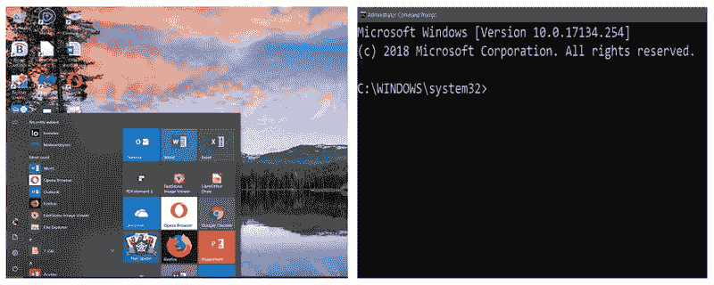

图形用户界面（左）和命令行界面（右）示例

# 内存管理

操作系统，无论是网络操作系统还是其他类型，都负责为用户或系统启动的程序分配内存。当用户启动一个不属于操作系统内核的进程或程序时，也就是说，这个程序已经在内存中（很可能是这样），它会从二级存储复制到主内存中分配的空间。分配的内存空间作为程序指令和数据的存储区域，在将这些数据传递到缓存内存和 CPU 之前和之后。

# 动态加载和链接

操作系统通常将较小的程序（仅由一个模块组成的程序）和数据块完全加载到内存中。然而，较大的程序，特别是那些有多个模块的程序，无法完全适应可分配的内存空间，因此操作系统使用一种叫做动态加载的过程。**动态加载**会先加载程序的第一个模块，即包含第一条指令的模块，然后在需要时将其他模块加载到同一空间中。

另一种内存管理方法是**动态链接**。许多程序，尤其是那些采用**面向对象编程**（**OOP**）的方法，具有相关联的定义、方法和函数库。程序执行时，操作系统会创建一个链接，将模块中调用的任何对象与其在库中的定义相连接以进行执行。这避免了将整个库加载到内存中的需要。

# 内存分配

内存分配是操作系统用于分配和分配内存空间给程序的过程。通常，内存分配过程有四种方法：

+   **首次适配**：内存可用表中第一个足够大以满足程序或模块需求的内存空间块

+   **下一个适配**：紧接着上一个分配内存块之后的下一个内存空间块，满足程序或模块的需求

+   **最佳适配**：足够大以满足程序或模块需求的最小可用内存块

+   **最差适配**：任何可用的内存块，大小大于程序或模块的需求

操作系统的内存管理功能可以采用前述的任何内存分配方法。无论如何，内存分配要么是静态的，要么是动态的。编译器通常确定程序及其模块的**静态分配**。**动态分配**是灵活的。动态加载和链接是两种动态内存分配的方式。

# 硬件的控制与协调

操作系统能够通过计算机的 BIOS 与一些设备（例如键盘）进行通信，因为有标准的设备使用简单的标准命令集。然而，许多设备和组件具有独特的命令和指令集，这些命令和指令集通常与其他设备不兼容。操作系统几乎不可能包含与计算机上安装的每种内外部设备的所有型号和品牌通信所需的命令。因此，设备驱动程序软件，针对特定设备的品牌或型号，充当操作系统与设备控制器之间的中介。设备驱动程序使操作系统能够协调硬件组件和设备的操作。

一些硬件设备驱动程序在操作系统中，而一些则在**基本输入输出系统**（**BIOS**）和**互补金属氧化物半导体**（**CMOS**）中，还有一些位于主板芯片组中。然而，大多数情况下，设备驱动程序的安装发生在计算机上安装相关设备之前或之后。有些设备软件程序协助设备配置和设备驱动程序的安装。

# 系统资源的使用

操作系统与设备驱动程序的通信比仅仅传输数据更加复杂。*设备驱动程序或操作系统如何知道需要执行某个操作？* *它们如何相互通信，表示请求的操作已经完成，如果涉及数据，数据在哪里？*

**系统资源**是最常见的答案。系统资源实际上是计算机中任何可寻址的元素。系统资源是主内存 (RAM) 的一部分，专门用于操作系统与设备之间的交互。系统资源还可以由 CPU、主板、芯片组及其他系统组件提供。然而，与设备控制和通信相关的系统资源是那些位于 RAM 中的资源。

系统资源分为四类：

+   **中断请求 (IRQ)**：在教室或小组会议中，如果你想提问，可能会把手举过头顶并等待被认出。IRQ 的工作原理基本相同——当设备或操作系统需要 CPU 执行某个任务时，它通过设置一个分配好的 *IRQ 开启*，就像是 *举手* 一样。CPU 会频繁检查 IRQ，如果发现某个 IRQ 已被开启，CPU 就会中断当前的任务，去处理这个请求，这也是 “中断” 一词的来源。任务完成后，IRQ 会被设置为 *关闭*。以下截图展示了 Windows 系统上的 IRQ：

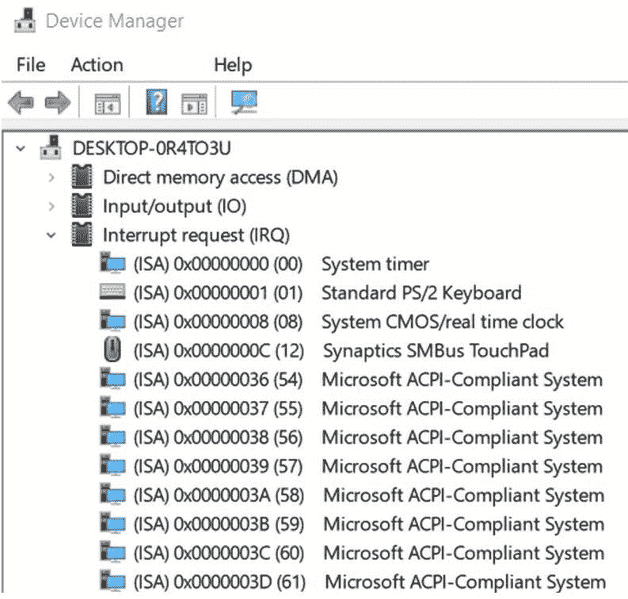

Windows 系统的 IRQ 分配

+   **I/O 地址**：计算机上每个安装的 I/O 设备都有一个或多个分配给它的地址。这个地址有多个名称，包括 I/O 端口、端口地址，或简称 *端口*，用于特定地指定一个设备，并不是内存中的地址。这个地址就像是房屋的街道地址。主板的地址总线在 I/O 地址和内存地址之间切换。当总线设置为 I/O 地址时，硬件设备控制器会监视总线上的各自地址。如果设备看到自己的 I/O 地址，它就会做出相应的回应。以下截图展示了 Windows 系统的 I/O 地址分配：

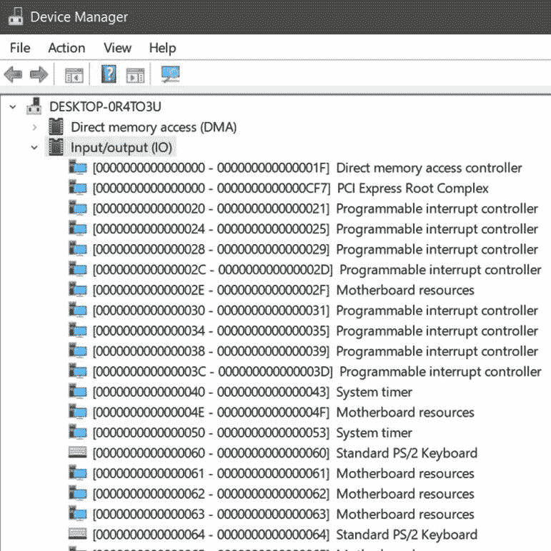

Windows 系统的 I/O 地址分配

+   **内存地址**：除了 I/O 地址外，I/O 设备还可以被分配一块内存作为数据缓冲区或临时存储空间。并不是每个设备都会得到一个内存地址，且分配的空间也不会很大。正如以下截图所示，某些物理和逻辑设备有多个内存地址分配：

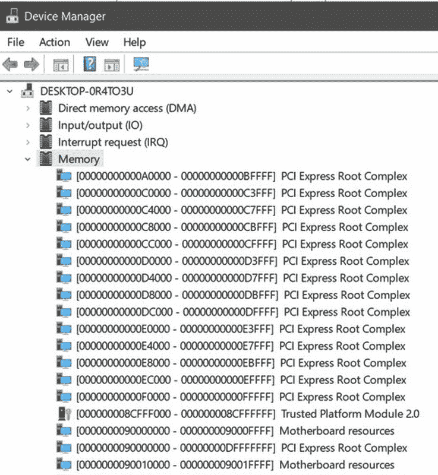

Windows 系统的内存地址分配

+   **直接内存访问 (DMA) 地址**：DMA 设备是计算机的 I/O 或存储设备，能够直接从主内存读取和写入数据。DMA 传输不涉及 CPU，从而使 CPU 可以处理其他任务：

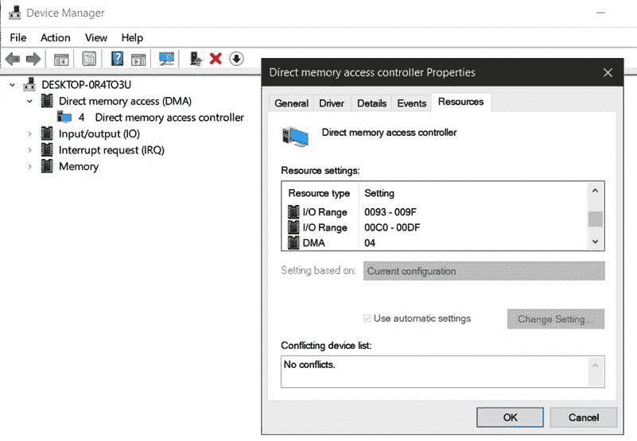

Windows 系统中 DMA 设备的属性对话框

以下截图展示了一个开源实用程序，可用于检查 Linux 系统的信息，包括系统资源：

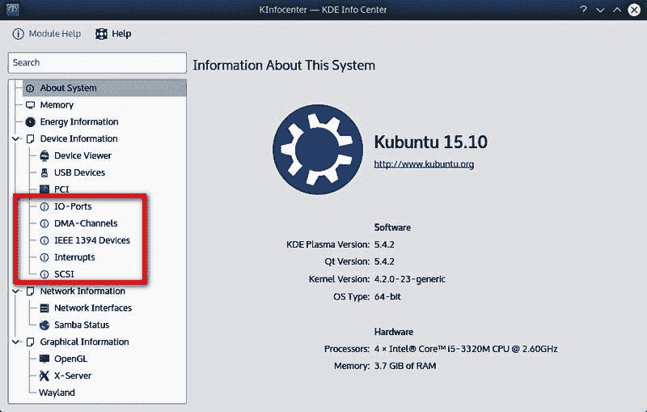

KInfocenter 提供关于 Linux 系统的信息，包括系统资源

# 内部和网络文件管理

数据文件的管理，无论是在内部存储设备、网络附加存储（NAS）还是存储区域网络（SAN）中，都是操作系统的主要功能。文件管理包括数据单元的创建、修改、传输和删除，这些数据单元以完整块的形式存储。在执行文件管理时，操作系统与硬件控制器、驱动程序软件，甚至可能与数据管理系统（如数据库管理系统 DBMS）进行交互。

操作系统的文件管理功能执行的任务包括以下内容：

+   创建新数据文件并记录它们在存储介质上的位置

+   提供修改数据文件的功能，并在必要时进行重新定位

+   执行删除数据文件及其所有引用

+   将数据文件组织到文件系统、目录或文件夹中，以便于访问

+   促进多个用户访问数据文件

# 用户、数据、应用程序和资源安全

操作系统的安全条款包括操作系统为实现和维护**机密性、完整性和可用性**（**CIA**）而应用的规则、功能、过程和设置。组织的安全政策必须包括对操作系统及其物理和环境安全的保护，包括防盗、防损坏或防销毁。然而，操作系统安全的主要关注点必须是执行规则并执行防止未经授权入侵或干扰的任务。

操作系统的安全性要求某些活动成为正常操作的一部分，包括以下内容：

+   执行补丁和更新管理

+   应用防病毒和恶意软件更新

+   检查所有网络流量，进出流量，通过防火墙和/或其他安全设备

+   定期检查和管理用户及组账户的权限和权限

# 硬件配置

要理解操作系统与硬件配置设置和规范之间的关系，你需要明白，操作系统天生是简洁的，而硬件则笨拙。操作系统的很大一部分工作是使硬件看起来比实际更为简洁。

在接下来的部分中，我们将探讨操作系统、其各个部分，以及它与硬件的关系。

# 操作系统的主要部分

一个操作系统有三个主要部分：

+   **内核**：现代操作系统是模块化的，这意味着大多数基本服务，如内存管理、I/O 处理和 CPU 交互，都包含在启动时加载并保持在内存中的模块——**内核**。其他功能和工具根据需要加载到内存中。如以下图所示，操作系统内核有两种类型——**单体内核**和**微内核**。单体操作系统，如 Windows、macOS 和 Linux，包含计算机和用户启动软件所需的基本功能。正如以下图所示，微内核操作系统将对用户启动程序的支持推向用户空间。目前，尚未有广泛使用的微内核系统：

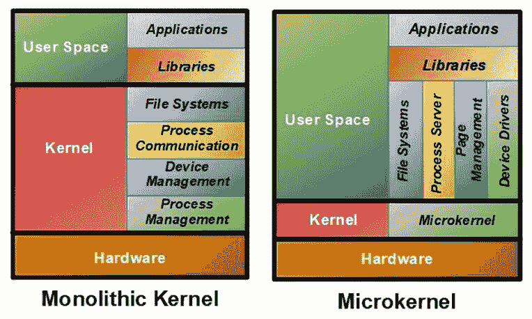

两种类型的操作系统内核

+   **Shell**：操作系统 shell 是一个程序，操作系统启动它来提供用户界面，通常以命令行界面（CLI）的形式，如下图所示。在 UNIX/Linux 系统中，有几个 shell，每个都有自己的一组命令和功能，如 **Bourne-Again Shell**（**Bash**）、C shell 和 Korn shell。在 Windows 系统中，桌面上显示的 GUI 代表了一个 shell。Windows 命令提示符也代表了一个 shell：

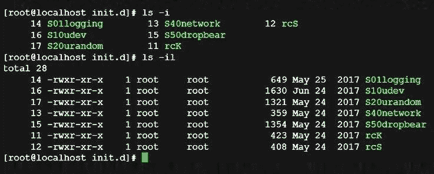

在 Linux shell 的命令提示符下输入的命令

+   **文件系统**：当你创建一个文件并将其存储到硬盘时，你会假设将来能够找到它。文件系统维护文件或数据块在磁盘驱动器上的物理位置，并保持位置与文件名的交叉引用索引。文件系统以目录、文件夹、文件和对象的形式组织数据存储。常用的文件系统有 Windows 的 NTFS 和 Linux 系统的 ext3 和 ext4。

# 操作系统与硬件

计算机硬件、软件和固件的配置指定了其功能和操作的参数和设置。计算机 BIOS 或 **统一可扩展固件接口**（**UEFI**）、操作系统和支持系统中的硬件配置设置，定义了计算机的启动、已安装的设备以及若干性能和操作参数。

不是每个程序或应用程序都会使用计算机上的每个硬件组件。任何程序使用的硬件将取决于其功能和目的。如果一个程序只接受两个数字从用户输入，将它们相加并将结果显示到显示设备，而不存储结果，那么程序的需求和用户的操作会影响所使用的硬件。在这个特定的情况下，所涉及的硬件如下：

+   **HDD**：程序加载到 RAM

+   **RAM**：程序被分配了一个指定空间，指令被传递给 CPU

+   **CPU**：指令被执行

+   **显示**：结果被传递给控制器并显示

当然，操作系统是引导该顺序的催化剂，但在此过程中，操作系统只涉及完成任务所需的硬件。那么，*操作系统如何知道它可以使用哪些硬件呢？* 这就是 BIOS/UEFI 存储在 CMOS 中的内容。这些信息为操作系统提供了它可以使用的硬件设备列表，以及如何以及在哪里访问每个设备。

# 引导顺序

计算机系统启动的一个主要部分，即其启动过程，是将操作系统内核加载到 RAM 中，以便 CPU 能将控制权交给操作系统。为了执行此过程，引导程序必须知道在哪里查找操作系统，这可以是 HDD、CD、闪存驱动器或任何可启动设备。在 BIOS/UEFI 设置中，可以设置引导过程应查找设备的顺序，以定位**主引导记录**（**MBR**）。引导程序将按照优先顺序查看每个设备，并从第一个找到引导信息的设备启动计算机。以下截图显示了一个简单的 UEFI 引导顺序列表：


UEFI 配置的引导优先级对话框

# 固件

自计算机诞生以来，我们根据计算机指令和组件的存放位置或其一般特征对其进行分类。我们能触摸和感受到的组件是*硬件*。那些我们不能实际触摸、感受或持有，但可以改变的，则称为*软件*。然而，在计算机系统中，有一个我们无法触摸、感受或改变的组件，特别是在老式系统中。这个组件存在于硬件和软件之间，我们称之为*固件*。

我们今天所说的固件可以分为两种主要技术：

+   **BIOS**：一种传统技术，它使用在制造过程中永久加载（*烧录*）到半导体中的数据和指令。这些指令启动 BIOS 开始启动过程并加载引导程序以完成启动过程。这种低级别的固件形式是主板的一部分，属于**只读存储器**（**ROM**）/**可编程只读存储器**（**PROM**）、**一次性可编程**（**OTP**）和**可编程逻辑阵列**（**PLA**）芯片。

+   **UEFI**：这项新技术正在取代大多数计算机上的 BIOS，但基本上执行相同的功能。事实上，UEFI 依赖 BIOS 来进行**开机自检**（**POST**）功能和配置规范（通常称为 CMOS）。几乎所有 2010 年以后生产的计算机都具有 UEFI，有些还包含 BIOS。以下截图显示了包含 BIOS/UEFI 设置的系统信息：

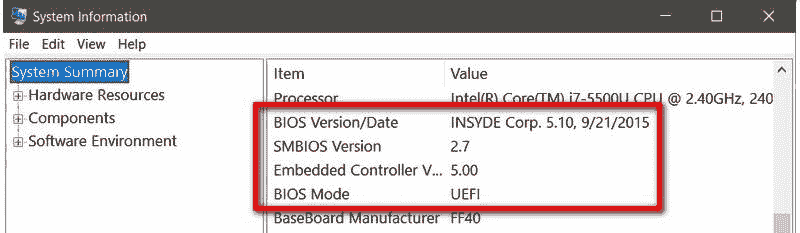

系统信息对话框中的 BIOS/UEFI 设置

尽管固件通常是*永久*的，但大多数计算机系统的固件是可以升级的。具体的操作流程因主板制造商、操作系统或系统的年代不同而有所差异，但以下步骤通常是用来更新系统固件的过程：

1.  验证你是否正在安装更新版本的 UEFI/BIOS。在 Windows 系统中，运行`MSINFO32`。在 Linux 系统中，如果`/sys/firmware/efi`目录存在，则系统正在使用 UEFI。如果该目录不存在，则系统正在使用 BIOS。记录版本号和日期，并将其与主板制造商网站上的信息进行比较。

1.  启动计算机，当显示屏提示按哪个键进入 UEFI/BIOS 设置时，按下该键。某些系统在 UEFI/BIOS 工具中包括固件更新功能。

1.  如果没有更新工具，下载并解压更新文件，并将其存储在 USB 闪存驱动器或外部硬盘驱动器上。

1.  重启系统并在 UEFI/BIOS 设置页面访问固件更新或闪存工具。将现有固件备份到外部驱动器，以防更新过程中出现问题。

1.  使用固件更新工具，选择更新的版本镜像并开始更新。升级过程应该只需几分钟，但无论如何，在升级过程完成之前，绝对不要重新启动、关闭或断电计算机。

# 准备操作系统的磁盘

安装新版本的现有操作系统或完全更换操作系统有两种方法。如果你继续使用相同的操作系统并仅安装一个更新版本，例如将 Windows 10 升级到 Windows 某版本，你可以选择执行更新，或者进行所谓的**全新安装**。本质上，全新安装会删除旧版本中任何过时或不再适用的元素，并将其替换为新版本。全新安装也可以意味着硬盘驱动器是新的，且安装在*全新的*磁盘驱动器上。从一个版本升级到另一个版本意味着不需要进行全新安装，安装将使用发布商的安装程序或设置程序。另一方面，如果你是用一个操作系统替换另一个操作系统，例如将 Windows 替换为 Linux，那么在安装新操作系统之前有一些事项你需要了解，并且需要采取一些步骤。

准备硬盘驱动器的方法取决于系统配置和使用的启动过程。BIOS 创建 MBR，而 UEFI 创建**GUID 分区表**（**GPT**）。MBR 创建传统的 BIOS 分区表，而 GPT 创建 UEFI 分区表。GUID 是微软术语，表示**全球唯一标识符**，仅适用于其系统。其余操作系统世界使用术语**通用唯一标识符**（**UUID**），其结构与 GUID 基本相同。GPT（UEFI）系统能够在 HDD 上定义和创建超过四个分区，并且如果磁盘驱动器为 4TB 或更大，则必须使用 GPT。低于这些阈值时，如果存在，MBR（BIOS）系统仍然有效。以下截图展示了 Windows 系统硬盘的分区表类型：

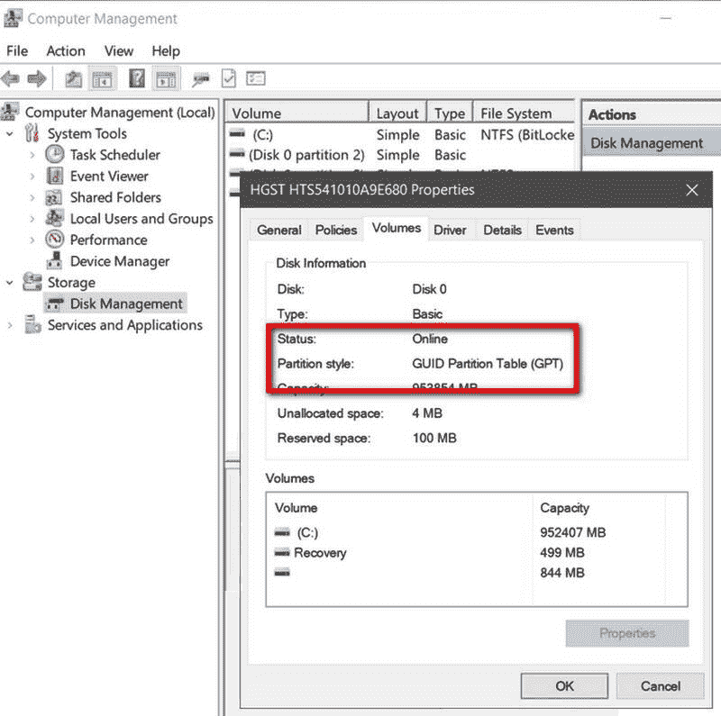

显示硬盘驱动器（HDD）分区样式的属性对话框

以下步骤是为安装操作系统准备磁盘的常规过程：

1.  验证进行安装的计算机是否符合或超过操作系统发布者发布的系统要求。

1.  如果硬盘驱动器上有你希望保留的数据，请将整个系统备份到外部介质，如外部硬盘驱动器或云服务。

1.  如果你希望从 Windows 系统上的硬盘驱动器中删除所有之前的数据和内容，请使用磁盘管理格式选项。在 Linux 系统上，使用`fdisk`命令。

1.  使用磁盘管理工具或在 Windows 命令提示符下使用`DISKPART.EXE`命令创建安装所需的磁盘分区。以下截图展示了`DISKPART`命令的示例。在 Linux 系统中，使用`fdisk`命令。

1.  创建分区后，将其格式化为适当的分区表标准：

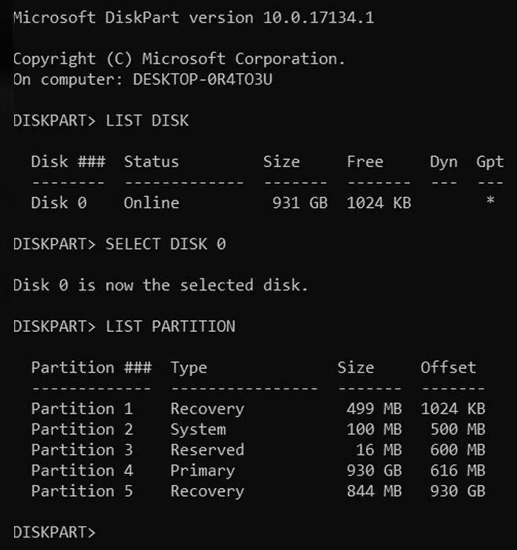

显示 DISKPART.EXE 命令

# 文件系统

当你将数据存储在硬盘驱动器（HDD）、USB 连接存储设备或任何其他数据存储设备时，它需要有一个组织结构，以便将来能够找到单个文件。文件系统组织并结构化存储介质，并跟踪存储在其上的文件。除了位置外，文件系统还会为每个文件目录化标识数据，包括文件名、大小、状态、创建和修改日期、访问权限、所有权、文件类型等。

# 格式化

文件系统在数据存储设备上的位置，可能有多个分区或只有一个大分区，是通过格式化过程完成的。每个分区可以拥有不同的文件系统。格式化一个驱动器通常会执行三件事：识别一个分区作为一个有界结构；删除（擦除）分区中的所有现有数据和索引（如果有的话）；并在分区中初始化一个文件系统及其索引。每个主要操作系统都有一个格式化磁盘驱动器分区的工具：**Windows 磁盘管理**、**Linux 的 GParted**和**Mac OS 磁盘工具**。

# 操作系统下的文件系统

在 Server+ 考试中，您将遇到有关 Windows、Linux 和 macOS 文件系统的问题和参考资料。以下是包含的文件系统：

+   **Windows**：

    +   **文件分配表 32（FAT32）**：曾一度是 Windows 系统的默认标准，主要用于闪存驱动器的格式。

    +   **新技术文件系统（NTFS）**：Windows 系统的默认文件系统。Windows 系统分区必须使用 NTFS。

+   **Linux/Unix：**

    +   **更好的文件系统（Btrfs）**：为 Linux 添加了池化、快照、校验和等功能。

    +   **扩展文件系统版本 2、3 和 4（ext2、ext3 和 ext4）**：基于**Unix 文件系统**（**UFS**）的文件系统，用于追踪单个文件。

    +   **Reiser 文件系统（ReiserFS）**：为 Linux 提供的一个日志文件系统。

    +   **Z 文件系统（ZFS）**：最初为 Solaris 操作系统开发，Linux 系统常常支持 NAS。

+   **Mac OS：**

    +   **苹果文件系统（APFS）**：在后期的 Mac OS X 系统中替代了 HFS+ 操作系统。

    +   **分层文件系统 Plus（HFS+）**：旧版 Mac OS 系统的事实标准文件系统。

# 日志记录

有些文件系统执行日志记录操作，而有些则不执行，尽管大多数这类文件系统属于遗留文件系统。日志文件系统在将更改应用到介质之前，会将文件系统更改记录到一个*日志*中，日志实际上是一个文件系统活动日志。通常，日志文件会存放在一个独立于文件系统的设备上。如果文件系统损坏，日志文件提供恢复数据。日志文件系统的示例包括 NTFS、ReiserFS、ext3 和 ext4。

# 特殊功能文件系统

有时，一个文件系统实际上并不完全是文件系统，而是可能执行某些文件系统功能。**虚拟机文件系统**（**VMFS**）与虚拟化系统的虚拟机监控器一起工作，用于存储和管理虚拟机的快照和镜像。交换空间，也称为**交换空间**，是操作系统用来将不活跃的内存页存储到二级存储设备的专用分区中，从而释放内存资源（根据需要）。**闪存友好文件系统**（**F2FS**）是一个开源的闪存驱动器文件系统。

# 网络配置

安装和激活任何网络操作系统（NOS）的一个重要步骤是为其配置支持的网络。在接下来的章节和步骤中，我们将介绍配置 Windows Server 系统和 Linux 系统的一些重要设置和值的过程。

# 配置主机名

服务器（或任何网络节点）的主机名用于标识该节点，以便计算机网络能够与其他节点进行通信并访问网络外的设备和服务。实际上，设备的主机名就是其昵称。

# 在 Windows Server 上配置主机名

设置 Windows Server 安装的主机名，请按照以下步骤操作：

1.  点击 Windows 图标以显示开始菜单。

1.  右键点击“此电脑”选项以显示系统窗口。

1.  在系统窗口的右侧，点击“更改设置”按钮以显示系统属性对话框：

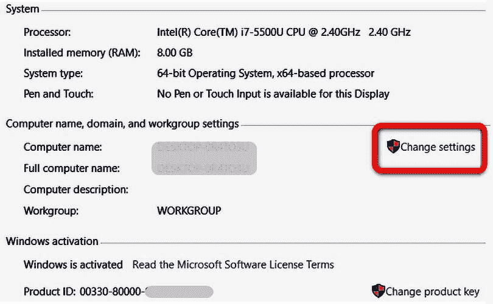

该电脑选项的属性窗口

1.  在计算机名称文本框中输入你希望分配给服务器的名称。唯一的硬性规定是名称中不能有空格：

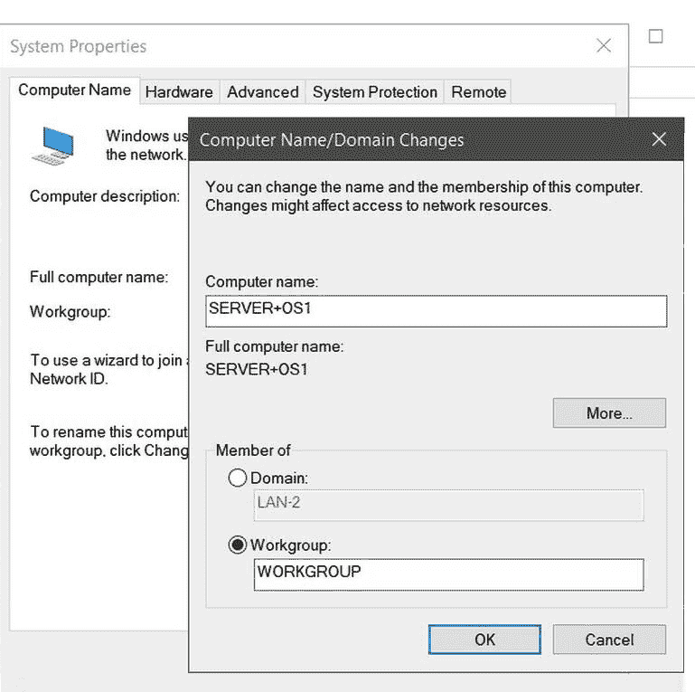

为系统分配主机名

# 在 Linux 服务器上配置主机名

在 Linux 服务器上，有两个主机名需要配置：一个与网络相关的主机名和一个本地主机名。设置主机名的步骤如下：

1.  以 root 管理员身份（超级用户）登录系统。

1.  进入`/etc/sysconfig`目录，查找网络文件并显示其内容，应该如下所示：

```
# cat network
NETWORKING=yes
NETWORKING_IPV6=no
HOSTNAME=localhost.localdomain
```

`cat`命令显示文件网络的内容。注意文件的最后一行包含主机名设置。

1.  使用 Linux 编辑器（如 vi 或 edit）将`HOSTNAME`值更改为你希望使用的主机名。编辑完成后，保存文件。

1.  编辑后的文件现在应包含更新后的主机名值。例如，网络文件现在可能包含如下内容：

```
# cat network
NETWORKING=yes
NETWORKING_IPV6=no
HOSTNAME=server+os1
```

1.  `localhosts`文件中的主机名也需要设置。进入`/etc`目录查找`hosts`文件。其内容应该类似如下：

```
# cat hosts
127.0.0.1 localhost.localdomain localhost
::1 localhost6.localdomain6 localhost6
```

1.  使用编辑器，将`localhost.localdomain localhost`值替换为新的主机名，并保存文件。更改后，hosts 文件应包含如下内容：

```
# cat hosts
127.0.0.1 server+os1
::1 localhost6.localdomain6 localhost6
```

1.  你可能还想将终端身份设置为服务器的主机名。局域网使用终端名称来定位服务器。要更改终端的主机名，请使用`hostname`命令：

```
# hostname server+os1
```

要验证更改，使用不带参数的`hostname`命令。

# 用户账户

在 Windows Server 系统中，用户可能有一种或两种账户类型：本地账户或域用户账户。**本地用户账户**仅限用户访问在单个网络节点上，由文件和文件夹权限授予访问权限的资源，或任何该用户是其成员的组资源。**域用户账户**可以根据为用户或用户所在组分配的访问权限访问本地资源、网络资源或两者。

# 创建本地用户账户

在 Windows Server 上设置本地用户账户，按照以下步骤操作：

1.  右键点击开始图标或按 Windows 键 + *x* 打开开始右键菜单。

1.  选择“计算机管理”选项以显示其窗口。

1.  在左侧导航窗格中，点击“本地用户和组”选项下的“用户”。然后会显示如下截图所示的视图：

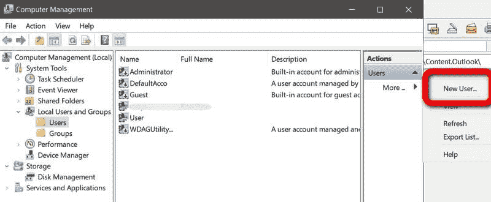

通过计算机管理窗口添加新用户

1.  在右侧的操作面板中，点击“更多...”打开选项列表。在该列表中，点击“新建用户...”打开新用户对话框：

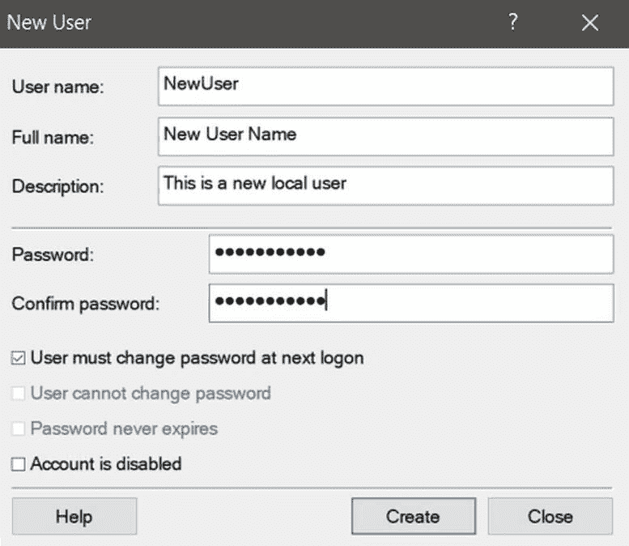

新用户对话框

1.  填写新用户的信息并点击“创建”按钮。对话框将清空并准备好使用，以便你可以添加其他用户。如果完成，点击“关闭”。注意，新的用户现在已经出现在计算机管理窗口的用户列表中。请记住，本地用户账户的密码无法恢复，因此你可能需要提醒用户使用他们能记住的密码。

如果新用户需要管理员权限或属于其他组，请使用以下步骤将该用户添加到适用的组：

+   +   1.  在计算机管理窗口的中心窗格中，右击新用户的名称，并从出现的选项列表中选择“属性”，以显示该用户的属性对话框：

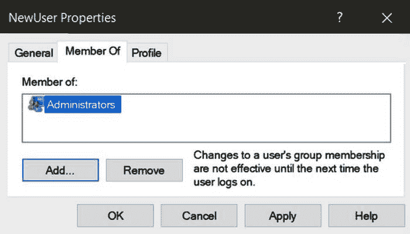

在用户属性对话框中将用户添加到一个组

+   +   1.  从“成员：”列表中点击一个组名，这里是“管理员”，然后点击“添加”。你可以重复此操作，将用户添加到更多组中。

# 创建域用户账户

创建域用户账户假设网络中至少存在一个域。在 Windows 环境中，**域**是一个网络，其中一个中央域控制器的数据库包含所有域用户账户、安全配置以及网络中硬件设备的信息。网络的**活动目录**（**AD**）服务管理域用户账户。要在 Windows Server 系统上创建新的域用户账户，请按照以下步骤操作：

1.  从开始菜单中，打开**服务器管理器**并下拉“工具”菜单。

1.  在“工具”菜单中，选择“活动目录用户和计算机”选项，显示其对话框。

1.  在左侧导航窗格中，点击“用户”文件夹。在出现的选项列表中，点击“新建”。在其选项列表中，点击“用户”以显示“新对象 - 用户”对话框，如下图所示：

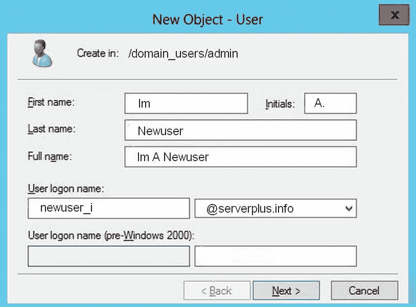

新对象 – 用户对话框

1.  填写新用户的信息后，点击“下一步”按钮，进入另一个“新对象 – 用户”对话框并输入用户的密码。点击“下一步”进入“新对象 – 用户”摘要对话框。

1.  如果显示的所有信息正确，请点击“完成”按钮。如果需要更正，使用“返回”按钮。

# 将工作站添加到域

要在任何网络上进行通信，PC 必须加入该网络，这意味着 PC 的网络接口必须连接并加入到网络服务器的管理系统中。在 Windows 系统中，PC 加入域。将 PC 添加到域的过程如下：

1.  在控制面板上，点击“系统”选项，并在左侧面板的选项中选择“关于”。

1.  点击“加入域”按钮会打开第一个域识别对话框。

1.  在接下来的步骤中，你将看到三到四个“加入域”对话框。第一个对话框，如下图所示，会询问你要将 PC 添加到哪个域。如果域名有效，请输入你（个人）用于登录该域的用户名和密码。在系统验证你输入的信息时，可能会显示第一个屏幕的空白副本：


域名对话框

1.  如果你输入的信息有效，下一步的对话框将询问将使用此 PC 的人的用户名以及用户的账户类型，例如管理员、用户、标准用户等。

# 连接到网络

将 PC 加入域是一回事，但将 PC 实际连接到网络进行主动通信则是另一回事。一旦 PC 进入域，下一步就是验证所有电子设备是否同步并能相互操作。换句话说，*PC 能与网络进行通信吗？*

当然，用于网络通信的介质确实会影响网络通信的设置，正如你所预期的那样。然而，你会惊讶地发现，实际影响其实非常小。无论是物理电缆还是**射频**（**RF**）通信，它们主要都是以以太网为基础的网络。

# 将 PC 连接到网络

为了确保 PC 能连接到网络，需要在测试通信之前验证必要的元素是否已激活。第一个要检查的元素是连接服务。通过电缆连接的网络需要将“有线自动配置”服务的启动类型设置为自动，如下图所示。如果工作站连接到无线局域网，则应设置 WLAN 自动配置服务；如果工作站连接到无线广域网，则需要配置 WWAN 自动配置服务。无论这三种网络服务中的哪一个被激活，其他两个都应该被禁用：

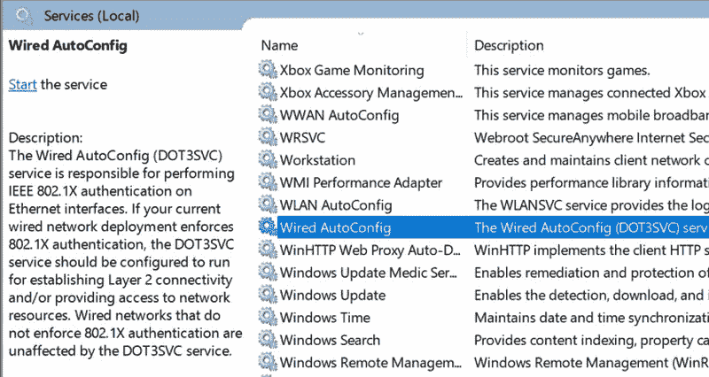

Windows 服务维护窗口

# 添加服务器角色和功能

服务器角色是一个或多个程序或工具集，服务器可以使用它们为用户、计算机组或应用程序提供特定的功能或服务。服务器角色和功能确定了服务器的目的或角色。例如，一个 Windows 服务器可能只有单一的角色，或者配置为 AD 域服务器，或者它可能具有多个不同的角色。

若要在 Windows Server 系统中添加或移除角色和功能，请按照以下步骤操作：

1.  在 Windows Server 系统上，打开服务器管理器。

1.  点击“管理”菜单选项，然后选择“添加角色和功能”，如以下截图所示，打开“开始之前”页面，进入添加角色和功能向导。此页面列出了一系列在添加、修改或删除服务器角色和功能之前，您应该考虑执行的任务：


Windows 2012 R2 系统的服务器管理器页面

1.  点击“下一步”以进入选择安装类型页面。选择基于角色或基于功能的安装选项。点击“下一步”按钮以继续。

1.  在“选择目标服务器”页面，点击左侧导航窗格中的“服务器选择”选项，然后从网络中选择一台服务器或虚拟硬盘。

1.  点击“下一步”进入选择服务器角色页面，如以下截图所示。在此页面的主要区域中，列出了分配给在前一步中选择的服务器或虚拟磁盘的角色和功能列表。完成选择后，点击“下一步”进入选择功能页面。根据所选角色，可能会首先显示“角色服务”页面：

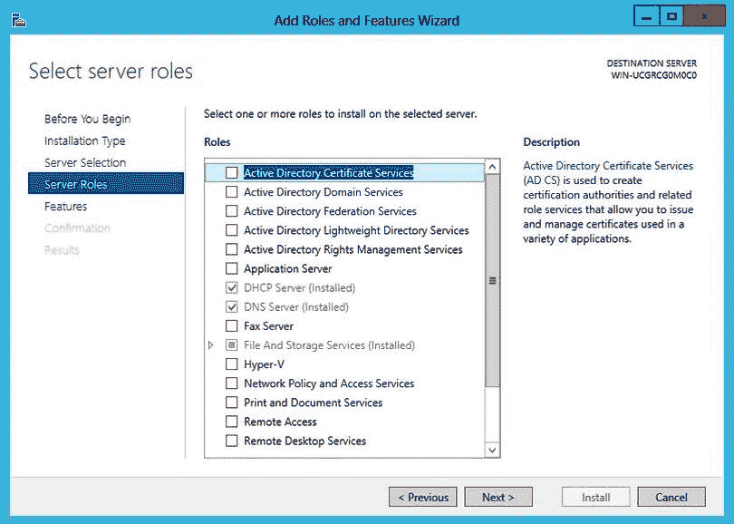

添加角色和功能向导的选择服务器角色页面

1.  在“选择功能”页面，选择任何您希望添加到目标服务器的功能。完成后，点击“下一步”按钮进入安装进度页面，页面中包含所选角色和功能的摘要，如以下截图所示。如果列表正确，点击“下一步”按钮进入安装页面并开始安装过程：

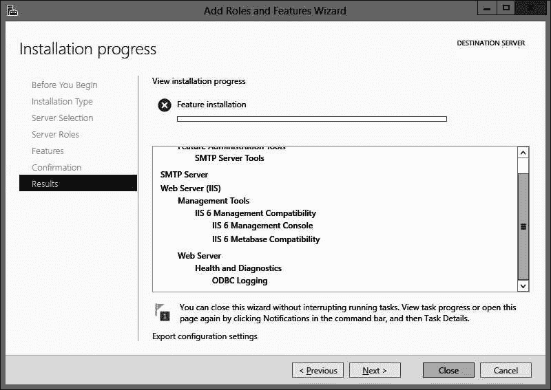

添加角色和功能向导的安装进度页面

1.  安装完成后，点击“关闭”返回服务器管理器。

# 无人值守和远程安装

网络管理员经常需要因各种原因访问远程计算机。网络管理员面临的常见任务之一是软件升级，包括操作系统或运行诊断工具。过去，这些任务需要通信行业所称的*拖车访问*，即到远程位置进行实地访问。如果远程指的是大楼内其他地方，通常不会有太大问题。然而，如果远程指的是另一个州、国家或大陆，所需的时间和成本可能会显著增加。目前有许多不同的标准、软件和技术，可以让网络管理员在无需离开办公桌、只需访问网络工作站的情况下进行这些更改。

其中第一个工具是英特尔的**Wired for Management**（**WfM**）规范，它允许网络管理员创建自动化程序，通过网络完成客户端的维护和管理。你还可以与其他工具配合使用，例如**LANDesk 客户端管理器**（**LDCM**），它是一个监控网络客户端硬件问题的软件工具，以及**桌面管理接口**（**DMI**），它是一个**应用程序编程接口**（**API**），允许软件对网络客户端进行清单管理，比如查看客户端的主板、扩展总线卡和应用软件等细节。

另一个与 WfM 配合使用的工具是**预启动执行环境**（**PXE**），发音为*pixi*。PXE 使得网络管理员能够通过仅与客户端启用 PXE 的**网络接口卡**（**NIC**）或网络适配器交互，从服务器启动网络客户端。即使 PC 关闭电源，PXE 客户端也能通过其 NIC 连接到网络。PXE 客户端不需要操作系统或任何其他软件，即使它在客户端上，也无需这些就能进行远程启动。网络管理员可以使用如**简易文件传输协议**（**TFTP**）等工具将软件或数据传输到客户端。

Windows 系统和 Linux 系统大多数都提供 PXE **网络启动程序**（**NBP**）。Windows 系统提供**远程安装服务**（**RIS**），该服务集成了 PXE 标准。Linux 系统支持**PXELINUX**和**gPXE**工具。

# NOS 优化

网络用户期望网络能够满足他们在带宽、速度和响应性方面的个性化需求。这三个期望对于用户来说是一个整体——一个持续稳定运行的网络，能够提供他们所期望的服务。网络管理员可以使用多种流程、技术和方法，在任何层级上促进网络的效率和效果。

网络管理员确保网络始终满足用户需求的一些方法包括：

+   **带宽**：网络管理员充分理解，10 Gbps 的网络并不意味着用户，无论是单独还是集体，都能享受到如此大的带宽。每个网络在提供可用网络的同时，必须考虑带宽损失。对于用户来说，网络管理员的主要工作是保持高带宽，以满足每个人的需求。

+   **高可用性和容错性**：正如本章前面讨论的，高可用性（HA）和容错性可以是用户依赖的网络的关键特性。系统设计时实现的每年 525,600 分钟的可用时间目标，都是重要的设计目标。

+   **负载均衡**：在大型网络和数据中心中，服务器通常是集群或分布式的，负载均衡能够接受多个输入源并将它们分配给多个处理器，从而平衡负载的处理和出站流量。

+   **服务质量（QoS）**：尽管其名称反映了用户如何衡量网络的性能，但 QoS 是指网络通过多种通信方式提供各种服务的能力，能够满足组织的需求。一个支持数据、语音和视频的网络就具备了 QoS。

# 总结

网络操作系统（NOS）为网络客户端和资源提供系统控制和管理功能，并为网络客户端提供管理、安全、资源和其他服务。操作系统有五个主要功能：用户/计算机通信、内存管理、控制和协调硬件、内部和网络文件管理，以及用户、数据、应用程序和资源的安全。系统资源分为四类：IRQ、中断地址、内存地址和**直接内存访问**（**DMA**）地址。

操作系统的文件管理功能包括创建新文件、提供文件修改功能、执行文件删除、组织文件以便于访问，以及促进多个用户的访问。操作系统的安全性要求进行补丁和更新管理、病毒和恶意软件更新、安全设备检查所有流量，并定期审查用户和组账户的权限和权利。操作系统有三个主要部分：内核、外壳和文件系统。文件系统组织存储介质并跟踪存储在其中的文件。它还为每个文件编目标识文件的数据。格式化驱动器会将分区识别为一个有界的结构，删除现有的数据和索引，并在该分区内初始化文件系统及其索引。

BIOS 或 UEFI 中的硬件配置设置、操作系统和支持系统定义了启动、已安装设备以及性能和操作参数。固件是两种通用技术之一：BIOS 和 UEFI。WfM 允许自动化程序通过网络进行客户端维护和管理。DMI 允许软件对网络客户端的硬件和软件进行清单管理。PXE 使网络管理员能够远程启动网络客户端。TFTP 将软件或数据传输到远程客户端。

# 问题

1.  网络服务器的基本功能是什么？

    1.  与互联网通信

    1.  向网络客户端提供服务

    1.  入侵检测与防御

    1.  提供代理服务器功能

1.  以下哪项不是网络服务器的功能？

    1.  管理

    1.  安全

    1.  缓存

    1.  资源分配

1.  以下哪项不是操作系统管理的系统资源？

    1.  IRQ

    1.  I/O 地址

    1.  设备驱动程序

    1.  DMA 地址

1.  操作系统的文件管理功能包括创建、修改和删除数据文件，还包括什么？

    1.  文件可访问性

    1.  限制访问为单个用户

    1.  对所有文件应用加密

    1.  转换文件名

1.  操作系统有三个主要部分。以下哪个不是这些部分之一？

    1.  设备驱动程序

    1.  内核

    1.  Shell

    1.  文件系统

1.  两种最常见的固件系统配置系统是什么？（选择两项）

    1.  CMOS

    1.  BIOS

    1.  FAT32

    1.  UEFI

    1.  APFS

1.  在 Linux 系统上配置的文件系统可能是以下哪种？

    1.  NTFS

    1.  APFS

    1.  BTRFS

    1.  HFS+

1.  哪个标识符用于标识服务器，以便进行通信和访问网络资源？

    1.  用户帐户名

    1.  主机名

    1.  服务器名称

    1.  群组帐户名

1.  在 Windows Server 网络中，网络管理员可以授予域用户哪种访问权限？（选择所有适用项）

    1.  本地计算机资源

    1.  基于服务器的资源

    1.  网络附加资源

    1.  WAN 资源

1.  网络管理员希望开启并启动连接到组织网络的远程 PC。以下哪项服务可以实现这一操作？

    1.  QoS

    1.  DMI

    1.  PXE

    1.  TFTP
