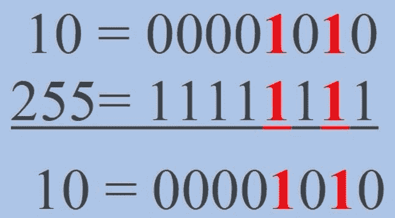
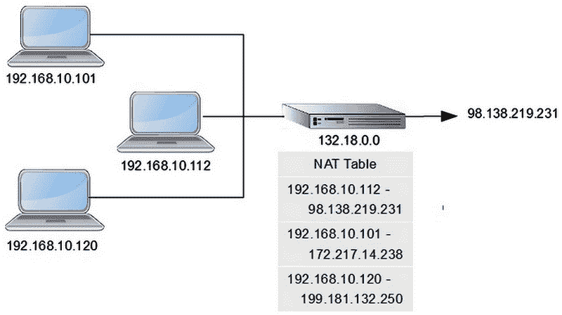
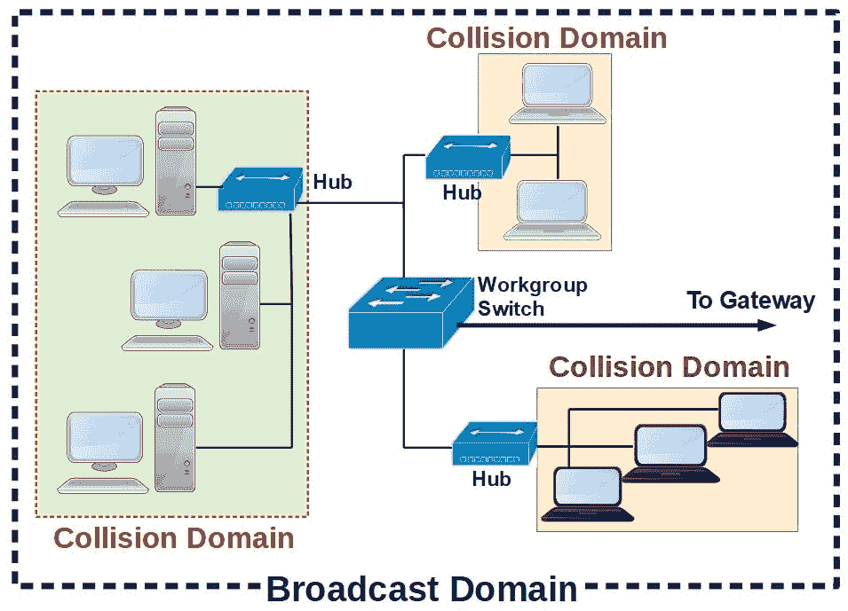
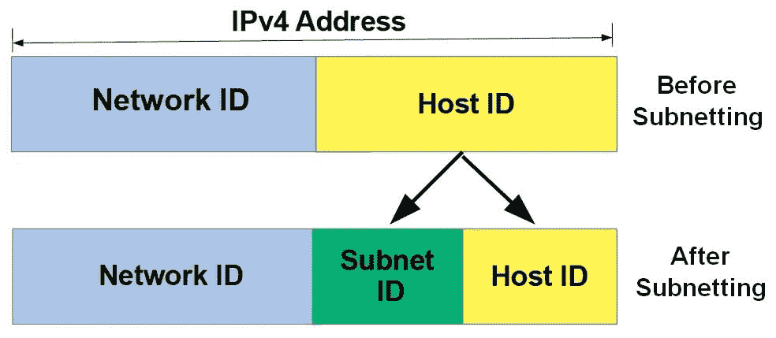
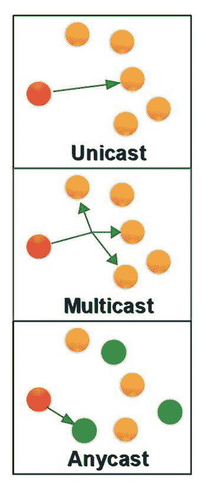
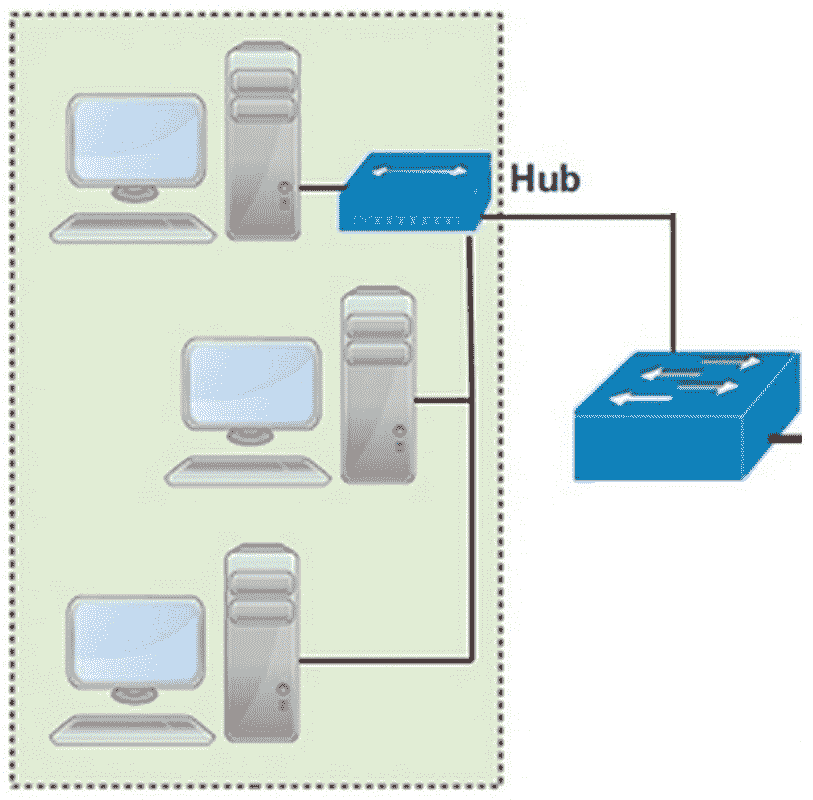

# 寻址

如果仅依靠一般的房屋描述，你很难在大城市中找到一个特定的地址。同样，如果你只知道文件中的内容，计算机的 **操作系统**（**OS**）也会很难为你找到数据文件。

在过去，当次级存储较小的时候，在软盘或硬盘上找到文件相对容易。通过点对点网络连接另一台 PC 也很简单，并不需要太多的地址——只需用到并行端口的内部地址。

然而，在当今庞大的网络和存储技术中，各层次的寻址是计算中的一个基本部分。

本章中，我们将探讨计算和网络中使用的各种寻址方案——它们的结构、表示方式以及目的。我们还将讨论计算机与网络之间的接口，以及提供连接、传输和安全的协议与服务。

我们采用从外到内的方式来进行寻址，从 **互联网协议**（**IP**）寻址开始，最终到 **媒体访问控制**（**MAC**）和端口寻址。

本章将涵盖以下主题：

+   IP 寻址

+   IP 版本 4

+   IP 版本 6

+   MAC 寻址

+   地址解析

+   端口和协议

# IP 寻址

对于 Server+ 考试，我们其实不需要覆盖网络寻址的整个历史，从 50 多年前的分组交换技术发展到今天的 IPv6 寻址。

当 TCP 于 1974 年取代了早期的 **网络控制协议**（**NCP**）时，它既执行数据传输，也负责消息路由。后来，这两项功能被拆分，形成了我们今天所知的 TCP 和 IP，即 TCP/IP 协议套件。

# IP 版本 4

IP 的主要目的是在通过通信链路互联的计算和路由设备网络中提供一条路径，这些设备以非结构化的方式连接。

早期，互联网的一个核心设计特点便是它没有单点故障。这促成了其故意散乱的结构，以及对灵活寻址方案的需求。

TCP/IP 协议经过多年的发展，成为了今天仍然广泛使用的标准。由于开发者面临来自大型通信公司、政府机构以及中小型企业的压力，一个地址类系统被引入，将可用的地址范围划分开来，以便为所有方提供充足的网络地址——至少在最初是如此。

# IPv4 地址结构

我们通常所称的 IP 地址，即 IPv4 地址，由 32 位二进制组成，分为四个八位的八位组（即每组八个比特）。为了方便人类使用，一种名为 **点分十进制** 的格式将二进制地址转换成四个十进制数，每个数字之间用点（句点）分隔。

例如，以下显示了一个 IP 地址的二进制数字版本及其对应的十进制数字：

```
Binary value: 10101001.1110011.00011001.11011010
Decimal value: 169\. 115.25.218
```

每一组四个八位字节代表一个可寻址的网络位置。

一个八位字节可以存储从 00000000 到 11111111 的二进制值，或者在十进制中从 0 到 255。因此，IPv4 地址的总范围从以下地址开始：

```
00000000.00000000.00000000.00000000 (decimal 0.0.0.0)
```

范围可达到以下：

```
11111111.11111111.11111111.11111111 (decimal 255.255.255.255)
```

该范围内有相当数量的地址被预留用于特殊用途。这意味着并不是所有该范围内的地址都可以分配给网络节点。我们稍后会在本节中详细讨论。

# 类别化 IP 地址

如下表所示，IPv4 地址方案包括五种地址类别，尽管只有三种类别已被广泛使用。**D**类和**E**类地址分别为 IPv4 下的多播和研究实验用途预留：

| **地址类别** | **起始地址** | **结束地址** | **网络**地址 | **每个网络的主机数量** |
| --- | --- | --- | --- | --- |
| A | `1.0.0.0` | `126.255.255.255` | 126 | 16,777,214 |
| B | `128.0.0.0` | `191.255.255.255` | 16,382 | 65,534 |
| C | `192.0.0.0` | `223.255.255.255` | 2,097,150 | 254 |
| D | `224.0.0.0` | `239.255.255.255` | 保留用于多播 |  |
| E | `240.0.0.0` | `254.255.255.255` | 实验和研究 |  |

IPv4 地址类别

表格中显示的地址类别简化了地址分配给各种通信、制造、服务、政府机构和希望成为**互联网服务提供商**（**ISP**）的公司的过程。如果一个组织能够基于其网络或商业模式的规模证明其有一定的需求，它将从相应的地址类别中获得一个地址块。

# 局域网地址

然而，像所有美好的事物一样，IPv4 地址（所有 40 亿个地址）很快就开始枯竭。IPv6 正在开发中，但技术和网络管理员还没有准备好进行升级。

因此，为了避免 IPv4 地址的完全耗尽，出现了多种技术来最大化 IP 地址的使用，并尽量减少对额外地址的需求。这些发展包括私有 IP 地址、子网划分、CIDR、NAT、PAT 等。

# 私有 IP 地址

在某个时刻，有人意识到，在组织的网关路由器（边缘路由器）背后的网络附加设备中，**局域网**（**LAN**）中的设备实际上不需要分配公共 IP 地址。大多数局域网流量是在其节点之间传输的，并发生在数据链路层（第二层），使用**媒体访问控制**（**MAC**）子层地址（物理地址）。

但是，*如果一个拥有多个局域网的组织没有足够的公共 IP 地址来为每个网络节点配置独立的 IP 地址，该怎么办？* 找到足够的 IPv4 地址仅是其中一个问题。

尽管它减少了可分配 IPv4 地址池中的地址数量，但仍有三个地址块，分别来自 A、B 和 C 类，被保留用于作为私有地址使用。**互联网号码分配局**（**IANA**）为任何位于网关路由器或**网络地址转换**（**NAT**）设备后的网络指定了私有 IP 地址（稍后会详细介绍）。根据定义，私有 IP 地址是不可路由的。

如下表所示，每个可分配的地址类别（**A**、**B**、**C**）都有一系列私有 IP 地址：

| **IPv4 地址类别** | **私有地址范围** | **可用的私有地址数量** |
| --- | --- | --- |
| A | `10.0.0.0`-`10.255.255.255` | 16,777,216 |
| B | `172.16.0.0`-`172.31.255.254` | 1,048,576 |
| C | `192.168.0.0`-`192.168.255.254` | 65,536 |

IPv4 私有地址

如你所见，每个地址块提供了足够数量的可分配私有地址，几乎适用于所有的局域网。

一个组织也可以将同一组私有地址分配给其两个或更多的网络，只要每个网络都通过路由器或 NAT 设备访问外部网络。

# 网络和主机 ID

IP 地址包含两部分重要信息——网络标识符和主机标识符。每个 IPv4 地址类别使用不同数量的位来表示每个标识符。

下表展示了每个类别中**网络**（**n**）和**主机**（**h**）所使用的位数：

| **地址类别** | **第一字节的高位** | **地址掩码模式** | **网络 ID 位** | **主机 ID 位** | **默认地址掩码** |
| --- | --- | --- | --- | --- | --- |
| A | 0 | `n.h.h.h` | 7 | 24 | `255.0.0.0` |
| B | 10 | `n.n.h.h` | 14 | 16 | `255.255.0.0` |
| C | 110 | `n.n.n.h` | 21 | 8 | `255.255.255.0` |

地址掩码和类别 ID 从 IPv4 地址中提取网络 ID

第一（最左边）八位字节中的高位（最左侧）位或位组合表示 IPv4 地址的地址类。*为什么？* 简单的回答是，从 IPv4 地址中提取网络 ID 需要使用适当的地址掩码。

提取 IPv4 地址的网络 ID 过程是对地址与对应于地址类别的掩码进行按位与（AND）操作。下表展示了执行的步骤：

| **IPv4 地址（十进制）** | `10.25.115.88` |
| --- | --- |
| **IPv4 地址（二进制）** | `00001010.00011001.01110011.01011000` |
| **A 类默认掩码** | `11111111.00000000.00000000.00000000` |
| **网络 ID（二进制）** | `00001010.00000000.00000000.00000000` |
| **网络 ID（十进制）** | `10.0.0.0` |

从 A 类 IPv4 地址中提取网络 ID 的步骤

首先，将`IPv4 dot.decimal`地址转换为二进制。然后，默认的 A 类地址（第一位为`0`）的二进制地址掩码与 IPv4 地址进行按位与（AND）运算。

按位与运算过程比较两个比特，如果两个比特的值都是 `1`，则结果为 `1`。所有其他比特组合的结果为零。例如，在上表中，IPv4 地址的二进制值为 `00001010`，默认的 Class A 掩码的二进制值为 `11111111`。按位与运算比较这两个值；只有当两个比特（上位和下位，地址和掩码）都为 `1` 时，结果才会设置为 `1`。

该操作类似于以下内容：



IPv4 地址和地址掩码的按位与运算

# 网络地址转换（NAT）

由于私有 IPv4 地址不可路由，具有私有地址的局域网节点无法从互联网请求内容。对互联网服务器的任何内容请求都必须包含请求者的 IP 地址。

如果源地址是私有地址，服务器或服务器与请求者之间的任何中间设备都无法知道请求节点所在的 `192.168.0.0` 私有网络。

为了解决这个问题，配置在网关路由器上的 NAT 协议使用公共 IP 地址作为请求者私有地址的别名。NAT 将分配的公共地址和匹配的私有地址之间的配对记录在一个表中。当响应到达时，NAT 使用其源地址（发送方）查找请求者/目标的私有地址，并转发信息。

下图展示了这一过程的各个元素：



NAT 协议的功能元素

虽然图示展示了具有多个别名地址的 NAT 操作，但许多 NAT 实现仅使用一个公共地址（通常是路由器的地址），并以图示相同的方式跟踪请求。

启用单一公共地址使用的主要机制是**端口地址转换**（**PAT**），也称为 NAT 过载。为了区分出站请求，PAT 将一个唯一的端口号应用于请求的局域网节点的私有地址。

# 碰撞域

以太网局域网中常见的两个问题是碰撞和广播消息。碰撞发生在两个（或更多）节点尝试同时在网络介质上传输时，从而有效地破坏了这两个消息。

广播消息是以太网网络操作的正常部分，但减少网络的规模也可以减少这些消息对网络性能的影响。

以太网网络使用一种名为**碰撞感知多重访问**/**碰撞检测**（**CSMA**/**CD**）的程序来检测网络介质上是否发生了碰撞。CSMA/CD 使用退避计时器来错开碰撞节点的重传。在无线网络上，**CSMA**/**碰撞避免**（**CSMA**/**CA**）程序尝试在碰撞发生之前避免碰撞。

无论网络介质是电缆还是无线电频率波，网络节点都必须共享公共介质，并且通常是同时进行。

通过集线器或中继器连接的网络节点组是一个碰撞域。如下面的示意图所示，网络集线器后面的网络段是碰撞域，在这种情况下，网络交换机后面存在三个碰撞域：



局域网中的碰撞域和广播域

事实上，所有在交换机后面的节点都属于一个大的碰撞域。如果这些工作站位于无线网络上，这种情况尤其成立。

# 广播域

另一方面，广播域包括所有能够相互通信的网络节点。在几乎所有网络中，广播域包含了所有碰撞域，如前面的示意图所示。

在计算机网络中，广播基本上与无线电或电视中的广播含义相同。网络节点将消息（通常是请求）广播到整个网络，意味着每个活跃的连接设备。

在大多数情况下，局域网上的广播消息会导致每个接收节点发送出自己的广播消息。这就是网络管理员试图限制广播域整体大小的原因。

广播消息的两个最常见用途如下：

+   **启动**：当你启动或重启计算机时，其操作系统会在网络上发送广播消息，请求其 IP 地址配置。它发送广播消息是因为此时它还没有**动态主机配置协议**（**DHCP**）服务器的地址。如果一切正常，DHCP 服务器只会向请求的节点返回其配置数据。任何具有非常专门功能或设置的计算机可能不使用或不应使用 DHCP 配置。在这些情况下，节点应使用静态配置设置进行配置。

+   **地址解析**：**地址解析协议**（**ARP**）及其镜像协议**反向地址解析协议**（**RARP**）使用广播消息请求网络节点告知它们是否具有某个特定的 MAC 地址（稍后会详细说明），并返回其 IP 地址。请求也可以是反向的，即 RARP 请求某个 IP 地址对应的 MAC 地址。

广播消息携带一个独特的 IP 地址，该地址专门为此目的保留：`255.255.255.255`。当网络设备看到此目标地址的消息时，它们会知道这是广播消息。

# 无类域间路由（CIDR）

另一种表示 IPv4 地址的方法是 CIDR 地址表示法，它消除了大多数对地址掩码的需求。

CIDR（可发音为 *cedar*、*cider* 或 *kidder*，也称为 **超级网络**）表示 IPv4 地址中指定网络 ID 的位数，而不考虑它属于哪个地址类。

例如，标准的 A 类地址具有以下模式：

```
nnnnnnnn.hhhhhhhh.hhhhhhhh.hhhhhhhh
```

这里，*n* 表示网络 ID，*h* 表示主机 ID。

因此，在地址 `101.15.105.10` 中，网络 ID 是 `101.0.0.0`。它的地址掩码是 `255.0.0.0`。该地址以 CIDR 表示法表达为 `101.15.105.10/8`，这表示最左侧的八位是网络 ID。

CIDR 提供了更大的灵活性，使得在不需要额外的 IPv4 地址的情况下扩展网络。

# 子网划分

**子网络**（**子网**）是一个较大网络的逻辑分段，能够为网络提供多种好处，包括以下内容：

+   **限制广播消息**：子网划分将网络划分为更小的广播和冲突域

+   **扩展网络规模**：子网划分促进了网络的扩展，而无需购买额外的 IP 地址

+   **安全性**：子网划分允许将受保护的部门或功能进行隔离，例如会计或研究

子网划分是一种逻辑寻址技术，通过使用现有的 IPv4 地址创建更小的子网络。子网划分的基本原理是重新分配地址掩码中的一个或多个位，这些位在此情况下成为 **子网掩码**，以提供额外的网络（子网络），如下图所示：



从主机 ID 中借用一个或多个位，在 IPv4 地址中创建子网 ID

# 子网和主机

首先，我们确定子网的数量以及每个子网上可用的主机数量。通常，这部分计算可能需要一点试验和错误。

下表列出了 **ServersRUs** 公司的各个部门，以及每个部门所需的工作站（主机）数量：

| **部门** | **主机数量** |
| --- | --- |
| 会计 | 7 |
| 客户支持 | 18 |
| IT | 8 |
| 管理 | 6 |
| 人力资源 | 4 |

ServersRUs 的子网和主机需求

如果我们希望为每个部门设置一个子网，我们需要能够划分五个子网。在一般的子网划分方法中，每个子网将具有相同数量的主机，在此情况下，主机数量至少需要是 18 台。

记住，在确定从主机 ID 中取多少位并应用到子网 ID 时，2 的借用位数次方即为它所创建的子网数。例如，ServersRUs 需要五个子网，而 5 不是 2 的幂次。在 2 的幂次序列中，最小值为 1 (2⁰)、2 (2¹)、4 (2²) 和 8 (2³)。

在这些中，只有 2³ 或 8，提供了所需的五个子网，剩余的三个子网在需要时可以使用。

我们已经确定要从主机 ID 中移走三个位，用于子网 ID。这使得每个子网内的主机 ID 留下了五个位。*五个位足够为每个子网提供所需的主机数吗？* 客户支持部门需要 18 个主机，这应该是我们的目标数。所以，如果我们将 2 的 5 次方（位数）进行计算，我们可以在每个子网上提供 32 个主机。

子网划分中有一个公式，用于计算可用子网数和每个子网可用的主机数：*2n-2* = 可寻址的子网或主机数。在此公式中，*n* 表示借用的位数（子网）或剩余的位数（主机）。稍后我们将讨论这个 *-2*。

以下表格展示了 IPv4 C 类子网地址：

| **借用的位** | **子网数** | **每个子网的主机数** | **子网掩码** | **CIDR** |
| --- | --- | --- | --- | --- |
| 0 | 1 | 254 | `255.255.255.0` | /24 |
| 1 | 2 | 126 | `255.255.255.128` | /25 |
| 2 | 4 | 62 | `255.255.255.192` | /26 |
| 3 | 8 | 30 | `255.255.255.224` | /27 |
| 4 | 16 | 14 | `255.255.255.240` | /28 |
| 5 | 32 | 6 | `255.255.255.248` | /29 |
| 6 | 64 | 2 | `255.255.255.252` | /30 |

IPv4 C 类子网地址

# 子网掩码

如前表所示，借用位改变了地址掩码/子网掩码的值。如果我们不借用任何位，我们就有一个标准的 C 类网络，包含一个网络和 254 个主机。然而，如果我们重新分配了四个位，我们就可以为每个子网提供 14 个可用主机，总共可以使用 16 个子网。

因为我们在已有的 C 类地址掩码 24 位基础上增加了四个位，现在我们网络的网络 ID 中有 28 位（/28）。以下表格展示了这如何影响子网掩码的值：

| 十进制值 | `255.255.255.0` | C 类地址掩码 |
| --- | --- | --- |
| 二进制值 | `11111111.11111111.11111111.00000000` | C 类地址掩码 |
| 借用的位 | `.11100000` | 23 = 8 个子网 |
| 新的二进制值 | `11111111.11111111.11111111.11100000` |  |
| 新的十进制值 | `255.255.255.224` | 128+61+32 (27+26+25) |

构建子网掩码

# 网络和广播地址

在任何网络中，整个网络的地址始终是分配的地址范围中的第一个地址。例如，IPv4 地址 `10.0.14.210` 是一个网络主机的 C 类地址，而它的网络地址，通常分配给网关路由器，是 `10.0.0.0`。

在 ServersRUs 示例中，每个子网都有一个分配的地址范围。该范围中的第一个地址是其网络地址。网络或子网的广播地址是其地址范围中的最后一个地址。

在`10.0.14.210`示例中，广播地址是`10.255.255.255`，它是`10.0.0.0`地址范围内某个子网（具有 16,777,214 个主机）的最后一个地址。

以下表格显示了 ServersRUs 网络中的完整地址范围：

| **子网网络 ID** | **子网主机地址** | **子网广播 ID** |
| --- | --- | --- |
| `192.168.32.0` | `192.168.32.1` 到 `192.168.32.30` | `192.168.32.31` |
| `192.168.32.32` | `192.168.32.33` 到 `192.168.32.62` | `192.168.32.63` |
| `192.168.32.64` | `192.168.32.65` 到 `192.168.32.94` | `192.168.32.95` |
| `192.168.32.96` | `192.168.32.97` 到 `192.168.32.126` | `192.168.32.127` |
| `192.168.32.128` | `192.168.32.129` 到 `192.168.32.158` | `192.168.32.159` |
| `192.168.32.160` | `192.168.32.161` 到 `192.168.32.190` | `192.168.32.191` |
| `192.168.32.192` | `192.168.32.193` 到 `192.168.32.222` | `192.168.32.223` |
| `192.168.32.224` | `192.168.32.225` 到 `192.168.32.254` | `192.168.32.255` |

服务器 RUs 网络的子网寻址

请注意，第一个子网的网络 ID 是整个地址范围的第一个地址（`192.168.32.0` – `192.168.32.255`）。其他七个子网的网络 ID 是其范围中的第一个地址，广播地址是其范围中的最后一个地址。

每个前面表格中显示的子网都有 30 个可寻址主机，一个网络 ID 和一个广播地址。子网掩码（`255.255.255.224`）对于所有子网都是相同的。

# 互联网协议版本 6（IPv6）

IPv6 首次引入于 1998 年，已慢慢取代或补充 IPv4 地址，特别是在过去几年中加速了普及。IPv6 的发展原因是为了预防 IPv4 地址的快速枯竭。

IPv6 结构扩展了可用的网络和主机地址数量，应该足够满足可预见的未来需求。IPv6 地址空间提供了 2,128 个地址，即大约 340,282,366,920,938,463,463,374,607,431,768,211,456（340+无穷大）个单独的地址。

目前，这些地址中大约只有 20%是可用的。不过不用担心，我们不会很快用完这些地址，因为目前的地址池足够为地球上每个人分配超过 3,000 个地址。

# IPv6 地址结构

IPv6 将 IP 地址长度增加到 128 位，分为八个 16 位块。每个 16 位块表示四个十六进制值，称为**十六位块**。以下表格显示了四位二进制表示的十六进制值：

| **十六进制值** | **二进制值** |
| --- | --- |
| 0 | 0000 |
| 1 | 0001 |
| 2 | 0010 |
| 3 | 0011 |
| 4 | 0100 |
| 5 | 0101 |
| 6 | 0110 |
| 7 | 0111 |
| 8 | 1000 |
| 9 | 1001 |
| A | 1010 |
| B | 1011 |
| C | 1100 |
| D | 1101 |
| E | 1110 |
| F | 1111 |

十六进制和二进制值的等效项

地址 `FE80:0000:0000:0000:0202:FFFA:C4DD:7435` 是 IPv6 格式的一个示例。

请注意，尽管 IPv4 使用点号/句点分隔其各个部分，IPv6 使用冒号 (`:`)。

IPv6 地址的前三个位设置为 0012，这导致所有公共 IPv6 地址的第一个十六进制组只有四个十六进制值，并且以 2 或 3 开头。例如，`1234:5678:98A4::ABCD` 不是有效的公共 IPv6 地址，因为它以 `1` 开头，而 `234:5678:98A4::ABCD` 也不是有效地址，因为它的第一个十六进制组只有三个数字。

IPv6 地址范围从 `2000::` 到 `3FFF:FFFF:FFFF:FFFF:FFFF:FFFF:FFFF:FFFF`，将地址池的大小缩小到 `2125`。

# 保留前缀

IPv6 地址的第一个十六进制组可能包含某些值，以表示某种指定类型的事务或消息。IPv6 中常用的保留前缀如下：

+   `2002::/16`—6to4 路由。通过 IPv4 隧道提供 IPv6 消息的路由。

+   `fe80::/10`—链路本地地址。主要用于本地网络内的配置和发现；路由器不转发此类地址。

+   `ff00::/8`—多播地址。请参见下表，了解一些保留的多播地址：

| **地址** | **描述** |
| --- | --- |
| `ff02::1` | 本地网络段上的所有节点 |
| `ff02::2` | 本地网络段上的所有路由器 |
| `ff02::5` | OSPFv3 所有 SPF 路由器 |
| `ff02::9` | RIP 路由器 |
| `ff05::1:3` | 本地网络站点上的所有 DHCP 服务器 |
| `ff0x::fb` | 多播 DNS |
| `ff0x::114` | 用于实验 |

IPv6 多播消息的保留前缀示例

# IPv6 地址压缩

IPv6 允许压缩只有零的部分，将两个或更多连续的十六进制组替换为双冒号 (`::`)。例如，前面的地址压缩为 `FE80::0202:FFFA:C4DD:7435`。

然而，一个 IPv6 地址只能包含一个双冒号。这意味着，如果一个地址有两个或更多全为零的十六进制组，则压缩只能应用于其中一个。例如，地址 `FE80:0000:0000:0000:0202:0000:0000:7435` 压缩为 `FE80::0202:0000:0000:7435`。

# IPv6 前导零压缩

一个十六进制组的最左侧（最重要的）位置如果有一个或多个零，则该组可以被压缩，去掉零。例如，十六进制组 00A7 会变成 A7，或者十六进制组 0000 会压缩为 0。地址 `FE80::0202:0000:0000:7435` 进一步压缩为 `FE80::202:0:0:7435`，这显示了两种压缩方法的应用。

# IPv6 网络 ID

因为 IPv6 没有定义地址类别，所以地址的一个固定部分表示网络标识符。按照标准，IPv6 地址的前 64 位标识消息源或目的地的网络地址，但这可以有所变化。

单主机的网络有一个 128 位的网络 ID。IPv6 使用 CIDR 表示法来表示地址中的网络 ID。一个/64 的地址其前 64 位为网络地址。

IPv6 还保留了某些特定的位长度用于特殊目的。下表列出了其中的一些：

| **前缀** | **CIDR 表示法** | **用途** |
| --- | --- | --- |
| `::` | /96 | 兼容 IPv4 的地址 |
| `::` | /128 | 用于软件内部地址的未指定地址 |
| `::1` | /128 | 回环地址，指向本地主机，相当于 IPv4 的本地主机地址`127.0.0.1` |
| `fc00::` | /7 | 一个**唯一本地地址**（**ULA**），仅在协调站点内部路由 |
| `fe80::` | /10 | 链路本地地址，仅在本地物理链路上有效 |

保留的 IPv6 地址和 CIDR 表示法

# 地址类别

IPv6 地址通常属于以下三种地址类别之一：

+   **Unicast**：一个 IPv6 单播地址标识单一目的地，带有该单播地址的数据包将发送到该地址。

+   **Multicast**：一个 IPv6 多播地址标识一组可能分布在多个网络中的节点。每个包含在多播地址中的节点都会接收该传输。

+   **Anycast**：一个带有 Anycast 地址的 IPv6 数据包只会发送到一组节点中的一个。接收节点通常是距离最短且最可用的节点。

下图展示了三种地址类别：



IPv6 地址类别

# MAC 地址

IP 地址适用于局域网内部的地址分配，但实际上并不是内部通信所必需的。例如，以太网网络使用一种在 OSI 模型第 2 层（数据链路层）上运行的地址方案——MAC 地址，也叫**数据链路控制**（**DLC**）地址或物理地址。虽然这个号码更像是一个标识号码，但它的全球唯一性使其在局部网络中的地址分配中非常理想。

每个网络或通信设备的制造商，如网卡、交换机、调制解调器、路由器等，都将一个唯一的标识号码永久嵌入到他们生产的每一台设备中。制造商将这个号码嵌入到 ROM 或固件中，使其成为设备的一部分，永久存在。

一个 MAC/DLC 地址由 48 位组成，其十六进制值标识了制造商和设备。MAC/DLC 号码的前 24 位标识了制造商的**组织唯一标识符**（**OUI**）代码，由**电气和电子工程师学会**（**IEEE**）分配给生产商。

剩下的 24 位包含一个实质上是序列号的部分，该序列号对 OUI 是唯一的。OUI 和序列号的组合形成了一个唯一的标识号码。

例如，在笔记本电脑的网络适配器中有 MAC/DLC 地址`5C-E0-C5-B6-B3-9A`。这个数字的前三部分（`5C-E0-C5`）表示其制造商是英特尔公司（马来西亚）。将十六进制序列号转换为十进制得到值 11973530，不管这意味着什么。但是，这个独特的组合提供了一个不重复的值，第二层技术用作地址。

# 地址解析

当您拥有一种类型的地址，但需要另一种类型时，可以使用地址解析协议或服务。例如，当您拥有一个人的姓名和地址，但需要他或她的电话号码时。在这种情况下，地址解析方法是在电话目录中查找姓名和地址以找到您需要的号码。

在计算机网络上，有些设备或配置地址适合某些用途，但对其他用途则不适用。在以太网网络上，网络适配器的 MAC/DLC 地址足以进行网络内的通信。但是，发送到本地网络之外目的地的消息需要另一种级别的地址。

使用一个 OSI 层的地址来了解另一个 OSI 层上对应的地址称为地址解析。通常，这意味着将 MAC 地址解析为 IP 地址（或反之），或者将 Web 域名解析为 IP 地址。

执行地址解析的主要协议和网络服务，在本地网络上是**地址解析协议**（**ARP**），在公共网络上是**域名系统**（**DNS**）。

# ARP

ARP 将 IPv4 地址（逻辑地址）转换为其对应的 MAC/DLC 地址（物理地址）。这使得从本地网络外部到达的消息能够转发到其目的地。ARP 是一个 OSI 第二层协议，通常是网络适配器的设备驱动程序的一部分。

需要路由的消息数据包不能使用 MAC 地址作为其源地址，必须使用 IP 地址。ARP 执行此查找，并提供相应的 IP 地址。

曾经有一个反向操作，**逆地址解析**（**RARP**），将 IP 解析为 MAC 地址。然而，这项服务现在是**动态主机配置协议**（**DHCP**）的一部分。

# DNS

如果所有站点仅使用 IP 地址，互联网将变得更加复杂。记住所有数字 IP 地址，尤其是 IPv6 地址，将会很困难。为了解决这个潜在问题，我们使用域名和顶级域名设计符号的组合，例如`packt.com`，其中`packt`是域名，`.com`是**顶级域名**（**TLD**）标识。

# DNS 搜索

域名标识了网络上的特定权威或自治领域。域名是唯一的，并且只分配给单个实体，尽管有些实体试图在拼写或发音上接近其他人的域名。熟悉的域名示例包括`google`、`amazon`、`euronews`和`baidu`。最受欢迎的顶级域包括`.com`、`.net`、`.info`、`.gov`和`.edu`。

在美国之外，许多域名还包括国家代码作为 TLD，例如`.uk`、`.ca`、`.cn`或`.de`。

DNS 搜索通常工作如下：

1.  用户在浏览器的位置栏中输入网站的完全合格域名（FQDN），例如`www.packt.com`，其中`www`是分配给`packt.com`的 Web 服务器的主机名。

1.  浏览器检测到必须将 FQDN 解析为 IP 地址，并向其指定的 DNS 服务器发送查询。

1.  DNS 服务器在其`.com`条目中搜索`packt`，并将相应的 IP 地址（`52.216.233.42`）返回给浏览器。

1.  然后，浏览器为所请求的页面向 IP 地址`52.216.233.42`发出 HTTP 请求。

# 域后缀

默认的域后缀搜索列表允许一个或多个不合格的单一名称或标识词来启动 DNS 搜索。该列表包含应作为 IP 地址的 DNS 搜索一部分的域。

例如，如果`generic.mysite.info`是要解析的 FQDN，并且`mysite.info`搜索域包含其他主机名，如 normal、usual 或 occasional，使用搜索域后缀进行域搜索对用户更为方便。通过将`mysite.info`包含在域搜索列表中，用户只需输入主机名。同样，只需在地址栏中输入`generic`，浏览器就会在向 DNS 服务器发送请求之前将搜索域/域后缀附加到主机名。

域后缀搜索列表可能包含多个搜索域，每个域会生成一个向 DNS 服务器的单独请求。

# Windows Internet 名称服务（WINS）

在 Windows 系统中，DNS 和 WINS 都可以解析设备和网络名称。但是，这两个服务有很大的不同。WINS 是一个仅在 Windows 系统上运行的 Microsoft 实用程序，而 DNS 是系统和平台无关的。

此外，在以下表中列出了几个其他区别：

| **特性** | **DNS** | **WINS** |
| --- | --- | --- |
| IP 地址分配 | 静态 IP 地址 | 动态 IP 地址 |
| 名称解析 | 主机名到 IP 地址 | NetBIOS 名称到 IP 地址 |
| 数据库修改 | 复制整个数据库 | 增量修改 |
| TCP/IP 应用服务 | 支持所有服务 | 不支持 TCP/IP 服务 |

DNS 与 WINS 基本特性

在 Windows 操作系统的后续版本中，对 WINS 的改进导致了基于 TCP/IP 的 WINS，使其与 DNS 更兼容（以及 DNS 与 WINS）。传统的 WINS 仍在使用中，但正在逐渐消失。

# 端口和协议

另一种网络寻址方式使用传输层端口来指定特定网络数据包要发送到的端点。*端口*一词可以指以下任意一种：

+   一个硬件连接点，例如交换机或路由器上的 RJ-45 连接插孔。

+   一个定义的软件结构，它与 IP 地址一起建立一个 *套接字*，即处理传入数据包的软件的完整地址。

我们这里使用的是第二种定义。

数据通过网络以 **协议数据单元** (**PDU**) 形式传输。在 OSI 模型的不同层次，PDU 被赋予不同的名称——例如，在网络层上，PDU 被称为 **数据包**，在数据链路层，它被称为 **帧**。

在传输层，PDU 有两个名称——段（TCP 协议）和数据报（UDP 协议）。这一点的要旨在于端口与 TCP 和 UDP 相关联，并与每个协议的段和数据报有关。

# 知名端口

IANA 可分配的端口号范围从 0 到 65535。其中，端口 `0` 到 `1023` 是知名端口。**知名端口**是指在私有网络或公共互联网中存在的服务或协议，且是常见的基于服务器的应用程序。

如下表所示，每种协议/端口组合都与一个数字端口相关联：

| **协议** | **TCP 端口号** | **UDP 端口号** |
| --- | --- | --- |
| **域名系统** (**DNS**) | `53` | `53` |
| **动态主机配置协议** (**DHCP**) |  | `67` 和 `68` |
| **文件传输协议** (**FTP**) |  | `20` 和 `21` |
| **FTP over TLS/SSL** (**FTPS**) | `989`/`990` | `989`/`990` |
| **HTTP over TLS/SSL** (**HTTPS**) | `443` |  |
| **超文本传输协议** (**HTTP**) | `80` |  |
| **互联网邮件访问协议 v4** (**IMAP4**) | `143` | `143` |
| **轻量级数据访问协议** (**LDAP**) | `389` | `389` |
| **网络时间协议** (**NTP**) |  | `123` |
| **邮局协议 3** (**POP3**) | `110` |  |
| **安全 FTP** (**SFTP**) |  |  |
| **安全外壳** (**SSH**) / **安全复制** (**SCP**) / **安全 FTP** (**SFTP**) | `22` | `22` |
| **简单邮件传输协议** (**SMTP**) | `25` | `25` |
| **简单网络管理协议** (**SNMP**) | `161` | `161` |
| Telnet | `23` | `23` |

知名的 TCP/UDP 端口

端口号附加在地址的末尾，指定了处理软件、协议或服务。例如，将一个段定向到 `10.0.0.20:80` 表示它是一个 HTTP 消息。IP 地址与端口号的组合创建了一个套接字。

# 注册端口

接下来的端口号范围是 1024 到 49151 的注册端口，这些是个人和公司可以注册用于特定软件包或应用程序的端口号。

在 Server+ 考试中，你可能会遇到以下两个注册端口：

| **协议** | **TCP 端口号** | **UDP 端口号** |
| --- | --- | --- |
| LDAP—AD | `3268` | `3268` |
| **远程桌面协议** (**RDP**) | `3389` | `3389` |

Server+考试注册的 TCP/UDP 端口

最后一组端口号，从 49152 到 65535，是动态（或私有）端口。IANA 不注册这些端口号；它们可供公众一般使用，主要用于内部目的。

# 总结

在本章中，我们讨论了 IPv4 地址是 32 位，分为四个八位字节，采用点十进制格式表示。一个八位字节可以保存从 0 到 255 的值。

我们讨论了 IPv4 地址如何具有 A、B、C、D 和 E 等地址类别。私有地址用于局域网。每个 IPv4 地址类别都有一个标准子网掩码来标识其网络 ID：A 类——8 位；B 类——16 位；C 类——24 位。NAT 设备用公共地址来掩码私有地址，而 PAT 则对私有地址应用端口号。

接下来，我们讨论了节点尝试同时传输时如何发生碰撞。广播消息的影响在较小的网络中减少。CSMA/CD 检测碰撞，并使发生碰撞的节点的重传错开。无线网络使用 CSMA/CA 来避免碰撞。常见的广播有启动和地址解析。CIDR 表示 IPv4 地址的网络 ID 中包含的位数。

接着，我们讨论了子网，它是一个更大网络的逻辑分段。子网划分通过更改子网掩码来提供额外的子网 ID。子网地址范围内的第一个地址是它的网络地址。子网的广播地址是它地址范围内的最后一个地址。

接下来，我们讨论了 IPv6。这将地址长度增加到 128 位，分为八个 16 位块，称为 hextets。前 64 位标识网络 ID。IPv6 地址可以是单播、组播或任播。以太网网络使用 MAC/DLC 地址来识别制造商和设备。前 24 位是 OUI；剩余 24 位是序列号。

我们继续研究了执行地址解析的协议和网络服务，分别是 ARP、WINS 和 DNS。ARP 将 IP 地址转换为相应的 MAC 地址，WINS 将 NetBIOS 名称转换为 MAC 地址，DNS 将 FQDN 转换为 IP 地址。

最后，我们讨论了端口——这些是软件定义的标识符，与 IP 地址结合使用，以标识套接字，指定处理传入数据包的软件。端口号范围从`0`到`65535`。端口`0`到`1023`是知名端口。

# 问题

1.  以下哪个最能描述 IPv4 地址？

    1.  无类

    1.  五个 32 位的类别，分布在四个八位字节中

    1.  八个 16 位块中的 128 位

    1.  网络标识符具有固定大小

1.  哪个 IPv4 地址类别使用 16 位来标识地址的网络部分？

    1.  A 类

    1.  B 类

    1.  C 类

    1.  D 类

    1.  IPv4 是无类的

1.  哪个网络服务为内部网络节点提供别名公共地址，而这些节点具有私有局域网地址？

    1.  DHCP

    1.  DNS

    1.  WINS

    1.  NAT

1.  在下图显示的子网中，红色虚线包含了以下哪一部分？

    1.  广播域

    1.  IPv4

    1.  碰撞域

    1.  IPv6



1.  有线以太网网络使用哪种技术来管理消息碰撞？

    1.  CSMA/CA

    1.  TCP/IP

    1.  CSMA/CD

    1.  NAT

1.  以下哪项可能是子网的广播地址？

    1.  `10.0.0.0`

    1.  `192.168.32.10`

    1.  `201.255.255.255`

    1.  `168.92.15.0`

1.  以下哪项是 CIDR 表示法的示例？

    1.  `2020::15AD:0:25FF`

    1.  `201.110.25.16/24`

    1.  `10.0.0.0`

    1.  `198.168.32.10:80`

1.  双冒号插入 IPv6 地址中意味着什么？

    1.  它掩码了一个或多个不用于路由的部分

    1.  它掩码了包含所有零的一个或多个部分

    1.  它掩码了包含 FFFF16 的一个或多个部分

    1.  它表示一个 TCP/UDP 端口号

1.  以下哪项不是 IPv6 地址类别？

    1.  多播

    1.  单播

    1.  任播

    1.  广播

1.  以下哪项是公认的 TCP/UDP 端口号范围？

    1.  `0` 到 `65535`

    1.  `1024` 到 `49151`

    1.  `0` 到 `1023`

    1.  `49152` 到 `65535`
