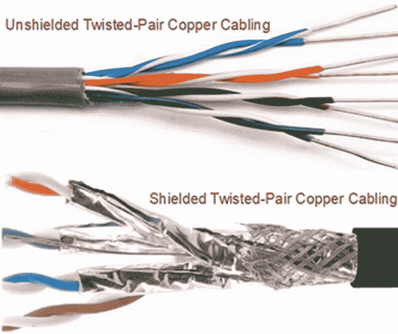
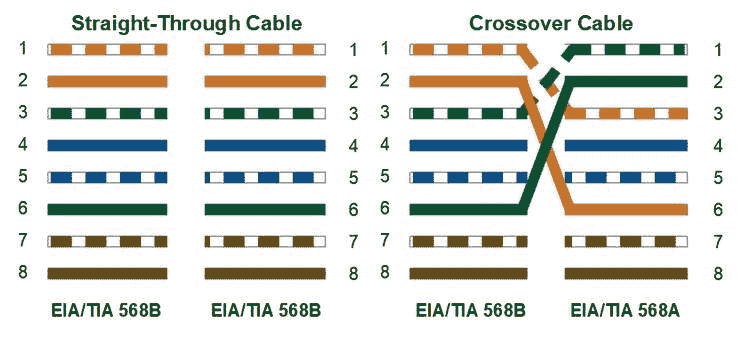
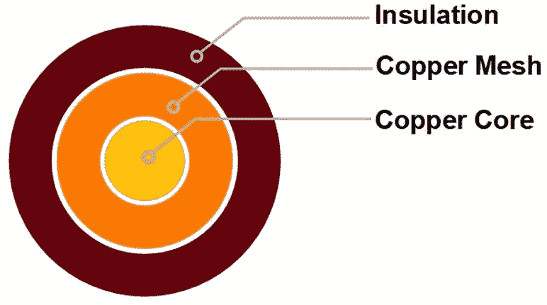
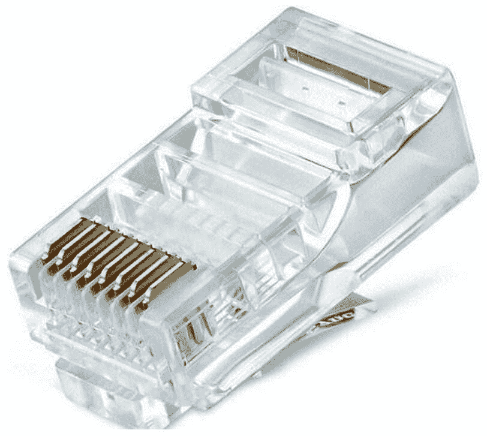
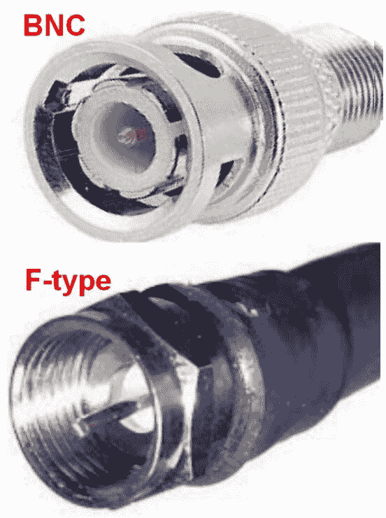
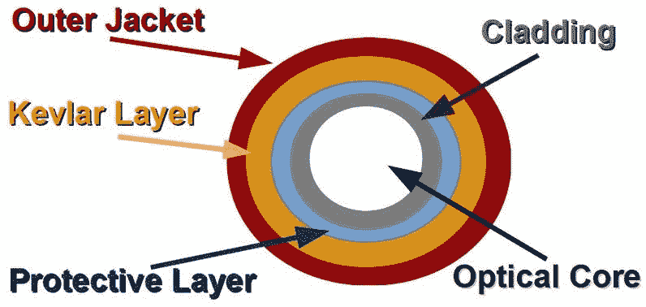
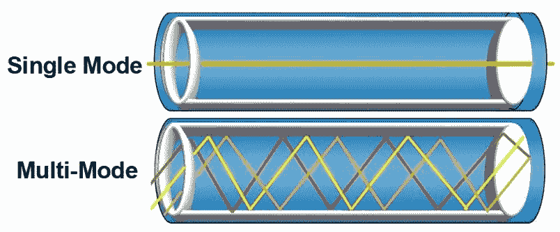
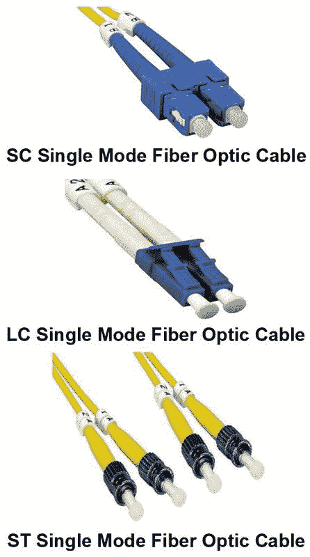
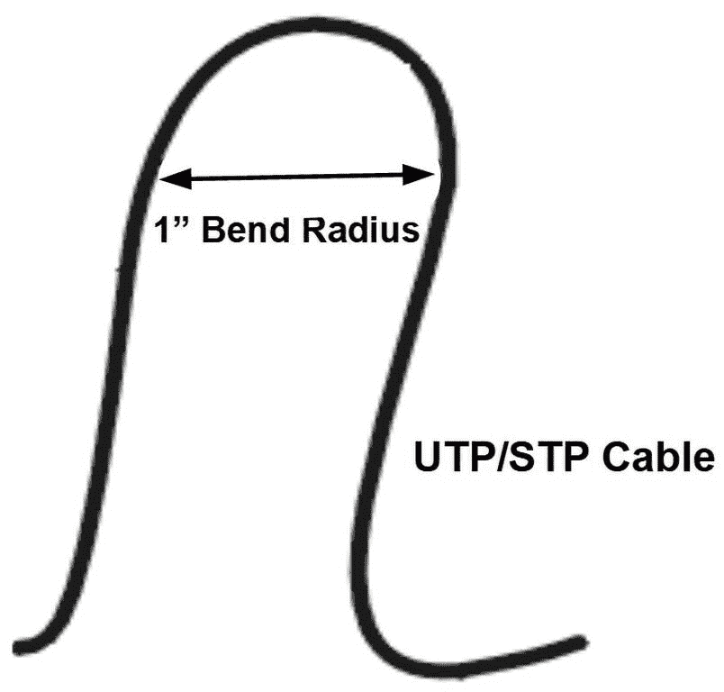

# 电缆

为了让网络设备能够相互通信，必须有某种形式的通信介质。无论介质类型或技术如何，它都提供了一个通道，通过这个通道，传输的信号从一个节点传递到另一个节点。

除了涉及的物理介质外，用于有线和无线网络通信的技术没有太大区别。

Server+ 认证考试包括有关不同连接介质、其连接器和正确安装程序的问题。

本章我们将讨论连接有线网络的物理介质，以及连接无线网络的**射频**（**RF**）信号，无论范围是局部还是广泛。我们将回顾提供网络与网络服务器连接的材料、结构、连接方式、安装和技术。

本章我们将讨论以下主题：

+   铜双绞线和同轴电缆的结构、连接器和使用

+   光纤电缆的结构、连接器和使用

+   电缆安装方法和管理设备

+   网络电缆标签

# 铜缆

铜缆以其各种形式，自计算机在商业中应用初期（甚至更早，如果算上电话服务提供商的电缆系统）以来，一直是连接网络设备的事实标准。

铜缆在早期网络中几乎是直觉上的选择，那时大多数网络采用对等拓扑结构。它相对便宜，容易获取，易于安装，并且对传输的电信号有低的电阻。另一方面，它的传输范围有限，并且容易受到外部电气干扰或噪声的影响。

当铜缆正确安装时，它既可靠又易于维护。

# 双绞线电缆

用于**局域网**（**LANs**）的铜缆主要是双绞线束。

一个重要的要点是，**双绞线**（**TP**）线路即使有绝缘涂层，也依然是一个**电磁干扰**（**EMI**）海绵。早在 1880 年代末，电话行业的人发现将两根导线缠绕或扭绞在一起，有助于减少电缆外部吸收的噪声。然而，扭绞导线对电气噪声的抗干扰能力仅仅是减少了其敏感性。

双绞铜电缆有两种类型（以及各种变体）：

+   **非屏蔽双绞线（UTP）**：非屏蔽并不意味着裸线；它意味着除了每根导线的绝缘外，电缆内部没有其他屏蔽来阻挡电磁干扰（EMI）。与其他选项相比，UTP 便宜，在住宅和小型办公室等通常安全的环境中，它的低成本弥补了其缺点。

+   **屏蔽双绞线（STP）**：屏蔽意味着除了每根电线的绝缘外，还使用金属箔或编织网等屏蔽层包围内部电缆结构，以偏转或吸收干扰。

下图显示了 UTP 和 STP 之间的物理差异。请注意 UTP 没有屏蔽，而 STP 则有大量屏蔽：

UTP 与 STP 铜缆

网络中每段电缆都有一个或多个规格、标准或配置。此外，一些电缆配置有特殊的用途，不仅规定了各个导线的排列和位置，还决定了它们如何连接到插座。

扭绞电缆的终端和引脚排列受 **电子工业协会**（**EIA**）/**电信行业协会**（**TIA**）标准 568A 和 568B 的规范。通常，人们将这两个标准分别称为商业型和住宅型。

在任何有线网络中，几种不同类型的电缆，即具有不同连接器配置的电缆，将网络的各个元素和设备连接在一起。你在 Server+ 考试中可能会遇到的电缆类型如下：

+   **交叉电缆**：这种电缆结合了两种 568 标准，两端分别连接各自标准的电缆。该电缆通常用于连接两个同类型的通信设备，如两个路由器或两个交换机。交叉电缆的一端引脚 1 和 3 交换，引脚 2 和 6 交换。下图说明了这一配置：

直通电缆和交叉电缆的引脚排列

+   **跳线**：这是一个通用术语，用来描述任何类型的电缆，包括交叉电缆、回绕电缆和直通电缆，通常用于在两台电子设备之间建立连接。

+   **回绕电缆**：这种电缆也称为 **Yost 电缆**，它们具有反向或回绕的引脚排列，通常不用于数据传输，而是用于在两个设备之间创建接口。该电缆类型的引脚排列列在下表中：

| **电缆端 1** | **电缆端 2** |
| --- | --- |
| 引脚 1 | 引脚 8 |
| 引脚 2 | 引脚 7 |
| 引脚 3 | 引脚 6 |
| 引脚 4 | 引脚 5 |
| 引脚 5 | 引脚 4 |
| 引脚 6 | 引脚 3 |
| 引脚 7 | 引脚 2 |
| 引脚 8 | 引脚 1 |

+   **直通电缆**：这种电缆两端的连接遵循相同的标准，568a 或 568b，连接器引脚一一对应——即引脚 1 对引脚 1，引脚 2 对引脚 2，依此类推。这种电缆类型通常用于将网络适配器连接到路由器等网络设备。

# 同轴电缆

同轴电缆有两个信道——核心导线和金属的、通常是铜的网状层，它们各自传递相同的信号。带电载体会产生电磁场，相互抵消另一个信道的辐射，形成屏障，外部干扰无法穿透该屏障，从而不会改变传输信号。

以下图示显示了同轴电缆的主要层次结构：

同轴电缆的横截面图

# 网络连接器

连接终止网络电缆的连接器与电缆的线型和针脚排列一起，都是标准定义的。对于双绞线布线，EIA/TIA 568 标准规范了**注册插孔-45**（**RJ-45**）连接器，这是一种**八位八接触**（**8P8C**）连接器，如下图所示：

8P8C 连接器（RJ-45）

该连接器是网络电缆连接到墙面插座、配线架和其他网络设备的标准。RJ-45 的较小版本是 RJ-11，它是一个四线连接器，主要用于电话连接。

网络同轴电缆使用两种不同风格的连接器。最常见的同轴连接器是 F 型连接器。这对大多数人来说是熟悉的，因为它是将电视服务连接到有线电视供应商的连接器，也用于将同轴网络电缆连接到网络适配器。

另一种常用的数据网络同轴连接器是**贝叶网·尼尔-康塞尔曼**（**BNC**）连接器。两者中哪个更适合计算机网络取决于选择——两者各有优缺点。

以下图展示了这两种连接器类型：

同轴电缆连接器——BNC 和 F 型

# EIA/TIA 568 设施标准

EIA/TIA 568 布线标准还定义了与电缆安装位置相关的布置、距离和使用标准。这些标准包括以下内容：

+   **骨干电缆**：这是将设施或校园内的主要、主分配和中间分配设施（电信和设备室）互联起来的主要通信电缆。网络连接之间安装的双绞线电缆最大长度为 90 米（约 300 英尺）。

+   **入口设施**：也叫做分界点，或*demark*。这是服务提供商的网络与用户的骨干网络连接的地方。分界点应距离服务线进入设施的地方至少 12 英寸。

+   **交叉连接**：568 标准要求设有一个设备室，用于终止网络骨干，并作为设施整个网络的交叉连接点。

+   **水平电缆**：该电缆将设施单层中的网络设备（如楼层或层级）连接到设施的主干网。此电缆在**中继分配设施**（**IDF**）或电信机柜的某一层终止。标准规定 IDF 与连接点之间的最大距离为 90 米。然而，不超过六米（约 20 英尺）的跳线可将网络设备连接到每端的水平电缆连接点。互联跳线的总长度不得超过 10 米。

+   **电信机房/IDF**：电信机房或*机柜*提供了在设施单层中各个水平电缆段之间无限制的互联连接。

+   **工作区域**：568 标准要求每个工作站或网络节点位置都能访问两个网络连接，一个用于语音，一个用于数据——每个连接都通过水平布线直接连接到 IDF 或电信机柜。

# 类别电缆

电缆标准还将网络双绞线电缆分为不同的**类别**（**CATs**）。这主要与以太网电缆相关，但也已扩展到其他类型的网络应用。每个 CAT 类别定义了网络电缆能力的一个演进步骤，基于其频率范围、带宽和**数据传输速率**（**DTRs**）。

目前，标准定义了七个类别，以及一些子类别。然而，CAT 1 和 CAT 2 不是网络电缆类别，CAT 4 仅适用于环形拓扑结构，CAT 7 仍在开发中。因此，您需要了解的唯一以太网电缆类别如下：

+   **Category 3（CAT 3）电缆**：一种八线（四对）UTP 电缆，支持 10 Mbps 的数据传输速率和 16 MHz 的带宽。它也被称为站点线。CAT 3 仍然可以用于旧版以太网网络，但已经被 CAT 5 及更高版本所取代。

+   **Category 5（CAT 5）电缆**：一种八线（四对）UTP 电缆，支持 10 Mbps 和 100 Mbps 的数据传输速度，以及以太网网络上的 100 MHz 带宽。它还支持语音和视频传输。CAT 5 仍在使用，但 CAT 5e 标准已取代它。

+   **Category 5 增强型（CAT 5e）电缆**：这种对 CAT 5 标准的升级减少了通道串扰，并将其数据传输速度提高至 1 Gbps，带宽为 100 MHz。CAT 5 和 CAT 5e 都使用 24–26 AWG 的铜线。CAT 5e 电缆与 CAT 5 向下兼容。

+   **Category 6（CAT 6）电缆**：该类别将带宽提高至 250 MHz，并支持千兆以太网速度。它还具有更好的外部护套和绝缘层，采用更细的铜线（22–24 AWG），改进了**信噪比**（**SNR**），并且更不容易受到电磁干扰（EMI）。CAT 6 规定了 UTP 和 STP 两种类型，并向下兼容 CAT 5 和 5e。

+   **增强型类别 6（CAT 6a）电缆**：这是对 CAT 6 标准的升级，将 DTR 提高到 10 Gbps，带宽提高到 500 MHz。CAT 6a 电缆是 STP 类型，并且需要提供接地的特殊连接器。

以下表格提供了以太网类别电缆标准的对比：

| **类别** | **电缆** | **最大 DTR** | **最大带宽** |
| --- | --- | --- | --- |
| **CAT 3** | UTP | 10 Mbps | 16 MHz |
| **CAT 5** | UTP | 10/100 Mbps | 100 MHz |
| **CAT 5e** | UTP | 1000 Mbps | 100 MHz |
| **CAT 6** | UTP/STP | 1000 Mbps | 250 MHz |
| **CAT 6a** | STP | 10,000 Mbps | 500 MHz |

# 以太网电缆标准

除了前面讨论的类别电缆标准外，IEEE 802.3 还规定了其他电缆标准。这些标准与类别电缆标准有重叠，但为每种电缆类型提供了一个自描述的缩写，使得更容易了解其性能。

IEEE 以太网标准中电缆的命名约定由三个主要部分组成：**DTR**，**信号模式**和**电缆标识**。例如，10BaseT 代表一种 10 Mbps 的**基带**（**Base**）双绞线（**T**）电缆。

IEEE 以太网电缆标准指定了以下电缆类型：

+   **10Base2**：一种仍在使用的旧标准，代表一种 10 Mbps 的基带同轴电缆，衰减距离为 185 米（约 607 英尺），或其有效范围的近似值为 100 米的倍数。10Base2 也被称为**Thinnet**。

+   **10Base5**：另一种同轴电缆，传输速率为 10 Mbps，基带信号传输距离为 500 米。像 10Base2 一样，5 代表传输范围的 100 米倍数。10Base5 也被称为**Thicknet**。

+   **10BaseT**：一种 10 Mbps 基带 UTP 或 STP 电缆。CAT 3 及以上标准支持 10BaseT。所有双绞线电缆的标准传输距离或衰减距离为 90 米。

+   **10Base-FL**：一种 10 Mbps 基带标准，运行在**光纤链路**（**FL**）上。由于使用光纤介质，其传输距离为 2 公里。

+   **100BaseTX**：一种快速以太网规范，使用 100 Mbps 基带信号在 UTP 电缆上传输，通常是 CAT 5 或更高版本。

+   **100BaseT4**：一种规范，基本与 100BaseTX 相同，但增加了 STP 电缆。

+   **100BaseFX**：一种光纤电缆规范，可以使用**单模**或**多模**电缆。其传输距离取决于特定介质。单模光纤电缆的传输距离为 10,000 米（约 6 英里），多模电缆的传输距离为 412 米（不到四分之一英里）。

+   **1000BaseT**：一种千兆以太网标准，与 1000BaseTX 一起使用。两者都在 CAT 5 或更高版本的 UTP 电缆上传输。但是，随着速度的增加，其传输距离减少至 75 米（约 246 英尺）。

+   **1000BaseCX**：另一种千兆以太网标准，使用 STP 电缆，传输距离仅为 25 米（82 英尺）。

+   **1000BaseSX**：一种光纤标准，在 50 微米或 62.5 微米的电缆上传输短波激光信号。在 50 微米的光纤上，它的传输距离可达 550 米（1850 英尺）；在 62.5 微米的光纤上，其范围是 50 微米电缆的一半。这两种距离均为全双工模式。

+   **1000BaseLX**：与 1000BaseSX 标准类似，但传输长波激光信号，能达到 5,000 米（3.1 英里）的距离。

+   **10GbE**：一种传输速率为 10 Gbps，或相当于 10,000 Mbps 的标准。它使用与 1000BaseLX 相同的媒介规范，但采用能够将传输距离扩展至 40 公里（约 25 英里不到）的技术。

# 光纤电缆

需要比铜电缆提供更长距离和更高带宽的网络适合使用光纤电缆。光纤电缆相较于铜双绞线电缆有两个优势：范围和带宽。

光纤线路的最大传输距离约为 20 公里，而铜双绞线电缆的最大传输距离标准为 100 米或更短。带宽是光纤电缆超过铜电缆的另一个领域。有些光纤电缆的带宽可达到 60 Tbps，但光纤网络电缆一般在 10 Gbps 到 100 Gbps 范围内。

以下表格总结了光纤电缆与铜 twisted-pair 电缆在能力上的差异：

| **特性** | **光纤电缆** | **双绞线电缆** |
| --- | --- | --- |
| 最大带宽 | 60 Tbps | 10 Gbps |
| 最大范围 | 20 公里 | 90 米 |
| 干扰 | 不适用 | 电磁干扰（EMI）/射频干扰（RFI）、串扰、电压波动 |
| 使用寿命 | 30-50 年 | 五年 |

光纤电缆与铜 twisted-pair 电缆的比较

光纤电缆共有五层，以下图示展示：

光纤电缆光纤的层次结构

从中心开始，向外依次是：

+   **光学核心**：一种透明的玻璃或塑料光纤，通过它，光流可以被传输。

+   **包层**：通常是包裹在核心光纤上的高度反射性材料。包层的作用类似于镜子背面的材料，能够将光反射回其来源。包层的目的是确保光流始终保持在核心内。

+   **保护层（缓冲层）**：许多光纤和单根光纤线都有一层保护涂层，包裹在包层和核心周围，以防止弯曲损坏核心。

+   **凯夫拉层**：一层加强的凯夫拉纤维织物包裹在内层（核心、包层和可能的缓冲层）外面，为电缆提供额外的加强和强度，以防止安装时出现意外。

+   **外护套**：外护套或外层保护光纤电缆组件，防止它在安装过程中受到切割、割伤或磨损。

# 光纤电缆模式

光纤电缆有两种模式：**单模**（**SM**）和**多模**（**MM**）。

# 单模光纤电缆

单模光纤电缆的中心只有一个光纤细丝，传输单一的传输模式或光流。由于其核心直径相对较小，只有一种信号模式能够通过它。这个小核心和它所传输的单一光波相结合，有效避免了传输光脉冲的问题。

单模光纤的带宽比多模光纤高，衰减点可达到多模光纤的 50 倍远。然而，您确实需要为这种速度和距离支付更多费用。单模光纤也被称为单模光波导。

# 多模光纤电缆

如其名称所示，多模光纤能够同时传输多个光流。多模光纤提供更高的带宽和更快的速度，但仅适用于中等距离。

与单模光纤相比，多模光纤将光波分散成多个模式或路径进行传输。而单模光纤能够传输单一光波并支持更长的距离，而多模光纤的光流在较长的距离上会发生失真，从而限制其传输距离。

两种电缆模式如以下图所示：

单模光纤传输单一光流；多模光纤传输多个光流

选择哪种电缆适合某一特定网络，首先取决于预算，其次是传输距离，具体如下：

+   如果传输距离小于 100 米且在室内使用，使用铜缆

+   对于超过 100 米但不到几英里的距离，如果您希望避免使用中继器等设备，多模光纤（MM）是一个理智的选择。

+   如果传输距离为两英里或更长，最好使用单模光纤（SM）

# 光纤电缆连接器

市面上有许多不同类型的光纤连接器，每种连接器都专门用于特定用途，并支持某种传输模式。光纤网络的部署中使用的连接器将取决于成本、经验、可用性等因素。

每种连接器都有其优缺点。如果网络中使用的连接器不理想，随着时间的推移，网络的性能可能会下降。TIA 在《光纤电缆互连标准》（**FOCIS**）中定义了光纤电缆的规格，规定了各种连接器标准的插头和插座。

常见的光纤连接器如以下图所示：

常见光纤连接器

图片来源：L-com Global Connectivity

你可能在 Server+ 考试中遇到的光纤连接器如下所示：

+   **Lucent 连接器 (LC)**：LC 光纤连接器比大多数其他连接器小，但仍然包括一个标准的陶瓷插芯连接器（插芯是保护光纤的连接器部件）。FOCIS-10 定义了 LC 连接器的标准。

+   **标准连接器（SC）**：这种连接器采用推拉式锁定机制，具有弹簧加载的套圈。SC 连接器近几年在光纤连接器类型中占据主导地位，尤其与 ST 连接器一起，因为其优异的性能。FOCIS-3 定义了 SC 连接器的标准。

+   **直插式连接器（ST）**：ST 连接器是 MM 光纤电缆中最常用的连接器，在商业光纤网络中非常常见。FOCIS-2 定义了 ST 连接器的标准。

+   **小型可插拔光模块（SFP）**：SFP 接口规范定义了一种用于将**光纤通道**（**FC**）和**千兆以太网**（**GbE**）电缆连接到网络交换机和其他互联设备的收发器，采用 LC 连接器。**四联 SFP**（**QSFP**）标准是 SFP 标准的流行版本。

# 网络电缆安装

安装物理网络电缆时，无论是双绞线、电缆同轴线还是光纤，都有一些注意事项和做法，如果遵循这些原则，可以确保电缆系统的完整性和正常工作。

每种类型的电缆介质都有自己特殊的处理要求和安装指南。这些指南解决了由于安装不当可能出现的电缆问题，如干扰、电缆损坏和信号丢失。以下章节将介绍成功安装每种电缆类型的注意事项、做法和指南。

有一些特定于铜双绞线和同轴电缆的安装指南，涉及电缆布置、电缆捆绑和电缆悬挂。许多相同的指南和建议也适用于光纤电缆。

以下步骤、流程、程序和做法有助于避免双绞线电缆传输问题：

1.  在任何电缆经过、上方或下方穿越的材料上安装电缆时，要以 90 度角（垂直进出）进行安装。如果需要弯曲电缆，重要的是不要超过电缆的弯曲半径规范，依据 EIA/TIA 568b 标准，弯曲半径为 1 英寸（如以下图所示）。许多认证安装人员建议使用 2 英寸弯曲半径作为最佳做法：

UTP/STP 电缆的标准弯曲半径

1.  使用可预测的电缆路径，例如沿着走廊、主要墙壁和其他重要的结构组件布线。如果可能，避免穿越走廊和大型办公室或生活空间。

1.  在开阔区域（如地下室、阁楼和爬行空间）内安装电缆时，使用电缆支撑。每隔四到五英尺在开阔空间内放置吊架、挂钩和其他电缆支撑。拉紧电缆以消除电缆下垂。市面上有多种电缆支撑设备，包含以下几种：

    +   **电缆管道**：通常是用于电缆安装（拉动）、组织和重新布线的电缆槽道或槽形物。大多数电缆管道系统的侧面有槽口，通过这些槽口电缆可以重新引导到电缆路径上的掉线点。还可以提供盖子和实心管道，以增加额外保护。

    +   **电缆吊架**：这些设备可以支持电缆穿越空旷的空间，或在管道或托盘无法使用的地方支撑电缆。不同类型的电缆吊架包括环形吊架、马鞍吊架、马具环和 J 型挂钩，所有这些都可以支撑裸露的电缆或管道。电缆吊架还提供了电缆垂直、水平、墙顶、天花板以及几乎任何其他表面的布置灵活性。

    +   **电缆槽道**：任何固体的、类似盒子的刚性通道，只要它是完全或部分封闭的，并能隐藏、隔离或保护电缆，就本质上是一个电缆槽道。电缆槽道的不同类型包括带扣槽、J 型槽、J 型挂钩、拐角槽和电力槽道。

    +   **电缆护套**：许多人将电缆护套和管道互换使用，但实际上有几种其他类型的支撑方式，包括编织护套、螺旋包裹和电缆管。电缆管和护套包裹电缆和电线，以防止损坏和恶劣天气的影响。编织护套可以是金属的，也可以由碳纤维、玻璃纤维、凯夫拉等材料制成，能根据所包裹物体的形状提供保护。

    +   **电缆扎带**：也称为**拉链带**，这种电缆支撑实际上更像是一个电缆捆扎器，它将一组电缆合理地捆绑在一起，作为一个电缆来保持电缆束。电缆扎带由尼龙、金属或其他材料（包括织物）制成，具有一个锁定头，可以通过卡入条带上的凹槽来保持位置。在需要重复使用的情况下，魔术贴电缆扎带更为适用。

    +   **电缆托盘**：这种类型的电缆支撑最好用于支撑大量的电缆，可以从天花板或地下支撑。它们的名字来源于它们的开放通道形状，但它们也可以是篮式托盘、电缆梯和干线。

1.  保持电缆两端相对松弛，并尽可能保持电缆路径中的松弛。避免或消除分配设施与墙板之间电缆上的任何分接、接合或修复，以避免连接到工作站的电缆发生问题。

1.  保持电缆与以下安全距离：

    +   距离 2 kVA 或更低电流的任何电力线至少 3 英寸。

    +   距离其他高压源至少 12 英寸，特别是荧光灯具。

    +   距离 5 kVA 或更高电流的电力线至少 3 英尺。

    +   距离任何变压器或电动机至少 3.5 英尺，例如软饮料机。

1.  至少在每根电缆的两端标注标签。最好在电缆拉动的中间位置一两个地方也进行标注。

1.  安装在建筑物的**供暖、通风和空调**（**HVAC**）系统的管道或其他空间中的电缆（通常位于建筑物的天花板或墙壁内），必须符合气流评级标准。气流评级电缆有防火涂层，通常为特氟龙，能够防止电缆在燃烧时释放有毒气体和烟雾。

# 总结

在这一章中，我们首先看了局域网布线，主要是 TP 线。TP 有两种类型：UTP 和 STP。网络电缆的安装和配置遵循 EIA/TIA 568A/B 标准。网络连接之间安装的电缆长度不得超过 90 米（大约 300 英尺）。

我们接着看了不同类型的电缆。交叉电缆连接相同类型的设备。跳线电缆是一个通用术语，指任何用于连接两个设备的电缆类型。回转电缆具有反向引脚排列，能够在两个不同类型的设备之间创建接口。直通电缆的两端具有相同的引脚排列标准，用于将网络适配器连接到设备，如路由器。

双绞线电缆使用 RJ-45 连接器，即 8P8C，用于电缆连接、墙插座、配线面板等。

同轴电缆有两个通道：核心导线承载传输信号，金属网承载相同的信号。每个通道都会产生一个电磁场，从而抵消对方的辐射。同轴电缆使用 F 型和 BNC 连接器。

接下来，我们讨论了 EIA/TIA 568 布线标准。主干电缆连接分配设施。进入设施是服务提供商网络和用户主干网络连接的地方。水平电缆连接单层中的网络设备。IDF/通信机房为水平布线段之间的互联提供了设施。

然后我们看了类别布线，它定义了以太网双绞线布线。CAT 3 是四对 UTP 电缆，支持 10 Mbps 和 16 MHz 带宽。CAT 5 是四对 UTP 电缆，支持 10 Mbps 或 100 Mbps 和 100 MHz 带宽。CAT 5e 减少串扰，支持 1 Gbps 和 100 MHz。CAT 6 支持 250 MHz 带宽和千兆速度。CAT 6a 是 STP 电缆，具有专用连接器，支持 10 Gbps 和 500 MHz。

我们接着讨论了 IEEE 802.3 标准，该标准规定了一个包含三个主要部分的电缆标识约定：DTR、信号模式和电缆标识。10BaseT 代表一个 10 Mbps 的**基带**（**Base**）双绞线（T）电缆。其他标准包括 10Base2、10Base5、10Base-FL、100BaseTX、100BaseT4、100BaseFX、1000BaseT、1000BaseCX 和 10GbE。

接下来，我们转向了光纤布线。与铜双绞线电缆相比，光纤电缆有两个优势：范围和带宽。光纤线路的最大传输范围约为 20 公里，通常支持 10 Gbps 到 100 Gbps 范围的带宽。光纤电缆有五层：核心、包层、保护层（缓冲层）、凯夫拉层和外护套。

我们查看了光纤电缆在两种模式下的工作方式：SM 和 MM。SM 有一根光纤纤维，承载单一传输。SM 的带宽比 MM 高，并且衰减点可达到更远的 50 倍。MM 同时传输多个光流。

接下来，我们查看了光纤电缆连接器。FOCIS 为连接器的插头和插座指定了标准。LC 连接器比其他连接器更小，但包含一个标准的陶瓷插芯连接器。SC 和 ST 因为其高性能而成为主流光纤连接器。SFP 是用于通过 LC 连接器将 FC 和 GbE 连接到交换机及其他设备的收发器。

最后，我们讨论了每种物理电缆介质都有其自身的处理和安装指南，以防止因安装不当而导致的干扰、电缆损坏和信号丢失。安装电缆时，应按电缆的弯曲半径规范以 90 度角安装，弯曲半径不得小于 1 英寸。遵循电缆路径，避免跨越走廊和大型开放区域。

应在开放区域安装电缆支撑。常见的电缆支撑包括电缆槽、吊架、电缆桥架、护套、扎带和托盘。电缆应至少与低压电力线路保持 6 英寸的距离，与高压电力线路和设备保持 12 英寸的距离。每端都要标记电缆路径。安装在 HVAC 管道中的电缆必须是空气管道等级的。

# 问题

1.  以下哪两种是常见的 TP 电缆类型？

    1.  同轴电缆

    1.  光纤

    1.  UTP

    1.  STP

    1.  FDDI

1.  EIA/TIA 568 电缆标准规定的网络站点之间的最大电缆长度是多少？

    1.  500 米

    1.  185 米

    1.  100 米

    1.  90 米

    1.  10 米

1.  以下哪种电缆配置通常用于连接两种不同的网络设备？

    1.  直通电缆

    1.  跳线

    1.  交叉电缆

    1.  回绕电缆

    1.  同轴电缆

1.  哪种注册插孔连接器是以太网网络的标准？

    1.  RJ-11

    1.  RJ-31

    1.  RJ-45

    1.  RS-232

1.  以下哪两种是常用于细网同轴电缆的连接器？

    1.  RJ-11

    1.  F 型

    1.  USB

    1.  BNC

    1.  RJ-45

1.  水平电缆通常终止于哪个电缆结构？

    1.  骨干电缆

    1.  MDF

    1.  IDF

    1.  入口设施

1.  以下哪两种 TP 电缆类别被认为是当前的事实标准？

    1.  CAT 3

    1.  CAT 5

    1.  CAT 5e

    1.  CAT 6

    1.  CAT 7

1.  以下哪三种 IEEE 802.3 电缆设计标识符组件代表千兆以太网 UTP 电缆？

| **速度** | **信号** | **介质** |
| --- | --- | --- |
| (1) 10 | (2) BASE | (3) T |
| (4) 100 | (5) 广泛 | (6) F |
| (7) 1000 | (8) 狭窄 | (9) L |

+   1.  (1)(2)(3)

    1.  (1)(5)(6)

    1.  (4)(2)(9)

    1.  (7)(5)(3)

    1.  (4)(5)(3)

    1.  (7)(2)(3)

1.  以下哪种光纤电缆传输模式具有最长的衰减值？

    1.  SM

    1.  MM

    1.  SC

    1.  SFP

1.  安装网络电缆时，EIA/TIA 568 电缆标准关于电缆绕过物体或角落的要求是什么？

    1.  12 英寸的弯曲半径

    1.  在弯曲处接合电缆

    1.  1 英寸的弯曲半径

    1.  电缆无弯曲

    1.  安装集线器
