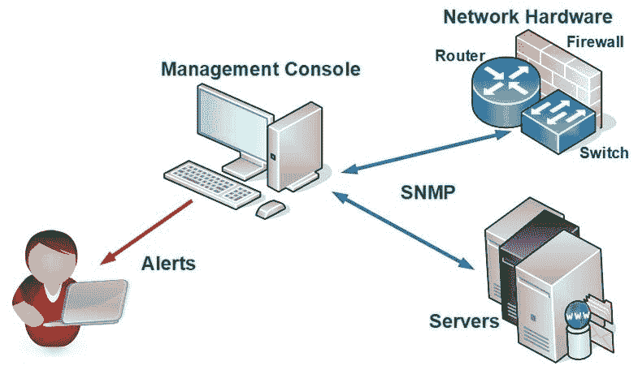
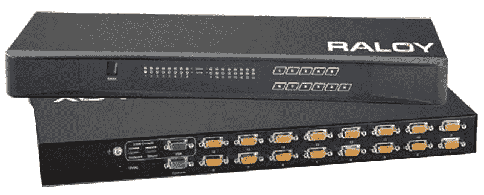
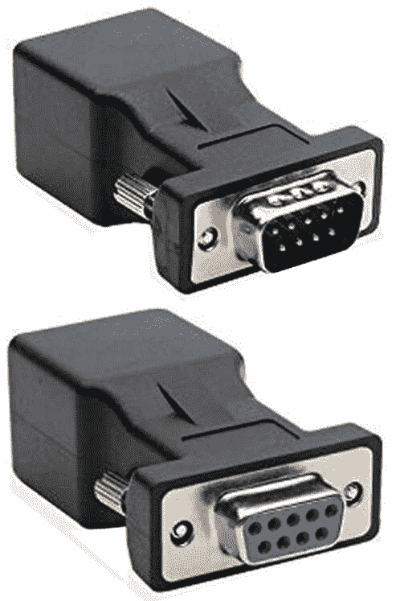
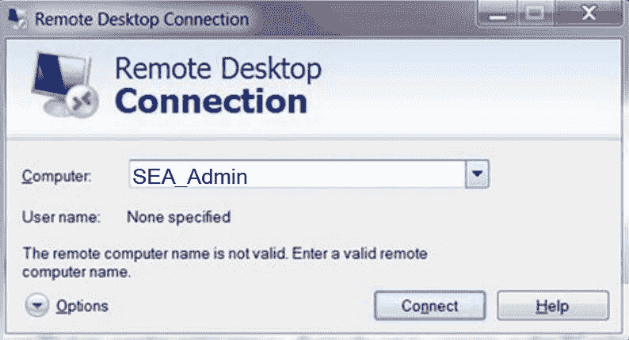
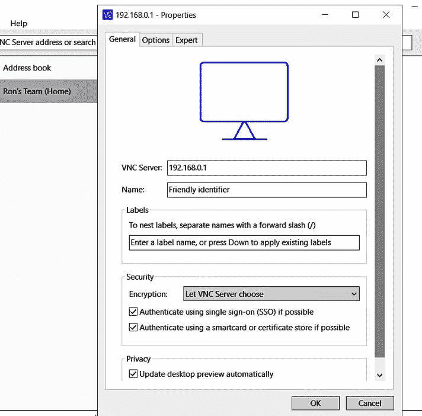
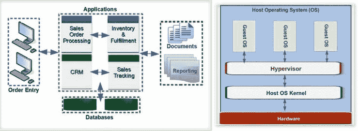

# 第七章：服务器管理

网络管理员工作的一大部分是管理网络服务器。此章节将介绍管理和维护服务器所使用或执行的工具、组件、任务、流程和管理责任。

服务器管理员（即系统管理员或网络管理员）的职责和责任在不同的组织中可能有所不同，但大多数情况下，他们执行或监督的核心任务是任何环境中都必不可少的。这些任务和责任通常包括监控硬件和软件性能、用户管理、备份和恢复程序管理，以及应用修复和补丁，仅举几例。此部分的 Server+认证考试以过程为导向，这意味着它更关注你做什么（虽然知识仍然重要），而非你知道什么。让我们开始吧！

在本章节中，我们将涵盖以下主题：

+   网络硬件管理

+   服务器和网络资产管理

+   服务器和系统文档

# 硬件管理

网络管理员的日常责任归结为监控、审查、响应和在需要时进行安装。你需要明白，网络管理员和系统管理员并不完全相同，但在工作场所，这两个职位的名称常常互换使用。系统管理员的职责通常包括网络管理员的职责，但大多数组织将网络管理员的职责范围限制在网络硬件的配置、操作和安装。因此，既然我们在谈论硬件管理，我们就使用网络管理的职位名称。

# 网络管理

网络管理员的主要责任是确保组织的计算机网络符合**保密性、完整性和可用性**（**CIA**）模型。为了实现这一目标，管理员必须保持网络组件的更新、功能正常并符合要求的性能。无论管理员的职责是单独的职位描述，还是嵌入在**系统管理员**（**sysadmin**）职位描述中，网络硬件管理都是一项绝对必要的活动。无论组织如何定义管理员的职责，定义中应包括以下责任：

+   配置、更新和维护网络硬件

+   排除网络故障

+   设计网络模型

+   实施和监控硬件安全策略

+   配置、管理和监控数据存储系统

其他系统和网络领域也可能属于管理员或系统管理员的职责范围。这些包括以下内容：

+   测试和安装网络软件

+   管理和维护**网络操作系统**（**NOS**）

+   实施和监控网络操作系统及软件安全策略

+   管理和协调云计算服务

让我们简要了解一下这些领域及管理员的职责。

# 配置、更新和维护网络硬件

管理员的职责范围通常围绕网络硬件展开。大部分网络硬件，从运行服务器软件的计算机到连接外部网络的网关路由器，都配有内建的性能和管理工具，用于监控其操作。在某些情况下，像 **简单网络管理协议**（**SNMP**）这样的协议允许网络设备共享关于状态和预设条件的信息，如下图所示：

SNMP 允许网络设备传递状态和问题信息。

图片来源：Ron Price

为了执行网络硬件管理所需的任务，管理员几乎可以从任何网络工作站与监控软件互动。然而，在更大的网络中，如服务器农场或数据中心，管理员通常需要通过一个控制台站点访问各个服务器。这种交互可以通过几种不同的技术实现——**键盘、视频、鼠标**（**KVM**）切换器、串行连接和虚拟管理控制台。

# KVM 接口

一款 KVM 切换器，如下图所示，允许位于中央位置的管理员通过单一的键盘、视频显示器和鼠标分别控制多台计算机。结果是，管理员的本地设备替代了远程计算机的设备，并且其功能就像是直接连接到远程设备一样：

KVM 设备：16 口 KVM 切换器的前（上）视图和后（下）视图

图片来源：Raloy, Inc.

KVM 切换器通过一个输入/输出设备集（包括键盘、视频显示器和鼠标）提供对连接组内各个计算机的点对点管理访问，管理者可以从中央管理站点进行控制。实际上，KVM 替代了选定计算机的设备。例如，前述图像中显示的 KVM 切换器能够连接最多 16 台计算机。管理员可以选择哪台计算机处于活动状态，并像坐在计算机前一样与之互动。

KVM 设备主要分为两大类——访问与控制类和应用与技术类。这两类有重叠，KVM 切换器通常属于不止一类：

+   **访问与控制：** 根据需要访问的操作员数量，有两种类型的 KVM 访问与控制方式：

    +   单用户 KVM，是最常见的，连接一个管理员通过中央点控制多台远程计算机

    +   多用户 KVM，通常用于较大的数据中心，其中多个管理员需要访问网络计算机，本质上提供了每个用户似乎是单用户 KVM 的功能。

+   **应用与技术：** 在某些网络中，连接到 KVM 的所有计算机都是本地的，而在另一些网络中，连接的设备是远程的。此类别中的主要两种类型的 KVM 是单用户模拟设备和多用户数字设备：

    +   模拟 KVM 通过**非屏蔽双绞线**（**UTP**）或同轴电缆直接连接到计算机。KVM 切换器和连接的计算机通常位于同一局域网（LAN）中。

    +   数字 KVM 通过互联网连接，使用**互联网协议**（**IP**）地址连接本地和远程计算机。数字 KVM 能够与隔壁房间或遥远的全球另一端的计算机进行交互。

另一种类型的 KVM 切换器是**USB 枚举 KVM 切换器**，即基于集线器的 KVM。当多端口 USB 设备的活动端口发生变化时，会进行枚举过程。这个过程也会在插入或移除 USB 设备时发生，启动并激活端口。在这个过程中会有一个小的延迟，但这种类型的 KVM 在**小型办公室/家庭办公室**（**SOHO**）环境中表现良好。

连接到 KVM 的三种设备的通信范围相对较短。传统和当前键盘与鼠标的 PS/2（迷你 DIN）和 USB 接口，以及大多数当前显示器的数字视频，在大约 5 米（10 英尺）时开始减弱。一些设备能够维持信号至多 10 米（33 英尺），但这取决于多个因素。在希望扩展这些设备有效范围的情况下，**KVM 延长器**，类似于以太网网络中继器的工作原理，可以将设备信号的范围扩展至 150 米（大约 500 英尺）通过 UTP，并在光纤电缆上传输得更远。

# 串行接口

几乎所有服务器级计算机至少都有一个串口，即 COM 端口。通常，该端口的连接器是**D-小型 9**（**DB-9**）公头连接器，如下图所示。在其名称中，**D** 代表其形状，**小型**代表其较小的形状，**9** 表示连接器中的引脚数量。COM 端口通常是新型计算机上的 DB-9 连接器。另一种较为少见的端口是 DB-25 串行端口，这是一种具有 25 个引脚的 D 形连接器。

DB 连接器分为公头或母头，意味着它们有引脚，就像下图中的顶部连接器，或者它们有插针插座，就像下图中的底部连接器，这通常被称为 PC 上的 VGA 连接器：

DB-9 连接器，公头（上）和母头（下）

系统和网络管理员通常通过串口接口连接到网络设备和互联设备，以便使用系统控制台访问系统和网络资源进行配置、监控、故障排除和维护，即根控制台或管理员控制台。通常，系统控制台是一个文本输入和显示设备，例如 PC 或终端，具有数据输入功能。Windows 和 Linux 操作系统提供终端仿真软件，如 Windows 的**Cmder**和**Console2**，或者 Linux 的 Terminator 和**Guake**，使 PC 能够通过串行连接与网络设备通信。

# 基于网络的硬件管理

在硬件的系统和网络管理中，主要涉及管理员通过软件或硬件进行远程访问。在 Server+考试中，你可能会遇到的三种基于网络的硬件/软件管理工具如下：

+   **KVM over IP 交换机**：这使得管理员能够通过网页浏览器通过 IP 网络访问本地或远程系统。使用 KVM over IP 交换机，管理员可以监控和管理远程硬件和软件、电源管理以及网络设备。一些型号还可以录制视频显示，从而显示执行的操作。

+   **HP 集成 Lights-Out（iLO）**：一款由 HP 提供的网络硬件和系统管理工具，能够通过互联网进行系统管理。

+   **集成戴尔远程访问控制器（iDRAC）**：另一种专有的网络管理工具，是戴尔 EMC 企业基础设施管理系统的一部分。像 iLO 一样，管理员可以完全管理远程网络资源。

# 基于网络的操作系统管理

在一个广泛分布的网络中，位于中心位置的管理员能够远程管理、配置和监控运行远程服务器和工作站的操作系统。管理员可以使用的一些工具来管理远程系统上的操作系统如下所示：

+   **远程服务器管理工具（RSAT）**：这个微软包使管理员能够从 Windows 操作系统 Vista 及以后版本的系统中管理 Windows Server 2008 R2 之后版本的配置和功能。

+   **远程桌面协议（RDP）**：这是另一个微软的系统，提供对网络连接系统的远程访问，这些系统提供图形用户界面（GUI）。以下截图显示了 RDP 的启动对话框：

RDP 对话框

图像来源：Ron Price

+   **安全外壳（SSH）**：一款软件工具，可通过安全的远程连接方便地进行操作系统管理和文件传输。

+   **虚拟网络计算（VNC）**：这通过 **远程帧缓冲区**（**RFB**）协议提供图形用户界面（GUI）桌面，使管理员能够通过网络控制和管理远程系统。VNC 将所有的键盘和鼠标操作传输到远程系统，并将所有生成的视频返回到控制系统。以下截图显示了 VNC 服务器的连接对话框：

VNC 服务器的连接对话框

图片来源：Ron Price

+   **命令行/脚本命令**：Windows 和 Linux 都有能力从命令行或通过脚本控制远程系统。在 Windows 系统中，PowerShell 提供了远程访问和控制功能。在 Linux 系统中，SSH 上的命令行功能提供了远程系统管理。

# 资产管理

在任何组织中，计算和网络功能的资产通常是最昂贵的，并且通常对其使命最有价值。当然，这是一个普遍化的说法，但数据及其存储、保护和处理成信息的系统需要特别处理、安全和维护。

# 信息技术资产管理（ITAM）

一个 ITAM 项目应包括应用于组织任何主要资产组的财务、采购和管理活动。ITAM 的主要目的是支持组织的 IT 和网络功能的短期和长期（分别是战术性和战略性）生命周期和应用。

任何成功的 ITAM（信息技术资产管理）项目的核心是有关硬件和软件及其库存的详细信息。这些信息为 IT 硬件和软件组件的使用、采购、替换和退役提供了基础。大多数组织独立管理硬件资产和软件资产。通常，IT 硬件资产管理活动包括采购、应用、退役和处置。根据资产类型，IT 资产也可能是可以折旧的。相比之下，并非所有软件资产都符合管理资产属性的指导方针。软件资产，通常是软件许可证、升级和安装，绝对是资产，无论是否可以折旧。

一个 IT 资产管理项目在每个组织中可能是不同的。有多个因素、组件和元素可能包含在 ITAM 中。一些差异可能很大，例如包括什么和不包括什么，或者很小，如序列号、标签和其他识别项目。然而，ITAM 项目是关于管理 IT 资产生命周期的。

# IT 生命周期资产管理

一个 IT **生命周期资产管理**（**LCAM**）项目为 ITAM 提供了有价值的初步和持续信息，告知现有设备处于生命周期的何时以及组织应该何时采购替代设备或新技术。LCAM 有五个一般阶段：

+   **采购**：当一个组织采购新设备时，它会被加入到 ITAM（资产管理）清单中并分配一个资产标识。

+   **实施**：任何必要的建筑改动或员工培训都会在新设备安装的同时进行。

+   **维护**：定期的预防性维护计划能够确保资产按预期正常运行。

+   **支持**：定期评估资产的价值和贡献，决定该资产是否仍在为组织的整体使命做出贡献。如果没有，它的生命周期可能会缩短。

+   **处置**：并非所有在生命周期结束的资产都准备好扔进垃圾堆。特别是 IT 资产，许多仍然有剩余的使用寿命或价值，回收可能比丢弃它们更好。一些 IT 资产中含有稀有金属或其他化合物，回收商可以从主板和其他设备中提取。

当然，一旦某个产品在其购买和处置之间已经发挥了作用，它可能会被替换资产或全新的技术所替代，从而重新启动这一周期。

# 其他 ITAM 术语

以下是与资产管理相关的几个你应该了解的额外内容，适用于 Server+考试：

+   **资产清单**：资产管理的另一个术语是资产清单，意味着定期收集现有和新 IT 资产的详细数据。

+   **资产标签**：一种相对持久的贴纸或标签，带有独特的识别号码，用于标记任何物理资产为可追溯资产。

+   **处置/回收**：**IT 资产处置**（**ITAD**）计划应该包括回收可用 IT 资产和适当处置每种物品类型的选项。因此，如果无法将设备捐赠给当地慈善组织或学校，或进行交换，请联系当地政府，了解如何回收电子设备或在您所在地区处置它们。

+   **生命周期结束（EOL）**：这主要是一个营销术语，指的是某个产品或服务在生命周期的末端，并且在某个日期之后将无法继续提供。安装了 EOL 设备的组织知道，新型号、版本或版本更新将替换掉 EOL 设备。在大多数情况下，EOL 产品的服务和支持也可能即将结束。

# 系统文档

文档对系统或网络管理员来说既是福音也是灾难。发生故障时，它极为宝贵。当需要创建或更新文档时，它也可能成为一种麻烦。不管你怎么看，它，爱它或恨它，文档都是一种宝贵的资源，需要积极支持。本节将探讨网络服务器、互联设备、工作站以及实际上几乎所有连接到网络的设备应有的各种文档类型和内容。

Server+考试的目标识别了九种不同类型的系统文档。以下部分概述了 Server+目标中识别的每种文档类型。

# 服务手册

每个添加到系统中的硬件组件都应该附带一本服务手册，通常也称为用户手册或所有者手册。在某些情况下，服务手册更像是一本安装指南，除了包括一些小问题的故障排除方法外，大部分服务、维修或配置信息可以通过制造商的网站获取。

服务手册通常包含以下部分内容中的一些或全部：

+   **前言**：这是手册第一页上的识别信息，通常包括封面、简介、产品型号和序列号，以及目录。

+   **安装/配置指南**：一些服务手册提供安装指南和配置选项及流程。根据设备或组件的不同，安装和配置过程是一个综合过程。

+   **故障排除**：一般来说，服务手册的这一部分重点介绍设备的常见错误或问题的识别方法，及其解决步骤。该部分可能包含有关识别故障及其解决方案的详细信息。也可能仅列出服务中心的位置或维修前需联系的客户支持电话号码。

+   **常见问题解答**：与设备的安装、配置和操作相关的常见问题，通常会附带简短的答案或解释。

+   **术语表和索引**：有时，服务手册可能会包含一个术语表，用于定义和解释手册中包含的任何技术或特定产品的术语，以及按字母顺序排列的关键术语和流程的页面索引。

# 系统和网络文档

在许多情况下，系统管理员对各种服务器的配置、虚拟化网络环境、附加存储网络以及连接到互联网的互联设备具有极其详细的知识。在工作中，没有什么是管理员不知道的，凭借已获得的知识，也能修复、更换或排除故障。该管理员坚信文档其实并不必要，因为管理员的知识可以涵盖任何可能发生的事情。而且，保持文档的最新状态是个大麻烦，浪费时间。通常，在这种情况下，管理层会将系统和网络管理交给管理员处理，至少直到某种伤病使管理员无法执行职责时。

虽然这种情况看起来像是一种恐吓策略，用来让你相信系统和网络文档的重要性（因为它确实是这样），但其真正的重点在于制定一个正式的流程来创建、更新和管理系统和网络文档。

# 系统图示

在网络硬件中，尤其如此，一张图胜过长篇解释。一个系统架构的图示、网络拓扑图或数据库系统的数据流图可以迅速解释 IT 系统的结构、配置和功能。对于 Server+考试，你应该熟悉以下图示：

+   **架构图**：系统架构在以下图示中展示。这些图示描绘了基础设施、系统甚至应用程序的主要组件。在系统开发之前，架构图用于模拟预期的开发。

+   **数据流图（DFD）**：描述数据如何在系统、网络或数据库中流动的图形表示。通常，设计师会在系统设计的早期阶段创建数据流图。在硬件上下文中，数据流图显示数据如何从一个设备流向另一个设备。

+   **网络图**：本地网、广域网或其他网络中设备和服务的图形表示。网络图可能显示操作系统、路由协议以及其他包含的服务：

系统架构图示例

图片来源：Ron Price

# 系统文档

组织生成和维护的文档与其数据中心、网络和应用程序的规模和复杂性直接相关。较小的组织需要与较大的组织相同的核心文档，但更大的网络通常有额外的领域需要文档。至少，计算机系统或网络的文档应该包括两个主要组成部分：基线和恢复。

基线文档规范了已安装在系统中的设备、设备、软件、布线以及所有其他组件，并在主要子系统中进行了文档记录。基线还记录了新配置系统或子系统的性能水平，这将为未来的性能测量提供对比基准。

恢复文档，如灾难恢复计划或业务连续性计划，包含用于在不同级别的中断事件中恢复操作的过程、位置、人员配置和程序的详细信息。

有效的文档具有四个主要特征：

+   **简明语言**：文档的语言和风格允许所有相关方完全理解其目的、规格、要求和指令。

+   **相关信息**：与其包含额外的内容，不如引用任何与特定文档主题相关或关联的其他文档。

+   **完整性**：每份具体的文档应包含所有相关信息，以便读者了解操作的各个方面，无论好坏。

+   **及时与准确**：在对系统进行修改、扩展、升级或修补后，在合理的时间内更新所有受影响的文档。同时包括已解决问题的故障排除结果。

此外，系统文档应具备四个通用特性：目的、有效性、预期受众和完整性。目标是尽可能达到这四个特性。让我们来看一下这些特性：

+   **目的**：文档的目的是提供所需的信息，详细说明系统的构成和配置，创建系统利益相关者的培训，概述潜在的组件升级或更换，以及指定团队成员的职责。

+   **有效性**：除了我们刚刚列出的主要特性外，文档还必须包含适当的标识和复制程序，以及有效的故障排除和解决步骤。

+   **受众**：语言应避免技术性行话和术语，以便目标受众能够理解你在讲什么。

+   **完整性**：信息系统或网络的文档必须包含系统各方面、组件、操作和用途的适当信息。

一定有某人曾经说过，*你永远不会拥有足够的文档！* 这句话可能是对的，但前提是文档必须是最新的。

# 其他文档和文档化资料

还有其他类型的文档与特定活动相关，例如系统配置的详细信息、操作系统的设置、布线规范、服务水平协议、变更政策、人员政策、权限结构等。这些文档通常需要的更新频率低于主要系统文档，但像系统文档一样，必须保持最新。

# 存储敏感文档

有些文档可能具有敏感性或机密性质，或者直接涉及分类或分级文档、数据和输出的处理。在这些情况下，政府、其机构、军事部门以及各种规模的企业，必须拥有关于文档存储、保护和运输的独立、具体且已文档化的政策。

美国军方定义了一种名为**敏感隔离信息设施**（**SCIF**）的安全设施，其中的文档可以是开放存储、封闭存储或持续操作的形式。许多非政府组织将敏感文档和其他文档存储在锁闭的防火柜中，或是类似银行保险库的小型柜中。无论哪种方式，敏感文档都需要与其所涉及的敏感数据或材料相同级别的保护。

# 总结

服务器管理员有多项职责和责任，包括维护网络和存储硬件、故障排除网络问题以及实施和监控安全政策。管理员的职责还可能包括安装软件、维护操作系统以及实施软件安全政策。

KVM 开关为个别本地或远程计算机提供访问和控制。我们研究了两种类型的 KVM 设备——访问和控制以及应用与技术。基于网络的硬件/软件管理工具的示例包括 IP 上的 KVM、iLO 和 iDRAC。用于管理远程系统操作系统的工具包括 RSAT、RDP 和 SSH。VNC 提供 GUI 桌面。命令行/终端命令也可以控制远程系统。Windows PowerShell 设施提供远程访问和控制，在 Linux 系统上，通过 SSH 的命令行提供远程系统管理。ITAM 程序管理主要资产组和 IT 资产生命周期。LCAM 提供有关生命周期和替换设备的信息，涵盖采购、实施、维护、支持和处置。

文档应包括网络服务器、互联设备和工作站。文档类型包括服务手册、系统和网络文档、架构图、数据流图、网络图、基准文档和恢复文档。有效的文档具有清晰的语言、相关信息、完整性、及时和准确，并具备明确目的、有效性、预期受众和完整性。文档可能包括配置、电缆规范、SLA 和政策。敏感或机密的文档、数据和输出需要特别处理。

# 问题

1.  以下哪些通常是系统或服务器管理员的职责和责任？

    1.  配置

    1.  监控

    1.  实施

    1.  构建

    1.  仅 4

    1.  1 到 4

    1.  仅 1、2 和 3

1.  哪种设备允许管理员使用本地输入输出设备来控制远程系统？

    1.  COM

    1.  ITAM

    1.  KVM

    1.  LCAM

1.  在 PC 背面的 DB-9 或 DB-25 母连接器通常属于哪种通用端口类型？

    1.  USB

    1.  COM

    1.  PS/2

    1.  Mini-DIN

1.  IP 上的 KVM、iLO 和 iDRAC 是属于哪种类型的设备或服务？

    1.  本地主机

    1.  基于网络的管理

    1.  GUI

    1.  SSH

1.  系统管理员可以使用以下哪项来管理远程工作站的操作系统？

    1.  RSAT

    1.  通过 SSH 的 CLI

    1.  VNC

    1.  RDP

    1.  上述所有

    1.  以上都不是

1.  信息技术资产的管理活动被称为：

    1.  LCAM

    1.  ITAM

    1.  RSAT

    1.  iDRAC

1.  哪个缩写指的是 IT 资产的采购、实施、维护、支持和处置？

    1.  LCAM

    1.  ITAM

    1.  RSAT

    1.  iDRAC

1.  以下哪项不是常见的系统文档形式？

    1.  服务手册

    1.  架构图

    1.  恢复计划

    1.  打字练习

1.  有效的文档具有四个特性：清晰的语言、相关信息、______ 和及时性。

    1.  政策

    1.  完整性

    1.  适当性

    1.  长时间

1.  系统文档有四个特点：

    1.  目的

    1.  效果

    1.  目标读者

    1.  完整性

    1.  上述都包括

    1.  上述都不是
