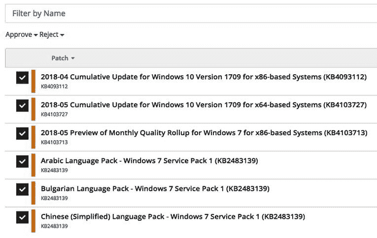
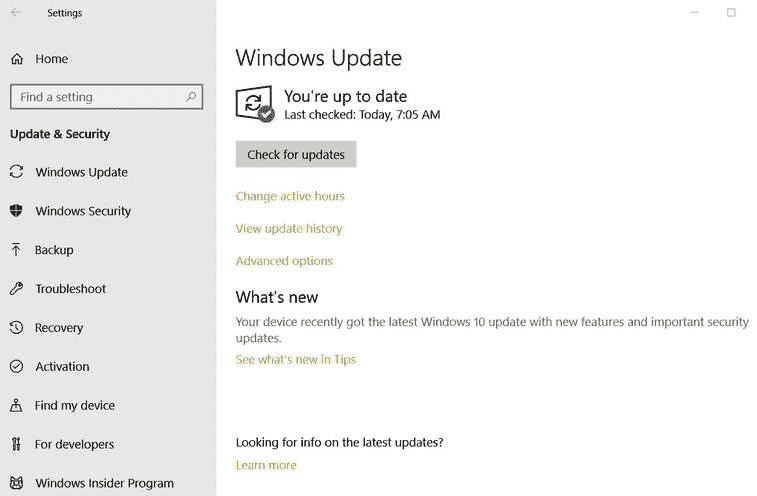
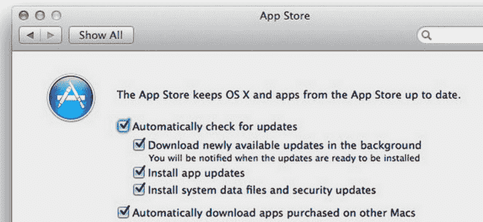
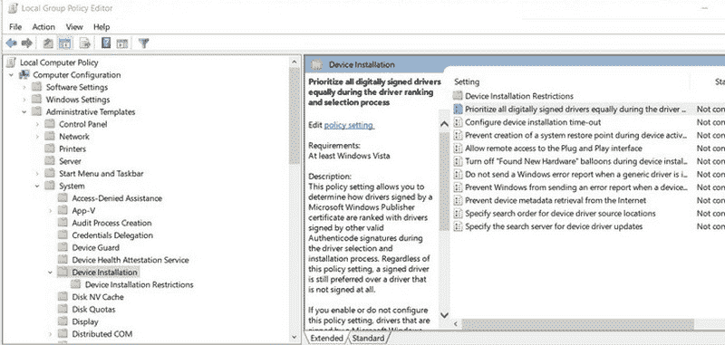
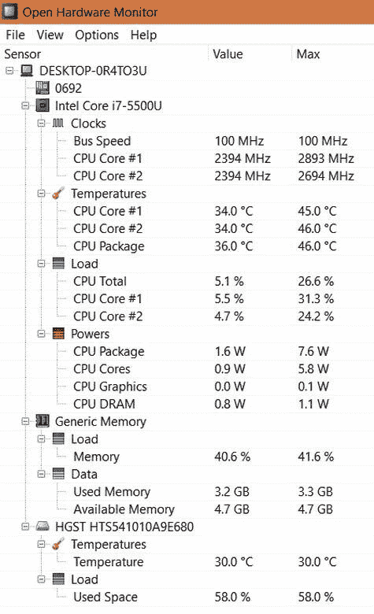
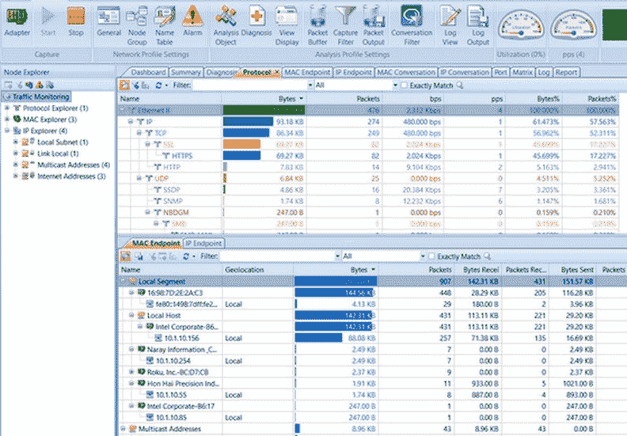
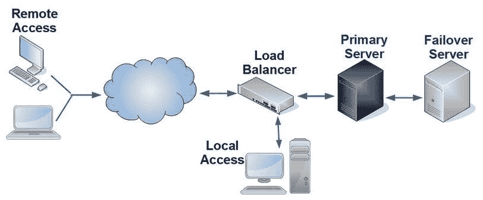

# 服务器维护

请记住，计算机无论多么复杂或昂贵，依然只是机器，尽管它们是电子设备。电子设备的活动部件非常少。事实上，除去二级存储设备中的读/写磁头、光存储设备中的开关抽屉，以及可能的几个其他可移动部件，计算机的整体设计并没有太多活动部件。我们可以说，计算机中流动的电信号是*活动部件*，但是比特及其传输介质实际上不会导致太多故障问题，服务器维护的核心就是防止故障并在故障发生时解决问题。

本章介绍与网络服务器维护相关的系统管理员职责和活动。这包括定义和执行变更和补丁应用管理程序，监控服务器外部组件的性能和健康状况，故障排除和解决网络服务器问题的过程，以及应用故障容错和高可用性技术。

本章将涵盖以下主题：

+   变更和补丁管理

+   性能监控

+   硬件维护

+   故障容错

# 变更和补丁管理

在系统和服务器管理的背景下，变更管理程序，通常被称为变更控制程序，有一个最重要的目的——确保适当和必要的补丁、更新和配置变更的应用遵循一个正式的、受控的、协调的和一致的方法论。两个术语——**变更管理**和**变更控制**——通常分别指服务维护和软件维护。然而，在 Server+考试中，变更管理通常指的是服务器和硬件维护，特别是操作系统维护。

一个正式化的变更管理或控制程序是一个书面、分发、审查、批准并实施的文档。根据组织的规模，程序不同阶段的参与人员包括 IT 人员、变更审查委员会或委员会成员，以及可能受到变更影响的利益相关者。当然，在较小的组织中，由于变更的范围和影响有限，通常仅涉及两到三名 IT 人员。在较大的组织中，参与者的数量会随着变更的潜在范围和影响而增加。在任何情况下，流程结构都会指导任何系统变更的审查、测试和应用。

在服务器管理环境中，变更管理程序的目的是包括以下步骤：

+   确定拟议的变更是否是必要的或适用的

+   确定拟议变更的影响及其将影响的人或事物

+   在非生产环境中测试变更

+   审查测试结果

+   获得批准以在生产环境中应用变更

+   应用变更

+   对变更后环境进行基准测试

# 变更控制过程

变更管理和控制程序应包括六个阶段。这些阶段如下：

+   **目的**：了解供应商关于拟议变更要修正、修补、修复或改进的内容，并决定该变更是否必要。

+   **范围**：任何变更都会对数据中心的当前操作产生主要和次要影响。因此，在继续之前，了解拟议变更的全部影响至关重要。这些知识应包括谁，以及什么。

+   **审批**：应由系统管理员以外的人员审核前面步骤的分析，并批准继续进行或确定需要进一步分析的领域。

+   **测试**：在将拟议变更实施到生产系统之前，先在非生产系统上进行测试。

+   **实施**：如果非生产环境测试的结果符合预期，则将变更应用于生产环境。在应用变更后，对系统性能进行基准测试。

+   **审查**：在一定时间内，检查已应用变更的结果，以确保其持续成功。

# 补丁管理

**补丁管理**是变更管理和控制的一部分，但其对操作系统任务和功能的重要性不及对系统安全性的影响。大多数补丁（供应商提供的更新和修复）解决了软件产品中发现的漏洞，例如操作系统或主要应用程序包。补丁的应用通常应遵循前两部分中讨论的方法。然而，补丁管理确实有一些独特的要求：

+   补丁管理应优先进行

+   维护准确的 IT 资产清单

+   制定并应用彻底的测试过程

+   分配责任

+   记录过程、行动和结果

在当今充斥着恶意软件、黑客、蠕虫、木马和其他恶意行为者的环境中，从发现漏洞（系统中的弱点或缺陷，黑客可能利用这一点）到发布修补程序进行修复的时间框架可能只有几个小时。在需要**高可用性**（**HA**）的系统环境中，应用修补程序可能会导致系统不可用一段不确定的时间。系统管理员必须分析修补程序是否适合系统，然后决定最佳的实施方式。

在大型分布式数据中心，尤其是那些从中心站点管理的远程位置，补丁管理（以及变更管理）会变得更加复杂。因此，许多人使用软件工具，如微软的**安全配置与分析**（**SCA**）工具、**Windows Server 更新服务**（**WSUS**）或**系统中心配置管理器**（**SCCM**）。第三方补丁管理系统也可作为本地或基于云的系统提供，如 SolarWinds Patch Manager（本地）、ManageEngine Patch Manager Plus 或 NinjaRMM（基于云）。

以下截图展示了 NinjaRMM 系统的补丁管理显示：

补丁管理调度显示。图像由 NinjaRMM 提供

# 操作系统更新

除了了解操作系统是否是最新且没有已知的错误或漏洞外，应用修复、补丁和更新是服务器及其网络安全的关键。操作系统更新修正了报告的代码错误，并在被利用之前或由于被利用而关闭漏洞。

大多数操作系统，包括 Windows、macOS 和许多 Linux 发行版，都包含自动更新功能。然而，组织的更新政策应决定是否启用该功能。禁用自动更新并不会消除管理员应用更新的能力；它只是不会自动进行。有些操作系统更新可能与为修复补丁所解决的问题插入的修正或操作步骤发生冲突。在应用更新或补丁之前，对其影响进行彻底分析，并进行前后测试，应该是任何变更管理流程的一部分。

要启用或禁用 Windows、macOS 和 Linux 中的自动更新功能，请遵循以下指南：

+   **Windows Server**: 在**活动目录**（**AD**）系统中，自动更新功能的控制可能是在组级别。组策略中的 WSUS 以及 Windows 更新和维护调度器设置了操作系统更新的时间、内容和方式的参数。也可以使用这些设置禁用自动更新。除了操作系统更新外，WSUS 还会更新 Microsoft 应用程序。

+   **Windows 7 和 8**：启用和禁用 Windows 7 或更早版本的自动更新功能位于控制面板中的“系统和安全”选项下，名为“Windows 更新”。该功能提供三个选项：

    +   开启或关闭自动更新：如果关闭，可以通过开始菜单中的 Windows 更新选项手动更新。

    +   检查更新：此选项会搜索未应用的可用更新，包括 Windows 操作系统、Microsoft Office 和其他 Microsoft 服务的手动应用更新。

    +   查看已安装的更新：此选项列出了操作系统中已安装的更新，包括它们的覆盖范围和发布时间。

+   **Windows 10**：自动更新的控制可以通过设置 | Windows 更新功能启用或禁用（请参见以下截图）：

Windows 10：Windows 更新页面

+   **macOS**：自动或手动操作系统更新的控制通过苹果商店中的一个页面实现。如下面的截图所示，控制有三个层级——自动检查更新；下载并可能安装更新；以及下载并安装在另一个 macOS 上购买的已安装软件：

苹果 macOS 自动更新配置

+   **Linux**：每个 Linux 发行版都有一个自动更新工具。例如，Ubuntu 和 Debian Linux 版本有 *unattended-upgrades* 工具，它下载并应用安全更新和系统补丁。另一个用于自动更新的 Linux 工具是 `yum-cron` 命令和 Red Hat 企业版 Linux 及相关发行版中的参数。

# 设备驱动程序更新

在 Windows 系统中，设备驱动程序的更新也可以自动化或关闭，无论情况如何。

若要设置自动设备驱动程序更新（开启或关闭），请按照以下步骤操作：

1.  运行 `gpedit.msc` 工具以打开组策略编辑器（请参见以下截图）。

1.  导航到计算机配置 | 管理模板 | 系统 | 设备安装（如果您要关闭此设置，还需要设备安装限制）。

1.  在设置窗口中，选择您希望激活的策略设置：

使用组策略编辑器配置自动设备驱动程序更新设置

# 固件更新

许多系统管理员遵循“*如果没有坏，就不要修*”的固件更新方法，并且只考虑那些改进或添加安全功能的更新。然而，即使安全性不是问题，仍然有更新固件的理由。例如，当您向一台较老的计算机添加一个更新的硬件组件时，这台计算机很可能需要进行 BIOS/UEFI 更新，以启用与该组件的兼容接口。请将固件更新视为操作系统或应用程序更新的方式。固件更新可能不会影响特定的服务器或网络，也可能没有必要。同样重要的是要记住，固件更新若是为了修复某个漏洞，可能会引入新的漏洞。

在将计算机构建为服务器时，或者当计算机或主板制造商建议您更新固件时，更新计算机固件也是一种良好的做法。无论是哪种情况，固件更新的操作方式因主板和计算机制造商的不同而有所不同。请查阅制造商的网站了解更新流程和应用程序说明。

# 硬件维护

在需要高可用性的网络中，网络和系统管理员必须依赖各种监控、错误通知和故障排除指南，以在出现问题时进行检测并发出警报。在高可用性系统中，停机不可接受。所有支持和维护活动都专注于确保正常运行时间和可用性。以下章节将介绍一些帮助管理员实现这些目标的工具。

# 服务器监控系统

服务器监控器为系统管理员提供自动化报告、计划设备检查和警告，提醒设备或系统可能接近或已经达到预设的阈值或上限设置，需要进行前瞻性故障排除。大多数服务器监控系统包括对网络服务器的主要系统、子系统和组件进行检查、测量并在必要时报告，内容包括以下：

+   **CPU 使用率**：高 CPU 利用率可能影响响应时间和生产力。

+   **硬盘空间**：低磁盘空间可能导致性能下降、缺失更新、高度碎片化和索引搜索变慢。

+   **磁盘输入/输出操作每秒（IOPS）**：磁盘 IOPS 是一个基准测量，表示二级存储设备的运行效率。

+   **RAID 健康状况**：RAID 系统可能会遇到各种问题，如控制器故障、分区错误，当然，还有一个或多个物理磁盘驱动器故障。

+   **RAM 利用率**：高 RAM 利用率可能导致运行时间延长、吞吐量降低，甚至可能导致系统或应用程序崩溃。

+   **硬件状态**：性能不佳的硬件组件可能会减慢或停止网络服务器的运行。主动检查硬件健康状况和处理能力可以避免系统停机。

+   **系统温度**：服务器（或网络节点）中的多个组件对高温敏感，包括微处理器，这就是为何系统温度需要监控的原因（见下方截图）：

一个硬件状态监控器示例

+   **网络利用率**：此指标是当前网络流量负载与网络介质最大吞吐量的比率，用以指示在任何给定时刻，网络介质的繁忙程度。以下截图显示了一个网络利用率程序的仪表板显示示例：

ColaSoft Capsa 软件的仪表板显示截图

+   **虚拟机性能**：一个活跃的虚拟机可以启用计数器来追踪其活动和性能水平，例如，输入/输出操作到虚拟磁盘、使用的内存量以及其网络流量。

# 发光二极管（LED）服务器状态指示器

设计用于网络服务器的计算机系统在主板、后面板或前面板上至少有一组 LED，或者这些位置的某种组合。LED 显示颜色和/或闪烁模式以指示系统的状态，从*一切正常*到*现在关闭电源*不等。服务器制造商在 LED 位置及其颜色和闪烁组合上存在差异。

下表显示了 Intel 服务器主板 LED 服务器状态指示器的示例。

| **颜色** | **显示** | **含义** | **操作** |
| --- | --- | --- | --- |
| 绿色 | 稳定 | 系统正常 | 无 |
| 绿色 | 缓慢闪烁 | 系统降级 | 内存错误**主板管理控制器**（**BMC**）检测到错误 |
| 琥珀色 | 缓慢闪烁 | 非致命缺陷 | 内存错误—错误阈值超过 |
| 琥珀色 | 稳定 | 致命 | 系统故障—CPU 配置错误 |
| 无 | N/A | 系统未准备好 | AC 电源关闭 |

服务器主板 LED 状态指示灯示例

# 液晶显示器（LCD）消息

除了 LED 指示灯之外，一些服务器系统还在小型 LCD 上显示服务器状态信息，通常一行文本限制在 25 至 65 个字符之间。如果在 POST 过程中或后续配置中出现问题，LCD 屏幕会显示一个简短的消息，例如下表中的示例。此显示通常仅限于服务器显示，不会显示在管理员控制台上。某些服务器（例如戴尔 PowerEdge 服务器 R-和 Tx20 系列）会在显示中的背景上着色，以指示问题的严重性，类似于以下图像的说明：

服务器 LCD 显示器示例

服务器 LCD 错误代码和消息示例如下表所示：

| **错误代码** | **消息** | **含义** |
| --- | --- | --- |
| `E1114` | 环境温度 | 环境系统温度超出可接受范围 |
| `E1210` | CMOS 电池 | CMOS 电池丢失或电压超出可接受范围 |
| `E1410` | CPU # IERR | 微处理器#报告内部错误 |
| `E1714` | 未知错误 | 出现错误，但 BIOS 无法确定其来源 |
| `E1810` | 硬盘##故障 | 硬盘##发生故障 |
| `E2014` | CMOS 失败 | CMOS RAM 功能异常 |
| `E2019` | 奇偶校验错误 | 主内存奇偶校验错误 |
| `E201E` | POST 内存测试 | BIOS POST 内存测试失败 |

服务器 LCD 错误代码和消息示例

来源: https://www.dell.com/support/

# 蜂鸣代码

当你启动 PC 时，一个固件工具，称为**开机自检**（**POST**），会检查 BIOS 或 UEFI 配置中包含的内部硬件组件。POST 会检查每个组件的存在（连接）、兼容性和功能（响应）。如果一切正常，POST 会发出清除信号并继续启动过程。一般来说，发出的信号是单次的*蜂鸣*音，但有些系统可能会发出两次蜂鸣。

然而，如果 POST 遇到问题，意味着 PC 无法通过 POST，可能会发生两种情况——发出一个蜂鸣代码模式，指示检测到的问题类型，或者在没有发出蜂鸣音的情况下断电。蜂鸣代码，也称为 POST 错误代码，在使用时，提供了一个大致的指示，表明导致 POST 失败的组件。可能是连接不良、设备被移除，或者是设备故障。蜂鸣代码的目的是为故障排除提供起点。

蜂鸣代码是存储在 ROM 或 NVRAM 芯片中的 BIOS/UEFI 模块的一部分。不幸的是，目前并没有统一标准，每个制造商可以在其计算机中使用不同的蜂鸣代码模式。即便是同一公司不同的 BIOS 产品，其代码含义也可能完全不同。如以下表所示，三家厂商虽然使用相同的蜂鸣代码模式，但他们为其代码分配了不同的问题或条件。短音是指约十分之一秒的快速蜂鸣音，而长音则大约是短音的两倍长：

| **故障/问题** | **AMIBIOS（美国兆芯）** | **Award BIOS（凤凰科技）** | **IBM 公司** | **戴尔电脑** |
| --- | --- | --- | --- | --- |
| DRAM | 1 次蜂鸣 | 连续音调 | - | 2 次短音 |
| CPU | 5 次蜂鸣 | 重复的低音和高音 | 1 长音，1 短音 | 7 次蜂鸣 |
| 键盘 | 6 次蜂鸣 | 1 短音，2 短音，2 短音，1 短音 | 3 次长音 | - |
| CMOS | 10 次蜂鸣 | 1 长音，4 短音 | 2 次短音 | 1 次短音 |
| 显示器 | 8 次蜂鸣 | 1 长音，3 短音 | 1 长音，3 短音 | 6 次短音 |

每个厂商可能有完全不同的蜂鸣音调

# 更换故障组件

构成网络服务器硬件的组件分为两大类，每类都有自己的处理、安装程序和复杂性。下表展示了几种服务器组件的分类。

+   **客户可更换单元（CRU）**：这些是用户/客户能够移除和更换的组件。CRU 根据更换难度分为不同等级，例如 CRU 1 更换起来相对简单，而 CRU 3 则较为复杂。在某些系统中，CRU N 或 CRU X 表示用户不应尝试更换的组件。CRU 的例子包括显示器、键盘、电池以及所有外部设备。

+   **现场可更换单元（FRU）**：这些是仅限合格现场服务代表移除和更换的组件。FRU 的示例包括硬盘、主板、内部控制单元、风扇、背板和内存：

| **组件** | **CRU/FRU** |
| --- | --- |
| CMOS 电池 | FRU |
| DIMM 内存条 | FRU |
| 硬盘 | CRU |
| 内部电缆 | CRU |
| 内存卡 | FRU |
| 微处理器 | FRU |
| 电源单元 | CRU |
| RAID 控制器 | FRU |
| SSD 硬盘 | CRU |

服务器组件的 CRU/FRU 设计示例

# 预防性维护

不幸的是，计算机，尤其是服务器，并不是*设定好就忘记它们*的设备。它们需要持续的监控和管理。这些努力中的一个非常重要部分是组织一个预防性维护活动的计划，并严格遵守和记录。这些活动几乎适用于每个调度频率：每日、每周、每月、每季度、每年，甚至在这些之间。

预防性维护的主要目的是避免设备或组件故障，这会导致纠正性或恢复性维护。就像接种流感疫苗帮助预防感染流感一样，一个强有力的**预防性维护**（**PM**）计划可以避免未来出现严重问题。当然，PM 计划通常因系统、数据中心和网络的不同而有所不同，但有一份任务清单是任何 PM 计划都应该包括的。

以下表格列出了这些操作的示例：

| **频率** | **任务** |
| --- | --- |
| 每日 | 检查服务器错误和使用日志，识别潜在问题 |
| 每周 |

+   检查服务器的磁盘空间

+   清理打印机中的纸屑灰尘

+   检查适当的空气流通

+   确保杀毒软件是最新的

+   审核系统用户，确保遵守病毒防护政策

+   确认操作系统的补丁和关键修复程序已更新并安装

+   检查事件日志中的错误

+   检查系统资源，如硬盘、RAM 和 CPU，确保其可用性和性能

|

| 每月 |
| --- |

+   检查笔记本电脑和移动设备的电池

+   监控并收集内存、CPU 和磁盘使用趋势的数据

|

| 每季度 |
| --- |

+   清洁冷却系统和风扇上的灰尘

+   清洁键盘、鼠标和其他活动部件

|

| 每年 |
| --- |

+   测试不间断电源

+   检查网络布线

+   审查预防性维护计划的有效性

|

服务器预防性维护示例计划

# 容错性和高可用性

用来描述能够抵抗故障的服务器系统的术语之一是*硬化*。虽然硬化通常与关闭未使用的端口和其他漏洞有关，但要实现真正*硬化*的系统，通常需要应用容错技术。

当一个组件发生故障时，它可能会影响另一个组件的功能，进而影响到另一个组件的功能。这种故障组件的连锁反应会导致级联故障，这是不利的。有几种方法可以使服务器具备容错能力（故障耐受性），意味着服务器能够承受组件故障并保持可用，从而实现高可用性。

# 集群

一台服务器通常是运行服务器软件的单个计算机，而服务器集群则由一组互动的服务器组成。服务器集群的主要目的是提高处理吞吐量和用户响应能力。一个服务器集群由两个或更多互联的服务器组成，在主服务器或负载均衡服务器/控制器的控制下，作为一个单一的单元运行。

服务器集群提供的主要好处如下：

+   **可扩展性**：在网络或用户需求超出现有集群能力的情况下，将额外的服务器加入集群以处理增加的负载相对容易。

+   **可靠性**：单台服务器既是单点故障源，有时也是瓶颈。服务器集群将处理负载分散到多个服务器上，这样即使集群中的单台服务器发生故障，也有可能继续正常运行。

+   **可管理性**：对单台服务器进行维护通常需要停机。然而，服务器集群能够保持操作的连续性，即使其中一个或多个集群设备正在接受维护。

然而，服务器集群也有一些缺点，包括以下几点：

+   **基础设施**：服务器集群需要更多的计算机和支持基础设施，这增加了维护系统的开销。

+   **兼容性**：并非所有设计为服务器的计算机都适合集群使用。集群是一种相对固定的结构，超出附加扩展性后就不太灵活。一些软件应用程序也不兼容集群。

+   **成本**：集群可能很昂贵，且其设计必须精心设置以确保高效运行，从而增加了管理和运维成本。

# 主动/主动与主动/被动集群

服务器集群的两种主要配置是**主动/主动**和**主动/被动**。这两种配置都是高可用性的策略。主动/主动服务器集群通常是负载均衡解决方案，它将两个或多个执行相同处理步骤的计算机互联。如下图所示，一个刀片服务器机箱包含几个活跃的服务器。负载均衡设备或服务器负责管理任务分配到服务器，从而优化网络的响应时间：

一个主动/主动服务器集群的示例

相比之下，如下图所示，主动/被动服务器集群配置也有两个或多个互联的服务器，并且可能有一个或多个主动服务器共享处理负载，以及一个或多个故障转移、备份或待命服务器，准备替换已失败的服务器或因维护而暂时停用的服务器：

一个主动/被动服务器集群的示例

# 负载均衡

如上所述，负载均衡是一种将传入网络流量分配到池、农场或集群中两个或更多服务器的功能。负载均衡可以通过特定的软件、硬件设备或专用计算机来执行。负载均衡服务器或设备使客户端/服务器应用程序或内容提供商能够通过将传入的服务请求分散到服务器组的可用容量上来平衡高流量。实际上，负载均衡器是一种路由器。路由器根据最佳路径将流量导向目的地，而负载均衡器则将流量导向具有适当软件或数据的服务器，或者像路由器一样，负载均衡器将流量导向最佳可用服务器。

负载均衡应用程序或设备的主要功能是将传入的客户端服务请求分配到服务器集群，以实现效率，通过仅将流量均衡到活动服务器来提供高可用性，并通过允许管理员根据需要向集群中添加或删除服务器来提供灵活性。

负载均衡器使用多种算法来确定传入消息应发送到集群或组中的哪台服务器进行处理。常用的负载均衡算法包括以下几种：

+   **基于代理的自适应负载均衡**：这是与*加权*算法一起使用的补充算法。集群中的每台服务器都有一个代理，与负载均衡器交互，实时更新其服务器的状态。负载均衡器利用这些数据来确定哪个服务器处理请求。

+   **链式故障转移**：处理组或集群中的服务器形成一个串行链。传入的消息首先到达链中的第一台服务器。如果该服务器无法处理该消息，则将其传递给下一台服务器进行处理。如果该服务器也无法处理该消息，则继续传递，直到有服务器能够处理它。

+   **最少连接**：圆形轮询算法在决定消息发送到哪里时，并不考虑服务器组的当前负载。然而，最少连接算法会查看每台服务器的负载，并将消息分配给活跃进程最少的服务器。

+   **轮询**：在一个活动/活动集群中，每个服务器都能平等地处理消息流量。尽管所有负载均衡器和每台服务器共享相同的域名，但每台服务器都会分配一个唯一的 IP 地址。该域名的主 DNS 服务器会将域名与集群中的每个 IP 地址关联。当请求该集群域名的 IP 地址时，将提供一个服务器 IP。每次 DNS 请求后，提供的 IP 地址会轮换。

+   **软件定义网络（SDN）自适应**：该负载均衡技术结合了来自表示层和传输层的网络数据，以及来自数据链路层和网络层的网络数据，以了解服务器及其活动应用的状态、网络本身的状态，以及是否存在网络拥塞或阻塞，从而做出负载均衡决策。

+   **源 IP 哈希**：该算法将客户端和服务器的源地址与目标地址转换并一起哈希，生成一个密钥，负载均衡器利用该密钥将消息转发到特定服务器。若处理过程被中断并重新启动，则可以重新计算哈希密钥。

+   **加权最少连接**：集群或组中的服务器根据其资源和能力接收一个加权值。具有更多资源的服务器会收到更高的值。该值与每个服务器的连接数结合起来，用于确定服务器的优先级。具有更多资源的服务器会承担更多负载。

+   **加权响应时间**：间歇性服务器响应时间检查根据服务器的响应时间为服务器设置排名。负载较重的服务器响应较慢，而负载较轻的服务器响应较快，导致响应时间最快的服务器接收更多的消息——至少直到响应时间检查重新进行。

+   **加权轮询**：除了基本的轮询算法外，每个服务器会收到一个权重因子。具有较高权重的服务器会接收更多的消息。

# 心跳

心跳机制，也称为心跳网络或心跳协议，是一种常见的集群服务器分发方法。集群中的每台服务器通过共享心跳消息与同步服务器（或*同步*）进行通信，表明其处于活动状态。

集群中的每个活动服务器定期向*同步服务器*发送心跳消息，指示其健康状态。同步服务器将这些心跳消息添加到**先进先出**（**FIFO**）推送堆栈的底部。FIFO 堆栈中的顶部条目会向负载均衡器或集群管理器指示哪个活动服务器将接收下一个消息请求。然而，如果某个服务器未在规定时间内提供心跳消息，系统会认为该服务器没有心跳，因此不可用。

# 热的与不热的

**高可用性**（**HA**）策略旨在保持服务器、网络或云服务持续运行并对用户和订阅者可用，无需关闭服务器即可更换故障或空闲的组件。HA 程序可以解决服务器可用性的多个方面，包括数据恢复、服务器故障切换、组件替换和灾难恢复。在 Server+考试中，你应该会看到一两个问题，涉及组件替换以及热插拔和非热插拔设备和程序之间的区别。

# 热交换

尽管热插拔被广泛使用，但它并不是热交换。通常，热插拔设备会通过即插即用与系统连接，但通常仍然需要另一个步骤才能完成安装。另一方面，热交换设备可以在运行中的计算机上安装并立即使用。

可能最常见的热插拔设备是**通用串行总线**（**USB**）闪存驱动器。虽然 USB 闪存驱动器通常不是网络服务器上的二级存储，但其他 USB、FireWire、Thunderbird 和 eSATA 设备，如外部存储设备、网络适配器和其他外设设备，通常是可热插拔的。通常被认为是内部设备的组件，如电源和硬盘驱动器，也可以是热插拔的。然而，并非所有电源和硬盘驱动器都是热插拔的，也并非所有计算机都支持热插拔。

# 非热交换

热插拔设备和非热插拔设备之间的主要区别在于，非热插拔设备的替换通常需要重启计算机。无论系统重启多么快速，在此过程中系统对用户是不可用的。这种设备替换方法称为温插拔。

另一种非热插拔设备替换方法是冷交换，这需要系统关闭（断电）。

# 服务水平协议（SLA）

服务水平协议（SLA）是服务提供商向服务订阅者提供的一种常见工具。信息系统 SLA 的基本要素如下：

+   **各方**：协议各方或其代理人的具体身份，列出其在协议下的权限和能力。

+   **服务**：协议特别涵盖的服务，按功能、程序、行动、时间和相关指标定义。

+   **性能**：对时间、容量、持续时间、可接受的性能、不可接受的性能、正常运行时间承诺、停机限制以及约定的指标和阈值的规范。

+   **实施**：如果所覆盖服务的实施有时间表，协议必须指定时间、任务、目标以及验收或完成标准。

SLA 中常见的其他领域如下：

+   **计划停机时间**：对任何约定的计划系统停机时间的划分，在此期间无法访问。

+   **非计划停机**：*在系统遭遇非计划性、长期或灾难性停机时，服务订阅者有哪些权利，且服务提供商约定的恢复要求是什么？*

+   **客户通知**：SLA 应详细说明服务提供商将使用何种方式通知订阅者系统状态的变更，并定义在计划停机事件中通知的时间要求。

+   **平均修复/恢复时间（MTTR）**：在非预期停机情况下，承诺的停机时长，可以是历史数据、估算值或行业数据。

# 摘要

变更管理程序确保必要的补丁、更新和变更遵循受控和一致的过程。服务器环境中的变更管理应遵循六个阶段——目的、范围、批准、测试、实施和审查。补丁管理是变更管理和控制的一部分。补丁管理应当是优先事项。固件更新通常是修复错误。

服务器监控器提供自动报告、定期设备检查、阈值警告和故障排除警告，涵盖 CPU 使用率、硬盘空间和利用率、磁盘 I/O、RAM 使用率和网络流量等内容。网络服务器的组件可以是 CRU 或 FRU。预防性维护可以避免设备或组件故障。

服务器集群的目的是通过两个或更多互联的服务器在主服务器或负载均衡服务器的控制下作为一个整体来提高处理能力和响应用户的能力。服务器集群的两种配置是主动/主动和主动/被动。主动/主动服务器集群是一种负载均衡解决方案，将两台或更多执行相同处理步骤的计算机连接在一起。主动/被动服务器集群包含互联的服务器和一个备用服务器，在服务器发生故障时替换它。

负载均衡将传入的网络流量分配到两个或更多的服务器上，以将传入的服务请求分布到服务器组的容量上。高可用性（HA）策略在更换故障组件时保持服务器对用户可用。热插拔设备可以在运行中的计算机上安装并立即使用。非热插拔设备需要重启计算机。

服务水平协议（SLA）是服务提供商提供给服务订阅者的常见工具。信息系统 SLA 的基本元素包括各方、服务、性能和实施。SLA 的其他典型内容包括计划停机、非计划停机、客户通知和 MTTR。

# 问题

1.  以下哪项不是变更控制过程的阶段？

    1.  批准

    1.  即时应用

    1.  实施

    1.  目的

    1.  范围

    1.  测试

1.  变更管理程序与补丁管理程序之间的一个区别如下：

    1.  补丁管理应当是优先事项

    1.  补丁应当使用与主要操作系统更新相同的变更管理过程

    1.  补丁管理不需要测试

    1.  软件补丁仅影响用户界面

1.  什么类型的软件提供定期的设备检查，包括对预设阈值、硬盘利用率、磁盘 IOPS 和其他服务器系统健康指标的检查？

    1.  资产管理系统

    1.  SNMP-MIBs

    1.  服务器监控

    1.  数据包嗅探器

1.  IOPS 指标的重要性是什么？

    1.  它是最大通道/总线带宽的估算值

    1.  它代表了对二级存储设备上非连续存储位置进行的最大读写（输入/输出操作）次数

    1.  它反映了 CPU 每秒执行的独立操作数量

    1.  它衡量 CPU 每秒进行的 I/O 操作次数

1.  如果 BIOS/UEFI 启动过程中检测到错误或潜在错误，它会发出代码来识别问题及其来源。这些可听见的信号通常被称为什么？

    1.  错误指示灯

    1.  故障报警

    1.  蜂鸣代码

    1.  POST 警报

1.  一种可以由服务器所有者的员工安装、配置或拆卸的服务器组件或外设被归类为哪种类型的设备？

    1.  **现场可更换单元**（**FRU**）

    1.  **用户可更换单元**（**URU**）

    1.  **远程可更换单元**（**RRU**）

    1.  **客户可更换单元**（**CRU**）

1.  预防性维护程序的目标是：

    1.  为了延长服务器组件的使用寿命

    1.  为了避免组件故障

    1.  为了保持服务器的正常运行时间承诺

    1.  以上所有

1.  通过将两台或更多服务器互联，作为单一设备进行操作，来提高处理过程的吞吐量和响应能力，这描述了哪种服务器配置？

    1.  主动/主动

    1.  主动/被动

    1.  被动/被动

    1.  热插拔

1.  服务器集群配置中，如果需要，备用服务器或故障转移服务器可以替换故障服务器，这种配置是：

    1.  主动/主动

    1.  主动/被动

    1.  被动/被动

    1.  热插拔

1.  在系统仍然运行并保持生产力的情况下，管理员可以更换的故障服务器设备或组件是：

    1.  冷插拔

    1.  温插拔

    1.  热插拔

    1.  恰到好处的交换
