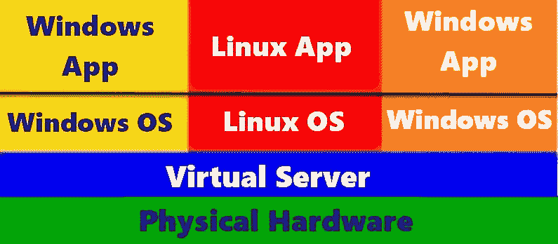
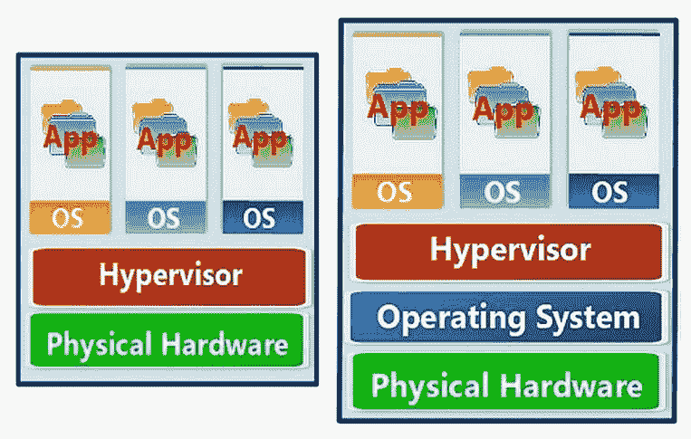
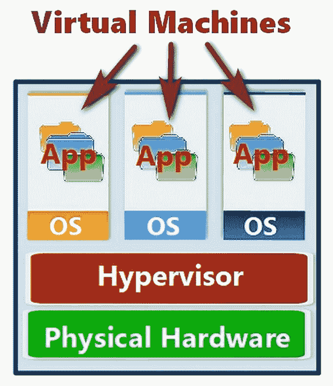

# 虚拟化

当某物是虚拟的时，它是存在的，但又不完全存在。虚拟计算机存在于一台实际的、可以触碰的物理计算机中。好吧，它其实并不完全“真实”，但它在一台计算机里？是的，你明白了！不过，为了确保我们彼此的理解，Merriam Webster 字典在计算机领域中对“虚拟”的定义是*在计算机或计算机网络上存在或被模拟的*。这个定义很好地描述了虚拟设备是如何产生的，以及它存在的地方。

虚拟化网络环境为组织提供了创建多个**虚拟机**（**VMs**）的能力，每个虚拟机运行不同的操作系统和应用程序。这使得组织能够通过扩展单台计算机的功能，最大化其 IT 资源的容量，从而为多个用户同时提供直接计算能力。

本章将介绍计算机网络环境中虚拟化的概念和应用。内容包括术语、拓扑、组件（虚拟与物理）、它们的配置和目的。了解了这些虚拟化环境的要素后，我们就能理解虚拟化网络的目的和运作方式。我们将讨论的具体内容如下：

+   虚拟环境

+   虚拟机管理程序和虚拟网络管理器

+   虚拟主机与虚拟客机

+   虚拟环境的硬件配置

+   虚拟网络中的资源分配

# 虚拟网络

网络中使用的虚拟化有三种类型，每种类型都有其特定的目的和操作：

+   **虚拟私人网络（VPN）**：通过使用隧道协议，在互联网上建立安全连接

+   **虚拟局域网（VLAN）**：在逻辑域中对网络节点进行分组

+   **虚拟网络**：不要与 VLAN 混淆，虚拟网络使用虚拟的、软件生成的组件，来扩展物理计算设备的能力

VPN 通过互联网建立一个虚拟化的直接连接，将远程设备与内部网络连接。VPN 的目的是提供与直接有线连接相同的保护和安全性。VLAN 则创建一个网络节点的逻辑安排，无论它们的位置如何，都能形成一个单一的域结构。VLAN 是一个网络的虚拟子集，属于碰撞域。不过，不要把 VLAN 和子网混淆。

# 虚拟网络组件

如下图所示，虚拟化网络环境的基本组成部分包括物理硬件、虚拟网络服务器和一个或多个虚拟机，每个虚拟机运行一个客操作系统，并支持在虚拟空间中运行的应用程序。

在任何虚拟环境下面都是必须支持你设想的虚拟化环境资源需求的物理基础设施。在讨论虚拟环境的组件时，请牢记物理硬件的重要性：

虚拟化环境的结构

# 虚拟设备

无论网络是物理的还是虚拟的，它都需要连接网络设备的功能，如交换机、路由器和网络接口。虚拟网络与物理网络的不同之处在于，许多甚至所有连接设备本身都是物理设备的虚拟化版本，并具有相同的功能。

在虚拟网络中，基本的虚拟设备包括虚拟服务器、虚拟机、虚拟网络接口、虚拟交换机和虚拟路由器。在物理网络中需要的任何物理组件在虚拟环境中都有对应的虚拟版本。

# 虚拟服务器

网络增长，添加节点、应用程序和范围。过去，管理网络增长意味着添加一个或多个物理服务器来处理现有服务器的额外需求。添加物理服务器在硬件获取、配置和停机时间方面可能会很昂贵。另一方面，添加虚拟服务器只需配置时间，实施成本大大降低，服务中断也少得多。

服务器虚拟化是将物理服务器分割成两个或更多虚拟服务器。服务器虚拟化隐藏了物理硬件，用户只能看到分配给正在使用的虚拟机的资源。服务器虚拟化主要有三种类型：

+   **全虚拟化**: 这种服务器虚拟化形式用专门的操作形式取代了物理服务器的操作系统，通过监管器或虚拟化管理器实现。虚拟化管理器充当虚拟服务器和虚拟机之间的中介，它们在其环境中运行并且互不感知，而物理计算机及其资源则在背后提供支持。全虚拟化系统的例子包括 Adeos、Mac-on-Linux、Parallel Desktop for Mac、VMware ESXi、VirtualBox、Win4BSD 以及**快速仿真器**（**QEMU**）或 Microsoft Hyper-V。

+   **Para-virtualization**: 在这种形式的服务器虚拟化中，一个**虚拟化管理器**（**VMM**）支持已经修改以在这个环境中运行的虚拟服务器。这种虚拟化方法允许两个或更多不同的操作系统共享一个物理计算机及其资源。这种虚拟化形式的一个主要例子是 Xen 项目虚拟化管理器。

+   **操作系统级虚拟化**：这种形式的服务器虚拟化创建了一个环境，其中多个处理空间，称为容器、区域、虚拟化引擎或监狱，是独立的处理空间，它们都在同一个操作系统上运行。代替虚拟机管理程序，本地操作系统为虚拟化环境提供支持。此类型的服务器虚拟化示例包括 Linux V-Server、FreeBSD Jail、AIX 工作负载分区和 Solaris 容器。

# 虚拟机管理程序（Hypervisor）

虚拟化的一个关键部分是虚拟机管理程序（Hypervisor），或虚拟机监控器（VMM），它是低级软件，允许多个虚拟机在单一物理计算机上运行。虚拟机管理程序有两种类型，以及一种将两者融合的混合类型。两种虚拟机管理程序类型如下：

+   **类型 I**：这些是裸机型、嵌入式或原生虚拟机管理程序。这种类型的虚拟机管理程序直接安装在物理硬件上，或者安装在计算机的*裸金属*上，如下图所示。

+   **类型 II**：这些是托管型虚拟机管理程序。如以下图所示，类型 II 虚拟机管理程序在主机计算机的操作系统上运行：

类型 I 虚拟机管理程序配置（左）和类型 II 虚拟机管理程序配置（右）

如前图所示，类型 I 和类型 II 虚拟机管理程序的主要区别在于，一个在没有底层主机操作系统的情况下运行（类型 I），而另一个则有（类型 II）。

尽管技术上不属于独立的虚拟机管理程序类别，但一些公司发现根据不同的工作负载配置不同的虚拟机管理程序能为他们提供更高效的计算解决方案。第三方软件可以管理多虚拟机管理程序环境，从而创建混合虚拟机管理程序部署。

# 主机和客户机

经常混淆或互换使用的三个虚拟化术语是虚拟机、主机和客户机。虚拟机和客户机是同一个概念的不同表达。每个术语指的是在主机计算机上由软件创建和管理的工作空间，它模拟一个虚拟计算机。术语*主机*可以指主机硬件，或指虚拟系统运行的计算机，或者在类型 II 环境中的主机操作系统。主机系统通常能够支持多个客户机系统。

# 虚拟机（VM）

虚拟机是一个完整的计算机系统，包括其设备、操作系统、应用软件等，它通过软件创建并在物理计算机上运行，可能与其他虚拟机一起运行。虚拟机能够像在物理计算机上运行一样运行程序或应用，尽管这些程序或应用在虚拟配置的计算机上运行：

主机系统上的虚拟机

**虚拟机管理界面**（**VMMI**），即 VM 控制面板，允许管理员在虚拟化环境中监控、创建、删除、暂停、启动和停止虚拟机。有些工具还提供了重新配置主机系统物理资源分配给一个或多个虚拟机的功能。主要的虚拟化系统开发商（Citrix、Microsoft 和 VMWare）都提供 VMMI 软件，作为其服务器虚拟化包的一部分。也有一些第三方和开源的 VMMI 软件包，兼容许多虚拟化系统，包括一些基于**简单网络管理协议**（**SNMP**）的系统。

# 虚拟环境的硬件配置

支持虚拟服务器、虚拟机或其他虚拟设备的硬件配置取决于每个网络环境，而每个网络环境又取决于每个独立的组织。主要的虚拟化软件提供商都有网站，用户可以通过这些网站确定最适合自己需求、硬件和计划的硬件配置。然而，虽然这些并不是标准，但仍然有一些通用的指南，用于配置计算机以支持虚拟环境。需要考虑的主要组件包括 CPU、内存、BIOS/UEFI 和物理网络容量。

和计算机中的其他内容一样，您所需的计算能力和内存实际上取决于您计划做什么。您的选择可能取决于能够定义您组织需求和近期需求的问题的答案。一些需要考虑的因素包括以下内容：

+   **CPU**：与主内存一起，需要一个或多个足够支持虚拟化系统大小和容量的处理器：

    +   如果虚拟化网络中有多个物理计算机，您应确保每台计算机都使用相同的 CPU 平台（Intel 与 AMD）。虚拟机可以轻松地从一台物理计算机迁移到另一台，但前提是计算机必须使用相同的 CPU 平台。

    +   仅选择那些为硬件虚拟化支持进行了优化并包含 Intel-VT 或 AMD-V 的处理器。

    +   多核处理器可以提供额外的处理能力，尤其是在较大的虚拟化环境中。

+   **内存**：主机计算机上可以运行的虚拟机数量取决于主机上可用的内存量。内存是虚拟化环境中最限制性的资源。

+   **BIOS/UEFI**：在带有 AMD-V 的 AMD 处理器上，此功能会自动启用。然而，在 Intel 处理器上，Intel-VT 功能初始状态为禁用，必须通过 BIOS 或 UEFI 启用。

+   **物理网络**：无论虚拟化的**软件定义网络**（**SDN**）结构如何覆盖物理网络硬件，物理网络都承担网络流量的传输。物理网络需要足够的容量，以支持虚拟服务器和虚拟机产生的所有流量，就像它们直接作为物理网络的一部分一样。

# 虚拟资源分配

在虚拟化环境中，资源（如 CPU、内存和数据存储）会根据每个虚拟机的资源共享、预留和限制设置进行分配。虚拟数据中心管理资源池，并根据需要为每个虚拟机提供初始资源配额和按需资源，直到分配达到上限。资源池由主机计算机的物理资源组成，减去操作系统（如有）和虚拟化管理程序的资源需求。

当主机的物理资源无法满足其虚拟机的资源需求时，可能需要对资源进行分配或设定限制。管理员可以采取以下措施为一个或多个虚拟机分配资源：

+   为一台或多台虚拟机创建一个物理资源预留，资源来自主机计算机或服务器集群。

+   为虚拟机分配固定的物理资源共享

+   为虚拟机分配一个优先级，确保其获得更多的物理资源共享

+   设置虚拟机资源分配的上限

用于平衡物理系统资源分配和虚拟机使用的主要分配方法如下：

+   **资源分配共享**：共享表示虚拟机对特定资源的优先级或重要性。共享分为三个级别——**高**、**正常**或**低**，对应的共享数为：高共享为*4*，正常共享为*2*，低共享为*1*。管理员也可以设置自定义级别，并为虚拟机分配特定数量的共享，设定与其他虚拟机共享的比例。

+   **资源分配预留**：资源预留设置分配给虚拟机的物理资源的最小数量（以 MB 或 MHz 为单位）。如果预留的资源量不可用，虚拟机将以较低的共享开始，直到预留资源变得可用为止。

+   **资源分配限制**：分配限制设置了可以分配给虚拟机的物理资源的上限。虚拟服务器可以分配多个资源分配预留量，但在设置了分配限制后，不能超过该限制（以 MB、MHz 或 IOPS 为单位）。默认情况下，CPU、内存和数据存储的限制是无限制的。

# 网络连接

网络连接性和带宽是宿主资源，可能会分配给在其上运行的虚拟机。分配的数量可以预设，类似于前述资源，也可以根据特定传输的通信需求进行分配。

虚拟机上的网络连接可以有三种配置：

+   **直接访问（桥接）**：拥有分配 IP 地址的虚拟机可以直接访问外部网络。虚拟机能够通过宿主计算机的网络适配器与物理网络进行通信，并直接与网络节点交互。

+   **网络地址转换（NAT）**：在此配置中，虚拟机使用宿主计算机的 IP 地址与网络进行通信。如果虚拟机没有自己的 IP 地址，则此选项最为合适。

+   **仅主机**：此配置创建宿主计算机的网络适配器与虚拟机之间的连接。换句话说，虚拟网络适配器对宿主系统可见。在此配置下，虚拟机只能与宿主机及宿主机上运行的其他虚拟机进行通信。

# 虚拟互联设备

虚拟网络使用的互连设备与物理网络基本相同——**网络接口控制器**（**NIC**）、网络交换机和网络路由器。在虚拟网络中，这些设备（以及其他一些设备）是软件定义且虚拟的。它们分别是**虚拟 NIC**（**vNICs**）、**虚拟交换机**（**vSwitches**）和**虚拟路由器**（**vRouters**）。虚拟机通过其 vNIC 连接到虚拟网络，vNIC 在逻辑上连接到宿主机的**物理 NIC**（**pNICs**）。

在许多虚拟网络中，vNIC 连接到 vSwitch，vSwitch 又连接到 vRouter。这些虚拟连接设备的功能与它们的物理对应设备相似。然而，像所有虚拟设备一样，它们最终会与物理网络进行互连。

# 摘要

网络中使用了三种虚拟化，每种虚拟化都有其特定的目的和操作——VPN、VLAN 和虚拟网络。虚拟化网络环境的组成部分包括物理硬件、虚拟网络服务器和虚拟机。在虚拟网络中，设备包括虚拟服务器、虚拟机、虚拟网络接口、虚拟交换机和虚拟路由器。服务器虚拟化将物理服务器分割为虚拟服务器。服务器虚拟化有三种类型：完全虚拟化、半虚拟化和操作系统级虚拟化。

虚拟机监控程序是一个软件，可以使多个虚拟机在单个物理计算机上运行。虚拟机监控程序有两种类型——类型 I 或裸金属虚拟机监控程序和类型 II 或托管虚拟机监控程序。类型 I 和类型 II 虚拟机监控程序的区别在于，类型 I 在没有底层宿主操作系统的情况下运行，而类型 II 虚拟机监控程序是在宿主操作系统之上运行的。

虚拟机（VM）是一个由软件创建和管理的工作空间，在主机计算机上模拟一个虚拟计算机。主机可以指计算机的物理硬件，或在二级环境下的主机操作系统（Host OS）。主机系统通常支持多个客户机（虚拟）系统。虚拟机是一个完整的计算机系统，运行在主机计算机上，通常与其他虚拟机一起运行。

配置虚拟环境所需的硬件配置包括 CPU（支持硬件虚拟化）、内存、BIOS/UEFI 和物理网络。资源通过共享、预留和限制进行分配。网络连接和带宽是主机资源，可以分配为直接访问、NAT 和主机专用。
