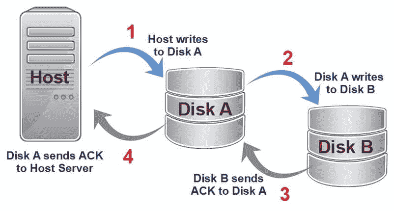
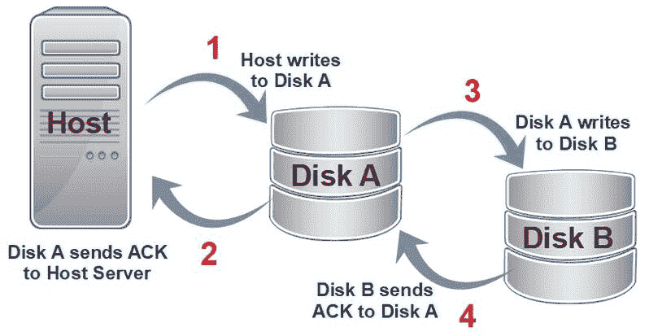
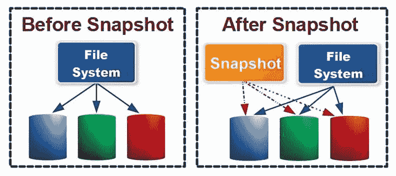

# 第十章：灾难恢复

尽管灾难恢复的过程涉及诸多内容，但希望它永远不需要被使用。灾难恢复程序的复杂性随着所涉及系统的规模、位置、多样性和应用而起伏波动。较小的系统环境仅通过定期备份系统即可保护自己免受灾难。而支持分布式系统、大型网络、虚拟化以及可能包括云服务的大型数据中心环境，在识别业务持续性所需元素及其恢复顺序时面临的任务更加复杂——更不用说具体的恢复时机和地点了。中型操作则介于这两者之间。

在本章中，我们将回顾灾难恢复与业务持续性规划与执行中涉及的定义、方法、产品和应用。我们将讨论以下主题：

+   业务持续性

+   恢复

+   备份与复制

# 恢复计划

完整的灾难恢复计划不仅仅是确定恢复硬件、加载数据并恢复在线这么简单。一个恢复计划至少应包含以下元素：

+   **范围**：识别所涵盖的事件、原因或情况

+   **评估**：用于确定损害程度并采取适当恢复行动的过程

+   **阶段**：适应损害的恢复行动所需的材料、设备、人员和应急准备

+   **恢复**：恢复、重新安装和恢复系统、应用程序和数据的详细步骤

+   **重新评估**：审查和评估恢复过程以及对计划进行调整和改进的计划

任何组织的灾难恢复规划中的首要目标是制定一个计划。该计划应具体，但也应现实，并仅涵盖该特定地点可能发生的灾难事件。例如，堪萨斯的一家公司可能不需要在其灾难恢复计划中包含火山喷发，而位于夏威夷的组织则可能不需要涵盖暴风雪。

灾难恢复计划（DRP）实际上可能是几个共享部分或全部阶段的计划。例如，关于飓风的灾难恢复计划部分可能会与暴雨或强风部分共享。无论是天气、战争还是更糟糕的事件，计划中的每一部分都必须具体说明用于从中恢复的流程。

# 恢复站点

灾难恢复的首要任务之一是选择恢复站点。对于一些组织来说，灾难恢复可能需要多个站点，这取决于损害的严重性或恢复计划的优先级。虽然存在一些重叠，但实际上有三个级别的恢复站点，每个站点都有其特定的需求和响应能力。恢复站点分为热站点、温站点或冷站点：

+   **热站点**：这种恢复站点本质上是一个生产系统及其环境的副本，在某些情况下甚至包括办公家具。热站点的目的是为破坏或瘫痪的计算环境提供故障切换的安全网。热站点的系统与生产系统并行运行，从而确保在切换过程中最小化停机时间。热站点的地点必须考虑可能导致其必要性的威胁。灾难事件可能需要将热站点设置在地理位置较远的地方。

+   **温站点**：这种恢复站点包含支持生产系统基本组件所需的设备和环境。然而，在开始处理之前，必须安装最新的数据和系统。当计算操作丧失不是紧急情况时（如行政系统），温站点是合适的选择。

+   **冷站点**：这种恢复站点本质上是一个配备必要环境和电力系统的办公空间，用于支持计算服务的恢复。显然，冷站点支持的恢复操作并不属于紧急情况。许多情况下，冷站点会成为临时操作中心，直到主要设施恢复或搬迁完成。

组织在灾难恢复计划中选择何种恢复站点的策略，取决于其业务连续性需求，这些需求又依赖于组织的使命、目标、产品和服务。

# 问题

1.  以下哪项不是用于计算机网络中的虚拟化技术？

    1.  虚拟私人网络

    1.  虚拟现实

    1.  虚拟局域网

    1.  虚拟服务器

1.  以下哪项不是服务器虚拟化的类型？

    1.  半虚拟化

    1.  完全虚拟化

    1.  准虚拟化

    1.  操作系统级虚拟化

1.  以下哪项是促进创建和系统服务虚拟机的软件？

    1.  内核

    1.  设备驱动程序

    1.  模拟器

    1.  虚拟机监控器

1.  裸金属虚拟机管理器是哪种以下选项？

    1.  类型 I

    1.  类型 II

    1.  混合

    1.  UEFI

1.  哪种类型的虚拟化运行在主机操作系统上？

    1.  类型 I

    1.  类型 II

    1.  混合

    1.  UEFI

1.  用于描述物理硬件、托管系统上的操作系统或两者的术语是哪个？

    1.  虚拟

    1.  客户机

    1.  主机

    1.  幽灵

1.  以下哪项不是分配物理或虚拟硬件资源给虚拟机的方法？

    1.  共享

    1.  分配

    1.  限制

    1.  保留

1.  直接访问、NAT 和仅主机是分配哪些资源的方法？（请选择所有适用项）

    1.  网络连接

    1.  双工

    1.  带宽

    1.  磁盘存储

1.  如 Intel-VT 和 AMD-V 等技术使处理器在什么适应方面得到优化？

    1.  远程通信

    1.  聚类

    1.  硬件虚拟化

    1.  软件虚拟化

1.  哪种硬件资源比任何其他资源更能影响主机计算机上可用的虚拟机数量？

    1.  处理器

    1.  硬盘驱动器

    1.  内存

    1.  NIC

# 业务连续性计划（BCP）

灾难性事件很少提前提供警告。这就是为什么任何组织都应该有一个正式的书面计划，以便在灾难事件期间或之后继续其运营。拥有这样一个计划可以帮助组织保持生存并继续运营。BCP 概述了在干扰事件后重启或继续组织尽可能正常运营所需的目标、程序和逐步行动。BCP 与**灾难恢复计划**（**DRP**）不同。DRP 侧重于恢复计算基础设施及其相关服务。而 BCP，则包括 DRP，广泛地考虑了整个组织的恢复或连续性，包括其运营流程、设备、人员和库存。

下图说明了 BCP 的组成部分：

商业影响分析输入到 DRP 中，两者都成为 BCP 的一部分

网上有多个示例、模板和最佳实践可供准备 BCP，但没有一个公认的标准格式以及所需内容的列表。然而，无论形式如何，BCP 都侧重于使业务尽快恢复运行。在大多数情况下，BCP 开发的第一阶段是进行**商业影响分析**（**BIA**）。

# BIA

BIA 密切审视一个组织，并预测任何极端事件对其运营的潜在财务影响。BIA 应该识别破坏性和毁灭性事件如何影响一个组织。BIA 识别不同事件和严重性等级可能影响的内容。以下表格展示了一个 BIA 示例（当然是虚构数据）：

| **事件** | **受影响的资产** | **操作损失** | **财务损失** | **恢复时间** |
| --- | --- | --- | --- | --- |
| 服务器农场火灾/水灾 | 数据中心的所有资产 | 计算过程丧失 | 每天损失 1,000 美元 | 12 – 24 小时 |
| 3 级及以上飓风 | 建筑结构、窗玻璃、屋顶、标识 | 所有业务操作 | 每天损失 10,000 美元 | 1 – 2 周 |
| 电力中断 | 计算、电子元件、照明、暖通空调 | 所有业务操作 | 每小时损失 800 美元 | 0 – 12 小时 |

通常，BIA 项目涉及四个阶段：

+   **收集**：此阶段收集来自所有来源的信息，涉及脆弱性、威胁、损失和恢复

+   **评估**：此阶段评估收集到的信息，确定优先级、损失程度和对业务运营的重要性

+   **记录**：收集到的信息、分析过程及影响分析的结论的总结报告

+   **展示**：报告提交给高层管理和利益相关者

# 风险评估

制定业务连续性计划的另一个步骤是风险评估，这通常是 BIA（业务影响分析）的更详细版本。通过高层管理和受影响区域的利益相关者对 BIA 报告中的事件和结果的批准，风险评估成为该过程的下一步。在较小的组织中，BIA 可能包括风险评估所涉及的结果。然而，在较大的组织中，BIA 中的事件和威胁被扩展，以识别在每种情况下可能丧失的具体资产或服务。

正如其名称所示，风险评估的目的是预测在极端事件中，哪些资产（设备、人员、工具、库存等）可能面临损失或损害。根据风险评估的结果，可以制定减缓计划，以消除或减少任何已识别的漏洞的暴露。

# 运营连续性

几乎所有遭受某种形式灾难性损害并导致运营中断的组织，都会立即集中精力恢复其基础设施，使其能够恢复提供产品或服务。没有任何标准或*一成不变*的方法适用于任何组织来恢复运营。每个组织在其结构、运营程序和所需服务方面都是相对独特的，且这些因素影响着所需的功能级别。

无论是自然灾害还是人为灾害，灾后有效而高效的恢复都需要预先规划。在一次破坏性灾难的后果中，*清晰的思维*或*理性的行动*几乎不会存在。即使是一个稍微过时的计划，拥有一个计划总比没有计划要好得多。接下来的章节中，我们将讨论任何企业（是的，即使是那些只有一个人承担所有职能的企业）应该考虑制定的计划。

# DRP

虽然一些可能导致计算资源损坏的灾难性事件可能发生，也可能不会发生，但另一些则可能发生。如果一个组织选择忽视可能发生的损害，那么他们就等于置身于风险之中，换句话说，就是自负其责。那么，*什么样的损害会如此严重，以至于一个组织可能失去继续运营的能力呢？* 在一场暴雨中，屋顶漏水，水滴直接滴到一家企业唯一的计算机上，而该计算机正在运行且无人看管。最终，它的电源供应、主板和内部组件发生短路，实质上摧毁了企业的数据及其恢复能力。

另外，如果飓风彻底摧毁了一个大型都市医院的数据中心，数据和系统依然可以通过备份访问，包括物理备份和云备份，但恢复需要计算机硬件来提供医院运营的连续性。计算机系统的可用性和位置，如果有一个能够在短时间内支持医院系统的计算机系统，并且系统就在附近，定能解决医院的即时问题。

# 复制与备份

备份和复制是两种常用的数据完整性和恢复方法，常被互换使用。然而，它们实际上是非常不同的。数据的备份副本仅仅是副本而已。备份通常写入可移动存储介质，并存储在异地位置，可能是物理存储或云存储。复制也是一种数据复制过程。然而，复制的数据是为了在组织内部或订阅的云服务上存储数据副本而进行复制的。

备份通常是周期性创建的，比如每天、每周或更长时间间隔进行。复制通常是在线进行的，实时或接近实时。恢复备份可能需要一些时间，尤其是当备份需要从远程存储设施提取、从云端下载并恢复到系统时。而恢复复制数据则是立即可用的，所需的时间仅为传输时间。

作为灾难恢复计划的一部分，或作为数据完整性策略的核心，数据复制过程确保组织的电子数据中丢失一份备份或副本时，不意味着所有数据都丢失。

# 数据复制

数据复制有多个定义和目标，取决于其应用方式和目的。在一种用法中，数据复制指的是数据库的持续更新，使得数据库的两个或多个副本在不同地点可供处理。数据复制的目的是在分布式位置提供一致的处理，或保持数据在当前的热备份站点。

# 同步与异步

数据复制的两种主要类型是**同步**和**异步**。同步复制同时写入两个存储设备，这保证了实时分布式数据源或热备份。通常，同步过程是单向的，如下图所示。该图示显示了此过程中的以下步骤：

1.  主机服务器写入主存储（**硬盘驱动器**（**HDD**）、**网络附加存储**（**NAS**）、**存储区域网络**（**SAN**））。

1.  主存储写入辅助存储。

1.  辅助存储向主存储设备确认已接收到记录。

1.  主存储设备向主机服务器发送确认。同步复制系统中的存储设备可以分布在远程，但存储设备之间的距离可能会受到该距离所引入的延迟限制：

同步复制系统的过程步骤

异步复制是远程复制中更常用的方法，是灾难恢复策略的主要组成部分。当同步两个数据存储设备时，延迟是一个问题，异步复制通过缓冲磁盘存储数据操作来忽略延迟。通常，次级存储设备在主存储设备之后执行几个操作。在操作上，同步和异步复制的区别在于复制事件的顺序。

以下图示说明了异步复制的过程步骤。该图示显示了此过程中以下步骤：

1.  主机服务器写入主存储设备

1.  主存储设备确认该操作

1.  主存储单元将记录写入次级存储设备

1.  次级存储设备随后确认该操作：

异步复制系统的过程步骤

一种新兴的复制方法是近同步复制。近同步复制仅将数据更改复制到次级存储单元，通常延迟仅为几秒钟。由于近同步复制直接将每个数据更改写入冗余站点，主系统可以继续处理，而无需等待次级存储单元的确认。

# 复制方法

数据复制存在几种源到目标的变体，但主要方法如下：

+   **磁盘到磁盘**：这种复制方法将数据从一个存储设备复制到另一个存储设备。在某些方面，这种复制形式本质上可以视为一种备份策略，但两个存储设备之间的数据复制是实时或近实时的过程。

+   **基于服务器**：这种复制形式通常是高可用性或灾难恢复策略的组成部分。基于服务器的复制系统可以是以下任何一种：

    +   **服务器到自我**：一个磁盘卷复制到同一服务器上的另一个卷。

    +   **集群到集群**：一个磁盘集群在故障转移设置中替代另一个磁盘集群。

    +   **服务器到服务器**：这种复制形式可以是同步或异步，如前所述。这种复制形式也被称为站点到站点复制。

# 数据备份

正如我们之前讨论的，数据备份是将一些或所有数据从二级存储复制到可移动介质，并安全存储在异地物理或逻辑位置。然而，实际上，有几种方法可以遵循，每一种方法都可以成为几乎任何组织备份策略的一部分。

# 存档位

备份软件和工具大多数使用文件的存档位来判断文件是否需要写入备份介质。当存档位设置为*开启*时，表示该文件应被归档，但并非所有备份方法都会在将文件复制到备份介质后将存档位设置为*关闭*。以下部分包含了每种备份方法如何处理存档位的信息。

# 备份方法

数据备份可以在不同的范围和频率下进行创建。你在 Server+考试中会遇到的备份方法如下：

+   **完全备份** **（正常备份）**：此备份方法将存储在二级存储设备上的所有内容复制，并将其压缩后通常写入可移动介质，用于存储和归档目的。完全备份通常在预定时间间隔内自动进行，通常是每周、每月或财务报告期结束时。完全备份会关闭存档位。

+   **复制备份**：此备份方法用于创建存储在二级存储上的全部或部分数据的归档副本。复制备份只是数据的一个副本，不会以任何方式影响存档位。

+   **增量备份**：此备份方法仅复制自上次完全备份或增量备份以来已修改或创建的文件。这意味着只有那些被标记为*开启*存档位的文件会被捕捉。通常，增量备份会在完全备份之间每天进行。然而，要恢复系统，你需要恢复最后一次完全备份，以及自上次完全备份以来的每个增量备份。增量备份会将存档位重置为*关闭*。

+   **差异备份**：此备份方法复制自上次完全备份以来已修改或创建的文件。在完全备份之间的每个差异备份都捕捉了由*开启*存档位标记的数据变化积累。然而，差异备份不会重置存档位，直到下次完全备份为止。要恢复系统，仅需要恢复最后一次完全备份和最后一次差异备份。

+   **快照**：快照（镜像）是系统在特定时刻状态的捕捉。在服务器、磁盘阵列或虚拟机上，存储快照是一种变种备份，包含将数据恢复到恢复点（即快照拍摄时间）的所需信息。快照文件，如以下图中的**快照后**图像，不包含数据的副本。相反，它包含数据的位置及其组织结构：

这两张图片展示了数据文件系统快照的前后结构

+   **选择性备份**（**部分备份**）：这种备份方法要求管理员预先选择、列出或标记要在备份中捕获的文件、文件夹等。只有被列出或标记的文件和文件夹会被捕获到备份介质中。

+   **裸机备份**：尽管我们已经讨论过完全备份和其他存储备份方法，这种备份方法实际上会捕获系统上的所有内容，包括操作系统、存储的应用程序、系统软件和数据。其命名来源和目的为“裸机备份”，用于将整个系统加载到裸机计算机上。

+   **开放文件备份**：在进行系统备份时，理想情况下计算机上除了备份系统外不应有其他正在运行的任务。虽然这并非总是可能，但系统中应没有打开的文件。在某些情况下，两者都无法实现。有多种附加软件产品具备将开放文件捕获到备份介质的能力。几乎所有适用于 Windows 的软件产品都要求启用**卷影复制服务**（**VSS**）。一些 Linux 备份软件也可以捕获开放文件。

# 数据恢复与操作系统恢复

如果需要从备份介质恢复部分或全部系统，实际上有两种恢复过程——数据恢复和操作系统恢复。正如其名称所示，数据恢复会重新加载备份介质上的所有或部分数据，而操作系统恢复则会重新加载或重置操作系统及其设置到原始状态。

当辅助存储设备上的部分或全部数据遭到损坏、删除或泄露时，应该使用数据恢复程序来重新加载特定文件、整个卷或全部数据内容。操作系统恢复可以恢复被误删的功能或将系统软件重置到某个版本。

# 备份介质

几乎任何磁介质都可以作为备份存储介质，但大多数情况下，三种常见的介质类别如下：

+   **线性访问**：真正只有一种线性访问存储介质——磁带。线性访问指的是访问磁带总是从头到尾、顺序访问。磁带或**线性磁带开放**（**LTO**）可能是最常用的备份数据存储介质。当前标准 LTO-6 提供 2.5 TB 的数据存储，但通过更高的数据压缩，LTO-6 磁带卡带最多可容纳 6.25 TB。磁带是标准备份介质中成本最低的，也是最容易存储的。

+   **随机访问**：在许多情况下，归档数据和备份数据是两个不同的功能，尽管两者都创建数据和文件的副本。磁带备份更适合用于归档数据，归档数据需要较长时间的存储，并且通常是整体恢复。磁盘或**固态硬盘**（**SSD**）通常是外部外设，更适合用于备份那些可能需要在近期恢复的数据，特别是当只需要访问备份内容的一部分时。

+   **可移动介质**：除非设置了专门用于存储复制或备份数据的 NAS 或 SAN，否则用于存储数据的介质是一种可移动介质。磁带、外部硬盘、外部固态硬盘、光盘介质（CD-ROM、DVD、蓝光、**一次写入，多次读取**（**WORM**）等）和 USB 连接的闪存设备等都是可移动介质的形式，可以存储归档、备份或复制的数据。

# 媒体存储

无论使用何种类型的存储介质来备份系统，组织在选择备份介质存储位置时必须考虑两个计算因素：

+   **恢复时间目标（RTO）**：RTO 表示恢复失败系统所需的时间。如果在发生灾难性系统故障时需要恢复备份或复制数据，无论原因如何，归档介质的异地位置是一个重要考虑因素。如果该地点离恢复地点较远，则 RTO 需要更长。但是，如果存储地点靠近恢复地点，则可以实现较短的 RTO。

+   **恢复点目标（RPO）**：RPO 是通过数据恢复为失败系统重新建立的目标时间点，例如，如果灾难恢复要求 RPO 不超过事件发生前的两天。

在 RTO 和 RPO 指导下选择备份或复制介质的存储位置时，其他同样重要的问题如下：

+   **访问**：无论存储位置是物理的还是逻辑的，都必须在需要恢复系统时可访问。如果存储位置仅在白天开放，如果系统在夜间崩溃，可能会成为问题。云存储位置也需要考虑相同的因素，但谁有访问权限、如何访问以及可访问的内容应与灾难恢复计划（DRP）的需求一致。

+   **安全性**：在选择存储位置时，存储位置的安全性应该是一个主要考虑因素。物理存储位置必须具备与所存储数据的关键性相匹配的安全设备和程序。云存储服务应提供其物理和逻辑安全信息，包括在发生安全事件时的相关程序。

+   **环境要求**：存储站点可能是可访问并且安全的，但如果环境中有灰尘、极高或极低的温度，或者物理结构不安全或有危险，那么它很可能不是一个适合存储备份的好选择。站点（无论是物理的还是逻辑的）应具备足够的空调、空气过滤和监控设施，以防止存储介质及其磁性内容受到损坏。

# 备份介质完整性

备份介质单元需要两个操作来验证其完整性和可恢复性。第一个要素是身份。备份存储单元上的标签应包括以下内容：

+   存储在介质上的数据，应根据需要列得足够具体，以便恢复时定位特定数据。单元标签必须比*日常备份*更具描述性。

+   数据写入介质的日期、时间和具体时刻。如果涉及多个单元，应按照*Unit n of x* 单元格式，包括该集合的序列号。

+   创建备份或复制的人员身份。

+   任何其他与根据组织标准识别内容、安全性或保留相关的信息。

第二个验证和完整性程序应包括测试备份数据的完整性及其可恢复性的程序。许多数据备份或复制软件包包括计算并存储**循环冗余校验**（**CRC**）的能力，可以在稍后的日期进行验证，以测试介质上数据的完整性。此外，应定期在非生产系统或恢复站点系统上进行测试恢复。

# 备份介质保留

有几种备份数据存储介质的保留和轮换策略，大多数都基于数据的机密性或敏感性以及其 RTO/RPO 指标。然而，**3-2-1 备份策略**或许是大多数备份计划的基础。3-2-1 备份策略要求创建三份备份或复制数据。两份副本（例如一份在磁带上，另一份在云中）保存在本地，而一份或多份副本则保存在异地。

许多备份策略还包括一个轮换计划，在一定时间后回收备份介质。例如，周一创建的备份介质可能在三天后再次使用，或者也许是在两周后。轮换介质有助于降低成本和存储需求。

# 总结

一个组织应当拥有一份正式的书面计划，详细说明在干扰事件发生后，如何重新启动或继续运营。BCP（业务连续性计划）详细阐述了组织的流程、设备、人员、库存等的恢复或持续性。完善的 DRP（灾难恢复计划）不仅仅涉及恢复硬件、加载数据和重新上线。DRP 着重于计算基础设施及其相关服务的恢复，并应包括其范围说明、损害评估、各损害级别的分阶段计划、恢复程序及计划效果评审。DRP 的一个重要部分是指定恢复站点，这些站点分为热站点、温站点和冷站点。

BIA 通过识别不同事件和严重程度的影响，预测极端事件引发的运营中断的潜在影响。BIA 项目分为四个阶段：收集、评估、文档化和呈现。风险评估识别事件和威胁，以及每种情况下可能丧失的具体资产或服务。

备份被写入可移动媒体并存储在异地位置，可以是物理位置或云端。复制则是在分布式位置单独存储数据副本。备份是定期创建的，而复制则是主数据存储的在线、实时副本。数据复制可以是同步的或异步的。同步复制同时写入两个存储设备，异步复制则用于远程复制。同步复制存在延迟问题，而异步复制则没有。常见的复制方法包括磁盘到磁盘、基于服务器的复制、服务器到自我、集群到集群和服务器到服务器，而常见的数据备份方法包括全备份、复制备份、增量备份、差异备份和快照。常见的备份介质包括线性访问、随机访问和可移动媒体。

可以确定数据存储介质位置的计算公式是 RTO 和 RPO。备份介质需要验证其完整性和可恢复性。其标识标签应包括介质上的数据、备份的日期和时间，以及创建备份的人。大多数备份保留策略基于 3-2-1 策略。

# 问题

1.  以下哪项详细说明了在干扰事件后恢复或继续运营的行动？

    1.  BIA

    1.  DRP

    1.  BCP

    1.  RPO

1.  哪项计划详细说明了在灾难事件后恢复计算基础设施？

    1.  BIA

    1.  DRP

    1.  BCP

    1.  RPO

1.  以下哪项不是灾难恢复站点的类型？

    1.  冷

    1.  温暖

    1.  热

    1.  实时

1.  BIA 识别了在灾难事件发生时，服务中断的潜在影响。哪项研究识别了特定的威胁及其对特定资产的影响？

    1.  业务影响评估

    1.  灾难恢复计划

    1.  风险评估

    1.  恢复时间目标

1.  数据备份和数据复制之间，哪一种选项能够存储实时或近实时的重复数据？

    1.  数据备份

    1.  数据复制

    1.  两者

    1.  既不

1.  哪种复制方法可能会受到延迟的影响？

    1.  同步

    1.  异步

    1.  近同步

    1.  近异步

1.  以下哪些是复制方法？（选择所有适用项）

    1.  磁盘到磁盘

    1.  集群到集群

    1.  服务器到服务器

    1.  以上所有

    1.  以上都不是

1.  哪种数据备份方法会在上次完整备份后重置已开启的存档位？

    1.  完整备份

    1.  增量备份

    1.  快照

    1.  差异备份

    1.  复制

1.  以下哪项不是数据备份介质的类别？

    1.  顺序访问

    1.  随机访问

    1.  分层访问

    1.  可移动介质

1.  何为灾难恢复计划的预期完成时间的度量标准？

    1.  3-2-1

    1.  恢复时间目标（RTO）

    1.  恢复点目标（RPO）

    1.  R2D2
