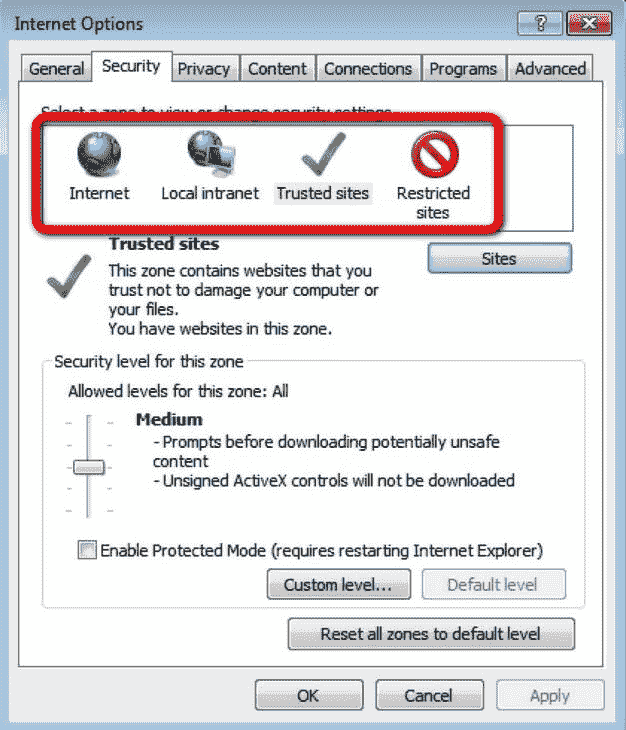
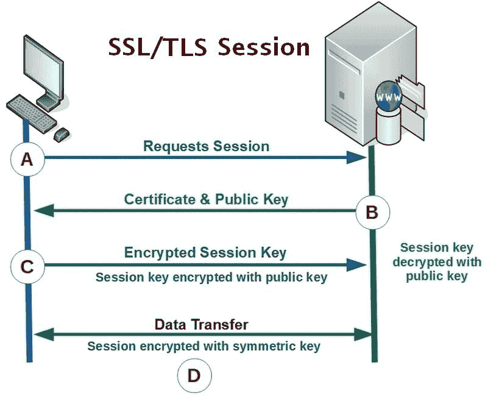
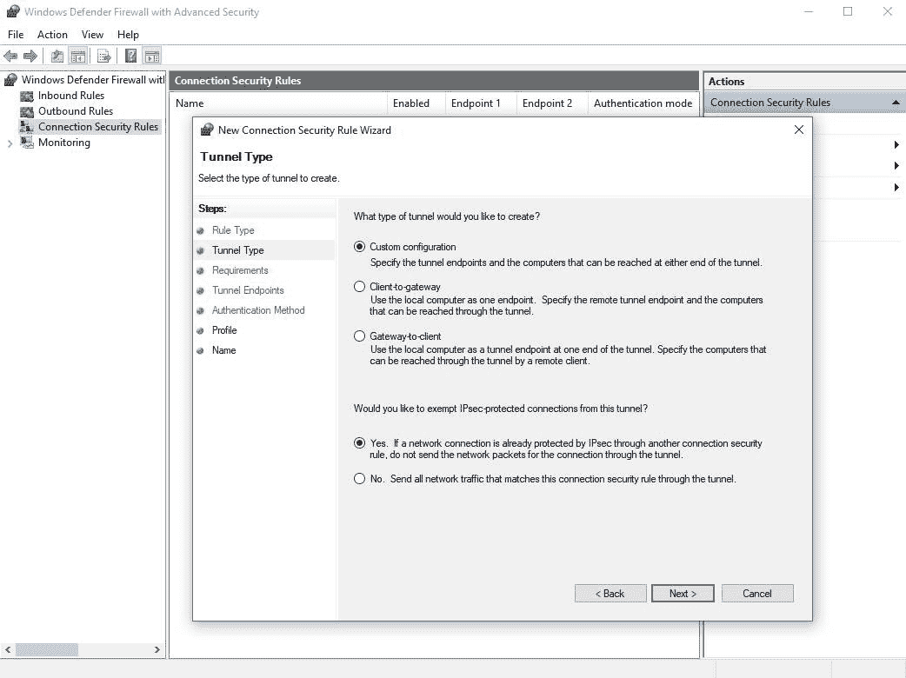
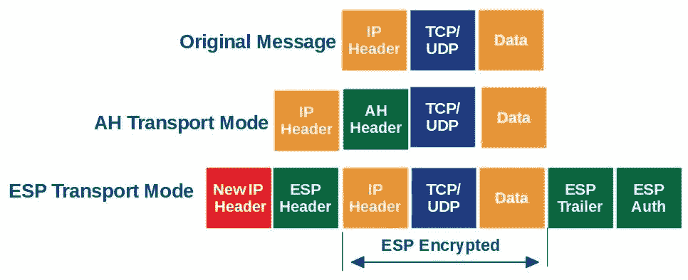
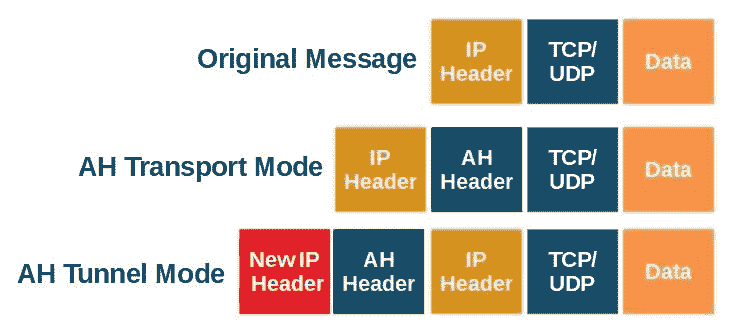
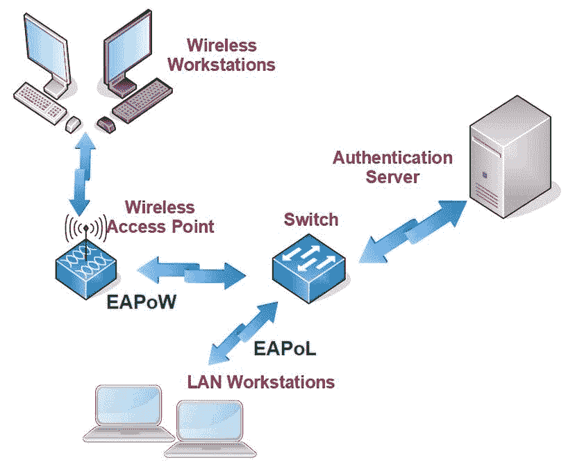
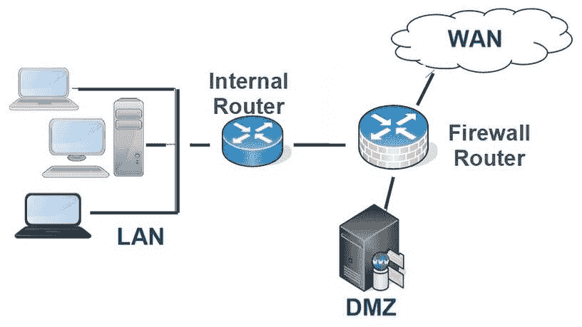
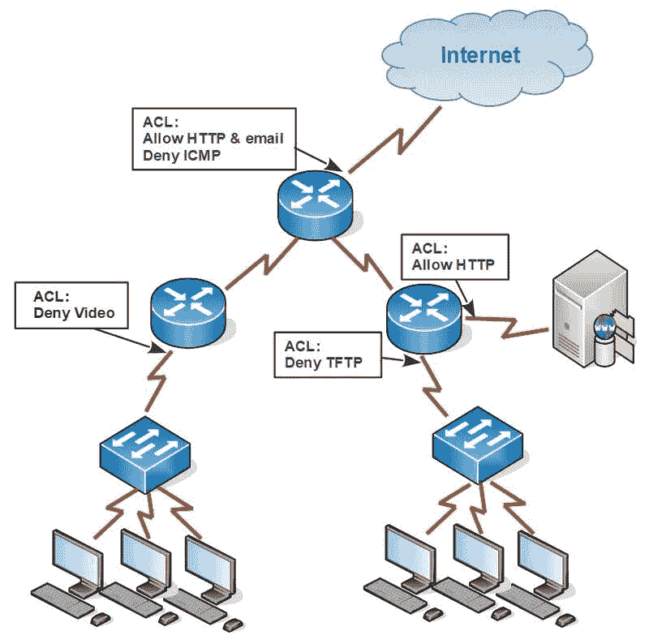

# 安全系统与协议

本书的这一部分涵盖了在 Server+认证考试中可能遇到的物理和逻辑安全概念、程序和设备。保护网络服务器及其直接和远程连接所需的安全性涉及到专门用于安全的系统；安全协议、安全设备，以及用于物理保护数据和设备的实践；当然，还有用于保护数据的各种数据保护技术，如加密，这些技术用于保护使用中的数据、存储中的数据和传输中的数据。

服务器的任何部分或配置都没有比安全性更重要。任何安全设置、配置或程序都必须防止外部和内部的入侵、数据破坏以及由恶意软件引起的损坏。任何计算机网络安全程序的目标都是 CIA 三位一体，包括机密性、完整性和可用性。

在本章中，我们将探讨可以组合起来创建安全系统的设备、软件、方法和协议，以保护网络服务器及其数据和主要系统。以下主题将会涵盖：

+   安全区域

+   认证协议

+   端口安全

# 安全区域

网关安全设备，如防火墙，定义安全区域以应用安全策略到进出网络流量。换句话说，**安全区域**是由一个或多个设备端口/接口创建的逻辑结构，这些端口/接口应用相同的安全策略。一个安全区域可以只有一个接口，或者如果接口应用相同的策略，可以包括多个接口。每个接口也可以是一个安全区域，一个安全区域也可以包括两个或更多接口。然而，一个接口只能属于一个安全区域。

# 防火墙区域

许多防火墙（硬件或软件）预定义了一组安全区域，以便于初始配置。大多数安装需要额外的安全区域，但对于某些情况，预设的仅一个安全区域可能就足够了。最常见的预定义安全区域包括以下内容：

| **安全区域** | **描述** |
| --- | --- |
| LAN | 最高级别的信任；包括 VLAN |
| VPN/SSLVPN | 最高外部信任级别；加密的 VPN 流量 |
| Multicast | IP 组播 |
| DMZ/public | 公开访问的服务器 |
| WAN | 连接到 WAN；影响进出流量 |
| Untrusted | 最低级别的信任 |

前表中列出的安全区域可以是私有安全区域或公有安全区域。前两个区域（LAN 和 VPN）是私有安全区域，其余的区域是公有区域。

安全区域的配置应用了两个主要策略：

+   **安全策略**：这些是基于源地址、目标地址、协议、端口号和内容来控制是否允许进出流量的规则。

+   **访问控制策略**：这些策略定义了谁或什么可以获得穿越防火墙访问资源的权限。

# 非军事区（DMZ）

DMZ 或外围网络可以是物理的或逻辑的网络段或子网，用作外部 WAN 流量的默认着陆空间，这些流量试图从组织的网站获取组织信息，该网站对不受信任的 WAN 安全区域开放。

# 浏览器区域

在本地网络以及各个工作站上，可以通过网页浏览器设置安全策略。例如，微软的 **Internet Explorer** (**IE**) 浏览器提供了设置，以限制对一个或多个预定义安全区域的访问，如下图所示：

在 IE 中定义的安全区域

如前所示的截图所示，IE 定义了四个安全区域——互联网、局域网、受信任站点和受限站点。每个区域可以应用安全级别，以控制访问和从每个区域内的源或网络下载内容的级别和类型。

# 安全设备

防火墙和其他执行入侵检测和防御的设备是关键的安全设备。此外，这些设备可以是硬件设备，也可以是独立的软件或附加软件。此外，防火墙还可以是 **基于主机的** 或 **基于网络的**。它们各有优势，但应用场景大不相同：

+   **基于主机的**：这种类型的防火墙或安全设备最常见，无论是软件还是硬件，通常位于连接网络的主机上。主机可以是网络节点或服务器，包括代理服务器，允许或拒绝进出消息流量。基于主机的设备更适用于小型网络的定制需求。

+   **基于网络的**：这就是大多数人设想的防火墙或入侵安全设备：一种允许或拒绝入站流量的安全过滤设备。网络防火墙、入侵检测系统或入侵防御系统就是基于网络的安全设备的例子。基于网络的设备由于能够提供广泛系统的保护，因此更适合于全网范围的保护。

防火墙，无论其在网络中的位置如何，本质上只是防火墙。然而，入侵检测和防御系统通常会在其设备名称中包含其在网络中的位置。基于主机的入侵检测系统是 HIDS，而基于网络的入侵检测系统是 NIDS。

# 认证协议

AAA 程序的第一部分是认证（后面是授权和审计），其目的是验证试图访问的用户是否提供了可验证的凭证或生物识别信息，以证明他们就是自己声称的身份。换句话说，如果提供的密码和用户名在有效身份数据的列表中，那么一切正常。

这可能不是在所有情况下最复杂的安全级别，但它是最常用的用户身份验证方法。许多使用类似方法的协议都进行身份验证。在接下来的部分中，我们将探讨最常用的身份验证协议。

# 身份验证方法

身份验证使用用户提供的输入数据或图像，以验证数据或图像是否与为该特定用户预先存储的数据或图像匹配。最常见的这些输入值包括以下几种：

+   **密码**：这是最常见的身份验证输入形式，通常与用户名、单词、短语、令牌、卡片或其他身份标识信息结合使用，以验证提供数据的人员是否为已认证用户。

+   **一次性密码**：顾名思义，一次性密码只使用一次。一次性密码可以是挑战-响应密码，也可以是来自预定义密码列表的密码。挑战-响应密码生成一个值，用户根据此值计算出响应值或在表格中查找响应。密码列表包含一次性输入进行身份验证的值。

+   **公钥**：使用一对密钥，一个是私钥，一个是公钥，来加密、解密和验证为身份验证提供的数据。

+   **零知识证明**：用户会收到一个问题或数学难题，要求回答或解决，该问题或难题每次都是唯一的。验证码（CAPTCHA）身份验证方法就是这种类型的一个例子。

如前所述，身份验证协议验证用户提供的身份数据是否有效。更重要的是，这一过程是开放且可访问网络的第一道安全防线。身份验证协议可以分为两组——**点对点协议**（**PPP**）和 AAA。

以下部分描述了最常用的身份验证协议，顺序不分先后。

# 点对点身份验证协议

这一类别的身份验证协议是识别请求访问系统或网络的用户的常见方式。客户端与身份验证服务器直接通信，并输入身份短语、单词或值以及密码。如果服务器能够验证这些信息，用户便能获得访问权限。此类别中包含的身份验证协议如下：

+   **密码身份验证协议（PAP）**：这是一种遗留协议，执行最基本的身份验证步骤——用户的用户名和密码发送到身份验证服务器。如果服务器在其密码表中找到这些值，则会返回一个接受（允许进入）消息。由于客户端和服务器之间的传输是明文的，因此 PAP 并不是一个安全的选择。

+   **挑战握手认证协议（CHAP）**：在接收到连接信号后，CHAP 服务器（认证方）会将其主机名和一个随机生成的数据字符串（挑战）发送给请求的客户端。客户端然后使用该挑战值确定相应的密钥值。服务器接收到一组数据，包括密钥值、原始挑战值——这两者都经过单向哈希加密——以及客户端的主机名。服务器重复客户端执行的过程。如果结果与客户端提供的相同，客户端便获得访问权限。此外，CHAP 握手过程可能会定期重复，以重新建立安全连接。

+   **可扩展认证协议（EAP）**：EAP 是一种通用协议，可与不同的认证方法结合使用，包括 Kerberos、一次性密码、数字证书、智能卡、公钥基础设施（PKI）等。EAP 的各个版本支持有线和无线局域网。EAP 与其他认证协议的区别在于，EAP 本质上作为客户端和认证服务器（如 RADIUS）之间的中间件。EAP 的不同版本包括 EAP-TLS、EAP-FAST、PEAP 和 LEAP。

# AAA 认证协议

*三重-A（AAA）* 协议提供了强制执行、管理和监控用户访问系统或网络的机制。认证强制执行谁有访问权限。授权规定用户可以执行的操作，而记账则跟踪每个已认证和授权用户的操作。最常见的 AAA 协议包括以下内容：

+   **Kerberos**：虽然它远不如其名字来源——守护冥界之门的三头犬 Cerberus 那样凶猛，但 Kerberos 仍然是一种安全的认证协议。Kerberos 使用一种称为 *票证* 的加密身份验证证明，用于识别用户或本地网络节点。Kerberos 用于在多个系统上进行用户认证，而不仅仅是单一系统。

+   **轻量级目录访问协议（LDAP）**：LDAP 是一种用于目录服务的开放标准，在存储和验证用户账户的认证过程中非常常见。LDAP 维护一个用户凭据的数据库（目录树）。用户在尝试登录系统或网络时输入其凭据，LDAP 会在其目录树中进行搜索。如果 LDAP 找到该凭据，用户便可以访问。

+   **远程认证拨号用户服务（RADIUS）**：该认证协议提供集中式的网络访问控制，尽管在大多数情况下并不是通过拨号服务来实现。当用户尝试登录系统时，其凭据会通过访问请求消息发送到 RADIUS 服务器。根据用户凭据的有效性，RADIUS 服务器会响应 **Access-Accept**、**Access-Reject** 或 **Access-Challenge** 消息。

+   **终端访问控制器访问控制系统 (TACACS)**：这是另一种传统的 AAA 协议，类似于 RADIUS，将用户凭据转发给认证服务器进行验证，并授权访问系统或网络。更新版本的**扩展 TACACS**（**XTACACS**）包括了授权和计费功能。请注意，TACACS 与 TACACS+是完全不同的协议，不应混淆。

+   **TACACS+**：这是由 Cisco 系统开发的 TACACS 版本，能够在将数据包转发到认证服务器之前对其进行完全加密。TACACS+通过 TCP 传输，而 TACACS/XTACACS 则使用 UDP。

# 安全套接字层（SSL）/传输层安全（TLS）

SSL 和 TLS（SSL 的更新版本）用于保护 TCP 通信，尤其是 HTTP 消息。

下图展示了客户端和服务器之间使用 SSL/TLS 协议进行握手的过程：

SSL/TLS 握手过程的步骤

让我们逐步了解这个握手过程：

+   **步骤 A**：客户端向目标服务器发送*Hello*消息。此消息包括客户端所使用的 SSL 或 TLS 版本、客户端对加密算法（密码套件）的偏好、压缩方法以及用于计算的随机字符串值。

+   **步骤 B**：如果一切顺利，服务器将用*Hello*消息作出回应，该消息包含服务器从客户端列表中选择的密码套件、会话 ID 和服务器自己的随机字符串值。然后，服务器将向客户端提供数字证书。服务器可能会要求客户端提供证书。

+   **步骤 C**：客户端验证服务器的证书。如果验证通过，客户端将用服务器的公钥加密随机字符串值并发送给服务器。此值将用于生成随后的消息加密密钥。

+   **步骤 D**：在交换加密的*finished*消息以标志握手创建结束后，客户端和服务器开始传输通过共享密钥加密的数据和消息。

# 网络协议安全（IPSec）

IPSec 定义了一系列标准，用于加密和传输 OSI 网络层数据包的完整性，这些数据包通过传输层协议传输。IPSec 使用隧道协议来安全地传输数据，并防止数据在传输过程中被破坏。

安全策略定义了网络的安全要求，并定义了 IPSec 功能。每个安全策略定义了一个过滤器。这些过滤器与源 IP 地址、目标 IP 地址、传输层端口号或数据包的封装协议相关。当数据包中的数据与过滤器匹配时，过滤器的动作就会生效。

# IPSec 策略

IPSec 策略包含规则和筛选器，这些规则和筛选器定义了保护传输网络流量的内容、时间和方式。规则和筛选器涉及特定类型的网络流量，并且要求一定的安全级别。

IPSec 系统的功能和操作是通过它被配置遵循的规则来设置的。Windows 操作系统包含一组示例安全规则，但这些规则严格来说只是示例。它们实际上并没有提供太多的实际安全性。IPSec 规则特别定义了其适用的域，并指明它是处于传输模式还是隧道模式（稍后详细讲解）。

以下截图显示了用于定义新安全规则的对话框：

在 Windows 操作系统上定义新的 IPSec 策略规则

IPSec 策略规则可以由一个或多个筛选器组成（之所以称为筛选器，是因为它们实际上执行数据包筛选）。每个筛选器可能包含以下信息：

+   **筛选器列表**：这是一个列出要应用筛选器操作的传入或传出的网络消息的列表。

+   **筛选器操作**：筛选器可以对消息应用三种基本功能——**允许**、**阻止**或**协商**安全。允许和阻止操作应该不言自明。协商安全筛选器操作应用 IKE 来确定安全模式（**认证头**（**AH**）或**封装安全有效载荷**（**ESP**））、加密方法以及其他会话安全数据。

+   **筛选认证方法**：Kerberos、CA 证书或预共享安全密钥在安全协商中对每个端点进行认证。

+   **隧道端点**：如果此值存在，则有两个目的：指示正在使用隧道协议，并提供其中一个隧道端点的 IP 地址。隧道模式使用两个筛选器，一个用于隧道的每一端（及方向）。

+   **连接类型**：这是指示筛选器应用于哪种连接类型的指示符，可能是局域网、远程连接（VPN）或两者。

+   **默认响应规则**：如果 IPSec 会话中的一个端点没有定义安全规则，默认响应规则将提供缺失的筛选器。

筛选器操作在筛选器列表（以及可能的其他规则）匹配数据包中的相应数据时应用，如 IP 地址、端口号和协议。

# IPSec 模式

IPSec 可以在两种主要模式下运行——**传输**模式或**隧道**模式。在传输模式下，这是 IPSec 的默认模式，消息安全性是在网络客户端和网络服务器之间通过两种方法——**有效载荷加密**或**安全通信**来实现的。IPSec 可以使用以下模式中的任意一种配置：

+   **AH 传输模式**：顾名思义，AH 模式会在每个数据包中插入一个头部，其中包含一个键控哈希总值以确保数据包的完整性。AH 模式默认不加密数据包，但本地管理可提供自定义数据检查和加密规则。

+   **ESP 传输模式**：ESP 模式本质上包括 AH 模式的消息操作，并且仅加密消息中的有效负载（数据）部分：

AH 和 ESP 消息格式的比较

上图显示了 IPSec 传输模式的数据包格式。正如我们所看到的，主要区别在于 ESP 会加密原始消息，并向数据包中添加附加信息以进行身份验证和完整性检查。

每种传输模式都有一个相关的隧道模式。在任一格式中，IPSec 在将消息格式化为 AH 或 ESP 传输模式的数据包后，对整个消息进行加密。加密消息封装后，添加一个包含源端点和目的端点 IP 地址的 IP 头部。

如下图所示，AH 隧道模式将 AH 头部放置在原始数据包内容之前。加密此头部和数据包内容后，AH 会添加一个包含相关 IP 地址的 IP 头部：

AH 协议传输和隧道模式消息格式

IPSec 的另一种操作模式是**互联网密钥交换**（**IKE**），它可以监督 IPSec 交互中每一方的身份验证、安全策略和规则的应用以及密钥交换活动。

# 端口安全

许多交换机和路由器在出厂时默认启用所有接口。如我们所讨论的，强化安全——即关闭未使用的端口——通过关闭可能的入口点来帮助保护网络。为确保网络设备的安全，尤其是路由器和交换机，采用了多种方法、标准和手段，其中大多数是基于端口的网络访问控制（**PNAC**）方法。

# 基于端口的安全

一般来说，基于端口的安全通过限制可转发数据包或帧到一个或多个端口的设备数量或特定设备来保护交换机的接口（端口）。端口安全有两种方法：

+   **动态锁定**：设置设备可*学习*的最大 MAC 地址数量。达到限制后，设备将忽略任何额外的未知 MAC 地址以及来自这些设备的任何消息。

+   **静态锁定**：设备仅转发手动配置的静态地址列表中包含的 MAC 地址。

# IEEE 802.1x

也称为*dot1x*，IEEE 802.1x 定义了一个 PNAC 标准，在允许访问设备接口端口之前执行认证过程。IEEE 802.1X 提供了在 IEEE 802 网络中，无论是有线还是无线的认证和加密密钥管理。802.1x 基于 EAP，并通过**局域网 EAP**（**EAPoL**）和**无线 EAP**（**EAPoW**）协议应用。

在下图中，802.1x 认证过程中，无线工作站和局域网工作站上的客户端软件是请求者，无线 AP 和局域网交换机作为认证设备，认证服务器就是认证服务器：

IEEE 802.1x 认证过程的流程

IEEE 802.1x 认证过程如下：

1.  局域网工作站（无线或有线）上的客户端软件（请求者）向**接入点**（**AP**）或交换机上的接口端口发送一个 EAPoL 启动包。

1.  无线接入点（AP）或交换机（认证设备）回复一个 EAPoL 身份请求。

1.  请求者返回其身份，通常是一个用户名或身份码。

1.  认证设备将请求者的信息转发给认证服务器（通常为 RADIUS 或 DIAMETER 服务器）。

1.  认证服务器在验证请求者身份后，将其首选的认证方式发送给认证设备，认证设备再将其转发给请求者。本标准支持的认证方法包括**隧道传输层安全**（**TTLS**）、**传输层安全**（**TLS**）、**信息摘要版本 5**（**MD5**）、**受保护的 EAP**（**PEAP**）等。

1.  请求者通过认证设备向认证服务器回复其访问凭据，如用户名和密码或数字证书。

1.  认证服务器验证请求者提供的信息，并决定是否允许访问。

# 访问控制列表（ACL）

ACL 是由互联设备，特别是路由器、防火墙和交换机应用的过滤器，用于识别并允许或拒绝对内部网络的访问，控制进入的消息流量。大多数情况下，ACL 与设备上的接口端口相关联，并假设进入该接口的消息流量可以通过源、目的地、协议或端口号来定义。

# 路由器 ACL

Server+认证考试的目标指出，路由器 ACL 是考试中会遇到的内容。路由器上的 ACL 执行与我们在上一节描述的相同基本功能。然而，路由器 ACL 提供特定或针对性的访问权限，以允许或拒绝过滤。路由器 ACL 的一个非常常见的应用是作为入站 DMZ 的一部分，如下图所示：

ACL 可以作为 DMZ 设置中的控制机制

一台配置了一个或多个严格 ACL 的路由器，在许多方面可以首先充当防火墙，其次才是路由器。基于其 ACL 中的过滤器，防火墙/路由器可以处理任何带有未知或被阻止数据的传入消息。

网络 DMZ 并不一定是拒绝消息的死胡同。常见的做法是将未知来源地址和特定协议路由到 DMZ。它可能包括 Web 服务器、远程访问服务器等。

# 访问列表内容

通常，不同路由器供应商的 ACL 可能具有不同的功能或控制，但几乎所有路由器都支持以下 ACL 特性：

+   **ACL 标识**：在不同的路由器中，ACL 的身份可以是一个名称、一个字母数字字符组合或一个数字，这些值可能具有一定的意义。

+   **访问控制条目（ACE）**：ACL 可能包含一个或多个 ACE，每个 ACE 标识一组特定条件，用于判断传入（或可能是传出的）消息的内容是否允许通过、拒绝或重定向。

+   **源地址和目标地址**：ACL 和 ACE 通过消息的源 IP 地址或目标 IP 地址来决定允许（Permit）或拒绝（Deny）。ACL 将消息的地址与 ACE 中定义的地址进行比较，这些地址可能是一个地址范围。

以下图示说明了网络结构中不同部分如何对不同类型的消息、发起者、目的地和协议施加限制：

在网络基础设施中应用的 ACL

# ACL 类型

与其他不同供应商的路由器功能一样，ACL 的类型或类别也可能有所不同。然而，最常见的 ACL 类型通常是标准或扩展型。

# 标准 ACL

标准 ACL 仅使用其源（发起）地址过滤消息。标准 ACL 可能是最简单的使用和创建方式，但其简单性也限制了它的有效性。标准 ACL 中的 ACE 仅包含以下内容：

+   **访问控制列表编号**：标准 ACL 必须有一个编号范围在 1 至 99（含）或 1,300 至 1,999（含）之间。这些编号范围将其标识为标准 ACL。

+   **源 IP 地址**：这是与传入消息的源 IP 地址进行比较的特定 IP 地址或地址范围。如果匹配，则会执行相应的允许或拒绝操作。

+   **通配符掩码**：ACL 条目可能包括一个通配符掩码，其使用方式类似于子网掩码。稍后在 *通配符掩码* 部分会详细介绍。

+   **允许或拒绝**：这是当源 IP 地址与地址或地址范围进行比较时，如果条件成立，将采取的操作。

# 扩展 ACL

扩展 ACL 提供了通过源和目标地址，甚至 TCP/UDP 端口号来过滤消息流量的能力。换句话说，它扩展了标准 ACL 的功能。扩展 ACL 中的 ACE 可以包含以下任何内容：

+   **访问控制列表编号**：扩展 ACL 必须具有 100 到 199（包括）或 2,000 到 2,699（包括）的 ACL 编号。这些编号范围标识其为扩展 ACL。

+   **允许或拒绝**：如果消息内容与 ACE 内容的比较结果为真，则执行此操作。

+   **协议**：这些协议包括**互联网协议**（**IP**）、**传输控制协议**（**TCP**）、**用户数据报协议**（**UDP**）、**互联网控制消息协议**（**ICMP**）、**通用路由封装协议**（**GRE**）和**互联网网关路由协议**（**IGRP**）。

+   **源 IP 地址**：这是消息发起的公有 IP 地址。

+   **源地址掩码**：这是与源 IP 地址的网络或子网相关的子网掩码。

+   **操作员源端口**：这表示涉及端口号的比较测试的条件，包含条件操作符和端口号。条件操作符可以是**小于**（**lt**）、**大于**（**gt**）、**等于**（**eq**）或**不等于**（**neg**），并包含 TCP/UDP 端口号。

+   **目标 IP 地址**：这是接收消息的公有 IP 地址。

+   **目标地址掩码**：这是与目标 IP 地址的网络或子网相关的子网掩码。

+   **操作员目标端口**：与操作员源端口相同。

# 其他 ACL 类型

除了标准和扩展 ACL 外，某些路由器还实现了另外两种 ACL 类型：

+   **以太网类型**：这允许或拒绝第 2 层（以太网）帧。

+   **Web 类型**：有两种不同的 Web 类型 ACL——基于 URL 的 ACL 过滤特定协议和 URL 组合；基于 TCP 的 ACL 过滤允许或拒绝特定 IP 地址和 TCP 端口号。

+   **反射型**：这种 ACL 类型，即 IP 会话，为响应出站消息创建一个允许的入站 ACL。

+   **动态**：这种类型的 ACL，即锁和钥匙，允许用户访问特定的源或目标 IP 地址。

此外，ACL 还可以分为两种一般类型：

+   **任意 ACL (DACL)**：这种类型的 ACL 特别指定了具有权限访问资源的 IP 地址、用户或组账户、端口号和协议。

+   **系统 ACL (SACL)**：这种类型的 ACL 控制路由器功能，生成日志或审计条目，并详细记录访问资源的尝试。

作为 ACL 编号系统的示例，思科公司使用如下表格中所示的编号方式：

| **协议** | **范围** |
| --- | --- |
| 标准 IP | 1–99 和 1,300–1,999 |
| 扩展 IP | 100–199 和 2,000–2,699 |
| 以太网类型码 | 200–299 |
| AppleTalk | 600–699 |
| 以太网地址 | 700–799 |
| **互联网络数据包交换** (**IPX**) | 800–899 |

# ACE 类型

正如我们已经讨论过的，ACL 由一个或多个 ACE 组成。每个 ACE 有三个基本目的之一，具体如下：

+   **访问拒绝 ACE**：DACL 中的一个条目，基于请求者的信息专门拒绝访问。

+   **访问允许 ACE**：DACL 中的一个条目，基于请求者的信息专门允许访问。

+   **系统审计 ACE**：SACL 中的一个条目，当请求者尝试访问资源时，会生成一个跟踪条目。

每个 ACE 的测试及其产生的动作是逐一进行的。几乎就像 ACL 中没有其他条目一样。每个 ACE 之间没有任何关系，除了它在 ACL 顺序中的位置外，前后没有任何关联。

ACL 中 ACE 的顺序至关重要。测试条件及其结果应当是逻辑的，并且不应相互矛盾。例如，如果一个 ACE 拒绝来自某个 IP 地址的所有消息，而在 ACL 后面的另一个 ACE 仅允许该地址的 ICMP 消息，那么拒绝 ACE 会使得允许 ACE 变得无效。在拒绝一切之后，就没有什么可以允许的了。我提到这一点不仅是为了强调顺序问题，还为了引出隐式和显式拒绝操作的目的。

隐式任何结果是默认发生的结果。显式任何结果是特定的。隐式是一个假设，显式是一个陈述事实。例如，如果一个导游有一份可以登上旅游巴士的参与者名单，那么不在名单上的人会被隐式拒绝登车。然而，竞争的旅游公司有一份绝对禁止某些人登车的名单。在这种情况下，出现在名单上的人会被显式拒绝参与。

几乎所有的路由器、防火墙、活动目录服务器和其他访问控制设备都会在 ACL 末尾自动包含一个隐式拒绝。这个隐式拒绝的作用是阻止所有不在 ACL 中的访问请求，也就是说，阻止那些已经通过了 ACL 中所有 ACE 的请求。作为 ACL 中最后一个条目的隐式拒绝表示，它拒绝所有已经到达这一点的请求。

显式拒绝可以出现在 ACL 中的任何位置，这取决于其具体性。对于特定的 IP 地址，显式拒绝应当排在任何一般的允许条目之前。ACL 末尾的显式拒绝通常是一个 *deny any* 条目，其功能与捕获所有隐式拒绝类似。

# 通配符掩码

也称为反向掩码，ACL 中的 IP 地址条目可以包含并应用通配符掩码，其作用与 Windows 世界中的通配符字符截然不同。实际上，ACL 通配符掩码的工作原理与子网掩码基本相反。

在子网掩码中，掩码过程仅提取出 IP 地址中包含 1 值的二进制位。然而，在 ACL 通配符掩码中，二进制零表示必须匹配的地址位置。换句话说，掩码中的零位意味着消息地址中的对应位必须匹配（以创建真实条件），而一位表示在地址中被忽略的位置。

例如，在标准 ACL 条目中，源 IP 地址及其通配符掩码会依次出现，格式为`162.29.5.12 0.0.0.0`。在此条目中，`162.29.5.12`是源 IP 地址，`0.0.0.0`是通配符掩码。通配符掩码中的零表示每个八位字节都包含零。否则，通配符掩码应为`00000000.0000000.00000000.00000000`。表示相同设置的另一种方式是将`host2`术语放在 IP 地址之前：`host 162.29.5.12`。

通配符掩码的更常见用法是在扩展 ACL 中，用于标识整个或主要子网。例如，如果 ACL 条目允许某个网络上的所有地址，通配符掩码中的一位表示允许的地址部分，零位则表示被忽略的地址部分。如果我们希望允许`210.20.158.0`网络上的所有节点，通配符掩码将是`0.0.0.255`。掩码中的`255`部分意味着无论第四个八位字节中的主机 ID 是什么，都允许它。

# 公钥基础设施（PKI）

从本质上讲，PKI 就像是你的一位亲密朋友将你介绍给他们的其他朋友。官方来说，PKI 是一套规则、指南和政策的集合，定义、颁发、管理、应用、存储和撤销数字证书，以及使用公共密钥加密。简单来说，PKI 是一种加密和安全方法，比起简单的方法（例如密码），它能为通信双方的身份和数据内容提供更高的安全性。

实际上，PKI 是其四个组成部分的协调互动，分别如下：

+   **证书颁发机构（CA）**：一个受信的组织，提供唯一的数字证书给订阅者，并管理用于数据加密的公共密钥和身份凭证，这些加密内容包括存储数据、网站和电子邮件

+   **注册机构（RA）**：一种网络服务，批准并转发身份验证（数字证书）的请求，以及颁发证书的证书颁发机构

+   **证书请求数据库**：存储数字证书的请求

+   **证书存储**：存储数字证书

# PKI 功能

PKI 描述以下过程和程序，以提供安全的基础设施：

+   **访问控制**：通过使用公私钥对，PKI 确保只有被识别的各方才能访问文档

+   **身份验证**：PKI 通过数字证书提供身份验证

+   **机密性**：PKI 通过加密保护传输文档，防止未经授权的访问

+   **完整性**：PKI 确保传输的数据通过消息哈希保持其完整性

+   **不可否认性**：文档的数字证书永久地标识其所有权

# 加密与认证

这些是提供数据加密和身份验证的安全协议，用于网络上传输的消息。它们的差异不大，但它们不可互操作。然而，由于 TLS 是 SSL 的替代品，您通常会看到它们被列为 SSL/TLS。

数字证书不依赖于特定的协议。启用的协议是系统或网络配置的属性，而不是正在使用的安全证书的属性。例如，SSL 数字证书不只要求 SSL 协议，而 TLS 数字证书也不只要求 TLS 协议。事实上，大多数情况下，证书颁发机构将这些证书称为 SSL/TLS 证书。

# 虚拟专用网络（VPN）

VPN 通过不安全的网络，主要是通过互联网，创建加密的端到端连接。VPN 在公司中很常见，供远程授权用户使用，例如远程分公司员工，以访问总部的应用程序和其他资源。

VPN 通过加密隧道协议在网络上连接两个位置。事实上，VPN 加密了私人网络和用于完成连接的公共网络的元素。用于 VPN 的三种主要协议类型如下：

+   **IP 安全（IPSec）**：一组保护通过网络传输的 IP 数据包的安全和加密协议，使用传输模式或隧道模式

+   **点对点隧道协议（PPTP）**：用于创建 VPN 的协议

+   **第二层隧道协议（L2TP）**：允许**互联网服务提供商**（**ISP**）向订阅者提供 VPN 的协议

# 虚拟局域网（VLAN）

VPN 允许在公共网络上建立安全连接，而 VLAN 是一个逻辑内部网络配置，可以为用户和管理员提供多个好处。VLAN 将一组网络节点组成一个逻辑网络。这是一个虚拟网络，因为包含的节点可能位于不同的物理网络上。

VLAN 可以是两种类型之一：

+   **静态 VLAN**：也称为基于端口的 VLAN，它由一个或多个已配置为 VLAN 的网络交换机接口端口组成。任何连接到已配置为静态 VLAN 的端口的设备，都会自动加入该 VLAN。

+   **动态 VLAN**：在动态 VLAN 中，节点的标识是通过其物理地址（MAC 地址）或网络用户名来实现的。**VLAN 成员策略服务器**（**VMPS**）提供属于动态 VLAN 的节点列表，并向相关网络交换机提供配置数据。

# 总结

安全区域是一种逻辑结构，由一个或多个接口组成，这些接口应用相同的安全策略。许多防火墙预定义了安全区域，最常见的包括 LAN、VPN、DMZ 和 WAN。安全区域应用安全策略和访问控制策略。

安全设备，如防火墙和入侵检测与预防设备，可以是硬件或软件。安全设备可以是基于主机的，也可以是基于网络的。基于主机的入侵检测系统是 HIDS，基于网络的系统是 NIDS。

身份验证协议验证用户提供的凭证是否有效，并作为开放网络的第一道安全防线。身份验证协议可以是 PPP 或 AAA。最常见的 AAA 协议包括 Kerberos 和 IPSec。IPSec 策略定义了特定类型的网络流量和安全级别的规则与过滤器。IPSec 可以在传输模式或隧道模式下运行，并在每种模式中使用 AH 或 ESP 模式。

基于端口的安全性有两种方法：动态锁定和静态锁定。IEEE 802.1x PNAC 在允许访问接口之前执行身份验证。802.1x 基于 EAP。

ACL 允许或拒绝通过传入消息访问网络。ACL 与接口关联，并适用于使用源和/或目标地址、协议或端口号的消息。路由器 ACL 包括 ACL ID、ACE 以及源和目标地址。标准 ACL 使用源地址过滤消息。扩展 ACL 使用源和目标地址以及 TCP/UDP 端口号过滤消息。两种常见类型是 DACL 和 SACL。

路由器和其他访问控制设备会在 ACL 的末尾自动包含隐式拒绝。显式拒绝可以出现在 ACL 的任何位置。

PKI 是一种加密和安全方法，保护消息或文档的源和接收者。PKI 有四个部分—CA、RA、证书请求数据库和证书存储。PKI 提供访问控制、身份验证、机密性、完整性和不可否认性。

VPN 通过隧道协议在互联网中创建加密的端到端连接。与 VPN 一起使用的协议有 IPSec、PPTP 和 L2TP。VLAN 是一种逻辑网络配置，可以是静态的或动态的。

# 问题

1.  什么是具有相同安全策略的一个或多个接口的逻辑结构？

    1.  HIDS

    1.  NIDS

    1.  控制区

    1.  安全区域

1.  以下哪两项是安全设备的分类？

    1.  基于主机

    1.  主机附加

    1.  基于网络

    1.  基于网络

1.  验证用户凭证的协议执行 AAA 功能的哪一部分？

    1.  授权

    1.  计费

    1.  身份验证

    1.  关联

1.  IPSec 协议中最常见的两种是 Kerberos 和哪种？

    1.  L2TP

    1.  EAP

    1.  IPSec

    1.  PNAC

1.  以下哪种模式与 IPSec 相关？

    1.  AH

    1.  传输

    1.  ESP

    1.  隧道

    1.  以上所有

    1.  以上都不是

1.  IEEE 802.1x 基于哪种协议标准？

    1.  IPSec

    1.  L2TP

    1.  EAP

    1.  DACL

1.  基于端口的安全性有哪些两种方法？

    1.  动态锁定

    1.  静态锁定

    1.  证书锁定

    1.  接口锁定

1.  以下哪项是标准 ACL 用来过滤消息的数据？

    1.  源地址

    1.  端口号

    1.  ACL 标识号

    1.  协议

1.  在 ACL 的末尾自动添加的、用于拒绝任何未被其他条目匹配的消息的 ACL 条目是什么？

    1.  显式拒绝

    1.  显式允许

    1.  隐式拒绝

    1.  隐式允许

1.  以下哪项不是 PKI 模型的四个组成部分之一？

    1.  CA

    1.  RA

    1.  证书存储

    1.  PPTP
