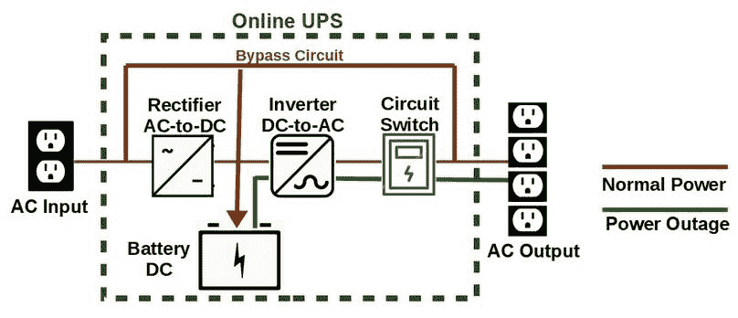

# 第十二章：物理安全和环境控制

并非所有安装在、连接到或与计算机硬件和软件集成的网络和服务器安全设备和方法都能有效工作。任何基于服务器的系统、数据中心或设施的第一道防线是它的物理安全。物理安全的核心是保护计算资产的安全、功能、运作正常，并防止任何入侵者的进入。虽然我们将其视为一个单独的话题，但物理环境的环境系统和控制应当是组织安全政策的一部分。

本章将讨论保护计算系统的物理安全和环境控制。覆盖的主题如下：

+   **多因素认证**（**MFA**）

+   一般的物理安全概念

+   环境控制

+   物理安全问题

# MFA

多年来，用户访问计算机、系统和网络的身份验证系统经历了从几乎没有身份验证到结合多个身份因素的演变。这一过程始于要求用户身份代码，然后是与用户名一起输入的秘密密码，如今已经发展到结合两种或更多的身份因素。这些层级的主要目的都是为了尽可能确定地验证寻求访问的用户身份。

# 密码

也许第一个密码，至少是第一个被记载下来的密码，是阿里巴巴用来打开宝藏的语音命令——*芝麻开门*。曾几何时，用户账户或身份代码用于标识谁在访问一个系统，通常是大型机或小型计算机。最终，由于同事之间共享且内容简单，这些代码不再能提供任何安全的访问控制。用户账户代码，也就是用户名，通常由每个有权限访问系统的用户的名字首字母和姓氏组成，例如`rprice`。这是一种标准做法，至今仍在使用。用户名在过去 50 年里几乎没有变化，它们提供的安全性也几乎没有，基本上是没有的。

你必须记住，早期应用系统的主要数据存储介质主要是可移动介质，如硬盘盘片、主轴包、磁带和软盘。阻止访问物理介质的物理安全是访问控制的重要组成部分。

随着应用系统的复杂化，数据存储逐渐转移到附加或内部的磁盘存储设备。这意味着安全性必须成为绝对必要的要求。保持数据的完整性和安全性需要更强的认证方法。登录过程添加一个*秘密*密码，有助于验证请求访问系统的用户是否真的是他或她所声称的那个人。基本假设是，如果用户知道密码，那么用户就是用户名所标识的人。

使用用户名仅仅是身份验证过程中的一步（即识别步骤）。将密码与用户名配对创建了一个数据包，作为**单因素身份验证**（**SFA**）值。如果输入的密码与系统安全文件中与用户名配对的值匹配，系统便会允许访问。

最终，使用组合的用户名和密码不再提供曾经的访问控制和安全性。密码破解工具、社交工程、恶意软件和其他不正当手段能够获取用户密码，从而访问用户的个人数据。这就是 MFA（多因素身份验证）出现的原因。

# 身份验证因素

MFA 结合两种或更多的身份验证因素来验证尝试登录系统或网络的用户（请求者）。MFA 过程涉及两个或更多因素的组合，来唯一识别请求者。到目前为止，MFA 能够处理五种身份验证因素的各种组合，分别是：

+   **你知道的某些东西**：这一类包括你已经记住并能在需要时回忆的各种数据、短语、数字或它们的组合。这可以是密码、PIN 码、问题的答案、乔治·华盛顿拥有的狗的数量（50）等等。尽管用户名和电子邮件地址是你知道的内容，它们是标识代码，我们正在尝试验证这些代码。

+   **你拥有的某些东西**：这一类的因素是包含信息的物理物品，确保持有者/用户确实是他们所声称的人。这可以是一个小型塑料令牌，比如 RSA SecurID，或是通过银行应用在手机上生成的数字，一个**个人身份验证**（**PIV**）智能卡或员工证，或者可能是一个 RFID 接近卡。

+   **你是的某些东西**：许多人将这一类与你拥有的或你是的类别混淆，但本质上这一类是生物特征识别。生物特征使用身体的一部分来唯一识别你。你的身体特征，包括指纹、手印、视网膜和虹膜扫描、声纹和面部扫描等，建立了一个与登录时对比的二进制编码模式。

+   **你拥有的某些东西**：这种类型的身份验证最常使用 IP 地址来识别用户请求的来源或位置。地理位置服务验证请求来源的地点是否与预设的用户位置一致。

+   **你做的某些事**：这一类包括触摸板和触摸屏的动作（手势），例如一个秘密手势。Windows 8 引入了一个名为**图片密码**的功能，允许用户录制手势用于身份验证。

仅使用一个因素，如密码，就是简单身份验证（SFA）。仅使用两个因素就是**双因素认证**（**2FA**）。如你所料，超过两个因素的认证就是多因素认证（MFA）。你需要了解的关于认证因素的一点是，使用的因素越多，你的数据就越安全。

# 一般物理安全概念

任何组织的物理安全必须定义与安全、保护和完成组织使命相关的事件、原因、行为者、防范、恢复、缓解及其他相关程序。

任何 IT 组织的物理安全计划都基于整体组织的安全政策和计划。IT 安全政策必须认识到物理安全对计算资产和功能的需求与目的。定义 IT 物理安全计划的政策应包括以下目标，以及根据组织性质可能存在的其他目标：

+   已经到位的物理保护措施，如消防安全、入侵预防、业务连续性和灾难恢复

+   对组织的威胁来源和类型

+   物理安全监控系统的组成部分

+   公用事业服务中断（如电力、天然气、水等）的影响及恢复

+   针对未经授权的入侵、破坏或计算资源盗窃所定义或实施的对策

物理安全计划通常有两个重点领域——**威慑**和**检测**。威慑程序、方法和设备旨在阻止或防止威胁转变为安全事件。检测当然涉及用于发现威胁或破坏物理安全措施的设备、程序和方法。

# 对物理安全的威胁

对任何组织物理安全的威胁可分为四大类——**环境**、**人为**、**特定地点**和**技术**。以下部分将列举这些类别中一些威胁的例子。

# 环境威胁

环境威胁是指天气、自然灾害、灾难性事件以及来自自然界的其他事件。它们包括以下内容：

+   **灰尘**：空气中的灰尘可能导致计算机中的电气问题，更不用说会阻塞主板和 CPU 的气流和冷却系统了。

+   **地震**：地震的损害威胁通常是结构性的，但随之可能出现电气、管道，当然还有通风方面的问题。

+   **极端天气**：这种威胁可能包括各种灾难性的天气事件，包括强风、大雨、龙卷风、飓风/台风、冰、雪、冰雹等。

+   **火灾/爆炸**：除了火灾可能对计算设备造成的损害外，还可能由于灭火剂、抑制剂和灭火器中的化学物质造成损害，更不用说水了。

+   **洪水**：洪水通常是由其他气象事件引起的，比如极端天气、地震或你所在社区的火山爆发。

+   **雷电**：电气风暴是一个真实且严重的威胁。雷电直接击中一个数据中心所在的建筑，可能会通过即便是保护设备也无法承受的电流冲击。

+   **害虫**：不幸的是，一只老鼠咬坏了通信电缆或电源电缆，可能会给服务器及其节点带来难以检测的问题。

# 人为威胁

正如其名称所示，这些物理安全威胁通常是由于疏忽、疏漏或无知造成的，或者它们来自恶行之人的恶意行为。它们包括以下内容：

+   **事故**：事故可能无法完全避免，但可以采取一些措施来帮助减少其发生：如层压地板表面的安全踏步、设备和柜子之间的适当间距、为所有员工提供安全意识培训等。

+   **恶意软件**：计算机病毒、木马、根套件、机器人以及其他恶意软件是任何联网设备，特别是网络服务器的严重威胁。

+   **盗窃**：这不仅仅是外部人员入侵安全场所的行为。员工、供应商、承包商和访客等人也在设备、文档和资源盗窃中扮演了重要角色。

+   **未经授权的访问**：黑客获得程序、数据和其他资源的访问权限是一种安全政策和程序必须应对的威胁。然而，未经授权的物理访问同样构成威胁，这意味着入侵者已物理入侵并接触到设备、数据存档、文件和表单及其他计算资产。

+   **破坏行为**：虽然通常被认为是对外部表面的损坏或毁损，破坏行为也可以包括窗户和围栏的破坏、火灾，以及设备和建筑物的随机毁坏。

# 特定站点的威胁

这一类物理安全威胁的范围通常是单一站点、建筑或周边区域。大多数情况下，它们涉及到购买或外包的系统或服务。以下是一些例子：

+   **通信系统故障**：由于通信服务涉及多种通信技术，这些技术可能会影响或破坏语音、数据传输和反馈系统的性能和可靠性。

+   **计算设备故障**：显然，任何网络的主要风险因素之一就是设备和组件的故障。物理安全政策应解决由于某些设备故障可能出现的所有潜在漏洞。

+   **灭火系统故障**：如果在一个受保护区域发生火灾，并且灭火系统出现故障，应当有相关程序来尽可能减少总体损害。技术人员可能只能切断所有设备的电源并撤离设施。

+   **供暖、通风和空调（HVAC）故障**：此事件的严重性取决于设施的位置。在温度和湿度通常较高的地区，HVAC 故障可能导致计算设备的严重热损害。另一方面，在极寒的情况下，失去供暖可能会降低关键组件的性能。

+   **关键人员辞职/离职**：许多组织无法为每个关键职位配备后备人员。当一名重要且难以替代的员工离开组织时，特别是当该员工是某些活动的唯一负责人时，若没有额外帮助，可能无法从安全事件中恢复。

+   **停电/电压降低**：我们都知道，失去建筑、楼层、房间或电路的电力服务的威胁，以及由此带来的操作中断。频繁的停电（黑暗期），通常涉及电压下降后紧接着的电压激增，和电压降低（俗称电压下陷）或低电压期，都可能降低计算机电源的性能和效率，最终导致设备故障。

# 技术威胁

物理安全威胁通常以某种形式涉及人为因素，但通常是因为人为因素利用了技术漏洞或程序上的缺口所创造的机会。一些技术威胁的例子如下：

+   **未授权访问**：*这种情况确实发生过！* 一个毫无防备的网络用户登录系统后，突然发现自己获得了之前无法访问的机密数据。如果用户报告此情况，系统管理可以进行调查并采取纠正措施。然而，如果没有报告，应立即进行用户和用户组账户权限及权限的审计和复查，并定期进行。

+   **入侵者攻击**：计算机网络的攻击面是外部入口点或内部访问点，外部和内部威胁代理可以利用这些点进行攻击。**入侵检测系统**（**IDS**）、**入侵防御系统**（**IPS**）或结合检测和防御的混合设备可以分别检测或防止攻击。

+   **硬件故障**：根据故障的硬件组件，故障可能影响生产、安全或两者。例如，身份验证服务器的故障或生物识别设备的故障可能会产生可利用的漏洞。

+   **缺失或不充分的操作程序**：无论事件类型是物理访问事件还是逻辑安全事件，如果没有现成且更新的程序来处理该情况，采取的行动可能会造成额外损害，甚至使问题无法恢复。

+   **未授权的软件或硬件修改**：这也许应该算作人为威胁，但无论如何，未经授权和未记录的生产软件或硬件更改可能会造成各种物理或逻辑安全漏洞。

# 物理安全设备

Server+ 认证考试涉及多种物理安全概念和对策。以下列出了考试目标中具体列出的那些项目或概念，并对每个项目进行了简要说明或定义，及其在物理安全应用中的作用：

+   **徽章和卡片**：正如我们在本章前面讨论的那样，员工徽章可能包括**射频识别**（**RFID**）芯片或其他嵌入式电路，这些电路可以是带有少量内存的微控制器，或者仅仅是存储身份数据的内存电路。智能卡和个人身份验证卡（PIV）就是这种技术的例子。

+   **生物识别设备**：最常见的基于 PC 的生物识别设备是指纹扫描仪，它可以是外部设备也可以是内置设备。然而，还有几种物理安全生物识别设备，涵盖了从指纹和掌纹、手和手指几何形状、视网膜和虹膜扫描仪，到语音识别和血管图案扫描（扫描手部以匹配内部血管图案）的技术。

+   **可锁柜和保险箱**：在数据中心，某些可移动介质、表格（如支票或订单表格）、热插拔组件以及其他重要物品应放在锁住的、最好是防火的柜子或保险箱中。

+   **锁和钥匙**：也许最古老的物理安全设备就是门锁和其他锁具，以及能打开它们的钥匙。这项技术的扩展是键盘，在这种键盘上，寻求进入某个区域的人输入安全通行码。

+   **人身防护门**：这也被称为空气锁或缓冲区，提供了进入建筑物或安全区域的通道，通道内有一个小空间，某些人称之为房间或前厅，两个相互锁定的门分别作为入口和出口。这种锁定机制使得任何时候只有一扇门（或一组门）可以打开。人身防护门常见于外部温度远低于或高于建筑物内温度的地方，或者是两个门之间存在某种环境或安全程序的地方。

+   **机架式柜**：在较大的数据中心，计算和互联设备通常是机架安装的框架和柜子。有关机架式柜的更多信息，请参见第一章，*服务器硬件*。

+   **监控摄像头和传感器：** 安全摄像头扩展了安全人员（如保安）可以监控多个摄像头图像的视野。安全摄像头还可以提供视频流，以便存储在磁介质上供以后回放。安全传感器包括运动探测器，能够激活其他安全设备，门窗开关传感器，玻璃破损传感器，以及各种入侵检测装置。

# 环境控制

数据中心或计算设施中的温度、湿度和气流，可以像门锁一样成为物理安全计划的一部分。系统安全的一个原则是可用性，计算设备和服务器所在的环境必须支持所有设备的高效运行。环境控制实现并维持每个空间中设备和装置的最佳运行环境。环境控制的各个组成部分包括：

+   **HVAC（供暖、通风和空调系统）：** 除了供暖和制冷，HVAC 系统还必须为整个数据中心维持恒定的温度和湿度范围。HVAC 系统还应与火灾控制系统连接，以便在发生火灾时，空气流通系统不会继续向火源提供氧气。

+   **机房、机架和机架温度：** 如本书前面所讨论的，许多大型数据中心通常有一排排安装服务器、电源和网络附加存储的开放式机架或封闭式机架柜。由于不同的设备有不同的冷却需求，一排机架可能是*冷*区或*热*区。HVAC 系统可以通过空气流向挡板和机架遮挡板，利用这些板件在机架设备之间创造空隙，将冷空气引导到某一排机架，将温暖空气引导到另一排。

# 环境监测

许多可测量的条件和持续的功能共同影响计算机服务器房或数据中心的环境。由于外部天气和环境的变化、设施的 HVAC 系统以及专门为数据中心设计的 HVAC 系统，这一环境是一个动态的目标。

环境监测系统应检测和报告的条件包括：

+   **温度：** 大多数计算机房和数据中心的环境指南将温度范围设定为 68 至 77 华氏度或 20 至 25 摄氏度。长时间将环境温度保持在这个范围之外可能会损坏电子组件。

+   **湿度：** 根据数据中心的位置，湿度可能存在过高或过低的问题。高湿度环境可能会导致电子电路和组件的氧化和腐蚀。极端情况下，低湿度可能会产生静电问题。数据中心相对湿度的标准推荐值为 45% 至 55%。

+   **电压和功率**：电压传感器和功率监测传感器监测电力电压水平和功率消耗，超出预定义的高低限制、停电或电力中断时，系统会触发各种警报。

+   **物理入侵**：数据中心在正常工作时间应保持锁闭的门应安装开门或门未关紧的警报。这些警报可以让数据中心工作人员知道门已打开，并且可能正在发生入侵。

+   **烟雾**：正如俗话所说，*有烟就有火*。烟雾和一氧化碳烟雾可能对数据中心的工作人员构成危险。与电力系统和环境监控及报警系统互联的烟雾报警器和化学探测器可以在检测到烟雾或烟雾时关闭电源并触发警报。

# 电力供应

没有电力，至少到目前为止，电脑是无法运行的。也许某天，电脑可以通过空气或香蕉皮来运行，就像某个“融合反应器家用能量反应堆”的时光电容器一样，但现在，它们仍然是电气设备，依赖于电网或电池供电。在本章中，由于我们关注的是物理安全，因此我们将重点讨论计算机的电力来源及其最佳管理方式。

# 不间断电源（UPS）

保护数据中心设施的电力供应是物理安全计划的另一个重要考虑因素。然而，物理安全计划应认识到，通常 UPS 能够充分保护单独的计算机和外设。UPS 系统的基本操作功能是将交流电源传递给交流电动设备，同时为电池充电直流电。

UPS 的主要目的是，不论是独立的还是多功能数据中心 UPS，稳定电力波动，提供电力，在断电时仍能保持电力供应。持续的电力波动和电力故障可能会损坏或摧毁电气组件，甚至可能导致数据中心未能达到其 SLA（服务水平协议）。当 UPS 检测到电力事件发生时，它会启动所需的缓解措施。这可能是抑制电力尖峰，增强电力衰退，或者切换到电池电力来应对停电。

通常，UPS（不间断电源）有多个内部电路和一块电池：

+   **整流器**：将交流电源转换为直流电，为电池充电

+   **逆变器**：将直流电转换为交流电，并通过 UPS 的电气插座输出

+   **旁路**：将交流电直接传送到 UPS 的电气插座

+   **开关**：用于切换逆变器电路输出和旁路电路输出的电路

以下图示展示了典型 UPS 的电路：

在线 UPS 的电路

UPS 主要有两种类型——**离线**型和**在线**型。离线 UPS，也称为待机 UPS，将市电交流电通过其自身的交流电插座传输。当市电电源稳定时，UPS 将电力传递到输出电气插座，仅使用足够的电量来给电池充电。如果市电电源断电，离线 UPS 将使用逆变器将储存的直流电转换为交流电。

在线 UPS，如前面图示所示，使用整流器将市电交流电转换为直流电，从而稳定电流并充电电池。然后，UPS 将直流电转换为清洁且稳定的交流电。在线 UPS 系统提供持续的交流电电力，即使在电源掉电时也不会中断电流。

# UPS 评级

通常，UPS 的评级有最大 **伏安** (**VA**) 数值、最大瓦特数或两者兼有。这些数值表示 UPS 的能力上限，电力需求不应超过这些评级。对于较小的电力需求（如单台计算机）来说，确定 UPS 大小的经验法则是，瓦特数不应超过 VA 评级的约 60%。然而，在较大系统中，瓦特数和 VA 评级通常是相等的。

另外两个表示 UPS 性能的评级值是容量和运行时间。容量是 UPS 能输出的最大 VA 数值。运行时间则取决于 UPS 电池的大小，是指 UPS 能为连接的设备提供足够电力的时间长度。

# 附加设备的自动关机

一些 UPS 单元可以向连接的设备发出关机命令，这可以防止数据丢失或处理损失；一种紧急模式活动可以安全地关机服务器和存储设备，或避免长时间的系统恢复。有两种方式实现此功能——通过为 UPS 添加网络适配器将其连接到网络，或者将 UPS 连接到每个设备，以便在市电断电时使用。

# 电力分配

电源供应单元可能是 PC 最重要的组成部分！这个说法当然有争议，但试想一下，如果没有它，PC 就只是一堆塑料和金属，可能变成船锚或者非常大的纸镇。电源供应单元将市电交流电 120 伏或 240 伏转换为直流电，通常为 3.3 伏和 5 伏用于内部电路，以及 12 伏供内部安装的外设（如磁盘驱动器和冷却风扇）使用。

电源供应在桌面、塔式和便携式计算机中至关重要。然而，机架或机柜式系统，如服务器、磁盘驱动器和网络设备（如路由器、交换机和防火墙）则在最大化计算能力的同时，最小化所需的地面空间。这些设备大多数需要外部电源，该电源可以专门为某个设备提供，或由多个设备共享。在任何情况下，外部电力分配设备就是 **电力分配单元** (**PDU**)。

电源排插（左）和 16 插口 PDU（右）

图片来源：Tripp Lite

电源排插或浪涌抑制器通常用于家庭和办公室系统。然而，尽管有些 PDU 看起来像电源排插，它们之间还是有一些区别。像电源排插一样，PDU 有多个电源插座和一个主电源线，将设备连接到交流电墙插座、UPS 或其他电力分配设备。PDU 是机架或机柜中设备的常见电源单元。

PDU 通过多个插座将电力分配到两种主要设备样式：

+   **落地式**：这种 PDU 将原始电力源（未调节的交流电源）转换为多个低电压电源插座。落地式 PDU 通常是独立的单元，用于为多个设备、机架或机柜提供电力。

+   **机架安装型**：这种 PDU 为多个插座提供市电。某些机架安装型 PDU 包括监控和控制功能，管理员可以远程访问以跟踪电源供应情况。

# PDU 类型

PDU 有七种配置，有些是落地式或机架安装单元：

+   **标准（基础）PDU**：这种 PDU 类型通常是一个电源插座排，放置在电源设备（如 UPS、电源发电机或市电插座）与布线机房、数据中心或单个机架或机柜之间。它通常有多个低电流插座，用于为多个机架安装的设备提供电力。

+   **计量型 PDU**：这种机架安装的 PDU 类型包括一个数字电流计，用于监控电气负载，避免电力浪涌和过载。

+   **监控型 PDU**：这是一种机架安装的 PDU，增加了通过网络连接监控电源的功能，扩展了计量型 PDU 的功能。

+   **交换式 PDU**：也称为交换式机架 PDU，这种机架安装的 PDU 将监控型 PDU 的功能与能够开关单独插座以通过网络重启设备的功能结合在一起。

+   **自动切换开关（ATS）PDU**：这种 PDU 类型可以具有两个（或更多）独立电源。在其中一个电源失效时，ATS PDU 可以自动切换到备用电源。

+   **热插拔 PDU**：像 ATS PDU 一样，这种 PDU 类型连接到两个不同的电源，以便在需要时可以通过手动开关在输入电源之间切换，而不会中断电力供应。

+   **双回路 PDU**：实际上，这种 PDU 相当于将两个 PDU 合并为一个单元，节省空间并提供冗余支持，适用于具有双电源供应的设备。

# PDU 额定值

在美国，PDU 的输入电源通常是单相或三相 208V 电源。简单来说，三相电力和单相电力的区别在于供电电缆的数量。单相电路使用其中一根 120V 的*热*电线和一根中性线提供 120V 电流，如下图所示。三相电缆有三根 120V 的热电线和一根中性线。如以下图所示，任何一根热电线和中性线都可以提供相当于单相电路的电力。更常见的是，两根热电线合并提供 208V：

单相和三相电路结构的比较

在较大的数据中心和服务器机房中，三相电力是最常用的。单相电力通常用于家庭或小型办公室环境。

PDU 的能力可分为两大类——功率额定值和负载能力：

+   **功率额定值**：功率额定值以安培、电压和瓦特为单位。这些额定值表示由 PDU 提供的电力特性。安培表示每个 PDU 插座上可用的电流强度。电压衡量通过电路、电缆或电线推动安培所需的压力。在美国，电压额定值通常为 110V 或 120V。瓦特额定值指定了满足连接到 PDU 设备需求的电力。

+   **负载能力**：PDU 应与其所服务设备的电力需求相匹配。PDU 的负载能力是 PDU 能够支持的最大功率。例如，一台机架式服务器可能需要 600 至 900 瓦的工作范围，相当于 5 至 7.5A 的电流。建议 PDU 插座的需求不应超过其能力的 80%。这意味着一个 20 安培的插座的负载不应超过 16 安培。以下表格展示了这些计算：

| **设备** | **额定功耗** | **最低功耗**（-20%） | **最高功耗**（+20%） | **电流**（W/V） |
| --- | --- | --- | --- | --- |
| 1U 服务器 | 750W | 600W | 900W | 5A-7.5A |
| 4U 服务器 | 800W | 640W | 960W | 5.3A-8A |
| 路由器 | 660W | 530W | 800W | 4.5A-6.6A |
| 防火墙 | 275W | 250W | 300W | 2.1A-2.5A |

机架式设备的电力需求示例

# 身体安全问题

数据中心和服务器机房必须是安全可靠的工作环境和工作空间。有各种各样的指南和标准列出了创建一个功能性、安全且可靠的区域的要求。以下是服务器机房和数据中心的空间和安全要求：

+   **空间**：用于容纳服务器、网络设备、UPS、PDU，以及可能的冷却设备、配电面板和布线的区域或房间，应提供设备之间或设备与设备之间的间隙，以便进行维护、服务、安装、拆除和通行。设备、机架或柜子之间的通道应至少为 3.2 英尺（1 米），但机架和柜子前后至少应有 4 英尺的间隙。若一排机架或柜子位于另一排的后面，前后间隙应均为 4 英尺。出入口应符合当地法规。

+   **照明**：无论服务器机房或数据中心的大小，所有电子设备都应有良好的照明，以确保安全并提供良好的工作区域。照明应照亮机架和柜子的前后面，以及设备内部。应设置紧急照明，以便在停电时提供安全的撤离通道。

+   **电气安全**：服务器机房或数据中心的电气密度平均不应超过每平方英尺 300 瓦。机房内的 PDU 和 UPS 设备额定功率不应超过 100 kVA，如果更大，应安装在单独的空间内。

+   **消防安全**：封闭的服务器机房或数据中心应配备灭火系统，且空间内所有布线应具有防火等级或气流等级。灭火器应随时可用。

+   **安全性**：只有授权的员工或供应商才能进入服务器机房或数据中心。日志文件会记录进入和退出空间的情况。作为紧急预防措施，该空间应至少配备一个通信设备，用于与外部联系。

更大的服务器机房和数据中心通常会安装架空地板，至少是为了将设备的布线放在地板下。然而，架空地板是安装在网格框架上的，并用地板瓷砖填充，其承重能力无法与混凝土地面相比。架空地板在实际使用中与混凝土地面一样永久，这意味着随着企业的扩展和计算设备的增加，地面上的负荷也会相应增加。

架空地板有三种主要的负载类型（重量测量）：

+   **点负载**：指物体在其任何一个支撑点上的重量。例如，如果一个机架柜子放置在四个滚轮上，则该柜子的点负载就是放置在任何一个滚轮上的重量。地板必须能够承受将占用该空间的最重设备或机柜的点负载。

+   **静态负载**：指特定地板瓷砖上所有点负载的总和。如果两个（或更多）机柜的支腿或轮子放在同一块地板瓷砖上，则静态负载就是这些设备点负载的总和。

+   **滚动负载**：通常，这个因素适用于穿孔地板瓷砖，表示一台设备或机架柜在瓷砖上移动时的重量。瓷砖上的滚动负载是设备两个点负载的总和。

# 总结

MFA（多因素认证）结合两种或多种因素来验证用户身份。MFA 使用五个认证因素：你知道的事情、你拥有的东西、你自身的特征、你所在的位置以及你所做的事情。

物理安全基于组织的安全政策和计划。物理安全计划应涵盖以下内容——物理保护、漏洞和威胁、监控系统、服务和公共设施中断以及未经授权的入侵、破坏或盗窃。物理安全应着重于预防措施，以防止安全事件发生，并通过检测措施发现威胁组织的事件。威胁有四大类——环境、人为、特定地点和技术。

环境控制是物理安全的一部分。服务器和网络设备可能有多种冷却要求，如冷排或热排。环境监控系统应检测并报告：温度、湿度、电压和电力、物理入侵、烟雾和化学气体。

物理安全计划包括 UPS 单元，用于保护计算机和外设。UPS 将市电通过交流插座传递并为内置的直流电池充电。离线 UPS 将市电通过旁路电路传递到交流插座，同时也为电池充电。在线 UPS 将交流电转换为直流电，再将直流电转换为交流电。UPS 单元的额定值以伏安（VA）、瓦特、容量和运行时间为单位。

许多机架式设备需要外部电源，通常是 PDU。PDU 具有多个交流电插座和连接到交流电插座的电源线。PDU 可以是地面安装或机架安装。PDU 有七种配置：标准型、计量型、监控型、切换型、自动转接开关型、热插拔型和双回路型。PDU 的额定值还包括功率额定值和负载能力。

数据中心和服务器机房必须是安全、可靠的环境和工作场所。创建一个功能性、安全、可靠的区域的指南和标准如下：空间、照明、电气安全、防火安全和安全性。服务器机房通常有架空地板，地板承载有三种负载类型——点负载、静态负载和滚动负载。

# 问题

1.  使用多个认证因素验证申请人的方法是什么？

    1.  SFA

    1.  CHAP

    1.  DHCP

    1.  MFA

1.  以下哪项不是身份验证中使用的因素类型？

    1.  你知道的事情

    1.  你拥有的东西

    1.  关于你的事情

    1.  你所做的事情

1.  什么是防止未经授权进入、访问和恶意行为到私密区域的安全措施？

    1.  逻辑安全

    1.  物理安全

    1.  入侵检测

    1.  人体通道

1.  以下哪项不是私密区域的通用威胁类别？

    1.  网络

    1.  环境

    1.  技术性的

    1.  人为的

1.  CompuGood 公司拥有一个大型服务器机房，内有几排机架式服务器、电源单元和网络附加存储。它将设备按行排列，以便 HVAC 系统为每一行提供合适的冷却。该服务器机房使用的环境控制方法是什么？

    1.  区域调节

    1.  隔间化

    1.  冷行/热行

    1.  行内/行外

1.  以下哪项通常不包含在环境监控系统中，既不被扫描也不被报告？

    1.  温度

    1.  逻辑入侵

    1.  烟雾和化学气体

    1.  湿度

1.  哪种设备能够电气保护计算机和外围设备，并在停电时提供电力？

    1.  PDU

    1.  HVAC

    1.  UPS

    1.  PSU

1.  哪种设备通过多个交流电源插座为机架式设备提供电力分配？

1.  1.  PDU

    1.  HVAC

    1.  UPS

    1.  PSU

1.  以下哪项不是 PDU 的配置类型？

    1.  标准

    1.  热插拔

    1.  双回路

    1.  切换式

1.  服务器机房中的架空地板应满足三种主要负载类型。以下哪项不是架空地板的负载类型等级？

    1.  广泛负载

    1.  点载荷

    1.  静态负载

    1.  滚动负载
