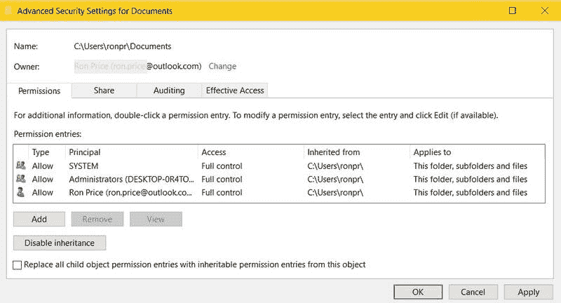
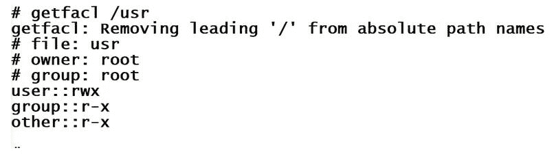

# 第十三章：逻辑安全

物理安全（参见第十二章，*物理安全和环境控制*）保护组织及其计算资产和资源免受损害、破坏和盗窃。逻辑安全不是物理安全的对立面，而是安全整体的另一个部分。逻辑安全与物理安全具有相同的总体目标——保护、预防、检测和阻止对任何组织极为重要的资源的入侵。

在本章中，我们将探讨用于实施逻辑安全政策以保护组织数据、软件和计算资产的各种方法、程序和技术。我们将涵盖以下主题：

+   访问控制

+   数据加密

+   数据保留和处置

+   物理销毁磁盘驱动器

+   操作系统、系统、应用程序和硬件强化

# 访问控制

我们之前谈到了在路由器上的访问控制（参见第十一章，*安全系统和协议*）及**访问控制列表**（**ACLs**）的使用。然而，在逻辑安全的背景下我们谈论的访问控制，虽然在结构和程序上有所不同，但其总体目标是相同的——防止未经授权访问系统软件和数据资产。

访问控制是一种逻辑安全方法，用于确定个人用户可以访问、修改、创建或移除哪些资源。通过使用访问控制，系统管理员可以基于个人或群组的基础允许或限制对某些系统资产和资源的访问。每个经过身份验证和授权的用户或群组都被分配一个**安全标识符**（**SID**），它是详细说明用户或群组访问权限和权限的系统记录的标识；也就是说，它们的安全主体。

当用户作为个人或作为群组的成员请求访问系统资源或资产时，SID 记录告知**操作系统**（**OS**）授予该用户的访问权限和权限。通常，请求的访问以读取或写入资源的形式进行。作为响应，操作系统扫描相应的 SID 来确定是否可以允许请求的访问。

# 访问控制标准

授予系统资源访问权限可以基于几种不同的标准。虽然访问权限和权限可能仅基于用户身份，向个别用户授予访问权限的管理——称为**自主访问控制**（**DAC**）——在小型组织中可能是可行的。然而，在更大规模的企业，特别是地理上分散的企业中，分配权限的标准可能来自各种识别因素，例如以下内容：

+   **组访问控制**：组访问定义了系统管理员分配给该组的单个用户的共同权限和权利。组账户通常是通用的，例如普通用户组账户或会计部门账户。组账户和组访问控制允许管理员对需要相同权限集的用户组实施访问控制策略。

+   **基于角色的访问控制 (RBAC)**：用户的行为——即其职称、工作、任务、职责或责任——可以定义该用户执行或完成任务所需的权限和权利。通常，RBAC 定义了一些执行相同任务并需要相同资源的用户组。

+   **特定标准访问控制**：尤其是在地理分布广泛的网络中，某些标准可能定义组账户的访问标准。以下是一些常见的标准：

    +   **位置**：位置访问控制可以基于用户的位置限制访问，例如分公司或远程制造站点。

    +   **时间**：在此情况下，访问只能在特定的日期和时间段内进行。例如，公司政策可能限制财务数据的访问仅限于周一至周四，并且仅在每天的上午 10:00 到下午 2:00 之间，且可能仅限于财务组的用户。

    +   **事务类型**：在在线事务处理系统中，访问支持数据库元素的权限是特定于各个事务类型的。权限也可以与用户的身份或组账户相关联。

    +   **应用程序**：访问控制还可以根据在线或离线应用程序的类型和目的定义权限和权利。通常，登录用户的权限和权利扩展到用户执行的任何应用程序。如果禁用此控制，即**用户帐户控制**（**UAC**），则应用程序的权限将超出用户的权限范围。

# 访问控制级别

除了在不同上下文中对用户应用访问控制外，访问控制还可以应用于系统的硬件和软件组件，且用途相同。访问控制机制可以限制对软件和硬件组件的访问和使用。

# 文件系统访问控制

除了分配给单个目录、文件夹和文件的权限外，文件系统（如 Windows NTFS、Unix POSIX 和 Linux NFS）还具有 ACL，它指定了用户和组对文件系统内程序和文件的权限。文件系统中的每个项都有一个**访问控制条目**（**ACE**），该条目定义了与每个单独项目相关联的权限。

ACE 中的权限与单个文件系统元素的权限非常相似，指定了谁具有访问权限以及每个组或用户可以对元素执行什么操作。以下截图显示了 Windows 高级安全设置中的文档对话框，权限和权限可以在该对话框中分配给文件夹和文件上的组和用户：

Windows 高级安全设置用于为文件夹和文件设置权限和权限

以下截图显示了 Linux 系统中`/usr`目录的 ACL 内容：

`getfacl`命令显示 Linux 系统中目录或文件的权限和权限

如上图所示，该目录的权限和权限属于三种不同的访问级别——文件所有者、组所有者（即文件所有者所属的组）和其他所有用户，在本例中分别是`root`、`root`和`other`。表示读取（`r`）、写入（`w`）和执行（`x`）的字符代表每个级别的权限。前述截图中`/usr`目录的用户/所有者具有读取、写入和执行权限。写入权限包括修改和删除。`root`组以及所有其他用户和组仅具有读取和执行权限，这意味着他们可以打开、扫描、显示，如果文件是程序或脚本，还可以运行它。

# 外部设备的访问控制

控制服务器及其他网络设备（如路由器或交换机）的内部或外部设备访问，必须是任何网络安全策略的关键部分。现代外部设备本质上就是计算机，这使得它们成为网络攻击的潜在目标。以下是一些限制对这些设备未经授权访问的方法：

+   **管理员密码**：所有外部设备都包含一个配置过程，用于设置其性能和安全设置，包括管理员级密码。设置此密码有助于防止未经授权访问设备的配置。

+   **应用补丁和固件升级**：大多数内部和外部设备都有相关软件，它提供了与计算机或操作系统的接口。保持这些软件的最新版本可以确保安全功能也能及时更新。

+   **禁用未使用的功能**：像任何系统一样，计算机设备和外部设备可能包含一些未使用的功能。禁用这些功能可以增强设备的安全性。

+   **限制访问控制**：这些包括任何允许用户登录以修改设置和配置的访问功能。只有管理员应有权限访问这些功能，打印服务器、直接将打印任务发送到设备的网络节点以及管理设备及其网络的管理员工作站也应具有访问权限。

+   **隔离设备**：外部无法访问的内部网络应包含外围设备。

# 管理访问控制

定义和规范谁可以访问组织的服务器和网络，以及他们可以做什么，应该在安全或访问控制政策中。该政策应详细说明各个用户和管理员组的访问权限和特权。管理员访问控制应限制仅那些安装、配置、管理和监控执行访问控制系统资源的软件或硬件的技术人员才能访问。即使在系统管理员的总体组内，访问权限也会根据责任、职位、技能和知识有所不同。

# 安全组和分发组

Windows 操作系统在其**活动目录**（**AD**）服务中提供了两种类型的组帐户。新建的组必须有一个组类型，可以是安全组或分发组。安全组允许你分配访问控制、文件和文件夹的权限。分发组仅用于分发电子邮件信息。安全组通常反映组织的组策略，并在用户和硬件安全设置上提供灵活性。另一方面，分发组仅用于分发信息，不用于安全目的。

# 网络访问控制（NAC）

NAC 是一种软件或集成设备，顾名思义，它控制对网络的访问。NAC 实现了组织的安全政策，执行逻辑合规性，并管理网络访问控制规则。NAC 适用于有线和无线网络，以及云计算。

NAC 基本上只允许经过身份验证的设备和笔记本访问网络资源，并监控对受保护设备的任何访问。因为 NAC 由政策、程序、工具和应用软件组成，它能够限制用户和设备对网络连接设备和资源的访问及活动。NAC 涵盖了网络上所有连接的设备。

# 数据加密

数据或文件加密是将加密算法应用于数据或文件，使其在存储或传输时，只有具有适当访问权限的用户或收件人才能打开、执行或应用其内容。加密和密码学是广泛的术语，涵盖了多种方法、应用和手段，用于保护数据和文件资产。接下来的讨论中，我们将使用加密这个术语来涵盖通过应用密码学对数据进行转换。

在最基本的层面上，加密有三个主要目标——**机密性、完整性和可用性**（**CIA**）。此外，CIA 三元组通常会扩展以包括身份验证、授权和不可否认性。加密是数据完整性和机密性保护机制。

# 存储加密

在计算机系统或网络中，数据（包括数字媒体、文档和编程）可以处于三种状态之一：使用中、传输中和静止中。使用中的数据已被解密，并通常复制到内存中以进行逻辑操作。传输中的数据在通过传输线路时需要防范各种拦截技术（这些技术都是不安全的）。同样的保护（甚至更强的保护）对于存储在某种数据存储介质上的敏感或机密数据也是必需的，例如硬盘、闪存驱动器，甚至可能是磁带。

存储设备上静态数据加密可能具有不同级别的数据安全性。加密几乎应用于存储设备的所有层次，包括整个硬盘驱动器，在某些情况下也包括可移动介质。**全盘加密** (**FDE**) 本质上在存储介质和主内存之间创建了一个通道。当数据传输到磁盘进行存储时，它会被加密；当数据传输到内存时，它会被解密。实际上，相同的加密/解密过程可以保护磁盘分区、文件系统、单个文件或单个数据元素，例如电子表格或数据库中的一列、一行或一个单元格。

# 数据保留与处置

有时，确保数据的安全意味着需要将其删除。当数据不再需要时，通常取决于数据类型、其操作环境、安全级别以及任何要求特定处理或保留的法律或法规。以下表格显示了一些常见数据保留政策项目及其保留期限的示例：

| **类别** | **项目** | **保留期限** | **销毁日期** | **处置方法** |
| --- | --- | --- | --- | --- |
| 组织记录 | IRS 表格 1023 | 永久 | 不适用 | 不适用 |
| 财务记录 | 财务报表 | 永久 | 不适用 | 不适用 |
| 财务记录 | 银行存款 | 7 年 | 2024 年 1 月 1 日 | 销毁 |
| 税务记录 | 薪资税扣缴—2015 | 7 年 | 2022 年 4 月 30 日 | 焚烧 |
| 人事记录 | I-9 表格 | 终止后 5 年 | 变化 | 销毁 |
| 基于计算机的通讯 | 内部电子邮件 | 12 年 | 每月月底 | 电子软清除 |

# 擦除磁盘

根据你的目标，移除硬盘驱动器上数据的方式有几种不同的级别。最低级别（破坏性最小）是*删除*，而最高级别（破坏性最大）是*清除*。介于这两者之间的是*擦除*和*粉碎*。用户通常将这些术语（及其操作）视为移除某些东西的不同名称，无论是半永久性移除还是永久性移除：

+   **删除**：通常，删除操作适用于移除一个或多个文件、目录或文件夹。然而，与彻底擦除相比，删除命令本质上是软删除。在从磁盘删除对象后，构成数据的电信号（比特）仍然保留在原地。删除功能移除文件在磁盘上的位置索引指针，并将其空间标记为可用。在新数据覆盖该空间之前，*恢复删除*操作将通过替换其索引指针来恢复文件。

+   **擦除**：虽然用户可能认为删除和擦除基本相同，但擦除会永久删除文件和文件夹，因此它们将永远消失。从磁盘擦除数据涉及使用专门的软件工具，例如**Darik's Boot and Nuke**（**DBAN**）2.3.0、Eraser 和 CBL 数据粉碎器。这些工具通过随机字符或二进制零（空值）覆盖磁盘，从而永久摧毁磁盘上的数据。

+   **清除**：清除磁盘驱动器比擦除要更具破坏性。当你清除一个存储设备时，无论是计算机中的二级存储、手机上的存储还是闪存驱动器，你不仅会移除活动数据，还会移除任何可能仍然可恢复的数据。执行擦除的软件下载工具也会执行清除操作。一些磁盘清除软件工具包括远程格式化、擦除或清除硬盘的功能。

+   **粉碎**：粉碎操作基本上是一种清除，但仅限于单个文件或文件夹。像擦除或清除操作一样，数据会被随机字符或零值覆盖。

# 格式化

许多用户认为格式化会删除存储介质上的所有数据或文件。事实上，格式化磁盘的效果与删除文件几乎相同——所有受影响的文件和数据看起来都已消失。就像删除单个文件一样，数据仍然存在。然而，格式化命令会移除所有索引条目，实际上删除了对现有数据的所有引用，并将所有存储位置标记为可用。与单个文件删除一样，格式化磁盘上的数据是可以恢复的。

数据存储设备有两种不同级别的格式化：

+   **低级格式化（LLF）**：通常，硬盘制造商在将存储设备安装到计算机机箱之前执行此过程。低级格式化会在磁盘上放置数字扇区标记，将存储介质映射到柱面、磁道和扇区。

+   **高级格式化（HLF）**：在低级格式化之后，磁盘仍然需要为操作系统使用进行准备。高级格式化为操作系统提供了分区或逻辑卷所需的结构。通常，高级格式化发生在操作系统安装过程中，或者在安装一个全新的未使用的硬盘后。

那么，*格式化磁盘会删除或擦除数据和文件吗？* 这取决于情况。Windows 操作系统提供了一种名为**快速格式化**的工具，实际上这是一种对整个分区或磁盘的*软*擦除。快速格式化只是一种大规模删除，只是去掉了索引，因此*是*快速的。Windows 还提供了一种格式化功能，它做的是一些人称为硬擦除的操作，因为它会对整个磁盘进行一次彻底的擦写，将零写入所有位。

# 物理摧毁硬盘驱动器

在至少擦除一次磁盘后，如果你希望百分之百、毫无疑问地确定磁盘及其现在已经遗忘的数据永远消失，你应该物理摧毁硬盘驱动器。有多种方法可以做到这一点。以下是你可以使用的几种方法，确保磁盘永远无法读取：

+   **移除并摧毁磁盘盘片**：假设我们正在查看的硬盘驱动器是将数据存储在涂有铁氧化物的盘片上，我们可以使用星形螺丝刀打开驱动器的外壳和固定盘片在轴上的卡环。移除盘片并将其打碎，焚烧，或使用任何你希望的方式摧毁它们。如果你愿意，也可以不移除盘片而直接用锤子敲打它们。无论哪种方式，都可以将驱动器外壳、任何松动的电子部件和盘片碎片送到电子废料回收处。

+   **穿透硬盘驱动器**：通过钻孔（当然是使用电动钻）、用大螺丝或钉子穿透外壳，或使用任何能让驱动器无法使用的工具穿透外壳，未必能确保数据无法读取。

+   **销毁硬盘**：这种方法适用于所有类型的数据存储设备，包括内外部硬盘驱动器（HDD 或 SSD）、闪存驱动器、CD-ROM 和 DVD-ROM。当然，对于 CD-ROM 和 DVD-ROM，只需要销毁已记录的介质。工业碎纸服务可以将这些设备粉碎成小块，并收取少量费用，这能提供最高的保障，确保任何数据无法访问。

# 强化

通常来说，强化是为了通过减少工作站、服务器和网络的漏洞，增加其安全性，防止被利用。强化有多个层级，但你在 Server+ 考试中可能会遇到的有**操作系统强化**、**系统强化**、**应用强化**和**硬件强化**。

# 操作系统强化

加固操作系统在确保计算机安全的过程中起着重要作用。客户端操作系统和服务器操作系统的加固过程略有不同。虽然两者的大部分步骤相同，但我们将重点讨论网络服务器操作系统的加固。基本上，加固操作系统包括四个主要步骤：禁用不必要的服务、禁用未使用的 TCP/UDP 端口、仅安装支持任务所需的软件，并通过应用补丁和更新保持操作系统的最新状态。

每个主要操作系统都有自己特定的加固实践，但有些措施适用于任何操作系统。这些措施包括以下内容：

+   **未使用的软件**：你出于好奇或为了解决一次性问题下载的免费应用程序，像几乎所有软件一样，都可能成为黑客入侵的途径。移除任何未使用或不必要的软件，并确保你的策略限制用户在工作站上安装非标准软件的能力。

+   **组和用户账户**：服务器常见的安全隐患之一是由于管理错误，用户发现自己能够访问机密或私人信息。所有用户密码应遵循统一的密码策略。定期审查所有组和用户账户的权限和权利。

+   **补丁管理**：虽然保持操作系统更新，应用最新的补丁、错误修复、服务包和更新是一个好习惯，但确保补丁适用于你的系统也很重要。这可能需要在应用补丁前后进行测试和审计。

+   **建立并监控基线**：基线是为服务器（或客户端）的操作系统和组件设定的标准性能或容量水平。安装时生成的操作基线并在每次系统修改后更新，作为与当前性能水平对比的标准。与基线的较大偏差可能表示潜在的安全事件。

# 系统加固

系统加固，也称为工作站或 PC 加固，是提高网络节点安全性的过程。加固措施适用于工作站的几乎每个部分，包括主要硬件和软件组件，并涉及整体安全性。除了适用于服务器的加固步骤外，还有一些专门针对网络工作站的步骤，包括以下内容：

+   **用户账户策略**：尽管技术上这是一个服务器级别的策略，但用户账户策略和权限会影响用户访问网络的能力，以及本地主机上的软件和数据。密码策略应要求定期更换密码、设定密码长度、密码重用政策和登录失败锁定标准。用户权限也应符合安全政策和访问控制模型。

+   **物理安全**：用户应了解并理解适用于其工作站的物理安全政策。这应包括对建筑物、工作室或办公室或隔间的出入口控制的政策。*整洁办公桌*政策要求保护物理文档和计算机的访问权限。用户还应了解在发生灾难性事件时的责任。

+   **日志记录**：除了键盘记录器，记录用户的所有系统和网络交互，包括登录和登出时间、访问的应用程序和数据，以及任何与安全相关的程序或数据访问尝试、成功和失败。

+   **自动补丁应用**：对工作站操作系统和应用程序执行的修复和补丁可以自动发布。

+   **禁用共享**：禁用文件和设备共享，以防止通过共享系统进行基于网络的访问。

# 应用程序加固

应用程序加固也被称为应用程序防护，因为这一过程改变了应用程序或工具的二进制代码，使其更能抵御篡改。应用程序软件可能会受到反向工程、入侵以及在某些情况下的代码注入。加固过程不仅保护了应用程序代码本身，而且在许多情况下，它还保护了数据不被应用程序访问。应用软件常见的威胁包括漏洞发现、病毒和其他恶意软件攻击，以及可能的应用程序和数据窃取。

# 硬件加固

除了操作系统和应用程序软件的加固，系统或网络的安全性还可以通过对工作站和网络上的某些硬件设备进行加固来增强。

# 主机硬件加固

大多数主机系统的硬件加固过程都在 BIOS/UEFI 配置设置中。设置访问配置设置的密码、禁用 **Wake-on-LAN**（**WOL**，如果可用）并设置启动设备顺序，以消除远程启动的初始化，这些都是帮助防止主机系统入侵的设置之一。

# 网络设备加固

加固网络的一项重要组成部分是通过加固网络设备来保护网络的基础设施。然而，不同制造商的网络设备可能需要稍微不同的步骤来加固。一般来说，加固路由器、防火墙、交换机、桥接器和其他设备使用大致相同的过程来实现相同的目标。用于加固网络设备的一些常见步骤包括：

+   **备份配置**：将设备操作系统的当前配置和设置的副本存储在安全位置。

+   **禁用管理协议**：禁用未使用的任何管理协议，例如 Telnet 和 **文件传输协议**（**FTP**）。

+   **禁用未使用或不必要的服务和协议**：禁用不使用的设备服务和协议，例如任何发现协议、HTTP、SNMP 和 **引导协议**（**BOOTP**）

+   **加密配置文件**：在传输配置文件时，应用加密以保护其内容

+   **安全访问**：使用强密码策略访问设备控制台及其辅助和虚拟终端接口

+   **定义安全标准**：为网络设备及其操作定义安全标准和程序

# 端点安全

即使对服务器和网络进行了硬化，额外的措施也可以增强其整体安全性。当客户端连接到主机时，连接会创建两个终止点：一个入口点和一个端点。入口点在连接的客户端端口打开，服务器（其接口端口）成为端点。由于日益增多的 **自带设备**（**BYOD**）政策，端点安全迅速成为一个问题。在这些环境中以及多种远程访问形式中，端点安全必须集中于检测和防止入侵和恶意软件。

**入侵检测系统**（**IDS**）可以是硬件或软件。无论如何，IDS 扫描网络流量（入站或出站），以识别恶意软件或可疑行为模式，并监视系统配置设置以防止意外更改。端点 IDS 是 **安全信息和事件管理**（**SIEM**）应用程序，用于监视、扫描和收集有关端点流量的信息。一些 IDS 允许设置性能和事件阈值，超过这些阈值时会向管理员发送警报。在网络上，端点和入口点 IDS 设备分别被称为 **基于网络的入侵检测系统**（**NIDS**）或 **基于主机的入侵检测系统**（**HIDS**）。NIDS 是一种独立设备，用于监视网络流量，使其在传递到网络设备之前可以被检测到。HIDS 可以是连接到主机计算机的硬件或软件，也可以在主机上运行的软件。

IDS 主要有两种类型 — **签名** 和 **启发式**：

+   签名型 IDS 从可疑消息中提取一段代码，对其进行算法处理，然后与已知恶意软件数据库进行比较。如果匹配成功，将删除消息，创建相关日志条目，并通常禁止发送者访问网络。

+   启发式 IDS，即异常基础 IDS，将可疑程序的操作与可接受操作模型进行比较。如果匹配成功，可能会出现误报（匹配成功，但消息有效且非恶意）或漏报（不匹配，但消息无效且可能是恶意软件），否则 IDS 可能会阻止源地址进入网络。

# 概要

访问控制确定单个用户可以访问、修改、创建或删除的资源。访问控制允许或限制对系统资产和资源的访问。在大型组织中，分配权限的标准可能来自不同的识别因素，如群组、角色、位置、时间、日期、交易类型或正在使用的应用程序。

访问控制可以应用于硬件和软件。文件系统 ACL（访问控制列表）指定权限和授权。每个文件或对象都有一个 ACE（访问控制条目），定义其拥有者、组和其他用户的权限。每个级别可以有读取、写入和执行权限。设备的访问控制通过管理员密码、应用补丁和升级、禁用未使用的功能、限制访问以及通过隔离设备来实现。

加密应用一种加密算法对数据或文件进行加密，以限制其内容仅对具有适当访问权限的人员可见。加密和安全性有三个主要目标：保密性、完整性和可用性。CIA（保密性、完整性、可用性）扩展为包括身份验证、授权和不可否认性。数据可以处于使用中、传输中或静态状态。

有几种方法可以从硬盘中删除数据——删除、擦除、清除和粉碎。

格式化会移除所有索引条目，但数据本身仍保留在磁盘上。格式化磁盘上的数据是可以恢复的。低级格式化会在磁盘上放置数字扇区标记，将存储介质映射为圆柱、轨道和扇区。高级格式化会添加操作系统用于分区或逻辑卷的结构。销毁硬盘有几种方法：移除并销毁盘片、穿透硬盘或粉碎硬盘等。

加固通过减少系统或设备的漏洞来提高其安全性。不同类型的加固包括操作系统加固、系统加固、应用程序加固和硬件加固。加固操作系统包括禁用不必要的服务和未使用的 TCP/UDP 端口，只安装所需的软件，并应用补丁和更新。此外，加固还可能包括删除未使用的软件、审核组和用户权限、执行补丁管理、建立和监控基准线。

系统加固提高了网络节点的安全性。这可以包括强制执行用户账户策略、实施强密码策略、遵守物理安全政策、启用系统日志记录、禁用文件和设备共享。应用程序加固通过修改应用程序的二进制代码，使其抵抗篡改、逆向工程、入侵和代码插入。主机系统的硬件加固通过 BIOS/UEFI 配置设置来完成，包括设置 BIOS/UEFI 密码、禁用 WoL 和设置启动顺序以消除远程启动。硬化网络设备包括备份设备配置、禁用未使用的管理协议和服务、加密配置文件以及确保访问安全。

IDS 是一种硬件或软件，用于扫描网络流量中的恶意软件或可疑行为模式。端点 IDS 监控、扫描并收集端点流量的信息。NIDS 在网络设备之前监控网络流量。HIDS 是一种在主机计算机上的硬件或软件。IDS 的两种类型是特征匹配和启发式。

# 问题

1.  以下哪项不是常用的访问控制识别因素？

    1.  组

    1.  角色或分配

    1.  应用程序类型

    1.  计算机名称

1.  分配给特定用户或组的权限和权利定义在什么元素中？

    1.  ACL

    1.  ACX

    1.  ACE

    1.  ACR

1.  将加密算法应用于数据以限制访问其内容的目的是什么？

    1.  保密性

    1.  身份验证

    1.  授权

    1.  加密

1.  以下哪项是从磁盘驱动器中删除数据的方法？

    1.  删除

    1.  擦除

    1.  擦除

    1.  擦除

    1.  以上所有

    1.  以上都不是

1.  以下哪项描述了磁盘驱动器格式化后任何数据的状态？

    1.  不可恢复

    1.  销毁

    1.  可恢复

    1.  不可读

1.  系统或设备加固的目标是什么？

    1.  延长服务寿命

    1.  加强其案例

    1.  降低漏洞

    1.  使其离线

1.  应用程序加固修改应用程序的二进制代码：

    1.  正确

    1.  错误

1.  设置 BIOS/UEFI 密码和禁用 WoL 是以下哪种操作的例子？

    1.  应用程序加固

    1.  操作系统加固

    1.  网络加固

    1.  硬件加固

1.  当 IDS 将消息中的内容与身份代码数据库进行比较时，它正在执行什么操作？

    1.  启发式扫描

    1.  特征匹配

    1.  二进制匹配

    1.  数据扫描

1.  哪种软件或硬件设备可以通过实施组织的安全策略来控制网络上的访问？

    1.  NAC

    1.  SAC

    1.  UPS

    1.  IPSec
