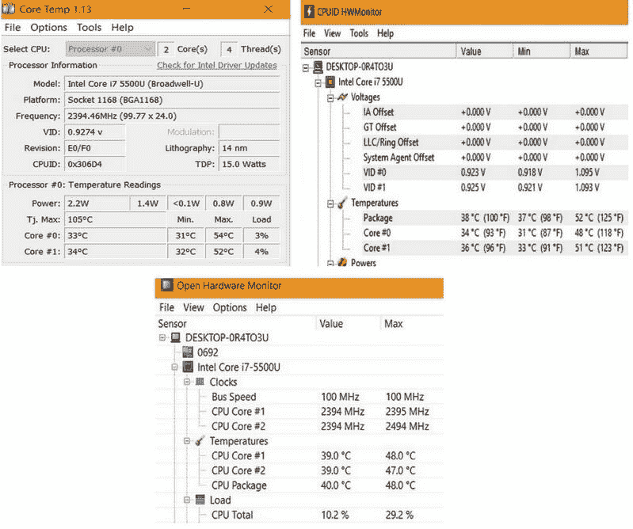
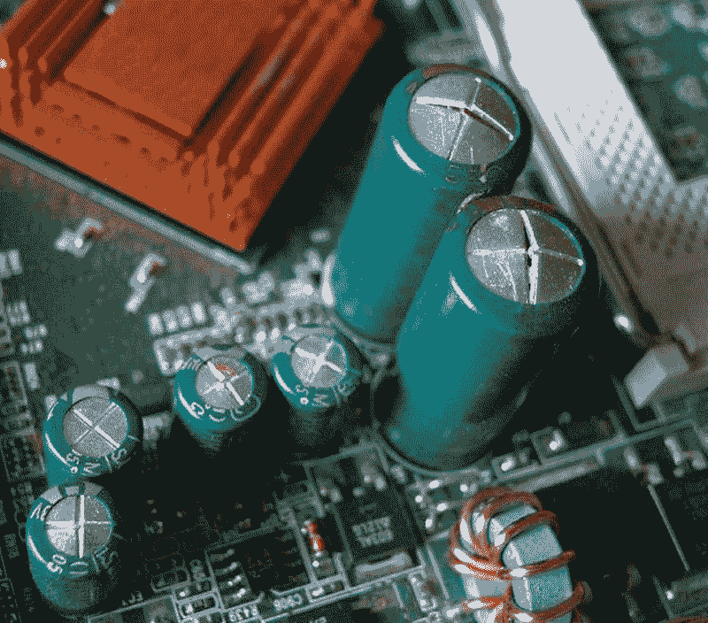
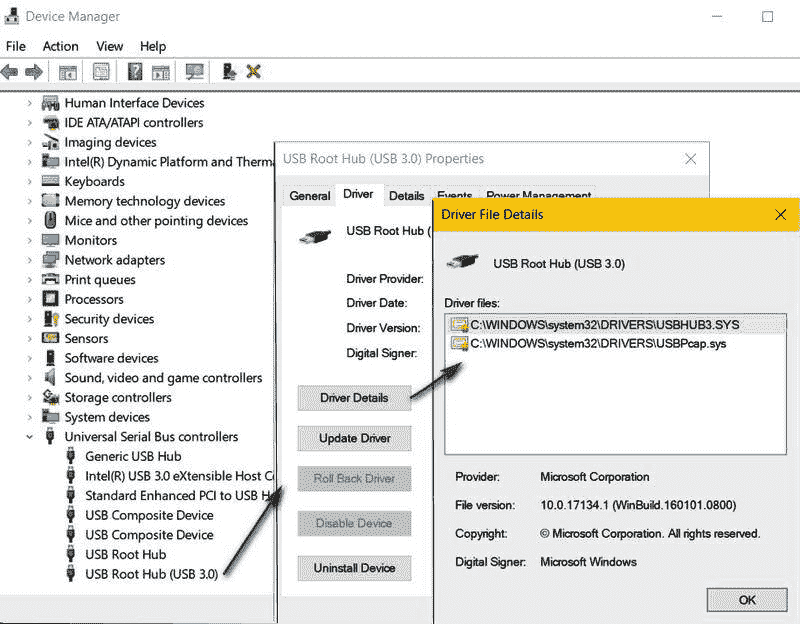
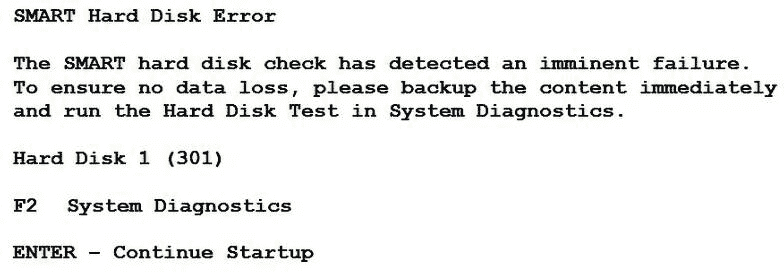
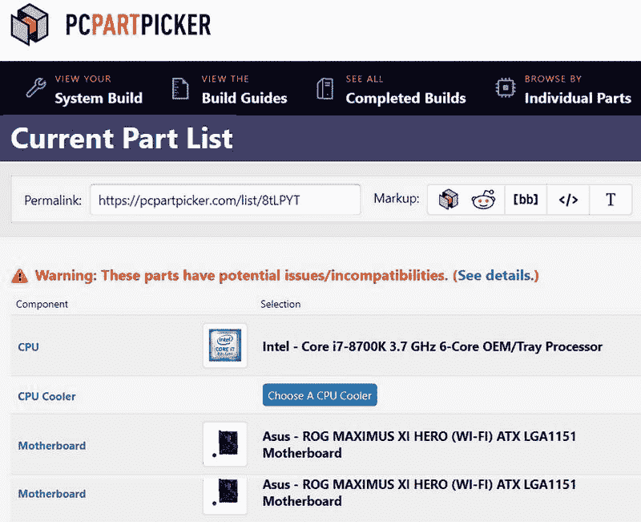

# 第十五章：常见硬件问题

尽管大多数计算机问题与软件相关且容易解决，但硬件组件也可能出现问题，通常这些问题的影响最小，或在极端情况下可能是灾难性的。你排除故障、解决问题和记录硬件问题的能力，直接影响硬件问题可能带来的干扰程度。在本章中，我们将讨论相对常见的 PC 硬件问题。这些问题是你在作为认证服务器管理员的角色中，最有可能遇到的。

本章将讨论以下内容：

+   常见的硬件问题及其原因

+   环境问题

# 硬件问题

硬件问题可能是电气或电子组件中的故障，也可能与组件的设置、安装或配置有关，这可能导致整个计算机的故障或失效。然而，看起来像硬件问题的故障也可能是由软件引起的。为了避免显得过于显而易见，硬件问题和软件问题的一个主要区别在于，硬件问题通常需要你打开或拆除系统机箱，而不仅仅是应用一个补丁。

# 识别硬件问题

有些计算机问题很难确定是软件问题还是硬件问题。虽然有些问题很明显，比如机箱冒烟，但对于其他问题，你可能根本无法判断。以下是一些有助于你将问题识别为硬件问题的条件：

+   **间歇性故障**：一种不规则发生但每次以相同方式发生的问题，可能是硬件或软件相关的问题。如果该问题在安装新软件、补丁或对现有操作系统或应用程序进行升级后立即（或很快）出现，那么它很可能是软件问题。然而，如果问题发生在没有任何软件更改的时期，那么你猜对了——这很可能是硬件问题。

+   **访问失败**：如果问题出现在任何组件的使用或外设设备的 I/O 操作之后，那么问题很可能是由于硬件故障引起的。然而，问题也可能是由于软件缺陷导致的。在测试软件问题之前，你应该首先排除硬件问题。

+   **随机停止或重启**：如果你正在处理一个极为宝贵的文档、论文、学位论文或游戏，而计算机突然冻结并关机或随意重启，那么你遇到的就是硬件问题。

+   **POST 故障**：启动过程的一部分是**开机自检**（**POST**），它验证在 BIOS/UEFI 配置设置中识别到的设备的存在和功能。如果启动过程失败，POST 会在显示器上显示错误信息或代码，或在系统扬声器上发出一系列蜂鸣声（表示特定的错误状态）。显然，这是一个硬件问题，通常发生在新硬件安装之后。

其他通常表示硬件问题的症状如下：

+   **BSoD/RSoD**：蓝屏或红屏死机表示操作系统与硬件配置之间的错误

+   **I/O**：对二级存储的读取和写入非常慢

+   **数据完整性**：文件莫名其妙地损坏、损坏或丢失

+   **混乱的显示**：显示缺失部分图像；显示混乱或不是预期的图像或内容

+   **异常噪音**：来自系统机箱的刮擦声、磨擦声、敲击声，甚至可能有蜂鸣声

# 常见问题

大多数（但并非所有）计算机硬件问题相对容易诊断，并且在许多情况下容易解决。否则，*为什么专注于网络服务器的认证考试会包括故障排除和修复信息呢？* 作为系统管理员，你的技能应包括识别和解决常见硬件问题的能力。以下各节列出了几类硬件组件的常见故障。请注意，这些问题很可能以某种形式出现在认证考试中。

# POST 故障

正如我们之前讨论的，启动过程中的 POST 阶段出现故障可能会导致启动过程停止。虽然 POST 会传达它检测到的任何问题，但这种通信的形式在不同的 BIOS/UEFI 版本之间有所不同。Windows PC 和 macOS 计算机都在启动过程中执行 POST 作为初步步骤。POST 验证了基本组件和设备的存在和功能，例如**电源供应单元**（**PSU**）、主内存（RAM）以及系统总线结构等。如果这些设备中的任何一个未能响应 POST，系统扬声器会发出一系列可听的蜂鸣声来提醒用户。

在 POST 运行期间，唯一可用的输出设备是系统扬声器。因此，POST 使用短促或长鸣的蜂鸣声模式来指示它发现的任何问题。这些代码通常是主板或计算机制造商特有的。没有统一的蜂鸣代码，每个制造商都有自己独特的代码。因此，在一个环境中，技术员可能需要具备多厂商蜂鸣声知识。

下表是使用蜂鸣代码的示例，并附有一些说明它们含义的插图。如所示，蜂鸣音有短和长两种。短蜂鸣音通常持续一秒钟，而长蜂鸣音持续两秒钟：

| **数量和长度** | **含义** |
| --- | --- |
| 1 短音 | 内存刷新故障 |
| 2 短音 | POST 故障 |
| 4 短音 | 系统定时器故障 |
| 5 短音 | CPU 故障 |
| 8 短音 | 显卡故障 |
| 10 短音 | CMOS 故障 |
| 1 长音，3 短音 | 内存故障 |
| 1 长音 | POST 成功 |

# 过热

计算机过热的原因有很多，但通常是由于忽视了预防性维护。灰尘在通风口和散热器上积累，以及系统机箱内部的灰尘可能会阻塞或限制原本用于冷却发热元件的气流。系统机箱内部的热量慢慢上升到超出安全工作范围的程度，也可能会慢慢导致主板上的电子元件和已安装设备的性能下降。损坏的原因是灰尘形成了绝缘层，导致热量无法散发，从而引起了热量积聚。

另一个可能导致计算机过热问题的因素是其位置与通风和气流的结合。一个良好的通风空间提供了一个基础环境，有助于计算机冷却系统工程设计时所假设的条件。其他因素包括直射阳光、靠近外部窗户、或者家具或物体阻塞气流。

对于一台存在过热问题的计算机，无论是间歇性还是持续性，解决方案基本上是逆转导致计算机过热的条件。用压缩空气清洁系统机箱内部，吹走任何积尘，特别是冷却系统的通风口、风扇、散热器和空气通道。你可以使用吸尘器清理灰尘，但确保使用的是不会产生静电的吸尘器。换句话说，千万不要使用家用吸尘器！

如果清洁后问题仍未解决，检查计算机的位置以及其对周围通风系统的访问情况。将计算机移出直射阳光下，并远离任何阻碍气流的物体。若问题依旧，可能是机箱风扇故障，散热器或 CPU 风扇安装不当，或者导热膏过多或过少。你需要逐一排查这些问题，消除它们作为可能的原因。

# 处理器故障

如果计算机的微处理器出现故障，这通常是其他问题的很好的迹象——不过到那个时候也无关紧要。处理器出现故障的原因只有几个，比如极端的电力冲击或雷击、尝试超频 CPU 失败，或者长时间过热造成的累积损害。大多数处理器现在都包含一种保护机制，当其工作温度过高时，会使其速度减慢或完全停止。虽然这个功能可以保护处理器免受突发和剧烈温度升高的影响，但从长远来看，尤其是对高负荷使用的处理器而言，它仍然可能逐渐开始出现故障。

监控新组装的商业计算机上 CPU 的温度可以建立一个可靠的基准。然而，如果你安装了新的 CPU 或冷却设备，任何不注意的错位或不正确的应用都会导致一个错误的基准。定期检查系统与这个基准的对比，实际上就是在追踪**故障时间**（**TTF**）。

那么，*你如何* *测量 CPU 的温度呢？* 而*应该是多少温度呢？* 这在不同处理器之间略有差异，但一般来说，处理器应该在 45^o 到 50^o **摄氏度**（**C**）的范围内工作，相当于 113^o 到 122^o **华氏度**（**F**）。在满负荷状态下，比如玩游戏时，CPU 的温度不应超过 75^o C（167^o F）。某些处理器可以在更高的温度下运行，但不能维持太长时间，否则会损坏 CPU。

以下截图展示了三种不同软件工具的捕获画面——Core Temp、CPUID HWMonitor 和 Open Hardware Monitor，按顺时针方向从左上角开始。这些工具和其他类似工具报告了多个操作参数来进行监控：

监控处理器和核心温度的实用软件示例

# 内存故障

一台计算机，像人类一样，当其内存开始出现问题时，就无法正常运行。计算机中的内存相关错误和故障并不总是显而易见，而且在大多数情况下，似乎表明其他组件可能是问题所在。常见的内存问题包括：

+   **逐渐变慢**：当你第一次开机时，一切都运行得很快。然而，随着时间的推移，计算机变得越来越慢，直到下载一个网站或打开一个文档可能需要几分钟，而不是几秒钟。

+   **随机重启**：在你工作时，计算机会不定时地重启，重启之间的时间不固定，或者计算机会卡住，键盘和鼠标似乎无法工作。

+   **文件损坏**：虽然这通常看起来像是磁盘驱动器问题（也可能是），它也可能是内存问题。常见的内存故障可能会损坏一个常用的单个文件或文件系统，直到使磁盘驱动器无法使用。

+   **安装失败**：在安装或重新安装软件时，包括操作系统或大型应用程序，安装过程会停止、冻结，或者显示一个可能与实际问题无关的随机错误信息，这个问题很可能是内存问题。

+   **蓝屏死机/红屏死机**：**蓝屏死机**（**BSoD**）或它的“亲戚”红色屏幕，会迅速闪现显示器，告诉你可能存在问题（通常是内存问题），然后继续启动过程。

大部分情况下，内存问题的原因与影响 CPU 的原因基本相同——热量、电涌、电静电损伤、不当安装、超频 CPU、内存插槽损坏，或内存模块故障。

# 主板和组件问题

坏消息是，你可能认为主网络服务器的问题是主板问题。好消息是，问题可能并非真正是主板；它只是看起来像是主板的问题。记住，主板上有些组件是固定的，也有一些是安装在主板上的。附加组件、处理器、内存、散热系统等，可能是问题的根源，但不幸的是，最终问题可能确实是主板。

不必在意主板可能是计算机中最昂贵的组件这一事实——它可能是最难更换的组件。一旦你确信问题绝对是主板的问题，务必小心行事。在拆卸旧主板之前，标记每根电缆和线缆，注明它连接的设备、连接位置以及重新组装顺序。你会感激自己这样做的，相信我。

计算机的主要组件很少会突然完全故障。一般来说，它会随着时间的推移逐渐故障，发出一些警告信号，表明可能有问题，你应该去调查。以下部分列出了可能出现主板或其组件问题的几种迹象，顺序无关频率或重要性。

# 电容问题

主板上的三个主要电子组件是变压器、整流器和电解电容器。计算机电源中的变压器降低输入电力的电压。*降压*后的电力通过整流器将交流电转化为直流电。由于交流电波动，整流器产生的直流电也会波动。电容器，也被称为电解电容器或电容器，储存静态电荷。当主板上的直流电波动时，具有**等效串联电阻**（**ESR**）的电容器会提供足够的电流来*升压*电流。

一个可能的主板问题是电容器的故障。如下面的图片所示，故障的电容器可能会开始膨胀或顶端凸起，泄漏电解质材料，甚至发生火灾。电容器的故障不一定是紧急情况，但未经调节的直流电源可能开始损坏主板上的其他组件，包括处理器：

主板上的电容器显示膨胀的电容

图片来源：Wikipedia.com (https://commons.wikimedia.org/wiki/File:Defekte_Kondensatoren.jpg)

# 烧伤

如果电气组件，如电容器，发生爆裂或烧毁，结果通常是显而易见的：有电烧味（臭氧味）或主板上有烧毁的组件或电路的迹象。电子组件不一定需要起火才能看起来像是烧坏了。电气短路也能造成同样的效果。

# USB 无法识别

你正在处理一台网络服务器，需要安装一个文件。你插入一个 USB 闪存驱动器，但屏幕上出现错误提示：“USB 设备无法识别：连接到此计算机的某个设备发生故障，Windows 无法识别它”。出现此错误可能有多种原因。然而，最好的方法是从最可能的原因开始排查。以下是一个处理过程：

1.  验证闪存驱动器是否在其他端口或计算机上工作。如果在其他地方也无法工作，那就说明问题所在。

1.  现在你已经确认闪存驱动器正常，检查 USB 端口是否有视觉上的损坏，尤其是如果它是外部设备，必要时更换它。

1.  验证 USB 驱动器和 USB 根集线器（参考下面的截图）的设备驱动程序的有效性和版本（如果根集线器比实际 USB 端口多，不用担心）。如果需要，重新安装或更新设备驱动程序。

1.  检查是否有松动的电缆、连接器或没有正确插入的线缆。替换或修复你发现的问题。

如果这些情况似乎是导致问题的原因，请采取适当的措施。然而，如果问题似乎不是硬件故障，那么问题可能出在操作系统、设备控制器、固件或根集线器设置上。请应用任何待安装的操作系统更新或补丁。更新系统固件，特别是如果更新涉及到 USB 或扩展总线。检查根集线器是否将 USB 设备置于选择性挂起状态：

检查 USB 根集线器设备驱动程序

# 扩展总线

扩展总线，也称为外部总线，提供了扩展插槽（以及插入其中的扩展卡）与系统总线之间的连接。大多数主板通常会包含多个扩展总线标准，以提供向后兼容性和组件灵活性。目前大多数主板上的扩展总线包括**加速图形端口**（**AGP**）、**外设组件互联**（**PCI**）、**PCI 扩展**（**PCI-X**）和**PCI Express**（**PCIe**）。PCI 总线是最流行的，通常出现在 PC 和 Macintosh 主板上。

与扩展卡和总线相关的常见问题之一是*芯片松动*。这种情况，也被称为电力松动，是由扩展插槽中金属连接器的温度变化引起的。随着时间的推移，扩展卡可能会开始*晃动*并逐渐从扩展插槽中脱落。解决这个问题的方法是将卡片牢牢地插入扩展插槽（当然，要在关机状态下进行）。

如果一张扩展卡在正确安装时没有问题，那么故障或性能问题很可能出现在与该卡相关的区域。扩展卡通常与一个或两个功能、组件或外部设备相关，如显卡、声卡和网络接口卡。因此，如果卡片出现问题，通常会表现为支持的设备出现问题。

如果一张正常运行的扩展卡突然出现问题，最常见的原因是过热和电源问题。过热可能会损坏卡片上的元件；不良的电源可能会造成严重影响；或者大范围的电涌可能会影响所有内部电子元件。另一种看似扩展卡问题的情况，可能是因为主板和芯片组包含了与已安装扩展卡相同的功能。移除该卡片可能会消除问题。

将卡片移到相同类型的不同扩展插槽中，可以验证故障是出在卡片、扩展插槽，还是与总线、设备驱动程序或芯片组有关。然而，解决扩展卡问题的最常见方法是将卡片更换为一个已知良好的卡片。

# 电源单元（PSU）

如果没有完全功能的电源单元（PSU），计算机就无法运行。计算机内部或连接的电子元件所需的电力，与其他任何电气设备的电力要求完全不同。是的，计算机确实通过插座连接电源，获得 110 伏或 220 伏的交流电，但其内部组件运行在+/- 3.3 伏、+/- 5 伏和+/- 12 伏的直流电上。交流电从插座转换为计算机所需的直流电，正是电源单元（PSU）的工作原理。

尽管电源单元（PSU）是计算机的主要组成部分，并且故障率最高，但当电源单元开始故障时，它是一件大事，而当它完全失效时则更为严重。早期检测到的电源问题可以防止其他内部组件出现严重问题，这些问题通常更难诊断。故障排除的最大挑战是，电源故障可能是计算机中任何电气问题的根源，而且往往的确是。以下是一些常见的迹象，表明电源单元可能正在故障或已经故障：

+   系统机箱背部靠近电源线连接处发出不寻常的噪音。

+   打开电源开关后，计算机没有启动，但计算机前面或后面会亮起闪烁的指示灯。

+   启动后计算机在非常短的时间内自动关机。

+   在玩游戏或使用应用程序时，计算机突然断电且没有任何警告，可能还会显示蓝屏（BSoD）。

+   新游戏的画面显示出现扭曲，电源单元的功率和电流不足以支持显卡。

+   计算机启动时，硬盘驱动器和冷却系统没有启动，导致系统死机。

+   接触金属机箱会产生电击。

解决电源故障的方法是更换电源，即使只是为了确认电源是否是检测到问题的根源。

# 硬盘驱动器（HDD）

机械故障是硬盘（HDD）问题最常见的原因，甚至在一定程度上也会影响**固态硬盘**（**SSD**）。硬盘的机械内部组件也是其运动部件，随着时间的推移，运动部件可能会磨损并故障。硬盘的故障几乎没有预兆。固态硬盘的故障周期要长得多，固态硬盘的常规保修期为十年，制造商声称固态硬盘可以保持功能超过 300 年。所以，我们还是聚焦于硬盘及其故障原因。

硬盘问题的常见原因包括以下几点：

+   **热量**：到现在为止，你应该已经意识到，计算机内部过高的温度是一个坏信号，而且长时间的高温会损坏或摧毁系统的关键组件。

+   **湿气**：似乎很合理，当硬盘浸泡在水中时，它可能会遇到一些问题。然而，问题不一定出现在硬盘外壳周围的主轴、磁头和盘片上，但水和电子组件的结合并不好。在没有完全干燥的情况下开机可能会导致电子组件短路，而不仅仅是硬盘上的组件。

+   **静电放电（ESD）**：另一方面，极度干燥的环境几乎能造成与潮湿环境相同的损害。静电积累可能导致组件或电路故障，包括硬盘。

+   **电涌**：交流电源中的常规电涌会随着时间的推移降低计算机的整体性能，但严重的电涌，例如雷击，可能会轻易摧毁硬盘驱动器以及计算机的所有电子元件。

+   **物理损坏**：硬盘驱动器的内部部件在精密公差下运行，设计上并不适应突然的震动、跌落或撞击。如果计算机，甚至仅是硬盘驱动器，被摔落、撞击或受到了足够的冲击力，硬盘很可能会发生故障。

如果你认为计算机问题可能是由硬盘驱动器引起的，可以使用**自我监控、分析和报告技术**（**SMART**）工具来显示其状态。此工具几乎在所有操作系统中都可以使用，包括 Windows、Linux 和 macOS X。以下截图显示了 SMART 硬盘错误 301 的结果，这表明硬盘驱动器出现故障，应立即进行备份：

显示 SMART 硬盘错误

# 视频显示

显然，如果计算机的视频显示上有垂直或水平线条或条纹，正如下面的截图所示，说明出现了问题。此情况可能是由硬件或软件问题引起的。请根据情况选择一种方法开始排查：

显示器上出现垂直线条和条纹，表示存在问题

如果你开始将显示问题排查为软件问题，请按照以下步骤操作：

1.  访问显示器制造商的网站，进入支持页面，下载适用于你型号的图形设备驱动程序

1.  如果有多个驱动程序，请一次安装一个，完成所有驱动程序后重启计算机

如果这些步骤解决了问题，那就是软件问题，很可能是操作系统与之前版本的设备驱动程序之间的冲突或不兼容造成的。

如果你首先将问题排查为硬件问题，或者软件排查步骤没有解决问题，请使用以下步骤排查带有分离显示器的系统：

1.  重启计算机并打开 BIOS/UEFI 配置系统。如果问题与硬件相关，启动进入 BIOS/UEFI 设置会将视频显示从与操作系统关联的视频驱动程序和芯片组功能中隔离开来，并仅通过基本驱动程序支持显示。

1.  如果在 BIOS/UEFI 系统中显示问题仍然存在，那就是硬件问题。不同制造商甚至同一制造商的不同型号修复方法不同。请访问制造商的网站，找到解决问题的具体操作流程。

无论显示器的品牌或型号如何，有几个通用的检查步骤。检查电缆，确保它在每一端都正确连接。验证显示器是否连接到计算机的正确插头和视频标准。检查电源线和视频连接电缆是否有 sharp 弯曲、物理损伤以及松动的电线连接。

最后一点——如果视频问题出现在笔记本电脑、平板电脑或其他集成显示屏的计算机上，最好将其送到专业维修技术人员处，最好是厂家授权的维修人员。

# 其他常见问题

除了我们已经讨论过的问题和原因外，计算机系统中还可能出现其他一些不太具体的问题。这些问题包括以下几点：

+   **兼容的组件**：如果必须更换计算机的主要组件，则更换件与现有或其他新组件的兼容性对于计算机性能的提升非常重要。有一些网站可以帮助你验证组件是否兼容。以下截图展示了其中一个网站的示例，[`pcpartpicker.com/`](https://pcpartpicker.com/)：

在 PCPartPicker.com 上进行兼容性检查的示例

+   **不兼容的 BIOS**：当安装或升级 Windows 系统时，如果升级软件停止并显示 Windows 和计算机上的 BIOS 不兼容，问题可能是一个名为 **非执行** (**NX**) 位的 CPU 设置。这是一个控制内存用于各种功能的开关设置，它会阻止部分安装程序的运行。要启用 NX 位，打开命令提示符（具有管理员权限），输入 `exe /set {current} nx AlwaysOn` 命令并按 *Enter* 键。关闭计算机（不要重启），然后重新启动。一切应该就绪。

+   **服务器背板故障**：背板是一块带有多个扩展槽的电路板，允许多个组件共享公共总线结构和电源。背板的质量取决于其插槽连接器，如果发生故障，某个插槽将被空置，从而允许更换背板。

# 环境问题

无论服务器机房或数据中心的地理位置如何，其环境应该基本相同。一个问题是，外部环境可能会出现温度、空气质量、湿度和极端天气条件等极端情况。服务器机房或数据中心必须提供一个有利于电子设备操作的环境，同时也要考虑到人类管理员的需要。

服务器机房的主要环境威胁包括温度、湿度、空气中的污染物以及电源的剧烈波动。以下是每个因素的简要说明：

+   **温度**：服务器房间的环境温度应始终保持在 50° F (10° C) 到 82° F (28° C) 之间，最佳温度范围是 68° F (20° C) 到 71° F (22° C) 之间。计算机可以在温度稳定的环境中运行，无论是冷还是热。当温度快速或频繁变化时，可能会出现如系统机箱内结露等问题。

+   **空气质量**：空气中的污染物，如灰尘、绝缘物以及其他颗粒，如果没有控制或清洁，可能会积聚在冷却系统、主板和计算机、存储设备、电源供应以及其他设备的电子元件上。空气中的水分也是一种污染物，可能会逐渐饱和内部组件。此类污染可能导致过热、电气短路和腐蚀等问题。

+   **电力**：电力服务电流的波动可能会损坏并可能摧毁服务器房间中的设备。电力浪涌、电压跌落、低电压和停电可能会给设备造成压力，甚至烧毁或短路电动机、控制器和其他电子元件。应该使用电源调节器和**不间断电源供应**（**UPS**）设备来平稳电力服务。

# 总结

电子组件中的计算机硬件故障是由设置、安装或配置中的问题引起的，这些问题导致其故障或失效。硬件问题包括间歇性故障、访问失败、随机重启和开机自检（POST）失败。系统管理员应具备识别和解决常见硬件问题的能力。

POST 过程验证了基本组件和设备的存在与功能。如果设备没有响应，会发出一系列可听的哔哔声来提醒用户。POST 使用短促或长音的哔哔声来指示问题。没有标准的哔哔声代码。

计算机常常因忽视预防性维护而过热。机箱内的灰尘会阻碍空气流通，而空气流通本应用于冷却组件。系统机箱内的热量会逐渐损坏电子元件。解决过热问题的方法是用压缩空气清洁通风口、风扇、散热片和空气通道。

处理器失败有几个原因：极端电力浪涌、超频或过热。测量 CPU 温度可以设定基准。任何不对齐的情况都可能造成错误的基准。处理器应在 45° 至 50° 摄氏度（113° 至 122° 华氏度）之间工作，且不应超过 75° C（167° F）。

常见的内存问题包括逐渐变慢、随机重启、文件损坏、安装失败和蓝屏死机（BSoD）。内存问题的原因与 CPU 问题相同：热量、电力波动、静电损伤、安装不当、超频、内存插槽损坏或内存模块故障。

主板上的三种电子组件分别是变压器、整流器和电解电容器。变压器将输入的电压降低，整流器将交流电转换为直流电。电容器储存静电电荷，ESR 用它来*提升*电流中的电压下陷。故障的电容器会膨胀顶部、泄漏电解物质或着火。

当前大多数主板上的扩展总线包括 AGP、PCI、PCI-X 和 PCIe。PCI 总线是最常用的，PC 和 Macintosh 主板上都有。

电源供应单元（PSU）将 110 伏或 220 伏的交流电转换为 3.3 伏、5 伏和 12 伏的直流电。PSU 可能出现故障的常见迹象包括奇怪的噪音、开机时不启动计算机、计算机自动关机、硬盘驱动器（HDD）和冷却系统无法启动。硬盘驱动器的机械故障是最常见的问题原因。硬盘问题的原因包括高温、潮湿、静电放电、电源浪涌和物理损坏。

服务器机房或数据中心必须提供一个有利于电子设备运行的环境，同时也要考虑到人类管理员的需求。服务器机房的主要环境威胁包括温度、湿度、空气中的污染物以及电力源的极端波动。

# 问题

1.  负责管理和维护一组服务器的系统管理员必须具备的核心技能是什么？

    1.  应用程序编程

    1.  识别常见硬件问题

    1.  修理 HVAC 系统故障

    1.  监控环境条件

1.  以下哪项不是常见的计算机硬件故障？

    1.  缓冲区溢出

    1.  POST 失败

    1.  USB 设备无法识别

    1.  访问失败

1.  开机后立即运行并验证硬件组件和设备存在的过程是以下哪个？

    1.  BOOTP

    1.  DHCP

    1.  POST

    1.  AGP

1.  POST 过程发出的声音，用于指示错误来源的声音叫做以下哪个？

    1.  嘀嗒声

    1.  迪菲-赫尔曼（Diffie-Hellman）

    1.  状态警报

    1.  蜂鸣代码

1.  以下哪个是计算机过热的常见原因？

    1.  阻塞的气流通风口

    1.  一个坏的 CPU 风扇

    1.  被忽视的预防性维护

    1.  以上所有

1.  处理器应该在计算机机箱内部的哪个温度范围内工作？

    1.  10°C 到 45°C

    1.  45°F 到 50°F

    1.  113°F 到 122°F

    1.  75°C 到 85°C

1.  以下哪个不是内存问题的常见原因？

    1.  静电放电（ESD）

    1.  超频

    1.  一个故障的内存模块

    1.  一个坏的 PCI 插槽

1.  以下哪个不是计算机中常见的电子组件？

    1.  一个变压器

    1.  一个电容器

    1.  一个 CMOS

    1.  整流器

    1.  以上所有

    1.  以上都不是

1.  缩写 PCI-X 代表以下哪个？

    1.  外围组件接口扩展

    1.  外围集群互联扩展

    1.  外围组件互联扩展

    1.  打印机指令电子

1.  以下哪项通常不被认为是服务器机房或数据中心的潜在环境危害？

    1.  灰尘

    1.  湿度

    1.  阳光

    1.  电涌
