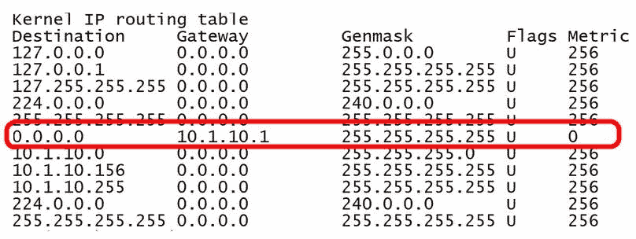

# 第十七章：常见的网络问题

几乎每个企业和组织都依赖于计算机网络来进行信息处理、分析、应用和媒体共享，此外，还包括电子邮件、网页访问、日程安排和个人生产力应用程序。在大多数情况下，网络已经融入到这些组织的日常工作中，其可用性被视为理所当然。然而，当技术问题导致网络瘫痪时，网络管理员必须迅速识别问题、解决问题并确保网络的完整性——这一切都需要在最短的时间内完成。

本章中，我们将讨论一些常见的网络问题及其原因，以及一些常用的**网络操作系统**（**NOS**）工具和资源，这些工具通常是故障排除过程中常用的。将介绍的具体主题如下：

+   常见的网络问题及其原因

+   故障排除过程中使用的 NOS 资源

# 常见网络问题

常见的网络问题列表可能因组织而异。任何组织的常见问题是由多个变量决定的，例如预算、人员、培训和环境。以下部分列出的常见网络问题是 Server+ 认证考试中标明的问题。

# Internet 连接

在某些工作环境中，丧失互联网连接可能不会构成太大问题，特别是当网络上的活动是本地的，不需要连接到**广域网**（**WAN**）时。然而，在某些时候，访问组织网关路由器之外的互联网是必要的，用户也期待服务可以正常使用。

**局域网**（**LAN**）和广域网（WAN）之间的通信链路包括多个组件，每个组件都有可能导致链路中断。以下列表包括这一链路的主要部分，以及它们可能导致互联网连接丢失的潜在原因。当然，在检查这些潜在原因之前，你首先需要检查电源线和插头：

+   **电缆**：在有线网络中，松动的连接或故障的连接器通常会导致连接问题。

+   **连接**：在无线网络中，主机可能无法连接到接入点或路由器，如果能够连接，则应能看到互联网。

+   **网络接口控制器**（**NIC**）**故障**：如果主机具有**自动私人 IP 地址**（**APIPA**）地址，接下来要检查的是网络接口卡（NIC）或网络适配器，看它是否正常工作。检查其状态的最简单方法可能是在 Windows 设备管理器中查看。如以下截图所示，打开网络适配器的属性可以查看其功能状态。如果它没有正常工作，下一步是确定原因：

设备管理器和网络适配器的属性框

+   **网关配置**：如果主机无法看到网关设备，但你知道网关有电并且应该正常工作，那么有可能是网关配置被更改、损坏或遭到黑客攻击。

+   **服务可用性**：无论你订阅的是哪种类型的互联网服务，如果主机能够连接到网关设备，但无法连接到互联网，问题可能是设备故障或服务提供商存在问题。如果连接的用户端没有任何故障，这可能意味着 ISP 的服务出现了故障。稍后在本章中我们将介绍更多网络状态检查命令。

# 配置

网络性能和连接的一个常见问题是各种组件的配置，包括硬件和软件。NOS（网络操作系统）、主机及其操作系统、所有网络设备中的网络适配器以及相互连接的交换和路由设备的配置必须兼容，并与网络的目的和功能保持一致。

以下各节介绍了网络中可能遇到的常见配置问题。

# 动态主机配置协议（DHCP）服务器

互联网，甚至某些内网地址问题的一个常见原因是 DHCP 服务器配置不正确。另一个常见的相关问题是**域名系统**（**DNS**），但稍后我们会详细讨论。完全有可能启动一个网络主机，但它没有从 DHCP 服务器接收 IP 配置。如果主机的用户从未尝试访问主机之外的任何资源，通常不会出现问题。然而，若没有有效的 IP 配置，主机在可访问范围方面将非常有限。

主机未能接收 IP 配置的常见原因有两个：没有网络连接和 DHCP 服务器问题。第十五章，*常见硬件问题*，讨论了网络接口卡（NIC）的问题，但让我们来看一下 DHCP 服务器问题。

# APIPA

一个问题可能是，如果 Windows 主机有网络连接，但在启动后，它被配置了一个不寻常的 APIPA 默认地址。这个地址来自一个保留的 B 类地址组 `169.254.0.0/16`。APIPA 配置的目的是允许启动过程和 IP 配置完成，以便主机能够在本地网络上运行。路由器不会转发 APIPA 地址，但本地网络的资源应该是可以使用的。然而，这种访问依赖于局域网中任何交换机的配置。

在分配默认 IP 地址后，APIPA 服务大约每五分钟检查一次 DHCP 服务器的存在。当 DHCP 服务器再次上线时，它会用 DHCP 配置替换 APIPA 配置。

# DHCP 地址

配置 DHCP 服务器时最常见的问题是发放重复的 IP 地址配置、地址池耗尽以及静态地址分配配置错误。

同一 IP 地址分配给两个或多个主机的问题，可能发生在多个设备（如路由器、交换机或网络服务器）启用了 DHCP 服务器功能，并使用重叠的地址范围（称为**范围**），导致之前分配给主机的静态地址被重复分配。

耗尽（或清空）地址池意味着下一个请求配置的主机将配置为 APIPA 地址。

DHCP 服务器通过三种方式之一将 IP 地址及其相关配置分配给网络主机：

+   **自动**：这种分配形式将一个 IP 地址永久分配给主机，即*无限*租期。

+   **动态**：在此分配选项中，DHCP 服务器从预定义的地址范围中分配 IP 地址，租期为预设的时间段。此选项允许进行续租。

+   **静态**：分配给主机的特定 IP 地址。静态 IP 地址是一个保留地址，并且永久链接到主机的 MAC 地址。

# 其他配置错误的设备

如果服务器或网络的一个或多个组件配置错误，可能完全没有影响。或者，它可能导致系统崩溃，通常情况下，根本无法得知原因。在 Server+认证考试中，您可能会遇到有关多个配置错误的设备、服务和协议可能产生的影响的问题。

以下部分将涵盖您可能遇到的问题。

# 电子邮件问题

大多数情况下，电子邮件问题通常是由于配置错误引起的。一个电子邮件系统通常涉及服务器、传输机制（或协议）和客户端，三者必须协同工作。一些常见的电子邮件系统问题包括以下几种：

+   **客户端无法发送或接收消息**：如果您的本地主机能够连接到互联网，那么问题可能出在邮件系统上，通常是用于识别邮箱身份的数据输入错误（如电子邮件地址和密码）。

    在 Microsoft Office 中，Outlook 客户端的帐户信息对所有安装的 Office 软件都是通用的。然而，如果 Outlook 无法从服务器下载邮件，则 Office 365 的 Microsoft 支持和恢复助手工具可能能够识别问题，如下图所示：

Microsoft 支持和恢复助手可以扫描 Outlook 中的电子邮件错误

Linux 和 Windows 系统也可能使用共享软件或免费邮件客户端，如 Thunderbird（Mozilla）、KMail、Evolution 或 Geary。配置简单，通常只需要一个电子邮件地址和密码，如接下来的截图所示。

+   **客户端可以接收邮件，但无法发送邮件**：这种情况通常意味着客户端可能正在尝试将邮件转发到 TCP/UDP 端口 `25`。这个众所周知的端口曾经是几乎所有邮件客户端发送邮件的默认端口。然而，由于垃圾邮件发送者经常访问端口 `25`，大多数邮件服务器现在会阻止该端口，而改用端口 `587`。检查分配给发送邮件功能的端口。

+   **客户端可以发送邮件，但无法接收邮件**：这个问题通常由两个条件之一或两个条件共同造成。邮件服务器，尤其是支持**互联网邮件访问协议**（**IMAP**）的服务器，会在一个预定的存储空间内存储转发邮件的副本。如果存储空间被占满，邮件转发就会停止。解决方法是访问邮件服务器并删除不必要的邮件。另一个原因可能是入站帐户的配置。确保接收邮件服务器、端口号、电子邮件帐户和密码都正确。可以给自己发送一封测试邮件：

Thunderbird 邮件客户端是一个免费的电子邮件工具

# 主机文件配置

在 Windows 系统中，`hosts` 文件提供了类似本地 DNS 查询的功能，用来提供**完全限定域名**（**FQDN**）的 IP 地址。如以下屏幕截图所示，`hosts` 文件显示了域名及其对应的 IP 地址。此条目消除了与 DNS 服务器通信以获取 IP 地址的需求。如果 FQDN/IP 对的条目不正确，或者 `hosts` 文件丢失，或者文件保存时带有扩展名，系统将绕过 `hosts` 文件，发送 DNS 请求：

Windows 系统上的 hosts 文件

# 配置错误的网络接口卡（NIC）

尽管 NIC 卡、USB 驱动器和内置网络适配器很少会发生故障，但它们确实有可能出现问题。如果你怀疑网络卡或适配器影响了网络通信，通常问题出在两种情况之一——要么 NIC 卡或适配器损坏，要么 NIC 卡或适配器没有获取执行其工作的所需系统资源。

在大多数情况下，至少对于网卡来说，通常有 LED 指示灯帮助你判断是否工作正常。当系统开机并连接到网络时，如果没有看到绿色指示灯，你就找到了问题所在。不过，网卡可能并没有坏到需要更换的程度，可能是重新安装时出现了问题，或者跳线块或开关设置不正确。查看文档以确认这些可能性。另一个问题是网卡或适配器与另一个 I/O 设备共享相同的系统资源。在 Windows 系统中，设备管理器可以帮助识别资源分配问题，如下图所示。设备管理器还可以检查主板上的网络适配器。无论哪种情况，都要确保使用的是正确且最新的设备驱动程序。

设备管理器组件属性对话框

# 路由与交换问题

最重要的是，配置错误的路由器和交换机（以及防火墙）是安全隐患。这些设备最初配置正确，可以服务并保护其网络，且与外部网络交互。然而，网络更改、服务提供商的误导、输入错误以及网络管理员那种“既然进来了，看看还能做些什么”的心态，可能导致配置错误。

除了安全性外，互联设备配置错误也可能导致其后面设备的问题，如内容服务器、代理服务器和局域网交换机。排查这些设备的配置问题可能比在网络服务器上更为复杂。

# VLAN 配置错误

在讨论一些与**虚拟局域网**（**VLAN**）相关的常见问题之前，让我们回顾一下它的一些术语。本质上，VLAN 是在网络交换机上配置的逻辑广播域。通过将一个（或多个）端口分配到一个 VLAN（除了默认所有端口都属于 VLAN1 外），配置到该端口的工作站现在就在该 VLAN 上。

如下图所示，分散在不同物理局域网段上的主机也可以位于同一个 VLAN 中。图中还显示了直接连接交换机和路由器的链路。这些链路被称为干线，连接干线的接口端口称为干线端口。干线端口运行一种特殊的协议，如 IEEE 802.1Q 或 Cisco 的**交换机间链路**（**ISL**）。

VLAN 的两个常见问题通常与 IP 地址有关，如下所示：

+   配置了错误 IP 地址的网络主机，如 APIPA 地址，或错误的子网地址或掩码，无法访问网络，更不用说 VLAN 了。

+   未能配置接口端口以支持每个 VLAN 作为网络段或子网。

除了 IP 地址之外，其他 VLAN 问题包括以下内容：

+   VLAN 被配置为*停用*状态

+   VLAN 的终止干道端口必须运行相同的干道协议，并具有相同的配置，无论是*带标签*（tagged）还是*不带标签*（untagged）VLAN。

一些 VLAN 问题源于干道端口故障，例如以下情况：

+   如果两个干道端口的干道模式不同，它们将无法建立连接。

+   如果一个 VLAN 不在可以访问特定干道端口的授权 VLAN 列表中，它将无法正常工作。

+   一个干道端口开始*波动*。这种情况通常与路由器端口有关，但交换机端口也可能发生波动。**波动**是硬件故障，导致端口交替开启和关闭。

下图显示了 VLAN 配置：

VLAN 配置

# 默认网关不可用

这可能是最常见的网络连接问题。其原因并不明显，而且这些问题都不是网关路由器本身的问题。你唯一知道的是，你突然无法访问互联网或网关之外的任何网站，并且系统提示默认网关不可用（见下图）。以下是导致此问题的常见原因：

+   **杀毒软件或反恶意软件程序**：已知这些软件会改变主机的网络配置，包括默认网关的 IP 地址。卸载此程序，并通过重启计算机来重置默认网关配置。如果这解决了问题（你可能需要等一会儿再确认），那就没问题了。

+   **过时的网络适配器驱动程序**：这可能会干扰计算机与网络连接之间的通信。在尝试以下修复方法后检查默认网关连接（停止修复时，如果问题似乎已解决）：重新安装驱动程序、更新驱动程序，或更换或添加网络适配器。

+   **Windows 自动登录**：已知该功能会在启动时搞乱主机的 IP 配置，包括默认网关的 IP 地址。虽然无法完全禁用自动登录功能，但可以将登录设置为需要用户名和密码，这似乎可以解决问题：

Windows 网络诊断对话框显示默认网关问题

网关错误的结果之一是，任何操作系统的 IP 配置中默认网关地址消失，导致显示消息*资源不可用或无法访问*。`route`命令，几乎所有操作系统都提供此命令，用于显示路由表内容，通常应该包括默认网关的地址，如下图所示。Windows 的`ipconfig`命令或 Linux/macOS 的`ifconfig`命令也会显示默认网关的地址（如果存在）：

Linux 的 route 命令结果，默认网关地址已突出显示

# 防火墙故障

网络防火墙可以是独立的硬件设备，也可以是路由器提供的服务，或者是一个独立的软件系统。无论是哪种方式，防火墙的目的和性能保持不变：保护网络、服务器或主机免受入侵或攻击。像计算机中的其他所有设备一样，防火墙也可能出现问题。以下是你可能遇到的一些防火墙问题：

+   **配置问题**：如果防火墙的配置过程过于依赖默认配置，那么最终的配置很可能过于宽泛，缺乏足够的细节。最好将配置过程限制在组织安全政策的核心功能上，作为基础。

+   **货币问题**：防火墙往往成为一个 *设置后忘记* 的设备，但实际上，持续的监控和维护，以确保防火墙与其设置、规则和更新保持同步，应该是正常的操作程序。

+   **处理能力**：如果软件防火墙安装在资源不足以应对高峰操作时段需求的计算机上，它可能会成为瓶颈。减少防火墙负载的一种方法是限制或移除那些对设备或软件的主要任务不必要的功能。

+   **IP 地址有效性**：一种常见的攻击方式是向本地网络的防火墙发送一条消息，其中源地址或目标地址（或两者）包含虚假的 IP 地址。如果防火墙上定义的允许/拒绝规则没有考虑到虚假或伪造的 IP 地址，且这些地址超出了 IP 标准的限制，那么带有可疑地址的入站消息可能会通过防火墙进入内部网络。

# 其他常见问题

除了上述问题外，Server+ 目标还列出了几个其他更通用的硬件或软件问题，你应该了解它们的原因和解决方法。你可能不会遇到一个专门涉及这些问题的问题，但如果它们出现在问题的情境中，或作为其中一个答案选项出现，也不要感到惊讶。它们按无特定顺序列出如下：

+   **资源不可用**：该错误非常具有上下文依赖性。如果是来自邮件客户端的错误，那就是邮件问题；如果是来自虚拟机的错误，那就是虚拟机问题；如果是网络访问问题，那可能是服务器或网络设备的问题。大多数用户将此错误与 HTTP 及 `404` 或 `503` 错误相关联。在任何情况下，这条信息的共同含义是：由于名称更改、文件删除或数据损坏，所请求的文件、服务或设备不可用。

+   **目标主机不可达**：该错误与 Linux 或 macOS 系统中的 **Packet Internet Groper**（`ping` 命令）相关。在 Windows 系统中，该消息通常是“请求超时”。问题在于，要么没有通向目标地址的清晰路径，要么目标地址不存在。

+   **未知主机**：此错误消息是由于目标地址无法访问引起的。这可能是 DNS 问题、配置问题（如 DNS 服务器地址）或目标地址不正确。

+   **服务提供商故障**：ISP 实际上是一个单点故障，如果由于某种原因 ISP 的路由服务不可用，访问互联网也会中断。解决这一潜在错误的一种方法是同时订阅多个 ISP 的服务。

+   **无法解析主机名/FQDN**：此错误消息表明 DNS 服务器中的信息或使用主机名或相应的 FQDN 访问远程站点时存在问题。

# 故障排除工具

尽管我们已经讨论了以下列表中的每个工具，但让我们再一次回顾它们在本章故障排除问题中的应用。你应该在 Server+ 考试的以下章节中看到这些工具。

# ping

`ping` 是一个命令行工具，用于验证源主机和目标主机之间的连接。通过输入 FQDN、主机名、域名或 IP 地址，`ping` 向该目标发送一个 64 字节的 ICMP 回显请求消息。除 IP 地址外，其他地址会通过 DNS 或本地 `hosts` 文件进行解析。在发送 ICMP 消息后，`ping` 会等待目标的回显响应。当接收到响应时，`ping` 会显示传输和接收消息的度量值。

# tracert/traceroute

此命令的目的是测试并显示源主机与目标主机或网络之间的通信链路。`tracert` 是 Windows 版本，`traceroute` 是 Linux/macOS 版本。此命令使用迭代过程，通过**生存时间**（**TTL**）值逐步测试到达目标的每个路由器的路径和连接。最初，它发送一个 TTL 值为 1 的 ICMP 回显请求消息。这意味着路由器在到达一个路由器（跳数）后丢弃该消息，且路径上的第一个路由器会响应回显消息。接着，`tracert` 发送另一个 ICMP 回显请求，这次 TTL 值为 2。此过程重复进行，直到 TTL 用尽（即跳数等于默认的跳数限制），或直到没有响应的跳数。

以下截图显示了 Windows `tracert` 命令的结果：

tracert 命令的结果

# ipconfig/ifconfig

尽管 Windows **互联网协议配置**（**`ipconfig`**）命令，或类似的**接口配置**（**`ifconfig`**）命令几乎在所有其他操作系统中都可用，但学习主机及其网络接口的配置元素仍然很有帮助。下图显示了其`/all`选项的摘录。此命令还允许释放或更新 DHCP 配置以及进行其他配置调整：

`ipconfig`命令显示的结果示例

# nslookup

`nslookup`命令行工具在几乎所有操作系统中都可用，用于在域名服务器中查找名称和 IP 地址（因此得名）。使用`nslookup`，你可以查找网络上主机的 IP 地址或域名。下图显示了在 Linux 系统上执行`nslookup`的示例，它提供了域名的 IP 地址。如图所示，响应为“非权威答案”，这意味着这是当前 DNS 服务器中的信息：

在 Linux 系统上执行 nslookup 命令的结果

# net use/mount

`net` 命令实际上更像是一组命令，用于创建连接或断开与网络共享资源的连接，显示主机上的所有当前连接，与其他主机共享资源，管理密码，控制打印缓存器等。

`mount`命令将文件系统或附加存储设备挂载（安装）。挂载设备将其添加到活动的目录结构中，并使其内容可供访问。要卸载一个已挂载的设备或文件系统，`umount`命令会通知操作系统完成该设备的所有 I/O 操作，然后将其从目录结构中移除。`net`和`mount`命令在 Windows、Linux 和 macOS 中均可使用。

# nbtstat 和 netstat

**TCP/IP 上的 NetBIOS 状态**（**nbtstat**）是一个主要用于诊断或排查 NetBIOS 名称问题的命令行工具。它还可以显示在另一台主机上运行的 NetBIOS 服务，或显示是否有用户登录到特定主机。

**网络状态**（**netstat**）显示主机的 IP 配置相关信息，但进一步展示了其连接情况，包括端口、协议以及通信的度量信息。

# 概述

局域网（LAN）与广域网（WAN）之间的连接包括多个可能导致连接失败的组件，包括电缆、连接、网卡、网关和 ISP。常见的问题是硬件和软件的配置。配置问题常见的领域包括 DHCP 服务器、邮件服务器和客户端、`hosts`文件、网卡、路由器和交换机、VLAN、默认网关以及防火墙。

在许多情况下，显示的消息描述了一个问题，但不一定是其原因。这些消息包括**资源不可用**、**目标主机不可达**、**未知主机**、**服务提供商故障**以及无法解析主机名/FQDN。

一些可用的网络故障排除工具包括 `ping`、`tracert`/`traceroute`、`ipconfig`、`nslookup`、`net use`、`mount`、`nbtstat` 和 `netstat`。

# 问题

1.  在本地网络中，用户可以访问局域网资源，但无法访问并下载网页。以下哪个区域可能是问题的原因？

    1.  本地网络服务器

    1.  远程 Web 服务器

    1.  DHCP 服务器

    1.  Internet 网关

1.  本地网络主机在与 DHCP 服务器成功交互之前无法完成启动过程。对还是错？

    1.  真

    1.  错

1.  在 Windows 系统中，Class B 网络 `169.254.0.0/16` 上的地址叫什么？

    1.  EGRP

    1.  FDDI

    1.  APIPA

    1.  Anycast

1.  替代端口 `25` 用于 SMTP 电子邮件接口的 TCP/UDP 端口是什么？

    1.  端口 `80`

    1.  端口 `587`

    1.  端口 `1024`

    1.  端口 `20`

1.  Windows 文件中包含一个主机名及其相关 IP 地址的列表，操作系统使用它来查找主机的身份和位置，这个文件是什么？

    1.  主机

    1.  页面文件

    1.  WinSxS

    1.  注册表

1.  什么是通过交换机端口逻辑上创建广播域的虚拟结构的正式名称？

    1.  VPN

    1.  虚拟机

    1.  VLAN

    1.  ISL

1.  连接两个交换机接口端口并运行 IEEE 802.1Q 协议的通信链路被称为什么？

    1.  帧中继

    1.  标记端口

    1.  波动端口

    1.  干道端口

1.  以下哪个可能是默认网关变得不可用的原因？

    1.  防病毒软件

    1.  网络适配器设备驱动程序

    1.  自动登录服务

    1.  以上所有

    1.  以上都不是

1.  一名网络技术员在另一个州的新分公司安装了多个网络主机。为了验证每个新主机是否能够看到总部的网络服务器，应该使用哪个命令行工具？

    1.  `nslookup`

    1.  `ping`

    1.  `tracert`/`traceroute`

    1.  ARP/RARP

    1.  `ping` 或 `tracert`/`traceroute`，或两者

    1.  以上都不是

1.  用于显示和修改网络接口配置设置的 Linux 命令行工具是什么？

    1.  `ifconfig`

    1.  `ipconfig`

    1.  `net config`

    1.  `net setup`
