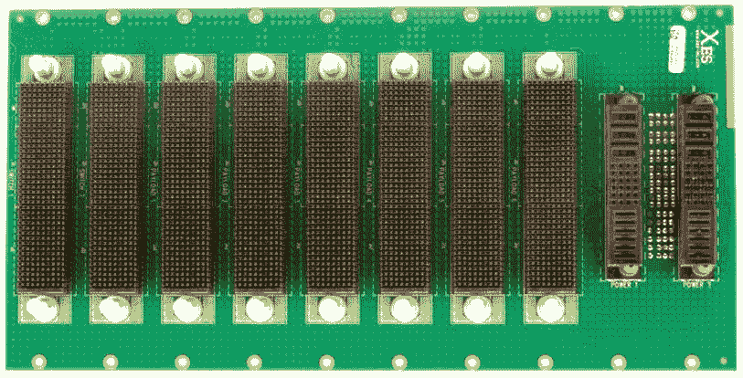
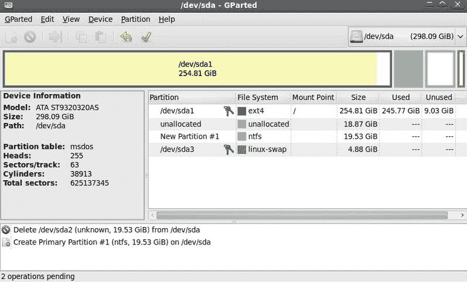

# 第十八章：常见存储问题

到目前为止，尚不存在一种能够抵御损坏并能承受意外或恶意删除的磁性存储技术——至少现在没有。与此同时，磁盘、磁带和光学存储设备仍然存在问题、故障和缺陷。在本章中，我们将探讨在 Server+ 考试中你可能会遇到的数据存储问题及其各自的原因。

本章将涵盖以下主题：

+   数据存储设备问题

+   常见问题的原因

+   管理工具

+   存储监控工具

# 数据存储设备问题

防止任何数据存储设备发生故障的最终保障是正式定义并严格遵循的数据备份政策和程序。完整的系统备份以及增量备份或差异备份是我们对任何数据存储设备故障的保险政策。*为什么我们需要保险政策？* 嗯，我们将组织中最宝贵的资产之一（数据）存储在我们认为可靠的设备上。然后，我们使用计算机中最不可靠、经常发生故障的设备——电源为其提供电力。如果电源没有出现问题，它可能会遭受病毒、物理损坏、不良应用软件和错误的设备驱动程序的影响。除此之外，还有人为因素。难怪数据存储设备会出现问题。

在接下来的章节中，我们将讨论三种主要存储设备类型——**硬盘驱动器**（**HDD**）、光存储驱动器和磁带盒驱动器的常见问题。

以下表格列出了一些你应该知道的数据存储设备常见故障原因：

| **问题** | **原因** | **恢复机会** |
| --- | --- | --- |
| 删除的文件，格式化的驱动器 | 人为错误 | 良好 |
| 数据库或文件损坏或丢失 | 恶意软件、软件错误 | 良好 |
| 文件系统损坏 | 媒体逻辑故障 | 良好 |
| 无法访问磁盘驱动器或数据乱码 | 媒体物理故障——磁头、主轴电机、执行器 | 一般到良好 |
| 设备水损 | 自然灾害 | 一般 |
| 损坏的设备 | 外部硬盘或笔记本电脑跌落 | 一般 |
| 闪存介质故障 | 闪存设备覆盖限制超出* | 一般 |
| 存储数据乱码 | 磁带介质退化、故障或损坏* | 一般 |
| 存储数据无法读取 | CD/DVD 媒介故障* | 差 |

数据存储介质常见故障原因

* 一些数据存储单元的介质，如闪存、磁带和光学介质，确实会随着时间的推移而磨损，退化到存储在介质上的任何数据都会变得乱码、无法读取或完全丢失。

# 常见的硬盘问题

很难识别某些硬盘性能问题。有时，故障硬盘的表现可能与恶意软件攻击、内存问题、电源故障，或者可能是太多下载同时进行的症状非常相似。故障硬盘的症状可能是这些问题中的任何一个，甚至更多。你应该了解的硬盘问题包括：

+   **操作系统未找到**：计算机启动时，BIOS/UEFI 首先会访问系统硬盘上的操作系统，将其内核加载到内存中并启动系统。此错误表示以下三种情况之一——存在严重的 BIOS 错误，硬盘的全部或部分损坏，或**主引导记录**（**MBR**）损坏或丢失。

+   **文件访问慢**：当打开文件以进行显示、编辑、打印或其他任何操作时，如果文件显示之前似乎有比平常更长的暂停或迟疑，显然的问题是存储设备变慢了。实际上，存储驱动器需要更长时间来访问、读取和将数据传输到内存及请求程序，可能有几个原因。导致 I/O 操作变慢的最常见原因如下：

    +   **空间不足**：如果显示错误信息说某个驱动器的磁盘空间不足，如以下截图所示，则表示该数据存储驱动器几乎已满。许多进程使用辅助存储，如果没有足够的空间，它们可能无法正常执行：

Windows 的低磁盘空间警告

+   +   **损坏的数据**：磁盘扇区或簇可能由于多种原因而损坏。硬盘上的损坏数据可能导致数据传输速度变慢。使用错误检查工具，如以下截图所示，检查有问题的硬盘，查找该驱动器上的损坏数据：

显示错误检查工具的 Windows 硬盘属性对话框

+   **文件/数据/对象不可用**：尽管不常见，文件、数据，甚至文件系统可能会突然从存储设备中消失——*看似没有理由*。为了讨论方便，我们假设计算机内部没有任何事情是自己发生的。文件，包括文档、图像、视频、程序、游戏等等，可能变得*不可用*，*找不到*，或以其他方式表示*它不见了*。造成这个问题的潜在原因有很多：

    +   **自动操作系统（OS）更新**：这主要是一个 Windows 问题，但自动下载并应用的升级、补丁或修复程序可能会删除桌面文件和已安装的应用程序，具体取决于它们的存储位置。

    +   **恶意软件/病毒**：是的，这些邪恶的恶作剧者确实可以并且会删除或隐藏系统、应用程序和个人文件。

    +   **登录**：有时，用户使用不同的用户名凭证登录计算机。一个不可用的文件可能确实存在，但其他用户名可能没有权限查看该文件。

    +   **硬盘故障**：硬盘有可能在逻辑或机械上出现故障。总是应该假设硬盘故障，并立即进行备份。

+   **硬盘逻辑问题**：如果出现类似*驱动器不可用*、*无法访问逻辑驱动器*或*无法挂载设备*的消息，显然存在问题。有几种可能的原因导致无法访问硬盘上的文件系统、文件或数据。以下是一些常见原因：

    +   **驱动器字母丢失**：硬盘驱动器分区的驱动器字母（例如 C:或 H:）丢失。这可能是病毒的结果，或者是用户无意中操作的结果。

    +   **隐藏分区**：为了保护个人或敏感文件，用户可能决定隐藏某个分区。要访问其内容，必须先取消隐藏文件系统。

    +   **分区无法访问**：此状态表示三种可能原因之一——特定分区的访问权限已损坏或完全丧失；操作系统通过**循环冗余校验**（**CRC**）检测到一个错误值；或者**主文件表**（**MFT**）或**文件分配表**（**FAT**）已损坏，需要重建。

    +   **RAW 分区**：RAW 分区不是某种特定文件系统格式，如 NTFS、EXT4 等。之前格式化的文件系统可能会因病毒或格式化过程中出现中断而变成 RAW 格式。

    +   **未分配的分区**：电力突波或电涌可能会损坏硬盘驱动器（HDD）的逻辑分区。一个分区及其内容可能会变成未分配状态。

+   **备份/恢复问题**：严格遵循的备份程序为灾难性损坏和丢失提供了保险保障。然而，备份介质可能会故障并损坏。如果电源中断或其他事件导致备份过程被中断，特别是在备份未监控运行的情况下，最终的备份可能毫无价值。发现备份失败可能要等到需要恢复损坏或受损的文件时才会发生。

+   **缓存故障**：在数据存储的上下文中，缓存是指磁盘缓存，也称为磁盘缓冲区或缓存缓冲区，这是硬盘上的一小部分磁盘空间。当硬盘繁忙时，磁盘缓存接收并保存数据，以便在读写机制可用时使用。缓存故障可能由于电力故障或任何导致系统停止的错误，如 Linux 或 macOS 系统的内核恐慌或 Windows 系统的**蓝屏死机**（**BSoD**）引起。无论如何，当 I/O 操作中断时，缓存会被清空，数据将丢失。

+   **多个硬盘故障**：这个故障情况有两种看法——单个硬盘在计算机中逐个故障，或一个硬盘阵列在一个结构中，例如**独立磁盘冗余阵列**（**RAID**）、**网络附加存储**（**NAS**）或**存储区域网络**（**SAN**），所有硬盘同时发生故障。在这两种情况下，首先要怀疑的是**电源供应单元**（**PSU**）。

+   **状态/错误灯**：大多数机架式或塔式服务器在前面有 LED 灯，显示其内部硬盘的活动、状态和错误情况。大多数硬盘托架和多盘驱动器机箱设备，如 NAS 或 SAN 设备，都有每个托架的指示灯，或者可以独立检查每个托架。

以下表格展示了 LED 状态灯的含义示例：

| **模式** | **颜色** | **含义** |
| --- | --- | --- |
| 关闭 | - | 空槽 |
| 稳定 | 绿色 | 在线 |
| 闪烁缓慢 | 绿色 | 驱动器管理正在进行中 |
| 闪烁快速 | 黄色 | 驱动器已故障 |
| 闪烁非常慢 | 绿色/黄色交替 | 硬盘即将故障 |

常见的硬盘状态灯颜色、模式和含义

# 常见问题的原因

正如你作为计算机技术员的经验所表明的，导致大多数计算机、软件和组件故障、问题的原因其实并不多。识别设备或组件问题的来源通常涉及寻找一组常见的系统问题。在本节中，我们将列出在 Server+认证考试中可能出现的常见存储设备问题。

# 媒体故障

存储介质是我们多少有些理所当然的东西，但它其实非常重要。毕竟，数据就存储在这里。然而，由于我们不能，也不应该，看到、触摸甚至闻到存储介质，所以它往往是一个典型的*眼不见，心不烦*的例子。

# 硬盘介质

尽管硬盘驱动器外观坚固、金属外壳封闭，但无论是内部还是外部硬盘，实际上都是相对脆弱的设备。其内部组件之间的距离非常小，并且工作速度非常高。任何对系统机箱或机架托盘的外力或突然震动，都可以并且通常会导致磁盘及其存储介质的损坏。停留在磁盘表面的崩溃磁头可能会刮掉基底上的介质材料，带走任何数据。硬盘介质常见的故障之一就是磁盘上出现坏道。坏道有两种类型：

+   **物理坏道**：硬盘介质的一部分由于磁头崩溃或磁盘外壳内部的污染物（如灰尘、头发等，通常是制造过程中产生的）而损坏。磁盘控制器和操作系统都无法读写这些区域。硬盘上的物理坏道通常无法修复。

+   **逻辑坏道**：与物理坏道不同，硬盘上的这些区域，也被称为软坏道，虽然可访问，但可能会导致 I/O 问题，如延迟增加或读取错误。磁盘控制器和操作系统可以访问逻辑坏道，甚至可以对其进行写入并尝试读取。逻辑坏道是可以修复的。

# SSD 介质

SSD 相较于 HDD 的一个优点是没有移动部件。这意味着没有磁头碰撞或污染问题。然而，SSD 是一种电子设备，虽然它的存储介质相对没有错误，但其周围的电子元件却可能出现问题。电容、电路和电源已知会发生故障，如果支持 SSD 的这些元件之一或全部发生故障，SSD 也会随之失效。

SSD 没有坏道问题，但可能会有坏块。以下是一些可能出现的症状：

+   磁盘控制器无法向存储介质写入或读取数据

+   I/O 密集型应用程序可能会冻结

+   复制或移动文件导致系统错误

+   访问较大的文件比平时花费更多时间

# 磁带介质

磁带，主要是卡带形式，在数据完整性和系统恢复中扮演着有限但非常重要的角色，特别作为备份介质。不管是哪种版本的备份磁带，都是必要的，但当主要存储设备出现故障时，备份就变得至关重要。不过，磁带也有其问题。以下是你可能会在考试中遇到的最常见问题：

+   **人为错误**：操作员、技术人员和那些善意但未受过训练的助手是磁带问题的主要原因。忘记更换或加载磁带、在当前周期放入错误的磁带、将磁带使用时间过长以及将磁带存放在不合适的地方，这些都是人为因素造成的问题。

+   **脚本错误**：在某些系统上，系统备份是通过脚本执行的，而不是使用像**Bacula**或**Duplicati**（适用于 macOS 和 Linux），以及**Windows Server Backup**（**WSB**）和**Acronis**（适用于 Windows）等软件工具。脚本中的错误、SAN 或 NAS 地址错误，或者文件夹不可用，可能会导致备份不完全，从而无法完全恢复系统。

+   **硬件错误**：磁带驱动器和磁带介质可能会发生故障。实际上，其中一个常常是另一个故障的原因。磁带驱动器的问题可能会影响磁带介质的传送，导致磁带拉伸、撕裂或解开，通常发生在卡带外部。

# 光驱

光盘驱动器，也就是 CD 和 DVD，要么工作，要么不工作。通常，没有任何提示表明光盘或驱动器可能正在出现故障。通常是那种“*昨天还好好的*”的情况。光驱常见的问题如下：

+   **启动时没有硬盘**：如果在启动过程中 BIOS/UEFI 突然无法*识别*光驱，那么很可能是光驱的电子元件出现问题。试着重新启动。如果这还不能恢复光驱，那么它可能已经损坏。

+   **读取 DVD，不读取 CD**：如果光驱能够正常读取 DVD，但完全无法读取 CD，可能是其中一个读取激光器发生了故障。试着清洁光盘和驱动器并重新尝试。如果仍然不行，那么你可能需要更换光驱。

+   **读取错误**：通常，读取错误表示光盘脏污。请清洁光盘并重新尝试。如果仍然存在问题，尝试换一张光盘。如果读取错误持续发生，清洁驱动器。

+   **操作不一致**：如果您最近对操作系统进行了升级或打了补丁，并且此后光驱的操作变得不稳定，那么请检查光驱的制造商，看是否有固件更新可以修复此问题。

# 常见存储问题原因

虽然我们在前一节中讨论了一些存储设备问题的原因，但现在让我们聚焦于特定设备或组件故障的具体原因。我将问题的原因分为以下几类——**硬盘和连接器故障**、**控制器和缓存故障**以及**RAID 和阵列故障**。控制器和缓存故障以及 RAID 和阵列故障将在本章后面的*硬件相关问题*部分中讨论。

# 硬盘和连接器故障

存储设备问题的潜在风险几乎存在于设备安装后的每个阶段。实际上，仅仅安装设备就可能引入一些最初看不出问题的隐患，随着时间的推移，这些问题可能会发展成严重问题。我们讨论了电源问题对存储设备的影响，但即便是在日常的使用过程中，仍然有很多问题可能导致存储设备无法使用、表现异常或完全故障。

# 硬盘问题

除了人为错误、电源问题、物理损坏等少数因素外，还有一些问题可能由操作系统、应用软件以及任何需要从存储设备获取数据的程序引起。这些问题的原因如下：

+   **损坏或丢失的 MBR**：MBR 提供了启动过程所需的关于硬盘的信息。当启动过程首次访问硬盘以加载操作系统时，它会请求该硬盘的 MBR。MBR 包含关于磁盘大小、逻辑分区的数量和类型等信息。然而，如果 MBR 损坏或丢失，启动过程将忽略该硬盘，基本上就像它不存在一样。MBR 丢失或损坏的三大主要原因是计算机病毒或恶意软件、程序错误地覆盖了 MBR、硬盘丢失了包含 MBR 的簇，或者硬盘完全损坏。

+   **损坏的文件系统表**：MBR 的一部分是主文件表或文件系统表，描述了磁盘上的逻辑分区。下表显示了 MBR 文件系统表的内容。MBR 损坏通常也会影响文件系统表。文件系统表通常像下面这样：

| **字节** | **长度（字节）** | **内容** |
| --- | --- | --- |
| 0 | 1 | 启动标志 |
| 1 | 3 | **圆柱-磁头-扇区**（**CHS**）起始值 |
| 4 | 1 | 分区类型 |
| 5 | 3 | CHS 结束值 |
| 8 | 4 | 第一个扇区 |
| 12 | 4 | 分区大小（以扇区为单位） |

16 字节文件系统表项的内容

+   **不当磁盘分区**：磁盘驱动器上有两种类型的分区，即系统分区和一个或多个数据分区。操作系统位于系统分区，通常被指定为 C:盘。数据分区存储其他内容，指定为 D:、E:、F:等。如果在一个分区上安装大量软件、创建大型数据库或主要保存数据，可能会导致该分区满。所有操作系统中都会出现的“磁盘空间不足”提示表明，分区大小可能不适合计算机所需支持的内容。

# 电缆和连接器问题

在数据中心、机架式服务器、磁盘及磁盘阵列中，磁盘驱动器通过以太网连接器或**串行附加 SCSI**（**SAS**）连接到网络。这些系统的电缆和连接器可能会遇到与独立服务器连接相同的问题，但通常发生的频率较低。

独立服务器，无论是独立塔式服务器还是机架式服务器，通常都在系统机箱内安装了某种形式的本地硬盘。此类服务器也可以通过网络连接到 SAN 或 NAS 系统。无论大小和技术如何，存储驱动器故障在各类系统中都会发生。这些故障的原因，在所有系统中基本相同。具体原因包括：

+   **电缆问题**：如果内部存储驱动器的电缆安装正确，系统应保持正常运行。如果系统未识别存储设备，请检查连接器和电缆是否存在电源或连接问题。如有必要，重新插拔连接器或更换电缆。由于加热和冷却，连接器的金属接触部分会膨胀和收缩，导致连接器可能从插座中松动。即使是新的电缆，故障电缆也可能导致间歇性问题，或引导过程无法识别设备。

+   **终止不当**：这个问题通常与 SCSI 和 SAS 设备以及连接它们的*链*有关。为了防止信号反弹回链上并创建*幽灵设备*，需要正确终止每个 SCSI 和 SAS 链的两端。

+   **串行高级技术附件（SATA）连接**：大多数时候，SATA 硬盘不自带电缆。确保电缆与特定硬盘制造商和型号匹配。电缆长度不应超过 1 米，否则可能会导致间歇性的数据问题。确保所有连接器干净且插入稳固。

# 存储系统问题

数据存储设备故障可以分为两类——软件相关故障和硬件相关故障。

# 软件相关故障

存储在数据存储设备上的数据（即静态数据）就像是一个比喻中的*坐鸭子*。许多因素可能影响数据的质量、可用性和可访问性。一些常见的软件相关或逻辑存储数据问题如下：

+   **格式化**：格式化数据存储设备，无论是故意还是意外，都会删除分区表和文件位置数据。存储在设备上的数据仍然完好无损，但我们无法访问它，因为丢失了存储的地图。

+   **已删除的数据**：当删除文件、文件夹或文件系统时，不管是故意还是无意，数据仍然保留在存储介质上。在大多数情况下，这些数据是可以恢复的，尽管操作系统无法找到它。删除文件系统会移除指向文件夹或其中文件的文件索引。然而，在大多数情况下，这些数据仍然是可以恢复的。

+   **损坏的数据**：错误的编程指令、病毒或恶意软件感染以及硬件问题都可能是数据损坏的原因。

# 硬件相关问题

由于其操作距离较近，硬盘驱动器（HDD）几乎是脆弱的，这意味着它相对容易损坏。大多数数据存储设备问题发生在系统启动时。这些问题通常出现在硬盘控制器上，但也可能出现在 HDD 上。然而，其他类型的数据存储设备也可能遇到大部分类似问题。你应当预期看到与 HDD 问题及其对存储数据的影响相关的问题。以下是你可能遇到的问题：

+   **控制器故障**：在 SATA 和 IDE 硬盘上，磁盘控制器可能位于磁盘外壳内或作为芯片组的一部分位于主板上，控制器故障会导致操作系统无法从磁盘介质读写数据。硬盘控制器充当操作系统与硬盘设备之间的中介服务。通常，尽管显示的消息表明控制器失败，但故障可能是硬盘设备本身。

+   **主机总线适配器（HBA）故障**：HBA 是一个电子电路板，它将 CPU 从数据存储系统的通信和操作中解放出来，这些存储系统可能是**光纤通道**（**FC**）SAN、NAS、RAID 或板载数据存储设备。HBA 控制器的故障可能表示安装问题、卡上的组件故障，或者 SAN 控制器的故障。

+   **磁盘缓存关闭**：默认情况下，磁盘缓冲或磁盘缓存功能已启用，以帮助硬盘驱动器在忙于其他任务时接收系统数据并写入磁盘，如下图所示。如果在内部硬盘驱动器上禁用此功能，I/O 速度可能会变慢。在外部硬盘上，禁用磁盘缓存是默认设置：

Windows 设备管理器中的写入缓存策略设置

+   **缓存电池故障**：RAID 系统通过电池为其写入缓存内存供电，以便在电力故障时，系统能够在关机前清空缓存。当缓存电池电量下降时，缓存中的任何数据将会丢失。

# 存储阵列问题

网络上可实现的技术和机制通常能有效提高数据 I/O 速度、可靠性、冗余性和可用性，且大多数情况下没有问题。然而，不当配置、不兼容的设备或硬件问题可能会使阵列失效。可能出现的具体问题如下：

+   **不当的 RAID 配置**：RAID 是一种磁盘存储技术，它创建一个硬盘驱动器（HDD）网络，用以协调防止数据丢失，同时提高可靠性、性能和冗余性。然而，如果 RAID 配置存在问题，系统可能会适得其反。如果性能是优先考虑的目标，故障发生时可能导致数据丢失。反之亦然。RAID 配置应与系统目标及组织目标相匹配。

+   **RAID 重建**：如果 RAID 系统中的某个存储设备发生故障，并且有替换驱动器可用，RAID 阵列将根据其奇偶校验数据在新驱动器上重建丢失的数据部分。不幸的是，在此过程中，用户会看到比正常情况更长的延迟。

+   **不匹配的硬盘**：在某些数据存储配置中，如 NAS 或 SAN，大小不同的硬盘可以正常工作，和相同的硬盘一样。但 RAID 要求所有磁盘驱动器的大小一致。如果 RAID 阵列中有大小不同的硬盘，所有硬盘将仅使用最小硬盘的存储大小。

+   **背板故障**：实施 RAID 系统的一种常见方法是通过背板电路或卡，如下图所示。背板通常是卡封装的一部分。每个磁盘驱动单元都连接到背板上的插槽或连接器，这样可以消除多个硬盘的电缆杂乱。如果单个背板连接器发生故障，其连接的硬盘将无法访问。如果整个背板故障，与之连接的所有硬盘都无法访问。通常情况下，硬盘本身是没问题的：

一个数据存储设备背板卡

图片来源：kisspng.com

# 管理工具

管理连接到服务器的数据存储的复杂性取决于多个因素，包括大小、技术、布局以及——别忘了——安全性。根据复杂性，存储管理员的工作可以从一个管理员的兼职职责到多个技术员的全职工作不等。有多种磁盘或存储管理软件包可供选择，其中包括执行以下部分描述的大多数任务所需的功能。

# 磁盘管理

**磁盘管理**这个术语有几个含义，但最常用的是指 Windows 操作系统中的一项任务或工具功能。实际上，后者可以帮助你完成前者的任务。如以下截图所示，Windows 磁盘管理工具提供了创建、修改、删除、扩展和重命名磁盘卷和分区的功能。对于 Linux 系统，`fdisk` 和 `disk` 命令提供了许多相同的功能：

Windows 磁盘管理工具

# 磁盘分区工具

如上图所示，Windows 磁盘管理工具用于管理磁盘分区。然而，也有许多免费的和非免费的工具包可用于此目的，包括**MiniTool Partition Wizard**和**AOMEI Partition Assistant**。在 Linux 系统上，`fdisk` 命令一直是标准工具，但如以下截图所示，GParted 也是一个非常出色的开源工具。

GParted 分区工具用于 Linux

图片来源：gparted.org

# 映射、挂载与网络使用

映射网络资源的过程与挂载存储设备或连接/创建网络资源共享是完全不同的操作。但这三者常常被混淆。我们分别来看一下每个操作：

+   **驱动器映射**：映射数据存储资源是通过为其分配一个驱动器标识符（例如 E:）来标识它，并使其对本地网络用户可用。实际上，驱动器映射创建了一个共享，但比仅在一个节点上与特定用户共享的资源要更广泛。不过，在大多数情况下，将资源的快捷方式添加到 Windows 文件资源管理器的网络文件夹中可能是更好的选择。

+   **挂载命令**：Windows 和 Linux 都使用 `mount` 命令使存储设备、文件系统或一组文件对一个或多个用户可访问，并将其连接到活动目录结构中。然而，Linux 的 `mount` 命令具有更多选项，使其可以与 Windows 的 `net use` 命令相媲美。

+   **Net use**：`use`选项是 20 多种选项中的一种，帮助管理网络的各个部分，包括设置网络共享、管理用户及其权限等。`net use`命令可以创建、配置或删除与网络共享资源的连接，包括数据存储驱动器和打印机。`net use`命令产生的结果与 Windows 文件资源管理器中的“映射网络驱动器”选项基本相同。

# 磁盘阵列

磁盘阵列，也称为存储阵列，将多个硬盘驱动器（HDD）组合成一个独立于网络服务器运行的单一数据存储系统。存储阵列还将存储设备集中化，以便进行单一资源管理。存储阵列为 SAN（存储区域网络）和 NAS（网络附加存储）提供了基础。

大多数磁盘阵列系统制造商提供一种形式的存储管理软件。此外，还有第三方存储管理软件包：

常见磁盘阵列管理软件的示例

# RAID 阵列

另一种类型的存储设备阵列是 RAID 阵列，与普通磁盘阵列一样，RAID 实施也有特定的软件管理工具。在 Linux 系统中，RAID 管理通过`mdadm`命令进行。下图显示了该命令的帮助显示：

mdadm Linux 命令的帮助显示

在 Windows Server 和其他 64 位 Windows 版本中，如下图所示的 HP 阵列配置实用程序等工具，支持 RAID 和其他磁盘阵列的创建、管理和监控：

HP 阵列配置实用程序是 RAID 阵列管理软件的一个示例

# 存储监控工具

所有操作系统都会记录信息性、警告性和错误报警事件到系统日志文件中。Windows 具有强大的日志系统。Windows 事件查看器工具提供了一种查看、管理、归档和自定义每个日志文件内容和显示方式的工具。下图显示了 Windows 事件查看器的屏幕截图：

Windows 事件查看器显示系统日志文件的内容

在 Linux 系统中，日志文件位于`/var/log`目录下。下图显示了`sysinfo.log`文件中的日志条目的显示内容，记录了系统的常规活动：

Linux sysinfo.log 文件的内容

除了板载日志文件工具外，还有几个第三方系统可用于日志文件监控、分析和报告。下图显示了一个事件日志分析工具。监控服务器的日志文件是一项重要任务。正如俗话所说，*魔鬼藏在细节中*，这在日志文件中尤为明显：

Splunk Enterprise 日志文件分析工具

# 总结

防止存储设备故障和数据丢失的措施是正式的数据备份程序。系统备份提供了对存储设备故障的保险。一些你应该了解的硬盘驱动器问题包括*操作系统未找到*、*文件访问慢*、*空间不足*、*数据损坏*和*文件/数据/对象不可用*。

常见的磁盘故障是硬盘盘片上出现物理或逻辑坏扇区。物理坏扇区是由于读/写磁头接触到磁盘介质表面造成的。逻辑坏扇区可能导致 I/O 问题，包括延迟增加或读取错误。固态硬盘（SSD）的优点是没有活动部件，但其电子元件可能会故障，并且可能有坏块。磁带卡带是常见的备份介质，备份磁带至关重要。磁带确实存在一些问题，包括人为错误、脚本错误和硬件故障。光驱的常见问题包括启动时无法检测到驱动器、只能读取 DVD 但不能读取 CD、读取错误和操作不一致。

设备或组件故障的原因可分为四组——驱动器和连接器故障、控制器和缓存故障、RAID 和阵列故障。硬盘驱动器故障的原因包括损坏或丢失的 MBR、损坏的文件系统表和不正确的磁盘分区。电缆和连接器故障的原因包括电缆问题、不正确的终端和 SATA 连接问题。

存储系统问题的原因可能与软件或硬件相关。软件故障的原因包括格式化、数据删除和数据损坏。与硬件相关的故障原因包括控制器故障、HBA 故障、磁盘缓存关闭和缓存电池故障。存储阵列问题的原因包括 RAID 配置不当、RAID 重建、驱动器不匹配和背板故障。

存储管理软件提供执行以下磁盘管理任务的功能：管理分区、映射网络资源、挂载文件系统以及添加、配置和移除分区。

存储阵列将存储驱动器组合成一个独立于网络服务器操作的数据存储单元。存储阵列是 SAN 和 NAS 的基础。磁盘阵列制造商提供存储管理软件，RAID 实现有特定的软件工具，操作系统在日志文件中记录事件。

# 问题

1.  以下哪项不是硬盘驱动器的常见问题？

    1.  访问缓慢

    1.  数据损坏

    1.  太快

    1.  坏扇区或簇

1.  以下哪种数据存储设备没有与存储相关的活动部件？

    1.  硬盘驱动器（HDD）

    1.  固态硬盘（SSD）

    1.  数字视频光盘（DVD）

    1.  光盘（CD）

1.  缩写 HBA 代表什么？

    1.  层次化二进制阵列

    1.  主机基础算法

    1.  主机总线适配器

    1.  层次化总线适配器

1.  缩写 RAID 最常接受的含义是以下哪项？

    1.  独立磁盘的响应式阵列

    1.  冗余独立磁盘阵列

    1.  重建的独立磁盘阵列

    1.  可读的独立磁盘阵列

1.  以下哪一项是备份失败的常见原因？（请选择所有适用项）

    1.  磁带驱动器错误

    1.  人为错误

    1.  操作系统错误

    1.  磁盘错误

1.  以下哪一项不是设备或组件故障类型？

    1.  驱动器故障

    1.  连接器故障

    1.  控制器故障

    1.  缓存故障

    1.  RAID 和阵列故障

    1.  电缆终端故障

    1.  以上所有

    1.  以上都不是

1.  启动过程所需的硬盘分区信息在哪个数据块中找到？

    1.  注册表

    1.  MBR

    1.  文件系统

    1.  磁盘缓冲区

1.  在 Windows 系统中，哪种系统工具可以用来查看系统日志文件的内容？

    1.  任务管理器

    1.  设备管理器

    1.  控制面板

    1.  事件查看器

1.  哪种逻辑结构将存储设备组合成一个独立于网络服务器操作的单元？

    1.  数据阵列

    1.  iSCSI 链

    1.  存储或磁盘阵列

    1.  数据库
