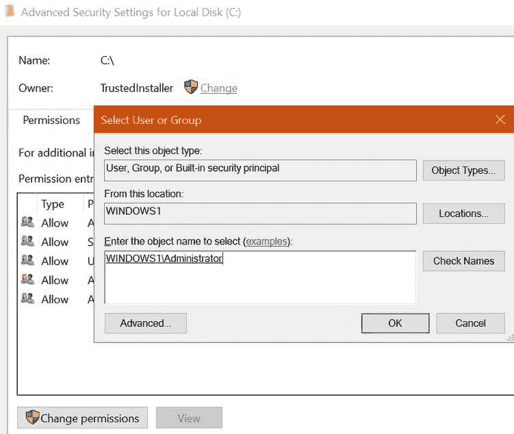
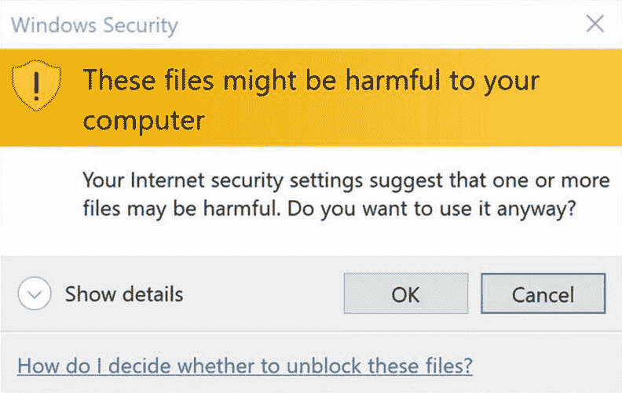
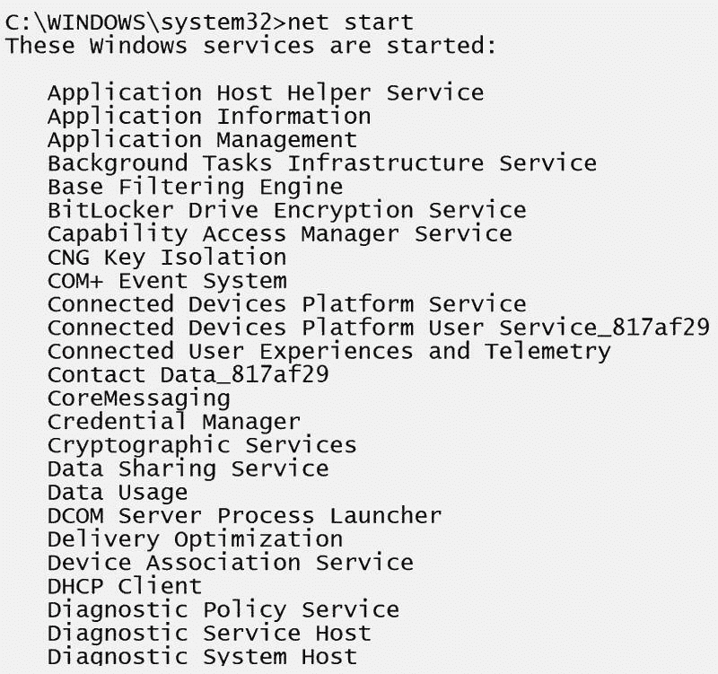
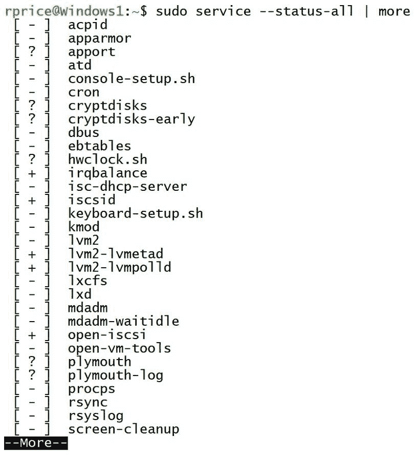
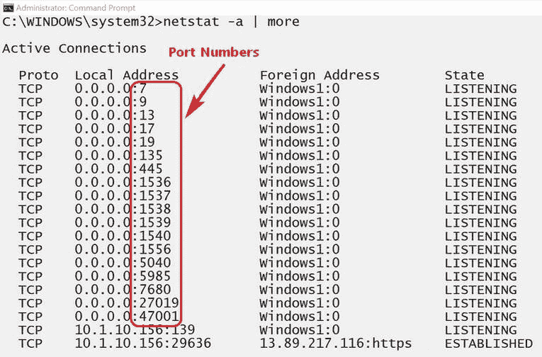
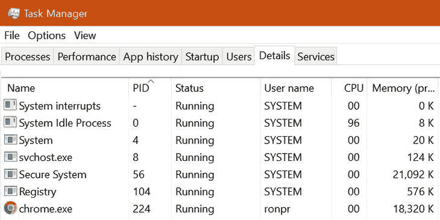
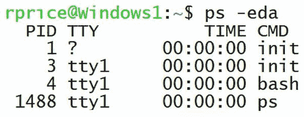
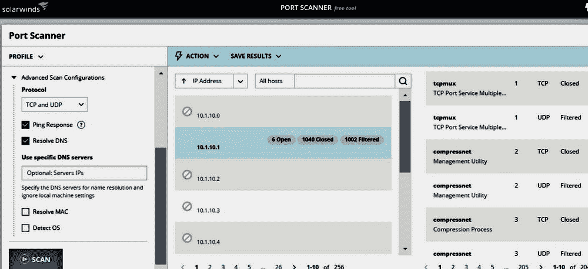
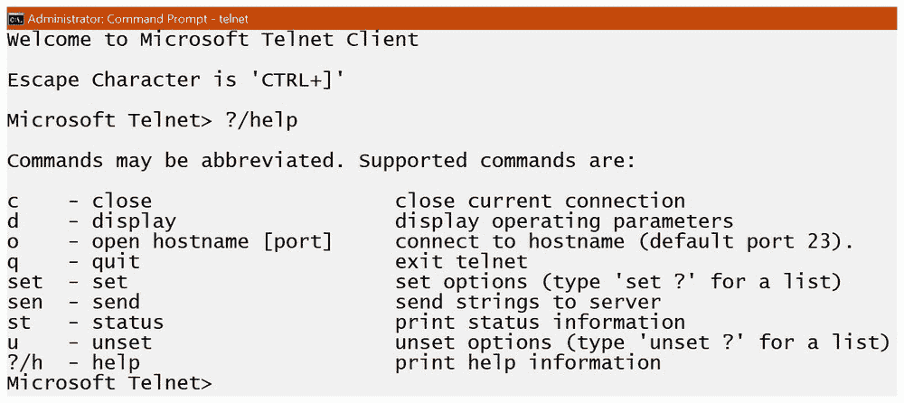

# 常见的安全问题

数据安全需要持续关注和审查，以确保存储的数据、传输中的数据和使用中的数据符合**机密性、完整性**和**可用性**（**CIA**）模型。本章将探讨保护网络数据、软件和硬件资源的安全问题、挑战以及安全措施缺失或漏洞所带来的后果。本章讨论的问题、原因和工具是你在 Server+ 考试中应期待看到的主题和概念。本章涉及的主要内容如下：

+   常见的数据安全问题

+   常见安全问题的原因

+   常用的安全工具及其使用

# 常见的数据安全问题

网络服务器，无论其应用如何，都必须处理各种安全问题、攻击，有时甚至是损害。这些问题与硬件或软件没有特别关系，但它们确实是问题。你应该了解的安全问题包括以下内容：

+   **文件完整性**：文件完整性意味着数据和程序文件未成为攻击的目标，也没有被未经授权的人或功能修改。无论是内部还是外部攻击者，都可能故意或意外地破坏文件的完整性。监控存储数据和程序的完整性应成为标准监控程序的一部分。**文件完整性监控**（**FIM**）软件使用校验和和哈希值来检测文件的变化。最常用的哈希算法是**消息摘要 5**（**MD5**）。

+   **特权提升**：这是对系统或网络资源的攻击，攻击者能够扩展或提升其权利和权限，以访问具有更高限制的资源。特权提升有两种类型：

    +   **垂直**：这是名义上的特权提升，也称为特权提升，指的是一个具有低权限的用户（攻击者）或应用程序（恶意软件）能够访问具有更高权限、权利和许可的数据、程序或其他内容。

    +   **水平**：在这种特权提升攻击中，用户增加其权限和权利，以便能够访问保留或分配给另一个用户或用户组的资源。

+   **应用程序无法加载**：在 Windows 系统的安全设置中，资源的所有权会影响应用程序从该资源加载的表现。一个常见问题是 Windows 更新服务未运行。尽管这看起来很可疑，但问题也可能出在资源的所有权上。磁盘分区、文件夹或文件的所有权控制谁能读取、写入或执行其内容。

    要更改所有权，请在文件资源管理器中访问硬盘的属性（见下图）。此外，恶意软件可能已删除、重命名或损坏了磁盘、分区或文件。在 Linux 系统中，问题可能也是一样的，解决方法也是如此。请按以下步骤更改文件系统、目录或文件的所有权：

更改磁盘驱动器的所有权

+   **无法访问网络文件/共享**：在网络服务器和主机之间的一系列对象、元素和设备中，请求访问共享资源时失败。这意味着，计算机上的网络适配器、服务器上远程用户的权限、资源的权限，以及资源是否真正设置为共享都可能是问题所在。

+   **无法打开文件**：此错误及其他类似消息通常是以下原因造成的：

    +   文件、应用程序或服务本身的问题（见下图）

    +   与操作系统不完全兼容的第三方应用程序

    +   新安装的应用程序或文件与防恶意软件软件发生冲突

在 Windows 系统中，还有一些可能导致此错误的原因：

+   +   **用户账户控制**（**UAC**）未启用。

    +   某些应用程序无法为**内置管理员**（**BIA**）账户打开；请注销并更改登录账户。

在 Linux 或 macOS 系统中，问题可能是已安装服务的冲突：

被阻止打开的文件

+   **过度访问**：资源访问的核心原则之一是最小权限原则，该原则要求用户只应访问完成或执行其分配任务所必需的资源。如果某个特定用户账户，尤其是远程用户账户，访问某个数据资源超过合理范围，则可能需要进一步调查。日志文件应提供所需的信息，帮助判断是否存在过度访问。另外，还需确认该访问确实是由某人进行的。

+   **过度内存利用**：高内存消耗可能表明存在安全问题，如恶意软件或未授权用户访问数据，或者可能是过度的内存泄漏。在 Windows 系统中，可以使用 Windows 内存诊断工具查看内存占用情况。在 Linux 或 macOS 中，`syslog`日志文件可能包含内存不足的相关信息，而`free -m`命令则可以查看内存使用分配情况。

# 常见安全问题的原因

当你检测到正在进行的安全事件时，你能做的仅限于停止它、阻止其破坏并立即缓解被利用的漏洞。恢复或修复损害后，你的下一个任务是识别漏洞及其被利用的原因。常见安全问题的根本原因是 Server+考试关注的一个领域，因此可以预见会有与下列主题相关的问题。

+   **活动服务**：操作系统在启动时都会启动一组服务，这些服务可能会启动其他服务（依赖关系）。任何服务器的安全程序之一应该是定期审计其正在运行的服务。服务审计还应记录哪些 TCP/UDP 端口正在使用以及由哪些服务使用。更多的活动服务可能意味着更多的漏洞和威胁。在服务审计中获得的信息还可以帮助构建网络的防火墙和路由器规则。在 Windows 系统中，使用`net start`命令列出活动服务（见下图）：

Windows 系统上一部分活动服务的列表

在 Linux 系统中，`service --status-all`命令列出活动服务（见下图）：

Linux 系统上的活动服务

+   **非活动账户**：非活动账户和禁用账户之间有很大的区别。非活动账户在定义的时间段内未登录或未活动。禁用账户在未启用的情况下无法使用。管理员应该密切监控非活动账户，因为它们是可以使用的账户，可能成为一个完全开放的漏洞入口。

+   **反恶意软件配置**：除了为组织的计算和网络需求选择最佳的杀毒或反恶意软件软件外，软件的配置和应用到防火墙与路由器的规则一样重要，甚至更为重要。在网络环境中，反恶意软件系统是基于服务器的，能够自动扫描并保护所有网络节点。但是，该保护的质量直接取决于反恶意软件系统的配置。最基本的，反恶意软件的配置应解决以下问题：

    +   **计划**：每天对网络上的所有计算机进行全面扫描。这包括服务器，但也包括网络主机。在人类最少的网络时段安排扫描。

    +   **更新**：一旦更新可用，自动从发布者的网站更新恶意软件数据库或签名文件。

    +   **设备**：所有允许的可移动数据存储设备应尽可能包含在反恶意软件扫描中。

    +   **审查**：每天审查所有反恶意软件日志文件，检查警报、漏检、误报及其他与配置相关的错误。

+   **错误配置的权限**：在较大的网络中，用户账户权限与用户所属的组权限发生冲突是常见的情况。无论是组权限还是用户权限，应用最小权限原则可以防止用户或组的成员访问超出其需要的资源。

+   **开放端口**：开放端口是已启用并*监听*传入的 IP 地址和端口号组合（套接字）。每个开放端口本质上都是一个入侵者可以利用的开放门。加固服务器的措施包括禁用所有不必要的开放端口。以下截图展示了`netstat`命令列出 Windows 系统上活动端口的情况：

使用 netstat 列出活动端口

+   **恶意进程/服务**：恶意进程或服务是指那些在用户或操作员未启动的情况下运行在计算机上的进程，它们会消耗资源、造成破坏并制造混乱。无论它在做什么，杀掉它，但不是以物理和暴力的方式，而是以人道、理性的方式。杀掉它的关键是先获取它的**进程 ID**（**PID**）。在 Windows 中，可以使用任务管理器（你也可以尝试结束它），在 Linux 或 macOS 中，`ps`命令会列出相关信息。以下截图分别展示了 Windows 任务管理器中的 PID 号码和 Linux `ps`命令的输出。得到 PID 后，你可以在 Windows 中使用`taskkill <PID>`命令（在命令行中），或在 Linux/macOS 中使用`kill`命令：

Windows 任务管理器

以下截图展示了 Linux `ps`命令的输出：

Linux ps 命令

# 安全工具

就像任何一位熟练的专业人士，比如水管工、木匠或机械师一样，系统管理员也有一套专门用于执行其任务和过程的工具箱。以下列表展示了你需要熟悉的工具，以备通过 Server+考试：

+   **端口扫描器**：这是一款扫描服务器（或主机）以识别任何开放的 TCP/UDP 端口的软件应用程序。开放端口是外部攻击者可能进入的入口点。端口扫描器允许服务器管理员确保服务器的状态符合其组织的安全政策。并非所有的端口扫描器都会扫描完整范围的 TCP/UDP 端口号。有些只扫描已知端口，有些扫描最常被利用的端口，而另一些扫描完整的端口号范围（最多至`65536`）。

    端口扫描会为每个端口分配三种状态之一——开放（接受）、关闭（拒绝）或过滤（阻塞）。开放端口是最高的安全漏洞。以下截图展示了端口扫描工具的一个示例：

SolarWind 端口扫描器

+   **嗅探器**：也称为数据包嗅探器，**嗅探器**是检查网络数据包流量内容的实用软件。嗅探器的作用取决于谁在使用它。系统和网络管理员使用嗅探器来监视进入的网络流量，这可能是入侵检测或预防目标的一部分。攻击者使用嗅探器来获取密码、用户名、账户号码和其他**个人可识别信息**（**PII**）。嗅探器可以是硬件设备或软件程序。**嗅探服务器**是配置为混杂模式的嗅探器，它捕获并检查所有网络流量。只有目标节点在非混杂模式下检查数据包。嗅探也可以是主动的或被动的。

+   **密码**：在服务器安全的背景下，这个术语指的是用于将明文转换为密文的算法。换句话说，就是加密或解密数据的过程。密码有两种基本类型——**换位密码**和**替代密码**。换位密码通过改变字符串中字符的位置来隐藏它们的原始顺序。例如，*ABCDE* 可能变成 *EACBD*。更复杂的换位密码可能会改变字符串字符的位数。

替代密码在最简单的情况下，为每个字符分配一个替代值，替代字符串中的原始字符。以下截图展示了一个替代密码的示例：

替代密码的使用示例

+   **校验和**：这是由算法生成的一个值，由一系列字符组成，表示原始字符串的内容。对原始文件、数据包、字符串或任何其他数字对象的副本计算出的校验和应与原始校验和匹配，表明它们是相同的。常用的校验和算法包括 MD5、**安全哈希算法**（**SHA**）-1、SHA-256 和 SHA-512。它们名称中的数字代表不同的含义。MD5 中的*5*是版本号，SHA-1 中的*1*也是版本号。SHA-256 和 SHA-512 中的数字表示它们生成的签名（哈希值）中的位数。

以下表格展示了从上述校验和算法生成的签名示例：

| **校验和算法** | **校验和** |
| --- | --- |
| MD5 | `E4D909C290D0FB1CA068FFADDF22CBD0` |
| SHA-1 | `22B759D30862CC7C7EB3CE9616A9D4E853B1E14D` |
| SHA-256 | `EF537F25C895BFA782526529A9B63D97AA631564D5D789C2B765448C8635FB6C` |
| SHA-512 | `91EA1245F20D46AE9A037A989F54F1F790F0A47607EEB8A14D12890CEA77A1BB``C6C7ED9CF205E67B7F2B8FD4C7DFD3A7A8617E45F3C463D481C7E586C39AC1ED` |

“The quick brown fox jumps over the lazy dog”的校验和结果

+   **Telnet**：Telnet 是“远程终端网络”的缩写，自 1960 年代末以来便存在，并一直用于在远程设备上建立命令行界面，这也是它今天的主要用途。几乎所有操作系统都可以使用 Telnet 客户端，包括 Windows、Linux，甚至一些访问点、路由器、防火墙和其他网络设备。由于 Telnet 在大多数互联网协议发展之前就已出现，它不提供任何形式的加密，这意味着其通信是*明文的*。与 Telnet 功能相似的其他工具包括 PuTTY，它是一个类似 Telnet 的工具，添加了**安全外壳协议**（**SSH**）加密。其他替代工具包括 Windows 的 Microsoft PowerShell 和 macOS 的 `netcat`。以下截图显示了 `telnet` 命令的命令集和选项：

Windows Telnet 的命令集

# 总结

你应该了解的服务器和网络安全问题包括文件完整性、特权提升、应用程序无法加载、网络文件/共享访问、无法打开文件、过度访问和过度内存使用。常见安全问题的原因包括活动服务、非活动账户、反恶意软件配置、权限配置错误、开放端口和恶意进程。

系统管理员的工具箱应包括端口扫描器、嗅探器、Telnet 客户端以及密码工具和校验和的应用。

# 问题

1.  哪种保障或安全条件表明文件未被未授权的用户或程序修改？

    1.  保密性

    1.  可用性

    1.  可靠性

    1.  完整性

1.  攻击者能够修改他或她使用的用户账户权限，从而提供对具有更高权限和权限资源的访问。这是以下哪种情况的例子？

    1.  水平特权提升

    1.  垂直特权提升

    1.  最小特权原则

    1.  账户欺骗

1.  你尝试打开一个 Windows 应用程序，但显示消息称应用程序无法加载。以下哪个可能是问题所在？

    1.  Windows 更新服务未运行

    1.  应用程序的所有权不正确

    1.  恶意软件可能已删除或重命名应用程序

    1.  应用程序的硬盘位置已损坏

    1.  以上所有

    1.  以上都不是

1.  在无法从辅助存储中打开文件时，以下哪个不太可能是问题？

    1.  文件本身的问题

    1.  UAC 设置不正确

    1.  文件可能与反恶意软件冲突

    1.  文件正被远程连接使用

1.  远程用户似乎正在过度访问某个特定的数据资源。你应该使用哪个系统工具来确定你的怀疑是否正确？

    1.  磁盘管理

    1.  任务管理器

    1.  事件查看器

    1.  控制面板

1.  哪个 Linux 命令显示可用主内存的数量？

    1.  `avlmain`

    1.  `mem`

    1.  `free`

    1.  `dfsk`

1.  以下哪种资源漏洞可能被外部黑客利用以获取对服务器的访问权限？

    1.  网络浏览器

    1.  TCP/UDP 端口

    1.  防火墙

    1.  开关

1.  长时间未活动的用户登录账户应被视为处于什么状态？

    1.  已禁用

    1.  被阻止

    1.  处于空闲状态

    1.  不活动

1.  以下哪项不是反恶意软件系统管理的一部分？

    1.  更新签名数据库

    1.  建立扫描计划

    1.  审查误报

    1.  在高峰时段让反恶意软件软件处于空闲状态

1.  扫描系统以识别可能造成漏洞的开放端口的设备或软件工具是：

    1.  数据包嗅探器

    1.  系统监视器

    1.  端口扫描器

    1.  套接字嗅探器
