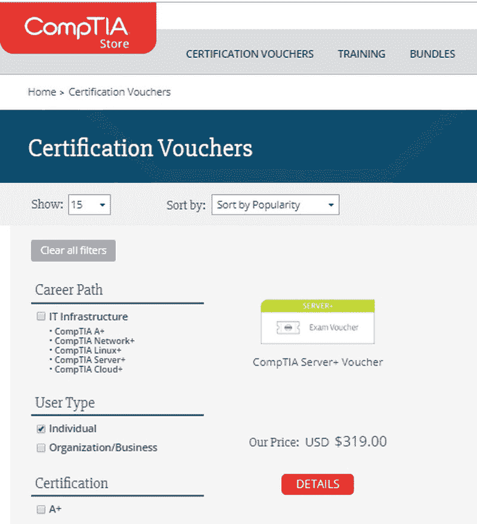

# CompTIA Server+ 考试

通过参加 CompTIA Server+ 认证考试并获得 750 分或更高的成绩，您将被认证为具有必要知识和技能的信息技术专家，能够担任网络服务器管理员的职位。这也证明您掌握了服务器基础知识、虚拟化、数据存储技术、安全性、故障排除和灾难恢复等方面的知识。

Server+ 考试是供应商中立的，涵盖了主要操作系统、网络服务、互联网络设备和内部网络通信的相关问题和挑战。作为一名认证的 Server+ 专业人士，您不局限于与单一厂商或服务提供商合作。

# 考试

当前版本的 Server+ 认证考试是 SK0-004。该版本于 2015 年 7 月发布，计划在 2020 年进行更新。考试共 100 道题，按各大主题区域的覆盖百分比进行分配。所有题目均为多项选择题。一旦开始测试，您有 90 分钟的时间完成，时间结束时，考试自动关闭。

考试在线进行，每次显示一个问题。您可以标记您想稍后回顾的问题。在时间耗尽之前，您可以通过提交完成考试来结束考试。完成考试后，您几乎立即会看到自己的得分。

考试的 100 道题目按照各个考试领域的权重分配。对于当前的考试版本，您可以预期在每个领域中的题目数量如下：

| **领域** | **考试百分比** | **题目数量** |
| --- | --- | --- |
| 1.0 服务器架构 | 12% | 12 |
| 2.0 服务器管理 | 24% | 24 |
| 3.0 存储 | 12% | 12 |
| 4.0 安全性 | 13% | 13 |
| 5.0 网络 | 10% | 10 |
| 6.0 灾难恢复 | 9% | 9 |
| 7.0 故障排除 | 20% | 20 |

在实际考试开始之前，您必须阅读 CompTIA 候选人协议，并表示理解并同意遵守该协议。您有 28 分钟的时间来查看该协议。

在考试期间，您不允许使用任何笔记或参考资料。事实上，尽管考试是在线进行的，您也无法访问互联网查找信息。考试期间会提供一些纸张供您做笔记，但必须在考试结束后交回。

Server+ 考试提供四种语言版本——英语、日语和简体中文。注册考试时，您可以选择自己偏好的语言。

所以，最终就是您与考试的较量，单挑。

# 注册考试

您可以在 CompTIA 官网注册 Server+ 考试，您可以购买该考试的测试凭证，网址如下所示：

CompTIA 商店网页

或者访问 Pearson VUE ([www.pearsonvue.com](http://www.pearsonvue.com))，如下图所示：

Pearson VUE 安排考试的网页

在任一站点上，你可以选择自己想要使用的现场考试中心，安排一个可用的日期和时间，并支付考试凭证费用。你也可以在许多考试中心购买考试凭证。对于 Server+ 考试，考试费用为 319.00 美元。

# 准备考试

CompTIA 推荐，为了准备参加 Server+ 认证考试，你应当拥有 18 至 24 个月的信息技术经验，最好是与服务器和网络相关的工作经验。CompTIA 还建议你在参加 Server+ 考试之前获得 A+ 认证。拥有 Network+ 认证也不失为一个好主意。然而，这些推荐并非强制要求。如果你相信自己有能力通过考试，那就尝试一下。不过，记住每次考试的费用是 319.00 美元。

在你开始考试前的 CompTIA 考生协议中，规定了你不能使用*脑力转储*以及其他未授权的、所谓的**真实考试内容**来源。你应该在开始认真准备和学习考试之前阅读考生协议。这样可以保护你的认证。

# 认证

通过 Server+ 考试可以证明你具备作为服务器管理员所需的知识和技能，包括：

+   执行所有服务器管理方面的工作：服务器硬件、软件的安装、维护、故障排除和安全性，包括虚拟化

+   识别服务器类型及其在计算环境中的角色和相互作用

+   指定并管理与服务器相关的环境问题

+   执行并遵守业务连续性、灾难恢复和设备故障的相关规定

拥有 Server+ 认证的人（我相信你也会包括在内）会有更多的就业机会。Server+ 考试让你有资格从事的职位包括服务器支持技术员或管理员、服务器管理员、数据存储系统管理员等多个职位。

通过访问以下链接，测试你对 CompTIA Server+ 考试所需概念的理解：
