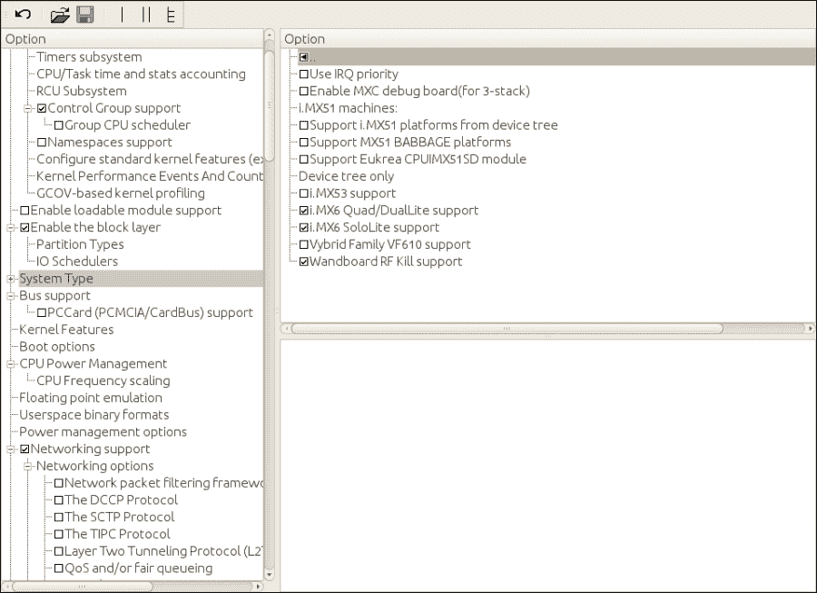

# 第二章。BSP 层

在本章中，我们将涵盖以下配方：

+   创建定制的 BSP 层

+   介绍系统开发工作流

+   添加自定义内核和引导加载程序

+   构建 U-Boot 引导加载程序

+   解释 Yocto 对 Linux 内核的支持

+   描述 Linux 的构建系统

+   配置 Linux 内核

+   构建 Linux 源代码

+   构建外部内核模块

+   调试 Linux 内核和模块

+   调试 Linux 内核引导过程

+   使用内核追踪系统

+   管理设备树

+   调试设备树问题

# 介绍

一旦我们的构建环境准备好并且 Yocto 项目已经就绪，就可以开始考虑开始开发我们的嵌入式 Linux 项目。

大多数嵌入式 Linux 项目都需要定制硬件和软件。开发过程中的一项早期任务是测试不同的硬件参考板，并选择一个作为我们设计的基础。我们选择了 Wandboard，这是一个基于 Freescale i.MX6 的开发平台，它价格实惠且开源，非常适合我们的需求。

在嵌入式项目中，通常最好尽早开始软件开发，可能在硬件原型准备好之前，这样就可以直接开始与参考设计一起工作。

但是，在某个阶段，硬件原型将准备就绪，需要在 Yocto 中引入更改以支持新硬件。

本章将解释如何创建一个 BSP 层来包含这些硬件特定的更改，并展示如何与 U-Boot 引导加载程序和 Linux 内核进行工作，这些组件可能需要进行最多的定制工作。

# 创建定制的 BSP 层

这些定制更改保存在一个单独的 Yocto 层中，称为**板支持包**（**BSP**）层。这种分离方式对系统的未来更新和补丁是最有利的。一个 BSP 层可以支持任意数量的新机器和任何与硬件相关的新软件功能。

## 如何做到这一点...

按照约定，Yocto 层的名称以`meta`开头，表示元数据。BSP 层可以添加`bsp`关键字，最后加上一个唯一的名称。我们将把我们的层命名为`meta-bsp-custom`。

有几种方法可以创建一个新层：

+   手动操作，一旦你知道需要做什么

+   通过复制 Poky 中包含的`meta-skeleton`层

+   通过使用`yocto-layer`命令行工具

你可以查看 Poky 中的`meta-skeleton`层，看到它包含以下元素：

+   一个`layer.conf`文件，用于设置层的配置变量

+   一个`COPYING.MIT`许可证文件

+   许多名为`recipes`前缀的目录，其中包含 BusyBox、Linux 内核和示例模块的配方，示例服务配方，示例用户管理配方以及多库示例。

## 它是如何工作的...

我们将在接下来的几个食谱中介绍一些可用示例中的用例，因此对于我们的需求，我们将使用 `yocto-layer` 工具，它允许我们创建一个最小化的层。

打开一个新的终端并切换到 `fsl-community-bsp` 目录。然后按如下方式设置环境：

```
$ source setup-environment wandboard-quad

```

### 注意

请注意，一旦创建了 `build` 目录，`MACHINE` 变量已经在 `conf/local.conf` 文件中配置好了，可以从命令行中省略。

切换到 `sources` 目录并运行：

```
$ yocto-layer create bsp-custom

```

请注意，`yocto-layer` 工具会为你的层添加 `meta` 前缀，因此你不需要手动添加。它会提示几个问题：

+   层优先级用于决定当同一个食谱（同名）同时存在于多个层中时，哪个层的优先级更高。它还用于决定如果多个层同时追加同一个食谱，`bbappends` 应该按照什么顺序应用。请保留默认值 6。这个值将存储在该层的 `conf/layer.conf` 文件中，作为 `BBFILE_PRIORITY`。

+   是否创建示例食谱并追加文件。暂时我们保持默认值 *no*。

我们的新层具有以下结构：

```
meta-bsp-custom/
 conf/layer.conf
 COPYING.MIT
 README

```

## 还有更多…

第一步是将这个新层添加到你项目的 `conf/bblayer.conf` 文件中。最好也将其添加到模板配置目录的 `bblayers.conf.sample` 文件中，以便在创建新项目时正确地附加它。以下代码中的高亮行展示了将该层添加到 `conf/bblayers.conf` 文件中的方式：

```
LCONF_VERSION = "6"

BBPATH = "${TOPDIR}"
BSPDIR := "${@os.path.abspath(os.path.dirname(d.getVar('FILE', True)) + '/../..')}"

BBFILES ?= ""
BBLAYERS = " \
  ${BSPDIR}/sources/poky/meta \
  ${BSPDIR}/sources/poky/meta-yocto \
  \
  ${BSPDIR}/sources/meta-openembedded/meta-oe \
  ${BSPDIR}/sources/meta-openembedded/meta-multimedia \
  \
  ${BSPDIR}/sources/meta-fsl-arm \
  ${BSPDIR}/sources/meta-fsl-arm-extra \
  ${BSPDIR}/sources/meta-fsl-demos \
  ${BSPDIR}/sources/meta-bsp-custom \
"
```

现在，BitBake 将解析 `bblayers.conf` 文件，并从你的层中找到 `conf/layers.conf` 文件。在其中，我们可以找到以下行：

```
BBFILES += "${LAYERDIR}/recipes-*/*/*.bb \
        ${LAYERDIR}/recipes-*/*/*.bbappend"
```

它告诉 BitBake 需要解析哪些目录以获取食谱和追加文件。你需要确保这个新层中的目录和文件层级符合给定的模式，否则你需要进行修改。

BitBake 还会找到以下内容：

```
BBPATH .= ":${LAYERDIR}"
```

`BBPATH` 变量用于定位 `bbclass` 文件以及通过 `include` 和 `require` 指令包含的配置文件和文件。搜索会在找到第一个匹配项时结束，因此最好保持文件名唯一。

我们可能会考虑在 `conf/layer.conf` 文件中定义的其他一些变量包括：

```
LAYERDEPENDS_bsp-custom = "fsl-arm"
LAYERVERSION_bsp-custom = "1"
```

`LAYERDEPENDS` 字面量是一个以空格分隔的其他层的列表，表示你的层依赖的其他层，而 `LAYERVERSION` 字面量指定你的层的版本，以防其他层希望添加对特定版本的依赖。

`COPYING.MIT` 文件指定了该层中元数据的许可证。Yocto 项目采用 *MIT* 许可证，该许可证与 **通用公共许可证**（**GPL**）兼容。此许可证仅适用于元数据，因为构建中包含的每个软件包都有自己的许可证。

`README` 文件需要根据你的特定层进行修改。通常在文件中描述该层并提供任何其他层的依赖关系和使用说明。

### 添加新机器

当自定义你的 BSP 时，通常是为你的硬件引入一个新的机器配置。这些配置文件保存在你的 BSP 层中的`conf/machine`目录下。通常做法是基于参考设计。例如，`wandboard-quad`有如下的机器配置文件：

```
include include/wandboard.inc

SOC_FAMILY = "mx6:mx6q:wandboard"

UBOOT_MACHINE = "wandboard_quad_config"

KERNEL_DEVICETREE = "imx6q-wandboard.dtb"

MACHINE_FEATURES += "bluetooth wifi"

MACHINE_EXTRA_RRECOMMENDS += " \
  bcm4329-nvram-config \
  bcm4330-nvram-config \
"
```

基于 Wandboard 设计的机器可以定义自己的机器配置文件，`wandboard-quad-custom.conf`，内容如下：

```
include conf/machine/include/wandboard.inc

SOC_FAMILY = "mx6:mx6q:wandboard"

UBOOT_MACHINE = "wandboard_quad_custom_config"

KERNEL_DEVICETREE = "imx6q-wandboard-custom.dtb"

MACHINE_FEATURES += "wifi"
```

现在，`wandboard.inc`文件位于一个不同的层中，因此为了让 BitBake 找到它，我们需要在相应层中从`BBPATH`变量指定完整路径。此机器除定义自己的 U-Boot 配置文件和 Linux 内核设备树外，还定义了自己的一组机器特性。

### 向 Linux 内核添加自定义设备树

为了将这个设备树文件添加到 Linux 内核中，我们需要将设备树文件添加到 Linux 内核源代码下的`arch/arm/boot/dts`目录，并且还需要修改 Linux 构建系统中的`arch/arm/boot/dts/Makefile`文件，以便像下面这样构建它：

```
dtb-$(CONFIG_ARCH_MXC) += \
+imx6q-wandboard-custom.dtb \
```

这段代码使用了 diff 格式，其中带有减号前缀的行是删除的，带有加号前缀的行是新增的，而没有前缀的行作为参考保留。

一旦补丁准备好，它可以被添加到`meta-bsp-custom/recipes-kernel/linux/linux-wandboard-3.10.17/`目录，并且 Linux 内核配方会附加一个`meta-bsp-custom/recipes-kernel/linux/linux-wandboard_3.10.17.bbappend`文件，内容如下：

```
SRC_URI_append = " file://0001-ARM-dts-Add-wandboard-custom-dts- file.patch"
```

添加自定义设备树到 Linux 内核的示例补丁可以在随书籍附带的源代码中找到。

### 添加自定义的 U-Boot 机器

以同样的方式，可以对 U-Boot 源代码进行补丁，以添加一个新的自定义机器。然而，启动加载程序的修改不像内核修改那样常见，大多数自定义平台将保持启动加载程序不变。补丁将被添加到`meta-bsp-custom/recipes-bsp/u-boot/u-boot-fslc-v2014.10/`目录，并且 U-Boot 配方会附加一个`meta-bsp-custom/recipes-bsp/u-boot/u-boot-fslc_2014.10.bbappend`文件，内容如下：

```
SRC_URI_append = " file://0001-boards-Add-wandboard-custom.patch"
```

一个将自定义机器添加到 U-Boot 的示例补丁可以在随书籍附带的源代码中找到。

### 添加自定义的 formfactor 文件

自定义平台还可以定义自己的`formfactor`文件，包含构建系统无法从其他来源获取的信息，例如定义是否有触摸屏或定义屏幕方向。这些文件在我们的`meta-bsp-custom`层中的`recipes-bsp/formfactor/`目录下定义。对于我们的新机器，我们可以定义一个`meta-bsp-custom/recipes-bsp/formfactor/formfactor_0.0.bbappend`文件，内容如下：

```
FILESEXTRAPATHS_prepend := "${THISDIR}/${PN}:"
```

而与机器相关的`meta-bsp-custom/recipes-bsp/formfactor/formfactor/wandboard-quadcustom/machconfig`文件将如下所示：

```
HAVE_TOUCHSCREEN=1
```

# 引入系统开发工作流

在自定义软件时，有一些常用的系统开发工作流，我们将在这个配方中介绍它们。

## 如何操作...

我们将概述以下开发工作流：

+   外部开发

+   工作目录开发

+   外部源代码开发

它们在不同的场景下使用。

## 它是如何工作的...

让我们分别理解这些开发工作流的用途。

### 外部开发

在这个工作流中，我们不使用 Yocto 构建系统来构建我们的包，只使用 Yocto 工具链和包的自有构建系统。

生成的源代码可以通过以下方式集成到 Yocto 中：

+   使用一个从发布的 tarball 获取的配方。

+   使用一个直接从源代码控制仓库获取的配方。

外部开发通常是 U-Boot 和 Linux 内核开发的首选方法，因为它们可以轻松交叉编译。Yocto 中的第三方包也是以这种方式开发的。

然而，第三方包可能很难交叉编译，而 Yocto 构建系统正是让这变得容易。所以，如果我们不是包的主要开发者，只是想引入一些修复或修改，我们可以使用 Yocto 来帮助我们。接下来将解释的两个工作流都使用了 Yocto 构建系统。

### 工作目录开发

在这个工作流中，我们使用 `build` 目录中的工作目录，`tmp/work`。正如我们所知，当 Yocto 构建一个包时，它使用工作目录来提取、修补、配置、构建和打包源代码。我们可以直接在这个目录中修改源代码，并使用 Yocto 系统来构建它。

这种方法通常用于偶尔调试第三方包时。

工作流如下：

1.  删除包的 `build` 目录以从头开始：

    ```
    $ bitbake -c cleanall <target>

    ```

1.  告诉 BitBake 获取、解压并修补包，但在此停止：

    ```
    $ bitbake -c patch <target>

    ```

1.  进入包的源代码目录并修改源代码。通常，我们会创建一个临时的本地 Git 目录来帮助我们开发，并轻松提取补丁。

    ```
    $ bitbake -c devshell <target>

    ```

1.  在不丢失我们修改的情况下构建它：

    ```
    $ bitbake -C compile <target>

    ```

    注意大写的`C`。这指示 BitBake 执行编译任务以及后续的所有任务。这与运行以下命令是一样的：

    ```
    $ bitbake -c compile <target>
    $ bitbake <target>

    ```

1.  通过将包复制到运行中的系统并使用目标的包管理系统安装来测试它。当你从 NFS 根文件系统运行系统时，只需将它复制到那里并运行以下命令（假设使用默认的 RPM 包格式）：

    ```
    $ rpm -i <package>

    ```

    可选地，你也可以像在 第一章 *构建系统* 中的 *设置包源* 配方中看到的那样使用包源，在这种情况下，你将重新构建索引，命令如下：

    ```
    $ bitbake package-index

    ```

    然后使用目标上的智能包管理工具安装包，如之前所示。

1.  提取补丁并将其添加到配方的 `bbappend` 文件中。

### 外部源代码开发

在这种工作流程中，我们将使用 Yocto 构建系统来构建包含源码的外部目录。这个外部目录通常是受版本控制的，以帮助我们进行开发。

这是在源码已经与 Yocto 构建系统集成后进行广泛包开发的常用方法。

工作流程如下：

1.  我们在这个外部版本控制的目录上进行开发，并在本地提交我们的更改。

1.  我们配置 Yocto 构建系统，以使用主机系统中的一个目录来获取源码，并可选择在其中构建。这保证了我们的任何操作都不会使 Yocto 构建系统中的更改丢失。稍后我们将看到一些例子。

1.  使用 Yocto 构建它：

    ```
    $ bitbake <target>

    ```

1.  通过将包复制到运行中的系统并使用目标的软件包管理系统进行安装来进行测试。

1.  提取补丁并添加到配方的`bbappend`文件中。

# 添加自定义内核和引导程序

在 U-Boot 和 Linux 内核中的开发通常是在 Yocto 之外进行的，因为它们很容易使用工具链进行构建，比如 Yocto 提供的工具链。

然后将开发工作集成到 Yocto 中的一种方法：

+   使用添加到内核和 U-Boot `bbappend`文件的补丁。这种方法将构建与我们正在使用的基础参考设计板相同的源，并对其应用我们的更改。

+   使用不同的 Git 存储库，从 Linux 内核和 U-Boot Git 存储库分叉，并使用`bbappend`文件将配方指向它。这样，我们可以直接提交更改到存储库，而 Yocto 构建系统将会构建它们。

通常只有在硬件更改非常重大并且 Linux 内核和引导加载程序的工作将非常广泛时，才需要分叉 Git 存储库。建议的做法是从补丁开始，只有当它们难以管理时才使用分叉存储库。

## 准备就绪

在开始对 Linux 内核和 U-Boot 进行修改的工作时，第一个问题是如何找出哪些可用的配方正在为您的构建使用。

### 找到 Linux 内核源码

要找到 Linux 内核源码，我们可以使用几种方法。因为我们知道正在为`wandboard-quad`机器进行构建，所以要做的第一件事是找到机器配置文件：

```
$ cd /opt/yocto/fsl-community-bsp/sources
$ find -name wandboard-quad.conf
./meta-fsl-arm-extra/conf/machine/wandboard-quad.conf

```

上述机器配置文件反过来包括一个`wandboard.inc`文件：

```
include conf/machine/include/imx-base.inc
include conf/machine/include/tune-cortexa9.inc

PREFERRED_PROVIDER_virtual/kernel ?= "linux-wandboard"
PREFERRED_VERSION_linux-wandboard ?= "3.10.17"
```

在这里，我们发现一个 Linux 内核配方被指定为虚拟/kernel 的首选提供者。像这样的虚拟包在一个功能或元素由多个配方提供时使用。这允许我们选择最终使用的所有配方中的哪一个。关于*选择特定软件版本和提供者*配方的详细解释将在第三章的*软件层*中进一步说明。

我们可以检查之前`core-image-minimal`构建的实际输出：

```
$ find tmp/work -name "*linux-wandboard*"
tmp/work/wandboard_quad-poky-linux-gnueabi/linux-wandboard

```

由于 `linux-wandboard` 目录存在于我们的 `work` 文件夹中，我们可以确定该配方已经被使用。

我们可以通过以下命令检查可用的 Linux 配方：

```
$ find -name "*linux*.bb"

```

我们有很多选项，但我们可以利用一些已获得的知识来过滤它们。让我们排除 `poky` 和 `meta-openembedded` 目录，因为我们知道 BSP 支持已经包含在 Freescale 社区 BSP 层中：

```
$ find -path ./poky -prune -o -path ./meta-openembedded -prune -o -name "*linux*.bb"

```

最后，我们还可以使用 Poky 中包含的 `bitbake-layers` 脚本：

```
$ cd /opt/yocto/fsl-community-bsp/
$ source setup-environment wandboard-quad
$ bitbake-layers show-recipes 'linux*'

```

并非所有这些内核都完全支持 Wandboard 机器，但它们都支持 Freescale ARM 机器，因此它们对进行比较很有用。

### 查找 U-Boot 源代码

如果我们继续拉取包含链，我们会看到 `imx-base.inc`，它本身包括 `fsl-default-providers.inc`，在其中我们可以找到：

```
PREFERRED_PROVIDER_u-boot ??= "u-boot-fslc"
PREFERRED_PROVIDER_virtual/bootloader ??= "u-boot-fslc"
```

所以 `u-boot-fslc` 就是我们正在寻找的 U-Boot 配方。

### 使用 Git 仓库分支进行开发

我们将展示如何追加一个配方，使用一个分叉的仓库进行开发。我们将以 Linux 内核为例，但这一概念同样适用于 U-Boot 或任何其他软件包，尽管具体细节会有所不同。

我们将分叉或创建参考设计中使用的仓库，并用它来指定配方的 `SRC_URI`。

## 如何操作...

在这个例子中，我已经将仓库分叉到 [`github.com/yoctocookbook/linux`](https://github.com/yoctocookbook/linux)，所以我的 `recipes-kernel/linux/linux-wandboard_3.10.17.bbappend` 文件将包含以下更改：

```
# Copyright Packt Publishing 2015
WANDBOARD_GITHUB_MIRROR = "git://github.com/yoctocookbook/linux.git"
SRCBRANCH = "wandboard_imx_3.10.17_1.0.2_ga-dev"
SRCREV = "${AUTOREV}"
```

### 提示

注意 URL 需要以 `git://` 开头。这是为了让 BitBake 能够识别它为 Git 源。现在我们可以清理并构建 Linux 内核，源代码将从分叉的仓库中获取。

## 它是如何工作的...

让我们来看一下 `linux-wandboard_3.10.17.bb` 配方：

```
include linux-wandboard.inc
require recipes-kernel/linux/linux-dtb.inc

DEPENDS += "lzop-native bc-native"

# Wandboard branch - based on 3.10.17_1.0.2_ga from Freescale git
SRCBRANCH = "wandboard_imx_3.10.17_1.0.2_ga"
SRCREV = "be8d6872b5eb4c94c15dac36b028ce7f60472409"
LOCALVERSION = "-1.0.2-wandboard"

COMPATIBLE_MACHINE = "(wandboard)"
```

第一个有趣的地方是同时包含了 `linux-wandboard.inc` 和 `linux-dtb.inc`。我们稍后会查看第一个，而另一个是一个类，它允许我们编译 Linux 内核设备树。我们将在本章稍后的 *管理设备树* 配方中讨论设备树。

然后它声明了两个软件包依赖关系，`lzop-native` 和 `bc-native`。`native` 部分告诉我们这些是在主机系统中使用的，因此它们在 Linux 内核构建过程中被使用。`lzop` 工具用于创建 `cpio` 压缩文件，这些文件在 `initramfs` 系统中使用，该系统从基于内存的根文件系统启动，`bc` 被引入是为了避免在生成某些内核文件时产生 Perl 核心依赖。

然后它设置了分支和修订版本，最后将 `COMPATIBLE_MACHINE` 设置为 `wandboard`。我们将在第三章的 *添加新软件包* 配方中讲解机器兼容性，*软件层*。

现在让我们来看一下 `linux-wandboard.inc` 包含文件：

```
SUMMARY = "Linux kernel for Wandboard"
LICENSE = "GPLv2"
LIC_FILES_CHKSUM = "file://COPYING;md5=d7810fab7487fb0aad327b76f1be7cd7"

require recipes-kernel/linux/linux-imx.inc

# Put a local version until we have a true SRCREV to point to
SCMVERSION ?= "y"

SRCBRANCH ??= "master"
LOCALVERSION ?= "-${SRCBRANCH}"

# Allow override of WANDBOARD_GITHUB_MIRROR to make use of
# local repository easier
WANDBOARD_GITHUB_MIRROR ?= "git://github.com/wandboard- org/linux.git"

# SRC_URI for wandboard kernel
SRC_URI = "${WANDBOARD_GITHUB_MIRROR};branch=${SRCBRANCH} \
 file://defconfig \
" 
```

这实际上就是我们要找的文件。最初，它指定了内核源代码的许可证，并指向它，设置了默认分支和本地版本的内核字符串，并设置了 `SCR_URI` 变量，这是源代码获取的地方。

它提供了`WANDBOARD_GITHUB_MIRROR`变量，我们可以在 `bbappend` 文件中修改它。

所以，逻辑上应该是创建一个 GitHub 账户并从提供的 `wandboard-org` Linux 仓库进行分叉。

一旦分支创建完毕，我们需要修改 `WANDBOARD_GITHUB_MIRROR` 变量。正如我们之前看到的，配方配置了特定的修订版和分支。我们希望在这里进行开发，因此我们需要将其更改为我们创建的新开发分支。我们可以将其命名为 `wandboard_imx_3.10.17_1.0.2_ga-dev`，并将修订版设置为自动获取该分支中的最新版本。

# 构建 U-Boot 引导加载程序

在这个配方中，我们将通过之前描述的几种开发工作流，使用 U-Boot 引导加载程序作为示例。

## 如何操作...

我们将看到以下开发工作流如何应用于 U-Boot：

+   外部开发

+   外部源代码开发

+   工作目录开发

## 它是如何工作的...

现在我们准备好详细解释之前提到的三种工作流。

### 外部开发

我们将使用 Yocto 工具链，在 Yocto 构建系统外部构建 U-Boot 源代码。

1.  下载并安装 Yocto 项目的交叉编译工具链，方法是访问以下链接：

    [`downloads.yoctoproject.org/releases/yocto/yocto-1.7.1/toolchain/`](http://downloads.yoctoproject.org/releases/yocto/yocto-1.7.1/toolchain/)

    ### 提示

    选择 32 位或 64 位版本，并执行安装脚本，接受默认安装位置。建议不要更改默认位置，以避免位置迁移问题。

1.  找到上游 Git 仓库：

    ```
    $ bitbake -e u-boot-fslc | grep ^SRC_URI=
    SRC_URI="git://github.com/Freescale/u-boot- imx.git;branch=patches-2014.10"

    ```

1.  从上游仓库克隆 U-Boot 的源代码：

    ```
    $ cd /opt/yocto/
    $ git clone git://github.com/Freescale/u-boot-imx.git
    $ cd u-boot-imx

    ```

    默认分支应该是 `patches-2014.10`，但如果不是，你可以使用以下命令进行更改：

    ```
    $ git checkout -b patches-2014.10 origin/patches-2014.10

    ```

1.  使用工具链附带的脚本设置环境：

    ```
    $ source /opt/poky/1.7.1/environment-setup-armv7a-vfp-neon- poky-linux-gnueabi

    ```

1.  为 `wandboard-quad` 配置 U-Boot：

    ```
    $ make wandboard_quad_config

    ```

1.  如果你尝试构建 U-Boot，它会失败。这是因为默认的 Yocto 环境设置并不满足 U-Boot 的需求。快速查看 U-Boot 配方可以发现，它在构建之前清除了一些标志，因此我们需要做如下操作：

    ```
    $ unset LDFLAGS CFLAGS CPPFLAGS

    ```

1.  现在我们准备构建。U-Boot 配方还将 `CC` 传递给 `make` 工具，作为 `EXTRA_OEMAKE` 标志，因为 U-Boot 不会从环境中读取它，因此我们还需要运行：

    ```
    $ make CC="${CC}"

    ```

    ### 注意

    你可以选择传递 `-jN` 参数来进行多线程编译。这里，`N` 是 CPU 核心数。

## 它是如何工作的...

U-Boot 的 `Makefile` 使用以下命令查找 `libgcc`：

```
PLATFORM_LIBGCC := -L $(shell dirname `$(CC) $(CFLAGS) -print-libgcc- file-name`
) -lgcc

```

如果我们没有定义 `CC`，该表达式不会正确展开为工具链中 `libgcc` 库的位置，因为没有将 `sysroot` 选项传递给编译器。

### 注意

更新版本的 U-Boot 已经修复了这个问题，但我们决定将指令保留如下：

```
$ make CC="${CC}"

```

这对于旧版本的 U-Boot 同样有效。

另一个避免问题的方法是定义`USE_PRIVATE_LIBGCC` U-Boot 配置变量，但这将使用内部的`libgcc`库到 U-Boot，这可能不是我们想要的。

然后，我们需要将镜像复制到目标设备以测试我们的更改，这很快就会看到。

### 外部源开发

我们将从一个本地目录中使用 Yocto 构建系统，通过克隆参考设计中使用的源代码的本地副本，并配置我们的项目以使用它作为外部源。然后，我们将从中开发，提取补丁，并将其添加到我们的 BSP 层中的`bbappend`文件中。

我们将使用之前克隆的 U-Boot 源码。

要配置我们的`conf/local.conf`文件以从克隆源码工作，按以下方式修改它：

```
INHERIT += "externalsrc"
EXTERNALSRC_pn-u-boot-fslc = "/opt/yocto/u-boot-imx"
EXTERNALSRC_BUILD_pn-u-boot-fslc = "/opt/yocto/u-boot-imx"
```

`EXTERNALSRC`变量定义了源代码位置(`S`)，而`EXTERNALSRC_BUILD`变量定义了构建位置(`B`)。这段代码也将在外部源位置上构建，因为`u-boot-fslc`配方目前不支持源代码和构建目录的分离。

### 提示

记得在尝试下一个方法时删除前述的配置，该方法在接下来的这个配方中解释了工作目录开发方法。

现在我们可以在新的 shell 上进行构建：

```
$ cd /opt/yocto/fsl-community-bsp/
$ source setup-environment wandboard-quad
$ bitbake u-boot-fslc

```

在从外部源构建时，`SRCPV`的扩展会失败并显示错误。在启用外部源编译时，需要暂时修改配方以使用静态版本控制。对于 U-Boot，我们会在`meta-fsl-arm/recipes-bsp/u-boot/u-boot-fslc_2014.10.bb`文件中进行以下更改：

```
- PV = "v2014.10+git${SRCPV}"
+ PV = "v2014.10"
```

这使用差异格式，带有减号前缀的行将被删除，带有加号前缀的行将被添加。

可以在附带书籍的源代码中找到一个允许我们执行外部源开发的 U-Boot 示例补丁。

开发工作现在可以提交到本地 Git 存储库，并可以使用`git format-patch`生成补丁。例如，我们可以为 Wandboard 更改板信息并创建`0001-wandboard-Change-board-info.patch`文件：

```
diff --git a/board/wandboard/wandboard.c b/board/wandboard/wandboard.c
index 3c8b7a5d2d0a..a466d4c74b8f 100644
--- a/board/wandboard/wandboard.c
+++ b/board/wandboard/wandboard.c
@@ -404,7 +404,7 @@ int board_init(void)

 int checkboard(void)
 {
-       puts("Board: Wandboard\n");
+      puts("Board: Wandboard custom\n");

        return 0;
 }
```

要将此补丁添加到 Yocto 的 U-Boot 配方中，我们创建一个`meta-bsp-custom/recipes-bsp/u-boot/u-boot-fslc_2014.10.bbappend`文件，内容如下：

```
# Copyright Packt Publishing 2015
FILESEXTRAPATHS_prepend := "${THISDIR}/${PN}-${PV}:"
SRC_URI_append = " file://0001-wandboard-Change-board-info.patch"
```

补丁需放置在`meta-bsp-custom/recipes-bsp/u-boot/u-boot-fslc-v2014.10/`下，正如`FILESEXTRAPATHS`变量中指定的。

被添加到`SRC_URI`变量的以`patch`或`diff`前缀结尾的文件将按照它们被发现的顺序应用。您也可以通过在`SRC_URI`中指定`apply=yes`属性来强制将文件视为`patch`。

### 工作目录开发

在进行小修改时的典型工作流程将会是：

1.  从头开始编译 U-Boot 包：

    ```
    $ bitbake -c cleanall virtual/bootloader

    ```

    这将清除 `build` 文件夹、共享状态缓存和下载的包源。

1.  启动开发 shell：

    ```
    $ bitbake -c devshell virtual/bootloader

    ```

    这将获取、解压和打补丁 U-Boot 源码，并启动一个新的 shell，环境已准备好进行 U-Boot 编译。新 shell 会切换到包含本地 Git 仓库的 U-Boot `build` 目录。

1.  在本地 Git 仓库中执行修改。

1.  保持 devshell 打开，并使用另一个终端编译源代码，而不擦除我们的修改：

    ```
    $ bitbake -C compile virtual/bootloader

    ```

    注意大写的 `C`。这会触发编译任务，但也会触发随后的所有任务。

    新编译的 U-Boot 镜像可在 `tmp/deploy/images/wandboard-quad` 下找到。

1.  测试您的更改。通常，这意味着我们需要将引导加载程序重新编程到 microSD 卡（如 Wandboard 所示）或内置的 `emmc`（如果可用），并在正确的偏移量处进行编程。我们可以从目标设备或主机计算机上进行此操作。

    从主机计算机，我们将使用 `dd` 命令将新的 U-Boot 镜像复制到偏移量为 0x400 的位置，这是 i.MX6 bootrom 期望找到它的地方。

    ```
    sudo dd if=u-boot.imx of=/dev/sdN bs=512 seek=2 && sync
    ```

    这会以 2 个块的偏移量进行写入，考虑到每块大小为 512 字节，偏移量为 0x400（1024）字节。

    ### 提示

    在运行 `dd` 命令时要小心，因为它可能会损坏您的机器。您需要确保 sdN 设备对应的是您的 microSD 卡，而不是开发机器上的某个驱动器。

    从设备本身，我们可以使用 U-Boot 的 `mmc` 命令，如下所示：

    +   将 U-Boot 镜像加载到内存中：

        ```
        > setenv ipaddr <target_ip>
        > setenv serverip <host_ip>
        > tftp ${loadaddr} u-boot.imx

        ```

    TFTP 传输的十六进制文件大小保存在 `filesize` 环境变量中，我们稍后会使用它。

    +   选择要操作的 MMC 设备。您可以使用 `mmc` 部分来发现哪个是正确的设备。

        ```
        > mmc dev 0
        > mmc part
        Partition Map for MMC device 0  --   Partition Type: DOS
        Part    Start Sector    Num Sectors     UUID            Type
         1     8192            16384           0003b9dd-01     0c
         2     24576           131072          0003b9dd-02     83

        ```

    我们可以看到分区 `1` 从扇区 `8192` 开始，留下足够的空间来编程 U-Boot。

    +   使用 512 字节的块大小，我们按如下方式计算块数：

        ```
        > setexpr filesizeblks $filesize / 0x200
        > setexpr filesizeblks $filesizeblks + 1

        ```

    +   然后我们将写入两个块的偏移量，使用我们镜像占用的块数。

        ```
        > mmc write ${loadaddr} 0x2 ${filesizeblks}

        ```

1.  回到 devshell 并将您的更改提交到本地 Git 仓库。

    ```
    $ git add --all .
    $ git commit -s -m "Well thought commit message"

    ```

1.  生成一个补丁到 U-Boot 配方的补丁目录，如下所示：

    ```
    $ git format-patch -1 -o /opt/yocto/fsl-community- bsp/sources/meta-bsp-custom/recipes-bsp/u-boot/u-boot-fslc- v2014.10/

    ```

1.  最后，将补丁添加到之前解释过的 U-Boot 配方中。

# 解释 Yocto 的 Linux 内核支持

Yocto 项目提供了一个内核框架，允许我们以不同的方式与 Linux 内核进行工作：

+   从 Git 仓库获取源代码并应用补丁。这是 Freescale 社区 BSP 支持的内核所走的路径，正如我们之前所看到的。

+   `linux-yocto` 样式的内核从一组 Git 分支和叶子生成内核源代码。特定的功能在分支中开发，叶子则跟随一个完整的功能集。

在这个配方中，我们将展示如何使用 `linux-yocto` 样式的内核。

## 如何操作...

要使用`linux-yocto`风格的内核，内核配方会继承`linux-yocto.inc`文件。`linux-yocto`风格内核的 Git 仓库包含元数据，通常在配方中或内核 Git 树中，分支以`meta`前缀命名。

`linux-yocto`风格的内核配方全部命名为`linux-yocto`，并遵循上游内核开发，基于`kernel.org`仓库。一旦新的 Yocto 发布周期开始，就会选择一个最新的上游内核版本，并保持前一个 Yocto 发布周期的内核版本。较旧的版本则根据**长期支持计划**（**LTSI**）发布进行更新。还有一个`linux-yocto-dev`包，它始终跟随最新的上游内核开发。

Yocto 内核与上游内核源代码分开维护，并为嵌入式系统开发人员添加功能和 BSP。

虽然 Freescale 社区的 BSP 不包含`linux-yocto`风格的内核，但其他一些 BSP 层包含此类内核。

用于定义构建的元数据变量包括：

+   `KMACHINE`：这个通常与`MACHINE`变量相同，但并非总是如此。它定义了内核的机器类型。

+   `KBRANCH`：这显式设置要构建的内核分支。它是可选的。

+   `KBRANCH_DEFAULT`：这是 KBRANCH 的默认值，初始值为`master`。

+   `KERNEL_FEATURES`：这添加了额外的元数据，用于指定配置和补丁。它出现在定义的`KMACHINE`和`KBRANCH`上方。它在**系列配置控制**（**SCC**）文件中定义，稍后会详细说明。

+   `LINUX_KERNEL_TYPE`：默认为标准类型，但也可以是`tiny`或`preempt-rt`。它在其自己的 SCC 描述文件中定义，或者在 SCC 文件中使用`KTYPE`变量明确指定。

## 工作原理...

Linux 内核中的元数据管理配置和源选择，以支持多个 BSP 和内核类型。管理这些元数据的工具构建在`kern-tools`包中。

元数据可以在配方中设置，用于小的修改，或者如果你没有访问某个内核仓库的权限，通常是在内核 Git 仓库中的`meta`分支中设置。要使用的`meta`分支默认位于与源代码相同仓库分支中的`meta`目录中，但也可以在内核配方中使用`KMETA`变量指定。如果它不在与内核源代码相同的分支中，它会被保存在孤立分支中；也就是说，这是一个具有自己历史的分支。要创建孤立分支，请使用以下命令：

```
$ git checkout --orphan meta
$ git rm -rf .
$ git commit --allow-empty -m "Meta branch"

```

你的配方必须包括`SRCREV_meta`，以指向要使用的`meta`分支的修订版本。

元数据在 SCC 文件中描述，其中可以包含一系列命令：

+   `kconf`：该命令将一个配置片段应用到内核配置中。

+   `patch`：该命令应用指定的补丁。

+   `define`：这引入变量定义。

+   `include`：这包含另一个 SCC 文件。

+   `git merge`：将指定的分支合并到当前分支。

+   `branch`：根据当前分支创建一个新的分支，通常是`KTYPE`或按指定内容。

SCC 文件大致分为以下逻辑分组：

+   **configuration (**`cfg`**)**：包含一个或多个内核配置片段以及描述它们的 SCC 文件。例如：

    ```
    cfg/spidev.scc:
            define KFEATURE_DESCRIPTION "Enable SPI device support"
            kconf hardware spidev.cfg

    cfg/spidev.cfg:
            CONFIG_SPI_SPIDEV=y
    ```

+   **补丁**：包含一个或多个内核补丁以及描述它们的 SCC 文件。例如：

    ```
    patches/fix.scc:
            patch fix.patch

    patches/fix.patch
    ```

+   **features**：包含混合配置和补丁以定义复杂的特性。它还可以包括其他描述文件。例如：

    ```
    features/feature.scc
            define KFEATURE_DESCRIPTION "Enable feature"

            patch 0001-feature.patch

            include cfg/feature_dependency.scc
            kconf non-hardware feature.cfg
    ```

+   **内核类型**：包含定义高级内核策略的特性。默认情况下，SCC 文件中定义了三种内核类型：

    +   **standard**：这是一个通用的内核定义策略。

    +   **tiny**：这是一个最小的内核定义策略，独立于标准类型。

    +   **preempt-rt**：继承自标准类型，用于定义应用了`PREEMPT-RT`补丁的实时内核。

    其他内核类型可以通过在 SCC 文件中使用`KTYPE`变量来定义。

+   **Board Support Packages**（**BSP**）：内核类型和硬件特性的组合。BSP 类型应包括 KMACHINE（内核机器）和 KARCH（内核架构）。

## 另见

+   有关`linux-yocto`风格内核的详细信息，请参阅*Yocto 项目 Linux 内核开发手册*，网址：[`www.yoctoproject.org/docs/1.7.1/kernel-dev/kernel-dev.html`](http://www.yoctoproject.org/docs/1.7.1/kernel-dev/kernel-dev.html)

# 描述 Linux 的构建系统

Linux 内核是单内核，因而共享同一地址空间。尽管它能够在运行时加载模块，但内核必须在编译时包含模块所需的所有符号。一旦模块被加载，它将共享内核的地址空间。

内核构建系统或**kbuild**使用条件编译来决定内核的哪些部分需要编译。内核构建系统独立于 Yocto 构建系统。

在本指南中，我们将解释内核构建系统是如何工作的。

## 如何操作...

内核配置存储在内核根目录下的`.config`文本文件中。kbuild 系统读取该配置文件来构建内核。`.config`文件被称为内核配置文件。定义内核配置文件有多种方式：

+   手动编辑`.config`文件，尽管不推荐这样做。

+   使用内核提供的用户接口之一（键入 make help 命令以查看其他选项）：

    +   `menuconfig`：基于 ncurses 的菜单界面（`make menuconfig`）

    +   `xconfig`：基于 Qt 的界面（`make xconfig`）

    +   `gconfig`：基于 GTK 的界面（`make gconfig`）

    ### 注意

    请注意，为了构建和使用这些接口，您的 Linux 主机需要具有适当的依赖项。

+   通过像 Yocto 这样的构建系统自动化执行。

每台机器还在内核树中定义了一个默认配置。对于 ARM 平台，这些存储在 `arch/arm/configs` 目录中。要配置 ARM 内核，即从默认配置生成一个 `.config` 文件，您运行：

```
$ make ARCH=arm <platform>_defconfig

```

例如，我们可以通过运行以下命令为 Freescale i.MX6 处理器构建一个默认配置：

```
$ make ARCH=arm imx_v6_v7_defconfig

```

## 工作原理如下…

Kbuild 使用 `Makefile` 和 `Kconfig` 文件来构建内核源代码。Kconfig 文件定义配置符号和属性，而 `Makefile` 文件将配置符号与源文件匹配。

运行以下命令可以查看 kbuild 系统的选项和目标：

```
$ make ARCH=arm help

```

## 还有更多…

在最新的内核中，默认配置包含了扩展为完整配置文件所需的所有信息。它是一个最小内核配置文件，其中删除了所有依赖项。要从当前的 `.config` 文件创建一个默认配置文件，您运行：

```
$ make ARCH=arm savedefconfig

```

这将在当前内核目录中创建一个 `defconfig` 文件。这个 `make` 目标可以看作是之前介绍的 `<platform>_defconfig` 目标的反义。前者从最小配置创建一个配置文件，后者将最小配置扩展为完整配置文件。

# 配置 Linux 内核

在本教程中，我们将解释如何使用 Yocto 构建系统配置 Linux 内核。

## 准备就绪

在配置内核之前，我们需要为我们的机器提供一个默认配置，这是 Yocto 项目用来配置内核的方式。在你的 BSP 层中定义新的机器时，需要提供一个 `defconfig` 文件。

Wandboard 的 `defconfig` 文件存储在 `sources/meta-fsl-arm-extra/recipes-kernel/linux/linux-wandboard-3.10.17/defconfig` 下。

这将是我们自定义硬件的基本 `defconfig` 文件，因此我们将其复制到我们的 BSP 层中：

```
$ cd /opt/yocto/fsl-community-bsp/sources
$ mkdir -p meta-bsp-custom/recipes-kernel/linux/linux-wandboard- 3.10.17/
$ cp meta-fsl-arm-extra/recipes-kernel/linux/linux-wandboard- 3.10.17/defconfig meta-bsp-custom/recipes-kernel/linux/linux- wandboard-3.10.17/
```

然后，我们将其添加到我们的内核中，使用 `meta-bsp-custom/recipes-kernel/linux/linux-wandboard_3.10.17.bbappend` 如下：

```
# Copyright Packt Publishing 2015
FILESEXTRAPATHS_prepend := "${THISDIR}/${PN}-${PV}:"
SRC_URI_append = " file://defconfig"
```

内核配置更改可以直接在这个 `defconfig` 文件中进行。

## 如何做…

要从机器 `defconfig` 文件创建一个 `.config` 文件，请执行以下命令：

```
$ bitbake -c configure virtual/kernel

```

这也将运行 oldconfig 内核 `make` 目标，以验证与 Linux 源的配置。

然后，我们可以使用以下 BitBake 命令行配置 Linux 内核：

```
$ bitbake -c menuconfig virtual/kernel

```

`menuconfig` 用户界面以及其他内核配置用户界面具有搜索功能，允许您通过名称定位配置变量。看下面的屏幕截图：


### 注意

在接下来的章节中，我们会提到特定的内核配置变量，比如 `CONFIG_PRINTK`，而不会详细说明配置变量的完整路径。可以使用不同 UI 的搜索接口来定位配置变量路径。

当你保存更改时，一个新的`.config`文件会在内核的`build`目录中创建，你可以使用以下命令找到它：

```
$ bitbake -e virtual/kernel | grep ^B=

```

你也可以使用图形界面修改配置，但不能从 BitBake 命令行修改。这是因为图形界面需要主机依赖项，而 Yocto 没有原生构建这些依赖项。

为了确保你的 Ubuntu 系统具备所需的依赖项，请执行以下命令：

```
$ sudo apt-get install git-core libncurses5 libncurses5-dev libelf- dev asciidoc binutils-dev qt3-dev-tools libqt3-mt-dev libncurses5 libncurses5-dev fakeroot build-essential crash kexec-tools makedumpfile libgtk2.0-dev libglib2.0-dev libglade2-dev

```

然后切换到之前找到的内核`build`目录，使用以下命令：

```
$ cd /opt/yocto/fsl-community-bsp/wandboard- quad/tmp/work/wandboard_quad-poky-linux-gnueabi/linux- wandboard/3.10.17-r0/git

```

接下来，运行以下命令：

```
$ make ARCH=arm xconfig

```

### 注意

如果遇到编译错误，请尝试从一个未使用`setup-environment`脚本配置过环境的新终端运行。

将会打开一个新窗口，显示下一个截图中的图形配置用户界面：



当你保存更改时，`.config`文件将被更新。

要使用更新的配置，你需要确保 BitBake 在构建时不会还原你的更改。有关更多细节，请参考本章中的*构建 Linux 内核*配方。

## 还有更多...

你可以通过以下步骤使内核更改永久生效：

1.  从内核源目录的`.config`文件和一个干净的环境（未使用`setup-environment`脚本进行配置）创建默认配置，方法是运行：

    ```
    $ make ARCH=arm savedefconfig

    ```

1.  将`defconfig`文件从你的内核`build`文件夹复制到内核配方的`defconfig`文件，如下所示：

    ```
    $ cp defconfig /opt/yocto/fsl-community-bsp/sources/meta-bsp- custom/recipes-kernel/linux/linux-wandboard-3.10.17

    ```

或者，你可以按如下方式从`build`目录使用 BitBake：

```
$ cd /opt/yocto/fsl-community-bsp/
$ source setup-environment wandboard-quad
$ bitbake -c savedefconfig virtual/kernel

```

这也会在 Linux 内核的源代码目录中创建一个`defconfig`文件，必须将其复制到你的配方中。

### 使用配置片段

`linux-yocto`风格的内核还可以应用在内核配置片段中定义的隔离内核配置更改；例如：

```
spidev.cfg:
  CONFIG_SPI_SPIDEV=y
```

内核配置片段以相同的方式附加到`SRC_URI`，并覆盖`defconfig`文件。

`linux-yocto`风格的内核（不过不包括 Wandboard 的那个）还提供了一套管理内核配置的工具：

+   要从`defconfig`文件和提供的配置片段配置内核，请执行：

    ```
    $ bitbake -f -c kernel_configme linux-yocto

    ```

+   要创建一个包含你更改的配置片段，请执行：

    ```
    $ bitbake -c diffconfig linux-yocto

    ```

+   要验证内核配置，你可以运行：

    ```
    $ bitbake -f -c kernel_configcheck linux-yocto

    ```

# 构建 Linux 内核

在这个配方中，我们将通过使用 Linux 内核作为示例，展示前面描述的开发工作流程。

## 如何操作...

我们将看到以下开发工作流程是如何应用于 Linux 内核的：

+   外部开发

+   工作目录开发

+   外部源开发

## 它是如何工作的...

让我们详细解释之前列出的三种方法。

### 外部开发

当在 Yocto 构建环境外编译时，我们仍然可以使用 Yocto 提供的工具链进行构建。过程如下：

1.  我们将使用已经安装在主机上的 Yocto 项目交叉编译工具链。

1.  本地克隆 `wandboard-org linux-wandboard` 仓库：

    ```
    $ cd /opt/yocto
    $ git clone https://github.com/wandboard-org/linux.git linux-wandboard
    $ cd linux-wandboard

    ```

1.  转到 `linux-wandboard_3.10.17.bb` 配方中指定的分支：

    ```
    $ git checkout -b wandboard_imx_3.10.17_1.0.2_ga origin/wandboard_imx_3.10.17_1.0.2_ga

    ```

1.  按照以下步骤编译内核源代码：

    +   按照以下步骤准备环境：

        ```
        $ source /opt/poky/1.7.1/environment-setup-armv7a-vfp-neon- poky-linux-gnueabi

        ```

    +   使用默认机器配置配置内核：

        ```
        $ cp /opt/yocto/fsl-community-bsp/sources/meta-bsp-custom/recipes-kernel/linux/linux-wandboard-3.10.17/defconfig arch/arm/configs/wandboard-quad_defconfig
        $ make wandboard-quad_defconfig

        ```

    +   使用以下命令编译内核镜像、模块和设备树文件：

        ```
        $ make

        ```

        你可以选择传递 `-jN` 参数给 make 以进行多线程构建。

        这将构建内核的 zImage、模块和设备树文件。

        ### 注意

        较旧的 Yocto 环境设置脚本将 `LD` 变量设置为使用 `gcc`，但 Linux 内核使用的是 `ld`。如果你的编译失败，请在运行 `make` 之前尝试以下操作：

        ```
        $ unset LDFLAGS

        ```

        若要仅构建模块，你可以运行：

        ```
        $ make modules

        ```

        如果只需要构建设备树文件，你可以运行：

        ```
        $ make dtbs

        ```

    +   将内核镜像和设备树文件复制到 TFTP 根目录，以便使用网络启动进行测试：

        ```
        $ cp arch/arm/boot/zImage arch/arm/boot/dts/imx6q- wandboard.dtb /var/lib/tftpboot
        $ make LOADADDR=0x10800000 uImage
        UBOOT_ENTRYPOINT_mx6  = "0x10008000"
        ```

    一些其他嵌入式 Linux 目标可能需要编译 uImage，特别是当 U-Boot 引导加载程序没有编译支持 zImage 启动时：

    ```
    $ make LOADADDR=0x10800000 uImage
    ```

    ### 注意

    `mkimage` 工具是 Yocto 工具链的一部分，当使用 FSL 社区 BSP 构建时。我们将在第四章的 *准备和使用 SDK* 配方中看到如何构建和安装 SDK，*应用开发*。

    如果它不包含在你的工具链中，你可以使用以下命令在主机上安装该工具：

    ```
    $ sudo apt-get install u-boot-tools

    ```

    `LOADADDR` 是 U-Boot 的入口点；也就是 U-Boot 将内核放置到内存中的地址。它在 `meta-fsl-arm imx-base.inc` 文件中定义：

    ```
    UBOOT_ENTRYPOINT_mx6 = "0x10008000"

    ```

### 外部源代码开发

正如我们之前在 U-Boot 中所做的，我们将使用 Yocto 构建系统，指向包含 Linux 源代码仓库克隆的本地目录。我们将使用之前部分克隆的本地 Git 仓库。

我们在 `conf/local.conf` 文件中使用以下代码来配置外部开发：

```
INHERIT += "externalsrc"
EXTERNALSRC_pn-linux-wandboard = "/opt/yocto/linux-wandboard"
EXTERNALSRC_BUILD_pn-linux-wandboard = "/opt/yocto/linux- wandboard"
```

### 提示

记得在使用下文解释的工作目录开发方法时，删除此配置。

但是，正如之前一样，编译在 U-Boot 上失败。在这种情况下，linux-wandboard 配方由于不是 `linux-yocto` 样式的配方，因此没有准备好进行外部源代码编译，并且在配置任务时失败。

内核开发者通常更倾向于外部编译内核，正如我们之前看到的，因此这种情况可能不会很快得到修复。

### 工作目录开发

通常在我们有少量更改或不拥有源代码仓库时，我们会使用补丁并采用这种开发工作流。

当处理修改时，典型的工作流会是：

1.  从头开始启动内核包的编译：

    ```
    $ cd /opt/yocto/fsl-community-bsp/
    $ source setup-environment wandboard-quad
    $ bitbake -c cleanall virtual/kernel

    ```

    这将清除 `build` 文件夹、共享状态缓存以及下载的包源。

1.  按照以下步骤配置内核：

    ```
    $ bitbake -c configure virtual/kernel

    ```

    这将把机器 `defconfig` 文件转换为 `.config` 文件，并调用 `oldconfig` 来验证与内核源代码的配置。

    你可以选择性地通过以下方式添加自定义配置更改：

    ```
    $ bitbake -c menuconfig virtual/kernel

    ```

1.  在内核上启动开发 shell：

    ```
    $ bitbake -c devshell virtual/kernel

    ```

    这将获取、解压并修补内核源代码，并启动一个新的 shell，环境已准备好进行内核编译。新的 shell 将切换到包含本地 Git 仓库的内核`build`目录。

1.  执行我们的修改，包括内核配置更改。

1.  保持 devshell 打开，然后返回到已加载 Yocto 环境的终端，以便在不删除我们修改的情况下编译源代码，如下所示：

    ```
    $ bitbake -C compile virtual/kernel

    ```

    请注意大写字母`C`。这将调用编译任务以及其后所有任务。

    新编译的内核镜像可在`tmp/deploy/images/wandboard-quad`下找到。

1.  测试您的更改。通常，我们会在一个网络引导的系统上工作，因此我们会将内核镜像和设备树文件复制到 TFTP 服务器根目录，并使用以下命令引导目标：

    ```
    $ cd tmp/deploy/images/wandboard-quad/
    $ cp zImage-wandboard-quad.bin zImage-imx6q-wandboard.dtb /var/lib/tftpboot

    ```

    参考第一章中的*配置网络引导开发环境*食谱，了解详细信息，*构建系统*。

    另外，U-Boot 引导加载程序可以使用以下语法，从内存中引导带有相应设备树的 Linux zImage 内核：

    ```
    > bootz <kernel_addr> - <dtb_addr>

    ```

    例如，我们可以从 TFTP 获取镜像并按如下方式引导 Wandboard 镜像：

    ```
    > tftp ${loadaddr} ${image}
    > tftp ${fdt_addr} ${fdt_file}
    > bootz ${loadaddr} - ${fdt_addr}

    ```

    如果我们使用的是 initramdisk，我们将其作为第二个参数传递。由于我们没有使用，我们改用破折号。

    从内存中引导 uImage Linux 内核镜像的命令应使用`bootm`，例如：

    ```
    > bootm <kernel_addr> - <dtb_addr>

    ```

1.  返回到 devshell 并将您的更改提交到本地 Git 仓库：

    ```
    $ git add --all .
    $ git commit -s -m "Well thought commit message"

    ```

1.  将补丁生成到内核食谱的补丁目录中：

    ```
    $ git format-patch -1 -o /opt/yocto/fsl-community- bsp/sources/meta-bsp-custom/recipes-kernel/linux/linux- wandboard-3.10.17

    ```

1.  最后，将补丁添加到内核食谱中，如前所述。

# 构建外部内核模块

Linux 内核具有在运行时加载扩展内核功能的模块的能力。内核模块共享内核的地址空间，并且必须与其将要加载的内核进行链接。Linux 内核中的大多数设备驱动程序可以被编译成内核本身（内建）或作为需要放置在根文件系统下`/lib/modules`目录中的可加载内核模块。

开发和分发内核模块的推荐方法是与内核源代码一起进行。内核树中的模块使用内核的 kbuild 系统来构建自己，因此，只要它在内核配置中被选为模块，并且内核启用了模块支持，Yocto 就会构建它。

然而，并非总是可以在内核中开发模块。常见的例子是硬件制造商为多种内核版本提供 Linux 驱动程序，并且它们的内部开发过程与内核社区分离。内部开发工作通常首先作为外部树外模块发布，尽管一些或所有这些内部开发最终会进入主流内核。然而，上游提交是一个缓慢的过程，因此硬件公司通常会优先在内部开发。

值得记住的是，Linux 内核受 GPLv2 许可证保护，因此 Linux 内核模块应当以兼容的许可证发布。我们将在后续章节中详细介绍许可证问题。

## 准备中

要使用 Yocto 编译外部内核模块，首先需要了解如何将模块源代码与内核本身链接。外部内核模块也是使用它将要链接的 Linux 内核的 kbuild 系统构建的，因此我们首先需要一个`Makefile`：

```
obj-m:= hello_world.o

SRC := $(shell pwd)
all:
        $(MAKE) -C $(KERNEL_SRC) M=$(SRC)

modules_install:
        $(MAKE) -C $(KERNEL_SRC) M=$(SRC) modules_install

clean:
        rm -f *.o *~ core .depend .*.cmd *.ko *.mod.c
        rm -f Module.markers Module.symvers modules.order
        rm -rf .tmp_versions Modules.symvers
```

`Makefile`文件仅包装了用于在 Linux 系统上编译模块的`make`命令：

```
make -C $(KERNEL_SRC) M=$(SRC)
```

在这里，`make`指令会在内核源代码所在的位置进行构建，而`M`参数告诉 kbuild 它正在指定位置构建一个模块。

然后我们编写模块源代码本身（`hello_world.c`）：

```
/ *
 * This program is free software; you can redistribute it and/or modify
 * it under the terms of the GNU General Public License as published by
 * the Free Software Foundation; either version 2 of the License, or
 * (at your option) any later version.
 *
 * This program is distributed in the hope that it will be useful,
 * but WITHOUT ANY WARRANTY; without even the implied warranty of
 * MERCHANTABILITY or FITNESS FOR A PARTICULAR PURPOSE. See the
 * GNU General Public License for more details.
 *
 * You should have received a copy of the GNU General Public License
 * along with this program. If not, see <http://www.gnu.org/licenses/>.
 */

#include <linux/module.h>

static int hello_world_init(void)
{
        printk("Hello world\n");
        return 0;
}

static void hello_world_exit(void)
{
        printk("Bye world\n");
}
module_init(hello_world_init);
module_exit(hello_world_exit);

MODULE_LICENSE("GPL v2");
```

值得记住的是，我们需要使用已经构建的内核源代码进行编译。使用以下步骤进行编译：

1.  我们使用 Yocto 工具链环境设置脚本来准备环境：

    ```
    $ source /opt/poky/1.7.1/environment-setup-armv7a-vfp-neon- poky-linux-gnueabi

    ```

1.  接下来我们构建模块。从模块源目录执行以下命令：

    ```
    $ KERNEL_SRC=/opt/yocto/linux-wandboard make

    ```

## 如何操作...

一旦我们知道如何外部编译模块，我们就准备好为其准备一个 Linux 内核模块 Yocto 配方。

我们将模块源文件和`Makefile`放置在`meta-bsp-custom`层中的`recipes-kernel/hello-world/files/`目录下。然后，我们创建一个`recipes-kernel/hello-world/hello-world.bb`文件，内容如下：

```
# Copyright (C) 2015 Packt Publishing.

SUMMARY = "Simplest hello world kernel module."
LICENSE = "GPLv2"
LIC_FILES_CHKSUM = "file://${COMMON_LICENSE_DIR}/GPL- 2.0;md5=801f80980d171dd6425610833a22dbe6"

inherit module

SRC_URI = " \
    file://hello_world.c \
    file://Makefile \
"

S = "${WORKDIR}"

COMPATIBLE_MACHINE = "(wandboard)"
```

该配方在继承`module`类后定义了源目录和两个模块文件，该类负责所有事务。`Makefile`中的`KERNEL_SRC`参数由模块类设置为`STAGING_KERNEL_DIR`，即内核类放置用于外部模块编译所需的 Linux 内核头文件的位置。

我们使用以下命令进行构建：

```
$ bitbake hello-world

```

生成的模块名为`hello_world.ko`，`bbclass`会自动在包名中添加`kernel-module`前缀。

## 还有更多内容...

前面的指令将构建模块，但不会将其安装到根文件系统中。为此，我们需要将根文件系统添加为依赖项。通常在机器配置文件中使用`MACHINE_ESSENTIAL`（用于启动时所需的模块）或`MACHINE_EXTRA`（如果它们对启动不是必需的，但其他情况下需要）变量来完成此操作。

+   那些对启动是必需的依赖项有：

    +   `MACHINE_ESSENTIAL_EXTRA_RDEPENDS`：如果找不到它们，构建将失败

    +   `MACHINE_ESSENTIAL_EXTRA_RRECOMMENDS`：如果找不到它们，构建不会失败

+   那些对启动不是必需的依赖项有：

    +   `MACHINE_EXTRA_RDEPENDS`：如果找不到它们，构建将失败

    +   `MACHINE_ESSENTIAL_EXTRA_RRECOMMENDS`：如果找不到它们，构建不会失败

# 调试 Linux 内核和模块

我们将重点介绍内核开发人员常用的一些调试内核问题的方法。

## 如何操作...

最重要的是，调试 Linux 内核仍然是一个手动过程，最重要的开发者工具是能够打印调试信息。

内核使用`printk`函数，它在语法上与标准 C 库中的`printf`函数调用非常相似，唯一不同的是它增加了一个可选的日志级别。允许的格式在内核源代码的`Documentation/printk-formats.txt`中有详细记录。

`printk`功能需要在内核中通过`CONFIG_PRINTK`配置变量进行编译。你还可以通过`CONFIG_PRINTK_TIME`配置变量配置 Linux 内核为每条消息前面加上精确的时间戳，或者更好地，通过`printk.time`内核命令行参数或通过`/sys/module/printk/parameters`下的 sysfs 来实现。通常所有内核都包含`printk`支持，Wandboard 内核也包括，尽管它通常会在生产内核中为小型嵌入式系统去除。

`printk`函数可以在任何上下文中使用，包括中断、**不可屏蔽中断**（**NMI**）或调度器。请注意，在中断上下文中使用它并不推荐。

一个在开发过程中有用的调试语句可能是：

```
printk(KERN_INFO "[%s:%d] %pf -> var1: %d var2: %d\n", __FUNCTION__, __LINE__, __builtin_return_address(0), var1, var2);
```

首先要注意的是，日志级别宏和打印格式之间没有逗号。然后，我们打印调试语句所在的函数和行号，以及父函数。最后，打印我们实际关注的变量。

## 它是如何工作的...

以下是`printk`中可用的日志级别：

| 类型 | 符号 | 描述 |
| --- | --- | --- |
| 紧急 | `KERN_EMERG` | 系统不稳定且即将崩溃 |
| 警告 | `KERN_ALERT` | 需要立即采取行动 |
| 严重 | `KERN_CRIT` | 严重的软件或硬件故障 |
| 错误 | `KERN_ERR` | 错误条件 |
| 警告 | `KERN_WARNING` | 没有严重问题，但可能暗示有问题 |
| 通知 | `KERN_NOTICE` | 没有什么严重问题，但用户应注意 |
| 信息 | `KERN_INFO` | 系统信息 |
| 调试 | `KERN_DEBUG` | 调试信息 |

如果没有指定日志级别，将使用内核配置中配置的默认日志消息。默认情况下，这是`KERN_WARNING`。

所有的`printk`语句都会写入内核日志缓冲区，该缓冲区可能会覆盖，调试语句除外，只有在定义了`DEBUG`符号时才会出现。稍后我们将看到如何启用内核调试消息。`printk`日志缓冲区的大小必须是 2 的幂，并且其大小应该在`CONFIG_LOG_BUF_SHIFT`内核配置变量中设置。你可以使用`log_buf_len`内核命令行参数进行修改。

我们使用`dmesg`命令打印内核日志缓冲区。此外，Yocto 用户空间将运行一个内核日志守护进程，该进程会将内核消息记录到`/var/log/messages`中的磁盘。

超过当前控制台日志级别的消息也会立即出现在控制台上。`ignore_loglevel` 内核命令行参数（也可以在 `/sys/module/printk/parameters` 下找到）可用于打印所有内核消息到控制台，无论日志级别如何。

你还可以通过 `proc` 文件系统在运行时更改日志级别。`/proc/sys/kernel/printk` 文件包含当前日志级别、默认日志级别、最小日志级别以及启动时的默认日志级别。要将当前日志级别更改为最大值，请执行：

```
$ echo 8 > /proc/sys/kernel/printk

```

你还可以通过 `dmesg` 工具如下设置控制台日志级别：

```
$ dmesg -n 8

```

要使更改持久化，你可以将日志级别命令行参数传递给内核，或者在某些 Yocto 根文件系统镜像中，你也可以使用 `/etc/sysctl.conf` 文件（这些镜像安装了 `procps` 包）。

## 还有更多内容...

Linux 驱动程序不会直接使用 `printk` 函数。它们按优先顺序使用特定子系统的消息（如 `netdev` 或 `v4l`）或 `dev_*` 和 `pr_*` 函数族。后者在下表中描述：

| 设备消息 | 一般消息 | Printk 符号 |
| --- | --- | --- |
| `dev_emerg` | `pr_emerg` | `KERN_EMERG` |
| `dev_alert` | `pr_alert` | `KERN_ALERT` |
| `dev_crit` | `pr_crit` | `KERN_CRIT` |
| `dev_err` | `pr_err` | `KERN_ERR` |
| `dev_warn` | `pr_warn` | `KERN_WARNING` |
| `dev_notice` | `pr_notice` | `KERN_NOTICE` |
| `dev_info` | `pr_info` | `KERN_INFO` |
| `dev_dbg` | `pr_debug` | `KERN_DEBUG` |

要启用驱动程序中的调试消息，你可以执行以下任意操作：

+   在驱动源代码中，在任何其他头文件之前定义 `DEBUG` 宏，如下所示：

    ```
    #define DEBUG
    ```

+   使用动态调试内核功能。然后，你可以通过 `debugfs` 按粒度启用/禁用所有 `dev_dbg` 和 `pr_debug` 调试消息。

### 使用动态调试

要在 Linux 内核中使用动态调试功能，请按以下步骤操作：

1.  确保你的内核已启用动态调试功能（`CONFIG_DYNAMIC_DEBUG`）。

1.  如果尚未挂载调试文件系统，请先挂载：

    ```
    $ mount -t debugfs nodev /sys/kernel/debug

    ```

1.  通过 `dynamic_debug/control` 文件夹配置调试。它接受由空格分隔的单词序列：

    +   `func <function name>`

    +   `file <filename>`

    +   `module <module name>`

    +   `format <pattern>`

    +   `line <line or line range>`

    +   `+ <flag>`：添加指定的标志

    +   `- <flag>`：移除指定的标志

    +   `= <flag>`：设置指定的标志

    各种标志定义如下：

    +   `f`：此标志在消息中包含函数名

    +   `l`：此标志在消息中包含行号

    +   `m`：此标志在消息中包含模块名

    +   `p`：此标志启用调试消息

    +   `t`：此标志在非中断上下文消息中包含线程 ID

1.  默认情况下，所有调试消息都是禁用的。控制文件包含所有可用的调试点，默认情况下它们没有启用任何标志（标记为 `=`_）。

1.  现在我们将按如下方式启用调试：

    +   启用文件中的所有调试语句：

        ```
        echo -n 'file <filename> +p' > /sys/kernel/debug/dynamic_debug/control

        ```

    +   可选地，您可以运行特定的调试语句：

        ```
        $ echo -n 'file <filename> line nnnn +p' > /sys/kernel/debug/dynamic_debug/control

        ```

1.  要列出所有启用的调试语句，我们使用以下命令：

    ```
    $ awk '$3 != "=_"' /sys/kernel/debug/dynamic_debug/control

    ```

要使调试更持久，我们可以将 `dyndbg="<query>"` 或 `module.dyndbg="<query>"` 传递给内核在命令行参数中。

请注意，查询字符串需要用引号括起来传递，以便正确解析。 您可以使用分号将多个查询连接在命令行参数中； 例如，`dyndbg="file mxc_v4l2_capture.c +pfl; file ipu_bg_overlay_sdc.c +pfl"`

### 限速调试消息

对于 `dev_*`、`pr_*` 和 `printk` 函数族，有限速和单次扩展：

+   `printk_ratelimited()`、`pr_*_ratelimited()` 和 `dev_*_ratelimited()` 在 5 * HZ 的间隔内最多打印 10 次

+   `printk_once()`、`pr_*_once()` 和 `dev_*_once()` 只会打印一次。

您还可以使用十六进制转储缓冲区的实用函数； 例如，`print_hex_dump_bytes()`.

## 另见

+   动态调试在 Linux 内核源码中有详细记录，位于 `Documentation/dynamic-debug-howto.txt`

# 调试 Linux 内核引导过程

我们已经看到了调试 Linux 内核的最常见技术。 然而，在一些特殊场景中，需要使用不同的方法。 在嵌入式 Linux 开发中最常见的场景之一是调试引导过程。 本文将解释用于调试内核引导过程的一些技术。

## 如何做...

引导时内核崩溃通常不会在控制台上提供任何输出。 尽管这看起来很令人生畏，但我们可以使用技术提取调试信息。 早期崩溃通常发生在串行控制台初始化之前，因此即使有日志消息，我们也看不到它们。 我们将首先展示如何启用不需要串行驱动程序的早期日志消息。

如果这还不够，我们还将展示访问内存中日志缓冲区的技术。

## 如何运作...

调试引导问题有两个明显的阶段，在串行控制台初始化之前和之后。 在串行控制台初始化之后，我们可以看到内核的串行输出，可以使用早期描述的技术进行调试。

然而，在串行初始化之前，ARM 内核中有基本的 **UART** 支持，允许您从早期引导开始使用串行。 此支持与 `CONFIG_DEBUG_LL` 配置变量一起编译进去。

这增加了对调试专用系列的汇编函数的支持，允许您向 UART 输出数据。 低级支持是平台特定的，对于 i.MX6，可以在 `arch/arm/include/debug/imx.S` 中找到。 该代码允许通过 `CONFIG_DEBUG_IMX_UART_PORT` 配置变量配置此低级 UART。

我们可以通过以下方式直接使用 `printascii` 函数：

```
extern void printascii(const char *);
printascii("Literal string\n");
```

然而，更推荐的做法是使用 `early_print` 函数，该函数利用前面解释的函数，并接受 `printf` 风格的格式化输入；例如：

```
early_print("%08x\t%s\n", p->nr, p->name);
```

### 从引导加载程序中转储内核的 printk 缓冲区

调试 Linux 内核启动时崩溃的另一种有用方法是分析崩溃后的内核日志。这只有在 RAM 内存在重启后保持持久性并且不被引导加载程序初始化的情况下才可能实现。

由于 U-Boot 保持内存不变，我们可以使用此方法查看内核登录内存，以寻找线索。

查看内核源代码，我们可以看到日志环形缓冲区是如何在`kernel/printk/printk.c`中设置的，并且注意到它存储在`__log_buf`中。

为了找到内核缓冲区的位置，我们将使用 Linux 构建过程创建的 `System.map` 文件，它通过以下命令映射符号与虚拟地址：

```
$grep __log_buf System.map
80f450c0 b __log_buf
```

要将虚拟地址转换为物理地址，我们查看 ARM 中 `__virt_to_phys()` 是如何定义的：

```
x - PAGE_OFFSET + PHYS_OFFSET
```

`PAGE_OFFSET` 变量在内核配置中定义如下：

```
config PAGE_OFFSET
        hex
        default 0x40000000 if VMSPLIT_1G
        default 0x80000000 if VMSPLIT_2G
        default 0xC0000000
```

一些 ARM 平台，如 i.MX6，会在运行时动态修补 `__virt_to_phys()` 转换，因此 `PHYS_OFFSET` 将取决于内核加载到内存中的位置。由于这一点可能有所不同，刚才看到的计算是平台特定的。

对于 Wandboard，0x80f450c0 的物理地址是 0x10f450c0。

然后我们可以通过强制重启使用一个神奇的 *SysRq* 键，这个键需要在内核配置中启用 `CONFIG_MAGIC_SYSRQ`，但是在 Wandboard 上默认启用：

```
$ echo b > /proc/sysrq-trigger

```

然后，我们可以通过以下方式从 U-Boot 转储该内存地址：

```
> md.l 0x10f450c0
10f450c0: 00000000 00000000 00210038 c6000000    ........8.!.....
10f450d0: 746f6f42 20676e69 756e694c 6e6f2078    Booting Linux on
10f450e0: 79687020 61636973 5043206c 78302055     physical CPU 0x
10f450f0: 00000030 00000000 00000000 00000000    0...............
10f45100: 009600a8 a6000000 756e694c 65762078    ........Linux ve
10f45110: 6f697372 2e33206e 312e3031 2e312d37    rsion 3.10.17-1.
10f45120: 2d322e30 646e6177 72616f62 62672b64    0.2-wandboard+gb
10f45130: 36643865 62323738 20626535 656c6128    e8d6872b5eb (ale
10f45140: 6f6c4078 696c2d67 2d78756e 612d7068    x@log-linux-hp-a
10f45150: 7a6e6f67 20296c61 63636728 72657620    gonzal) (gcc ver
10f45160: 6e6f6973 392e3420 2820312e 29434347    sion 4.9.1 (GCC)
10f45170: 23202920 4d532031 52502050 504d4545     ) #1 SMP PREEMP
10f45180: 75532054 6546206e 35312062 3a323120    T Sun Feb 15 12:
10f45190: 333a3733 45432037 30322054 00003531    37:37 CET 2015..
10f451a0: 00000000 00000000 00400050 82000000    ........P.@.....
10f451b0: 3a555043 4d524120 50203776 65636f72    CPU: ARMv7 Proce

```

## 还有更多内容...

另一种方法是将内核日志消息和内核 panic 或 oops 信息存储到持久存储中。Linux 内核的持久存储支持（`CONFIG_PSTORE`）允许你将数据记录到跨重启保持的持久内存中。

要将 panic 和 oops 消息记录到持久内存中，我们需要配置内核并启用 `CONFIG_PSTORE_RAM` 配置变量，而要记录内核消息，我们则需要配置内核启用 `CONFIG_PSTORE_CONSOLE`。

然后我们需要配置持久存储的位置，选择一个未使用的内存位置，但保持最后 1 MB 内存为空。例如，我们可以传递以下内核命令行参数，预留一个从 0x30000000 开始的 128 KB 区域：

```
ramoops.mem_address=0x30000000 ramoops.mem_size=0x200000

```

然后，我们会通过将其添加到 `/etc/fstab` 中来挂载持久存储，以便在下次启动时也可以使用：

```
/etc/fstab:
pstore  /pstore  pstore  defaults  0  0
```

然后，我们按如下方式挂载它：

```
# mkdir /pstore
# mount /pstore
```

接下来，我们通过神奇的 *SysRq* 键强制重启：

```
# echo b > /proc/sysrq-trigger

```

在重启时，我们会在 `/pstore` 中看到一个文件：

```
-r--r--r--  1 root root 4084 Sep 16 16:24 console-ramoops

```

这将包含如下内容：

```
SysRq : Resetting
CPU3: stopping
CPU: 3 PID: 0 Comm: swapper/3 Not tainted 3.14.0-rc4-1.0.0-wandboard-37774-g1eae
[<80014a30>] (unwind_backtrace) from [<800116cc>] (show_stack+0x10/0x14)
[<800116cc>] (show_stack) from [<806091f4>] (dump_stack+0x7c/0xbc)
[<806091f4>] (dump_stack) from [<80013990>] (handle_IPI+0x144/0x158)
[<80013990>] (handle_IPI) from [<800085c4>] (gic_handle_irq+0x58/0x5c)
[<800085c4>] (gic_handle_irq) from [<80012200>] (__irq_svc+0x40/0x70)
Exception stack(0xee4c1f50 to 0xee4c1f98)

```

我们应该将其移出 `/pstore` 或完全删除，以避免占用内存。

# 使用内核函数跟踪系统

最新版本的 Linux 内核包含一组跟踪器，通过对内核进行插桩，允许你分析不同的领域，比如：

+   中断延迟

+   抢占延迟

+   调度延迟

+   进程上下文切换

+   事件追踪

+   系统调用

+   最大堆栈

+   块层

+   函数

当追踪器未启用时，追踪器不会带来性能开销。

## 准备就绪...

追踪系统可以用于多种调试场景，但最常用的追踪器之一是函数追踪器。它通过 NOP 调用对每个内核函数进行插桩，NOP 调用在启用追踪点时被替换并用于追踪内核函数。

要在内核中启用函数追踪器，请使用`CONFIG_FUNCTION_TRACER`和`CONFIG_FUNCTION_GRAPH_TRACER`配置变量。

内核追踪系统通过`debug`文件系统中的`tracing`文件进行控制，默认情况下 Yocto 的默认镜像会挂载该文件系统。如果没有，你可以通过以下命令挂载：

```
$ mount -t debugfs nodev /sys/kernel/debug

```

我们可以通过执行以下命令列出内核中可用的追踪器：

```
$ cat /sys/kernel/debug/tracing/available_tracers
function_graph function nop

```

## 如何操作...

你可以通过将追踪器的名称回显到`current_tracer`文件中来启用追踪器。默认情况下没有启用任何追踪器：

```
$ cat /sys/kernel/debug/tracing/current_tracer
nop

```

你可以通过执行以下命令来禁用所有追踪器：

```
$ echo -n nop > /sys/kernel/debug/tracing/current_tracer

```

我们使用`echo -n`来避免在通过`echo`命令向`sysfs`文件写入时产生换行符。

要启用函数追踪器，你需要执行：

```
$ echo -n function > /sys/kernel/debug/tracing/current_tracer

```

使用函数图形追踪器可以获得更美观的图形，方法如下：

```
$ echo -n function_graph  > /sys/kernel/debug/tracing/current_tracer

```

## 它是如何工作的...

你可以通过`trace`和`trace_pipe`文件查看捕获的可读格式追踪数据，后者在`read`时会阻塞并消耗数据。

函数追踪器提供如下输出：

```
$ cat  /sys/kernel/debug/tracing/trace_pipe
root@wandboard-quad:~# cat /sys/kernel/debug/tracing/trace_pipe
 sh-394   [003] ...1    46.205203: mutex_unlock <- tracing_set_tracer
 sh-394   [003] ...1    46.205215: __fsnotify_parent <- 
 vfs_write
 sh-394   [003] ...1    46.205218: fsnotify <-vfs_write
 sh-394   [003] ...1    46.205220: __srcu_read_lock <- fsnotify
 sh-394   [003] ...1    46.205223: preempt_count_add <- __srcu_read_lock
 sh-394   [003] ...2    46.205226: preempt_count_sub <- __srcu_read_lock
 sh-394   [003] ...1    46.205229: __srcu_read_unlock <- fsnotify
 sh-394   [003] ...1    46.205232: __sb_end_write <- vfs_write
 sh-394   [003] ...1    46.205235: preempt_count_add <- __percpu_counter_add
 sh-394   [003] ...2    46.205238: preempt_count_sub <- __percpu_counter_add
 sh-394   [003] d..1    46.205247: gic_handle_irq <- __irq_usr
 <idle>-0     [002] d..2    46.205247: ktime_get <- cpuidle_enter_state

```

函数追踪器输出的格式是：

```
task-PID [cpu-nr] irqs-off need-resched hard/softirq preempt-depth delay-timestamp function
```

图形化函数追踪器的输出如下：

```
$ cat /sys/kernel/debug/tracing/trace_pipe
 3)   ==========> |
 3)               |  gic_handle_irq() {
 2)   ==========> |
 2)               |  gic_handle_irq() {
 3)   0.637 us    |    irq_find_mapping();
 2)   0.712 us    |    irq_find_mapping();
 3)               |    handle_IRQ() {
 2)               |    handle_IRQ() {
 3)               |      irq_enter() {
 2)               |      irq_enter() {
 3)   0.652 us    |        rcu_irq_enter();
 2)   0.666 us    |        rcu_irq_enter();
 3)   0.591 us    |        preempt_count_add();
 2)   0.606 us    |        preempt_count_add();

```

图形化函数追踪器输出的格式是：

```
cpu-nr) timestamp | functions

```

## 还有更多内容...

内核追踪系统允许我们通过使用`trace_printk`函数调用在代码中插入追踪。它与`printk`的语法相同，可以在相同的场景中使用，如中断、NMI 或调度器上下文。

它的优点是，由于它将数据输出到内存中的追踪缓冲区，而不是输出到控制台，因此比`printk`具有更低的延迟，因此它对于调试`printk`影响系统行为的场景非常有用；例如，调试时序错误。

一旦配置了追踪器，追踪就会被启用，但是否将追踪数据写入环形缓冲区是可以控制的。要禁用写入缓冲区，请使用以下命令：

```
$ echo 0 > /sys/kernel/debug/tracing/tracing_on

```

要重新启用它，请使用以下命令：

```
$ echo 1 > /sys/kernel/debug/tracing/tracing_on

```

你还可以通过使用`tracing_on`和`tracing_off`函数从内核空间启用和禁用追踪。

插入的追踪信息会出现在任何追踪器中，包括`function`追踪器，在这种情况下，它将作为注释出现。

### 过滤函数追踪

你可以通过使用动态跟踪器来获得更细粒度的跟踪功能，动态跟踪器可以通过配置变量`CONFIG_DYNAMIC_FTRACE`启用。默认情况下，跟踪功能启用时会自动启用此功能。它会增加两个文件，`set_ftrace_filter`和`set_ftrace_notrace`。将函数添加到`set_ftrace_filter`中将仅跟踪这些函数，而将它们添加到`set_ftrace_notrace`中则不会跟踪它们，即使它们也添加到`set_ftrace_filter`中。

可供筛选的函数名集合可以通过执行以下命令获得：

```
$ cat /sys/kernel/debug/tracing/available_filter_functions

```

函数可以通过以下方式添加：

```
$ echo -n <function_name> >>  /sys/kernel/debug/tracing/set_ftrace_filter

```

注意，我们使用连接操作符（`>>`）将新函数追加到现有函数中。

函数也可以通过以下方式移除：

```
$ echo -n '!<function>' >>  /sys/kernel/debug/tracing/set_ftrace_filter

```

要移除所有函数，只需将空行写入文件：

```
$ echo >  /sys/kernel/debug/tracing/set_ftrace_filter

```

有一种特殊的语法可以为筛选提供额外的灵活性：`<function>:<command>:[<parameter>]`

让我们分别解释每个组件：

+   `function`：这指定了函数名，支持通配符。

+   `command`：具有以下属性：

    +   `mod`：这只会在参数指定的模块中启用给定的函数名。

    +   `traceon/traceoff`：当指定的函数被触发给定次数时，这将启用或禁用跟踪，如果没有提供参数，则始终启用或禁用。

    +   `dump`：当触发指定函数时，转储跟踪缓冲区的内容。

下面是一些示例：

```
$ echo -n 'ipu_*:mod:ipu' > /sys/kernel/debug/tracing/set_ftrace_filter
$ echo -n 'suspend_enter:dump' > /sys/kernel/debug/tracing/set_ftrace_filter
$ echo -n 'suspend_enter:traceon' > /sys/kernel/debug/tracing/set_ftrace_filter

```

### 启用跟踪选项

跟踪器有一组可以单独启用的选项，这些选项位于`/sys/kernel/debug/tracing/options`目录中。一些最有用的选项包括：

+   `print-parent`：此选项也会显示调用者函数。

+   `trace_printk`：此选项禁用`trace_printk`的写入。

### 在 oops 上使用函数跟踪器

另一种在 oops 或 panic 时记录内核消息的替代方法是配置函数跟踪器，将其缓冲区内容转储到控制台，以便分析导致崩溃的事件。使用以下命令：

```
$ echo 1 > /proc/sys/kernel/ftrace_dump_on_oops

```

`sysrq-z`组合键也会将跟踪缓冲区的内容转储到控制台，调用内核代码中的`ftrace_dump()`也是如此。

### 获取给定函数的堆栈跟踪

跟踪代码可以为每个调用的函数创建回溯。然而，这是一个危险的特性，应该只在筛选后的函数选择中使用。请查看以下命令：

```
$ echo -n <function_name> > /sys/kernel/debug/tracing/set_ftrace_filter
$ echo -n function > /sys/kernel/debug/tracing/current_tracer
$ echo 1 > /sys/kernel/debug/tracing/options/func_stack_trace
$ cat /sys/kernel/debug/tracing/trace
$ echo 0 > /sys/kernel/debug/tracing/options/func_stack_trace
$ echo > /sys/kernel/debug/tracing/set_ftrace_filter

```

### 在启动时配置函数跟踪器

函数跟踪器可以在内核命令行参数中进行配置，并尽早在启动过程中启动。例如，配置图形函数跟踪器并筛选一些函数，我们可以通过以下参数从 U-Boot 引导加载程序传递给内核：

```
ftrace=function_graph ftrace_filter=mxc_hdmi*,fb_show*

```

## 另见

+   更多细节可以在内核源代码的文档文件夹`Documentation/trace/ftrace.txt`中找到。

# 管理设备树

设备树是一种数据结构，传递给 Linux 内核，用于描述系统中的物理设备。

在本教程中，我们将解释如何使用设备树。

## 准备工作

CPU 无法发现的设备由 Linux 内核中的平台设备 API 处理。设备树取代了旧有的平台数据，其中硬件特性被硬编码在内核源代码中，允许实例化平台设备。在设备树使用之前，启动加载程序（例如 U-Boot）必须告诉内核正在启动的是哪种机器类型。此外，它还必须传递其他信息，如内存大小和位置、内核命令行等。

设备树不应与 Linux 内核配置混淆。设备树指定了哪些设备可用以及如何访问这些设备，而不是硬件是否被使用。

设备树最早由 PowerPC 架构使用，后来被 ARM 和其他架构（除了 x86）采用。它由 Open Firmware 规范定义，该规范在 **Power.org 嵌入式电源架构平台需求标准** (**ePAPR**) 中定义了扁平化的设备树格式，该标准描述了引导程序与客户端之间的接口。

平台自定义更改通常会在设备树中进行，而无需修改内核源代码。

## 如何操作……

设备树在一个人类可读的设备树语法（`.dts`）文本文件中定义。每个开发板都有一个或多个 DTS 文件，分别对应不同的硬件配置。

这些 DTS 文件会被编译成 **设备树二进制文件** (**DTB**) 二进制块，具有以下特点：

+   它们是可重定位的，因此内部不会使用指针。

+   它们允许动态插入和移除节点。

+   它们体积小巧。

设备树二进制文件可以附加到内核二进制文件中（以保持向后兼容性），或者像通常做的那样，通过 U-Boot 等引导加载程序传递给内核。

为了编译它们，我们使用 **设备树编译器** (**DTC**)，它包含在内核源代码中的 `scripts/dtc` 目录，并与内核一起编译，或者我们也可以将其作为发行版的一部分安装。建议使用内核树中包含的 DTC 编译器。

设备树可以独立编译，也可以与 Linux 内核的 kbuild 系统一起编译，正如我们之前所看到的。然而，当独立编译时，现代设备树需要先由 C 预处理器进行预处理。

需要注意的是，DTC 目前只执行语法检查，而不执行绑定检查，因此无效的 DTS 文件可能会被编译，而生成的 DTB 文件可能导致内核无法启动。无效的 DTB 文件通常会让 Linux 内核在启动早期挂起，因此不会有串口输出。

启动加载程序也可能在将设备树传递给内核之前对其进行修改。

## 工作原理……

`wandboard-quad`变种的 DTS 文件位于`arch/arm/boot/dts/imx6q-wandboard.dts`，其内容如下：

```
#include "imx6q.dtsi"
#include "imx6qdl-wandboard.dtsi"

/ {
    model = "Wandboard i.MX6 Quad Board";
    compatible = "wand,imx6q-wandboard", "fsl,imx6q";

    memory {
        reg = <0x10000000 0x80000000>;
    };
};
```

我们看到的是设备树的根节点，它没有父节点。其余节点都会有父节点。节点的结构可以表示如下：

```
node@0{
  an-empty-property;
  a-string-property = "a string";
  a-string-list-property = "first string", "second string";
  a-cell-property = <1>;
  a-cell-property = <0x1 0x2>;
  a-byte-data-property = [0x1 0x2 0x3 0x4];
  a-phandle-property = <&node1>;
}
```

节点属性可以是：

+   空

+   包含一个或多个字符串。

+   包含一个或多个无符号 32 位数字，称为**单元**。

+   包含二进制字节流。

+   引用另一个节点，称为**phandle**。

设备树最初由 C 预处理器解析，并且可以包含其他 DTS 文件。这些`include`文件具有相同的语法，通常以`dtsi`后缀结尾。文件包含也可以通过设备树的`/include/`操作符来执行，尽管推荐使用`#include`，并且它们不应该混合使用。在这种情况下，`imx6q.dtsi`和`imx6qdl-wandboard.dtsi`的内容会覆盖`imx6q-wandboard.dts`。

设备树节点在内核源代码的`Documentation/devicetree/bindings/`目录中的绑定文档中有详细说明。新节点必须包含相应的绑定，并且这些绑定必须经过设备树维护者的审查和接受。从理论上讲，所有绑定都需要维护，尽管未来可能会放宽这一要求。

### 兼容性属性。

设备树节点中最重要的属性是`compatible`属性。在根节点中，它定义了设备树兼容的机器类型。我们刚才看到的 DTS 文件按优先顺序与`wand,imx6q-wandboard`和`fsl,imx6q`机器类型兼容。

在非根节点上，它将定义设备树节点的驱动匹配，将设备与驱动程序绑定。例如，一个平台驱动程序，如果与一个定义了兼容`fsl,imx6q-tempmon`属性的节点绑定，则会包含如下摘录：

```
static const struct of_device_id of_imx_thermal_match[] = {
    { .compatible = "fsl,imx6q-tempmon", },
    { /* end */ }
};
MODULE_DEVICE_TABLE(of, of_imx_thermal_match);

static struct platform_driver imx_thermal = {
    .driver = {
        .name   = "imx_thermal",
        .owner  = THIS_MODULE,
        .of_match_table = of_imx_thermal_match,
    },
    .probe      = imx_thermal_probe,
    .remove   = imx_thermal_remove,
};
module_platform_driver(imx_thermal);
```

### Wandboard 设备树文件。

通常，首先要包含的 DTSI 文件是`skeleton.dtsi`，这是启动所需的最小设备树，一旦添加了兼容性属性。

```
/ {
    #address-cells = <1>;
    #size-cells = <1>;
    chosen { };
    aliases { };
    memory { device_type = "memory"; reg = <0 0>; };
};
```

下面是其他常见的顶级节点：

+   **chosen**：该节点定义了启动时设置的固定参数，如 Linux 内核命令行或`initramfs`内存位置。它取代了传统上通过 ARM 标签（`ATAGS`）传递的信息。

+   **memory**：该节点用于定义 RAM 的位置和大小，通常由引导加载程序填充。

+   **别名**：这定义了指向其他节点的快捷方式。

+   **address-cells**和**size-cells**：这两个属性用于内存可寻址性，稍后将讨论。

以下是`imx6q-wandboard.dts`文件的摘要表示，仅显示选定的总线和设备：

```
#include "skeleton.dtsi"

/ {
    model = "Wandboard i.MX6 Quad Board";
    compatible = "wand,imx6q-wandboard", "fsl,imx6q";

    memory {};

    aliases {};

    intc: interrupt-controller@00a01000 {};

    soc {
        compatible = "simple-bus";

        dma_apbh: dma-apbh@00110000 {};

        timer@00a00600 {};

        L2: l2-cache@00a02000 {};

        pcie: pcie@0x01000000 {};

        aips-bus@02000000 { /* AIPS1 */
            compatible = "fsl,aips-bus", "simple-bus";

            spba-bus@02000000 {
                compatible = "fsl,spba-bus", "simple-bus";
            };

            aipstz@0207c000 {};

            clks: ccm@020c4000 {};

            iomuxc: iomuxc@020e0000 {};
        };

        aips-bus@02100000 {
            compatible = "fsl,aips-bus", "simple-bus";
        };
    };
};
```

在这个 DTS 中，我们可以找到几个节点定义了**片上系统**（**SoC**）总线和其他几个节点定义了板载设备。

### 定义总线和内存可寻址设备。

总线通常通过`compatible`属性或`simple-bus`属性（用于定义一个没有特定驱动程序绑定的内存映射总线）或两者定义。`simple-bus`属性是必需的，这样总线的子节点才能注册为平台设备。

例如，`soc`节点定义如下：

```
soc {
    compatible = "simple-bus";
    #address-cells = <1>;
    #size-cells = <1>;
    ranges;

    aips-bus@02000000 { /* AIPS1 */
        compatible = "fsl,aips-bus", "simple-bus";
        reg = <0x02000000 0x100000>;
    }
}
```

`soc`节点上的属性用于指定子节点的内存寻址方式。

+   `address-cells`：此属性指示在`reg`属性中需要多少个基地址单元。

+   `size-cells`：此属性指示在`reg`属性中需要多少个大小单元。

+   `ranges`：这个属性描述了父子总线之间的地址转换。在这里，没有转换，父子地址是相同的。

在这种情况下，`soc`的任何子节点都需要通过`reg`属性定义其内存地址，该属性包含一个单元表示地址，一个单元表示大小。`aips-bus`节点通过以下属性实现：

```
reg = <0x02000000 0x100000>;

```

## 还有更多内容...

当 Linux 内核将设备树二进制数据加载到内存中时，它会展开成一个扁平化的设备树，通过偏移量访问。`fdt_*`内核函数用于访问扁平化的设备树。这个`fdt`随后被解析并转化为一个可以通过`of_*`系列函数（前缀来源于 Open Firmware）高效访问的树形内存结构。

### 在 Yocto 中修改和编译设备树

要在 Yocto 构建系统中修改设备树，我们执行以下一组命令：

```
$ cd /opt/yocto/fsl-community-bsp/
$ source setup-environment wandboard-quad
$ bitbake -c devshell virtual/kernel

```

我们接着编辑`arch/arm/boot/dts/imx6q-wandboard.dts`并使用以下命令编译更改：

```
$ make dtbs

```

如果我们想创建一个具有额外空间的设备树，比如 1024 字节（例如，添加节点如下一食谱所示），我们需要通过 DTC 标志来指定它，如下所示：

```
DTC_FLAGS="-p 1024" make dtbs
```

为了部署它，我们退出 devshell 并从项目的`build`目录中构建内核：

```
$ bitbake -c deploy -f virtual/kernel

```

## 另请参见

+   更多关于设备树的信息可以在[`www.devicetree.org`](http://www.devicetree.org)找到

# 调试设备树问题

本食谱将展示一些调试设备树常见问题的技巧。

## 如何执行...

如前所述，设备树文件的语法问题通常会导致内核在启动过程中崩溃。其他类型的问题更为隐蔽，通常在驱动程序使用设备树提供的信息时出现。对于这两类问题，能够查看不仅是设备树语法文件，还能查看设备树二进制数据（U-Boot 和 Linux 内核读取的内容）是非常有帮助的。使用 U-Boot 提供的工具动态修改设备树也可能会很有用。

## 它是如何工作的...

### 从 U-Boot 查看设备树

U-Boot 引导加载程序提供了`fdt`命令来与设备树二进制数据交互。在 Wandboard 的默认环境中，有两个与设备树相关的变量：

+   `fdt_file`：此变量包含使用的设备树文件的名称

+   `fdt_addr`：此变量包含加载设备树的内存位置

为了从 TFTP 服务器位置获取 Wandboard 的设备树并将其放入内存，我们使用以下命令：

```
> tftp ${fdt_addr} ${fdt_file}

```

一旦设备树二进制文件加载到内存中，我们告诉 U-Boot 它的位置：

```
> fdt addr ${fdt_addr}

```

然后，我们可以通过设备树的完整路径从根节点开始检查节点。要检查选定的级别，我们使用 `list` 命令，要打印完整的子树，我们使用 `print` 命令：

```
> fdt list /cpus
cpus {
 #address-cells = <0x00000001>;
 #size-cells = <0x00000000>;
 cpu@0 {
 };
};
> fdt print /cpus
cpus {
 #address-cells = <0x00000001>;
 #size-cells = <0x00000000>;
 cpu@0 {
 compatible = "arm,cortex-a9";
 device_type = "cpu";
 reg = <0x00000000>;
 next-level-cache = <0x0000001d>;
 [omitted]
 };
};

```

U-Boot 也可以将新的节点附加到设备树中，前提是设备树中有额外的空间：

```
> fdt mknode / new-node
> fdt list /new-node 
new-node {
};

```

它还可以创建或删除属性：

```
> fdt set /new-node testprop testvalue
> fdt print /new-node 
new-node {
 testprop = "testvalue";
};
> fdt rm /new-node testprop 
> fdt print /new-node 
new-node {
};

```

例如，通过选定的节点修改内核命令行是很有用的。

### 从 Linux 内核查看设备树

一旦 Linux 内核启动后，将设备树暴露给用户空间以便进行探索是很有用的。可以通过配置 Linux 内核的 `CONFIG_PROC_DEVICETREE` 配置变量来实现。Wandboard Linux 内核已经预配置为在 `/proc/device-tree` 中暴露设备树，如下所示：

```
# ls /proc/device-tree/cpus/
#address-cells  cpu@0           cpu@2           name
#size-cells     cpu@1           cpu@3

```
