# 第四章：应用程序开发

在本章中，我们将覆盖以下配方：

+   介绍工具链

+   准备和使用 SDK

+   使用应用程序开发工具包

+   使用 Eclipse IDE

+   开发 GTK+ 应用程序

+   使用 Qt Creator IDE

+   开发 Qt 应用程序

+   描述应用程序开发的工作流

+   使用 GNU make

+   使用 GNU 构建系统

+   使用 CMake 构建系统

+   使用 SCons 构建工具

+   使用库进行开发

+   使用 Linux 帧缓冲区

+   使用 X Windows 系统

+   使用 Wayland

+   添加 Python 应用程序

+   集成 Oracle Java 运行时环境

+   集成 Open Java 开发工具包

+   集成 Java 应用程序

# 介绍

专用应用程序是定义嵌入式产品的关键，Yocto 提供了有用的应用程序开发工具，以及与流行的 **集成开发环境**（**IDE**）如 Eclipse 和 Qt Creator 集成的功能。它还提供了广泛的工具类，帮助将完成的应用程序集成到构建系统和目标映像中。

本章将介绍 IDE，并向我们展示如何在真实硬件上使用它们构建和调试 C 和 C++ 应用程序，同时探索应用程序开发，包括图形框架和 Yocto 集成，不仅适用于 C 和 C++，还包括 Python 和 Java 应用程序。

# 介绍工具链

工具链是一组用于构建应用程序以在计算机平台上运行的工具、二进制文件和库。在 Yocto 中，工具链基于 GNU 组件。

## 准备就绪

一个 GNU 工具链包含以下组件：

+   **汇编器（GNU as）**：这是 binutils 包的一部分

+   **链接器（GNU ld）**：这也是 binutils 包的一部分

+   **编译器（GNU gcc）**：支持 C、C++、Java、Ada、Fortran 和 Objective C

+   **调试器（GNU gdb）**：这是 GNU 调试器

+   **二进制文件工具（objdump、nm、objcopy、readelf、strip 等）**：这些是 binutils 包的一部分。

这些组件足以构建裸机应用程序、引导程序（如 U-Boot）或操作系统（如 Linux 内核），因为它们不需要 C 库，并且实现了所需的 C 库函数。然而，对于 Linux 用户空间应用程序，则需要一个符合 POSIX 标准的 C 库。

GNU C 库，`glibc`，是 Yocto 项目中使用的默认 C 库。Yocto 正在引入对 musl（一个较小的 C 库）的支持，但正如我们之前提到的，仍需进行一些工作，才能在 FSL 社区层支持的硬件平台上使用。

但是在嵌入式系统中，我们不仅需要一个工具链，还需要一个交叉编译工具链。这是因为我们在主机计算机上构建，但将生成的二进制文件在目标机器上运行，而目标机器通常具有不同的架构。实际上，工具链有几种类型，基于构建工具链的机器架构（构建机器）、运行工具链的机器架构（主机机器）和运行工具链构建的二进制文件的机器架构（目标机器）。最常见的组合有：

+   **本地**：一个例子是运行在 x86 机器上的工具链，该工具链也是在 x86 机器上构建的，并生成用于在 x86 机器上运行的二进制文件。这在桌面计算机中很常见。

+   **交叉编译**：这是嵌入式系统中最常见的情况；例如，一台 x86 机器运行着在 x86 机器上构建的工具链，但生成用于在不同架构上运行的二进制文件，如 ARM。

+   **交叉本地**：这通常是运行在目标上的工具链。例如，工具链是在 x86 机器上构建的，但它在 ARM 上运行并生成 ARM 用的二进制文件。

+   **加拿大**：很少见，这里构建、主机和目标机器都是不同的。

构建交叉编译工具链的过程复杂且容易出错，因此自动化的工具链构建工具应运而生，如**buildroot**和**crosstool-NG**。Yocto 构建系统在每次构建时都会编译自己的工具链，正如我们将看到的，你也可以使用这个工具链进行应用程序开发。

但是交叉编译工具链和 C 库并不是构建应用程序所需的唯一内容；我们还需要一个`sysroot`，即在主机上具有与目标根文件系统相同的库和头文件的根文件系统。

交叉编译工具链、`sysroot`，以及有时的其他开发工具（如 IDE）的组合被称为 SDK，即软件开发工具包。

## 如何做……

使用 Yocto 项目获取 SDK 的方式有几种：

+   使用**应用程序开发工具包**（**ADT**）。

    如果你使用的是 Poky 支持的硬件平台（即虚拟化的 QEMU 机器或其中一块参考板），建议使用 ADT，它会为你安装所有所需的 SDK 组件。

+   下载预编译的工具链。

    获取支持平台的交叉编译工具链最简单的方法是下载一个预编译的版本；例如，可以从 Yocto 项目下载站点获取：[`downloads.yoctoproject.org/releases/yocto/yocto-1.7.1/toolchain/`](http://downloads.yoctoproject.org/releases/yocto/yocto-1.7.1/toolchain/)。Yocto 项目为 32 位和 64 位 i686 主机提供预构建的工具链，并为**armv5**和**armv7**架构提供预构建的 ARM 工具链。这些工具链包含与`core-image-sato`目标映像匹配的`sysroot`。然而，预构建的`sysroot`是软浮点的，因此无法与 FSL 社区层为基于 i.MX6 的平台构建的目标映像一起使用，因为它们是硬浮点的。要为 x86_64 主机安装预构建的 armv7 工具链，请运行以下命令：

    ```
    $ wget http://downloads.yoctoproject.org/releases/yocto/yocto- 1.7.1/toolchain/x86_64/poky-glibc-x86_64-core-image-sato- armv7a-vfp-neon-toolchain-1.7.1.sh
    $ chmod a+x poky-glibc-x86_64-core-image-sato-armv7a-vfp-neon- toolchain-1.7.1.sh
    $ ./poky-glibc-x86_64-core-image-sato-armv7a-vfp-neon- toolchain-1.7.1.sh

    ```

+   构建你自己的工具链安装程序。

    在大多数嵌入式 Linux 项目中，你的机器将由外部层支持，并且你将拥有一个定制的根文件系统，你的`sysroot`需要与其匹配。因此，当你有一个定制的根文件系统时，推荐构建你自己的工具链安装程序。例如，适合与 Wandboard 配合使用的理想工具链应该是**Cortex-A9**特定的，并且针对生成硬浮点二进制文件。

+   使用 Yocto 项目构建系统。

    最后，如果你的主机上已经安装了 Yocto 构建系统，你也可以用它来进行应用程序开发。通常，应用程序开发人员不需要 Yocto 构建系统安装的复杂性，因此一个针对目标系统的工具链安装程序就足够了。

# 准备和使用 SDK

Yocto 构建系统可以用来为目标系统生成交叉编译工具链和匹配的`sysroot`。

## 准备就绪

我们将使用之前使用过的`wandboard-quad`构建目录，并按照以下方式加载`setup-environment`脚本：

```
$ cd /opt/yocto/fsl-community-bsp/
$ source setup-environment wandboard-quad

```

## 如何操作...

使用 Yocto 构建系统构建 SDK 有几种方式：

+   `meta-toolchain`目标。

    这种方法将构建一个与目标平台匹配的工具链，以及一个基本的`sysroot`，但它不会与目标根文件系统匹配。然而，这个工具链可以用来构建裸机软件，比如 U-Boot 引导加载程序或 Linux 内核，它们不需要`sysroot`。Yocto 项目为支持的硬件平台提供可下载的`sysroot`。你也可以使用以下方法自行构建这个工具链：

    ```
    $ bitbake meta-toolchain

    ```

    构建完成后，可以使用以下命令安装：

    ```
    $ cd tmp/deploy/sdk
    $ ./poky-glibc-x86_64-meta-toolchain-cortexa9hf-vfp-neon- toolchain-1.7.1.sh

    ```

+   `populate_sdk`任务。

    这是构建与目标平台匹配的工具链，并且`sysroot`匹配目标根文件系统的推荐方式。你可以使用以下命令进行构建：

    ```
    $ bitbake core-image-sato -c populate_sdk

    ```

    你应该将`core-image-sato`替换为你希望`sysroot`匹配的目标根文件系统映像。构建完成的工具链可以使用以下命令安装：

    ```
    $ cd tmp/deploy/sdk
    $ ./poky-glibc-x86_64-core-image-sato-cortexa9hf-vfp-neon- toolchain-1.7.1.sh

    ```

    此外，如果你希望工具链能够构建静态应用程序，则需要向其中添加静态库。你可以通过将特定的静态库添加到目标镜像来实现，静态库也可以用于本地编译。例如，要添加静态的`glibc`库，可以在`conf/local.conf`文件中添加以下内容：

    ```
    IMAGE_INSTALL_append =  " glibc-staticdev"
    ```

    然后，按照之前的说明构建工具链，以匹配你的根文件系统。

    通常，你不会希望将静态库添加到镜像中，但如果你希望能够交叉编译静态应用程序，则可以通过添加以下内容将所有静态库添加到工具链中：

    ```
    SDKIMAGE_FEATURES_append = " staticdev-pkgs"
    ```

+   `meta-toolchain-qt`目标。

    该方法将扩展`meta-toolchain`以构建 Qt 应用程序。稍后我们将看到如何构建 Qt 应用程序。要构建此工具链，请执行以下命令：

    ```
    $ bitbake meta-toolchain-qt

    ```

    一旦构建完成，可以使用以下命令进行安装：

    ```
    $ cd tmp/deploy/sdk
    $ ./poky-glibc-x86_64-meta-toolchain-qt-cortexa9hf-vfp-neon- toolchain-qt-1.7.1.sh

    ```

    生成的工具链安装程序将位于`tmp/deploy/sdk`目录下，适用于此处提到的所有情况。

+   `meta-ide-support`目标。

    该方法不会生成工具链安装程序，但它会准备当前的构建项目以使用其自己的工具链。它将在 tmp 目录中生成一个`environment-setup`脚本。

    ```
    $ bitbake meta-ide-support

    ```

    要使用捆绑的工具链，你现在可以按如下方式引入该脚本：

    ```
    $ source tmp/environment-setup-cortexa9hf-vfp-neon-poky-linux- gnueabi

    ```

# 使用应用程序开发工具包

ADT 是一个 SDK 安装脚本，用于在 Poky 支持的硬件平台上安装以下内容：

+   一个预构建的交叉编译工具链，如前所述

+   与`core-image-sato`目标镜像匹配的`sysroot`

+   QEMU 模拟器

+   用于系统分析的其他开发用户空间工具（将在后续章节中讨论）

## 准备就绪

要安装 ADT，可以选择以下两种方式之一：

+   使用以下命令从 Yocto 项目的下载站点下载预编译的 tarball：

    ```
    $ wget http://downloads.yoctoproject.org/releases/yocto/yocto- 1.7.1/adt-installer/adt_installer.tar.bz2

    ```

+   使用你的 Yocto`build`目录构建一个。

ADT 安装程序是一个自动化脚本，用于安装预编译的 Yocto SDK 组件，因此无论你是下载预构建版本还是自己构建，都将是相同的。

然后，你可以在运行之前配置它，以定制安装。

请注意，ADT 仅适用于 Poky 支持的平台。例如，除非提供自己的组件，否则它对于像`wandboard-quad`这样的外部硬件并没有多大用处。

## 如何操作...

要从你的 Yocto`build`目录构建 ADT，请打开一个新的 shell 并执行以下命令：

```
$ cd /opt/yocto/poky
$ source oe-init-build-env qemuarm
$ bitbake adt-installer

```

ADT 的 tarball 将位于`tmp/deploy/sdk`目录下。

## 它是如何工作的...

要安装它，请按照以下步骤操作：

1.  将 tarball 提取到你选择的位置：

    ```
    $ cd /opt/yocto
    $ cp /opt/yocto/poky/qemuarm/tmp/deploy/sdk/adt_installer.tar.bz2 /opt/yocto
    $ tar xvf adt_installer.tar.bz2
    $ cd /opt/yocto/adt-installer

    ```

1.  通过编辑`adt_installer.conf`文件来配置安装。一些选项包括：

    +   `YOCTOADT_REPO`：这是一个包含软件包和根文件系统的仓库。默认情况下，它使用 Yocto 项目网站上的仓库，[`adtrepo.yoctoproject.org/1.7.1/`](http://adtrepo.yoctoproject.org/1.7.1/)，但是你也可以自己设置一个，包含自定义的软件包和根文件系统。

    +   `YOCTOADT_TARGETS`：定义 SDK 的机器目标。默认情况下，这是 ARM 和 x86。

    +   `YOCTOADT_QEMU`：此选项控制是否安装 QEMU 模拟器。默认情况下会安装它。

    +   `YOCTOADT_NFS_UTIL`：此选项控制是否安装用户模式 NFS。如果你打算在基于 QEMU 的机器上使用 Eclipse IDE，建议启用此选项。默认情况下会安装它。

    然后针对特定目标架构（仅针对 ARM 显示）：

    +   `YOCTOADT_ROOTFS_arm`：定义从 ADT 仓库下载的特定根文件系统镜像。默认情况下，安装 `minimal` 和 `sato-sdk` 镜像。

    +   `YOCTOADT_TARGET_SYSROOT_IMAGE_arm`：这是用于创建 `sysroot` 的根文件系统。此选项必须包含在之前说明过的 `YOCTOADT_ROOTFS_arm` 选择中。默认情况下，这是 `sato-sdk` 镜像。

    +   `YOCTOADT_TARGET_MACHINE_arm`：这是下载镜像的机器类型。默认情况下，这是 `qemuarm`。

    +   `YOCTOADT_TARGET_SYSROOT_LOC_arm`：这是主机上安装目标 `sysroot` 的路径。默认情况下是 `$HOME/test-yocto/`。

1.  按照以下方式运行 ADT 安装程序：

    ```
    $ ./adt_installer

    ```

    安装过程中将提示你选择安装位置（默认是 `/opt/poky/1.7.1`），并询问是否以交互模式或静默模式运行。

# 使用 Eclipse IDE

Eclipse 是一个开源集成开发环境（IDE），主要使用 Java 编写，并根据 **Eclipse 公共许可证**（**EPL**）发布。它可以通过插件进行扩展，Yocto 项目发布了一个 Yocto 插件，允许我们使用 Eclipse 进行应用开发。

## 准备工作

Yocto 1.7 为两个不同版本的 Eclipse 提供了 Yocto 插件，分别是 Juno 和 Kepler。它们可以从 [`downloads.yoctoproject.org/releases/yocto/yocto-1.7.1/eclipse-plugin/`](http://downloads.yoctoproject.org/releases/yocto/yocto-1.7.1/eclipse-plugin/) 下载。我们将使用 Kepler 4.3，因为它是最新的。我们将从 Eclipse Kepler 标准版开始，并安装所需的所有插件。

推荐在 Oracle Java 1.7 下运行 Eclipse，尽管其他 Java 提供商也受支持。你可以从 Oracle 网站安装 Oracle Java 1.7，[`www.java.com/en/`](https://www.java.com/en/)，或者使用 Ubuntu Java 安装程序 PPA，[`launchpad.net/~webupd8team/+archive/ubuntu/java`](https://launchpad.net/~webupd8team/+archive/ubuntu/java)。后者将 Java 与你的包管理系统集成，因此更为推荐。安装步骤如下：

```
$ sudo add-apt-repository ppa:webupd8team/java
$ sudo apt-get update
$ sudo apt-get install oracle-java7-set-default

```

要下载并安装适用于 x86_64 主机的 Eclipse Kepler 标准版，请按以下步骤操作：

1.  从 Eclipse 下载站点获取 tar 包，[`eclipse.org/downloads/packages/release/Kepler/SR2`](http://eclipse.org/downloads/packages/release/Kepler/SR2)。例如：

    ```
     $ wget http://download.eclipse.org/technology/epp/downloads/release/kepler/SR2/eclipse-standard-kepler-SR2-linux-gtk-x86_64.tar.gz

    ```

1.  将其解压到你选择的位置，如下所示：

    ```
    $ tar xvf eclipse-standard-kepler-SR2-linux-gtk-x86_64.tar.gz

    ```

1.  启动 Eclipse IDE，使用以下命令：

    ```
    $ nohup eclipse/eclipse &

    ```

1.  从**帮助**下拉菜单中选择**安装新软件**。然后选择**Kepler - http://download.eclipse.org/releases/kepler**源。

1.  安装以下 Eclipse 组件：

    +   Linux 工具：

        **LTTng - Linux 跟踪工具包**

    +   移动和设备开发：

        **C/C++ 远程启动**

        **远程系统浏览器最终用户运行时**

        **远程系统浏览器用户操作**

        **目标管理终端**

        **TCF 远程系统浏览器插件**

        **TCF 目标浏览器**

    +   编程语言：

        **C/C++ 自动工具支持**

        **C/C++ 开发工具**

1.  通过添加此仓库源来安装 Eclipse Yocto 插件：[`downloads.yoctoproject.org/releases/eclipse-plugin/1.7.1/kepler`](http://downloads.yoctoproject.org/releases/eclipse-plugin/1.7.1/kepler)，如以下截图所示：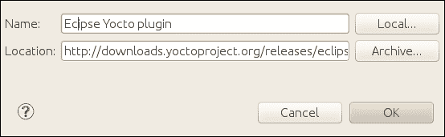

1.  选择**Yocto 项目 ADT 插件**并忽略未签名的内容警告。我们不会覆盖其他插件扩展。

## 如何操作...

要配置 Eclipse 使用 Yocto 工具链，请转到 **窗口** | **首选项** | **Yocto 项目 ADT**。

ADT 配置提供了两种交叉编译器选项：

1.  **独立预构建工具链**：当你通过工具链安装程序或 ADT 安装程序安装了工具链时，请选择此项。

1.  **基于构建系统的工具链**：当使用之前提到的通过 `meta-ide-support` 准备的 Yocto `build` 目录时，请选择此项。

它还提供了两个目标选项：

1.  **QEMU 模拟器**：如果你使用的是虚拟化机器上的 Poky，并且已经使用 ADT 安装程序安装了 `qemuarm` Linux 内核和根文件系统，请选择此项。

1.  **外部硬件**：如果你使用的是像 `wandboard-quad` 这样的真实硬件，请选择此选项。此选项对于嵌入式开发最为有用。

使用 ADT 安装程序及其默认配置时的示例配置是选择独立预构建的工具链选项，并配合 QEMU 模拟器，如下所示：

+   交叉编译器选项：

    +   独立预构建的工具链：

        **工具链根位置**：`/opt/poky/1.7.1`

        **Sysroot 位置**：`${HOME}/test-yocto/qemuarm`

        **目标架构**：`armv5te-poky-linux-gnueabi`

    +   目标选项：

        **QEMU 内核**：`/tmp/adt-installer/download_image/zImage-qemuarm.bin`

    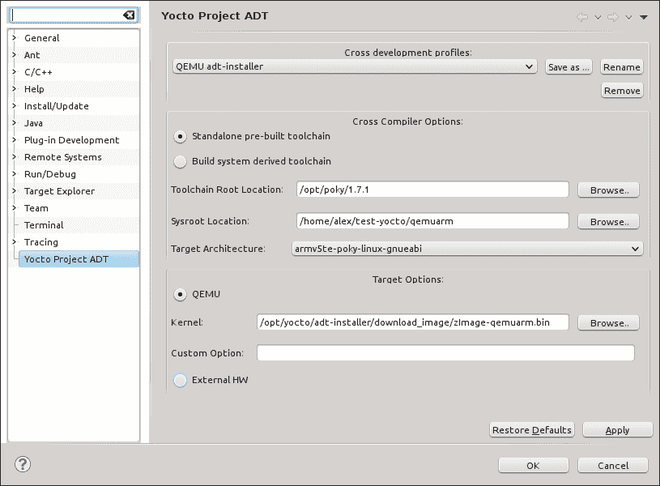

对于使用 `wandboard-quad` 参考板的基于构建系统的工具链，你将需要以下内容：

+   交叉编译器选项：

    +   基于构建系统的工具链：

        **工具链根位置**：`/opt/yocto/fsl-community-bsp/wandboard-quad`

        **Sysroot 位置**：`/opt/yocto/fsl-community-bsp/wandboard-quad/tmp/sysroots/wandboard-quad`

    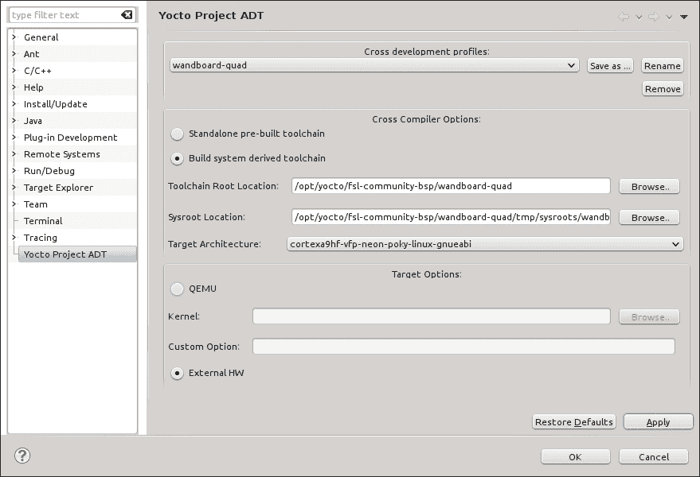

## 还有更多...

为了在远程目标上进行调试，目标需要运行 `tcf-agent` 守护进程。它默认包含在 SDK 镜像中，但你也可以通过在 `conf/local.conf` 文件中添加以下内容将其包含到其他镜像中：

```
EXTRA_IMAGE_FEATURES += "eclipse-debug"
```

## 另见

+   更多信息，请参阅 *Yocto 项目应用程序开发者指南*，网址：[`www.yoctoproject.org/docs/1.7.1/adt-manual/adt-manual.html`](http://www.yoctoproject.org/docs/1.7.1/adt-manual/adt-manual.html)

# 开发 GTK+ 应用程序

本教程将展示如何使用 Eclipse IDE 构建、运行和调试图形化 GTK+ 应用程序。

## 准备工作

1.  如下所示，将 `eclipse-debug` 功能添加到项目的 `conf/local.conf` 文件中：

    ```
    EXTRA_IMAGE_FEATURES += "eclipse-debug"
    ```

1.  如下所示，构建一个 `core-image-sato` 目标镜像：

    ```
    $ cd /opt/yocto/fsl-community-bsp/
    $ source setup-environment wandboard-quad
    $ bitbake core-image-sato

    ```

1.  如下所示构建一个 `core-image-sato` 工具链：

    ```
    $ bitbake -c populate_sdk core-image-sato

    ```

1.  如下所示安装工具链：

    ```
    $ cd tmp/deploy/sdk
    $ ./poky-glibc-x86_64-core-image-sato-cortexa9hf-vfp-neon- toolchain-1.7.1.sh

    ```

在启动 Eclipse IDE 之前，我们可以检查是否能够手动构建并启动一个 GTK 应用程序。我们将构建以下 GTK+ Hello World 应用程序：

以下是 `gtk_hello_world.c` 的代码：

```
#include <gtk/gtk.h>

int main(int argc, char *argv[])
{
  GtkWidget *window;
  gtk_init (&argc, &argv);
  window = gtk_window_new (GTK_WINDOW_TOPLEVEL);
  gtk_widget_show (window);
  gtk_main ();
  return 0;
}
```

要构建它，我们使用之前描述的安装好的 `core-image-sato` 工具链：

```
$ source /opt/poky/1.7.1/environment-setup-cortexa9hf-vfp-neon-poky- linux-gnueabi
$ ${CC} gtk_hello_world.c -o helloworld `pkg-config --cflags --libs gtk+-2.0`

```

该命令使用 `pkg-config` 辅助工具读取与 GTK 库一起安装在 `sysroot` 中的 `.pc` 文件，以确定编译使用 GTK 的程序所需的编译器选项（`--cflags` 用于 `include` 目录，`--libs` 用于要链接的库）。

我们可以手动将生成的二进制文件复制到 Wandboard，并在通过 NFS 启动 `core-image-sato` 时，从目标控制台运行：

```
# DISPLAY=:0 helloworld

```

这将打开一个 GTK+ 窗口，显示在 SATO 桌面上。

## 如何操作...

我们现在可以使用前面描述的独立工具链配置 Eclipse ADT 插件，或者我们也可以决定使用派生自构建系统的工具链。

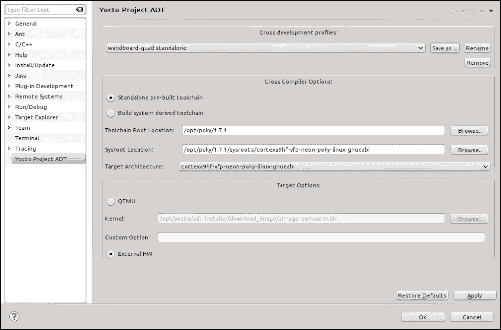

按照以下步骤构建并运行一个示例 Hello World 应用程序：

1.  创建一个新的 Hello World GTK Autotools 项目。在项目创建向导中接受所有默认选项。浏览到 **文件** | **新建** | **项目** | **C/C++** | **C 项目** | **Yocto 项目 ADT Autotools 项目** | **Hello World GTK C Autotools 项目**。

    ### 提示

    在为项目命名时，请避免使用破折号等特殊字符，因为它们可能会导致构建工具出现问题。

1.  通过访问 **项目** | **构建项目** 来构建项目。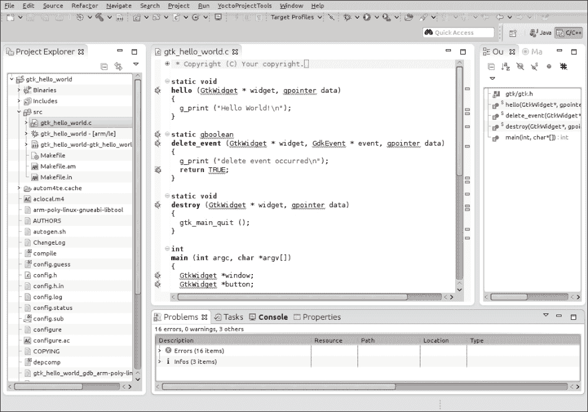

1.  即使项目成功构建，您也可能会看到源代码和 **问题** 标签中标记的错误。这是因为 Eclipse 的代码分析功能无法解析项目的所有符号。为了解决这个问题，您需要通过以下路径将所需的 `include` 头文件添加到项目属性中：**项目** | **属性** | **C/C++ 常规** | **路径和符号** | **包含**。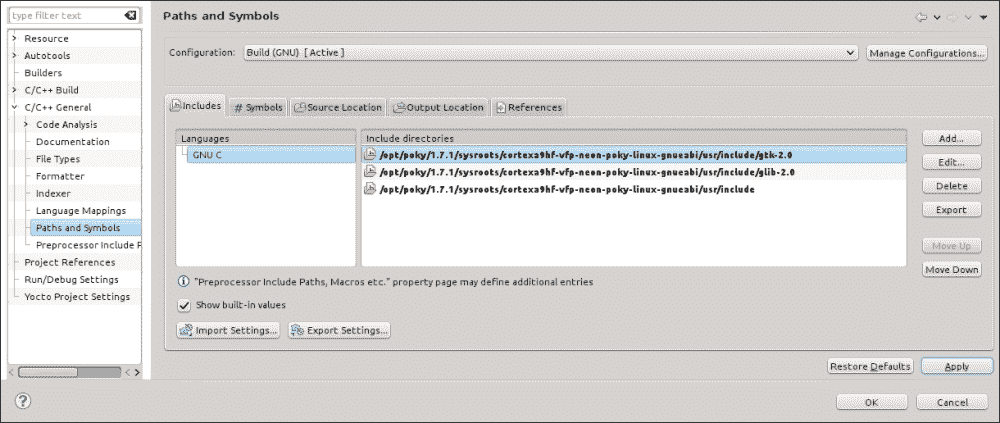

1.  在**运行** | **运行配置**下，你应该有一个名为`<project_name>_gdb_arm-poky-linux-gnueabi`的**C/C++远程应用程序**与 TCF 目标。如果没有，创建一个。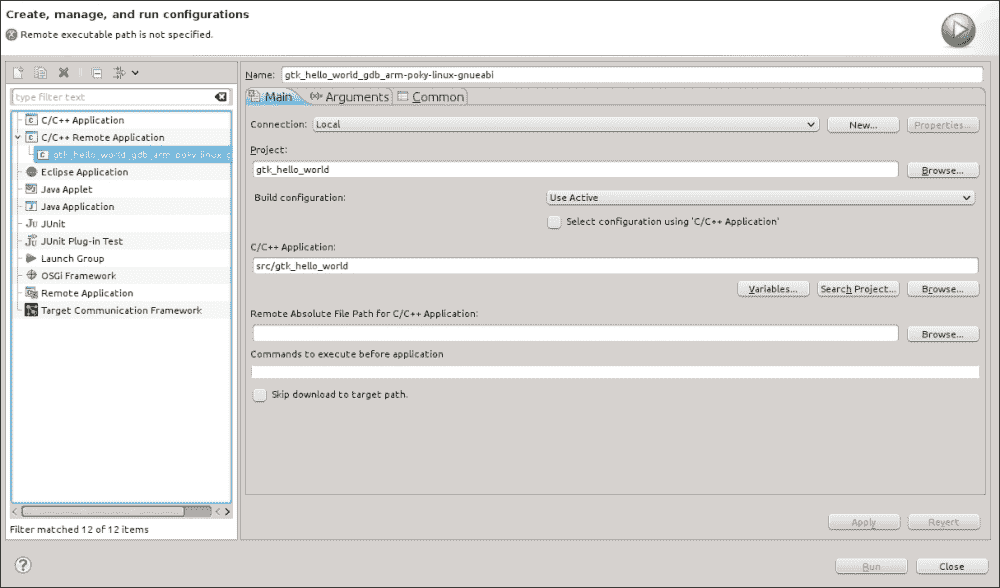

1.  使用**新建...**按钮在**主**选项卡中创建一个到目标 IP 地址的新 TCF 连接。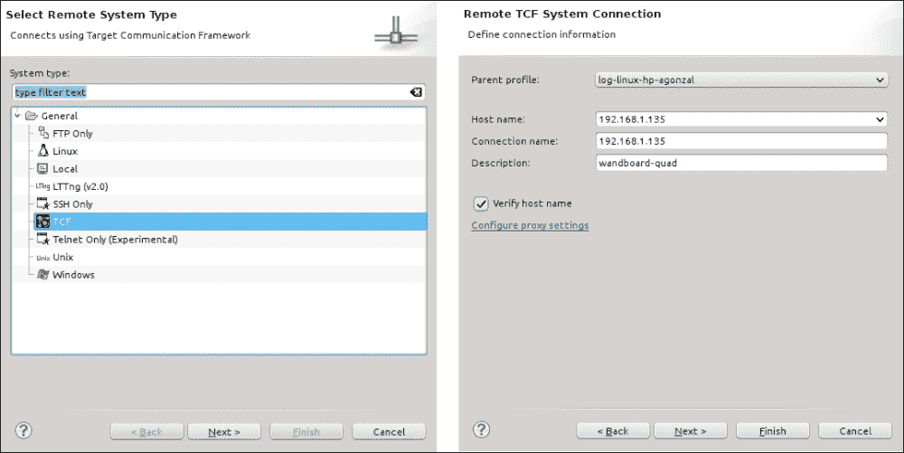

1.  在**C/C++应用程序的远程绝对文件路径**字段中填写二进制文件的路径，并包括二进制文件名；例如，`/gtk_hello_world`。

1.  在**应用程序执行前的命令**字段中，输入`export DISPLAY=:0`。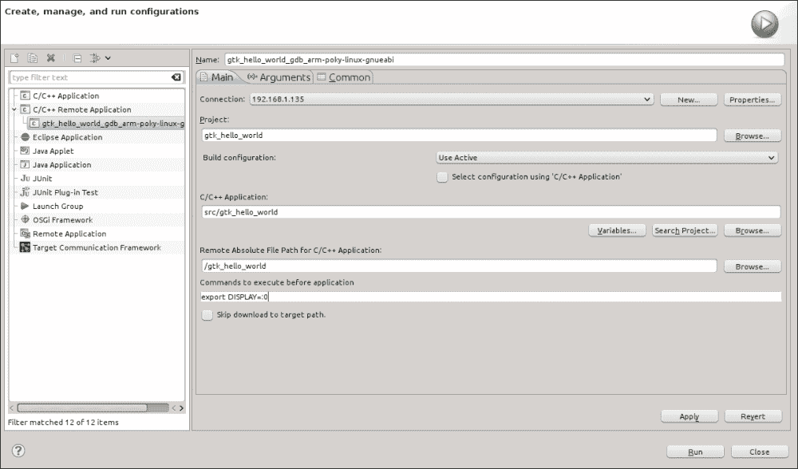

1.  运行应用程序并以`root`用户登录，密码为空。你应该能够在 SATO 桌面上看到 GTK 应用程序，并在控制台标签中看到以下输出：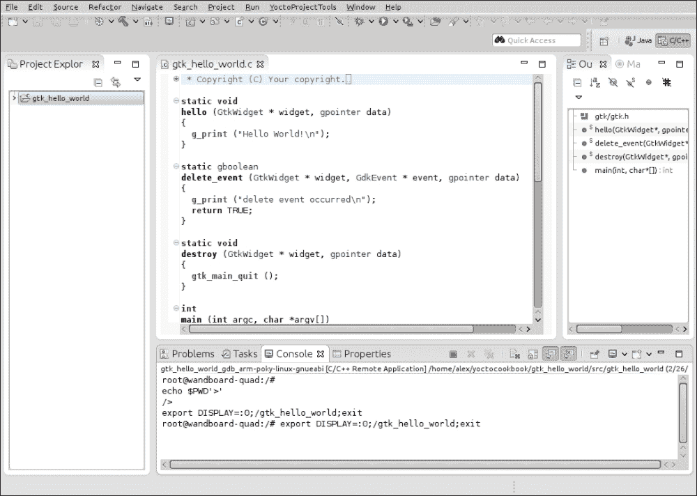

### 提示

如果你在连接目标时遇到问题，可以通过在目标的控制台输入以下命令来验证它是否正在运行` tcf-agent`：

```
# ps w | grep tcf
735 root     11428 S    /usr/sbin/tcf-agent -d -L- -l0

```

如果你遇到登录问题，可以使用 Eclipse 的**远程系统资源管理器**（**RSE**）视图来清除密码并调试与目标的连接。一旦能够建立连接，并且通过 RSE 浏览目标的文件系统，你可以返回到运行配置。

## 还有更多...

要调试应用程序，请按照以下步骤进行：

1.  进入**运行** | **调试配置**。

1.  在**调试器**标签下，验证 GDB 调试器路径是否指向正确的工具链调试器位置。

    ```
    /opt/poky/1.7.1/sysroots/x86_64-pokysdk-linux/usr/bin/arm- poky-linux-gnueabi/arm-poky-linux-gnueabi-gdb

    ```

    如果没有，指向正确的位置。

    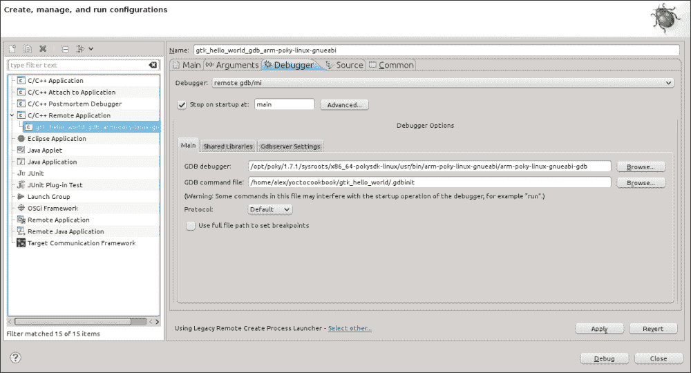

1.  双击源文件中的`main`函数以添加断点。侧边栏将显示一个蓝点。

1.  点击**调试**按钮，调试视图出现，并且应用程序在远程 Wandboard 硬件上执行。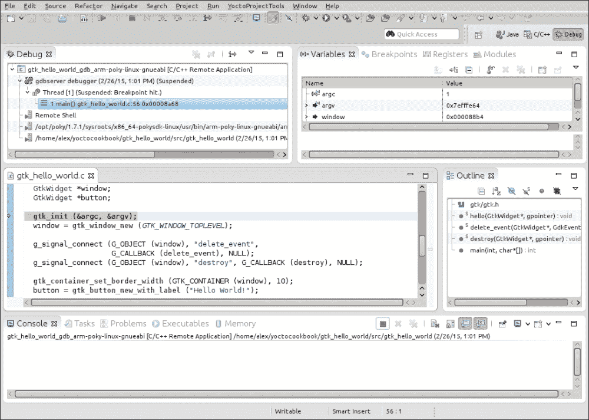

    ### 提示

    如果遇到**文本文件正忙**错误，请记得关闭我们在前一点运行的应用程序。

# 使用 Qt Creator IDE

Qt Creator 是一个多平台的 IDE，属于 Qt 应用程序开发框架 SDK 的一部分。它是 Qt 应用程序开发的首选 IDE，并提供多种许可证，包括 GPLv3、LGPLv2 和商业许可证。

## 准备就绪

1.  从 Qt 项目下载网站下载并安装适合你主机的 Qt Creator 3.3.0 版本。对于 x86_64 Linux 主机的下载和安装，你可以使用以下命令：

    ```
    $ wget http://download.qt.io/official_releases/qtcreator/3.3/3.3.0/qt -creator-opensource-linux-x86_64-3.3.0.run
    $ chmod u+x qt-creator-opensource-linux-x86_64-3.3.0.run
    $ ./qt-creator-opensource-linux-x86_64-3.3.0.run

    ```

1.  构建一个准备好开发 Qt 应用程序的工具链，使用以下命令：

    ```
    $ cd /opt/yocto/fsl-community-bsp/
    $ source setup-environment wandboard-quad
    $ bitbake meta-toolchain-qt

    ```

1.  按以下方式安装：

    ```
    $ cd tmp/deploy/sdk
    $ ./poky-glibc-x86_64-meta-toolchain-qt-cortexa9hf-vfp-neon- toolchain-qt-1.7.1.sh

    ```

## 如何操作...

在启动 Qt Creator 之前，我们需要设置开发环境。为了在启动 Qt Creator 时自动完成这一过程，我们可以通过在`bin/qtcreator.sh`文件的开头添加以下行来修补其初始化脚本：

```
source /opt/poky/1.7.1/environment-setup-cortexa9hf-vfp-neon-poky- linux-gnueabi
#! /bin/sh

```

### 注意

请注意，环境初始化脚本位于哈希标记之前。

现在我们可以按照以下方式运行 Qt Creator：

```
$ ./bin/qtcreator.sh &

```

并通过转到**工具** | **选项**并按照以下步骤进行配置：

1.  首先，我们为我们的 Wandboard 配置一个新设备。在**设备** | **添加**下，选择**通用 Linux 设备**。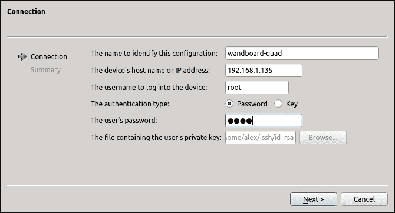

    通过在目标的根控制台使用`passwd`命令设置根密码，并将其输入密码字段。

1.  在**构建与运行**下，我们配置一个新的编译器，指向我们刚刚安装的 Yocto `meta-toolchain-qt`编译器路径。下面的截图显示了该路径：

    ```
    /opt/poky/1.7.1/sysroots/x86_64-pokysdk-linux/usr/bin/arm- poky-linux-gnueabi/arm-poky-linux-gnueabi-g++

    ```

    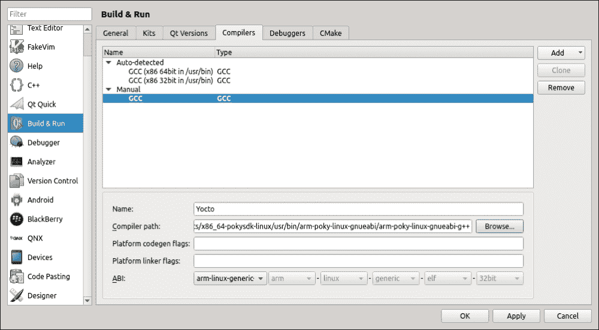

1.  对于交叉调试器，下面是路径，截图中也提到过：

    ```
    /opt/poky/1.7.1/sysroots/x86_64-pokysdk-linux/usr/bin/arm- poky-linux-gnueabi/arm-poky-linux-gnueabi-gdb

    ```

    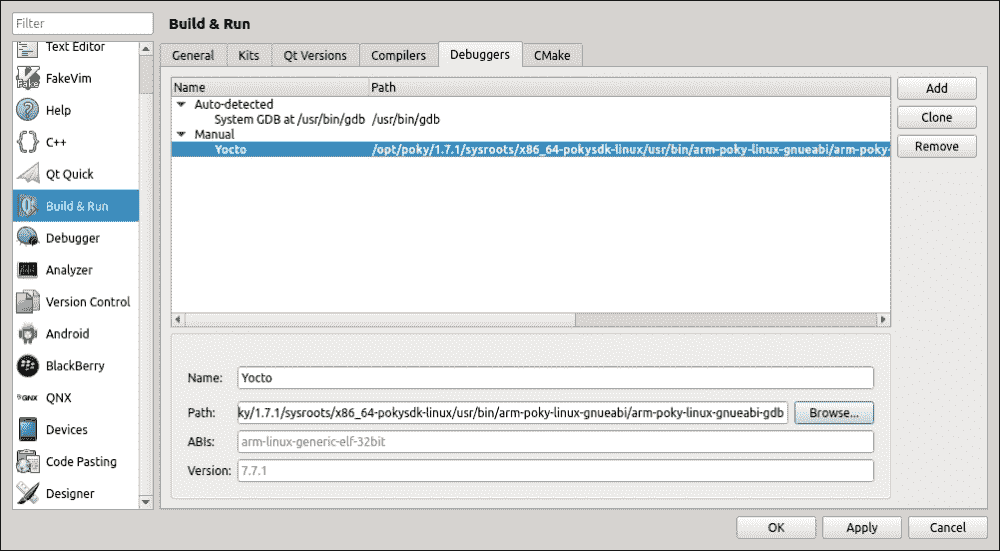

1.  然后我们通过从工具链中选择`qmake`构建器来配置 Qt。以下是该路径，截图中也提到过：

    ```
    /opt/poky/1.7.1/sysroots/x86_64-pokysdk-linux/usr/bin/qmake

    ```

    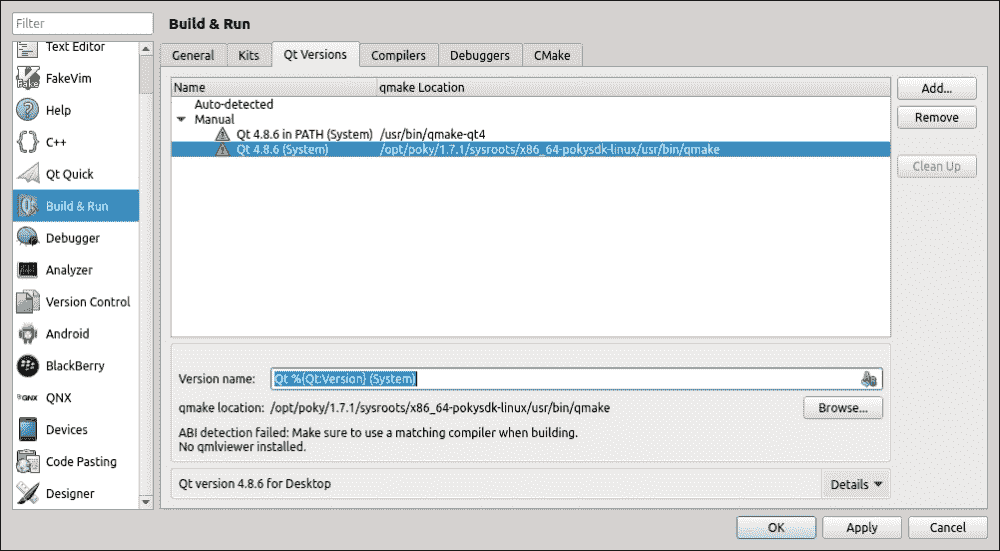

1.  最后，我们按照以下步骤配置一个新的开发套件：

    1.  选择**通用 Linux 设备**并将其`sysroot`配置为：

        ```
        /opt/poky/1.7.1/sysroots/cortexa9hf-vfp-neon-poky-linux- gnueabi/

        ```

    1.  选择我们刚刚定义的编译器、调试器和 Qt 版本。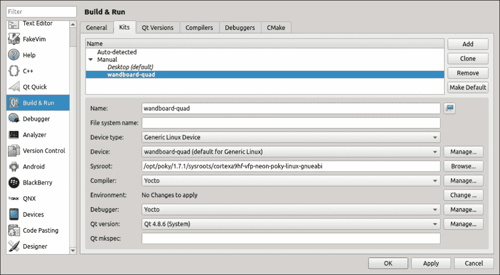

        ### 提示

        在 Ubuntu 中，Qt Creator 将其配置存储在用户的主目录下的`.config/QtProject/`目录中。

# 开发 Qt 应用程序

本教程将展示如何使用 Qt Creator 构建、运行和调试一个图形化的 Qt 应用程序。

## 准备就绪

在启动 Qt Creator 之前，我们检查是否能够手动构建并启动一个 Qt 应用程序。我们将构建一个 Qt hello world 应用程序。

这里是`qt_hello_world.cpp`的代码：

```
#include <QApplication>
#include <QPushButton>

 int main(int argc, char *argv[])
 {
     QApplication app(argc, argv);

     QPushButton hello("Hello world!");

     hello.show();
     return app.exec();
 }
```

要构建它，我们使用之前描述的`meta-toolchain-qt`：

```
$ source /opt/poky/1.7.1/environment-setup-cortexa9hf-vfp-neon-poky- linux-gnueabi
$ qmake -project
$ qmake
$ make

```

这使用`qmake`来创建一个项目文件和一个`Makefile`文件，包含文件夹中的所有相关代码文件。

为了运行它，我们首先需要构建一个支持 Qt 的文件系统。我们首先按照以下步骤准备环境：

```
$ cd /opt/yocto/fsl-community-bsp/
$ source setup-environment wandboard-quad

```

然后我们通过在`conf/local.conf`中添加以下内容来配置我们的项目，启用`qt4-pkgs`额外功能：

```
EXTRA_IMAGE_FEATURES += "qt4-pkgs"
```

对于 Qt 应用程序，我们还需要**国际化组件 Unicode**（**ICU**）库，因为 Qt 库是以支持该库进行编译的。

```
IMAGE_INSTALL_append = " icu"
```

然后通过以下命令构建：

```
$ bitbake core-image-sato

```

完成后，我们可以编程 microSD 卡镜像并启动 Wandboard。将`qt_hello_world`二进制文件复制到目标设备并运行：

```
# DISPLAY=:0 qt_hello_world

```

你应该能在 X11 桌面上看到 Qt hello world 窗口。

## 如何操作...

按照这些步骤构建并运行一个示例 hello world 应用程序：

1.  通过转到**文件** | **新建文件或项目** | **其他项目** | **空 qmake 项目**来创建一个新的空项目。

1.  仅选择我们刚创建的**wandboard-quad**开发板套件。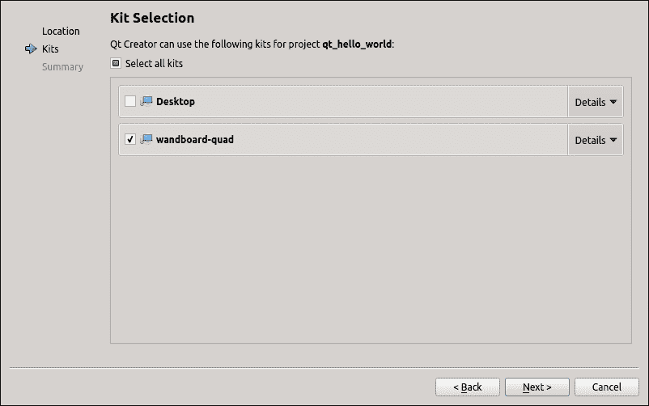

1.  通过转到**文件** | **新建文件或项目** | **C++** | **C++源文件**，添加一个新的 C++文件，`qt_hello_world.cpp`。

1.  将`qt_hello_world.cpp`文件的内容粘贴到 Qt Creator 中，如下图所示：

1.  通过将以下内容添加到 `hw.pro` 文件中，配置你的项目与目标安装的详细信息：

    ```
    SOURCES += \
       qt_hello_world.cpp

    TARGET =  qt_hello_world
       target.files =  qt_hello_world
       target.path = /

    INSTALLS += target
    ```

    将 `qt_hello_world` 替换为你的项目名称。

1.  构建项目。如果遇到构建错误，检查 Yocto 构建环境是否正确设置。

    ### 提示

    在启动 Qt Creator 之前，你可以尝试手动运行工具链的 `environment-setup` 脚本。

1.  转到 **项目** | **运行**，检查你的项目设置。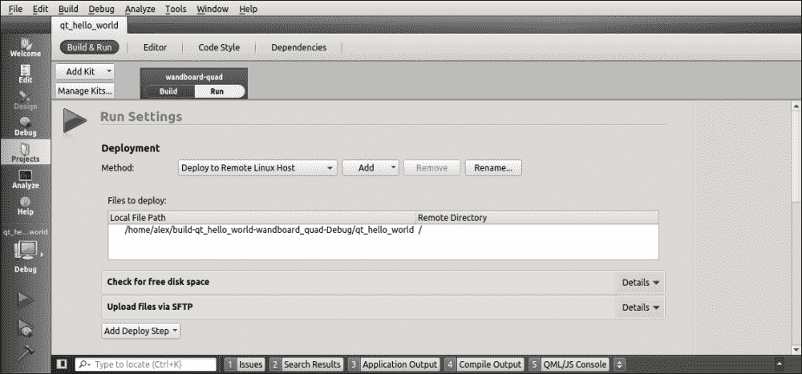

1.  如屏幕截图所示，Qt Creator 将使用 SFTP 协议将文件传输到目标设备。默认情况下，`core-image-sato` 上运行的 dropbear SSH 服务器不支持 SFTP。我们需要通过将 `openssh-sftp-server` 软件包添加到项目的 `conf/local.conf` 文件中，将其添加到镜像中，以使 Qt Creator 能够正常工作。

    ```
    IMAGE_INSTALL_append =  " openssh-sftp-server"
    ```

    然而，我们还需要其他工具，例如 **gdbserver**，如果我们希望调试我们的应用程序，那么添加 `eclipse-debug` 功能会更方便，它将把所有需要的应用程序添加到目标镜像中。

    ```
    EXTRA_IMAGE_FEATURES += "eclipse-debug"
    ```

1.  现在，你可以运行项目了。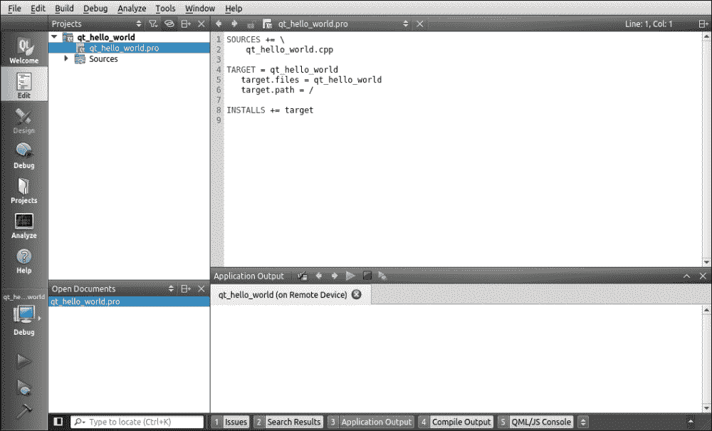

    ### 提示

    如果应用程序在部署时出现登录错误，检查是否已按照之前的配方在目标设备中设置了 root 密码，或者是否正在使用 SSH 密钥认证。

现在，你应该能看到示例 Qt hello world 应用程序在你的 SATO 桌面上运行。

## 还有更多...

为了调试应用程序，可以在源代码上设置断点并点击 **调试** 按钮。

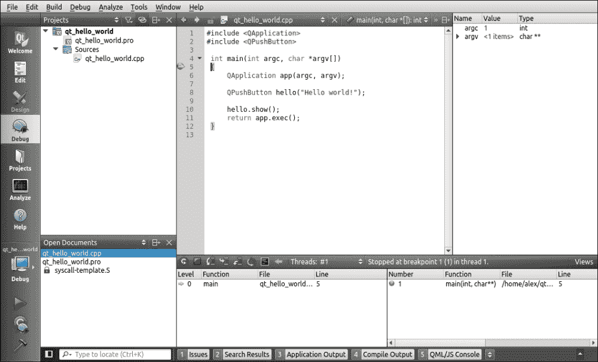

# 描述应用程序开发的工作流

应用程序开发的工作流类似于我们之前在第二章，*BSP 层*，看到的 U-Boot 和 Linux 内核的工作流。

## 如何操作...

我们将看到以下开发工作流是如何应用于应用程序开发的：

+   外部开发

+   工作目录开发

+   外部源开发

## 它是如何工作的...

### 外部开发

这就是我们在之前通过命令行使用独立工具链构建时，看到的配方中的使用方式，也适用于使用 Eclipse 和 Qt Creator IDE 时的情况。该工作流会生成需要单独复制到硬件上才能运行和调试的二进制文件。它可以与其他工作流结合使用。

### 工作目录开发

当应用程序通过 Yocto 构建系统构建时，我们使用这个工作流来调试偶发性问题。然而，它并不是长期开发的推荐工作流。但请注意，它通常是调试第三方软件包时的第一步。

我们将使用在第三章，*软件层*，中的 *添加新软件包* 配方中看到的 `helloworld_1.0.bb` 自定义配方 `meta-custom/recipes-example/helloworld/helloworld_1.0.bb` 作为示例。

```
DESCRIPTION = "Simple helloworld application"
SECTION = "examples"
LICENSE = "MIT"
LIC_FILES_CHKSUM = "file://${COMMON_LICENSE_DIR}/MIT;md5=0835ade698e0bcf8506ecda2f7b4 f302"

SRC_URI = "file://helloworld.c"

S = "${WORKDIR}"

do_compile() {
             ${CC} helloworld.c -o helloworld
}

do_install() {
             install -d ${D}${bindir}
             install -m 0755 helloworld ${D}${bindir}
}
```

这里，`helloworld.c` 源文件如下：

```
#include <stdio.h>

int main(void)
{
   return printf("Hello World");
}
```

工作流步骤如下：

1.  从头开始启动软件包编译。

    ```
    $ cd /opt/yocto/fsl-community-bsp/
    $ source setup-environment wandboard-quad
    $ bitbake -c cleanall helloworld

    ```

    这将删除软件包的构建文件夹、共享状态缓存和下载的软件包源。

1.  启动开发环境：

    ```
    $ bitbake -c devshell helloworld

    ```

    这将获取、解压并修补`helloworld`源代码，并启动一个新的 shell，环境已准备好进行编译。新 shell 将切换到软件包的`build`目录。

1.  根据`SRC_URI`变量，软件包的`build`目录可能已经受版本控制。如果没有（如本示例所示），我们将按如下方式创建一个本地 Git 版本库：

    ```
    $ git init
    $ git add helloworld.c
    $ git commit -s -m "Original revision"

    ```

1.  执行我们需要的修改；例如，将`helloworld.c`更改为如下内容，以打印`Howdy world`：

    ```
    #include <stdio.h>

    int main(void)
    {
     return printf("Howdy World");
    }

    ```

1.  退出`devshell`并构建软件包，而不删除我们的修改。

    ```
    $ bitbake -C compile helloworld

    ```

    ### 提示

    注意大写的`C`（它触发编译任务），以及所有跟随它的任务。

1.  在硬件上测试您的更改，方法是复制生成的软件包并安装它。因为您只修改了一个软件包，其他依赖项应该已经安装在运行中的根文件系统中。运行以下命令：

    ```
    $ bitbake -e helloworld | grep ^WORKDIR=
    WORKDIR="/opt/yocto/fsl-community-bsp/wandboard- quad/tmp/work/cortexa9hf-vfp-neon-poky-linux- gnueabi/helloworld/1.0-r0"
    $ scp ${WORKDIR_PATH}/deploy-rpms/deploy- rpms/cortexa9hf_vfp_neon/helloworld-1.0- r0.cortexa9hf_vfp_neon.rpm root@<target_ip_address>:/
    $ rpm -i /helloworld-1.0-r0.cortexa9hf_vfp_neon.rpm

    ```

    这假设目标的根文件系统已通过`package-management`功能构建，并且在使用`rm_work`类时，`helloworld`软件包已添加到`RM_WORK_EXCLUDE`变量中。

1.  返回`devshell`并将更改提交到本地 Git 版本库，如下所示：

    ```
    $ bitbake -c devshell helloworld
    $ git add  helloworld.c
    $ git commit -s -m "Change greeting message"

    ```

1.  生成补丁到配方的补丁目录中：

    ```
    $ git format-patch -1 -o /opt/yocto/fsl-community- bsp/sources/meta-custom/recipes- example/helloworld/helloworld-1.0

    ```

1.  最后，将补丁添加到配方的`SRC_URI`变量中，如下所示：

    ```
    SRC_URI  =  "file://helloworld.c \
               file://0001-Change-greeting-message.patch"
    ```

### 外部源开发

这种工作流建议在将应用程序集成到 Yocto 构建系统后用于开发工作。例如，可以与使用 IDE 进行的外部开发结合使用。

在我们之前看到的示例配方中，源文件与元数据一起放置在`meta-custom`层中。

更常见的是让配方直接从版本控制系统（如 Git）中获取，因此我们将修改`meta-custom/recipes-example/helloworld/helloworld_1.0.bb`文件，以从 Git 目录中获取，如下所示：

```
DESCRIPTION = "Simple helloworld application"
SECTION = "examples"
LICENSE = "MIT"
LIC_FILES_CHKSUM = "file://${COMMON_LICENSE_DIR}/MIT;md5=0835ade698e0bcf8506ecda2f7b4 f302"

SRC_URI = "git://github.com/yoctocookbook/helloworld"

S = "${WORKDIR}/git"

do_compile() {
             ${CC} helloworld.c -o helloworld
}

do_install() {
             install -d ${D}${bindir}
             install -m 0755 helloworld ${D}${bindir}
}
```

然后我们可以将其克隆到本地目录，如下所示：

```
$ cd /opt/yocto/
$ git clone git://github.com/yoctocookbook/helloworld

```

使用本地版本控制库是使用远程版本控制库的替代方法。为此，请按照以下步骤操作：

1.  创建一个本地 Git 版本库，用于存放源代码：

    ```
    $ mkdir -p /opt/yocto/helloworld
    $ cd /opt/yocto/helloworld
    $ git init

    ```

1.  将我们的`helloworld.c`文件复制到这里，并将其添加到版本库中：

    ```
    $ git add helloworld.c

    ```

1.  最后，使用签名和消息提交：

    ```
    $ git commit -s -m "Original revision"

    ```

无论如何，我们都将版本控制的源代码放在本地目录中。然后我们将配置我们的`conf/local.conf`文件以从中工作，如下所示：

```
INHERIT += "externalsrc"
EXTERNALSRC_pn-helloworld = "/opt/yocto/helloworld"
EXTERNALSRC_BUILD_pn-helloworld = "/opt/yocto/helloworld"
```

然后使用以下命令进行构建：

```
$ cd /opt/yocto/fsl-community-bsp/
$ source setup-environment wandboard-quad
$ bitbake helloworld

```

然后我们可以直接在本地文件夹中工作，而无需担心 BitBake 意外删除我们的代码。开发完成后，`conf/local.conf`的修改将被删除，配方将从其原始`SRC_URI`位置获取源代码。

# 使用 GNU make 工作

GNU make 是 Linux 系统上的一种 make 实现。它被许多开源项目使用，包括 Linux 内核。构建由`Makefile`管理，`Makefile`指示 make 如何构建源代码。

## 如何操作...

Yocto 配方继承`base.bbclass`，因此它们的默认行为是查找`Makefile`、`makefile`或`GNU Makefile`并使用 GNU make 来构建软件包。

如果你的软件包已经包含`Makefile`，那么你只需要关注需要传递给 make 的参数。make 的参数可以通过`EXTRA_OEMAKE`变量传递，且需要提供一个调用`oe_runmake`安装的`do_install`重写，否则将执行空安装。

例如，`logrotate`配方基于一个`Makefile`，如下所示：

```
SUMMARY = "Rotates, compresses, removes and mails system log files"
SECTION = "console/utils"
HOMEPAGE = "https://fedorahosted.org/logrotate/"
LICENSE = "GPLv2"

DEPENDS="coreutils popt"

LIC_FILES_CHKSUM = "file://COPYING;md5=18810669f13b87348459e611d31ab760"

SRC_URI = "https://fedorahosted.org/releases/l/o/logrotate/logrotate- ${PV}.tar.gz \"
SRC_URI[md5sum] = "99e08503ef24c3e2e3ff74cc5f3be213"
SRC_URI[sha256sum] = "f6ba691f40e30e640efa2752c1f9499a3f9738257660994de70a45fe00d12b64"

EXTRA_OEMAKE = ""

do_install(){
    oe_runmake install DESTDIR=${D} PREFIX=${D} MANDIR=${mandir}
    mkdir -p ${D}${sysconfdir}/logrotate.d
    mkdir -p ${D}${sysconfdir}/cron.daily
    mkdir -p ${D}${localstatedir}/lib
    install -p -m 644 examples/logrotate-default ${D}${sysconfdir}/logrotate.conf
    install -p -m 755 examples/logrotate.cron ${D}${sysconfdir}/cron.daily/logrotate
    touch ${D}${localstatedir}/lib/logrotate.status
}
```

## 另见

+   了解更多关于 GNU make 的信息，请访问[`www.gnu.org/software/make/manual/`](https://www.gnu.org/software/make/manual/)

# 与 GNU 构建系统的合作

当你总是在相同系统上构建和运行软件时，`Makefile`是一个不错的解决方案，前提是已知`glibc`、`gcc`版本以及可用的库版本。然而，大多数软件需要在不同系统上构建和运行。

## 准备工作

GNU 构建系统或`autotools`是一组工具，旨在为你的软件创建适用于各种系统的`Makefile`。它由三个主要工具组成：

+   `autoconf`：解析`configure.ac`文件的内容，该文件描述了要构建的源代码，并生成一个`configure`脚本。然后，这个脚本将用于生成最终的`Makefile`。

+   `automake`：用于解析`Makefile.am`文件的内容，并将其转换为`Makefile.in`文件。然后，早先生成的`configure`脚本将使用该文件来生成`config.status`脚本，自动执行该脚本以获得最终的`Makefile`。

+   `libtools`：用于管理静态和动态库的创建。

## 如何操作...

Yocto 构建系统包含了构建`autotools`软件包所需的类。你的配方只需要继承`autotools`类，并配置要传递给`configure`脚本的参数，这些参数存储在`EXTRA_OECONF`变量中。通常，`autotools`系统知道如何安装软件，因此你不需要重写`do_install`。

有许多开源项目使用`autotools`作为构建系统。

一个示例，`meta-custom/recipes-example/hello/hello_2.9.bb`，不需要任何额外的配置选项，如下所示：

```
DESCRIPTION = "GNU helloworld autotools recipe"
SECTION = "examples"

LICENSE = "GPLv3"
LIC_FILES_CHKSUM = "file://${COREBASE}/meta/files/common- licenses/GPL-3.0;md5=c79ff39f19dfec6d293b95dea7b07891"

SRC_URI = "${GNU_MIRROR}/hello/hello-${PV}.tar.gz"
SRC_URI[md5sum] = "67607d2616a0faaf5bc94c59dca7c3cb"
SRC_URI[sha256sum] = "ecbb7a2214196c57ff9340aa71458e1559abd38f6d8d169666846935df191ea7"

inherit autotools gettext
```

## 另见

+   了解更多关于 GNU 构建系统的信息，请访问[`www.gnu.org/software/automake/manual/html_node/GNU-Build-System.html`](http://www.gnu.org/software/automake/manual/html_node/GNU-Build-System.html)

# 与 CMake 构建系统的合作

GNU make 系统在你仅为 Linux 系统构建时是一个很棒的工具。然而，一些软件包是跨平台的，需要一种方式来管理不同操作系统上的 `Makefile` 文件。**CMake** 是一个跨平台的构建系统，它不仅可以与 GNU make 配合使用，还可以与微软 Visual Studio 和苹果的 Xcode 配合使用。

## 准备工作

CMake 工具解析每个目录中的 `CMakeLists.txt` 文件，以控制构建过程。以下是编译 hello world 示例的 `CMakeLists.txt` 文件示例：

```
cmake_minimum_required(VERSION 2.8.10)
project(helloworld)
add_executable(helloworld helloworld.c)
install(TARGETS helloworld RUNTIME DESTINATION bin)
```

## 如何实现...

Yocto 构建系统还包含了用于构建 CMake 包的必需类。你的配方只需继承 `cmake` 类并配置传递给 `configure` 脚本的参数，这些参数存储在 `EXTRA_OECMAKE` 变量中。通常，CMake 系统知道如何安装软件，因此你不需要覆盖 `do_install` 任务。

一个示例配方，用于构建 `helloworld.C` 示例应用程序，`meta-custom/recipes-example/helloworld-cmake/helloworld-cmake_1.0.bb`，如下所示：

```
DESCRIPTION = "Simple helloworld cmake application"
SECTION = "examples"
LICENSE = "MIT"
LIC_FILES_CHKSUM = "file://${COMMON_LICENSE_DIR}/MIT;md5=0835ade698e0bcf8506ecda2f7b4 f302"

SRC_URI = "file://CMakeLists.txt \
           file://helloworld.c"
S = "${WORKDIR}"

inherit cmake

EXTRA_OECMAKE = ""
```

## 另见

+   欲了解更多关于 CMake 的信息，请访问 [`www.cmake.org/documentation/`](http://www.cmake.org/documentation/)

# 使用 SCons 构建器

**SCons** 也是一个跨平台的构建系统，使用 Python 编写，配置文件也是用同样的语言编写。它还支持微软 Visual Studio 等其他功能。

## 准备工作

SCons 解析 `SConstruct` 文件，并且默认情况下不会将环境变量传递给构建系统。这是为了避免由于环境差异而引发的构建问题。这对于 Yocto 来说是一个复杂的地方，因为它使用交叉编译工具链设置来配置环境。

SCons 没有定义支持交叉编译的标准方式，因此每个项目都会有所不同。以简单的 hello world 程序为例，我们可以像下面这样从外部环境初始化 `CC` 和 `PATH` 变量：

```
import os
env = Environment(CC = os.environ['CC'],
                  ENV = {'PATH': os.environ['PATH']})
env.Program("helloworld", "helloworld.c")
```

## 如何实现...

Yocto 构建系统还包含了用于构建 SCons 包的必需类。你的配方只需继承 `SCons` 类并配置传递给配置脚本的参数，这些参数存储在 `EXTRA_OESCONS` 变量中。尽管一些使用 `SCons` 的软件包可能会通过 `SCons` 类要求的安装别名处理安装，但你的配方大多需要提供 `do_install` 任务的覆盖。

一个示例配方，用于构建 `helloworld.c` 示例应用程序，`meta-custom/recipes-example/helloworld-scons/helloworld-scons_1.0.bb`，如下所示：

```
DESCRIPTION = "Simple helloworld scons application"
SECTION = "examples"
LICENSE = "MIT"
LIC_FILES_CHKSUM = "file://${COMMON_LICENSE_DIR}/MIT;md5=0835ade698e0bcf8506ecda2f7b4 f302"

SRC_URI = "file://SConstruct \
           file://helloworld.c"

S = "${WORKDIR}"

inherit scons

EXTRA_OESCONS = ""

do_install() {
    install -d ${D}/${bindir}
    install -m 0755 helloworld ${D}${bindir}
}
```

## 另见

+   欲了解更多关于 SCons 的信息，请访问 [`www.scons.org/doc/HTML/scons-user/`](http://www.scons.org/doc/HTML/scons-user/)

# 使用库开发

大多数应用程序使用共享库，这可以节省系统内存和磁盘空间，因为它们在不同的应用程序之间共享。将代码模块化成库还可以更容易地进行版本控制和代码管理。

本教程将解释如何在 Linux 和 Yocto 中处理静态库和共享库。

## 准备工作

按照惯例，库文件以`lib`前缀开头。

基本上有两种库类型：

+   **静态库**（`.a`）：当目标代码被链接并成为应用程序的一部分时

+   **动态库**（`.so`）：在编译时链接，但不包含在应用程序中，因此它们需要在运行时可用。多个应用程序可以共享动态库，从而减少磁盘空间占用。

库文件放置在以下标准根文件系统位置：

+   `/lib`：启动时所需的库文件

+   `/usr/lib`：大多数系统库

+   `/usr/local/lib`：非系统库

动态库遵循运行系统中的某些命名约定，以便多个版本可以共存，因此库可以通过不同的名称引用。以下是一些解释：

+   链接器的名称以`.so`结尾；例如，`libexample.so`。

+   完全限定名或`soname`，是指向库名称的符号链接。例如，`libexample.so.x`，其中`x`是版本号。增加版本号意味着该库与之前的版本不兼容。

+   真正的名称。例如，`libexample.so.x.y[.z]`，其中`x`是主版本号，`y`是次版本号，`z`（可选）是发布号。增加次版本号或发布号将保持兼容性。

在 GNU `glibc`中，启动 ELF 二进制文件时会调用程序加载器`/lib/ld-linux-X`。其中，`X`是版本号，加载器会找到所有需要的共享库。这个过程使用了几个有趣的文件：

+   `/etc/ld.so.conf`：存储加载器搜索的目录

+   `/etc/ld.so.preload`：用于覆盖库文件

`ldconfig`工具读取`ld.so.conf`文件并创建一个缓存文件（`/etc/ld.so.cache`）以提高访问速度。

以下环境变量也可能有帮助：

+   `LD_LIBRARY_PATH`：这是一个冒号分隔的目录列表，用于搜索库文件。它在调试或使用非标准库位置时非常有用。

+   `LD_PRELOAD`：用于覆盖共享库。

### 构建静态库

我们将从两个源文件`hello.c`和`world.c`构建一个静态库`libhelloworld`，并用它来构建一个 Hello World 应用程序。库的源文件如下所示。

以下是`hello.c`文件的代码：

```
char * hello (void)
{
  return "Hello";
}
```

这是`world.c`文件的代码：

```
char * world (void)
{
  return "World";
}
```

构建库时，按照以下步骤操作：

1.  配置构建环境：

    ```
    $ source /opt/poky/1.7.1/environment-setup-cortexa9hf-vfp- neon-poky-linux-gnueabi

    ```

1.  编译并链接库：

    ```
    ${CC} -c hello.c world.c
    ${AR} -cvq libhelloworld.a hello.o world.o

    ```

1.  验证库的内容：

    ```
    ${AR} -t libhelloworld.a

    ```

接下来展示应用程序源代码。

+   对于`helloworld.c`文件，以下是代码：

    ```
    #include <stdio.h>
    int main (void)
    {
      return printf("%s %s\n",hello(),world());
    }
    ```

+   要构建它，我们运行：

    ```
    ${CC} -o helloworld helloworld.c libhelloworld.a

    ```

+   我们可以使用`readelf`检查它链接的库：

    ```
    $ readelf -d helloworld
    Dynamic section at offset 0x534 contains 24 entries:
     Tag        Type                         Name/Value
     0x00000001 (NEEDED)                     Shared library: [libc.so.6]

    ```

### 构建共享动态库

要从相同的源构建动态库，我们可以运行：

```
${CC} -fPIC -g -c hello.c world.c
${CC} -shared -Wl,-soname,libhelloworld.so.1 -o libhelloworld.so.1.0 hello.o world.o

```

我们可以用它来构建我们的`helloworld C`应用程序，具体如下：

```
${CC} helloworld.c libhelloworld.so.1.0 -o helloworld

```

再次，我们可以使用`readelf`检查动态库，如下所示：

```
$ readelf -d helloworld
Dynamic section at offset 0x6ec contains 25 entries:
 Tag        Type                         Name/Value
 0x00000001 (NEEDED)                     Shared library: [libhelloworld.so.1]
 0x00000001 (NEEDED)                     Shared library: [libc.so.6]

```

## 如何操作...

以下是我们刚才看到的静态库示例的配方，`meta-custom/recipes-example/libhelloworld-static/libhelloworldstatic_1.0.bb`：

```
DESCRIPTION = "Simple helloworld example static library"
SECTION = "libs"
LICENSE = "MIT"
LIC_FILES_CHKSUM = "file://${COMMON_LICENSE_DIR}/MIT;md5=0835ade698e0bcf8506ecda2f7b4 f302"

SRC_URI = "file://hello.c \
           file://world.c \
           file://helloworld.pc"
S = "${WORKDIR}"

do_compile() {
        ${CC} -c hello.c world.c
        ${AR} -cvq libhelloworld.a hello.o world.o
}

do_install() {
        install -d ${D}${libdir}
        install -m 0755 libhelloworld.a ${D}${libdir}
}
```

默认情况下，`meta/conf/bitbake.conf`中的配置将所有静态库放入`-staticdev`包中。它也被放置在`sysroot`中，以便可以使用。

对于动态库，我们将使用以下配方，`meta-custom/recipes-example/libhelloworld-dyn/libhelloworlddyn_1.0.bb`：

```
meta-custom/recipes-example/libhelloworld-dyn/libhelloworlddyn_1.0.bb
DESCRIPTION = "Simple helloworld example dynamic library"
SECTION = "libs"
LICENSE = "MIT"
LIC_FILES_CHKSUM = "file://${COMMON_LICENSE_DIR}/MIT;md5=0835ade698e0bcf8506ecda2f7b4 f302"

SRC_URI = "file://hello.c \
           file://world.c \
           file://helloworld.pc"

S = "${WORKDIR}"

do_compile() {
       ${CC} -fPIC -g -c hello.c world.c
       ${CC} -shared -Wl,-soname,libhelloworld.so.1 -o libhelloworld.so.1.0 hello.o world.o
}

do_install() {
       install -d ${D}${libdir}
       install -m 0755 libhelloworld.so.1.0 ${D}${libdir}
       ln -s libhelloworld.so.1.0 ${D}/${libdir}/libhelloworld.so.1
       ln -s libhelloworld.so.1 ${D}/${libdir}/libhelloworld.so
}
```

通常我们会在`RDEPENDS`变量中列出库的依赖项（如果有的话），但这并不总是必要的，因为构建系统会通过检查库文件和`pkg-config`文件自动执行一些依赖检查，并将其发现的依赖项自动添加到`RDEPENDS`中。

同一库的多个版本可以在运行系统中共存。为此，您需要提供具有相同包名但不同包修订版的不同配方。例如，我们将有`libhelloworld-1.0.bb`和`libhelloworld-1.1.bb`。

为了使用静态库构建应用程序，我们将创建一个配方`meta-custom/recipes-example/helloworld-static/helloworldstatic_1.0.bb`，如下所示：

```
DESCRIPTION = "Simple helloworld example"
SECTION = "examples"
LICENSE = "MIT"
LIC_FILES_CHKSUM = "file://${COMMON_LICENSE_DIR}/MIT;md5=0835ade698e0bcf8506ecda2f7b4 f302"

DEPENDS = "libhelloworld-static"

SRC_URI = "file://helloworld.c"

S = "${WORKDIR}"

do_compile() {
        ${CC} -o helloworld helloworld.c ${STAGING_LIBDIR}/libhelloworld.a
}

do_install() {
        install -d ${D}${bindir}
        install -m 0755 helloworld ${D}${bindir}
}
```

若要使用动态库进行构建，我们只需要在`meta-custom/recipes-example/helloworld-shared/helloworldshared_1.0.bb`中更改配方，改为`meta-custom/recipes-example/helloworld-shared/helloworldshared_1.0.bb`：

```
meta-custom/recipes-example/helloworld-shared/helloworldshared_1.0.bb
DESCRIPTION = "Simple helloworld example"
SECTION = "examples"
LICENSE = "MIT"
LIC_FILES_CHKSUM = "file://${COMMON_LICENSE_DIR}/MIT;md5=0835ade698e0bcf8506ecda2f7b4 f302"

DEPENDS = "libhelloworld-dyn"

SRC_URI = "file://helloworld.c"

S = "${WORKDIR}"

do_compile() {
        ${CC} -o helloworld helloworld.c -lhelloworld
}

do_install() {
        install -d ${D}${bindir}
        install -m 0755 helloworld ${D}${bindir}
}
```

## 如何工作...

库应该提供使用它们所需的信息，如`include`头文件和`library`依赖项。Yocto 项目为库提供构建设置提供了两种方式：

+   `binconfig`类。这是一个遗留类，用于那些提供`-config`脚本来提供构建设置的库。

+   `pkgconfig`类。这是库提供构建设置的推荐方法。

一个`pkg-config`构建设置文件具有`.pc`后缀，随库一起分发，并安装在`pkg-config`工具已知的常见位置。

动态库的`helloworld.pc`文件如下所示：

```
prefix=/usr/local
exec_prefix=${prefix}
includedir=${prefix}/include
libdir=${exec_prefix}/lib

Name: helloworld
Description: The helloworld library
Version: 1.0.0
Cflags: -I${includedir}/helloworld
Libs: -L${libdir} -lhelloworld
```

然而，对于静态库，我们需要将最后一行更改为：

```
Libs: -L${libdir} libhelloworld.a
```

一个想要使用这个`.pc`文件的包将继承`pkgconfig`类。

## 还有更多...

对于既构建库又构建可执行文件但不希望它们一起安装的包，提供了相应的解决方案。通过继承`lib_package`类，包将创建一个独立的`-bin`包来包含可执行文件。

## 另请参见

+   更多关于`pkg-config`的详细信息可以在[`www.freedesktop.org/wiki/Software/pkg-config/`](http://www.freedesktop.org/wiki/Software/pkg-config/)找到。

# 与 Linux 帧缓冲区一起工作

Linux 内核提供了一个图形硬件抽象层，以帧缓冲设备的形式呈现。它们允许应用程序通过一个明确定义的 API 访问图形硬件。帧缓冲区还被用来为 Linux 内核提供一个图形控制台，例如，它可以显示颜色和徽标。

在本食谱中，我们将探讨应用程序如何使用 Linux 帧缓冲区来显示图形和视频。

## 准备工作

一些应用程序，特别是在嵌入式设备中，能够通过映射内存并直接访问帧缓冲区来访问它。例如，`gstreamer`框架能够直接在帧缓冲区上工作，Qt 图形框架也是如此。

Qt 是一个跨平台的应用程序框架，使用 C++编写，由 Digia 公司（以 Qt 公司名义）和开源 Qt 项目社区共同开发。

对于 Qt 应用程序，Poky 提供了`qt4e-demo-image`，而 FSL 社区 BSP 提供了`qte-in-use-image`，这两个镜像都包括对 Qt4 扩展在帧缓冲区上的支持。提供的框架还包括硬件加速支持——不仅支持视频，还支持通过 OpenGL 和 OpenVG API 提供的 2D 和 3D 图形加速。

## 如何操作...

要编译我们之前在*开发 Qt 应用程序*食谱中看到的 Qt Hello World 应用程序，我们可以使用以下`meta-custom/recipes-qt/qt-helloworld/qt-helloworld_1.0.bb` Yocto 食谱：

```
DESCRIPTION = "Simple QT helloworld example"
SECTION = "examples"
LICENSE = "MIT"
LIC_FILES_CHKSUM = "file://${COMMON_LICENSE_DIR}/MIT;md5=0835ade698e0bcf8506ecda2f7b4 f302"

RDEPENDS_${PN} += "icu"

SRC_URI = "file://qt_hello_world.cpp \
           file://qt_hello_world.pro"

S = "${WORKDIR}"

inherit qt4e

do_install() {
         install -d ${D}${bindir}
         install -m 0755 qt_hello_world ${D}${bindir}
}
```

这里是`meta-custom/recipes-qt/qt-helloworld/qt-helloworld-1.0/qt_hello_world.cpp`源文件：

```
#include <QApplication>
#include <QPushButton>

 int main(int argc, char *argv[])
 {
     QApplication app(argc, argv);

     QPushButton hello("Hello world!");

     hello.show();
     return app.exec();
 }
```

另外，`meta-custom/recipes-qt/qt-helloworld/qt-helloworld-1.0/qt_hello_world.pro`项目文件如下：

```
SOURCES += \
   qt_hello_world.cpp
```

然后我们通过在项目的`conf/local.conf`文件中使用以下内容将其添加到镜像中：

```
IMAGE_INSTALL_append = " qt-helloworld"
```

然后我们使用以下命令构建镜像：

```
$ bitbake qt4e-demo-image

```

然后我们可以将 SD 卡镜像编程，启动它，登录到 Wandboard，并通过运行以下命令启动应用程序：

```
# qt_hello_world -qws

```

运行服务器应用程序时需要`-qws`命令行选项。

## 它是如何工作的...

帧缓冲设备位于`/dev`目录下。默认的帧缓冲设备是`/dev/fb0`，如果图形硬件提供多个帧缓冲设备，它们将按顺序编号。

默认情况下，Wandboard 启动时会有两个帧缓冲设备，`fb0`和`fb1`。第一个是默认的视频显示，第二个是叠加平面，可用于在显示器上组合内容。

然而，i.MX6 SoC 支持最多四个显示器，因此它除了两个叠加帧缓冲区外，还可以有最多四个帧缓冲设备。

你可以通过`FRAMEBUFFER`环境变量更改应用程序使用的默认帧缓冲区。例如，如果你的硬件支持多个帧缓冲区，你可以通过运行以下命令使用第二个帧缓冲区：

```
# export FRAMEBUFFER=/dev/fb1

```

帧缓冲设备是内存映射的，你可以在它们上执行文件操作。例如，你可以通过运行以下命令清除屏幕内容：

```
# cat /dev/zero > /dev/fb0

```

或者使用以下命令复制它：

```
# cat /dev/fb0 > fb.raw

```

你甚至可以通过以下命令恢复内容：

```
# cat fb.raw > /dev/fb0

```

用户空间程序也可以通过 `ioctls` 查询帧缓冲区或以编程方式修改其配置，或者通过控制台使用 `fbset` 应用程序，这个程序包含在 Yocto 的核心镜像中，作为 BusyBox 小程序。

```
# fbset -fb /dev/fb0
mode "1920x1080-60"
 # D: 148.500 MHz, H: 67.500 kHz, V: 60.000 Hz
 geometry 1920 1080 1920 1080 24
 timings 6734 148 88 36 4 44 5
 accel false
 rgba 8/16,8/8,8/0,0/0
endmode

```

你可以通过从 U-Boot 引导加载程序传递 `video` 命令行选项到 Linux 内核，来配置帧缓冲 HDMI 设备的特定分辨率、每像素位数和刷新率。具体格式取决于设备的帧缓冲驱动，对于 Wandboard，格式如下：

```
video=mxcfbn:dev=hdmi,<xres>x<yres>M[@rate]
```

其中：

+   `n` 是帧缓冲区的编号

+   `xres` 是水平分辨率

+   `yres` 是垂直分辨率

+   `M` 表示要使用 VESA 协调视频时序来计算时序，而不是从查找表中获取。

+   `rate` 是刷新率

例如，对于 `fb0` 帧缓冲区，你可以使用：

```
video=mxcfb0:dev=hdmi,1920x1080M@60
```

### 提示

请注意，在一段时间的不活动后，虚拟控制台将会消失。要恢复显示，可以使用：

```
# echo 0 > /sys/class/graphics/fb0/blank
```

## 还有更多...

FSL 社区 BSP 层还提供了一个 `fsl-image-multimedia` 目标镜像，包含 `gstreamer` 框架和利用 i.MX6 SoC 内硬件加速特性的插件。此外，还提供了一个 `fsl-image-multimedia-full` 镜像，扩展了对更多 `gstreamer` 插件的支持。

要构建带有帧缓冲区支持的 `fsl-image-multimedia` 镜像，你需要通过将以下内容添加到 `conf/local.conf` 文件来移除图形分发特性：

```
DISTRO_FEATURES_remove = "x11 directfb wayland"
```

然后用以下命令构建镜像：

```
$ bitbake fsl-image-multimedia

```

生成的 `fsl-image-multimedia-wandboard-quad.sdcard` 镜像位于 `tmp/deploy/images`，可以将其写入 microSD 卡并启动。

默认的 Wandboard 设备树定义了一个 `mxcfb1` 节点，如下所示：

```
       mxcfb1: fb@0 {
                compatible = "fsl,mxc_sdc_fb";
                disp_dev = "hdmi";
                interface_pix_fmt = "RGB24";
                mode_str ="1920x1080M@60";
                default_bpp = <24>;
                int_clk = <0>;
                late_init = <0>;
        };
```

因此，连接一个 1920x1080 的 HDMI 显示器应该会显示一个带有 Poky 登录提示符的虚拟终端。

然后，我们可以使用 `gstreamer` 命令行工具 `gst-launch` 来构建 `gstreamer` 管道。例如，要在帧缓冲区上查看硬件加速的视频，你可以下载 Big Bunny 预告片的全高清文件，并通过 `gstreamer` 框架的 `gst-launch` 命令行工具播放该视频，命令如下：

```
# cd /home/root
# wget http://video.blendertestbuilds.de/download.blender.org/peach/trailer_ 1080p.mov
# gst-launch playbin2 uri=file:///home/root/trailer_1080p.mov

```

视频将使用 Freescale 的 `h.264` 视频解码插件 `vpudec`，它利用 i.MX6 SoC 中的硬件视频处理单元来解码 `h.264` 视频。

你可以通过运行以下命令来查看可用的 i.MX6 特定插件列表：

```
# gst-inspect | grep imx
h264.imx:  mfw_h264decoder: h264 video decoder
audiopeq.imx:  mfw_audio_pp: audio post equalizer
aiur.imx: webm: webm
aiur.imx:  aiurdemux: aiur universal demuxer
mpeg2dec.imx:  mfw_mpeg2decoder: mpeg2 video decoder
tvsrc.imx:  tvsrc: v4l2 based tv src
ipucsc.imx:  mfw_ipucsc: IPU-based video converter
mpeg4dec.imx:  mfw_mpeg4aspdecoder: mpeg4 video decoder
vpu.imx:  vpudec: VPU-based video decoder
vpu.imx:  vpuenc: VPU-based video encoder
mp3enc.imx:  mfw_mp3encoder: mp3 audio encoder
beep.imx: ac3: ac3
beep.imx: 3ca: ac3
beep.imx:  beepdec: beep audio decoder
beep.imx:  beepdec.vorbis: Vorbis decoder
beep.imx:  beepdec.mp3: MP3 decoder
beep.imx:  beepdec.aac: AAC LC decoder
isink.imx:  mfw_isink: IPU-based video sink
v4lsink.imx:  mfw_v4lsink: v4l2 video sink
v4lsrc.imx:  mfw_v4lsrc: v4l2 based camera src
amrdec.imx:  mfw_amrdecoder: amr audio decoder

```

## 参见

+   帧缓冲 API 已在 Linux 内核文档中记录，地址为 [`www.kernel.org/doc/Documentation/fb/api.txt`](https://www.kernel.org/doc/Documentation/fb/api.txt)

+   有关 Qt for Embedded Linux 的更多信息，请参见 [`qt-project.org/doc/qt-4.8/qt-embedded-linux.html`](http://qt-project.org/doc/qt-4.8/qt-embedded-linux.html)

+   关于 gstreamer 0.10 框架的文档可以在 [`www.freedesktop.org/software/gstreamer-sdk/data/docs/2012.5/gstreamer-0.10/`](http://www.freedesktop.org/software/gstreamer-sdk/data/docs/2012.5/gstreamer-0.10/) 中找到

# 使用 X Windows 系统

X Windows 系统为 GUI 环境提供了框架——例如在显示器上绘制和移动窗口，以及与鼠标、键盘和触摸屏等输入设备进行交互。其协议版本已经有二十多年历史，因此也被称为 X11。

## 准备工作

X Windows 系统的参考实现是**X.Org**服务器，发布采用 MIT 等宽松许可协议。它使用客户端/服务器模型，服务器与多个客户端程序进行通信，处理用户输入并接受图形输出。X11 协议具有网络透明性，意味着客户端和服务器可以运行在不同的机器上，拥有不同的架构和操作系统。然而，大多数情况下，它们都运行在同一台机器上，并通过本地套接字进行通信。

X11 中未定义用户界面规范（如按钮或菜单样式），这将由其他窗口管理器应用程序定义，这些窗口管理器通常是桌面环境的一部分，如 Gnome 或 KDE。

X11 具有输入和视频驱动程序来处理硬件。例如，它有一个帧缓冲驱动程序`fbdev`，可以输出到非加速的 Linux 帧缓冲区；还有`evdev`，一个通用的 Linux 输入设备驱动程序，支持鼠标、键盘、平板和触摸屏。

X11 Windows 系统的设计使其对嵌入式设备来说较为繁重，尽管像四核 i.MX6 这样强大的设备使用时没有问题，许多嵌入式设备还是选择其他图形替代方案。然而，许多图形应用程序，主要来自桌面环境，仍然运行在 X11 Windows 系统上。

FSL 社区的 BSP 层为 i.MX6 SoC 提供了一个硬件加速的 X 视频驱动程序`xf86-video-imxfb-vivante`，该驱动程序包含在基于 X11 的`core-image-sato`目标镜像和其他图形镜像中。

X 服务器通过`/etc/X11/xorg.conf`文件进行配置，该文件将加速设备配置如下：

```
Section "Device"
    Identifier  "i.MX Accelerated Framebuffer Device"
    Driver      "vivante"
    Option      "fbdev"     "/dev/fb0"
    Option      "vivante_fbdev" "/dev/fb0"
    Option      "HWcursor"  "false"
EndSection
```

图形加速由 i.MX6 SoC 中包含的 Vivante GPU 提供。

不建议进行低级 X11 开发，推荐使用 GTK+和 Qt 等工具包。我们将看到如何将这两种类型的图形应用程序集成到我们的 Yocto 目标镜像中。

## 如何做……

SATO 是基于**Gnome Mobile and Embedded**（**GMAE**）的 Poky 发行版的默认视觉样式。它是一个基于 GTK+的桌面环境，使用 matchbox-window-manager。其特点是一次只显示一个全屏窗口。

要构建我们之前介绍的 GTK Hello World 应用程序`meta-custom/recipes-graphics/gtk-helloworld/gtk-helloworld-1.0/gtk_hello_world.c`，可以按照如下方式进行：

```
#include <gtk/gtk.h>

int main(int argc, char *argv[])
{
    GtkWidget *window;
    gtk_init (&argc, &argv);
    window = gtk_window_new (GTK_WINDOW_TOPLEVEL);
    gtk_widget_show (window);
    gtk_main ();
    return 0;
}
```

我们可以使用以下`meta-custom/recipes-graphics/gtk-helloworld/gtk-helloworld_1.0.bb`配方：

```
DESCRIPTION = "Simple GTK helloworld application"
SECTION = "examples"
LICENSE = "MIT"
LIC_FILES_CHKSUM = "file://${COMMON_LICENSE_DIR}/MIT;md5=0835ade698e0bcf8506ecda2f7b4 f302"

SRC_URI = "file://gtk_hello_world.c"

S = "${WORKDIR}"

DEPENDS = "gtk+"

inherit pkgconfig

do_compile() {
    ${CC} gtk_hello_world.c -o helloworld `pkg-config --cflags -- libs gtk+-2.0`
}

do_install() {
    install -d ${D}${bindir}
    install -m 0755 helloworld ${D}${bindir}
}
```

然后，我们可以通过以下命令将该软件包添加到`core-image-sato`镜像中：

```
IMAGE_INSTALL_append = " gtk-helloworld"
```

我们可以通过以下命令从串口终端构建、编程并运行应用程序：

```
# export DISPLAY=:0
# helloworld

```

## 还有更多……

Qt 框架也支持加速图形输出，可以直接在帧缓冲区上实现（就像我们之前看到的`qt4e-demo-image`目标中那样），或者使用`core-image-sato`中提供的 X11 服务器。

要在前一个示例中介绍的 Qt hello world 源码上构建 X11，我们可以使用以下 Yocto 配方`meta-custom/recipes-qt/qtx11-helloworld/qtx11-helloworld_1.0.bb`：

```
DESCRIPTION = "Simple QT over X11 helloworld example"
SECTION = "examples"
LICENSE = "MIT"
LIC_FILES_CHKSUM = "file://${COMMON_LICENSE_DIR}/MIT;md5=0835ade698e0bcf8506ecda2f7b4 f302"

RDEPENDS_${PN} += "icu"

SRC_URI = "file://qt_hello_world.cpp \
           file://qt_hello_world.pro"

S = "${WORKDIR}"

inherit qt4x11

do_install() {
         install -d ${D}${bindir}
         install -m 0755 qt_hello_world ${D}${bindir}
}
```

然后我们还需要将 Qt4 框架添加到目标图像以及应用程序。

```
EXTRA_IMAGE_FEATURES += "qt4-pkgs"
IMAGE_INSTALL_append = " qtx11-helloworld"
```

然后我们可以使用以下命令构建`core-image-sato`：

```
$ bitbake core-image-sato

```

程序和启动我们的目标。然后使用以下命令运行应用程序：

```
# export DISPLAY=:0
# qt_hello_world

```

## 另请参阅

+   更多关于 X.Org 服务器的信息，请访问[`www.x.org`](http://www.x.org)

+   Qt 应用程序框架的文档可以在[`qt-project.org/`](https://qt-project.org/)找到

+   更多关于 GTK+的信息和文档，请访问[`www.gtk.org/`](http://www.gtk.org/)

# 使用 Wayland

Wayland 是一个显示服务器协议，旨在取代 X Window 系统，其采用 MIT 许可证。

本篇将概述 Wayland，包括与 X Window 系统的一些关键区别，并展示如何在 Yocto 中使用它。

## 准备工作

Wayland 协议采用客户端/服务器模型，其中客户端是请求在屏幕上显示像素缓冲区的图形应用程序，服务器或合成器是控制这些缓冲区显示的服务提供者。

Wayland 合成器可以是 Linux 显示服务器、X 应用程序或特殊的 Wayland 客户端。Weston 是 Wayland 项目中的参考合成器。它用 C 语言编写，并与 Linux 内核 API 一起工作。它依赖于`evdev`来处理输入事件。

Wayland 在 Linux 内核中使用**Direct Rendering Manager (DRM)**，不需要像 X 服务器那样的东西。客户端通过自身的渲染库或类似 Qt 或 GTK+的引擎将窗口内容渲染到与合成器共享的缓冲区中。

Wayland 缺乏 X 的网络透明特性，但未来可能会添加类似功能。

它还比 X 具有更好的安全功能，并设计为提供保密性和完整性。Wayland 不允许应用程序查看其他程序的输入、捕获其他输入事件或生成虚假输入事件。它还更好地保护窗口输出。然而，这也意味着它目前无法提供桌面 X 系统中我们习惯的某些功能，如屏幕捕获或辅助功能程序中常见的功能。

比 X.Org 更轻量且更安全，Wayland 更适合在嵌入式系统中使用。如果需要，X.Org 可以作为 Wayland 的客户端以实现向后兼容性。

然而，Wayland 并没有像 X11 那样成熟，而且 Poky 中基于 Wayland 的图像没有像基于 X11 的那些得到那么多社区关注。

## 如何操作...

Poky 提供了一个包含 Weston 合成器的`core-image-weston`镜像。

将我们的 GTK Hello World 示例从*使用 X Windows 系统*的配方修改为使用 GTK3 并用 Weston 运行是直接的。

```
DESCRIPTION = "Simple GTK3 helloworld application"
SECTION = "examples"
LICENSE = "MIT"
LIC_FILES_CHKSUM = "file://${COMMON_LICENSE_DIR}/MIT;md5=0835ade698e0bcf8506ecda2f7b4 f302"

SRC_URI = "file://gtk_hello_world.c"

S = "${WORKDIR}"

DEPENDS = "gtk+3"

inherit pkgconfig

do_compile() {
    ${CC} gtk_hello_world.c -o helloworld `pkg-config --cflags -- libs gtk+-3.0`
}

do_install() {
    install -d ${D}${bindir}
    install -m 0755 helloworld ${D}${bindir}
}
```

为了构建它，配置您的`conf/local.conf`文件，通过如下方式删除`x11`发行版特性：

```
DISTRO_FEATURES_remove = "x11"
```

### 注意

当更改`DISTRO_FEATURES`变量时，您需要从头开始构建，删除`tmp`和`sstate-cache`目录。

使用以下命令将应用程序添加到镜像中：

```
IMAGE_INSTALL_append = " gtk3-helloworld"
```

然后使用以下命令构建镜像：

```
$ cd /opt/yocto/fsl-community-bsp/
$ source setup-environment wandboard-quad
$ bitbake core-image-weston

```

一旦构建完成，您将在`tmp/deploy/images/wandboard-quad`下找到准备好编程的 microSD 卡镜像。

然后，您可以通过运行以下命令启动该应用程序：

```
# export XDG_RUNTIME_DIR=/var/run/user/root
# helloworld

```

## 还有更多内容...

FSL 社区的 BSP 发布版支持在 Wayland 中使用 i.MX6 SoC 中包含的 Vivante GPU 进行硬件加速图形处理。

这意味着像`gstreamer`这样的应用程序在与 Weston 合成器一起运行时，将能够提供硬件加速的输出。

Wayland 支持也可以在像 Clutter 和 GTK3+这样的图形工具包中找到。

## 另见

+   您可以在项目的网页上找到更多关于 Wayland 的信息：[`wayland.freedesktop.org/`](http://wayland.freedesktop.org/)

# 添加 Python 应用程序

在 Yocto 1.7 中，Poky 支持构建 Python 2 和 Python 3 应用程序，并在`meta/recipes-devtools/python`目录中包含了一小套 Python 开发工具。

`meta-python`层中提供了更多种类的 Python 应用程序，该层作为`meta-openembedded`的一部分，您可以将其添加到`conf/bblayers.conf`文件中。

## 准备就绪

打包 Python 模块的标准工具是`distutils`，它同时适用于 Python 2 和 Python 3。Poky 包括`distutils`类（Python 3 中的`distutils3`），用于构建使用`distutils`的 Python 包。`meta-python`中有一个使用`distutils`类的示例配方：`meta-python/recipes-devtools/python/python-pyusb_1.0.0a2.bb`。

```
SUMMARY = "PyUSB provides USB access on the Python language"
HOMEPAGE = "http://pyusb.sourceforge.net/"
SECTION = "devel/python"
LICENSE = "BSD"
LIC_FILES_CHKSUM = "file://LICENSE;md5=a53a9c39efcfb812e2464af14afab013"
DEPENDS = "libusb1"
PR = "r1"

SRC_URI = "\
    ${SOURCEFORGE_MIRROR}/pyusb/${SRCNAME}-${PV}.tar.gz \
"
SRC_URI[md5sum] = "9136b3dc019272c62a5b6d4eb624f89f"
SRC_URI[sha256sum] = "dacbf7d568c0bb09a974d56da66d165351f1ba3c4d5169ab5b734266623e1736"

SRCNAME = "pyusb"
S = "${WORKDIR}/${SRCNAME}-${PV}"

inherit distutils
```

然而，`distutils`不安装包依赖项，不允许卸载包，也不允许安装同一包的多个版本，因此仅推荐用于简单需求。因此，`setuptools`被开发出来以扩展`distutils`。它不包含在标准的 Python 库中，但在 Poky 中是可用的。Poky 中也有一个`setuptools`类（Python 3 中是`setuptools3`），用于构建与`setuptools`一起分发的 Python 包。

## 如何操作...

为了使用`setuptools`构建 Python Hello World 示例应用程序，我们可以使用以下 Yocto `meta-custom/recipes-python/python-helloworld/pythonhelloworld_1.0.bb`配方：

```
DESCRIPTION = "Simple Python setuptools hello world application"
SECTION = "examples"
LICENSE = "MIT"
LIC_FILES_CHKSUM = "file://${COMMON_LICENSE_DIR}/MIT;md5=0835ade698e0bcf8506ecda2f7b4 f302"

SRC_URI = "file://setup.py \
      file://python-helloworld.py \
      file://helloworld/__init__.py \
              file://helloworld/main.py"

S = "${WORKDIR}"

inherit setuptools

do_install_append () {
    install -d ${D}${bindir}
    install -m 0755 python-helloworld.py ${D}${bindir}
}
```

为了创建一个示例的 Hello World 包，我们创建如下截图所示的目录结构：

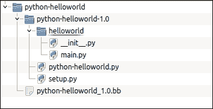

这是相同目录结构的代码：

```
$ mkdir -p meta-custom/recipes-python/python-helloworld/python- helloworld-1.0/helloworld/
$ touch meta-custom/recipes-python/python-helloworld/python- helloworld-1.0/helloworld/__init__.py

```

然后创建以下`meta-custom/recipes-python/python-helloworld/python-helloworld-1.0/setup.py` Python 设置文件：

```
import sys
from setuptools import setup

setup(
    name = "helloworld",
    version = "0.1",
    packages=["helloworld"],
    author="Alex Gonzalez",
    author_email = "alex@example.com",
    description = "Hello World packaging example",
    license = "MIT",
    keywords= "example",
    url = "",
)
```

以及`meta-custom/recipes-python/python-helloworld/python-helloworld-1.0/helloworld/main.py` Python 文件：

```
import sys

def main(argv=None):
    if argv is None:
        argv = sys.argv
    print "Hello world!"
    return 0
```

以及一个`meta-custom/recipes-python/python-helloworld/python-helloworld-1.0/python-helloworld.py`测试脚本，利用该模块：

```
#!/usr/bin/env python
import sys
import helloworld.main

if __name__ == '__main__':
       sys.exit(helloworld.main.main())
```

然后我们可以通过以下命令将其添加到我们的镜像中：

```
IMAGE_INSTALL_append = " python-helloworld"
```

然后使用以下命令构建：

```
$ cd /opt/yocto/fsl-community-bsp/
$ source setup-environment wandboard-quad
$ bitbake core-image-minimal

```

编程并启动后，我们可以通过运行示例脚本来测试该模块：

```
# /usr/bin/python-helloworld.py
Hello world!

```

## 还有更多……

在`meta-python`中，你还可以找到`python-pip`食谱，它会将`pip`工具添加到目标镜像中。`pip`可以用于从**Python 包索引**（**PyPI**）安装软件包。

你可以使用以下命令将其添加到镜像中：

```
IMAGE_INSTALL_append  = " python-pip python-distribute"
```

你需要将`meta-openembedded/meta-python`层添加到`conf/bblayers.conf`文件中，以便构建镜像，还需要`python-distribute`依赖项，它是`python-pip`所必需的。然后，你可以使用以下命令为`core-image-minimal`镜像构建：

```
$ cd /opt/yocto/fsl-community-bsp/
$ source setup-environment wandboard-quad
$ bitbake core-image-minimal

```

安装完成后，你可以按照以下方式从目标设备使用它：

```
# pip search <package_name>
# pip install <package_name>

```

# 集成 Oracle Java 运行时环境

Oracle 提供了两种专门用于嵌入式开发的 Java 版本：

+   **Java SE 嵌入式**：这是标准 Java SE 桌面版的一个大型子集。与标准版本相比，它包含了针对大小和内存使用的优化，以适应中型嵌入式设备的需求。

+   **Java 微型版**（**ME**）：该版本面向无头的低端和中端设备，是 Java SE 的一个子集，符合**连接受限设备配置**（**CLDC**），并为嵌入式市场提供一些额外的功能和工具。Oracle 提供了几个参考实现，但 Java ME 必须从源代码中单独集成到特定平台。

我们将专注于 Java SE 嵌入式，它可以从 Oracle 的下载站点以二进制格式下载。

Java SE 嵌入式是商业授权的，并且在嵌入式部署中需要支付版税。

## 准备就绪

Yocto 有一个`meta-oracle-java`层，旨在帮助集成官方 Oracle **Java 运行时环境**（**JRE**）版本 7。然而，由于 Oracle 的网页需要登录并接受其许可协议，因此无法实现无人干预的安装。

在 Java SE 嵌入式版本 7 中，Oracle 提供了软浮点和硬浮点版本的无头和有头 JRE，用于 ARMv6/v7，以及为 ARMv5 提供的软浮点用户空间的无头版本 JRE。Java SE 嵌入式版本 7 为 ARM Linux 提供了两种不同的**Java 虚拟机**（**JVM**）：

+   一个针对响应性的客户端 JVM

+   一个与客户端 JVM 相同的服务器 JVM，但优化了长时间运行的应用程序

截至本文撰写时，`meta-oracle-java` 层仅有一个针对带客户端 JVM 的无头硬浮动点版本的配方。我们将为最新的 Java 7 SE 嵌入式版本（更新 75）添加配方，涵盖无头和带头部的硬浮动点 JRE，这些版本适用于像 `wandboard-quad` 这样的基于 i.MX6 的板。

## 如何操作...

要安装 Java SE 嵌入式运行时环境，首先需要将 `meta-oracle-java` 层克隆到我们的源目录中，并将其添加到 `conf/bblayers.conf` 文件中，方法如下：

```
$ cd /opt/yocto/fsl-community-bsp/sources
$ git clone git://git.yoctoproject.org/meta-oracle-java

```

然后我们需要通过在 `conf/local.conf` 文件中添加以下内容，明确接受 Oracle Java 许可证：

```
LICENSE_FLAGS_WHITELIST += "oracle_java"
```

我们希望构建最新的更新，因此我们将以下 `meta-custom/recipes-devtools/oracle-java/oracle-jse-ejre-arm-vfphflt-client-headless_1.7.0.bb` 配方添加到我们的 `meta-custom` 层中：

```
SUMMARY = "Oracle Java SE runtime environment binaries"

JDK_JRE = "ejre"
require recipes-devtools/oracle-java/oracle-jse.inc

PV_UPDATE = "75"
BUILD_NUMBER = "13"

LIC_FILES_CHKSUM = "\
       file://${WORKDIR}/${JDK_JRE}${PV}_${PV_UPDATE}/COPYRIGHT;md5=0b204 bd2921accd6ef4a02f9c0001823 \
       file://${WORKDIR}/${JDK_JRE}${PV}_${PV_UPDATE}/THIRDPARTYLICENSERE ADME.txt;md5=f3a388961d24b8b72d412a079a878cdb \
       "

SRC_URI = "http://download.oracle.com/otn/java/ejre/7u${PV_UPDATE}- b${BUILD_NUMBER}/ejre-7u${PV_UPDATE}-fcs-b${BUILD_NUMBER}-linux- arm-vfp-hflt-client_headless-18_dec_2014.tar.gz"
SRC_URI[md5sum] = "759ca6735d77778a573465b1e84b16ec"
SRC_URI[sha256sum] = "ebb6499c62fc12e1471cff7431fec5407ace59477abd0f48347bf6e89c6bff3b"

RPROVIDES_${PN} += "java2-runtime"
```

尝试使用以下命令构建配方：

```
$ bitbake oracle-jse-ejre-arm-vfp-hflt-client-headless

```

你会看到我们遇到了校验和不匹配的错误。这是由于在 Oracle 网站上的许可证接受步骤所致。为了解决这个问题，我们需要手动下载文件到 `downloads` 目录中，路径由我们项目的 `DL_DIR` 配置变量指定。

然后我们可以将 JRE 添加到目标镜像中：

```
IMAGE_INSTALL_append = " oracle-jse-ejre-arm-vfp-hflt-client- headless"
```

然后使用以下命令构建：

```
$ cd /opt/yocto/fsl-community-bsp/
$ source setup-environment wandboard-quad
$ bitbake core-image-minimal

```

现在我们可以登录目标设备并运行它，使用命令：

```
# /usr/bin/java -version
java version "1.7.0_75"
Java(TM) SE Embedded Runtime Environment (build 1.7.0_75-b13, headless)
Java HotSpot(TM) Embedded Client VM (build 24.75-b04, mixed mode)

```

我们还可以使用以下 `meta-custom/recipes-devtools/oracle-java/oracle-jse-ejre-arm-vfphflt-client-headful_1.7.0.bb` 配方构建带头部版本：

```
SUMMARY = "Oracle Java SE runtime environment binaries"

JDK_JRE = "ejre"
require recipes-devtools/oracle-java/oracle-jse.inc

PV_UPDATE = "75"
BUILD_NUMBER = "13"

LIC_FILES_CHKSUM = "\
       file://${WORKDIR}/${JDK_JRE}${PV}_${PV_UPDATE}/COPYRIGHT;md5=0b204 bd2921accd6ef4a02f9c0001823 \
       file://${WORKDIR}/${JDK_JRE}${PV}_${PV_UPDATE}/THIRDPARTYLICENSERE ADME.txt;md5=f3a388961d24b8b72d412a079a878cdb \
       "

SRC_URI = "http://download.oracle.com/otn/java/ejre/7u${PV_UPDATE}- b${BUILD_NUMBER}/ejre-7u${PV_UPDATE}-fcs-b${BUILD_NUMBER}-linux- arm-vfp-hflt-client_headful-18_dec_2014.tar.gz"

SRC_URI[md5sum] = "84dba4ffb47285b18e6382de2991edfc"
SRC_URI[sha256sum] = "5738ffb8ce2582b6d7b39a3cbe16137d205961224899f8380eebe3922bae5c61"

RPROVIDES_${PN} += "java2-runtime"
```

然后使用以下命令将其添加到目标镜像中：

```
IMAGE_INSTALL_append =  " oracle-jse-ejre-arm-vfp-hflt-client- headful"
```

然后使用以下命令构建 `core-image-sato`：

```
$ cd cd /opt/yocto/fsl-community-bsp/
$ source setup-environment wandboard-quad
$ bitbake core-image-sato

```

在这种情况下，报告的 Java 版本是：

```
# /usr/bin/java -version
java version "1.7.0_75"
Java(TM) SE Embedded Runtime Environment (build 1.7.0_75-b13)
Java HotSpot(TM) Embedded Client VM (build 24.75-b04, mixed mode)

```

## 还有更多内容...

截至本文撰写时，最新版本是 Java SE 嵌入式版本 8 更新 33（8u33）。

Oracle 仅提供 JDK 下载，且需要使用一个主机工具 **jrecreate** 来配置并创建适当的 JRE。该工具允许我们在不同的 JVM（最小版、客户端版和服务器版）以及软硬浮动点 ABI、JavaFX 扩展、本地化和 JVM 的其他一些调优选项之间进行选择。

Oracle Java SE 嵌入式版本 8 提供对仅适用于 ARMv7 硬浮动点用户空间的 X11 开发的支持，支持使用 Swing、AWT 和 JavaFX，且包括对 Freescale i.MX6 处理器上 JavaFX（旨在替代 Swing 和 AWT 的图形框架）的支持。

截至本文撰写时，还没有 Yocto 配方可以集成 Java 版本 8。

# 集成开放 Java 开发工具包

Oracle Java SE 嵌入式的开源替代品是 **开放 Java 开发工具包**（**OpenJDK**），它是 Java SE 的开源实现，基于 GPLv2 许可证并附带类路径例外，这意味着应用程序可以链接而不受 GPL 许可证的约束。

这个配方将展示如何使用 Yocto 构建 OpenJDK，并将 JRE 集成到我们的目标镜像中。

## 准备工作

OpenJDK 的主要组件包括：

+   热点 Java 虚拟机

+   **Java 类库**（**JCL**）

+   Java 编译器，**javac**

最初，OpenJDK 需要使用专有的 JDK 进行构建。然而，**IcedTea**项目使我们能够使用 GNU 类库、GNU 的 Java 编译器（GCJ）来构建 OpenJDK，并引导 JDK 来构建 OpenJDK。它还通过补充一些 Java SE 中缺失的组件（如网页浏览器插件和 Web Start 实现）来完善 OpenJDK。

Yocto 可以使用`meta-java`层构建 OpenJDK，其中包括使用 IcedTea 进行交叉编译 OpenJDK 的配方。

你可以从其 Git 仓库下载 OpenJDK，地址为[`git.yoctoproject.org/cgit/cgit.cgi/meta-java/`](http://git.yoctoproject.org/cgit/cgit.cgi/meta-java/)。

开发讨论可以通过访问开发邮件列表[`lists.openembedded.org/mailman/listinfo/openembedded-devel`](http://lists.openembedded.org/mailman/listinfo/openembedded-devel)进行跟踪和参与。

`meta-java`层还包括多种 Java 库和虚拟机的配方，以及应用开发工具，如**ant**和**fastjar**。

## 如何实现...

要构建 OpenJDK 7，你需要按如下方式克隆`meta-java`层：

```
$ cd /opt/yocto/fsl-community-bsp/sources/
$ git clone http://git.yoctoproject.org/cgit/cgit.cgi/meta-java/

```

在写这篇文章时，还没有 1.7 版本的 Dizzy 分支，所以我们将直接使用主分支。

将该层添加到你的`conf/bblayers.conf`文件中：

```
+ ${BSPDIR}/sources/meta-java \
 "
```

然后通过将以下内容添加到你的`conf/local.conf`文件中来配置项目：

```
PREFERRED_PROVIDER_virtual/java-initial = "cacao-initial"
PREFERRED_PROVIDER_virtual/java-native = "jamvm-native"
PREFERRED_PROVIDER_virtual/javac-native = "ecj-bootstrap-native"
PREFERRED_VERSION_openjdk-7-jre = "25b30-2.3.12"
PREFERRED_VERSION_icedtea7-native = "2.1.3"
```

然后你可以通过以下方式将 OpenJDK 包添加到你的镜像中：

```
IMAGE_INSTALL_append = " openjdk-7-jre"
```

并构建你选择的镜像：

```
$ cd /opt/yocto/fsl-community-bsp/
$ source setup-environment wandboard-quad
$ bitbake core-image-sato

```

当你运行目标镜像时，你将看到以下 Java 版本：

```
# java -version
java version "1.7.0_25"
OpenJDK Runtime Environment (IcedTea 2.3.12) (25b30-2.3.12)
OpenJDK Zero VM (build 23.7-b01, mixed mode)

```

## 它是如何工作的...

为了测试 JVM，我们可以在主机上字节编译一个 Java 类并将其复制到目标系统上执行。例如，我们可以使用以下简单的`HelloWorld.java`示例：

```
class HelloWorld {
  public static void main(String[] args) {
    System.out.println("Hello World!");
  }
}
```

为了在主机上进行字节编译，我们需要安装 Java SDK。在 Ubuntu 中安装 Java SDK，只需运行：

```
$ sudo apt-get install openjdk-7-jdk

```

要字节编译示例，我们执行：

```
$ javac HelloWorld.java

```

要运行它，我们将`HelloWorld.class`复制到目标系统，并在同一文件夹中运行：

```
# java HelloWorld

```

## 还有更多...

在生产系统上使用 OpenJDK 时，建议始终使用最新的发布版本，其中包含了错误修复和安全更新。在写这篇文章时，最新的 OpenJDK 7 发布版本是更新 71（jdk7u71b14），可以使用 IcedTea 2.5.3 构建，因此`meta-java`配方应进行更新。

## 另见

+   有关 openJDK 的最新信息可以通过访问[`openjdk.java.net/`](http://openjdk.java.net/)获得。

# 集成 Java 应用程序

`meta-java`层还提供了帮助类，以便简化将 Java 库和应用程序集成到 Yocto 中的过程。在本配方中，我们将看到一个使用提供的类构建 Java 库的示例。

## 准备工作

`meta-java`层提供了两个主要的类，帮助集成 Java 应用程序和库：

+   **Java bbclass**：这提供了默认的目标目录和一些辅助功能，即：

    +   `oe_jarinstall`：这将安装并创建 JAR 文件的符号链接

    +   `oe_makeclasspath`：这是一个根据 JAR 文件名生成类路径字符串的工具。

    +   `oe_java_simple_wrapper`：这是一个将 Java 应用程序封装在 shell 脚本中的工具。

+   **java-library bbclass**：该类继承了 Java 的 bbclass，并扩展其功能以创建和安装 JAR 文件。

## 如何实现……

我们将使用以下的`meta-custom/recipes-java/java-helloworld/java-helloworld-1.0/HelloWorldSwing.java`图形化 Swing Hello World 作为示例：

```
import javax.swing.JFrame;
import javax.swing.JLabel;

public class HelloWorldSwing {
    private static void createAndShowGUI() {
        JFrame frame = new JFrame("Hello World!");
        frame.setDefaultCloseOperation(JFrame.EXIT_ON_CLOSE);

        JLabel label = new JLabel("Hello World!");
        frame.getContentPane().add(label);

        frame.pack();
        frame.setVisible(true);
    }

    public static void main(String[] args) {
        javax.swing.SwingUtilities.invokeLater(new Runnable() {
            public void run() {
                createAndShowGUI();
            }
        });
    }
}
```

要集成这个`HelloWorldSwing`应用程序，我们可以使用一个 Yocto `meta-custom/recipes-java/java-helloworld/java-helloworld_1.0.bb`食谱，如下所示：

```
DESCRIPTION = "Simple Java Swing hello world application"
SECTION = "examples"
LICENSE = "MIT"
LIC_FILES_CHKSUM = "file://${COMMON_LICENSE_DIR}/MIT;md5=0835ade698e0bcf8506ecda2f7b4 f302"

RDEPENDS_${PN} = "java2-runtime"

SRC_URI = "file://HelloWorldSwing.java"

S = "${WORKDIR}"

inherit java-library

do_compile() {
        mkdir -p build
        javac -d build `find . -name "*.java"`
        fastjar cf ${JARFILENAME} -C build .
}

BBCLASSEXTEND = "native"
```

该食谱也可以为主机本地架构构建。我们可以通过提供一个单独的`java-helloworld-native`食谱，该食谱继承`native`类，或者像之前一样使用`BBCLASSEXTEND`变量来实现。在这两种情况下，我们可以使用`_class-native`和`_class-target`覆盖选项，以区分本地和目标功能。

即使 Java 是字节编译的，且编译后的类在两者之间是相同的，但显式地添加本地支持仍然是有意义的。

## 它是如何工作的……

`java-library`类将创建一个名为`lib<package>-java`的库包。

要将其添加到目标镜像中，我们将使用：

```
IMAGE_INSTALL_append = " libjava-helloworld-java"
```

然后我们可以决定是否使用 Oracle JRE 或 OpenJDK 运行应用程序。对于 OpenJDK，我们将向我们的镜像中添加以下软件包：

```
IMAGE_INSTALL_append = " openjdk-7-jre openjdk-7-common"
```

对于 Oracle JRE，我们将使用以下内容：

```
IMAGE_INSTALL_append = " oracle-jse-ejre-arm-vfp-hflt-client- headful"
```

目前可用的 JRE 无法在帧缓冲或 Wayland 上运行，因此我们将使用基于 X11 的图形镜像，如`core-image-sato`：

```
$ cd /opt/yocto/fsl-community-bsp/
$ source setup-environment wandboard-quad
$ bitbake core-image-sato

```

然后我们可以启动目标系统，登录并通过运行以下命令使用 OpenJDK 执行示例：

```
# export DISPLAY=:0
# java -cp /usr/share/java/java-helloworld.jar HelloWorldSwing

```

## 还有更多内容……

在写本文时，从`meta-java`层主分支构建的 OpenJDK 无法运行 X11 应用程序，并将出现以下异常：

```
Exception in thread "main" java.awt.AWTError: Toolkit not found: sun.awt.X11.XToolkit
        at java.awt.Toolkit$2.run(Toolkit.java:875)
        at java.security.AccessController.doPrivileged(Native Method)
        at java.awt.Toolkit.getDefaultToolkit(Toolkit.java:860)
        at java.awt.Toolkit.getEventQueue(Toolkit.java:1730)
        at java.awt.EventQueue.invokeLater(EventQueue.java:1217)
        at javax.swing.SwingUtilities.invokeLater(SwingUtilities.java:1287)
        at HelloWorldSwing.main(HelloWorldSwing.java:17)
```

然而，预编译的 Oracle JRE 能够无问题地运行该应用程序：

```
# export DISPLAY=:0
# /usr/bin/java -cp /usr/share/java/java-helloworld.jar HelloWorldSwing

```

### 注意

如果在使用 Oracle JRE 构建软件包时遇到构建错误，可以尝试使用其他包格式，例如 IPK，通过在`conf/local.conf`配置文件中添加以下内容：

```
PACKAGE_CLASSES = "package_ipk"
```

这是由于`meta-oracle-java`层中的 RPM 包管理器存在依赖问题，具体情况请参见该层的 README 文件。
