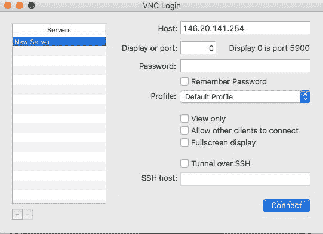
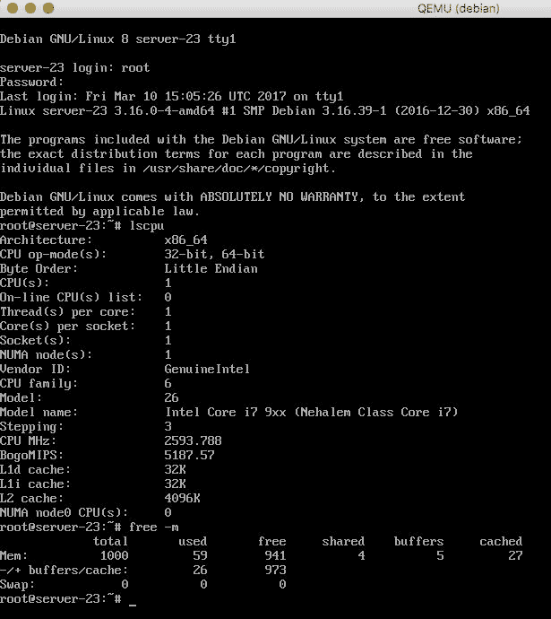

# 开始使用 QEMU 和 KVM

本章将涵盖以下主题：

+   安装和配置 QEMU

+   使用 qemu-img 管理磁盘镜像

+   使用 qemu-nbd 准备 OS 安装的镜像

+   使用 debootstrap 在镜像上安装自定义操作系统

+   调整镜像大小

+   使用预先存在的镜像

+   使用 qemu-system-* 运行虚拟机

+   启动具有 KVM 支持的 QEMU VM

+   通过 VNC 连接到运行中的实例

# 介绍

**快速模拟器**（**QEMU**）是 QEMU/KVM 虚拟化技术套件的主要组成部分。它提供硬件虚拟化和处理器仿真。QEMU 在用户空间运行，在无需内核驱动的情况下仍能提供快速系统仿真。QEMU 支持两种操作模式：

+   完全系统仿真，其中 QEMU 仿真整个计算机系统，包括 CPU 类型和外设

+   用户模式仿真，其中 QEMU 可以在不同 CPU 架构上本地运行已编译的进程

在本书中，我们将专注于使用由 **基于内核的虚拟机**（**KVM**）虚拟化程序提供的硬件加速支持进行完整系统仿真。

在本章中，我们将从在 Linux 上安装 QEMU 开始，然后探讨构建、管理和使用虚拟实例的磁盘镜像的各种示例。接着，我们将深入了解如何在完整系统仿真模式下运行 QEMU，使用提供的二进制文件。我们将看到使用 KVM 内核模块加速 QEMU 进程的示例。最后，我们将详细介绍如何使用 VNC 客户端连接我们之前启动的虚拟机。

# 安装和配置 QEMU

在本教程中，我们将介绍如何使用提供的发行版软件包在单个服务器上安装 QEMU。对于生产环境，我们建议使用预编译的、打包的 QEMU 版本，以便更轻松和一致地部署。但是，我们将看到一个示例，展示如何从源代码编译 QEMU，以备后续可能需要打包的特定版本。

# 准备就绪

根据你的 Linux 发行版，软件包名称和安装命令会有所不同。你可以使用系统的软件包管理器，如 `apt`、`dnf` 或 `yum`，搜索包含 QEMU 字符串的软件包，并了解适用于你特定 Linux 变种的可用选项。可以从官方 QEMU 项目网站下载源代码：[`www.qemu-project.org/download/#source`](http://www.qemu-project.org/download/#source)。

# 如何做到...

执行以下步骤，在 Ubuntu/Debian 和 RHEL/CentOS 发行版上从软件包安装 QEMU：

1.  在 Ubuntu/Debian 发行版中，更新你的软件包索引：

```
root@kvm:~# apt-get update

```

1.  安装软件包：

```
root@kvm:~# apt-get install -y qemu

```

1.  在 CentOS/RHEL 发行版上执行：

```
root@kvm:~# yum install qemu-kvm

```

要从源代码安装，请执行以下操作：

1.  首先下载存档：

```
root@kvm:~#cd /usr/src && wget 
http://download.qemu-project.org/qemu-2.8.0.tar.xz

```

1.  从存档中提取文件：

```
root@kvm:/usr/src# tar xvJf qemu-2.8.0.tar.xz && cd qemu-        2.8.0

```

1.  配置和编译源代码：

```
root@kvm:/usr/src/qemu-2.8.0# ./configure  
root@kvm:/usr/src/qemu-2.8.0# make && make install

```

# 工作原理...

安装 QEMU 非常简单，正如我们刚才看到的。让我们看一下 Ubuntu 上安装的 QEMU 元包是什么样的：

```
root@kvm:~# dpkg --list | grep qemu
ii ipxe-qemu 1.0.0+git-20150424.a25a16d-1ubuntu1 all PXE boot firmware - ROM images for qemu
ii qemu 1:2.5+dfsg-5ubuntu10.8 amd64 fast processor emulator
ii qemu-block-extra:amd64 1:2.5+dfsg-5ubuntu10.8 amd64 extra block backend modules for qemu-system and qemu-utils
ii qemu-slof 20151103+dfsg-1ubuntu1 all Slimline Open Firmware -- QEMU PowerPC version
ii qemu-system 1:2.5+dfsg-5ubuntu10.8 amd64 QEMU full system emulation binaries
ii qemu-system-arm 1:2.5+dfsg-5ubuntu10.8 amd64 QEMU full system emulation binaries (arm)
ii qemu-system-common 1:2.5+dfsg-5ubuntu10.8 amd64 QEMU full system emulation binaries (common files)
ii qemu-system-mips 1:2.5+dfsg-5ubuntu10.8 amd64 QEMU full system emulation binaries (mips)
ii qemu-system-misc 1:2.5+dfsg-5ubuntu10.8 amd64 QEMU full system emulation binaries (miscelaneous)
ii qemu-system-ppc 1:2.5+dfsg-5ubuntu10.8 amd64 QEMU full system emulation binaries (ppc)
ii qemu-system-sparc 1:2.5+dfsg-5ubuntu10.8 amd64 QEMU full system emulation binaries (sparc)
ii qemu-system-x86 1:2.5+dfsg-5ubuntu10.8 amd64 QEMU full system emulation binaries (x86)
ii qemu-user 1:2.5+dfsg-5ubuntu10.8 amd64 QEMU user mode emulation binaries
ii qemu-user-binfmt 1:2.5+dfsg-5ubuntu10.8 amd64 QEMU user mode binfmt registration for qemu-user
ii qemu-utils 1:2.5+dfsg-5ubuntu10.8 amd64 QEMU utilities
root@kvm:~#

```

从前面的输出中，我们可以看到涉及的包并不多。如果你感兴趣，可以阅读每个包的描述，了解每个包提供的功能。

值得一提的是，所有之前提到的包提供的二进制文件都以 QEMU 为前缀。你可以使用 Tab 补全来查看可用的可执行文件列表：

```
root@kvm:~# qemu-
qemu-aarch64 qemu-io qemu-mips64el qemu-ppc64 qemu-sparc32plus qemu-system-lm32 qemu-system-mipsel qemu-system-sh4 qemu-system-xtensa
qemu-alpha qemu-m68k qemu-mipsel qemu-ppc64abi32 qemu-sparc64 qemu-system-m68k qemu-system-moxie qemu-system-sh4eb qemu-system-xtensaeb
qemu-arm qemu-make-debian-root qemu-mipsn32 qemu-ppc64le qemu-system-aarch64 qemu-system-microblaze qemu-system-or32 qemu-system-sparc qemu-tilegx
qemu-armeb qemu-microblaze qemu-mipsn32el qemu-s390x qemu-system-alpha qemu-system-microblazeel qemu-system-ppc qemu-system-sparc64 qemu-unicore32
qemu-cris qemu-microblazeel qemu-nbd qemu-sh4 qemu-system-arm qemu-system-mips qemu-system-ppc64 qemu-system-tricore qemu-x86_64
qemu-i386 qemu-mips qemu-or32 qemu-sh4eb qemu-system-cris qemu-system-mips64 qemu-system-ppc64le qemu-system-unicore32
qemu-img qemu-mips64 qemu-ppc qemu-sparc qemu-system-i386 qemu-system-mips64el qemu-system-ppcemb qemu-system-x86_64
root@kvm:~#

```

我们可以看到，每种 CPU 架构类型都有一个可以仿真的单独可执行文件。

# 使用 qemu-img 管理磁盘镜像

要运行虚拟机，QEMU 需要镜像来存储客机操作系统的文件系统。镜像本身是一种文件类型，表示虚拟磁盘上的客机文件系统。QEMU 支持多种镜像，并提供了创建和管理这些镜像的工具。在本节中，我们将使用 `qemu-img` 工具创建一个空白的磁盘镜像。

# 准备工作

要使用此方法，我们需要安装 `qemu-img` 工具。如果你按照第一步的指示操作，应该已经安装好了。要检查你的 Linux 发行版支持哪些镜像类型，可以运行以下命令：

```
root@kvm:~# qemu-img -h | grep Supported
Supported formats: bochs vvfat rbd vpc parallels tftp ftp ftps raw https qcow dmg http qcow2 quorum null-aio cloop vdi iscsi null-co vhdx blkverify file vmdk host_cdrom blkdebug host_device sheepdog qed nbd
root@kvm:~#

```

从前面的输出中，我们可以看到，在我们使用的测试系统中，有许多受支持的镜像。确保你的 QEMU 版本支持 raw 镜像格式，因为它是默认格式，我们将在本节中使用它。最常用的镜像格式之一是 `qcow2`，它支持写时复制、压缩、加密和快照功能。我们将在后续的教程中使用这个格式。

请注意，尽管 QEMU 支持多种格式，但这并不意味着你可以在它们上运行虚拟机。然而，`qemu-img` 可以用于将不同的镜像转换为 raw 和 `qcow2` 格式。为了获得最佳性能，建议使用 raw 或 `qcow2` 镜像格式。

# 如何操作...

执行以下步骤以创建一个指定大小的空白 raw 镜像，并验证该文件是否已在主机上创建：

1.  创建一个名为 `debian.img`、大小为 10 GB 的 raw 镜像：

```
root@kvm:~# qemu-img create -f raw debian.img 10G    
Formatting 'debian.img', fmt=raw size=10737418240    
root@kvm:~#

```

1.  检查文件是否已创建：

```
root@kvm:~# ls -lah debian.img    
-rw-r--r-- 1 root root 10G Feb 10 16:58 debian.img    
 root@kvm:~#

```

1.  检查文件类型：

```
root@kvm:~# file -s debian.img    
debian.img: data    
root@kvm:~#

```

1.  获取有关镜像的更多信息：

```
root@kvm:~# qemu-img info debian.img
image: debian.img
file format: raw
virtual size: 10G (10737418240 bytes)
disk size: 0
root@kvm:~#

```

# 工作原理...

`qemu-img` 工具允许我们创建、转换和修改客机镜像。

在第 1 步中，我们使用了 `-f` 标志来指定镜像格式；在本例中是 `raw`，以及要创建的镜像名称和大小（以 GB 为单位）。

在第 4 步中，我们使用了 `info` 子命令来获取有关现有镜像的更多信息。注意磁盘大小目前显示为零，这是因为这是一个空白镜像，没有包含文件系统。我们将在下一节中创建文件系统。

# 还有更多内容...

在本节中，我们列出了 QEMU 支持的磁盘镜像格式。以下是你可能会遇到的几种常见格式的简要描述：

+   `raw`：原始磁盘映像格式。这是默认格式，且通常是最快的基于文件的格式。如果你为此映像格式创建一个支持“孔”的文件系统，例如 EXT3，那么只有包含数据的扇区才会占用空间。raw 映像的主要缺点是缺乏特性，使其非常适合用于测试和快速原型开发。

+   `qcow2`：正如我们在上一节提到的，这是功能最丰富的格式之一。它支持虚拟机快照、压缩和加密，但性能略有降低。

+   `qcow`：这是一个较老的 QEMU 映像格式，支持备份文件、紧凑型映像文件、加密和压缩。

+   `dmg`：这是 Mac 磁盘映像格式。Mac 磁盘映像提供了安全的密码保护和压缩，通常用于分发软件，而不是运行虚拟机。

+   `nbd`：网络块设备，通常用于访问远程存储设备。

+   `vdi`：这种磁盘格式由 Oracle VirtualBox 软件使用，可以在各种 CPU 平台上运行虚拟机。

+   `vmdk`：这是 VMware 的磁盘映像格式，其中一个虚拟硬盘可以跨多个文件。

+   `vhdx`：Microsoft Hyper-V 使用这种映像格式。它提供了大容量存储、在断电时的数据损坏保护以及对大磁盘映像的读写优化。

在本书中，我们将使用`raw`和`qcow2`磁盘格式，因为它们提供了最佳的性能和工具集来运行和操作它们。

# 使用 qemu-nbd 准备操作系统安装映像

在前一个配方中，我们创建了一个空白的 raw 映像。在这个配方中，我们将对其进行分区并创建文件系统，为完整的客户操作系统安装做准备。在创建分区和文件系统时，你应考虑虚拟实例可能产生的负载类型。如果虚拟机中运行的应用程序是 IO 密集型的，可能考虑为映像文件系统使用 XFS。对于本配方，我们将使用 EXT4，因为大多数 Linux 发行版默认支持它。

# 准备就绪

对于本配方，我们将使用以下工具：

+   `qemu-nbd`

+   `sfdisk`

+   `nbd`内核模块

+   `mkfs`

大多数 Linux 发行版应该已经安装了相关工具。如果没有，请参考你所使用的发行版文档了解如何安装这些工具。

# 如何操作...

执行下述步骤，分区并在空白映像上创建文件系统：

1.  加载`nbd`内核模块：

```
 root@kvm:~# modprobe nbd
    root@kvm:~#

```

1.  使用`qemu-nbd`工具，将空白映像文件与`/dev/nbd0`块设备关联：

```
root@kvm:~# qemu-nbd --format=raw --connect=/dev/nbd0          debian.img  
root@kvm:~#

```

1.  在块设备上创建两个分区，一个用于交换分区，另一个作为客户操作系统的根分区：

```
root@kvm:~# sfdisk /dev/nbd0 << EOF    
>,1024,82    
>;    
>EOF Checking that no-one is using this disk right now ...
OK
Disk /dev/nbd0: cannot get geometry

Disk /dev/nbd0: 1305 cylinders, 255 heads, 63 sectors/track

sfdisk: ERROR: sector 0 does not have an msdos signature
 /dev/nbd0: unrecognized partition table type
Old situation:
No partitions found
New situation:
Units = cylinders of 8225280 bytes, blocks of 1024 bytes, counting from 0

 Device Boot Start End #cyls #blocks Id System
/dev/nbd0p1 0+ 1023 1024- 8225279+ 82 Linux swap / Solaris
/dev/nbd0p2 1024 1304 281 2257132+ 83 Linux
/dev/nbd0p3 0 - 0 0 0 Empty
/dev/nbd0p4 0 - 0 0 0 Empty
Warning: no primary partition is marked bootable (active)
This does not matter for LILO, but the DOS MBR will not boot this disk.
Successfully wrote the new partition table

Re-reading the partition table ...

If you created or changed a DOS partition, /dev/foo7, say, then use dd(1)
to zero the first 512 bytes: dd if=/dev/zero of=/dev/foo7 bs=512 count=1
(See fdisk(8).)
root@kvm:~#

```

1.  分区后列出可用的块设备：

```
root@kvm:~# ls -la /dev/nbd0*    
brw-rw---- 1 root disk 43, 0 Feb 10 18:24 /dev/nbd0    
brw-rw---- 1 root disk 43, 1 Feb 10 18:24 /dev/nbd0p1    
brw-rw---- 1 root disk 43, 2 Feb 10 18:24 /dev/nbd0p2    
root@kvm:~#

```

1.  创建交换分区：

```
root@kvm:~# mkswap /dev/nbd0p1    
Setting up swapspace version 1, size = 508 KiB (520192 bytes)    
no label, UUID=c246fe39-1bc5-4978-967c-806264771d69    
root@kvm:~#

```

1.  在根分区上创建 EXT4 文件系统：

```
root@kvm:~# mkfs.ext4 /dev/nbd0p2    
mke2fs 1.42.13 (17-May-2015)    
Discarding device blocks: failed - Input/output error    
Creating filesystem with 2620928 4k blocks and 655360 inodes    
Filesystem UUID: 2ffa23de-579a-45ad-abbc-2a179de67f11    
Superblock backups stored on blocks:    
    32768, 98304, 163840, 229376, 294912, 819200, 884736, 1605632    
Allocating group tables: done    
Writing inode tables: done    
Creating journal (32768 blocks): done    
Writing superblocks and filesystem accounting information: done    
root@kvm:~#

```

# 它是如何工作的...

我们利用`nbd`内核模块提供的功能，允许我们使用`qemu-nbd`工具将原始镜像文件关联到块设备。要获取更多关于内核模块的信息，运行以下代码：

```
root@kvm:~# modinfo nbd
filename: /lib/modules/4.4.0-62-generic/kernel/drivers/block/nbd.ko
license: GPL
description: Network Block Device
srcversion: C67096AF2AE3C738DBE0B7E
depends:
intree: Y
vermagic: 4.4.0-62-generic SMP mod_unload modversions
parm: nbds_max:number of network block devices to initialize (default: 16) (int)
parm: max_part:number of partitions per device (default: 0) (int)
root@kvm:~#

```

我们可以通过运行以下命令检查在步骤 2 中创建的块设备元数据：

```
root@kvm:~# file -s /dev/nbd0
/dev/nbd0: x86 boot sector
root@kvm:~#

```

在步骤 3 中创建两个新分区后，镜像文件的类型发生了变化。让我们再次检查它：

```
root@kvm:~# file -s debian.img
debian.img: x86 boot sector
root@kvm:~#

```

我们选择使用`sfdisk`工具来创建分区，但如果你更喜欢，也可以使用`fdisk`工具进行交互式操作，最终结果是一样的。

现在我们有一个包含两个分区和文件系统的镜像文件，我们可以继续按照下一个配方安装客户操作系统。

# 使用 debootstrap 在镜像上安装自定义操作系统

在这个配方中，我们将使用`debootstrap`工具，在之前准备好的原始镜像上安装 Debian 发行版。`debootstrap`命令用于使用特定的公共镜像引导基本的 Debian 系统。通过本配方操作完成后，我们应该得到一个包含完整 Linux 发行版的镜像，准备好在 QEMU 中运行。

# 准备工作

为了完成这个配方，我们需要以下工具：

+   上一配方中创建的块设备

+   `debootstrap`工具

+   `chroot`工具

为确保交换区和根块设备仍然存在于系统中，运行以下命令：

```
root@kvm:~# ls -la /dev/nbd0* brw-rw---- 1 root disk 43, 0 Feb 10 18:24 /dev/nbd0
brw-rw---- 1 root disk 43, 1 Feb 10 18:24 /dev/nbd0p1
brw-rw---- 1 root disk 43, 2 Feb 10 18:24 /dev/nbd0p2
root@kvm:~#

```

如果情况不是这样，请参考*使用 qemu-nbd 为操作系统安装准备镜像*配方，了解如何将原始镜像与`/deb/nbd0`块设备关联。

如果你的系统中没有安装`debootstrap`工具，可以执行以下代码来安装：

```
root@kvm:~# apt install -y debootstrap
...
Setting up debootstrap (1.0.78+nmu1ubuntu1.2) ...
root@kvm:~#

```

# 如何执行...

按照以下步骤安装一个新的 Debian Linux 发行版到原始镜像上：

1.  挂载**网络块设备**（**NBD**）上的根分区，并确保它已经成功挂载：

```
root@kvm:~# mount /dev/nbd0p2 /mnt/    
root@kvm:~# mount | grep mnt    
/dev/nbd0p2 on /mnt type ext4 (rw) 
root@kvm:~#

```

1.  从指定的公共仓库在挂载在`/mnt`的根分区上安装最新的稳定 Debian 发行版：

```
root@kvm:~# debootstrap --arch=amd64 --include="openssh-server vim" stable /mnt/ http://httpredir.debian.org/debian/    
...    
I: Base system installed successfully.    
root@kvm:~#

```

1.  通过列出挂载位置的所有文件，确保根文件系统已创建：

```
root@kvm:~# ls -lah /mnt/    
total 100K    drwxr-xr-x 22 root root 4.0K Feb 10 17:19 .    
drwxr-xr-x 23 root root 4.0K Feb 10 15:29 ..    
drwxr-xr-x 2 root root 4.0K Feb 10 17:19 bin    
drwxr-xr-x 2 root root 4.0K Dec 28 17:42 boot    
drwxr-xr-x 4 root root 4.0K Feb 10 17:18 dev    
drwxr-xr-x 55 root root 4.0K Feb 10 17:19 etc    
drwxr-xr-x 2 root root 4.0K Dec 28 17:42 home    
drwxr-xr-x 12 root root 4.0K Feb 10 17:19 lib    
drwxr-xr-x 2 root root 4.0K Feb 10 17:18 lib64    
drwx------ 2 root root 16K Feb 10 17:06 lost+found    
drwxr-xr-x 2 root root 4.0K Feb 10 17:18 media    
drwxr-xr-x 2 root root 4.0K Feb 10 17:18 mnt    
drwxr-xr-x 2 root root 4.0K Feb 10 17:18 opt    
drwxr-xr-x 2 root root 4.0K Dec 28 17:42 proc    
drwx------ 2 root root 4.0K Feb 10 17:18 root    
drwxr-xr-x 4 root root 4.0K Feb 10 17:19 run    
drwxr-xr-x 2 root root 4.0K Feb 10 17:19 sbin    
drwxr-xr-x 2 root root 4.0K Feb 10 17:18 srv    
drwxr-xr-x 2 root root 4.0K Apr 6 2015 sys    
drwxrwxrwt 2 root root 4.0K Feb 10 17:18 tmp    
drwxr-xr-x 10 root root 4.0K Feb 10 17:18 usr    
drwxr-xr-x 11 root root 4.0K Feb 10 17:18 var    
root@kvm:~#

```

1.  将主机的设备目录绑定并挂载到镜像文件系统中：

```
root@kvm:~# mount --bind /dev/ /mnt/dev    
root@kvm:~#

```

1.  确保现在`nbd`设备已经出现在挂载位置：

```
root@kvm:~# ls -la /mnt/dev/ | grep nbd0    
brw-rw---- 1 root disk 43, 0 Feb 10 18:24 nbd0    
brw-rw---- 1 root disk 43, 1 Feb 10 18:26 nbd0p1    
brw-rw---- 1 root disk 43, 2 Feb 10 18:26 nbd0p2    
root@kvm:~#

```

1.  更改目录命名空间为镜像的根文件系统，并确保操作成功：

```
root@kvm:~# chroot /mnt/    
root@kvm:/# pwd
/    
root@kvm:/#

```

1.  在 chroot 环境中检查发行版版本：

```
root@kvm:/# cat /etc/debian_version
8.7    
root@kvm:/#

```

1.  在 chroot 环境中挂载`proc`和`sysfs`虚拟文件系统：

```
root@kvm:/# mount -t proc none /proc    
root@kvm:/# mount -t sysfs none /sys    
root@kvm:/#

```

1.  在仍然处于 chroot 位置时，安装 Debian 内核元包和`grub2`工具：

```
root@kvm:/# apt-get install -y --force-yes linux-image-amd64 grub2

```

如果被要求选择目标设备以供 GRUB 安装，请不要选择任何设备，直接继续。

1.  在根设备上安装 GRUB：

```
root@kvm:/# grub-install /dev/nbd0 --force 
Installing for i386-pc platform.
grub-install: warning: this msdos-style partition label has no post-MBR gap; embedding won't be possible.
grub-install: warning: Embedding is not possible. GRUB can only be installed in this setup by using blocklists. However, blocklists are UNRELIABLE and their use is discouraged..
Installation finished. No error reported. 
root@kvm:/#

```

1.  更新 GRUB 配置和`initrd`镜像：

```
root@kvm:/# update-grub2    
Generating grub configuration file ...
Found linux image: /boot/vmlinuz-3.16.0-4-amd64
Found initrd image: /boot/initrd.img-3.16.0-4-amd64
done   
root@kvm:/#

```

1.  更改客户操作系统的根密码：

```
root@kvm:/# passwd    
Enter new UNIX password:    
Retype new UNIX password:    
passwd: password updated successfully    
root@kvm:/#

```

1.  允许访问新客户操作系统中的伪终端：

```
root@kvm:/# echo "pts/0" >> /etc/securetty    
root@kvm:/#

```

1.  将 `systemd` 的运行级别更改为 `multi-user` 级别：

```
root@kvm:/# systemctl set-default multi-user.target    
Created symlink from /etc/systemd/system/default.target to /lib/systemd/system/multi-user.target.    
root@kvm:/#

```

1.  将根挂载点添加到 `fstab` 文件中，以便在重启时能够持久化：

```
root@kvm:/# echo "/dev/sda2 / ext4 defaults,discard 0 0" > /etc/fstab

```

1.  现在我们已经完成对以下文件系统的使用，请卸载它们：

```
root@kvm:/# umount /proc/ /sys/ /dev/

```

1.  退出 chroot 环境：

```
root@kvm:/# exit    
exit    
root@kvm:~#

```

1.  在与原始镜像关联的块设备的根分区上安装 GRUB：

```
root@kvm:~# grub-install /dev/nbd0 --root-directory=/mnt --modules="biosdisk part_msdos" --force 
Installing for i386-pc platform.
grub-install: warning: this msdos-style partition label has no post-MBR gap; embedding won't be possible.
grub-install: warning: Embedding is not possible. GRUB can only be installed in this setup by using blocklists. However, blocklists are UNRELIABLE and their use is discouraged..
Installation finished. No error reported.    
root@kvm:~#

```

1.  更新 GRUB 配置文件，以反映客户机镜像的正确块设备：

```
root@kvm:~# sed -i 's/nbd0p2/sda2/g' /mnt/boot/grub/grub.cfg    
root@kvm:~#

```

1.  卸载 `nbd0` 设备：

```
root@kvm:~# umount /mnt    
root@kvm:~#

```

1.  解除 `nbd0` 设备与原始镜像的关联：

```
root@kvm:~# qemu-nbd --disconnect /dev/nbd0    
/dev/nbd0 disconnected    
root@kvm:~#

```

# 它是如何工作的……

前一部分进行了很多操作，现在让我们一步步回顾命令并详细说明到底做了什么以及为什么这样做。

在第 1 步中，我们将之前创建的根分区挂载到 `/dev/nbd0p2` 设备的 `/mnt` 目录，以便使用它。挂载后，在第 2 步中，我们使用挂载点作为目标，在该设备上安装了整个 Debian 发行版。

为了在镜像的根分区上安装 GRUB 启动加载器，在第 4 步中我们将主机文件系统的 `/dev` 目录绑定并挂载到镜像文件系统的 `/mnt` 目录下。

然后在第 6 步中，我们使用 chroot 工具将我们的目录命名空间更改为 `/mnt`，以便执行操作，因为我们已经直接进入新操作系统。

在第 8 步中，我们在镜像内挂载了 `proc` 和 `sysfs` 虚拟文件系统，因为 GRUB 启动加载器工具需要它们。

在第 9 步中，我们安装了内核源代码和 GRUB 工具，为在启动分区上安装启动加载器做准备，并在第 10 步中安装了启动加载器。

在第 11 步中，生成了 GRUB 配置文件，并更新了启动 RAM 磁盘镜像。

在第 12、13 和 14 步中，我们更改了根密码，并确保可以访问伪终端，以便稍后登录虚拟机并将运行级别从默认的图形界面更改为多用户模式。

由于在安装 Debian 操作系统后，`fstab` 文件为空，我们必须添加根挂载点，否则虚拟机将无法启动。这项工作在第 15 步完成。

在第 16 和 17 步中，我们进行了清理，卸载了之前挂载的文件系统，并退出了 chroot 环境。

在第 18 步回到主机文件系统时，我们通过指定镜像的挂载位置，在 `nbd0` 设备上安装了 GRUB。

在第 19 步中，我们将 GRUB 配置设备名称更新为 `sda2`，因为一旦启动虚拟机，这个名称将出现在虚拟机内。`nbd0p2` 名称仅在主机操作系统上原始镜像与网络块设备关联时存在。从虚拟机的角度来看，我们创建的镜像中的第二个分区默认命名为 `sda2`。

最后，在第 20 和第 21 步中，我们通过删除挂载点并解除原始镜像与网络块设备 `nbd0` 的关联来进行了一些清理。

# 调整镜像大小

在本教程中，我们将展示如何调整现有原始镜像、其上的分区以及分区上方的文件系统的大小。我们将使用在之前教程中创建的原始镜像，其中包含一个交换分区和一个使用 EXT4 文件系统格式化的根分区。

# 准备就绪

对于本教程，我们将使用以下工具：

+   `qemu-img`

+   `losetup`

+   `tune2fs`

+   `e2fsck`

+   `kpartx`

+   `fdisk`

+   `resize2fs`

除了`kpartx`外，大多数工具应该已经在 Ubuntu 上安装。若要安装它，请运行以下命令：

```
root@kvm:~# apt install kpartx

```

# 如何操作……

接下来的步骤演示了如何为我们之前创建的原始镜像添加额外的空间，扩展根分区并调整文件系统大小。通过本教程，原始镜像的文件系统大小应该从`10G`变更为`20G`。

1.  获取镜像的当前大小：

```
root@kvm:~# qemu-img info debian.img    
image: debian.img
file format: raw
virtual size: 10G (10737418240 bytes)
disk size: 848M    
root@kvm:~#

```

1.  向镜像中添加额外的 10 GB：

```
root@kvm:~# qemu-img resize -f raw debian.img +10GB    
Image resized.    
root@kvm:~#

```

请注意，并非所有的镜像类型都支持调整大小。为了调整此类镜像的大小，您需要先使用`qemu-img`转换命令将其转换为原始镜像。

1.  检查镜像的新大小：

```
root@kvm:~# qemu-img info debian.img    
image: debian.img
file format: raw
virtual size: 20G (21474836480 bytes)
disk size: 848M   
root@kvm:~#

```

1.  打印第一个未使用的循环设备的名称：

```
root@kvm:~# losetup -f 
/dev/loop0    
root@kvm:~#

```

1.  将第一个未使用的循环设备与原始镜像文件关联：

```
root@kvm:~# losetup /dev/loop1 debian.img    
root@kvm:~#

```

1.  从关联的循环设备读取分区信息，并创建设备映射：

```
root@kvm:~# kpartx -av /dev/loop1    
add map loop1p1 (252:0): 0 1024 linear 7:1 2048    
add map loop1p2 (252:1): 0 20967424 linear 7:1 4096
root@kvm:~#

```

1.  检查新的设备映射，表示原始镜像中的分区：

```
root@kvm:~# ls -la /dev/mapper    
total 0    
drwxr-xr-x 2 root root 100 Mar 9 19:10 .    
drwxr-xr-x 20 root root 4760 Mar 9 19:10 ..    
crw------- 1 root root 10, 236 Feb 10 23:25 control    
lrwxrwxrwx 1 root root 7 Mar 9 19:10 loop1p1    
lrwxrwxrwx 1 root root 7 Mar 9 19:10 loop1p2    
root@kvm:~#

```

1.  获取根分区映射的一些信息：

```
root@kvm:~# tune2fs -l /dev/mapper/loop1p2    
tune2fs 1.42.13 (17-May-2015)    
Filesystem volume name: <none>    
Last mounted on: /    
Filesystem UUID: 96a73752-489a-435c-8aa0-8c5d1aba3e5f    
Filesystem magic number: 0xEF53    
Filesystem revision #: 1 (dynamic)    
Filesystem features: has_journal ext_attr resize_inode dir_index filetype needs_recovery extent flex_bg sparse_super            large_file huge_file uninit_bg dir_nlink extra_isize    Filesystem flags: signed_directory_hash    
Default mount options: user_xattr acl    
Filesystem state: clean    
Errors behavior: Continue    
Filesystem OS type: Linux    
Inode count: 655360    
Block count: 2620928    
Reserved block count: 131046    
Free blocks: 2362078    
Free inodes: 634148    
First block: 0    
Block size: 4096    
Fragment size: 4096    
Reserved GDT blocks: 639    
Blocks per group: 32768    
Fragments per group: 32768    
Inodes per group: 8192    
Inode blocks per group: 512    
Flex block group size: 16    
Filesystem created: Fri Feb 10 23:29:01 2017    
Last mount time: Thu Mar 9 19:09:25 2017    
Last write time: Thu Mar 9 19:08:23 2017    
Mount count: 12    
Maximum mount count: -1    
Last checked: Fri Feb 10 23:29:01 2017    
Check interval: 0 (<none>)    
Lifetime writes: 1621 MB    
Reserved blocks uid: 0 (user root)    
Reserved blocks gid: 0 (group root)    
First inode: 11    
Inode size: 256    
Required extra isize: 28    
Desired extra isize: 28    
Journal inode: 8    
Default directory hash: half_md4    
Directory Hash Seed: f101cccc-944e-4773-8644-91ebf4bd4f2d    
Journal backup: inode blocks    
root@kvm:~#

```

1.  检查映射设备上根分区的文件系统：

```
root@kvm:~# e2fsck /dev/mapper/loop1p2    
e2fsck 1.42.13 (17-May-2015)    
/dev/mapper/loop1p2: recovering journal    Setting free blocks count to 2362045 (was 2362078)    /dev/mapper/loop1p2: clean, 21212/655360 files, 258883/2620928 blocks    
root@kvm:~#

```

1.  从根分区设备中移除日志：

```
root@kvm:~# tune2fs -O ^has_journal /dev/mapper/loop1p2    
tune2fs 1.42.13 (17-May-2015)    
root@kvm:~#

```

1.  确保日志功能已被移除：

```
root@kvm:~# tune2fs -l /dev/mapper/loop1p2 | grep "features"    
Filesystem features: ext_attr resize_inode dir_index filetype extent flex_bg sparse_super large_file huge_file uninit_bg     dir_nlink extra_isize    
root@kvm:~#

```

1.  移除分区映射：

```
root@kvm:~# kpartx -dv /dev/loop1    
del devmap : loop1p2    
del devmap : loop1p1    
root@kvm:~#

```

1.  从镜像中分离循环设备：

```
root@kvm:~# losetup -d /dev/loop1    
root@kvm:~#

```

1.  将原始镜像与网络块设备关联：

```
root@kvm:~# qemu-nbd --format=raw --connect=/dev/nbd0 debian.img  root@kvm:~#

```

1.  使用`fdisk`列出可用的分区，然后删除根分区，重新创建它并写入更改：

```
root@kvm:~# fdisk /dev/nbd0 
Command (m for help): p

Disk /dev/nbd0: 21.5 GB, 21474836480 bytes
255 heads, 63 sectors/track, 2610 cylinders, total 41943040 sectors
Units = sectors of 1 * 512 = 512 bytes
Sector size (logical/physical): 512 bytes / 512 bytes
I/O size (minimum/optimal): 512 bytes / 512 bytes
Disk identifier: 0x00000000

 Device Boot Start End Blocks Id System
/dev/nbd0p1 1 16450559 8225279+ 82 Linux swap / Solaris
/dev/nbd0p2 16450560 20964824 2257132+ 83 Linux

Command (m for help): d
Partition number (1-4): 2

Command (m for help): n
Partition type:
 p primary (1 primary, 0 extended, 3 free)
 e extended
Select (default p): p
Partition number (1-4, default 2): 2
First sector (16450560-41943039, default 16450560):
Using default value 16450560
Last sector, +sectors or +size{K,M,G} (16450560-41943039, default 41943039):
Using default value 41943039

Command (m for help): w
The partition table has been altered!

Calling ioctl() to re-read partition table.
Syncing disks.
root@kvm:~#

```

1.  将第一个未使用的循环设备与原始镜像文件关联，如步骤 5 中所做：

```
root@kvm:~# losetup /dev/loop1 debian.img

```

1.  从关联的循环设备读取分区信息，并创建设备映射：

```
root@kvm:~# kpartx -av /dev/loop1    
add map loop1p1 (252:2): 0 1024 linear 7:1 2048    
add map loop1p2 (252:3): 0 41938944 linear 7:1 4096    
root@kvm:~#

```

1.  分区完成后，执行文件系统检查：

```
root@kvm:~# e2fsck -f /dev/mapper/loop1p2    
e2fsck 1.42.13 (17-May-2015)    
Pass 1: Checking inodes, blocks, and sizes    
Pass 2: Checking directory structure    
Pass 3: Checking directory connectivity    
Pass 4: Checking reference counts    
Pass 5: Checking group summary information    
/dev/mapper/loop1p2: 21212/655360 files (0.2% non-contiguous), 226115/2620928 blocks    
root@kvm:~#

```

1.  调整映射设备上根分区的文件系统大小：

```
root@kvm:~# resize2fs /dev/nbd0p2 
resize2fs 1.42.13 (17-May-2015) 
Resizing the filesystem on /dev/mapper/loop1p2 to 5242368 (4k) blocks. 
The filesystem on /dev/mapper/loop1p2 is now 5242368 (4k) blocks long. 
root@kvm:~#

```

1.  创建文件系统日志，因为我们之前已经移除了它：

```
root@kvm:~# tune2fs -j /dev/mapper/loop1p2    
tune2fs 1.42.13 (17-May-2015)    
Creating journal inode: done    
root@kvm:~#

```

1.  移除设备映射：

```
root@kvm:~# kpartx -dv /dev/loop1    
del devmap : loop1p2    
del devmap : loop1p1    
root@kvm:~# losetup -d /dev/loop1    
root@kvm:~#

```

# 工作原理……

为虚拟机调整镜像大小可能会稍微复杂一些，正如我们在上一部分的所有步骤中看到的那样。当同一个镜像中有多个 Linux 分区时，事情可能会变得更复杂，尤其是当我们不使用**逻辑卷管理**（**LVM**）时。让我们逐步解释我们之前运行的所有命令，并详细说明为什么要运行这些命令，以及它们的作用。

在步骤 1 中，我们确认了镜像的当前大小为 10 GB。

在步骤 2 中，我们在镜像的末尾添加了 10 GB，并在步骤 3 中确认了新镜像的大小。

回想一下，我们之前创建的镜像包含两个分区，交换分区和根分区。我们需要一种方法来单独操作它们。特别是，我们希望将第 2 步中增加的额外空间分配给根分区。为此，我们需要将其暴露为一个块设备，以便我们可以通过标准的磁盘和文件系统工具轻松操作它。我们在第 5 步中使用 `losetup` 命令完成了这一操作，结果是在镜像与名为 `/dev/loop1` 的新块设备之间建立了映射。在第 6 步中，我们将各个分区暴露为两个新的设备映射。`/dev/mapper/loop1p2` 是根分区，我们希望将未使用的磁盘空间附加到该分区。

在我们能够调整 loop 设备上的分区大小之前，我们需要检查其文件系统的完整性，这就是我们在第 9 步中所做的。由于我们使用的是日志文件系统，在调整大小之前，我们需要先移除日志。我们在第 10 步中执行了这一步，并确保在第 11 步中运行 `tune2fs` 命令后，`has_journal` 属性没有显示。

现在，我们需要直接操作主块设备，而不是单独的分区。在第 12 和 13 步中，我们移除了映射，并在第 14 步中使用 `qemu-nbd` 命令将镜像文件与一个新的块设备关联起来。新的 `/dev/nbd0` 块设备现在代表了整个虚拟机的磁盘，并且是原始镜像内部的直接映射。我们可以像操作任何其他常规磁盘一样使用这个块设备，最重要的是，我们可以使用 `fdisk` 等工具来检查和操作其上的分区。

在第 15 步中，我们使用 `fdisk` 工具删除并重新创建根分区。这不会销毁任何文件系统数据，但会更改元数据，将之前增加的额外空间分配为根分区的一部分。

既然块设备的所有磁盘空间都分配给了根分区，我们需要扩展其上的文件系统。我们通过首先像之前一样重新创建各个分区映射来做到这一点，从而直接暴露根分区，以便我们再次对其进行操作。我们在步骤 16 和 17 中完成了这一步骤。

在第 18 和 19 步中，我们检查了根文件系统的完整性，然后将其调整为根分区上最大可用的磁盘空间。

最后，在步骤 20 中，我们再次移除映射。现在，镜像、镜像内的根分区以及 Linux 分区上方的 EXT4 文件系统都已调整为 20 GB。

你可以通过启动一个新的 QEMU 实例并使用该镜像来检查新的根分区大小。我们将在本章的另一个配方中详细操作。

# 使用现有镜像

在 *使用 debootstrap 安装自定义操作系统到镜像* 食谱中，我们演示了如何使用 `debootstrap` 命令将 Debian 安装到我们构建的镜像中。大多数 Linux 供应商提供了针对各种架构的其发行版的预构建镜像。也有可安装的镜像，供手动安装客操作系统使用。在这个食谱中，我们将演示如何获取和检查已经构建的 CentOS 和 Debian 镜像。在后续的食谱中，我们将展示如何使用这些镜像启动 QEMU/KVM 实例。

# 准备工作

对于本食谱，我们需要在主操作系统上安装 QEMU。有关如何安装 QEMU 的说明，请参阅本章中的 *安装和配置 QEMU* 食谱。我们还需要 `wget` 工具从上游公共仓库下载镜像。

# 如何操作……

要获取用于 QEMU 和 KVM 的 Debian Wheezy 镜像，请执行以下操作：

1.  使用 `wget` 下载镜像：

```
root@kvm:~tmp# wget https://people.debian.org/~aurel32/qemu/amd64/debian_wheezy_amd64_standard.qcow2    
--2017-03-09 22:07:20-- 2    Resolving people.debian.org (people.debian.org)... 2001:41c8:1000:21::21:30, 5.153.231.30    Connecting to people.debian.org (people.debian.org)|2001:41c8:1000:21::21:30|:443... connected.    HTTP request sent, awaiting response... 200 OK    Length: 267064832 (255M)    Saving to: ‘debian_wheezy_amd64_standard.qcow2’    debian_wheezy_amd64_standard.qcow2 100% .  [===================================>] 254.69M 35.8MB/s in 8.3s    2017-03-09 22:07:29 (30.9 MB/s) - ‘debian_wheezy_amd64_standard.qcow2’ saved [267064832/267064832]    
root@kvm:~#

```

1.  检查镜像的类型：

```
root@kvm:~# qemu-img info debian_wheezy_amd64_standard.qcow2    
image: debian_wheezy_amd64_standard.qcow2    
file format: qcow2    
virtual size: 25G (26843545600 bytes)    
disk size: 261M    
cluster_size: 65536    
Format specific information:    
compat: 1.1    
lazy refcounts: false    
refcount bits: 16    
corrupt: false    
root@kvm:~#

```

要下载 CentOS 镜像，请运行以下命令：

1.  使用 wget 下载镜像：

```
root@kvm:/tmp# wget         https://cloud.centos.org/centos/7/images/CentOS-7-x86_64-GenericCloud.qcow2    --2017-03-09 22:11:34-- https://cloud.centos.org/centos/7/images/CentOS-7-x86_64-GenericCloud.qcow2    Resolving cloud.centos.org (cloud.centos.org)... 2604:4500::2a8a, 136.243.75.209    Connecting to cloud.centos.org (cloud.centos.org)|2604:4500::2a8a|:443... connected.    HTTP request sent, awaiting response... 200 OK    Length: 1361182720 (1.3G)    Saving to: ‘CentOS-7-x86_64-GenericCloud.qcow2’
CentOS-7-x86_64-GenericCloud.qcow2 100%[=========================================>] 1.27G 22.3MB/s in 54s
2017-03-09 22:12:29 (24.0 MB/s) - ‘CentOS-7-x86_64-GenericCloud.qcow2’ saved [1361182720/1361182720]
FINISHED --2017-03-09 22:12:29--    Total wall clock time: 54s    Downloaded: 1 files, 1.3G in 54s (24.0 MB/s)    
root@kvm:/tmp#

```

1.  检查镜像的类型：

```
root@kvm:~# qemu-img info CentOS-7-x86_64-GenericCloud.qcow2    
image: CentOS-7-x86_64-GenericCloud.qcow2    
file format: qcow2    
virtual size: 8.0G (8589934592 bytes)    
disk size: 1.3G    
cluster_size: 65536    
Format specific information:    
compat: 0.10    
refcount bits: 16    
root@kvm:~#

```

# 它是如何工作的……

互联网上有许多公共仓库提供各种类型的镜像，最常见的是 `qcow2` 格式，供 QEMU/KVM 使用。在前面的章节中，我们使用了官方的 CentOS 仓库来获取镜像，并且还有一个包含已构建 Debian 镜像的仓库。

两个镜像都采用 `qcow2` 格式，正如我们在步骤 2 中确认的那样。

# 还有更多……

到目前为止，我们只了解了如何构建、检查、操作和下载镜像。在接下来的食谱中，我们将重点介绍如何实际使用这些镜像来启动 QEMU/KVM 实例。

# 另请参阅

查看以下链接以获取有关可用的预构建镜像的更多信息：

+   官方 Ubuntu 镜像：[`uec-images.ubuntu.com/releases/`](https://uec-images.ubuntu.com/releases/)

+   官方 CentOS 镜像：[`cloud.centos.org/centos/`](https://cloud.centos.org/centos/)

+   官方 Debian 镜像：[`cdimage.debian.org/cdimage/openstack/`](http://cdimage.debian.org/cdimage/openstack/)

+   官方 Fedora 镜像：[`alt.fedoraproject.org/cloud/`](https://alt.fedoraproject.org/cloud/)

+   官方 openSUSE 镜像：[`download.opensuse.org/repositories/Cloud:/Images:/`](http://download.opensuse.org/repositories/Cloud:/Images:/)

# 使用 qemu-system-* 运行虚拟机

在这个食谱中，我们将演示如何使用 QEMU 启动虚拟机。QEMU 提供的二进制文件可以通过使用定制的或预构建的客操作系统镜像来模拟不同的 CPU 架构。

如果您完成了 *安装和配置 QEMU* 食谱，您应该已经拥有包含以下二进制文件的主机：

```
root@kvm:~# ls -la /usr/bin/qemu-system-*
-rwxr-xr-x 1 root root 8868848 Jan 25 12:49 /usr/bin/qemu-system-aarch64
-rwxr-xr-x 1 root root 7020544 Jan 25 12:49 /usr/bin/qemu-system-alpha
-rwxr-xr-x 1 root root 8700784 Jan 25 12:49 /usr/bin/qemu-system-arm
-rwxr-xr-x 1 root root 3671488 Jan 25 12:49 /usr/bin/qemu-system-cris
-rwxr-xr-x 1 root root 8363680 Jan 25 12:49 /usr/bin/qemu-system-i386
-rwxr-xr-x 1 root root 3636640 Jan 25 12:49 /usr/bin/qemu-system-lm32
-rwxr-xr-x 1 root root 6982528 Jan 25 12:49 /usr/bin/qemu-system-m68k
-rwxr-xr-x 1 root root 3652224 Jan 25 12:49 /usr/bin/qemu-system-microblaze
-rwxr-xr-x 1 root root 3652224 Jan 25 12:49 /usr/bin/qemu-system-microblazeel
-rwxr-xr-x 1 root root 8132992 Jan 25 12:49 /usr/bin/qemu-system-mips
-rwxr-xr-x 1 root root 8356672 Jan 25 12:49 /usr/bin/qemu-system-mips64
-rwxr-xr-x 1 root root 8374336 Jan 25 12:49 /usr/bin/qemu-system-mips64el
-rwxr-xr-x 1 root root 8128896 Jan 25 12:49 /usr/bin/qemu-system-mipsel
-rwxr-xr-x 1 root root 3578592 Jan 25 12:49 /usr/bin/qemu-system-moxie
-rwxr-xr-x 1 root root 3570848 Jan 25 12:49 /usr/bin/qemu-system-or32
-rwxr-xr-x 1 root root 8701760 Jan 25 12:49 /usr/bin/qemu-system-ppc
-rwxr-xr-x 1 root root 9048000 Jan 25 12:49 /usr/bin/qemu-system-ppc64
lrwxrwxrwx 1 root root 17 Jan 25 12:49 /usr/bin/qemu-system-ppc64le -> qemu-system-ppc64
-rwxr-xr-x 1 root root 8463680 Jan 25 12:49 /usr/bin/qemu-system-ppcemb
-rwxr-xr-x 1 root root 6894528 Jan 25 12:49 /usr/bin/qemu-system-sh4
-rwxr-xr-x 1 root root 6898624 Jan 25 12:49 /usr/bin/qemu-system-sh4eb
-rwxr-xr-x 1 root root 4032000 Jan 25 12:49 /usr/bin/qemu-system-sparc
-rwxr-xr-x 1 root root 7201696 Jan 25 12:49 /usr/bin/qemu-system-sparc64
-rwxr-xr-x 1 root root 3704704 Jan 25 12:49 /usr/bin/qemu-system-tricore
-rwxr-xr-x 1 root root 3554912 Jan 25 12:49 /usr/bin/qemu-system-unicore32
-rwxr-xr-x 1 root root 8418656 Jan 25 12:49 /usr/bin/qemu-system-x86_64
-rwxr-xr-x 1 root root 3653024 Jan 25 12:49 /usr/bin/qemu-system-xtensa
-rwxr-xr-x 1 root root 3642752 Jan 25 12:49 /usr/bin/qemu-system-xtensaeb
root@kvm:~#

```

每个命令可以启动一个特定 CPU 架构的 QEMU 仿真实例。在本食谱中，我们将使用 `qemu-system-x86_64` 工具。

# 准备工作

要完成此食谱，您将需要以下内容：

+   QEMU 二进制文件，根据*安装和配置 QEMU*的步骤提供。

+   我们在*使用 debootstrap 在镜像上安装自定义操作系统*的步骤中构建的自定义原始 Debian 镜像。

+   我们在*使用现有镜像*的步骤中下载的 CentOS `qcow2` 镜像。

让我们来看看 QEMU 在主机系统上支持的 CPU 架构：

```
root@kvm:~# qemu-system-x86_64 --cpu help
x86 qemu64 QEMU Virtual CPU version 2.5+
x86 phenom AMD Phenom(tm) 9550 Quad-Core Processor
x86 core2duo Intel(R) Core(TM)2 Duo CPU T7700 @ 2.40GHz
x86 kvm64 Common KVM processor
x86 qemu32 QEMU Virtual CPU version 2.5+
x86 kvm32 Common 32-bit KVM processor
x86 coreduo Genuine Intel(R) CPU T2600 @ 2.16GHz
x86 486
x86 pentium
x86 pentium2
x86 pentium3
x86 athlon QEMU Virtual CPU version 2.5+
x86 n270 Intel(R) Atom(TM) CPU N270 @ 1.60GHz
x86 Conroe Intel Celeron_4x0 (Conroe/Merom Class Core 2)
x86 Penryn Intel Core 2 Duo P9xxx (Penryn Class Core 2)
x86 Nehalem Intel Core i7 9xx (Nehalem Class Core i7)
x86 Westmere Westmere E56xx/L56xx/X56xx (Nehalem-C)
x86 SandyBridge Intel Xeon E312xx (Sandy Bridge)
x86 IvyBridge Intel Xeon E3-12xx v2 (Ivy Bridge)
x86 Haswell-noTSX Intel Core Processor (Haswell, no TSX)
x86 Haswell Intel Core Processor (Haswell)
x86 Broadwell-noTSX Intel Core Processor (Broadwell, no TSX)
x86 Broadwell Intel Core Processor (Broadwell)
x86 Opteron_G1 AMD Opteron 240 (Gen 1 Class Opteron)
x86 Opteron_G2 AMD Opteron 22xx (Gen 2 Class Opteron)
x86 Opteron_G3 AMD Opteron 23xx (Gen 3 Class Opteron)
x86 Opteron_G4 AMD Opteron 62xx class CPU
x86 Opteron_G5 AMD Opteron 63xx class CPU
x86 host KVM processor with all supported host features (only available in KVM mode)

Recognized CPUID flags:
fpu vme de pse tsc msr pae mce cx8 apic sep mtrr pge mca cmov pat pse36 pn clflush ds acpi mmx fxsr sse sse2 ss ht tm ia64 pbe
pni|sse3 pclmulqdq|pclmuldq dtes64 monitor ds_cpl vmx smx est tm2 ssse3 cid fma cx16 xtpr pdcm pcid dca sse4.1|sse4_1 sse4.2|sse4_2 x2apic movbe popcnt tsc-deadline aes xsave osxsave avx f16c rdrand hypervisor
fsgsbase tsc_adjust bmi1 hle avx2 smep bmi2 erms invpcid rtm mpx avx512f rdseed adx smap pcommit clflushopt clwb avx512pf avx512er avx512cd
syscall nx|xd mmxext fxsr_opt|ffxsr pdpe1gb rdtscp lm|i64 3dnowext 3dnow
lahf_lm cmp_legacy svm extapic cr8legacy abm sse4a misalignsse 3dnowprefetch osvw ibs xop skinit wdt lwp fma4 tce nodeid_msr tbm topoext perfctr_core perfctr_nb
invtsc
xstore xstore-en xcrypt xcrypt-en ace2 ace2-en phe phe-en pmm pmm-en
kvmclock kvm_nopiodelay kvm_mmu kvmclock kvm_asyncpf kvm_steal_time kvm_pv_eoi kvm_pv_unhalt kvmclock-stable-bit
npt lbrv svm_lock nrip_save tsc_scale vmcb_clean flushbyasid decodeassists pause_filter pfthreshold
xsaveopt xsavec xgetbv1 xsaves
arat
root@kvm:~#

```

从前面的输出中，我们可以看到可以作为参数传递给 `-cpu` 标志以在我们的虚拟机内模拟该 CPU 类型的 CPU 列表。

# 如何操作...

要使用 `qemu-system` 实用程序启动新的虚拟机，请执行以下步骤：

1.  使用 `x86_64` CPU 架构启动新的 QEMU 虚拟机：

```
root@kvm:~# qemu-system-x86_64 -name debian -vnc 146.20.141.254:0 -cpu Nehalem -m 1024 -drive     format=raw,index=2,file=debian.img -daemonize    
root@kvm:~#

```

1.  确保实例正在运行：

```
root@kvm:~# pgrep -lfa qemu
3527 qemu-system-x86_64 -name debian -vnc 146.20.141.254:0 -m 1024 -drive format=raw,index=2,file=debian.img -daemonize    
root@kvm:~#

```

1.  终止 Debian QEMU 实例：

```
root@kvm:~# pkill qemu    
root@kvm:~#

```

1.  使用预构建的 CentOS 镜像启动新的 QEMU 实例：

```
root@kvm:~# qemu-system-x86_64 -vnc 146.20.141.254:0 -m 1024 -hda CentOS-7-x86_64-GenericCloud.qcow2 -daemonize    
root@kvm:~#

```

1.  确保实例正在运行：

```
root@kvm:~# pgrep -lfa qemu
3546 qemu-system-x86_64 -vnc 146.20.141.254:0 -m 1024 -hda CentOS-7-x86_64-GenericCloud.qcow2 -daemonize    
root@kvm:~#

```

1.  终止 CentOS QEMU 实例：

```
root@kvm:~# pkill qemu    
root@kvm:~#

```

确保将 `-vnc` 参数中的 IP 地址替换为主机机器的 IP 地址。

# 工作原理...

如何启动带有 QEMU/KVM 的虚拟机取决于镜像类型以及镜像内部分区的结构。

我们使用了两种不同的镜像类型和不同的分区方案来演示这个概念。

在第 1 步中，我们使用 `qemu-system-x86_64` 命令模拟了 `x86_64` CPU 架构，具体地，我们传递了 `-cpu Nehalem` 标志，模拟 Nehalem CPU 模型。我们将主机的 IP 地址作为参数传递给 `-vnc` 标志。这启动了 VM 中的 VNC 服务器，以便稍后使用 VNC 客户端连接到 QEMU 实例。我们使用 `-m` 标志指定要分配给实例的内存量，此处为 1GB。我们告知 QEMU 我们将使用带有 `format=raw` 选项的原始镜像，并使用 `file=debian.img` 参数指定实际镜像的名称和位置。

请记住，这个原始镜像包含两个分区，第二个分区包含引导加载程序所在的根文件系统。这点非常重要，因为我们需要指定客户操作系统应从哪个分区索引加载。我们使用 `index=2` 标志来实现这一点。最后，我们使用 `-daemonize` 参数将 QEMU 进程放到后台。

在第 4 步中，我们启动了另一个 QEMU 实例，这次使用了之前下载的 `qcow2` CentOS 镜像。这次我们不需要指定从哪个分区引导，因为大多数预构建的镜像使用第一个分区，或者只有一个分区。我们还使用了 `-hda` 标志而不是 `-drive` 参数，只是为了演示这两个选项可以产生相同的结果。`-hda` 标志告诉 QEMU 实例的第一个磁盘应该从其后跟的文件名加载。

# 使用 KVM 支持启动 QEMU VM

在本食谱中，我们将启动一个带有 KVM 加速的 QEMU 虚拟机。**基于内核的虚拟化技术**（**KVM**）是针对支持虚拟化扩展的 CPU 架构的完全虚拟化技术。对于英特尔处理器，这是 Intel VT，对于 AMD CPU，这是 AMD-V 硬件扩展。KVM 的主要部分包括两个可加载的内核模块，一个是`kvm.ko`，提供主要的虚拟化功能，另一个是处理器特定的内核模块，分别是`kvm-intel.ko`和`kvm-amd.ko`，针对主要的 CPU 供应商。

QEMU 是用于创建虚拟机的用户空间组件，而 KVM 则位于内核空间。如果您完成了*使用 qemu-system 运行虚拟机*食谱，您可能会注意到，运行 KVM 虚拟机与运行非加速的 QEMU 实例之间的区别，仅仅是一个命令行选项。

# 准备工作

要启动 KVM 实例，您需要以下内容：

+   在执行*安装和配置 QEMU*食谱之后提供的 QEMU 二进制文件

+   我们在*使用 debootstrap 安装自定义操作系统*食谱中构建的自定义 Debian 镜像

+   支持虚拟化的处理器

+   KVM 内核模块

要检查您的 CPU 是否支持虚拟化，请运行以下代码：

```
root@kvm:~# cat /proc/cpuinfo | egrep "vmx|svm" | uniq
flags : fpu vme de pse tsc msr pae mce cx8 apic sep mtrr pge mca cmov pat pse36 clflush dts acpi mmx fxsr sse sse2 ss ht tm pbe syscall nx pdpe1gb rdtscp lm constant_tsc arch_perfmon pebs bts rep_good nopl xtopology nonstop_tsc aperfmperf eagerfpu pni pclmulqdq dtes64 monitor ds_cpl vmx smx est tm2 ssse3 sdbg fma cx16 xtpr pdcm pcid dca sse4_1 sse4_2 x2apic movbe popcnt tsc_deadline_timer aes xsave avx f16c rdrand lahf_lm abm epb tpr_shadow vnmi flexpriority ept vpid fsgsbase tsc_adjust bmi1 avx2 smep bmi2 erms invpcid cqm xsaveopt cqm_llc cqm_occup_llc dtherm arat pln pts
root@kvm:~#

```

`vmx`（对于 Intel）或`svm`（对于 AMD）标志的存在表明您的 CPU 支持虚拟化扩展。

`cpuinfo`命令输出中的标志仅仅表示您的处理器支持虚拟化；然而，确保该功能在系统的 BIOS 中启用，否则 KVM 实例将无法启动。

要手动加载 KVM 内核模块并确保其已加载，请运行以下代码：

```
root@kvm:~# modprobe kvm
root@kvm:~# lsmod | grep kvm
kvm                   455843  0
root@kvm:~#

```

# 如何操作...

要启动一个 KVM 实例，请确保它正在运行，最后终止它，请执行以下操作：

1.  启动一个带有 KVM 支持的 QEMU 实例：

```
root@kvm:~# qemu-system-x86_64 -name debian -vnc 146.20.141.254:0 -m 1024 -drive format=raw,index=2,file=debian.img -enable-kvm -daemonize    
root@kvm:~#

```

1.  确保实例正在运行：

```
root@kvm:~# pgrep -lfa qemu    
4895 qemu-system-x86_64 -name debian -vnc 146.20.141.254:0 -m 1024 -drive format=raw,index=2,file=debian.img -enable-kvm -daemonize    
root@kvm:~#

```

1.  终止实例：

```
root@kvm:~# pkill qemu    
root@kvm:~#

```

# 它是如何工作的...

要启动 QEMU/KVM 虚拟机，我们与在*安装和配置 QEMU*食谱中执行的操作的不同之处，仅仅是传递`-enable-kvm`标志给`qemu-system-x86_64`命令。

在步骤 1 中，我们使用`-name`标志为虚拟机指定了一个名称，使用`-vnc`标志提供了物理主机的 IP 地址，从而启用了虚拟实例的 VNC 访问，使用`-m`标志分配了 1 GB 内存，使用`index=2`参数指定了启动加载程序所在的分区、镜像格式和名称，最后使用`-enable-kvm`参数启用了 KVM 硬件加速，并使用`-daemonize`标志将进程转为后台运行。

在步骤 2 中，我们确保实例正在运行，并在步骤 3 中将其终止。

# 还有更多...

作为直接运行 `qemu-system`-* 命令的替代方案，在 Ubuntu 系统上有一个 `qemu-kvm` 包，它提供了 `/usr/bin/kvm` 二进制文件。这个文件是 `qemu-system-x86_64` 命令的封装，它会自动传递 `-enable-kvm` 参数。

要安装该软件包并使用 `kvm` 命令，请运行以下命令：

```
root@kvm:~# apt install qemu-kvm
...
root@kvm:~# kvm -name debian -vnc 146.20.141.254:0 -cpu Nehalem -m 1024 -drive format=raw,index=2,file=debian.img -daemonize
root@kvm:~# pgrep -lfa qemu
25343 qemu-system-x86_64 -enable-kvm -name debian -vnc 146.20.141.254:0 -cpu Nehalem -m 1024 -drive format=raw,index=2,file=debian.img -daemonize
root@kvm:~#

```

您可能已经注意到，启动和停止 QEMU/KVM 实例是一个相对手动的过程，尤其是需要手动终止实例进程才能停止它。在第二章，*使用 libvirt 管理 KVM* 中，我们将带您一步步完成一系列食谱，使得管理 KVM 虚拟机的生命周期更加容易，借助 libvirt 包提供的用户空间工具。

# 连接到正在运行的实例并使用 VNC

在本食谱中，我们将使用 VNC 客户端连接到一个正在运行的 KVM 实例。连接后，我们将登录并检查实例的 CPU 类型和可用内存。我们已经在前面的食谱中介绍了如何启动带有 VNC 支持的 QEMU/KVM 实例，但我们将再次演示，以防您没有通读本书。

**虚拟网络计算** (**VNC**) 使用 **远程帧缓冲** (**RFB**) 协议来远程控制另一台系统。它将远程计算机的屏幕转发回客户端，允许完全的键盘和鼠标控制。

有许多不同的 VNC 客户端和服务器实现，但在本食谱中，我们将使用名为 chicken of the VNC 的 macOS 版本。您可以从[`sourceforge.net/projects/cotvnc/`](https://sourceforge.net/projects/chicken/)下载客户端。

# 准备就绪

为了完成本食谱，您需要以下内容：

+   按照 *安装并配置 QEMU* 食谱操作后提供的 QEMU 二进制文件

+   我们在 *使用 debootstrap 安装自定义操作系统到镜像* 食谱中构建的自定义原始 Debian 镜像

+   一个支持虚拟化的处理器

+   加载的 KVM 内核模块

+   上一步中提到的 VNC 客户端 chicken 已经安装。

# 如何操作...

1.  启动一个新的 KVM 加速的 `qemu` 实例：

```
root@kvm:~# qemu-system-x86_64 -name debian -vnc 146.20.141.254:0 -cpu Nehalem -m 1024 -drive format=raw,index=2,file=debian.img -daemonize    
root@kvm:~#

```

1.  确保实例正在运行：

```
root@kvm:~# pgrep -lfa qemu    
4987 qemu-system-x86_64 -name debian -vnc 146.20.141.254:0 -cpu Nehalem -m 1024 -drive format=raw,index=2,file=debian.img -daemonize    
root@kvm:~#

```

1.  启动 VNC 客户端，并连接到步骤 1 中指定的 IP 地址和显示端口的 VNC 服务器：



VNC 登录界面

1.  使用 root 用户登录到实例，然后检查如图所示的 CPU 类型和可用内存：



VNC 会话

# 它是如何工作的...

在步骤 1 中，我们启动了一个新的 QEMU 实例，并启用了 KVM 加速，同时在指定的 IP 地址和显示端口上启用了 VNC 服务器。我们还指定了可用的内存大小和 CPU 型号。

在步骤 4 中，我们使用 root 用户和在构建镜像时创建的密码登录了实例，然后通过运行 `lscpu` 命令获取了 CPU 信息。注意 CPU 模型名称与我们在启动虚拟机时使用 `-cpu` 标志指定的内容相匹配。接下来，我们使用 `free` 命令检查了分配的内存，这也与我们之前通过 `-m` 参数指定的内容相符。
