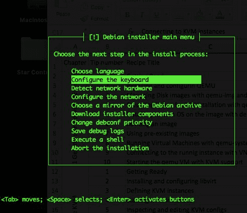

# 第二章：使用 libvirt 管理 KVM

本章将涵盖以下主题：

+   安装和配置 libvirt

+   定义 KVM 实例

+   启动、停止和删除 KVM 实例

+   检查和编辑 KVM 配置

+   使用 virt-install 构建新的 KVM 实例并使用控制台

+   在 KVM 中管理 CPU 和内存资源

+   将块设备附加到虚拟机

+   在运行中的虚拟机与宿主操作系统之间共享目录

+   自动启动 KVM 实例

+   使用存储池

+   管理存储卷

+   管理机密信息

# 介绍

在上一章中，我们展示了使用 QEMU 工具集和 KVM 内核模块来配置虚拟机的示例。QEMU 命令适合快速启动虚拟实例；然而，它们没有提供配置和管理虚拟机生命周期的简便方法。

本章我们将使用 libvirt 工具集。Libvirt 提供了各种用户空间命令和语言绑定，用于构建、配置、启动、停止、迁移、终止虚拟机，并执行其他管理功能。它支持不同的虚拟化技术，如 QEMU/KVM、XEN 和 LXC 容器。

我们将从安装和配置 libvirt 工具开始，然后继续创建使用 libvirt 支持的 XML 配置文件的虚拟机，并探索该工具包提供的许多功能，以便管理 KVM 实例的生命周期。本章中的所有示例都将以构建高可用、多租户环境为背景。

# 安装和配置 libvirt

在本示例中，我们将从你选择的 Linux 发行版提供的软件包中安装 libvirt，并查看可用于配置的配置文件和选项。和其他生产环境工具一样，我们推荐在生产环境中使用软件包，以便于部署和保持一致性；然而，如果你所在 Linux 发行商的包版本较旧，也可以选择从源码编译最新版本。

# 准备工作

根据你的 Linux 发行版，软件包名称和安装命令会有所不同。你可以使用系统的包管理器，如 `apt`、`dnf` 或 `yum` 来搜索包含 `libvirt` 字符串的包，并了解适用于你特定 Linux 版本的可用软件包。源代码可以从官方的 libvirt 项目网站下载：[`www.qemu-project.org/download/#source`](https://libvirt.org/downloads.html)。

# 如何操作...

从软件包和源代码安装 libvirt，请按照以下步骤操作：

1.  在 Ubuntu 上，通过运行以下命令安装软件包：

```
root@kvm:~# apt update && apt install libvirt-binroot@kvm:~#

```

1.  通过执行以下命令确保 `libvirt` 守护进程正在运行：

```
root@kvm:~# pgrep -lfa libvirtd 36667 /usr/sbin/libvirtd root@kvm:~#

```

1.  检查默认配置：

```
root@kvm:~# cat /etc/libvirt/libvirtd.conf | grep -vi "#"
   | sed '/^$/d'
 unix_sock_group = "libvirtd" unix_sock_ro_perms = "0777"
 unix_sock_rw_perms = "0770"
 auth_unix_ro = "none"
 auth_unix_rw = "none"
 root@kvm:~#

```

1.  通过编辑 `qemu` 配置文件禁用 QEMU 中的安全驱动：

```
root@kvm:~# vim /etc/libvirt/qemu.conf
...
security_driver = "none"
...
root@kvm:~#

```

1.  重启 `libvirt` 守护进程：

```
root@kvm:~# /etc/init.d/libvirt-bin restart
libvirt-bin stop/waiting
libvirt-bin start/running, process 1158
root@kvm:~#

```

根据你的 Linux 发行版，`libvirt` 服务的名称可能会有所不同。在 RHEL/CentOS 上，服务名称是 `libvirtd`；要重启它，可以运行 `service libvirtd restart`。

1.  检查 `libvirt` 目录中的所有配置文件：

```
root@kvm:~# ls -la /etc/libvirt/
total 76
drwxr-xr-x 5 root root 4096 Mar 22 14:27 .
drwxr-xr-x 90 root root 4096 Mar 21 23:17 ..
drwxr-xr-x 2 root root 4096 Feb 5 2016 hooks
-rw-r--r-- 1 root root 518 Feb 5 2016 libvirt.conf
-rw-r--r-- 1 root root 13527 Feb 5 2016 libvirtd.conf
-rw-r--r-- 1 root root 1176 Feb 5 2016 lxc.conf
drwxr-xr-x 2 root root 4096 Mar 21 23:16 nwfilter
drwxr-xr-x 3 root root 4096 Mar 21 23:57 qemu
-rw------- 1 root root 16953 Mar 21 23:18 qemu.conf
-rw-r--r-- 1 root root 2170 Feb 5 2016 qemu-lockd.conf
-rw-r--r-- 1 root root 2213 Feb 5 2016 virtlockd.conf
-rw-r--r-- 1 root root 1217 Feb 5 2016 virt-login-shell.conf
root@kvm:~#

```

# 它是如何工作的...

在第 1 步中，我们在 Ubuntu 上安装了该软件包。安装后，后安装脚本启动了 `libvirt` 守护进程。我们在第 2 步中验证了这一点。

在第 3 步中，我们检查了服务端守护进程 `libvirtd` 的主要配置文件。该进程在主机操作系统上运行，管理虚拟机的任务，如配置、生命周期管理、迁移、存储和网络等，我们将在本章稍后看到。我们安装的软件包提供的用户空间工具通过发送请求到本地 Unix 域套接字与守护进程进行通信。第 3 步中看到的默认选项足以满足本章中的食谱需求，但配置文件相当庞大。我们建议你仔细阅读它，并熟悉其中的其他配置选项。该文件的文档非常完善。

在第 4 步中，我们禁用了 QEMU 的安全驱动程序。默认情况下，在 RHEL/CentOS 系统上，QEMU 被配置为使用 SELinux。Ubuntu 发行版使用 **AppArmor**。为了简化，我们在此步骤中禁用了该功能；然而，在生产环境中，你应该利用强制访问控制系统（如 SELinux）提供的额外安全性。

对 `libvirt` 配置文件的任何更改都需要重启。我们在第 5 步中重启了 `libvirt` 服务。

我们需要熟悉一些重要的配置文件，这些文件在第 6 步中列出了：

+   `libvirt.conf` 是我们将在本食谱中使用的 `virsh` 命令的客户端配置文件。我们可以在其中指定 URI 别名。默认设置应该已经足够。

+   `libvirtd.conf` 是服务端配置文件，正如我们在第 3 步中看到的。它提供了各种安全选项、请求限制和日志控制。对于本书的目的，默认设置已经足够。

+   `qemu.conf` 是 QEMU 驱动程序的主要配置文件，它是 `libvirt` 使用的。我们可以配置诸如 VNC 服务器地址、在第 4 步中看到的安全驱动程序，以及 QEMU 进程的用户和组等选项。

+   一旦我们创建了 QEMU/KVM 虚拟机，`/etc/libvirt/qemu/` 目录将包含该实例的 XML 配置定义，正如我们在接下来的食谱中将看到的那样。

+   最后，`/etc/libvirt/qemu/networks/` 目录包含了用于网络配置的文件。我们将在本章稍后更详细地探讨这些文件。

# 定义 KVM 实例

在这个配方中，我们将通过创建一个简单的 XML 配置文件来定义虚拟实例，该文件可以被`libvirt`用于构建虚拟机。我们将描述一些 XML 架构块，并展示如何使用`virt-install`命令生成 XML 定义文件，而不是手动编写。

# 准备工作

对于这个配方，我们需要以下内容：

+   按照第一章*“安装和配置 QEMU”*配方中所述提供的 QEMU 二进制文件。

+   我们在上一章的*使用 debootstrap 安装自定义操作系统*配方中构建的自定义原始 Debian 镜像。

你可以使用自己的虚拟机镜像或从互联网上下载一个，正如我们在第一章*“使用现有镜像”*配方中展示的那样，开始使用 QEMU 和 KVM。

# 如何操作...

要定义一个新的 KVM 虚拟机，请运行这里概述的命令：

1.  列出主机操作系统上的所有虚拟机：

```
root@kvm:~# virsh list --all
 Id Name State
----------------------------------------------------

root@kvm:~#

```

1.  创建以下 XML 定义文件：

```
root@kvm:~# cat kvm1.xml
<domain type='kvm' id='1'>
 <name>kvm1</name>
 <memory unit='KiB'>1048576</memory>
 <vcpu placement='static'>1</vcpu>
 <os>
 <type arch='x86_64' machine='pc-i440fx-trusty'>hvm</type>
 <boot dev='hd'/>
 </os>
 <on_poweroff>destroy</on_poweroff>
 <on_reboot>restart</on_reboot>
 <on_crash>restart</on_crash>
 <devices>
 <emulator>/usr/bin/qemu-system-x86_64</emulator>
 <disk type='file' device='disk'>
 <driver name='qemu' type='raw'/>
 <source file='/tmp/debian.img'/>
 <target dev='hda' bus='ide'/>
 <alias name='ide0-0-0'/>
 <address type='drive' controller='0' bus='0' target='0' unit='0'/>
 </disk>
 <interface type='network'>
 <source network='default'/>
 <target dev='vnet0'/>
 <model type='rtl8139'/>
 <alias name='net0'/>
 <address type='pci' domain='0x0000' bus='0x00' slot='0x03' function='0x0'/>
 </interface>
 <graphics type='vnc' port='5900' autoport='yes' listen='146.20.141.158'>
 <listen type='address' address='146.20.141.158'/>
 </graphics>
 </devices>
 <seclabel type='none'/>
</domain>
root@kvm:~#

```

1.  定义虚拟机：

```
root@kvm:~# virsh define kvm1.xml
Domain kvm1 defined from kvm1.xml

root@kvm:~#

```

1.  列出所有状态下的实例：

```
root@kvm:~# virsh list --all
 Id Name State
----------------------------------------------------
 - kvm1 shut off

root@kvm:~#

```

# 它是如何工作的...

在步骤 1 中，我们使用了`virsh`命令并提供了所有参数，以列出所有活动和非活动的实例。正如预期的那样，我们一开始没有定义任何实例。

在步骤 2 中，我们为新的 KVM 实例创建了一个定义文件。我们使用了可用 XML 架构属性的小部分来设置以下选项：

+   XML 文件的根元素是所有虚拟机定义所必需的，命名为**domain**。它有两个属性——`type`和`id`。我们将`kvm`指定为`type`，并将`id`设置为`1`，因为这是我们的第一台 KVM 虚拟机。所有其他属性都在 domain 根元素下定义。

+   我们通过`name`属性指定了实例的名称。

+   memory 属性定义了分配给虚拟机的可用内存，在我们的案例中是 1GB。

+   `vcpu`元素定义了为客户操作系统分配的虚拟 CPU 的最大数量。我们将其指定为`1`，并使用了可选属性 placement，指示 CPU 的放置模式；在本例中，使用的是静态模式。静态放置表示虚拟实例将被固定在所有可用的物理 CPU 上。

+   OS 元素通过使用 type 元素定义虚拟机的架构。`hvm`选项表示我们将使用完全虚拟化，这将是 KVM，正如我们之前看到的 domain 类型属性所指定的那样。我们通过`<boot dev>`元素指定虚拟机启动的设备。

+   接下来的三个元素指定了当客户请求关闭电源、重启或发生崩溃时需要采取的操作。在我们的示例中，当客户操作系统关闭电源时，虚拟机将被销毁，当客户重启或崩溃时，虚拟机将重新启动。

+   XML 定义文件中最大的部分是设备部分，我们使用各种 XML 元素来描述提供给来宾操作系统的设备。emulator 元素指定了模拟器二进制文件的路径。我们将使用在 第一章 *开始使用 QEMU 和 KVM* 中使用的相同的 QEMU 模拟器二进制文件 `qemu-system-x86_64`。在设备属性的最后几个部分，我们定义了我们使用的虚拟磁盘类型，在本例中是我们在前一章构建的原始镜像。以类似的方式，我们描述了来宾操作系统中应该启动的 VNC 服务器和网络接口。

有了 `config` 文件后，我们在第 3 步中定义了实例，使用的是我们之前在 `/tmp` 创建的镜像。

一旦新实例被定义，它默认不会自动启动。我们可以看到在第 4 步中，新的实例状态是 `shut off`。

有关所有可用 XML 元素及其属性的信息，请参阅官方文档：[`libvirt.org/formatdomain.html`](http://libvirt.org/formatdomain.html)。

# 还有更多内容...

通过编写 XML 文件来配置虚拟机可能会非常繁琐且容易出错。创建虚拟机的一个更简单的方法是使用 `virt-install` 工具，这可以从现有镜像或安装介质（可以是物理的、虚拟的或网络位置）创建虚拟机。让我们看一个使用该工具创建相同 KVM 实例的例子。

1.  我们从安装包开始：

```
root@kvm:~# apt install virtinst
...
root@kvm:~#

```

1.  接下来，我们通过调用 `virt-install` 命令来定义并启动新的实例（如果已经存在相同名称的实例，你需要先销毁并取消定义它）：

```
root@kvm:~# virt-install --name kvm1 --ram 1024 --disk path=/tmp/debian.img,format=raw --graphics vnc,listen=146.20.141.158 --noautoconsole --hvm --import

Starting install...
Creating domain... | 0 B 00:00
Domain creation completed. You can restart your domain by running:
 virsh --connect qemu:///system start kvm1
root@kvm:~#

```

1.  新的虚拟机现在已经定义并启动。为了确认，执行以下命令：

```
root@kvm:~# virsh list --all
 Id Name State
----------------------------------------------------
 10 kvm1 running

root@kvm:~#

```

1.  我们可以看到通过运行以下代码自动生成的虚拟机定义文件：

```
root@kvm:~# cat /etc/libvirt/qemu/kvm1.xml
<!--
WARNING: THIS IS AN AUTO-GENERATED FILE. CHANGES TO IT ARE LIKELY TO BE
OVERWRITTEN AND LOST. Changes to this xml configuration should be made using:
 virsh edit kvm1
or other application using the libvirt API.
-->

<domain type='kvm'>
 <name>kvm1</name>
 <uuid>c3892cbf-812a-2448-7ad2-098ea8381066</uuid>
 <memory unit='KiB'>1048576</memory>
 <currentMemory unit='KiB'>1048576</currentMemory>
 <vcpu placement='static'>1</vcpu>
 <os>
 <type arch='x86_64' machine='pc-i440fx-trusty'>hvm</type>
 <boot dev='hd'/>
 </os>
 <features>
 <acpi/>
 <apic/>
 <pae/>
 </features>
 <clock offset='utc'/>
 <on_poweroff>destroy</on_poweroff>
 <on_reboot>restart</on_reboot>
 <on_crash>restart</on_crash>
 <devices>
 <emulator>/usr/bin/qemu-system-x86_64</emulator>
 <disk type='file' device='disk'>
 <driver name='qemu' type='raw'/>
 <source file='/tmp/debian.img'/>
 <target dev='hda' bus='ide'/>
 <address type='drive' controller='0' bus='0' target='0' unit='0'/>
 </disk>
 <controller type='usb' index='0'>
 <address type='pci' domain='0x0000' bus='0x00' slot='0x01' function='0x2'/>
 </controller>
 <controller type='pci' index='0' model='pci-root'/>
 <controller type='ide' index='0'>
 <address type='pci' domain='0x0000' bus='0x00' slot='0x01' function='0x1'/>
 </controller>
 <interface type='network'>
 <mac address='52:54:00:59:e3:4e'/>
 <source network='default'/>
 <model type='rtl8139'/>
 <address type='pci' domain='0x0000' bus='0x00' slot='0x03' function='0x0'/>
 </interface>
 <serial type='pty'>
 <target port='0'/>
 </serial>
 <console type='pty'>
 <target type='serial' port='0'/>
 </console>
 <input type='mouse' bus='ps2'/>
 <input type='keyboard' bus='ps2'/>
 <graphics type='vnc' port='-1' autoport='yes' listen='146.20.141.158'>
 <listen type='address' address='146.20.141.158'/>
 </graphics>
 <video>
 <model type='cirrus' vram='9216' heads='1'/>
 <address type='pci' domain='0x0000' bus='0x00' slot='0x02' function='0x0'/>
 </video>
 <memballoon model='virtio'>
 <address type='pci' domain='0x0000' bus='0x00' slot='0x04' function='0x0'/>
 </memballoon>
 </devices>
</domain>
root@kvm:~# 

```

# 启动、停止和移除 KVM 实例

在前面的教程中，我们看到如何通过手动编写 XML 定义文件或使用 `virt-install` 工具来定义新的 KVM 虚拟机实例。

如果从 XML 文件定义新的实例，默认情况下实例不会自动启动。在本教程中，我们将看到如何启动之前配置的实例。

# 准备工作

在这个教程中，我们需要以下内容：

+   在遵循 *安装和配置 QEMU* 教程后提供的 QEMU 二进制文件，通过 第一章 *开始使用 QEMU 和 KVM* 获得。

+   我们在 *使用 debootstrap 安装自定义操作系统* 教程中构建的自定义原始 Debian 镜像。

+   完成 *安装和配置 libvirt* 教程后提供的 virsh 工具。

+   在 *定义 KVM 实例* 教程中定义的实例处于 `shut off` 状态。

# 如何操作...

以下步骤概述了使用`virsh`命令列出、启动和停止 KVM 实例的过程：

1.  列出所有状态下的实例：

```
root@kvm:~# virsh list --all
 Id Name State
----------------------------------------------------
 - kvm1 shut off
root@kvm:~#

```

1.  启动新定义的实例并验证其状态：

```
root@kvm:~# virsh start kvm1
Domain kvm1 started

root@kvm:~#
root@kvm:~# virsh list --all
 Id Name State
----------------------------------------------------
 1 kvm1 running

root@kvm:~#

```

1.  检查虚拟机的运行进程：

```
root@kvm:~# pgrep -lfa qemu
1686 /usr/bin/qemu-system-x86_64 -name kvm1 -S -machine pc-i440fx-trusty,accel=kvm,usb=off -m 1024 -realtime mlock=off -smp 1,sockets=1,cores=1,threads=1 -uuid a9dfd1a1-7dd1-098e-a926-db9526785a9e -no-user-config -nodefaults -chardev socket,id=charmonitor,path=/var/lib/libvirt/qemu/kvm1.monitor,server,nowait -mon chardev=charmonitor,id=monitor,mode=control -rtc base=utc -no-shutdown -boot strict=on -device piix3-usb-uhci,id=usb,bus=pci.0,addr=0x1.0x2 -drive file=/tmp/debian.img,if=none,id=drive-ide0-0-0,format=raw -device ide-hd,bus=ide.0,unit=0,drive=drive-ide0-0-0,id=ide0-0-0,bootindex=1 -netdev tap,fd=24,id=hostnet0 -device rtl8139,netdev=hostnet0,id=net0,mac=52:54:00:ce:dd:f2,bus=pci.0,addr=0x3 -chardev pty,id=charserial0 -device isa-serial,chardev=charserial0,id=serial0 -vnc 146.20.141.158:0 -device cirrus-vga,id=video0,bus=pci.0,addr=0x2 -device virtio-balloon-pci,id=balloon0,bus=pci.0,addr=0x4
root@kvm:~#

```

1.  终止虚拟机并确保其状态从运行中变为`关闭`：

```
root@kvm:~# virsh destroy kvm1
Domain kvm1 destroyed

root@kvm:~# virsh list --all
 Id Name State
----------------------------------------------------
 - kvm1 shut off

root@kvm:~#

```

1.  删除实例定义：

```
root@kvm:~# virsh undefine kvm1
Domain kvm1 has been undefined

root@kvm:~# virsh list --all
 Id Name State
----------------------------------------------------

root@kvm:~#

```

# 它是如何工作的...

在步骤 1 中，我们列出了所有定义的实例，无论其状态如何。从输出中，我们可以看到我们当前有一个在早前的教程中定义的实例。

在步骤 2 中，我们启动了虚拟机并确保其状态已变为运行。

如果你完成了第一章中的*使用 qemu-system-运行虚拟机*教程，你可能会注意到该虚拟机的 XML 定义与我们用于启动 QEMU 实例的所有命令行选项非常相似。我们可以看到在步骤 3 中启动新实例的相似性。主要区别在于`libvirt`传递给 QEMU 可执行文件的参数更多。

最后，在步骤 4 和 5 中，我们停止了虚拟机并移除了其定义文件。然而，我们用来做虚拟机的原始镜像仍然可用，并且可以再次使用。

# 检查和编辑 KVM 配置

在本教程中，我们将使用`virsh`工具来检查和编辑现有虚拟机的配置。如前所述，一旦定义并启动了 KVM 实例，`libvirt`会在`/etc/libvirt/qemu/`目录中创建 XML 定义文件。我们可以将来宾配置转储到磁盘，以便检查或备份。使用`virsh`命令，我们还可以在原地执行配置更新，正如本教程稍后所示。

# 准备工作

本教程中，我们需要以下内容：

+   按照第一章中的*安装与配置 QEMU*教程提供的 QEMU 二进制文件，开始使用 QEMU 和 KVM

+   我们在上一章的*使用 debootstrap 安装自定义操作系统*中构建的自定义 Debian 镜像，或任何其他虚拟机镜像，格式可以是`raw`或`qcow2`

+   完成*安装与配置 libvirt*教程后提供的`virsh`工具

+   一个正在运行的`libvirt` KVM 实例

# 如何操作...

以下步骤概述了检查和编辑 KVM 实例的 XML 定义的过程：

1.  确保你有一个运行中的 KVM 实例和 libvirt，如果没有，请按照之前教程中的步骤进行操作：

```
root@kvm:~# virsh list
 Id Name State
----------------------------------------------------
 11 kvm1 running

root@kvm:~#

```

1.  将实例配置文件输出到**标准输出**（**stdout**）。有关 stdout 的更多信息，请参考以下链接：

[`en.wikipedia.org/wiki/Standard_streams`](https://en.wikipedia.org/wiki/Standard_streams)

```
root@kvm:~# virsh dumpxml kvm1
<domain type='kvm' id='11'>
 <name>kvm1</name>
 <uuid>9eb9a2e9-abb2-54c5-5cb3-dc86728e70fc</uuid>
 <memory unit='KiB'>1048576</memory>
 <currentMemory unit='KiB'>1048576</currentMemory>
 <vcpu placement='static'>1</vcpu>
 <resource>
 <partition>/machine</partition>
 </resource>
 <os>
 <type arch='x86_64' machine='pc-i440fx-trusty'>hvm</type>
 <boot dev='hd'/>
 </os>
 <features>
 <acpi/>
 <apic/>
 <pae/>
 </features>
 <clock offset='utc'/>
 <on_poweroff>destroy</on_poweroff>
 <on_reboot>restart</on_reboot>
 <on_crash>restart</on_crash>
 <devices>
 <emulator>/usr/bin/qemu-system-x86_64</emulator>
 <disk type='file' device='disk'>
 <driver name='qemu' type='raw'/>
 <source file='/tmp/debian.img'/>
 <target dev='hda' bus='ide'/>
 <alias name='ide0-0-0'/>
 <address type='drive' controller='0' bus='0' target='0' unit='0'/>
 </disk>
 <controller type='usb' index='0'>
 <alias name='usb0'/>
 <address type='pci' domain='0x0000' bus='0x00' slot='0x01' function='0x2'/>
 </controller>
 <controller type='pci' index='0' model='pci-root'>
 <alias name='pci.0'/>
 </controller>
 <controller type='ide' index='0'>
 <alias name='ide0'/>
 <address type='pci' domain='0x0000' bus='0x00' slot='0x01' function='0x1'/>
 </controller>
 <interface type='network'>
 <mac address='52:54:00:d1:70:df'/>
 <source network='default'/>
 <target dev='vnet0'/>
 <model type='rtl8139'/>
 <alias name='net0'/>
 <address type='pci' domain='0x0000' bus='0x00' slot='0x03' function='0x0'/>
 </interface>
 <serial type='pty'>
 <source path='/dev/pts/0'/>
 <target port='0'/>
 <alias name='serial0'/>
 </serial>
 <console type='pty' tty='/dev/pts/0'>
 <source path='/dev/pts/0'/>
 <target type='serial' port='0'/>
 <alias name='serial0'/>
 </console>
 <input type='mouse' bus='ps2'/>
 <input type='keyboard' bus='ps2'/>
 <graphics type='vnc' port='5900' autoport='yes' listen='146.20.141.158'>
 <listen type='address' address='146.20.141.158'/>
 </graphics>
 <video>
 <model type='cirrus' vram='9216' heads='1'/>
 <alias name='video0'/>
 <address type='pci' domain='0x0000' bus='0x00' slot='0x02' function='0x0'/>
 </video>
 <memballoon model='virtio'>
 <alias name='balloon0'/>
 <address type='pci' domain='0x0000' bus='0x00' slot='0x04' function='0x0'/>
 </memballoon>
 </devices>
 <seclabel type='none'/>
</domain>

root@kvm:~#

```

1.  将配置保存到新文件中，如下所示：

```
root@kvm:~# virsh dumpxml kvm1 > kvm1.xml
root@kvm:~# head kvm1.xml
<domain type='kvm' id='11'>
 <name>kvm1</name>
 <uuid>9eb9a2e9-abb2-54c5-5cb3-dc86728e70fc</uuid>
 <memory unit='KiB'>1048576</memory>
 <currentMemory unit='KiB'>1048576</currentMemory>
 <vcpu placement='static'>1</vcpu>
 <resource>
 <partition>/machine</partition>
 </resource>
 <os>
root@kvm:~#

```

1.  在原地编辑配置并更改虚拟机的可用内存：

```
root@kvm:~# virsh edit kvm1
Domain kvm1 XML configuration edited.

root@kvm:~# 

```

# 它是如何工作的...

Libvirt 提供了两种主要方式来操作虚拟实例的配置定义。我们可以像第 2 步和第 3 步那样从现有实例中导出配置，或者像第 4 步那样在原地编辑 XML 定义。

将当前配置保存到文件是一种方便的备份 VM 定义的方式。它还提供了一种通过编辑保存的文件并仅更改虚拟机的名称和 ID 来定义新实例的方法。然后，我们可以使用该文件在同一主机或不同主机上启动一个新的虚拟机，前提是文件系统或镜像也可用。在以后的食谱中，我们将看到使用`libvirt`迁移和备份虚拟机的示例。

在原地进行更改时，如第 4 步所示，将使用默认系统`$EDITOR`。进入编辑模式后，请注意 XML 文件包含有关虚拟实例当前状态的信息。`<uuid>`和`<currentMemory>`属性就是这样的例子。如果你想更改虚拟机的可用内存，在更新`<memory>`属性后，可能需要删除`<currentMemory>`段。如果编辑时出现任何问题，libvirt 将显示错误消息并提供以下选项：

```
root@kvm:~# virsh edit kvm1
error: XML error: current memory '1048576k' exceeds maximum '524288k'
Failed. Try again? [y,n,f,?]:n
Domain kvm1 XML configuration not changed.
root@kvm:~#

```

还请记住，如果你想从现有实例的转储中创建一个新实例，你需要更改`<name>`并删除`<uuid>`属性，因为后者会在定义新实例时自动生成。

# 使用 virt-install 构建新的 KVM 实例并使用控制台

在第一章*《QEMU 与 KVM 入门》*中的*连接到运行中的实例（使用 VNC）*一节，你学习了如何连接到运行 VNC 服务器的 QEMU/KVM 虚拟机。这是连接到正在安装或启动过程中的实例的一种非常好的方式，以便与其进行交互。

到目前为止，我们一直在使用之前创建的自定义原始镜像，其中包含 Debian 操作系统的安装。回顾第一章*，《QEMU 与 KVM 入门》*，我们使用了`debootstrap`命令在镜像文件内安装操作系统。在这个食谱中，我们将使用`virt-install`工具安装一个新的 Linux 发行版，使用提供的上游互联网存储库作为安装源，然后使用`virsh`命令连接到运行中的实例，使用控制台。

# 准备就绪

对于这个食谱，我们需要以下内容：

+   `virsh` 命令

+   `virt-install` 命令

+   需要互联网连接以下载安装文件

# 如何操作...

要构建一个新的 KVM 实例并通过控制台连接到它，执行以下步骤：

1.  使用官方 Debian 存储库安装新的 KVM 虚拟机：

```
root@kvm:~# virt-install --name kvm1 --ram 1024 --extra-args="text console=tty0 utf8 console=ttyS0,115200" --graphics vnc,listen=146.20.141.158 --hvm --location=http://ftp.us.debian.org/debian/dists/stable/main/installer-amd64/ --disk path=/tmp/kvm1.img,size=8

Retrieving file MANIFEST... | 3.3 kB 00:00 ...
Retrieving file linux... | 6.0 MB 00:00 ...
Retrieving file initrd.gz... | 29 MB 00:00 ...
Creating storage file kvm1.img | 8.0 GB 00:00
WARNING Unable to connect to graphical console: virt-viewer not installed. Please install the 'virt-viewer' package.
Domain installation still in progress. You can reconnect to
the console to complete the installation process.
root@kvm:~#

```

1.  运行以下代码连接到控制台以完成安装：

```
root@kvm:~# virsh console kvm1
Connected to domain kvm1
Escape character is ^]

```

1.  一旦连接到控制台，你应该看到类似于此处的屏幕：



连接后，通过 virsh 控制台命令看到的控制台输出

1.  按照文本菜单提示完成安装。

1.  启动新配置的虚拟机：

```
root@kvm:~# virsh start kvm1
Domain kvm1 started

root@kvm:~#

```

1.  使用你喜欢的 VNC 客户端连接到实例，使用你在安装过程中第 3 步创建的用户名和密码登录，并通过运行以下命令启用串行控制台访问：

```
root@debian:~# systemctl enable serial-getty@ttyS0.service
root@debian:~# systemctl start serial-getty@ttyS0.service
root@debian:~#

```

1.  关闭 VNC 会话，并通过主机操作系统使用 `virsh` 连接到虚拟实例：

```
root@kvm:~# virsh console kvm1
Connected to domain kvm1
Escape character is ^]

Debian GNU/Linux 8 debian ttyS0

debian login: root
Password:
Last login: Wed Mar 22 16:38:10 CDT 2017 on tty1
Linux debian 3.16.0-4-amd64 #1 SMP Debian 3.16.39-1+deb8u2 (2017-03-07) x86_64

The programs included with the Debian GNU/Linux system are free software;
the exact distribution terms for each program are described in the
individual files in /usr/share/doc/*/copyright.

Debian GNU/Linux comes with ABSOLUTELY NO WARRANTY, to the extent
permitted by applicable law.
root@debian:~# free -m
 total used free shared buffers cached
Mem: 1000 98 902 4 9 43
-/+ buffers/cache: 44 956
Swap: 382 0 382
root@debian:~#

```

1.  使用 *Ctrl* + *]* 键组合断开与控制台的连接。

1.  检查安装后创建的 `image` 文件：

```
root@kvm:~# qemu-img info /tmp/kvm1.img
image: /tmp/kvm1.img
file format: raw
virtual size: 8.0G (8589934592 bytes)
disk size: 1.9G
root@kvm:~#

```

如果你没有在 KVM 机器的发行版上使用基于 systemd 的 `init` 系统，则为了允许访问实例的串行控制台，你需要编辑 `/etc/securetty` 或 `/etc/inittab` 文件。

# 它是如何工作的...

在这个配方中发生了很多事情，所以让我们更详细地回顾一下所有步骤。

在第 1 步中，我们使用 `virt-install` 工具启动了一个新的 KVM 实例的安装过程。我们通过 `--extra-args` 参数指定在安装过程中启用串行控制台。我们还使用 `--location` 标志告诉 `libvirt` 安装文件的位置，以便安装最新的 Debian 发行版。然后我们指定了将包含来宾操作系统文件系统的映像文件的位置和大小。由于该文件尚不存在，`virt-install` 创建了一个原始映像，如第 9 步所示。

启用了控制台访问后，我们能够在第 2 步连接到控制台，并在第 3 和第 4 步完成安装过程。

安装完成后，控制台会话终止，新 KVM 实例准备启动。我们在第 5 步启动了实例。

为了启用串行端口上的控制台访问，我们首先使用 VNC 客户端连接到正在运行的虚拟机，并在第 6 步指示 systemd 启动控制台服务。

启用控制台访问后，我们能够在第 7 步使用 virsh 工具连接到串行控制台。

完成所有这些后，我们现在有两种方法可以连接到正在运行的 KVM 实例，分别是通过 VNC 或控制台。

在接下来的配方中，我们将启用来宾操作系统的网络功能，并提供第三种使用 SSH 连接的方法。

# 管理 KVM 中的 CPU 和内存资源

可以通过编辑虚拟机的 XML 定义或使用 `libvirt` 工具集来更改分配的内存量或 CPU 数量。在这个配方中，我们将查看如何更改 KVM 实例的内存和 CPU 数量的示例。

# 准备工作

对于这个配方，我们将需要以下内容：

+   一个正在运行的 KVM 实例，分配了 1 GB 内存和 1 个 CPU，并启用了控制台访问

+   `libvirt` 包

+   一个至少有 4 GB 可用内存和最低 4 个 CPU 的来宾操作系统

# 如何操作...

要检查并更新分配给虚拟机的内存和 CPU 资源，请按照这里概述的过程进行：

1.  获取正在运行的实例的内存统计信息：

```
root@kvm:~# virsh dommemstat kvm1
actual 1048576
swap_in 0
rss 333644

root@kvm:~#

```

1.  将虚拟机的可用内存更新为 2 GB：

```
root@kvm:~# virsh setmem kvm1 --size 1049000

root@kvm:~#

```

1.  停止正在运行的实例：

```
root@kvm:~# virsh destroy kvm1
Domain kvm1 destroyed

root@kvm:~#

```

1.  将最大可用内存设置为 2 GB：

```
root@kvm:~# virsh setmaxmem kvm1 --size 2097152

root@kvm:~#

```

1.  启动实例：

```
root@kvm:~# virsh start kvm1
Domain kvm1 started

root@kvm:~#

```

1.  检查当前分配的内存：

```
root@kvm:~# virsh dommemstat kvm1
actual 2097152
swap_in 0
rss 214408

root@kvm:~#

```

1.  连接到 KVM 实例并检查来宾操作系统中的内存：

```
root@kvm:~# virsh console kvm1
Connected to domain kvm1
Escape character is ^]

Debian GNU/Linux 8 debian ttyS0

debian login: root
Password:
...
root@debian:~# free -m
 total used  free  shared  buffers cached
Mem:                  2010   93  1917        5       8     40
-/+ buffers/cache:      43 1966
Swap:                  382    0  3 82
root@debian:~#
root@kvm:~#

```

1.  检查实例 XML 定义中的内存设置：

```
root@kvm:~# virsh dumpxml kvm1 | grep memory
 <memory unit='KiB'>2097152</memory>
root@kvm:~#

```

1.  获取来宾 CPU 的信息：

```
root@kvm:~# virsh vcpuinfo kvm1
VCPU: 0
CPU: 29
State: running
CPU time: 9.7s
CPU Affinity: yyyyyyyyyyyyyyyyyyyyyyyyyyyyyyyyyyyyyyyy

root@kvm:~#

```

1.  列出来宾操作系统使用的虚拟 CPU 数量：

```
root@kvm:~# virsh vcpucount kvm1
maximum config 1
maximum live 1
current config 1
current live 1

root@kvm:~#

```

1.  将虚拟机分配的 CPU 数量更改为 4：

```
root@kvm:~# virsh edit kvm1
...
<vcpu placement='static'>4</vcpu>
...
Domain kvm1 XML configuration edited.

root@kvm:~#

```

1.  确保 CPU 数量更新生效：

```
root@kvm:~# virsh vcpucount kvm1
maximum config 4
maximum live 4
current config 4
current live 4

root@kvm:~# virsh dumpxml kvm1 | grep -i cpu
 <vcpu placement='static'>4</vcpu>
root@kvm:~#

```

# 工作原理...

在第 1 步中，我们收集了正在运行的 KVM 实例的内存统计信息。从输出中，我们可以看到虚拟机配置了 1GB 的内存（由实际参数指示），并且当前使用了 333644 KB 的内存。

在第 2 步中，我们将可用内存更新为 2 GB，并在第 4 步中继续更新可以分配给实例的最大内存。为了执行此操作，必须先停止实例，如第 3 步所示。

在第 6、7 和 8 步中，我们通过首先调用`dommemstat`子命令、然后连接到虚拟机的控制台，最后通过转储实例定义检查当前配置，确保了更新的生效。

`virsh`命令提供了几个子命令来检查正在运行的虚拟机的 CPU 状态。在第 9 步和第 10 步中，我们列出了`kvm1`实例的虚拟 CPU 数量，在本例中为一个，并显示了当前的状态、负载和亲和性。

最后，在第 11 步和第 12 步中，我们更新了实例的 XML 定义，分配了四个 CPU 并列出了新的数量。

# 还有更多...

在本教程中，我们使用了`virsh`命令的多个子命令，通过一行命令来执行。这在我们需要通过脚本运行命令时特别有用。`virsh`命令还提供了一个交互式终端，这样可以减少一些输入，并提供上下文帮助。要启动虚拟化交互式终端，请运行以下代码：

```
root@kvm:~# virsh
Welcome to virsh, the virtualization interactive terminal.

Type: 'help' for help with commands
 'quit' to quit

virsh #

```

输入`help`将列出所有可用的子命令及其简短描述。要获取某个特定子命令的更多信息，请输入：

```
virsh # help vcpucount
 NAME
 vcpucount - domain vcpu counts

 SYNOPSIS
 vcpucount <domain> [--maximum] [--active] [--live] [--config] [--current] [--guest]

 DESCRIPTION
 Returns the number of virtual CPUs used by the domain.

 OPTIONS
 [--domain] <string> domain name, id or uuid
 --maximum get maximum count of vcpus
 --active get number of currently active vcpus
 --live get value from running domain
 --config get value to be used on next boot
 --current get value according to current domain state
 --guest retrieve vcpu count from the guest instead of the hypervisor

virsh #

```

本教程中我们执行的所有步骤都可以在交互式终端中完成。

# 将块设备附加到虚拟机

在本教程中，我们将探讨几种向 KVM 实例添加新块设备的方法。新的块设备可以进行分区、格式化，并作为常规块设备在来宾操作系统内使用。我们可以将磁盘附加到正在运行的实例，也可以通过离线创建单独块设备的 XML 定义将其持久化添加。从主机操作系统，可以将任何类型的块设备文件呈现给来宾，包括 iSCSI 目标、LVM 逻辑卷或镜像文件。

# 准备工作

本教程需要以下内容：

+   一个具有控制台访问权限的正在运行的 KVM 实例

+   `dd`实用工具

# 如何操作...

要将新的块设备附加到 KVM 来宾中，运行以下命令：

1.  创建一个新的 1GB 镜像文件：

```
root@kvm:~# dd if=/dev/zero of=/tmp/new_disk.img bs=1M count=1024
1024+0 records in
1024+0 records out
1073741824 bytes (1.1 GB) copied, 0.670831 s, 1.6 GB/s
root@kvm:~#

```

1.  将文件作为新磁盘附加到 KVM 实例：

```
root@kvm:~# virsh attach-disk kvm1 /tmp/new_disk.img vda --live
Disk attached successfully

root@kvm:~#

```

1.  通过控制台连接到 KVM 实例：

```
root@kvm:~# virsh console kvm1
Connected to domain kvm1
Escape character is ^]

Debian GNU/Linux 8 debian ttyS0

debian login: root
Password:
...
root@debian:~#

```

1.  打印内核环形缓冲区并检查新的块设备：

```
root@debian:~# dmesg | grep vda
[ 3664.134978] sd 2:0:2:0: [vda] 2097152 512-byte logical blocks: (1.07 GB/1.00 GiB)
[ 3664.135248] sd 2:0:2:0: [vda] Write Protect is off
[ 3664.135251] sd 2:0:2:0: [vda] Mode Sense: 63 00 00 08
[ 3664.135340] sd 2:0:2:0: [vda] Write cache: enabled, read cache: enabled, doesn't support DPO or FUA
[ 3664.138254] vda: unknown partition table
[ 3664.139008] sd 2:0:2:0: [vda] Attached SCSI disk
root@debian:~#

```

1.  检查新块设备：

```
root@debian:~# fdisk -l /dev/vda

Disk /dev/vda: 1 GiB, 1073741824 bytes, 2097152 sectors
Units: sectors of 1 * 512 = 512 bytes
Sector size (logical/physical): 512 bytes / 512 bytes
I/O size (minimum/optimal): 512 bytes / 512 bytes
root@debian:~#

```

1.  从主机操作系统中导出实例配置：

```
root@kvm:~# virsh dumpxml kvm1
<domain type='kvm' id='23'>
...
 <devices>
 <emulator>/usr/bin/qemu-system-x86_64</emulator>
 <disk type='file' device='disk'>
 <driver name='qemu' type='raw'/>
 <source file='/tmp/kvm1.img'/>
 <target dev='hda' bus='ide'/>
 <alias name='ide0-0-0'/>
 <address type='drive' controller='0' bus='0' target='0' unit='0'/>
 </disk>
 <disk type='file' device='disk'>
 <driver name='qemu' type='raw'/>
 <source file='/tmp/new_disk.img'/>
 <target dev='vda' bus='scsi'/>
 <alias name='scsi0-0-2'/>
 <address type='drive' controller='0' bus='0' target='0' unit='2'/>
 </disk>
 </devices>
</domain>

root@kvm:~#

```

1.  获取新磁盘的信息：

```
root@kvm:~# virsh domblkstat kvm1 vda
vda rd_req 119
vda rd_bytes 487424
vda wr_req 0
vda wr_bytes 0
vda flush_operations 0
vda rd_total_times 29149092
vda wr_total_times 0
vda flush_total_times 0

root@kvm:~#

```

1.  卸载磁盘：

```
root@kvm:~# virsh detach-disk kvm1 vda --live
Disk detached successfully

root@kvm:~#

```

1.  复制或创建一个新的原始镜像：

```
root@kvm:~# cp /tmp/new_disk.img /tmp/other_disk.img
root@kvm:~#

```

1.  写入以下`config`文件：

```
root@kvm:~# cat other_disk.xml
<disk type='file' device='disk'>
 <driver name='qemu' type='raw' cache='none'/>
 <source file='/tmp/other_disk.img'/>
 <target dev='vdb'/>
</disk>
root@kvm:~#

```

1.  附加新设备：

```
root@kvm:~# virsh attach-device kvm1 --live other_disk.xml
Device attached successfully

root@kvm:~#

```

1.  卸载块设备：

```
root@kvm:~# virsh detach-device kvm1 other_disk.xml --live
Device detached successfully

root@kvm:~#

```

# 工作原理...

向运行中的 KVM 实例附加更多磁盘非常有用，尤其是在来宾操作系统中使用 LVM 时，因为这可以扩展逻辑卷，从而在运行时添加更多磁盘空间。Libvirt 提供了两种不同的方法，正如我们在前面的步骤中所看到的。我们可以使用`virsh attach-disk`命令，传递镜像文件的位置和新块设备的名称，正如我们在第 2 步中看到的那样。

在第 1 步中，我们使用`dd`命令创建了一个新的原始镜像；然而，我们也可以使用 qemu-img 工具，正如我们在第一章*《QEMU 和 KVM 入门》*中的*管理磁盘镜像与 qemu-img*一节所看到的那样。

在第 2 步中附加新磁盘后，在第 3、4 和 5 步中，我们连接到虚拟机并验证了新块设备确实存在。这一点在第 6 步的实例 XML 定义中也有所体现。

若要在虚拟机重启后使新设备可用并保持 XML 定义的更改，请将`--persist`选项传递给`virsh attach-disk`命令。

在第 7 步中，我们显示了有关新磁盘的一些信息。这些数据非常有用，可以用来监控块设备的读写请求，而无需连接到虚拟实例。

在第 8 步中，我们从运行中的 KVM 实例中卸载了磁盘。如果此时导出实例定义，你会发现额外的磁盘已不再存在。

附加块设备的另一种方式在第 10 步中展示。我们首先创建一个新的 XML 文件，其中包含要附加的块设备定义。请注意，这个定义与第 6 步中的输出非常相似。

在第 11 步中，我们再次卸载了新设备。请注意，我们必须指定相同的设备 XML 定义文件才能进行此操作。

一旦磁盘在来宾操作系统中可见，我们可以将其作为常规块设备使用，可以对其进行分区、创建文件系统并挂载。

# 在运行中的虚拟机与主机操作系统之间共享目录

在前一个步骤中，我们展示了如何将磁盘附加到运行中的 KVM 实例的两个示例。在本步骤中，我们将从主机操作系统共享一个目录，并使其在虚拟机中可用。然而，我们只能在实例停止后执行此操作。如果你一直跟随本教程，你应该已经有一个可以使用的 libvirt KVM 实例。

# 准备工作

本步骤的前提条件如下：

+   停止的 libvirt KVM 实例并可通过控制台访问

+   配备 `9p` 和 `virtio` 内核模块的来宾操作系统（大多数 Linux 发行版默认包含）

# 如何操作...

要将宿主操作系统的目录共享给 KVM 来宾系统，请执行以下命令：

1.  在宿主操作系统上创建一个新目录并添加文件：

```
root@kvm:~# mkdir /tmp/shared
root@kvm:~# touch /tmp/shared/file
root@kvm:~#

```

1.  将以下定义添加到已停止的 KVM 实例中：

```
root@kvm:~# virsh edit kvm1
 ...
 <devices>
 ...
 <filesystem type='mount' accessmode='passthrough'>
 <source dir='/tmp/shared'/>
 <target dir='tmp_shared'/>
 </filesystem>
 ...
 </devices>
 ...
Domain kvm1 XML configuration edited.

root@kvm:~#

```

1.  启动虚拟机：

```
root@kvm:~# virsh start kvm1
Domain kvm1 started

root@kvm:~#

```

1.  按如下方式连接到控制台：

```
root@kvm:~# virsh console kvm1
Connected to domain kvm1
Escape character is ^]

Debian GNU/Linux 8 debian ttyS0

debian login: root
Password:
...
root@debian:~#

```

1.  确保加载 `9p` 和 `virtio` 内核模块：

```
root@debian:~# lsmod | grep 9p 9pnet_virtio 17006 0
9pnet 61632 1 9pnet_virtio
virtio_ring 17513 3 virtio_pci,virtio_balloon,9pnet_virtio
virtio 13058 3 virtio_pci,virtio_balloon,9pnet_virtio
root@debian:~#

```

1.  将共享目录挂载到 `/mnt`：

```
root@debian:~# mount -t 9p -o trans=virtio tmp_shared /mnt
root@debian:~#

```

1.  列出新的挂载：

```
root@debian:~# mount | grep tmp_shared
tmp_shared on /mnt type 9p (rw,relatime,sync,dirsync,trans=virtio)
root@debian:~#

```

1.  确保在宿主操作系统中可以看到共享文件：

```
root@debian:~# ls -la /mnt/
total 8
drwxr-xr-x 2  root root 4096 Mar 23 11:25 .
drwxr-xr-x 22 root root 4096 Mar 22 16:28 ..
-rw-r--r-- 1  root root 0    Mar 23 11:25 file
root@debian:~#

```

# 它是如何工作的...

让我们一步步走过这些步骤，看看在前面章节中完成了哪些操作的详细内容。

在步骤 1 中，我们创建了一个目录和一个文件，希望与来宾操作系统共享。然后，在已停止的 KVM 实例上，我们在步骤 2 中添加了新的 `<filesystem>` 定义。我们使用了挂载类型，因为我们要挂载一个目录，并指定了 `accessmode`，它指定了访问共享资源的安全模式。有三种访问模式：

+   `passthrough`：这是默认模式，使用来宾操作系统内用户的权限访问共享目录

+   `mapped`：在此模式下，共享目录及其文件将使用来自宿主操作系统的 QEMU 用户权限进行访问

+   `squash`：此模式类似于透传模式；然而，像 `chmod` 等特权操作的失败会被忽略

在新定义生效后，我们在步骤 3 中启动虚拟机，并在步骤 4 中连接到它。

在我们使用的 Debian 虚拟机上，所需的内核模块在虚拟机启动时已被加载。如果你的虚拟机没有自动加载，请通过以下命令加载这些模块：

```
root@debian:~# modprobe 9p virtio
root@debian:~#

```

主要操作发生在步骤 6，在这里我们挂载共享目录，并确保它已经成功挂载，后续步骤中的文件也已经到位。

# 还有更多...

在本章中，我们一直在使用 `libvirt` 工具集和库提供的 `virsh` 命令启动 KVM 虚拟机。如果你在启动来宾虚拟机后查看进程树，你会发现 `virsh` 命令实际上会调用 `/usr/bin/qemu-system-x86_64` 二进制文件。如果你还记得 第一章* 中的 *使用 qemu-system- 启动虚拟机* 的食谱，*开始使用 QEMU 和 KVM*；这正是我们用来启动 QEMU/KVM 虚拟机的工具。

请注意当我们在本教程中启动 KVM 实例时，`libvirt` 守护进程启动的过程：

```
root@kvm:~# pgrep -lfa qemu
6233 /usr/bin/qemu-system-x86_64 -name kvm1 -S -machine pc-i440fx-trusty,accel=kvm,usb=off -m 2048 -realtime mlock=off -smp 2,sockets=2,cores=1,threads=1 -uuid 6ad84d8a-229d-d1f6-ecfc-d29a25fcfa03 -no-user-config -nodefaults -chardev socket,id=charmonitor,path=/var/lib/libvirt/qemu/kvm1.monitor,server,nowait -mon chardev=charmonitor,id=monitor,mode=control -rtc base=utc -no-shutdown -boot strict=on -device piix3-usb-uhci,id=usb,bus=pci.0,addr=0x1.0x2 -device lsi,id=scsi0,bus=pci.0,addr=0x5 -drive file=/tmp/kvm1.img,if=none,id=drive-ide0-0-0,format=raw -device ide-hd,bus=ide.0,unit=0,drive=drive-ide0-0-0,id=ide0-0-0,bootindex=1 -fsdev local,security_model=passthrough,id=fsdev-fs0,path=/tmp/shared -device virtio-9p-pci,id=fs0,fsdev=fsdev-fs0,mount_tag=tmp_shared,bus=pci.0,addr=0x6 -netdev tap,fd=25,id=hostnet0 -device rtl8139,netdev=hostnet0,id=net0,mac=52:54:00:c5:c8:9d,bus=pci.0,addr=0x3 -chardev pty,id=charserial0 -device isa-serial,chardev=charserial0,id=serial0 -vnc 146.20.141.158:0 -device cirrus-vga,id=video0,bus=pci.0,addr=0x2 -device virtio-balloon-pci,id=balloon0,bus=pci.0,addr=0x4
root@kvm:~#

```

我们可以不使用 libvirt，而是通过以下命令直接启动一个新的来宾操作系统，并使用与本教程中相同的共享目录，只需确保先停止我们之前启动的 `libvirt` 实例：

```
root@kvm:~# qemu-system-x86_64 -name debian -fsdev local,id=tmp,path=/tmp/shared,security_model=passthrough -device virtio-9p-pci,fsdev=tmp,mount_tag=tmp_shared -enable-kvm -usbdevice tablet -vnc 146.20.141.158:0 -m 1024 -drive format=raw,file=/tmp/kvm1.img -daemonize
root@kvm:~# 

```

你应该能够使用你的 VNC 客户端连接到来宾系统并执行相同的步骤来挂载共享目录，正如我们之前所做的那样。

# 自动启动 KVM 实例

一旦 KVM 实例被定义并启动，它将一直运行，直到宿主操作系统启动。一旦宿主操作系统重启，通过 libvirt 构建的实例将在宿主操作系统启动并且`libvirt`守护进程运行时不会自动启动。在这个食谱中，我们将改变这种行为，并确保在`libvirt`守护进程启动时虚拟实例也能启动。

# 准备工作

对于此食谱，我们将需要一个通过 libvirt 构建的单个 KVM 实例。

# 如何操作...

要配置 KVM 客户机以便在服务器或`libvirtd`重启后自动启动，请运行以下命令：

1.  启用虚拟机`autostart`：

```
root@kvm:~# virsh autostart kvm1
Domain kvm1 marked as autostarted

root@kvm:~#

```

1.  获取实例的信息：

```
root@kvm:~# virsh dominfo kvm1
Id: 31
Name: kvm1
UUID: 6ad84d8a-229d-d1f6-ecfc-d29a25fcfa03
OS Type: hvm
State: running
CPU(s): 2
CPU time: 10.9s
Max memory: 2097152 KiB
Used memory: 1048576 KiB
Persistent: yes
Autostart: enable
Managed save: no
Security model: none
Security DOI: 0

root@kvm:~#

```

1.  停止运行中的实例并确保它处于`关闭`状态：

```
root@kvm:~# virsh destroy kvm1
Domain kvm1 destroyed

root@kvm:~# virsh list --all
 Id  Name  State
----------------------------------------------------
 -   kvm1  shut off

root@kvm:~#

```

1.  停止`libvirt`守护进程并确保它没有运行：

```
root@kvm:~# /etc/init.d/libvirt-bin stop
libvirt-bin stop/waiting
root@kvm:~# pgrep -lfa libvirtd
root@kvm:~#

```

1.  重新启动`libvirt`守护进程：

```
root@kvm:~# /etc/init.d/libvirt-bin start
libvirt-bin start/running, process 6639
root@kvm:~#

```

1.  列出所有正在运行的实例：

```
root@kvm:~# virsh list --all
 Id Name State
----------------------------------------------------
 2  kvm1 running

root@kvm:~#

```

1.  禁用`autostart`选项：

```
root@kvm:~# virsh autostart kvm1 --disable
Domain kvm1 unmarked as autostarted

root@kvm:~#

```

1.  验证更改：

```
root@kvm:~# virsh dominfo kvm1 | grep -i autostart
Autostart: disable
root@kvm:~#

```

# 它是如何工作的...

在这个简单的食谱中，我们启用了 libvirt 控制的 KVM 实例的`autostart`功能。

在第 1 步中，我们启用了`autostart`并在第 2 步中验证了它已经启用。

接下来，为了模拟服务器重启，我们首先在第 3 步中停止运行中的实例，并在第 4 步中停止`libvirt`守护进程。

在第 5 步中，我们重新启动了`libvirt`守护进程，并观察到它也启动了虚拟机，如第 6 步所示。

最后，在第 7 步和第 8 步中，我们禁用了`autostart`功能，并确保它确实已被禁用。

# 与存储池的工作

Libvirt 提供了一种集中式的方式来管理实例卷（无论是镜像文件还是目录），通过定义存储池。存储池是卷的集合，然后可以将这些卷分配给虚拟机，用来托管它们的文件系统或作为额外的块设备。使用存储池的主要好处是，libvirt 能够以集中方式向虚拟机呈现并管理指定的存储类型。

截至目前，以下存储池后端是可用的：

+   目录后端

+   本地文件系统后端

+   网络文件系统后端

+   逻辑后端

+   磁盘后端

+   iSCSI 后端

+   SCSI 后端

+   多路径后端

+   RADOS 块设备后端

+   Sheepdog 后端

+   Gluster 后端

+   ZFS 后端

+   Virtuozzo 存储后端

在这个食谱中，我们将创建一个目录支持的存储池，将现有镜像移动到该池中，然后使用该存储池和卷来配置一个新的 KVM 实例。

# 准备工作

对于这个食谱，我们将需要以下内容：

+   我们在*使用 virt-install 和控制台构建新的 KVM 实例*食谱中创建的 Debian 原始镜像

+   `libvirt`软件包

# 如何操作...

以下步骤演示了如何创建一个新的存储池，检查它，并将其分配给虚拟机：

1.  复制我们在本章*使用 virt-install 和控制台构建新的 KVM 实例*食谱中创建的 Debian 原始镜像文件：

```
root@kvm:~# cp /tmp/kvm1.img /var/lib/libvirt/images/
root@kvm:~#

```

1.  创建以下存储池定义：

```
root@kvm:~# cat file_storage_pool.xml
<pool type="dir">
 <name>file_virtimages</name>
 <target>
 <path>/var/lib/libvirt/images</path>
 </target>
</pool>
root@kvm:~#

```

1.  定义新的存储池：

```
root@kvm:~# virsh pool-define file_storage_pool.xml
Pool file_virtimages defined from file_storage_pool.xml

root@kvm:~#

```

1.  列出所有存储池：

```
root@kvm:~# virsh pool-list --all
 Name            State    Autostart
-------------------------------------------
 file_virtimages inactive no

root@kvm:~#

```

1.  启动新的存储池并确保它处于活动状态：

```
root@kvm:~# virsh pool-start file_virtimages
Pool file_virtimages started

root@kvm:~# virsh pool-list --all
 Name            State  Autostart
-------------------------------------------
 file_virtimages active no

root@kvm:~#

```

1.  启用存储池的`autostart`功能：

```
root@kvm:~# virsh pool-autostart file_virtimages
Pool file_virtimages marked as autostarted

root@kvm:~# virsh pool-list --all
 Name            State  Autostart
-------------------------------------------
 file_virtimages active yes

root@kvm:~#

```

1.  获取有关存储池的更多信息：

```
root@kvm:~# virsh pool-info file_virtimages
Name: file_virtimages
UUID: d51d500b-8885-4c26-8000-2ae46ffe9018
State: running
Persistent: yes
Autostart: yes
Capacity: 219.87 GiB
Allocation: 7.99 GiB
Available: 211.88 GiB

root@kvm:~#

```

1.  列出所有属于存储池的卷：

```
root@kvm:~# virsh vol-list file_virtimages
 Name     Path
----------------------------------------------------
 kvm1.img /var/lib/libvirt/images/kvm1.img

root@kvm:~#

```

1.  获取卷的相关信息：

```
root@kvm:~# virsh vol-info /var/lib/libvirt/images/kvm1.img
Name: kvm1.img
Type: file
Capacity: 8.00 GiB
Allocation: 1.87 GiB

root@kvm:~#

```

1.  使用存储池和卷启动新的 KVM 实例，并确保其正在运行：

```
root@kvm:~# virt-install --name kvm1 --ram 1024 --graphics vnc,listen=146.20.141.158 --hvm --disk vol=file_virtimages/kvm1.img --import

Starting install...
Creating domain... | 0 B 00:00
Domain creation completed. You can restart your domain by running:
 virsh --connect qemu:///system start kvm1
root@kvm:~#

root@kvm:~# virsh list --all
 Id Name State
----------------------------------------------------
 3  kvm1 running

root@kvm:~#

```

# 它是如何工作的...

我们从本书前面安装的 Debian 操作系统镜像开始这份食谱；不过，如果你没有该镜像，完全可以使用一个`empty`、`raw`或`qcow2`镜像，添加到存储池中，并在其上安装虚拟机操作系统，几乎不需要更改食谱步骤。

在第 1 步中，我们将 VM 镜像复制到默认的 libvirt 存储池位置`/var/lib/libvirt/images/`，但你也可以创建自己的目录，位置并不重要，只要在存储池配置文件中定义即可。我们在第 2 步完成这项工作。

在第 3 步中，我们定义新的存储池，通过指定名称、目标目录和池的类型，这里是一个目录后端池。然后在第 4 步继续列出新的池。请注意，一旦定义了存储池，我们仍然需要启动它，就像从 XML 文件定义新的 KVM 实例一样。默认情况下，`autostart`选项在新存储池上是禁用的。

在第 5 步中，我们启动存储池并确保它处于活动状态。然后在第 6 步中，我们继续启用`autostart`功能，以便在主机服务器重启时，卷能够被使用。

尽管不是强制性的，但我们在第 7 步检查存储池及其卷提供的元数据。请注意，分配字段显示了存储池中卷所占用的空间。目前我们有一个具有该精确大小的原始镜像。

在第 8 步中，我们列出所有属于新存储池的卷，并在第 9 步获取该单个卷的更多信息。

最后在第 10 步，我们通过将存储池和卷的名称传递给卷磁盘类型，启动一个新的 KVM 实例。

# 还有更多内容...

让我们来看一个稍微复杂一点的示例，通过定义一个 iSCSI 支持的池来使用存储池。

创建 iSCSI 目标并在发起服务器上登录超出了本食谱的范围，因此我们假设你已经准备好一个可以从远程服务器使用的 iSCSI 目标。新的存储池定义如下：

```
<pool type='iscsi'>
 <name>iscsi_virtimages</name>
 <source>
 <host name='iscsi-target.linux-admins.net'/>
 <device path='iqn.2004-04.ubuntu:ubuntu16:iscsi.libvirtkvm'/>
 </source>
 <target>
 <path>/dev/disk/by-path</path>
 </target>
</pool>

```

该文件与目录支持的存储池非常相似，主要区别在于以下属性：

+   `<host>`属性指定正在导出 iSCSI LUN 的 iSCSI 目标服务器的主机名。

+   `<device>`指定我们将登录的 iSCSI LUN 的名称。

+   一旦新的 iSCSI 块设备登录，它将出现在`<path>`指定的位置，在大多数 Linux 发行版中，位于`/dev/disk/by-path`目录下。

我们像在食谱中的步骤 3 和步骤 5 一样定义并启动新的存储池。一旦存储池激活，libvirt 会记录远程 iSCSI 目标 LUN。我们可以像往常一样列出可用的 iSCSI 卷：

```
root@kvm:~# virsh vol-list iscsi_virtimages
Name Path
-----------------------------------------
10.0.0.1 /dev/disk/by-path/ip-10.184.226.106:3260-iscsi-iqn.2004-04.ubuntu:ubuntu16:iscsi.libvirtkvm-lun-1
root@kvm:~#

```

要使用 iSCSI 卷作为来宾操作系统文件系统的目标来启动新的安装过程，运行以下代码：

```
root@kvm:~# virt-install --name kvm1 --ram 1024 --extra-args="text console=tty0 utf8 console=ttyS0,115200" --graphics vnc,listen=146.20.141.158 --hvm --location=http://ftp.us.debian.org/debian/dists/stable/main/installer-amd64/ --disk vol=iscsi_virtimages/10.0.0.1
Starting install...
...
root@kvm:~#

```

有关其他后端类型的 XML 定义的更多信息，请参见 [`libvirt.org/storage.html`](https://libvirt.org/storage.html)。

# 管理卷

在前一个食谱中，我们看到了如何创建新的存储池，向其中添加卷，并使用该卷创建新的 KVM 实例。在这个食谱中，我们将专注于操作已存在存储池中的卷。严格来说，我们不需要使用存储池和卷来构建虚拟机。我们可以使用其他工具来管理和操作虚拟实例镜像，例如 `qemu-img` 工具。使用卷只是为了方便集中存储各种后端类型的存储库。

# 准备工作

这个食谱的主要要求是需要有一个已存在的、目录后端的存储池。如果你跳过了前一个食谱，现在是时候创建一个新的了，因为我们将使用它来操作卷。

# 如何操作...

要创建、检查并分配卷到实例，运行以下命令：

1.  列出可用的存储池：

```
root@kvm:~# virsh pool-list --all
 Name            State  Autostart
-------------------------------------------
 file_virtimages active yes

root@kvm:~#

```

1.  列出存储池中可用的卷：

```
root@kvm:~# virsh vol-list file_virtimages
 Name     Path
--------------------------------------------------------------------
 kvm1.img /var/lib/libvirt/images/kvm1.img

root@kvm:~#

```

1.  创建一个指定大小的新卷：

```
root@kvm:~# virsh vol-create-as file_virtimages new_volume.img 9G
Vol new_volume.img created

root@kvm:~#

```

1.  列出文件系统中的卷：

```
root@kvm:~# ls -lah /var/lib/libvirt/images/
total 11G
drwx--x--x 2 root root 4.0K Mar 23 20:38 .
drwxr-xr-x 8 root root 4.0K Mar 21 23:16 ..
-rwxr-xr-x 1 libvirt-qemu kvm 8.0G Mar 23 20:23 kvm1.img
-rw------- 1 root root 9.0G Mar 23 20:38 new_volume.img
root@kvm:~#

```

1.  获取有关新卷的信息：

```
root@kvm:~# qemu-img info /var/lib/libvirt/images/new_volume.img
image: /var/lib/libvirt/images/new_volume.img
file format: raw
virtual size: 9.0G (9663676416 bytes)
disk size: 9.0G
root@kvm:~#

```

1.  使用 `virsh` 命令获取更多信息：

```
root@kvm:~# virsh vol-info new_volume.img --pool file_virtimages
Name: new_volume.img
Type: file
Capacity: 9.00 GiB
Allocation: 9.00 GiB

root@kvm:~#

```

1.  转储卷配置：

```
root@kvm:~# virsh vol-dumpxml new_volume.img --pool file_virtimages
<volume type='file'>
 <name>new_volume.img</name>
 <key>/var/lib/libvirt/images/new_volume.img</key>
 <source>
 </source>
 <capacity unit='bytes'>9663676416</capacity>
 <allocation unit='bytes'>9663680512</allocation>
 <target>
 <path>/var/lib/libvirt/images/new_volume.img</path>
 <format type='raw'/>
 <permissions>
 <mode>0600</mode>
 <owner>0</owner>
 <group>0</group>
 </permissions>
 <timestamps>
 <atime>1490301514.446004048</atime>
 <mtime>1490301483.698003615</mtime>
 <ctime>1490301483.702003615</ctime>
 </timestamps>
 </target>
</volume>

root@kvm:~#

```

1.  调整卷的大小并显示新的大小：

```
root@kvm:~# virsh vol-resize new_volume.img 10G --pool file_virtimages
Size of volume 'new_volume.img' successfully changed to 10G

root@kvm:~# virsh vol-info new_volume.img --pool file_virtimages
Name: new_volume.img
Type: file
Capacity: 10.00 GiB
Allocation: 9.00 GiB

root@kvm:~#

```

1.  删除卷并列出存储池中所有可用卷：

```
root@kvm:~# virsh vol-delete new_volume.img --pool file_virtimages
Vol new_volume.img deleted

root@kvm:~# virsh vol-list file_virtimages
 Name     Path
------------------------------------------------------------------
 kvm1.img /var/lib/libvirt/images/kvm1.img

root@kvm:~#

```

1.  克隆现有卷：

```
root@kvm:~# virsh vol-clone kvm1.img kvm2.img --pool file_virtimages
Vol kvm2.img cloned from kvm1.img

root@kvm:~# virsh vol-list file_virtimages
 Name     Path
--------------------------------------------------------------------
 kvm1.img /var/lib/libvirt/images/kvm1.img
 kvm2.img /var/lib/libvirt/images/kvm2.img

root@kvm:~#

```

# 工作原理...

我们从在上一食谱中创建的 `file_virtimages` 存储池开始这个食谱。在步骤 1 中，我们列出了所有存储池以确认这一点。在步骤 2 中，我们看到我们的存储池包含一个卷。这里没有惊讶，因为我们在本章的上一个食谱中创建了它。

在步骤 3 中，我们通过指定卷的名称、大小以及我们希望它属于的存储池来创建一个新卷。由于这是一个目录支持的存储池，我们可以在步骤 4 中看到该卷作为一个原始镜像文件。

在步骤 5 和步骤 6 中，我们收集了更多关于新卷的信息。我们可以看到它是原始格式的，因此默认是一个稀疏镜像。稀疏镜像不会分配所有磁盘空间，并随着数据写入的增多而增长。

在步骤 7 中，我们转储了卷的定义。我们可以稍后使用 `virsh vol-create` 命令用它来定义一个新卷。

Libvirt 提供了一种方便的方式来调整现有镜像的大小。这就是我们在步骤 8 中所做的——我们将镜像大小调整为 10 GB。现在我们可以看到分配的大小小于容量；这是因为该镜像是原始格式的。

最后，在第 9 步中，我们删除了镜像，尽管我们本可以使用它来安装一个新的虚拟机，正如 *使用存储池* 这一食谱所示。

在最后一步，我们使用现有的 Debian 镜像并从中创建了一个克隆卷。使用克隆的卷启动虚拟机将导致生成与我们克隆的卷相同的 KVM 实例。结合实例定义的转储，这是备份 KVM 实例的绝佳方式，只要你将卷镜像文件和 XML 定义文件存储到远程位置。我们将在后续的食谱中探讨如何备份 KVM 实例。

# 管理密钥

Libvirt 提供了一个 API 来创建、存储和使用密钥。密钥是包含敏感信息（如密码）的对象，可以与不同的卷后端类型关联。回想一下 *使用存储池* 这一食谱，我们从远程 iSCSI 目标创建了一个 iSCSI 存储池和卷，并将其用作 KVM 客户机的镜像。在生产环境中，iSCSI 目标通常会使用 CHAP 认证。在本食谱中，我们将创建一个密钥，用于与 iSCSI 卷一起使用。

# 准备工作

对于本食谱，我们需要以下内容：

+   一个带有 iSCSI 支持卷的存储池

+   `libvirt` 包

# 如何操作...

使用 libvirt 定义和列出密钥，请按照以下步骤操作：

1.  列出所有可用的密钥：

```
root@kvm:~# virsh secret-list
 UUID Usage
-------------------------------------------------------------------
root@kvm:~#

```

1.  创建以下密钥定义：

```
root@kvm:~# cat volume_secret.xml
<secret ephemeral='no'>
 <description>Passphrase for the iSCSI iscsi-target.linux-admins.net target server</description>
 <usage type='iscsi'>
 <target>iscsi_secret</target>
 </usage>
</secret>
root@kvm:~#

```

1.  创建密钥并确保它已成功创建：

```
root@kvm:~# virsh secret-define volume_secret.xml
Secret 7ad1c208-c2c5-4723-8dc5-e2f4f576101a created

root@kvm:~# virsh secret-list
 UUID                                 Usage
-----------------------------------------------------------------
 7ad1c208-c2c5-4723-8dc5-e2f4f576101a iscsi iscsi_secret

root@kvm:~#

```

1.  为密钥设置一个值：

```
root@kvm:~# virsh secret-set-value 7ad1c208-c2c5-4723-8dc5-e2f4f576101a $(echo "some_password" | base64)
Secret value set

root@kvm:~#

```

1.  创建一个新的 iSCSI 存储池定义文件：

```
root@kvm:~# cat iscsi.xml
<pool type='iscsi'>
 <name>iscsi_virtimages</name>
 <source>
 <host name='iscsi-target.linux-admins.net'/>
 <device path='iqn.2004-04.ubuntu:ubuntu16:iscsi.libvirtkvm'/>
 <auth type='chap' username='iscsi_user'>
 <secret usage='iscsi_secret'/>
 </auth>
 </source>
 <target>
 <path>/dev/disk/by-path</path>
 </target>
</pool>
root@kvm:~#

```

# 如何运作...

在第 1 步中，我们列出了 libvirt 所知道的所有可用密钥。由于我们尚未创建任何密钥，因此列表为空。

在第 2 步中，我们创建了密钥的 XML 定义。我们用于定义密钥的 XML 元素包括：

+   `<secret>` 根元素，带有一个可选的 `ephemeral` 属性，告诉 `libvirt` 密码应仅存储在内存中（如果设置为 yes）。

+   `<description>` 属性，包含一个任意描述。

+   `<usage>` 元素指定密钥的用途及其类型。在本示例中，`type` 属性设置为 iSCSI。其他可用的类型包括 `volume`、`ceph` 和 `tls`。`type` 属性是必填项。

+   `<target>` 元素指定了一个任意名称，用于 iSCSI 存储池定义中。

配置文件就绪后，我们在第 3 步中创建密钥。如果操作成功，libvirt 会返回一个 UUID，用于标识该密钥。

在第 4 步中，我们为密钥设置了一个值，通过 base64 编码 `some_password` 字符串，这是我们希望用于存储池卷的 iSCSI 目标密码。

最后，在第 5 步中，我们在 iSCSI 池定义的`<source>`部分下添加`<auth>`属性。请注意，我们希望 iSCSI 卷使用的密钥在`<secret usage='iscsi_secret'/>`属性中进行了指定。Libvirt 现在可以使用`iscsi_secret`名称来定位它存储的实际密码。
