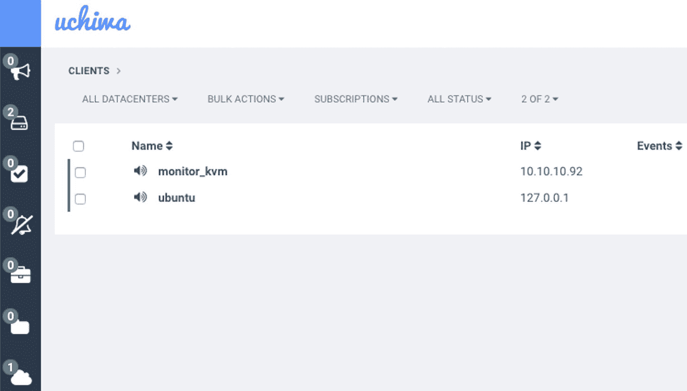
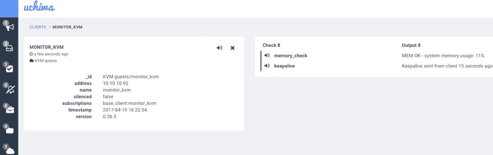
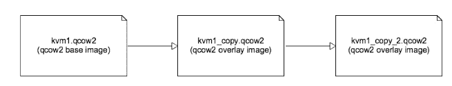

# KVM 虚拟机的监控与备份

在本章中，我们将覆盖以下主题：

+   使用 libvirt 收集资源使用情况

+   使用 Sensu 监控 KVM 实例

+   使用 tar 和 rsync 进行简单的 KVM 备份

+   创建快照

+   列出快照

+   检查快照

+   编辑快照

+   恢复快照

+   删除快照

# 介绍

不言而喻，监控和备份生产环境中的 KVM 实例对于满足正常运行 **服务级别协议**（**SLA**）以及满足高可用性和性能要求至关重要。虚拟机的监控和备份与物理服务器的监控和备份并没有太大不同。在某些情况下，备份虚拟机的单个镜像文件或创建快照比备份运行在物理服务器上的操作系统文件系统更为方便。

在本章中，我们将展示如何收集实时 KVM 实例的资源使用指标，并使用像 Sensu 这样的工具监控资源使用情况并在预定义的阈值上进行告警。随后，我们将专注于使用像 `rsync` 这样的工具备份 KVM 客户机的不同方法，以及使用 `virsh` 命令创建和管理快照。

# 使用 libvirt 收集资源使用情况

监控虚拟机的第一步是熟悉用于收集我们希望后续告警的子系统指标的工具。在本配方中，我们将专注于 KVM 客户机的 CPU、内存和块设备使用情况。我们还将学习如何使用 QEMU 监控套接字和 QEMU 客户机代理。

Libvirt 提供了一组调用，`virsh` 命令利用这些调用来收集指定客户机/域的资源使用信息。我们将在本章稍后的 *使用 Sensu 监控 KVM 实例* 配方中监控并告警这些收集到的信息。

# 准备工作

本配方中，我们需要以下内容：

+   已安装并配置 libvirt 的服务器

+   正在运行的 KVM 实例

# 如何操作...

要收集运行中的实例或虚拟化主机的各种资源使用信息，请执行以下操作：

1.  获取虚拟化主机 CPU 使用情况的信息：

```
root@kvm:~# virsh nodecpustats --percent
usage: 0.0%
user: 0.0%
system: 0.0%
idle: 100.0%
iowait: 0.0%

root@kvm:~#

```

1.  收集虚拟化主机内存使用情况的信息：

```
root@kvm:~# virsh nodememstats
total : 131918328 KiB
free : 103633700 KiB
buffers: 195532 KiB
cached : 25874840 KiB

root@kvm:~#

```

1.  检查 KVM 实例的状态：

```
root@kvm:~# virsh domstate kvm1
running

root@kvm:~#

```

1.  获取 KVM 实例分配的虚拟 CPU（vCPU）数量：

```
root@kvm:~# virsh vcpucount --current kvm1 --live
1

root@kvm:~#

```

1.  收集虚拟机虚拟 CPU 的详细信息：

```
root@kvm:~# virsh vcpuinfo kvm1
VCPU: 0
CPU: 29
State: running
CPU time: 118.8s
CPU Affinity: yyyyyyyyyyyyyyyyyyyyyyyyyyyyyyyyyyyyyyyy

root@kvm:~#

```

1.  收集关于客户机虚拟 CPU 定时器的信息：

```
root@kvm:~# virsh cpu-stats --total kvm1
Total:
cpu_time 175.003045493 seconds
user_time 2.610000000 seconds
system_time 7.510000000 seconds
 root@kvm:~#

```

1.  收集虚拟机的一般信息：

```
root@kvm:~# virsh dominfo kvm1
Id: 30
Name: kvm1
UUID: bd167199-c1c4-de7e-4996-43a7f197e565 OS Type: hvm
State: running
CPU(s): 1
CPU time: 175.6s Max memory: 1048576 KiB
Used memory: 1048576 KiB
Persistent: yes
Autostart: disable Managed save: no
Security model: none
Security DOI: 0

root@kvm:~#

```

1.  收集虚拟机的内存使用情况：

```
root@kvm:~# virsh dommemstat --live kvm1
actual 1048576
swap_in 0
rss 252684

root@kvm:~#

```

1.  获取与 KVM 实例相关的块设备信息：

```
root@kvm:~# virsh domblklist kvm1
Target Source
------------------------------------------------
hda /var/lib/libvirt/images/kvm1.img

root@kvm:~#

```

1.  获取虚拟机块设备的大小信息：

```
root@kvm:~# virsh domblkinfo --device hda kvm1
Capacity: 8589934592
Allocation: 2012381184
Physical: 2012381184

root@kvm:~#

```

1.  获取 KVM 实例的任何块设备错误：

```
root@kvm:~# virsh domblkerror kvm1
No errors found

root@kvm:~#

```

1.  打印 KVM 客户机的块设备统计信息：

```
root@kvm:~# virsh domblkstat --device hda --human kvm1
Device: hda
number of read operations: 42053
number of bytes read: 106145280
number of write operations: 10648
number of bytes written: 96768000
number of flush operations: 4044
total duration of reads (ns): 833974071
total duration of writes (ns): 1180545967
total duration of flushes (ns): 3458623200

root@kvm:~#

```

# 工作原理...

在本教程中，我们从主机操作系统收集各种虚拟化主机和来宾资源利用率信息。在以后的教程中，我们将利用这些信息在监控系统中设置警报，并根据设定的标准和阈值触发相应操作。让我们更详细地回顾一下我们之前执行的步骤。

我们从第 1 步开始收集关于虚拟化主机/主机操作系统的 CPU 利用率信息。接着，在第 2 步收集物理主机的内存利用率信息。请注意，我们也可以使用其他 Linux 命令来完成这项工作，而不是使用`virsh`，但它有助于展示这个概念。

监控 KVM 实例的状态非常重要，以防虚拟机意外终止或在服务器重启后没有自动启动。在第 3 步中，我们获取虚拟机的当前状态。

在第 4、5 和 6 步中，我们收集了关于虚拟机来宾的虚拟 CPU 的信息。我们可以看到分配的 CPU 数量以及其他有用的信息，例如 CPU 花费在内核和用户空间代码上的时间。

在第 7 步中，我们收集了有关虚拟机的更多一般信息；特别值得关注的是我们可以设置警报阈值的总内存和已用内存量。

在第 8 步中，我们获取关于 KVM 实例的内存利用率的信息。我们可以在输出中看到总内存、交换内存和常驻内存的使用情况。

在第 9 步中，我们列出了附加到虚拟机的块设备，并在第 10 步中使用这些信息获取设备容量。如果块设备存在任何错误，第 11 步的命令输出会显示出来，我们可以利用这些信息触发监控警报。

监控附加到 KVM 实例的块设备的性能，可以使用第 12 步命令的输出。

# 还有更多内容...

当我们使用 libvirt 创建虚拟机时，启动的 QEMU 进程会暴露一个监控套接字，我们可以连接到该套接字并收集关于来宾的信息。

让我们看看我们一直在使用的 KVM 实例的情况：

1.  获取来宾实例的进程信息：

```
root@kvm:~# pgrep -lfa kvm1
32332 /usr/bin/qemu-system-x86_64 -name kvm1 -S -machine pc-            i440fx-trusty,accel=kvm,usb=off -m 1024 -realtime mlock=off -smp    1,sockets=1,cores=1,threads=1 -uuid bd167199-c1c4-de7e-4996-43a7f197e565 -no-user-config -nodefaults -chardev socket,id=charmonitor,path=/var/lib/libvirt/qemu/kvm1.monitor,server,nowait -mon chardev=charmonitor,id=monitor,mode=control -rtc base=utc -no-shutdown -boot strict=on -device piix3-usb-uhci,id=usb,bus=pci.0,addr=0x1.0x2 -drive file=/var/lib/libvirt/images/kvm1.img,if=none,id=drive-ide0-0-0,format=raw -device ide-hd,bus=ide.0,unit=0,drive=drive-ide0-0-0,id=ide0-0-0,bootindex=1 -netdev tap,fd=24,id=hostnet0 -device rtl8139,netdev=hostnet0,id=net0,mac=52:54:00:55:9b:d6,bus=pci.0,addr=0x3 -chardev pty,id=charserial0 -device isa-serial,chardev=charserial0,id=serial0 -vnc 146.20.141.158:0 -device cirrus-vga,id=video0,bus=pci.0,addr=0x2 -device virtio-balloon-pci,id=balloon0,bus=pci.0,addr=0x4
root@kvm:~#

```

从前面的输出中注意到传递给 QEMU 进程的`*-*chardev socket,id=charmonitor,path=/var/lib/libvirt/qemu/kvm1.monitor`和`-mon chardev=charmonitor,id=monitor,mode=control`参数。

1.  我们可以通过两种方式访问这个套接字，一种是使用`nc`和`socat`等工具连接，另一种是通过`virsh`命令，具体如下：

```
root@kvm:~# virsh qemu-monitor-command kvm1 --hmp "info"
info balloon -- show balloon information
info block [-v] [device] -- show info of one block device or all block devices (and details of images with -v option)
info block-jobs -- show progress of ongoing block device operations
info blockstats -- show block device statistics
info capture -- show capture information
info chardev -- show the character devices
info cpus -- show infos for each CPU
info cpustats -- show CPU statistics
info history -- show the command line history
info irq -- show the interrupts statistics (if available)
info jit -- show dynamic compiler info
info kvm -- show KVM information
info mem -- show the active virtual memory mappings
info mice -- show which guest mouse is receiving events
info migrate -- show migration status
info migrate_cache_size -- show current migration xbzrle cache size
info migrate_capabilities -- show current migration capabilities
info mtree -- show memory tree
info name -- show the current VM name
info network -- show the network state
info numa -- show NUMA information
info pci -- show PCI info
info pcmcia -- show guest PCMCIA status
info pic -- show i8259 (PIC) state
info profile -- show profiling information
info qdm -- show qdev device model list
info qtree -- show device tree
info registers -- show the cpu registers
info roms -- show roms
info snapshots -- show the currently saved VM snapshots
info spice -- show the spice server status
info status -- show the current VM status (running|paused)
info tlb -- show virtual to physical memory mappings
info tpm -- show the TPM device
info trace-events -- show available trace-events & their state
info usb -- show guest USB devices
info usbhost -- show host USB devices
info usernet -- show user network stack connection states
info uuid -- show the current VM UUID
info version -- show the version of QEMU
info vnc -- show the vnc server status

root@kvm:~#

```

1.  要获取关于 KVM 实例网络接口的信息，我们可以运行以下代码：

```
root@kvm:~# virsh qemu-monitor-command kvm1 --hmp "info network"
net0: index=0,type=nic,model=rtl8139,macaddr=52:54:00:55:9b:d6
 \ hostnet0: index=0,type=tap,fd=24

root@kvm:~#

```

QEMU 提供了一个来宾代理守护进程，可以在 KVM 实例内启动，然后从主机操作系统连接。我们可以从主机直接收集额外的数据或更新虚拟机的某些设置。

让我们看一下安装和使用 QEMU 来宾代理的示例：

1.  创建所需目录，该目录将包含 libvirt 主机和运行在 KVM 来宾内的来宾代理之间的通信套接字：

```
 root@kvm:~# mkdir -p /var/lib/libvirt/qemu/channel/target
 root@kvm:~# chown libvirt-qemu:kvm   
            /var/lib/libvirt/qemu/channel/ -R
 root@kvm:~#

```

1.  编辑运行中的虚拟机配置，并在 `<devices>` 部分下添加以下定义：

```
root@kvm:~# virsh edit kvm1
...
 <devices>
 ...
 <channel type='unix'>
 <source mode='bind' path='/var/lib/libvirt/qemu/channel/target/kvm1.org.qemu.guest_agent.0'/>
 <target type='virtio' name='org.qemu.guest_agent.0'/>
 <alias name='channel0'/>
 <address type='virtio-serial' controller='0' bus='0' port='1'/>
 </channel>
 ...
 </devices>
...

Domain kvm1 XML configuration edited.
root@kvm:~#

```

1.  重启 KVM 实例：

```
 root@kvm:~# virsh destroy kvm1
 Domain kvm1 destroyed

 root@kvm:~# virsh start kvm1
 Domain kvm1 started

 root@kvm:~#

```

1.  连接到虚拟机并安装和启动 QEMU 客户机代理，如下所示：

```
root@kvm:~# virsh console kvm1
Connected to domain kvm1
Escape character is ^]

root@debian:~# apt update && apt install qemu-guest-agent
...
root@debian:~# service qemu-guest-agent start
root@debian:~# service qemu-guest-agent status
● qemu-guest-agent.service - LSB: QEMU Guest Agent startup script
 Loaded: loaded (/etc/init.d/qemu-guest-agent)
 Active: active (running) since Wed 2017-04-19 14:44:08 CDT; 33min ago
 Process: 397 ExecStart=/etc/init.d/qemu-guest-agent start (code=exited, status=0/SUCCESS)
 CGroup: /system.slice/qemu-guest-agent.service
 └─425 /usr/sbin/qemu-ga --daemonize -m virtio-serial -p /dev/virti...

Apr 19 14:44:08 debian systemd[1]: Starting LSB: QEMU Guest Agent startup s.....
Apr 19 14:44:08 debian systemd[1]: Started LSB: QEMU Guest Agent startup script.
Hint: Some lines were ellipsized, use -l to show in full.
root@debian:~#

```

1.  回到主机，我们可以看到新的套接字文件：

```
root@kvm:~# ls -la /var/lib/libvirt/qemu/channel/target/
total 8
drwxr-xr-x 2 libvirt-qemu kvm 4096 Apr 19 19:43 .
drwxr-xr-x 3 libvirt-qemu kvm 4096 Apr 19 19:43 ..
srwxr-xr-x 1 libvirt-qemu kvm 0 Apr 19 19:43 kvm1.org.qemu.guest_agent.0
root@kvm:~#

```

1.  让我们从主机连接到客户机代理并列出客户机代理接受的可用命令：

```
root@kvm:~# virsh qemu-agent-command kvm1 --pretty --cmd '{"execute": "guest-info"}'
{
 "return": {
 "version": "2.1.2",
 "supported_commands": [
 {
 "enabled": true,
 "name": "guest-set-vcpus",
 "success-response": true
 },
 {
 "enabled": true,
 "name": "guest-get-vcpus",
 "success-response": true
 },
 {
 "enabled": true,
 "name": "guest-network-get-interfaces",
 "success-response": true
 },
 ...
 ]
 }
}

root@kvm:~#

```

1.  通过运行以下代码获取关于客户机 vCPU 的信息：

```
root@kvm:~# virsh qemu-agent-command kvm1 --pretty --cmd '{"execute": "guest-get-vcpus"}'
{
 "return": [
 {
 "online": true,
 "can-offline": false,
 "logical-id": 0
 }
 ]
}

root@kvm:~#

```

使用监控和客户端代理套接字提供了一种额外的方式，可以收集关于在 libvirt 主机上运行的虚拟机的更多信息，之后我们可以将这些信息添加为监控检查。

# 使用 Sensu 监控 KVM 实例

Sensu 是一个完整的监控解决方案，采用客户端-服务器模型；服务器在 Rabbitmq 服务提供的消息队列中发布检查。客户端/代理订阅队列中的主题，并在它们运行的主机上执行指定的检查。状态和历史数据存储在 Redis 服务器中。

在本篇教程中，我们将把 Sensu 服务器、Rabbitmq 消息队列和 Redis 服务器安装在同一主机上，编写一个简单的监控检查，使用我们从*使用 libvirt 收集资源使用情况*教程中获取的信息，并在 KVM 客户机中安装 Sensu 代理。

# 准备工作

对于本篇教程，我们需要以下内容：

+   安装并运行 libvirt 的 Linux 主机

+   在 libvirt 主机上运行的 KVM 实例

+   KVM 实例与 libvirt 主机之间的网络连接

# 如何操作...

要设置新的 Sensu 部署并定义各种监控检查，请执行以下步骤：

1.  安装 Redis 服务器并确保它响应请求：

```
root@kvm:~# apt-get install -y redis-server
...
root@kvm:~# redis-cli ping
PONG
root@kvm:~#

```

1.  安装 Rabbitmq 服务器：

```
root@kvm:~# apt-get install -y rabbitmq-server
...
root@kvm:~#

```

1.  创建 Sensu 代理将订阅的虚拟主机，以及 Rabbitmq 客户端的凭证和权限：

```
root@kvm:~# rabbitmqctl add_vhost /sensu
Creating vhost "/sensu" ...
...done.
root@kvm:~# rabbitmqctl add_user sensu secret
Creating user "sensu" ...
...done.
root@kvm:~# rabbitmqctl set_permissions -p /sensu sensu ".*" ".*" ".*"
Setting permissions for user "sensu" in vhost "/sensu" ...
...done.
root@kvm:~#

```

1.  添加 Sensu 上游仓库及其密钥，然后安装 Sensu 包：

```
root@kvm:~# wget -q https://sensu.global.ssl.fastly.net/apt/pubkey.gpg -O- | apt-key add -
OK
root@kvm:~# echo "deb https://sensu.global.ssl.fastly.net/apt sensu main" | tee /etc/apt/sources.list.d/sensu.list
deb https://sensu.global.ssl.fastly.net/apt sensu main
root@kvm:~# apt-get update
...
root@kvm:~# apt-get install -y sensu
...
root@kvm:~# 

```

1.  Sensu 使用基于 JSON 的配置文件进行配置。创建 Sensu API 配置文件：

```
root@kvm:/etc/sensu/conf.d# cat api.json
{
 "api": {
 "host": "localhost",
 "bind": "0.0.0.0",
 "port": 4567
 }
}
root@kvm:/etc/sensu/conf.d#

```

1.  配置 Sensu 的传输类型；我们在此部署中使用 Rabbitmq：

```
root@kvm:/etc/sensu/conf.d# cat transport.json
{
 "transport": {
 "name": "rabbitmq",
 "reconnect_on_error": true
 }
}
root@kvm:/etc/sensu/conf.d#

```

1.  配置 Rabbitmq 服务接受连接的位置、虚拟主机和凭证：

```
root@kvm:/etc/sensu/conf.d# cat rabbitmq.json
{
 "rabbitmq": {
 "host": "0.0.0.0",
 "port": 5672,
 "vhost": "/sensu",
 "user": "sensu",
 "password": "secret"
 }
}
root@kvm:/etc/sensu/conf.d#

```

1.  指定 Redis 服务监听的主机和端口：

```
root@kvm:/etc/sensu/conf.d# cat redis.json
{
 "redis": {
 "host": "localhost",
 "port": 6379
 }
}
root@kvm:/etc/sensu/conf.d#

```

1.  配置 Sensu 客户端：

```
root@kvm:/etc/sensu/conf.d# cat client.json
{
 "client": {
 "name": "ubuntu",
 "address": "127.0.0.1",
 "subscriptions": [
 "base"
 ],
 "socket": {
 "bind": "127.0.0.1",
 "port": 3030
 }
 }
}

root@kvm:/etc/sensu/conf.d#

```

有关 Sensu 的更多信息，请参见 [`sensuapp.org/docs/`](https://sensuapp.org/docs/)。

1.  安装 Sensu 的 Web 前端，名为 **Uchiwa**：

```
root@kvm:/etc/sensu/conf.d# apt-get install -y uchiwa
...
root@kvm:/etc/sensu/conf.d

```

1.  配置 Uchiwa 前端：

```
root@kvm:/etc/sensu/conf.d# cat /etc/sensu/uchiwa.json
{
 "sensu": [
 {
 "name": "KVM guests",
 "host": "localhost",
 "ssl": false,
 "port": 4567,
 "path": "",
 "timeout": 5000
 }
 ],
 "uchiwa": {
 "port": 3000,
 "stats": 10,
 "refresh": 10000
 }
}

root@kvm:/etc/sensu/conf.d#

```

1.  启动 Sensu 服务器、API、客户端和前端组件：

```
root@kvm:/etc/sensu/conf.d# /etc/init.d/sensu-server start
 * Starting sensu-server [ OK ]
root@kvm:/etc/sensu/conf.d# /etc/init.d/sensu-api start
 * Starting sensu-api [ OK ]
root@kvm:/etc/sensu/conf.d# /etc/init.d/sensu-client start
 * Starting sensu-client [ OK ]
root@kvm:/etc/sensu/conf.d# /etc/init.d/uchiwa restart
uchiwa started.
root@kvm:/etc/sensu/conf.d#

```

1.  连接到 KVM 实例控制台；安装并配置 Sensu 客户端：

```
root@kvm:/etc/sensu/conf.d# virsh console kvm1
Connected to domain kvm1
Escape character is ^]

root@debian:~# wget -q https://sensu.global.ssl.fastly.net/apt/pubkey.gpg -O- | apt-key add -
OK
root@debian:~# echo "deb https://sensu.global.ssl.fastly.net/apt sensu main" | tee /etc/apt/sources.list.d/sensu.list
deb https://sensu.global.ssl.fastly.net/apt sensu main
root@debian:~# apt install apt-transport-https
root@debian:~# apt update && apt install sensu
...
root@debian:~# cd /etc/sensu/conf.d/
root@debian:/etc/sensu/conf.d# cat client.json
{
 "client": {
 "name": "monitor_kvm",
 "address": "10.10.10.92",
 "subscriptions": ["base"]
 }
}

root@debian:/etc/sensu/conf.d# cat rabbitmq.json
{
 "rabbitmq": {
 "host": "10.10.10.1",
 "port": 5672,
 "vhost": "/sensu",
 "user": "sensu",
 "password": "secret"
 }
}

root@debian:/etc/sensu/conf.d# cat transport.json
{
 "transport": {
 "name": "rabbitmq",
 "reconnect_on_error": true
 }
}

root@debian:/etc/sensu/conf.d#

```

将客户端的 IP 地址替换为 KVM 实例中配置的 IP 地址。更新 Rabbitmq 服务器的 IP 地址为主机桥接上配置的 IP 地址。确保 KVM 客户机能够 ping 通主机操作系统上的桥接 IP。

1.  启动 Sensu 客户端：

```
root@debian:/etc/sensu/conf.d# /etc/init.d/sensu-client start
Starting sensu-client:.
root@debian:/etc/sensu/conf.d#

```

1.  连接到 Uchiwa 界面，确保主机 Sensu 客户端和 KVM 客户端 Sensu 客户端都列在 CLIENTS 部分：



显示已连接客户端的 Uchiwa 前端

1.  在仍然连接到 KVM 客户端时，从 gem 仓库安装内存检查并进行测试：

```
root@debian:/etc/sensu/conf.d# apt install rubygems
...
root@debian:/etc/sensu/conf.d# gem search sensu | grep plugins | grep memory
sensu-plugins-memory (0.0.2)
sensu-plugins-memory-checks (2.1.0)
root@debian:/etc/sensu/conf.d#
root@debian:/etc/sensu/conf.d# gem install sensu-plugins-memory-checks
...
root@debian:/etc/sensu/conf.d# /etc/init.d/sensu-client restart
configuration is valid
Stopping sensu-client:.
Starting sensu-client:.
oot@debian:/etc/sensu/conf.d# /usr/local/bin/check-memory-percent.rb -w 80 -c 9
MEM OK - system memory usage: 11%
root@debian:/etc/sensu/conf.d#

```

1.  返回主机操作系统，定义 KVM 客户端的新内存检查：

```
root@kvm:/etc/sensu/conf.d# cat check_memory.json
{
 "checks": {
 "memory_check": {
 "command": "/usr/local/bin/check-memory-percent.rb -w 80 -c 90",
 "subscribers": ["base"],
 "handlers": ["default"],
 "interval": 300
 }
 }
}
root@kvm:/etc/sensu/conf.d#

```

1.  重启 Sensu 组件：

```
root@kvm:/etc/sensu/conf.d# /etc/init.d/uchiwa restart Killing uchiwa (pid 15350) with SIGTERM
Waiting uchiwa (pid 15350) to die...
Waiting uchiwa (pid 15350) to die...
uchiwa stopped.
uchiwa started.
root@kvm:/etc/sensu/conf.d# /etc/init.d/sensu-server restart
configuration is valid
 * Stopping sensu-server [ OK ]
 * Starting sensu-server [ OK ]
root@kvm:/etc/sensu/conf.d# /etc/init.d/sensu-api restart
configuration is valid
 * Stopping sensu-api [ OK ]
 * Starting sensu-api [ OK ]
root@kvm:/etc/sensu/conf.d#

```

1.  KVM 实例的 memory_check 现在显示在 Uchiwa 仪表板中：



显示 KVM 客户端内存检查的 Uchiwa 前端

# 它是如何工作的...

在上一节中，我们安装了 Sensu 服务器及其运行所需的所有基础组件，并将其部署在虚拟化主机上。然后我们在 KVM 实例内安装了客户端，安装了内存 ruby 检查，并在主机上定义了它。现在让我们更详细地审视这些步骤。

在步骤 1 中，我们安装 Redis 服务器并确保它接受连接。Redis 是一个键值存储服务，Sensu 用它来存储有关检查、当前状态和连接客户端的历史信息。

在配置好 Redis 服务器后，我们继续在步骤 2 到 9 中安装并配置 Rabbitmq。Rabbitmq 是一个符合 **高级消息队列协议**（**AMQP**）标准的消息总线。Sensu 服务器和客户端从队列中生成和消费消息，以触发监控操作。

尽管不是必须的，但在步骤 10 和 11 中，我们安装并配置了名为 Uchiwa 的 Sensu 服务器的 Web 前端。我们可以使用 Web 界面检查我们监控的 KVM 客户端的不同检查状态。

在步骤 13 中，我们在 KVM 客户端实例内安装了 Sensu 客户端，并在步骤 16 中安装了来自 gem 的内存监控脚本。监控脚本可以使用任何语言编写（此处使用 RUBY），只要它返回 Sensu 所期望的错误代码。在下一节中，我们将从头开始使用 Bash 编写一个新的检查。

# 还有更多...

在上一节中，我们看到了如何在 KVM 实例中使用 ruby 检查并监控内存使用情况的示例。Sensu 提供了独立的检查，可以从 Sensu 客户端触发，独立于 Sensu 服务器的调度机制。让我们使用这个功能，编写一个简单的 Bash 检查脚本，该脚本将从主机操作系统运行，而不是从 KVM 客户端运行，并使用 `virsh` 命令检查 KVM 实例的状态：

1.  使用 `sensu-client` 执行检查的自定义脚本编写独立检查定义：

```
root@kvm:/etc/sensu/conf.d# cat check_kvm_instance_status.json
{
 "checks": {
 "check_kvm_instance_status": {
 "command": "check_kvm_instance_status.sh -n kvm1",
 "standalone": true,
 "subscribers": ["base"],
 "interval": 60
 }
 }
}
root@kvm:/etc/sensu/conf.d#

```

1.  在 Sensu 的 `plugins` 目录中，编写这个简单的 Bash 脚本：

```
root@kvm:/etc/sensu/conf.d# cd ../plugins/
root@kvm:/etc/sensu/plugins# cat check_kvm_instance_status.sh
#!/bin/bash
# Checks if a KVM instance is running

usage()
{
 echo "Usage: `basename $0` -n|--name kvm1"
 exit 2
}

sanity_check()
{
 if [ "$INSTANCE_NAME" == "" ]
 then
 usage
 fi
}

report_result()
{
 if [ "$INSTANCE_STATE" == "shut off" ]
 then
 echo "CRITICAL - KVM instance $INSTANCE_NAME is not running"
 exit 2
 else
 echo "OK - KVM instance $INSTANCE_NAME is running"
 exit 0
 fi
}

check_instance_state()
{
 declare -g INSTANCE_STATE="shut off"

 INSTANCE_STATE=$(sudo /usr/bin/virsh domstate $INSTANCE_NAME)
}

main()
{
 sanity_check
 check_instance_state
 report_result
}

while [[ $# > 1 ]]
do
 key=$1

 case $key in
 -n|--name)
 INSTANCE_NAME=$2
 shift
 ;;
 *)
 usage
 ;;
 esac
 shift
done

main

root@kvm:/etc/sensu/plugins#

```

1.  使脚本可执行，在 `sudoers` 文件中添加 Sensu 用户，并通过执行它来测试检查：

```
root@kvm:/etc/sensu/plugins# chmod u+x check_kvm_instance_status.sh
root@kvm:/etc/sensu/plugins# chown sensu:sensu check_kvm_instance_status.sh
root@kvm:/etc/sensu/plugins# echo "sensu ALL=(ALL) NOPASSWD:ALL" > /etc/sudoers.d/sensu
root@kvm:/etc/sensu/plugins# sudo -u sensu ./check_kvm_instance_status.sh --name kvm1
OK - KVM instance kvm1 is running
root@kvm:/etc/sensu/plugins# virsh destroy kvm1
Domain kvm1 destroyed

root@kvm:/etc/sensu/plugins# sudo -u sensu ./check_kvm_instance_status.sh --name kvm1
CRITICAL - KVM instance kvm1 is not running
root@kvm:/etc/sensu/plugins# virsh start kvm1
Domain kvm1 started

root@kvm:/etc/sensu/plugins#

```

1.  重启主机上的 Sensu 客户端；检查日志和 Uchiwa 仪表板，查看新的独立检查：

```
root@kvm:/etc/sensu/conf.d# /etc/init.d/sensu-client restart
configuration is valid
 * Stopping sensu-client [ OK ]
 * Starting sensu-client [ OK ]
root@kvm:/etc/sensu/conf.d# cat /var/log/sensu/sensu-client.log | grep check_kvm_instance_status
{"timestamp":"2017-04-20T17:37:48.409805+0000","level":"warn","message":"loading config file","file":"/etc/sensu/conf.d/check_kvm_instance_status.json"}
{"timestamp":"2017-04-20T17:38:16.746861+0000","level":"info","message":"publishing check result","payload":{"client":"ubuntu","check":{"command":"check_kvm_instance_status.sh -n kvm1","standalone":true,"subscribers":["base"],"interval":60,"name":"check_kvm_instance_status","issued":1492709896,"executed":1492709896,"duration":0.016,"output":"OK - KVM instance kvm1 is running\n","status":0}}}
root@kvm:/etc/sensu/conf.d#

```


显示独立实例检查的 Uchiwa 前端

使用来自*libvirt 资源使用集合*的示例，你现在应该能够编写多种由监控系统 Sensu 执行的检查，这些检查可以在虚拟化主机或 KVM 客户机内运行。

有关 Sensu 如何在触发警报时执行脚本的更多信息，请参考官方文档中的*handlers*部分：[`sensuapp.org/docs/latest/reference/handlers.html`](https://sensuapp.org/docs/latest/reference/handlers.html)。

# 使用 tar 和 rsync 进行简单的 KVM 备份

在这个步骤中，我们将使用`tar`和`rsync`创建 KVM 实例的备份并将其存储在远程服务器上。这是备份 KVM 实例的最简单方法。在接下来的几个步骤中，我们将创建快照并将其作为冷备份使用。

# 准备工作

对于这个极其简单的步骤，我们需要：

+   一个运行中的 libvirt 主机，使用镜像文件作为其后备存储

+   `tar`和`rsync` Linux 工具

+   用于传输备份的远程服务器

# 如何操作…

要使用`tar`和`rsync`备份虚拟机，请执行以下步骤：

1.  创建备份目录并切换到该目录：

```
root@kvm:~# mkdir backup_kvm1 && cd backup_kvm1
root@kvm:~/backup_kvm1#

```

1.  查找 KVM 客户机镜像文件的位置：

```
root@kvm:~/backup_kvm1# virsh dumpxml kvm1 | grep "source file"
 <source file='/var/lib/libvirt/images/kvm1.img'/>
root@kvm:~/backup_kvm1#

```

1.  将当前实例配置保存到磁盘：

```
root@kvm:~/backup_kvm1# virsh dumpxml kvm1 > kvm1.xml
root@kvm:~/backup_kvm1#

```

1.  停止 KVM 客户机并将镜像文件复制到备份目录：

```
root@kvm:~/backup_kvm1# virsh destroy kvm1
Domain kvm1 destroyed

root@kvm:~/backup_kvm1# cp /var/lib/libvirt/images/kvm1.img .
root@kvm:~/backup_kvm1# ls -lah
total 2.4G
drwxr-xr-x 2 root root 4.0K Apr 20 18:37 .
drwx------ 7 root root 4.0K Apr 20 18:36 ..
-rwxr-xr-x 1 root root 8.0G Apr 20 18:37 kvm1.img
-rw-r--r-- 1 root root 3.0K Apr 20 18:36 kvm1.xml
root@kvm:~/backup_kvm1#

```

1.  为虚拟机的配置和镜像文件创建一个单独的存档：

```
root@kvm:~/backup_kvm1# tar jcvf kvm1_backup.tar.bz .
./
./kvm1.img
./kvm1.xml
root@kvm:~/backup_kvm1# rm kvm1.img kvm1.xml
root@kvm:~/backup_kvm1#

```

1.  将备份存档传输到远程服务器：

```
root@kvm:~/backup_kvm1# rsync -vaz kvm1_backup.tar.bz kvm2:/tmp
sending incremental file list
kvm1_backup.tar.bz

sent 842,977,610 bytes received 35 bytes 26,761,195.08 bytes/sec
total size is 845,671,214 speedup is 1.00
root@kvm:~/backup_kvm1#

```

1.  要从备份中恢复，请登录远程服务器并提取存档：

```
root@kvm2:~# cd /tmp/
root@kvm2:/tmp# tar jxfv kvm1_backup.tar.bz
./
./kvm1.img
./kvm1.xml
root@kvm2:/tmp#

```

1.  将镜像文件复制到配置的位置并定义实例：

```
root@kvm2:/tmp# cp kvm1.img /var/lib/libvirt/images/
root@kvm2:/tmp# virsh define kvm1.xml
Domain kvm1 defined from kvm1.xml

root@kvm2:/tmp# virsh list --all | grep kvm1
 - kvm1 shut off
root@kvm2:/tmp#

```

# 它是如何工作的…

在第 1 步创建备份目录后，我们在第 3 步将当前的客户机定义保存到磁盘。在第 4 步，停止虚拟机后，我们将其镜像文件复制到备份目录。在第 5 步，我们创建一个 bzip2 压缩的数据文件，并在第 6 步将其传输到远程服务器。

在远程服务器上，我们在第 7 步解压存档，并将原始镜像文件复制到实例的 XML 定义所期望的位置，然后在第 8 步定义实例。

注意，为了在将镜像文件复制到备份目录时保持数据的一致性和完整性，我们必须先停止 KVM 客户机。

# 创建快照

虚拟机快照在特定时间点保留正在运行或已停止实例的当前状态。以后可以用来从该点恢复实例。快照可以作为备份或作为构建新虚拟机的模板，新虚拟机将是原始实例的副本。

为了利用快照，支持存储必须首先支持它。如果你还记得在第一章*，QEMU 和 KVM 入门*中的*使用 qemu-img 管理磁盘镜像*配方，我们为 KVM 客户机创建了一个原始镜像类型。在这个配方中，我们将使用 **QEMU Copy-On-Write** (**QCOW2**) 镜像格式作为 KVM 实例的支持存储，因为原始镜像格式不支持快照。

使用 QCOW2 镜像格式，我们可以创建一个包含客户操作系统以及虚拟机所需一切的基础镜像，然后在原始基础镜像之上创建几个写时复制叠加磁盘镜像。这些新的叠加镜像可以立即在新的虚拟机中使用，通过创建指向新镜像的 XML 定义文件。

在继续进行 libvirt 快照操作之前，让我们看一个使用 QEMU 创建镜像叠加的示例：

1.  要收集 QCOW2 镜像的信息，我们可以使用 `qemu-img` 工具：

```
root@kvm:~# qemu-img info kvm1.qcow2
image: kvm1.qcow2
file format: qcow2
virtual size: 8.0G (8589934592 bytes)
disk size: 2.4G
cluster_size: 65536
Format specific information:
 compat: 1.1
 lazy refcounts: false
root@kvm:~#

```

要将现有的原始镜像转换为 QCOW2，运行：

`root@kvm:~# qemu-img convert -f raw -O qcow2 /var/lib/libvirt/images/kvm1.img /var/lib/libvirt/images/kvm1.qcow2`

1.  让我们基于前面的 qcow2 镜像创建一个新的叠加镜像：

```
root@kvm:~# qemu-img create -f qcow2 -b /var/lib/libvirt/images/kvm1_copy.qcow2 /var/lib/libvirt/images/kvm1_copy_2.qcow2
Formatting '/var/lib/libvirt/images/kvm1_copy_2.qcow2', fmt=qcow2 size=8589934592 backing_file='/var/lib/libvirt/images/kvm1_copy.qcow2' encryption=off cluster_size=65536 lazy_refcounts=off
root@kvm:~#

```

1.  获取新叠加镜像的信息，现在显示它所基于的支持文件：

```
root@kvm:~# qemu-img info kvm1_copy.qcow2
image: kvm1_copy.qcow2
file format: qcow2
virtual size: 8.0G (8589934592 bytes)
disk size: 196K
cluster_size: 65536
backing file: /var/lib/libvirt/images/kvm1.qcow2
Format specific information:
 compat: 1.1
 lazy refcounts: false
root@kvm:~#

```

1.  我们可以从前一个叠加文件创建一个新的叠加文件：

```
root@kvm:~# qemu-img create -f qcow2 -b /var/lib/libvirt/images/kvm1_copy.qcow2 /var/lib/libvirt/images/kvm1_copy_2.qcow2
Formatting '/var/lib/libvirt/images/kvm1_copy_2.qcow2', fmt=qcow2 size=8589934592 backing_file='/var/lib/libvirt/images/kvm1_copy.qcow2' encryption=off cluster_size=65536 lazy_refcounts=off
root@kvm:~# qemu-img info /var/lib/libvirt/images/kvm1_copy_2.qcow2
image: /var/lib/libvirt/images/kvm1_copy_2.qcow2
file format: qcow2
virtual size: 8.0G (8589934592 bytes)
disk size: 196K
cluster_size: 65536
backing file: /var/lib/libvirt/images/kvm1_copy.qcow2
Format specific information:
 compat: 1.1
 lazy refcounts: false
root@kvm:~#

```

1.  让我们列出最后一个叠加文件的整个镜像链：

```
root@kvm:~# qemu-img info --backing-chain /var/lib/libvirt/images/kvm1_copy_2.qcow2
image: /var/lib/libvirt/images/kvm1_copy_2.qcow2
file format: qcow2
virtual size: 8.0G (8589934592 bytes)
disk size: 196K
cluster_size: 65536
backing file: /var/lib/libvirt/images/kvm1_copy.qcow2
Format specific information:
 compat: 1.1
 lazy refcounts: false

image: /var/lib/libvirt/images/kvm1_copy.qcow2
file format: qcow2
virtual size: 8.0G (8589934592 bytes)
disk size: 196K
cluster_size: 65536
backing file: /var/lib/libvirt/images/kvm1.qcow2
Format specific information:
 compat: 1.1
 lazy refcounts: false

image: /var/lib/libvirt/images/kvm1.qcow2
file format: qcow2
virtual size: 8.0G (8589934592 bytes)
disk size: 2.4G
cluster_size: 65536
Format specific information:
 compat: 1.1
 lazy refcounts: false
root@kvm:~# 

```

Libvirt 使用 QCOW2 镜像格式的能力创建叠加快照链，这些快照可以用作备份或新虚拟机的模板。一旦创建了叠加，原始基础镜像将被视为只读。对基础镜像的修改（在此示例中，`kvm1.qcow2` 和 `kvm1_copy.qcow2`，因为它们都是 `kvm1_copy_2.qcow2` 镜像的基础镜像）是不推荐的。以下是我们之前创建的叠加镜像文件链的示意图：



叠加的 QCOW2 镜像链，每一个都作为下一个的基础镜像

# 准备工作

对于这个配方，我们需要以下内容：

+   一个没有附加快照的现有 QCOW2 镜像的 libvirt 主机

+   一个正在运行的 KVM 实例

+   QEMU 工具集

# 如何操作...

创建一个新的 KVM 快照，请按以下步骤操作：

1.  创建正在运行实例的内部快照：

```
root@kvm:~# virsh snapshot-create kvm1
Domain snapshot 1492797458 created
root@kvm:~#

```

1.  检查新快照配置的位置：

```
root@kvm:~# ls -la /var/lib/libvirt/qemu/snapshot/
total 12
drwxr-xr-x 3 libvirt-qemu kvm 4096 Apr 21 14:05 .
drwxr-x--- 6 libvirt-qemu kvm 4096 Apr 21 14:04 ..
drwxr-xr-x 2 root root 4096 Apr 21 17:57 kvm1
root@kvm:~# ls -la /var/lib/libvirt/qemu/snapshot/kvm1/
total 12
drwxr-xr-x 2 root root 4096 Apr 21 17:57 .
drwxr-xr-x 3 libvirt-qemu kvm 4096 Apr 21 14:05 ..
-rw------- 1 root root 3089 Apr 21 17:57 1492797458.xml
root@kvm:~#

```

1.  检查快照的 XML 定义：

```
root@kvm:~# cat /var/lib/libvirt/qemu/snapshot/kvm1/1492797458.xml
<!--
WARNING: THIS IS AN AUTO-GENERATED FILE. CHANGES TO IT ARE LIKELY TO BE
OVERWRITTEN AND LOST. Changes to this xml configuration should be made using:
 virsh snapshot-edit
or other application using the libvirt API.
-->

<domainsnapshot>
 <name>1492797458</name>
 <state>running</state>
 <creationTime>1492797458</creationTime>
 <memory snapshot='internal'/>
 <disks>
 <disk name='hda' snapshot='internal'/>
 </disks>
 <domain type='kvm'>
 <name>kvm1</name>
 ...
 </domain>
 <active>1</active>
</domainsnapshot>
root@kvm:~#

```

1.  收集基础镜像的信息：

```
root@kvm:~# qemu-img info /var/lib/libvirt/images/kvm1.qcow2
image: /var/lib/libvirt/images/kvm1.qcow2
file format: qcow2
virtual size: 8.0G (8589934592 bytes)
disk size: 2.4G
cluster_size: 65536
Snapshot list:
ID TAG         VM SIZE   DATE                   VM CLOCK
1  1492797458  155M      2017-04-21 17:57:38    03:41:16.790
Format specific information:
 compat: 1.1
 lazy refcounts: false
root@kvm:~#

```

1.  获取虚拟机上磁盘设备的信息：

```
root@kvm:~# virsh domblklist kvm1
Target  Source
------------------------------------------------
hda     /var/lib/libvirt/images/kvm1.qcow2

root@kvm:~#

```

1.  创建一个外部的，仅磁盘的快照：

```
root@kvm:~# virsh snapshot-create-as kvm1 kvm1_ext_snapshot "Disk only external snapshot for kvm1" --disk-only --diskspec hda,snapshot=external,file=/var/lib/libvirt/images/kvm1_disk_external.qcow2
Domain snapshot kvm1_ext_snapshot created
root@kvm:~#

```

1.  获取外部快照的信息：

```
root@kvm:~# qemu-img info /var/lib/libvirt/images/kvm1_disk_external.qcow2
image: /var/lib/libvirt/images/kvm1_disk_external.qcow2
file format: qcow2
virtual size: 8.0G (8589934592 bytes)
disk size: 196K
cluster_size: 65536
backing file: /var/lib/libvirt/images/kvm1.qcow2
backing file format: qcow2
Format specific information:
 compat: 1.1
 lazy refcounts: false
root@kvm:~#

```

# 它是如何工作的…

有两种主要类型的快照：

+   **内部快照**：基础镜像文件本身包含保存的状态以及虚拟机的所有后续更改

+   **外部快照**：基础镜像将包含虚拟机的保存状态，从而成为一个只读的基础镜像，并创建一个新的叠加镜像来跟踪未来的任何更改。

两种类型的快照可以仅在虚拟机的磁盘或内存上执行，无论虚拟机是在线还是已停止。

在之前的步骤 1 中，我们创建了虚拟机的一个内部快照。快照完成后，只有一个镜像文件：原始镜像，现在包含了快照。我们可以在步骤 4 的 *快照列表* 部分看到这个镜像是一个快照。

在步骤 6 中，我们执行一个外部的仅磁盘快照，通过指定虚拟机磁盘、名称和快照的存储位置来完成。请注意，快照后，会创建一个新镜像文件来跟踪任何后续的更改。我们将在步骤 7 中检查该文件。请注意，基础文件是原始的 qcow2 镜像。

要执行磁盘快照，libvirt 利用 QEMU 功能，就像我们在创建叠加镜像时看到的 `qemu-img` 命令一样。

我们现在可以将快照保存为备份，或者使用它们启动新的虚拟机。在接下来的示例中，我们将看到如何使用和操作这些快照。

# 列出快照

在之前的示例中，我们为同一个 KVM 实例创建了两个快照：一个内部快照和一个仅磁盘的外部快照。在这个示例中，我们将学习如何列出现有的快照。

# 准备工作

对于此示例，我们需要：

+   配有 QEMU 工具集的 libvirt 主机

+   一个正在运行的 KVM 实例

+   我们在 *创建快照* 示例中创建的快照

# 如何执行...

要列出所有现有的快照，请按照以下步骤操作：

1.  列出指定 KVM 实例的所有快照：

```
root@kvm:~# virsh snapshot-list kvm1
 Name                 Creation Time               State
------------------------------------------------------------
 1492797458           2017-04-21 17:57:38 +0000   running
 kvm1_ext_snapshot    2017-04-21 18:08:49 +0000   disk-snapshot

root@kvm:~#

```

1.  仅列出基于磁盘的快照：

```
root@kvm:~# virsh snapshot-list --disk-only kvm1
 Name                Creation Time              State
------------------------------------------------------------
 kvm1_ext_snapshot   2017-04-21 18:08:49 +0000  disk-snapshot

root@kvm:~#

```

1.  仅列出内部快照：

```
root@kvm:~# virsh snapshot-list --internal kvm1
 Name         Creation Time              State
------------------------------------------------------------
 1492797458   2017-04-21 17:57:38 +0000  running

root@kvm:~#

```

1.  仅列出外部快照：

```
root@kvm:~# virsh snapshot-list --external kvm1
 Name Creation Time State
------------------------------------------------------------
 kvm1_ext_snapshot 2017-04-21 18:08:49 +0000 disk-snapshot

root@kvm:~#

```

1.  以层次树格式列出所有镜像：

```
root@kvm:~# virsh snapshot-list --tree kvm1
1492797458
 |
 +- kvm1_ext_snapshot

root@kvm:~#

```

# 它是如何工作的...

我们使用了多功能的 `virsh snapshot-list` 命令来列出指定虚拟机的所有内部和外部快照。请注意，我们如何可以通过直接在镜像文件上使用 `qemu-img` 命令获取类似的信息，就像我们在本章之前看到的那样。然而，libvirt 提供的列出快照的 API 调用要方便得多。在下一章中，我们将看到如何使用 libvirt 的 Python 绑定来操作 KVM 实例及其快照。

# 检查快照

在这个简短的示例中，我们将看到如何获取现有虚拟机快照的更多信息。

# 准备工作

对于此示例，我们需要以下内容：

+   配有 QEMU 工具集的 libvirt 主机

+   我们在 *创建快照* 示例中创建的快照

# 如何执行...

要检查一个快照，请运行以下命令：

1.  列出指定 KVM 实例的所有可用快照：

```
root@kvm:~# virsh snapshot-list kvm1
 Name                Creation Time              State
------------------------------------------------------------
 1492797458          2017-04-21 17:57:38 +0000  running
 kvm1_ext_snapshot   2017-04-21 18:08:49 +0000  disk-snapshot

root@kvm:~#

```

1.  获取正在运行的快照的信息：

```
root@kvm:~# virsh snapshot-info kvm1 --snapshotname 1492797458
Name: 1492797458
Domain: kvm1
Current: no
State: running
Location: internal
Parent: -
Children: 1
Descendants: 1
Metadata: yes

root@kvm:~#

```

1.  获取磁盘快照的信息：

```
root@kvm:~# virsh snapshot-info kvm1 --snapshotname kvm1_ext_snapshot
Name: kvm1_ext_snapshot
Domain: kvm1
Current: yes
State: disk-snapshot
Location: external
Parent: 1492797458
Children: 0
Descendants: 0
Metadata: yes

root@kvm:~#

```

1.  导出磁盘快照的 XML 配置：

```
root@kvm:~# virsh snapshot-dumpxml kvm1 --snapshotname kvm1_ext_snapshot --security-info
<domainsnapshot>
 <name>kvm1_ext_snapshot</name>
 <description>Disk only external snapshot for kvm1</description>
 <state>disk-snapshot</state>
 <parent>
 <name>1492797458</name>
 </parent>
 <creationTime>1492798129</creationTime>
 <memory snapshot='no'/>
 <disks>
 <disk name='hda' snapshot='external' type='file'>
 <driver type='qcow2'/>
 <source file='/var/lib/libvirt/images/kvm1_disk_external.qcow2'/>
 </disk>
 </disks>
 <domain type='kvm'>
 <name>kvm1</name>
 ...
 <devices>
 <emulator>/usr/bin/qemu-system-x86_64</emulator>
 <disk type='file' device='disk'>
 <driver name='qemu' type='qcow2'/>
 <source file='/var/lib/libvirt/images/kvm1.qcow2'/>
 <target dev='hda' bus='ide'/>
 <address type='drive' controller='0' bus='0' target='0' unit='0'/>
 </disk>
 ...
 </devices>
 <seclabel type='none'/>
 </domain>
</domainsnapshot>

```

# 工作原理...

在第 1 步中，我们列出 kvm1 虚拟机的所有可用快照。在第 2 步和第 3 步中，我们获取有关这些快照的信息。特别需要注意的是`Parent`和`Children`字段，它们显示了快照的层级关系。

在第 4 步中，我们检查 KVM 来宾的 XML 定义以及仅包含磁盘的外部快照。我们可以观察到`snapshot='external'`类型和使用`<source file='/var/lib/libvirt/images/kvm1_disk_external.qcow2'/>`标记指定的基础镜像位置。

# 编辑快照

在本教程中，我们将编辑现有快照的 XML 定义并检查更改。

# 准备工作

本教程中，我们将需要以下内容：

+   配备 QEMU 工具集的 libvirt 主机

+   我们在*创建快照*章节中创建的快照

# 操作步骤...

要编辑快照，请运行以下命令：

1.  列出指定 KVM 实例的所有可用快照：

```
root@kvm:~# virsh snapshot-list kvm1
 Name                Creation Time              State
------------------------------------------------------------
 1492797458          2017-04-21 17:57:38 +0000  running
 kvm1_ext_snapshot   2017-04-21 18:08:49 +0000  disk-snapshot

root@kvm:~#

```

1.  编辑磁盘快照并更改其名称和描述：

```
root@kvm:~# virsh snapshot-edit kvm1 --snapshotname kvm1_ext_snapshot --rename
<domainsnapshot>
 <name>kvm1_ext_snapshot_renamed</name>
 <description>Disk only external snapshot for kvm1</description>
 ...
root@kvm:~#

```

1.  更新后的快照列表：

```
root@kvm:~# virsh snapshot-list kvm1
 Name                       Creation Time             State
------------------------------------------------------------
 1492797458                 2017-04-21 17:57:38 +0000 running
 kvm1_ext_snapshot_renamed  2017-04-21 18:08:49 +0000 disk-snapshot

root@kvm:~#

```

# 工作原理...

Libvirt 提供了一种编辑虚拟机快照定义的方法。我们可以更改各种 XML 属性，如快照名称、描述或镜像文件的位置。在第 1 步中，我们列出指定 KVM 实例的所有可用快照，然后继续更新磁盘镜像的名称和描述。最后，在第 3 步中，我们可以看到更改后的外部快照名称。

# 恢复快照

在本教程中，我们将创建一个正在运行的实例的内部快照，进行一次更改，然后使用该快照恢复回原始实例状态。

# 准备工作

本教程中，我们将需要以下内容：

+   带有现有 QCOW2 镜像的 libvirt 主机

+   使用 QCOW2 镜像的正在运行的 KVM 实例

+   QEMU 工具集

# 操作步骤...

要将 KVM 实例的状态恢复到旧状态，请从现有快照中运行以下命令：

1.  连接到 KVM 实例并创建一个新文件：

```
root@kvm:~# virsh console kvm1
Connected to domain kvm1
Escape character is ^]

root@debian:~# touch SNAPSHOT
root@debian:~#
root@kvm:~#

```

1.  创建虚拟机的内部快照：

```
root@kvm:~# virsh snapshot-create kvm1
Domain snapshot 1492802417 created
root@kvm:~#

```

1.  获取关于快照的信息：

```
root@kvm:~# virsh snapshot-info kvm1 --snapshotname 1492802417
Name: 1492802417
Domain: kvm1
Current: yes
State: running
Location: internal
Parent: 1492797458
Children: 0
Descendants: 0
Metadata: yes

root@kvm:~#

```

1.  重新连接到虚拟机并删除第 1 步中创建的文件：

```
root@kvm:~# virsh console kvm1
Connected to domain kvm1
Escape character is ^]

root@debian:~# rm -f SNAPSHOT
root@debian:~#
root@kvm:~#

```

1.  从最新的快照恢复实例：

```
root@kvm:~# virsh snapshot-revert kvm1 --snapshotname 1492802417

root@kvm:~#

```

1.  连接到虚拟机并确认我们在上一步删除的文件是否已重新存在：

```
root@kvm:~# virsh console kvm1
Connected to domain kvm1
Escape character is ^]

root@debian:~# ls -la SNAPSHOT
-rw-r--r-- 1 root root 0 Apr 21 14:08 SNAPSHOT
root@debian:~#
root@kvm:~#

```

# 工作原理...

在第 1 步中，我们通过控制台连接到 KVM 实例并创建一个空文件。我们将使用该文件跟踪虚拟机上的更改。在第 2 步中，我们创建一个内部快照，并在第 3 步中获取更多信息。在第 4 步中，我们再次连接到 KVM 来宾并删除该文件。在第 5 步中，我们从快照恢复，确认实例的状态确实已恢复到快照之前，如我们之前创建的原始文件所示。

# 删除快照

在这个快速指南中，我们将使用 libvirt 删除之前在*创建快照*章节中创建的快照。

# 准备工作

对于本教程，我们只需要以下内容：

+   配备 QEMU 工具集的 libvirt 主机

+   我们在*创建快照*教程中创建的快照

# 如何执行……

要删除快照，请按照以下步骤操作：

1.  列出主机上所有的快照：

```
root@kvm:~# virsh snapshot-list kvm1
 Name                      Creation Time             State
------------------------------------------------------------
 1492797458                2017-04-21 17:57:38 +0000 running
 1492802417                2017-04-21 19:20:17 +0000 running
 kvm1_ext_snapshot_renamed 2017-04-21 18:08:49 +0000 disk-snapshot

root@kvm:~#

```

1.  基于创建时间删除最新的快照：

```
root@kvm:~# virsh snapshot-delete kvm1 --snapshotname 1492802417
Domain snapshot 1492802417 deleted

root@kvm:~#

```

1.  列出剩余的快照：

```
root@kvm:~# virsh snapshot-list kvm1
 Name                       Creation Time             State
------------------------------------------------------------
 1492797458                 2017-04-21 17:57:38 +0000 running
 kvm1_ext_snapshot_renamed  2017-04-21 18:08:49 +0000 disk-snapshot

root@kvm:~#

```

1.  删除最新的快照：

```
root@kvm:~# virsh snapshot-delete kvm1 --current
Domain snapshot 1492797458 deleted

root@kvm:~#

```

# 它是如何工作的……

在第 1 步中，我们列出主机操作系统上的所有快照。然后，在第 2 步中，我们删除最新的快照，指定其名称。在第 3 步中，我们验证该快照确实已被删除。最后，在第 4 步中，我们通过指定*--*current 标志删除最新的镜像。

请注意，为了删除或恢复外部快照，您需要一个版本高于 1.2.2 的 libvirt。如果您的 Linux 发行版在其软件库中没有提供更新的版本，您将需要从源代码编译 libvirt。
