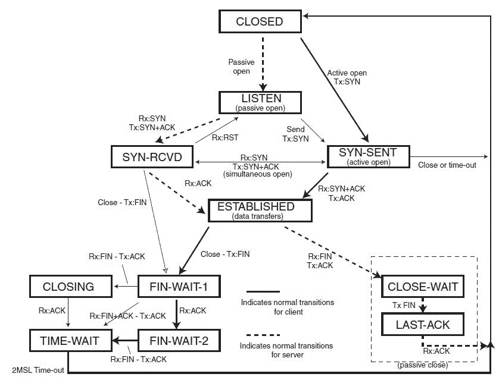

# 第八章：针对 KVM 性能的内核调优

本章将介绍以下性能调优方法：

+   针对低 I/O 延迟调优内核

+   KVM 客户机的内存调优

+   CPU 性能选项

+   使用 libvirt 进行 NUMA 调优

+   针对网络性能调优内核

# 引言

本章将探讨一些配置选项和工具，这些可以帮助提升宿主操作系统及其上运行的 KVM 实例的性能。

在运行 KVM 虚拟机时，重要的是要理解，从宿主的角度来看，它们是普通的进程。我们可以通过检查虚拟化管理程序上的进程树，看到 KVM 客户机是 Linux 进程：

```
root@kvm:~# virsh list
 Id  Name State
----------------------------------------------------
 16  kvm  running

root@kvm:~# pgrep -lfa qemu
19913 /usr/bin/qemu-system-x86_64 -name kvm -S -machine pc-i440fx-trusty,accel=kvm,usb=off -m 1024 -realtime mlock=off -smp 1,sockets=1,cores=1,threads=1 -uuid 283c6653-9981-9396-efb4-fb864d87f769 -no-user-config -nodefaults -chardev socket,id=charmonitor,path=/var/lib/libvirt/qemu/domain-kvm/monitor.sock,server,nowait -mon chardev=charmonitor,id=monitor,mode=control -rtc base=utc -no-shutdown -boot strict=on -device piix3-usb-uhci,id=usb,bus=pci.0,addr=0x1.0x2 -drive file=/tmp/debian.img,format=raw,if=none,id=drive-ide0-0-0 -device ide-hd,bus=ide.0,unit=0,drive=drive-ide0-0-0,id=ide0-0-0,bootindex=1 -netdev tap,fd=26,id=hostnet0 -device rtl8139,netdev=hostnet0,id=net0,mac=52:54:00:2f:df:93,bus=pci.0,addr=0x3 -chardev pty,id=charserial0 -device isa-serial,chardev=charserial0,id=serial0 -vnc 0.0.0.0:0 -device cirrus-vga,id=video0,bus=pci.0,addr=0x2 -device virtio-balloon-pci,id=balloon0,bus=pci.0,addr=0x4 -msg timestamp=on
root@kvm:~#

```

分配给 KVM 客户机的虚拟 CPU 是 Linux 线程，由宿主调度程序管理：

```
root@kvm:~# ps -eLf
UID PID PPID LWP C NLWP STIME TTY TIME CMD
...
libvirt+ 19913 1 19913 0 3 14:02 ? 00:00:00 /usr/bin/qemu-system-x86_64 -name kvm -S -machine pc-i440fx-trusty,accel=kvm,usb=off -m 1024 -realtime mlock=off -smp 1,sockets=1,cores=1,threads=1 -uuid 283c6653-9981-9396-efb4-fb864d87f769 -no-user-config -nodefaul
libvirt+ 19913 1 19914 0 3 14:02 ? 00:00:08 /usr/bin/qemu-system-x86_64 -name kvm -S -machine pc-i440fx-trusty,accel=kvm,usb=off -m 1024 -realtime mlock=off -smp 1,sockets=1,cores=1,threads=1 -uuid 283c6653-9981-9396-efb4-fb864d87f769 -no-user-config -nodefaul
libvirt+ 19913 1 19917 0 3 14:02 ? 00:00:00 /usr/bin/qemu-system-x86_64 -name kvm -S -machine pc-i440fx-trusty,accel=kvm,usb=off -m 1024 -realtime mlock=off -smp 1,sockets=1,cores=1,threads=1 -uuid 283c6653-9981-9396-efb4-fb864d87f769 -no-user-config -nodefaul
...
root@kvm:~#

```

根据 I/O 调度程序的类型、`libvirt` 网络驱动程序以及内存配置的不同，虚拟机的性能可能会有很大差异。在对上述组件进行任何更改之前，了解客户操作系统将执行的工作类型非常重要。为内存密集型工作调优宿主机和客户操作系统与为 I/O 或 CPU 密集型负载调优是不同的。

因为所有 KVM 实例只是普通的 Linux 进程，所以 QEMU 驱动程序可以应用以下任何 **控制组**（**cgroup**）控制器：`cpuset`、`cpu`、`memory`、`blkio` 和设备控制器。使用 cgroup 控制器可以对允许的 CPU、内存和 I/O 资源进行更细粒度的控制，正如我们在接下来的方法中将更详细地看到的那样。

在调优和优化任何系统时，也许最重要的一点是，在进行任何调整之前，首先要确定性能基准。通过测量子系统（如内存或 I/O）的基准性能，进行小幅增量调整，然后再次测量这些变化的影响，必要时重复此过程，直到达到预期效果。

本章中的方法旨在为读者提供一个起点，帮助了解可以在宿主机和虚拟机上进行哪些调优，以提高性能，或考虑在同一宿主机/虚拟机上运行不同工作负载以及多租户环境的副作用。所有资源的调整应根据工作负载类型、硬件设置和其他变量来进行。

# 针对低 I/O 延迟调优内核

本章将介绍一些通过选择 I/O 调度程序和使用 Linux 控制组调优块 I/O 来优化磁盘性能的技巧，适用于虚拟客体和宿主机。

在宿主操作系统和 KVM 实例中，有三种 I/O 调度程序可以选择：

+   `noop`：这是最简单的内核调度程序之一，它通过将所有传入的 I/O 请求插入一个简单的 **FIFO**（**先进先出**）队列来工作。当宿主操作系统在运行多个虚拟机时不应该尝试重新排序 I/O 请求时，这个调度程序非常有用。

+   `deadline`：该调度器对所有 I/O 操作施加一个截止期限，以防止请求饿死，并优先考虑读请求，因为进程通常会在读操作上阻塞。

+   `cfq`：**完全公平队列**（**CFQ**）的主要目标是最大化整体 CPU 利用率，同时提供更好的交互性能。

在主机和客户机上选择正确的 I/O 调度器很大程度上取决于工作负载和底层硬件存储。

一般来说，为客户机操作系统选择`noop`调度器允许主机虚拟化管理程序更好地优化 I/O 请求，因为它能感知来自虚拟客户机的所有请求。然而，如果 KVM 虚拟机的底层存储是 iSCSI 卷或其他远程存储（如 GlusterFS），使用 deadline 调度器可能会获得更好的结果。

在大多数现代 Linux 内核中，`deadline`调度器是默认的，它可能足以满足运行多个 KVM 虚拟机的主机需求。和任何系统调优一样，修改主机和客机操作系统的调度器时需要进行测试。

# 准备工作

本指南需要以下内容：

+   一台安装并配置了 libvirt 和 QEMU 的 Ubuntu 主机

+   一个正在运行的 KVM 虚拟机

# 它是如何实现的...

要更改主机和 KVM 实例上的 I/O 调度器并设置 I/O 权重，请执行以下步骤：

1.  在主机操作系统上，列出当前使用的 I/O 调度器，替换为适合您系统的块设备：

```
root@kvm:~# cat /sys/block/sda/queue/scheduler
noop deadline [cfq]
root@kvm:~#

```

1.  按需更改 I/O 调度器并确保它正在使用，可以运行以下命令：

```
root@kvm:~# echo deadline > /sys/block/sda/queue/scheduler
root@kvm:~# cat /sys/block/sda/queue/scheduler
noop [deadline] cfq
root@kvm:~#

```

1.  为了使更改在服务器重启后仍然有效，请将以下行添加到 GRUB 默认配置文件中并更新：

```
root@kvm:~# echo 'GRUB_CMDLINE_LINUX="elevator=deadline"' >> /etc/default/grub
root@kvm:~# tail -1 /etc/default/grub
GRUB_CMDLINE_LINUX="elevator=deadline"
root@kvm:~# update-grub2
Generating grub configuration file ...
Found linux image: /boot/vmlinuz-3.13.0-107-generic
Found initrd image: /boot/initrd.img-3.13.0-107-generic
done
root@kvm:~# cat /boot/grub/grub.cfg | grep elevator
 linux /boot/vmlinuz-3.13.0-107-generic root=/dev/md126p1 ro elevator=deadline rd.fstab=no acpi=noirq noapic cgroup_enable=memory swapaccount=1 quiet
 linux /boot/vmlinuz-3.13.0-107-generic root=/dev/md126p1 ro elevator=deadline rd.fstab=no acpi=noirq noapic cgroup_enable=memory swapaccount=1 quiet
 linux /boot/vmlinuz-3.13.0-107-generic root=/dev/md126p1 ro recovery nomodeset elevator=deadline
root@kvm:~#

```

1.  对于 KVM 实例，持久化设置 noop I/O 调度器：

```
root@kvm:~# virsh console kvm1
Connected to domain kvm1
Escape character is ^]
root@kvm1:~# echo 'GRUB_CMDLINE_LINUX="elevator=noop"' >> /etc/default/grub
root@kvm1:~# tail -1 /etc/default/grub
GRUB_CMDLINE_LINUX="elevator=noop"
root@kvm1:~# update-grub2
Generating grub configuration file ...
Found linux image: /boot/vmlinuz-3.13.0-107-generic
Found initrd image: /boot/initrd.img-3.13.0-107-generic
done
root@kvm1:~# cat /boot/grub/grub.cfg | grep elevator
 linux /boot/vmlinuz-3.13.0-107-generic root=/dev/md126p1 ro elevator=noop rd.fstab=no acpi=noirq noapic cgroup_enable=memory swapaccount=1 quiet
 linux /boot/vmlinuz-3.13.0-107-generic root=/dev/md126p1 ro elevator=noop rd.fstab=no acpi=noirq noapic cgroup_enable=memory swapaccount=1 quiet
 linux /boot/vmlinuz-3.13.0-107-generic root=/dev/md126p1 ro recovery nomodeset elevator=noop
root@kvm1:~#

```

1.  使用`blkio` cgroup 控制器为 KVM 实例设置权重为 100：

```
root@kvm:~# virsh blkiotune --weight 100 kvm

root@kvm:~# virsh blkiotune kvm
weight : 100
device_weight :
device_read_iops_sec:
device_write_iops_sec:
device_read_bytes_sec:
device_write_bytes_sec:

root@kvm:~#

```

1.  查找主机上的`cgroup`目录层级：

```
root@kvm:~# mount | grep cgroup
none on /sys/fs/cgroup type tmpfs (rw)
systemd on /sys/fs/cgroup/systemd type cgroup (rw,noexec,nosuid,nodev,none,name=systemd)
root@kvm:~#

```

1.  确保 KVM 实例的 cgroup 包含我们之前在`blkio`控制器上设置的权重：

```
root@kvm:~# cat /sys/fs/cgroup/blkio/machine/kvm.libvirt-qemu/blkio.weight
100
root@kvm:~#

```

有关 Linux cgroup 工作原理的详细解释，请参考 Packt 出版的*《LXC 容器化》*一书，链接：[`www.packtpub.com/virtualization-and-cloud/containerization-lxc`](https://www.packtpub.com/virtualization-and-cloud/containerization-lxc)。

# 它是如何工作的...

我们可以通过检查`/sys`虚拟文件系统中的`scheduler`文件来查看内核当前使用的 I/O 调度器。在第 1 步中，我们看到它是`cfq`调度器。接下来，在第 2 步中我们将修改正在运行的系统的 I/O 调度器。请记住，像这样按需更改调度器不会在服务器重启后保持有效。在第 3 步和第 4 步中，我们修改 GRUB 配置文件，将新的调度器信息添加到内核启动指令中。现在重启服务器或虚拟机时将会选择新的 I/O 调度器。

如果在同一主机上运行多个虚拟机，根据特定标准（如时间段和虚拟机工作负载）为其中一些虚拟机分配更高的 I/O 优先级可能会很有用。在第 5 步中，我们使用 `blkio` cgroup 控制器为 KVM 客户机设置一个权重。较低的权重将获得更好的 I/O 优先级。在第 6 步和第 7 步中，我们可以看到正确的 `cgroup` 层次结构已经创建，并且 `blkio.weight` 文件包含了我们通过 `virsh` 命令设置的新权重。

# KVM 客户机的内存调优

在 KVM 客户机的内存调优方面，根据虚拟机的工作负载，提供的选项很少。一个这样的选项是 Linux 的 HugePages。

大多数 Linux 主机默认按 4 KB 的段（称为页面）来分配内存。然而，内核可以使用更大的页面大小。使用 HugePages（大于 4 KB 的页面）可以通过增加 CPU 缓存命中率来提高性能，从而加速事务的**旁路缓冲区**（**TLB**）的访问。TLB 是一种内存缓存，用于存储虚拟内存到物理地址的最近转换，以便快速检索。

在本教程中，我们将启用并设置虚拟化主机和 KVM 客户机上的 HugePages，然后检查 `virsh` 命令提供的调优选项。

# 准备工作

对于本教程，我们将需要以下内容：

+   一个安装并配置了 libvirt 和 QEMU 的 Ubuntu 主机

+   一个正在运行的 KVM 虚拟机

# 如何操作...

要在虚拟化主机和 KVM 客户机上启用和设置 HugePages，并使用 `virsh` 命令设置各种内存选项，请按照以下步骤操作：

1.  检查主机操作系统上当前的 HugePages 设置：

```
root@kvm:~# cat /proc/meminfo | grep -i huge
AnonHugePages: 509952 kB
HugePages_Total: 0
HugePages_Free: 0
HugePages_Rsvd: 0
HugePages_Surp: 0
Hugepagesize: 2048 kB
root@kvm:~#

```

1.  连接到 KVM 客户机并检查当前的 HugePages 设置：

```
root@kvm1:~# cat /proc/meminfo | grep -i huge
HugePages_Total: 0
HugePages_Free: 0
HugePages_Rsvd: 0
HugePages_Surp: 0
Hugepagesize: 2048 kB
root@kvm1:~#

```

1.  将虚拟化主机上 HugePages 池的大小从 0 增加到 25000，并验证以下内容：

```
root@kvm:~# sysctl vm.nr_hugepages=25000
vm.nr_hugepages = 25000
root@kvm:~# cat /proc/meminfo | grep -i huge
AnonHugePages: 446464 kB
HugePages_Total: 25000
HugePages_Free: 24484
HugePages_Rsvd: 0
HugePages_Surp: 0
Hugepagesize: 2048 kB
root@kvm:~# cat /proc/sys/vm/nr_hugepages
25000
root@kvm:~#

```

1.  检查虚拟化主机 CPU 是否支持 2 MB 和 1 GB 的 HugePages 大小：

```
root@kvm:~# cat /proc/cpuinfo | egrep -i "pse|pdpe1" | tail -1
flags : fpu vme de pse tsc msr pae mce cx8 apic sep mtrr pge mca cmov pat pse36 clflush dts acpi mmx fxsr sse sse2 ss ht tm pbe syscall nx pdpe1gb rdtscp lm constant_tsc arch_perfmon pebs bts rep_good nopl xtopology nonstop_tsc aperfmperf eagerfpu pni pclmulqdq dtes64 monitor ds_cpl vmx smx est tm2 ssse3 fma cx16 xtpr pdcm pcid dca sse4_1 sse4_2 x2apic movbe popcnt tsc_deadline_timer aes xsave avx f16c rdrand lahf_lm abm arat epb xsaveopt pln pts dtherm tpr_shadow vnmi flexpriority ept vpid fsgsbase tsc_adjust bmi1 avx2 smep bmi2 erms invpcid
root@kvm:~#

```

1.  通过编辑默认的 GRUB 配置并重启，设置 1 GB 的 HugePages 大小：

```
root@kvm:~# cat /etc/default/grub
...
GRUB_CMDLINE_LINUX_DEFAULT="rd.fstab=no acpi=noirq noapic cgroup_enable=memory swapaccount=1 quiet hugepagesz=1GB hugepages=1"
...
root@kvm:~# update-grub
Generating grub configuration file ...
Found linux image: /boot/vmlinuz-3.13.0-107-generic
Found initrd image: /boot/initrd.img-3.13.0-107-generic
done
root@kvm:~# cat /boot/grub/grub.cfg | grep -i huge
 linux /boot/vmlinuz-3.13.0-107-generic root=/dev/md126p1 ro elevator=deadline rd.fstab=no acpi=noirq noapic cgroup_enable=memory swapaccount=1 quiet hugepagesz=1GB hugepages=1
 linux /boot/vmlinuz-3.13.0-107-generic root=/dev/md126p1 ro elevator=deadline rd.fstab=no acpi=noirq noapic cgroup_enable=memory swapaccount=1 quiet hugepagesz=1GB hugepages=1
root@kvm:~# reboot

```

1.  安装 HugePages 包：

```
root@kvm:~# apt-get install hugepages

```

1.  检查当前的 HugePages 大小：

```
root@kvm:~# hugeadm --pool-list
 Size      Minimum Current Maximum Default
 2097152   25000   25000   25000   *
root@kvm:~#

```

1.  为 KVM 启用 HugePages 支持：

```
root@kvm:~# sed -i 's/KVM_HUGEPAGES=0/KVM_HUGEPAGES=1/g' /etc/default/qemu-kvm
root@kvm:~# root@kvm:~# /etc/init.d/libvirt-bin restart
libvirt-bin stop/waiting
libvirt-bin start/running, process 16257
root@kvm:~#

```

1.  在主机操作系统上挂载 HugeTable 虚拟文件系统：

```
root@kvm:~# mkdir /hugepages
root@kvm:~# echo "hugetlbfs /hugepages hugetlbfs mode=1770,gid=2021 0 0" >> /etc/fstab
root@kvm:~# mount -a
root@kvm:~# mount | grep hugepages
hugetlbfs on /hugepages type hugetlbfs (rw,mode=1770,gid=2021)
root@kvm:~#

```

1.  编辑 KVM 客户机的配置并启用 HugePages：

```
root@kvm:~# virsh destroy kvm1
Domain kvm1 destroyed

root@kvm:~# virsh edit kvm1
...
 <memoryBacking>
 <hugepages/>
 </memoryBacking>
...
Domain kvm1 XML configuration edited.

root@kvm:~# virsh start kvm1
Domain kvm1 started

root@kvm:~#

```

如果在启动 KVM 实例时看到以下错误：`error: internal error: hugetlbfs filesystem is not mounted or disabled by administrator config`，请确保在第 9 步中成功挂载了 HugePages 虚拟文件系统。

如果在启动 KVM 实例时看到以下错误：`error: internal error: process exited while connecting to monitor: file_ram_alloc: can't mmap RAM pages: Cannot allocate memory`，则需要在第 3 步中增加 HugePages 池的大小。

1.  更新 KVM 实例的内存硬限制并进行验证，方法如下：

```
root@kvm:~# virsh memtune kvm1
hard_limit : unlimited
soft_limit : unlimited
swap_hard_limit: unlimited

root@kvm:~# virsh memtune kvm1 --hard-limit 2GB

root@kvm:~# virsh memtune kvm1
hard_limit : 1953125
soft_limit : unlimited
swap_hard_limit: unlimited

root@kvm:~#

```

# 工作原理...

Libvirt 和 KVM 支持并利用 HugePages。请注意，并非每个工作负载都能从大于默认大小的页面中受益。运行数据库和内存绑定的 KVM 实例是良好的使用场景。像往常一样，在启用此功能之前，请先在虚拟机内测量应用程序的性能，以确保它能从 HugePages 中受益。

在本配方中，我们在主机和客户操作系统上启用了 HugePages，并为客户操作系统设置了可用内存的硬性限制。让我们更详细地了解这些步骤。

在步骤 1 和 2 中，我们检查 HugePages 的当前状态。从输出中我们可以看到，目前没有分配 HugePages 池，`HugePages_Total` 字段表明当前 HugePages 的大小为 2 MB。

在步骤 3 中，我们将 HugePages 池的大小增加到 25000。此更改是按需的，并且不会在服务器重启后保持。如果希望其持久化，可以将其添加到 `/etc/sysctl.conf` 文件中。

为了使用 HugePages 特性，我们需要确保主机服务器的 CPU 支持此功能，正如在步骤 4 中显示的 `pse` 和 `pdpe1` 标志所示。

在步骤 5 中，我们配置 GRUB 启动加载程序以启动支持 HugePages 的内核，并设置大小为 1 GB。

尽管我们可以直接操作 `/proc` 虚拟文件系统暴露的文件，但在步骤 6 中，我们安装了 HugePages 包，它提供了一些有用的用户空间工具，用于列出和管理各种内存设置。在步骤 7 中，我们使用 `hugeadm` 命令列出了 HugePages 池的大小。

为了启用 KVM 的 HugePages 支持，我们在步骤 8 中更新了 `/etc/default/qemu-kvm` 文件，在步骤 9 中挂载了虚拟文件系统，最后通过为 `<memoryBacking>` 对象添加 `<hugepages/>` 字段重新配置 KVM 虚拟机以使用 HugePages。

Libvirt 提供了一种方便的方式来管理 KVM 客户机分配的内存量。在步骤 11 中，我们为 `kvm1` 虚拟机设置了 2 GB 的硬性限制。

# CPU 性能选项

有几种方法可以控制 CPU 分配以及 KVM 虚拟机的可用 CPU 周期——通过使用 cgroups 和 libvirt 提供的 CPU 钉扎和亲和性功能，我们将在本配方中探讨这些内容。CPU 亲和性是一种调度器属性，它将进程与主机操作系统上给定的一组 CPU 连接。

在使用 libvirt 配置虚拟机时，默认行为是将客户机分配到任何可用的 CPU 核心。在某些情况下，**非均匀内存访问**（**NUMA**）就是一个需要为每个 KVM 实例指定一个核心的好例子（正如我们将在下一个食谱中看到的那样）。因此，为虚拟机分配指定的 CPU 核心会更好。由于每个 KVM 虚拟机都是一个内核进程（在我们的示例中，更具体地说是 `qemu-system-x86_64`），我们可以使用 `taskset` 或 `virsh` 命令等工具来实现这一点。我们还可以使用 cgroups 的 CPU 子系统来管理 CPU 周期分配，从而对每个虚拟机的 CPU 资源利用进行更细粒度的控制。

# 准备工作

本食谱中，我们需要以下内容：

+   安装并配置了 libvirt 和 QEMU 的 Ubuntu 主机

+   运行中的 KVM 虚拟机

# 如何操作...

要将 KVM 虚拟机固定到特定 CPU 并更改 CPU 共享，请执行以下操作：

1.  获取关于主机上可用 CPU 核心的信息：

```
root@kvm:~# virsh nodeinfo
CPU model: x86_64
CPU(s): 40
CPU frequency: 2593 MHz
CPU socket(s): 1
Core(s) per socket: 10
Thread(s) per core: 2
NUMA cell(s): 2
Memory size: 131918328 KiB

root@kvm:~#

```

1.  获取关于 KVM 客户机的 CPU 分配信息：

```
root@kvm:~# virsh vcpuinfo kvm1
VCPU: 0
CPU: 2
State: running
CPU time: 9.1s
CPU Affinity: yyyyyyyyyyyyyyyyyyyyyyyyyyyyyyyyyyyyyyyy

root@kvm:~#

```

1.  将 KVM 实例的 CPU（`VCPU: 0`）固定到第一个虚拟机 CPU（`CPU: 0`）并显示结果：

```
root@kvm:~# virsh vcpupin kvm1 0 0 --live

root@kvm:~# virsh vcpuinfo kvm1
VCPU: 0
CPU: 0
State: running
CPU time: 9.3s
CPU Affinity: y---------------------------------------

root@kvm:~#

```

1.  列出分配给 KVM 实例的运行时共享数：

```
root@kvm:~# virsh schedinfo kvm1
Scheduler : posix
cpu_shares : 1024
vcpu_period : 100000
vcpu_quota : -1
emulator_period: 100000
emulator_quota : -1

root@kvm:~#

```

1.  修改运行中虚拟机的当前 CPU 权重：

```
root@kvm:~# virsh schedinfo kvm cpu_shares=512
Scheduler : posix
cpu_shares : 512
vcpu_period : 100000
vcpu_quota : -1
emulator_period: 100000
emulator_quota : -1

root@kvm:~#

```

1.  检查 CPU cgroups 子系统中的 CPU 共享：

```
root@kvm:~# cat /sys/fs/cgroup/cpu/machine/kvm1.libvirt-qemu/cpu.shares
512
root@kvm:~#

```

1.  检查更新后的 XML 实例定义：

```
root@kvm:~# virsh dumpxml kvm1
...
 <vcpu placement='static'>1</vcpu>
 <cputune>
 <shares>512</shares>
 <vcpupin vcpu='0' cpuset='0'/>
 </cputune>
 ...
 root@kvm:~#

```

# 它是如何工作的...

我们首先收集关于主机上可用的 CPU 资源信息。从步骤 1 的输出中，我们可以看到主机操作系统在一个插槽上有 40 个 CPU。

在步骤 2 中，我们收集虚拟机 CPU 及其与主机 CPU 的亲和性信息。在这个示例中，KVM 客户机有一个虚拟 CPU，通过 `VCPU: 0` 记录表示，并且与所有 40 个虚拟机处理器相关联，如 `CPU Affinity: yyyyyyyyyyyyyyyyyyyyyyyyyyyyyyyyyyyyyyyy` 字段所示。

在步骤 3 中，我们将虚拟 CPU 固定/绑定到主机上的第一个物理处理器。注意亲和性输出的变化：`CPU Affinity: y---------------------------------------`。

从步骤 4 中 `virsh` 命令的输出中，我们可以观察到分配给 KVM 实例的 CPU 共享数被设置为 1024。这个值是一个比率，意味着如果另一个客户机的共享数为 512，它将比一个共享数为 1024 的实例少一倍的 CPU 运行时间。我们将在步骤 5 中减少该值。

在步骤 6 和 7 中，我们确认了 CPU 共享在主机操作系统的 CPU cgroup 子系统中正确设置。如前所述，CPU 共享是通过 cgroups 配置的，可以通过 `virsh` 命令直接调整，或者通过 libvirt 提供的功能进行调整。

# 使用 libvirt 进行 NUMA 调优

NUMA 是一种技术，它允许将系统内存分为多个区域，也称为节点。NUMA 节点随后分配给特定的 CPU 或插槽。与传统的单一内存访问方式不同，在该方式下每个 CPU/核心可以访问所有内存而不考虑其局部性，通常会导致较大的延迟，NUMA 限制的进程可以访问本地 CPU 执行的内存。通常，这比访问连接到远程 CPU 的内存要快得多。

Libvirt 使用 `libnuma` 库为虚拟机启用 NUMA 功能，如下所示：

```
root@kvm:~# ldd /usr/sbin/libvirtd | grep numa
 libnuma.so.1 => /usr/lib/x86_64-linux-gnu/libnuma.so.1 (0x00007fd12d49e000)
root@kvm:~#

```

Libvirt NUMA 支持以下内存分配策略来将虚拟机分配到 NUMA 节点：

+   **strict**: 如果内存无法分配到目标节点，分配将失败

+   **interleave**: 内存页面以轮询方式分配

+   **preferred**: 该策略允许虚拟化主机在指定节点的内存不足时从其他节点提供内存

在本教程中，我们将启用 KVM 实例的 NUMA 访问，并探索其对整体系统性能的影响。

# 准备就绪

对于本教程，我们将需要以下内容：

+   一台安装并配置了 libvirt 和 QEMU 的 Ubuntu 主机

+   一台正在运行的 KVM 虚拟机

+   `numastat` 工具

# 如何操作……

要使用严格 NUMA 策略使 KVM 虚拟机在特定的 NUMA 节点和 CPU 上运行，请执行以下步骤：

1.  安装 `numactl` 包并检查虚拟化主机的硬件配置：

```
root@kvm:~# apt-get install numactl
...
root@kvm:~# numactl --hardware
available: 2 nodes (0-1)
node 0 cpus: 0 1 2 3 4 5 6 7 8 9 20 21 22 23 24 25 26 27 28 29
node 0 size: 64317 MB
node 0 free: 3173 MB
node 1 cpus: 10 11 12 13 14 15 16 17 18 19 30 31 32 33 34 35 36 37 38 39
node 1 size: 64509 MB
node 1 free: 31401 MB
node distances:
node 0 1
 0: 10 21
 1: 21 10
root@kvm:~#

```

1.  显示当前 KVM 客户机的 NUMA 布局：

```
root@kvm:~# numastat -c kvm1

Per-node process memory usage (in MBs) for PID 22395 (qemu-system-x86)
            Node 0    Node 1    Total
            ------    ------    -----
Huge             0         0        0
Heap             1         1        2
Stack            2         2        4
Private         39        21       59
-------     ------    ------    -----
Total           42        23       65
root@kvm:~#

```

1.  编辑 XML 实例定义，将内存模式设置为严格，并选择第二个 NUMA 节点（索引从 0 开始，因此第二个 NUMA 节点标记为 1），然后重启客户机：

```
root@kvm:~# virsh edit kvm1
...
<vcpu placement='static' cpuset='10-11'>2</vcpu>
<numatune>
 <memory mode='strict' nodeset='1'/>
</numatune>
...
Domain kvm1 XML configuration edited.

root@kvm:~# virsh destroy kvm1
Domain kvm1 destroyed

root@kvm:~# virsh start kvm1
Domain kvm1 started

root@kvm:~#

```

1.  获取 KVM 实例的 NUMA 参数：

```
root@kvm:~# virsh numatune kvm1
numa_mode : strict
numa_nodeset : 1

root@kvm:~#

```

1.  打印当前虚拟 CPU 的亲和性：

```
root@kvm:~# virsh vcpuinfo kvm1
VCPU: 0
CPU: 11
State: running
CPU time: 8.4s
CPU Affinity: ----------yy----------------------------

VCPU: 1
CPU: 10
State: running
CPU time: 0.3s
CPU Affinity: ----------yy----------------------------

root@kvm:~#

```

1.  打印 KVM 实例的 NUMA 节点布局：

```
root@kvm:~# numastat -c kvm1

Per-node process memory usage (in MBs) for PID 22395 (qemu-system-x86)
            Node 0    Node 1    Total
            ------    ------    -----
Huge             0         0        0
Heap             0         3        3
Stack            0         2        2
Private          0       174      174
-------     ------    ------    -----
Total            0       179      179
root@kvm:~#

```

# 它是如何工作的……

我们首先检查主机操作系统上的 NUMA 设置。从步骤 1 中 `numactl` 命令的输出中，我们可以观察到虚拟化主机有两个 NUMA 节点：节点 0 和节点 1。每个节点管理一组 CPU。在这种情况下，NUMA 节点 1 包含 CPU 10 到 19 和 CPU 30 到 39，并拥有 64 GB 的内存。这意味着 64 GB 的 RAM 将本地化到这些 CPU 上，并且从这些 CPU 访问内存的速度要比从节点 0 的 CPU 访问内存的速度快得多。为了改善 KVM 客户机的内存访问延迟，我们需要将分配给虚拟机的虚拟 CPU 固定到属于同一 NUMA 节点的 CPU 上。

在步骤 2 中，我们可以看到 KVM 实例使用来自两个 NUMA 节点的内存，这并不理想。

在步骤 3 中，我们编辑了虚拟机的 XML 定义，并使用`cpuset='10-11'`参数将虚拟机固定在第 10 和第 11 个 CPU 上，这些 CPU 属于 NUMA 节点 1。我们还使用`<memory mode='strict' nodeset='1'/>`参数指定了严格的 NUMA 节点以及第二个 NUMA 节点。

在重启实例后，在步骤 4 中，我们确认 KVM 虚拟机现在正在使用严格的 NUMA 模式在节点 1 上运行。我们还确认 CPU 绑定确实符合步骤 5 中指定的内容。请注意，CPU 亲和性已在 CPU 亲和性元素的第 10 和第 11 个元素上标记。

从步骤 6 的输出中，我们可以看到 KVM 虚拟机现在仅使用 NUMA 节点 1 的内存，符合预期。

如果你在 NUMA 调整前后运行一个内存密集型应用并进行测试，你很可能会看到，当访问 KVM 虚拟机内的大量内存时，得益于 NUMA 提供的 CPU 和内存本地性，性能有显著提升。

# 还有更多内容...

在本教程中，我们展示了如何通过编辑虚拟机的 XML 定义手动将 KVM 进程分配到 NUMA 节点。像 RHEL/CentOS 7 和 Ubuntu 16.04 这样的某些 Linux 发行版提供了`numad`（NUMA 守护进程）服务，旨在通过监控当前的内存拓扑，自动平衡 NUMA 节点之间的进程：

1.  在 Ubuntu 16.04 上安装该服务，请运行：

```
root@kvm:~# lsb_release -a
No LSB modules are available.
Distributor ID: Ubuntu
Description: Ubuntu 16.04.2 LTS
Release: 16.04
Codename: xenial
root@kvm2:~# apt install numad
...
root@kvm:~#

```

1.  要启动该服务，请执行以下代码：

```
root@kvm:~# service numad start
root@kvm2:~# pgrep -lfa numad
12601 /usr/bin/numad -i 15
root@kvm:~#

```

1.  要使用`numad`管理特定的 KVM 虚拟机，传递 KVM 实例的进程 ID：

```
root@kvm:~# numad -S 0 -p $(pidof qemu-system-x86_64)
root@kvm:~#

```

1.  该服务将记录任何 NUMA 重平衡尝试：

```
root@kvm:~# tail /var/log/numad.log
Thu May 25 21:06:42 2017: Changing THP scan time in /sys/kernel/mm/transparent_hugepage/khugepaged/scan_sleep_millisecs from 10000 to 1000 ms.
Thu May 25 21:06:42 2017: Registering numad version 20150602 PID 12601
Thu May 25 21:09:25 2017: Adding PID 4601 to inclusion PID list
Thu May 25 21:09:25 2017: Scanning only explicit PID list processes
root@kvm:~#

```

`numad`服务在 OpenStack 计算节点中非常有用，手动进行 NUMA 平衡可能过于繁琐。

# 调优内核以提升网络性能

大多数现代 Linux 内核已针对各种网络工作负载进行了足够的调优。一些发行版提供预定义的调优服务（例如，Red Hat/CentOS 的`tuned`），包括基于服务器角色的配置文件集合。

在深入探讨如何调优虚拟化管理程序之前，让我们回顾一下典型 Linux 主机在数据传输和接收过程中所执行的步骤：

1.  应用程序首先将数据写入套接字，然后这些数据被放入发送缓冲区。

1.  内核将数据封装成**协议数据单元**（**PDU**）。

1.  然后，PDU 被移至每个设备的发送队列。

1.  **网络接口卡**（**NIC**）驱动程序将从发送队列中取出 PDU 并将其复制到 NIC。

1.  NIC 发送数据并触发硬件中断。

1.  在通信通道的另一端，NIC 接收帧，将其复制到接收缓冲区，并触发硬中断。

1.  内核则处理该中断并触发软中断来处理数据包。

1.  最后，内核处理软中断，将数据包上送至 TCP/IP 栈进行解封装，并将其放入接收缓冲区，供进程读取。

在本教程中，我们将探讨一些调整 Linux 内核的最佳实践，这通常能在多租户 KVM 主机上提高网络性能。

请确保在进行任何配置更改之前，通过先测量主机性能来建立基线。进行小范围的增量更改后，再次测量其影响。

本教程中的示例并非旨在直接复制粘贴，而是用于帮助理解可能的正面或负面影响。在使用这些示例时，请作为调优指南参考——实际值必须根据服务器类型和整个环境仔细考虑。

# 准备工作

对于本教程，我们将需要以下内容：

+   一台已安装并配置了 libvirt 和 QEMU 的 Ubuntu 主机

+   一个正在运行的 KVM 虚拟机

# 如何操作...

为了调整内核以获得更好的网络性能，请执行以下步骤（有关内核可调项的更多信息，请阅读*工作原理...*部分）：

1.  增加最大 TCP 发送和接收套接字缓冲区大小：

```
root@kvm:~# sysctl net.core.rmem_max
net.core.rmem_max = 212992
root@kvm:~# sysctl net.core.wmem_max
net.core.wmem_max = 212992
root@kvm:~# sysctl net.core.rmem_max=33554432 net.core.rmem_max = 33554432 root@kvm:~# sysctl net.core.wmem_max=33554432 net.core.wmem_max = 33554432 root@kvm:~#

```

1.  增加 TCP 缓冲区限制：最小、默认和最大字节数。对于 1 GE 网卡，将最大值设置为 16 MB，对于 10 GE 网卡，设置为 32 MB 或 54 MB：

```
root@kvm:~# sysctl net.ipv4.tcp_rmem
net.ipv4.tcp_rmem = 4096 87380 6291456
root@kvm:~# sysctl net.ipv4.tcp_wmem
net.ipv4.tcp_wmem = 4096 16384 4194304
root@kvm:~# sysctl net.ipv4.tcp_rmem="4096 87380 33554432"
net.ipv4.tcp_rmem = 4096 87380 33554432
root@kvm:~# sysctl net.ipv4.tcp_wmem="4096 65536 33554432"
net.ipv4.tcp_wmem = 4096 65536 33554432
root@kvm:~#

```

1.  确保启用 TCP 窗口扩展：

```
root@kvm:~# sysctl net.ipv4.tcp_window_scaling
net.ipv4.tcp_window_scaling = 1
root@kvm:~#

```

1.  为了提高 1 GB 网卡或更大网卡的 TCP 吞吐量，请增加网络接口的发送队列长度。对于往返时延（RTT）大于 50 ms 的路径，建议设置为 5000-10000：

```
root@kvm:~# ifconfig eth0 txqueuelen 5000
root@kvm:~#

```

1.  减少`tcp_fin_timeout`值：

```
root@kvm:~# sysctl net.ipv4.tcp_fin_timeout
net.ipv4.tcp_fin_timeout = 60
root@kvm:~# sysctl net.ipv4.tcp_fin_timeout=30
net.ipv4.tcp_fin_timeout = 30
root@kvm:~#

```

1.  降低`tcp_keepalive_intvl`值：

```
root@kvm:~# sysctl net.ipv4.tcp_keepalive_intvl
net.ipv4.tcp_keepalive_intvl = 75
root@kvm:~# sysctl net.ipv4.tcp_keepalive_intvl=30
net.ipv4.tcp_keepalive_intvl = 30
root@kvm:~#

```

1.  启用`TIME_WAIT`套接字的快速回收。默认值为 0（禁用）：

```
root@kvm:~# sysctl net.ipv4.tcp_tw_recycle
net.ipv4.tcp_tw_recycle = 0
root@kvm:~# sysctl net.ipv4.tcp_tw_recycle=1
net.ipv4.tcp_tw_recycle = 1
root@kvm:~#

```

1.  启用`TIME_WAIT`状态下套接字的重用，以便为新连接使用。默认值为 0（禁用）：

```
root@kvm:~# sysctl net.ipv4.tcp_tw_reuse
net.ipv4.tcp_tw_reuse = 0
root@kvm:~# sysctl net.ipv4.tcp_tw_reuse=1
net.ipv4.tcp_tw_reuse = 1
root@kvm:~#

```

1.  从内核版本 2.6.13 开始，Linux 支持可插拔的拥塞控制算法。所使用的拥塞控制算法通过`sysctl`变量`net.ipv4.tcp_congestion_control`设置，Ubuntu 的默认值为 bic/cubic。要查看内核中可用的拥塞控制算法列表（如果您运行的是 2.6.20 或更高版本），请运行以下命令：

```
root@kvm:~# sysctl net.ipv4.tcp_available_congestion_control
net.ipv4.tcp_available_congestion_control = cubic reno
root@kvm:~#

```

1.  要启用更多可插拔的拥塞控制算法，请加载内核模块：

```
root@kvm:~# modprobe tcp_htcp
root@kvm:~# modprobe tcp_bic
root@kvm:~# modprobe tcp_vegas
root@kvm:~# modprobe tcp_westwood
root@kvm:~# sysctl net.ipv4.tcp_available_congestion_control
net.ipv4.tcp_available_congestion_control = cubic reno htcp bic vegas westwood
root@kvm:~#

```

1.  对于长且快速的路径，通常最好使用 cubic 或 htcp 算法。Cubic 是许多 Linux 发行版的默认算法，但如果在您的系统中不是默认值，您可以执行以下操作：

```
root@kvm:~# sysctl net.ipv4.tcp_congestion_control
net.ipv4.tcp_congestion_control = cubic
root@kvm:~#

```

1.  如果虚拟机监控程序（Hypervisor）被 SYN 连接淹没，以下选项可能有助于减少影响：

```
root@kvm:~# sysctl net.ipv4.tcp_max_syn_backlog
net.ipv4.tcp_max_syn_backlog = 2048
root@kvm:~# sysctl net.ipv4.tcp_max_syn_backlog=16384
net.ipv4.tcp_max_syn_backlog = 16384
root@kvm:~# sysctl net.ipv4.tcp_synack_retries
net.ipv4.tcp_synack_retries = 5
root@kvm:~# sysctl net.ipv4.tcp_synack_retries=1
net.ipv4.tcp_synack_retries = 1
root@kvm:~#

```

1.  拥有足够的可用文件描述符非常重要，因为 Linux 上的几乎所有东西都是文件。每个网络连接都使用一个文件描述符/套接字。要检查当前的最大和可用文件描述符，请运行以下代码：

```
root@kvm:~# sysctl fs.file-nr
fs.file-nr = 1280 0 13110746
root@kvm:~#

```

1.  要增加最大文件描述符，请执行以下操作：

```
root@kvm:~# sysctl fs.file-max=10000000
fs.file-max = 10000000
root@kvm:~# sysctl fs.file-nr
fs.file-nr = 1280 0 10000000
root@kvm:~#

```

1.  如果你的虚拟机监控程序使用有状态的 iptables 规则，`nf_conntrack`内核模块可能会因连接跟踪耗尽内存而导致错误日志记录：`nf_conntrack: table full, dropping packet`。为了提高这个限制并分配更多内存，你需要计算每个连接占用多少 RAM。你可以通过`/proc/slabinfo`文件获取此信息。`nf_conntrack`条目展示了活动条目、每个对象的大小以及每个 slab 中可以容纳多少个对象（每个 slab 通常会占用一个或多个内核页，通常是 4K，如果没有使用 HugePages 的话）。考虑到内核页的开销，你可以从`slabinfo`中看到每个`nf_conntrack`对象大约占用 316 字节（不同系统上可能有所不同）。因此，要跟踪 100 万个连接，你大约需要分配 316 MB 的内存：

```
root@kvm:~# sysctl net.netfilter.nf_conntrack_count
net.netfilter.nf_conntrack_count = 23
root@kvm:~# sysctl net.netfilter.nf_conntrack_max
net.netfilter.nf_conntrack_max = 65536
root@kvm:~# sysctl -w net.netfilter.nf_conntrack_max=1000000
net.netfilter.nf_conntrack_max = 1000000
root@kvm:~# echo 250000 > /sys/module/nf_conntrack/parameters/hashsize # hashsize = nf_conntrack_max / 4
root@kvm:~#

```

# 它是如何工作的...

在第 1 步中，我们增加了最大发送和接收套接字缓冲区的大小。这将为 TCP 栈分配更多内存，但在内存较大且有大量 TCP 连接的服务器上，确保缓冲区大小足够。选择默认值的一个好起点是**带宽延迟积（BDP）**，它是基于测得的延迟，例如，将链路带宽与某个主机的平均往返时间相乘。

在第 2 步中，我们增加了 TCP 用于调节发送缓冲区大小的最小、默认和最大字节数。TCP 会根据默认值动态调整发送缓冲区的大小。

在第 3 步中，我们确保启用了窗口缩放。TCP 窗口缩放会自动增大接收窗口的大小。

有关窗口缩放的更多信息，请参考[`en.wikipedia.org/wiki/TCP_window_scale_option`](https://en.wikipedia.org/wiki/TCP_window_scale_option)。

在第 5 步中，我们减少了`tcp_fin_timeout`值，该值指定在强制关闭套接字之前等待最后一个 FIN 包的秒数。在第 6 和第 7 步中，我们减少了 TCP 保持活动探测的时间间隔，并加速了`TIME_WAIT`状态下套接字的回收。

为了帮助回忆，以下图示展示了连接可能处于的各种 TCP 状态：



TCP 状态图

在第 8 步中，我们仅对新连接启用`TIME_WAIT`状态下的套接字重用。在有大量 KVM 实例的主机上，这可能会显著影响新连接的建立速度。

在第 9 和第 10 步中，我们启用了各种拥塞控制算法。选择哪种拥塞控制算法是在内核构建时确定的。在第 11 步中，我们选择了 cubic 算法，其中窗口是自上次拥塞事件以来时间的立方函数，拐点设置为该事件发生前的窗口大小。

更多关于网络拥塞避免算法的信息，请参考[`en.wikipedia.org/wiki/TCP_congestion_control`](https://en.wikipedia.org/wiki/TCP_congestion_control)。

在遇到大量 SYN 请求的系统中，通过调整尚未收到连接客户端确认的排队连接请求的最大数量，可以使用`tcp_max_syn_backlog`和`tcp_synack_retries`选项进行优化。这一操作我们在第 12 步完成。

在第 13 和第 14 步中，我们增加了系统上的最大文件描述符数量。当系统中有大量网络连接时，这有助于处理，因为每个连接都需要一个文件描述符。

在最后一步，我们有`nf_conntrack_max`选项。如果我们使用`nf_conntrack`内核模块在虚拟机监控器上跟踪连接，这个选项是非常有用的。
