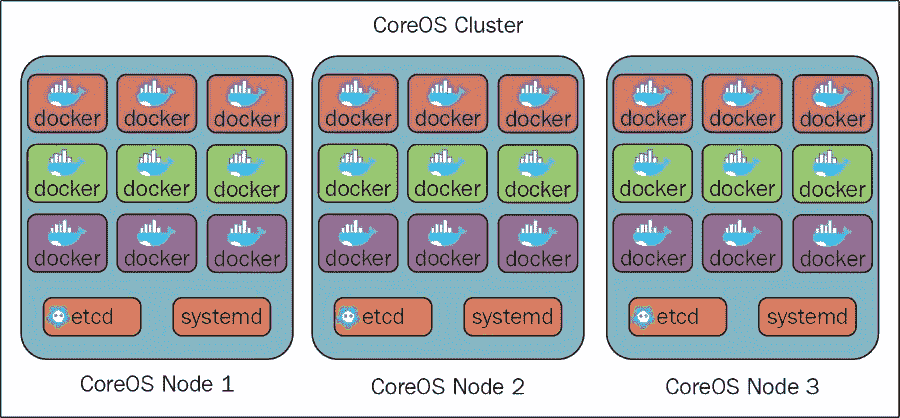
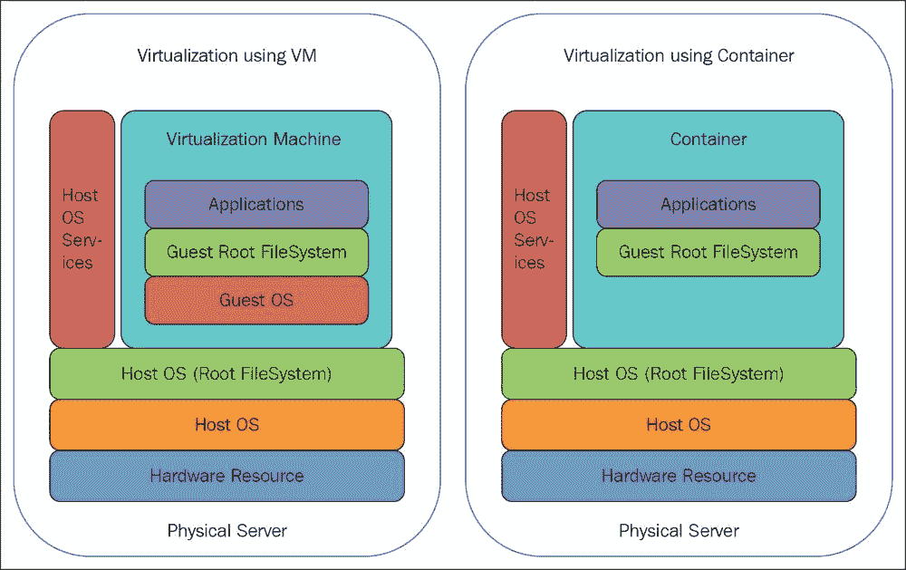
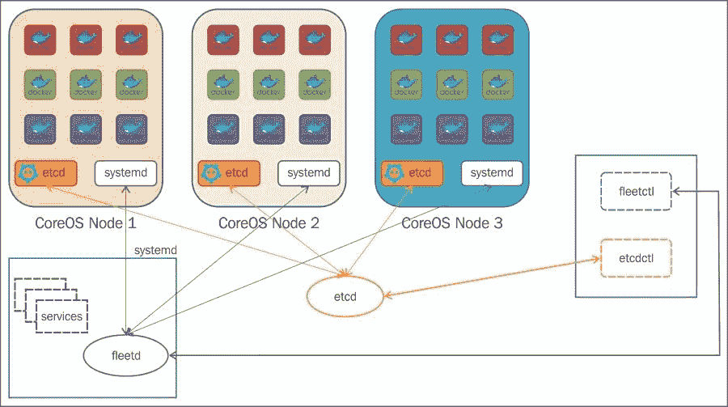
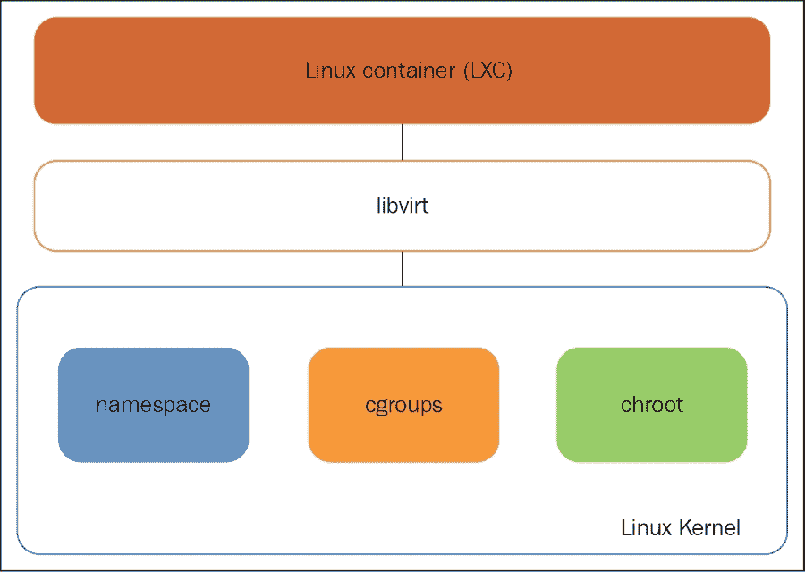
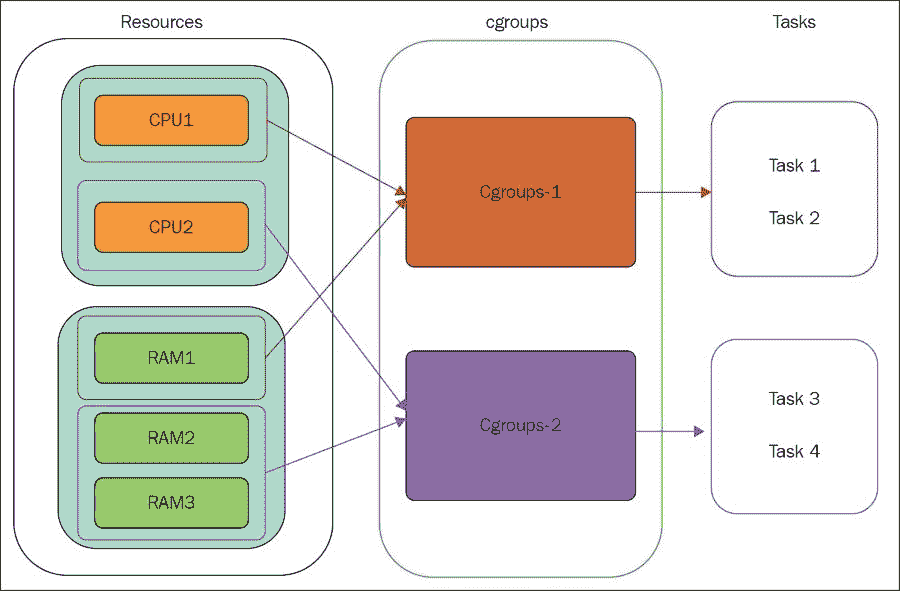
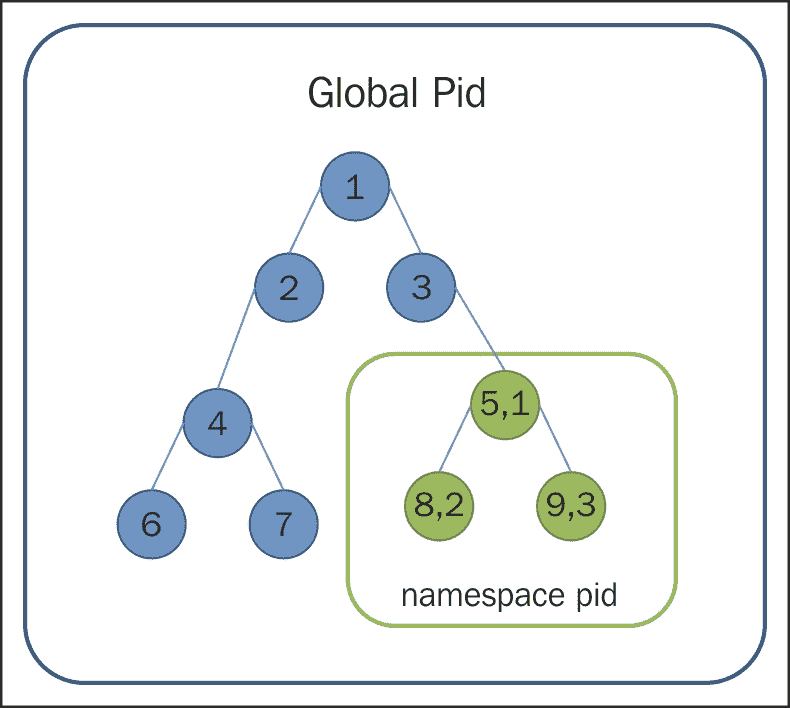
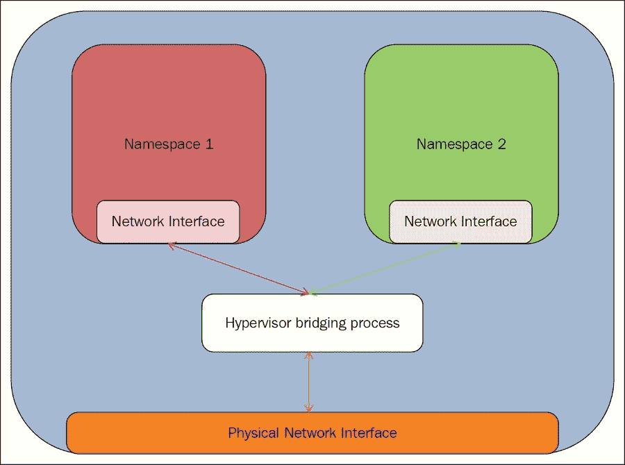
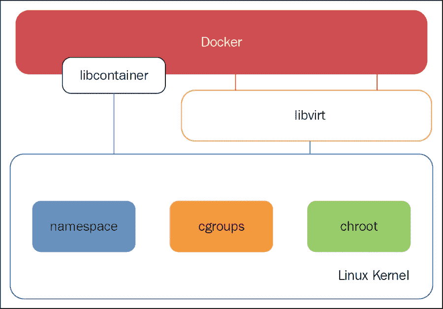
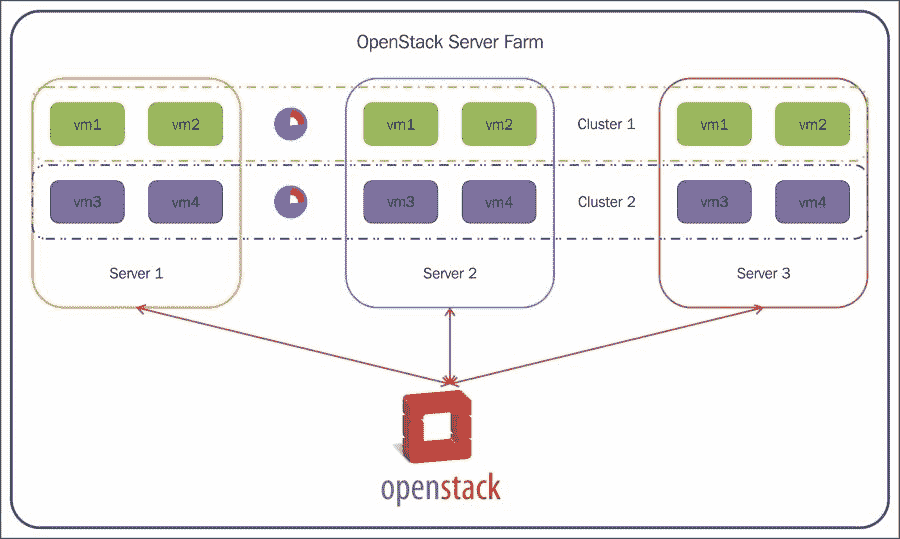

# 第一章：CoreOS，另一种 Linux 发行版？

随着越来越多的应用程序迁移到云端并实现服务器虚拟化，显然需要在正确的服务器集群上快速、可靠地部署用户应用和服务，并确保提供服务水平协议（SLA）。当这些服务具有动态特性时，情况变得更加复杂，这就要求这些服务能够在一组节点上自动配置和自动扩展。用户应用的编排不仅仅限于在正确的服务器或虚拟机上部署服务，还扩展为在这些服务之间提供网络连接，从而提供**基础设施即服务**（**IaaS**）。计算、网络和存储是云服务提供商为提供 IaaS 而需要管理的三种主要资源。目前，有多种机制可以更抽象地处理这些需求。有多个云编排框架可以管理计算、存储和网络资源。OpenStack、Cloud Stack 和 VMware vSphere 是一些执行这些资源池编排并提供 IaaS 的云平台。例如，OpenStack 中的 Nova 服务管理计算资源池并创建虚拟机；Neutron 服务提供必要的信息，以便在虚拟机之间提供虚拟网络连接；等等。

IaaS 云服务提供商应该按需向客户提供所有三种资源，并提供按需付费的模式。云服务提供商将这些资源作为一个资源池进行维护，并按需分配给客户。这为客户提供了灵活性，使他们可以根据业务需求启动和停止服务，从而节省运营支出（OPEX）。通常，在 IaaS 模型中，云服务提供商将这些资源提供为虚拟化资源，即计算使用虚拟机，网络使用虚拟网络，存储使用虚拟存储。运行在物理服务器/计算节点上的虚拟机监控器提供所需的虚拟化功能。

通常，当终端用户请求一个特定操作系统的 IaaS 服务时，云服务提供商会在其云服务器基础设施中创建一个新的**虚拟机**（**Virtual Machine**），并安装用户所请求的操作系统。终端用户可以在这个虚拟机中安装他们的应用程序。当用户请求多个虚拟机时，云服务提供商还应提供这些虚拟机之间的必要网络连接，以便为这些虚拟机中运行的服务提供连接。云编排框架负责在集群中的可用计算节点之一上实例化虚拟机，并提供相关服务，如在这些虚拟机之间提供虚拟网络连接。一旦虚拟机被创建，像 Chef 或 Puppet 这样的配置管理工具可以用于在这些虚拟机上部署应用服务。从理论上讲，这种方法非常有效。

这种方法有三个主要问题：

+   系统中的所有虚拟机都应该运行自己独立的操作系统副本，并具备独立的内存管理和虚拟设备驱动程序。任何部署在这些虚拟机上的应用程序或服务都将由虚拟机中运行的操作系统进行管理。当服务器上运行多个虚拟机时，每个虚拟机都运行单独的操作系统副本，这会导致 CPU 和内存的额外开销。此外，由于虚拟机需要运行自己的操作系统，因此启动/加载虚拟机所需的时间也非常长。

+   该操作系统并不提供服务级虚拟化，即无法在一组虚拟机（VM）上运行服务或应用程序，这些虚拟机是集群的一部分。在虚拟机中运行的操作系统是一个通用操作系统，缺乏集群化概念，也无法在该集群上部署应用程序或服务。简而言之，操作系统提供的是机器级虚拟化，而非服务级虚拟化。

+   从开发环境到生产环境部署一个服务/软件所需的管理工作非常繁重。这是因为每个软件包通常与其他软件存在依赖关系。软件包有成千上万种，每个软件包都有不同的配置集，并且大多数配置组合在性能和扩展性上都有依赖关系。

CoreOS 解决了所有这些问题。在了解 CoreOS 如何解决这些问题之前，我们先来简要介绍一下 CoreOS。

# CoreOS 简介

**CoreOS** 是基于 Google 的 Chrome OS 的轻量级云服务编排操作系统。CoreOS 主要用于在节点集群上编排应用程序/服务。集群中的每个节点都运行 CoreOS，并且集群中的一个 CoreOS 节点将由 etcd 服务选举为主节点。集群中的所有节点都应该能够连接到主节点。系统中的所有从节点向主节点提供关于其系统内运行的服务列表以及配置参数的信息。为了做到这一点，我们可能需要配置 fleet 单元，以便当我们使用 `fleetctl` 命令启动 fleet 单元时，它应将其详细信息（如 IP 和端口）推送到 etcd 服务。主节点的责任是接收服务信息并将其发布到集群中的所有其他节点。在正常情况下，从节点不会相互交流关于服务可用性的信息。集群中所有节点上运行的 etcd 服务负责选举主节点。系统中的所有节点与主节点的 etcd 服务交互，以获取在所有其他节点上运行的服务和配置信息。以下图示展示了 CoreOS 集群架构，其中集群中的所有节点都运行 CoreOS，以及 CoreOS 的其他重要组件如 etcd、systemd 等。etcd 和 fleet 服务用于服务发现和集群管理。在此示例中，所有三个节点都配置有相同的集群 ID，以便这些节点都可以成为单个集群的一部分。一个节点无法成为多个集群的一部分。

CoreOS 集群

所有应用程序或服务都作为 Linux 容器部署在 CoreOS 中。Linux 容器提供了一种轻量级的服务器虚拟化基础设施，而无需运行自己的操作系统或任何虚拟化程序。它使用主机操作系统提供的基于操作系统级别的虚拟化技术，使用命名空间的概念。这极大地改善了在物理服务器上运行的虚拟化实例的扩展性和性能。这解决了在虚拟机内部运行应用程序的第一个问题。

以下图示展示了在虚拟机内运行的应用程序与在 LXC 容器中运行的应用程序之间的区别。在以下图示中，虚拟机的虚拟化方式在虚拟机中安装了客户操作系统和主机操作系统。在基于 Linux 容器的实现中，容器没有独立的操作系统副本；相反，它使用主机操作系统提供的服务来处理所有与操作系统相关的功能。

虚拟机与 Linux 容器的对比

CoreOS 扩展了 Linux 提供的现有服务，使其能够在分布式集群中工作，而不仅限于单一节点。例如，CoreOS 扩展了大多数 Linux 发行版提供的系统管理服务，使其能够在节点集群上启动、停止或重启应用程序/服务，而不是仅限于单个节点，并使用 fleet 工具进行管理。与仅在自身节点上运行应用程序不同，服务提交给 fleet，后者充当集群管理器，将服务实例化到集群中的任一节点上。通过应用约束，还可以在特定节点集合上启动容器。这解决了本章前面讨论的使用虚拟机的第二个问题。

CoreOS 使用 Docker/Rocket 作为容器，在 CoreOS 集群内部署服务。Docker 提供了一种简单的方法，将服务及其依赖模块打包成一个单一的单体镜像，可以从开发环境中直接迁移。在部署过程中，DevOps 人员只需从开发人员那里获取 Docker 容器，并可以直接将其部署到 CoreOS 节点，无需像构建编译环境、在目标平台上重新构建镜像等操作。这弥补了开发与服务部署之间的差距。它解决了本章前面讨论的使用虚拟机的第三个问题。

# CoreOS 与其他 Linux 发行版

尽管 CoreOS 仍然是像 Fedora/Centos 这样的 Linux 发行版，但 CoreOS 与其他标准 Linux 发行版的关键区别如下：

+   CoreOS 并不设计用来直接运行任何应用程序或服务。任何要在 CoreOS 内部运行的应用程序都应该作为容器（可以是 Docker/Rocket）进行部署。因此，不可能在 CoreOS 中安装任何软件包，因此 CoreOS 没有像 `yum`、`apt` 等这样的安装软件包。简而言之，CoreOS 是一个简化版的 Linux 发行版，没有内置的用户应用程序或库。

+   大多数 Linux 发行版旨在作为主机操作系统运行，无论是在数据中心服务器中，还是在典型的桌面 PC 中。它们并非为了管理节点集群/云而开发；相反，它们是云的一部分，通常由其他云编排平台进行管理。然而，CoreOS 是一个为大规模服务器基础设施的管理而构建的 Linux 发行版，专注于集群管理。CoreOS 集群是由一组运行 CoreOS 并拥有相同集群 ID 的物理或虚拟机器组成。集群节点中运行的服务由 fleet 管理，fleet 是 CoreOS 的编排工具。传统 Linux 发行版中的软件更新通常是通过逐一更新软件包来完成的。然而，CoreOS 支持一种名为 **快速补丁** 的方案，其中整个 CoreOS 操作系统会一次性更新。**CoreUpdate** 程序用于在服务器、集群或整个数据中心中更新 CoreOS。

+   与传统 Linux 发行版相比，CoreOS 极其轻量。

# CoreOS 高级架构

CoreOS 集群中的节点包含以下主要组件：

+   etcd

+   systemd

+   fleet

+   Docker/Rocket 容器 

    CoreOS 高级架构

CoreOS 节点在集群中的所有节点上运行 etcd、systemd 和 fleet 服务。运行在所有节点上的 etcd 相互通信，并选举一个节点作为主节点。所有运行在节点内部的服务都会向该主节点进行广告，这使得 etcd 提供了一个服务发现机制。类似地，运行在不同节点上的 fleetd 维护着其服务池中不同节点上运行的服务列表，从而提供服务级别的编排。`fleetctl` 和 `etcdctl` 是分别用于配置 fleet 和 etcd 工具的命令行工具。

请参阅本章后续部分以详细了解每个组件的功能。

这些组件共同为 CoreOS 提供以下三大主要功能：

+   服务发现

+   集群管理

+   容器管理

## 服务发现

在 CoreOS 环境中，所有用户应用程序都作为服务部署在容器内，这些容器可以是 Docker 容器或 Rocket 容器。由于不同的应用程序/服务作为独立的容器在 CoreOS 集群中运行，必然需要将每个节点提供的服务通告给集群中的所有节点。除了服务可用性之外，还要求每个服务向其他服务通告其配置参数。当服务紧密耦合并依赖于彼此时，这种服务通告变得尤为重要。例如，Web 服务需要知道数据库服务的详细信息，如连接字符串、数据库类型等。CoreOS 提供了一种方式，让每个服务使用 etcd 服务来通告其服务和配置信息。通告给 etcd 服务的数据将由主节点传递/通告给集群中的所有其他节点。

### etcd

**etcd** 是一个分布式键值存储，用于在 CoreOS 集群中存储数据。etcd 服务用于将运行在某个节点上的服务发布给集群中的所有其他节点，以便集群内的所有服务发现其他服务及其配置信息。etcd 负责在集群节点中选举主节点。集群中的所有节点将其服务和配置信息发布到主节点的 etcd 服务，主节点再将这些信息提供给集群中的其他节点。

## 容器管理

CoreOS 构建模块的关键元素是一个容器，可以是 Docker 或 Rocket。CoreOS 的初始版本官方支持 Docker 作为运行 CoreOS 集群中任何服务应用程序的方式。在最近的版本中，CoreOS 支持一种新的容器机制，称为 Rocket，尽管 CoreOS 保持与 Docker 的向后兼容性。所有客户应用程序/服务都将作为容器部署在 CoreOS 集群中。当多个服务在同一服务器内为不同的客户运行时，必然需要将每个客户的执行环境隔离开来。通常，在基于虚拟机（VM）的环境中，每个客户将获得一个虚拟机，客户可以在该虚拟机中运行自己的服务，从而实现客户之间执行环境的完全隔离。容器也提供了一个轻量级的虚拟化环境，而无需运行虚拟机的单独副本。

### Linux 容器

**Linux 容器**（**LXC**）是由 Linux 内核提供的轻量级虚拟化环境，旨在提供系统级虚拟化，而无需运行虚拟机监控器（Hypervisor）。LXC 提供多个虚拟化环境，每个环境彼此隔离且不可见。因此，运行在某个 Linux 容器中的应用程序无法访问其他容器。

LXC 结合了三个主要概念来进行资源隔离，如下所示：

+   Cgroups

+   命名空间

+   Chroot

以下图表详细说明了 LXC 及提供 LXC 支持所需的工具：

Linux 容器

**Libvirt** 是一个 'C' 库工具包，用于与 Linux 内核提供的虚拟化功能进行交互。它充当访问内核虚拟化层暴露的 API 的封装层。

#### cgroups

Linux **cgroups** 是内核提供的一项功能，用于限制进程或进程集合对系统资源的访问。Linux cgroup 提供了一种方式，可以为一组进程/任务保留或分配资源，如 CPU、系统内存、网络带宽等。管理员可以创建一个 cgroup，并为这些资源设置访问权限，然后将一个或多个进程绑定到这些组。这样可以对系统中不同进程的资源进行细粒度控制。下图对此进行了详细说明。左侧提到的资源被分组为两个不同的 cgroups，称为 cgroups-1 和 cgroups-2。task1 和 task2 被分配到 cgroups-1，这样只有为 cgroups-1 分配的资源才对 task1 和 task2 可用。

Linux cgroups

管理 cgroups 包括以下步骤：

1.  创建 cgroups。

1.  根据问题陈述为 cgroup 分配资源限制。例如，如果管理员希望限制一个应用程序不消耗超过 50% 的 CPU，那么他可以相应地设置限制。

1.  将进程添加到组中。

由于 cgroups 的创建和资源分配发生在应用程序上下文之外，作为 cgroup 一部分的应用程序将不会意识到 cgroups 及分配给该 cgroup 的资源级别。

#### 命名空间

**命名空间** 是从 Linux 内核版本 2.6.23 开始引入的新特性，用于为一组进程提供资源抽象。在一个命名空间中的进程只能看到属于该命名空间的资源和进程。Linux 支持六种不同类型的命名空间抽象，具体如下：

+   PID/进程命名空间

+   网络命名空间

+   挂载命名空间

+   IPC 命名空间

+   用户命名空间

+   UTS 命名空间

**进程命名空间** 提供了一种将进程从一个执行环境隔离到另一个执行环境的方法。属于一个命名空间的进程无法看到属于其他命名空间的进程。通常，在 Linux 操作系统中，所有进程都以树形结构维护，具有父子关系。该进程树的根节点是一个特殊的进程，称为 init 进程，其 `process-id` 为 `1`。init 进程是系统中创建的第一个进程，随后创建的所有进程都将成为进程树中的子节点。进程命名空间引入了多个进程树，每个命名空间对应一棵进程树，从而提供了跨不同命名空间运行的进程之间的完全隔离。这也引入了一个概念：单个进程可以拥有两个不同的 `pids`：一个是全局上下文中的，另一个是命名空间上下文中的。这在下图中有详细说明。

在下图中，关于命名空间，所有进程都有两个进程 ID：一个是在命名空间上下文中的，另一个是在全局进程树中的。

进程命名空间

**网络命名空间** 提供了操作系统为每个容器提供的网络栈的隔离。为每个命名空间隔离网络栈为在不同客户或容器之间运行多个相同服务（例如 Web 服务器）提供了一种方式。在下图中，连接到虚拟化管理程序的物理接口是系统中实际存在的物理接口。每个容器将被提供一个虚拟接口，该虚拟接口连接到虚拟化管理程序桥接进程。这个虚拟化管理程序桥接进程提供了容器间的互联，允许在一个容器中运行的应用程序与在另一个容器中运行的应用程序进行通信。

网络命名空间

#### Chroot

**Chroot** 是 Linux 操作系统支持的一种操作，用于更改当前正在运行的进程的根目录，这会显著改变其子进程的根目录。更改根目录的应用程序将无法访问其他应用程序的根目录。Chroot 也称为 **chroot 监狱**。

结合 Linux 内核中的 cgroups、命名空间和 chroot 功能，提供了一个复杂的虚拟化资源隔离框架，明确划分了系统中各个进程的数据和资源。

在 LXC 中，chroot 工具用于隔离文件系统，每个文件系统将被分配到一个容器中，容器提供了各自独立的根文件系统。容器中的每个进程将被分配到同一个 cgroup 中，每个 cgroup 拥有自己的资源，从而为容器提供资源隔离。

### Docker

**Docker** 提供了一种便捷的方式，可以通过创建一个包含服务的单一对象，在任何 Linux 发行版中部署服务。随着服务的部署，所有依赖的服务也可以一同打包，并可以在任何基于 Linux 的服务器或虚拟机中部署。

Docker 在大多数方面与 LXC 相似。与 LXC 类似，Docker 是一种轻量级的服务器虚拟化基础设施，它将应用程序进程隔离运行，并进行资源隔离，如 CPU、内存、块 I/O、网络等。但除了隔离，Docker 提供了 *“构建、分发和运行”* 模型，其中任何应用程序及其依赖项都可以作为一个独立的虚拟化进程，在 Linux 操作系统提供的命名空间隔离中构建、分发和运行。

Docker 可以与以下任何云平台集成：Amazon Web Services、Google Cloud Platform、IBM Bluemix、Jelastic、Jenkins、Microsoft Azure、OpenStack Nova、OpenSVC，以及像 Ansible、CFEngine、Chef、Puppet、Salt 和 Vagrant 等配置工具。以下是 Docker 提供的主要功能。

Docker 的主要目标是支持微服务架构。在微服务架构中，一个单体应用将被分割成多个小的服务或应用（称为微服务），这些微服务可以独立部署在不同的主机上。每个微服务应当设计为执行特定的业务逻辑。在操作上，微服务之间应该有明确的边界，但每个微服务可能需要像之前描述的服务发现机制一样，暴露 API 给其他微服务。微服务的主要优点是快速开发和部署、易于调试，以及系统中不同组件的并行开发。微服务的一个主要优势是：根据复杂性、瓶颈、处理能力和可扩展性的需求，每个微服务都可以单独扩展。

### Docker 与 LXC 对比

Docker 是为应用程序部署而设计的，而 LXC 是为机器部署而设计的。LXC 容器被视为一台机器，任何应用程序都可以在容器内部署和运行。Docker 的设计目的是运行特定的服务或应用程序，提供容器作为应用程序。然而，当一个应用程序或服务依赖于其他服务时，这些服务也可以与相同的 Docker 镜像一起打包。通常，Docker 容器并不会提供任何操作系统所提供的所有服务，如初始化系统、syslog、cron 等。由于 Docker 更专注于应用程序的部署，它提供了工具来创建 Docker 容器，并使用源代码部署服务。

Docker 容器设计为具有分层架构，每一层都包含来自上一版本的更改。分层架构使 Docker 能够维护完整容器的版本。就像任何典型的版本控制工具（如 Git/CVS），Docker 容器也是通过提交、回滚、版本跟踪、版本对比等操作来维护不同版本的。对 Docker 应用程序所做的任何更改都会以只读层的形式存在，直到它被提交。

Docker Hub 包含超过 14,000 个可用于各种著名服务的容器，可以非常容易地下载和部署。

Docker 提供了一种高效的机制来链接不同的 Docker 容器，从而提供良好的服务链路机制。不同的 Docker 容器可以通过以下不同机制相互连接：

+   Docker 链接

+   使用 docker0 桥接

+   使用 Docker 容器使用主机网络栈

每种机制都有其自身的优点。有关服务链路的更多信息，请参见第七章，*使用 OVS 创建虚拟租户网络和服务链路*。

Docker 使用 libcontainer，直接访问内核的容器调用，而不是创建 LXC。

Docker 与 LXC 的比较

### Rocket

从历史上看，CoreOS 的主要目标是以轻量级容器的形式运行服务。Docker 的原则是与 CoreOS 服务需求对接，以简单和可组合的单元作为容器。后来，Docker 添加了越来越多的功能，使 Docker 容器提供比传统容器更多的功能，这些功能包括构建覆盖网络、用于启动集群云服务器的工具、构建镜像、运行和上传镜像等。这使得 Docker 更像一个平台，而不仅仅是一个简单的容器。

在上述场景下，CoreOS 开始研发一种新的 Docker 替代方案，目标包括：

+   安全性

+   可组合性

+   速度

+   镜像分发

CoreOS 宣布开发 Rocket 作为 Docker 的替代方案，以满足之前提到的需求。随着 Rocket 的开发，CoreOS 还开始着手开发应用容器规范（App Container Specification）。该规范解释了容器的特性，如镜像格式、运行环境、容器发现机制等。CoreOS 于 2014 年 12 月发布了 Rocket 的第一个版本，并同时发布了应用容器规范。

## CoreOS 集群管理：

**集群**是将一组机器组合成一个单一逻辑系统（称为集群）的概念，以便应用程序可以部署到集群中的任何一台机器上。在 CoreOS 中，集群是 CoreOS 提供的主要特性之一，通过在机器集群上运行不同的服务/docker 容器来实现。历史上，在大多数 Linux 发行版中，服务可以通过 systemd 工具进行管理。CoreOS 通过使用 fleet 工具将 systemd 服务从单节点扩展到集群。CoreOS 选择 fleet 来编排 CoreOS 集群中的服务的主要原因如下：

+   性能

+   日志支持

+   部署服务的丰富语法

只要集群中的所有节点彼此连接并可达，也可以将物理服务器与虚拟机组合在一起构建 CoreOS 集群。所有希望参与 CoreOS 集群的节点应运行具有相同集群 ID 的 CoreOS。

### systemd

systemd 是一个初始化系统工具，用于停止、启动和重启任何 Linux 服务或用户程序。systemd 有两个主要术语或概念：unit 和 target。**unit** 是一个包含要启动的服务配置的文件，**target** 是一个分组机制，用于将多个服务分组，以便同时启动。

### fleet

**fleet** 模拟集群中的所有节点，使它们成为单一的初始化系统或系统服务的一部分。fleet 在集群级别控制 systemd 服务，而不是在单个节点级别控制，这使得 fleet 可以管理集群中任何节点上的服务。fleet 不仅在集群内部实例化服务，还管理在集群中某个节点发生故障时，如何将服务从一个节点移动到另一个节点。因此，fleet 保证服务在集群中的任何一个节点上都能运行。fleet 还可以负责限制服务只能部署在集群中特定的节点或节点集合上。例如，如果集群中有十个节点，并且在这十个节点中，一个特定的服务（例如 Web 服务器）只需在三台服务器上部署，那么在 fleet 实例化服务时，可以强制实施此限制。这些限制可以通过提供有关如何在集群中分配这些作业的信息来施加。fleet 有两个主要术语或概念：引擎和代理。有关 systemd 和 fleet 的更多信息，请参阅《创建 CoreOS 集群和管理集群》章节。

# CoreOS 和 OpenStack

CoreOS 是不是另一个像 OpenStack/CloudStack 那样的编排框架？不是，CoreOS 不是像 OpenStack/CloudStack 那样的独立编排框架。在大多数服务器编排框架中，框架位于托管云的外部。但在 CoreOS 中，编排框架与现有的业务解决方案一起存在。

**OpenStack** 是一种广泛使用的云计算软件平台，用于提供 IaaS。OpenStack 用于编排云的计算、存储和网络实体，而 CoreOS 用于服务编排。一旦计算、存储或网络实体被实例化，OpenStack 就不再参与这些虚拟机内部服务的实例化。

将 OpenStack 和 CoreOS 提供的编排功能结合起来，提供了强大的 IaaS，其中云服务提供商将在服务编排之前具有精细的控制。因此，CoreOS 可以与 OpenStack 共存，其中 OpenStack 可以实例化一组运行 CoreOS 实例的虚拟机，并形成一个 CoreOS 集群。也就是说，OpenStack 可用于创建作为基础设施的 CoreOS 集群。运行在虚拟机中的 CoreOS 形成一个集群，并在集群中的任何节点上实例化服务。

OpenStack 和 CoreOS

在前面的图示中，OpenStack 用于管理由三台服务器（server1、server2 和 server3）组成的服务器集群。当客户请求一组虚拟机时，OpenStack 会在这些服务器中的任何一台上创建所需的虚拟机，作为 IaaS 提供。借助 CoreOS，所有这些虚拟机都运行相同集群 ID 的 CoreOS 镜像，因此可以成为同一个集群的一部分。在前面的图示中，有两个 CoreOS 集群，每个集群分配给不同的客户。要在这些虚拟机上运行的服务/应用程序将由 CoreOS 的 fleet 服务实例化，该服务负责在集群中的任何虚拟机上实例化服务。在任何时候，OpenStack 都可以在集群内部实例化新的虚拟机，通过添加新的虚拟机来扩展集群容量，这些虚拟机运行相同集群 ID 的 CoreOS 镜像，并成为 CoreOS 运行新服务的候选虚拟机。

# 摘要

CoreOS 和 Docker 开创了一个新纪元，使在集群中部署服务更加简便，从而简化了应用程序的开发和部署过程。CoreOS 和 Docker 架起了开发服务与在生产环境中部署服务之间的桥梁，使服务器和服务的部署工作更轻松，工作量也减少。通过轻量级容器，CoreOS 提供了非常好的性能，并且为自动扩展应用程序提供了简便的方法，减少了操作员的负担。在本章中，我们了解了容器、Docker 的基础知识以及 CoreOS 的高层架构。

在接下来的几章中，我们将详细了解 CoreOS 的各个构建模块。
