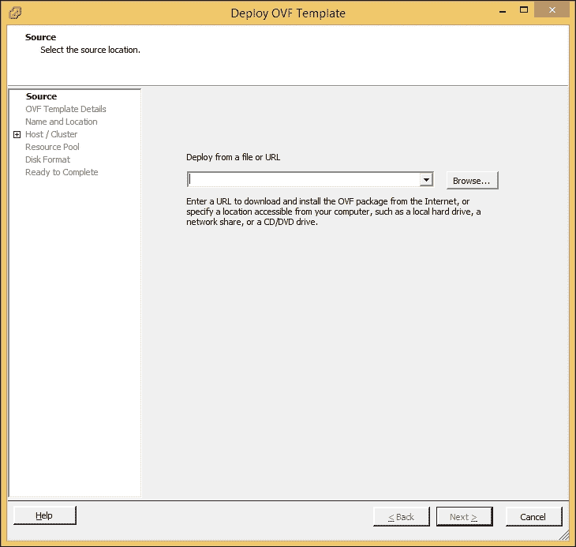
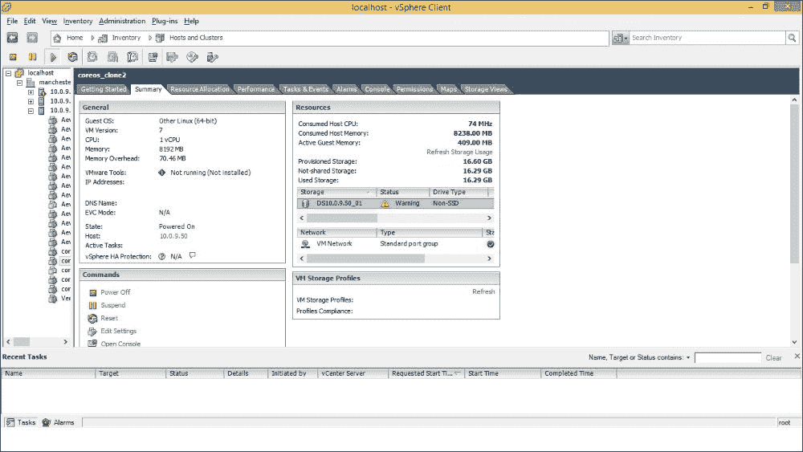
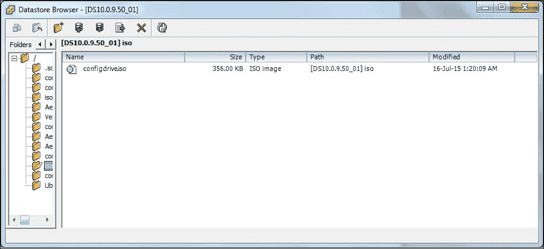
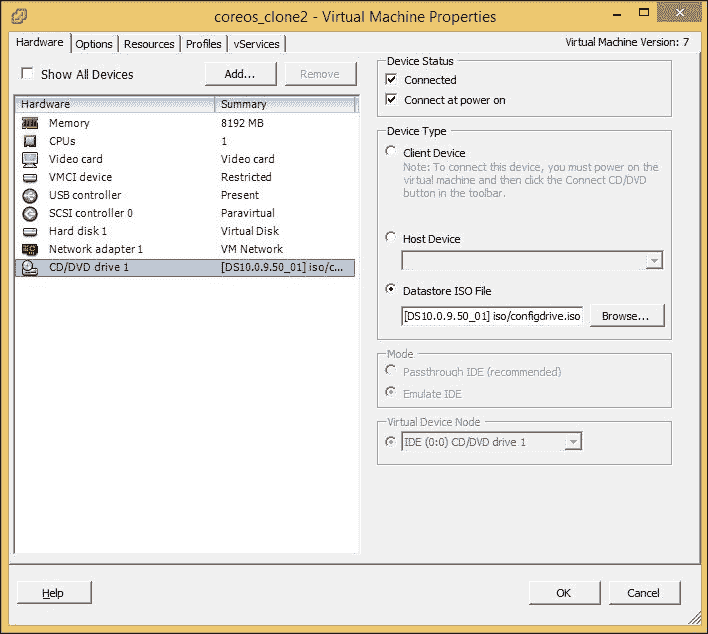

# 第二章：设置 CoreOS 环境

CoreOS 可以安装在多种平台上，如裸金属服务器、云提供商的虚拟机、物理服务器等。本章详细描述了如何在虚拟机上部署 CoreOS，帮助你启动第一个 CoreOS 环境。当在虚拟化环境中进行部署时，像 Vagrant 这样的工具在管理 CoreOS 虚拟机时非常有用。**Vagrant** 使得即使在单个笔记本电脑或工作站上，也能轻松设置多个节点的 CoreOS 环境，且配置最小化。Vagrant 支持 VirtualBox，这是一个常用的虚拟化应用程序。Vagrant 和 VirtualBox 都支持多种架构，如 Intel 或 AMD，以及多种操作系统，如 Windows、Linux、Solaris 和 Mac。

本章介绍了在 VirtualBox、VMware VSphere 上设置 CoreOS，以及以下内容：

+   VirtualBox 安装

+   Vagrant 介绍

+   VMware VSphere 上的 CoreOS 设置

+   Docker 介绍

### 提示

GIT 用于下载本章提到的所有所需软件。

# 安装 GIT

根据主机操作系统，从 [`www.vagrantup.com/downloads.html`](http://www.vagrantup.com/downloads.html) 下载最新版本的 GIT 安装包。下载完成后，启动安装程序。使用此方法安装 GIT 对 Mac 和 Windows 系统有帮助。对于所有 Linux 发行版，GIT 客户端可以通过其包管理器安装。例如，如果操作系统是 CentOS，可以使用包管理器 `yum` 安装 GIT。

# 安装 VirtualBox

根据主机操作系统和架构，从 [`www.virtualbox.org/wiki/Downloads`](https://www.virtualbox.org/wiki/Downloads) 下载最新版本的 VirtualBox。下载完成后，启动安装程序。

安装过程中，继续使用默认选项。VirtualBox 安装过程中会重置主机机器的网络适配器，这将导致网络连接切换。安装成功后，安装程序将打印操作状态。

# Vagrant 介绍

Vagrant 提供了一种机制来安装和配置开发、测试或生产环境。Vagrant 可以与多种虚拟化应用程序配合使用，如 VirtualBox、VMware、AWS 等。所有的安装、设置信息、配置和依赖项都保存在文件中，虚拟机可以通过简单的 Vagrant 命令进行配置并启动。这也有助于使用常见的脚本语言自动化机器的安装和配置过程。Vagrant 帮助创建一个在所有用户和部署中完全相同的环境。Vagrant 还提供了简单的命令来管理虚拟机。在 CoreOS 的上下文中，Vagrant 将帮助轻松创建具有相同环境的多个 CoreOS 集群节点。

## 安装 Vagrant

从[`www.vagrantup.com/downloads`](http://www.vagrantup.com/downloads)下载并安装最新版本的 Vagrant。在安装过程中选择默认设置。

## Vagrant 配置文件

Vagrant 配置文件包含虚拟机的配置和预配置信息。配置文件名为`Vagrantfile`，文件语法为`Ruby`。配置文件可以出现在任何目录级别，从当前工作目录开始。首先读取当前工作目录中的文件，然后是上一级目录（如果存在）中的文件，依此类推，直到根目录`/`。文件在读取时会合并。对于大多数配置参数，新的设置会覆盖旧的设置，只有少数参数会被追加。

一个`Vagrantfile`模板及其他相关文件可以从 GIT 仓库中*克隆*（[`github.com/coreos/coreos-vagrant.git`](https://github.com/coreos/coreos-vagrant.git)）。通过终端运行以下命令来克隆仓库。请注意，启动终端的过程可能因操作系统不同而有所不同。例如，在 Windows 中，运行 GIT 命令的终端是通过运行`Git` `Bash`启动的：

```
$ git clone https://github.com/coreos/coreos-vagrant/

```

在`git clone`之后，会创建一个目录`coreos-vagrant`。该目录除了包含与`Git`仓库相关的其他文件外，还包含`Vagrantfile`、`user-data.sample`和`config.rb.sample`文件。将`user-data.sample`重命名为`user-data`，并将`config.rb.sample`重命名为`config.rb`：

```
git clone https://github.com/coreos/coreos-vagrant/
Cloning into 'coreos-vagrant'...
remote: Counting objects: 402, done.
remote: Total 402 (delta 0), reused 0 (delta 0), pack-reused 402
Receiving objects: 100% (402/402), 96.63 KiB | 31.00 KiB/s, done.
Resolving deltas: 100% (175/175), done.

cd coreos-vagrant/
ls
config.rb.sample*  CONTRIBUTING.md*  DCO*  LICENSE*  MAINTAINERS*  NOTICE*  README.md*  user-data.sample*  Vagrantfile*

```

`Vagrantfile`包含创建和配置 CoreOS 虚拟机的模板配置，使用的是 VirtualBox。`Vagrantfile`通过`require`指令包含了`config.rb`文件：

```
…
CONFIG = File.join(File.dirname(__FILE__), "config.rb")
….
if File.exist?(CONFIG)
 require CONFIG
end
…

…
CLOUD_CONFIG_PATH = File.join(File.dirname(__FILE__), "user-data")
…
 if File.exist?(CLOUD_CONFIG_PATH)
 config.vm.provision :file, :source => "#{CLOUD_CONFIG_PATH}", :destination => "/tmp/vagrantfile-user-data"
 config.vm.provision :shell, :inline => "mv /tmp/vagrantfile-user-data /var/lib/coreos-vagrant/", :privileged => true
 end
…

```

## Cloud-config

**cloud config**文件是特殊的文件，在 CoreOS 系统启动或配置动态更新时，会被`cloud-init`进程执行。通常，cloud config 文件包含 docker 容器的各种操作系统级配置，例如网络配置、用户管理、systemd 单元等。对于 CoreOS 来说，`user-data`是`cloud-config`文件的名称，并且位于`vagrant`文件夹的基础目录中。`systemd units`文件是包含关于进程信息的配置文件。

`cloud-config`文件使用 YAML 文件格式。一个`cloud-config`文件必须包含`#cloud-config`作为第一行，之后是一个关联数组，包含零个或多个以下键：

+   `coreos`：这个键提供了 CoreOS 提供的服务配置。接下来描述了其中一些重要服务的配置：

    +   `etc2`：这个键替代了先前使用的`etc`服务。`etc2`的参数用于生成`etcd2`服务的 systemd 单元文件。一些`etc2`配置的重要参数包括：

        `discovery`：指定用于标识所有形成集群的 etcd 成员的唯一令牌。可以通过访问免费的发现服务 ([`discovery.etcd.io/new?sizhttp://e=<clustersize>`](https://discovery.etcd.io/new?sizhttp://e=<clustersize>)) 来生成唯一令牌。当使用发现机制识别集群的 etcd 成员时（例如，所有节点的 IP 地址尚不清楚时），将使用此令牌。生成的令牌也称为发现 URL。发现服务通过存储已连接的 etcd 成员、集群大小和其他元数据，帮助集群之间相互连接，并通过每个成员提供的 `initial-advertise-peer-urls` 进行连接。有关如何形成 CoreOS 集群的更多信息，请参阅 第三章，*创建你的 CoreOS 集群并管理集群*。

        `initial-advertise-peer-urls`：指定成员自己向集群广告的对等 URL。该 IP 应该对所有 etcd 成员可访问。根据可访问性，可以使用公共和/或私有 IP。

        `advertise-client-urls`：指定成员自己向集群广告的客户端 URL。该 IP 应该对所有 etcd 成员可访问。根据可访问性，可以使用公共和/或私有 IP。

        `listen-client-urls`：指定成员监听客户端流量的自我 URL 列表。所有广告的客户端 URL 应该是此配置的一部分。

        `listen-peer-urls`：指定成员监听对等流量的自我 URL 列表。所有广告的对等 URL 应该是此配置的一部分。

        在某些平台上，可以通过使用*模板功能*来自动化提供 IP。可以提供字段 `$public_ipv4` 或 `$private_ipv4`，而无需提供实际的 IP 地址。

        `$public_ipv4` 是机器的公共 IPV4 地址的替代变量。

        `$private_ipv4` 是机器的私有 IPV4 地址的替代变量。

        以下是 `cloud-config` 文件中的示例 `coreos` 配置：

        ```
        #cloud-config
        coreos:
         etcd2:
         discovery: https://discovery.etcd.io/d54166dee3e709cf35b0d78913621df6
         # multi-region and multi-cloud deployments need to use $public_ipv4
         advertise-client-urls: http://$public_ipv4:2379
         initial-advertise-peer-urls: http://$private_ipv4:2380
         # listen on both the official ports and the legacy ports
         # legacy ports can be omitted if your application doesn't depend on them
         listen-client-urls: http://0.0.0.0:2379,http://0.0.0.0:4001
         listen-peer-urls: http://$private_ipv4:2380,http://$private_ipv4:7001

        ```

    +   `fleet`：fleet 的参数用于为 fleet 服务生成环境变量。fleet 服务管理集群中容器的运行。fleet 配置的一些重要参数包括：

        `etcd_servers`：提供可以通过其访问 etcd 服务的 URL 列表。配置的 URL 应该是 etcd 服务的 `listen-client-urls` 之一。

        `public_ip`：应该与本地机器状态一起发布的 IP 地址。

        以下是 `cloud-config` 文件中的示例 fleet 配置：

        ```
        #cloud-config
         fleet:
         etcd_servers: http:// $public_ipv4:2379,http:// $public_ipv4:4001
         public-ip: $public_ipv4

        ```

    +   `flannel`：flannel 的参数用于为 flannel 服务生成环境变量。flannel 服务提供容器之间的通信。

    +   `locksmith`：locksmith 的参数用于生成 locksmith 服务的环境变量。locksmith 服务提供集群的重启管理。

    +   `update`：这些参数用于操作与 CoreOS 实例更新相关的设置。

    +   `Units`：这些参数指定系统启动后需要启动的 systemd 单元集。单元配置的一些重要参数包括：

        **name**：该参数指定服务的名称。

        **command**：该参数指定在单元上执行的命令：start、stop、reload、restart、try-restart、reload-or-restart、reload-or-try-restart。

        **enable**：此标志（true/false）指定是否忽略单元文件中的 Install 部分。

        **drop-ins**：此项包含单元的 drop-in 文件列表。每个单元信息集包含*name*，指定单元的 drop-in 文件，和*content*，这是表示单元 drop-in 文件的纯文本。

        以下是`cloud-config`文件中的单元配置示例：

        ```
        #cloud-config
         units:
         - name: etcd2.service
         command: start
         - name: fleet.service
         command: start
         - name: docker-tcp.socket
         command: start
         enable: true
         content: |
         [Unit]
         Description=Docker Socket for the API

         [Socket]
         ListenStream=2375
         Service=docker.service
         BindIPv6Only=both

         [Install]
         WantedBy=sockets.target

        ```

+   `ssh_authorized_keys`：此参数指定将被授权的核心用户的公共 SSH 密钥。

+   `hostname`：该参数指定成员的主机名。

+   `users`：该参数指定要在成员上创建或更新的用户列表。每个用户信息包含姓名、密码、主目录、shell 等。

+   `write_files`：该参数指定要在成员上创建的文件列表。每个文件信息包含路径、权限、所有者、内容等。

+   `manage_etc_hosts`：该参数指定本地名称解析的`/etc/hosts`文件的内容。目前仅支持 localhost。

## `config.rb` 配置文件

该文件包含用于配置 CoreOS 集群的信息。此文件为`Vagrantfile`使用的参数提供配置值。`Vagrantfile`通过包含`config.rb`文件来访问配置。以下是参数：

+   `$num_instances`：此参数指定集群中节点的数量。

+   `$shared_folders`：该参数指定主机上共享文件夹的路径列表，以及成员上的相应路径。

+   `$forwarded_ports`：该参数指定从成员到主机的端口转发。

+   `$vm_gui`：此标志指定是否为成员设置 GUI。

+   `$vm_memory`：该参数指定成员的内存大小（以 MB 为单位）。

+   `$vm_cpus`：该参数指定要分配给成员的 CPU 数量。

+   `$instance_name_prefix`：该参数指定用于成员名称的前缀。

+   `$update_channel`：该参数指定 CoreOS 的更新渠道（如 alpha、beta 等）。

以下是一个`config.rb`文件示例：

```
$num_instances=1
$new_discovery_url="https://discovery.etcd.io/new?size=#{$num_instances}"

# To automatically replace the discovery token on 'vagrant up', uncomment
# the lines below:
#
#if File.exists?('user-data') && ARGV[0].eql?('up')
#  require 'open-uri'
#  require 'yaml'
#
#  token = open($new_discovery_url).read
#
#  data = YAML.load(IO.readlines('user-data')[1..-1].join)
#  if data['coreos'].key? 'etcd'
#    data['coreos']['etcd']['discovery'] = token
#  end
#  if data['coreos'].key? 'etcd2'
#    data['coreos']['etcd2']['discovery'] = token
#  end
#
#  # Fix for YAML.load() converting reboot-strategy from 'off' to false`
#  if data['coreos']['update'].key? 'reboot-strategy'
#     if data['coreos']['update']['reboot-strategy'] == false
#          data['coreos']['update']['reboot-strategy'] = 'off'
#       end
#  end
#
#  yaml = YAML.dump(data)
#  File.open('user-data', 'w') { |file| file.write("#cloud-config\n\n#{yaml}") }
#end

$instance_name_prefix="coreOS-learn"
$image_version = "current"
$update_channel='alpha'
$vm_gui = false
$vm_memory = 1024
$vm_cpus = 1
$shared_folders = {}
$forwarded_ports = {}
```

## 启动 CoreOS VM 使用 Vagrant

一旦 `config.rb` 和 `user-config` 文件更新了实际的配置参数，在包含配置文件的目录中执行命令 `vagrant up` 来启动 CoreOS 虚拟机镜像。成功执行 `vagrant up` 命令后，虚拟机环境中的 CoreOS 已准备好：

```
vagrant up
Bringing machine 'core-01' up with 'virtualbox' provider...
==> core-01: Checking if box 'coreos-alpha' is up to date...
==> core-01: Clearing any previously set forwarded ports...
==> core-01: Clearing any previously set network interfaces...
==> core-01: Preparing network interfaces based on configuration...
 core-01: Adapter 1: nat
 core-01: Adapter 2: hostonly
==> core-01: Forwarding ports...
 core-01: 22 => 2222 (adapter 1)
==> core-01: Running 'pre-boot' VM customizations...
==> core-01: Booting VM...
==> core-01: Waiting for machine to boot. This may take a few minutes...
 core-01: SSH address: 127.0.0.1:2222
 core-01: SSH username: core
 core-01: SSH auth method: private key
 core-01: Warning: Connection timeout. Retrying...
==> core-01: Machine booted and ready!
==> core-01: Setting hostname...
==> core-01: Configuring and enabling network interfaces...
==> core-01: Machine already provisioned. Run `vagrant provision` or use the `--provision`
==> core-01: flag to force provisioning. Provisioners marked to run always will still run.

vagrant status
Current machine states:

core-01                   running (virtualbox)

```

虚拟机正在运行。要停止此虚拟机，可以运行 `vagrant halt` 强制关闭它，或者可以运行 `vagrant suspend` 仅暂停虚拟机。在任何情况下，要重新启动它，只需运行 `vagrant up`。

# 在 VMware vSphere 上设置 CoreOS

VMware vSphere 是一个服务器虚拟化平台，使用 VMware 的 ESX/ESXi 虚拟机管理程序。VMware vSphere 提供了完整的平台、工具集和虚拟化基础设施，以在裸金属上提供和管理虚拟机。VMware vSphere 由 VMware vCenter Server 和 VMware vSphere Client 组成。VMware vCenter Server 管理虚拟资源和物理资源。VMware vSphere Client 提供一个图形界面，用于在裸金属上安装和管理虚拟机。

# 安装 VMware vSphere Client

根据主机操作系统和架构，从 [`vsphereclient.vmware.com/vsphereclient/1/9/9/3/0/7/2/VMware-viclient-all-5.5.0-1993072.exe`](http://vsphereclient.vmware.com/vsphereclient/1/9/9/3/0/7/2/VMware-viclient-all-5.5.0-1993072.exe) 下载 VMware vSphere Client 安装程序的最新版本。下载完成后，开始安装。安装过程中，继续使用默认选项。

安装完成后，打开 VMware vSphere Client 应用程序。这将打开一个新的图形界面。在 **IP 地址** / **名称** 字段中，输入 IP 地址/主机名，以直接管理单个主机。输入 vCenter Server 的 IP 地址/主机名，以管理多个主机。在 **用户名** 和 **密码** 字段中，输入用户名和密码。

从 [`stable.release.core-os.net/amd64-usr/current/coreos_production_vmware_ova.ova`](http://stable.release.core-os.net/amd64-usr/current/coreos_production_vmware_ova.ova) 下载最新版本的 CoreOS 镜像。下载完成后，下一步是使用下载的 `ova` 文件创建虚拟机镜像。创建虚拟机镜像的步骤如下：

1.  打开 VMware vSphere Client 应用程序。

1.  输入之前提到的 IP 地址、用户名和密码。

1.  点击 **文件** 菜单。

1.  点击 **部署 OVF 模板**。

1.  这将打开一个新的向导。指定之前下载的 `ova` 文件的位置。点击 **下一步**。

1.  在 **名称和位置** 选项卡中指定虚拟机的名称和库存位置。

1.  在 **主机/集群** 选项卡中指定此虚拟机要部署的主机/服务器。

1.  在 **存储** 选项卡中指定虚拟机镜像应存储的位置。

1.  在 **磁盘格式** 选项卡中指定磁盘格式。

1.  点击 **下一步**。部署虚拟机镜像需要一些时间。

一旦虚拟机镜像在 VMware 服务器中部署完成，我们需要使用适当的`cloud-config`文件启动 CoreOS 虚拟机，该文件包含所需的配置属性。在 VMware vSphere 中，`cloud-config`文件应通过附加一个配置驱动（config-drive）来指定，配置驱动是一个带有`config-2`标签的`iso`文件，可以通过附加 CD-ROM 或新驱动来实现。以下是在基于 Linux 的操作系统中创建`iso`文件的命令：

1.  创建一个文件夹，例如`/tmp/new-drive/openstack/latest`，如下所示：

    ```
    mkdir -p /tmp/new-drive/openstack/latest

    ```

1.  将`user_data`文件（即`cloud-config`文件）复制到以下文件夹：

    ```
    cp user_data /tmp/new-drive/openstack/latest/user_data

    ```

1.  使用以下命令`mkisofs`创建`iso`文件：

    ```
    mkisofs -R -V config-2 -o configdrive.iso /tmp/new-drive

    ```

一旦`config-drive`文件创建完成，执行以下步骤将`config`文件附加到虚拟机：

1.  将`iso`镜像传输到运行 VMware vSphere Client 程序的机器。

1.  打开 VMware vSphere Client。

1.  点击 CoreOS 虚拟机，然后转到虚拟机的**概述**标签，如下图所示：

1.  右键点击**数据存储**部分，然后点击**浏览数据存储**。这将打开一个名为**数据存储浏览器**的新窗口。

1.  选择名为`iso`的文件夹。

1.  点击**上传文件到数据存储**图标。

1.  选择本地机器中的`iso`文件，并将该`iso`文件上传到**数据存储**。

下一步是将`iso`文件附加为虚拟机的`cloud-config`文件。执行以下步骤：

1.  转到**CoreOS 虚拟机**并右键点击。

1.  点击**属性**。

1.  选择**CD/DVD 驱动器 1**。

1.  在右侧，选择**设备状态**为**已连接**，并勾选**开机时连接**。

1.  点击**数据存储 ISO 文件**，然后从数据存储中选择上传的`iso`文件。

一旦`iso`文件上传并附加到虚拟机（VM）上，启动虚拟机。VMware 环境中的 CoreOS 虚拟机已经准备好。

# Docker 简介

正如之前所述，Linux 容器在宿主操作系统内提供了一个轻量级或简化版本的操作系统。可以在 Linux 容器上安装应用程序，并可以移植到任何支持 Linux 容器的宿主操作系统上。用户无需为不同的目标机器发布不同的软件。可以在宿主操作系统上创建多个 Linux 容器，从而提供在同一台机器上独立运行多个软件实例的能力。想象一下软件使用大量端口和冗长的配置文件。在传统方法中，用户必须小心地为每个实例创建配置文件，以避免与其他实例冲突。而在 Linux 容器中，同一个配置文件适用于所有容器实例。这有助于更快的部署和更简单的操作。

Docker 容器主要是 Linux 容器，按设计只能运行单个应用程序。它们可以在任何安装了 Docker 的机器上运行。Docker 可以安装在运行不同操作系统（如 Linux 或 Mac）的各种机器上，从而使得应用程序具有可移植性。让我们了解一些 Docker 的概念。

## 镜像

Docker 镜像是一个只读的模板。通常，镜像包含操作系统快照，但 Docker 镜像可以包含任何内容，例如数据库、操作系统或应用程序。它们是只读的，并且可以在多个 Docker 容器之间共享。

镜像可以从头开始创建，或者从 Docker Hub 上的现有镜像创建。**Docker Hub** 是一个公共的 `Docker Registry`，托管着可以下载和使用的 Docker 镜像。我们还可以设置一个私有的 Docker 镜像库。

镜像具有唯一的 ID 和唯一的可读名称与标签对。例如，镜像可以被称为 `ubuntu:latest`、`ubuntu:precise`、`django:1.6`、`django:1.7` 等等。

Docker 使用 **联合文件系统** 来结合镜像层，形成一个单一的 Docker 镜像。联合文件系统允许不同文件系统中的文件和目录叠加在一个单一的文件系统上。一个 Docker 镜像从基础镜像开始，通常是一个标准的操作系统镜像，然后将其他镜像层附加到其上。每一层都提供比前一层更多的功能。在镜像发生变化时，仅需要提供影响的层，而不是整个镜像。

## 容器

**容器** 是从 Docker 镜像创建的。容器包含应用程序运行所需的一切，如用户文件、元数据、用户应用程序等。为了暴露容器提供的服务，Docker 允许暴露容器的特定端口。

### 卷

如前所述，Docker 镜像是只读联合文件系统的层。当我们启动一个容器时，除了只读层外，还会在其上创建一个读写层，因为可能需要修改文件（例如）。当修改发生时，数据会同时出现在读写层和只读层中。这是为了确保容器中使用的镜像保持不变。这个读写层的作用范围仅限于容器存在期间。一旦容器被删除，读写层就会被销毁，而只读（未改变的）镜像将可以重新使用。**卷**提供了一种机制来管理容器内外的数据。它们还提供了一种机制来共享主机机器到容器的数据，从而使数据能够存在于容器外部。数据可以直接从主机文件夹或另一个容器共享。推荐创建一个仅数据的容器并从该容器共享数据。

## 链接

Docker 容器可以通过容器创建时创建的网络端口映射相互连接。这带来了一定的硬编码元素，因为端口是预配置的。容器链接也可以通过使用容器名称将源容器与目标容器链接来实现。Docker 通过环境变量和修改`/etc/hosts`文件将源容器的连接信息暴露给目标容器。环境变量以链接名称为前缀，并遵循命名约定，帮助目标容器识别接口详细信息（如使用的协议、IP 地址、端口等）。`/etc/hosts`文件会更新源容器的 IP 地址和容器名称作为主机名。

## 安装 Docker

Docker 也可以在各种平台、虚拟机和云服务提供商上安装。Docker 包含两个组件：

+   Docker 客户端：用户通过 Docker 客户端启动、停止和管理 Docker 容器。

+   Docker Daemon：Docker 客户端与 Docker Daemon 接口，实际启动、停止和管理 Docker 容器。Docker Daemon 只能在 Linux 机器上运行。所以，如果 Docker 安装在 Windows 或 Mac 上，Docker Daemon 会在 Linux 虚拟机内运行（例如，在 VirtualBox 中）。

创建 Docker 镜像有两种方式：

+   使用 Docker File 和 Docker `build`命令

+   使用来自 dockerhub 的预构建 docker 镜像

## 使用 Docker File 创建示例 Docker 镜像

在本节中，我们将学习如何通过 Docker File 创建 Docker 容器。Docker File 有明显的优点。Docker File 有助于自动化构建过程，可以对项目进行版本控制，并且内联注释为初学者和其他人提供帮助。

以下是使用 CentOS 基础镜像创建 docker 镜像的简单 Docker File：

```
$cat Dockerfile
FROM centos
CMD ["uname", "-a"]

$ docker build -t docker_uname .
Sending build context to Docker daemon 2.048 kB
Step 0 : FROM centos
 ---> 7322fbe74aa5
Step 1 : CMD uname -a
 ---> Using cache
 ---> 36d993cf27b9
Successfully built 36d993cf27b9

```

### Docker File

Docker File 包含 Docker 用于构建镜像的指令。Docker File 的格式如下：

```
# Comment
INSTRUCTION arguments
```

指令按顺序执行。以`#`开头的行被视为注释，不会执行。环境变量也可以作为指令参数中的变量使用。一些重要的指令包括：

+   `FROM`：此指令设置 Docker 镜像的基础镜像。这是第一条指令。参数可以采用以下任一格式：

    ```
    FROM <image> 
    FROM <image>:<tag>
    FROM <image>@<digest>

    ```

    如果未提供`tag`或`digest`，则会选择最新的镜像。

+   `RUN`：此指令指定构建容器时要执行的命令。`RUN`指令的典型用途包括更新基础镜像的操作系统补丁、安装特定的软件包、更新系统配置等。每个命令都在当前镜像的基础上单独运行并被提交。提交的镜像然后用于下一步。参数可以采用以下任一格式：

    ```
    RUN <command> 

    ```

    在这种形式下，`command`将在 shell /`bin/sh -c`中执行。Shell `/bin/sh -c`是 Docker 的默认`ENTRYPOINT`：

    ```
    RUN ["executable", "param1", "param2"]

    ```

    在这种格式下，`command`会直接执行，而不通过调用 shell。

+   `ENTRYPOINT`：这指定了 Docker 启动时的可执行文件及其相应的参数。启动 Docker 时传递的任何参数都会附加到`ENTRYPOINT`并执行。

    参数可以是以下任意一种格式：

    +   `ENTRYPOINT ["executable", "param1", "param2"]`：在这种格式下，命令会直接执行，而不通过调用 shell。

    +   `ENTRYPOINT <command> <paramters>`：在这种格式下，命令会在 shell `/bin/sh -c`内执行。

+   `CMD`：这指定了当 Docker 启动时要执行的容器的默认值（即可执行文件、shell 和命令行参数）。这与`RUN`不同，因为`RUN`指令仅在构建镜像时执行。

    参数可以是以下任意一种格式：

    +   `CMD ["executable","param1","param2"]`：当没有提供`ENTRYPOINT`时使用这种格式。命令在这里会直接执行，而不经过 shell。

    +   `CMD ["param1","param2"]`：当提供了默认命令的`ENTRYPOINT`时使用这种格式。这里提供的参数会附加到`ENTRYPOINT`上并执行。

    +   `CMD command param1 param2`（shell 形式）：在这种格式下，命令会在 shell `/bin/sh -c`内执行。

    只会执行一个`CMD`指令。如果提供了多个`CMD`指令，则使用最后一条指令。

+   `EXPOSE`：这指定了 Docker 监听的端口列表。该字段的格式为：`EXPOSE <port> [<port>...]`

+   `VOLUME`：这指定了容器内的挂载路径以及来自主机机器的外部目录或来自另一个容器的卷。该字段的格式为：`VOLUME <directory> [<directory>…]`

## 从 Docker Hub 拉取 Docker 镜像

**Docker Hub**是由 Docker 提供的社区驱动的 Docker 镜像托管服务，支持公共和私有内容。目前，Docker Hub 注册表中已有超过 100,000 个镜像。Docker 镜像可以直接从 Docker Hub 下载，而不需要通过 Docker File 构建。使用 docker `pull`命令可以直接从 Docker Hub 拉取镜像，格式如下：

```
docker pull centos

```

## 运行 Docker 镜像

让我们从 Docker 容器中运行一个已经存在的系统命令。这个 Docker 容器在本例中打印系统信息并退出：

```
$ docker run centos uname -a
Linux 3c954433a1e2 4.0.9-boot2docker #1 SMP Thu Aug 13 03:05:44 UTC 2015 x86_64 x86_64 x86_64 GNU/Linux

```

`run`参数运行 Docker 容器。镜像名称为`centos`。在第一次运行时，如果本地机器上没有该镜像，将从公共镜像注册表 Docker Hub 下载最新版本的`centos`镜像。由于没有指定镜像的版本，因此选择了最新版本。如果需要安装特定版本，也可以提供，例如，`centos:6.6`。然后在容器内使用默认的`ENTRYPOINT` `/bin/sh -c`执行`uname –a`命令。命令执行完毕后，容器退出。

我们将创建一个更复杂的 Docker File 容器，该容器执行 `RUN` 指令，在基础镜像上安装一个软件包，并监听 TCP 连接：

```
$cat Dockerfile
FROM centos

# install ncat commad to be used for this demo during build. Ncat 
# is not part of standard package.
RUN ["yum", "-y", "install", "nc"]

# print machine ips
RUN ["cat", "/etc/hosts"]

# run the command ncat to listen on all IP address on port 12345
CMD ["ncat", "-vv", "-l", "0.0.0.0", "12345"]

$ docker build -t dock_ncat .
Sending build context to Docker daemon 3.072 kB
Step 0 : FROM centos
 ---> 7322fbe74aa5
Step 1 : RUN yum -y install nc
 ---> Using cache
 ---> 886063e43760
Step 2 : RUN cat /etc/hosts
 ---> Using cache
 ---> df623793d532
Step 3 : CMD ncat -vv -l 0.0.0.0 12345
 ---> Running in a0a5daa581b4
 ---> f8ad341c047e
Removing intermediate container a0a5daa581b4
Successfully built f8ad341c047e Removing intermediate container 6f8284dad1f8
Successfully built 3c60a690a2d7

$ docker run -p :12344:12345 dock_ncat
Ncat: Version 6.40 ( http://nmap.org/ncat )
Ncat: Listening on 0.0.0.0:12345
Ncat: Connection from 172.18.42.1.
Ncat: Connection from 172.18.42.1:58939.

```

容器的端口 `12345` 映射到主机的端口 `12344`。如果主机尝试连接到 `12344`，则会在容器上建立连接。

# 摘要

在本章中，我们成功地通过 Vagrant 和 VirtualBox 在单台机器上设置并运行了 CoreOS。我们还成功地创建并运行了 Docker 镜像。在此过程中，我们熟悉了重要的配置文件及其内容。

在下一章，我们将学习如何设置一个由多台机器组成的 CoreOS 集群。我们还将了解机器如何被发现，以及如何在这些机器上调度服务。
