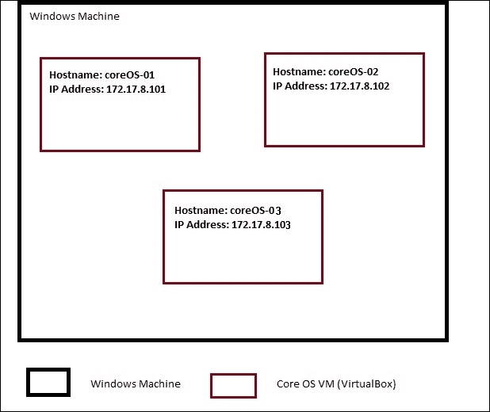

# 第三章：创建您的 CoreOS 集群并管理集群

本章涵盖 CoreOS 集群，提供有关集群概念和好处的信息。我们还将学习如何设置集群，并更详细地熟悉集群中涉及的所有服务。

本章涵盖以下主题：

+   集群简介

+   集群的原因与好处

+   CoreOS 集群

+   创建一个 CoreOS 集群

+   使用 etcd 进行发现

+   Systemd

+   使用 fleet 进行服务部署和高可用性（HA）

# 集群简介

有两种方式可以扩展系统。一种是垂直扩展，即通过向机器添加更多硬件资源来实现。如果系统的内存需求增加，就增加更多内存；如果需要更多的处理能力，则将机器升级为使用更高端处理器或提供更多核心的机器。水平扩展是另一种将系统扩展到更高容量的方法。这意味着根据需要增加更多的机器，形成一个节点集群。这些节点集群协同工作提供服务。集群中的节点可能会有执行相同角色的应用程序，如池，或者它们可能执行不同的角色。

# 集群的原因与好处

系统的水平可扩展性受限于市场上可用的硬件资源。例如，将内存从 8 GB 扩展到 32 GB 或 64 GB 可能是具有成本效益的，因为许多产品可能普遍可用，但进一步增加内存可能会变得非常昂贵。类似地，扩展 CPU 也受到市场上系统配置的限制。进一步增加硬件能力并不会带来相等的性能提升，通常是较少的。

随着虚拟化和云服务的发展，购买和维护硬件的成本正在下降，使得垂直扩展、集群扩展或水平扩展变得更加有吸引力。通信网络的性能提升大大减少了集群中节点之间通信的延迟。集群有多种优点，例如：

+   **按需扩展**：集群中的节点可以根据需要随时添加。我们可以从一个有规模的系统开始，随着容量的增加不断添加节点。

+   **动态扩展**：大多数集群解决方案提供在运行时添加/删除节点的机制。因此，在进行集群修改时，整个系统仍然可以正常运行并提供服务。

+   **冗余**：集群可以配置少量备用节点。在任何节点发生故障或在计划内或计划外的节点维护期间，这些备用节点可以被分配为故障节点或维护节点的角色，而不会影响服务容量。

了解集群的缺点也很重要，这样可以在设计系统时做出明智的决策。随着节点数量的增加，管理这些节点的复杂性也会增加。所有节点都需要进行监控和维护。软件也必须设计成能够在多个节点上运行。这就需要一个编排机制来协调集群中不同实例的应用。例如，负载均衡器将负载分配到工作节点，或作业序列化器用来同步和序列化跨节点的作业。

# CoreOS 集群

第一章，*CoreOS，另一个 Linux 发行版*介绍了 CoreOS 集群架构。我们将在这里再次总结它。一个 CoreOS 成员或节点可以包含多个 Docker 容器。可以有多个 CoreOS 成员组成一个 CoreOS 集群。

CoreOS 使用 fleet 在初始化期间通过`systemd`调度和管理服务到 CoreOS 成员。这类似于在 Linux 机器上由`systemd`启动和管理服务。Linux 的`systemd`进程范围仅限于主机节点，而 CoreOS 的`fleetd`是完整 CoreOS 集群的初始化系统。

CoreOS 使用 etcd 进行节点发现和存储可在集群成员之间访问的配置项的键值对。

可以通过两种方式来设置集群：

+   **etcd 运行在所有成员上**：当集群的成员较少时，可以在所有运行服务的成员上运行 etcd，也称为工作节点。这种配置更简单，因为相同的`cloud-config`文件可以用于启动集群中的所有成员。

+   **etcd 运行在少数成员上**：当集群中的成员数量较多，通常大于十个时，建议将`etcd`和其他 CoreOS 集群服务专门运行在部分机器上。这使得为工作成员配置平台变得更加容易，因为它们专门用于提供服务。在这种情况下，需要两个`cloud-config`文件：一个用于 CoreOS 集群服务，包括 etcd，另一个用于工作节点或代理。

CoreOS 集群的设置相当简单。准备`cloud-config`文件并使用该文件启动成员。需要一些脚本知识来为每个成员重新生成配置文件。发现服务和 etcd 使用提供的发现令牌或静态令牌来形成集群，当成员被启动时。

## 集群发现

本节描述了 CoreOS 用于形成集群的各种发现机制。在本章中的示例中，以下是系统配置：



## 静态发现

**静态发现**机制用于成员的 IP 地址已知的情况。IP 地址预先配置在`cloud-config`文件中。它们适用于集群规模较小的场景，通常可用于测试设置。配置大量硬编码 IP 将容易出错，且维护起来十分麻烦。

以下是用于通过静态发现创建集群的`cloud-config`文件：

```
#cloud-config

---
coreos:
  etcd2:
    name: core-01
    advertise-client-urls: http://$public_ipv4:2379
    initial-advertise-peer-urls: http://$private_ipv4:2380
    listen-client-urls: http://0.0.0.0:2379,http://0.0.0.0:4001
    listen-peer-urls: http://$private_ipv4:2380,http://$private_ipv4:7001
    initial-cluster-token: coreOS-static
    initial-cluster: core-01=http://172.17.8.101:2380,core-02=http://172.17.8.102:2380,core-03=http://172.17.8.103:2380
  units:
  - name: etcd2.service
    command: start
    enable: true
```

有两个新的字段之前没有讨论过。`name`字段提供成员的名称。这个名称还用于将成员与`initial-cluster`中的 URL 关联起来。`initial-cluster`字段提供集群中所有成员的名称和 URL。

### 提示

在`initial-cluster`字段中提供的 IP 地址应包含静态 IP 地址。

为了创建前述的`cloud-config`文件，需要对所有希望加入集群的节点执行以下步骤。

`Vagrantfile`应该包含分配给每个成员的静态 IP 地址。如以下示例所示，IP `172.17.8.101`分配给第一个成员，IP `172.17.8.102`分配给第二个成员，依此类推：

```
...
      ip = "172.17.8.#{i+100}"
      config.vm.network :private_network, ip: ip
...
```

你可能注意到，`cloud-config`文件中仅包含一个成员的名称，但每个 CoreOS 虚拟机中的`etcd`服务的`systemd` `unit`文件应该包含其自己的成员名称。这需要在`Vagrantfile`中进行如下配置，以生成特定于每个成员的`cloud-config`文件。无需深入`ruby`的具体细节，以下代码修改每个成员的`name`参数并将其存储在单独的文件中。

生成的文件是`user-data-1`用于第一个成员，`user-data-2`用于第二个成员，以此类推。除了`name`字段，所有其他参数都来自提供的`cloud-config`文件。生成的文件在虚拟机启动时使用：

```
...
      if $share_home
        config.vm.synced_folder ENV['HOME'], ENV['HOME'], id: "home", :nfs => true, :mount_options => ['nolock,vers=3,udp']
      end

      if File.exist?(CLOUD_CONFIG_PATH)
 user_data_specific = "#{CLOUD_CONFIG_PATH}-#{i}"
 require 'yaml'
 data = YAML.load(IO.readlines(CLOUD_CONFIG_PATH)[1..-1].join)
 if data['coreos'].key? 'etcd2'
 data['coreos']['etcd2']['name'] = vm_name
 end
 yaml = YAML.dump(data)
 File.open(user_data_specific, 'w') { |file| file.write("#cloud-config\n\n#{yaml}") }
 config.vm.provision :file, :source => user_data_specific, :destination => "/tmp/vagrantfile-user-data"
        config.vm.provision :shell, :inline => "mv /tmp/vagrantfile-user-data /var/lib/coreos-vagrant/", :privileged => true
      end
...
```

在`config.rb`文件中将`$num_instances`设置为`3`，并完成三成员集群的设置：

使用`Vagrant up`启动集群。启动成功后，我们可以看到集群的成员。

```
vagrant ssh core-01

etcdctl member list
7cc8bd52fa88d49: name=core-02 peerURLs=http://172.17.8.102:2380 clientURLs=http://172.17.8.102:2379
533d38560a602262: name=core-01 peerURLs=http://172.17.8.101:2380 clientURLs=http://172.17.8.101:2379
b8d2db3a5bf3d17d: name=core-03 peerURLs=http://172.17.8.103:2380 clientURLs=http://172.17.8.103:2379

etcdctl cluster-health
cluster is healthy
member 533d38560a602262 is healthy
member 7cc8bd52fa88d49 is healthy
member b8d2db3a5bf3d17d is healthy

```

## etcd 发现

当成员的 IP 地址事先不知道或使用 DHCP 分配 IP 地址时，会使用`etcd`发现机制。发现可以有两种模式：公共模式和自定义模式。

如果集群可以访问公共 IP，可以使用公共发现服务`discovery.etcd.io`生成令牌并管理集群成员。访问网站[`discovery.etcd.io/new?size=<clustersize>`](https://discovery.etcd.io/new?size=<clustersize>)并生成令牌。请注意，生成令牌时需要提供集群大小。


通过取消注释以下行，可以在`config.rb`文件中自动生成令牌：

```
...
# To automatically replace the discovery token on 'vagrant up', uncomment
# the lines below:
#
if File.exists?('user-data') && ARGV[0].eql?('up')
 require 'open-uri'
 require 'yaml'

 token = open($new_discovery_url).read

 data = YAML.load(IO.readlines('user-data')[1..-1].join)

 if data['coreos'].key? 'etcd2'
 data['coreos']['etcd2']['discovery'] = token
 end

 yaml = YAML.dump(data)
 File.open('user-data', 'w') { |file| file.write("#cloud-config\n\n#{yaml}") }
end
...
```

以下是用于通过公共`etcd`发现创建集群的`cloud-config`文件：

```
#cloud-config

coreos:
  etcd2:
    discovery: https://discovery.etcd.io/<token>
    advertise-client-urls: http://$public_ipv4:2379
    initial-advertise-peer-urls: http://$private_ipv4:2380
    listen-client-urls: http://0.0.0.0:2379,http://0.0.0.0:4001
    listen-peer-urls: http://$private_ipv4:2380,http://$private_ipv4:7001
  units:
    - name: etcd2.service
      command: start
      enable: true
```

在 `config.rb` 文件中将 `$num_instances` 设置为 `3`，并完成三成员集群的设置。与静态发现相比，这是一个更简单的过程，且不需要在 `Vagrantfile` 中进行额外配置。

使用 `Vagrant up` 启动集群。成功启动后，我们可以看到集群的成员：

```
vagrant ssh core-01

etcdctl member list
466abd73fa498e31: name=5fd5fe90fef243a090cb2ee4cfac4d53 peerURLs=http://172.17.8.103:2380 clientURLs=http://172.17.8.103:2379
940245793b93afb3: name=43e78c85f5bb439f84badd8a5cb9f12b peerURLs=http://172.17.8.101:2380 clientURLs=http://172.17.8.101:2379
ea07891f96c6abfe: name=93c559a5c40d47c7917607a15d676b6d peerURLs=http://172.17.8.102:2380 clientURLs=http://172.17.8.102:2379

etcdctl cluster-health
cluster is healthy
member 466abd73fa498e31 is healthy
member 940245793b93afb3 is healthy
member ea07891f96c6abfe is healthy

```

除了使用公共发现外，还可以使用一个 `etcd` 实例作为发现服务来管理集群成员。一台 `etcd` 实例配置了令牌和集群实例数量，其他 `etcd` 实例使用该实例加入集群。

以下是用于通过公共 `etcd` 发现创建集群的 `cloud-config` 文件：

```
#cloud-config

coreos:
  etcd2:
    discovery: http://172.17.8.101:4001/v2/keys/discovery/40134540-b53c-46b3-b34f-33b4f0ae3a9c
    advertise-client-urls: http://$public_ipv4:2379
    initial-advertise-peer-urls: http://$private_ipv4:2380
    listen-client-urls: http://$public_ipv4:2379,http://$public_ipv4:4001
    listen-peer-urls: http://$private_ipv4:2380,http://$private_ipv4:7001
  units:
    - name: etcd2.service
      command: start
      enable: true
```

令牌可以通过 `uuidgen` Linux 命令生成。路径 `v2/keys/discovery` 是存储集群信息的地方。可以提供任何路径。第一台机器用作自定义发现节点。

运行在第一台机器上的 `etcd` 服务不需要发现令牌，因为它不会成为集群的一部分。这要求在 `Vagrantfile` 中进行以下配置，为第一台机器和其他机器分别生成 `cloud-config` 文件。以下代码修改了每个成员的 name 参数，移除了第一台机器的不需要的参数，并为每个成员单独存储文件。在以下示例中，不需要的参数设置为空；也可以删除这些参数：

```
...
      if $share_home
        config.vm.synced_folder ENV['HOME'], ENV['HOME'], id: "home", :nfs => true, :mount_options => ['nolock,vers=3,udp']
      end

      if File.exist?(CLOUD_CONFIG_PATH)
 user_data_specific = "#{CLOUD_CONFIG_PATH}-#{i}"
 require 'yaml'
 data = YAML.load(IO.readlines(CLOUD_CONFIG_PATH)[1..-1].join)
 if data['coreos'].key? 'etcd2'
 data['coreos']['etcd2']['name'] = vm_name
 end
 if i.equal? 1
 data['coreos']['etcd2']['discovery'] = nil
 data['coreos']['etcd2']['initial-advertise-peer-urls'] = nil
 data['coreos']['etcd2']['listen-peer-urls'] = nil
 end 
 yaml = YAML.dump(data)
 File.open(user_data_specific, 'w') { |file| file.write("#cloud-config\n\n#{yaml}") }
 config.vm.provision :file, :source => user_data_specific, :destination => "/tmp/vagrantfile-user-data"
        config.vm.provision :shell, :inline => "mv /tmp/vagrantfile-user-data /var/lib/coreos-vagrant/", :privileged => true
      end
...
```

在 `config.rb` 文件中将 `$num_instances` 设置为 `3`，然后使用 `Vagrant` `up` 启动集群。最初，集群的创建会失败，因为与发现令牌对应的节点数量未设置。将集群的节点数量设置为 `2`。发现令牌 URL 中提供的路径应与 URL 中提供的路径匹配。

```
vagrant ssh core-01
curl -X PUT http://172.17.8.101:4001/v2/keys/discovery/40134540-b53c-46b3-b34f-33b4f0ae3a9c/_config/size -d value=2
{"action":"set","node":{"key":"/discovery/40134540-b53c-46b3-b34f-33b4f0ae3a9c/_config/size","value":"2","modifiedIndex":3,"createdIndex":3}}

```

设置节点大小后，我们可以看到集群中的成员。这时，我们还需要提供 `etcd` 正在监听的端点信息，因为 `cloud-config` 文件包含的是特定的 IP 地址，而不是前面示例中的通配符 IP。

```
etcdctl --peers=http://172.17.8.102:4001 member list
36b2390cc35b7932: name=core-03 peerURLs=http://172.17.8.103:2380 clientURLs=http://172.17.8.103:2379
654398796d95b9a6: name=core-02 peerURLs=http://172.17.8.102:2380 clientURLs=http://172.17.8.102:2379

etcdctl --peers=http://172.17.8.102:4001 cluster-health
cluster is healthy
member 36b2390cc35b7932 is healthy
member 654398796d95b9a6 is healthy
```

## DNS 发现

集群发现也可以通过 DNS SRV 记录来执行。请联系系统管理员创建 DNS SRV 记录，将主机名映射到服务。还应创建 DNS A 记录，将主机名映射到成员的 IP 地址。

必须通过 `discovery-srv` 参数提供包含发现 SRV 记录的 DNS 域名。以下 DNS SRV 记录按照列出的顺序进行查找：

+   _etcd-server-ssl._tcp.<domain name>

+   _etcd-server._tcp.<domain name>

如果找到 `_etcd-server-ssl._tcp.<domain name>`，则 `etcd` 将尝试通过 SSL 执行引导过程。

以下是需要创建的 SRV 和 DNS A 记录：

```
_etcd-server._tcp.testdomain.com. 300   IN      SRV     0       0       2380    CoreOS-01.testdomain.com.
_etcd-server._tcp.testdomain.com. 300   IN      SRV     0       0       2380    CoreOS-02.testdomain.com.
_etcd-server._tcp.testdomain.com. 300   IN      SRV     0       0       2380    CoreOS-03.testdomain.com.
CoreOS-01.testdomain.com.       300     IN      A       172.17.8.101
CoreOS-02.testdomain.com.       300     IN      A       172.17.8.102
CoreOS-03.testdomain.com.       300     IN      A       172.17.8.103
```

以下是用于通过公共 `etcd` 发现创建集群的 `cloud-config` 文件：

```
#cloud-config
coreos:
  etcd2:
    discovery-srv: testdomain.com
    advertise-client-urls: http://$public_ipv4:2379
    initial-advertise-peer-urls: http://$private_ipv4:2380
    listen-client-urls: http://0.0.0.0:2379,http://0.0.0.0:4001
    listen-peer-urls: http://$private_ipv4:2380,http://$private_ipv4:7001
    initial-cluster-token: etcd-cluster-1
    initial-cluster-state: new
  units:
  - name: etcd2.service
    command: start
    enable: true
write_files:
 - path: "/etc/resolv.conf"
 permissions: "0644"
 owner: "root"
 content: |
      nameserver 172.17.8.111
```

### 提示

`cloud-config` 文件包含额外的 section write-files，指向创建 SRV 和 A 记录的 DNS 服务器。

在 `config.rb` 文件中将 `$num_instances` 设置为 `3`，三成员集群的设置即完成。与静态发现相比，这是一个更简单的过程，并且在 `Vagrantfile` 中不需要额外的配置。

使用 `Vagrant up` 启动集群。成功启动后，我们可以看到集群的成员：

```
vagrant ssh core-01

etcdctl member list
13530017c40ce74f: name=5d0c2805e0944d43b03ef260fea20ae2 peerURLs=http://CoreOS-02.testdomain.com:2380 clientURLs=http://172.17.8.102:2379
25c0879f38e80fd0: name=26fed2d2c43b4901ad944d9912d071cb peerURLs=http://CoreOS-01.testdomain.com:2380 clientURLs=http://172.17.8.101:2379
3551738c55e6c3e4: name=39d95e1e69ae4bea97aed0ba5817241e peerURLs=http://CoreOS-03.testdomain.com:2380 clientURLs=http://172.17.8.103:2379

etcdctl cluster-health
member 13530017c40ce74f is healthy: got healthy result from http://172.17.8.102:2379
member 25c0879f38e80fd0 is healthy: got healthy result from http://172.17.8.101:2379
member 3551738c55e6c3e4 is healthy: got healthy result from http://172.17.8.103:2379
cluster is healthy
```

### systemd

`systemd` 是一种初始化系统，绝大多数 Linux 发行版（包括 CoreOS）都采用它在启动时启动其他服务/守护进程。`systemd` 旨在并行运行启动服务所需的多个操作，从而实现更快的启动速度。`systemd` 管理服务、设备、套接字、磁盘挂载等，统称为单元（units）。`systemd` 对这些单元执行诸如启动、停止、启用和禁用等操作。每个单元都有一个相应的配置文件，称为 **单元文件**，其中包含执行每个操作所需的动作、对其他单元的依赖关系、执行的前置条件和后置条件等信息。

在本部分中，我们将了解如何使用单元文件配置服务，并对服务执行基本操作。让我们从理解单元文件的内容开始。

## 服务单元文件

单元文件嵌入在 `cloud-config` 文件中，CoreOS 会将信息原封不动地复制到相应的单元文件中。

单元名称必须是 `string.suffix` 或 `string@instance.suffix` 的形式，其中：

+   `string` 不能为空，只能包含字母数字字符以及 `':', '_', '.', '@', '-'`。

+   `instance` 可以为空，只能包含与 `string` 相同的有效字符。

+   `suffix` 必须是以下单元类型之一：`service`、`socket`、`device`、`mount`、`automount`、`timer`、`path`。`service` 用于描述服务。

单元文件包含按部分组织的信息。每个部分包含一系列参数及其值。每个参数可以在一个部分中出现多次。部分和参数名称是区分大小写的。由于我们主要处理服务，我们将讨论与之相关的配置。以下是服务常用的几个重要部分名称：

+   `[Unit]` 部分：此部分不被 `systemd` 使用，包含有关服务的用户信息。`Unit` 部分的一些重要参数包括：

    +   `Description`：这指定了服务的描述，例如名称、提供的服务等。

    +   `After`：这指定了在启动此服务之前应该启动的服务名称。

    +   `Before`：这指定了在启动此服务之后应该启动的服务名称。

+   `[Service]` 部分：此部分包含用于管理单元的配置。`Service` 部分的一些重要参数包括：

    +   `Type`：这指定了服务的启动类型。类型可以是以下之一：`simple`、`forking`、`oneshot`、`dbus`、`notify` 或 `idle`。

        类型`simple`表示通过执行`ExecStart`中配置的命令启动服务，并继续进行其他单元文件处理。这是默认行为。

        类型`fork`表示父进程将分叉一个子进程，并在启动完成后退出。主进程退出后触发其他单元文件的处理。为了允许`systemd`在服务失败时采取恢复措施，如果提供服务的进程包含`pid`文件，可以使用`PIDFile`配置。

        类型`oneshot`表示通过执行`ExecStart`中配置的命令启动服务，等待该命令退出后再进行其他单元文件处理。`RemainAfterExit`可以用来指示服务在主进程退出后仍然是一个活动事件。

        类型`notify`表示通过执行`ExecStart`中配置的命令启动服务，等待使用`sd_notify`的通知来表示启动已完成。接收到通知后，`systemd`开始执行其他单元。

        类型`dbus`表示通过执行`ExecStart`中配置的命令启动服务，等待服务获取如`BusName`中指定的 D-bus 名称，然后继续进行其他单元文件处理。

    +   `TimeoutStartSec`：此项指定`systemd`在启动服务时等待的时间，超过该时间后将标记服务启动失败。

    +   `ExecStartPre`：此项可用于在启动服务前执行命令。此参数可以在该部分多次提供，用于在启动之前执行多个命令。该值包含命令的完整路径及命令的参数。该值前可以加上`-`，表示忽略命令失败并继续执行后续步骤。

    +   `ExecStart`：此项指定执行启动服务命令的完整路径及其参数。如果命令路径前有短横线`-`，则接受非零退出状态，而不会将服务激活标记为失败。

    +   `ExecStartPost`：此项可用于在启动服务后执行命令。此参数可以在该部分多次提供，用于在启动后执行多个命令。该值包含命令的完整路径及命令的参数。该值前可以加上`-`，表示忽略命令失败并继续执行后续步骤。

    +   `ExecStop`：此项指定停止服务所需执行的命令。如果没有指定，服务停止时进程将立即被终止。

    +   `TimeoutStopSec`：此项指定`systemd`在停止服务时等待的时间，超过该时间后将强制终止服务。

+   `PIDFile`：此项指定指向该服务 PID 文件的绝对文件名。`systemd` 在服务启动后读取守护进程主进程的 PID。如果服务关闭后该文件仍然存在，`systemd` 将删除该文件。

+   `BusName`：此项指定该服务可访问的 D-Bus 总线名称。对于 `Type` 设置为 `dbus` 的服务，此选项是必需的。

+   `RemainAfterExit`：此标志指定即使所有进程退出，服务是否仍应被视为活动的。默认为否。

## 启动和停止服务

`systemd` 提供了一个接口，可以使用 `systemctl` 命令来监控和管理服务。要启动服务，请使用服务名称调用 `start` 选项。要在重启后永久启动服务，请使用 `enable` 选项并指定服务名称。提供给 `systemctl` 命令的服务名称时，`.service` 可以省略：

```
systemctl enable crond
systemctl start crond

```

要停止服务，请使用服务名称调用 `stop` 选项：

```
systemctl stop crond

```

要检查服务状态，请使用服务名称调用 `status` 选项：

```
systemctl status crond
crond.service - Command Scheduler
 Loaded: loaded (/usr/lib/systemd/system/crond.service; enabled)
 Active: active (running) since Tue 2015-09-08 22:51:30 IST; 2s ago
 Main PID: 8225 (crond)
 CGroup: /system.slice/crond.service
 `-8225 /usr/sbin/crond -n
...

```

### fleet

CoreOS 通过 fleet 将初始化系统扩展到集群中。fleet 模拟 CoreOS 集群中的所有节点作为一个单一的初始化系统或系统服务的一部分。fleet 在集群层面控制 systemd 服务，而不是在单个节点层面，这使得 fleet 能够在集群中的任何节点上管理服务。fleet 负责将单元/服务/容器调度到集群成员，处理通过重新调度到另一个成员来管理单元，并提供本地或远程监控和管理单元的接口。您无需担心成员与服务的耦合，因为 fleet 会为您处理这一切。单位文件保证在满足运行服务所需约束的所有集群上运行。单位文件不仅限于启动 Docker，尽管大多数情况下单位文件用于启动 Docker。有效的单位类型包括 `.socket`、`.mount` 等。

## 架构概述

fleet 由两个主要组件组成：**fleet agent** 和 **fleet engine**。这两个组件都是 `fleetd` 模块的一部分，将在所有集群节点上运行。引擎和代理组件都采用协调模型工作，在此模型中，两个组件都获取集群当前状态的快照，推导出期望的状态，并尝试模拟集群的推导状态。

fleet 使用 systemd 暴露的 D-Bus 接口。D-Bus 是 Linux 操作系统提供的 IPC 消息总线系统，提供一对一的消息方法和发布/订阅类型的消息通信。

### 提示

由于 fleet 是用 Go 语言编写的，fleet 使用 `godbus`，这是 D-Bus 的原生 GO 绑定库。

fleet 使用 `godbus` 与 `systemd` 通信，以便向特定节点发送启动/停止单元的命令。它还使用 `godbus` 定期获取单元的当前状态。

### 引擎

fleetd 引擎负责根据约束条件（如有）做出集群节点间单元的调度决策。引擎通过与`etcd`通信来获取集群中单元和节点的当前状态。所有单元、单元的状态以及集群中的节点都存储在`etcd`数据存储中。

调度决策是及时进行的，或者是由`etcd`事件触发的。对账进程由`etcd`事件或时间周期触发，在该过程中，引擎会捕获集群的当前状态和目标状态的快照，其中包括集群中运行的所有单元的状态，以及集群中所有节点/代理的状态。根据集群的当前状态和目标状态，引擎采取必要的措施从当前状态过渡到目标状态，并将目标状态保存为当前状态。默认情况下，引擎使用最少负载调度算法，即选择负载较低的节点来运行新的单元。

### Agent

**Agent**负责在节点中启动单元。一旦引擎选择了适合的节点来运行单元，该节点中的 agent 就负责启动该单元。为了启动单元，agent 通过 D-Bus 将启动或停止单元的命令发送给本地的 systemd 进程。agent 还负责将单元的状态发送到 etcd，稍后该状态会传达给引擎。与引擎类似，agent 还运行周期性对账进程，以计算单元文件的当前状态和目标状态，并采取必要的措施将状态转变为目标状态。

下图展示了如何通过 fleet 引擎将作业/单元调度到集群中的某个节点。当用户使用`fleetctl start`命令启动一个单元时，引擎会选择这个作业并将其添加到作业列表中。在该节点上运行的合格代理会代表节点竞标该作业。一旦引擎选中了合格代理，它就会将单元发送给代理进行部署。


## fleetctl

`fleetctl`是 CoreOS 发行版提供的工具，用于与`fleetd`模块进行交互和管理。这类似于`systemd`中的`systemctl`，但是是用于 fleet 的。`fleetctl`可以在 CoreOS 集群中的一个节点上执行，也可以在一个不属于 CoreOS 集群的机器上执行。有多种机制可以运行`fleetctl`来管理 fleet 服务。

默认情况下，`fleetctl`直接与`unix:///var/run/fleet.sock`通信，这是本地主机机器的 Unix 域套接字。要覆盖并联系特定节点的 HTTP API，应该使用`--endpoint`选项，如下所示。`--endpoint`选项也可以通过`FLEETCTL_ENDPOINT`环境变量来提供：

```
fleetctl --endpoint http://<IP:PORT> list-units

```

当用户希望从外部机器执行`fleetctl`命令时，可以使用`--tunnel`选项，这为通过 SSH 将`fleetctl`命令隧道到集群中的一个节点提供了方式：

```
fleetctl --tunnel 10.0.0.1 list-machines

```

`fleetctl`包含用于启动、停止和销毁集群中单元的命令。下表列出了`fleetctl`提供的命令：

| 命令 | 描述 | 示例 |
| --- | --- | --- |
| `fleetctl list-unit-files` | 列出集群中的所有单元。 |

```
$ fleetctl list-unit-files
UNIT            HASH    DSTATE   STATE    TMACHINE
myservice.service d4d81cf launched launched 85c0c595.../172.17.8.102
example.service   e56c91e launched launched 113f16a7.../172.17.8.103

```

|

| `fleetctl start` | 启动单元。 |
| --- | --- |

```
$ fleetctl start myservice.service
Unit myservice.service launched on d4d81cf.../172.17.8.102

```

|

| `fleetctl stop` | 停止单元。 |
| --- | --- |

```
$ fleetctl stop myservice.service
Unit myservice.service stopped on d4d81cf.../172.17.8.102

```

|

| `fleetctl load` | 在集群中调度单元，但不启动该单元。该单元将处于非活动状态。 |
| --- | --- |

```
$ fleetctl load example.service
Unit example.service loaded on 133f19a7.../172.17.8.103

```

|

| `fleetctl unload` | 从集群中取消调度单元。该单元将在`fleetctl list-unit-files`中可见，但不会有任何状态。 |
| --- | --- |

```
$ fleetctl load example.service

```

|

| `fleetctl submit` | 将单元引入集群。该单元将在`fleetctl list-unit-files`中可见，但不会有任何状态。 |
| --- | --- |

```
fleetctl submit example.service

```

|

| `fleetctl destroy` | 销毁命令停止单元并从集群中移除单元文件。 |
| --- | --- |

```
fleetctl destroy example.service

```

|

| `fleetctl status` | 获取单元状态。此命令通过 SSH 在运行指定单元的机器上调用`systemctl`命令。 |
| --- | --- |

```
$ fleetctl status example.service
example.service - Hello World
 Loaded: loaded (/run/systemd/system/example.service; enabled-runtime)
 Active: active (running) since Mon 2015-09-21 23:20:23 UTC; 1h 49min ago
 Main PID: 6972 (bash)
 CGroup: /system.slice/example.1.service
 ├─ 6973 /bin/bash -c while true; do echo "Hello, world"; sleep 1; done
 └─20381 sleep 1

```

|

`fleetctl`语法类似于`systemctl`，后者是`systemd`的管理接口。

### 标准（本地）单元和全局单元

全局单元是调度在所有成员上运行的单元。标准或本地单元是仅调度在某些机器上运行的单元。如果发生故障，这些单元将切换到集群中适合运行这些单元的其他成员上。

## fleet 单元文件选项

单元文件格式与`systemd`的文件格式相同。fleet 通过添加一个额外的部分`X-Fleet`来扩展配置。该部分用于根据指定的约束，在特定成员上调度单元。`X-Fleet`部分的一些重要参数包括：

+   `MachineID`：指定单元必须执行的机器。机器 ID 可以通过`/etc/machine-id`文件获取，或通过`fleetctl list-machines -l`命令获取。此选项应谨慎使用，因为它违背了 fleet 的目的，允许将单元专门指向某台机器。

+   `MachineOf`：指示 fleet 在指定单元运行的成员上执行该单元。此选项可用于将运行在同一成员上的单元分组。

+   `MachineMetadata`：指示 fleet 在匹配指定元数据的成员上执行单元。如果提供多个元数据，则所有元数据都应匹配。为了匹配任意一个元数据，可以多次包含该参数。`Metadata`是为成员在`cloud-config` fleet 配置中提供的。

+   `Conflicts`：指示 fleet 不要在指定的运行单元上执行该单元。

+   `Global`：如果设置为 true，则该单元会在所有成员上执行。此外，如果配置了 `MachineMetadata`，则它只会在具有匹配元数据的成员上执行。如果提供了其他选项，则会使该单元配置无效。

## 在集群中实例化服务单元

我们已经了解了什么是 CoreOS 集群，如何形成一个集群，以及像 `fleet` 和 `fleetctl` 这样的工具。现在，让我们看看如何在集群中的某个节点上使用 `fleet` 启动一个服务单元。如前所述，`fleetctl` 是 CoreOS 发行版提供的命令行工具，用于执行各种操作，比如启动服务、停止服务等。与 `systemctl` 类似，`fleetctl` 也需要一个服务文件来执行这些操作。让我们来看一个示例服务文件，并通过这个服务文件，看看 `fleet` 如何在集群中启动服务：

```
[Unit]
Description=Example
After=docker.service
Requires=docker.service

[Service]
TimeoutStartSec=0
ExecStartPre=-/usr/bin/docker kill busybox1
ExecStartPre=-/usr/bin/docker rm busybox1
ExecStartPre=/usr/bin/docker pull busybox
ExecStart=/usr/bin/docker run --name busybox1 busybox /bin/sh -c "while true; do echo Hello World; sleep 1; done"
ExecStop=/usr/bin/docker stop busybox1
```

将上述文件保存为 `example.service`，然后在 CoreOS 机器上执行以下命令以启动集群中的服务：

```
$ fleetctl start example.service

$ fleetctl list-units
UNIT              MACHINE                 ACTIVE    SUB
example.service     d0ef0562.../10.0.0.3   active    running

$ fleetctl list-machines
MACHINE                                 IP          METADATA
159b2900-7f06-5d43-92da-daeeabb90d5a    10.0.0.1   -
50a69aa6-518d-4d81-ad3d-bfc4d146e996    10.0.0.2   -
d0ef0562-6a6f-1d80-b7e6-46e996bfc4d1    10.0.0.3   -

```

运行服务的一个主要要求是提供高可用性。为了提供高可用性服务，我们可能需要运行多个相同服务的实例。这些不同的实例应该运行在不同的节点上。为了为单元/服务提供高可用性，我们应该确保该服务的不同实例在集群中的不同节点上运行。这可以通过 CoreOS 中使用 `conflicts` 属性来实现。让我们看看这两个服务实例的服务文件，假设该服务为 `redis.service`：

```
[Unit]
Description=My redis Frontend
After=docker.service
Requires=docker.service

[Service]
TimeoutStartSec=0
ExecStartPre=-/usr/bin/docker kill redis
ExecStartPre=-/usr/bin/docker rm redis
ExecStartPre docker pull dockerfile/redis
ExecStart docker run -d --name redis -p 6379:6379 dockerfile/redis
ExecStop=/usr/bin/docker stop redis

[X-Fleet]
Conflicts=redis@*.service
```

将此内容保存为 `redis@1.service` 和 `redis@2.service`。服务文件中的冲突属性告知 fleet 不在同一节点上启动这两个服务：

```
$ fleetctl start redis@1
$ fleetctl start redis@2
$ fleetctl list-units
UNIT              MACHINE                 ACTIVE    SUB
redis@1.service  5a2686a6.../10.0.0.2   active    running
redis@2.service  259b18ff.../10.0.0.1   active    running

```

## 从节点故障中恢复

CoreOS 提供了一种内建机制，当节点故障或机器故障时，可以将单元从一个节点重新调度到另一个节点。集群中的所有节点都会向 fleet 领导者发送心跳消息。当某个节点未收到心跳消息时，该节点上运行的所有单元会被标记为在其他节点重新调度。fleet 引擎会识别合适的节点，并在合适的节点上启动单元。

# 概要

在本章中，我们了解了 CoreOS 集群以及成员如何使用集群发现加入集群。我们熟悉了用于启动大多数 Linux 系统中单元的初始化系统，以及 CoreOS 如何通过 fleet 服务将其扩展到多成员集群。我们学会了如何使用 fleet 在成员上启动和停止服务。

在下一章中，我们将进一步了解服务上的约束，这有助于 fleet 选择适合它运行的成员。
