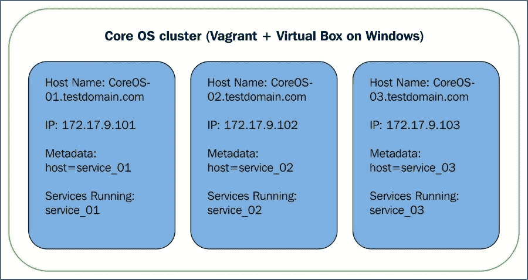
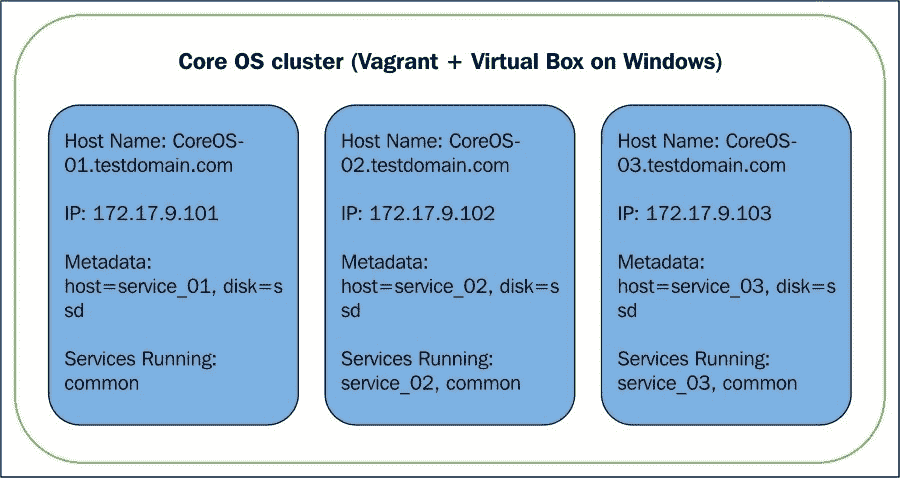
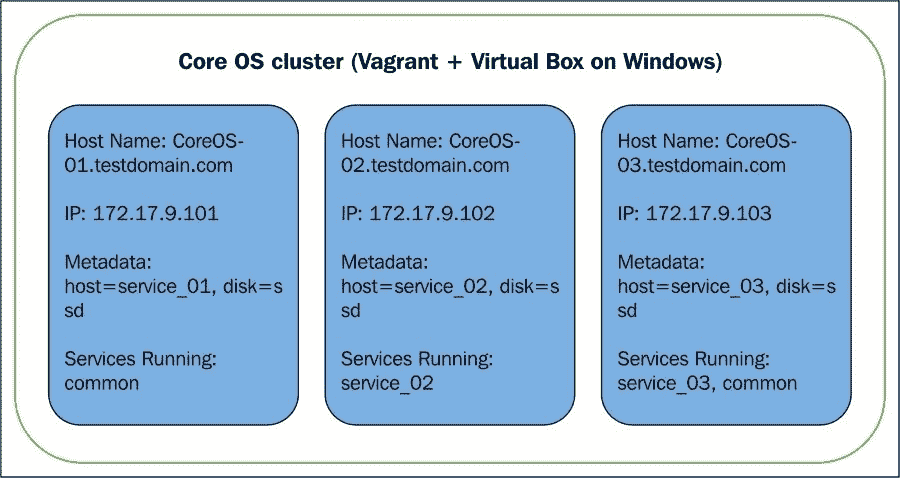
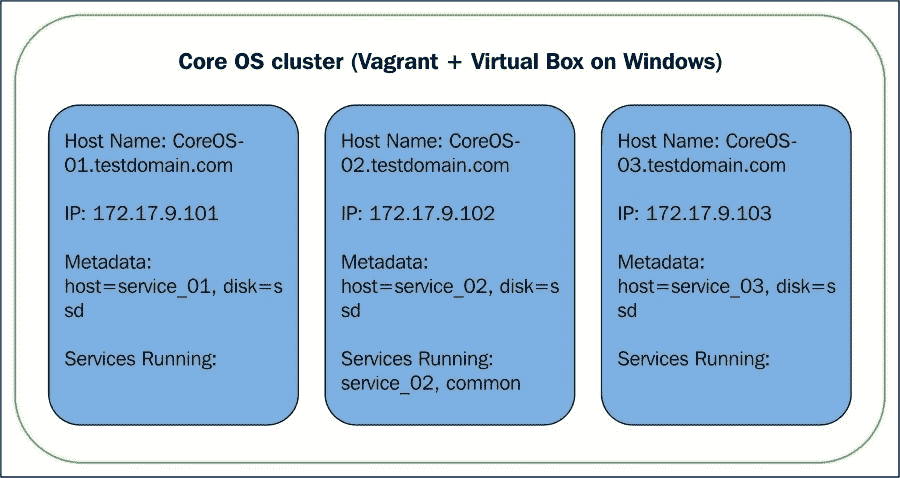

# 第四章：管理具有用户定义约束的服务

本章通过对服务施加约束，将 CoreOS 集群提升到一个新层次，确保它们仅在所需的成员上运行。

本章涵盖以下主题：

+   使用元数据的预定义约束

+   服务级亲和性/反亲和性

+   节点级亲和性

+   高可用性

# 服务约束简介

并非所有集群成员都会在部署中运行所有服务。有些可能运行业务逻辑服务，有些可能运行管理软件，还有一些可能运行日志或审计软件，等等。因此，集群管理软件必须提供控制服务部署的机制，以确保服务仅在满足特定属性的成员上运行。我们将学习 CoreOS 提供的控制部署的机制。

CoreOS 使用`fleet`服务在具有约束的成员上调度服务。单元文件配置选项帮助将服务定向到满足配置属性的特定成员或成员组。随后，我们还将学习如何将`fleet`服务集成到`cloud-config`文件中，并在`docker`容器内自动启动自定义服务。

# 使用元数据的预定义约束

该机制使得服务可以在具有与`coreos.fleet`部分的`metadata`参数中配置的匹配元数据的机器上运行。元数据可以用来描述成员的属性，如磁盘类型、区域、平台以及特殊的成员属性（如公开 IP 等）。由于它是以多个键值对的形式提供的，因此它在定义成员时提供了巨大的灵活性。

然后，元数据还可以用于将服务关联到在这些成员上运行的服务。例如，我们可以指定某个特定的服务应该在运行于特定区域和/或具有特定磁盘类型和/或具有特定成员类型（裸金属、云等）和/或具有特定提供商（机器供应商、云服务提供商等）的成员上运行。

在我们的示例中，我们将创建三个成员，每个成员都有自己的元数据，然后将服务绑定到与其属性匹配的元数据上运行。以下是设置：



以下是用于创建集群并在指定成员上运行服务的`cloud-config`文件：

```
#cloud-config
write_files:
 - path: /home/core/example_01.service
    owner: core:core
    permissions: 420
    content: |
      [Unit]
      Description=Example
      After=docker.service
      Requires=docker.service

 [X-Fleet]
 MachineMetadata=host=service_01

      [Service]
      TimeoutStartSec=0
      ExecStartPre=-/usr/bin/docker kill sampleserv_01
      ExecStartPre=-/usr/bin/docker rm sampleserv_01
      ExecStartPre=/usr/bin/docker pull busybox
      ExecStart=/usr/bin/docker run --name sampleserv_01 busybox /bin/sh -c "while true; do echo Test Service; sleep 300; done"
      ExecStop=/usr/bin/docker stop sampleserv_01

 - path: /home/core/example_02.service
    owner: core:core
    permissions: 420
    content: |
      [Unit]
      Description=Example
      After=docker.service
      Requires=docker.service

 [X-Fleet]
 MachineMetadata=host=service_02

      [Service]
      TimeoutStartSec=0
      ExecStartPre=-/usr/bin/docker kill sampleserv_02
      ExecStartPre=-/usr/bin/docker rm sampleserv_02
      ExecStartPre=/usr/bin/docker pull busybox
      ExecStart=/usr/bin/docker run --name sampleserv_02 busybox /bin/sh -c "while true; do echo Test Service; sleep 300; done"
      ExecStop=/usr/bin/docker stop sampleserv_02

 - path: /home/core/example_03.service
    owner: core:core
    permissions: 420
    content: |
      [Unit]
      Description=Example
      After=docker.service
      Requires=docker.service

 [X-Fleet]
 MachineMetadata=host=service_03

      [Service]
      TimeoutStartSec=0
      ExecStartPre=-/usr/bin/docker kill sampleserv_03
      ExecStartPre=-/usr/bin/docker rm sampleserv_03
      ExecStartPre=/usr/bin/docker pull busybox
      ExecStart=/usr/bin/docker run --name sampleserv_03 busybox /bin/sh -c "while true; do echo Test Service; sleep 300; done"
      ExecStop=/usr/bin/docker stop sampleserv_03

coreos:
  etcd2:
    name: core-03
    advertise-client-urls: http://$public_ipv4:2379
    initial-advertise-peer-urls: http://$private_ipv4:2380
    listen-client-urls: http://0.0.0.0:2379,http://0.0.0.0:4001
    listen-peer-urls: http://$private_ipv4:2380,http://$private_ipv4:7001
    initial-cluster-token: coreOS-static
    initial-cluster: core-01=http://172.17.8.101:2380,core-02=http://172.17.8.102:2380,core-03=http://172.17.8.103:2380
  fleet:
    public-ip: $public_ipv4
 metadata: host=service_01

  units:
  - name: etcd2.service
    command: start
    enable: true
 - name: fleet.service
 command: start
 enable: true
  - name: example_fleet_01.service
    command: start
    content: |
      [Service]
      Type=oneshot
      ExecStartPre=/bin/sh -c "sleep 10"
 ExecStart=/usr/bin/fleetctl start /home/core/example_01.service
  - name: example_fleet_02.service
    command: start
    content: |
      [Service]
      Type=oneshot
      ExecStartPre=/bin/sh -c "sleep 10"
 ExecStart=/usr/bin/fleetctl start /home/core/example_02.service
  - name: example_fleet_03.service
    command: start
    content: |
      [Service]
      Type=oneshot
      ExecStartPre=/bin/sh -c "sleep 10"
      ExecStart=/usr/bin/fleetctl start /home/core/example_03.service
```

`write_files`部分被添加到生成`fleet`的单元文件。创建了三个单元文件，每个服务只会在其中一个成员上运行。每个单元文件都添加了`X-Fleet`部分，添加了一个约束，要求它只能在具有特定元数据的机器上运行。

`fleet`部分已更新，以启动`fleet`并指定用于联系`etcd2`服务的 IP 地址。此外，添加了元数据参数，用于指定成员的元数据。需要进行仪表化操作，以为每个成员生成独立的元数据。静态集群的`Vagrantfile`在第三章中，*创建您的 CoreOS 集群并管理集群*，作为基础文件，并通过突出显示的仪表化修改每个成员的元数据。

```
...
      if File.exist?(CLOUD_CONFIG_PATH)
        user_data_specific = "#{CLOUD_CONFIG_PATH}-#{i}"
        require 'yaml'
        data = YAML.load(IO.readlines('user-data')[1..-1].join)
        if data['coreos'].key? 'etcd2'
          data['coreos']['etcd2']['name'] = vm_name
        end
 if data['coreos'].key? 'fleet'
 data['coreos']['fleet']['metadata'] = "host=service_%02d" % [i]
 end
        yaml = YAML.dump(data)
        File.open(user_data_specific, 'w') { |file| file.write("#cloud-config\n\n#{yaml}") }
        config.vm.provision :file, :source => user_data_specific, :destination => "/tmp/vagrantfile-user-data"
        config.vm.provision :shell, :inline => "mv /tmp/vagrantfile-user-data /var/lib/coreos-vagrant/", :privileged => true
      end
...
```

单元部分已更新，以启动`fleet`服务并包装`oneshot`服务，以在启动时调用`fleetctl`。然后，`Fleetctl`管理该服务。以下是事件的顺序：

+   服务的单元文件`/home/core/example_01.service`、`/home/core/example_02.service`和`/home/core/example_03.service`在启动时创建。请注意，`write_files`保持在`coreos`部分之前，以确保在启动服务之前先创建文件。

+   服务由在每个成员上运行的`systemd`启动。在`oneshot`服务`example_01.service`、`example_02.service`和`example_03.service`中添加了十秒钟的休眠，以便在使用`fleetctl`提交作业之前，初始化`etcd2`和`fleetd`服务。

+   然后，`Fleetd`协调并调度各个成员上的服务。

使用`Vagrant up`启动集群。启动成功后，我们可以看到集群中的成员以及各个成员上运行的服务。请注意，`example_01.service`在具有元数据`service_01`的`member 01`上启动，`example_02.service`在具有元数据`service_02`的`member 01`上启动，依此类推：

```
vagrant ssh core-01

fleetctl list-units
UNIT                    MACHINE                         ACTIVE  SUB
example_01.service      375bde8b.../172.17.8.101        active  running
example_02.service      2b6184e0.../172.17.8.102        active  running
example_03.service      e59919cc.../172.17.8.103        active  running
fleetctl list-machines
MACHINE         IP              METADATA
2b6184e0...     172.17.8.102    host=service_02
375bde8b...     172.17.8.101    host=service_01
e59919cc...     172.17.8.103    host=service_03

```

现在，让我们修改`cloud-config`文件，以创建另一个部署，在该部署中，`example.service`的每个实例都在每个成员上运行，同时成员 2 和成员 3 上也有相应的服务，和之前的示例相同。



现在，我们将查看之前准备的`cloud-config`文件中所需的修改。

对`fleetctl`的单元文件进行了修改，以便为第一个服务创建一个模板单元。模板文件有助于从一个配置文件创建多个单元。在添加单元时，`Fleet/systemd`会查找名称完全匹配的配置文件。如果找不到这样的文件，则会使用带有`@`字符的同名文件。例如，要添加`common@1`文件，将使用`common@.service`。

```
#cloud-config
write_files:
 - path: /home/core/common@.service
...
```

在`X-Fleet`部分添加了附加的约束条件。`MachineMetaData`被更改为使用磁盘类型`ssd`。使用`Vagrantfile`工具的所有成员也添加了`disk=ssd`的元数据。这使得该服务适合在所有成员上运行。添加的`Conflicts`约束确保每台机器上仅运行一个实例。此约束意味着，如果某个服务已经在成员上运行，其他实例将不能在同一台机器上调度。请注意，服务名称使用了通配符以匹配任何实例编号。

```
...
      [X-Fleet]
 MachineMetadata=disk=ssd
 Conflicts=common@*.service
...
```

单元文件的服务部分已更新，以能够为任何实例启动服务。要在配置文件中引用实例字符串，可以使用`%i`占位符。`%i`会被启动时提供的实例号所替代。在此示例中，虽然没有使用此功能，但值得一提。

```
...

      [Service]
      TimeoutStartSec=0
      ExecStartPre=-/usr/bin/docker kill busybox
      ExecStartPre=-/usr/bin/docker rm busybox
      ExecStartPre=/usr/bin/docker pull busybox
      ExecStart=/usr/bin/docker run --name busybox /bin/sh -c "while true; do echo Test Service; sleep 300; done"
      ExecStop=/usr/bin/docker stop busybox
...
```

用于调用`fleetctl`的包装服务也已更新，以启动三个服务实例：

```
...
 - name: example_fleet1.service
    command: start
    content: |
      [Service]
      Type=oneshot
      ExecStartPre=/bin/sh -c "sleep 10"
 ExecStart=/usr/bin/fleetctl start /home/core/common@1.service
 - name: example_fleet2.service
...
 ExecStart=/usr/bin/fleetctl start /home/core/common@2.service
 - name: example_fleet3.service
...
 ExecStart=/usr/bin/fleetctl start /home/core/common@3.service
  - name: example_fleet_02.service
...
```

修改了`Vagrantfile`，并增加了以下配置，将`disk=ssd`的元数据添加到所有成员：

```
...
        if data['coreos'].key? 'fleet'
 data['coreos']['fleet']['metadata'] = "host=service_%02d,disk=ssd" % [i]
        end
...
```

使用`Vagrant up`启动集群。启动成功后，我们可以看到集群中的成员及其上运行的服务。请注意，`common@.service`在所有成员上都在运行，而`example_02.service`和`example_03.service`仅在各自的成员上实例化。

```
vagrant ssh core-01

fleetctl list-units
UNIT                    MACHINE                         ACTIVE  SUB
common@1.service       344d088c.../172.17.8.102        active  running
common@2.service       a5a4a7e5.../172.17.8.101        active  running
common@3.service       200545ed.../172.17.8.103        active  running
example_02.service      344d088c.../172.17.8.102        active  running
example_03.service      200545ed.../172.17.8.103        active  running

fleetctl list-machines
MACHINE         IP              METADATA
200545ed...     172.17.8.103    disk=ssd,host=service_03
344d088c...     172.17.8.102    disk=ssd,host=service_02
a5a4a7e5...     172.17.8.101    disk=ssd,host=service_01

```

在这个示例中，我们还涉及了基于机器上运行服务的约束条件。我们将在下一部分进一步讨论它。

## 服务级亲和性/反亲和性

这一机制使得将服务捆绑在一起，确保它们在同一成员上运行或反之亦然；也就是说，确保如果某个特定服务在成员上运行，当前服务就不会在该机器上调度。

在第二个示例中，通过使用元数据预定义约束，我们添加了一个`Conflicts`约束，以确保在成员上只启动一个服务实例。因此，该约束已应用于自服务名称。这也可以为其他服务添加。这确保了两个服务不会在同一成员上共存。为了理解这一点，我们将稍微修改示例，以确保`common@.service`不会与`example_02.service`一起运行。



在`common@.service`的单元配置文件中，新增了另一个`Conflicts`参数，针对`example_02.server`。此外，`coreos`的`units`部分已修改，添加了`example_fleet_02.service`的条目，并且该条目位于`example_fleet1.service`之前。

```
...
      [X-Fleet]
      MachineMetadata=disk=ssd
      Conflicts=common@*.service
 Conflicts=example_02.service
...
```

使用`Vagrant up`启动集群。启动成功后，我们可以看到集群中的成员及其上运行的服务。请注意，`common@.service`在所有成员上都在运行，除了运行`example_02.service`的成员。

```
vagrant ssh core-01

fleetctl list-units
UNIT                    MACHINE                         ACTIVE  SUB
common@1.service        60b21422.../172.17.8.101        active  running
common@2.service        c8009511.../172.17.8.103        active  running
example_02.service      103f8f5a.../172.17.8.102        active  running
example_03.service      c8009511.../172.17.8.103        active  running

fleetctl list-machines
MACHINE         IP              METADATA
103f8f5a...     172.17.8.102    disk=ssd,host=service_02
60b21422...     172.17.8.101    disk=ssd,host=service_01
c8009511...     172.17.8.103    disk=ssd,host=service_03

```

现在让我们讨论一个反向使用案例：我们希望特定的服务与另一个服务一起在某个成员上运行。我们只会在 `example_02.service` 运行的地方启动通用服务。



`X-Fleet` 部分已更新，添加了新的参数 `MachineOf`。这确保了 `common@.service` 仅与 `example_02.service` 一起运行。

```
...
      [X-Fleet]
 MachineOf=example_02.service
...
```

使用 `Vagrant up` 启动集群。在启动成功后，我们可以看到集群中的成员以及在成员上运行的服务。请注意，`common@1.service` 仅在 `example_02.service` 运行的成员上运行。

```
vagrant ssh core-01

core@core-01 ~ $ fleetctl list-units
UNIT                    MACHINE                         ACTIVE  SUB
common@1.service        d119aafa.../172.17.8.102        active  running
example_02.service      d119aafa.../172.17.8.102        active  running
example_03.service      6f3da0a4.../172.17.8.103        active  running
core@core-01 ~ $
core@core-01 ~ $
core@core-01 ~ $ fleetctl list-machines
MACHINE         IP              METADATA
6f3da0a4...     172.17.8.103    disk=ssd,host=service_03
c88e05ba...     172.17.8.101    disk=ssd,host=service_01
d119aafa...     172.17.8.102    disk=ssd,host=service_02

```

## 节点级亲和性

该机制使用 `systemd` 生成的机器 ID 来调度服务。在成员安装时，`systemd` 会生成一个机器 ID，该 ID 在后续的系统启动中保持不变。节点级亲和性确保用户将服务目标定位到特定的成员上，而不是其他地方。在考虑到集群时，如果基于成员属性而非成员标识符来调度服务更为灵活，这个机制的使用就会受到限制。典型的使用场景包括运行服务以从机器收集特定数据，或者在测试成员上调度新服务来观察其行为。

以下是用来创建集群的 `cloud-config` 文件。该文件还会在主目录中创建一个服务单元文件，供 fleet 用于启动服务。

```
#cloud-config
write_files:
  - path: /home/core/example_test.service
    owner: core:core
    permissions: 420
    content: |
      [Unit]
      Description=Example
      After=docker.service
      Requires=docker.service

      [X-Fleet]
      MachineID=dummy

      [Service]
      TimeoutStartSec=0
      ExecStartPre=-/usr/bin/docker kill sampleserv_test
      ExecStartPre=-/usr/bin/docker rm sampleserv_test
      ExecStartPre=/usr/bin/docker pull busybox
      ExecStart=/usr/bin/docker run --name sampleserv_test busybox /bin/sh -c "while true; do echo Test Service; sleep 300; done"
      ExecStop=/usr/bin/docker stop sampleserv_test

...

  units:
  - name: etcd2.service
    command: start
    enable: true
  - name: fleet.service
    command: start
    enable: true
```

这个 `cloud-config` 文件有两个主要目的：启动 `fleetd` 服务并创建服务文件 `/home/core/example_test.service`。

我们现在将查找集群中成员的机器 ID：

```
vagrant ssh core-01

core@core-01 ~ $ fleetctl list-machines -l
MACHINE                                 IP              METADATA
41b7574b33b0462c8e311ded39302a19        172.17.8.101    host=service_01
7e481484a52945d3ad369f68d2e46a77        172.17.8.103    host=service_03
f70fc5f45cdc49f99fc47757f6fe5ae6        172.17.8.102    host=service_02

```

修改服务文件，使得服务可以在机器 ID `f70fc5f45cdc49f99fc47757f6fe5ae6` 上实例化。这个机器 ID 可以是你选择的任何 ID。我们无法使用 Vagrant 自动化操作，因为机器 ID 在之前对我们是未知的。

```
core@core-01 ~ $ cat example_test.service
...

[X-Fleet]
MachineID=f70fc5f45cdc49f99fc47757f6fe5ae6

...

```

启动服务并检查它是否在所需的机器上运行：

```
core@core-01 ~ $ /usr/bin/fleetctl start /home/core/example_test.service
Unit example_test.service launched on f70fc5f4.../172.17.8.102
core@core-01 ~ $ fleetctl list-units
UNIT                    MACHINE                         ACTIVE          SUB
example_test.service      f70fc5f4.../172.17.8.102        active      running

```

## 高可用性

设计一个高度可用系统有两个关键原则。其一是避免单点故障；也就是说，当发生故障时，整个系统不应出现停机。例如，不应依赖单一进程、接口等。第二个原则是系统在发生故障时能够多快恢复，以便停机时间尽可能短。

`Fleetd` 通过允许在不同的成员上配置服务的多个实例，而不是在同一成员上配置多个实例，帮助设计一个高度可用的系统。这意味着单个成员的故障不会导致整个服务停机，但它仍然可以以减少的容量执行其应有的功能，直到恢复发生。一旦成员恢复，或者在编排应用检测到成员故障后启动了另一个成员，fleet 将自动将服务重新调度到新成员上。

# 总结

在本章中，我们理解了服务约束，这有助于将服务部署到合适的成员上。

在下一章中，我们将进一步了解如何发现运行在 CoreOS 集群中的服务。
