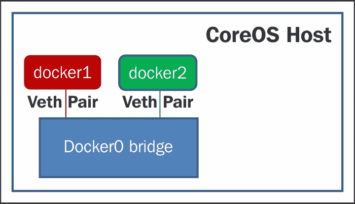
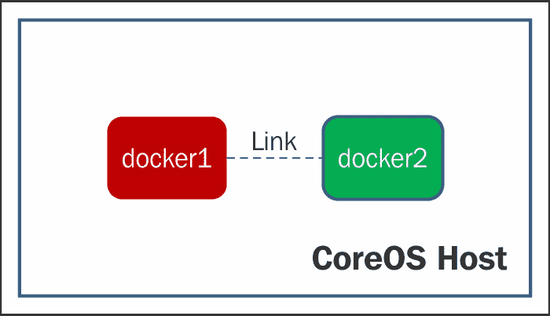
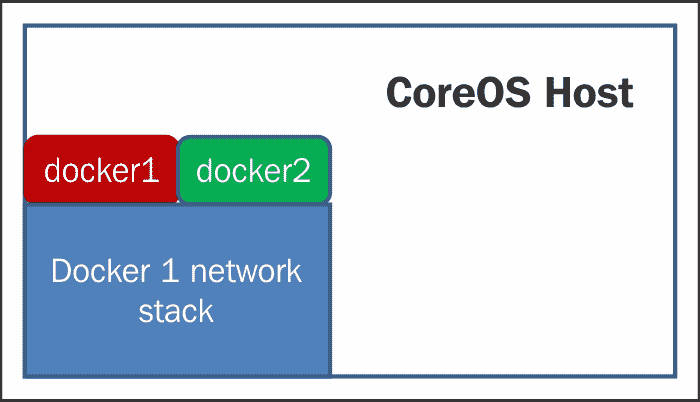
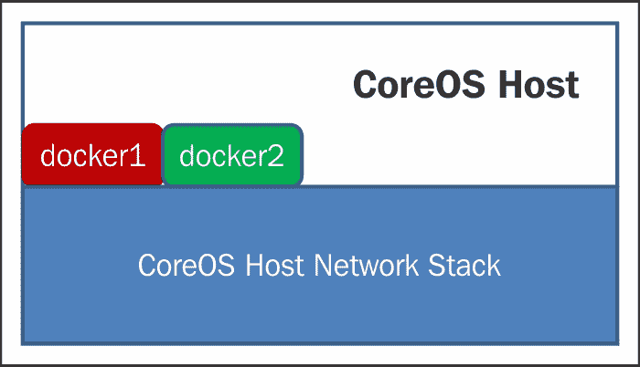
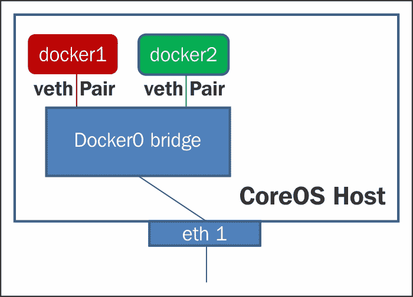
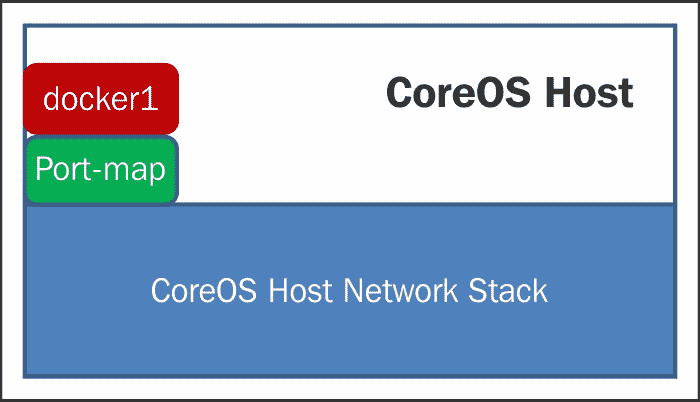
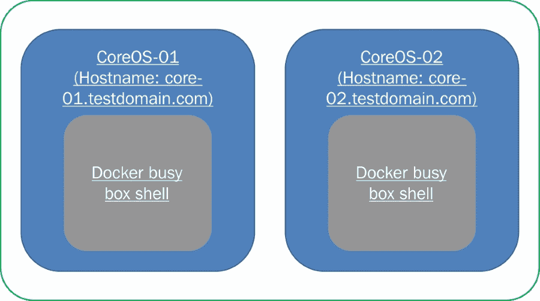

# 第六章 服务链路和跨服务网络

本章解释了在集群中链路不同服务的需求和机制。

本章涵盖以下主题：

+   服务链路的介绍及其必要性

+   Docker 网络介绍

+   使用 Flannel/Rudder 进行服务链路

+   使用 Weave 进行服务链路

在上一章中，我们详细讨论了如何从其他服务发现运行在不同 CoreOS 实例中的服务。一旦服务被发现，一个或多个服务可能需要相互通信。本章解释了在 CoreOS 集群中链路不同服务的需求和机制。

# 服务链路的介绍及其必要性

由于 CoreOS 集群中的不同服务作为 docker/Rackt 容器部署，因此不可避免地需要提供一个机制，以便这些服务之间进行通信。这些服务可能运行在同一个 CoreOS 实例中，也可能跨不同的 CoreOS 实例运行。

一个例子是，当一个 Web 服务器部署在 CoreOS 集群的节点 1 上，而数据库服务部署在节点 2 上时。在这种情况下，数据库服务为 Web 服务器提供服务，我们可以称之为服务提供者。通过上一章中描述的服务发现机制，Web 服务器服务可能会发现数据库服务及其参数，例如连接字符串、IP 地址、端口号等。一旦这些信息被发现，Web 服务器可能需要与数据库服务交互，以便持久化存储一些信息或从持久化存储中获取信息。为了实现这一点，可能需要执行以下操作：

+   在彼此之间建立网络连接

+   使用服务提供者提供的服务

一切看起来都没问题。但在为容器提供网络连接时，会出现一些复杂性。我们来深入了解这些问题。在本章中，我们假设 CoreOS 实例中的服务都是作为 docker 容器部署的。

CoreOS 节点中的每个服务/ Docker 容器都分配一个 IP 地址。应用程序可以使用这个 IP 地址在容器内相互通信。这在服务都运行在同一个 CoreOS 节点时效果很好，因为同一 CoreOS 节点中的所有 Docker 实例或服务都会处于同一个网络中，并通过 docker0 桥接进行连接。当这些服务运行在不同的 CoreOS 节点上时，这些节点应该使用主机 CoreOS 提供的端口映射功能来访问目标容器。但在使用这种机制时，容器应该在发现服务中公布主机机器的 IP 地址。将主机 IP 推送到发现服务的一个选项是使用 `ExecStartPost` 选项，在 fleet 单元文件中进行配置。这样，容器就能访问主机 IP 地址。主机的 IP 地址和网络对于容器是不可用的，这允许其他外部实体提供此服务。

在了解 Flannel 和 Weave 等机制如何解决这个问题之前，让我们先看看 Docker 容器网络的详细信息。

# Docker 网络简介

容器/服务有多种通信需求。CoreOS 和 Docker 共同应提供机制来满足以下所有需求：

+   在同一 CoreOS 节点中的容器–容器通信

+   容器与 CoreOS 主机的通信

+   容器与外部世界的通信

+   在不同 CoreOS 节点中的容器–容器通信

让我们在接下来的部分中探讨 CoreOS 如何为 Docker 容器提供这些功能。

## 容器–容器通信

本节详细描述了 CoreOS 和 Docker/容器技术提供的不同机制，用于在 Docker 的不同实例之间提供通信。以下是实现这种通信的多种方式：

+   Docker0 桥接与 veth 对

+   使用链接

+   使用共享网络栈

### Docker0 桥接与 veth 对

**Docker0** 桥接是 Docker 创建的一个 Linux 桥接，用于提供不同 Docker 容器之间的通信。默认情况下，Docker 创建一个名为 docker0 的 Linux 桥接，提供 CoreOS 主机上所有 Docker 容器的连接。

### 提示

Docker0 桥接仅在实例化第一个容器实例时创建。后续的容器实例化不会创建新的桥接。

Veth 是一种可以在 Linux 内核内部用作虚拟链接的**虚拟以太网设备**。通常，veth 设备将成对创建（称为 veth 对），以在容器的不同实例之间提供连通性。当在 CoreOS 节点中实例化新的容器/服务时，将创建新的 veth 对。veth 对的一端附加到容器服务，另一端连接到 docker0 桥接。这些 docker0 桥接和 veth 对为在同一 CoreOS 节点上运行的不同容器提供连通性。

在以下图表中，docker1 和 docker2 容器通过 veth 对连接到 docker0 桥接，从而提供跨 Docker 容器的连通性。连接到 docker 实例的 veth 对的一端将作为 eth0 接口在 docker 实例内可见。可以配置此 eth0 接口的 IP 地址。用户可以配置 docker1 和 docker2 实例的 eth0 接口为相同的网络，以在它们之间提供连通性。



使用 docker0 桥接进行容器之间的容器通信

Docker 实例通过具有 IP 地址范围从 `172.17.51.1` 到 `172.17.51.25` 的虚拟子网附加到 docker0 桥接。由于 veth 对的 docker 端在同一范围内获取 IP，可能会导致在两个不同的服务器/虚拟机实例中，两个容器具有相同的 IP 地址。这可能导致在路由 IP 包时出现问题。

### 使用链接

这是在 Docker 容器之间提供通信的简单方式之一。**Docker Link** 是源容器和目标容器之间的单向通道/管道。`docker` 命令在实例化容器本身时提供了一种链接容器的方法。`–link` 选项用于此目的。Docker Link 只能用于在同一主机上运行的容器之间提供通信。

例如，如果 `docker2` 容器希望使用另一个容器 `docker1` 的网络堆栈，则启动 `docker2` 的命令如下：

```
/usr/bin/docker run --name docker2 –link docker1:docker1 ubuntu /bin/sh -c "while true; do echo Hello World; sleep 1; done"

```



使用 Docker Link 进行容器之间的容器通信

### 使用常见的网络堆栈

在这种机制中，一个 Docker 容器将使用由另一个 Docker 容器的网络堆栈提供的网络堆栈，而不是拥有自己的网络堆栈。Docker 容器不会使用本书介绍部分中解释的网络命名空间构造，而是与另一个 Docker 共享网络命名空间。由于容器与另一个容器共享命名空间，一个容器中的任何应用程序都可以与另一个容器通信，就像两个 Docker 容器服务都在一个网络堆栈中作为应用程序运行一样。

`docker` 命令提供了一种在实例化容器时使用另一个 docker 的网络堆栈的方法。`–net=container1` 选项用于此目的。

例如，如果容器 `cont_net1` 想要使用另一个容器 `b1` 的网络堆栈，那么启动 `cont_net1` 的命令如下：

```
/usr/bin/docker run -d --name cont_net1 --net= cont_net1:b1 ubuntu /bin/sh -c "while true; do echo Hello World; sleep 1; done"

```



使用共同网络堆栈的容器–容器通信

## 容器与 CoreOS 主机通信

除了容器之间的通信机制外，某些情况下，容器内运行的服务可能希望与 CoreOS 主机上运行的应用程序进行通信或交换信息。CoreOS 和 docker 提供了一些机制来实现这一点，使用以下机制：

+   主机网络

+   docker0 桥接

### 主机网络

在这种机制下，docker 容器将使用 CoreOS 主机机器提供的网络堆栈，而不是拥有自己的网络堆栈。docker 容器不会使用本书介绍部分中解释的网络命名空间构造，而是与主机 CoreOS 操作系统共享网络命名空间。由于容器与主机 CoreOS 操作系统共享命名空间，CoreOS 主机中的任何应用程序都可以与 docker 容器通信，就像 docker 容器服务作为应用程序在 CoreOS 主机中运行一样。这是允许 docker 托管通信的其中一种简单机制。

`docker` 命令提供了一种在实例化容器时使用主机机器的网络堆栈的方法。`–net=host` 选项用于此目的。

例如，如果 docker1 容器想要使用主机 CoreOS 的网络堆栈，那么启动 `docker1` 的命令如下：

```
/usr/bin/docker run -d --name docker1 --net=host ubuntu_ftp vsftpd

```



使用主机网络堆栈的容器–容器通信

### docker0 桥接

docker0 桥接也可以用于在 docker 和主机操作系统之间提供通信。为此，主机操作系统中的一个接口应连接到 docker0 桥接，这样就能提供通信。下图详细说明了这一点，其中 CoreOS 主机机器的 `eth1` 接口也连接到 docker0 桥接，它提供与 docker 和广域网之间的连接。在这种情况下，docker1、docker2 的 eth0 接口和 eth1 接口应位于同一网络中，以提供 docker 与主机 CoreOS 之间的网络连接。



使用 docker0 桥接的容器–外部世界通信

## 容器与 CoreOS 外部世界通信

这是将服务作为微服务部署在 CoreOS 集群中的基本要求之一。运行在 CoreOS 集群中的服务（作为 docker）应该能够从外部世界访问，反之亦然。CoreOS 和 docker 提供以下机制来实现这一点：

+   主机网络

+   端口映射

+   使用 docker0 桥接

### 主机网络

主机网络在前一节中已详细描述。由于容器与主机 CoreOS 操作系统共享命名空间，当主机 CoreOS 操作系统连接到广域网时，运行在容器中的服务也应该能够成为广域网网络的一部分。

`docker`命令提供了一种在实例化容器本身时使用主机机器网络堆栈的方法。为此，使用`–net=host`选项。

作为一个例子，如果 docker1 容器想要使用主机 CoreOS 的网络堆栈，那么启动 docker1 的命令如下：

```
/usr/bin/docker run -d --name docker1 --net=host ubuntu_ftp vsftpd

```

### 端口映射

这是最广泛使用的机制之一，用于将 docker 容器与外部世界进行通信。在这种机制中，主机机器上的端口号将映射到 docker 容器中的端口号。这里的端口指的是传输层端口，如 UDP 端口/TCP 端口。例如，如果用户在 docker 容器中部署了一个 web 服务器，他们可以将主机 CoreOS 操作系统中的`HTTP`端口（端口号`80`）映射到 docker 容器中的`HTTP`端口（端口号`80`）。因此，当 CoreOS 主机接收到 HTTP 请求时，它会将请求转发到容器，容器会处理这个 HTTP 请求。但与这种机制相关的一个主要挑战是，不能在多个 docker 容器中部署相同的服务，因为这会导致主机操作系统中的端口冲突。



容器 - 使用端口映射进行外部世界通信

## 容器 - 在不同 CoreOS 节点中的容器间通信

我们已经看到 CoreOS 或 docker 如何从单节点的角度提供网络服务。随着服务在 CoreOS 集群中部署，需要提供不同 CoreOS 节点中运行的容器之间的通信。本章其余部分将详细讨论这一通信机制。以下是提供这一功能的多个工具：

+   Weave

+   Flannel/Rudder

+   使用**OVS**（**OpenVSwitch**）

在本章中，我们将看到 Flannel 和 Weave 如何提供通信机制。在下一章中，我们将详细讨论 OVS 及其如何用于在不同容器之间提供通信。

# Weave 简介

我们之前学到，运行在 Docker 中的应用程序无法知道主机机器的 IP 地址。因此，它们无法注册其 IP 地址以供服务使用，因为运行在主机外部的另一个容器必须使用主机 IP 地址来访问该服务。

如果将主机机器的 IP 地址作为环境变量传递，服务信息可以存储在`etcd`中，并由服务用户读取，如第五章中所示，“在集群中运行的服务的发现”。此方法要求应用程序代码了解如何发现服务。

**Weave**简化了服务发现并且做了更多。Weave 提供了一种机制，连接在 Docker 容器内运行的应用程序，无论它们部署在哪里。由于应用程序服务作为 Docker 容器运行，微服务之间的通信的便利性非常重要。

Weave 会自动在**weaveDNS**中注册命名的容器，因此服务或 docker 可以通过常规名称解析解析它们的名称来访问。这需要应用程序特定的代码，如`gethostbyname`或`getaddrinfo`，使用预定义的 Docker 名称用于服务，将名称解析为 IP 地址使用`weaveDNS`。

Weave 建立了一个虚拟以太网交换机，连接所有 Docker 容器以及其中运行的服务或应用程序。Weave 建立了分配唯一 IP 地址的网络，每次容器启动时分配 IP 地址，并在它们关闭时释放 IP 地址。通过这种方式，启动 Docker 时不再需要显式导出端口，并且可以从任何地方访问服务，因此不再需要前端应用程序运行在公共网络上的主机上。还可以手动分配 IP 地址给容器，最终用于创建隔离子网。这使得能够将一组应用程序与另一组隔离开来。

Weave 与 Docker 集成简单，我们稍后在本章节中进行实际操作时会看到。Weave 还通过在需要通过公共或不受信任的网络连接 Docker 容器时加密流量来提供安全性。

# Flannel/Rudder 简介

与 Weave 类似，**Flannel**也为容器分配 IP 地址，可通过创建覆盖网格网络进行容器到容器的通信。Flannel 在内部使用`etcd`存储分配的容器 IP 地址与主机 IP 地址之间的映射。它没有像 Weave 那样复杂的功能，并且可以在不需要 Weave 提供的其他功能集的情况下使用。例如，Flannel 不通过 DNS 提供自动服务发现，仍然需要应用程序编码或工具化来发现服务端点。

默认情况下，每个容器在`/24`子网中被分配一个 IP 地址。子网大小可以进行配置。Flannel 使用 UDP 封装流量以传输到目的地。

在后续章节中，我们将学习如何使用 Flannel。Flannel 之前被称为**Rudder**。

将`CoreOSWeave`与 Weave 集成非常简单。独立安装只需从代码库中拉取 Weave 脚本，并通过另一个命令设置并启动 Weave 路由器。

让我们手动运行一遍命令序列，然后通过`cloud config`进行安装和设置。

## 安装

Weave 可以通过使用`wget`或`curl`获取脚本并安装到系统中。下载后，修改权限使其可执行。

```
/usr/bin/wget -N -P /opt/bin git.io/weave
/usr/bin/chmod +x /opt/bin/weave

```

## 设置 Weave

运行命令`weave launch`来设置并启动 Weave 路由器、Weave DNS 以及 Docker API 命令的代理（如`docker run`等）。该命令还会设置 Weave 网络。当第一次在机器上运行此命令时，将下载设置所需的`Weave Docker`镜像。

```
weave launch
Unable to find image 'weaveworks/weave:latest' locally
latest: Pulling from weaveworks/weave
4c25b19b8af6: Pulling fs layer
6498a5f7a259: Pulling fs layer
638a117dec98: Pulling fs layer
afebf09d0da1: Pulling fs layer
e5ac6ff68d75: Pulling fs layer
6498a5f7a259: Verifying Checksum
6498a5f7a259: Download complete
4c25b19b8af6: Verifying Checksum
4c25b19b8af6: Download complete
638a117dec98: Verifying Checksum
638a117dec98: Download complete
4c25b19b8af6: Pull complete
e5ac6ff68d75: Verifying Checksum
e5ac6ff68d75: Download complete
6498a5f7a259: Pull complete
638a117dec98: Pull complete
afebf09d0da1: Verifying Checksum
afebf09d0da1: Download complete
afebf09d0da1: Pull complete
e5ac6ff68d75: Pull complete
Digest: sha256:1a8565d24ef2b617619a482cbfe895f8fc27e7a4518ac18b9005ed7b4caa223f
Status: Downloaded newer image for weaveworks/weave:latest

```

要检查状态，可以使用`status`命令查看路由器状态。如果首次运行该命令，则会下载设置所需的 Weave Docker 镜像。

```
weave status
Unable to find image 'weaveworks/weaveexec:latest' locally
latest: Pulling from weaveworks/weaveexec
b6069e3f1ecc: Pull complete
326c397fb7ed: Pull complete
4d2b936d2fa5: Pull complete
16a356f92997: Pull complete
ae09ffb2bf28: Pull complete
14931fda689e: Pull complete
85d81711422f: Pull complete
16bfdc48cfb1: Pull complete
52bab2cc143b: Pull complete
82d8a8c031ec: Pull complete
6993b16a50ae: Pull complete
ee37b21b766d: Pull complete
3c16e5ee0357: Pull complete
77b8fe327374: Pull complete
23272d8d46c3: Pull complete
Digest: sha256:1d34246eb53f070f0e35ad13974367e2a4fee78039da74b8760a4eff49a9334f
Status: Downloaded newer image for weaveworks/weaveexec:latest
 Version: git-efd4fc4704ce

 Service: router
 Protocol: weave 1..2
 Name: 5a:62:3a:91:af:c5(core-01.testdomain.com)
 Encryption: disabled
 PeerDiscovery: enabled
 Targets: 0
 Connections: 0
 Peers: 1
 TrustedSubnets: none

 Service: ipam
 Status: idle
 Range: 10.32.0.0-10.47.255.255
 DefaultSubnet: 10.32.0.0/12

 Service: dns
 Domain: weave.local.
 Upstream: 10.0.2.3
 TTL: 1
 Entries: 0

 Service: proxy
 Address: unix:///var/run/weave/weave.sock

```

如果在容器启动时没有提供特定的 IP 地址，Weave 会从地址池中分配一个空闲 IP 给容器，并在容器退出时释放该地址（即标记为免费）。IP 地址池在集群中所有的 Weave 实例中共享。因此，在启动 Weave 时，必须提供集群中的所有成员或一个或多个成员。此外，还应包括一个参数，以告知 Weave 成员的数量。例如，如果有三个成员，IP 地址分别为`172.17.8.101`、`172.17.8.102`和`172.17.8.103`，则以下命令是正确的启动 Weave 并分配 IP 地址的方法。

选项一：

```
core@core-01 ~$ weave launch 172.17.8.102 172.17.8.103
core@core-02 ~$ weave launch 172.17.8.101 172.17.8.103
core@core-03 ~$ weave launch 172.17.8.101 172.17.8.102

```

选项二：

```
core@core-01 ~$ weave launch --init-peer-count 3
core@core-02 ~$ weave launch --init-peer-count 3 172.17.8.101
core@core-03 ~$ weave launch --init-peer-count 3 172.17.8.102

```

Weave 默认分配`10.32.0.0/12`范围内的 IP 地址，除非在启动时通过`--ipalloc-range`选项进行覆盖。例如，如果要使用的子网是`10.1.0.0`，大小为`16`，可以提供以下命令。相同的值应在所有成员中提供。

```
weave launch --ipalloc-range 10.1.0.0/16

```

Weave 提供了启用或禁用 Weave DNS 服务的选项。默认情况下，Weave DNS 服务是启用的。要禁用此服务，可以在运行 Weave 时提供`--without-dns`选项。Weave 在内存中维护所有主机的数据库。随着节点的加入，这个数据库不断建立。这个数据库在所有主机上都被维护，并且在主机之间进行复制。如果主机名位于`.weave.local`域中，则 Weave DNS 会将该名称与容器的 Weave IP 地址关联。当针对`.weave.local`域发起 DNS 查询时，Weave DNS 数据库将用于返回整个集群中该主机名所有容器的 IP 地址。当针对其他域名的名称发起 DNS 查询时，查询将发送到主机配置的名称服务器，从而遵循默认行为。

## 容器启动

可以通过使用 Weave 代理或不使用 Weave 代理来启动 Docker 容器。当使用 Weave 代理创建容器时，容器初始化会等待 Weave 网络接口变得可用，然后继续容器的进一步启动。容器的 IP 地址会被分配，并且容器将连接到 Weave 网络。

以下命令设置环境，使得 Docker 容器可以自动连接到 Weave 网络。可以使用常规的 Docker 命令来启动 Docker 容器：

```
eval "$(weave env)"
docker run ...

```

默认情况下，Weave 允许容器与集群中所有其他容器通信。可以通过提供一个子网范围来限制分配 IP 地址的范围。也可以提供多个子网。此外，还可以提供一个 IP 地址，分配给容器，作为自动分配 IP 地址的补充。也可以避免自动分配 IP 地址：

```
docker run -e WEAVE_CIDR=net:10.32.7.0/24 ...
docker run -e WEAVE_CIDR="net:10.32.1.0/24 net:10.32.8.0/24 ip:10.32.9.1/24" ...

```

可以通过使用命令`weave run`启动容器，而无需使用 Weave 代理。

以下是将用于说明两个 CoreOS 主机之间网络的设置。我们将在一个集群中实例化两个 CoreOS 成员，并在成员内部启动两个 docker 容器。docker 容器运行一个 busybox shell，以便我们可以运行网络命令并检查 IP 地址分配和对等容器的可达性。此设置演示了跨两个 CoreOS 主机之间的 docker 容器通信场景。



Weave 设置

以下是用于创建设置的`cloud-config`文件。其他重用的配置文件来自第三章中的*静态发现*部分，*创建你的 CoreOS 集群并管理集群*。在`config.rb`文件中将`$num_instances`设置为`2`，因为我们只需要启动两个成员实例。

```
#cloud-config

---
write_files:
  - path: /etc/weave.core-01.testdomain.com.env
    permissions: 0644
    owner: root
    content: |
      WEAVE_LAUNCH_ARGS="172.17.8.102"
  - path: /etc/weave.core-02.testdomain.com.env
    permissions: 0644
    owner: root
    content: |
      WEAVE_LAUNCH_ARGS="172.17.8.101"

coreos:
  units:
    - name: 10-weave.network
      runtime: false
      content: |
        [Match]
        Type=bridge
        Name=weave*

        [Network]

    - name: install-weave.service
      command: start
      enable: true
      content: |
        [Unit]
        After=network-online.target
        After=docker.service
        Description=Install Weave
        Requires=network-online.target
        Requires=docker.service

        [Service]
        Type=oneshot
        RemainAfterExit=yes
        ExecStartPre=/usr/bin/wget -N -P /opt/bin git.io/weave 
        ExecStartPre=/usr/bin/chmod +x /opt/bin/weave
        ExecStart=/bin/echo Wave Installed

    - name: weave.service
      command: start
      enable: true
      content: |
        [Unit]
        After=install-weave.service
        Description=Weave Network
        Requires=install-weave.service

        [Service]
        Type=oneshot
        EnvironmentFile=/etc/weave.%H.env
        ExecStart=/opt/bin/weave launch $WEAVE_LAUNCH_ARGS
```

在我们启动成员中的容器并检查连接性之前，让我们详细了解一下`cloud-config`文件。

首先，我们使用`write_files`部分创建两个文件。它们将在启动 Weave 之前使用在各自的机器上。每个文件的名称中都包含主机名，因此在`EnvironmentFile`中使用`%H`时，会引用专门为该成员准备的文件。

单元文件`10-weave.network`被添加以允许 Weave 网络用于 DHCP 查询。默认情况下，使用`docker0`桥接。这是可选的，只有在 Weave 网络用于 DHCP 时才需要。

单元 `install-weave.service` 将 Weave 安装到成员上并设置所需的权限。由于 Weave 安装完成后服务已完成其任务，因此这是一个一次性服务。添加 `After=network-online.target` 确保在安装 Weave 之前网络已启动。这是必要的，以便可以从互联网下载软件包。

单元 `weave.service` 引用相应的环境文件并启动 Weave。

使用 `Vagrant up` 启动集群。启动后，集群中的节点将启动并启用 weave 网络：

```
vagrant ssh core-01
weave status

 Version: 1.4.2

 Service: router
 Protocol: weave 1..2
 Name: 96:63:f1:5a:ac:3a(core-01.testdomain.com)
 Encryption: disabled
 PeerDiscovery: enabled
 Targets: 0
 Connections: 1 (1 established)
 Peers: 2 (with 2 established connections)
 TrustedSubnets: none

 Service: ipam
 Status: idle
 Range: 10.32.0.0-10.47.255.255
 DefaultSubnet: 10.32.0.0/12

 Service: dns
 Domain: weave.local.
 Upstream: 10.0.2.3
 TTL: 1
 Entries: 0

 Service: proxy
 Address: unix:///var/run/weave/weave.sock

```

我们可以看到两个对等节点已经连接。我们还可以看到 DNS 和路由器服务已启用，并且使用的是默认设置。

现在我们将在每个成员上启动一个 Docker 容器，并在 busybox 上运行一个简单的 shell。以下命令将在两个成员上执行。注意，我们明确提供了 Docker 容器的名称。这将导致两个 `.weave.local` 域名的 DNS 条目。

```
vagrant ssh core-01
eval "$(weave env)"
/usr/bin/docker run --name=container2 -it busybox /bin/sh
/ # ifconfig –a
...
ethwe     Link encap:Ethernet  HWaddr E6:AA:25:26:EA:04
 inet addr:10.32.0.1  Bcast:0.0.0.0  Mask:255.240.0.0
 inet6 addr: fe80::e4aa:25ff:fe26:ea04/64 Scope:Link
 UP BROADCAST RUNNING MULTICAST  MTU:1410  Metric:1
 RX packets:13 errors:0 dropped:0 overruns:0 frame:0
 TX packets:8 errors:0 dropped:0 overruns:0 carrier:0
 collisions:0 txqueuelen:1000
 RX bytes:1385 (1.3 KiB)  TX bytes:620 (620.0 B)
...

vagrant ssh core-02
eval "$(weave env)"
/usr/bin/docker run --name=container2 -it busybox /bin/sh
/ # ifconfig -a
...
ethwe     Link encap:Ethernet  HWaddr DA:E1:B8:3A:39:FB
 inet addr:10.40.0.0  Bcast:0.0.0.0  Mask:255.240.0.0
 inet6 addr: fe80::d8e1:b8ff:fe3a:39fb/64 Scope:Link
 UP BROADCAST RUNNING MULTICAST  MTU:1410  Metric:1
 RX packets:11 errors:0 dropped:0 overruns:0 frame:0
 TX packets:7 errors:0 dropped:0 overruns:0 carrier:0
 collisions:0 txqueuelen:1000
 RX bytes:969 (969.0 B)  TX bytes:550 (550.0 B)
...

```

现在，ping 另一个容器的 IP 地址和主机名，以确保容器之间的网络和 DNS 服务正常工作。容器启动后，你还可以运行状态命令，检查是否已更新两个 DNS 条目。

```
weave status
...
 Service: dns
 Domain: weave.local.
 Upstream: 10.0.2.3
 TTL: 1
 Entries: 2

 Service: proxy
 Address: unix:///var/run/weave/weave.sock

```

# 将 Flannel 与 CoreOS 集成

Flannel 在每个主机上运行一个守护进程 `flanneld`，负责在配置的子网中分配一个空闲的 IP 地址。`flanneld` 会监控 `etcd` 中的信息，并使用配置的机制路由数据包。

虽然 `flanneld` 服务并不是 CoreOS 标准发行版的一部分，但当通过 `cloud-config` 启动 `flanneld` 服务时，CoreOS 会在其他初始化之前启动一个服务，从 `docker` 注册表中拉取 `flanneld`。`flanneld` 作为 `docker` 容器存储在 CoreOS 企业注册表中。

用于 Weave 网络的相同设置也在此使用。请注意，对于 Flannel，主机名是无关紧要的。

以下是用于创建设置的 `cloud-config` 文件。其他配置文件来自 第三章 *静态发现* 部分，*创建 CoreOS 集群并管理集群*。在 `config.rb` 文件中将 `$num_instances` 设置为 `2`，因为我们只需要启动两个成员实例。

```
#cloud-config

---
coreos:
  etcd2:
    name: core-03
    advertise-client-urls: http://$public_ipv4:2379
    initial-advertise-peer-urls: http://$private_ipv4:2380
    listen-client-urls: http://0.0.0.0:2379,http://0.0.0.0:4001
    listen-peer-urls: http://$private_ipv4:2380,http://$private_ipv4:7001
    initial-cluster-token: coreOS-static
    initial-cluster: core-01=http://172.17.8.101:2380,core-02=http://172.17.8.102:2380,core-03=http://172.17.8.103:2380
  flannel:
    interface: $public_ipv4

  units:
  - name: etcd2.service
    command: start
    enable: true
  - name: flanneld.service
    drop-ins:
      - name: 50-network-config.conf
        content: |
          [Service]
          ExecStartPre=/usr/bin/etcdctl set /coreos.com/network/config '{ "Network": "10.1.0.0/16" }'
    command: start
```

Vagrant 设置将配置 Flannel 应该使用的接口。这可以通过在 `cloud-config` 中提供以下配置来完成：

```
flannel:
    interface: $public_ipv4
```

在 `flanneld` 服务配置中添加了 `ExecStartPre` 指令，作为名为 `50-network-config.conf` 的插件文件。通过 `ExecStartPre`，`Flannel` 配置被更新到 `etcd` 中。这对于 Flannel 的正常工作是必须的，因为它会在 `/coreos.com/network/config` 查找配置。以下是可以作为逗号分隔值提供给 etcd 的 Flannel 配置项：

+   `Network`：此字段指定将在所有 Flannel 网络中使用的子网。此字段是必需的。在前面的示例中，子网配置为`10.1.0.0/16`。将为每个主机在该子网内创建进一步的子网。

+   `SubnetLen`：此字段指定分配给每个主机的子网大小，以位为单位。此字段的值应小于或等于为网络提供的子网大小。如果未提供此字段，且`Network`字段的子网大小大于或等于`24`，则默认为`24`。如果`Network`字段的子网大小小于`24`且未配置此字段，则使用`Network`字段配置值减一。

+   `SubnetMin`：此字段指定子网分配开始的起始 IP 范围。如果未提供此字段，则默认为网络的第一个子网。

+   `SubnetMax`：此字段指定子网分配开始的结束 IP 范围。如果未提供此字段，则默认为网络的第一个子网。

+   `Backend`：此字段指定用于在主机之间发送流量的机制。支持的值包括`udp, vxlan, host-gw`等。如果未提供此字段，则使用`udp`。如果使用`udp`，则配置用于 UDP 的端口号。如果未提供端口，则使用默认端口 8285。如果主机之间要跨防火墙进行网络通信，则应允许此端口。

以下是 Flannel 的另一种示例配置，其中包含其他可选参数，且它们设置为各自的默认值：

```
ExecStartPre=/usr/bin/etcdctl set /coreos.com/network/config '{ "Network": "10.1.0.0/16", "SubnetLen": 24, "SubnetMin": "10.1.0.0", "SubnetMax": "10.1.255.0"}' 

```

使用`Vagrant up`启动集群。启动后，Flannel 将在主机上设置接口，集群就绪。

```
vagrant ssh core-01
ifconfig –a
...
flannel0: flags=4305<UP,POINTOPOINT,RUNNING,NOARP,MULTICAST>  mtu 1472
 inet 10.1.35.0  netmask 255.255.0.0  destination 10.1.35.0
 unspec 00-00-00-00-00-00-00-00-00-00-00-00-00-00-00-00  txqueuelen 500  (UNSPEC)
 RX packets 0  bytes 0 (0.0 B)
 RX errors 0  dropped 0  overruns 0  frame 0
 TX packets 0  bytes 0 (0.0 B)
 TX errors 0  dropped 0 overruns 0  carrier 0  collisions 0

...

```

同样，我们可以看到 Flannel 在其他实例上也创建了接口。

```
vagrant ssh core-02
ifconfig –a
...
flannel0: flags=4305<UP,POINTOPOINT,RUNNING,NOARP,MULTICAST>  mtu 1472
 inet 10.1.27.0  netmask 255.255.0.0  destination 10.1.27.0
 unspec 00-00-00-00-00-00-00-00-00-00-00-00-00-00-00-00  txqueuelen 500  (UNSPEC)
 RX packets 0  bytes 0 (0.0 B)
 RX errors 0  dropped 0  overruns 0  frame 0
 TX packets 0  bytes 0 (0.0 B)
 TX errors 0  dropped 0 overruns 0  carrier 0  collisions 0
...

```

Flannel 为 host1 设置子网`10.1.35.0`，为 host2 设置子网`10.1.27.0`，供容器使用。Flannel 在分配给主机之前会先决定可用的子网。现在，我们将在每个节点上启动一个`Docker`容器，并在`busybox`上运行一个简单的 shell。以下命令将在两个节点上执行：

```
vagrant ssh core-01
/usr/bin/docker run -it busybox /bin/sh
/ # ifconfig -a
eth0      Link encap:Ethernet  HWaddr 02:42:0A:01:23:03
 inet addr:10.1.35.3  Bcast:0.0.0.0  Mask:255.255.255.0
 inet6 addr: fe80::42:aff:fe01:2303/64 Scope:Link
 UP BROADCAST RUNNING MULTICAST  MTU:1472  Metric:1
 RX packets:19 errors:0 dropped:0 overruns:0 frame:0
 TX packets:6 errors:0 dropped:0 overruns:0 carrier:0
 collisions:0 txqueuelen:0
 RX bytes:1611 (1.5 KiB)  TX bytes:508 (508.0 B)

...

vagrant ssh core-02
/usr/bin/docker run -it busybox /bin/sh
/ # ifconfig -a
eth0      Link encap:Ethernet  HWaddr 02:42:0A:01:1B:03
 inet addr:10.1.27.3  Bcast:0.0.0.0  Mask:255.255.255.0
 inet6 addr: fe80::42:aff:fe01:1b03/64 Scope:Link
 UP BROADCAST RUNNING MULTICAST  MTU:1472  Metric:1
 RX packets:21 errors:0 dropped:0 overruns:0 frame:0
 TX packets:9 errors:0 dropped:0 overruns:0 carrier:0
 collisions:0 txqueuelen:0
 RX bytes:1751 (1.7 KiB)  TX bytes:738 (738.0 B)
...

```

正如我们所看到的，容器已从相应主机的子网中分配了一个 IP 地址，并且可以从另一个容器 ping 通这些 IP 地址。这也说明，通过 Weave 和 Flannel 等附加工具，容器之间的通信变得更加简单，接近裸金属应用之间的通信方式。

# 总结

在本章中，我们已经了解了容器通信的重要性以及 CoreOS 和 docker 提供的各种通信可能性。在下一章中，我们将看到**OVS**（**OpenVSwitch**）如何在底层网络上提供通信机制。除了 Flannel、Weave 和 OVS，还有其他机制如 pipework 可以在 CoreOS 和 docker 环境中提供网络。
