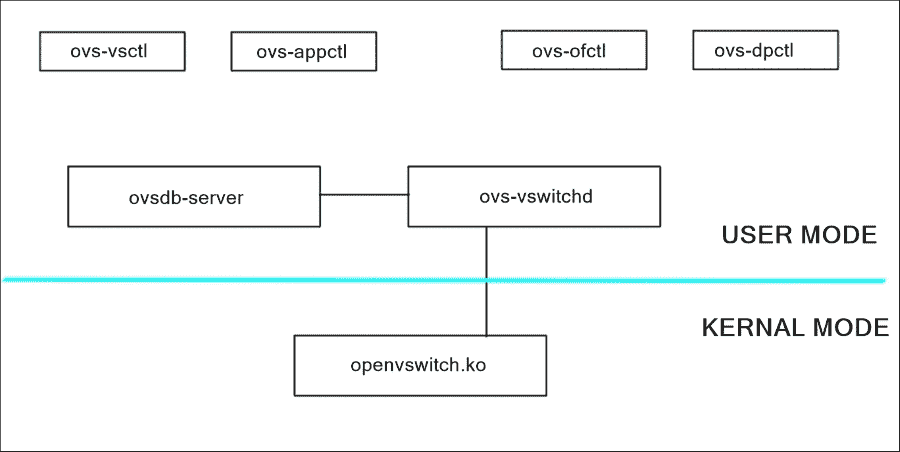

# 第七章：使用 OVS 创建虚拟租户网络和服务链

在上一章中，我们看到如何将不同的服务通过 CoreOS 集群中的链接相互连接。本章详细描述了如何使用 OVS 将不同客户/租户在 CoreOS 集群中部署的服务链接/连接起来。

本章涵盖以下主题：

+   OpenVSwitch/OVS 介绍

+   覆盖网络和基础网络介绍

+   虚拟租户网络简介

+   使用 OVS 的 Docker 网络

由于 OVS 是一个生产级别、广泛部署的软件交换机，具有广泛的功能集，我们将看看如何使用 OVS 提供服务链，这可以区分不同的客户服务。

# OVS 介绍

**OpenVSwitch**（**OVS**）是一个生产级别的开源虚拟交换机应用程序，可以在任何 Unix 类系统上运行。通常，OVS 用于虚拟化环境中，为在服务器内部运行的虚拟机/容器提供通信。OVS 充当一个软件交换机，在服务器内部的虚拟机之间提供二层连接。Linux Bridge 也可以用于提供虚拟机之间的通信。然而，OVS 提供了在典型的服务器虚拟化环境中所需的所有功能。以下图示展示了 OVS 如何提供服务器内虚拟机之间的连接：


在图示中，服务器中有三个虚拟机正在运行。每个虚拟机的虚拟网卡一端连接到**Open vSwitch**。在这里，**Open vSwitch**提供了服务器内所有虚拟机之间的连接。**Open vSwitch**还连接到物理网卡，以提供虚拟机与外部世界之间的通信。

OVS 通过使用**VLAN**和基于各种数据包头部的**流量过滤**，提供**安全性**，并通过提供**流量隔离**来确保网络安全。OVS 还提供了使用**sFlow**、**SPAN**、**RSPAN**等协议监控服务器内虚拟机之间交换的包的方法。OVS 还支持具有**流量排队和整形**的**QoS**（服务质量）以及**OpenFlow**支持。

## OVS 架构概述

本节描述了 OVS 及其组件的高层架构概述。



OVS 的主要组件如下：

+   `ovs-vsctl`：这是 OVS 提供的用于通过`ovsdb-server`配置和查询`ovs-vswitchd`守护进程的工具

+   `ovs-appctl`：这是用于管理 OVS 日志级别的工具

+   `ovs-ofctl`：这是 OVS 提供的用于管理交换机中 OpenFlow 条目的工具

+   `ovs-dpctl`：这是用于配置 OVS 数据路径的路径管理工具

+   `ovsdb-server`：这是存储 OVS 所有配置信息的数据库

+   `ovs-vswitchd`：这是 OVS 的交换模块，提供核心功能，如桥接、VLAN 隔离等。

+   `Openvswitch.ko`：这是处理流量快速切换和隧道传输的数据路径模块。

## 在 CoreOS 中使用 OVS 的优点

在 CoreOS 环境中，OVS 可以替代 docker0 桥接，并为不同 CoreOS 实例中的容器提供连接。docker0 桥接只能为同一 CoreOS 实例中运行的容器提供连接。然而，除了为同一 CoreOS 实例中的容器提供连接外，OVS 还可以为不同 CoreOS 实例中的容器提供连接。与上一章提到的其他技术相比，OVS 提供的关键优点如下：

+   顾名思义，OpenVSwitch/OVS 执行数据从一个容器到其他容器的层 2 桥接/交换。它执行典型的层 2 处理，如洪泛、学习、转发、基于 VLAN 标签的流量隔离、使用生成树协议提供无环拓扑等。

+   OVS 支持隧道协议，例如 GRE、VxLAN 等。这些隧道协议用于在层 3 网络上传输层 2 流量。这些隧道用于为运行在不同 CoreOS 实例中的容器提供连接。VxLAN 协议在 RFC 7348 中有详细定义，而 GRE 协议则在 RFC 2784 中有详细定义。这些隧道为在物理基础网络上构建覆盖网络提供了虚拟基础设施。

+   OVS 还支持 OpenFlow 协议，可以通过外部 SDN 控制器（如 OpenDayLight 控制器、RYU 控制器、ONOS 控制器等）进行编程。这意味着 CoreOS 集群可以通过典型的 SDN 部署中的集中式控制器轻松管理。

在详细了解 OVS 如何提供跨容器连接并实现服务链条之前，我们需要了解一些核心概念和特性，如覆盖网络、基础网络和虚拟租户网络。

# 覆盖网络和基础网络简介

下图表示 OVS 在虚拟机环境中提供的典型服务：


Server1 和 Server2 是两个物理服务器，客户应用程序部署在虚拟机（VM）内。每个服务器上有两个虚拟机，分别是 VM1 和 VM2。绿色虚拟机属于一个客户，橙色虚拟机属于另一个客户。每台服务器上都运行一个 OVS 实例。

在典型的虚拟化环境中，有两种类型的网络设备：软交换，它为虚拟化层提供连接；物理交换机，它为物理基础设施（如服务器、交换机和路由器）提供连接。

OVS 交换机为运行在服务器实例内的虚拟机/容器提供连接。这些服务器实例还通过物理方式相互连接，以便为所有服务器提供连接。

提供服务器连接的物理网络被称为底层网络。这个底层网络将拥有包括物理交换机和路由器在内的物理基础设施，提供服务器之间的连接。

现在，复杂性出现在如何为在服务器中运行的容器提供连接，以便与在不同服务器实例中运行的其他容器进行通信。解决这个问题有多种方法。一个主要且广泛部署的解决方案是使用 OVS 来提供覆盖网络。

正如这个术语所暗示的，覆盖网络是覆盖在另一个网络之上的网络。与物理底层网络不同，覆盖网络是虚拟网络，由虚拟链路组成，虚拟链路共享底层的物理网络（底层网络），允许容器/虚拟机的部署在不修改底层网络的情况下互相连接。这里的虚拟链路指的是提供 OVS 之间连接的隧道。OVS 支持多种隧道协议，常用的隧道包括 GRE 和 VxLAN。

覆盖网络的关键好处是：

+   由于它是一个逻辑网络，因此可以很容易地创建和销毁覆盖网络，而无需对底层网络进行任何更改。要在两个节点之间创建覆盖网络，只需在节点之间创建一个隧道，而要销毁覆盖网络，则需要取消配置隧道接口。

+   可以在节点之间创建多个覆盖网络。例如，可以根据在服务器实例中部署的客户数量创建多个覆盖网络。这为网络虚拟化提供了一种方式，类似于服务器虚拟化。让我们深入了解网络虚拟化的细节。

# 网络虚拟化简介

网络虚拟化是最近在网络行业中广泛讨论的话题之一。为了更好地理解网络虚拟化，可以想象服务器虚拟化，其中物理基础设施被逻辑上分隔成多个虚拟设备，每个虚拟设备分配给不同的容器以执行其工作负载。与服务器虚拟化类似，网络层也需要进行虚拟化，以便为不同的虚拟机/容器提供连接。

与服务器虚拟化类似，客户可以完全访问虚拟化的服务器基础设施，客户也可能希望虚拟化网络基础设施，以确保虚拟机或容器之间的数据流量安全。他们不希望其他人看到他们应用程序之间的数据交换，尤其是其他客户的虚拟机或容器。

网络虚拟化作为一个概念，在网络领域并不新鲜。现有网络通过 VLAN、VRF、L2VPN、L3VPN 等技术或概念实现网络虚拟化。这些网络虚拟化技术提供了一种机制，用于隔离一个客户与另一个客户的流量。VLAN 提供了一种基于 VLAN 标签逻辑隔离二层广播域的方法。

这些技术还定义了必要的协议支持，以便在不同客户之间实现重叠的地址空间。例如，使用 VRF 时，两个或更多客户可以在不同站点之间共享其 IP 地址。

然而，这些技术并没有在整个网络中提供真正的网络虚拟化。这些技术也有其自身的局限性。例如，1026 个 VLAN 限制了网络中租户的数量。对于 VPN 支持，可能需要像 MPLS 这样的协议，而 MPLS 通常在服务提供商网络中部署。

随着越来越多的运营商和云服务提供商部署**软件定义网络**（**SDN**）和**网络功能虚拟化**（**NFV**），有必要提供一种机制，以更好地提供网络虚拟化和流量隔离。

上一章中描述的覆盖网络可以提供一种有效的机制来隔离不同租户或客户之间的数据流量。由于可以在下层物理基础设施上布置多个覆盖网络（每个客户一个），我们应该能够提供不同客户流量之间所需的隔离。因此，覆盖网络基础设施提供了一种简便的方式来提供网络虚拟化。

要为客户或租户创建覆盖网络，我们需要在客户/租户的应用程序部署的所有节点之间创建一个隧道。OVS 有助于在不同的 OVS 实例之间创建隧道，从而支持创建 VTN 和下层网络。

回到之前的示意图，有两个客户，分别以绿色和橙色显示。两个客户的虚拟机都运行在 server1 和 server2 中。为了提供网络虚拟化并隔离这两个客户之间的流量，可以使用以下步骤：

+   在 OVS 中为每个客户创建两个桥接实例，分别为 Greenbr 和 Orangebr。

+   将虚拟机的虚拟网卡接口（veth）附加到相应的桥接实例。例如，绿色虚拟机的虚拟网卡应附加到 Greenbr，橙色虚拟机的虚拟网卡接口应附加到 Orangebr。

+   在 server1 和 server2 之间创建两个隧道，例如`Green_tun`和`Orange_tun`。这两个服务器实例可以位于同一网络中，也可以位于不同的网络中。如果它们位于不同的网络中，则应部署一个或多个路由器来提供这些服务器之间的物理连接。

    ### 提示

    为了在两个节点之间创建隧道，这两个节点之间应该具有 IP 可达性。IP 可达性由底层网络提供。

+   将这两个隧道附加到相应的桥接实例。

通过这些简单的步骤，可以为不同的客户创建虚拟网络。如下图所示：


## OVS 中的 OpenFlow 支持

使用 OVS 的主要优势之一是它支持 OpenFlow 协议并支持基于流的交换。**OpenFlow** 是由 ONF 定义的协议，用于通过标准接口集中管理网络基础设施，控制器（传统上称为控制平面）与实际的数据转发实体（传统上称为数据平面）之间的接口。使网络能够集中编程，能让整个系统更加灵活和敏捷。

OpenFlow 承诺简化大型数据中心和服务器集群的配置方式，这些数据中心和服务器集群可以通过 OpenFlow 控制器进行集中管理。随着大型数据中心和服务器集群的出现，传统的控制平面和数据平面范式的改变变得尤为必要，转向基于流的交换，这种方式更加通用，并且可以适应不同的领域。软件定义网络（SDN）是网络领域中的一种新范式。

OpenFlow 规范定义了基于 OpenFlow 的网络中的三个不同组件，如下所示。

### OpenFlow 交换机

一个 **OpenFlow 交换机** 由一个或多个流表、计量表、组表以及与外部控制器的 OpenFlow 通道组成。在包处理的查找或转发阶段，流表和组表用于将数据包转发到适当的端口，而计量表用于执行简单的 QoS 操作，如速率限制，以及更复杂的 QoS 操作，如 DiffServ 等。交换机与控制器通信，控制器通过 OpenFlow 协议使用 OpenFlow 消息管理交换机。

### OpenFlow 控制器

一个 **OpenFlow 控制器** 通常通过 OpenFlow 通道远程管理一个或多个 OpenFlow 交换机。类似地，单个交换机可以由多个控制器管理，以提高可靠性和负载均衡。OpenFlow 控制器的作用类似于传统交换机或路由器的控制平面。控制器负责使用 OpenFlow 协议消息编程各种表格，如流表、组表和计量表，以在系统中提供网络连接或网络功能。

### OpenFlow 通道

一个 **OpenFlow 通道** 用于在 OpenFlow 交换机和 OpenFlow 控制器之间交换 OpenFlow 消息。交换机必须能够通过启动与控制器的连接来创建 OpenFlow 通道：


使用 OVS，可以通过控制器以非常简单的配置集中管理整个 CoreOS 集群的覆盖网络。OVS 提供的 ofctl 实用工具有助于通过命令行参数编程流表，而无需由外部控制器进行控制。

# 在 CoreOS 中运行 OVS

在 CoreOS 环境中，有两种方法可以运行或安装 OVS：

+   构建带有 OVS 的 CoreOS 镜像

+   使用`–net=host`选项在 Docker 容器中运行 OVS

正如我们在第一章中已经看到的那样，*CoreOS，另一个 Linux 发行版*，在 CoreOS 中没有安装应用程序的方法。任何服务/应用程序都应部署在容器中。因此，运行 OVS 的简单方法是将 OVS 运行在 Docker 容器内。让我们看看如何在 CoreOS 中安装 OVS Docker。

已经有一个带有 OVS 的 docker 镜像（coreos-ovs）。可以从[`github.com/theojulienne/coreos-ovs`](https://github.com/theojulienne/coreos-ovs)的 GitHub 链接下载此 docker 镜像。使用以下`cloud-config`启动此容器：

```
#cloud-config

coreos:
 units:
 - name: docker.service
 command: start
 drop-ins:
 - name: 50-custom-bridge.conf
 content: |
 [Service]
 Environment='DOCKER_OPTS=--bip="10.0.11.0/8" --fixed-cidr="10.0.11.0/24"'
 - name: OVS.service
 command: start
 content: |
 [Unit]
 Description=Open vSwitch Bridge
 After=docker.service
 Requires=docker.service

 [Service]
 Restart=always
 ExecStartPre=/sbin/modprobe openvswitch
 ExecStartPre=/sbin/modprobe af_key
 ExecStartPre=-/usr/bin/docker run --name=openvswitch-cfg -v /opt/ovs/etc busybox true
 ExecStartPre=-/usr/bin/docker rm -f openvswitch
 ExecStartPre=/usr/bin/docker run -d --net=host --privileged --name=openvswitch --volumes-from=openvswitch-cfg theojulienne/coreos-ovs:latest
 ExecStart=/usr/bin/docker attach openvswitch
 ExecStartPost=/usr/bin/docker exec openvswitch /scripts/docker-attach

```

这将启动一个安装了 OVS 的 Docker 容器。同时，它会移除 docker0 桥接器的 IP 地址并将其分配给 OVS 桥接器（bridge0）。docker0 桥接器将作为链接连接到 bridge0。

由于我们使用了`–net=host`选项，我们在容器内执行的任何 OVS 命令都将导致修改主机操作系统的网络配置，即 CoreOS 网络堆栈。

本节详细描述了如何在两个不同的 CoreOS 实例中运行的 docker 容器之间提供虚拟租户网络。提供此解决方案有多种方法。我们将介绍提供此解决方案的两种最常见且简单的方法：

+   将 docker0 桥接器连接到 OVS

+   将容器的 veth 接口连接到 OVS

## 将 docker0 桥接器连接到 OVS

这是一种通过 OVS 提供不同容器之间连接的简单方法。在这种情况下，OVS 应通过 veth 接口连接到 docker0 桥接器（该桥接器已连接到所有容器）。有关 docker0 桥接器的更多详细信息以及它如何为系统中的容器提供连接，请参见前一章节。

Docker 桥接器通过内部连接到 OVS 桥接器。OVS 桥接器通过 GRE/VxLAN 隧道提供与其他 CoreOS 实例的连接。


以下详细描述了带有配置的逐步过程。此过程包含在两个 CoreOS 实例上的以下主要步骤：

+   在集群中实例化 CoreOS 节点期间的配置

+   在创建容器期间的配置

### CoreOS 实例 1 中的配置

本节详细描述了在 CoreOS 节点 1 的 coreos-ovs Docker 上执行的操作，以提供此解决方案。

#### 在集群中实例化 CoreOS 节点 1 时的配置

在 CoreOS 服务器启动时，必须启动 OVS，启动 OVS 的过程如下。请注意，执行 OVS 命令的方式取决于 OVS 是部署在 docker 容器内还是 CoreOS 主机实例中。不过在这两种情况下，使用的 OVS 命令列表是相同的：

1.  使用以下命令运行 OVS 数据路径模块：

    ```
    sudo modprobe openvswitch

    ```

1.  使用以下命令，使用默认的 schema 文件创建一个配置`db`：

    ```
    sudo ovsdb-tool create /var/lib/openvswitch/conf.db /usr/share/openvswitch/vswitch.ovsschema

    ```

1.  使用以下命令运行 OVS DB 服务器：

    ```
    sudo ovsdb-server /var/lib/openvswitch/conf.db --remote=punix:/var/run/openvswitch/db.sock --pidfile --detach --log-file

    ```

1.  使用以下命令运行 OVS-VSCTL：

    ```
    sudo ovs-vsctl --no-wait init

    ```

1.  使用以下命令运行 OVS switchd 守护进程：

    ```
    sudo ovs-vswitchd --pidfile --detach

    ```

1.  创建桥接实例：

    ```
    sudo ovs-vsctl add-br br0

    ```

1.  使用远程节点`172.17.8.103`创建 GRE 隧道。这里假设 CoreOS 实例 2 的 etho IP 是`172.17.8.103`：

    ```
    sudo ovs-vsctl add-port br0 gre1 -- set Interface gre1 type=gre options:remote_ip=172.17.8.103 options:key=100

    ```

    ### 提示

    每个隧道的密钥需要不同。

1.  创建 veth 接口以提供 docker0 桥接和 OVS 之间的连接：

    +   创建 veth 对：

        ```
         ip link add tap1 type veth peer name tap2

        ```

    +   将 veth 对的一端附加到 docker0 桥接：

        ```
         sudo brctl addif docker0 tap1

        ```

    +   将 veth 对的另一端附加到 OVS：

        ```
         sudo ovs-vsctl add-port br0 tap2

        ```

#### 在为 CoreOS 实例 1 创建容器时的配置

本节描述在 CoreOS 实例中创建新容器时需要进行的配置。

### 提示

默认情况下，容器的 eth0（veth 对的一端）接口附加在 docker0 桥接上，因此我们不需要显式地将容器的 veth 接口附加到 docker0 桥接上。

设置 docker 容器 eth0 接口的 IP 地址。无法在 docker 实例内部设置 docker 容器的 IP 地址。我们需要使用`nsenter`工具来完成此操作。请按照以下步骤进行操作：

1.  执行以下命令并获取`pid`：

    ```
    docker inspect --format {{.State.Pid}} <container_name_or_ID>

    ```

1.  执行以下命令并获取`pid`：

    ```
    sudo nsenter --target $PID --mount --uts --ipc --net --pid ifconfig eth0 50.0.0.1

    ```

### CoreOS 实例 2 中的配置

本节详细描述在 CoreOS 节点 2 的 coreos-ovs Docker 上执行的操作，以提供此解决方案。

#### 在集群中实例化 CoreOS 节点 2 时的配置

本节描述在 CoreOS 实例初始化过程中需要执行的操作列表。在初始化过程中，必须启动 OVS，启动 OVS 的过程如下：

+   使用以下命令运行 OVS 数据路径模块：

    ```
    sudo modprobe openvswitch

    ```

+   使用以下命令，使用默认的 schema 文件创建一个配置`db`：

    ```
    sudo ovsdb-tool create /var/lib/openvswitch/conf.db /usr/share/openvswitch/vswitch.ovsschema

    ```

+   使用以下命令运行 OVS DB 服务器：

    ```
    sudo ovsdb-server /var/lib/openvswitch/conf.db --remote=punix:/var/run/openvswitch/db.sock --pidfile --detach --log-file

    ```

+   使用以下命令运行 OVS-VSCTL：

    ```
    sudo ovs-vsctl --no-wait init

    ```

+   使用以下命令运行 OVS switchd 守护进程：

    ```
    sudo ovs-vswitchd --pidfile --detach

    ```

+   创建桥接实例：

    ```
    sudo ovs-vsctl add-br br0

    ```

+   使用远程节点`172.17.8.101`创建 GRE 隧道。这里假设 CoreOS 实例 1 的 etho IP 是`172.17.8.101`：

    ```
    sudo ovs-vsctl add-port br0 gre1 -- set Interface gre1 type=gre options:remote_ip=172.17.8.101 options:key=100

    ```

    ### 提示

    每个隧道的密钥需要不同。

+   现在，我们需要创建一个 veth 接口来提供 docker0 桥接和 OVS 之间的连接：

    +   创建 veth 对：

        ```
         ip link add tap1 type veth peer name tap2

        ```

    +   将 veth 对的一端附加到 docker0 桥接：

        ```
         sudo brctl addif docker0 tap1

        ```

    +   将 veth 对的另一端附加到 OVS：

        ```
         sudo ovs-vsctl add-port br0 tap2

        ```

#### CoreOS 实例 2 中创建容器时的配置

本节描述了在 CoreOS 实例中创建新容器时需要进行的配置。

设置 Docker 容器的 eth0 接口的 IP 地址。无法在 Docker 实例内部设置 Docker 容器的 IP 地址。我们需要使用 `nsenter` 工具来实现。按照以下步骤操作：

1.  执行以下命令并获取 `pid`：

    ```
    docker inspect --format {{.State.Pid}} <container_name_or_ID>

    ```

1.  执行以下命令并获取 `pid`：

    ```
    sudo nsenter --target $PID --mount --uts --ipc --net --pid ifconfig eth0 50.0.0.2

    ```

现在你应该能够从在 CoreOS 实例 1 中运行的 Docker 容器 ping 到在 CoreOS 实例 2 中运行的 Docker 容器。这个解决方案的主要缺点是无法为租户提供虚拟网络。这是因为所有 Docker 容器都连接到 docker0 网桥，而该网桥又连接到 OVS。OVS 作为不同服务器实例之间提供通信的方式。

## 将容器的 veth 接口连接到 OVS

在这种情况下，CoreOS 实例中的所有 Docker 容器都直接连接到 OVS 网桥。OVS 内部将运行多个网桥实例，每个实例映射到不同的客户/租户。每个租户在系统中需要创建并配置一个新的网桥。在后续创建容器时（对于相同租户），容器的接口应连接到相应的网桥实例。OVS 网桥通过 GRE/VxLAN 隧道为其他 CoreOS 实例提供连接。


配置这种解决方案的逐步程序如下所述，主要包括以下步骤，这些步骤需要在两个 CoreOS 实例上执行：

+   在集群中实例化 CoreOS 节点时的配置

+   为租户创建第一个容器时的配置

+   为租户创建后续容器时的配置

### CoreOS 实例 1 中的配置

本节详细描述了在 CoreOS 节点 1 的 coreos-ovs Docker 中执行的操作，以提供该解决方案。

#### 在集群中实例化 CoreOS 节点时的配置

在初始化期间，OVS 需要启动，启动 OVS 的程序如下。请注意，OVS 命令的执行方式取决于 OVS 是部署在 Docker 容器内还是 CoreOS 主机实例中。然而，在这两种情况下，所需使用的 OVS 命令列表没有变化。

1.  使用以下命令运行 OVS 数据路径模块：

    ```
    sudo modprobe openvswitch

    ```

1.  使用以下命令，使用默认模式文件创建配置 `db`：

    ```
    sudo ovsdb-tool create /var/lib/openvswitch/conf.db /usr/share/openvswitch/vswitch.ovsschema

    ```

1.  使用以下命令运行 OVS DB 服务器：

    ```
    sudo ovsdb-server /var/lib/openvswitch/conf.db --remote=punix:/var/run/openvswitch/db.sock --pidfile --detach --log-file

    ```

1.  使用以下命令运行 OVS-VSCTL：

    ```
    sudo ovs-vsctl --no-wait init

    ```

1.  使用以下命令运行 OVS switchd 守护进程：

    ```
    sudo ovs-vswitchd --pidfile --detach

    ```

#### 为租户创建第一个容器时的配置

当为租户首次创建容器时，需要创建一个新的桥接，并将此容器连接到 OVS。具体的操作流程如下：

1.  将 docker0 桥接实例关闭（docker 创建的默认桥接）：

    ```
    sudo ip link set dev docker0 down

    ```

1.  将为容器创建的虚拟接口从 docker0 桥接中分离。该虚拟接口的名称以 veth 开头：

    ```
    sudo brctl delif docker0 vethda0657c

    ```

1.  为租户创建一个桥接实例：

    ```
    sudo ovs-vsctl add-br br0

    ```

1.  在 Docker 中添加已创建的端口。此接口以 veth 开头：

    ```
    sudo ovs-vsctl add-port br0 vethda0657c

    ```

1.  设置 Docker 容器的 eth0 接口的 IP 地址。不能在 Docker 实例内设置 Docker 容器的 IP 地址。我们需要使用 `nsenter` 工具来实现。按照以下步骤操作：

    +   执行以下命令并获取 `pid`：

        ```
        docker inspect --format {{.State.Pid}} <container_name_or_ID>

        ```

    +   执行以下命令并获取 `pid`：

        ```
        sudo nsenter --target $PID --mount --uts --ipc --net --pid ifconfig eth0 50.0.0.1

        ```

1.  创建一个 GRE 隧道，远程节点 IP 为 `172.17.8.103`。此处假设 CoreOS 实例 2 的 eth0 IP 为 `172.17.8.103`

    ```
    sudo ovs-vsctl add-port br0 gre1 -- set Interface gre1 type=gre options:remote_ip=172.17.8.103 options:key=100

    ```

    ### 提示

    每个隧道的密钥需要不同。

#### 在为租户创建后续容器时的配置

本节描述了在 CoreOS 实例中创建后续容器时需要进行的配置。

1.  在 Docker 中添加已创建的端口。此接口以 veth 开头：

    ```
    sudo ovs-vsctl add-port br0 veth640b626

    ```

1.  创建一个 GRE 隧道，远程节点 IP 为 `172.17.8.103`：

    ```
    sudo ovs-vsctl add-port br0 gre1 -- set Interface gre1 type=gre options:remote_ip=172.17.8.103 options:key=100

    ```

### CoreOS 实例 2 中的配置

本节详细描述了在 CoreOS 节点 2 的 coreos-ovs Docker 中执行的操作，以提供此解决方案。

#### 在集群中实例化 CoreOS 节点时的配置

本节描述了在初始化 CoreOS 实例时需要执行的操作列表。在初始化过程中，需要启动 OVS，启动 OVS 的步骤如下：

1.  使用以下命令运行 OVS 数据路径模块：

    ```
    sudo modprobe openvswitch

    ```

1.  使用默认模式文件通过以下命令创建配置 `db`：

    ```
    sudo ovsdb-tool create /var/lib/openvswitch/conf.db /usr/share/openvswitch/vswitch.ovsschema

    ```

1.  使用以下命令运行 OVS DB 服务器：

    ```
    sudo ovsdb-server /var/lib/openvswitch/conf.db --remote=punix:/var/run/openvswitch/db.sock --pidfile --detach --log-file

    ```

1.  使用以下命令运行 OVS-VSCTL：

    ```
    sudo ovs-vsctl --no-wait init

    ```

1.  使用以下命令运行 OVS switchd 守护进程：

    ```
    sudo ovs-vswitchd --pidfile --detach

    ```

1.  创建一个桥接实例：

    ```
    sudo ovs-vsctl add-br br0

    ```

1.  创建一个 GRE 隧道，远程节点 IP 为 `172.17.8.101`。此处假设 CoreOS 实例 1 的 eth0 IP 为 `172.17.8.101`：

    ```
    sudo ovs-vsctl add-port br0 gre1 -- set Interface gre1 type=gre options:remote_ip=172.17.8.101 options:key=100

    ```

    ### 提示

    每个隧道的密钥需要不同。

#### 在为租户创建第一个容器时的配置

当为租户首次创建容器时，需要创建一个新的桥接，并将此容器连接到 OVS。具体的操作流程如下：

1.  将 docker0 桥接实例关闭（docker 创建的默认桥接）：

    ```
    sudo ip link set dev docker0 down

    ```

1.  将为容器创建的虚拟接口从 docker0 桥接中分离。该虚拟接口的名称以 veth 开头：

    ```
    sudo brctl delif docker0 vethda0657c

    ```

1.  为租户创建一个桥接实例：

    ```
    sudo ovs-vsctl add-br br0

    ```

1.  在 Docker 中添加已创建的端口。此接口以 veth 开头：

    ```
    sudo ovs-vsctl add-port br0 vethda0657c

    ```

1.  设置 Docker 容器 eth0 接口的 IP 地址。无法在 Docker 实例内设置 Docker 容器的 IP 地址。我们需要使用 `nsenter` 工具来完成此操作。请按照以下步骤操作：

    +   执行以下命令并获取`pid`：

        ```
        docker inspect --format {{.State.Pid}} <container_name_or_ID>

        ```

    +   执行以下命令并获取`pid`：

        ```
        sudo nsenter --target $PID --mount --uts --ipc --net --pid ifconfig eth0 50.0.0.1

        ```

1.  创建一个 GRE 隧道，远程节点为`172.17.8.103`。这里假设 CoreOS 实例 2 的 eth0 IP 为`172.17.8.103`：

    ```
    sudo ovs-vsctl add-port br0 gre1 -- set Interface gre1 type=gre options:remote_ip=172.17.8.103 options:key=100

    ```

    ### 提示

    每个隧道的密钥需要不同。

#### 为租户创建后续容器时的配置

本节描述了在 CoreOS 实例中创建后续容器时需要进行的配置。

1.  添加在 Docker 中创建的端口。此接口以 veth 开头：

    ```
    sudo ovs-vsctl add-port br0 veth640b626

    ```

1.  创建一个 GRE 隧道，远程节点为`172.17.8.103`：

    ```
    sudo ovs-vsctl add-port br0 gre1 -- set Interface gre1 type=gre options:remote_ip=172.17.8.103 options:key=100

    ```

现在，您应该能够从在 CoreOS 实例 1 中运行的 Docker 容器 ping 到在 CoreOS 实例 2 中运行的 Docker 容器。这个解决方案的主要优点是，使用此方案可以提供虚拟租户网络。

### 循环问题

到目前为止，一切正常。然而，当集群中运行的 CoreOS 实例数量增加时，我们可能需要为每个客户/租户在 CoreOS 实例之间创建隧道网格。这将导致网络中出现环路，从而导致流量黑洞。让我们详细了解这个问题并讨论解决方案。

考虑一种拓扑结构，其中在 CoreOS 集群中运行着三个 CoreOS 实例。在这些实例中，绿色和橙色客户的应用程序作为容器进行部署。为了为每个客户提供 VTN，我们需要在这些 CoreOS 实例之间创建隧道。在这种情况下，我们需要为每个客户从每个 CoreOS 实例创建两个隧道。从 CoreOS 实例 1 开始，我们需要为每个客户创建两个隧道：一个指向 CoreOS 实例 2，另一个指向 CoreOS 实例 3。同样，从 CoreOS 实例 2 开始，我们需要创建两个隧道，依此类推。这将导致在客户的桥接实例中形成一个层 2 环路。

### 提示

在拓扑中创建完整网格所需的隧道总数为 2n-1，其中 n 是租户服务作为容器部署的 CoreOS 实例数量。

由于桥接实例是一个层 2 设备，这将导致在环路中多次转发相同的数据包：


避免这个循环问题的一个简单方法是通过在 OVS 中运行**生成树协议**（**STP**）。STP 已被定义并标准化为 IEEE 802.1D。STP 会根据不同的度量标准，识别出无环拓扑结构。一旦它识别出无环拓扑，它将阻塞一个或多个不属于无环拓扑的端口（在这种情况下，是隧道）。处于阻塞状态的端口将不会转发流量，从而避免了流量黑洞。

在上述拓扑中，当我们根据优先级或配置的桥接 ID 运行生成树时，STP 会阻止一个端口，在本例中阻止从 CoreOS 3 到 CoreOS 2 的端口：


启用和配置 OVS 中生成树的命令列表如下：

+   在桥接实例上启用生成树：

    ```
    ovs-vsctl set Bridge br0 stp_enable=true

    ```

+   设置桥接优先级：

    ```
    ovs-vsctl set Bridge br0 other_config:stp-priority=0x7800

    ```

+   设置端口的路径成本：

    ```
    ovs-vsctl set Port eth0 other_config:stp-path-cost=10

    ```

### 提示

桥接优先级和路径成本配置不是强制性配置。

需要在 OVS 的所有桥接实例上启用生成树，以避免网络中出现任何环路。

# 总结

在本章中，我们已经了解了 OVS 在容器通信中的重要性以及 OVS 提供的各种优势。由于容器通信有多种通信机制可供选择，在部署 CoreOS 集群时，基于优势、易用性和网络管理工具，您应该在部署中谨慎选择一种或多种通信机制。在下一章，我们将看到 CoreOS 的一些最新发展以及安全性、编排、容器数据卷管理等高级主题。
