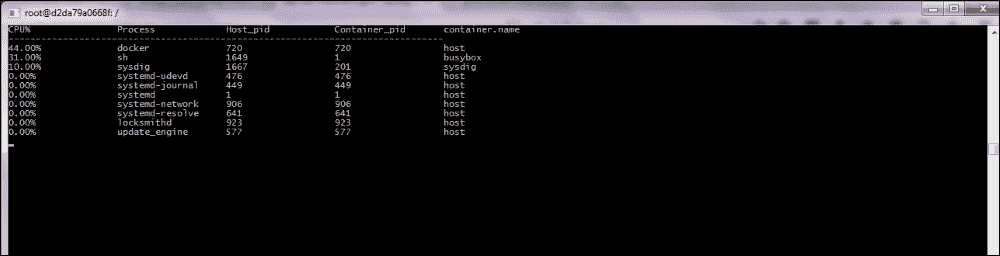

# 第八章. 接下来做什么？

在本章中，我们将讨论一些高级的 Docker 和 Core OS 话题，并且我们还将讨论 CoreOS 的未来发展。在大多数话题中，我们不会详细介绍如何使用或部署本章中提到的每个功能，而是会提供足够的信息，让你了解即将到来的新特性。

本章涵盖以下主题：

+   容器安全性

+   使用 CoreUpgrade 进行轻松升级

+   使用 Dex 进行用户身份验证

+   Sysdig

+   其他容器编排机制，如 Kubernetes、Apache Mesos 和 Swarm

+   Docker 数据卷管理

+   开放容器项目

# 容器安全性

安全性是任何部署中的重要方面。应用程序、设备和网络应该具备安全性，以防止任何未经授权的访问。容器/docker 的部署也应该具备安全性，以防止未经授权的访问系统资源，尤其是那些为容器保留的资源。我们将了解 Docker 容器如何确保网络和资源隔离以及安全性。

Docker 使用命名空间将容器与主机上运行的其他容器隔离开来。参与提供安全性的有三个重要的命名空间：

+   **进程命名空间**：每个 Linux 系统都有一个进程树，也就是说，有一个进程 ID 为 1 的 init 进程，它也被称为根进程。这个根进程会生成其他的守护进程和子进程。这些守护进程和进程也可以创建它们自己的子进程，如此类推。可以创建一个子命名空间，并将其中一个进程作为根进程。运行在子命名空间中的所有进程无法了解父命名空间的情况；因此，它们不能对父命名空间之外的进程执行任何操作（如信号操作）。

+   **网络命名空间**：每个容器都有自己的网络接口，与主机接口不同。它们也有自己的环回接口。容器与外部世界通信的唯一方式是通过主机的桥接网络。桥接网络使得同一主机中运行的不同命名空间之间可以通信，或者与另一主机中的地址进行通信。这样可以确保网络栈对容器来说是独占的，从而使其运行自己的 IP、TCP、UDP 栈等。Docker 通过允许与另一个 Docker 进行通信（通过暴露端口或显式地创建与另一个容器的链接）来增加一层额外的安全性。

+   **资源命名空间**：这确保了每个容器拥有其专用的资源，仅供自己使用。资源可以是专用的 RAM、处理器或带有自己文件系统的磁盘。这样可以确保容器的使用不会超出设定的限制，从而确保它不会侵占分配给另一个容器的资源。

下图展示了 Docker 容器提供的隔离性。正如我们所见，容器内运行的服务拥有自己的根进程、文件系统和接口，这些是操作系统通常会提供的功能。这些功能几乎存在于 Docker 用于提供隔离的所有 Linux 发行版中。


隔离之后，让我们讨论一下安全性。Docker 以非特权模式启动容器。这意味着容器或容器内运行的应用程序仅拥有执行不需要根权限的操作的权限。例如，使用小于 1024 的端口（尽管非特权 Docker 可以使用 1024 以下和以上的端口）、修改 `/etc` 中的文件、挂载文件系统等。这样可以确保即使容器中的服务被攻击，它们也无法对主机造成损害，影响也仅限于该容器实例。允许的权限可以进行配置，可以根据容器的环境（受信任或不受信任）来设定严格或宽松的限制。

Docker 还建议保护对 Docker 守护进程的访问，因为它作为根用户在主机上运行。此外，Docker 还建议启用安全的 HTTP 连接，以便在需要远程管理容器时使用。此外，Linux 内核中内建的防火墙，如 `SELinux`，可以进一步限制 Docker，只允许使用特定的端口和协议（仅 TCP、仅 UDP 等）。同时，建议使用其他 Linux 安全工具和实用程序来保护和强化系统。

# 更新和补丁 – CoreUpdate

`CoreUpdate` 是 `Premium Managed Service` 的一部分，面向需要支持和基于 SLA 的支持的企业客户，以防在部署过程中遇到问题。`CoreUpdate` 帮助监控集群健康、集群软件版本、管理更新和补丁部署。

`CoreUpdate` 提供了一个 Web 界面和命令行界面，用于查看每个 `CoreOS` 实例上运行的版本，并对它们进行升级计划。所有的 `CoreOS` 实例可以逻辑地分配到多个应用程序组中，升级可以单独管理。比如，它们可以配置为从不同的通道（如稳定版、测试版、开发版）获取升级/补丁。可以在不同的时间安排升级，并且可以有不同的元数据，例如，选择从哪个源获取升级/补丁包。在升级过程中，会显示升级进度，任何错误/信息/警告都会显示出来，以便采取纠正措施。

`CoreUpdate` 还提供了一个基于 HTTP 的 API，用于将软件管理与开发的应用程序集成。

# Dex

我们每个人都曾经历过多种用户认证方式，比如在登录网站时、登录计算机时、登录社交网站时等等。有很多种认证系统，例如由系统管理员为 Linux 或 Microsoft Windows 管理的本地用户，企业范围的 Active Directory 或 LDAP，或者通过身份提供者如 Google、Outlook、Yahoo! 和 Facebook 等进行认证。

作为应用程序开发人员，**Dex** ([`github.com/coreos/dex`](https://github.com/coreos/dex)) 通过提供基于标准的现成实现和适用于各种认证系统（包括本地认证）的连接器，解决了用户认证问题。这使得开发人员可以更加专注于业务逻辑，并且信任认证已经得到妥善处理。

由于 Dex 实现基于标准的 (**OpenID Connect (OIDC) 核心规范**)，它是与语言无关的，因为接口已被很好地定义。只需使用符合 OIDC 的客户端库（对应编程语言），就可以开始使用。

有多种认证机制可以通过集成现成的连接器来使用。如果我们要类比的话，这就像是数据库连接器。目前，已有本地连接器和 OIDC 连接器，更多的连接器正在开发中。使用本地连接器时，用户可以通过 Dex 本地维护的认证数据库登录系统，如 Linux 用户 ID 和密码。使用 OIDC 连接器时，用户可以通过其他 OIDC 身份提供者（如 Google 或另一个 `Dex` 实例）进行认证，因为 Dex 本身就是一个 OIDC 身份提供者。

因此，如果你的系统需要认证，探索 Dex 可能会有帮助。

# sysdig

我们都熟悉用于 Linux 的常见调试工具，这些工具可以用来监控和拍摄系统健康状态的快照。例如，如果我们想检查机器是否超负荷使用 CPU 或 RAM，我们会使用 `top` 或 `vmstat` 等工具。如果我们需要捕获接口上的数据包，我们会使用 `wireshark` 或 `tcpdump`。类似地，我们会使用 `iostat` 来监控系统的 IO 设备。

`sysdig`为监控上述所有系统资源提供了集成支持，同时还提供了更多功能。最重要的是，在我们的上下文中，它为容器提供了支持。我们知道，容器在宿主操作系统中运行在不同的命名空间中。因此，运行在容器内的进程对于本机工具（例如`ps`）也是可见的。在容器环境中，应用程序相关的信息存在两个层级：一个是宿主内核层级，例如，宿主内核看到的进程 ID；另一个是容器级别，例如容器内的进程 ID。所有本机 Linux 工具提供的是宿主内核视图，用户需要关联信息以找出哪些信息与容器相关，并按容器划分信息。为了获取容器应用程序视角下的信息，需要使用 Docker 接口/命令。`sysdig`解决了这个问题。

让我们通过实践来感受一下`sysdig`提供的信息。

第一步是安装并运行`sysdig`。当我们启动用于 sysdig 的 docker 容器时，会进入一个 shell 环境，在这里可以运行`sysdig`命令。

```
Vagrant ssh core-01
docker pull sysdig/sysdig
docker run -i -t --name sysdig --privileged -v /var/run/docker.sock:/host/var/run/docker.sock -v /dev:/host/dev -v /proc:/host/proc:ro -v /boot:/host/boot:ro -v /lib/modules:/host/lib/modules:ro -v /usr:/host/usr:ro sysdig/sysdig

```

使用以下命令以守护进程方式启动 Docker 容器：

```
/usr/bin/docker run –d --name busybox busybox /bin/sh -c "while true; do echo Hello World; sleep 60; done"

```

我们将运行一些示例命令来查找容器的特定信息。首先，我们将在另一个登录窗口使用`docker ps`以及使用`sysdig`列出机器上运行的容器：

```
docker ps
CONTAINER ID        IMAGE               COMMAND                  CREATED             STATUS              PORTS               NAMES
f71277abf37c        busybox             "/bin/sh -c 'while tr"   4 seconds ago       Up 3 seconds                            busybox
d21a39a0668f        sysdig/sysdig       "/docker-entrypoint.s"   5 minutes ago       Up 5 minutes                            sysdig
```

我们在这里看到，宿主机上运行了两个容器：一个是`sysdig`容器，另一个是我们启动的`busybox`容器。现在，我们将运行相应的`sysdig`命令：

```
sysdig -c lscontainers
container.type container.image container.name      container.id
-------------- --------------- ------------------- ------------
docker         busybox         busybox             f74777abf37c
docker         sysdig/sysdig   sysdig              d2da79a0668f
```

以下命令显示容器的累积 CPU 使用情况：

```
sysdig -c topcontainers_cpu

```

我们得到的输出如下：


类似地，我们可以通过以下命令查看进程列表、其对应的容器和进程 ID（主机看到的和容器在全局级别看到的）。请注意，`-pc`标志表示所需的信息是容器上下文中的信息。相同的命令也可以通过提供容器名称来扩展，信息仅显示该容器的内容。

```
sysdig -pc -c topconns

```

我们得到的输出如下：



到现在为止，您应该已经对`sysdig`的实用性有了一个大致的了解。与进程和 CPU 信息类似，它还可以提供其他许多功能，比如监控网络、网络 IO、磁盘使用、追踪流量等。并且，大部分监控也可以通过添加`-pc`开关在容器上下文中进行。

# 竞争性的容器编排机制

在本节中，我们将探讨当前市场上其他可用的容器编排机制。其中一些编排机制实际上可以与 CoreOS 编排机制互补。正如我们在第三章中已经看到的，*创建你的 CoreOS 集群并管理集群*，fleet 在 CoreOS 中充当集群管理器，并在集群中的任一节点上实例化 docker 单元/服务。让我们在本章中详细讨论其他编排机制。目前可用的一些主要容器编排机制如下：

+   Kubernetes

+   Apache Mesos

+   Swarm

## Kubernetes

**Kubernetes** 是由 Google 开发的开源容器编排基础设施，用于在服务器集群中部署容器或一组容器。Kubernetes 提供了一种将一组容器作为一个逻辑服务进行部署的方式。这个容器组被称为 **pod**。除了提供应用程序或容器部署的机制外，Kubernetes 还提供了调度、更新、维护和扩展集群中容器的方式。

Kubernetes 操作的是 pod 而不是容器。一个 pod 可以包含一个容器或一组逻辑上相互关联的容器，如前所述。Kubernetes 由以下组件组成：

+   Kubernetes 主节点

+   Kubernetes 节点（Minion）

+   Kubernetes Pods

+   Kubernetes 服务

下图展示了 Kubernetes 的组件：


Kubernetes 组件概述

### Kubernetes 主节点

顾名思义，**Kubernetes 主节点**是控制集群中其他节点和 pod 的主节点。它是控制平面，并提供以下服务：

+   Pods 在服务器中的部署

+   各种 Pods 的复制控制

+   维护容器的状态

+   提供用于从外部世界控制节点、Pods 等的 REST API

主 Kubernetes 运行 apiserver、controller manager，并可选地运行 kubelet 和代理服务器。

### Kubernetes 节点

**Kubernetes 节点**也称为 Minion。用户应用程序作为容器或 docker 容器部署在 Minion 中。Kubernetes 节点托管着 Kubernetes 的重要服务，如 kubelet 和 kube-proxy。

Kubelet 负责在节点级别管理 Pods。它充当主要的节点代理。

kube-proxy 或 Kubernetes 网络代理是一个应用程序，负责管理 Kubernetes 节点中的服务。它还负责为在节点中运行的应用程序提供虚拟 IP。

### Kubernetes Pods

**Kubernetes Pods** 是一组在逻辑上紧密耦合并运行在同一 Kubernetes 节点内的容器。属于同一 Pod 的容器共享存储、网络等资源。以下是一个 Pod 的表示：

```
apiVersion: v1
kind: Pod
metadata:
  name: backend-app
  labels:
    app: backend-app
    version: v1
    role=backend
spec:
  containers:
  - name: javaapp
    image: kingston/javaapp
    ports:
    - containerPort: 443
    volumeMounts:
    - mountPath: /volumes/logs
      name: logs
  - name: logapp
    image: kingston/logapp:v1.1.3
    ports:
    - containerPort: 9999
    volumeMounts:
    - mountPath: /logs
      name: logs
  - name: monitor
    image: kingston/monitor:v1.5.6
    ports:
    - containerPort: 1234
```

### Kubernetes 服务

**Kubernetes 服务** 是在集群内运行的一组 Pods。服务提供了集群中任何类型的 Pods 所需的关键功能，如负载均衡、应用服务发现、便捷部署等。服务的描述以 JSON 格式表示如下：

```
{
    "kind": "Service",
    "apiVersion": "v1",
    "metadata": {
        "name": "Web Frontend Service"
    },
    "spec": {
        "selector": {
            "app": "webapp",
            "role": "frontend"
        },
        "ports": [
            {
                "name": "http"
                "protocol": "TCP",
                "port": 80,
                "targetPort": 80
            }
        ]
    }
}
```

现在，我们已经了解了 Kubernetes 的基础知识。接下来，让我们看看 Kubernetes 如何作为 CoreOS docker/Rackt 容器的编排框架使用。

## CoreOS 和 Kubernetes

Kubernetes 也可以用于通过 etcd 分布式键值存储在 CoreOS 中提供高级集群级编排。由于 Kubernetes 是一个强大的容器编排工具，提供了典型部署所需的基本功能，如自动负载均衡、服务发现和容器复制，因此在 CoreOS 环境中，Kubernetes 可以作为容器编排框架使用。

CoreOS 集群中的一个节点可以作为 Kubernetes 主节点，在其中运行 apiserver 和 controller manager。CoreOS 集群中的所有其他节点可以作为 minion，在其中安装并运行 kubelet 和 kube-proxy。

Kubernetes 也可以通过 etcd 分布式键值存储，在 CoreOS 中提供高级集群级编排。

# Apache-Mesos

**Apache-Mesos** 是为涉及数千个主机的大型集群开发的容器集群管理器。Mesos 提供一个分布式内核，跨集群中的不同节点运行，并提供 API 供应用程序管理资源，如内存、CPU、磁盘等，并调度这些资源。

Mesos 的主要组件如下：

+   Mesos 代理

+   Mesos 主节点

+   ZooKeeper

+   Mesos 框架

    Mesos 组件概述

## Mesos 主节点

**Mesos 主节点** 守护进程运行在主节点上，管理所有的从节点或代理以及 Mesos 框架。主节点根据配置的调度策略（可以是严格优先或公平共享）来处理资源分配给各个框架。

## Mesos 代理

**Mesos 代理** 负责运行实际的任务。代理会向主节点报告资源的可用性，主节点利用这些信息将特定任务或框架分配给代理运行。

## ZooKeeper

在典型的 Mesos 部署中，会有多个主节点可用，以避免单点故障。在这种情况下，**ZooKeeper** 用于在可用主节点之间选举领导者。

## Mesos 框架

**Mesos 框架** 是在 Mesos 代理节点上运行任务的框架。该框架由两个组件组成：一个注册到主节点的调度器和一个在从节点执行任务的执行器。主节点决定为框架分配的资源数量，并将其分配给框架。调度器从资源列表中选择所提供的资源。

# Swarm

**Swarm** 是 Docker 提供的本地编排机制。像其他编排机制一样，Swarm 也由 Swarm 主节点和 Swarm 代理节点组成。

**Swarm 主节点** 负责将 Docker 容器编排到不同的 Swarm 代理节点。主节点将在集群中的一个或两个节点上运行，而 **Swarm 代理节点** 则在网络中的所有节点上运行。

# Docker 数据卷管理

我们直到现在才讨论容器的一个重要方面——容器的数据卷管理。在这一部分，我们将了解一些容器数据卷管理的基本概念、数据卷管理中的主要问题及其解决方案。

如你所知，Docker 容器提供了两种不同的方式来管理数据卷：

+   数据卷

+   数据卷容器

前面提到的两种机制提供了多种方式来存储数据持久化卷，包括将主机目录挂载为数据卷、将主机文件挂载为数据卷等。这些方式在容器与集群中特定节点/服务器绑定时效果良好。


Docker 数据卷管理

当容器从一个服务器迁移到另一个服务器时，数据卷也应该一起迁移。通常，当容器从一个节点迁移到另一个节点时，数据卷并不会随之迁移。这是因为 Docker/编排层分别管理容器和数据卷。

这就需要将这两个实体一起管理。Flocker 提供了一种同时管理 Docker 容器和 Docker 数据卷的方法。

Flocker 可以与容器编排机制如 Kubernetes 和 Mesos 一起使用。虽然与 CoreOS 的集成工作正在进行中，但已经有一些非生产环境的部署可以在 CoreOS 上使用。

## Flocker 介绍

**Flocker** 是一个开源容器数据卷管理器，用于管理数据卷。在 Docker 中，数据卷绑定到单个服务器。然而，在 Flocker 中，数据卷（也称为数据集）是可移植的，因此可以与集群中的任何服务器一起使用。Flocker 管理 Docker 容器及其数据卷。因此，当容器从一个服务器移动到集群中的另一个服务器时，相应的数据卷也会一起移动。


Flocker 集群架构

Flocker 集群架构包括以下组件/服务：

+   Flocker 控制服务

+   Flocker 代理

+   Docker 的 Flocker 插件

### Flocker 控制服务

在 Kubernetes 中，我们有 Kubernetes master，同样，**Flocker 控制服务**充当主节点，并安装在集群中的单个节点上。它暴露 REST API 与外部应用进行接口。这是 Flocker 的大脑，使用户能够监控集群的状态。

### Flocker 代理

**Flocker 代理**接收来自控制服务的命令，并确保 Flocker 代理的状态与期望状态一致。当本地状态与期望状态不匹配时，它会计算出所需的操作，以使本地状态与期望配置匹配。

### Docker 的 Flocker 插件

**Docker 的 Flocker 插件**会部署容器以及数据卷，而无需担心数据卷位于集群中的哪个服务器。每当容器从一个服务器移动到另一个服务器时，插件会确保数据卷也一起迁移。这确保了数据卷在 Flocker 集群中的任何节点上运行。

# 开放容器项目

随着不同的容器技术的开发，出现了需要标准化容器格式的需求，以提供互操作性并定义容器的标准。为了实现这一目标，CoreOS 团队开始研究一种容器标准化机制，称为 *App Container*，以定义标准的容器镜像格式、运行时环境和发现协议，朝着标准化、可移植的应用程序运输容器目标迈进。

与此同时，**开放容器项目**（**OCP**）由一大批行业领导者组成，旨在定义容器标准。开放容器项目由 Linux 基金会主办。CoreOS 的 App Container 也为 OCP 作出了贡献，OCP 项目的最新规范可以通过以下链接找到：[`github.com/opencontainers/specs`](https://github.com/opencontainers/specs)

# 总结

由于 CoreOS 是一个年轻且极具潜力的操作系统，许多开发工作每天都在进行。其中一个最近的重大进展是，谷歌与 CoreOS 联合宣布了一项名为 Tectonic 的新项目，旨在提供完全基于容器的 IT 基础设施，利用 CoreOS 和 Kubernetes 的优势。Tectonic 是一个商业化的 Kubernetes 平台，将 CoreOS 堆栈与 Kubernetes 结合，为任何云环境提供类似谷歌的基础设施。像 Rackspace、Salesforce、MemSQL、Atlassian 和 Pivotal 的 Cloud Foundry 等公司已经部署了 CoreOS。CoreOS 的未来非常光明，因为它的目标是构建下一代 IT 基础设施，同时不增加复杂性。由于安全性是当前 IT 基础设施中的一个主要问题，CoreOS 的主要目标之一是让公司能够在任何环境中安全可靠地运行其应用，带来 CoreOS 光明的未来。
