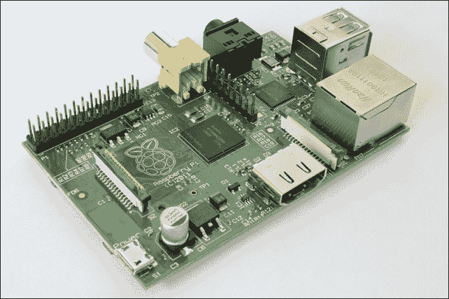
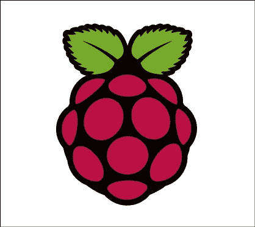
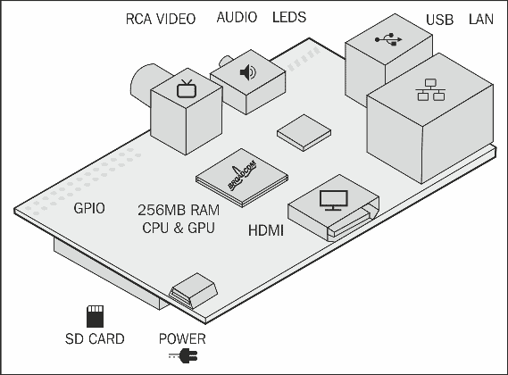
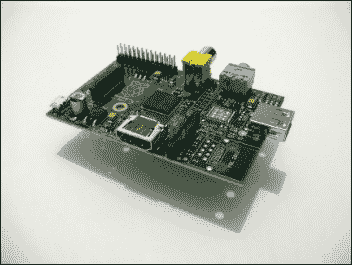
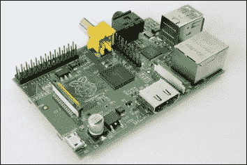
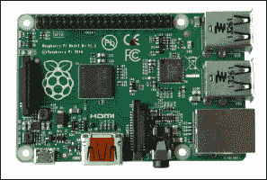
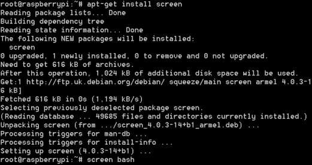
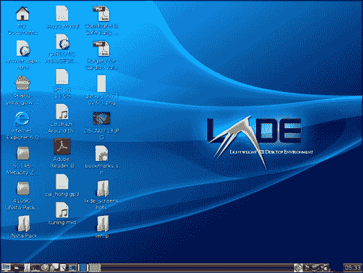

# 第一章：树莓派与 Raspbian

在本章中，您将了解树莓派、树莓派基金会以及树莓派的官方基于 Linux 的操作系统——Raspbian。

在本章中，我们将讨论：

+   树莓派

+   树莓派的历史

+   树莓派硬件

+   Raspbian 操作系统

+   树莓派组件

# 树莓派

尽管乍看之下，树莓派并不是一种美味的零食。树莓派是一款小巧、强大且廉价的单板计算机，由树莓派基金会经过多年开发而成。

如果您正在寻找一种低成本、小巧、易于使用的计算机用于您的下一个项目，或者对学习计算机工作原理感兴趣，那么树莓派非常适合您。

树莓派最初被设计为一款教育设备，其灵感来源于 BBC Micro 成功地将计算机编程教授给一代人。树莓派基金会旨在在今天的世界中做到同样的事情，在当今的计算机世界里，使用计算机不再需要掌握软件编程知识。到印刷时，树莓派基金会已经出货超过*250 万*台，可以说他们已经超出了最初的预期！

## 树莓派基金会

树莓派基金会是一个非营利慈善机构，成立于 2006 年，由埃本·厄普顿（Eben Upton）、罗布·穆林斯（Rob Mullins）、杰克·朗（Jack Lang）和艾伦·迈克罗夫特（Alan Mycroft）共同创办。该慈善机构的目标是向一代没有接触过 BBC Micro 或 Commodore 64 的年轻人推广计算机科学的学习。

他们开始担心，缺乏一种可以让爱好者用来学习和实验的设备。家用计算机通常因其价格过高而被排除在外，这使得爱好者和孩子们没有合适的设备来提升自己的技能。

# 树莓派的历史

任何新产品都需要经过多次迭代才能进入量产阶段。对于树莓派来说，这一切始于 2006 年，当时基于 Atmel 8 位 ATMega664 微控制器的几种树莓派概念版本已经开发出来。随后又开发了基于 ARM 处理器的 USB 闪存盘概念（与当前树莓派使用的处理器类似）。经过六年的硬件开发，才有了今天我们所熟知和喜爱的树莓派！

树莓派的官方标志如下所示：

直到 2011 年 8 月，树莓派的 Alpha 版本才开始生产 50 块板卡。这些板卡比当前版本稍大，以便树莓派基金会调试设备并确认其能够正常运行。2011 年 12 月，组装了 25 块树莓派的 Beta 版本，并通过拍卖筹集资金支持树莓派基金会。这些版本仅发现并修正了一个小错误，之后才进入正式生产。

第一批生产的树莓派共有 10,000 块板子，这些板子在中国和台湾制造。不幸的是，树莓派的以太网接口被错误地替换成了一个不兼容的部件。这导致了一些小的运输延误，但所有树莓派板卡都在预定日期内交付。作为补偿，基金会能够将 A 型号的树莓派内存从原定的 128 MB 升级到 256 MB。这个内存升级使得树莓派能够执行更多令人惊叹的任务，如实时图像处理。

树莓派现在在英国制造，这为许多新的工作岗位创造了机会。

树莓派的发布引起了轰动，树莓派的两家原始零售商——Premier Farnell 和 RS Components——在几分钟内就售罄了第一批产品。

# 树莓派硬件

树莓派的核心是强大的 Broadcom BCM2835“系统芯片”。BCM2835 类似于全球几乎每一款使用 ARM 架构的智能手机和机顶盒的核心芯片。树莓派上的 BCM2835 CPU 运行频率为 700 MHz，其性能大致相当于 1999 年推出的 300 MHz 的 Pentium II 计算机。

为了让你更好地理解，阿波罗任务中使用的引导计算机的性能还不如一个口袋计算器！

树莓派的框图

树莓派配备了 256 MB 或 512 MB 的内存，具体取决于你购买的型号。希望未来的版本内存会有所增加！

## 图形能力

树莓派的图形由 Videocore 4 GPU 提供。**图形** **处理** **单元**（**GPU**）的图形性能大致相当于 2011 年发布的 Xbox，其售价为数百美元。这些看起来可能是非常低的规格，但它们足以在 1080p 分辨率下运行《Quake 3》并播放全高清电影。

连接显示器到树莓派有两种方式。第一种是使用复合视频电缆，第二种是使用 HDMI。复合输出非常有用，因为你可以使用任何旧电视作为显示器。然而，推荐使用 HDMI 输出，因为它提供更优质的视频质量。树莓派没有提供 VGA 连接，因为这会带来过高的成本。然而，对于拥有 VGA 或 DVI 显示器的用户，使用 HDMI 转 VGA/DVI 转换器是可行的。

树莓派还支持 LCD 触摸屏。虽然官方版本尚未发布，但有许多非官方版本可用。树莓派基金会表示，他们预计今年会发布官方版本。

## 树莓派型号

树莓派有几种不同的型号：Model A 和 Model B。Model A 是低成本版本，不幸的是，它省略了 USB 集线器芯片。该芯片还充当了 USB 到以太网转换器。树莓派基金会还刚刚发布了树莓派 Model B+，该版本增加了 USB 接口，并解决了 Model B 和 Model B USB 接口的许多电力问题。

| 参数 | Model A | Model B | Model B+ |
| --- | --- | --- | --- |
| **CPU** | BCM2835 | BCM2835 | BCM2835 |
| **RAM** | 256 MB | 512 MB | 512 MB |
| **USB 端口** | 1 | 2 | 4 |
| **以太网端口** | 0 | 1 | 1 |
| **价格（美元）** | ~$25 | ~$35 | ~$35 |
| **自何时起可用** | 2012 年 2 月 | 2012 年 2 月 | 2014 年 7 月 |
| **主板** |  |  |  |

树莓派型号之间的差异

### 注意

你知道吗，树莓派如此受欢迎，以至于如果你在 Google 中搜索 `raspberry pie`，它们实际上会显示树莓派的搜索结果！

## 配件

树莓派的成功鼓励了许多其他团队为树莓派设计配件，用户也开始使用这些配件。这些配件从相机到自动 CNC 机床控制器应有尽有。一些配件包括：

| 配件 | 链接 |
| --- | --- |
| 树莓派相机 | [`www.raspberrypi.org/tag/camera-board/`](http://www.raspberrypi.org/tag/camera-board/) |
| VGA 板 | [`www.suptronics.com/RPI.html`](http://www.suptronics.com/RPI.html) |
| CNC 控制器 | [`code.google.com/p/picnc/`](http://code.google.com/p/picnc/) |
| 自动驾驶仪 | [`www.emlid.com/`](http://www.emlid.com/) |
| 外壳 | [`shortcrust.net/`](http://shortcrust.net/) |

# Raspbian

无论树莓派的硬件多么强大，没有操作系统，它也只是一个硅片、玻璃纤维和其他一些材料的集合。树莓派有几种不同的操作系统可供选择，包括 RISC OS、Pidora、Arch Linux 和 Raspbian。

目前，Raspbian 是最受欢迎的基于 Linux 的树莓派操作系统。Raspbian 是一个基于 Debian 的开源操作系统，专门为树莓派修改（因此得名 Raspbian）。Raspbian 包含了旨在使树莓派更易于使用的定制化内容，并且自带许多不同的软件包。

Raspbian 设计简单易用，是初学者开始使用树莓派时推荐的操作系统。

## Debian

Debian 操作系统由 Ian Murdock 于 1993 年 8 月创建，是 Linux 的原始发行版之一。

由于 Raspbian 基于 Debian 操作系统，因此它几乎包含了 Debian 的所有特性，包括其庞大的软件包库。树莓派可以使用超过 35,000 个自由软件包，并且这些软件包现在就可以使用！

关于 Debian（因此也包括 Raspbian）的更多信息，一个很好的资源是《Debian 管理员手册》。该手册可以在 [`debian-handbook.info`](http://debian-handbook.info) 上找到。

## 开源软件

构成 Raspbian 的大多数软件是开源的。开源软件是一种其源代码可以被任何人修改或增强的软件。

Linux 内核和构成 Raspbian 的大多数其他软件都采用 GPLv2 许可证。这意味着该软件对你免费提供，并且组成该软件的源代码可以供你按照自己的意愿使用。GPLv2 许可证还去除了任何索赔或担保。以下是 GPLv2 许可证序言的摘录，它让你很好地了解自由软件的精神：

> *“大多数软件的许可证旨在剥夺你共享和修改它的自由。相比之下，GNU 通用公共许可证的目的是保证你共享和修改自由软件的自由——确保软件对所有用户都是免费的……*
> 
> *当我们谈论自由软件时，我们指的是自由，而不是价格。我们的通用公共许可证旨在确保你有自由分发自由软件副本的权利（如果愿意，你可以收费提供此服务），你可以获得源代码或在需要时获得它，你可以修改软件或在新的自由程序中使用其部分代码；并且你知道你可以做这些事情。*

# Raspbian 组件

现代 Linux 发行版由许多组件组成。这些组件共同工作，提供你在计算机中所期待的所有现代功能。

Raspbian 是由几个关键组件构建的。这些组件包括：

+   树莓派引导加载程序

+   Linux 内核

+   守护进程

+   Shell

+   Shell 工具

+   X.Org 图形服务器

+   桌面环境

## 树莓派引导加载程序

当你的树莓派开机时，背后发生了很多事情。引导加载程序的作用是将树莓派的硬件初始化为已知状态，然后开始加载 Linux 内核。在树莓派的情况下，这是由第一阶段和第二阶段引导加载程序完成的。第一阶段引导加载程序在制造过程中被编程到树莓派的 ROM 中，无法修改。第二阶段和第三阶段引导加载程序存储在 SD 卡中，由前一个阶段的引导加载程序自动运行。

## Linux 内核

Linux 内核是 Raspbian 中最基础的部分之一。它管理着你的树莓派的每个操作，从在屏幕上显示文本到接收你在键盘上输入的按键。

Linux 内核是由 Linus Torvalds 创建的，他在 1991 年 4 月开始开发内核。从那时起，一群志愿者和组织共同合作，持续开发内核，使其成为今天的样子。

### 注意

你知道吗？将 Linux 内核重写到 2011 年的水平，成本超过 30 亿美元？

Linux 的标志是一只名为 Tux 的企鹅：

如果你想通过连接硬件设备来使用它，内核需要知道它是什么以及如何使用它。市面上绝大多数设备都被 Linux 内核支持，而且还在不断增加支持的设备。例如，当你将 USB 驱动器插入树莓派时，内核会自动检测到 USB 驱动器，并通知守护进程自动使文件对你可用。

当内核加载完成后，它会自动运行一个名为 init 的程序。这个程序旨在完成树莓派的初始化，然后加载其余的操作系统。该程序首先加载所有守护进程到后台，然后加载图形用户界面。

## 守护进程

守护进程是运行在后台的软件，提供操作系统不同的功能。一些守护进程的例子包括 Apache Web 服务器、Cron（一个用于自动在不同时间运行程序的作业调度器）和 Autofs（一个自动挂载可移动存储设备，如 USB 驱动器的守护进程）。

类似 Raspbian 这样的发行版需要的不仅仅是内核才能工作。它还需要其他软件来使用户能够与内核互动，并管理操作系统的其余部分。核心操作系统由一系列程序和脚本组成，使这一切得以实现。

## Shell

所有守护进程加载完毕后，init 启动一个 shell。Shell 是你与树莓派之间的接口，允许你通过键盘输入命令来监视和控制它。不要被这个界面欺骗，尽管它看起来就像 30 年前计算机使用的界面一样。Shell 是 Raspbian 中最强大的部分之一。

Linux 有多个可用的 shell。Raspbian 使用 **Bourne Again Shell**（**bash**）。这个 shell 目前是 Linux 中使用最广泛的 shell。

Bash 是一款功能极其强大的软件。Bash 最强大的特点之一是它能够运行脚本。脚本只是存储在文件中的一系列命令，可以做许多事情，比如运行程序、从键盘读取按键和其他许多操作。在本书的后面部分，你将看到如何使用 bash 来充分利用你的 Raspberry Pi！

## Shell 实用程序

如果没有可执行的命令，命令解释器就没有什么用处。虽然 bash 提供了一些非常基础的命令，但所有其他命令都是 shell 实用程序。这些 shell 实用程序共同构成了 Raspbian 的重要组成部分（它们至关重要，因为没有这些实用程序，系统将崩溃）。它们提供了许多功能，从复制文件、创建目录，到高级打包工具（APT）——一个包管理应用程序，允许你在 Raspberry Pi 上安装和卸载软件。

你将在本书的后续部分深入了解 APT。

## X.Org 图形服务器

在 shell 和守护进程加载之后，默认情况下，X.Org 图形服务器会自动启动。X.Org 的作用是为你提供一个通用平台，用以构建图形用户界面。X.Org 处理从移动鼠标指针、监听并响应按键操作，到将你正在运行的应用程序绘制到屏幕上的所有任务。

## 桌面环境

如果没有桌面环境，使用任何计算机都会变得困难。桌面环境让你不仅仅使用键盘与计算机互动，还可以上网、查看图片和电影，以及执行许多其他操作。图形用户界面通常使用窗口、菜单和鼠标来完成这些操作。

Raspbian 包含一个图形用户界面，称为轻量级 X11 桌面环境（Lightweight X11 Desktop Environment，简称 LXDE）。LXDE 在 Raspbian 中的使用是因为它是专门为像 Raspberry Pi 这样的设备设计的，这些设备的资源有限。

在本书的后面部分，你将学习如何定制和使用 LXDE，以最大化利用你的 Raspberry Pi。

LXDE 桌面环境的截图

# 总结

在本章中，你学习了什么是 Raspberry Pi，了解了 Raspberry Pi 基金会及其历史。你还学习了操作系统的基本构建块，尤其是 Raspbian。在下一章，我们将学习如何让你的崭新的 Raspberry Pi 启动并运行！
