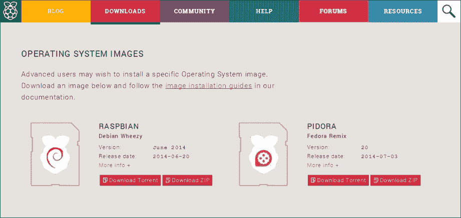
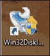
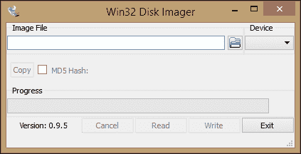
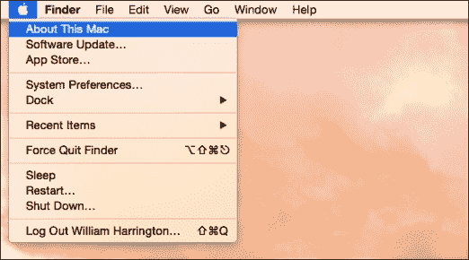
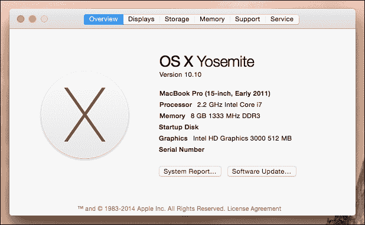
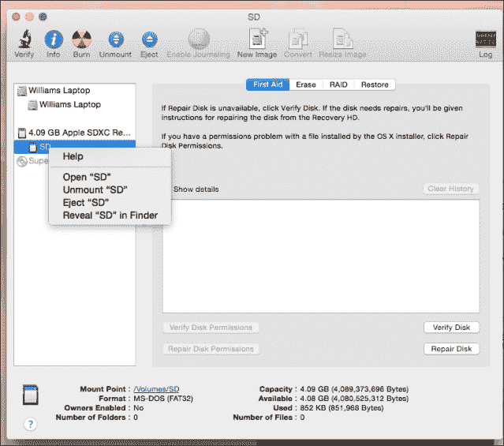
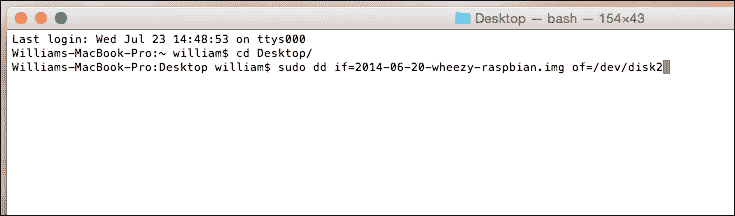

# 第二章：Raspbian 入门

现在你已经对 Raspbian 有了更多的了解，是时候开始了。你需要做的第一件事是将你的 Raspberry Pi 插入电源，然后将 Raspbian 安装到 SD 卡上。这个过程与在 Windows PC 或 Mac 上安装软件有所不同。

在这一章中，我们将覆盖以下主题：

+   SD 卡规格

+   下载 Raspbian

+   将 Raspbian 刻录到 SD 卡上

# SD 卡规格

建议你的 SD 卡具备以下规格：

| 容量 | 至少 8 GB |
| --- | --- |
| 类别 | 最低为 Class 4，但推荐使用 Class 10 |

### 注意

确保你选择了正确的 SD 卡。Raspberry Pi A 和 Raspberry Pi B 都使用标准尺寸的 SD 卡，而 Raspberry Pi B+ 使用迷你 SD 卡。

强烈建议你不要在没有 SD 卡的情况下运行 Raspberry Pi。这是因为没有 SD 卡，Raspberry Pi 上的所有硬件将无法正确设置，这可能会导致硬件损坏。

# 下载 Raspbian

现在你已经准备好所有硬件，接下来是让你的 Raspberry Pi 启动。是时候获取 Raspbian 镜像了。你可以从多个地方下载 Raspbian 镜像，最简单的方式是直接从 Raspberry Pi 基金会的网站下载：[`www.raspberrypi.org/downloads/`](http://www.raspberrypi.org/downloads/)。



官方 Raspbian 下载页面

在此页面上，你会看到基金会支持的所有官方操作系统的链接。我们需要关注的是 Raspbian 镜像。如果你能够通过 BitTorrent 客户端下载镜像，你可以帮助基金会节省带宽。如果不能，你可以直接下载压缩文件。

在编写本书时，最新版本的 Raspbian 基于 Debian Wheezy，于 2015 年 1 月发布。下载文件的大小约为 800 MB。当你下载完文件后，你需要从压缩文件中提取镜像。具体如何操作取决于你使用的操作系统。

现在，你已经准备好将 Raspbian 刻录到 SD 卡上。

# 将 Raspbian 刻录到 SD 卡上

你刚刚下载的文件是 SD 卡所有内容的完整副本。因此，你不能仅仅将文件复制到 SD 卡上就能开始使用。要将 Raspbian 刻录到 SD 卡上，你需要将镜像文件直接写入 SD 卡。这个过程会根据你使用的操作系统有所不同。

## 使用 Windows 写入镜像

要在 Windows 上将 Raspbian 镜像写入 SD 卡，您需要一个能够执行此任务的软件程序。有几种程序可用，但我们将使用一个名为 Win32 Disk Imager 的程序。Win32 Disk Imager 是一个开源工具，旨在将镜像文件写入可移动存储设备，如 SD 卡或 USB 驱动器。您可以从[`sourceforge.net/projects/win32diskimager/`](http://sourceforge.net/projects/win32diskimager/)下载 Win32 Disk Imager。其图标如下所示：



使用 Windows 编写镜像的步骤如下：

1.  第一步是将 SD 卡插入计算机。

1.  接下来，您需要下载并安装 Win32 Disk Imager。

1.  完成此操作后，您需要运行刚刚下载的文件并安装 Win32 Disk Imager。

1.  您需要以管理员身份运行 Win32 Disk Imager。为此，请右键点击**Win32DiskImager**快捷方式，然后选择**以管理员身份运行**。

1.  启动 Win32 Disk Imager 后，您应该看到如下界面：

1.  现在，您需要点击文件夹按钮并浏览到之前下载的 Raspbian 镜像文件。撰写本书时，镜像文件名为`2015-01-31-wheezy-raspbian.img`。该文件可能被压缩在 zip 文件中。如果是这种情况，您需要先解压缩该`.img`文件。

1.  下一步是确保在**设备**下拉菜单中选择正确的 SD 卡驱动器。

    ### 注意

    确保选择了正确的设备非常重要，因为这将清除该驱动器上的所有文件。您可以通过进入 Windows 资源管理器，注意与您刚插入的 SD 卡匹配的驱动器大小和标签，来确认您选择的是正确的磁盘。

    在进行此操作时，最好移除其他可移动存储设备，这样可以确保它们不会被误选。

1.  确认已选择正确的设备后，点击**写入**。写入过程将根据机器的不同而持续几分钟，可能是个好机会去泡一杯咖啡！完成后，您就可以开始使用您的树莓派了。


## 使用 Mac 编写镜像

您可以使用 Mac OS X 编写从树莓派基金会下载的镜像文件，甚至不需要在 Mac 上安装任何额外的软件。

这些指令适用于 OS X 10.10（Yosemite），但也适用于旧版本的 OS X。

使用 Mac 编写镜像的步骤如下：

1.  首先，您需要将 SD 卡插入 Mac 并确保所有其他可移动存储设备已拔出，以防止它们被误删。

1.  现在 SD 卡已插入，我们需要找出操作系统分配给 SD 卡的内部设备名称。设备名称将以 `/dev/diskX` 形式出现。我们可以通过点击左上角的苹果符号，选择 **关于本机** 来查看，如下所示：

1.  现在，你需要选择 **系统报告…**，如下截图所示：

1.  然后你将在屏幕上看到系统报告。如果你的 Mac 有内部 SD 卡读卡器，你需要在屏幕左侧选择 **卡片读卡器**。

1.  如果你使用的是 USB 转 SD 卡读卡器，你需要选择 **USB**，然后在列表中找到你的 SD 卡读卡器。

1.  选择了 SD 卡后，请查看页面底部的 **BSD 名称**。它将类似于 disk2（在此案例中为 **disk2s1**）。这个名称是操作系统内核分配给 SD 卡的内部名称。

如果卡中有其他分区，它们将被列为 diskXs1、diskXs2 等。我们只需要 diskX 部分。


现在我们已经有了 SD 卡的 BSD 名称，我们需要确保 SD 卡上的分区没有被挂载，但也不想弹出 SD 卡。通过使用磁盘工具，我们可以按以下步骤操作：

1.  首先，我们需要打开磁盘工具。你可以通过导航到 **应用程序** | **实用工具** 来找到磁盘工具。

1.  打开磁盘工具后，你将在设备列表的左侧找到 SD 卡。你需要右击列表中的每个分区并选择 **卸载**。这将阻止操作系统使用该分区。如果不这样做，当你实际将映像写入 SD 卡时，会收到 **设备正在使用** 的消息。

1.  现在，你终于准备好将 Raspbian 映像写入 SD 卡了。为此，打开终端。你可以在 **应用程序** 下的 **实用工具** 标签中找到它。

由于 OS X 基于 BSD 操作系统，我们可以访问其所有工具。我们将使用名为 **Disk** **Dump**（**dd**）的工具，实际将映像文件写入我们的 SD 卡。`dd` 工具设计用于读取和写入设备的原始数据，可以用于从复制硬盘到将映像写入 SD 卡等任何操作。

1.  打开终端后，你需要切换到包含映像文件的目录。在这个案例中，它位于 **桌面** 文件夹中，`cd` `桌面`。

1.  然后我们运行实际的命令，将映像写入 SD 卡，将 `2015-01-31-wheezy-raspbian.img` 替换为你的 Raspbian 映像文件名称，将 diskX 替换为你在前面步骤中找到的 BSD 名称：

    ```
    sudo dd bs=1m if=2015-01-31-wheezy-raspbian.img of=/dev/diskX

    ```

    该命令以超级用户身份运行 `dd` 命令。`dd` 命令读取映像文件 `2015-10-31-wheezy-raspbian.img` 并将其写入 SD 卡。它以每次一兆字节的块写入数据。

1.  运行此命令时，系统会要求你输入管理员密码。根据 SD 卡的速度，执行该命令写入映像到 SD 卡可能需要最多半小时。

完成后，将卡插入 Raspberry Pi，你就准备好开始了。

## 使用 Linux 写入映像

使用 Linux 写入你刚刚下载的 Raspbian 映像的过程非常简单。如前所述，Linux 有许多不同的发行版。接下来的步骤是在 Ubuntu 上测试过的，Ubuntu 是一个基于 Debian 的 Linux 发行版，像 Raspbian 一样。正如之前所提到的，请确保所有可移动存储设备都已拔出，以防止它们被意外擦除。

我们需要做的第一件事是启动一个终端。所有不同的 Linux 环境中都可以使用终端。在 Ubuntu 中，它叫做 **Terminal**。下面的截图展示了如何在最新版本的 Ubuntu 中找到终端应用程序：

使用 Linux 写入映像

现在你已经启动了终端，接下来需要获得 root 权限，方法如下：

1.  最简单的做法是运行以下命令：

    ```
    sudo –i

    ```

1.  `sudo` 为你在终端中运行的任何程序提供管理员权限。这样做是必要的，因为将映像写入 SD 卡是一个可能影响所有用户的操作。`sudo` 在本书后面会进一步讨论。你将看到一个与下方截图类似的终端：使用 Linux 写入映像

1.  现在你已经准备好查找 SD 卡的设备名称。为此，运行 `df` 命令。`df` 命令可以帮助你查看每个存储设备上可用的存储空间。我们需要运行以下命令：

    ```
    df –h

    ```

1.  以下截图显示了输出：使用 Linux 写入映像

运行 `df` `-h` 命令得到的结果如前面的截图所示。我们可以看到，在这种情况下，我们使用的 SD 卡是 `/dev/sdb1`。如果你的机器有内建的 SD 卡读卡器，这个设备名可能是 `/dev/mmcblk0p1`。无论设备名如何，我们只需要设备名的前半部分。在前面的示例中，我们会使用 `/dev/sdb`，如果是 `/dev/mmcblk0p1`，我们则会使用 `/dev/mmcblk0`。验证你选择的设备是否正确的一个简单方法是检查其大小。

现在你已经知道了设备的名称，接下来需要卸载 SD 卡。为此，我们将使用 `unmount` 命令。我们只需要在终端中运行以下命令，针对我们刚刚找到的设备名称：

```
umount /dev/sdb1

```

现在我们终于准备好将镜像写入 SD 卡了。为此，我们需要进入你下载了 Raspbian 镜像的目录。然后运行 `dd` 应用程序。如前所述，`dd` 工具被设计用来读取和写入设备上的原始数据，可以用于从复制硬盘到写入镜像到 SD 卡等多种操作。以下命令作为超级用户运行 `dd` 命令：

```
cd Desktop
dd bs=1m if=2014-06-20-wheezy-raspbian.img of=/dev/sdb1

```

`dd` 命令读取镜像文件 `2015-01-31-wheezy-raspbian.img` 并将其写入 SD 卡。它以每次一兆字节的块大小写入数据。

这个命令可能需要几分钟到半小时不等，具体取决于你的 SD 卡大小。完成后，将 SD 卡插入 Raspberry Pi，你就可以开始使用了。

# 总结

在本章中，你学习了从哪里下载 Raspbian 镜像。你还通过不同的操作系统，逐步了解了如何将 Raspbian 镜像写入 SD 卡。下一章将向你展示如何设置你的 Raspberry Pi 并配置 Raspbian。
