# 第三章：启动 Raspbian

本章将指导你如何设置树莓派，第一次启动 Raspbian，并配置你的摄像头（如果你有的话）。

在本章中，我们将介绍以下内容：

+   不同类型的树莓派

+   插入树莓派

+   第一次启动树莓派

+   树莓派软件配置工具

+   完成设置

+   排查常见问题

到了本章的最后，你应该已经将树莓派启动并运行了。

# 树莓派 A 型号和树莓派 B 型号

树莓派 A 型号和树莓派 B 型号是树莓派的原始版本：

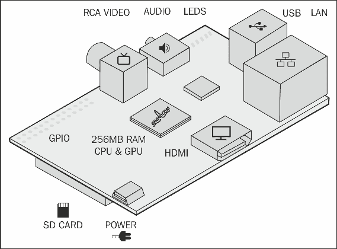

# 树莓派 A+

树莓派 A+ 是树莓派的最新版本。树莓派 A+ 与之前的 Model A 有一些不同，以下是主要的区别：

+   树莓派 A+ 使用 micro SD 卡

+   它有一个更大的 40 针 I/O 接口

+   如果你想使用 AV 输出将树莓派 A+ 连接到电视，你现在需要一个适配器线。

以下是树莓派 A+：

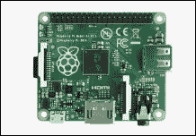

# 树莓派 B+

树莓派 B+ 是树莓派的另一款最新更新版本。树莓派 B+ 与之前的版本有一些不同，以下是主要的区别：

+   树莓派 B+ 使用 micro SD 卡

+   它有一个更大的 40 针 I/O 接口

+   如果你想使用 AV 输出将树莓派 B+ 连接到电视，你现在需要一个适配器线。

+   树莓派 B+ 总共有四个 USB 端口，而不是两个

以下是树莓派 B+：

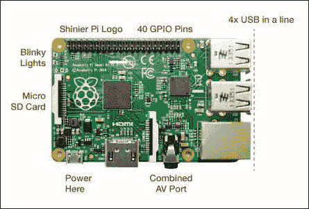

# 插入树莓派

插入树莓派并让它启动非常简单。你只需要准备一些东西，具体如下：

+   电源

+   显示器

+   键盘和鼠标

+   SD 卡

+   网络连接

让我们详细地了解一下这些内容。

## 电源

树莓派的电源非常简单。它使用标准的 5V 微型 USB 电源。如果你有一个带微型 USB 的手机充电器，那么你应该可以用它来为树莓派供电。你也可以使用插入 USB 手机充电器的微型 USB 数据线。

我们建议你使用专用的微型 USB 电源，而不是 USB 数据线，这样更可靠。这些电源可以从你购买树莓派的零售商处获得。

电源供应能力至少要达到 1 安培，这是很重要的。低于这个值，你可能会遇到间歇性重启和其他问题。

## 显示器

为了充分利用你的树莓派，你需要一个显示器。树莓派支持两种不同类型的显示器：

+   **HDMI**：这是一种现代接口，支持通过一根电缆传输高清视频和音频。所有现代电视和越来越多的计算机显示器都支持 HDMI。

+   **AV**：这是一种较旧的标准，可以让你将树莓派连接到旧款电视。树莓派 A 和 B 两款都有一个标准的 AV 接口。如果你使用的是树莓派 A+ 或 B+，你会发现 AV 接口现在已经集成到耳机接口中，你需要购买一个适配器才能将其连接到电视上。

当你将树莓派连接到显示器时，确保在显示器上选择了你正在使用的输入源。

需要记住的是，一旦树莓派启动并运行，你就不需要显示器来操作它了。然而，最初配置树莓派时没有显示器会相对困难。

## 键盘和鼠标

树莓派几乎支持所有 USB 键盘和鼠标。如果你使用的是树莓派 A 或 B，这两个端口都会被占用。除非你使用的是带有四个 USB 端口的树莓派 B+，否则我们强烈建议你将一个 USB 集线器插入树莓派，这样你就能有一些额外的 USB 端口可供使用。你可以通过访问[`elinux.org/RPi_USB_Keyboards`](http://elinux.org/RPi_USB_Keyboards)来检查你的键盘和鼠标是否被支持。

## SD 卡

你已经在上一章中准备好了一个带有 Raspbian 系统的 SD 卡。你需要将这个 SD 卡插入树莓派。确保在树莓派运行时不要拔出 SD 卡。

## 网络连接

为了充分利用你的树莓派，你需要连接互联网。树莓派 B 和 B+ 都配有一个以太网接口，你可以将树莓派连接到你的路由器。要通过 Wi-Fi 将树莓派连接到互联网，你需要一个 USB 到 Wi-Fi 适配器。如果你想通过 Wi-Fi 将树莓派 A 或 A+ 连接到互联网，你需要使用一个有电源的 USB 集线器。

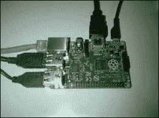

插入树莓派

# 首次启动树莓派

现在你已经准备好了一切，是时候启动你的树莓派了。你需要做的第一件事是确保你的显示器设置为正确的输入源。如果你想使用 HDMI，这一点非常重要，因为如果树莓派在启动过程中没有检测到 HDMI 显示器，它会自动使用默认的 AV 输出。

## 启动加载程序

当你打开树莓派时，你将看到树莓派的启动屏幕。

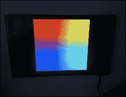

树莓派启动加载程序

如果你看到这个，说明 SD 卡上的所有启动加载程序文件已被找到，并且正确的显示器已经成功检测到。如果你没有看到这个，确保所有电缆都插好，显示器或电视已设置为正确的输入源，并且你的 SD 卡已正确烧录。

## Linux 内核

启动过程的下一步是初始化 Linux 内核。Linux 内核包含在你 SD 卡上的 `kernel.img` 文件中。

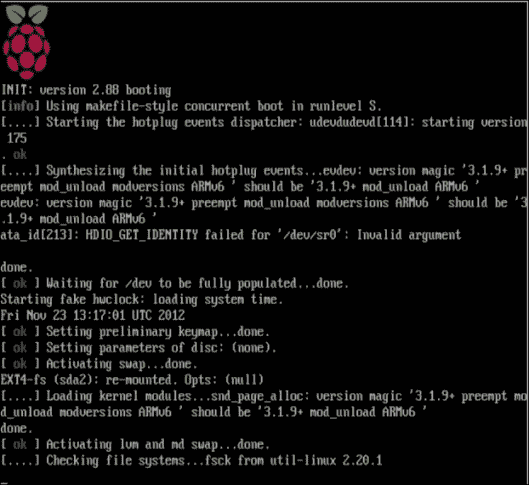

启动 Raspbian

当您的树莓派启动时，您将看到类似于前面截图的屏幕。第一次启动过程将比后续启动时间稍长。由于这是您的树莓派首次启动，它将自动加载**树莓派软件配置工具**。

您可以使用此工具配置树莓派的不同部分。

# 树莓派软件配置工具

**树莓派软件配置工具**旨在成为设置您的树莓派的简单直观的方式。当您的树莓派首次上电时，它将自动启动。

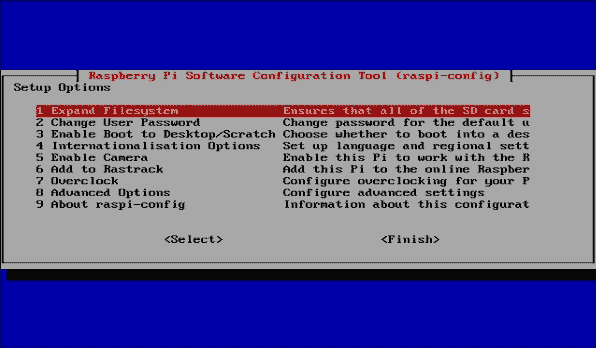

树莓派软件配置工具

**树莓派软件配置工具**非常易于使用。要在菜单之间移动，请使用箭头键和**Tab**键。要选择菜单，只需按*Enter*键。

您可以通过运行以下命令随时使用**树莓派软件配置工具**：

```
raspi-config

```

## 设置树莓派

现在您的树莓派已经启动了**树莓派软件配置工具**，是时候使用它来让您的树莓派运行起来。

## 调整树莓派的根文件系统大小

您需要做的第一件事是扩展树莓派的文件系统，使其占据 SD 卡的全部空间。如果不这样做，您将无法使用 SD 卡上剩余的存储空间。

要做到这一点，请确保选择**扩展文件系统**选项。现在，只需按下*Enter*键即可。存储 Raspbian 操作系统的根分区现在将被扩展到 SD 卡的大小。然后，您将看到以下菜单：

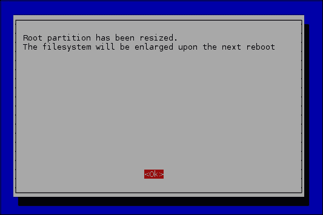

此消息表示您已成功调整根分区的大小

## 更改树莓派的默认密码

Raspbian 的默认用户密码是 `pi`。这不是很安全，您可能希望将其更改为其他密码。**树莓派软件配置工具**使这变得非常简单。

1.  选择**更改用户密码**选项，然后按下*Enter*键。

1.  现在，您将看到更改密码的第一步。准备好后，按下**<ok>**：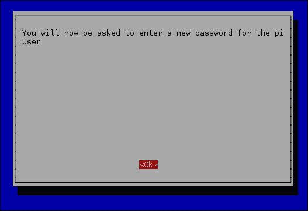

    更改密码的第一步

1.  然后会提示您输入密码。您在输入时看不到任何内容。

1.  当您完成输入密码后，按*Enter*键；再次输入并按*Enter*键。确保不要忘记密码，因为您需要它来安装任何新软件到您的树莓派。


更改密码

## 启用启动到桌面/Scratch

Raspbian 有几种不同的界面，你可以在你的 Raspberry Pi 中使用，如图形桌面环境、命令提示符和编程语言 Scratch。

我们建议你选择**桌面登录**选项，这样你就可以使用 Raspbian 中包含的图形界面。你可以从图形界面使用命令提示符和 Scratch 语言。默认选项是当 Raspberry Pi 启动时使用命令提示符。

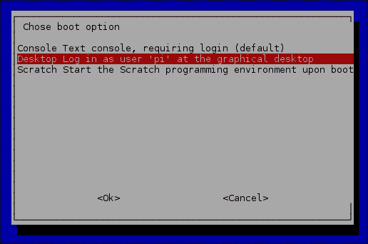

## 国际化选项

默认情况下，Raspbian 配置为适用于英国。如果你不在英国，你需要配置 Raspbian 以使用正确的时区、键盘布局和地区设置。

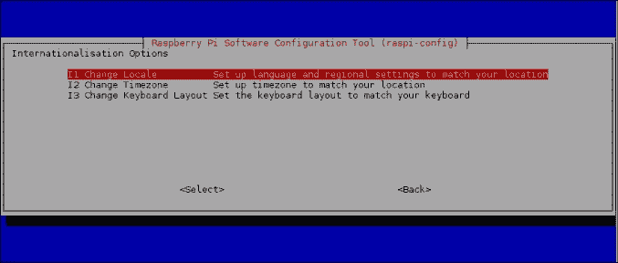

Raspberry Pi 软件配置工具中的国际化选项

### 添加你的地区设置

地区设置用于定义 Raspbian 用来显示日期、数字、货币等内容的语言。默认情况下，你的 Raspberry Pi 地区设置为英国。

将地区设置更改为你所在国家非常简单。为此，选择**更改地区**选项。

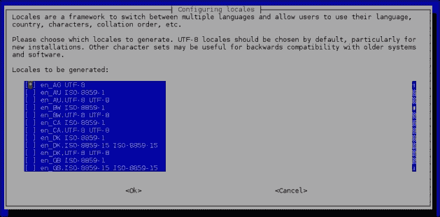

选择你的地区设置

你可以为你的 Raspberry Pi 选择多个地区设置。在澳大利亚，我们会选择**en_AU**地区设置。如果你在美国，你会选择**en_US**。

### 选择时区

**Raspberry Pi 软件配置工具**还可以轻松选择你的时区。默认情况下，这个设置为 UTC。如果你希望在你的 Raspberry Pi 上显示正确的时间，你需要更改时区。

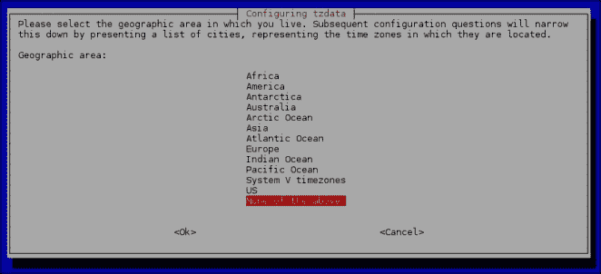

选择时区

选择你的时区，选择你所在的地区并按*Enter*。然后你可以选择离你最近的城市并按*Enter*。

### 更改你的键盘

默认情况下，Raspbian 预期你使用为英国设计的键盘。如果你不使用英国键盘，许多键盘上的按键将无法按预期工作。

为了告诉 Raspbian 使用正确的键盘，选择**更改键盘布局**。

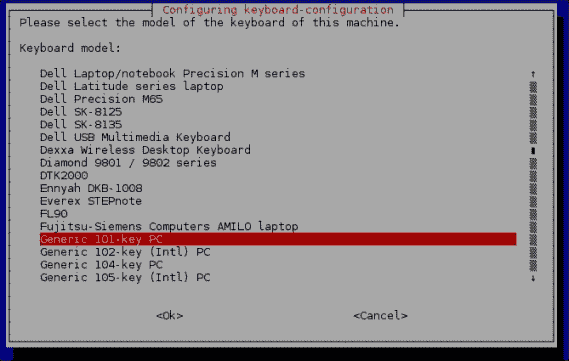

选择键盘

如果你的键盘没有列出，去选择**通用 101 键 PC**键盘选项并按*Enter*。根据你的所在位置，你应该能找到适合你国家的通用键盘。例如，在美国或澳大利亚，我们会选择**英语（美国）**键盘。

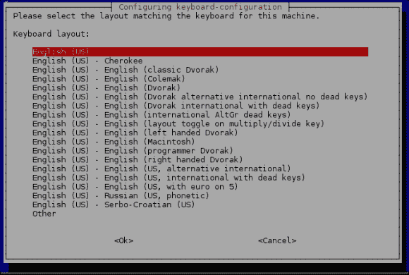

选择默认的键盘布局

选择键盘后，系统会询问你希望将哪个键设置为**AltGr**键。**AltGr**键用于某些语言，以提供键盘上没有的附加字符。

选择**键盘布局的默认设置**选项通常是安全的。

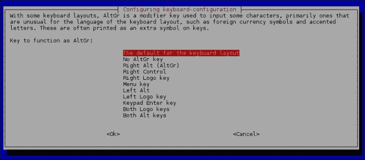

选择 AltGr 键

配置键盘的最后一步是选择你想用作**组合键**的键。

**组合键**允许 Raspberry Pi 将多个按键的组合解释为单次按键操作。通常情况下，这个功能不需要使用，选择默认选项**无组合键**是安全的。

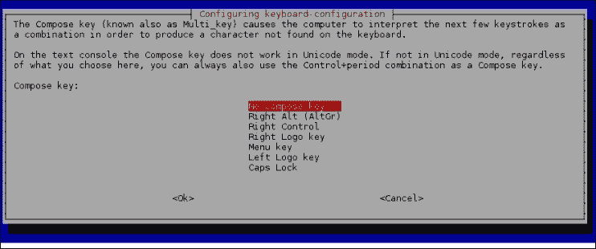

选择默认组合键

## 启用 Raspberry Pi 摄像头

Raspberry Pi 可以配备摄像头。默认情况下，除非你已经连接了摄像头并且希望使用它，否则它是禁用的。要启用 Raspberry Pi 摄像头，在 Raspberry Pi 软件配置工具中选择**<启用>**选项。

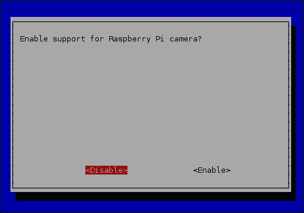

启用你的 Raspberry Pi 摄像头

## 添加到 Rastrack

Rastrack 是一个非营利性网站，映射了全球许多 Raspberry Pi 的位置。如果你想将你的 Raspberry Pi 添加到地图上，选择**添加到 Rastrack**并输入你的电子邮件地址。

### 注意

你可以通过访问 [`rastrack.co.uk/`](http://rastrack.co.uk/) 来查看其他一些 Raspberry Pi 板卡在全球的位置。

## 启用 SSH

在**Raspberry Pi 软件配置工具**中，你还可以做一个有用的自定义设置，即启用 SSH 服务器。SSH 是一种安全协议，除了其他功能外，它还允许你远程访问 Raspberry Pi 的命令提示符。

你可以通过在**Raspberry Pi 软件配置工具**中选择**高级选项**来启用 SSH。进入后，选择**A4（SSH）**并按*回车键*。选择**启用 SSH**，然后完成。这使你可以使用 SSH 客户端（如 PuTTY）远程访问你的 Raspberry Pi，并将文件复制到 Raspberry Pi 上。

# 完成设置

现在你已经定制好了 Raspberry Pi，是时候开始使用它了。为此，你需要通过选择**完成**退出**Raspberry Pi 软件配置工具**。系统会提示你重新启动 Raspberry Pi。选择**是**，然后 Raspberry Pi 会重新启动并加载图形界面，准备就绪。记住，你始终可以通过运行以下命令重新运行**Raspberry Pi 软件配置工具**：

```
sudo raspi-config

```

# 常见问题

人们在使用 Raspberry Pi 时遇到的最常见问题通常与他们使用的电源有关。如果你的 Raspberry Pi 表现异常，我们建议你尝试更换电源。推荐使用优质电源，因为 Raspberry Pi 对电噪声非常敏感。

另外，检查是否正确地写入了 SD 卡也是一个好主意。如果需要，你可以重新写入 SD 卡。

另一个常见问题是，当人们第一次设置树莓派时，往往会选择错误的显示器输入。树莓派启动时，如果无法找到连接的 HDMI 显示器，它将自动使用组件输出。防止这种情况发生的最简单方法是，在打开树莓派之前，确保你的显示器或电视的输入设置为正确的输入。

# 总结

本章讲解了如何设置你的树莓派并为你的地区和键盘配置 Raspbian。你还了解了一些在设置树莓派时可能遇到的潜在问题。

在下一章中，我们将介绍 Raspbian 桌面环境。
