# 第四章：Raspbian 桌面简介

现在，你已经设置好树莓派并配置好 Raspbian，是时候开始使用 Raspbian 了！Raspbian 桌面是一个简单、可定制且易于使用的桌面环境。本章将带你了解如何自定义桌面以及其中的一些应用程序。

本章将涵盖以下主题：

+   Raspbian 桌面

+   Linux 文件系统简介

+   Raspbian 桌面之旅

+   虚拟桌面

+   Raspbian 的网络管理

+   自定义你的 Raspbian 桌面

+   预安装软件

+   Xfce 中的文件管理

# Raspbian 桌面

Raspbian 桌面与许多其他桌面环境非常相似，例如 Windows 桌面。Raspbian 内置了大量的教育和编程工具。

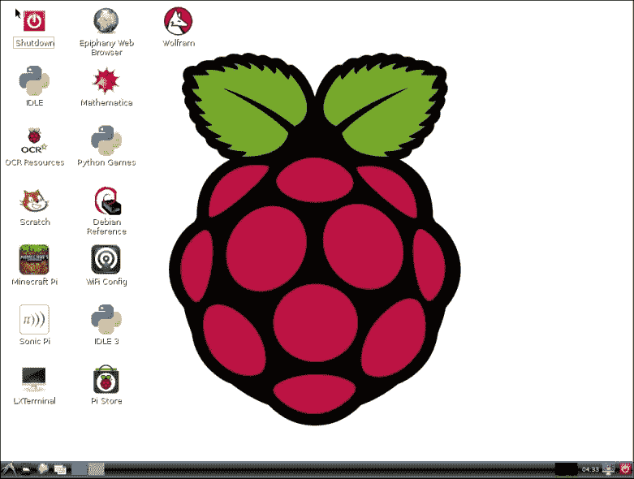

Raspbian 桌面

为了充分利用桌面环境，你需要将计算机鼠标连接到你的树莓派。

# Raspbian 文件系统

在进一步讨论之前，理解 Linux 系统（如 Raspbian）中文件和存储的组织方式非常重要。

如果你习惯了使用 Windows，你很快就会意识到所有文件的组织方式是不同的。曾经用来访问计算机上所有不同存储的驱动器字母不复存在。Linux，像它的“亲戚”Unix 和**伯克利软件发行版**（**BSD**，Mac OS X 的来源）一样，将一切组织在一个文件系统层次结构中。

这个文件系统层次结构从一个地方开始，即根目录：`/`。Linux 中的每个文件和设备都包含在这个单一的层次结构中。

这个工作方式的一个示例是`/media`文件夹。默认情况下，如果你将 USB 驱动器插入树莓派，Raspbian 会在`/media`内自动创建一个文件夹。这个文件夹将代表你 USB 驱动器的内容。如果你连接了多个存储设备，它们都会出现在`/media`中。

一种简单的方式来理解这一点，在 Linux 文档项目中有描述（[`www.tldp.org/`](http://www.tldp.org/)）：

> *“在 UNIX 系统中，一切皆文件；如果某个东西不是文件，它就是一个进程。”*

现代 Linux 发行版（如 Raspbian）中有许多不同的目录，这些目录对操作系统的运行至关重要。它们在下表中有详细说明：

| 目录 | 描述 |
| --- | --- |
| `/` | Linux 文件系统的根目录。 |
| `/bin` | 这个目录包含启动和使用 Raspbian 所需的程序。 |
| `/dev` | 我们的树莓派上所有连接的设备都可以在这里找到。设备以特殊文件的形式表示，例如 `sda1` 和 `null`。 |
| `/etc` | 这个目录包含所有不同软件包的配置文件。 |
| `/home` | 系统中的每个用户在`/home`中都有一个文件夹。这有助于将每个用户的文件夹集中在一起。 |
| `/lib` | 软件库包含多个应用程序共享的共享代码。这些文件以`.so`结尾，并存储在此文件夹中。 |
| `/mnt and /media` | 连接到树莓派的任何其他文件系统都可以在这些文件夹中使用。 |
| `/opt` | 默认情况下未安装在 Raspbian 中的软件通常安装在此文件夹中。 |
| `/proc` | `/proc` 文件夹中的所有文件都是特殊文件，允许访问 Linux 内核中的各种统计数据和配置。 |
| `/sbin` | 系统管理员用于管理系统的任何软件应用程序存储在此文件夹中。 |
| `/tmp` | 运行 Raspbian 时使用的任何临时文件通常存储在 `/tmp` 中。这些文件通常在重新启动时被删除。 |
| `/usr` | 任何普通用户安装或使用的应用程序及其库和文档都安装在此文件夹中。 |
| `/var` | `/var` 包含树莓派上不断变化的所有日志和其他文件。 |
| `/root` | 此文件夹类似于 `/home`，但仅包含 root 用户的文件。 |
| `/boot` | 此文件夹包含树莓派用于引导的配置文件。 |

# Raspbian 桌面导览

Raspbian 桌面由几个部分组成。这些是桌面、底部面板、主菜单和面板项目。

## 桌面

桌面是您不运行任何程序时看到的主要部分。默认情况下，背景图像是树莓派标志，但您可以将其更改为任何您想要的图像。

桌面还包含所有桌面图标。这些图标可以选择并拖动到桌面上。双击这些图标会启动各种程序，并且可以移动这些图标。

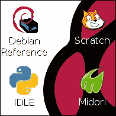

Raspbian 桌面

## 底部面板

Xfce 桌面底部有任务栏。任务栏显示所有正在运行的打开程序。它还包含主菜单和许多面板项目。


底部面板

底部面板的左侧和右侧有几个不同的面板项目。这些面板项目执行各种功能，例如打开网页浏览器或最小化所有窗口。

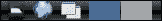

几个面板项目

默认面板项目执行以下任务：

| 图标 | 任务 |
| --- | --- |
|  | 这打开文件管理器 |
|  | 这打开默认的网页浏览器 |
|  | 这最小化屏幕上的所有窗口 |
|  | 这帮助您在虚拟桌面之间切换 |

## 主菜单

屏幕的左下角是主菜单。此菜单包含了许多预安装在 Raspbian 中的不同程序。这些程序被分为不同的类别，如下图所示。主菜单非常类似于 Microsoft Windows 中的开始菜单。

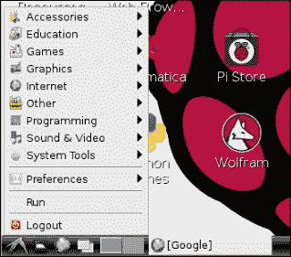

主菜单

## 面板项

面板项是小型交互式显示和按钮，可以在无需打开程序的情况下显示重要信息。

默认情况下，Raspbian 在屏幕的右下角包括四个面板项。它们如下所示：

+   CPU 使用率指示器

+   时钟

+   屏幕锁定按钮

+   电源按钮

我们可以在以下截图中看到一些默认的面板项：

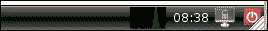

# 虚拟桌面

虚拟桌面是 Xfce 的一个非常有趣的功能，Windows 或 Mac OS X 默认没有。

### 注意

Mac OS X 包括 Spaces（多个桌面），但默认情况下是禁用的。您可以通过第三方软件（如 VirtualWin）在 Windows 中获得虚拟桌面功能。

虚拟桌面基本上就像其他虚拟屏幕，您可以在已打开的程序之间来回切换。您可以将所有打开的程序布局在不同的虚拟桌面上，然后通过点击虚拟桌面面板项来在这些虚拟桌面之间来回切换。每个桌面可以有不同的背景和面板。您可以使用键盘上的 *ALT* + *TAB* 键在窗口之间切换。

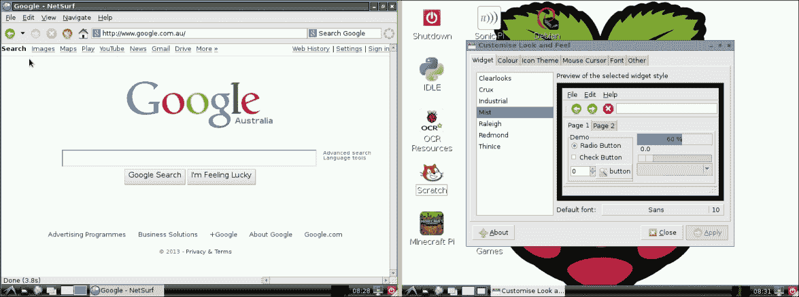

两个 Raspbian 桌面

您可以使用 **Openbox 配置管理器** 创建任意数量的虚拟桌面。这些桌面可以命名，便于您跟踪所有应用程序的位置。

# 使用 Raspbian 进行网络管理

为了最大限度地利用您的树莓派，它需要连接到互联网。您可以通过两种方式实现：使用以太网电缆或 Wi-Fi。Raspbian 在自动配置网络设置方面做得很好，但有时您需要帮助它。

不幸的是，Raspbian 不包括一个图形界面来配置您的网络连接。您可以使用文本编辑器手动配置网络接口，或者安装一个图形界面来执行此操作。

## 连接您的树莓派到以太网网络

树莓派 Model B 和 Model B+ 配备了板载以太网端口。默认情况下，Raspbian 配置为自动从网络上的 DHCP 服务器获取 IP 地址。

有时，您可能希望手动为您的树莓派分配一个 IP 地址。这可以通过编辑名为 `interfaces` 的文件来完成。要编辑此文件，您需要打开一个控制台。执行此操作的具体步骤可以在第六章中找到，*控制台*。您需要运行的命令如下：

```
sudo nano /etc/network/interfaces

```

这将启动 nano 文本编辑器。`interfaces` 文件默认包含以下内容：

```
auto lo
iface lo inet loopback
iface eth0 inet dhcp

allow-hotplug wlan0
iface wlan0 inet manual
wpa-roam /etc/wpa_supplicant/wpa_supplicant.conf
iface default inet dhcp

```

在 Linux 中，以`eth`为前缀标识以太网端口。树莓派中的以太网端口称为`eth0`。`interfaces`文件包含一个配置 IP 地址的部分。您会看到它默认设置为 DHCP。您可以在这里分配您的 IP 地址。为此，请将`iface`行更改为以下行：

```
auto eth0
iface eth0 inet static
address 192.168.2.6
netmask 255.255.255.0
gateway 192.168.2.1

```

您可以看到您可以输入自己网络配置的位置。修改完成后，按*CTRL* + *x*退出 nano，然后按*y*保存您的更改。

要应用您所做的更改，请运行以下命令：

```
sudo service networking restart

```

如果您的配置有任何问题，系统会提醒您进行修正。

## 将您的树莓派连接到 Wi-Fi 网络

Raspbian 原生支持许多无线适配器，这使得从树莓派无线接入互联网变得非常简单。

您可以在[`elinux.org/RPi_VerifiedPeripherals`](http://elinux.org/RPi_VerifiedPeripherals)找到已测试并且能够与您的树莓派兼容的 Wi-Fi 适配器列表。

## 将您的 Wi-Fi 适配器连接到树莓派

最好在树莓派关闭时插入 Wi-Fi 适配器。这样做的原因是，当 USB 设备插入时，树莓派的电源可能会出现问题。

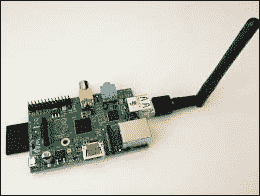

配有 USB Wi-Fi 适配器的树莓派 B

## 连接到无线网络

插入支持的 Wi-Fi 适配器后，它会自动被检测并准备好使用。在继续之前，您需要打开**WiFi 配置**工具。该工具可以在树莓派桌面上找到。打开工具后，您将看到以下窗口：

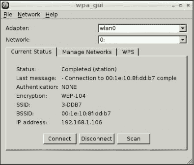

WiFi 配置工具

**WiFi 配置**工具是一个易于使用的程序，用于将树莓派连接到您的无线网络。

要连接到您的无线网络，请执行以下步骤：

1.  点击**扫描**，如下面的截图所示。这将列出所有树莓派范围内的无线网络。只需双击列表中的您的网络。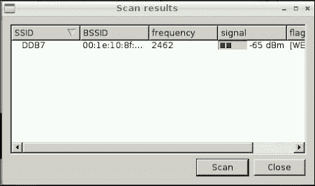

    WiFi 配置工具中的扫描结果

1.  如果您的 Wi-Fi 网络启用了安全性（强烈建议启用），系统会要求您输入无线密钥。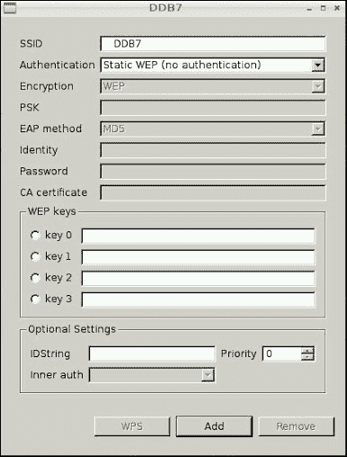

    无线网络配置设置

1.  输入密钥后，点击**添加**。您将返回到主无线配置窗口。只需点击您的 Wi-Fi 网络，然后选择**连接**。

    ### 提示

    您知道吗，WEP Wi-Fi 加密在 2001 年就被破解，现在任何拥有树莓派的人可以在几分钟内发现 WEP 密钥？

# 自定义您的 Raspbian 桌面

Xfce 可以通过多种方式进行自定义。这使得你可以个性化桌面环境，按你想要的样子来设置它。

## 更改显示分辨率

当 Raspbian 启动到桌面时，你首先需要检查 Raspberry Pi 使用的分辨率是否适合你的显示器。Raspbian 会尝试自动选择合适的分辨率，以确保显示的内容看起来正常，但有时它无法正确完成这项任务。如果屏幕上的图像模糊或不合适，你就能发现分辨率设置有问题。

你可以使用**显示器设置**应用程序在偏好设置中更改分辨率，以适应你的显示器。

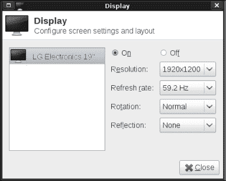

显示器设置

可能需要几次尝试才能找到适合你显示器或电视的最佳分辨率，但绝对是值得的！如果你仍然无法调整好显示效果，你也可以自定义显示器的刷新率。

### 自定义桌面外观

Raspbian 桌面几乎每个部分都可以自定义，从创建额外的面板到更改默认颜色和字体。

要开始操作，点击主菜单，在偏好设置子菜单中你会看到**自定义外观和感觉**。在这个窗口中，你可以更改几乎所有的内容，从默认样式、颜色、图标、字体到其他许多设置。

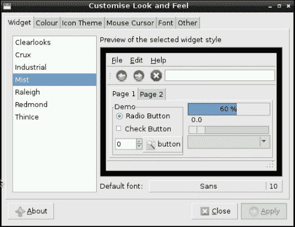

自定义外观和感觉对话框

最容易自定义的事情之一就是不同 UI 元素的样式。你可以从多种不同的样式中进行选择：

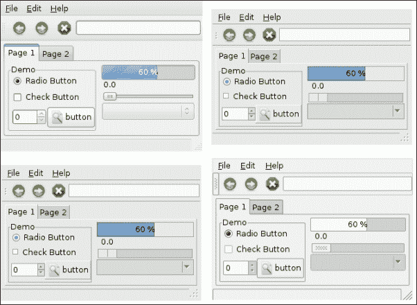

## Openbox 配置管理器

Openbox 是与 Raspbian 一起捆绑的默认窗口管理器。窗口管理器负责桌面环境中窗口的布局和外观。

你还可以通过**Openbox 配置管理器**自定义桌面，它位于**偏好设置**中。

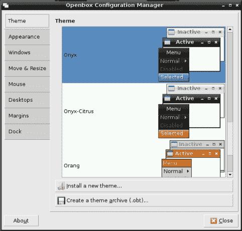

Openbox 配置管理器

你可以在 Raspberry Pi 上安装任何为 Openbox 设计的主题。系统预装了许多不同的主题供你选择，或者你可以从互联网上下载许多主题。你可以下载主题的网站之一是 [`box-look.org/`](http://box-look.org/)。

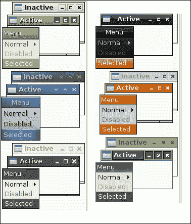

不同 Openbox 主题的示例

使用**Openbox 配置管理器**，你还可以自定义 Raspberry Pi 桌面的许多其他部分，从窗口标题的显示方式到窗口大小调整方式。

查看你可以自定义桌面的所有方式的最佳方法就是试试看！

## 更改默认背景图片

你的 Raspberry Pi 桌面背景可以轻松自定义。要做到这一点，只需右键单击桌面上的空白区域以弹出菜单：

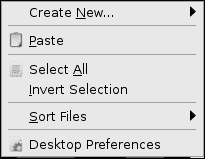

桌面上下文菜单

从菜单中选择**桌面偏好设置**；这将打开**桌面偏好设置**菜单。

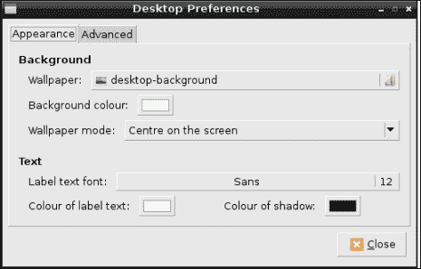

桌面偏好设置对话框

桌面偏好设置菜单让你可以自定义桌面上的各种内容。要更改背景图像，只需点击标有**壁纸**的选择框，然后选择你想要的图片。Raspbian 自带了几张图片供你选择，你也可以从互联网其他地方获取更多图片。

你可以更改桌面的背景颜色，并且通过更改**壁纸模式**和**背景颜色**来查看背景图片的显示效果。

## 自定义你的面板

面板是 Xfce 的一个非常棒的功能。面板可以添加到屏幕的任何部分，并且可以包含任意数量的面板项，面板项可以是从按钮到图表的任何东西。

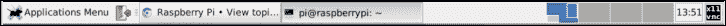

一个自定义的面板

### 添加新面板

默认情况下，屏幕底部有一个面板。你可以在任何位置添加任意数量的面板。但在添加过多面板之前要小心，因为过多的面板可能会导致 Raspberry Pi 变慢！

要添加一个面板，右键单击已经存在的面板上的空白区域，然后选择**创建新面板**。相应的对话框将会出现。

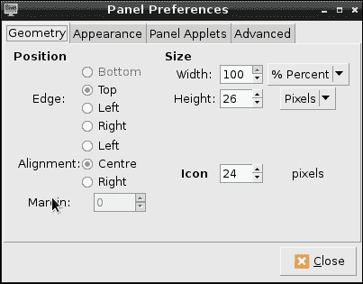

创建面板对话框

在这里，你可以配置新面板的几乎所有方面，包括位置、宽度和外观。你还可以添加面板项。当你点击**关闭**时，新的面板将出现，准备好让你添加面板项。

你可以通过右键单击你想要调整大小的面板，并选择**面板设置**来定制现有面板的大小和形状。这将弹出与之前相同的对话框。

### 添加和删除面板项

默认情况下，主面板上只有几个面板项。在 Xfce 中，默认提供了近二十种其他类型的面板项。将这些面板项添加到你的面板上非常简单。

要做到这一点，右键单击你想要添加面板项的面板，然后选择**添加/删除面板项**。

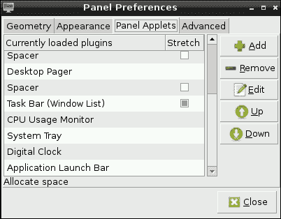

添加面板项

你可以添加的一些小部件包括音量控制、自定义菜单和一个空格器，帮助你布置面板上的所有项。

# 预安装的软件

Raspbian 默认安装了数百款免费的软件。这些软件包括计算器、网页浏览器、编程工具以及一些专业的科学应用程序。

你可以在桌面或主菜单中找到所有应用程序。

## 网页浏览器

在 Raspbian 默认安装了三款网页浏览器。它们分别是 Epiphany、Dillo 和 Netsurf。每款浏览器都针对不同的用途设计。此外，还可以在树莓派上安装一个称为 Ice Weasel 的 Firefox 版本，这将在《第六章》 *The Console* 中讨论。

### Epiphany

Epiphany（现在称为 Web）是一个免费、易于使用的网页浏览器，具有干净简约的用户界面。它使用 WebkitGTK+ 渲染引擎，类似于 Safari 和 Google Chrome 中使用的引擎。

它是一款快速、功能齐全的网页浏览器，支持 JavaScript 和所有现代网页标准。强烈建议将其作为您在树莓派上的首选网页浏览器。

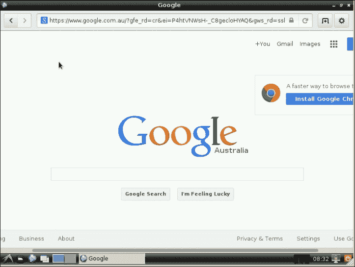

Epiphany 网页浏览器

### Dillo

Dillo 是一款小巧、快速、极简主义的网页浏览器，专为旧的、速度较慢的计算机或者像树莓派这样具有有限内存和处理能力的嵌入式设备设计。

Dillo 不支持 JavaScript 或任何其他类型的脚本。因此，它在浏览大多数现代网站时会遇到问题。不过，它是树莓派上速度最快的网页浏览器，强烈推荐用于浏览老旧网站。

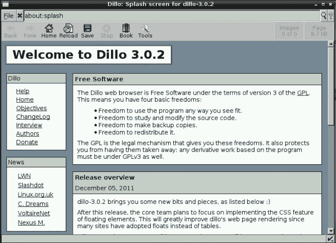

The Dillo web browser

## Netsurf

Netsurf 是另一个在 Raspbian 中包含的有趣的网页浏览器。Netsurf 独特之处在于它使用自己的渲染引擎称为 bespoke。

Netsurf 最初是为 RiscOS 开发的，但后来被移植到了许多其他老旧平台，如 AmigaOS 和 Haiku。Netsurf 还有另一个有趣的特点：它可以在没有任何其他图形支持软件（如 X11）的情况下运行。这使它非常适合用作极其安全的网页信息亭。

不幸的是，Netsurf 不支持 JavaScript，因此不适合浏览现代网站。已经计划在版本 4 中解决这个问题。

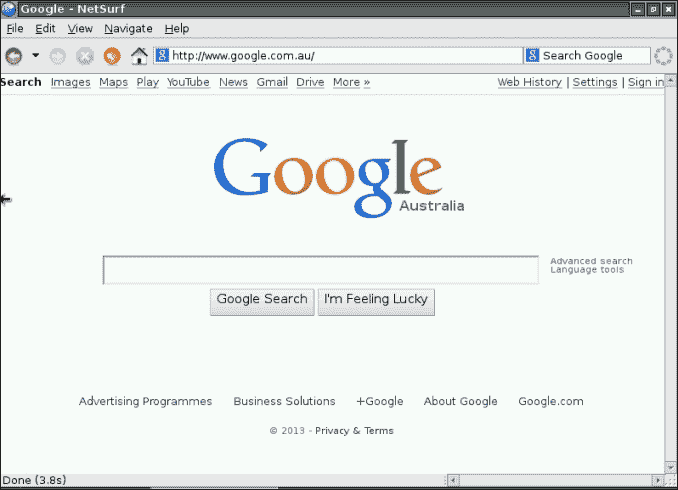

Netsurf 网页浏览器

## LXTerminal

LXTerminal 是 Xfce 默认附带的终端仿真器。LXTerminal 允许您在 Xfce 图形环境中运行控制台应用程序，并充当您与树莓派之间的桥梁，类似于 Xfce 的作用。我们将在接下来的章节中详细讨论如何使用 LXTerminal。

可以同时运行多个 LXTerminal 实例，这使您可以同时运行多个终端应用程序。这些实例可以在它们自己的窗口或选项卡中运行。

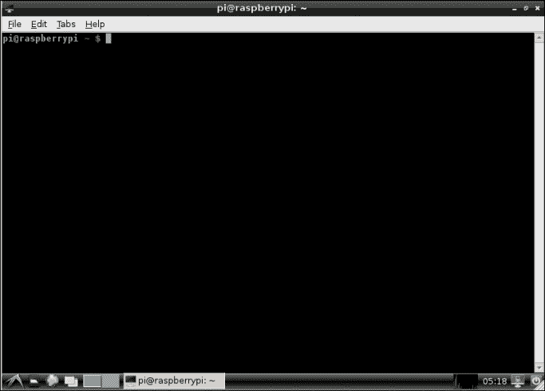

LXTerminal

### Sonic Pi

Sonic Pi 是包含在 Raspbian 中最令人兴奋的软件包之一。它是一款免费的音频合成器，允许用户使用编程语言创建音效。Sonic Pi 已经被用来创建许多惊人的音效。您未来可以期待听到更多关于它的消息！

它是为教师设计的，经过广泛的课堂试验，使其易于教学和使用。你可以通过访问[`sonic-pi.net/`](http://sonic-pi.net/)来听到 Sonic Pi 的实际演示。

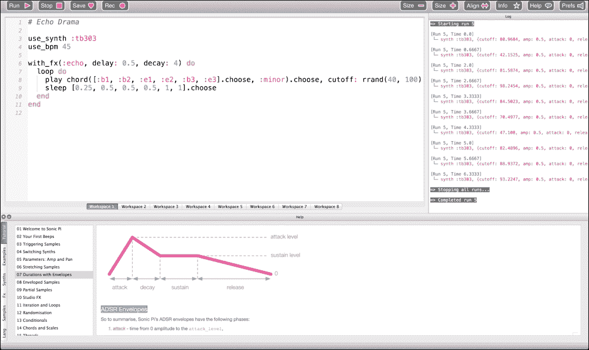

Sonic Pi 的实际演示

### Debian 参考

如前所述，Raspbian 基于 Debian 操作系统。预装在树莓派上的 Debian 参考应用程序是几乎涵盖操作系统每个部分的极佳参考指南。**Debian** **Reference**在网页浏览器中打开，内容长达数百页。它是免费分发的，非常值得阅读。

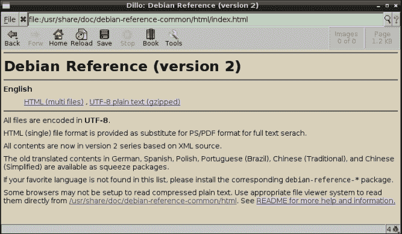

Debian 参考

### 集成开发环境

**IDLE**（**集成开发环境**）是一个简单的 Python 开发工具，专为 Python 编程设计。Python 是一种易学、高度可读、通用的编程语言。Raspbian 还包括 IDLE 3，这是一个支持更新版 Python 3 编程语言的 IDLE 版本。

IDLE 集成了编辑器、调试器和 Python shell，所有功能都在一个易于使用的应用程序中。IDLE 编辑器具有内置的语法高亮、自动补全和智能缩进功能。它与 Python 调试器集成，允许快速且简便的调试。

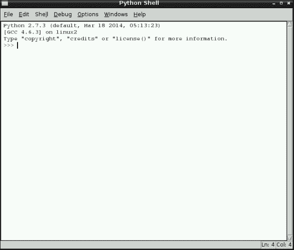

IDLE shell

一个不错的附加功能是，Raspbian 包括许多用 Python 编写的优秀游戏；你可以在`/home/pi/python_games`找到它们。只需在 IDLE 中打开它们并点击运行即可。

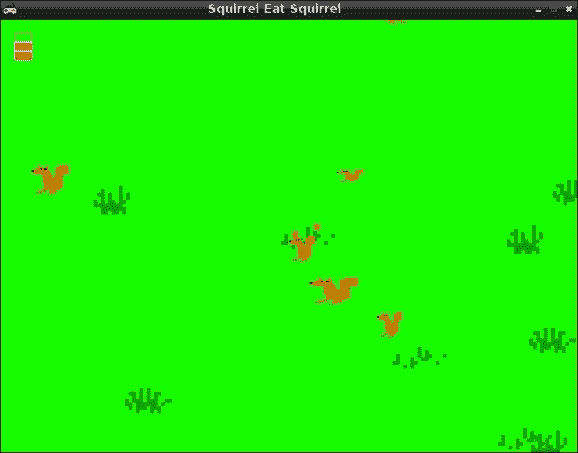

Python 游戏《松鼠吃松鼠》

### Scratch

继续关注树莓派基金会的教育重点，Scratch 是 Raspbian 中另一个令人兴奋的应用程序。Scratch 由 MIT 终身幼儿园小组于 2006 年创建。

Scratch 是一个易于使用的程序，具有图形化编程语言，允许你创建动画和游戏。它是一个事件驱动的编程语言，围绕精灵（精灵是一个图像）展开。精灵可以移动并响应事件。

精灵可以使用内置的绘图程序绘制，或者从任何图像导入到 Scratch 中。

在 Scratch 中编程非常直观。所有控制精灵的命令都被拖动到脚本中，并按需要的顺序排列。然后运行脚本，结果会立即显示出来。

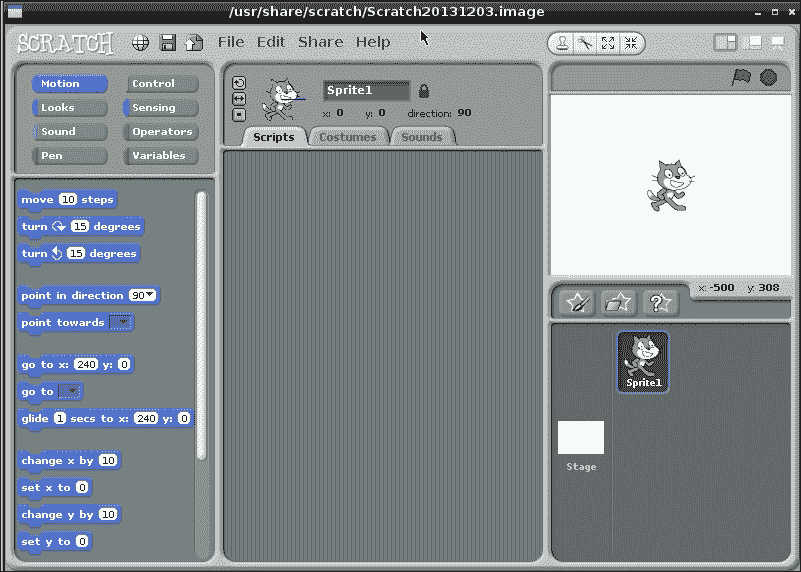

Scratch 主窗口

Raspbian 包括许多示例项目，作为创建你第一个动画的起点。超过 700 万个项目已在 Scratch 中创建，并上传到 Scratch 网站，与其他 Scratch 用户共享！

你可以通过访问[`scratch.mit.edu/`](http://scratch.mit.edu/)获取更多关于 Scratch 的信息。

### Minecraft Pi

Minecraft 是由瑞典公司 Mojang 于 2006 年创建的，是有史以来最畅销的游戏之一。

Minecraft 是一款沙盒独立视频游戏，最初由瑞典程序员 Markus Persson 创建，后来由瑞典公司 Mojang 发布。2014 年，微软以 25 亿美元收购了 Mojang。

Minecraft 的目标是打破和移动方块。这些方块可以排列成许多不同的形状。有一位用户甚至创造了星际迷航飞船的精确复制品。

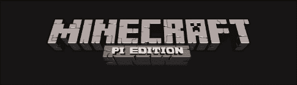

Minecraft Raspberry Pi 标志

Minecraft 几乎可以在所有平台上运行，包括 Xbox、PlayStation、iOS、Android、Raspberry Pi 等。它在 Raspbian 上是默认安装的。

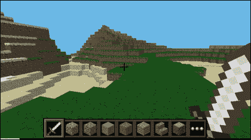

Minecraft 演示

### Pi Store

随着 Raspberry Pi 的成功，Raspberry Pi 基金会希望为由 Raspberry Pi 创造的应用、游戏、教程和工具提供一个中央平台。2012 年 12 月，Raspberry Pi 基金会创建了 Raspberry Pi 商店。

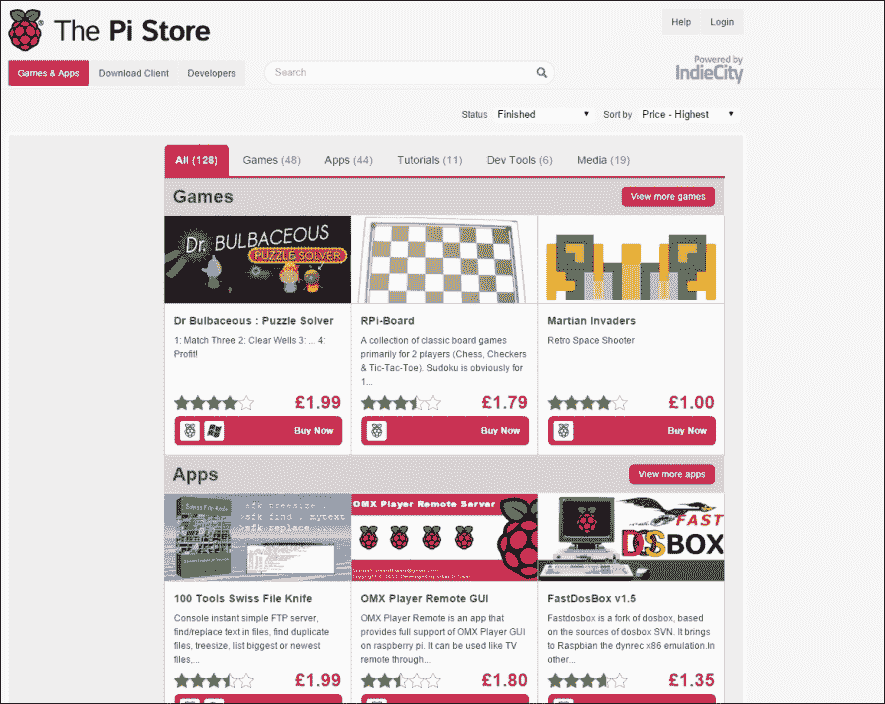

使用 Raspberry Pi 商店，你可以访问一个庞大的 Raspberry Pi 免费和商业软件集合。这些应用程序包括商店中提供的各种应用，从游戏、开发工具到教程等。

## Mathematica

Mathematica 是一款为科学、工程和数学计算设计的软件平台，并包括其编程语言 Wolfram。Mathematica 在教育领域得到了广泛使用。Mathematica 是一款商业产品，但 Raspberry Pi 基金会与开发 Mathematica 的公司 Wolfram Research 合作，将其与 Raspbian 一起捆绑发布。这是它第二次捆绑；第一次是在 1988 年，当时它与由 Steve Jobs 开发的 NeXT 计算机一起捆绑。

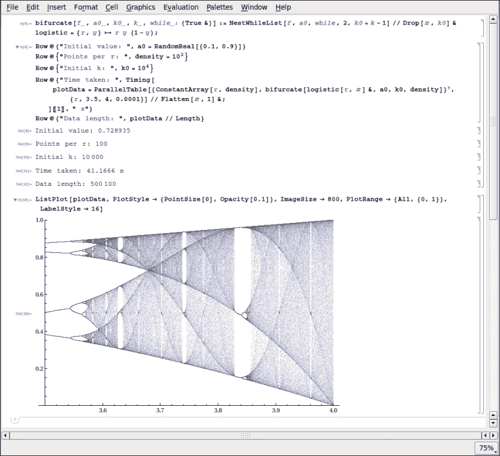

Mathematica

Mathematica 包括许多不同的功能，包括实现各种不同的算法、不同的数据可视化和数值运算。几乎所有的财富 500 强公司和主要大学都在使用它。它是科学、技术和商业发展的重要工具，也是许多诺贝尔奖得主科学家的重要工具。

### Raspbian 附带的其他软件

Raspbian 附带了许多其他软件，我们在这里没有讨论到。这些软件包括从计算器到简单的文本编辑器和图片查看器等。以下是内置计算器的示例：

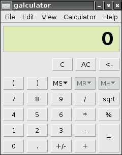

以下是 Leafpad 的示例——Raspbian 的文本编辑器之一：

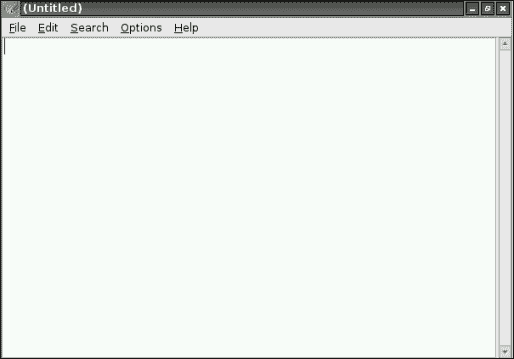

# Xfce 中的文件管理

Xfce 自带文件管理器。你可以用它浏览所有连接到 Raspberry Pi 的存储设备。你还可以执行各种文件管理操作，如复制和移动文件。

你可以通过文件管理器面板项启动文件管理器，也可以在主菜单中找到它。

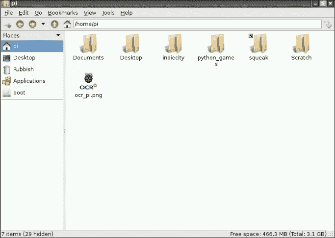

Xfce 文件管理器

任何附加到设备的存储设备都会出现在左侧的**位置**菜单中，便于访问。你还可以使用文件管理器访问存储在其他服务器上的文件。这是通过**前往**部分中的**网络驱动器**菜单实现的。

你的树莓派桌面实际上只是树莓派上的另一个文件夹。因此，你可以通过删除或移除图标来进行自定义。你还可以创建新的文件夹和文件，这些文件会保存在桌面上，方便查找。

# 总结

Raspbian 桌面是一个简单、易用的桌面环境。它与典型的 Windows 和 Mac OS X 桌面环境有很大的不同，但正如你所发现的，它既强大又易于使用。

了解 Raspbian 桌面最好的方式就是开始探索。记住，如果你弄坏了什么，所需要做的就是重新写入镜像到卡上，然后你就可以重新开始了！
