# 第五章：在 Raspbian 上安装软件

操作系统的主要功能是提供一致的软件平台，无论底层硬件如何。一旦操作系统安装完成，就可以通过许多其他软件包来扩展它。

Raspbian 是一个基于 Linux 的操作系统的良好示例。由于 Raspbian 基于 Debian，它可以访问其庞大的软件仓库。Raspbian 最初可以访问 Debian 仓库中的超过 35,000 个不同软件包，但这个数字还在不断增长。

基于 Debian Wheezy 的 Raspbian 并不正式支持 Raspberry Pi 上的旧版 ARMV6 CPU。在 2012 年 Raspbian 初期开发过程中，开发人员花费大量时间将 Debian 仓库中的庞大软件集合重新编译为 ARMv6K 架构，以最大化 Raspberry Pi 的性能。

本章将介绍几种在 Raspberry Pi 上安装软件的方法。

# Linux 中的软件包管理

有许多不同的工具可用于管理 Linux 发行版上的软件，其中一些包括 APT 和 RPM 包管理器。

Raspbian 使用高级包装工具，也称为 APT。APT 处理任何软件包的依赖关系。软件包的安装和卸载由一个名为 dpkg 的应用程序处理。这是安装任何软件到你的 Raspberry Pi 上的推荐方式。Raspbian 的每个部分都打包成一个软件包。

APT 可以自动从预配置的仓库中下载你想要安装的软件。仓库是一个包含已编译软件的集合，可以进行安装。这些仓库会根据你的地理位置自动选择，以最大化下载速度。它还会自动处理 Raspberry Pi 上所有已安装软件包的更新。APT 于 1998 年首次发布，通常被誉为 Debian 最佳特性之一。

# 安装软件的方法

有几种不同的方法可以在 Raspberry Pi 上安装软件，包括：

+   apt-get

+   图形用户界面包管理器

+   Aptitude

+   Raspberry Pi 商店

+   源代码

所有这些方法，除了从源代码安装之外，都使用 APT 和 dpkg 来安装软件包。

## dpkg

dpkg 是 Raspbian 软件包管理系统的核心软件应用程序。它是一个工具，实际上是从 `.deb` 文件中安装软件包。

一个 `.deb` 文件包含三部分内容：

+   一个包含安装软件包所需版本的 dpkg 的 Debian 二进制文件

+   一个控制档案，包含安装该软件包所需的所有信息

+   一个包含实际软件本身的数据档案

dpkg 会读取 `.deb` 文件并确定是否已安装所有必需的软件。如果所需的软件尚未安装，它会告诉你所需的软件。

## APT

APT 是一个前端工具，使得使用 dpkg 更加简便。它预先配置了多个软件源，其中包含了 Raspberry Pi 上所有可以安装的官方软件包。

这些软件源根据每个软件包包含的软件类别被分为多个不同的存档或组。添加其他第三方软件源也非常简单。

### main 存档

`main` 存档包含了构成 Raspbian 发行版的所有软件。如果包不在这个存档中，就不被视为 Raspbian 发行版的一部分。这个存档中的所有包都不依赖于任何外部软件。Debian 项目要求该存档中的所有包必须是自由的，且可以自由分发、修改和共享。这个存档中的软件得到 Debian 项目的支持。

### contrib 存档

任何依赖于 `main` 存档中没有的其他软件包的包都包含在 `contrib` 存档中。`contrib` 存档中可能还包含包装器包和与非自由软件一起工作的其他自由软件。

### non-free 存档

任何不符合 Debian 项目自由软件指南的软件都包含在 `non-free` 存档中。其他有可能影响其自由分发的软件也包含在此存档中。

### 包验证

官方的 Raspbian 软件源通过数字签名进行签名，以确保在下载时软件包不会损坏。这是通过使用公钥加密和数字证书来证明软件包来自它所声称的来源。

# 使用终端

在 Raspberry Pi 上安装软件的最常用方法是使用 `apt-get`。它是一个非常强大的命令行工具。

要运行 `apt-get`，你需要使用命令行工具。该命令行工具通过一个默认安装在 Raspbian 中的应用程序提供。这个应用程序叫做 LXTerminal。

你可以通过双击桌面上的图标来启动 LXTerminal。

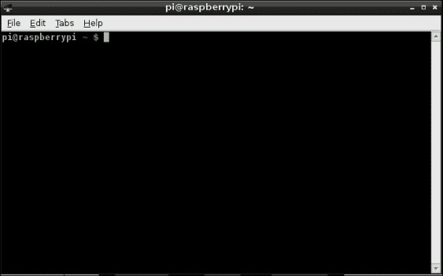

LXTerminal

LXTerminal 允许你使用 bash 命令行（以及其他命令行，如果需要）运行命令。你将在第六章中了解更多关于 bash 命令行的内容，*终端*。

通常，每个命令都在一行内运行。当你输入完命令后，只需按下 *Enter* 键来执行它。程序的输出将显示在接下来的几行中。如果你想重新运行或修改刚输入的命令，只需按键盘上的上箭头键，你将看到之前的命令再次显示。然后你可以通过再次按 *Enter* 键来编辑并运行它。

### 提示

别忘了，Linux 是区分大小写的，因此 `Apt-get` 命令不起作用，但 `apt-get` 命令有效！

Linux 是一个本质上安全的操作系统。本章的大多数命令需要管理员权限。判断是否需要 root 权限非常简单。如果需要，你会看到如下信息：

```
E: Could not open lock file /var/lib/dpkg/lock - open (13: Permission denied)
E: Unable to lock the administration directory (/var/lib/dpkg/), are you root?

```

要以系统管理员身份运行命令，只需将其添加到任何需要运行的命令的开头：

```
sudo

```

根据你是否设置了密码，你可能会被要求输入密码。运行`apt-get`非常简单，只需键入`apt-get`并按*Enter*键：

```
apt-get

```

`apt-get`命令将返回有关不同选项的大量信息。我们感兴趣的选项有：

+   `apt-get update`

+   `apt-get install`

+   `apt-get remove`

## apt-get update

我们首先要做的是确保 Raspbian 知道软件的最新版本是什么。`apt-get update`命令会自动连接到 Raspbian 仓库，并下载最新的软件包列表。

如果你最近没有运行过，建议在安装任何软件之前先运行`apt-get update`命令。

## apt-get install

当你运行`install`命令时，apt 包管理系统的真正威力显现出来。为了在你的 Raspberry Pi 上实际安装软件包，你需要运行`apt-get install`，后面跟上软件包的名称。

考虑以下命令：

```
sudo apt-get install apache2

```

该命令将安装 Apache2 网络服务器。这是世界上最流行的网络服务器之一，在编写本书时，其市场份额为 59%。Apache2 非常强大，但根据其配置，可能会相当占用资源。

你在控制台中会看到类似于下图所示的内容：

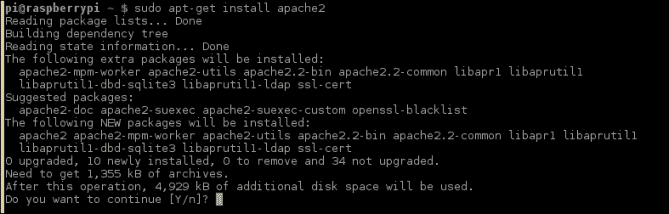

使用 apt-get install 安装 Apache2

`apt-get`命令会自动连接到互联网并下载`Apache2`包以及 Apache2 操作所需的所有包。你可能会被要求确认是否继续安装软件。只需按*Y*键，然后按*Enter*键。软件包安装并配置完成后，你的新软件就准备好使用了！

有许多可用的包来扩展 Apache2 的功能。这些包默认并不会安装。如果你需要安装这些附加包，你需要手动安装它们。

有一些可以安装的包，称为元包。这些包代表了一组功能特定的包，可以为你的 Raspberry Pi 添加特定功能。例如，如果你使用的是一个基于 Raspbian 的发行版，并且没有包含图形用户界面，你可以通过安装一个元包一次性安装这个界面。这些包的行为与普通包相同，但实际上它们是多个不同包的集合。你还可以使用*通配符来表示多个字符。要安装所有可用的 PHP 包，你可以运行以下命令：

```
sudo apt-get install php-*

```

## apt-get remove

有时候，你可能会想卸载一些已经安装但不再需要的软件包。卸载软件包和安装一样简单。你只需使用`apt-get remove`命令。

运行以下命令：

```
sudo apt-get remove apache2

```

你应该会得到类似这样的输出：

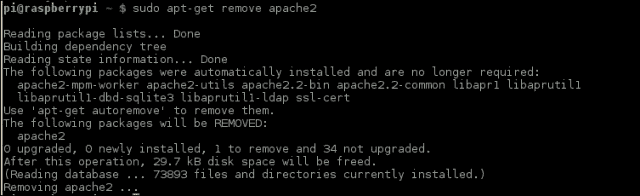

使用 apt-get remove 卸载 Apache2

### 提示

如果你想玩得开心，可以试试运行`apt-get moo`！

## 搜索软件包

使用`apt-get`可以安装的包种类繁多，可能很难找到你想要安装的软件包。幸运的是，查找可以安装的软件包非常简单。你只需使用`apt-cache search`工具进行搜索。

以我们使用`Apache2`软件包的示例为例，你可以通过运行以下命令查看`Apache2`软件包的其他扩展：

```
sudo apt-cache search apache2

```

`apt-cache search`工具将列出所有描述中提到`Apache2`或依赖`Apache2`的软件包。

# Synaptic 图形界面软件包管理器

在树莓派上安装软件有多种方式。使用`apt-get`是一种方法。另一种方法是使用图形界面工具，比如**Synaptic 软件包管理器**。不幸的是，它并没有默认安装在 Raspbian 中，但可以通过`apt-get`轻松安装。

要安装 Synaptic，可以在 LXTerminal 中运行以下命令：

```
sudo apt-get install synaptic

```

Synaptic 的安装在树莓派上需要几分钟，因为它是一个相对较大的应用程序。你可以在主菜单的**其他**子菜单中找到**Synaptic 软件包管理器**。

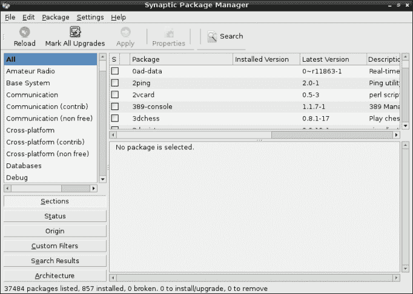

Synaptic 软件包管理器

## 在 Synaptic 中搜索和安装软件包

你可以通过搜索按钮在 Synaptic 中查找软件包：

1.  只需点击**搜索**按钮并输入你要查找的软件包名称。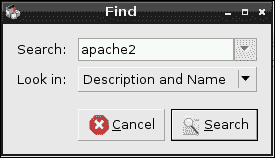

    搜索软件包

1.  点击**搜索**后，系统将显示所有符合搜索条件的软件包。只需勾选你想要安装的软件包并选择**标记为安装**。你可以选择任意多个软件包。

    软件包也会按类别在左侧进行组织。这是查找你所需软件包的一种非常简单的方式。

    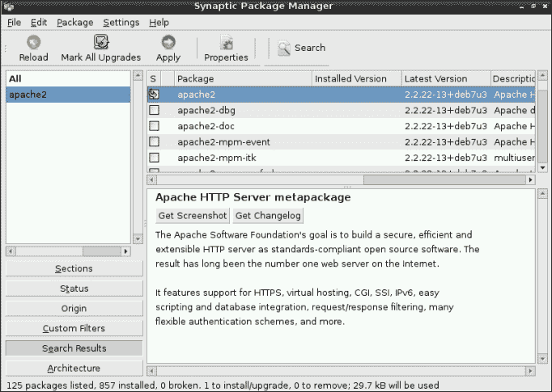

    选择软件包

1.  当你点击**应用**时，Synaptic 会要求你确认是否要安装已选择的软件包。点击**应用**后，软件包将开始安装。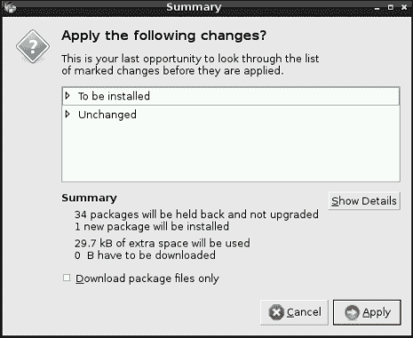

1.  包安装可能需要几分钟时间，具体取决于你安装的包。可以通过选择**详细信息**来跟踪安装进度。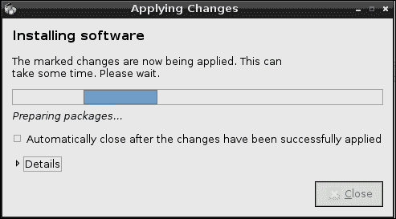

    Synaptic 安装 Apache2 网页服务器

## 使用 Synaptic 卸载软件包

使用 Synaptic 卸载包与安装包非常相似：

1.  如果你想卸载一个之前安装的软件包，你需要搜索它。你还可以通过选择左侧的**状态**过滤器来查看已安装的所有软件包。这会让你看到一个已安装软件包的列表。默认的 Raspbian 配置中安装了超过 850 个软件包，所以搜索会更快捷。

1.  一旦你找到了想要卸载的包，简单地点击复选框并选择 `标记为删除`。

1.  当你完成选择要删除的包后，点击**应用**。

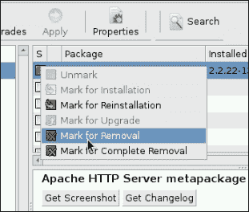

使用 Synaptic 移除包

# Pi Store

**Pi Store** 是另一个可以用来在树莓派上安装软件的工具。Raspbian 默认安装了树莓派商店，可以通过桌面上的**Pi Store**图标打开。**Pi Store** 将大多数可安装在树莓派上的最佳软件聚集在一个地方。


Pi Store

**Pi Store** 是你树莓派上唯一一款实际销售商业软件和其他内容的软件。为了能够从 Pi Store 购买非免费软件，你需要注册并提供支付方式，比如信用卡。

**Pi Store** 非常易于使用：

1.  只需找到你想安装的软件，点击**立即购买**。

1.  使用你的账户登录，然后开始吧！

**Pi Store** 会自动处理所有已购买软件的更新。

# 从源代码安装软件

所有的软件程序都是由不同的文件构建的。这些文件称为源代码，并且是用编程语言编写的。在 Linux 上最常用的编程语言是 C 和 C++。

你可能有很多理由想要下载并安装作为源代码分发的软件。以下是其中的一些原因：

+   软件在 Raspbian 仓库中不可用。

+   软件的最新版本不在 Raspbian 仓库中。

+   软件中的功能在 Raspbian 仓库中的包中不可用。

从源代码安装软件有一些缺点，以下是几个例子：

+   对于从源代码安装的任何软件包，更新不会自动安装。

+   安装软件需要额外的软件来进行编译和安装。通常，这个软件是 `build-essential` 元包。

+   根据软件的复杂性，编译和安装软件可能需要很长时间。

如果你找到了一个你想在树莓派上下载并安装的软件包，首先需要确保你已经安装了构建该应用所需的所有工具：

1.  安装 `build-essential` 包后，你可以安装最常用的工具：

    ```
    sudo apt-get install build-essential

    ```

    这将安装你需要的所有软件工具，用于编译大多数 C 和 C++应用程序，包括 make 应用程序以及 gcc 和 g++编译器。

1.  现在你需要下载你想要安装的应用程序。在这个示例中，我们将使用 Apache2 Web 服务器。你可以从[`apache.mirror.serversaustralia.com.au//httpd/httpd-2.4.10.tar.bz2`](http://apache.mirror.serversaustralia.com.au//httpd/httpd-2.4.10.tar.bz2)下载 Apache2。

1.  你可以使用网页浏览器下载源代码。另一种下载代码的简便方法是使用 wget 应用程序。它会自动下载文件并将其存储在你的树莓派中：

    ```
    wget http://apache.mirror.serversaustralia.com.au//httpd/httpd-2.4.10.tar.bz2

    ```

    一旦你在树莓派上下载了源代码，就需要从归档中提取软件。归档文件只是一个包含许多其他已压缩文件的文件，以便于分发。

1.  要提取`.tar.bz2`归档（例如 Apache2 应用程序），运行以下命令：

    ```
    tarxvfhttpd-2.4.10.tar.gz

    ```

    具体命令会根据你要安装的软件有所不同，但通常与你刚才使用的命令非常相似。

这些命令将解压`Apache2`归档中的所有文件，并将它们放入一个包含整个`Apache2`源代码的文件夹中。

几乎所有你下载的软件包都会包含一个文件，叫做`README.md`。这个文件通常包含你需要遵循的安装和构建软件的说明。

以下是你需要遵循的正常软件包构建过程：

+   `./configure`

+   `make`

+   `make install`

这些命令执行了很多过程。我们从`./configure`开始。`./configure`命令是一个脚本，它生成一个`MakeFile`文件，用于`make`编译软件。这个`MakeFile`文件是根据你的树莓派进行定制的。它还会告诉你是否需要安装其他依赖项，以便能够构建软件。

`make`命令是将软件从源代码编译成你可以在树莓派上运行的应用程序的命令。这个编译过程会显示很多信息，进度可能需要相当长的时间。Linux 内核的编译可能需要超过半小时，所以最好去泡杯咖啡！

应用程序编译完成后，你需要安装它们。幸运的是，大多数应用程序都包含一个安装脚本，能够为你完成这一步。只需运行`make install`！

### 提示

只需记住，这些说明是通用的，某些软件包可能需要不同的安装方式。

# 安装更新

Raspbian 持续开发中，不断发布包含修复、新特性和安全改进的更新。强烈建议你安装所有可用的更新。你可以通过多种方式做到这一点，包括使用`apt get`和 Synaptic。

## 使用 apt-get 安装更新

`apt-get` 命令可以用来更新 Raspberry Pi 上的软件。你需要做的第一件事是让 `apt-get` 获取所有可以安装的软件包列表：

```
sudo apt-get update

```

这个命令可能需要几分钟，具体取决于你的网络连接。要执行软件包升级，你需要运行以下命令：

```
sudo apt-get upgrade

```

此命令将从 Raspbian 软件库下载并安装你 Raspberry Pi 上的所有最新软件包。这样，你的设备就完全更新了！

## 使用 Synaptic 安装更新

更新也可以通过**Synaptic 软件包管理器**安装：

1.  这可以通过选择**刷新**按钮来完成。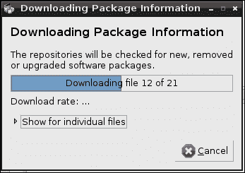

    使用 Synaptic 刷新可用的软件包

1.  一旦软件包列表刷新完成，点击**标记所有升级**。

1.  系统会要求你确认要升级的软件包。只需选择**标记**，然后点击**应用**，所有软件都会更新到最新版本。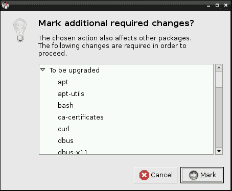

    选择要升级的软件包

# 你可以安装的其他软件

默认的 Raspbian 安装中只能安装这些软件。Raspbian 中包含的大多数软件面向教育市场。因此，你的 Raspberry Pi 上没有预装很多生产力软件。幸运的是，这很容易解决！

## LibreOffice

LibreOffice 是一个免费的完整办公套件，包含许多与 Microsoft Office 类似的功能。它由多个应用程序组成，并可通过 Raspberry Pi Store 安装。


以下是其中一些应用程序：

| 图标 | 名称 | 描述 |
| --- | --- | --- |
|  | Writer | Writer 是一个完整的文字处理器，功能类似于 Microsoft Word。 |
|  | Calc | Calc 是一个电子表格应用程序，具有许多功能，包括图表。 |
|  | Impress | Impress 是一个设计用于创建演示文稿的应用程序。 |
|  | Base | Base 是一个类似于 Microsoft Access 的数据库应用程序，允许你创建简单的数据库应用。 |

LibreOffice 中还有许多其他未提及的应用程序。查看所有功能的最佳方法是下载 LibreOffice 并试一试！你可以在 [www.libreoffice.org](http://www.libreoffice.org) 找到更多信息。

## IceDove 电子邮件客户端

另一个重要的生产力工具是 Raspberry Pi 的 IceDove 电子邮件客户端。IceDove 是流行的 Thunderbird 电子邮件客户端，由于与 Thunderbird 和 Firefox 徽标的版权问题，Debian 对其进行了品牌重塑。

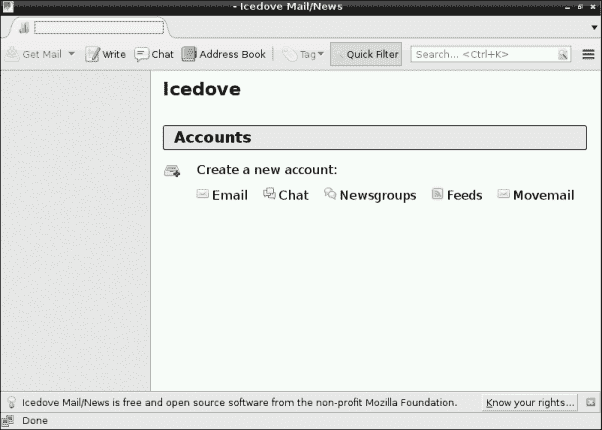

IceDove

IceDove 是一个优秀的电子邮件客户端，强烈推荐使用。您可以通过运行以下命令安装 IceDove：

```
sudo apt-get install icedove

```

## IceWeasel

另一个优秀的应用程序是 IceWeasel 网络浏览器。

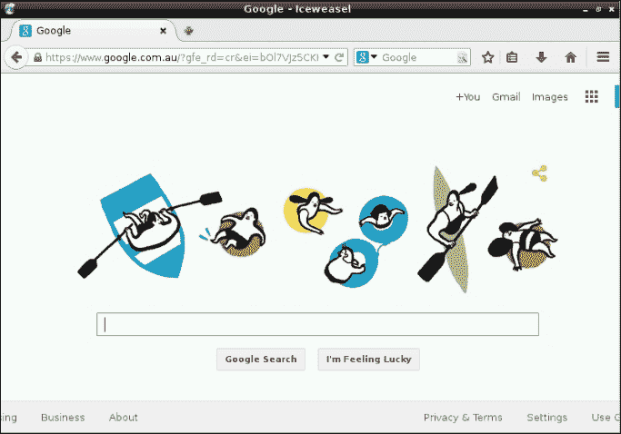

IceWeasel

IceWeasel 是 Firefox 的重新品牌化版本，支持您从现代网络浏览器中期待的所有功能。

您可以通过运行以下命令安装 IceWeasel：

```
sudo apt-get install iceweasel

```

# 总结

在本章中，您学习了几种在树莓派上安装软件包的方法，以及您可以使用的一些工具。由于庞大的 Debian 仓库和基于 Linux 的操作系统（如 Raspbian）的开源特性，树莓派上有非常多样化的软件可供选择。现在您已经知道如何在这台设备上安装软件，接下来只需开始寻找您所需要的内容。
