# 第六章 控制台

在基于 Linux 的操作系统（如 Raspbian）的漂亮图形界面背后，是控制台。

控制台是与 Raspbian 操作系统内部进行通信的最基本方式。控制台的历史可以追溯到计算机的起源，那时与计算机的接口是键盘和打字机。那时，操作员会输入一个命令，结果会显示在他们面前。


打字机

幸运的是，随着计算机显示器的发展，我们不再需要打字机与计算机进行通信，且现在有许多不同的方式可以做到这一点。你已经学会了如何使用 Raspberry Pi 的图形用户界面 Xfce，本章将向你介绍如何使用内置的控制台终端应用程序 bash。

# Bash

**Bourne again shell**（**bash**）是一个由 GNU 项目开发的控制台 shell，于 1989 年发布。最初由 Brian Fox 编写，它已经成为事实上的标准，并在几乎所有 Linux 操作系统、OS X、Novell NetWare、Android 以及 Windows 中默认使用。bash 的灵感来源于 `sh` shell，在 bash 创建时，`sh` shell 非常流行。

bash shell 是作为 Bourne shell 的开源替代品编写的，而 Bourne shell 是 Unix 的默认命令行解释器。bash 支持许多功能，包括命令和文件名通配符的自动补全。

# 启动 bash 命令解释器

bash 命令解释器在 Xfce 环境中通过 LXTerminal 应用程序提供给我们。其他终端客户端如 Yakuake 可以通过 `apt-get` 安装。如果你已将 Raspbian 配置为不启动 Xfce 桌面环境，bash 会在你登录后自动启动。

你可以通过双击桌面上的图标来启动 LXTerminal。

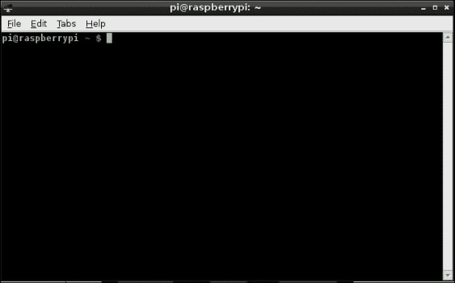

LXTerminal

你可以根据需要启动并运行任意数量的 LXTerminal 实例，但别忘了你的 Raspberry Pi 并没有无限的资源。

### 注意

如果你没有使用 Xfce 桌面环境，当你登录时会启动 bash。

你首先会注意到你有一个命令提示符。默认情况下，这个命令提示符会显示你正在工作的当前目录、你的 Raspberry Pi 主机名（默认为 `raspberrypi`）和你的用户名（默认为 `pi`）。

当你在文件系统中移动时，你会看到你所在目录的名称。

要使用 bash 命令解释器运行命令，只需输入命令并按下 *Enter* 键。命令会运行并显示结果。在命令运行时，直到它完成，你无法运行其他命令。

### 提示

如果你希望让某个命令在后台运行，只需在命令的末尾添加`&`运算符。这将使命令在后台运行。

Linux 是一个完整的多处理系统，你可以运行任意数量的 LXTerminal 实例。要查看树莓派后台正在运行的处理命令，只需运行`ps –a`。

# 基本的 bash 命令

学习 bash 的最佳方法就是开始使用它。记住，如果你真的弄砸了事情，所需做的只是重新镜像你的 SD 卡，然后就能继续使用了！

获取本章中提到的任何命令的更多信息是很容易的。你可以通过使用`man`命令来做到这一点。

`man`命令启动 Linux 内置的文档系统。几乎每个可用的命令都有相应的文档在 man 系统中。

例如，要获取关于`ls`命令的更多信息，只需运行以下命令：

```
man ls

```

这将启动`man`程序并显示你需要了解的关于`ls`程序的所有信息。

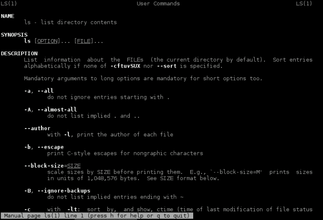

man ls 命令

要在`man`程序中浏览，你可以使用键盘上的箭头键。如果你希望跳过整页内容，可以按空格键。当你读完信息后，可以按*q*键退出。

### 提示

别忘了，Linux 是区分大小写的操作系统，在运行命令时使用正确的大小写非常重要。

# 命令的自动补全

bash 的一个最有用的功能是它能够自动完成你正在输入的命令名称。这就像按下*Tab*键一样简单。

例如，如果你想运行命令`nano`以启动 nano 文本编辑器，只需键入以下命令：

```
nan

```

现在按下*Tab*键。bash 将自动完成命令并显示如下内容：

```
nano

```

这可以节省大量时间。如果有多个自动补全的组合，你需要按下*Tab*键两次。这将导致 bash 列出所有不同的可能性。

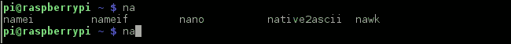

bash 的自动补全系统

# 以 root 身份运行命令

Linux 本身是一个安全的操作系统。操作系统的每一部分都默认配置为安全。每个文件都由特定用户拥有，该用户可以为该文件分配权限，以限制其他用户和组访问该文件。

默认情况下，在 bash 中运行的所有命令都是作为当前用户运行的。当前用户通常是 Pi 用户。此用户是标准用户，这意味着你无法运行可能影响其他用户的命令，例如安装软件或更改你的树莓派的网络配置。

幸运的是，作为 root 或超级用户运行命令很容易。这个用户可以无限访问操作系统的所有部分，但必须小心使用。

要以超级用户身份运行命令，你可以使用`sudo`工具。`sudo`工具让你可以以不同于当前登录用户的身份运行命令。

为了使用`sudo`工具以 root 身份运行命令，你只需要在想要运行的命令前加上`sudo`。

以下是一个命令的例子：

```
sudo apt-get moo

```

它将以 root 身份运行`apt-get`应用程序。这个特定的命令会触发`apt-get 复活节彩蛋`，证明计算机程序员有时也有幽默感！


作为 root 用户运行命令，甚至能让你的树莓派发出“哞”声！

# 使用 bash 在文件系统中移动

使用命令解释器（如 bash）的最基本部分是能够在 Linux 文件系统中移动。理解 bash 如何表示目录是很重要的。bash 有两种不同的方式来表示目录：使用**绝对路径**和**相对路径**。

## 绝对路径

绝对路径是从`/`（根目录）开始描述文件或文件夹位置的路径。它容易识别，因为它总是以`/`开头。

绝对路径的一个例子是`/home/pi/Desktop`。这个路径是包含你桌面上所有项目的文件夹。

## 相对路径

相对路径是基于你在文件系统中的位置描述文件或文件夹的路径。

相对路径的一个例子是`../Desktop`。这意味着一个名为`Desktop`的文件夹存储在上一级目录中。

在 bash 中有几个你应该了解的特殊路径，如下所示：

| 路径 | 描述 |
| --- | --- |
| `/` | 这是 Linux 文件系统的根目录，是你能拥有的最高路径。 |
| `./` | 代表你当前所在的目录。 |
| `../` | 这是你所在目录的上一级目录。 |
| `~` | 代表你的主目录。当你以 Pi 用户身份登录时，这将是`/home/pi`。如果你以 root 身份运行命令，这将是`/root`。 |

### 提示

如果你没有带有*~*键的键盘，你可以按*F12*键代替。

# 操作文件

现在你已经了解了路径在 bash 中的表示方式，是时候学习如何操作它们了。

有许多命令可以用来操作 bash 中的文件，包括以下表格中的命令：

| `ls` | `cd` | `pwd` | `cat` | `head 和 tail` |
| --- | --- | --- | --- | --- |
| `cp` | `mv` | `rm` | `mkdir` | `touch` |
| `adduser` | `addgroup` | `passwd` | `chmod` | `chown` |

## ls

`ls` 可能是最常用的基础功能，经常用来查看当前目录下存在哪些文件。你可以使用列表命令（`ls`）来完成此操作。默认情况下，显示的是你当前所在的文件夹。如果你想查看其他文件夹的内容，只需在`ls`命令后加上路径。

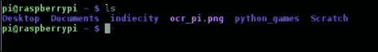

主目录的内容

### 提示

`ls` 不会显示以（`.`）开头的文件或文件夹。这是因为任何以（`.`）开头的文件或文件夹都是隐藏的。

`ls`命令有很多不同的选项，这些选项会改变屏幕上的输出。一些常用的`ls`参数如下：

| 选项 | 描述 |
| --- | --- |
| `-a` | 显示隐藏的文件和文件夹 |
| `-l` | 使用长列表格式。这将显示文件大小、文件权限和文件的所有者 |
| `-h` | 以人类可读的格式显示所有文件的大小 |

## cd

Linux 文件系统由许多不同的文件和文件夹组成。在使用 bash 时，能够在文件系统中移动非常重要。这是通过使用`cd`（更改目录）命令来完成的。

`cd`命令使用起来很简单。只需要运行`cd`命令并加上你想要切换到的文件夹路径，无论是绝对路径还是相对路径，都能改变当前目录。

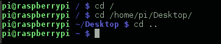

在目录之间切换

运行`cd`后，你所在的目录称为当前工作目录。除非你特别指定，否则 bash 会在当前工作目录中查找你运行的任何命令和使用的任何文件。如果命令不在当前文件夹中，bash 将会在其他几个预定义的文件夹中查找命令。这些文件夹在 bash 的`PATH`环境变量中指定。

## pwd

有时候，在浏览 Linux 文件系统时，你可能需要知道自己当前所在的目录。你可以使用`pwd`（打印工作目录）命令来查看。

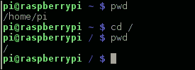

pwd 命令

## cat

当你需要快速查看文件内容时，`cat`命令非常方便。运行`cat`命令并加上文件名后，它会在屏幕上显示该文件的内容。

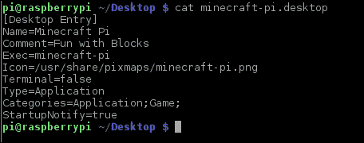

cat 命令

`cat`命令有几个选项，可以用来定制文件在屏幕上的显示格式。以下是一些`cat`命令的参数：

| 选项 | 描述 |
| --- | --- |
| `-n` | 显示文件中的行号 |
| `-E` | 在每行的末尾添加**$**，这样你可以看到行的结束位置 |

### 提示

记住，Linux 中的一切都是文件。你可以使用`cat`命令读取来自树莓派设备的数据，包括它的串口和摄像头。通过运行`cat /dev/video0 > video.record`，你可以录制摄像头输入的视频。

## head 和 tail

另一个实用的命令是 `head` 和 `tail`，它们可以用来查看文件的内容。`head` 和 `tail` 是一对命令，分别显示文件的开头和结尾。`head` 命令非常有用，如果你想查看一个大文件是否是你要找的文件，而且文件太大，无法使用 `cat` 显示时。`tail` 命令在查看日志文件中的最后几条记录时非常方便。

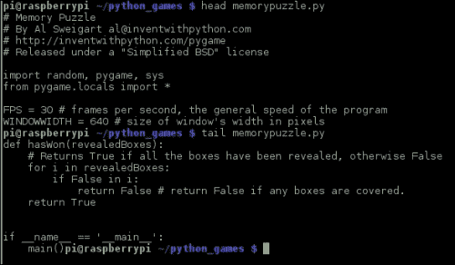

head 和 tail 命令

`head` 和 `tail` 命令有许多不同的选项，你可以用它们来定制文件在屏幕上的输出格式。最重要的是 `–n` 选项。`–n` 选项后面跟一个数字，将显示文件的 *n* 行。你可以通过运行 `man head` 或 `man tail` 来查看其他选项。

## cp

`cp` 是 bash 中另一个重要的命令。`cp` 用于将文件或文件夹从一个文件夹复制到另一个文件夹。默认情况下，`cp` 会覆盖目标文件夹中已经存在的文件，所以要小心！

使用 `cp` 时，你需要首先指定你想复制的文件或文件夹，然后指定目标文件夹。如果你选择一个目录，它只会复制这个目录。如果你想复制目录的精确副本，则需要使用 `–r` 命令。`–r` 命令会递归地复制文件夹。

基本上，这个命令的作用是创建你正在复制的文件夹的精确副本，因此每当你复制目录时，你很可能会使用这个选项。

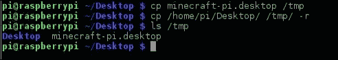

复制文件和文件夹

`cp` 命令有许多不同的选项，可以改变它复制文件或目录的方式，如下表所示：

| 选项 | 描述 |
| --- | --- |
| `-r` | 递归地复制文件或目录 |
| `-f` | 如果目标目录中的现有文件无法打开，则删除该文件并重新复制 |
| `-p` | 保留正在复制的文件的所有者和时间戳 |
| `-v` | 启用详细模式，显示正在复制的文件名 |

## mv

有时候，你并不想复制文件或目录，而是想要移动它们。`mv` 命令正是用来做这件事的。它的语法与 `cp` 的语法完全相同。要移动文件或文件夹，只需按照以下截图操作：


移动文件

与 `cp` 不同，`mv` 会自动移动整个文件或文件夹，并且没有 `–r` 选项。`mv` 有若干其他选项，如下所示：

| 选项 | 描述 |
| --- | --- |
| `-f` | 覆盖目标位置的所有文件和文件夹 |
| `-u` | 只有在目标文件夹中的文件较旧时才会移动文件 |

## rm

有时候，文件或目录不再需要，需要被删除。为此，可以使用 `rm` 命令。

要删除文件或文件夹，只需运行`rm`命令，后跟你想要删除的文件或目录。Raspbian 和大多数 Linux 发行版并不提供回收站功能。这意味着一旦删除某个文件，它将被永久删除。

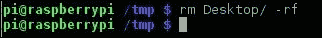

删除文件

### 提示

很少有命令可以破坏 Linux 发行版。`sudo rm –rf /`就是其中之一。这个命令会从根目录开始，删除你设备上的每个文件，包括任何附加到你的 Raspberry Pi 的可移动和网络驱动器上的文件。无需多言，使用`–r`和`–f`标志时要格外小心。

默认情况下，当删除一个目录时，如果目录中有文件，`rm`命令会停止操作。要删除该目录，你需要使用`–f`标志来强制删除文件夹。以下是`rm`命令的一些参数：

| 选项 | 描述 |
| --- | --- |
| `-f` | 删除文件时不会提示确认 |
| `-i` | 删除每个文件之前会提示确认 |
| `-r` | 递归删除文件和文件夹 |

## mkdir

你将经常需要创建一个新文件夹以便将文件进行组织。使用`mkdir`（创建目录）的目的正是如此。要使用`mkdir`，你只需要输入`mkdir`，然后跟上你想要创建的目录名称。


使用 mkdir

一旦你创建了目录，它将立即可以使用。你可以用它来组织你的文件。以下是一些`mkdir`的参数：

| 选项 | 描述 |
| --- | --- |
| `-p` | 如果需要，它会创建任何父目录——例如，`mkdir new/directory/with/parents –p` |
| `-v` | 每创建一个目录时都会显示一条信息 |

## touch

`touch`是一个简单的命令，用于创建一个空文件（如果文件不存在的话）。如果文件已经存在，它会更新文件的访问时间为命令执行时的时间。

`touch`通常在需要某个文件存在时使用。例如，创建空的日志文件。使用`touch`时，只需运行`touch`，后跟你想要创建或更新访问时间的文件名。

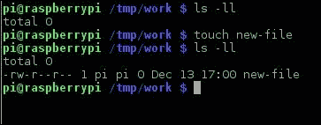

使用触摸

## adduser

在 Linux 中，每个文件都有一个所有者。这样有助于保持系统的安全。默认情况下，`/home/pi`目录中的所有文件都由 Pi 用户拥有。所有用户也都属于一个组。你可以根据文件所有者的用户和组来分配权限。

你可以通过`adduser`命令将用户添加到 Raspbian 系统中。为此，运行`adduser`，后跟你想要创建的用户名。由于`adduser`是一个系统命令，你需要在前面加上`sudo`。

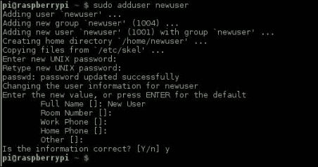

创建用户

`adduser` 命令会问你几个问题，包括用户名和密码。如果你不想提供姓名或电话号码，直接按 *Enter* 键即可。`adduser` 命令还会创建一个与新用户同名的组。

你可以通过运行以下命令轻松查看 Raspbian 系统中的用户：

```
cat /etc/passwd

```

`/etc/passwd` 文件包含了 Raspbian 中所有的用户。

## addgroup

有时，你需要创建一个新组来按要求组织文件权限。为此，可以使用 `addgroup` 命令。

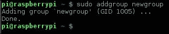

创建新组

`addgroup` 命令使用起来很简单。你只需要在 `addgroup` 命令后添加组的名称。

新的组将被创建，并带有一个新的 ID。要查看 Raspbian 中已有的组，可以运行以下命令：

```
cat /etc/group

```

## passwd

作为你自己 Linux 系统的系统管理员，你拥有很大的权限。你可以使用这个权限通过 `passwd` 命令更改用户的密码。你可以使用 `passwd` 的几种不同方式。一个是更改你自己的密码。另一种方法是更改系统中另一个用户的密码。

### 更改你的密码

要更改自己的密码，请运行如下截图所示的 `passwd` 命令：

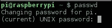

更改你的密码

系统会要求你输入当前密码。输入后，你需要输入新密码两次。

### 更改其他用户的密码

更改其他用户的密码和更改自己密码一样简单。为此，只需在 `passwd` 命令后添加用户名。此命令需要以 root 用户身份运行，因此需要在前面加上 `sudo`。


更改其他用户的密码

如果你需要更改其他人的密码，这非常有用。默认情况下，Raspbian 中没有设置 root 密码。要设置它，可以运行 `sudo passwd`。

## chown

如前所述，Linux 是一个多用户系统，所有文件都有所有者。有时，需要更改所有者。要做到这一点，可以使用 `chown` 命令。`chown` 可以更改文件或目录的用户。

使用权限的一个好例子是 Apache 网页服务器。`/etc/apache2` 目录中的所有配置文件由 Apache2 用户拥有，此外，位于 `/var/www` 目录中的文件也由 Apache2 用户拥有，该目录是 Apache2 服务的网站所在位置。

有时，当你向该目录中添加一个文件时，需要将文件的所有者更改为 Apache2 网页服务器。如果你不这样做，Apache2 将无法将文件提供给任何想要查看它的人。

`chown` 需要多个参数。它们是你要更改所有者的文件或目录的新所有者和组。

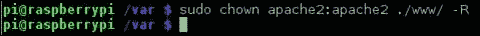

更改 Apache2 网站根目录中所有文件的所有者

所有者和组需要用 (`:`) 分隔。在前面的例子中，用户和组都是 Apache2。

你可以为 `chown` 命令添加几种不同的选项，具体如下：

| 选项 | 描述 |
| --- | --- |
| `-R` | 这将递归地更改文件夹中所有文件和文件夹的所有者 |
| `-v` | 这会显示每个处理文件的消息 |

一些 `chown` 命令的参数

## chmod

文件的另一个属性是其权限。这些权限描述了谁可以对文件和目录执行什么操作。以下是可用的权限：

| **所有者 (o)** | 读取 | 写入 | 执行 |
| --- | --- | --- | --- |
| **组 (g)** | 读取 | 写入 | 执行 |
| **所有用户 (a)** | 读取 | 写入 | 执行 |

Linux 文件权限

每个权限由一个字母表示，如下表所示：

| **读取** | `r` |
| --- | --- |
| **写入** | `w` |
| **执行** | `x` |

如果运行 `ls –ll` 命令，你将能够查看当前所在文件和目录的权限：

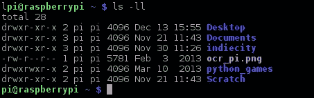

/home/pi 目录的默认权限

权限被分为三组。前三个描述用户对文件的权限，接下来的三个描述组的权限，最后三个描述所有用户的权限。

`ocr_pi.png` 文件的 `rw-r—r—` 权限如下：

|   | 权限 |
| --- | --- |
| **所有者** | 读取和写入 |
| **组** | 读取 |
| **所有用户** | 读取 |

`ocr_pi.png` 的权限

## 权限的八进制表示

权限也可以使用八进制表示法进行描述。这种方式稍微复杂一些，但非常灵活。

| 八进制表示法 | 权限 |
| --- | --- |
| 0 | 无权限 |
| 1 | 执行 |
| 2 | 写入 |
| 3 | 写入和执行 |
| 4 | 读取 |
| 5 | 读取和执行 |
| 6 | 读取和写入 |
| 7 | 读取、写入和执行 |

要描述文件的权限，只需计算你想授予的权限。在以下示例中，我们希望 `demo.txt` 文件具有以下权限：

|   | 权限 |
| --- | --- |
| **所有者** | 读取和写入 |
| **组** | 仅读取 |
| **所有用户** | 无权限 |

权限示例

要计算权限，我们从所有者开始，查找读取和写入权限。然后我们对组和所有用户的权限做同样的操作。权限如下：

|   | 权限 |
| --- | --- |
| **所有者** | 6 |
| **组** | 4 |
| **所有用户** | 0 |

文件的八进制权限

这些权限组合成 `640`。`chmod` 命令使用此表示法来设置文件或文件夹的权限。

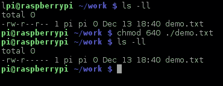

修改 demo.txt 文件的权限

也可以单独添加和删除文件或文件夹的权限。为此，用户可以使用前两张表中描述的表示法。

我们有一个 `demo.txt` 文件，其权限如前面章节所示的截图所示（*默认的 /home/pi 目录权限*）。权限如下：

|   | 权限 |
| --- | --- |
| **所有者** | 读取和写入 |
| **组** | 读取 |
| **所有用户** | 无权限 |

如果我们想要为同组成员添加写入权限，可以按照以下截图所示操作：

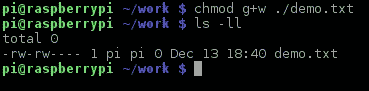

更改 demo.txt 文件的权限

`+` 符号添加权限，`–` 符号则移除文件权限。

我们可以看到，现在该文件拥有组读取和写入权限。使用这种方法的缺点是，你需要分别设置文件的所有者、组和所有用户的权限。

`chmod` 命令有几个其他的命令行参数，如下所示：

| 参数 | 描述 |
| --- | --- |
| `-R` | 这会更改所有目录和文件的权限 |
| `-v` | 为每个被处理的文件显示一条消息 |
| `-c` | 仅显示那些权限被更改的文件 |

`chmod` 命令的命令行参数

# bash 中的重定向

bash 中的一个高级特性是重定向运算符。这些运算符允许你将命令的输入或输出重定向到另一个命令或文件。虽然这听起来很简单，但它是一个非常强大的功能。bash 内置了多个重定向运算符，如下所示：

| 运算符 | 描述 |
| --- | --- |
| &#124; | 这是一个通用命令，类似于 `>` 运算符进行链式操作 |
| `>` | 该运算符将命令的输出重定向到文件 |
| `<` | 该运算符读取文件并将其传递给命令 |
| `>>` | 该运算符将命令的输出追加到文件中 |

重定向运算符

`|` 运算符是一个通用的命令更改工具。一个简单的例子是将它与`cat`命令和`more`程序一起使用。`more`程序是一个简单的程序，可以让你在屏幕上前后翻阅文件内容以进行阅读。`more`命令从`cat`命令获取你要读取的数据。`|`运算符将两个程序连接在一起。

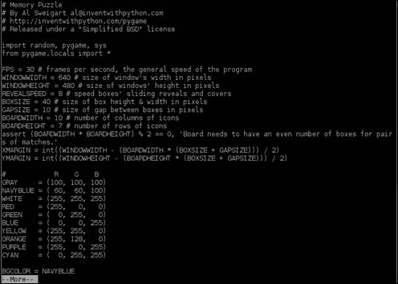

使用 `|` 运算符连接的 `more` 和 `cat` 命令

## > 和 >>

`>` 和 `>>` 运算符是非常强大的运算符，它们将程序输出的数据写入文件。`>` 运算符会替换文件，而 `>>` 运算符则是将内容追加到文件中。

记住，Linux 中的每样东西都是文件，因此你可以使用 `>` 和 `>>` 运算符将输出重定向到串行端口或打印机。

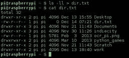

`>` 运算符将 `ls` 命令的结果写入文件

## <

`<` 运算符类似于 `>` 运算符，只是它读取文件的内容并将其传递给程序。这可以以多种方式使用，在某些方面类似于使用 `>`。

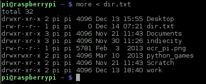

使用 `<` 操作符将 dir.txt 的内容传递给 more 应用程序

# 环境变量

bash 的另一个强大功能是使用环境变量。环境变量是存储在内存中的值，可以用来临时存储信息和设置。一个例子是 `PATH` 变量。`PATH` 变量告诉 bash 如果程序不在当前目录中，它应该去哪里寻找这些程序。

所有当前设置的环境变量可以通过 `printenv` 命令显示出来。它们会在 Raspberry Pi 启动时自动加载到内存中。

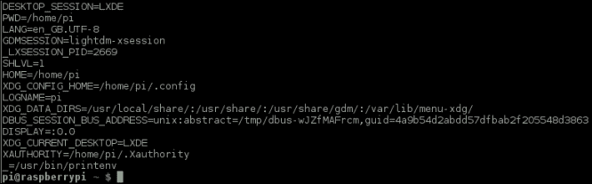

在 Raspbian 中默认设置的一些环境变量

你可以在 bash 中轻松定义自己的环境变量。按照惯例，在 bash 中，所有环境变量都使用大写字母定义。

要定义一个环境变量，你可以按以下截图中的方式操作：

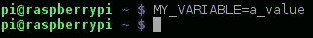

定义 MY_VARIABLE 环境变量值

使用环境变量也非常简单。只需在环境变量前加上 `$` 即可。

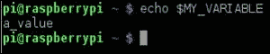

使用 MY_VARIABLE 环境变量

环境变量通常在 Shell 脚本中用于存储信息和结果。

### 注意

你知道吗？2014 年在 bash 处理环境变量时发现了一个叫做 Shellshock 的漏洞？这个漏洞允许执行任意命令，并且对互联网上运行的许多 Web 服务器构成了巨大风险。

添加环境变量很容易。你只需要使用 `export` 命令，如下所示：

```
export VARIABLE=value

```

环境变量的名称不能包含空格，且必须包含大写字母。

# 基础脚本编写

你到目前为止看到的所有命令只是单个命令。bash 具有一次执行多个命令的能力。命令可以存储在一个叫做 Shell 脚本的文件中。

一个 Shell 脚本被设置了执行权限。然后，你只需进入脚本所在的目录并输入脚本名称，就可以运行它。

这些 Shell 脚本可以像普通程序一样在你的 Raspberry Pi 上运行。

## 重启和关闭你的 Raspberry Pi

你可以使用内置命令重启和关闭你的 Raspberry Pi。要重启你的 Raspberry Pi，只需运行 `reboot` 命令即可。

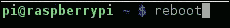

重启你的 Raspberry Pi

有时你可能想完全关闭 Raspberry Pi。为此，你可以使用 `shutdown` 命令。

`shutdown` 命令有两个不同的参数：第一个参数是你想进行的关机类型，第二个参数是你希望执行关机的时间。

| 参数 | 描述 |
| --- | --- |
| `-r` | 这个命令会重启你的 Raspberry Pi。 |
| `-h` | 这个命令会在关闭系统后关机。关闭完成后，你仍然需要断开树莓派的电源。 |
| `-k` | 这个命令并不会真正关闭系统，它只是发送一个警告信息。 |

第二个参数通常是 `now`，它告诉树莓派我们希望立即关机。

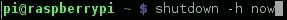

关闭你的树莓派！

`halt` 命令也可以用来关闭你的树莓派。只需运行以下命令：

```
halt

```

你的树莓派将立即关闭。

# 文本编辑器

有时，你可能需要在树莓派上编辑一个文件：比如编辑 `/etc/network/interfaces` 文件以重新配置树莓派的网络接口，或者你可能需要一个文本编辑器来写文档。

幸运的是，Raspbian 系统中预装了几款文本编辑器。最常用的文本编辑器包括：

+   nano

+   vim

## nano

nano 最初由 Chris Allegretta 于 1999 年创建，是树莓派上最容易使用的文本编辑器。

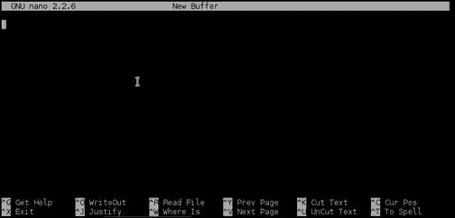

nano 文本编辑器

在 nano 中编辑文件时，你只需开始输入。更改完成后，你需要保存并退出。屏幕底部显示的命令可以通过按下键盘上的 *Ctrl* 键，然后按相应字母来访问。

1.  例如，在你完成更改后，按 *Ctrl* + *x* 退出。

1.  接下来，系统会询问你是否要保存这些更改。若要保存，请按 *y*。

    在 nano 中保存更改

1.  现在，你需要输入一个文件名以保存文件。输入完成后，按 *Enter* 键，你的文件就会被保存。

    确认你正在保存的文件名

1.  要加载你刚刚保存的文件，只需运行 `nano` 命令，如下图所示：

    选择你想要保存的文件名

## vim

另一款在树莓派上预装的文本编辑器是 vi 编辑器。vi 编辑器最初由 Bill Joy 于 1976 年为 Unix 系统创建。

vi 这个名字来源于单词 "visual" 的缩写。vi 编辑器是 Linux 中最广泛使用的文本编辑器之一。

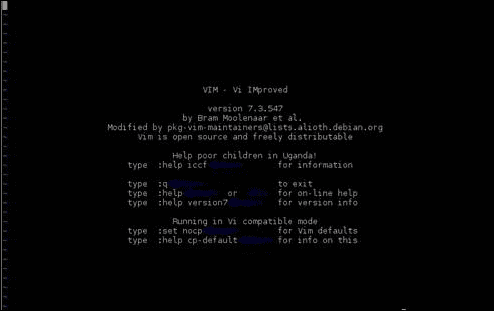

vi 文本编辑器

vim（改进版的 vi）编辑器的使用要比 nano 稍微复杂一些。vi 编辑器的设计目的是不干扰用户，因此你不会看到任何菜单或屏幕上不必要的信息。

vim 编辑器有几种不同的模式，你可以通过这些模式来操作它。一个模式是插入模式。当你处于插入模式时，你可以像使用 nano 编辑器一样使用 vi，不过你只需要输入文本并用箭头键来浏览文件。要进入插入模式，按下 *Insert* 键或输入大写的 *I*。

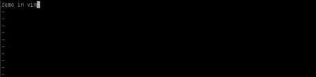

vi 文本编辑器的插入模式

为了保存文件，我们需要进入命令模式。为此，请按下*Esc*键，然后按下*:*键。这将会在 vim 窗口的底部弹出一个命令提示符。


vi 文本编辑器的命令模式

在 vim 中有许多不同的命令，如下所示：

| 命令 | 描述 |
| --- | --- |
| `w` | 将文件写入磁盘 |
| `q` | 用于退出 vim |
| `dd` | 删除当前行的文本 |
| `x` | 删除光标所在位置的字符 |

这些命令可以在命令提示符中输入，或者当你在浏览文本并且不处于插入模式时输入。

这些命令中的一个例子是`wq`命令。这个命令会在你按下*Enter*键时保存并退出 vim。vim 不会询问你是否要保存更改，因为它会根据你给出的命令知道你想要做什么！

如果你不想保存更改，只需输入`q!`命令。

还有许多其他文本编辑器可以安装到你的 Raspberry Pi 上，比如 geany。

# 总结

在本章中，你了解了 bash shell、文件权限以及许多 bash 的内建命令。记住，如果你需要了解更多信息，只需在你想要了解的命令前加上`man`命令。你将能够找到你需要的所有信息！

记住，不要害怕尝试 Raspbian 内置的不同命令。最糟糕的情况是你可能需要重新制作 SD 卡镜像。
