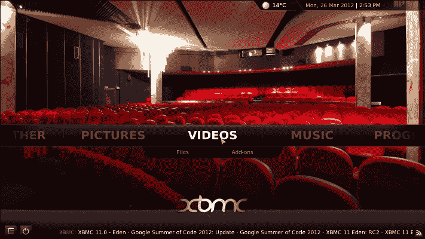
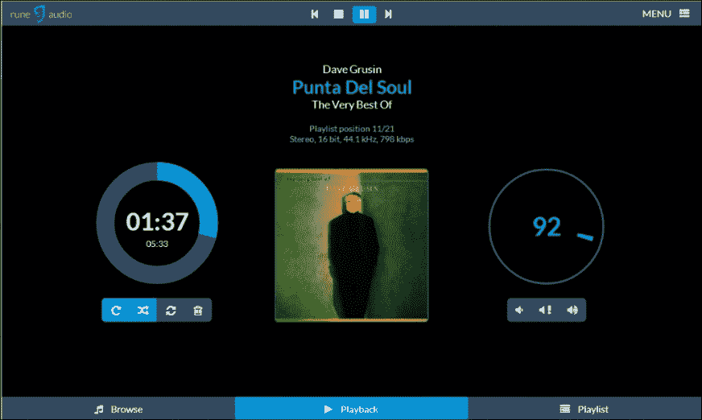
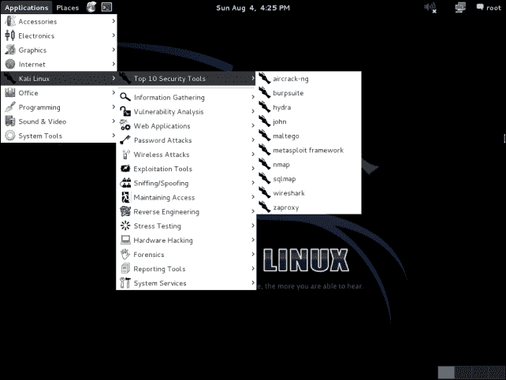

# 第七章：其他基于 Raspbian 的 Linux 发行版

树莓派是一款功能强大的设备，现已触及到比以往更多的人群。它的价格足够亲民，让人们能够用于各种不同的项目，许多项目之前是无法实现的。这些项目从为电视创建一个媒体中心到在无人机上实现自动驾驶功能不等。

这些项目中的许多基于 Raspbian，且已经发展成了独立的发行版。它们本质上仍然是 Raspbian，但为了特定用途进行了定制，你可以运用本书中学到的技能来使用这些发行版。本章将介绍一些不同的发行版。

# Raspbmc

Raspbmc ([`www.raspbmc.com/`](http://www.raspbmc.com/)) 是一个基于 Raspbian 的 Linux 发行版，让你在树莓派上运行 XBMC（现在称为 Kodi）。Kodi 是一款屡获殊荣的媒体播放器和娱乐中心，旨在尽可能多地支持不同设备的运行，包括树莓派。

得益于 Broadcom CPU 和 VideoCore IV 图形引擎，树莓派有足够的性能来处理媒体播放。这使得你能够将树莓派变成一个强大、极低成本的媒体中心，且功耗低。

通过在树莓派上安装 Raspbmc，你可以将树莓派变成一个功能齐全的媒体中心，在电视上播放电影和音乐。Kodi 让你可以使用任何带有 Wi-Fi 的智能手机或平板电脑作为遥控器。

# Volumio

Volumio ([`volumio.org/`](http://volumio.org/)) 是一个基于 Raspbian 的免费开源 Linux 发行版，旨在将树莓派转变为一款音响发烧友级别的音乐播放器。Volumio 的设计理念是易于使用。引用 Volumio 官网的话，Volumio 可以这样定义：

> *“Volumio 的设计理念是简洁、音质出色、让你的音乐获得应有的表现。”*

在将 Volumio 安装到树莓派后，你可以通过任何具有 Wi-Fi 功能的智能手机或平板电脑来控制正在播放的音乐。

Volumio 的有趣之处在于，它专为音响发烧友（喜欢高质量音频的人）设计，支持使用外部**数模转换器**（**D/A**）来提升播放音质。这些 D/A 转换器可以插入树莓派，作为一张高品质的声卡工作。以下图片展示了 Volumio 的网页界面：

# ThinBox

ThinBox ([`www.jontylovell.net/index.php?page=30`](http://www.jontylovell.net/index.php?page=30)) 是一个基于 Raspbian 的免费开源 Linux 发行版，旨在将树莓派转变为远程终端客户端。ThinBox 使得你可以快速且轻松地将树莓派连接到基于 Microsoft Windows 的服务器或桌面。

连接可以通过内置的连接管理器轻松设置。ThinBox 启动时间不到 30 秒即可进入桌面，并且具有一个简单、易于使用的图形用户界面（GUI）应用程序来设置连接。这是使用你的 Raspberry Pi 从任何地方远程访问系统的最简单方法之一。

ThinBox 的桌面界面

# PiPlay

PiPlay ([`pimame.org/`](http://pimame.org/)) 是另一个基于 Raspbian 的 Linux 发行版，专为在 Raspberry Pi 上进行游戏和模拟旧版游戏系统而设计。

它是为从未使用过 Linux 或 Raspberry Pi 的用户设计的，设置和使用都非常简单。

PiPlay 模拟以下游戏系统：

+   MAME—AdvanceMAME 和 MAME4ALL

+   CPS I / CPS II—Final Burn Alpha

+   NeoGeo—GnGeo

+   Playstation—PCSX-ReARMed

+   Genesis—DGen

+   SNES—Snes9x

+   NES—AdvMESS

+   Gameboy—Gearboy

+   Gameboy Advance—GPSP

+   ScummVM

+   Atari 2600—Stella

+   Cave story—NXEngine

+   Commodore 64—VICE

通过在你的 Raspberry Pi 上安装 PiPlay，你可以玩许多其他方式无法玩的老游戏。

PiPlay 标志

# Torberry

Torberry ([`code.google.com/p/torberry/`](https://code.google.com/p/torberry/)) 是一个基于 Raspbian 的 Raspberry Pi Linux 发行版，旨在通过 Tor 网络将你所有的互联网流量路由到 Tor 上。

根据 Tor 网站的描述，Tor 可以定义如下：

> *“Tor 是一款自由软件和一个开放的网络，帮助你防御流量分析，这是一种威胁个人自由和隐私、机密商业活动和关系以及国家安全的网络监控形式。”*

Torberry 旨在安装在你的 Raspberry Pi 上，并作为一个 Tor 透明代理，所有的 TCP 和 DNS 流量都会通过 Tor 网络。这意味着别人更难找到你的真实位置。

Tor 标志

# Kali

Kali ([`www.kali.org/`](http://www.kali.org/)) 是一个衍生自 Debian（和 Raspbian 相同）的 Linux 发行版，专为数字取证和渗透测试而设计。

Kali 预装了几个用于测试计算机网络安全的软件包。这些工具允许用户破解密码、突破无线网络、并执行某人的计算机的端口扫描。以下是 Kali 中包含的一些工具：

# 总结

在这一章中，你了解了几种基于 Raspbian 的不同操作系统。这些操作系统基于 Raspbian，使你的 Raspberry Pi 能够执行专门的任务。这些仅仅是 Raspberry Pi 可用发行版中的一小部分，随着 Raspberry Pi 的流行，越来越多的这些发行版将变得可用。

本书所教给你的技能将帮助你使用这些发行版，并让你充分利用它们。祝你好运！
