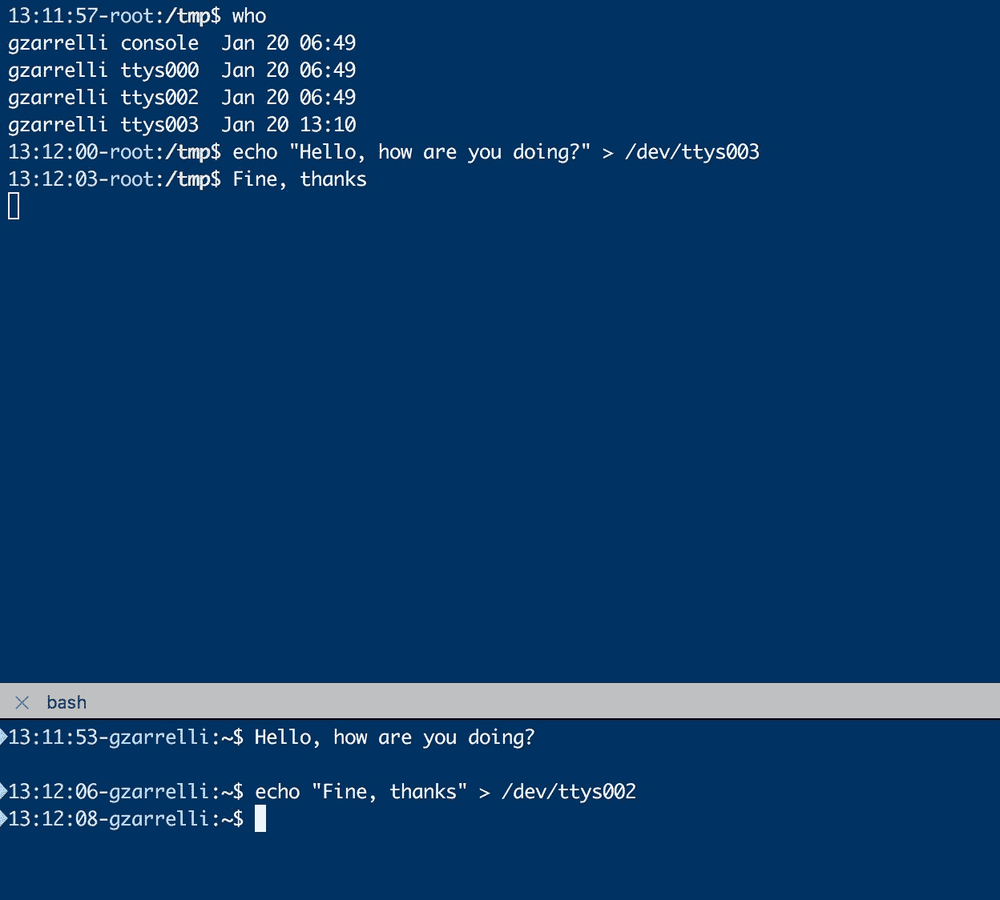

# 第一章：开始编程吧

精通 Bash 就是掌握如何利用你的环境，最大化其潜力。这不仅仅是处理可以自动化的枯燥日常任务。它是将你的工作空间打造得更加高效，以实现你的目标。因此，尽管 Bash 脚本的表达能力不如 Python 或 JavaScript 等其他复杂语言，但它足够简单，可以在短时间内掌握，而且灵活到足以满足你大多数日常任务的需求，甚至是最棘手的任务。

但 Bash 就这么简单易用吗？让我们看看在 Bash 中的第一行代码。我们从简单的开始：

```
gzarrelli:~$ time echo $0
/bin/bash
real 0m0.000s
user 0m0.000s
sys 0m0.000s
gzarrelli:~$ 

```

现在，让我们以稍微不同的方式再做一次：

```
gzarrelli:~$ time /bin/echo $0/bin/bash
real 0m0.001s
user 0m0.000s
sys 0m0.000s  

```

这里有趣的是，`real` 的值在两个命令之间稍有不同。好的，但为什么呢？让我们通过以下命令深入探讨：

```
gzarrelli:~$ type echo
echo is a shell builtin
gzarrelli:~$ type /bin/echo
/bin/echo is /bin/echo  

```

有趣的是，第一个似乎是一个 `shell builtin`，第二个只是一个系统程序，一个外部工具，差异就出在这里。`builtin` 是内置于 shell 中的命令，而系统程序则由 shell 调用。内置命令与外部命令正好相反。

要理解导致如此不同的执行时机的内外部 shell 命令之间的区别，我们必须了解外部程序是如何被 shell 调用的。当外部程序要执行时，Bash 会创建一个它自己的副本，使用父 shell 相同的环境，并产生一个具有不同进程 ID 的新进程。可以说，我们刚刚看到了如何进行分叉。在新的地址空间中，调用系统的 exec 来加载新进程数据。

对于 `builtin` 命令，情况有所不同，Bash 在不进行任何分叉的情况下执行它们，这会带来以下几个有趣的结果：

+   `builtin` 执行更快，因为没有副本，也没有执行文件被调用。值得注意的是，这一优势在短时间运行的程序中更为明显，因为开销是在任何可执行文件被调用之前：一旦外部程序被调用，`builtin` 命令和程序之间的纯执行时间差异可以忽略不计。

+   作为 Bash 的内置命令，`builtin` 命令可以影响其内部状态，而外部程序无法做到这一点。让我们考虑一个经典的例子，使用 `builtincd`。如果 `cd` 是一个外部程序，一旦从 shell 中调用，如下所示：

```
cd /this_dir  

```

+   第一个操作是我们的 shell 为 `cd` 分叉一个进程，后者会改变它自己的进程中的当前目录，而不是我们所在的那个进程，该进程是为了启动 `cd` 进程而被分叉的。父 shell 不会受到影响。因此，我们将无法前往任何地方。

想知道有哪些 `builtin` 可用吗？你有几个选项，可以执行以下 `builtin`：

```
compgen -b  

```

或者这个其他的 `builtin` 命令：

```
enable -a | awk '{ print $2 }'  

```

为了更好地理解为何`builtin`和外部程序的执行有差异，我们需要看看当我们调用命令时发生了什么。

+   首先，记住 Shell 是从左到右工作的，它会处理所有的变量赋值和重定向，并将它们保存起来以供后续处理。

+   如果没有其他内容，Shell 将把命令行中的第一个单词作为命令名称，而其余部分将被视为参数。

+   下一步是处理所需的输入和输出重定向。

+   最后，在赋值给变量之前，所有在`=`符号后的文本都将进行波浪线扩展、参数扩展、命令替换、算术扩展和引号移除。

+   如果最后的操作没有产生命令名称，变量就可以影响环境。如果赋值失败，则会引发错误，并且调用的命令会以非零状态退出。

+   如果操作结果中没有命令名称，所有重定向将被应用，但与变量不同，它们不会影响当前环境。同样，如果发生任何错误，返回的退出状态为非零。

一旦前面的操作完成，命令就会被执行，并根据是否有一个或多个扩展包含命令替换来决定退出状态。总体退出状态将是最后一个命令替换的状态，如果没有执行命令替换，退出状态将为零。

此时，我们最终只剩下一个命令名称和一些可选的参数。此时，`builtins`和外部程序的路径开始分歧。

+   一开始，Shell 查看命令名称，如果没有斜杠，它会搜索命令的路径。

+   如果没有斜杠，Shell 会尝试查找是否存在一个与该名称相同的函数并执行它。

+   如果没有找到函数，Shell 会尝试执行`builtin`，如果有该名称的`builtin`，它会被执行。

好的，现在如果有任何`builtin`，它已经被调用。那么外部程序呢？

+   如果在命令行上找不到名为`builtins`的内容，我们的 Bash 将继续执行，并且有三次机会：

+   +   执行命令的完整路径已经包含在其内部哈希表中，哈希表是用来加速查找的结构。

    +   如果完整路径不在哈希表中，Shell 会在环境变量`PATH`的内容中查找，如果找到，它会被添加到哈希表中。

    +   如果`PATH`变量中没有完整路径，Shell 会返回退出状态 127。

哈希甚至可以像这样被调用：

```
gzarrelli:~$ hash
hits command
1  /usr/bin/which
1  /usr/bin/ld
24  /bin/sh
1  /bin/ps
1  /usr/bin/who
1  /usr/bin/man
1  /bin/ls
1  /usr/bin/top  

```

第二列将告诉你，不仅哪些命令已经被哈希，还会告诉你每个命令在当前会话中执行的次数（命中次数）。

假设搜索找到了我们想要执行的命令的完整路径；现在我们有了完整路径，情况就像 Bash 在命令名称中发现一个或多个斜杠一样。在这两种情况下，shell 都认为它有一个有效的路径来调用命令，并在一个分叉的环境中执行该命令。

这是我们运气好的时候，但也可能发生调用的文件不是可执行文件的情况，这时，由于我们的路径指向的是一个目录而非文件，Bash 会做出一个合理的猜测，认为需要运行一个 shell 脚本。在这种情况下，脚本会在一个子 shell 中执行，而这个子 shell 是一个全新的环境，它继承了父 shell 的哈希表内容。

在做任何其他事情之前，shell 会查看脚本的第一行，寻找一个可选的 `sha-bang`（我们稍后会看到这是什么）- 在 `sha-bang` 后面是用于管理脚本的解释器路径和一些可选参数。

此时，只有在这个时刻，如果你的外部命令是脚本，它才会被执行。如果它是可执行文件，它会在稍早一些时候被调用，但仍然在任何`builtin`命令之后执行。

在前面的段落中，我们已经看到了一些应该对你来说熟悉的命令和概念。本章的接下来的段落将快速讲解一些 Bash 的基本元素，如变量、扩展和重定向。如果你已经熟悉它们，那么在工作脚本时，你可以将接下来的页面作为参考。如果相反，你对这些概念不太熟悉，那么请继续阅读接下来的内容，因为你所阅读的所有内容将对理解你可以在 shell 中做什么以及如何操作非常重要。

# 输入输出重定向

正如我们在前面的页面所看到的，重定向是 Bash 在解析并准备执行命令的命令行时所执行的最后操作之一。那么什么是重定向呢？你可以从日常经验中轻松猜到。它意味着将一个流从一个点引导到另一个点，然后让它去别的地方，就像改变一条河流的流向让它流向别的地方一样。在 Linux 和 Unix 中，情况也差不多，只需要记住以下两个原则：

+   在 Unix 中，除了守护进程外，每个进程都应该连接到标准输入、标准输出和标准错误设备

+   Unix 中的每个设备都通过一个文件来表示

你也可以将这些设备视为流：

+   标准输入，名为 `stdin`，是进程接收输入数据的流

+   标准输出，名为 `stdout`，是进程写入其输出数据的外发流

+   标准错误，名为 `stderr`，是进程写入其错误信息的流

这些流也由标准 POSIX 文件描述符来标识，文件描述符是一个整数，内核用它作为处理程序来引用这些流，如下表所示：

| **设备** | **模式** | **文件描述符** |
| --- | --- | --- |
| `stdin` | 读 | 0 |
| `stdout` | 写 | 1 |
| `stderr` | 写入 | 2 |

所以，操作文件描述符来处理三种主要流意味着我们可以在`stdin`和`stdout`之间重定向流，也可以在`stderr`之间重定向流，甚至可以让一个进程与另一个进程进行通信，这实际上是一种进程间通信（IPC）的形式，我们将在本书后续章节更详细地讨论这一点。

我们如何将**输入/输出**（**I/O**）从一个进程重定向到另一个进程？我们可以利用一些特殊字符来实现这一目标：

```
>  

```

我们先声明，进程的默认输出通常是`stdout`。无论它返回什么，都会返回到`stdout`，而`stdout`通常是显示器或终端。通过使用`>`字符，我们可以将这个流重定向到文件。如果文件不存在，它将被创建，如果文件已存在，它将被覆盖并用进程的输出流替换原有内容。

一个简单的例子可以澄清如何将输出重定向到文件：

```
gzarrelli:~$ echo "This is some content"
This is some content  

```

我们使用了命令`echo`来打印信息到`stdout`，因此我们可以看到信息被写入到通常与 Shell 连接的文本终端中：

```
gzarrelli:~$ ls -lah
total 0
drwxr-xr-x   2 zarrelli  gzarrelli    68B 20 Jan 07:43 .
drwxr-xr-x+ 47 zarrelli  gzarrelli   1.6K 20 Jan 07:43 ..  

```

文件系统中没有任何内容，所以输出直接显示在终端上，但底层目录没有受到影响。现在，是时候进行重定向了：

```
gzarrelli:~$ echo "This is some content" > output_file.txt  

```

好吧，屏幕上没有显示任何内容；没有任何输出：

```
gzarrelli:~$ ls -lah
total 8
drwxr-xr-x   3 gzarrelli  gzarrelli   102B 20 Jan 07:44 .
drwxr-xr-x+ 47 gzarrelli  gzarrelli   1.6K 20 Jan 07:43 ..
-rw-r--r--   1 gzarrelli  gzarrelli    21B 20 Jan 07:44 
output_file.txt  

```

事实上，正如你所看到的，输出没有消失；它只是被重定向到当前目录下的一个新文件中，并被创建和填充：

```
gzarrelli:~$ cat output_file.txt
This is some content  

```

这里有些有趣的内容。`cat`命令获取`output_file.txt`的内容并将其发送到`stdout`。我们可以看到的是，前一个命令的输出被重定向到终端并写入到文件中。

```
>>  

```

这个双重标记解决了我们经常面临的一个问题：*我们如何在不覆盖任何内容的情况下，将更多来自进程的内容添加到文件中？* 使用这个双重字符，表示文件尚不存在时会创建一个新文件；如果文件已经存在，则直接将新数据追加到文件末尾。我们来看一下之前的文件并向其添加一些内容：

```
gzarrelli:~$ echo "This is some other content" >> output_file.txt
gzarrelli:~$ cat output_file.txt
This is some content
This is some other content  

```

太好了，文件没有被覆盖，`echo`命令的新内容被添加到了旧内容中。现在，我们知道如何写入文件，那么从`stdin`以外的其他地方读取数据呢？

```
<  

```

如果文本终端是`stdin`，键盘则是进程的标准输入，进程从中获取数据。我们同样可以重定向数据流或读取流，并让进程从文件中读取数据。以我们的例子为例，我们首先创建一个包含一组无序数字的文件：

```
gzarrelli:~$ echo -e '5\n9\n4\n1\n0\n6\n2' > to_sort  

```

然后我们验证它的内容，方法如下：

```
gzarrelli:~$ cat to_sort
5
9
4
1
0
6
2  

```

现在我们可以让`sort`命令将这个文件读取到它的`stdin`中，方法如下：

```
gzarrelli:~$ sort < to_sort
0
1
2
4
5
6
9  

```

不错，我们的数字现在已经按顺序排列，但我们可以做些更有趣的事情：

```
gzarrelli:~$ sort < to_sort > sorted  

```

我们做了什么？我们只是将文件`to_sort`传递给`sort`命令的标准输入，同时连接了第二个重定向，使得`sort`的输出被写入文件`sorted`：

```
gzarrelli:~$ cat sorted
0
1
2
4
5
6
9   

```

因此，我们可以连接多个重定向并获得一些有趣的结果，但我们还可以做一些更复杂的事情，即将输入和输出链式连接，操作的对象不再是文件，而是进程，正如我们接下来所看到的。

```
|  

```

管道字符正如其名称所示，*管道*将一个进程的流（可能是`stdout`或`stderr`）传递给另一个进程，创建一个简单的进程间通信机制：

```
gzarrelli:~$ ps aux | awk '{print $2, $3, $4}' | grep -v [A-Z] | sort -r -k 2 
-g | head -n 3
95 0.0 0.0
94 0.0 0.0
93 0.0 0.0  

```

在这个示例中，我们玩得很开心，首先获取了一个进程列表，然后将输出通过管道传给`awk`工具，`awk`只打印了第一个、第十一和第十二列，分别是进程 ID、CPU 百分比和内存百分比。然后，我们去掉了标题`PID %CPU %MEM`，将`awk`的输出通过管道传给`grep`，`grep`对所有包含字符而非数字的字符串进行了反向模式匹配。接下来，我们将输出传给了`sort`命令，按第二列的值对数据进行了倒序排序。最后，我们只想要前三行，于是我们得到了依赖于 CPU 占用的前三个最重进程的`PID`。

重定向也可以用来做一些有趣或有用的事情，正如你在下面的截图中所看到的：



如你所见，机器上有两个用户在不同的终端上，记住每个用户都必须连接到一个终端。要能够向任何用户的终端写入内容，你必须是 root 用户，或者像本例中一样，是同一用户在两个不同的终端上。通过`who`命令，我们可以识别出用户连接到的终端（`ttys`），也就是*从中读取*，然后我们只需将`echo`命令的输出重定向到他的终端。因为他的会话已连接到该终端，所以他会读取我们发送到其终端设备`stdin`的数据（因此是`/dev/ttysxxx`）。

Unix 中的一切都通过文件表示，无论是设备、终端，还是我们需要访问的任何内容。我们还有一些特殊的文件，比如`/dev/null`，它是一个“黑洞”——你发送到它的任何东西都会丢失：

```
gzarrelli:~$ echo "Hello" > /dev/null
gzarrelli:~$  

```

另外，看看以下示例：

```
root:~$ ls
output_file.txtsortedto_sort
root:~$ mv output_file.txt /dev/null
root:~$ ls
to_sort  

```

很好，有足够的内容来玩耍，但这只是个开始。还有很多工作要做，涉及文件描述符。

# 玩弄 stdin、stdout 和 stderr

好吧，如果我们稍微调整一下文件描述符和特殊字符，我们可以得到一些不错的、真的很不错的结果；让我们看看能做些什么。

+   `x < filename`：这会以读取模式打开一个文件，并为名为`a`的描述符分配一个值，该值在`3`和`9`之间。我们可以选择任何名字，通过这个名字，我们可以轻松地通过`stdin`访问文件内容。

+   `1 > 文件名`：这会将标准输出重定向到文件名。如果文件不存在，它会被创建；如果文件已存在，原有数据将被覆盖。

+   `1 >> 文件名`：这会将标准输出重定向到文件名。如果文件不存在，它会被创建；如果文件已存在，内容将被追加到原有数据之后。

+   `2 > 文件名`：这会将标准错误重定向到文件名。如果文件不存在，它会被创建；如果文件已存在，原有数据将被覆盖。

+   `2 >> 文件名`：这会将标准错误重定向到文件名。如果文件不存在，它会被创建；如果文件已存在，内容将被追加到原有数据之后。

+   `&> 文件名`：这会将 `stdout` 和 `stderr` 都重定向到文件名。如果文件不存在，它会被创建；如果文件已存在，则会覆盖原有数据。

+   `2>&1`：这会将 `stderr` 重定向到 `stdout`。如果你在程序中使用此命令，它的错误信息将被重定向到 `stdout`，即通常的显示器上。

+   `y>&x`：这会将描述符 `y` 的文件重定向到描述符 `x`，这样描述符 `y` 指向的文件的输出就会重定向到描述符 `x` 指向的文件。

+   `>&x`：这会将与 `stdout` 关联的文件描述符 `1` 重定向到描述符 `x` 指向的文件中，这样任何输出到标准输出的内容都将写入描述符 `x` 指向的文件。

+   `x<> 文件名`：这会以读写模式打开文件，并将描述符 `x` 分配给它。如果文件不存在，则会创建该文件；如果没有指定描述符，则默认为 `0`，即 `stdin`。

+   `x<&-`：这会关闭以读模式打开并与描述符 `x` 关联的文件。

+   `0<&- 或 <&-`：这会关闭以读模式打开并与描述符 `0`（即 `stdin`）关联的文件，然后关闭该文件。

+   `x>&-`：这会关闭以写模式打开并与描述符 `x` 关联的文件。

+   `1>&- 或 >&-`：这会关闭以写模式打开并与描述符 `1`（即 `stdout`）关联的文件，然后关闭该文件。

如果你想查看哪些文件描述符与进程相关，你可以探索 `/proc` 目录，并指向以下路径：

```
/proc/pid/fd  

```

在该路径下，替换 `PID` 为你想要探索的进程的 ID；你将找到与该进程相关的所有文件描述符，如以下示例所示：

```
gzarrelli:~$ ls -lah /proc/15820/fd
total 0
dr-x------ 2 postgres postgres  0 Jan 20 17:59 .
dr-xr-xr-x 9 postgres postgres  0 Jan 20 09:59 ..
lr-x------ 1 postgres postgres 64 Jan 20 17:59 0 -> /dev/null 
(deleted)
l-wx------ 1 postgres postgres 64 Jan 20 17:59 1 -> /var/log/postgresql/postgresql-9.4-main.log
lrwx------ 1 postgres postgres 64 Jan 20 17:59 10 -> /var/lib/postgresql/9.4/main/base/16385/16587
lrwx------ 1 postgres postgres 64 Jan 20 17:59 11 -> socket:[13135]
lrwx------ 1 postgres postgres 64 Jan 20 17:59 12 -> socket:[1502010]
lrwx------ 1 postgres postgres 64 Jan 20 17:59 13 -> /var/lib/postgresql/9.4/main/base/16385/16591
lrwx------ 1 postgres postgres 64 Jan 20 17:59 14 -> /var/lib/postgresql/9.4/main/base/16385/16593
lrwx------ 1 postgres postgres 64 Jan 20 17:59 15 -> /var/lib/postgresql/9.4/main/base/16385/16634
lrwx------ 1 postgres postgres 64 Jan 20 17:59 16 -> /var/lib/postgresql/9.4/main/base/16385/16399
lrwx------ 1 postgres postgres 64 Jan 20 17:59 17 -> /var/lib/postgresql/9.4/main/base/16385/16406
lrwx------ 1 postgres postgres 64 Jan 20 17:59 18 -> /var/lib/postgresql/9.4/main/base/16385/16408
l-wx------ 1 postgres postgres 64 Jan 20 17:59 2 -> /var/log/postgresql/postgresql-9.4-main.log
lr-x------ 1 postgres postgres 64 Jan 20 17:59 3 -> /dev/urandom
l-wx------ 1 postgres postgres 64 Jan 20 17:59 4 -> /dev/null 
(deleted)
l-wx------ 1 postgres postgres 64 Jan 20 17:59 5 -> /dev/null 
(deleted)
lr-x------ 1 postgres postgres 64 Jan 20 17:59 6 -> pipe:[1502013]
l-wx------ 1 postgres postgres 64 Jan 20 17:59 7 -> pipe:[1502013]
lrwx------ 1 postgres postgres 64 Jan 20 17:59 8 -> /var/lib/postgresql/9.4/main/base/16385/11943
lr-x------ 1 postgres postgres 64 Jan 20 17:59 9 -> pipe:[13125]

```

不错，是吧？那么，让我们做一些绝对有趣的事情：

首先，让我们以读写模式打开一个虚拟机的网络服务器的套接字，并将描述符 `9` 分配给它：

```
gzarrelli:~$ exec 9<> /dev/tcp/172.16.210.128/80 || exit 1  

```

然后，让我们往它写点东西；没有什么复杂的：

```
gzarrelli:~$ printf 'GET /index2.html HTTP/1.1\nHost: 172.16.210.128\nConnection: close\n\n' >&9

```

我们只是请求了一个为此示例创建的简单 HTML 文件。

现在，让我们读取文件描述符 `9`：

```
gzarrelli:~$ cat <&9
HTTP/1.1 200 OK
Date: Sat, 21 Jan 2017 17:57:33 GMT
Server: Apache/2.4.10 (Debian)
Last-Modified: Sat, 21 Jan 2017 17:57:12 GMT
ETag: "f3-5469e7ef9e35f"
Accept-Ranges: bytes
Content-Length: 243
Vary: Accept-Encoding
Connection: close
Content-Type: text/html
<!DOCTYPE HTML PUBLIC "-//W3C//DTD HTML 4.01//EN"
 "http://www.w3.org/TR/html4/strict.dtd">
<HTML>
 <HEAD>
 <TITLE>This is a test file</TITLE>
 </HEAD>
 <BODY>
 <P>And we grabbed it through our descriptor!
 </BODY>
</HTML>  

```

就是这样！我们通过套接字将文件描述符连接到远程服务器，我们可以写入并读取响应，同时将数据流通过网络进行重定向。

仅仅处理命令行，我们到目前为止已经做了很多，但是如果我们想更进一步，就必须看看如何将所有这些命令编写成脚本，并充分利用它们。是时候写我们的第一个脚本了！

# 是时候了解解释器了：sha-bang

当任务变得更复杂时，单纯的命令行连接可能不足以完成我们要完成的任务。单行中的太多内容显得杂乱无章，缺乏清晰性，因此最好将我们的命令或 `builtins` 存储在文件中，并让它执行。

当脚本执行时，系统加载程序解析第一行，寻找被称为 `sha-bang` 或 shebang 的字符序列。

```
#!  

```

这将强制加载程序将后续字符视为解释器的路径及其可选参数，用于进一步解析脚本，脚本将作为另一个参数传递给解释器。因此，最终，解释器将解析脚本，这次我们将忽略 `sha-bang`，因为它的第一个字符是井号，通常表示脚本中的注释，而注释是不会被执行的。更进一步说，`sha-bang` 是我们称之为 2 位魔术数字的东西，它是一个常数数字或文本值序列，在 Unix 中用于标识文件或协议类型。所以，`0x23 0x21` 实际上是 `#!` 的 ASCII 表示。

那么，让我们做个小实验，创建一个简单的一行脚本：

```
gzarrelli:~$ echo "echo \"This should go under the sha-bang\"" > test.sh  

```

只有一行。我们来看看：

```
gzarrelli:~$ cat test.sh 
echo "This should go under the sha-bang"  

```

很好，一切都如我们预期的那样。Linux 对我们的脚本有什么看法吗？让我们问问看：

```
gzarrelli:~$ file test.sh 
test.sh: ASCII text  

```

好吧，文件工具说它是一个普通文件，事实上它确实是一个简单的文本文件。是时候来个小把戏：

```
gzarrelli:~$ sed -i '1s/^/#!\/bin\/sh\n/' test.sh  

```

没什么特别的；我们只是添加了一个指向 `/bin/sh` 的 `sha-bang`：

```
gzarrelli:~$ cat test.sh 
#!/bin/sh
echo "This should go under the sha-bang"  

```

正如预期的那样，`sha-bang` 出现在我们文件的开头：

```
gzarrelli:~$ file test.sh 
test.sh: POSIX shell script, ASCII text executable  

```

不敢相信，现在它变成了一个脚本！文件工具进行三种不同的测试来识别它正在处理的文件类型。依次是：文件系统测试、魔术数字测试和语言测试。在我们的案例中，它识别出了表示 `sha-bang` 的魔术数字，从而确定这是一个脚本，结果就是这样告诉我们的：它是一个脚本。

接下来，几个最终的备注，之后我们将继续前进。

+   如果你的脚本不使用 Shell `builtins` 或 Shell 内部命令，可以省略 `sha-bang`。

    +   注意 `/bin/sh`，并不是所有看起来像无害可执行文件的东西都真的是它看起来的样子：

```
gzarrelli:~$ ls -lah /bin/sh
lrwxrwxrwx 1 root root 4 Nov  8  2014 /bin/sh -> dash  

```

在某些系统中，`/bin/sh` 是指向不同类型解释器的符号链接，如果你使用的是 Bash 的一些内部命令或 `builtins`，你的脚本可能会产生不想要的或意外的结果。

# 调用你的脚本

好的，我们有了一个两行的脚本；是时候看看它是否真的按我们想要的方式执行了：

```
gzarrelli:~$ ./test.sh
-bash: ./test.sh: Permission denied  

```

不行！它没有执行，从错误信息来看，似乎与文件权限有关：

```
gzarrelli:~$ ls -lah test.sh 
-rw-r--r-- 1 gzarrelli gzarrelli 41 Jan 21 18:56 test.sh  

```

有趣。让我们回顾一下文件权限是什么。正如你所看到的，描述文件属性的那一行以一系列字母和符号开头。

| **类型** | **用户** | **组** | **其他** |
| --- | --- | --- | --- |
| `-` | `rw-` | `r--` | `r--` |

对于文件类型，我们可以有两个主要值，`d` - 实际上是一个目录，或 `-`，表示这是一个常规文件。接着，我们可以看到为文件所有者、所属组和其他所有用户设置的权限。如你所猜，`r` 代表读取权限；`w` 代表写入权限；`x` 代表执行权限；`-` 表示没有权限。这些权限是按顺序排列的，先是 `r`，然后是 `w`，再是 `x`。所以，无论你看到 `-` 替代 `r`、`w` 或 `x`，就意味着该权限没有被授予。

同样的道理适用于目录权限，只是 `x` 代表你可以遍历该目录；`r` 代表你可以列出目录内容；`w` 代表你可以修改目录的属性并删除其中的条目。

| **指示符** | **文件类型** |
| --- | --- |
| `-` | 常规文件 |
| `b` | 块文件（磁盘或分区） |
| `c` | 字符文件，例如 /dev 下的终端 |
| `d` | 目录 |
| `l` | 符号链接 |
| `p` | 命名管道 (FIFO) |
| `s` | 套接字 |

所以，回到我们的文件，我们没有看到设置任何执行位。为什么？这里，shell `builtin` 可以帮助我们：

```
gzarrelli:~$ umask
0022  

```

这对你有意义吗？嗯，一旦我们看到如何用数字形式表示文件的权限，它就应该有意义了。把权限看作是与文件相关的元数据的位，每个权限对应一位；没有权限时是`0`：

```
r-- = 100
-w- = 010
--x = 001  

```

现在，让我们从二进制转换为十进制：

| **权限** | **二进制** | **十进制** |
| --- | --- | --- |
| `r` | `100` | 4 |
| `w` | `010` | 2 |
| `x` | `001` | 1 |

现在，只需将这些十进制值结合起来，得到最终的权限，但记住，你需要按三元组计算读、写和执行权限——一组用于文件所有者，一组用于所属组，另一组用于其他人。

回到我们的文件，我们可以通过几种方式改变其权限。假设我们希望文件对用户可读、可写、可执行；对组可读、可写；对其他人仅可读。我们可以使用 `chmod` 命令来实现这个目标：

```
chmod u+rwx filename
chmod g+wfilename  

```

所以，`+` 或 `-` 用来添加或删除文件或目录的权限，`u`、`g`、`o` 用来定义我们指的是哪三组属性。

但我们可以使用数字值加快速度：

```
User - rwx: 4+2+1 =7
Group - rw: 4+2 = 6
Other - r = 4  

```

所以，下面的命令应该能一行完成这项工作：

```
chmod  764 test.sh  

```

是时候验证一下了：

```
gzarrelli:~$ ls -lah test.sh 
-rwxrw-r-- 1 gzarrelli gzarrelli 41 Jan 21 18:56 test.sh  

```

我们到了。现在，我们只需要看看我们的用户是否能执行文件，因为授予的权限表明了这一点：

```
gzarrelli:~$ ./test.sh  

```

这应该放在 `sha-bang` 下面。

很好，它工作了。虽然脚本并不复杂，但它满足了我们的目的。不过，我们留下了一个问题：为什么文件会以那组权限创建？*作为初步解释，我运行了 `umask` 命令，结果是 `0022`，但没有进一步探讨。*

计算`umask`中的数字，以及`chmod`中的数字模式。四位与三位相对。那前导数字是什么意思呢？我们需要引入一些特殊的权限模式，以启用一些有趣的功能：

+   粘滞位。将其视为对文件或目录的用户权限声明。如果一个目录设置了粘滞位，目录中的文件只能由文件所有者、文件所在目录的所有者或 root 删除或重命名。在共享目录中非常有用，可以防止一个用户删除或重命名其他用户的文件。粘滞位通过权限列表末尾的`t`字母或八进制数字 1 在开头来表示。让我们看看它是如何工作的：

```
gzarrelli:~$ chmod +t test.sh
gzarrelli:~$ ls -lah test.sh
-rwxrw-r-T 1 gzarrelli gzarrelli 41 Jan 22 09:05 test.sh  

```

+   有趣的是，t 是大写的，而不是小写的，正如我们之前提到的。也许这一串命令能让一切更清楚：

```
gzarrelli:~$ chmod +t test.sh 
gzarrelli:~$ ls -lah test.sh 
-rwxrw-r-T 1 gzarrelli gzarrelli 41 Jan 22 09:05 test.sh 
gzarrelli:~$ chmod o+x test.sh 
gzarrelli:~$ ls -lah test.sh 
-rwxrw-r-t 1 gzarrelli gzarrelli 41 Jan 22 09:05 test.sh 

```

+   你大概明白了：当文件或目录上的执行位（x）未设置给其他用户（o）时，t 属性会变为大写。

+   现在，回到最初的情况：

```
gzarrelli:~$ chmod 0764 test.sh 
gzarrelli:~$ ls -lah test.sh 
-rwxrw-r-- 1 gzarrelli gzarrelli 41 Jan 22 09:05 test.sh 

```

+   我们使用了四位数字表示法，前导的`0`清除了表示粘滞位的`1`。显然，我们也可以使用`chmod -t`来实现相同的目标。最后一点，如果粘滞位和 GUID 发生冲突，粘滞位会优先授予权限。

+   +   **设置 UID**：**SUID**（执行时设置用户 ID）标记一个可执行文件，使其在运行时以文件所有者的身份执行，拥有他的权限，而不是执行它的用户身份。另一个棘手的用法是，如果将其分配给目录，所有创建或移动到该目录的文件都会将文件所有权更改为目录所有者，而不是实际执行操作的用户。从视觉上看，它表示为用户执行权限位置上的 s。与之相关的八进制数字是 4：

```
gzarrelli:~$ chmod u+s test.sh
gzarrelli:~$ ls -lah test.sh
-rwsrw-r-- 1 gzarrelli gzarrelli 41 Jan 22 09:05 test.sh      

```

+   +   **设置 GID**：**SGID**（执行时设置组 ID）标记一个可执行文件，使其在运行时以文件所属组的身份执行，而不是以执行它的用户身份。如果应用于目录，则每个创建或移动到该目录的文件都会将其组设置为拥有目录的组，而不是执行操作的用户所属的组。从视觉上看，它表示为组执行权限位置上的`s`。与之相关的八进制数字是 2。

+   让我们重置`test`文件上的权限：

```
gzarrelli:~$ chmod 0764 test.sh
gzarrelli:~$ ls -lah test.sh
-rwxrw-r-- 1 gzarrelli gzarrelli 41 Jan 22 09:05 test.sh    

```

+   现在，我们使用表示 SGID 的八进制数字来应用它：

```
gzarrelli:~$ chmod 2764 test.sh
gzarrelli:~$ ls -lah test.sh
-rwxrwSr-- 1 gzarrelli gzarrelli 41 Jan 22 09:05 test.sh  

```

在这个例子中，s 是大写的，因为我们没有在组上授予执行权限；SUID 也是如此。

所以，现在我们可以再次回到我们的 umask，此时你可能已经知道四位数字表示法的含义了。它是一个在文件创建时修改权限的命令，拒绝设置权限位。以我们目录的默认创建掩码为例：

```
0777  

```

我们可以将`umask`的`0022`理解为：

```
0777 -
0022
------ 
0755  

```

不要关注第一个`0`；它是粘滞位，仅从目录的默认授予遮罩`rwx`（用户、组和其他）的值中减去`umask`的值。剩下的值就是文件创建的当前权限遮罩。如果你不习惯数字表示法，可以使用以下命令以熟悉的`rwx`表示法查看`umask`值：

```
gzarrelli:~$ umask -S
u=rwx,g=rx,o=rx  

```

对于文件，默认的遮罩是`666`，所以：

```
0666 -
0022
--------
0644  

```

实际上比这稍微复杂一点，但这个经验法则可以让你快速计算出遮罩。让我们尝试创建一个新的`umask`。首先，重置`umask`值：

```
gzarrelli:~$ umask
0000
gzarrelli:~$ umask -S
u=rwx,g=rwx,o=rwx  

```

如我们所见，什么也没有被减去：

```
zarrelli:~$ touch test-file
gzarrelli:~$ mkdir test-dir
gzarrelli:~$ ls -lah test-*
-rw-rw-rw- 1 gzarrelli gzarrelli    0 Jan 22 18:01 test-file

test-dir:
total 8.0K
drwxrwxrwx 2 gzarrelli gzarrelli 4.0K Jan 22 18:01 .
drwxr-xr-x 4 gzarrelli gzarrelli 4.0K Jan 22 18:01 ..  

```

`test`文件的访问权限是`666`，目录是`777`。这其实是过多了：

```
zarrelli:~$ umask o-rwx,g-w
gzarrelli:~$ umask -S
u=rwx,g=rx,o=

gzarrelli:~$ touch 2-test-file
gzarrelli:~$ mkdir 2-test-dir
gzarrelli:~$ ls -lah 2-test-*
-rw-r----- 1 gzarrelli gzarrelli    0 Jan 22 18:03 2-test-file

2-test-dir:
total 8.0K
drwxr-x--- 2 gzarrelli gzarrelli 4.0K Jan 22 18:03 .
drwxr-xr-x 5 gzarrelli gzarrelli 4.0K Jan 22 18:03 ..  

```

如你所见，目录的权限是 750，文件的权限是 640。稍微做点数学就能理解：

```
0777 -
0750
--------
0027  

```

你可以从`umask`命令获得相同的结果：

```
gzarrelli:~$ umask
0027  

```

所有这些设置会在你登录会话期间生效，所以如果你想使它们永久生效，只需将适当参数的`umask`命令添加到`/etc/bash.bashrc`中，或者为了系统范围的效果，可以添加到`/etc/profile`中，或者对于单个用户的遮罩，可以将其添加到用户主目录中的`.bashrc`文件里。

# 出现了问题，让我们追踪一下

所以，我们有一个新的小脚本，名为`disk.sh`：

```
gzarrelli:~$ cat disk.sh
#!/bin/bash    
echo "The total disk allocation for this system is: "    
echo -e "\n"    
df -h    
echo -e "\n    
df -h | grep /$ | awk '{print "Space left on root partition: " $4}'  

```

没什么特别的，只有一个 shebang，在新的一行上添加几个 echo 来进行垂直间隔，输出`df -h`命令，以及同样的命令通过`awk`解析，以便给出有意义的信息。让我们运行一下：

```
zarrelli:~$ ./disk.sh  

```

该系统的总磁盘分配为：

```
Filesystem      Size  Used Avail Use% Mounted on
/dev/dm-0        19G   15G  3.0G  84% /
udev             10M     0   10M   0% /dev
tmpfs            99M  9.1M   90M  10% /run
tmpfs           248M   80K  248M   1% /dev/shm
tmpfs           5.0M  4.0K  5.0M   1% /run/lock
tmpfs           248M     0  248M   0% /sys/fs/cgroup
/dev/sda1       236M   33M  191M  15% /boot
tmpfs            50M   12K   50M   1% /run/user/1000
tmpfs            50M     0   50M   0% /run/user/0
Space left on root partition: 3.0G  

```

没什么复杂的，都是一些简单的命令，如果失败会在标准输出上打印错误信息。然而，让我们想象一下，假设我们有一个更灵活的脚本，更多的行，某些变量赋值、循环和其他结构，并且出现了问题，但输出什么也没告诉我们。在这种情况下，如果能够看到实际在我们脚本内部运行的方法，那就方便多了，这样我们就可以看到命令的输出、变量赋值等等。在 Bash 中，这是可能的；感谢`set`命令和`-x`参数的组合，它会在命令展开后、实际调用之前将所有的命令和参数打印到`stdout`。通过`-x`参数运行子 shell 也能获得相同的行为。让我们看看如果在我们的脚本中使用它会发生什么：

```
gzarrelli:~$ bash -x disk.sh
+ echo 'The total disk allocation for this system is: '
The total disk allocation for this system is:
+ echo -e '\n'    
+ df -h
Filesystem      Size  Used Avail Use% Mounted on
/dev/dm-0        19G   15G  3.0G  84% /
udev             10M     0   10M   0% /dev
tmpfs            99M  9.1M   90M  10% /run
tmpfs           248M   80K  248M   1% /dev/shm
tmpfs           5.0M  4.0K  5.0M   1% /run/lock
tmpfs           248M     0  248M   0% /sys/fs/cgroup
/dev/sda1       236M   33M  191M  15% /boot
tmpfs            50M   12K   50M   1% /run/user/1000
tmpfs            50M     0   50M   0% /run/user/0
+ echo -e '\n'    
+ awk '{print "Space left on root partition: " $4}'
+ grep /dm-0
+ df -h
Space left on root partition: 3.0G  

```

现在非常容易理解数据流是如何在脚本中流动的：所有以`+`号开头的行是命令，接下来的行是输出。

让我们想一想，我们有更长的脚本；对于大多数部分，我们确信事情进行得很顺利。对于某些行，我们并不完全确定结果。调试所有这些将会是*嘈杂的*。在这种情况下，我们可以使用`set-x`仅为需要检查的那些行启用日志记录，在不再需要时使用`set+x`关闭它。是时候修改脚本了，如下所示：

```
#!/bin/bash  
set -x 
echo "The total disk allocation for this system is: "  
echo -e "\n"  
df -h  
echo -e "\n"  
set +x  
df -h | grep /dm-0 | awk '{print "Space left on root partition: " $4}' 

```

现在，是时候再次运行它了，如下所示：

```
gzarrelli:~$ ./disk.sh
+ echo 'The total disk allocation for this system is: '
The total disk allocation for this system is:
+ echo -e '\n'    
+ df -h
Filesystem      Size  Used Avail Use% Mounted on
/dev/dm-0        19G   15G  3.0G  84% /
udev             10M     0   10M   0% /dev
tmpfs            99M  9.1M   90M  10% /run
tmpfs           248M   80K  248M   1% /dev/shm
tmpfs           5.0M  4.0K  5.0M   1% /run/lock
tmpfs           248M     0  248M   0% /sys/fs/cgroup
/dev/sda1       236M   33M  191M  15% /boot
tmpfs            50M   12K   50M   1% /run/user/1000
tmpfs            50M     0   50M   0% /run/user/0
+ echo -e '\n'    
+ set +x
Space left on root partition: 3.0G  

```

如你所见，我们在由`set-x`标记的块中看到了给出的指令，我们还看到了给出的`set+x`指令，但随后，带有`awk`的行消失了，我们只看到了它的输出，过滤掉了对我们来说不太有趣的部分，只留下了我们想要关注的部分。

这不是更复杂的编程语言典型的强大调试系统，但在数百行的脚本中，它确实非常有用，那些脚本可能会失去对于评估、循环或变量分配等复杂结构的追踪，这使得脚本更加表达但也更难掌握和掌控。因此，现在我们清楚了如何调试文件，需要哪些权限来安全地使其可执行，以及如何解析命令行，我们准备好看看如何使用变量为我们手工制作的工具增添更多的灵活性。

# 变量

什么是变量？我们可以回答说它不是常数；这个笑话很好，但对我们帮助不大。最好将其视为一个桶，我们可以在其中存储一些信息以供稍后处理：在脚本的某一点上，你获取一个值，一个信息片段，你不想在那一刻处理它，因此你将它放入一个变量中，稍后在脚本中调用它。这在直观上就是变量的使用方式，一种分配系统内存的方式来保存你的数据。

到目前为止，我们已经看到我们的脚本可以从系统中检索一些信息，并且必须立即处理它们，因为如果没有使用变量，我们没有办法进一步处理信息，除了将输出连接或重定向到另一个程序。这迫使我们进行线性执行，没有灵活性，没有复杂性：一旦获取了一些数据，就立即处理它们，将文件描述符依次重定向到链中的另一个。

变量并不是什么新鲜事物；许多编程语言都使用它们来存储不同类型的数据，整数、浮点数、字符串，你可以看到许多与它们相关的不同类型的变量，它们持有不同类型的数据。所以，你可能听说过变量的类型转换，大致意思是改变它的类型：你得到一个数字字符串的值，你想把它用作整数，所以你将它转换为`int`，然后使用一些数学函数处理它。

我们的 Shell 不太复杂，它只有一种类型的变量，或者更准确地说，它没有变量类型：你存储在其中的任何内容稍后都可以不经类型转换地进行处理。这可能很方便，因为你不需要关心所持数据的类型；你得到一个作为字符串的数字，可以直接作为整数处理。简单又轻松，但我们必须记住，限制不仅仅是为了防止我们做某事，也是在帮助我们避免做一些对代码不健康的事情，这正是拥有扁平化变量的风险——编写一些根本无法工作的代码，不能工作的代码。

# 赋值一个变量

正如我们刚才看到的，变量是一种存储值的方式：我们获取一个值，将其赋给一个变量，然后通过后者来访问前者。检索变量内容的操作叫做**变量替换**。有点像，如果你想象描述符，使用它们来访问文件。赋值变量的方式相当简单：

```
LABEL=value  

```

`LABEL`可以是任何字符串，可以包含大写和小写字母，开始或包含数字和下划线，并且区分大小写。

赋值是通过`=`字符来进行的，注意，它与*等于*`==`符号不同；它们是两回事，并且用于不同的上下文。最后，无论你在赋值符号右边放什么，它就会成为变量的值。那么，让我们给第一个变量赋值：

```
gzarrelli:~$ FIRST_VARIABLE=amazing  

```

现在我们可以尝试通过对变量本身执行操作来访问值：

```
gzarrelli:~$ echo FIRST_VARIABLE
FIRST_VARIABLE  

```

并不是我们期望的结果。我们想要的是内容，而不是变量名。看看这个：

```
gzarrelli:~$ echo $FIRST_VARIABLE
amazing  

```

这样更好。将`$`字符放在变量名的开头，使其被识别为变量而不是普通字符串，这样我们就可以访问其中的内容。这意味着，从现在开始，我们可以直接使用变量与任何命令，而不需要引用整个内容。所以，让我们再试一次：

```
gzarrelli:~$ echo $first_variable    
gzarrelli:~$  

```

输出是 null，而不是 0；稍后我们会看到，零与 null 并不相同，因为 null 代表没有值，而 0 确实是一个值，一个整数。前面的输出是什么意思？简单来说，就是我们的标签区分大小写，只要改变一个字符的大小写，你就会得到一个新变量，由于没有给它赋值，它不包含任何值，因此你在尝试访问它时会得到 null。

# 保持变量名的安全

我们刚刚看到`$label`是我们引用变量内容的方式，但是如果你查看一些脚本，你会发现另一种获取变量内容的方法：

```
${label}  

```

引用变量内容的两种方式都是有效的，你可以在任何情况下使用第一种更紧凑的方式，除了在将变量名与任何字符连接时，这可能会改变变量名本身。在这种情况下，必须使用扩展版的变量替代方法，正如以下示例将明确说明的那样。

让我们再次打印我们的变量：

```
gzarrelli:~$ echo $FIRST_VARIABLE
amazing  

```

现在，让我们使用扩展版的替代法再做一遍：

```
gzarrelli:~$ echo ${FIRST_VARIABLE}
amazing  

```

完全相同的输出，因为正如我们所说的，这两种方法是等效的。现在，让我们给变量名添加一个字符串：

```
gzarrelli:~$ echo $FIRST_VARIABLEngly    
gzarrelli:~$  

```

什么也没有，我们能理解为什么变量名改变了；所以我们没有内容可以访问。但现在，让我们尝试扩展方式：

```
gzarrelli:~$ echo ${FIRST_VARIABLE}ly
amazingly  

```

成功了！变量的名字被保留下来，以便 shell 能够引用它的值，然后将其与我们添加到名字中的 `ly` 字符串连接。

记住这个区别，因为图形将成为连接字符串与变量的一种便捷方式，可以为你的脚本增色。而且作为一个好习惯，建议使用图形引用变量。这样可以帮助你避免不必要的障碍。

# 变量的作用域有限

正如我们之前所说，变量在 shell 中没有类型，这使得它们在某种程度上容易使用，但我们必须注意它们使用的一些限制。

+   首先，变量的内容只有在赋值后才可以访问。

+   一个例子会让一切变得更清楚：

```
gzarrelli:~$ cat disk-space.sh 
#!/bin/bash    
echo -e "\n"    
echo "The space left is ${disk_space}"
disk_space=`df -h | grep /$ | awk '{print $4}'`    
echo "The space left is ${disk_space}  

```

我们使用变量 `disk_space` 来存储 `df` 命令的结果，并尝试在前后行引用它的值。让我们以调试模式运行它：

```
gzarrelli:~$ sh -x disk-space.sh 
+ echo -e \n
-e     
+ echo The space left is 
The space left is 
+ awk {print $4}
+ grep /dm-0
+ df -h
+ disk_space=3.0G
+ echo The space left is 3.0G
The space left is 3.0G  

```

正如我们所见，执行流程是顺序的：只有在变量实例化之后，你才能访问它的值，而不是在之前。还要记住，第一行实际上打印了某些内容：一个空值。那么，现在让我们在命令行打印变量：

```
gzarrelli:~$ echo ${disk_space}    
gzarrelli:~$  

```

变量在脚本内实例化，它被限制在那里面，存在于启动命令时生成的 shell 内，并且没有任何内容传递到我们的主 shell。

我们可以对一个变量施加一些限制，正如我们在下一个例子中将看到的那样。在这个新例子中，我们将引入函数的使用，这是本书后续部分会详细探讨的内容，以及关键字 `local`：

```
gzarrelli:~$ cat disk-space-function.sh
#!/bin/bash    
echo -e "\n"    
echo "The space left is ${disk_space}"    
disk_space=`df -h | grep /dm-0 | awk '{print $4}'`    
print () {    
echo "The space left inside the function is ${disk_space}"    
local available=yes
last=yes
echo "Is the available variable available inside the function? ${available}"    
}
echo "Is the last variable available outside the function before it is invoked? ${last}"
print
echo "The space left outside is ${disk_space}"
echo "Is the available variable available outside the function? ${available}"
echo "Is the last variable available outside the function after it is invoked? ${last}"  

```

现在让我们运行它：

```
gzarrelli:~$ cat di./pace-function.sh
The space left is
Is the last variable available outside the function before it is invoked?
The space left inside the function is 3.0G
Is the available variable available inside the function? yes
The space left outside is 3.0G
Is the available variable available outside the function?
Is the last variable available outside the function after it is invoked? yes  

```

我们能看到什么？

变量 `disk_space` 的内容在变量本身实例化之前不可用。我们已经知道这一点。

变量在函数内部实例化后的内容，在函数定义时不可用，只有当函数本身被调用时才能访问。

用 `local` 关键字标记并在函数内部定义的变量，仅在函数内部且函数被调用时可用。在函数本身定义的代码块外，局部变量对脚本的其余部分不可见。因此，使用局部变量对编写递归代码很有帮助，尽管不推荐使用。

所以，我们刚才看到了几种方法，可以将一个变量限制在特定的作用域内，我们还注意到它的内容在其实例化的脚本之外无法访问。是不是很希望能有一些作用域更广的变量，能够影响每一个脚本的执行，类似于环境级别的东西？是的，接下来我们将探索环境变量。

# 环境变量

正如我们之前讨论的，shell 带有一个环境，决定了它能做什么和不能做什么，所以下面我们就用 `env` 命令来看看这些变量到底是什么：

```
zarrelli:~$ env    
...
LANG=en_GB.utf8
...
DISPLAY=:0.0
...
USER=zarrelli
...
DESKTOP_SESSION=xfce
...
PWD=/home/zarrelli/Documents
...
HOME=/home/zarrelli
...
SHELL=/bin/bash
...
LANGUAGE=en_GB:en
...
GDMSESSION=xfce
...
LOGNAME=zarrelli
...
PATH=/usr/local/bin:/usr/bin:/bin:/usr/local/games:/usr/games
_=/usr/bin/env  

```

为了清晰起见，一些变量被省略了，否则输出会太长，但我们仍然可以看到一些有趣的东西。我们可以查看 `PATH` 变量的内容，它决定了 shell 会在哪些地方查找要执行的程序或脚本。我们还可以看到当前正在使用的是哪个 shell，哪个用户在使用它，当前目录是什么，以及上一个目录是什么。

但是环境变量不仅可以被读取，还可以通过 export 命令来实例化：

```
zarrelli:~$ export TEST_VAR=awesome  

```

现在，让我们读取它：

```
zarrelli:~/$ echo ${TEST_VAR}
awesome  

```

就是这样，但由于这只是一个测试，最好取消设置变量，以免在 shell 环境中留下不必要的值：

```
zarrelli:~$ unset TEST_VAR  

```

现在，让我们试着获取变量的内容：

```
zarrelli:~/$ echo ${TEST_VAR}
zarrelli:~/$  

```

不可能！变量的内容不见了，正如你现在会看到的，一旦 shell 结束，它的环境变量就会消失。让我们看看下面的脚本：

```
zarrelli:~$ cat setting.sh 
#!/bin/bash    
export MYTEST=NOWAY    
env | grep MYTEST    
echo ${MYTEST}  

```

我们简单地实例化一个新变量，在环境中 `grep` 它，然后将其内容打印到 `stdout`。调用后会发生什么？

```
zarrelli@:~$ ./setting.sh ; echo ${MYTEST}
MYTEST=NOWAY
NOWAY    
zarrelli:~$   

```

我们可以轻松地看到变量已经在 `env` 输出中被 grep，所以这意味着该变量实际上是以环境级别实例化的，我们可以访问它的内容并打印出来。但接下来我们再次执行了 `MYTEST` 的内容回显，但却只是打印了一个空行。如果你还记得，当我们执行脚本时，shell 会派生一个新的 shell，并将其完整的环境传递给它，因此程序内的命令可以操作该环境。但一旦程序终止，相关的 shell 也会终止，其环境变量也会丢失；子 shell 会继承父 shell 的环境，父 shell 并不会继承子 shell 的环境。

现在，让我们回到我们的 shell，看看如何利用环境来为我们所用。如果你还记得，当 shell 需要调用一个程序或脚本时，它会查看 `PATH` 环境变量的内容，看看能不能在列出的路径中找到它。如果找不到，无法仅凭名字调用可执行文件或脚本，必须传入完整路径。但看看这个脚本能做什么：

```
#!/bin/bash    
echo "We are into the directory"
pwd  

```

我们打印当前用户目录：

```
echo "What is our PATH?"
echo ${PATH}  

```

现在我们打印环境中 `PATH` 变量的内容：

```
echo "Now we expand the path for all the shell"
export PATH=${PATH}:~/tmp  

```

这有点棘手。使用图表，我们保留了变量的内容，并添加了`a`，它是`PATH`列表中每个路径的分隔符，加上`~/tmp`，这字面意思是当前用户`home`目录下的`tmp`目录：

```
echo "And now our PATH is..."
echo ${PATH}
echo "We are looking for the setting.sh script!"
which setting.sh
echo "Found it!"  

```

我们真的找到了。好吧，你也可以添加一些评估来让`echo`变成条件语句，但我们稍后会看到这种用法。接下来是一些有趣的内容：

```
echo "Time for magic!"
echo  "We are looking for the setting.sh script!"
env PATH=/usr/bin which setting.sh
echo "BOOOO, nothing!"  

```

注意以`env`开头的那行；这个命令能够覆盖`PATH`环境变量，并传递它自己的变量及相关值。使用`export`代替`env`也可以获得相同的行为：

```
echo "Second try..."
env PATH=/usr/sbin which setting.sh    
echo "No way..."  

```

最后的尝试甚至更糟。我们修改了`$PATH`变量的内容，它现在指向一个找不到脚本的目录。所以，脚本不在`$PATH`中，仅凭名字无法调用：

```
zarrelli:~$ ./setenv.sh   

```

我们在目录中：

```
/home/zarrelli/Documents/My books/Mastering bash/Chapter 1/Scripts  

```

我们的`PATH`是什么？

```
/usr/local/bin:/usr/bin:/bin:/usr/local/games:/usr/games  

```

现在我们为所有的 shell 扩展了路径。

现在我们的`PATH`是：

```
/usr/local/bin:/usr/bin:/bin:/usr/local/games:/usr/games:/home
/zarrelli/tmp  

```

我们正在寻找`setting.sh`脚本！

```
/home/zarrelli/tmp/setting.sh  

```

找到了！

魔法时刻！

我们正在寻找`setting.sh`脚本！

BOOOO，什么都没有！

第二次尝试…

`env`：'which'：没有此类文件或目录

不可能…

| **环境变量** | **用途** |
| --- | --- |
| `BASH_VERSION` | 当前 Bash 会话的版本 |
| `HOME` | 当前用户的主目录 |
| `HOSTNAME` | 主机名 |
| `LANG` | 用于管理数据的地区设置 |
| `PATH` | shell 的搜索路径 |
| `PS1` | 提示符配置 |
| `PWD` | 当前目录的路径 |
| `USER` | 当前登录用户的名字 |
| `LOGNAME` | 同`user` |

我们还可以使用带有`-i`参数的`env`命令来剥离所有环境变量，只传递给进程我们想要的，就像我们在以下示例中看到的那样。让我们从简单的开始：

```
zarrelli:~$ cat env-test.sh 
#!/bin/bash
env PATH=HELLO /usr/bin/env | grep -A1 -B1 ^PATH  

```

没什么难的，我们修改了`PATH`变量，传递了一个无用的值，因为`HELLO`不是一个可搜索的路径，然后我们必须使用完整路径来调用`env`，因为`PATH`变得无效。最后，我们将所有内容传递给`grep`的输入，它会选择所有以字符串`PATH`开头的行（`^`），并打印出该行及其前后各一行：

```
zarrelli:~$ ./env-test.sh     
2705-XDG_CONFIG_DIRS=/etc/xdg
2730:PATH=HELLO
2741-SESSION_MANAGER=local/moveaway:@/tmp/.ICE-unix/888,unix/moveaway:/tmp/.ICE-unix/888  

```

现在，让我们修改脚本，给第一个`env`添加`-i`：

```
zarrelli:~$ cat env-test.sh 
#!/bin/bash    
env -i PATH=HELLO /usr/bin/env | grep -A1 -B1 ^PATH  

```

现在让我们运行它：

```
zarrelli:~/$ ./env-test.sh 
PATH=HELLO
zarrelli:~/$   

```

你能猜到发生了什么吗？再做一个更改，会让一切变得更加清晰：

```
env -i PATH=HELLO /usr/bin/env   

```

没有`grep`；我们能够看到第二个`env`命令的完整输出：

```
zarrelli:~$ env -i PATH=HELLO /usr/bin/env
PATH=HELLO
zarrelli:~$   

```

仅仅是将`PATH=HELLO env`作为参数传递给第二个`env`进程，这是一个简化的环境，仅包含命令行中指定的变量：

```
zarrelli:~$ env -i PATH=HELLO LOGNAME=whoami/usr/bin/env
PATH=HELLO
LOGNAME=whoami/usr/bin/env
zarrelli:~$  

```

因为我们正在进行简化，让我们看看如何使用著名的`unset -f`命令让一个函数消失：

```
#!/bin/bash    
echo -e "\n"    
echo "The space left is ${disk_space}"    
disk_space=`df -h | grep vg-root | awk '{print $4}'`    
print () {    
echo "The space left inside the function is ${disk_space}"    
local available=yes
last=yes    
echo "Is the available variable available inside the function? ${available}"   
}    
echo "Is the last variable available outside the function before it is invoked? ${last}"
print
echo "The space left outside is ${disk_space}"
echo "Is the available variable available outside the function? ${available}"
echo "Is the last variable available outside the function after it is invoked? ${last}"    
echo "What happens if we unset a variable, like last?"
unset last
echo "Has last a referrable value ${last}"
echo "And what happens if I try to unset a while print functions using  unset -f" t
print    
unset -f print
echo "Unset done, now let us invoke the function"
print  

```

该是验证`unset`命令效果的时候了：

```
zarrelli:~$ ./disk-space-function-unavailable.sh   

```

剩余的空间是：

```
Is the last variable available outside the function before it is invoked? 
The space left inside the function is 202G
Is the available variable available inside the function? yes
The space left outside is 202G
Is the available variable available outside the function? 
Is the last variable available outside the function after it is invoked? yes
What happens if we unset a variable, like last?
Has last a referrable value 
And what happens if I try to unset a while print functions using  
unset -f
The space left inside the function is 202G
Is the available variable available inside the function? yes  

```

完成取消设置，现在让我们调用函数：

```
zarrelli:~$   

```

`print` 函数表现正常，如预期那样，直到我们取消设置它，此时变量内容不再可用。说到变量，我们实际上可以在同一行上取消设置一些变量，方法如下：

```
unset -v variable1 variable2 variablen  

```

我们看到如何修改一个环境变量，但如果我们想使它成为只读，以防止其内容被意外修改呢？

```
zarrelli:~$ cat readonly.sh 
#!/bin/bash    
echo "What is our PATH?"
echo ${PATH}    
echo "Now we make it readonly"
readonly PATH
echo "Now  we expand the path for all the shell"
export PATH=${PATH}:~/tmp  

```

看看这一行 `readonlyPATH`，现在让我们看看执行这个脚本会带我们走向何处：

```
zarrelli:~$ ./readonly.sh 
What is our PATH?
/usr/local/bin:/usr/bin:/bin:/usr/local/games:/usr/games
Now we make it readonly
Now  we expand the path for all the shell
./readonly.sh: line 10: PATH: readonly variable
zarrelli:~$  

```

发生的事情是，我们的脚本尝试修改 `PATH` 变量，而这个变量在几行前刚刚被设置为 `readonly`，因此失败了。这次失败导致我们退出屏幕，显示错误，这可以通过打印 `$?` 变量的值来确认，`$?` 变量保存了上一个命令的退出状态：

```
zarrelli:~$ echo $?
1
zarrelli:~$ echo $?
0  

```

我们稍后会看到这种类型的变量的使用，但现在我们关心的是理解那个 `0` 和 `1` 的含义：第一次运行 `echo` 命令时，在调用脚本之后，它返回了退出代码 `1`，表示失败，这很有道理，因为脚本因错误而中断退出。第二次运行 `echo` 时，它显示了 `0`，表示上一个命令成功执行，之前的 `echo` 没有任何错误。

# 变量扩展

变量扩展是我们访问并实际更改变量或参数内容的方法。访问或引用变量值的最简单方式如下所示：

```
x=1 ; echo $x    
zarrelli:~$ x=1 ; echo $x
1  

```

所以，我们给变量 `x` 赋了一个值，然后在变量名前加上美元符号 `$` 来引用该值。于是，`echo$x` 打印了 `x` 的内容，即 `1`，到标准输出。但我们还可以做得更微妙一些：

```
zarrelli:~$ x=1 ; y=$x; echo "x is $x" ; echo "y is $y"
x is 1
y is 1  

```

所以，我们给变量 `x` 赋了一个值，然后通过引用变量 `x` 的内容实例化了变量 `y`。因此，`y` 通过 `$` 符号引用 `x` 的值，而不是直接使用数字赋值。到目前为止，我们看到两种不同的引用变量的方式：

```
$x
${x}  

```

第一个方法简洁，但最好还是使用第二种方式，因为它保留了变量的名称，并且正如我们在前几页所见，它允许我们在不丢失引用变量的可能性的情况下，将字符串与变量连接起来。

我们刚刚看到的是不同方式中最简单的操作变量值的方法。接下来，我们将看到如何操作变量，使其具有默认值和消息，从而让我们与变量的交互更加灵活。在继续之前，请记住，我们可以使用两种符号表示法，它们是等价的：

```
${variable-default}
${variable:-default}  

```

所以，在脚本中你可能会看到这两种方式，它们都是正确的：

```
${variable:-default} ${variable-default}  

```

简单地说，如果一个变量没有设置，则返回默认值，正如我们在下面的示例中看到的：

```
#!/bin/bash
echo "Setting the variable x"
x=10
echo "Printing the value of x using a default fallback value"
echo "${x:-20}"
echo "Unsetting x"
unset -v x
echo "Printing the value of x using a default fallback value"
echo "${x:-20}"
echo "Setting the value of x to null"
x=
echo "Printing the value of x with x to null"
echo "${x:-30}  

```

现在，让我们执行一下：

```
zarrelli:~$ ./variables.sh 
Setting the variable x
Printing the value of x using a default fallback value
10
Unsetting x
Printing the value of x using a default fallback value
20
Setting the value of x to null
Printing the value of x with x to null
30  

```

如前所述，带冒号或不带冒号的两种符号是非常相似的。让我们看看如果在前面的脚本中将`${x:-somenumber}`替换为`${x-somenumber}`会发生什么。

让我们运行修改后的脚本：

```
Setting the variable x
Printing the value of x using a default fallback value
10
Unsetting x
Printing the value of x using a default fallback value
20
Setting the value of x to null
Printing the value of x with x to null    
zarrelli:$   

```

一切都正常，但最后一行。那么，这里起作用的区别是什么呢？很简单：

+   `*${x-30}`: 带冒号的符号强制检查变量的值是否存在，而这个值可能为 null。如果有值，它会打印变量的值，忽略回退值。

    +   `unset -f x`: 它取消设置变量，因此它没有值，我们会得到一个回退值。

    +   `x=`: 它给`x`赋值为 null；因此回退机制不会起作用，我们得到变量的值，例如，null。

+   `${x:-30}`: 如果变量的值为 null 或不存在，这强制使用回退值。

+   +   `unset -f x`: 它取消设置变量，因此它没有值，我们会得到一个回退值。

    +   `x=`: 它给`x`赋值为 null，但回退机制起作用，我们得到一个默认值。

默认值在编写需要输入的脚本时非常有用，尤其是当客户没有提供值时：如果客户没有提供值，我们可以使用回退默认值，并使变量实例化为有意义的内容：

```
#!/bin/bash        
echo "Hello user, please give me a number: "
read user_input        
echo "The number is: ${user_input:-99}"      

```

我们要求用户提供输入。如果他给我们一个值，我们打印它；否则，我们将变量的回退值设置为`99`并打印它：

```
zarrelli:~$ ./userinput.sh 
Hello user, please give me a number: 
10
The number is: 10
zarrelli:~/$    
zarrelli$ ./userinput.sh 
Hello user, please give me a number:     
The number is: 99
zarrelli:~/$
${variable:=default} ${variable=default}  

```

如果变量有值，则返回该值；否则，变量将被分配一个默认值。在前一个案例中，如果变量没有值，我们得到一个返回的值；或者是 null，这里变量实际上被赋予了一个值。最好看一个例子：

```
#!/bin/bash    
#!/bin/bash
echo "Setting the variable x"
x=10
echo "Printing the value of x"
echo ${x}
echo "Unsetting x"
unset -v x
echo "Printing the value of x using a default fallback value"
echo "${x:-20}"
echo "Printing the value of x"
echo ${x}
echo "Setting the variable x with assignement"
echo "${x:=30}"
echo "Printing the value of x again"
echo ${x}  

```

我们设置一个变量并打印其值。然后，我们取消设置它并打印其值，但因为它被取消设置，所以我们会得到一个默认值。然后，我们尝试打印`x`的值，但由于前面的操作中得到的数字不是通过赋值获得的，`x`仍然没有设置。最后，我们使用`echo "${x:=30}"`，并将值`30`赋给变量`x`，确实，当我们打印变量的值时，我们得到了一个值。让我们看看脚本的执行效果：

```
Setting the variable x
Printing the value of x
10
Unsetting x
Printing the value of x using a default fallback value
20
Printing the value of x    
Setting the variable x with assignement
30
Printing the value of x again
30  

```

注意输出中的空白行：我们刚刚从前面的操作中得到一个值，而不是一个真正的变量赋值：

```
${variable:+default} ${variable+default}  

```

强制检查变量是否有非 null 值。如果有值，返回默认值；否则返回 null：

```
#!/bin/bash    
#!/bin/bash
echo "Setting the variable x"
x=10
echo "Printing the value of x"
echo ${x}
echo "Printing the value of x with a default value on 
assigned value"
echo "${x:+100}"
echo "Printing the value of x after default"
echo ${x}
echo "Unsetting x"
unset -v x
echo "Printing the value of x using a default fallback value"
echo "${x:+20}"
echo "Printing the value of x"
echo ${x}
echo "Setting the variable x with assignement"
echo "${x:+30}"
echo "Printing the value of x again"
echo ${x}  

```

现在，让我们运行它并检查，如下所示：

```
Setting the variable x
Printing the value of x
10
Printing the value of x with a default value on assigned value
100
Printing the value of x after default
10
Unsetting x
Printing the value of x using a default fallback value    
Printing the value of x    
Setting the variable x with assignement    
Printing the value of x again    
zarrelli:~$   

```

如你所见，当变量正确实例化时，它不会返回其值，而是返回一个默认的`100`，并且在后面的行中我们打印`x`的值，它仍然是`10`：我们看到的`100`并不是赋值，而只是作为默认值返回，而不是实际的值。

```
${variable:?message} ${variable?message}
#!/bin/bash
x=10
y=
unset -v z
echo ${x:?"Should work"}
echo ${y:?"No way"}
echo ${y:?"Well"}  

```

结果是相当直接的：

```
zarrelli:~$ ./set-message.sh 
10
./set-message.sh: line 8: y: No way  

```

当我们尝试访问一个 `void` 变量时，由于未设置，情况应该是一样的，脚本因错误退出，并打印了我们从变量扩展中得到的消息。第一行没问题，`x` 有值并且我们打印了它，但如你所见，我们无法到达第三行，第三行保持未解析状态：脚本在打印默认消息后突然退出。

很棒，对吧？好吧，还有很多内容，我们需要继续探索模式匹配与变量的关系。

# 对变量进行模式匹配

我们有几种方式可以操作变量，其中一些在脚本中有非常有趣的用途，稍后在本书中我们会看到。让我们简要回顾一下我们可以对变量做什么以及如何做，但记住我们处理的是返回的值，而不是回赋给变量：

```
${#variable)  

```

它为我们提供了变量的长度，或者如果是数组，则为数组第一个元素的长度。这里有一个例子：

```
zarrelli:~$ my_variable=thisisaverylongvalue
zarrelli:~$ echo ${#my_variable}
20  

```

确实，`thisisaverylongvalue` 是由 `20` 个字符组成的。现在，让我们来看一个关于数组的例子：

```
zarrelli:~$ fruit=(apple pear banana)  

```

在这里，我们实例化了一个包含三个元素的数组：`apple`、`pear` 和 `banana`。稍后我们将在本书中看到如何详细处理数组：

```
zarrelli@moveaway:~$ echo ${fruit[2]}
banana  

```

我们打印了数组的第三个元素。数组的索引从 0 开始，所以第三个元素在索引 `2` 处，它是 banana，一个长度为 6 个字符的单词：

```
zarrelli@moveaway:~$ echo ${fruit[1]}
pear  

```

我们打印了数组中的第二个元素：pear，一个长度为 4 个字符的单词：

```
zarrelli@moveaway:~$ echo ${fruit[0]}
apple  

```

现在，第一个元素，即 apple 是 5 个字符长。现在，如果我们看到的例子是正确的，下面的命令应该返回 `5`。

```
zarrelli:~$ echo ${#fruit}
5  

```

实际上，单词 apple 的长度是 `5` 个字符：

```
${variable#pattern) 

```

如果你需要从变量中提取一部分，可以使用模式并去除模式在变量开头的最短出现，然后返回结果值。这不是变量赋值，不是那么容易理解，但通过一个例子会更清楚：

```
zarrelli:~$ shortest=1010201010
zarrelli:~$ echo ${shortest#10}
10201010
zarrelli:~$ echo ${shortest}
1010201010
${variable##pattern)  

```

这个形式与前一个类似，但有一个小差异，模式用于移除变量中最大的一次出现：

```
zarrelli:~$ my_variable=10102010103  

```

我们用一系列重复的数字实例化了变量：

```
zarrelli:~$ echo ${my_variable#1*1}
02010103  

```

然后，我们尝试匹配一个模式，即在前后都为 1 的情况下，最短的出现形式。结果是提取出了 10102010103：

```
zarrelli:~$ echo ${my_variablet##1*1}
03  

```

现在，我们去除模式的最宽广出现，因此 10102010103，结果返回一个微不足道的 `03` 作为返回值：

```
${variable%pattern)  

```

在这里，我们从变量值的末尾去除了模式的最短出现：

```
zarrelli:~$ ending=10102010103
zarrelli:~$ echo ${ending%1*3}
10102010  

```

因此，从文件末尾开始计算，`1*3` 模式的最短出现是 `10102010103`，所以我们返回 `10102010`：

```
${variable%%pattern)  

```

类似于前面的示例，使用 `##` 时，在这种情况下，我们从变量值的末尾去除模式的最长出现：

```
zarrelli:~$ ending=10102010103
zarrelli:~$ echo ${ending}
10102010103
zarrelli:~$ echo ${ending%1*3}
10102010
zarrelli:~$ echo ${ending%%1*3}
zarrelli:~$   

```

相当清楚，对吧？最长的出现 `1*3` 是 `10102010103`，所以我们去除了所有内容，什么也不返回，就像这个使用 `-z`（是否为空）评估的例子所展示的那样：

```
zarrelli:~$ my_var=${ending%1*3}
zarrelli:~$ [[ -z "$my_var" ]] && echo "Empty" || echo "Not empty"
Not empty
zarrelli:~$ my_var=${ending%%1*3}
zarrelli:~$ [[ -z "$my_var" ]] && echo "Empty" || echo "Not empty"
Empty
${variable/pattern/substitution}  

```

熟悉正则表达式的读者可能已经了解结果是什么：将变量中的模式的第一次出现替换为替换内容。如果替换不存在，则删除变量中模式的第一次出现：

```
zarrelli:~$ my_var="Give me a banana"
zarrelli:~$ echo ${my_var}
Give me a banana
zarrelli:~$ echo ${my_var/banana/pear}
Give me a pear
zarrelli:~$ fruit=${my_var/banana/pear}
zarrelli:~$ echo ${fruit}
Give me a pear  

```

并不那么讨厌，我们能够使用我们的查找和替换的输出实例化一个变量：

```
${variable//pattern/substitution}  

```

与前面的情况类似，在这种情况下，我们将替换变量中模式的出现：

```
zarrelli@moveaway:~$ fruit="A pear is a pear and is not a banana"
zarrelli@moveaway:~$ echo ${fruit//pear/watermelon}
A watermelon is a watermelon and is not a banana  

```

与前面的示例类似，如果省略替换，则从变量中删除模式：

```
${variable/#pattern/substitution}  

```

如果变量的前缀匹配，则用替换替换变量中的模式，因此这与前面的类似，但仅在变量开头匹配：

```
zarrelli:~$ fruit="a pear is a pear and is not a banana"
zarrelli:~$ echo ${fruit/#"a pear"/}
is a pear and is not a banana
zarrelli:~$ echo ${fruit/#"a pear"/"an apple"}
an apple is a pear and is not a banana  

```

通常情况下，省略意味着从变量中删除模式的出现。

```
${variable/%pattern/substitution}  

```

再次，一个位置的替换，这次是在变量值的末尾：

```
zarrelli:~$ fruit="a pear is not a banana even tough I would 
like to eat a banana"
zarrelli:~$ echo ${fruit/%"a banana"/"an apple"}
a pear is not a banana even though I would like to eat an apple  

```

很多废话，但是有意义：

```
${!prefix_variable*}
${!prefix_variable@}  

```

匹配以突出显示的前缀开头的变量名：

```
zarrelli:~$ firstvariable=1
zarrelli:~$ secondvariable=${!first*}
zarrelli@:~$ echo ${secondvariable}
firstvariable
zarrelli:~$ thirdvariable=${secondvariable}
zarrelli:~$ echo ${thirdvariable}
firstvariable
${variable:position}  

```

我们可以决定从哪个位置开始扩展变量，从而确定我们想要从其值中获取回来的部分：

```
zarrelli:~$ picnic="Either I eat an apple or I eat a raspberry"
zarrelli:~$ echo ${picnic:25}
I eat a raspberry  

```

因此，我们只取了变量的一部分，并确定了起始点，但我们也可以定义挑选的持续时间：

```
${variable:position:offset}
zarrelli:~$ wheretogo="I start here, I go there, no further"
zarrelli:~$ echo ${wheretogo:14:10}
I go there  

```

因此，我们不再继续，从一个位置开始并停在偏移处；这样，我们可以从变量值中提取任何连续的字符/数字。

到目前为止，我们已经看到了许多不同的方式来访问和修改变量或者至少是从变量中获取的内容。还有一类非常特殊的变量需要查看，当编写脚本时，这些变量将非常方便。

# 特殊变量

现在让我们看看一些具有一些特殊用途的变量，我们可以从中受益：

```
${1}, ${n}

```

我们要探索的第一个有趣的变量在我们的脚本中有特殊作用，因为它们将允许我们在第一次命令行执行中捕获多个参数。看看这些行的一堆：

```
!/bin/bash    
fistvariable=${1}
secondvariable=${2}
thirdvariable=${3}    
echo "The value of the first variable is ${1}, the second 
is ${2}, the third is ${3}" 

```

注意`$1`，`$2`，`$3`：

```
zarrelli:~$ ./positional.sh 
The value of the first variable is , the second is , the third is   

```

第一次尝试，在命令行上没有参数，我们看不到打印变量的内容：

```
zarrelli:~$ ./positional.sh 1 2 3
The value of the first variable is 1, the second is 2, 
the third is 3  

```

第二次尝试，我们调用脚本并添加由空格分隔的三个数字，实际上，我们可以看到它们被打印出来。命令行上的第一个对应于`$1`，第二个对应于`$2`，第三个对应于`$3`：

```
zarrelli:~$ ./positional.sh Green Yellow Red  

```

第一个变量的值是`Green`；第二个是`Yellow`；第三个是`Red`。

第三次尝试，我们使用具有相同结果的单词。但请注意这里：

```
zarrelli:~$ ./positional.sh "One sentence" "Another one" 
A third one
The value of the first variable is One sentence, the second 
is Another one, the third is A  

```

我们使用双引号来防止一个句子和另一个之间的空格被解释为命令行位的分隔符，事实上，第一和第二句被添加为变量的完整字符串，但第三句只有一个 A，因为后续未引用的空格被视为分隔符，并且接下来的位被视为`$4`，`$5`和`$n`。请注意，我们也可以混合分配顺序，如下所示：

```
thirdvariable=${3}
fistvariable=${1}
secondvariable=${2}  

```

结果将是一样的。重要的是，我们声明的变量的位置并不重要，而是我们将其与哪个位置关联。

如你所见，我们使用了两种不同的方法来表示一个位置变量：

```
${1}
$1  

```

它们是一样的吗？差不多。看这里：

```
#!/bin/bash    
fistvariable=${1}
secondvariable=${2}
thirdvariable=${3}
eleventhvariable=$11    
echo "The value of the first variable is ${fistvariable}, 
the second is ${secondvriable}, the third is ${thirdvariable}, 
the eleventh is ${eleventhvariable}"   

```

现在，让我们执行脚本：

```
zarrelli:~$ ./positional.sh "One sentence" "Another one" A 
third one
The value of the first variable is One sentence, the second 
is Another one, the third is A, the eleventh is One sentence1  

```

有趣的是，`eleventhvariable`被当作位置参数`$1`解释，并添加了一个`1`。奇怪，我们来按下面的方式重写 echo：

```
eleventhvariable=${11}  

```

然后再次运行脚本：

```
zarrelli$ ./positional.sh "One sentence" "Another one" A third one
The value of the first variable is One sentence, the second is 
Another one, the third is A, the eleventh is   

```

现在我们是正确的了。我们没有在命令行上传递第十一项位置参数，因此`eleventhvariable`没有被实例化，我们也没有看到任何输出到屏幕上的内容。小心，始终使用`${}`；它会在复杂脚本中保留变量的值，当你需要掌握每一个细节时，这会变得非常重要：

```
${0}  

```

这个展开为脚本的完整路径；它为你提供了在脚本中处理它的方法。所以，我们来在脚本末尾添加以下一行并执行它：

```
echo "The full path to the script is $0"
zarrelli:~$ ./positional.sh 1 2 3
The value of the first variable is 1, the second is 2, the 
third is 3, the eleventh is 
The full path to the script is ./positional.sh 

```

在我们这个例子中，路径是本地的，因为我们是从包含脚本的目录中调用的脚本：

```
${#}  

```

这个展开为传递给脚本的参数数量，显示了命令行上传递给脚本的参数个数。所以，让我们在脚本中添加以下一行，看看会输出什么：

```
echo "We passed ${#} arguments to the script"    
zarrelli:~$ ./positional.sh 1 2 3 4 5 6 7 
The value of the first variable is 1, the second is 2, the 
third is 3, the eleventh is 
The full path to the script is ./positional.sh
We passed 7 arguments to the script    
${@}
${*}  

```

它给我们返回了传递给脚本的命令行参数列表，有一个不同点：`${@}`保留了空格，而第二种方法则没有：

```
#!/bin/bash
fistvariable=${1}
secondvariable=${2}
thirdvariable=${3}
eleventhvariable=${11}
export IFS=*    
echo "The value of the first variable is ${fistvariable}, 
the second is ${secondvariable}, the third is ${thirdvariable}, 
the eleventh is ${eleventhvariable}"
echo "The full path to the script is $0"
echo "We passed ${#} arguments to the script"    
echo "This is the list of the arguments ${@}"
echo "This too is the list of the arguments ${*}"
IFS=
echo "This too is the list of the arguments ${*}"  

```

我们更改了 shell 使用的字符作为分隔符来识别单个词。现在，让我们执行脚本：

```
zarrelli:~$ ./positional.sh 1 2 3
The value of the first variable is 1, the second is 2, 
the third is 3, the eleventh is 
The full path to the script is ./positional.sh
We passed 3 arguments to the script
This is the list of the arguments 1 2 3
This too is the list of the arguments 1*2*3
This too is the list of the arguments 123  

```

这里，你可以看到差异的体现：

+   `*`：这个展开为位置参数，从第一个开始，当展开发生在双引号内时，它会展开为单一的词，并使用 IFS 的第一个字符分隔每个位置参数。如果 IFS 为空，则使用空格；如果 IFS 为 null，则词语会被连接在一起，没有分隔符。

+   `@`：这个展开为位置参数，从第一个开始，如果展开发生在双引号内，每个位置参数会被展开为独立的词：

```
${?}  

```

这个特殊变量展开为最后执行的命令的退出值，正如我们之前看到的那样：

```
zarrelli:~$ /bin/ls disk.sh ; echo ${?} ; tt ; echo ${?}
disk.sh
0
bash: tt: command not found
127  

```

第一个命令执行成功，因此退出代码是`0`；第二个命令报错`127command not found`，因为`tt`命令不存在。

`${$}`展开为当前 shell 的进程号，对于脚本来说，就是它运行的 shell。我们来给`positional.sh`脚本添加以下这一行：

```
echo "The process id of this script is ${$}"  

```

然后让我们运行它：

```
zarrelli:~$ ./positional.sh 1 2 3
The value of the first variable is 1, the second is 2, the 
third is 3, the eleventh is 
The full path to the script is ./positional.sh
We passed 3 arguments to the script
This is the list of the arguments 1 2 3
This too is the list of the arguments 1*2*3
This too is the list of the arguments 123
The process id of this script is 13081  

```

一步步地，脚本告诉我们越来越多的信息：

```
${!}  

```

这个有点棘手；它展开为最后一个后台命令的进程号。是时候在脚本中添加一些其他行了：

```
echo "The background process id of this script is ${!}"
echo "Executing a ps in background"
nohup ps &
echo "The background process id of this script is ${!}"  

```

然后执行它：

```
zarrelli:~$ ./positional.sh 1 2 3
The value of the first variable is 1, the second is 2, 
the third is 3, the eleventh is 
The full path to the script is ./positional.sh
We passed 3 arguments to the script
This is the list of the arguments 1 2 3
This too is the list of the arguments 1*2*3
This too is the list of the arguments 123
The process id of this script is 13129
The background process id of this script is 
Executing a ps in background
The background process id of this script is 13130
nohup: appending output to 'nohup.out'  

```

我们使用了`nohup ps &`将`ps`发送到后台（`&`），并将其从当前终端分离（`nohup`）。稍后我们会更详细地讨论后台命令的使用；现在只需要了解，在将进程发送到后台之前，`${!}`没有任何值可以打印；它仅在我们将`ps`发送到后台后才被实例化。

你看到那个了吗？

```
nohup: appending output to 'nohup.out'  

```

对我们来说，它没有任何意义，那我们怎么在脚本执行过程中重定向这个无用的输出并将其去除呢？你知道吗？这是一个小练习，在你开始阅读下一章之前，自己做一下吧，那一章会涉及操作符以及更多有趣的内容。

# 总结

在本章中，我们讨论了一些 Shell 的基础知识，比如你应该如何正确处理的内容。例如，不正确地保存变量名可能会导致我们得到不想要的结果；而另一方面，了解如何访问环境变量将有助于我们为日常任务创建更好的环境。正如我们所说，这些是 Bash 大师应该牢记的基本但重要的内容，因为解除屏蔽、文件描述符和操作变量是让你玩出高阶技巧的关键，也是成为高级用户的构建模块。所以，不要忽视它们，它们会帮助你。
