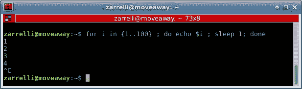

# 第四章：引用和转义

不是所有的东西看起来都像它的样子。我们必须记住，当处理操作符和变量时，有时我们会根据使用它们的方式得到意外的结果。一个小例子可以让这个建议更加清楚：

```
zarrelli:~$ ls

```

目录没有内容，所以它是我们的起始点：

```
zarrelli:~$ touch *

```

我们刚刚创建了一个名为 star 的文件：

```
zarrelli:~$ ls *
*

```

当我们执行 `ls *` 时，我们实际上会看到它：

```
zarrelli:~$ ls
*

```

即使我们没有提供任何参数，简单地执行 `ls` 时，我们仍然能看到这一点：

```
zarrelli:~$ touch 1 2 3

```

现在，我们创建了三个空文件：

```
zarrelli:~$ ls *
* 1 2 3

```

好吧，我们试图列出只有星号的文件，但我们看到了所有的文件。如何只显示以星号命名的文件？我们可以这样做：

```
zarrelli:~$ ls "*"
*

```

所以，现在我们已经引用了星号符号，我们可以看到以它命名的文件。为什么会这样呢？嗯，正如我所说，有一些字符对 Shell 来说有特殊意义，比如星号，它会被 Shell 扩展为*所有*字符。这就是为什么当我们执行 `ls *` 时，我们会看到目录中的所有文件，因为我们请求显示任何文件名由任意字符或数字组成（除了以点号开头的文件名）。引用星号符号可以防止 Shell 解释这个特殊字符，因此将其视为字面意义上的字符，我们只想看到名为 `*` 的文件。

# 特殊字符

我们在前几章已经使用过一些特殊字符，给出了它们的含义提示。现在，我们将仔细查看每一个字符，并研究它们对 Shell 的特殊价值，以及如何在脚本中使用它们。

# 井号字符（#）

这表示一个注释。每行以 `#` 开头的内容都会被视为注释，Shell 不会对其进行解释。让我们看看以下脚本：

```
#!/bin/bash
# I am a comment at the beginning of a line'
ls # I am a comment after a command
#I am a comment preceeding a command and so it is not interpreted ps

```

第一个井号（#）符号实际上不是一个注释，而是与随后的感叹号关联，被解释为*sha-bang*。第二行显示了典型的注释行，第三行是命令后的注释，第四行仍然是注释，`ps` 命令没有被解释和执行。让我们运行它：

```
zarrelli:~$ ./comment.sh
* 1 2 3 comment.sh

```

我们看到了 `ls` 命令的输出，但没有看到预期的 `ps` 输出。同时注意到注释没有被打印到 `stdout`。因为我们在代码中使用它作为注释，它不是运行时需要显示的内容。让我们再添加几行：

```
echo # I am a comment but you cannot see me
echo \# I am a comment but you can see me

```

再次运行脚本：

```
zarrelli:~$ ./comment.sh
* 1 2 3 comment.sh
# I am a comment but you can see me
zarrelli:~$

```

如你所见，第一个 `echo` 命令创建了一个空行，并且注释没有被考虑进去；所以，就好像我们没有给 `echo` 命令传递任何参数。第二个注释则更有意思。我们通过在它前面加反斜杠来转义了井号。因此，转义后的井号只是一个井号后跟一串字符，所有这些字符作为 `echo` 命令的参数一起被打印到 `stdout`。所以，要小心，因为你会发现井号有不同的含义，就像我们在涉及参数替换和变量模式匹配的段落中看到的那样。

# 分号字符（;）

分号是命令分隔符，允许我们将一个命令链式执行到下一个命令，就像我们在 if 构造中所做的那样。例如，看看这个：

```
zarrelli:~$ echo TEST > test.txt ; cat test.txt
TEST

```

我们创建了一个`test.txt`文件，并紧接着使用 `cat` 命令查看其内容。使用 `find -exec` 命令时要小心，因为分号必须进行转义。`-exec` 选项允许我们对 `find` 提供的文件执行命令：

```
zarrelli:~$ echo TEST > test_1.txt ; ls test_1.txt ; find -name test_1.txt 
-exec rm {} 
\; ; ls
test_1.txt
* 1 2 3 comment.sh test.txt

```

在 `find -exec` 对象中，分号是命令序列终止符，而不是命令分隔符，因此必须进行转义，以避免 shell 将其解释为特殊字符。在第一个转义分号之后，我们再添加第二个分号，以分隔 `find` 命令和随后的 `ls` 命令。请注意，命令中的 `{}` 会被 `find` 替换为找到的文件的完整路径。

# 双分号字符（`;;`）

双分号是案例构造选项的终止符。我们将在本书后续部分看到案例构造器，但现在，您可以将其视为一种 if/then/else 结构，广泛应用于创建用户菜单：

```
#!/bin/sh
clear
echo "Please choose between these options:"
echo "ls for listing files"
echo "procs for listing processes"
echo "x for exit"
read input
case "$input" in
 "ls" | "LS" )
   echo "Listing files:"
   ls
   exit 0
   ;;
"procs" | "PROCS")
   echo "Listing processes:"
   ps
   exit 0
   ;;
   "x" | "X" )
   echo "exiting"
   exit 0
   ;;
   * )
   # Default catchall option
   echo "exiting"
   exit 0
   ;;
 esac

```

如您所见，案例构造从 `case` 关键字开始，并由其反转 `esac` 结束。它的作用是验证我们定义的不同选项中的每一个条件。每个选项之间由双冒号分隔。最后一个选项通常是星号，表示*无论你输入什么*，它是一个兜底选项，以防其他选项未能捕捉到用户输入的内容。让我们看一下：

```
Please choose between these options:
ls for listing files
procs for listing processes
x for exit
ls
Listing files:
* 1 2 3 comment.sh menu.sh test.txt

```

用于默认选项：

```
Please choose between these options:
ls for listing files
procs for listing processes
x for exit
aahadie
exiting

```

你是否注意到屏幕上的内容已经被清空了？这要归功于我们在文件开头写的 `clear` 命令，它清空了屏幕，这样你向客户写的任何内容都会出现在屏幕顶部，不会有其他内容分散用户的注意力。

# 案例终止符（`;;&`）和（`;&)`）

这些也是增强型的案例终止符，但它们仅在 Bash 4.0 及更高版本中可用。以下是三种操作符之间的区别：

+   `;;`：如果条件匹配，则不会再测试其他选项

+   `;&`：这使得执行会继续到下一个条件关联的命令

+   `;;&`：这使得 shell 检查选项，并在条件匹配时执行关联的命令

如果没有找到匹配项，则退出状态为`0`；否则，退出状态为最后执行的命令的状态。我们将在下一章中进一步了解这些终止符和案例构造器。

# 点字符（`.`）

点命令是一个 Shell 内建命令，其功能与 source 相同；当在 shell 中执行时，它会执行一个文件。如果在脚本中使用，它会加载引用文件的内容：

```
zarrelli:~$ comment.sh
bash: comment.sh: command not found
zarrelli:~$ . comment.sh
* 1 2 3 comment.sh menu.sh test.txt # I am a comment but you can see me

```

从这个例子可以看到，第一次尝试失败了，因为 `comment.sh` 不在搜索路径中；但第二次成功了，因为点命令执行了脚本。现在，让我们看看如何将外部文件中的一些代码包含到脚本中。我们从以下代码开始编写外部文件，并从中加载：

```
zarrelli:~$ cat external-data
var1="Hello"
var2="Nice to see you"

```

现在，我们需要编写将从此文件加载的脚本：

```
#!/bin/bash
echo "We now source external-data file and get the variables content"
echo ". external-data"
 . external-data
echo "Now that we sourced the external file, we have access to variables content"
echo "The content of var1 is: ${var1}"
echo "The content of var2 is: ${var2}"

```

现在，只需看看发生了什么：

```
zarrelli:~$ ./sourcing.sh We now source external-data file and get the variables content
. external-data
Now that we sourced the external file, we have access to variables content
The content of var1 is: Hello
The content of var2 is: Nice to see you

```

如我们所见，我们实际上从外部数据文件加载了变量的内容。但还有更多，因为如果我们加载了一个外部脚本，它的代码会被执行并且还能返回值给主脚本：

```
#!/bin/bash
echo "Hello from the inner script, can you give me a number?"
read number
case "$number" in
        [[:digit:]] )
          echo "$number is a digit!"
          exit 0
          ;;
          * )
          # Default catchall option
          echo "Sorry, $number is not a digit"
          exit 1
          ;;
esac

```

这是一个简单的菜单，询问用户一个数字并进行检查；不用担心，我们稍后将展示如何匹配数字和字符：

```
zarrelli:~$ ./external-script.sh
Hello from the inner script, can you give me a number?
1
1 is a digit!
zarrelli:~$ ./external-script.sh
Hello from the inner script, can you give me a number?
d
Sorry, d is not a digit

```

有一种快速的方法可以通过使用 POSIX 字符类来匹配字符：

+   `[:alnum:]` 匹配字母和数字字符

+   `[:alpha:]` 只匹配字母字符

+   `[:blank:]` 只匹配制表符或空格

+   `[:cntrl:]` 匹配任何控制字符

+   `[:digit:]` 只匹配 0 到 9 之间的数字

+   `[:graph:]` 匹配 ASCII 表中值介于 33 到 126 之间的任何字符

+   `[:lower:]` 匹配小写字母字符

+   `[:print:]` 匹配图形字符，同时也匹配从 32 到 126 的范围，包括空格字符

+   `[:space:]` 匹配空格和水平制表符

+   `[:upper:]` 匹配大写字母字符

+   `[:xdigit:]` 匹配数字，但采用十六进制表示

现在，让我们做些更有趣的事情，按以下方式修改之前的外部脚本：

```
#!/bin/bash
echo "Hello from the inner script, can you give me an integer between 0 and 9?"
read number
case "$number" in
        [[:digit:]] )
          return 0
          ;;
          * )
          # Default catchall option
          return 1
          ;;
esac

```

我们没有退出，而是将一个值返回给调用脚本，这样子脚本执行结束后，主脚本的执行将继续。现在有了一个新的主脚本：

```
#!/bin/bash
echo "We now source external-script-return.sh file and ask the customer for a digit between 0 and 9"
echo ". external-script-return.sh"
. external-script-return.sh
return=$?
if [ "$return" -eq 0 ]
        then
        echo "The value returned is a digit between 0 and 9, the exit code was $return"
        else
        echo "The value returned is not a digit between 0 and 9, the exit code was $return"
fi

```

现在让我们看几个测试例子：

```
zarrelli:~$ ./sourcing-return.sh

```

我们现在将加载 `external-script-return.sh` 文件，并要求客户输入一个 `0` 到 `9` 之间的数字：

```
. external-script-return.sh
 Hello from the inner script, can you give me an integer between 0 and 9?
6
The value returned is a digit between 0 and 9, the exit code was 0
zarrelli:~$ ./sourcing-return.sh

```

我们现在将加载 `external-script-return.sh` 文件，并要求客户输入一个 `0` 到 `9` 之间的数字：

```
. external-script-return.sh
Hello from the inner script, can you give me an integer between 0 and 9?
25
The value returned is not a digit between 0 and 9, the exit code was 1
zarrelli:~$ ./sourcing-return.sh

```

我们现在将加载 `external-script-return.sh` 文件，并要求客户输入一个 `0` 到 `9` 之间的数字：

```
. external-script-return.sh
Hello from the inner script, can you give me an integer between 0 and 9?
asry
The value returned is not a digit between 0 and 9, the exit code was 1

```

我们使用了内建命令 `return` 来停止内部脚本的执行，一旦满足条件，就会返回一个退出状态到父脚本。通常，我们可以不带任何退出代码使用 `return`，它会返回上一个执行命令的退出状态，或者我们也可以使用一个介于 `0` 到 `255` 之间的整数。难道不希望 `return` 返回一些不同于简单数字的东西吗？好吧，你不能。不过，你可以用一个小技巧来实现。让我们修改之前的子脚本：

```
#!/bin/bash
echo "Hello from the inner script, can you give me an integer between 0 and 9?"
read number
case "$number" in
        [[:digit:]] )
          echo "This is the integer the user gave us: $number"
          exit
          ;;
          * )
          # Default catchall option
          echo "The user did not give us an integer between 0 and 9 but this: $number"
          exit
          ;;
esac

```

现在让我们调用这个脚本：

```
#!/bin/bash
echo "We now source external-script-return-whatever.sh file and ask the customer for a digit between 0 and 9"
echo ". external-script-return-whatever.sh"
returning=$(. external-script-return-whatever.sh)
echo "The value of returning is: $returning"

```

我们做了什么？我们去掉了`return`并将消息输出到标准输出中。然后，在调用脚本中，我们使用了命令替换。这是做什么的？它简单地重新分配了命令的输出；在我们的例子中，我们将被调用脚本的输出重新分配给了返回变量。你可以使用`...`进行命令替换：经典的反引号，虽然它已经被`$(...)`所取代。所以，使用后者，因为它是当前的形式，并且允许你嵌套多个命令替换。让我们试一下：

```
zarrelli:~$ ./sourcing-return-whatever.sh
We now source external-script-return-whatever.sh file and ask the customer for a digit between 0 and 9
. external-script-return-whatever.sh
3
The value of returning is: Hello from the inner script, can you give me an integer between 0 and 9?
This is the integer the user gave us: 3

```

哦，好吧，不错！它给我们回传了来自第一个选项的回显字符串，但不幸的是，我们也捕获了要求用户输入整数的消息。那么，如何去除它呢？你应该已经知道了；只需记住，我们获取的是打印到`stdout`的所有内容，因此我们需要对内部脚本做一个小小的修改：

```
>&2 echo "Hello from the inner script, can you give me an integer between 0 and 9?"
read -s number

```

我们需要对调用脚本进行一次修改，以便最后一行会是这样的：

```
echo "$returning"

```

是时候测试我们的修改了：

```
zarrelli:~$ ./sourcing-return-whatever.sh
We now source external-script-return-whatever.sh file and ask the customer for a digit between 0 and 9
. external-script-return-whatever.sh
Hello from the inner script, can you give me an integer between 0 and 9?
This is the integer the user gave us: 4
zarrelli:~$ ./sourcing-return-whatever.sh
We now source external-script-return-whatever.sh file and ask the customer for a digit between 0 and 9
. external-script-return-whatever.sh
Hello from the inner script, can you give me an integer between 0 and 9?
The user did not give us an integer between 0 and 9 but this: dirthe

```

我们做了什么？首先，我们将`stdout`重定向到`stderr`；两者都与终端相连接，因此用户仍然可以看到脚本提出的问题，但该句子不会被命令替换捕获，因为命令替换只对`stdout`有效。然后，我们使`read`内建命令静默，以免它将值回显到`stdout`和客户输入的值；最后，我们只打印返回值，而没有任何注释。这给了我们一个整洁的输出。当你需要从函数返回一个值到主脚本体中时，这个技巧非常有用，而且不受返回内建命令 0-255 值限制的影响。一个文件可以通过以下语法被调用并传递位置参数：

```
. file arg1 arg2 argn

```

被调用的脚本将使用`$1`、`$2`和`$n`来访问参数的值。从第 10 个参数开始，必须通过`${15}`变量来访问值。在描述点字符之前，我们应该回顾一下上一章所说的内容：单个点是指向当前目录的链接。它在文件名中也被广泛使用，用来专门定义文件扩展名。最后，在正则表达式中，点表示匹配除换行符之外的任何单个字符。

# 双引号（"..."）

双引号也称为部分引号或弱引号，它避免了外壳对大多数特殊字符的解释。我们将在下一节中进一步探讨它们。

# 单引号（'...）

单引号，也称为全引号或强引号，避免了外壳对所有特殊字符的解释。更多信息将在下一节中提到。

# 逗号字符（,）

逗号运算符将算术运算或字符串连接在一起：

```
zarrelli:~$ x=$((5 + 10)) ; echo $x
15
zarrelli:~$ x=$((5 + 10, 6-1)) ; echo $x
5
zarrelli@moveaway:~$ x=$((y=25, 6-1)) ; echo "The value of x is $x and the value of y is $y"
The value of x is 5 and the value of y is 25

```

我们在这里看到的是，即使操作被串联起来，只有最后一个操作的值会被返回。所以，`x`被实例化为仅`6-1`的值。但正如我之前提到的，我们可以使用逗号字符来连接字符串：

```
zarrelli@moveaway:~$ for i in {,1}1 ; do echo $i ; done
1
11
zarrelli@moveaway:~$ for i in {,1}2 ; do echo $i ; done
2
12
zarrelli@moveaway:~$ for i in {,1,}2 ; do echo $i ; done
2
12
2
zarrelli@moveaway:~$ for i in {,1,,}2 ; do echo $i ; done
2
12
2
2
zarrelli@moveaway:~$ for i in {,1,3,}2 ; do echo $i ; done
2
12
32
2

```

正如你所看到的，你可以将一系列值连接起来，创建新的字符串，并在此过程中做一些有趣的事情：

```
zarrelli:~$ for i in {"Hello ","Maybe hello ","Ok, I decided, hello "}world ; do echo $i ; done
Hello world
Maybe hello world
Ok, I decided, hello world

```

这很有趣，但使用它的方式由你决定。你可以在 for 语句中循环并构建一个路径列表进行检查；例如，字符串连接的应用完全取决于你的创造力。

# ,, 和 , () 大小写修饰符

这是 Bash 4.0 新增的功能，它强制在参数替换中进行小写转换。

# ^^ 和 ^ () 大小写修饰符

这是 Bash 4.0 新增的功能，它强制在参数替换中进行大写转换：

```
zarrelli:~$ cat parm-sub.sh
 #!/bin/bash echo "Hello, can you give me a string of characters?"
read my_string
if [[ "$my_string" =~ ^[[:alpha:]]*$ ]]
 then
 echo "Printing the variable \$my_string as \${my_string}: ${my_string}" "| No modifications"
 echo "Printing the variable \$my_string as \${my_string^}: ${my_string^}" "| The first char is uppercase"
 echo "Printing the variable \$my_string as \${my_string^^}: ${my_string^^}" "| All chars are uppercase"
 echo "Printing the variable \$my_string as \${my_string,}: ${my_string,}" "| The first char is lowercase"
 echo "Printing the variable \$my_string as \${my_string,,}: ${my_string,,}" "| All chars are lowercase"
 else
 echo "Please, input characters only"
fi

```

现在，我们将做几个测试，从小写字符串开始：

```
zarrelli:~$ ./parm-sub.sh
Hello, can you give me a string of characters?
sdoijweoi
Printing the variable $my_string as ${my_string}: sdoijweoi | No modifications
Printing the variable $my_string as ${my_string^}: Sdoijweoi | The first char is uppercase
Printing the variable $my_string as ${my_string^^}: SDOIJWEOI | All chars are uppercase
Printing the variable $my_string as ${my_string,}: sdoijweoi | The first char is lowercase
Printing the variable $my_string as ${my_string,,}: sdoijweoi | All chars are lowercase

```

现在，我们将测试一个大写字符串：

```
zarrelli:~$ ./parm-sub.sh
Hello, can you give me a string of characters?
CSEPTKAS
Printing the variable $my_string as ${my_string}: CSEPTKAS | No modifications
Printing the variable $my_string as ${my_string^}: CSEPTKAS | The first char is uppercase
Printing the variable $my_string as ${my_string^^}: CSEPTKAS | All chars are uppercase
Printing the variable $my_string as ${my_string,}: cSEPTKAS | The first char is lowercase
Printing the variable $my_string as ${my_string,,}: cseptkas | All chars are lowercase

```

当你想要*规范化*你从前一个操作或用户输入中获取的字符串时，这非常有用。

# 反斜杠 (\)

这个转义字符用于防止特殊字符被 shell 解释。我们在前面的代码段中看到过它的使用，我们转义了`\${my_input}`，使得 echo 能够将其字面打印出来，而不是试图输出其值。使用`\`具有与将变量用单引号括起来相同的效果，因此这是一个强引用，对于字面打印`"`和`'`字符非常有用，这些字符通常被解释为引号字符。

# 斜杠 (/)

斜杠有两种不同的用途：

+   它是路径中的文件名分隔符，如我们在`/usr/lib/dbus-1.0/dbus-daemon-launch-helper`示例中看到的那样。每个斜杠之间的部分都是一个目录，直到最后的文件名。

+   它是除法的算术运算符。

# '...'

这是命令替换，我们在前几页刚刚使用过；它将`stdout`命令赋值给一个变量。

# 冒号字符 (:)

冒号实际上什么也不做，除了扩展参数并执行重定向。在循环和测试中，它可以在满足条件时什么也不做。看到它如何用于评估一系列变量的参数替换也很有意思：

```
#!/bin/bash
x=32
y=5
: ${x?} ${y?} ${z?}
And now let's execute it:
zarrelli:~$ ./test-variable.sh
./test-variable.sh: line 5: z: parameter null or not set

```

这里是重定向的一个小例子：

```
zarrelli:~$ echo "012345679" > test.colon.2
zarrelli:~$ ls -lah test.colon.2
-rw-r--r-- 1 zarrelli zarrelli 10 Feb 19 14:18 test.colon.2
zarrelli:~$ : > test.colon.2
zarrelli:~$ ls -lah test.colon.2
-rw-r--r-- 1 zarrelli zarrelli 0 Feb 19 14:18 test.colon.2

```

所以，我们在这里看到的是，冒号与`>`的组合为我们提供了一种快速截断普通文件的方法，而不改变其权限。如果文件不存在，它将被创建；但是，如果我们使用`>>`，它只会创建一个文件，而不会截断一个已存在的文件。你会发现冒号有更多*奇怪*的用途，比如在`/etc/passwd`文件中作为字段分隔符，或者作为合法的函数名称。

# 惊叹号 (!)

惊叹号是一个关键字，用来否定或反转一个测试或退出状态。例如，看看这个：

```
zarrelli:~$ ls -lah test.colon.2 ; echo $?
-rw-r--r-- 1 zarrelli zarrelli 10 Feb 19 14:22 test.colon.2
0

```

`ls`的退出码是`0`，是的，因为它成功执行。但我们来反转它：

```
zarrelli:~$ ! ls -lah test.colon.2 ; echo $?
-rw-r--r-- 1 zarrelli zarrelli 10 Feb 19 14:22 test.colon.2
1

```

# 关键字

*关键字* 是一个保留字，在 shell 中具有特殊意义并且是硬编码的，比如内建命令；但不同于后者，关键字不是完整的命令，而是命令构造的一部分，你只需输入以下内容即可列出这些关键字：

+   compgen -k

+   if

+   then

+   else

+   elif

+   fi

+   case

+   esac

+   for

+   select

+   while

+   until

+   do

+   done

+   in

+   function

+   time

+   {

+   }

+   !

+   [[

+   ]]

从命令行执行，但不是从脚本中执行时，感叹号会触发 bash 历史记录。

# 星号 (*)

星号，也被称为通配符，在文件名扩展中使用时，匹配目录中的所有文件名。文件名扩展也叫做 **Globbing**。它考虑了一些特殊字符，如 `*`，它会扩展为所有内容，`?`，它会扩展为任何单个字符，并且还有一些字符集，使用括号表示：

```
zarrelli:~$ ls -lah [es]*
-rw-r--r-- 1 zarrelli zarrelli 36 Feb 17 07:50 external-data
-rwxr--r-- 1 zarrelli zarrelli 211 Feb 17 17:40 external-script-return.sh
-rwxr--r-- 1 zarrelli zarrelli 373 Feb 18 11:58 external-script-return-whatever.sh
-rwxr--r-- 1 zarrelli zarrelli 257 Feb 17 08:22 external-script.sh
-rwxr--r-- 1 zarrelli zarrelli 391 Feb 17 17:37 sourcing-return.sh
-rwxr--r-- 1 zarrelli zarrelli 235 Feb 19 10:40 sourcing-return-whatever.sh
-rwxr--r-- 1 zarrelli zarrelli 284 Feb 17 07:53 sourcing.sh

```

正如我们在示例中看到的，我们列出了所有文件名以 `e` 或 `s` 开头的 `*` 文件。但它也将 `^` 字符解释为否定：

```
zarrelli@moveaway:~/Documents/My books/Mastering bash/Chapter 4/Scripts$ ls -lah [^es]*
-rw-r--r-- 1 zarrelli zarrelli 0 Feb 16 08:35 *
-rw-r--r-- 1 zarrelli zarrelli 0 Feb 16 08:35 1
-rw-r--r-- 1 zarrelli zarrelli 0 Feb 16 08:35 2
-rw-r--r-- 1 zarrelli zarrelli 0 Feb 16 08:35 3
-rwxr--r-- 1 zarrelli zarrelli 249 Feb 16 13:24 comment.sh
-rwxr-xr-x 1 zarrelli zarrelli 409 Feb 16 14:59 menu.sh
-rwxr--r-- 1 zarrelli zarrelli 700 Feb 19 11:22 parm-sub.sh
-rw-r--r-- 1 zarrelli zarrelli 0 Feb 19 14:16 test.colon
-rw-r--r-- 1 zarrelli zarrelli 10 Feb 19 14:22 test.colon.2
-rw-r--r-- 1 zarrelli zarrelli 5 Feb 16 14:07 test.txt
-rwxr-xr-x 1 zarrelli zarrelli 42 Feb 19 14:14 test-variable.sh

```

在这种情况下，我们列出了当前目录下所有文件名不以 `e` 或 `s` 开头的文件。要小心，文件通配符中的 `*` 不会匹配以点开头的文件名：

```
zarrelli:~$ mkdir test
zarrelli:~$ cd test/
zarrelli:~$ touch file
zarrelli:~$ touch .another_file
zarrelli:~$ ls -l *
-rw-r--r-- 1 zarrelli zarrelli 0 Feb 19 15:08 file

```

显然缺少一些内容，我们再试试这个：

```
zarrelli:~$ ls -lah
total 8.0K
drwxr-xr-x 2 zarrelli zarrelli 4.0K Feb 19 15:08 .
drwxr-xr-x 3 zarrelli zarrelli 4.0K Feb 19 15:08 ..
-rw-r--r-- 1 zarrelli zarrelli 0 Feb 19 15:08 .another_file
-rw-r--r-- 1 zarrelli zarrelli 0 Feb 19 15:08 file

```

你也可以尝试这个，效果不错：

```
ls -l .*

```

最后的备注，你会发现星号在正则表达式中也被用作通配符，具有相同的含义，同时在算术运算中也用作乘法运算符。

# 双星号（**）

双星号在两种不同的上下文中使用：

+   它在算术上下文中用作指数运算符

+   它作为一个扩展的文件匹配通配符运算符从 Bash 4 开始使用，意味着它递归匹配文件名和目录。

所以，我们有了这个：

```
zarrelli:~$ for i in * ; do echo "$i" ; done
file
test2

```

这与以下内容不同：

```
zarrelli:~$ for i in ** ; do echo "$i" ; done
file
test2
test2/file2

```

双星号匹配所有文件和目录。如果双星号对你不起作用，可以通过 `zarrelli:~$ shopt -s globstar ; for i in ** ; do echo "$i" ; done` 来启用 globstar shell 选项。`globstar` 值改变了 shell 对双星号的解释方式，在文件名扩展中，匹配所有文件和任何子目录。如果模式后面跟着 `/`，则只会匹配目录和子目录：

```
zarrelli:~$ for i in **/ ; do echo "$i" ; done
test2/

```

# 测试运算符（?）

测试运算符可以用于几种不同的场景。我们已经在参数替换中看到，它用于检查变量是否有值。在算术运算中，它可以用来实现 C 风格的三元运算符：

```
#!/bin/bash
x=20
y=30
w=40
z=50
k=100
echo 'Usually you would write a control loop in the following way:'
echo 'if [[ $x -gt $y ]]'
echo '     then'
echo '       z="$w"'
echo '       echo "The value for z is: $z"'
echo '     else'
echo '       z="$k"'
echo ' echo "The value for z is: $z"'
echo 'fi'
if [[ $x -gt $y ]]
   then
      z="$w"
      echo "The value for z is: $z"
   else
      z="$k"
      echo "The value for z is: $z"
fi
echo 'But you can also use the C-style trinary operator to achieve the same result:'
echo '(( z = x>y?w:k ))'
echo 'echo "The value for z is: $z"'
(( z = x>y?w:k ))
echo "The value for z is: $z"

```

如你所见，C 风格的表示法更简洁，尽管它不如标准的循环表示法易读。让我们在这里尝试一下：

```
zarrelli:~$ ./c-style.sh

```

通常，你会以以下方式编写控制循环：

```
if [[ $x -gt $y ]]
   then
      z="$w"
      echo "The value for z is: "$z""
   else
      z="$k"
      echo "The value for z is: "$z""
fi
The value for z is: 100

```

但你也可以使用 C 风格的三元运算符来实现相同的结果：

```
(( z = x>y?w:k ))
echo "The value for z is: $z"
The value for z is: 100

```

如你所见，我们得到了相同的结果，但代码更加简洁。实质上，我们给出了一个以`?`字符结尾的条件，然后，替代结果跟随其后，使用`:`字符分隔。

我们看到，C 风格在循环中被广泛使用，可以定义为在循环中用于评估数学表达式的复合命令，正如在前面的例子中所看到的，它还可以用于赋值一个变量。它由三个块组成：第一个在第一次迭代前初始化变量，第二个检查退出循环的条件，第三个修改初始条件。听起来很奇怪？看这个，它会显得非常熟悉：

```
#!/bin/bash
for ((i = 0 ; i < 3 ; i++)); do
  echo "Counting loop number $i"
done

```

现在，让我们执行它：

```
zarrelli:~$ ./c-style-counter.sh
Counting loop number 0
Counting loop number 1
Counting loop number 2

```

最后，你可以在文件名扩展的通配符中找到用于文件名扩展的引号，它作为一个匹配任意单个字符的通配符；在正则表达式中，它用作单个字符匹配。

# 替换（$）

我们已经知道这个并且使用过它，用于变量替换，使我们能够访问变量的内容：

```
zarrelli:~$ x=10 ; echo $x
10

```

它也被用于正则表达式中，以匹配行尾：

```
ls | grep [[:digit:]]$
1
2
3
test.colon.2

```

在这个例子中，`ls` 的输出被过滤为名称以单个整数结尾的文件。

# 参数替换（${}）

这给我们带来了一个参数替换，我们之前在本书中已经看到过。

# 引号字符串扩展（$'...'）

这是一个引号字符串扩展，用于扩展 Unicode 或 ASCII 中的转义八进制或十六进制值：

```
zarrelli:~$ x=$'\110\145\154\154\157' ; echo "$x"
Hello

```

我们刚刚连接了一些转义的八进制值，以便得到一个漂亮且友好的 ASCII 字符串，并将其分配给变量`x`。

# 位置参数（$* 和 $"）

第一个（`$*`）表示所有位置参数作为一个单独的字符串，第二个（`$"`）表示所有位置参数，如下所示：

```
#!/bin/bash
counter=0
echo "First trying the \$*"
for i in "$*"
do
(( counter+=1 ))
echo $counter
done
counter=0
echo "And now \$@"
for i in "$@"
do
(( counter+=1 ))
echo $counter
done

```

现在，让我们测试它：

```
zarrelli$ ./positional-single.sh 1 2 3 4 5
First trying the $*
1
And now $@
1
2
3
4
5

```

正如我们在第一个案例中看到的，参数作为单个单词传递，但要小心，`$*` 必须加引号，以避免扩展时出现奇怪的副作用。`$@` 将每个参数作为带引号的字符串传递，不做任何解释。

# 退出状态（$?）

我们已经看到它表示命令、函数和脚本的退出状态：

```
zarrelli:~$ ls 2&>1 ; echo $?
0

```

# 进程 ID（$$）

这个持有**进程 ID**（**PID**），它在以下内容中出现：

```
#!/bin/bash
echo $$

```

让我们执行它：

```
zarrelli:~$ ./pid.sh
4772

```

# 将命令分组（command1 ; command2 ; commandn）

将命令括在括号中会让它们在子 shell 中执行，这具有一个微妙但显著的含义：在子 shell 中所做的任何事情都无法从调用的 shell 中访问，因此，如果你从一个脚本执行一个包含命令的子 shell，那么在子 shell 中所做的事情将无法传递到调用脚本：

```
#!/bin/bash
x=10
echo "The initial value of x is: $x"
(x=$(( x*x )) ; echo "The value of x is: $x")
echo "But outside the subshell the value of x is untouched: $x" 

```

现在，让我们执行代码：

```
zarrelli:~$ ./subshell.sh The initial value of x is: 10 The value of x is: 100 But outside the subshell the value of x is untouched: 10

```

如果我们回顾一下我们在第一章中读到的内容，这就变得很简单了：子 shell 继承了来自脚本的调用 shell 的环境，因此它可以访问变量`x`的值，但不能将任何内容注入回去。因此，在将`x`的值乘以自身并重新分配给变量后，我们可以在子 shell 中打印结果`100`。但一旦退出，我们将保留原始值`x`和`10`。变量`x`在主脚本中从未更改；它仅在子 shell 中更改。正如我们将在本书的后面看到的那样，`()`也用于初始化数组：

```
array= (element1 element2 elementn) {a,b,c}

```

大括号扩展可以方便地处理多个项目：

```
zarrelli:~$ ls *.{[[:digit:]],txt} test.colon.2 test.txt

```

在这种情况下，我们展开了以任意字符开头并以点结束，后面跟着单个整数或`txt`后缀的文件的`*`。但实际上，我们可以对列表中的文件应用命令，使其生效：

```
zarrelli:~$ wc -l {test.txt,test.colon.2,*-data} 1 test.txt 1 test.colon.2 2 external-data 4 total 

```

或者简单地，我们可以这样做：

```
zarrelli:~$ echo {1,2,3} 1 2 3

```

但要小心，在大括号内不要使用空格，除非您转义或引用它们；否则您可能会遇到奇怪的问题：

```
{element1..elementn}

```

扩展的大括号扩展，从 Bash 3 开始，是创建迭代器的简便方法：

```
zarrelli:~$ for i in {0..5} ; do echo $i ; done 0 1 2 3 4 5

```

或者创建更复杂的东西，如下所示：

```
zarrelli:~$ for i in {1..3} ; do for k in {a..c} ; do echo $i,$k ; done ; done 1,a 1,b 1,c 2,a 2,b 2,c 3,a 3,b 3,c { command1 ; command2 ; commandn ;}

```

大括号广泛用于创建所谓的匿名函数，这些函数具有一个有趣的属性：这些函数内部的代码对脚本的其余部分可见。还有一种组合命令的方式，但有一些有趣的区别：

+   命令在同一个 shell 中执行，不会生成子 shell

+   由于这个原因，所有在括号内实例化的变量都可以从调用 shell 中访问，也就是从调用脚本中。

+   大括号是保留字，必须用空格或元字符与括号内的元素分开

+   命令列表末尾需要换行符或`;`

这是如何使用大括号的示例：

```
#!/bin/bash
x=10
echo "The initial value of x is: $x"
multiplier () {
local y=$(( x*x ))
echo "The value of y in the function is: $y"
}
echo "We now trigger the function..."
multiplier
echo "The value of y right after the function execution is: $y"
{ z=$(( x*x )) ;
echo "The value of z in the function is: $z" ; }
echo "The value of z right after the function execution is: $z"

```

现在，让我们来运行它：

```
zarrelli:~$ ./curly.sh The initial value of x is: 10 We now trigger the function... The value of y in the function is: 100 The value of y right after the function execution is: The value of z in the function is: 100 The value of z right after the function execution is: 100

```

正如您所见，我们无需调用匿名函数来执行它与普通函数不同。我们没有使用本地作用域来存储变量，因为这是不允许的，这将引发错误。我们稍后将详细了解函数和作用域。

大括号支持代码的 I/O 重定向。

# 大括号（{}）

再次说明，大括号有另一种含义：与`xargs -i`（替换字符串）一起使用大括号可以作为名称的占位符：

```
zarrelli:~$ ls *.{[[:digit:]],txt} | xargs -i echo "Found file: {}" Found file: test.colon.2 Found file: test.txt

```

# 完整路径（{} \;）

与`find -exec`一起使用，这会保存 find 定位的文件的完整路径。它不是一个 shell 内建命令，并且必须转义命令序列末尾的分号，以避免 shell 解释：

```
find . -name *.txt -exec cp {} copy.txt \; zarrelli:~$ ls -lah test.txt copy.txt -rw-r--r-- 1 zarrelli zarrelli 5 Feb 21 16:12 copy.txt -rw-r--r-- 1 zarrelli zarrelli 5 Feb 16 14:07 test.txt

```

# 表达式（[]）

这测试方括号之间的表达式。这是 shell 内建的测试，而不是称为`/usr/bin/[`的命令。

[[ -f copy.txt ]] && echo "文件找到

# 表达式（[[]]）

再次测试方括号之间的表达式，但以更灵活的方式。我们在前几章中已经看到了这一点。

# 数组索引（[]）

这指向数组中位于指定索引位置的对象：

```
fruit=(apple banana lemon) ; echo ${fruit[1]} banana

```

我们稍后会看到数组是什么，现在只需记住数组索引从`0`开始，因此`1`是数组中的第二个元素。

# 字符范围（[]）

这定义了正则表达式中匹配字符的范围：

```
zarrelli:~$ ls | grep ^[c-m] comment.sh copy.txt c-style-counter.sh c-style.sh curly.sh external-data external-script-return.sh external-script-return-whatever.sh external-script.sh menu.sh

```

在这种情况下，我们匹配了所有以`c`到`m`范围内的字符开头的文件名。

# 整数扩展（$[…]）

这是一个整数扩展，已被弃用，并被`((…))`替代。

# 整数扩展（(((..)))）

这是整数扩展。我们在前几章已经看到过如何使用它。

# 演示

我们在本书开头已经看过这个，它们用于重定向。你将在提供的示例中找到更多如何使用它的细节。

# here 文档（<<）

here 文档是一种重定向形式，它强制 Shell 从随后的字符块中读取输入，直到用户定义的分隔符，然后将这一串字符作为命令或文件描述符的标准输入。如我们在下一个例子中所见，`cat`命令的参数既没有在命令行提供，也没有询问用户，而是写入脚本中，位于两个`DELIMITER`词之间：

```
#!/bin/bash
cat << DELIMITER
This is a string
followed by another
date $(date +%Y.%m.%d)
until the 
DELIMITER

```

现在，让我们运行它：

```
zarrelli:~$ ./here-date.sh This is a string followed by another date 2017.02.21 until the 

```

`<<`右侧的分隔符可以是你想要的任何字符串，只要它与最后一行匹配：在两个分隔符之间的所有内容将作为标准输入传递给我们的例子中的`cat`命令。请注意，分隔符不受任何命令替换、算术运算或路径名扩展的影响。但是如果分隔符没有被引用，则分隔符之间的行将受到算术和文件扩展以及命令替换的影响。

一个不错的做法是在`<<`的右侧添加`–`，这样可以去掉输入中的尾随制表符，这使得创建带缩进的 here 文档成为可能：

```
#!/bin/bash
cat << DELIMITER
This is a string
        followed by an indented one
            with an indented date: $(date +%Y.%m.%d)
until the
DELIMITER

```

你现在会得到这个：

```
zarrelli:~$ ./here-date-indented.sh This is a string
 followed by an indented one with an indented date: 2017.02.21 until the 

```

如果你将`<<`换成`<`，你将得到没有缩进的输入：

```
zarrelli:~$ ./here-date-indented.sh This is a string followed by an indented one with an indented date: 2017.02.21 until the 

```

# 这里字符串（<<<）

*here*字符串是*here*文档的简化版本，它由一行组成，分隔符扩展后将命令传入：

```
#!/bin/bash
today=$(date +%Y.%m.%d)
cat <<< $today

```

输出在这里：

```
zarrelli:~$ ./here-date-string.sh 2017.02.21

```

# ASCII 比较运算符 (<) 和 (>)

这是对字符串的 ASCII 比较。我们在前一章已经看到了如何使用这些运算符。

# 分隔符（\< 和 \>）

分隔符用于在正则表达式中标识一个单词。让我们创建一个文件：

```
zarrelli:~$ echo "barnaby went to the bar to see the barnum musical" > text.file 

```

现在，我们将使用单词分隔符设置为`bar`，并使用`-o`选项进行`grep`，这将只输出匹配的片段，而不是包含它的所有行：

```
grep -o '\<bar\>' text.file bar

```

这是正确的。只有一个名为`bar`的单词，其他的是复合单词，我们可以再次确认这一点：

```
zarrelli:~$ grep -o bar text.file bar bar bar

```

如果我们不查找名为`bar`的单词，而只查找三个字符的字符串 bar 的匹配项，我们会发现它在文件中匹配了三次。

# 管道符号（|）

管道是进程间通信的经典示例：它将一个进程的`stdout`传递给另一个进程的`stdin`：

```
zarrelli:~$ ls -lah | wc -l 35

```

在这个例子中，我们仅列出了当前目录的内容，并将输出作为`stdin`传递给`wc`工具，后者统计了输入数据的行数。管道后的命令在子 Shell 中运行，因此无法将任何修改后的值返回给父进程；如果管道中的某个命令因故中止，这就会导致所谓的破损管道，管道执行停止。

# 强制重定向 (>|)

即使为 Shell 设置了`noclobber`选项，这也强制执行重定向。Clobbering 是指覆盖文件内容的行为，这点我们在重定向时已经看到了，不过让我们看一下这个例子：

```
zarrelli:~$ echo "123" > override.txt zarrelli:~$ cat override.txt 123 zarrelli:~$ echo "456" > override.txt zarrelli:~$ cat override.txt 456

```

一切都按预期进行。我们重定向了`echo`的输出，并且在第二次运行时，覆盖了文件的内容。但现在让我们为 Shell 设置`noclobber`选项：

```
zarrelli:~$ set -o noclobber

```

我们将尝试覆盖文件的内容：

```
zarrelli:~$ echo "789" > override.txt bash: override.txt: cannot overwrite existing file

```

没办法，我们被`noclobber`选项所阻止，防止意外覆盖文件：

```
zarrelli:~$ cat override.txt 456

```

实际上，文件的内容仍然相同，但现在是这样的：

```
zarrelli:~$ echo "789" >| override.txt zarrelli:~/$ cat override.txt 789

```

我们强制了重定向，现在文件的内容已经改变：

```
zarrelli:~$ set +o noclobber

```

让我们恢复`noclobber`选项。

查看一下`man bash`，它列出了很多有趣的选项，你可以使用`set -o`选项来改变 Bash 的行为。例如，看看这个：

+   `+B`禁用花括号扩展

+   `-f`禁用文件名扩展，也叫做通配符匹配。

+   `-i`以交互模式运行脚本

+   `-n`读取脚本中的命令但不执行它们；它是经典的干跑模式，用于语法检查

+   `-o`使得一切符合 POSIX 规范

+   `-p`脚本以 SUID 身份运行

+   `-r`脚本在受限的 Shell 中运行

+   `-s`命令从`stdin`读取

+   `-v`命令在执行前会打印到`stdout`

+   `-x`类似于`-v`，但命令会展开

# 逻辑或运算符（||）

我们已经理解了它们，所以可以查看前面的页面。

# 演示

这会将一个进程发送到后台。看这个：

```
zarrelli:~$ echo "Hello, see you in 5 seconds" ; sleep 5 Hello, see you in 5 seconds

```

如果你将 sleep 放在后台，它只会暂停 5 秒钟，之后返回提示符：

```
zarrelli:~$ echo "Hello, see you in 5 seconds" ; sleep 5 & Hello, see you in 5 seconds [1] 8163

```

Shell 会立即把控制权交还给你，因为 sleep 进程不会再从终端获取输入，命令行对用户保持可用。这样做的好处之一是，虽然你每次只能运行一个前台进程，但在执行期间，你无法输入其他命令与后台进程交互，因此，你可以根据系统资源的限制，启动任意数量的后台进程。

你可以通过按下*Ctrl* + *Z*，然后输入`fg`，手动将前台进程切换到后台：

```
zarrelli:~$ echo "Hello, see you in 50 seconds" ; sleep 50 Hello, see you in 50 seconds ^Z [6]+ Stopped sleep 50 zarrelli:~$ fg sleep 50

```

# 逻辑与运算符

这是逻辑与运算符，它会在测试中返回`true`，前提是两个条件都为真。

# 破折号字符(-)

破折号是选项字符，通常表示命令行中的可选参数：

```
ps -ax

```

它还用作参数替换中的前缀，用于默认参数，并且也用于从 stdin/stdout 重定向：

```
zarrelli:~$ cat - 1 1 2 2 3 3 ^C 

```

或者，它可以执行如下操作：

```
zarrelli:~$ tar cvzf - $(ls text.file) > zipped.tgz zarrelli:~$ tar -tf zipped.tgz text.file

```

我们所做的操作是通过命令替换获取文件名并输出到`stdout`，通过`-`从`stdin`读取，然后将`tar`操作的结果重定向到`stdout`以创建压缩文件。

我们还可以使用破折号返回到之前的目录，这个目录存储在环境变量`$OLDPWD`中：

```
zarrelli:~$ mkdir -p dir1/dir2 zarrelli:~$ cd dir1/ zarrelli:~$ cd dir2/ zarrelli:~$ cd - zarrelli:~$ pwd dir1

```

最后，在算术运算上下文中，破折号表示减法，因此我们可以从一个数字中减去另一个数字。

# 双破折号（--）

双破折号通常代表命令的长选项。例如，在下一个示例中，我们使用名为`-a`的短选项和名为`--all`的长选项来启用相同的行为；长选项通常是短选项的更易读形式。短选项以单破折号开始，而长选项以双破折号开始：

```
zarrelli:~$ ls -a . .. dir2 zarrelli:~$ ls --all . .. dir2

```

它也用于我们在几页前看到的`set`命令，以设置 Bash 选项。

# 操作符 =

它可以是赋值运算符：

```
zarrelli:~$ x=10 ; echo $x 10

```

它也可以是字符串比较运算符：

```
zarrelli:~$ x=10 ; y=10 ; if [[ "$x" = "$y" ]] ; then echo "Success" ; fi Success 

```

# 操作符 +

在算术运算上下文中，它可以用作操作符，将一个数字加到另一个数字上。在正则表达式场景中，它匹配一个或多个之前的正则表达式：

```
zarrelli:~$ echo "Hello" | grep 'Hel\+o' Hello

```

加号字符也被一些内建命令用于在参数替换上下文中启用某些选项，以标记变量扩展的替代值：

```
zarrelli:~$ x=10 ; y=${x+20} ; echo $y 20

```

如果设置了`x`，它将使用值`20`，否则使用空字符串。

# 取模运算符（%）

这是取模的算术运算符，表示除法的余数。取模运算符也用作参数替换上下文中的模式匹配运算符：

```
zarrelli:~$ x="highland" ; y=${x%land} ; echo $y high

```

# 操作符 ~

这表示环境变量`$HOME`的相同值：

```
zarrelli:~$ echo ~ /home/zarrelli zarrelli:~$ ls /home/zarrelli/ Desktop Documents Downloads Music Pictures Public Templates test.file test.sh tmp Videos zarrelli:~$ ls ~/tmp/ setting.sh zarrelli:~$ cd ~ zarrelli:~$ pwd /home/zarrelli

```

# 操作符 ~+

这是当前工作目录，其值由名为`$PWD`的环境变量保存。

# 操作符 ~-

这是之前的工作目录，其值由名为`$OLDPWD`的环境变量保存。

# 操作符 ~= 

这是双括号内正则表达式的匹配操作符。它是在 Bash 3 中引入的。

# 操作符 ^

在正则表达式中，它匹配从行首开始的给定模式。我们在前面的页面中看到了一些例子。

# 控制字符（^ 和 ^^）

在 Bash 4 中引入的，它们用于在参数替换上下文中进行大写转换。

除了我们目前看到的特殊字符外，还有一个键组合，通常称为控制字符。它们并不直接在脚本中使用，而是便于你与终端的交互。它们是由两个字符组合而成，通常是*Ctrl*和另一个字符一起按下；但它们也可以以转义的十六进制或八进制表示：

+   *Ctrl*+*A*：此操作将光标移动到命令行字符串的开头。

+   *Ctrl*+*B*：这是退格键，但不会删除任何内容。

+   *Ctrl*+*C*：此操作会中断前台作业，并终止它。



+   *Ctrl*+*D*：此操作会退出 shell。如果用户在终端窗口中并且正在输入，它会删除光标所在的字符。如果窗口为空，它将关闭窗口。

+   *Ctrl*+*E*：此操作将光标移动到命令行中字符串的末尾。

+   *Ctrl*+*F*：此操作将光标向前移动一个位置。

+   *Ctrl*+*G*：在终端窗口中，这可能会发出一个蜂鸣声。

+   *Ctrl*+*H*：这是退格键，会删除光标下的字符，称为**rubout**。

+   *Ctrl*+*I*：这是水平制表符。

+   *Ctrl*+*J*：这是换行符，它也可以表示为`\012`八进制和`\x0a`十六进制。

+   *Ctrl*+*K*：这是一个垂直制表符。在终端窗口中，它会删除光标下方到当前行末的所有字符。

+   *Ctrl*+*L*：这是换页符，它会清除屏幕上的所有内容。

+   *Ctrl*+*M*：这是回车符。

+   *Ctrl*+*N*：此操作会从命令行历史中删除一行。

+   *Ctrl*+*O*：在命令行中输入时，它会带你到新的一行，并执行当前的命令。

+   *Ctrl*+*P*：此操作会从命令行历史中恢复上一个命令。

+   *Ctrl*+*Q*：这是在终端窗口中恢复`stdin`的快捷键。

+   *Ctrl*+*R*：此操作会在历史记录中向后搜索文本。

+   *Ctrl*+*S*：此操作会暂停终端窗口中的`stdin`，通过*Ctrl*+*Q*恢复。

+   *Ctrl*+*T*：此操作会交换光标下的字符与前一个字符的位置。

+   *Ctrl*+*U*：此操作会删除光标位置与命令行开头之间的所有字符。在某些配置中，它会删除命令行上的所有字符。

+   *Ctrl*+*V*：此操作主要在编辑器中使用，它允许在插入文本时输入控制字符。

+   *Ctrl*+*W*：在终端或 X 终端中，它会删除从光标位置向后直到第一个空格的所有字符；在某些配置中，它会删除到第一个非字母数字字符为止。

+   *Ctrl*+*X*：你会在许多文字处理软件中找到它，它用于将文本从编辑器剪切并粘贴到剪贴板。

+   *Ctrl*+*Y*：此操作会将用*Ctrl*+*U*或*Ctrl*+*W*删除的文本粘贴回来。

+   *Ctrl*+*Z*：此操作会暂停正在前台运行的任务。

+   空格：通常用作字段分隔符。在某些情况下，它是必须的，而在其他情况下则是禁止的，就像我们在前几章的示例中看到的那样。

# 引用和转义

我们已经看到，在 Bash 中，引用和转义有多么重要，这归因于某些字符不仅仅是它们看起来的样子，而是对 shell 来说具有特殊意义，shell 会在遇到这些字符时进行解释。但有时候，我们希望这些字符仅仅是它们本来的样子；我们希望在字符串中保留空格，而不是将其分割成单词，或者我们只是想查看是否存在一个 `*` 文件名。或者我们希望 `echo` 一个双引号而不是开始一个引用。因此，我们通过引用和转义来保持我们所看到的内容，避免 shell 对其进行解释。

# 反斜杠 (`\`)

反斜杠是我们用来转义所有其他字符的字符。太好了。这意味着什么呢？简而言之，反斜杠前缀的每个字符都保持其字面值或含义。反斜杠并不是作用于整个字符串，而只是作用于其后面的字符，它被广泛用于转义文件名中的空格：

```
zarrelli:~$ mkdir this is a directory with spaces in the name total 44K drwxr-xr-x 11 zarrelli zarrelli 4.0K Feb 23 09:50 . drwxr-xr-x 3 zarrelli zarrelli 4.0K Feb 23 09:44 .. drwxr-xr-x 2 zarrelli zarrelli 4.0K Feb 23 09:48 a drwxr-xr-x 2 zarrelli zarrelli 4.0K Feb 23 09:48 directory drwxr-xr-x 2 zarrelli zarrelli 4.0K Feb 23 09:48 in drwxr-xr-x 2 zarrelli zarrelli 4.0K Feb 23 09:48 is drwxr-xr-x 2 zarrelli zarrelli 4.0K Feb 23 09:48 name drwxr-xr-x 2 zarrelli zarrelli 4.0K Feb 23 09:48 spaces drwxr-xr-x 2 zarrelli zarrelli 4.0K Feb 23 09:48 the drwxr-xr-x 2 zarrelli zarrelli 4.0K Feb 23 09:48 this drwxr-xr-x 2 zarrelli zarrelli 4.0K Feb 23 09:48 with

```

嗯，结果并不是我们想要的，但它是我们应该预期的：空白字符被 shell 解释为分隔符，因此 `mkdir` 创建了与作为参数传入的单词数量相同的目录。我们需要让 `mkdir` 解析一个包含空格的完整字符串，而不是一系列由空格分割的单词：

```
zarrelli:~$ mkdir this\ is\ a\ directory\ with\ spaces\ in\ the\ name zarrelli:~$ ls -lah total 48K drwxr-xr-x 12 zarrelli zarrelli 4.0K Feb 23 09:52 . drwxr-xr-x 3 zarrelli zarrelli 4.0K Feb 23 09:44 .. drwxr-xr-x 2 zarrelli zarrelli 4.0K Feb 23 09:48 a drwxr-xr-x 2 zarrelli zarrelli 4.0K Feb 23 09:48 directory drwxr-xr-x 2 zarrelli zarrelli 4.0K Feb 23 09:48 in drwxr-xr-x 2 zarrelli zarrelli 4.0K Feb 23 09:48 is drwxr-xr-x 2 zarrelli zarrelli 4.0K Feb 23 09:48 name drwxr-xr-x 2 zarrelli zarrelli 4.0K Feb 23 09:48 spaces drwxr-xr-x 2 zarrelli zarrelli 4.0K Feb 23 09:48 the drwxr-xr-x 2 zarrelli zarrelli 4.0K Feb 23 09:48 this drwxr-xr-x 2 zarrelli zarrelli 4.0K Feb 23 09:52 this is a directory with spaces in the name drwxr-xr-x 2 zarrelli zarrelli 4.0K Feb 23 09:48 with

```

好的，我们终于创建了一个名字中包含空格的目录。

你也可以在脚本或命令行中看到反斜杠的使用，当你的指令变得有些过长时。你会看到它们在你想换行而不触发回车时使用，这样就不会执行不完整的命令行：

```
zarrelli@moveaway:~$ var="This can become a bit too long \ > so better to go on a new line and print on the next" ;\ > echo \ > $var This can become a bit too long so better to go on a new line and print on the next

```

# 双引号 (`""`)

**双引号** 被称为弱引用，因为它们防止 shell 解释所有元字符，除了 `$`、`"`、`'` 和 `\`。这意味着一些事情；最重要的是，你可以引用变量值，即使它已经被引用：

```
zarrelli:~$ x=10 ; echo "$x" 10

```

这也意味着你可以使用反斜杠来转义 `$`，以打印字面量的 `$a` 字符串：

```
zarrelli:~$ x=10 ; echo "\$x" $x

```

因此，要使用前面解释过的字符之一，你必须用反斜杠对其进行转义。

此外，双引号保留空格，所以我们可以重新编写之前看到的命令：

`mkdir this\ is\ a\ directory\ with\ spaces\ in\ the\ name` 相当于 `mkdir "this is a directory with spaces in the name"`。

那么，如果你想完全防止任何解释呢？你必须依赖强引用。

# 单引号 (`'`)

单引号使得引用变得强力，这样我们之前看到的所有元字符，如 `$`、`"`、`'` 和 `\` 都不会被解释；而以这种方式引用的所有内容都按字面意思处理，除了单引号本身，它仍然保持作为元字符的功能。这意味着你根本无法使用它，因为通常我们通过这种方式获取字符的字面值。使用反斜杠是无效的，因为在单引号内，反斜杠本身失去了其元字符效果。强引用的一个显著效果是，你不能再引用变量的值：

```
zarrelli:~$ x=10 ; echo '$x' $x

```

尽管如此，即使在被转义后，我们仍然有一些字符带有特殊含义；以下是其中的一些：

+   `\a` 是警告

+   `\b` 是退格

+   `\n` 是换行符

+   `\r` 是回车

+   `\t` 是制表符

+   `\v` 是垂直制表符

# 摘要

现在我们已经了解了如何安全地处理变量和特殊字符，接下来是时候朝着我们日常编程中更有用的内容迈进。在下一章，我们将详细探讨案例结构、数组和函数；这些将帮助我们创建第一个完整的命令行解析器。
