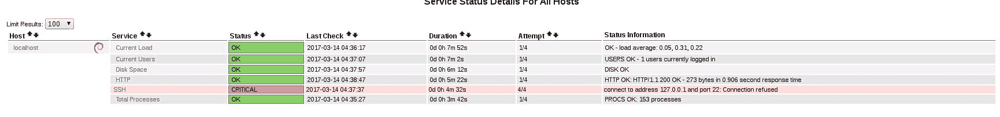

# 第七章：连接到现实世界

现在我们进入了现实世界，正在创造一些对日常工作有用的工具；在这个过程中，我们将关注编程中常见的陷阱，并学习如何使我们的脚本更可靠。不管脚本长短，我们必须始终问自己相同的问题：

+   我们到底想要达成什么目标？

+   我们有多少时间？

+   我们是否具备所需的所有资源？

+   我们是否具备完成任务所需的知识？

我们将从编写一个 Nagios 插件开始，这将帮助我们广泛理解这个监控系统是如何运作的，以及如何使脚本与其他程序动态交互。

# 什么是 Nagios？

**Nagios** 是最广泛采用的开源 IT 基础设施监控工具之一，其主要有趣之处在于它本身并不知道如何监控任何东西。听起来像是开玩笑，但实际上，Nagios 可以被定义为一个评估核心，它接受一些信息作为输入，并根据这些信息做出反应。那么，这些信息是如何收集的呢？这并不是这个工具的主要关切，这也引出了一个有趣的观点：Nagios 将收集监控数据的任务交给一个外部插件，插件需要知道以下细节：

+   如何连接到被监控的服务

+   如何收集来自被监控服务的数据

+   如何评估数据

如果收集到的值超出了或在警报阈值范围内，通知 Nagios 触发警报。

因此，一个插件做了很多事情，可能有人会问，Nagios 到底在做什么？可以把它想象成一个信息交换舱，信息不断地流进流出，决策是基于设置的配置做出的；核心触发插件去监控某个服务；插件本身返回一些信息，然后 Nagios 根据这些信息做出决策：

+   是否触发警报

+   发送通知

+   通知谁

+   持续多长时间

+   如果采取任何措施以恢复正常状态

核心的 Nagios 程序除了真正敲开服务的大门，索取信息并决定这些信息是否显示出问题外，其他一切都做了。

# 主动和被动检查

要理解如何编写一个插件，我们首先需要广泛理解 Nagios 检查的工作原理。Nagios 检查有两种不同类型。

# 主动检查

基于时间范围，或者手动触发的情况下，主动检查会看到插件主动连接到服务并收集信息。一个典型的例子是插件检查磁盘空间：一旦被调用，它通常会与操作系统进行交互，执行 `df` 命令，处理输出，提取与磁盘空间相关的值，评估是否超过某些阈值，并返回状态，例如 OK、WARNING、CRITICAL 或 UNKNOWN。

# 被动检查

在这种情况下，Nagios 并不会触发任何操作，而是等待服务通过某种方式主动联系，服务必须被监控。看起来有些困惑，但我们可以通过一个实际的例子来说明。你怎么监控一个磁盘备份是否成功完成？一个简单的回答是：了解备份任务的开始时间和持续时间后，我们可以定义一个时间并调用脚本，在那个指定时间检查任务。

很好，但当我们进行规划时，我们必须充分理解现实生活的运行方式，备份并不是我们客厅里的一只小宠物，它更像是一头野兽，做它想做的事。备份的持续时间可能因不可预测的因素而有所不同。

比如，你的典型备份任务会在 2 小时内复制 1 TB 的数据，开始时间为 03:00，从一个 6 TB 的磁盘中进行备份。那么，下一个备份任务将从 03:00+02:00=05:00 AM 开始，可能有几分钟的误差。你设置了一个 05:30 的主动检查，它运行了几个月都很顺利。然后，在某个清晨，你收到手机上的通知，备份任务处于 CRITICAL 状态。你醒来，连接到备份控制台，发现早上 06:00，你还在睡觉，备份任务甚至没有被控制台启动。然后，你必须等到 08:00 AM，直到一些同事到达办公室，才发现前一天备份磁盘由于一次非计划的数据传输，增加了 2 TB 的数据。所以，前一个备份任务并没有持续几小时，而是持续了 6 小时，而你监控的备份任务在 09:30 AM 开始。

长话短说，你的主动检查启动得太早了，这就是它失败的原因。也许你会想把时间安排提前几个小时，但千万不要这么做，因为这些时间段不是滑动框架。如果你把检查提前，你就应该将所有后续任务的检查时间也提前。你这样做了一周后，项目经理会要求某人删除那 2 TB 的多余数据（现在对项目没有用），而你的时间安排将提前 2 小时，导致监控变得没用。所以，正如我们之前所说，规划和分析上下文是编写一个好脚本、一个好插件的关键因素。我们有一个不像 web 服务或邮件服务那样 24/7 运行的服务，备份的特殊之处在于它是定期执行的，但我们并不确切知道它什么时候运行。

这种监控的最佳方法是让服务在完成任务并报告结果时主动通知我们。通常，这通过大多数备份程序能够发送**简单网络管理协议**（**SNMP**）陷阱来实现，告知目的地结果是什么；在我们的案例中，它将是 Nagios 服务器，Nagios 被配置为接收这个陷阱并进行分析。再加上一个事件时间范围，这样如果我们在，比如说，24 小时内没有收到特定的陷阱，我们就会触发警报，这样你就有保障了：无论是备份任务完成，还是超时，我们都会收到通知。


Nagios 通知流程图

# 返回代码和阈值

在编写插件代码之前，我们必须面对一些概念，这些概念将成为我们 Nagios 代码库的基石，其中之一就是插件本身的返回代码。正如我们之前讨论的，一旦插件收集了关于服务运行情况的数据，它就会评估这些数据并判断情况是否属于以下状态之一：

| **返回代码** | **状态** | **描述** |
| --- | --- | --- |
| `0` | 正常 | 插件检查了服务，并且结果在可接受范围内。 |
| `1` | 警告 | 插件检查了服务，并且结果超过了警告阈值。我们必须关注这个服务。 |
| `2` | 危急 | 插件检查了服务，并且结果超出了危急阈值，或者服务没有响应。我们现在必须采取行动。 |
| `3` | 未知 | 要么是我们向插件传递了错误的参数，要么插件内部出现了某些错误。 |

所以，我们的插件将检查服务，评估结果，并根据阈值，将表格中列出的一个值和有意义的消息返回给 Nagios，正如我们在下方截图中的描述列所看到的那样：



请注意前面截图中的红色服务检查和消息。

在截图中，我们可以看到一些检查是绿色的，表示正常，它们在描述部分有详细的解释信息。我们在此部分看到的是插件写入 `stdout` 的输出；这也是我们将作为对 Nagios 的响应来构建的内容。

注意 SSH 检查：它是红色的，并且失败了，因为它在默认端口 `22` 检查服务，但在这台服务器上，`ssh` 守护进程监听的是一个不同的端口。这引出一个问题：我们的插件需要一个命令行解析器，能够接收一些配置选项和阈值限制，因为我们需要知道检查什么、在哪里检查以及服务的可接受工作范围是什么：

+   **位置**：在 Nagios 中，可以有没有服务检查的主机（除了通过 ping 进行的隐式主机存活检查），但不能有没有主机的服务。因此，任何插件都必须在命令行中接收要执行的主机指示，可以是虚拟主机，但必须指定。

+   **如何**：这是我们编写代码的地方；我们必须编写代码行，指示插件如何连接到服务器、查询、收集和解析响应。

+   **定义**：我们必须指示插件，通常通过命令行中带有一些有意义的选项，告诉它哪些是可接受的工作限制，以便它可以评估这些限制并决定是否向我们发送 OK、WARNING 或 CRITICAL 消息。

这就是我们脚本的全部内容：谁在何时、如何、多少次通知我们，等等。这些任务由核心处理；Nagios 插件对此并不知情。插件真正需要了解的有效监控内容是识别工作服务的正确值是什么。我们可以向脚本传递两种不同类型的值：

+   **范围**：这是一个带有起始点和结束点的数值系列，例如从 3 到 7 或从一个数字到无限大

+   **阈值**：这是一个带有相关警报级别的范围

因此，当我们的插件执行检查时，它们会收集一个在范围内或范围外的数值，这取决于我们设置的阈值；然后，根据评估结果，它将通过返回代码和消息回复 Nagios。那么，我们如何在命令行中指定某些范围呢？基本上是以下方式：

```
[@] start_value:end_value

```

如果范围从 `0` 开始，则可以省略从 `:` 到左边的部分。`start_value` 必须始终小于 `end_value`。

如果范围从 `start_value` 开始，表示从该数字到无限大。可以使用 `~` 指定负无穷大。

当收集的值超出指定范围（包括端点）时，会生成警报。

如果指定了 `@`，当值位于范围内时会生成警报。

让我们看一些如何在命令行中调用脚本并设置阈值的实际示例：

| **插件调用** | **含义** |
| --- | --- |
| `./my_plugin -c 10` | 如果小于 `0` 或大于 `10` 则为 CRITICAL |
| `./my_plugin -w 10:20` | 如果小于 `10` 或大于 `20` 则为 WARNING |
| `/my_plugin -w ~:15 -c 16` | 如果在负无限大和 `15` 之间则为 WARNING，`16` 及更高则为 CRITICAL |
| `./my_plugin -c 35:` | 如果收集的值低于 `35` 则为 CRITICAL |
| `./my_plugin -w @100:200` | 如果值在 `100` 到 `200` 之间则为 CRITICAL，其他情况为 OK |

我们已经涵盖了插件的基本要求，在最简单的形式下，它应该使用以下语法调用：

```
./my_plugin -h hostaddress|hostname -w value -c value

```

我们已经讨论过需要将检查与主机关联起来的必要性；我们可以使用主机名或主机地址来实现这一点。我们可以自行决定使用哪种方式，但我们不会填写这一信息片段，因为它将被服务配置作为标准宏引用。我们刚刚介绍了一个新概念，服务配置，在 Nagios 中使我们的脚本工作变得至关重要，因此让我们简要地看看我们正在讨论什么。在开始讨论 Nagios 配置之前，我们需要注意一点：这不是一本关于 Nagios 的书籍，因此我们不会覆盖所有复杂的细节和部分。我们将涉及所有使我们的脚本正常工作所需的主题，并通过一个工作正常的 Nagios 安装能够快速激活我们的新插件。现在让我们看看如何配置一个插件以使其在 Nagios 下工作，然后我们将能够专注于我们的脚本而没有任何分散注意力的干扰。

# 命令和服务定义

在 Nagios 的一切基础之上是一个插件，这是一个执行检索信息、评估信息、引发警报并提供有意义消息的代理人。单独看，Nagios 不知道如何调用插件，传递哪些选项或如何处理它，因此我们需要一个命令定义，定义脚本将如何被调用。

让我们以`ssh`服务检查的命令定义为例，它失败是因为用于检查的端口与守护进程正在侦听的端口不同：

```
# 'check_ssh' command definition define command{ command_name check_ssh command_line /usr/lib/nagios/plugins/check_ssh '$HOSTADDRESS$' }

```

我们可以看到这里有一个名为`command_name check_ssh`的命令定义。

让我们记住`check_ssh`，因为这将是我们稍后引用此命令定义时使用的句柄。正如我们所看到的，这个定义非常简短；它定义了一个句柄，最重要的是调用插件的命令行。在这种情况下，非常简单：插件接受主机地址就足够进行基本检查。看看`$HOSTADDRESS$`。这是所谓的**Nagios 标准宏**之一：基本上是一个占位符，Nagios 将会用主机地址实例化它，你将把这个服务关联到这个命令。

```
# check that ssh services are running define service { use generic-service host_name localhost service_description SSH check_command check_ssh }

```

`ssh`服务定义引入了一些新的东西，这是通过 Nagios 对象继承属性的一个例子。正如我们之前讨论的，脚本执行检查、评估和引发警报；核心部分则完成其余所有工作，还有很多其他事情。看看这个服务定义，它似乎并不复杂，但是集中在第一行`use generic-service`上。这让人觉得耳熟能详。看看定义，似乎`generic-service`实际上是一个模板，是吗？

```
# generic service template definition define service{ name generic-service ; The 'name' of this service template active_checks_enabled 1 ; Active service checks are enabled passive_checks_enabled 1 ; Passive service checks are enabled/accepted parallelize_check 1 ; Active service checks should be parallelized (disabling this can lead to major performance problems) obsess_over_service 1 ; We should obsess over this service (if necessary) check_freshness 0 ; Default is to NOT check service 'freshness' notifications_enabled 1 ; Service notifications are enabled event_handler_enabled 1 ; Service event handler is enabled flap_detection_enabled 1 ; Flap detection is enabled failure_prediction_enabled 1 ; Failure prediction is enabled process_perf_data 1 ; Process performance data retain_status_information 1 ; Retain status information across program restarts retain_nonstatus_information 1 ; Retain non-status information across program restarts
 notification_interval 0 ; Only send notifications on status change by default. is_volatile 0 check_period 24x7 normal_check_interval 5 retry_check_interval 1 max_check_attempts 4 notification_period 24x7 notification_options w,u,c,r contact_groups admins register 0 ; 
DONT REGISTER THIS DEFINITION - ITS NOT A REAL SERVICE, JUST A TEMPLATE! }

```

好吧，正如我们所见，我们可以在服务方面定义很多内容，这些内容可能会让服务定义显得杂乱无章，所以我们将复杂性隐藏在模板中并调用它，就像引用一个库一样。一旦模板被导入，所有的定义都将应用到调用它的服务上。如果我们想修改模板中的某些值，我们只需在服务定义中写入新的值，因为如果我们有多个具有相同名称和不同值的定义，最终对象会选择最接近的那个。所以，服务层的定义会覆盖模板中的定义。我们不会解释模板中的所有定义，因为它们对我们的目标并没有帮助，毕竟我们的脚本将依赖于没有任何修改的通用服务定义。

让我们回到服务定义，看看第二行`host_name` localhost。我们已经提到过，每个服务检查必须引用一个（或多个）主机，所以在这里我们看到这个服务适用于哪个主机。我们也可以使用`hostgroup_name name_of_the_hostgroup`。

为了将单个检查应用于多个被包含在主机组定义中的主机。接下来看一下`service_description` ssh。至于命令定义，这是用来在 Nagios 中引用这个服务定义的标识符：

```
check_command check_ssh

```

这是我们调用命令定义并传递可选参数的地方。在我们预定义的配置中，没有要传递给命令的参数，因此没有什么特别的。通过这行代码，服务定义调用了由处理器调用的命令定义中的语法，并可选地将一些参数传递给它。服务、命令、主机和模板的所有配置都遵循相同的结构：

```
define object { definitions_1 definitions_2 definitions_n }

```

然后，你可以将不同的定义保存在一个文件中，并将它们封装在各自的代码块中。

我们刚刚看到的是 Nagios 中的 ssh 检查，但实际上它并不起作用，因为它抛出了一个错误。我们需要的是一种方法来更改正在检查的端口。我们该如何完成这项任务？只需记住，实际的插件才是这里的主角，它将推动我们的所有努力，所以让我们调用它，看看它有什么要说的。让我们看看命令行定义：

```
command_line /usr/lib/nagios/plugins/check_ssh '$HOSTADDRESS$'

```

从这里开始，我们知道脚本的位置了，所以让我们调用它：

```
root:~$ /usr/lib/nagios/plugins/check_ssh check_ssh: Could not parse arguments Usage: check_ssh [-4|-6] [-t <timeout>] [-r <remote version>] [-p <port>] <host>

```

我们在这里看到的是，脚本接受命令行上的一些参数和选项，但每个脚本通常都会编写一个完整的帮助信息，通过`-h`选项调用：

```
root:~$ /usr/lib/nagios/plugins/check_ssh -h check_ssh v2.1.1 (monitoring-plugins 2.1.1) Copyright (c) 1999 Remi Paulmier <remi@sinfomic.fr> Copyright (c) 2000-2007 Monitoring Plugins Development Team <devel@monitoring-plugins.org> Try to connect to an SSH server at specified server and port Usage: check_ssh [-4|-6] [-t <timeout>] [-r <remote version>] [-p <port>] <host> Options: -h, --help Print detailed help screen -V, --version Print version information --extra-opts=[section][@file] Read options from an ini file. See https://www.monitoring-plugins.org/doc/extra-opts.html for usage and examples. -H, --hostname=ADDRESS Host name, IP Address, or unix socket (must be an absolute path) -p, --port=INTEGER Port number (default: 22) -4, --use-ipv4 Use IPv4 connection -6, --use-ipv6 Use IPv6 connection -t, --timeout=INTEGER Seconds before connection times out (default: 10) -r, --remote-version=STRING Warn if string doesn't match expected server version (ex: OpenSSH_3.9p1) -P, --remote-protocol=STRING Warn if protocol doesn't match expected protocol version (ex: 2.0) -v, --verbose Show details for command-line debugging (output may be truncated by the monitoring system) Send email to help@monitoring-plugins.org if you have questions regarding use of this software. To submit patches or suggest improvements, send email to devel@monitoring-plugins.org

```

让我们记住这个帮助信息，因为它是我们需要在插件中实现的内容。无论如何，我们可以看到，除了其他选项外，我们实际上可以使用选项`-p`来更改服务正在检查的端口。

让我们检查一下我们的`ssh`服务器正在哪个地方监听连接：

```
root:~$ netstat -tapn | grep ssh tcp 0 0 0.0.0.0:1472 0.0.0.0:* LISTEN 685/sshd tcp6 0 0 :::1472 

```

现在我们知道我们的`ssh`守护进程正在`1472`端口监听。所以我们需要手动检查，确保如何使用新的参数和值来调用插件：

```
root:~$ /usr/lib/nagios/plugins/check_ssh -H localhost -p 1472 SSH OK - OpenSSH_6.7p1 Debian-5+deb8u3 (protocol 2.0) | time=0.011048s;;;0.000000;10.000000

```

它起作用了，我们处理了`-H localhost`来识别我们正在执行检查的主机，`-p 1472`用来查询该`ssh`守护进程配置的正确端口。现在，让我们关注插件的回复：

```
SSH OK - OpenSSH_6.7p1 Debian-5+deb8u3 (protocol 2.0) | time=0.011048s;;;0.000000;10.000000

```

这是 Nagios 插件提供的消息的标准结构：

1.  服务的名称（SSH）。

1.  服务状态（OK）。

1.  被检查服务给出的消息（或者是我们自己构造的消息）。

然后有一些我们之前没有见过的内容：

```
| time=0.011048s;;;0.000000;10.000000

```

这是一条管道，后面跟着一个或多个标签，时间就是我们示例中的标签，还有一些通常与服务工作状态相关的值。无论写的是什么，这不是 Nagios 关心的，因为它不会处理输出行的这一部分。这些值是供第三方应用程序，如`pnp4nagios`或 Nagios 图形，来处理它们并最终绘制出一些性能图形。


Nagios 显示了性能数据，但并没有真正利用它

我们稍后会看到服务的图形是什么样子的，现在让我们记住一件事：插件的输出通常是单行的，即使你有多行输出，最好也保持简洁的信息。

现在，让我们回到 SSH 服务检查的定义，看看如何修改它以启用不同端口的检查。这就是我们之前见过的`check_ssh`命令：

```
# 'check_ssh' command definition define command{ command_name check_ssh command_line /usr/lib/nagios/plugins/check_ssh '$HOSTADDRESS$' }

```

为了启用任意端口检查的定义，我们必须修改`command_line`行，使其接受带有参数的新`-p`：

```
# 'check_ssh' command definition define command{ command_name check_ssh command_line /usr/lib/nagios/plugins/check_ssh '$HOSTADDRESS$' -p $ARG1$ }

```

我们做的很简单：我们只是添加了一个`-p`后跟`$ARG1$`。这个新部分是什么？在 Nagios 中，你可以将任何你想要的参数传递给脚本，且通过位置变量来引用它们。把`$ARG1$`看作标准 bash 脚本中的`$1`；它表示传递给命令行的第一个参数。记住，像`-p`这样的选项不算作参数。所以`$ARG2$`是第二个位置参数，`$ARG3$`是第三个，以此类推。不要忘记前后的美元符号。所以，我们修改了 Nagios 调用插件的方式，现在我们可以给它传递一个额外的参数。剩下的就是实际将额外的参数提供给脚本；这是通过修改`ssh`的服务定义来完成的。我们之前有如下内容：

```
# check that ssh services are running define service { use generic-service host_name localhost service_description SSH check_command check_ssh }

```

这个定义必须修改，以便我们可以存储并传递端口号到命令中，下面是我们如何操作的：

```
# check that ssh services are running define service { use generic-service host_name localhost service_description SSH check_command check_ssh!1472 }

```

命令名称后的感叹号（`!`）是标准字段分隔符，用于标识传递给插件的不同位置参数。让我们举个例子，修改`ssh`的`command_line`来接受它：

```
-p 1472 -4 -P 2.0 -t 30

```

我们必须修改命令行，以接受五个参数而不是一个：

```
# 'check_ssh' command definition define command{ command_name check_ssh command_line /usr/lib/nagios/plugins/check_ssh '$HOSTADDRESS$' -p $ARG1$ -$ARG2$ -r $ARG3$ -P $ARG4$ -t $ARG5$ }

```

修改非常简单，我们只是用位置变量`$ARGn$`写下了所有开关及其参数。现在命令行已经准备好接受新值，我们必须填写占位符：

```
# check that ssh services are running define service { use generic-service host_name localhost service_description SSH check_command check_ssh!1472!4!2.0!30 }

```

没那么复杂；每个参数必须按命令行预期的顺序书写：

| `-p` | `-` | `-P` | `-t` |
| --- | --- | --- | --- |
| `1472` | `4` | `2.0` | `30` |

需要记住的一点是，标准宏不使用位置参数，因此在计算插槽索引时不必考虑它们。

现在，我们已经把所有部分都整理好了，具备了正确的开关和参数值，我们需要写下新的配置。好吧，但在哪里写？配置文件的位置因发行版而异，文件的碎片化方式也不同：有些发行版将命令和服务定义放在一个主机文件中连同主机定义一起，而其他发行版则将它们分散在单独的文件中。我们该如何处理呢？让 Nagios 进程告诉你它如何读取信息：

```
root:~$ ps ax | grep nagios 803 ? SNs 0:02 /usr/sbin/nagios3 -d /etc/nagios3/nagios.cfg 2502 pts/1 S+ 0:00 grep nagios

```

`ps`命令显示 Nagios 从`/etc/nagios3/nagios.cfg`读取其主配置指令。因此，值得查看它：

```
# Commands definitions cfg_file=/etc/nagios3/commands.cfg # Debian also defaults to using the check commands defined by the debian # nagios-plugins package cfg_dir=/etc/nagios-plugins/config # Debian uses by default a configuration directory where nagios3-common, # other packages and the local admin can dump or link configuration # files into. cfg_dir=/etc/nagios3/conf.d # OBJECT CONFIGURATION FILE(S) # These are the object configuration files in which you define hosts, # host groups, contacts, contact groups, services, etc. # You can split your object definitions across several config files # if you wish (as shown below), or keep them all in a single config file. # You can specify individual object config files as shown below: #cfg_file=/etc/nagios3/objects/commands.cfg #cfg_file=/etc/nagios3/objects/contacts.cfg #cfg_file=/etc/nagios3/objects/timeperiods.cfg #cfg_file=/etc/nagios3/objects/templates.cfg # Definitions for monitoring a Windows machine #cfg_file=/etc/nagios3/objects/windows.cfg # Definitions for monitoring a router/switch #cfg_file=/etc/nagios3/objects/switch.cfg # Definitions for monitoring a network printer #cfg_file=/etc/nagios3/objects/printer.cfg # You can also tell Nagios to process all config files (with a .cfg # extension) in a particular directory by using the cfg_dir # directive as shown below: #cfg_dir=/etc/nagios3/servers #cfg_dir=/etc/nagios3/printers #cfg_dir=/etc/nagios3/switches #cfg_dir=/etc/nagios3/routers

```

这是 Nagios 主配置文件中的标准部分，您会在每个安装中都找到它，因此请注意那些没有被`#`字符注释掉的行：

```
# Commands definitions cfg_file=/etc/nagios3/commands.cfg # Debian also defaults to using the check commands defined by the debian # nagios-plugins package cfg_dir=/etc/nagios-plugins/config # Debian uses by default a configuration directory where nagios3-common, # other packages and the local admin can dump or link configuration # files into. cfg_dir=/etc/nagios3/conf.d

```

所以，从主配置文件中，我们可以看到配置存储在一个文件和两个目录中。由于我们处理的是命令插件修改，我们从`cfg_dir=/etc/nagios-plugins/config`开始。

查找可能包含`ssh`配置的文件，让我们进入`root:~$ cd /etc/nagios-plugins/config`并在每个文件中使用`grep`查找`ssh`：

```
root:~$ egrep -lr ssh * disk.cfg ssh.cfg

```

仅使用`egrep -l`将仅打印出匹配项所在文件的名称；如果你不确定并希望查看实际的匹配行，请使用`-ir`而不是`-lr`，这样你将看到更多信息。无论如何，在这两个文件之间，似乎很清楚我们需要修改的是`ssh.cfg`。

让我们打开文件并跳到文件末尾，添加我们的新命令定义：

```
define command{ command_name check_ssh_arguments command_line /usr/lib/nagios/plugins/check_ssh '$HOSTADDRESS$' -p $ARG1$ -$ARG2$ -P $ARG3$ -t $ARG4$ }

```

如上所示，我们更改了`command_name`；由于不能有两个相同句柄的命令定义，我们为我们的目的选择了一个独特的名称。它不会显示给用户，所以不需要华丽，只需要实用和有意义。我们保存文件并继续定义一个新的服务配置；从主配置文件中来看，似乎很清楚我们需要查看`cfg_dir=/etc/nagios3/conf.d`。

所以，让我们进入这个目录：`root:~$ cd /etc/nagios3/conf.d`，再次使用`grep`查找`ssh`：

```
root:~$ egrep -lr ssh * hostgroups_nagios2.cfg services_nagios2.cfg

```

在这种情况下，不清楚是什么包含了什么，所以使用扩展的`grep`命令会很有帮助：

```
root:~$ egrep -ir ssh * hostgroups_nagios2.cfg:# A list of your ssh-accessible servers hostgroups_nagios2.cfg: hostgroup_name ssh-servers hostgroups_nagios2.cfg: alias SSH servers services_nagios2.cfg:# check that ssh services are running services_nagios2.cfg: hostgroup_name ssh-servers services_nagios2.cfg: service_description SSH services_nagios2.cfg: check_command check_ssh

```

现在，很明显`hostgroups_nagios.cfg`包含了与主机组相关的配置，其中包括检查`ssh`服务的主机组配置。第二个文件`services_nagios2.cfg`包含了`ssh`服务检查的配置，所以让我们打开它：

```
# check that ssh services are running define service { hostgroup_name ssh-servers service_description SSH check_command check_ssh use generic-service notification_interval 0 ; set > 0 if you want to be re-notified }

```

这是我们所寻找的`ssh`服务检查配置。在生产环境中，我们需要估算配置的影响，因为如果我们现在修改这个定义，它将应用于所有正在检查的服务器。请注意`hostgroup_name ssh-servers`，我们正在检查一个服务器组，无论这个组包含一个服务器还是一千个服务器，都不重要。

在生产或预演环境中，我们需要查看我们正在检查哪些服务器的 ssh 服务，了解我们的修改是否会对其中一些服务器产生异常影响，如果是的话，就将这些服务器从新的检查中移除，并为它们创建一个特殊的组，使用旧定义进行检查。在我们的例子中，由于这是一个演示安装，并且只有`localhost`作为唯一组成员，我们可以直接修改现有配置并继续使用：

```
# check that ssh services are running define service { hostgroup_name ssh-servers service_description SSH check_command check_ssh_arguments!1472!4!2.0!30 use generic-service notification_interval 0 ; set > 0 if you want to be renotified }

```

这个定义与我们之前制定的非常相似；只不过这里我们处于一个实际场景中。Nagios 配置为在主机组上应用此检查，而不是单个服务器，但由于主机组只有一台服务器——本地主机，两个定义的作用范围相同。接下来我们需要做的是强制 Nagios 重新加载定义，以便我们的新配置能够被核心读取。重新加载或重启都足够：

```
service nagios3 reload

```

现在编辑`/etc/nagios3/nagios.cfg`文件并启用以下配置：

```
check_external_commands=1

```

`0`表示禁用，`1`表示启用，我们刚刚告诉 Nagios 接受外部命令，因此我们可以重新加载配置`service nagios3 reload`，进入服务名称，进入服务器详情页面。在这里，我们只需点击“重新安排该服务的下一个检查”。

让我们选择强制检查并提交；无论当前调度如何，都会强制进行新检查。

在 Debian 和 Ubuntu 标准的 Nagios 安装中，你可能会遇到`Error: Could not stat() command file '/var/lib/nagios3/rw/nagios.cmd'!`

当你尝试强制进行检查时，可以通过以下过程解决：

```
service nagios3 stop dpkg-statoverride --update --add nagios www-data 2710 /var/lib/nagios3/rw dpkg-statoverride --update --add nagios nagios 751 /var/lib/nagios3 service nagios3 start

```

如果你的插件遇到任何问题，请在`/etc/nagios3/nagios.cfg`中启用`debug`模式，通过设置以下配置：

```
debug_level=-1 debug_verbosity=2

```

这将生成大量信息写入`debug`文件，在我们的安装中，文件位于`/var/log/nagios3/nagios.debug`，这些信息对于理解发生了什么非常重要，但它们会稍微降低系统性能，因此我们必须仅在需要时启用调试，之后要恢复为正常日志记录。

Nagios 重新加载将强制激活新的配置。但让我们看看调试日志对我们修改后的命令有什么反馈：

```
[1489655900.213562] [016.0] [pid=13954] Checking service 'SSH' on host 'localhost'... [1489655900.213602] [2320.2] [pid=13954] Raw Command Input: /usr/lib/nagios/plugins/check_ssh -p $ARG1$ -$ARG2$ -P $ARG3$ -t $ARG4$ '$HOSTADDRESS$' [1489655900.213787] [2320.2] [pid=13954] Expanded Command Output: /usr/lib/nagios/plugins/check_ssh -p $ARG1$ -$ARG2$ -P $ARG3$ -t $ARG4$ '$HOSTADDRESS$' [1489655900.213825] [2048.1] [pid=13954] Processing: '/usr/lib/nagios/plugins/check_ssh -p $ARG1$ -$ARG2$ -P $ARG3$ -t $ARG4$ '$HOSTADDRESS$'' [1489655900.213839] [2048.2] [pid=13954] Processing part: '/usr/lib/nagios/plugins/check_ssh -p ' [1489655900.213846] [2048.2] [pid=13954] Not currently in macro. Running output (37): '/usr/lib/nagios/plugins/check_ssh -p ' [1489655900.213906] [2048.2] [pid=13954] Uncleaned macro. Running output (41): '/usr/lib/nagios/plugins/check_ssh -p 1472' [1489655900.213911] [2048.2] [pid=13954] Just finished macro. Running output (41): '/usr/lib/nagios/plugins/check_ssh -p 1472' [1489655900.213921] [2048.2] [pid=13954] Not currently in macro. Running output (43): '/usr/lib/nagios/plugins/check_ssh -p 1472 -' [1489655900.214051] [2048.2] [pid=13954] Uncleaned macro. Running output (44): '/usr/lib/nagios/plugins/check_ssh -p 1472 -4' [1489655900.214064] [2048.2] [pid=13954] Just finished macro. Running output (44): '/usr/lib/nagios/plugins/check_ssh -p 1472 -4' [1489655900.214074] [2048.2] [pid=13954] Not currently in macro. Running output (48): '/usr/lib/nagios/plugins/check_ssh -p 1472 -4 -P ' [1489655900.214109] [2048.2] [pid=13954] Uncleaned macro. Running output (51): '/usr/lib/nagios/plugins/check_ssh -p 1472 -4 -P 2.0' [1489655900.214114] [2048.2] [pid=13954] Just finished macro. Running output (51): '/usr/lib/nagios/plugins/check_ssh -p 1472 -4 -P 2.0' [1489655900.214123] [2048.2] [pid=13954] Not currently in macro. Running output (55): '/usr/lib/nagios/plugins/check_ssh -p 1472 -4 -P 2.0 -t ' [1489655900.214161] [2048.2] [pid=13954] Uncleaned macro. Running output (57): '/usr/lib/nagios/plugins/check_ssh -p 1472 -4 -P 2.0 -t 30' [1489655900.214175] [2048.2] [pid=13954] Just finished macro. Running output (57): '/usr/lib/nagios/plugins/check_ssh -p 1472 -4 -P 2.0 -t 30' [1489655900.214200] [2048.2] [pid=13954] Not currently in macro. Running output (59): '/usr/lib/nagios/plugins/check_ssh -p 1472 -4 -P 2.0 -t 30 '' [1489655900.214263] [2048.2] [pid=13954] Uncleaned macro. Running output (68): '/usr/lib/nagios/plugins/check_ssh -p 1472 -4 -P 2.0 -t 30 '127.0.0.1' [1489655900.214276] [2048.2] [pid=13954] Just finished macro. Running output (68): '/usr/lib/nagios/plugins/check_ssh -p 1472 -4 -P 2.0 -t 30 '127.0.0.1' [1489655900.214299] [2048.2] [pid=13954] Not currently in macro. Running output (69): '/usr/lib/nagios/plugins/check_ssh -p 1472 -4 -P 2.0 -t 30 '127.0.0.1'' [1489655900.214310] [2048.1] [pid=13954] Done. Final output: '/usr/lib/nagios/plugins/check_ssh -p 1472 -4 -P 2.0 -t 30 '127.0.0.1''

```

很明显，Nagios 是如何逐步构建命令行的，因此我们可以理解它如何解析我们的所有定义，以及如何分配我们通过服务定义传递的值。如果我们复制并粘贴最后一行的命令行输出，并在服务器上执行它，我们就可以开始监控这个服务：

```
/usr/lib/nagios/plugins/check_ssh -p 1472 -4 -P 2.0 -t 30 '127.0.0.1' SSH OK - OpenSSH_6.7p1 Debian-5+deb8u3 (protocol 2.0) | time=0.015731s;;;0.000000;30.000000

```

我们进行了服务检查，获得了一个状态（OK），以及性能数据：


现在我们的 SSH 服务检查已经正常工作，并且我们也有性能数据。

性能数据是一些有用的信息，可以在图表上绘制后，为您提供一些现成的服务运行模式预测。有了这样的数据和图表，我们可以做到这一点：

+   **采用服务容量管理策略**：由于我们可以轻松预测服务的消耗曲线，因此我们可以预测何时需要升级所需的硬件。

+   **了解使用模式**：服务可能会以不均匀的模式使用。例如，公司的邮件服务器在办公时间使用最多，在夜间或周末使用较少；数据仓库服务器的磁盘空间在数据整合批处理期间使用更多。因此，当您检查服务时看起来合适，但在其他时刻可能是不足的：图表将显示您如何查看使用曲线随时间变化。

+   **一目了然地找到故障**：观察图表中的间隙，您可以轻松地发现服务中断，并且选择要检查的图表片段可以详细展开。

+   **为管理人员创建精美的报告**：看起来像是一个玩笑，但繁忙的管理人员更喜欢综合了解服务，而不是数页页的数值数据。

因此，让我们快速看看如何安装其中一个图形工具。由于这不是关于 Nagios 的书籍，我们不会深入讲解，但我们将仅了解启用此第三方服务和使我们的插件性能数据图表化所需的内容。

让我们开始编辑 `/etc/nagios3/nagios.cfg` 文件。

查找以下配置片段，并修改它们，以便最终结果将是这样：

```
process_performance_data=1 host_perfdata_command=process-host-perfdata service_perfdata_command=process-service-perfdata

```

我们启用了性能处理数据，并定义了处理它们的命令的名称；接下来的逻辑步骤是定义我们刚刚指出的命令。编辑 `/etc/nagios3/commands.cfg` 文件，并添加以下片段：

```
# ‘process-host-perfdata' command definition define command{ command_name process-host-perfdata command_line /usr/bin/perl /usr/lib/pnp4nagios/libexec/process_perfdata.pl -d HOSTPERFDATA } # ‘process-service-perfdata' command definition define command{ command_name process-service-perfdata command_line /usr/bin/perl /usr/lib/pnp4nagios/libexec/process_perfdata.pl }

```

我们正在进行 Debian 安装，因此在使用其他发行版或从源安装时，路径和文件名可能会有所不同。

将任何预先存在的片段标记为 `command_name process-host-perfdata` 和 `command_name process-service-perfdata`。

我们将使用新的内容，因为旧的对我们的目的无用，因此再次将它们注释掉。现在我们已经有了命令，并且数据将按预期处理，我们必须告诉 Nagios 如何触发图表可视化。因此，是时候编辑 `/etc/nagios3/conf.d/services_nagios2.cfg` 并修改先前编辑的 SSH 服务检查配置，使其现在显示为：

```
# check that ssh services are running define service { hostgroup_name ssh-servers service_description SSH check_command check_ssh_arguments!1967!4!2.0!30 action_url /pnp4nagios/index.php/graph?host=$HOSTNAME$&srv=$SERVICEDESC$ use generic-service notification_interval 0 ; set > 0 if you want to be renotified }

```

我们添加了一个操作 URL 配置行，以便 Nagios 在服务名称附近绘制一个小的可点击图标。因此，让我们重新启动 Nagios 并转到服务页面，看看有什么新发现：


向任何服务配置中添加`action_url`字符串将使这个新图标出现。

这个图标是可以点击的，我们只需点击它，结果类似于下一个截图所示：


SSH 服务检查的性能数据现在已经被绘制成图表。

从现在开始，我们的性能数据将被绘制成图表，因此我们的 Nagios 环境已经准备好承载我们的第一个 Nagios 插件。

# 我们的第一个 Nagios 插件

现在是时候开始创建我们的第一个 Nagios 插件了，实际上我们要检查的内容并不重要，因为我们关心的是如何处理 Nagios 和插件之间的交换，而不是我们要监控什么或怎么监控。一旦我们完成了脚本，就可以重用它的框架来创建任何我们想要的脚本，所以让我们开始吧。

我们的项目涉及使用**自监控、分析和报告技术**（**S.M.A.R.T.**）检查本地磁盘的状态，我们可以把它看作是嵌入在大多数硬盘和固态硬盘中的系统，其任务是预测和防止问题和故障。因此，能够查询 S.M.A.R.T.系统的插件可以用于捕捉即将发生的故障，通知用户，甚至可以利用 Nagios 中的响应机制触发一些脚本或程序，例如在磁盘即将故障之前将所有数据复制到其他地方，避免数据丢失。

本项目的第一步是安装`smartmontools`软件包。在 Debian 和 Ubuntu 中，软件包叫做`smartmontools`；在其他发行版中可能会不同。我们要找的是一个包含`smartctl`工具的软件包。

这是我们的插件将依赖的程序，它是实际查询磁盘信息的工具，因此我们第一步是找出哪些磁盘连接到了系统：

```
zarrelli:~$ lsblk -d sda 8:0 0 119.2G 0 disk sr0 11:0 1 1024M 0 rom

```

这里是我们的系统，它有一个磁盘，名称是`sda`。如果我们想了解更多关于磁盘的信息，可以安装`hwinfo`并以 root 身份运行它：

```
root:~$ hwinfo --disk 27: IDE 00.0: 10600 Disk [Created at block.245] Unique ID: 3OOL.eNwxL8uda61 Parent ID: w7Y8.FuT6qrC8mT0 SysFS ID: /class/block/sda SysFS BusID: 0:0:0:0 SysFS Device Link: /devices/pci0000:00/0000:00:1f.2/ata1/host0/target0:0:0/0:0:0:0 Hardware Class: disk Model: "TS128GSSD720" Device: "TS128GSSD720" Revision: "2" Serial ID: "REDACTED" Driver: "ahci", "sd" Driver Modules: "ahci" Device File: /dev/sda Device Files: /dev/sda, /dev/disk/by-id/ata-TS128GSSD720_REDACTED Device Number: block 8:0-8:15 BIOS id: 0x80 Geometry (Logical): CHS 15566/255/63 Size: 250069680 sectors a 512 bytes Capacity: 119 GB (128035676160 bytes) Config Status: cfg=new, avail=yes, need=no, active=unknown Attached to: #20 (SATA controller)

```

既然我们已经了解了我们的磁盘，现在我们需要看看它是否足够“有礼貌”来响应我们的 S.M.A.R.T.请求：

```
root:~$ smartctl --all /dev/sda smartctl 6.4 2014-10-07 r4002 [x86_64-linux-3.16.0-4-amd64] (local build) Copyright (C) 2002-14, Bruce Allen, Christian Franke, www.smartmontools.org === START OF INFORMATION SECTION === Model Family: SandForce Driven SSDs Device Model: TS128GSSD720 Serial Number: REDACTED LU WWN Device Id: 0 023280 000000000 Firmware Version: 5.0.2 User Capacity: 128,035,676,160 bytes [128 GB] Sector Size: 512 bytes logical/physical Rotation Rate: Solid State Device Device is: In smartctl database [for details use: -P show] ATA Version is: ATA8-ACS, ACS-2 T13/2015-D revision 3 SATA Version is: SATA 3.0, 6.0 Gb/s (current: 3.0 Gb/s) Local Time is: Fri Mar 17 16:34:30 2017 GMT SMART support is: Available - device has SMART capability. SMART support is: Enabled === START OF READ SMART DATA SECTION === SMART overall-health self-assessment test result: PASSED General SMART Values: ...Self-test execution status: (0) The previous self-test routine completed without error or no self-test has ever been run. ...SMART Attributes Data Structure revision number: 10 Vendor Specific SMART Attributes with Thresholds: ID# ATTRIBUTE_NAME FLAG VALUE WORST THRESH TYPE UPDATED WHEN_FAILED RAW_VALUE ...SMART Error Log not supported SMART Self-test Log not supported SMART Selective self-test log data structure revision number 1 SPAN MIN_LBA MAX_LBA CURRENT_TEST_STATUS ... Selective self-test flags (0x0): After scanning selected spans, do NOT read-scan remainder of disk. If Selective self-test is pending on power-up, resume after 0 minute delay.

```

这从硬盘中提取了大量信息，归根结底，大多数信息对你来说是**无用的**。为了我们的这个小项目，我们只会考虑一些信息，具体如下：

```
SMART overall-health self-assessment test result: PASSED 194 Temperature_Celsius 0x0022 036 060 000 Old_age Always - 36 (Min/Max 12/60) Self-test execution status: ( 0) The previous self-test routine completed

```

所以，我们的插件将仅考虑这三项信息，并根据三个不同的阈值进行处理：

| **控制** | **正常** | **警告** | **危急** |
| --- | --- | --- | --- |
| SMART 整体健康自检测试结果 | 通过 |  | !危急 |
| 温度 | 40: | @41:49 | :50 |
| 自检执行状态 | 0 |  | !0 |

我们开始规划脚本。对于`overall-health`，我们有一个 OK 值，但没有 WARNING，因为任何不同于`PASSED`的值对我们来说都意味着一个关键情况。对于温度，我们可以根据工作环境调整阈值。通常，温度高达 40 摄氏度被认为是最佳的。41 到 50 摄氏度被认为是可接受的，这意味着从长远来看，可能会对磁盘造成一定损害，因此我们处于 WARNING 状态——还不致命，但我们必须保持关注。

从 50 摄氏度及以上被认为是极其危险的，会对磁盘健康造成威胁，因此我们应该触发 CRITICAL 状态，并且尽快让某人做出反应。`Self-test execution status`会告诉我们驱动器上的最后一次自检是否成功或有错误，因此任何不是 0（成功）的状态都会触发一个关键状态。

我们已经识别出将触发 Nagios 状态的信息；我们规划了阈值，现在在实际编写插件之前，我们需要找到一种可靠的方式来收集将与阈值进行比较的数据。这里一些正则表达式会很有用，所以让我们从整体健康状态开始，调用`smartcl`工具并添加过滤器：

```
root:~$ smartctl --all /dev/sda | grep -i overall-health | awk '{print $6}' PASSED

```

这个简单的一行命令从`smartctl`获取完整的输出，然后将其传递给`grep`，后者选择并输出只包含`overall-health`字样的行。输出最终被传递给`awk`，它将输入拆分成列，每个字段由空格分隔，然后打印出第六个字段，即显示`PASSED`。类似如下的代码会捕捉到整体检查的结果：

```
root:~$ H_CHECK=$(smartctl --all /dev/sda | grep -i overall-health | awk '{print $6}')

```

实际上，我们可以通过以下命令来再次验证：

```
root:~$ H_CHECK=$(smartctl --all /dev/sda | grep overall-health | awk '{print $6}') ; echo $H_CHECK PASSED

```

也就是说，命令替换将整条命令行的输出放入了`H_CHECK`变量中，我们也可以打印出来。

这里有一个建议。当涉及到变量时，你可以使用任何你想要的表示方式，这取决于你，但请记住一些经验法则：

+   **保持变量名简短且有意义**：像`THIS_IS_THE.OVER-ALL.RESULT`这样的变量名会使代码变得混乱，所以`H_HEALTH`是简洁且有意义的。

+   **使用小写、大写或驼峰式命名，如`OverAllHealth`，但要保持一致性**：在脚本中保持你选择的命名风格，这样更容易识别变量。

+   **不要使用关键字、工具函数或保留的名称作为变量名**：这会使你的脚本变得不可靠。

现在是获取我们磁盘温度值的时候了：

```
root:~$ smartctl --all /dev/sda | grep -i Temperature | awk '{print $10}' 35

```

所以，让我们将这个值存入一个变量：

```
root:~$ T_CHECK=$(smartctl --all /dev/sda | grep -i Temperature | awk '{print $10}') ; echo $T_CHECK 35

```

最后，我们必须检查`Self-test execution status`：

```
root:~$ smartctl --all /dev/sda | grep -i "Self-test execution status" | awk '{print $5}' | tr -d ")"

```

然后将结果值存入变量：

```
S_CHECK=$(smartctl --all /dev/sda | grep -i "Self-test execution status" | awk '{print $5}' | tr -d ")") ; echo $S_CHECK 0

```

现在我们已经有了收集所需信息的方法，是时候为我们的调查设定一些边界了。如果磁盘不存在怎么办？如果它不支持 S.M.A.R.T. 呢？我们的脚本还需要以 root 用户身份调用 `smartctl`，所以我们将利用 `sudo` 来简化这个过程。那么，让我们从脚本的前几行开始，这些行包含 sha-bang、许可证、作者和第一个变量。记得根据需要修改代码：

```
#!/bin/bash # License: GPL # # Author: Giorgio Zarrelli <zarrelli@linux.it> # # This program is free software; you can redistribute it and/or modify # it under the terms of the GNU General Public License version 2 as # published by the Free Software Foundation. # # This program is distributed in the hope that it will be useful, # but WITHOUT ANY WARRANTY; without even the implied warranty of # MERCHANTABILITY or FITNESS FOR A PARTICULAR PURPOSE. See the # GNU General Public License for more details. # # You should have received a copy of the GNU General Public License # along with this program. If not, see <http://www.gnu.org/licenses/>. #

```

这是 sha-bang 和一个包含作者的许可证，没什么特别的，所以我们继续：

```
SMARTCTL="/usr/sbin/smartctl"

```

由于我们为每个工具的路径使用了命令替换 `which`，它会返回工具的路径。唯一的缺点是，如果工具不在用户的 `$PATH` 环境变量中，它不会返回路径，但这不是大问题，除了 `smartctl`，它不在 `$PATH` 中；我们只需手动提供完整路径即可。我们不检查 `echo` 命令，因为它是内建的：

```
# Nagios return codes STATE_OK=0 STATE_WARNING=1 STATE_CRITICAL=2 STATE_UNKNOWN=3

```

谁记得 Nagios 插件返回的正确状态码？最好将它们存储在一些方便的变量中：

```
# Default WARNING and CRITICAL values WARNING_THRESHOLD=${WARNING_THRESHOLD:=41} CRITICAL_THRESHOLD=${CRITICAL_THRESHOLD:=50}

```

现在，有一点需要注意。如果脚本没有接收到 WARNING 和 CRITICAL 阈值的值，它将从预定义的值中自动分配：

现在我们已经有了一些标题，让我们检查一下变量是否正确地指向了我们的工具：

```
# Check if we have all the system tools we need path_exists() { for i in "$@" do if [ -e "$i" ]; then echo "$i is a valid path" else echo "$i is not reachable, is this the correct path?" exit 1 fi done } path_exists "$SMARTCTL"

```

这是我们脚本的第一个函数，它的任务相当简单：它检查 `#SMARTCTL` 指向的路径是否指向一个文件；如果没有，它会打印一个 WARNING 消息并以错误代码退出。在我们的原型中，即使路径有效，我们也会打印消息，但在最终阶段，我们会设置一个调试条件来启用或禁用这种额外的消息，因为 Nagios 不接受此类消息。我们还将有一个调试选项，如果需要，它将显示我们脚本的内部计算过程。让我们测试一下到目前为止完成的部分，使脚本可执行并运行：

```
zarrelli:~$ ./check_my_smart.sh /bin/echo is a valid path /usr/sbin/smartctl is a valid path

```

现在让我们在脚本中添加两个假变量进行检查：

```
TEST1="" TEST2="/blah/blah"

```

现在让我们再检查一次：

```
path_exists "$SMARTCTL" "TEST1" "TEST2"

```

然后再次运行脚本：

```
zarrelli:~$ ./check_my_smart.sh /bin/echo is a valid path /usr/sbin/smartctl is a valid path TEST1 is not reachable, is this the correct path?

```

脚本会在遇到第一个没有正确指向文件路径的变量时退出，所以让我们删除它，移除它在函数中的引用，并再次运行脚本：

```
zarrelli:~$ ./check_my_smart.sh ; echo $? /bin/echo is a valid path /usr/sbin/smartctl is a valid path TEST2 is not reachable, is this the correct path? 1

```

同样，脚本会在遇到第一个没有指向文件路径的变量时退出，并返回错误代码；我们将错误信息打印到标准输出。这种行为适合我们，因为我们希望脚本在遇到任何妨碍其正常运行的问题时停止执行，并提供有意义的建议，以便我们根据提示进行修正。我们不再需要假变量了，清除它们：

接下来，检查我们正在检查的磁盘是否真实存在，所以让我们在脚本中再添加一些内容。首先，添加一个变量来保存我们想要监视的磁盘路径：

```
# Disk to check DISK=${DISK:="/dev/sda"}

```

接下来，让我们检查一下我们刚刚指定的路径是否指向一个真实的块设备：

```
# Check for the path to bring us to a block device with SMART capability disk_exists() { if [ -b "$DISK" ] then echo "$DISK is a block device" else echo "$DISK does not point a block device" fi }

```

对路径进行简单的文件测试可以告诉我们它是否是块设备。知道路径是否指向块设备就足够了吗？不，因为磁盘是块设备，但块设备不一定是磁盘，它可以是磁带驱动器，例如。无论如何，我们不需要专门查找磁盘的测试，因为下一个函数将检查设备的 S.M.A.R.T.能力。只有启用了 S.M.A.R.T.的硬盘才能通过此测试，其他类型的块设备没有此能力，因此在这里我们将区分出哪个是哪个。在继续之前，让我们为我们的函数编写一个详细模式开关，以便我们能够在`stdout`上打印信息性消息。让我们开始创建一个变量，它将保存详细模式开关的状态值：

```
# Enable verbose; 0 for disabled, 1 for enabled VERB=${VERB:=1}

```

现在，让我们重新编写`path_exists`函数：

```
path_exists()
{
for i in "$@"
do
if [ -e "$i" ];
then 
(( VERB )) && echo "$i is a valid path"
:
else
if (( VERB ));
then
echo "$i is not reachable, is this the correct path?"
exit 1
fi
fi
done
}

```

好了，是时候测试脚本了：

```
zarrelli:~$ ./check_my_smart.sh /bin/echo is a valid path /usr/sbin/smartctl is a valid path /dev/sda is a block device

```

所有消息都被打印出来了，但如果我们将详细模式的值更改为`0`，例如`VERB=${VERB:=0}`，会发生什么？

让我们再次调用脚本：

```
zarrelli:~$ ./check_my_smart.sh /dev/sda is a block device

```

所有`path_exists`函数的消息现在都被静音了。我们是如何做到的？简单地使用算术`(( ))`运算符，如果它评估为非零值，则返回真作为退出状态。我们使用了两种不同的方式来管理详细模式：

```
(( VERB )) && echo "$i is a valid path"

```

这种紧凑的表示法对我们脚本流程的影响较小，在必须执行短命令列表时更可取。在这种情况下，如果`$VERB`评估为非零，就会执行简单的 echo，因此这种表示法适合这种情况。当我们必须执行更长命令列表时，我们可以选择更易读的表示法：

```
if (( VERB )); then echo "$i is not reachable, is this the correct path?" command_2 command_n fi

```

在这种情况下，我们可以在 echo 下附加更多命令，如果`$VERB`评估为非零值，则所有这些命令都将被执行：在列表上级联更多命令将使代码更易读和易于维护。但是，嗯，第二个详细模式开关并不是真正有用，因为代码的这部分会捕获一个问题，并在路径指向非文件时发挥作用，我们始终希望在出现问题时看到错误消息，无论详细程度如何。

所以，清除它，因为它只是一个例子：

```
if (( VERB )); then echo "$i is not reachable, is this the correct path?" fi

```

现在，让我们在`disk_exists`函数中添加详细模式开关：

```
disk_exists() { if [ -b "$DISK" ] then (( VERB )) && echo "$DISK is a block device" : else echo "$DISK does not point a block device" exit 1 fi }

```

注意代码中的（`:`）。这是一个占位符，我们将用 S.M.A.R.T.能力检查代码填充进去。到目前为止，如果路径指向块设备，则脚本什么也不做（`:`）。如何检查设备是否启用 S.M.A.R.T.？我们可以依赖于`smartctl`的输出：

```
root:~$ smartctl -a /dev/sda | grep "^SMART support is:" SMART support is: Available - device has SMART capability. SMART support is: Enabled

```

太棒了，`smartctl`的输出包含两行，其中一行显示设备是否具有 S.M.A.R.T.功能，第二行告诉我们它是否启用。

在处理命令输出时要小心：它可能会根据不同版本而变化，因此在尝试捕获某些信息之前，始终先检查命令本身的完整输出。

一旦我们知道在哪里查找，只需简单地捕获我们想要的信息：

```
root:~$ SMART=$(smartctl -a /dev/sda | grep "^SMART support is:" | awk '{print $4}') ; echo $SMART Available Enabled

```

截取 `smartctl` 的输出并仅抓取第四个字段的内容，成功得到了我们寻找的两个关键字：

```
Available Enabled

```

它们必须都出现在输出中，才能让我们的检查通过，所以我们重新编写脚本的第一部分：

```
# Retrieve the full path to the system utilities AWK=$(which awk) ECHO=$(which echo) GREP=$(which grep) SMARTCTL="/usr/sbin/smartctl" # AWK field to print A_FIELD='{print $4}'

```

我们将使用 `awk` 和 `grep`，所以我们将它们添加到一些方便的变量中。请注意，我们正在解析工具（`smartctl`）的输出，未来版本中这个输出可能会发生变化，因此我们将正在使用的字段存储在变量中。这样，如果输出相关的关键字发生变化，我们只需在脚本中修改一次。现在，就在 `disk_exists` 函数之前，我们创建一个新的代码片段：

```
smart_enabled() {
 SMART=($($SMARTCTL -a "$1" | "$GREP" "$IS_SMART" | "$AWK" "$A_FIELD")) }

```

我们只是在命令行中做的一个函数，现在，我们将输出存储到一个数组中。我们从简单的构造开始，检查它们是否正确工作。一旦我们有信心，就转向更复杂的解决方案。现在，我们必须带着一个参数调用这个函数；让我们把它放在脚本的最后：

```
path_exists "$SMARTCTL" disk_exists "$DISK" smart_enabled "$DISK"

```

到目前为止，一切顺利。我们的脚本正在获取我们寻找的两个关键字。现在，我们可以进一步处理这些关键字，以便如果它们不在 `smartctl` 的输出中，我们的脚本将退出并报错；然后我们在脚本的开头添加一些内容：

```
# SMART CAPABILITY INDICATOR IS_SMART="^SMART support is:" SMART_IND=(Available Enabled)

```

`SMART_IND` 数组包含我们需要捕获的关键字，以确保我们有支持 S.M.A.R.T. 的硬盘，所以现在我们必须构建一个函数来利用这个新数组：

```
smart_enabled() { SMART=($($SMARTCTL -a "$1" | "$GREP" "$IS_SMART" | "$AWK" "$A_FIELD")) for i in "${SMART[@]}" do for j in "${SMART_IND[@]}" do if [[ "$i" == "$j" ]]; then (( COUNTER++ )) fi done done if (( COUNTER != ${#SMART_IND[@]} )) then ALT_SMART="$($SMARTCTL -a "$1" | "$GREP" "$ALT_IS_SMART")" if ! [[ -z $ALT_SMART ]] then (( VERB )) && echo "$DISK has SMART capability" smart_check "$B_SEL" "$DISK" else (( VERB )) && echo "Check the device, it seems it does not support SMART" (( VERB )) && echo "The counter matched: $COUNTER times" echo exit "$STATE_UNKNOWN" fi else (( VERB )) && echo "$DISK has SMART capability" smart_check "$B_SEL" "$DISK" fi }

```

基本上，我们在 `smartctl` 的输出中使用 `grep` 查找 `IS_SMART` 值，然后将结果保存在 `IS_SMART` 数组中。我们有两个嵌套的循环：外循环遍历 `IS_SMART` 的值，内循环遍历 `SMART_IND` 的值。每次两个指示符匹配时，计数器就会增加。在循环结束时，如果计数器不等于 `SMART_IND` 的长度，我们就知道无法匹配到正确数量的指示符。在某些情况下，你可能没有那种漂亮的 SMART 支持字符串，所以我们可以使用一个替代指示符来匹配，以防第一个字符串未显示：

```
ALT_IS_SMART="=== START OF SMART DATA SECTION ==="

```

可能更少，也可能更多，最好在检查时退出并报错。

现在，让我们看看如果我们在一个不支持 SMART 的系统上运行这个脚本会发生什么：

```
root:~$ ./check_my_smart.sh /bin/echo is a valid path /usr/sbin/smartctl is a valid path /dev/sda is a block device Check the device, it seems it does not support SMART The counter matched: 0 times

```

很好，当脚本检测到没有 SMART 能力时，它会干净地退出并给出有意义的消息。现在，由于只有在有有效硬盘的情况下才能进行 SMART 检查，我们将从 `disk_exists` 函数内部调用 `smart_enabled` 函数。因此，我们将 `smart_enabled` 函数的调用从脚本的底部移到 `disk_exists` 函数中：

```
disk_exists() { if [ -b "$DISK" ] then (( VERB )) && echo "$DISK is a block device" smart_enabled "$DISK" else echo "$DISK does not point a block device" exit 1 fi }

```

为了在 `disk_exists` 函数中可用，`smart_enable` 函数必须事先定义。

我们做了大量的检查，现在是时候创建我们的检查函数，它将处理三种不同的测量类型：

+   总体健康状况

+   温度

+   自检

所以，我们的函数必须接受至少三个参数：

+   检查的类型

+   警告阈值

+   临界阈值

让我们从简单的开始，实现一个整体检查监控，从一些新的变量开始：

```
# AWK field to print A_FIELD='{print $4}' H_FIELD='{print $6}' # SMART check keywords H_KEY="overall-health" # SMART matches H_MATCH="PASSED" Now, just before the smart_enabled function, let's create a new function: smart_check() { H_CHECK=$($SMARTCTL -a "$1" | "$GREP" "$H_KEY" | "$AWK" "$H_FIELD") if [[ "$H_CHECK" == "$H_MATCH" ]]; then echo "SMART OK: Overall-health check $H_MATCH" exit "$STATE_OK" else echo "SMART CRITICAL: Overall-health check NOT $H_MATCH" exit "$STATE_CRITICAL" fi }

```

没有什么难的，我们只需 grep 输出，将其放入变量中，并查看它是否匹配我们的锚点（`PASSED`）。如果匹配，脚本将以`STATE_OK`值退出，如果不匹配，它将抛出`STATE_CRITICAL`。让我们来看看，但事先将详细信息级别设置为`0`：

```
root:~$ ./check_my_smart.sh SMART OK: Overall-health check PASSED

```

这是一个可接受的插件响应，如果我们将其传递给 Nagios，它将在 Web 界面上显示一个绿色的“OK”字段，所以我们达到了一个里程碑：我们得到了第一个正确的插件回复。现在，由于所有错误必须由 Nagios 捕捉，我们来为这个分配`exit 1`：

```
echo “SMART UNKNOWN: Please check the plugin” exit “$STATE_UNKNOWN”

```

所以，所有之前的错误信息现在必须变为可选，就像在`path_exists()`函数中一样：

```
path_exists() { for i in "$@" do if [ -e "$i" ]; then (( VERB )) && echo "$i is a valid path" disk_exists "$DISK" else (( VERB )) && echo "$i is not reachable, is this the correct path?" echo “SMART UNKNOWN: Please check the plugin” echo “SMART UNKNOWN: Please check the plugin” exit “$STATE_UNKNOWN” fi done } 

```

我们可以看到函数有了些许变化；由于我们在`path_exists()`内调用了`disk_exists`，我们将函数连接起来，以便在成功的结果后，调用下一个函数。

很好，我们有一个检查`overall-health`参数的函数，它还会给我们正确的 Nagios 消息和退出代码；但这只是三项检查中的一项，所以我们必须将其作为系列中的一个元素。那么，如果我们想将其纳入更广泛的测试范围，我们该怎么做呢？由于这只是三项检查，我们可以轻松地将它们分组在一个`if/then/elif/fi`结构中，但让我们从一个新的变量开始：

```
# BRANCH selector B_SEL=${B_SEL:="HEALTH"}

```

这是一个分支选择器；如果我们没有指定任何内容，它将默认选择`HEALTH`并触发三项检查中的一项；现在让我们看看新代码：

```
smart_check()
{
if (("$#" != 2));
then
echo
exit "$STATE_UNKNOWN"
else
if [[ "$1" == "HEALTH" ]];
then
H_CHECK=$($SMARTCTL -a "$2" | "$GREP" "$H_KEY" | "$AWK" "$H_FIELD")    if [[ "$H_CHECK" == "$H_MATCH" ]];
then
echo "SMART OK: Overall-health check $H_MATCH"
exit "$STATE_OK"
else
echo "SMART CRITICAL: Overall-health check NOT $H_MATCH"
exit "$STATE_CRITICAL"
fi
elif [[ "$1" == "TEMPERATURE" ]];
then
if (( $(echo "scale=2; "$WARNING_THRESHOLD" >= "$CRITICAL_THRESHOLD"" | $BC ) )) ;
then
echo "SMART UNKNOWN: The value of WARNING ($WARNING_THRESHOLD) must be lower than CRITICAL ($CRITICAL_THRESHOLD)"                            exit "$STATE_UNKNOWN"
else
T_CHECK=$($SMARTCTL -a "$2" | "$GREP" "$T_KEY" | "$AWK" "$T_FIELD")   if ! [[ "$T_CHECK" = *[[:digit:]]* ]];
then
echo "SMART UNKNOWN: The $T_KEY check is not available on $DISK"
exit "$STATE_UNKNOWN"
fi
if (( T_CHECK < WARNING_THRESHOLD ));
then
echo "SMART OK: Temperature is $T_CHECK | TEMP=$T_CHECK"
exit "$STATE_OK"
elif (( T_CHECK < CRITICAL_THRESHOLD ));
then
echo "SMART WARNING: Temperature is $T_CHECK | TEMP=$T_CHECK"
exit "$STATE_WARNING"
else
echo "SMART CRITICAL: Temperature is $T_CHECK | TEMP=$T_CHECK"
exit "$STATE_CRITICAL"
fi
fi
elif [[ "$1" == "SELFCHECK" ]];
then
S_CHECK=$($SMARTCTL -a "$2" | "$GREP" "$S_KEY" | "$AWK" "$S_FIELD" | "$TR" -d "$S_DEL")
if ! [[ "$S_CHECK" = *[[:digit:]]* ]];                               then
echo "SMART UNKNOWN: The $S_KEY check is not available on $DISK"
exit "$STATE_UNKNOWN"
fi
if (( S_CHECK == S_MATCH ));
then
echo "SMART OK: Overall-health check $S_MATCH"
exit "$STATE_OK"
else
echo "SMART CRITICAL: Overall-health check NOT $S_MATCH"
exit "$STATE_CRITICAL"
fi
else
echo
exit "$STATE_UNKNOWN"
fi
fi
}

```

新代码检查传递了多少个参数，如果不是恰好两个，它将抛出错误并以`STATE_UNKNOWN`退出。如果有两个参数，它接着检查第一个参数是否是一个函数选择器以及它的值。我们只填充了第一个函数，创建了其他两个的占位符，并在没有输入接受的函数选择器值时做了一个捕捉处理。

我们现在可以继续实现自检功能，这与`overall-health`非常相似，但首先需要一些变量：

```
TR=$(which tr) S_FIELD='{print $5}' S_KEY="Self-test execution status" S_MATCH=0

```

你已经可以弄清楚这些是用来做什么的；我们只需要记住，我们在尽可能多地自定义命令时，使用了很多变量，因为我们正在处理一个工具输出，而这个输出可能会在不同版本之间有所变化。它通常在小版本更新中保持相对一致，但通过使用大量变量，如果需要，我们可以快速修改脚本：

```
eelif [[ "$1" == "SELFCHECK" ]]; then S_CHECK=$($SMARTCTL -a "$2" | "$GREP" "$S_KEY" | "$AWK" "$S_FIELD" | "$TR" -d "$S_DEL") if ! [[ "$S_CHECK" = *[[:digit:]]* ]]; then echo "SMART UNKNOWN: The $S_KEY check is not available on $DISK" exit "$STATE_UNKNOWN" fi if (( S_CHECK == S_MATCH )); then echo "SMART OK: Overall-health check $S_MATCH" exit "$STATE_OK" else echo "SMART CRITICAL: Overall-health check NOT $S_MATCH" exit "$STATE_CRITICAL" fi

```

我们填充了占位符。这个函数与第一个函数类似，唯一的实际区别是执行了算术评估，并检查值是否匹配且必须是数字。使用`SELFCHECK`关键字调用该函数时，显示如下：

```
root:~$ ./check_my_smart.sh SMART OK: Overall-health check 0

```

很好，现在是进行最后一次检查的时候了，这与其他两个检查有些不同，因为它需要与一些阈值进行比较。我们像往常一样从一些变量开始：

```
BC=$(which bc) T_FIELD='{print $10}' T_KEY="Temperature" 

```

现在我们使用代码本身：

```
elif [[ "$1" == "TEMPERATURE" ]]; then if (( $(echo "scale=2; "$WARNING_THRESHOLD" >= "$CRITICAL_THRESHOLD"" | $BC ) )) ; then echo "SMART UNKNOWN: The value of WARNING ($WARNING_THRESHOLD) must be lower than CRITICAL ($CRITICAL_THRESHOLD)" exit "$STATE_UNKNOWN" else T_CHECK=$($SMARTCTL -a "$2" | "$GREP" "$T_KEY" | "$AWK" "$T_FIELD") if ! [[ "$T_CHECK" = *[[:digit:]]* ]]; then echo "SMART UNKNOWN: The $T_KEY check is not available on $DISK" exit "$STATE_UNKNOWN" fi if (( T_CHECK < WARNING_THRESHOLD )); then echo "SMART OK: Temperature is $T_CHECK | TEMP=$T_CHECK" exit "$STATE_OK" elif (( T_CHECK < CRITICAL_THRESHOLD )); then echo "SMART WARNING: Temperature is $T_CHECK | TEMP=$T_CHECK" exit "$STATE_WARNING" else echo "SMART CRITICAL: Temperature is $T_CHECK | TEMP=$T_CHECK" exit "$STATE_CRITICAL" fi fi fi fi 

```

这比另外两个检查要复杂一些。首先，我们检查`WARNING_THRESHOLD`的值是否低于`CRITICAL_THRESHOLD`；我们使用一个小的命令行计算器和算术运算来完成这个检查。接着，我们检查`T_CHECK`是否是一个数值，因为我们讨论的是摄氏度（硬盘温度通常以摄氏度报告）。一旦我们消除了这些障碍，就可以按以下方式检查`T_CHECK`的值是否符合阈值：

```
$T_CHECK < $WARNING_THRESHOLD IS OK $T_CHECK < $CRITICAL_THRESHOLD IS WARNING EVERYTHING ELSE IS CRITICAL

```

让我们测试一下这个脚本，使用不同的 WARNING 和 CRITICAL 阈值：

```
WARNING_THRESHOLD=${WARNING_THRESHOLD:=41} CRITICAL_THRESHOLD=${CRITICAL_THRESHOLD:=50}ro
ot:~$ ./check_my_smart.sh SMART WARNING: Temperature is 41 | TEMP=41 WARNING_THRESHOLD=${WARNING_THRESHOLD:=45} CRITICAL_THRESHOLD=${CRITICAL_THRESHOLD:=50} root:~$ ./check_my_smart.sh SMART OK: Temperature is 41 | TEMP=41 WARNING_THRESHOLD=${WARNING_THRESHOLD:=35} CRITICAL_THRESHOLD=${CRITICAL_THRESHOLD:=40} root:~$ ./check_my_smart.sh SMART CRITICAL: Temperature is 41 | TEMP=41 WARNING_THRESHOLD=${WARNING_THRESHOLD:=50} CRITICAL_THRESHOLD=${CRITICAL_THRESHOLD:=40} root:~$ ./check_my_smart.sh SMART UNKNOWN: The value of WARNING (50) must be lower than CRITICAL (40)

```

如我们所见，我们的阈值设置得相当合理，值的优先级也是一样的，所以我们很好。注意性能数据；由于这是一个温度指示器，如果我们愿意，之后可以在 Nagios 中将其绘制出来。这里的最后一步是创建一个命令行解析器来获取所有需要的值：

```
# Print help and usage print_help() { cat << HERE MY SMART CHECK v1.0 ------------------- Please enter one or more of the following options: -d | --disk eg. /dev/sda -t | --test HEALTH TEMPERATURE SELFCHECK -w | --warning eg. -w 41 -c | --critical eg. -c 50 HERE }

```

我们从打印用法开始。如果用户输入了一些错误的选项，我们给出提示该怎么做：

```
root:~$ ./check_my_smart.sh -T ITISWRONG Unknown argument: -T

 MY SMART CHECK v1.0 ------------------- Please enter one or more of the following options: -d | --disk eg. /dev/sda -m | --module HEALTH TEMPERATURE SELFCHECK -w | --warning eg. -w 41 -c | --critical eg. -c 50

```

不错，是不是？但是我们怎么调用那个函数并管理输入呢？让我们看看：

```
# Parse parameters on the command line while (( $# > 0 )) do case "$1" in -h | --help) print_help exit "${STATE_OK}" ;; -d | --disk) shift DISK="$1" ;; -m | --module) shift B_SEL="$1" ;; -w | --warning) shift WARNING_THRESHOLD="$1" ;; -c | --critical) shift CRITICAL_THRESHOLD="$1" ;; *) echo "Unknown argument: $1" print_help exit "$STATE_UNKNOWN" ;; esac shift done

```

我们在这个代码块中做了什么？当命令行上的参数数量大于零时，我们解析命令行本身，并使用 case 结构检查选项。每次匹配到一个值时，我们实例化一个变量并移动命令行，这样就准备好处理下一个选项了；这就是我们的命令行解析器。

现在我们的插件准备好为我们的目的服务了，我们必须将它复制到插件目录`root:~$ cp check_my_smart.sh /usr/lib/nagios/plugins/`；现在让我们检查它的所有权和访问权限。这里显示的应该就足够了：

```
root:~$ cd /usr/lib/nagios/plugins/ root:~$ ls -lah check_my_smart.sh -rwxr-xr-x 1 root root 6.2K Mar 22 09:32 check_my_smart.sh

```

一旦脚本到位，我们必须告诉 Nagios 如何调用它，因此需要一个命令定义。让我们进入命令配置目录`cd /etc/nagios-plugins/config/`并创建`check_my_smart.cfg`文件，内容如下：

```
# 'check_my_smart' command definition define command{ command_name check_my_smart command_line /usr/lib/nagios/plugins/check_my_smart.sh -d $ARG1$ -m $ARG2$ $ARG3$ $ARG4$ }

```

我们不会重复这一点，但始终要检查文件的用户访问权限。如果你不确定应该使用什么权限，可以查看你正在工作的目录中的类似文件。但要注意你所赋予的权限。

我们将使用`sudo`，因为`smartctl`工具需要 root 权限才能访问磁盘信息。磁盘和模块选项必须在服务配置中给出，但 WARNING 和 CRITICAL 值是可选的。现在是时候修改`/etc/sudoers`并添加以下行：

```
# SMART Nagios plugin sudo nagios ALL=(root) NOPASSWD: /usr/sbin/smartctl

```

所以，现在 Nagios 用户可以作为 root 用户调用`smartctl`工具，而不需要输入任何密码。不过，这需要我们在脚本中做一点修改：

```
SUDO=$(which sudo) SMARTCTL="$SUDO /usr/sbin/smartctl"

```

这将使我们的脚本能够以 root 用户身份调用`smartctl`。稍微做点功课：尝试捕获并处理没有为 Nagios 用户启用`sudo`的情况。你会如何解决这个问题？我们继续前进，写出我们的服务定义到`/etc/nagios3/conf.d/localhost_nagios2.cfg`，并添加以下行：

```
# SMART - Check overall-health define service{ use generic-service host_name localhost service_description SMART - oveall-health check_command check_my_smart!/dev/sda!HEALTH } # SMART - Check self-test define service{ use generic-service host_name localhost service_description SMART - self-test check_command check_my_smart!/dev/sda!SELFCHECK } # SMART - Check temperature define service{ use generic-service host_name localhost service_description SMART - temperature action_url /pnp4nagios/index.php/graph?host=$HOSTNAME$&srv=$SERVICEDESC$ check_command check_my_smart!/dev/sda!TEMPERATURE!-w 41!-c 50 }

```

我们配置了三个新的服务检查，但只有一个需要 `action_url`，因为只有温度检查会提供随时间变化的值，并且可以有效地绘制成图表。现在，剩下的就是使用 `service nagios3 restart` 重启 Nagios 并检查一切是否正常，正如我们在下面的截图中看到的那样：


我们新的三个检查功能已上线，磁盘似乎有些过热。

让我们检查一下温度检测是否生成了一些性能数据，并且是否已经被绘制成图表：


多亏了我们的新图表，我们正密切关注温度。

# 总结

我们刚刚看到如何通过分析目标、规划所需的方法和工具，并解决实现过程中遇到的问题，来处理现实场景中的一个问题。我们通过小步骤、连续进行的方式处理了我们的结果，并在准备好时将所有部分结合在一起，因此我们没有面对一个庞大的复杂问题，而是在每个步骤中解决了遇到的具体问题，通过学习如何继续前进并避免过度思考。现在，我们准备继续并开展一些现代社会中非常有用的工作：我们的个人 Slack 海报工具。
