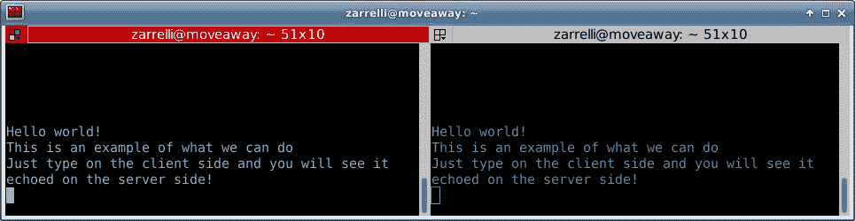
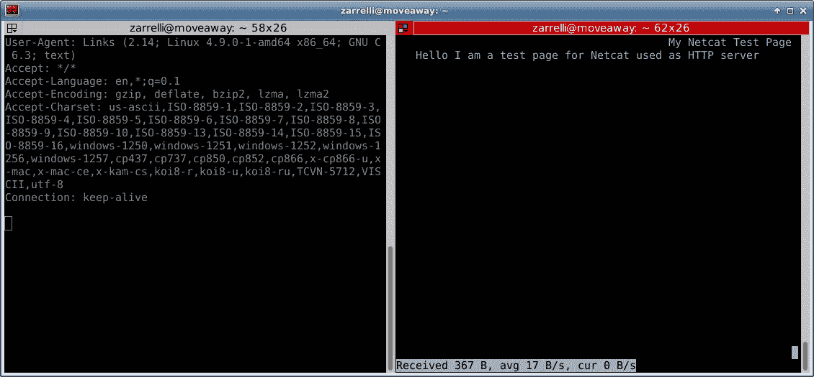

# 第十章：让我们来制作一个进程图

**进程间通信**（**IPC**）是一个很好的方式来描述进程如何相互交流、交换数据并据此作出反应。这种“聊天”可以发生在父进程和子进程之间，在同一主机上的进程之间，或不同主机上的程序之间。进程可以通过不同的方式交换数据；例如，当我们通过 SSH 连接到远程服务器时，客户端与远程主机通信并实际交换数据。这与将一个命令的输出通过管道传递给另一个命令的标准输入时是一样的；这些方式，有时是单向的，有时是双向的，是让不同进程进行通信并增强我们在 Bash 环境中执行操作的手段。

完成 IPC 的方式有很多种，其中有些更为熟悉，有些不太常见，但它们在一定程度上都是有效的，我们在本书中已经看到了一些例子。那么，现在我们将继续讲解几页，深入描述进程如何互动，以及如何利用 IPC 来增强我们的脚本，重点介绍我们可以通过 Bash 访问的那些方法，首先从所谓的**管道**开始。

# 管道

我们可以将管道描述为一系列由`stdout`和`stdin`连接在一起的进程，这样一个进程的输出就成为下一个进程的输入。这是一种简单的进程间通信（IPC）形式，通常称为匿名管道，它是单向的通信方式：前一个进程的标准输出所产生的内容流入下一个进程的标准输入；后一个进程不会向前一个进程返回任何内容。

让我们通过一个例子来进一步澄清匿名管道的概念，从一个简单的`ps`命令开始：

```
zarrelli:~$ ps PID TTY TIME CMD 1427 pts/0 00:00:00 bash 12112 pts/0 00:00:00 ps

```

我们有一个简单的命令列表：`PID`、`TTY`和`CMD`。假设我们只想将输出裁剪为`PID`和`CMD`。我们可以使用一些`ps`选项来修改输出，但谁记得这些选项呢？使用一种能够处理文本并提供我们想要结果的工具会更简单，那为什么不使用`awk`呢？这里的问题是，`awk`处理它从输入中接收到的文本，例如读取一个文件。但我们可以绕过这一点，通过管道符号`|`将它的标准输入与`ps`的标准输出连接起来：

```
zarrelli:~$ ps | awk '{print $1, $4}' PID CMD 1427 bash 12113 ps 12114 awk.

```

在这里，`awk`接受了`ps`的输出作为输入，并只打印第一个和第四个字段，空格字符作为标准字段分隔符。如前所述，我们可以将多个进程串联起来：

```
zarrelli:~$ ps | awk '{print $1, $4}' | tail -n +2 | wc -l 5

```

在这个例子中，我们将前一组命令的输出通过`tail`命令进行了管道处理，`tail`实际上移除了第一行（`PID CMD`）并将其打印到`stdout`。然后，我们将这个输出通过`wc`命令的`stdin`传递，它随后输出了我们从`stdin`接收到的行数。这是可能的，因为所有进程都在同一环境中运行，右侧管道中的每个命令都在主 shell 的子进程中运行，并共享相同的文件描述符。因此，只需将数据写入父进程的打开描述符；子进程就能按写入的顺序读取数据：借助内核缓冲区来存放等待读取的位。

很方便且实用，但也有一些严重的限制：

+   进程必须在同一主机上

+   进程必须在重叠的时间段内活动：前一个进程必须在生成输出时，后一个进程才能读取

+   通信是单向的：数据沿着链条向下流动，永远不会再爬回梯子上

我们可以通过使用管道来克服一些限制，管道通常被称为 FIFO 管道，因为它们的工作方式。它们依赖于创建一个文件，任何数量的进程都可以访问这个文件，这与匿名管道有着巨大的不同。命名管道的生命周期取决于文件的存在，而匿名管道则依赖于进程的生命周期；命名管道只要文件存在就会持续，直到系统重启或文件被删除。我们可以使用`mkfifo`或`mknod`创建一个文件，并通过 I/O 重定向来读取或写入数据，示例如下：

```
#!/bin/bash
pipefile="mypipefile"
if [[ ! -p $pipefile ]] 
then
mknod $pipefile p
fi
while true
do
read row <$pipefile
if [[ "$row" == 'exit' ]]
then
echo "I read $row so exiting"
break
fi
echo $row
done

```

让我们跟随脚本的流程。首先，我们要确保命名管道已正确创建，因此我们测试一个名为`-p`的特殊文件，它是一个管道。如果它不存在，脚本将通过`mknod $pipefile p`命令创建它。

命令行末尾加上的`p`确保创建的是一个管道文件，而不是一个常规文件。然后，我们希望脚本不断从我们打开的文件中读取，所以我们使用一个无限循环：*true 始终为真*。在这个无限循环中，我们有`read row $pipefile`指令，它逐行从管道文件中读取内容并将其存储到`row`变量中。到目前为止，一切正常。如果我们跳到脚本的最后，我们会看到它仅回显我们输入的内容，但中间有一个小的检查；如果我们输入`exit`，程序将退出。让我们在一个终端中运行我们的新脚本：

```
zarrelli:~$ ./pipe.sh 

```

我们将看到我们的提示符在不停闪烁，而不再返回命令行：脚本被困在无限循环中，正在从命名管道读取数据，直到我们在标准输入中输入`exit`才会终止。现在，使用输出重定向，我们将一些内容发送到管道文件中：

```
zarrelli:~$ echo “Hello” > mypipefile zarrelli:~$ echo “Another line” > mypipefile zarrelli:~$ echo “It is time to quit” > mypipefile zarrelli:~$ echo exit > mypipefile

```

让我们看看运行脚本的终端显示了什么：

```
zarrelli:~$ ./pipe.sh “Hello” “It is time to quit” I read exit so exiting

```

就这样。脚本回显了我们发送到`pipe`文件的所有文本；当它遇到`quit`字符串时，它就退出了，并给出了一个友好的提示信息。这个例子非常简单，可以通过简单的文件进行复制，但如果切换上下文，想象多个进程协调它们的操作，从管道中写入和读取数据、关键字、命令，并按优雅的顺序做事。所有这些都不需要使用中间临时文件，而是通过一个管道，这个管道在系统重启后会消失，且无需所有进程同时运行。进程可以由 cron 任务手动触发，由其他应用程序触发，或在循环中无限运行。无论是哪种方式，都不重要，因为一切都是异步的。我们有一种方式以异步的方式连接进程，并且是双向的，因为每个进程既可以发送数据，也可以接收数据。这意味着，我们指示其他进程并向其提供数据，或者在需要时被指示并获取数据。所有这一切都非常有用，但在 IPC（进程间通信）方面，还有比这更基础的方式，实际上它并不是真正的进程间通信，因为我们将使用重定向到普通文件。

# 重定向到文件

事实上，重定向一个进程的输出并不意味着 IPC，但它可以以异步的方式用作 IPC：一个进程将它的输出重定向到一个文件，另一个进程稍后从同一个文件中读取；这可以成为两个进程之间交换信息的一种方式：

```
zarrelli:~$ myfile=”myfile.txt” ; touch "$myfile" ; echo "$myfile" > controller ; while read -r line; do tar cvzf $line.tgz $line ; done < controller myfile.txt

```

在这个例子中，我们仅仅将一个文件名存储到一个变量中。我们通过`touch`创建了文件，然后将文件名存储到`controller`文件中。将文件名存入`controller`文件后，我们按行读取文件，每一行的内容被存储到`line`变量中。最后，`line`变量的内容用于压缩由`myfile`变量指向的文件：

```
zarrelli:~$ ls -lah total 20K drwxr-xr-x 2 zarrelli zarrelli 4.0K Apr 10 09:18 . drwxr-xr-x 4 zarrelli zarrelli 4.0K Apr 10 09:17 .. -rw-r--r-- 1 zarrelli zarrelli 11 Apr 10 09:18 controller -rw-r--r-- 1 zarrelli zarrelli 0 Apr 10 09:18 myfile.txt -rw-r--r-- 1 zarrelli zarrelli 123 Apr 10 09:18 myfile.txt.tgz prw-r--r-- 1 zarrelli zarrelli 0 Apr 9 13:05 mypipefile -rwxr--r-- 1 zarrelli zarrelli 223 Apr 9 12:44 pipe.sh

```

在这里，我们已经准备好了所有的文件，而`tar`仅仅按照`echo`在`controller`文件中存储的指令执行。这是一个相当简单的例子，可以根据需要进行扩展。注意，这种方式不需要任何特殊的文件，进程之间可以没有关联，且可以随时执行，无需任何并发性。或许这种 IPC 方式并不令人惊讶，但如果我们足够留心，仍然可以找到其他有趣的方式让进程之间相互通信，比如**命令替换**。

# 命令替换

我们已经看过了什么是命令替换：

```
zarrelli:~$ time=$(date +%H:%M) ; echo $time 10:06

```

一个命令的输出会作为字符串存储到一个变量中，然后可以在任何需要的地方使用它。所以，举个例子，我们可以这么做：

```
zarrelli:~$ myfile="myfile.txt.tgz" ; content=$(tar -tzf $myfile) ; echo $content myfile.txt

```

在这个例子中，我们使用了命令替代对一个`tar`文件进行测试，该文件的名称通过变量提供。命令替代的输出随后作为参数传递给`echo`命令，`echo`显示了`tar`命令的结果。我们也可以在命令替代部分使用更复杂的命令，但要小心转义问题，因为括号内发生的事情并不总是我们预期的。

这是让进程彼此通信的有效方式吗？是的，是的。方便吗？不完全是。在复杂任务中，命令替代可能会变得复杂，而且由于它是单向流，我们面临与其他方法相同的限制。也就是说，它在 Bash 脚本中被广泛使用，用于快速访问命令路径或将某些信息存储在变量中，例如系统上的实际日期或我们需要的任何小信息。我们有其他选项可以将进程的输出传递给另一个进程的标准输入，但有时我们没有花足够的时间去思考所有可用的方式。例如，使用进程替代。

# 进程替代

**进程替代**是一种方便的方法，用于将多个命令/进程的输出传递给另一个进程的输入。管理进程替代的标准方式遵循以下语法：

```
>(list_of_commands) <(list_of_commands)

```

注意`<`、`>`和括号之间的空格；中间不能有任何空格：

```
zarrelli:~$ wc -l <(ps -fj) 5 /dev/fd/63

```

在此示例中，`ps -fj`的输出被作为输入传递给了`wc -l`，后者计算了输出中的`5`行。注意`/dev/fd/63`。

这是进程替代使用的文件描述符，它将括号内进程的结果传递给另一个进程。因此，`/dev/fd`中的文件描述符用于传递数据，这在一些无法利用管道的命令中尤其有用，因为这些命令期望从文件中读取数据，而不是从标准输入中接收数据。以下是一个多进程数据传输的经典例子：

```
zarrelli:~$ mkdir "test 1" zarrelli:~$ mkdir "test 2" zarrelli:~$ for i in {1..5}; do touch "test 1/$i"; done zarrelli:~$ for i in {1..3}; do touch "test 2/$i"; done zarrelli:~$ diff <(ls "test 1") <(ls "test 2") 4,5d3 < 4 < 5

```

我们刚刚创建了几个测试目录，在第一个目录中，我们创建了`5`个空文件，在第二个目录中，创建了`3`个。然后，我们将`diff`命令与对`test 1`和`test 2`目录执行`ls`命令的输出配合使用。该工具随后向我们展示了`test 1`中存在但`test 2`中没有的所有文件，正如我们在两个真实目录上执行命令一样。它很方便，但请仔细考虑其作用范围，因为命令替代在函数内部可用，直到该函数返回。说到作用范围，进程替代是避免将命令管道传递给子 Shell 循环时常见陷阱的好方法：

```
#!/bin/bash
main_variable=10
echo "We are outside the loop and the global variable called main_variable has a value of: $main_variable"
for i in {1..5}
do 
echo "$i" 
done |
while read j
do
main_variable="$j"
echo "We are inside the loop and main_variable has a value of: $main_variable"
done
echo "We are now past the loop and main_variable has a value of: $main_variable"

```

管道操作实际上是在子进程中执行循环，这会导致循环中的所有变量仅在子进程中可用。`main_variable`的值将在内部循环中被修改，但一旦我们退出循环，它会恢复为主值，因为在子进程中设置的每个变量值无法传回调用环境：

```
zarrelli:~$ ./looping.sh We are outside the loop and the global variable called main_variable has a value of: 10 We are inside the loop and main_variable has a value of: 1 We are inside the loop and main_variable has a value of: 2 We are inside the loop and main_variable has a value of: 3 We are inside the loop and main_variable has a value of: 4 We are inside the loop and main_variable has a value of: 5 We are now past the loop and main_variable has a value of: 10

```

正如我们所见，`main_variable`在子 Shell 中发生了变化，而管道后的循环被执行；但它不会影响主 Shell。子 Shell 可能非常棘手，因为你可能没有意识到自己在创建它们，因此不清楚最终的结果是什么。即使设置某些环境变量也无法帮助我们避免这个问题。

# 环境变量

让我们称之为一个概念验证，而不是一种真实的进程间通信方式。谁会真的想要弄乱环境变量呢？无论如何，我们正在探索一些可行的进程间通信方法，所以我们可以考虑它，尽管在初始阶段我们不会使用它。让我们看一下`env`：

```
env LS_COLORS=REDACTED XDG_MENU_PREFIX=xfce- LANG=en_GB.utf8 DISPLAY=:0.0 XDG_VTNR=7 SSH_AUTH_SOCK=/tmp/ssh-MgHTC62oCYDp/agent.1121 GLADE_CATALOG_PATH=: XDG_SESSION_ID=2 XDG_GREETER_DATA_DIR=/var/lib/lightdm/data/zarrelli USER=zarrelli GLADE_MODULE_PATH=: DESKTOP_SESSION=xfce PWD=/home/zarrelli HOME=/home/zarrelli GUAKE_TAB_UUID=b07321dd-a221-41bd-8ecc-0ae94b9082b9 SSH_AGENT_PID=1159 QT_ACCESSIBILITY=1 XDG_SESSION_TYPE=x11 XDG_DATA_DIRS=/usr/share/xfce4:/usr/local/share/:/usr/share/:/usr/share XDG_SESSION_DESKTOP=xfce GLADE_PIXMAP_PATH=: GTK_MODULES=gail:atk-bridge TERM=xterm SHELL=/bin/bash XDG_SEAT_PATH=/org/freedesktop/DisplayManager/Seat0 XDG_CURRENT_DESKTOP=XFCE QT_LINUX_ACCESSIBILITY_ALWAYS_ON=1 SHLVL=1 XDG_SEAT=seat0 LANGUAGE=en_GB:en GDMSESSION=xfce LOGNAME=zarrelli DBUS_SESSION_BUS_ADDRESS=unix:path=/run/user/1000/bus XDG_RUNTIME_DIR=/run/user/1000 XAUTHORITY=/home/zarrelli/.Xauthority XDG_SESSION_PATH=/org/freedesktop/DisplayManager/Session0 XDG_CONFIG_DIRS=/etc/xdg PATH=/usr/local/bin:/usr/bin:/bin:/usr/local/games:/usr/games SESSION_MANAGER=local/moveaway:@/tmp/.ICE-unix/1169,unix/moveaway:/tmp/.ICE-unix/1169 OLDPWD=/home/zarrelli _=/usr/bin/env

```

我们裁剪了`LS_COLORS`变量的内容，但即便如此，仍然有一个突出的问题，就是输出有些杂乱，包含了很多信息，其中大部分对于我们的登录会话至关重要。所以，首先的建议是， tinkering 时一定要对`environment`变量保持谨慎。

我们必须记住的一点是，`shell`变量和`environment`变量之间有很大的区别；让我们来看一个例子：

```
#!/bin/bash a=10 b=20 echo -e "n" echo "This is the value of a in the main subshell: $a" (a=$((a+b)) ; echo "Inside the nested subshell a now has the value of: $a") echo "Back to the main subshell a has a value of: $a" echo -e "n" echo "And now we will tinker with the environment..." echo "This is the value of a in the main subshell: $a" ( export a=$((a+b)) b=$((a+b)) echo "Inside the nested subshell a now has the value of: $a" echo "Inside the nested subshell b now has the value of: $b" echo "The value of the environment variable a is:" env | grep ^a echo "Here is the value of a at this level of subshell using process substitution:" grep ^a <(env) echo "And they are the same, since the nested shell share the environment variables of the parent shell" echo "b is inherited as well: $b" ) echo "Back to the main subshell the environment variable a has a value of: $a" echo "Back to the main subshell the shell variable b has a value of: $b"

```

执行它后，我们将得到如下结果：

```
zarrelli:~$ ./environment.sh 
This is the value of a in the main subshell: 10
Inside the nested subshell a now has the value of: 30
Back to the main subshell a has a value of: 10

```

现在我们将尝试操作环境：

```
This is the value of a in the main subshell: 10 Inside the nested subshell a now has the value of: 30 Inside the nested subshell b now has the value of: 50 The value of the environment variable a is: a=30 Here is the value of a at this level of subshell using process substitution: a=30

```

它们是相同的，因为嵌套的 Shell 共享了父 Shell 的环境变量：

```
b is inherited as well: 50 Back to the main subshell the environment variable a has a value of: 10 Back to the main subshell the shell variable b has a value of: 20

```

从这个例子中我们看到的是有关变量正常使用的内容。Shell 变量和环境变量之间没有真正的区别：两者都可以被子进程/子 Shell 访问，并且都不会受到子 Shell 操作的影响。真正的区别出现在当我们有一个通过`execve()`系统调用执行的子进程时：在这种情况下，Shell 变量不会传递给子进程。我们需要将其导出，才能使其在子 Shell 中可用。如果我们想玩得更开心，还有比这更复杂的事情。Bash 4.0 引入了一个新关键词，它可以为我们的实验提供一个有趣的“游乐场”。

# 协处理进程

Bash 4.0 引入的`coproc`关键词允许用户在异步子 Shell 中后台运行一个进程。在进程执行期间，调用 Shell 和协处理进程之间会建立一个管道。最佳结果适用于可以在 CLI 中运行的程序，这些程序能够从`stdin`读取并写入到`stdout`，最好是使用无缓冲流。`coprocess`的语法如下：

```
coproc (NAME) command (redirections)

```

括号内的内容是可选的，但如果指定了一个名称，`coproc`将创建一个带有该名称的协程。如果没有给出名称，默认将使用`COPROC`；如果以下是一个简单的命令，我们不能定义任何名称，否则它会被当作命令的第一个单词来处理。执行协程的 Shell 的进程 ID 存储在名为`NAME_PID`的变量中：

```
Let's see an example: zarrelli:~$ coproc { while true ; do ls ; done } [2] 31067

```

我们执行了一个无限循环，它的`PID`显示为`31067`；我们来检查是否能从`COPROC_PID`中读取它，这是当没有提供名称时变量的默认名称：

```
zarrelli:~$ echo $COPROC_PID 31067

```

在这里，我们可以轻松地从`COPROC_PID`变量获取`PID`值。当执行协程时，Shell 会实例化一个名为`NAME`的数组变量，存储两部分信息：

+   **NAME[0]**：这是协程的输出文件描述符

+   **NAME[1]**：这是协程的输入文件描述符

因此，我们可以使用文件描述符进行读写，在我们的示例中它们如下：

```
zarrelli:~$ echo ${COPROC[0]} 62 zarrelli:~$ echo ${COPROC[1]} 58

```

另一种查看当前进程打开了哪些文件的方法是：

```
ls -lah /proc/PID/fd

```

在我们的例子中，做如下操作：

```
ls -la /proc/31067/fd total 0 dr-x------ 2 zarrelli zarrelli 0 Apr 11 16:37 . dr-xr-xr-x 9 zarrelli zarrelli 0 Apr 11 15:13 .. lr-x------ 1 zarrelli zarrelli 64 Apr 11 16:37 0 -> pipe:[615372] l-wx------ 1 zarrelli zarrelli 64 Apr 11 16:37 1 -> pipe:[615371] lrwx------ 1 zarrelli zarrelli 64 Apr 11 16:37 2 -> /dev/pts/0 lrwx------ 1 zarrelli zarrelli 64 Apr 11 16:37 255 -> /dev/pts/0 l-wx------ 1 zarrelli zarrelli 64 Apr 11 16:37 60 -> pipe:[608200] lr-x------ 1 zarrelli zarrelli 64 Apr 11 16:37 63 -> pipe:[608199]

```

这些管道是在用户在命令行上指定任何重定向之前就已经建立的，所以文件描述符可以作为命令行上发出的命令的参数使用，重定向可以用来传递或获取数据；但需要注意的是，文件描述符不会被子 Shell 继承。也就是说，我们可以通过以下语法向协程传递数据：

```
echo data >&"${COPROC[1]}"

```

我们可以像下面这样使用`read`从协程中获取数据：

```
read variable <&"${COPROC[0]}"

```

在查看一个简单的例子之前，我们必须记住几个要点：

+   在 Linux 中，大多数命令在没有用户交互的情况下是被缓冲的。这让我们在从`coproc`文件描述符读取时感到困惑。为了进行一些简单的实验，`bc`工具很好用；或者使用带有`fflush()`的`awk`，或使用`expect`包中的`unbuffer`命令来获得无缓冲的输出。

+   同一时间只能有一个活动的协程。

+   我们可以使用`wait`内建命令来等待协程终止。

也就是说，接下来我们来看看如何与后台进程交互：

```
#!/bin/bash coproc bc_calc { bc; } in=${bc_calc[1]} out=${bc_calc[0]} echo '10*20' >&$in read -u $out myvar echo $myvar

```

为了让`coproc`接受我们创建的名称，我们创建了一个只包含一个命令并后跟`;`的列表，然后通过将文件描述符存储在两个有意义的变量中，我们简化了与文件描述符的操作。所以，我们不再处理`0`和`1`。在下一步中，我们将`bc`的乘法运算通过其文件描述符回显到`bc`的`stdin`，并使用`-u`选项读取它，`-u`选项正是读取文件描述符所需的选项。最后一步，我们打印了先前存储了乘法结果的输出变量，这个结果是由`bc`打印在其标准输出上的。

其实还有最后一种方式可以让不同的进程相互通信；我们能回想起来吗？是的，我们在本书一开始就已经看到了它。

# /dev/tcp 和 /dev/udp

如果我们查看 `/dev` 目录，我们会发现许多文件代表物理设备，这些设备可能是硬件设备，也可能不是。这些设备文件可以代表分区；回环设备用于将普通文件当作块设备来访问。例如，ISO 文件可以像 CD-ROM 一样被挂载。有些设备文件非常不常见，但我们已经听说过它们，例如 `/dev/null`、`/dev/zero`、`/dev/urandom`、`/dev/tcp` 和 `/dev/tcp`。

这些被称为伪设备，它们代表并提供对一些*设施*的访问。例如，所有这些都被移到或重定向到 `/dev/null`，它掉入一个*黑洞*并消失，而 `/dev/urandom` 是一个在需要时获取随机字符串的好方法：

```
cat /dev/urandom | head -c 25 | base64 HwUmcXt0zr6a7puLtO1xyKMrAdZrRqIrgw==

```

通过 `/dev/tcp` 或 `/dev/udp`，我们可以通过一个套接字与本地或远程的网络服务进行通信。对于我们的示例，我们将专注于 TCP 套接字，因为它们更适合我们的实验。

那么，什么是套接字呢？想象一个套接字是连接两栋多层建筑之间的一根管道。要将这根管道安装到位，你必须知道每栋建筑的门牌号，以及必须将哪个楼层与另一栋楼的哪个楼层连接。网络套接字也是如此，它由两个元组标识：

```
origin_ip:origin_port destination_ip:destination_port

```

因此，Bash 只要我们提供至少远程端的通信通道、IP 或主机名，以及要连接的端口，就能建立与网络服务的连接。这很简单，不是吗？但是怎么做呢？正确的语法如下：

```
exec file_descriptor_number <> /dev/tcp/ip/port

```

`<` 表示打开用于读取的套接字，`>` 表示用于写入，`<>` 表示同时用于读取和写入。IP 或主机名之间没有太大区别，但我们必须注意将使用哪些文件描述符。我们有 10 个文件描述符可用，从 0 到 9，但由于 `0 = stdin`、`1 = stdout`、`2 = stderr` 已经被绑定，我们不能使用它们。所以，剩下的文件描述符是 3 到 9。现在，让我们尝试一个简单的例子：

```
cat </dev/tcp/time.ien.it/13 11 APR 2017 22:00:46 CEST

```

我们刚刚通过互联网读取了时间，连接到一个意大利的时间服务器，方式非常简单，但我们还能做更复杂的事情；让我们回顾一下第一章中做过的一个例子。

让我们以读/写模式打开一个套接字连接到一个 web 服务器，并将文件描述符指定为 `9`：

```
zarrelli:~$ exec 9<> /dev/tcp/172.16.210.128/80 || exit 1

```

然后，我们将使用 HTTP/1.1 语法向它发送请求，就像我们是一个真实的 web 浏览器一样：

```
zarrelli:~$ printf 'GET /index2.html HTTP/1.1nHost: 172.16.210.128nConnection: closenn' >&9

```

我们刚刚请求了一个为这个示例创建的简单 HTML 文件；因为我们请求了它，所以现在是通过文件描述符 `9` 来读取该页面的时候了：

```
zarrelli:~$ cat <&9 HTTP/1.1 200 OK Date: Sat, 21 Jan 2017 17:57:33 GMT Server: Apache/2.4.10 (Debian) Last-Modified: Sat, 21 Jan 2017 17:57:12 GMT ETag: "f3-5469e7ef9e35f" Accept-Ranges: bytes Content-Length: 243 Vary: Accept-Encoding Connection: close Content-Type: text/html <!DOCTYPE HTML PUBLIC "-//W3C//DTD HTML 4.01//EN" "http://www.w3.org/TR/html4/strict.dtd"> <HTML> <HEAD> <TITLE>This is a test file</TITLE> </HEAD> <BODY> <P>And we grabbed it through our descriptor! </BODY> </HTML>

```

在这里，我们可以像操作本地文件一样与远程服务器互动，使用 `print` 和 `cat` 来推送和拉取内容。完全是本地操作，但实际上是远程操作。

确实，还有一种方式可以在想要搞弄 IPC 时玩得很开心；尽管这不是一种正式的 IPC 手段，但它太有趣了，以至于我们不能不提到 Netcat。

# Netcat

我们甚至可能从未使用过这个工具，但没人能说他们从没听过它被称为 *TCP/IP 瑞士军刀*，这是因为它的多功能性。你可以花几个小时仅仅探索它所支持的所有可能性。话说回来，`netcat` 是一个使用 TCP 或 UDP 协议在网络上读取和写入数据的工具；它真正方便的地方在于，它能够保持连接直到远程端断开。这使得它不同于大多数应用程序，它们在最后一段数据传输完毕后就停止工作。`netcat` 不一样；它能保持通信通道两端的连接，即使没有数据传输，因此你可以用它来进行重复的数据发送。

Netcat 可以在服务器模式或客户端模式下使用，也可以通过在脚本中添加网络功能来使用。所以有很多功能，理解它的最佳方式是运行一些示例。因此，第一步是在终端中打开与远程服务器的连接，终端可以被分为两个面板，如*terminator*。最后一点，记住 Netcat 默认无法安装在我们的系统上，但各个发行版有相关的安装包。因此，一旦工具安装完成，打开两个 `xterm`，或将 terminator 分成两个面板并连接到远程服务器。在远程服务器上，检查一个开放的端口，通常是 `8000`（`8080` 是一个常用于代理的端口）或者 `9000`，这类端口通常比较合适；可以通过执行以下命令检查我们想要的端口是否可用：

```
root:# netstat -tapnl | grep 9000

```

Netstat 会列出所有处于监听模式的 TCP 端口，显示端口的数字编号；然后我们使用 grep 来查找我们要检查的端口。如果返回为空，说明该端口是空闲的。第二步，通常被遗忘的是，我们需要确保该端口没有被本地防火墙阻塞。这是因为我们正在掌握 Bash 并且*已经*在本地桌面上部署了防火墙。我们稍后会讨论如何保护我们的计算机，但现在假设我们已经有了一个简单但可靠的防火墙，比如 `ufw`。要启用 `900` 端口，我们只需要执行以下命令：

```
root:# ufw allow 9000/tcp Rule added Rule added (v6)

```

规则已添加，它是我们链中的第六条，但它可以是任何其他编号，取决于你有多少条其他规则。记住，要删除规则，只需运行以下命令：

```
root:# ufw delete 6 Deleting: allow 9000/tcp Proceed with operation (y|n)? y Rule deleted

```

我们使用了规则编号，你也可以根据需要使用规则名称 `allow 9000/tcp`。现在，我们已经解除了端口的阻塞，可以在远程服务器上以监听模式运行 `netcat`：

```
root:# netcat -lvvp 9000 listening on [any] 9000 ...

```

这将以监听模式启动 `netcat`，并且 `-l` 会准备好接受 `-p 9000` 端口的连接，以详细模式 `-vv` 启动。我们将无法返回提示符，因为 `netcat` 会在前台运行，独占终端。现在，在本地系统上，让我们以客户端模式运行 `netcat`：

```
zarrelli:~$ nc -vv 192.168.0.10 9000 spoton [192.168.0.10] 9000 (?) open

```

太好了，连接在两端都已打开。请注意，我们使用了`netcat`命令和`nc`两种方式来调用 Netcat；我们可以选择任何一种。连接建立后，我们将在监听端看到如下信息：

```
192.168.0.5: inverse host lookup failed: Unknown host connect to [192.168.0.10] from (UNKNOWN) [192.168.0.5] 60054

```

被称为`Unknown host`的消息不应打扰我们；Netcat 会进行反向查找，检查连接来源的主机名。由于这是一个测试环境，我们没有设置任何内部 DNS 解析。如果你不想动 DNS，可以通过在服务器端操作系统上打开`/etc/hosts`文件，并添加一行，如`192.168.0.5 spoton`，来解决问题。

`192.168.0.t` 是客户端的 IP 地址，连接来自该地址，而`spoton`是我们希望服务器端通过`netcat`识别和解析的主机名。如果你不想使用 DNS 解析，可以在服务器和客户端上都加上`-n`选项，这样你将只使用 IP 地址。那么现在，让我们重新尝试连接：

```
root:# netcat -lvvp 9000 listening on [any] 9000 ... connect to [192.168.0.10] from spoton [192.168.0.5] 60176

```

看起来更好了，是吗？我们只需在客户端输入一些内容，无论输入什么都会在服务器端回显。我们可以暂停并稍后输入；与此同时，通道将保持开启并等待我们的输入：



客户端在左侧面板上，右侧面板上将其回显到服务器端。现在有些神秘的东西；在服务器端，输入这个：

```
root:# netcat -lvvp 9000 -c /bin/date listening on [any] 9000 ...

```

我们刚才所做的是使用`-c`开关告诉`netcat`在连接建立后立即执行作为参数指定的命令。该命令将传递给`/bin/sh -c`进行执行，不做任何进一步检查，如果你没有安装`sh` shell，只需使用`-e`来执行命令。现在，在客户端，执行如下操作：

```
zarrelli:~$ nc -vv 192.168.0.10 9000 spoton [192.168.0.10] 9000 (?) open Wed 12 Apr 11:14:07 BST 2017 sent 0, rcvd 29

```

连接在执行`date`命令后立即建立；所以，在我们的客户端，我们可以看到命令的输出以及服务器端的日期和时间。这看起来不那么神秘，对吧？这只是`date`，能有什么害处呢？好吧，我们来修改服务器的参数，准备好吓一跳吧：

```
root:# netcat -lvvp 9000 -c /bin/bash listening on [any] 9000 ...

```

有趣的是，在每次连接时，我们都会执行一个 Bash shell。让我们在客户端打开它：

```
zarrelli:~$ nc -vv 192.168.0.10 9000 spoton [192.168.0.10] 9000 (?) open

```

现在，让我们在客户端输入一些无害的命令：

```
date Wed 12 Apr 11:21:02 BST 2017

```

好的，这是一个日期，但我们在哪里？

```
pwd /root

```

很好，但我们到底是谁？

```
whoami root

```

所以，我们是`root`，但我们站在哪一边？

```
hostname -I | awk '{print $1}' 192.168.0.10

```

哎呀，我们在服务器上是`root`，并且我们以超级用户身份发出了命令，不需要任何身份验证。由于这非常危险，请务必小心使用此选项。或许只是为了娱乐和测试，除此之外没有别的，我们这样做只是为了突出它的潜力和风险。

我们还能做什么？让我们在客户端创建一个文件：

```
zarrelli:~$ echo “Here I am, a test file” > testfile.txt

```

在服务器端，我们开始`netcat`，这次不使用详细模式，因为如果你不想调试连接，且希望将输出重定向到`testfile.txt`，就不需要详细模式：

```
zarrelli:~$ netcat -lp 9000 > testfile.txt

```

我们使用了没有特权的用户。如果我们不想绑定所谓的保留或系统端口，就不需要使用`root`；低于`1024`的端口用于提供服务，例如`22`用于 SSH，`80`用于 HTTP 等。

现在，回到客户端，让我们把`testfile`的内容输入给客户端：

```
zarrelli:~$ cat testfile.txt | nc -w2 192.168.0.10 9000

```

我们为连接添加了 2 秒的超时，这样一旦文件内容传输完毕，它将在 3 秒后关闭连接。服务器端看到的内容是：

```
connect to [192.168.0.10] from spoton [192.168.0.5] 32912 sent 0, rcvd 29

```

我们完成了，只需按*Ctrl* + *C*中断 Netcat，并检查`filetest.txt`的内容：

```
zarrelli:~$ cat testfile.txt “Here I am, a test file”

```

就这样，文件的内容已经传输到服务器并保存在`testfile.txt`中。但是如果我们想传输整个目录或一堆文件呢？我们不能采用相同的策略，因为所有输出都会被重定向到一个文件，这样是行不通的。那么，在服务器端，首先让我们创建一个测试用的`dir`：

```
zarrelli:~$ mkdir test zarrelli:~$ cd test

```

现在，让我们运行 Netcat：

```
zarrelli:~$ nc -lvvp 9000 | tar -xpzf -

```

这将对输入运行`tar`，命令如下：

+   `x`：从输入的归档中提取文件。

+   `p`：它保持文件的权限。

+   `z`：它通过`gzp`过滤接收到的归档，实质上是解压它。

+   `f`：工作文件归档。在我们的例子中，一切都被发送到`stdout`。

+   `-`：最后一个破折号意味着它将处理来自`stdin`的数据，而不是在文件系统中查找文件。

在客户端，让我们进入一个包含我们想要传输的文件和子目录的目录，并查看它们的属性：

```
zarrelli:~$ ls -lah total 44K drwxr-xr-x 4 zarrelli zarrelli 4.0K Apr 12 11:54 . drwxr-xr-x 4 zarrelli zarrelli 4.0K Apr 12 12:56 .. -rw-r--r-- 1 zarrelli zarrelli 11 Apr 10 09:20 controller -rwxr--r-- 1 zarrelli zarrelli 121 Apr 11 18:30 coproc.sh -rwxr--r-- 1 zarrelli zarrelli 961 Apr 11 12:19 environment.sh -rwxr--r-- 1 zarrelli zarrelli 382 Apr 11 10:08 looping.sh -rw-r--r-- 1 zarrelli zarrelli 0 Apr 10 09:20 myfile.txt -rw-r--r-- 1 zarrelli zarrelli 122 Apr 10 09:20 myfile.txt.tgz prw-r--r-- 1 zarrelli zarrelli 0 Apr 9 13:05 mypipefile -rwxr--r-- 1 zarrelli zarrelli 223 Apr 9 12:44 pipe.sh drwxr-xr-x 2 zarrelli zarrelli 4.0K Apr 10 12:20 test 1 drwxr-xr-x 2 zarrelli zarrelli 4.0K Apr 10 12:20 test 2 -rw-r--r-- 1 zarrelli zarrelli 29 Apr 12 12:06 testfile.txt

```

现在，在客户端，运行 Netcat：

```
tar czf - * | nc -vw2 192.168.0.10 9000

```

`tar`命令执行时，使用以下参数：

+   `c`：创建一个归档。

+   `z`：通过`gzip`进行压缩。

+   `f`：工作文件归档。在我们的例子中，它将从输入中获取文件名。

+   `-`：最后一个破折号意味着它将处理来自`stdin`的数据，而不是在文件系统中查找文件。

我们把所有可见的文件和目录作为输入提供给`tar`；如果我们只想复制其中一些文件，也可以使用单个或多个文件和目录名。一旦命令执行，我们应该会在服务器端看到类似的输出：

```
connect to [192.168.0.10] from spoton [192.168.0.5] 33022 sent 0, rcvd 1352

```

看起来文件和目录已经传输完毕。让我们退出 Netcat 并检查一下：

```
zarrelli:~$ ls -lah total 44K drwxr-xr-x 4 zarrelli zarrelli 4.0K Apr 12 12:35 . drwxr-xr-x 70 zarrelli zarrelli 4.0K Apr 12 12:33 .. -rw-r--r-- 1 zarrelli zarrelli 11 Apr 10 09:20 controller -rwxr--r-- 1 zarrelli zarrelli 121 Apr 11 18:30 coproc.sh -rwxr--r-- 1 zarrelli zarrelli 961 Apr 11 12:19 environment.sh -rwxr--r-- 1 zarrelli zarrelli 382 Apr 11 10:08 looping.sh -rw-r--r-- 1 zarrelli zarrelli 0 Apr 10 09:20 myfile.txt -rw-r--r-- 1 zarrelli zarrelli 122 Apr 10 09:20 myfile.txt.tgz prw-r--r-- 1 zarrelli zarrelli 0 Apr 9 13:05 mypipefile -rwxr--r-- 1 zarrelli zarrelli 223 Apr 9 12:44 pipe.sh drwxr-xr-x 2 zarrelli zarrelli 4.0K Apr 10 12:20 test 1 drwxr-xr-x 2 zarrelli zarrelli 4.0K Apr 10 12:20 test 2 -rw-r--r-- 1 zarrelli zarrelli 29 Apr 12 12:06 testfile.txt

```

就这样，所有文件和目录都已复制，并且权限已被保留。Netcat 有许多功能，可能值得写一本专门的书；我们现在只是略微触及其表面，享受这个过程：

```
zarrelli:~$ netcat -z -w 1 -vv 192.168.0.10 22 spoton [192.168.0.10] 22 (ssh) open sent 0, rcvd 0

```

我们可以通过`-z`将其用作简单的端口扫描器，这将阻止从远程服务器接收任何数据，并且通过`-w 1`在远程端口没有回复时超时连接。你还可以添加`-n`来防止 DNS 解析，并通过端口号或名称指定端口，或者指定一个端口范围进行检查，格式为*lower_port_number:higher_port_number*：

```
zarrelli:~$ netcat -z -w 1 -vv 192.168.0.10 https spoton [192.168.0.10] 443 (https) : Connection timed out sent 0, rcvd 0

```

如果我们不知道或记不得与主要服务相关的端口，可以从`/etc/services`文件中检索端口列表。

好吧，我们需要代理吗？

```
zarrelli:~$ ncat -l 9999 -c 'nc 192.168.0.10 80'

```

在这种情况下，我们使用了`ncat`，它是一个类似于 Netcat 的工具，但功能更强大，能够克服 Netcat 的限制。它有一个单向管道，因此在代理时我们可以发送数据，但不能从服务器读取数据。一旦`ncat`执行了 Netcat 并管理了数据流，我们就可以连接到本地主机的`9999`端口，并请求一个页面：

```
telnet localhost 9999 Trying ::1... Connected to localhost. Escape character is '^]'. GET / HTTP/1.1 Host: 192.168.0.10 Connection: close HTTP/1.1 200 OK Date: Wed, 12 Apr 2017 12:41:02 GMT Server: Apache/2.4.10 (Debian) Last-Modified: Thu, 01 Dec 2016 18:52:27 GMT ETag: "29cd-5429d52a85057" Accept-Ranges: bytes Content-Length: 10701 Vary: Accept-Encoding Connection: close Content-Type: text/html <!DOCTYPE html PUBLIC "-//W3C//DTD XHTML 1.0 Transitional//EN" "http://www.w3.org/TR/xhtml1/DTD/xhtml1-transitional.dtd"> <html >

```

我们只是截取了输出的一部分，包含了整个页面，并突出显示了我们给出的命令来获取页面。无论如何，除了使用`ncat`，我们还可以使用带命名管道的 Netcat：

```
zarrelli:~$ mkfifo mypipe

```

然后，简单地使用输出重定向来建立一个双向通道：

```
zarrelli:~$ nc -l 9999 0<mypipe | nc 192.168.0.10 80 1>mypipe

```

现在，使用 telnet 连接到本地主机的`9999`端口，并执行与另一个示例中相同的 get 请求，或者更好的是，启动你的互联网浏览器并将其指向`http://localhost:9999`。

在离开本章之前，还有一件事，你是否曾经想过拥有一个简单、快速的服务器随时可用？让我们开始创建一个简单的 HTML 页面：

```
<!doctype html>
<html lang="en">
<head>
<meta charset="utf-8">
<title>My Netcat Test Page</title>
<meta name="description" content="Test page for Netcat HTTP server">
<meta name="author" content="Giorgio Zarrelli">
<link rel="stylesheet" href="css/styles.css?v=1.0">
</head>
<body>
Hello I am a test page for Netcat used as HTTP server
</body>
</html>

```

现在，一个无限循环将帮助 Netcat 为我们提供页面：

```
while true; do nc -lp 9999 < my_index.html; done

```

最后一步，让我们在我们喜欢的互联网浏览器中打开`http://localhost:9999`。

该页面将被提供，因为它是由 Web 服务器推送的，正如我们从以下截图中看到的：



我们刚创建的 HTML 页面正在作为一个真实的 Web 服务器推送的页面一样提供。

# 摘要

让服务相互通信并不是那么难，甚至可以非常有趣，尤其是当我们知道如何重定向流并使用正确的工具增添一些趣味时。我们是否已经看到了 Bash 在 IPC 方面的所有功能？没有，而这正是 Shell 的魅力之一：我们可以以不同的方式完成同一任务，且有太多的事情可以做，一章根本不够。再一次，这就是 Shell 的最佳之处：我们从一些示例开始，学习如何使用命令和工具，然后通过尝试新实验、调整选项和参数，扩展我们的知识，掌握我们拥有的工具。

我们已经将 IPC 推到极限，以至于 Netcat 变成了一个简单的 Web 服务器，通过网络推送页面，以便我们能够在浏览器中显示它。这是非常令人惊讶的，它实际上是 Bash 所能做到的极限，但我们将在下一章尝试突破这些界限，看看如何使用 Bash 创建简单的守护进程并提供服务。
