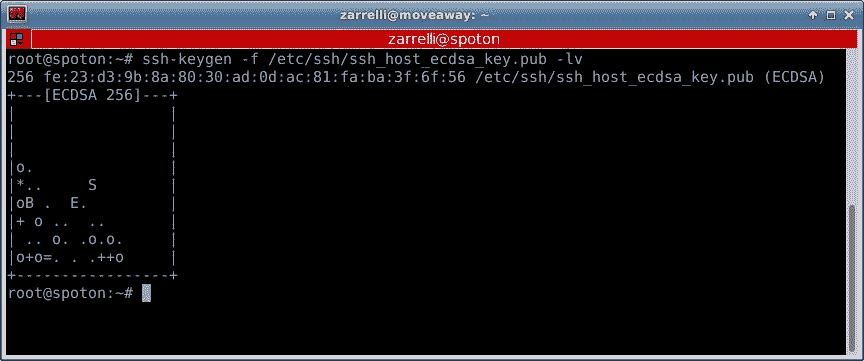
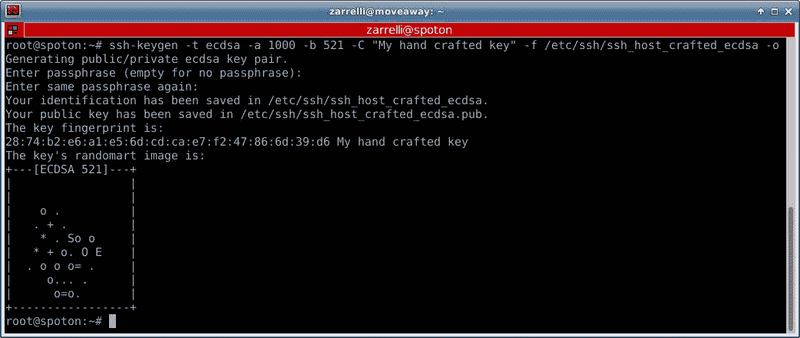

# 通过 SSH 进行远程连接

# 什么是 SSH？

对于这样的问题，常见的答案是使用安全外壳并使用 SSH。唯一的缺点是，SSH 并不是一个外壳；它实际上是一个协议，通常称为 SSH1 和 SSH2：这两个版本的协议彼此不兼容。实际上，现在我们主要使用的是 SSH 版本 2 和 OpenSSH 服务器；它是 OpenBSD 项目的服务器程序，适用于多种平台。

SSH 的好处是什么，为什么我们要使用它？简而言之，SSH 提供了三个主要功能：

+   **身份验证**：这意味着它可以确保我们知道对方的身份。因此，当有人试图连接到我们的 SSH 服务器时，服务器能够在授予其系统访问权限之前，获取远程方的数字身份证明。

+   **加密**：像 Telnet 和 FTP 这样的旧协议简单易用，但它们有一个巨大的缺点，即它们以明文方式传输数据，因此如果有人无法攻破服务器，他们仍然可以尝试窃听与服务器之间的数据传输。SSH 通过加密数据来解决这个问题，从而使数据不容易被读取。

+   **完整性**：它防止篡改。如果有人拦截数据并在传输过程中修改它，SSH 将能够察觉到。

一个典型的 SSH 连接经过一系列步骤，包括建立会话和身份验证：

+   **会话**：服务器监听一个端口，通常是端口 `22`。客户端联系服务器，服务器回复支持的协议版本。如果客户端和服务器都支持某个版本，连接将继续。服务器提供一个主机密钥，作为身份的证明；如果客户端在之前的会话中已记录该密钥，则会与保存的副本进行比较。客户端和服务器协商一个会话密钥，用于加密会话（对称密钥）。

一旦建立了安全通道，客户端通过多种选项（如 Kerberos）进行身份验证；它是基于主机的，但通常使用以下几种方法之一：

+   **密码**：用户必须在远程服务器上拥有一个受密码保护的账户。这可能是设置过程最简单的方式，但它也有一些缺点，比如我们需要记住远程主机上的用户名和密码，并且它使得自动化登录脚本变得更加困难。

+   **公钥加密**：不要与加密密钥混淆，公钥方法实际上依赖于一对 SSH 密钥，一个公钥和一个私钥。一个有趣的地方是，公钥可以用来加密数据，只有私钥才能解密。因此，这是一种非对称加密，因为这两个密钥有不同的作用，我们不能使用公钥解密用相同公钥加密的数据。而且无法从公钥推导出私钥，因此公钥的分发变得安全且简单：任何获得公钥的人都可以加密数据，但只有持有对应私钥的人才能解密数据。因此，公钥可以安全地共享，而私钥必须保密且无法访问。

看看 SSH 会话中如何使用两种不同加密方式非常有趣：

+   **对称加密**：用于加密所有通过 SSH 会话传输的数据，它依赖于 Diffie-Hellman（或相关）算法，并依赖一个大素数，过程如下：

    1.  在会话开始时，客户端和服务器都会选择一个大素数，作为种子值。然后，客户端和服务器选择一个加密生成器，如 AES，以及另一个素数，且该素数不会传递给对方。

    1.  现在，我们有了共享的素数、两个私有素数和一个加密生成器，因此每一方可以从其私有素数派生出一个公钥，并与另一方共享。

    1.  一旦共享，双方都解密对方的公钥、算法、私有素数以及共享的素数，从而创建一个新的主密钥，该密钥对双方都是相同的，可以用于加密双方后续的流量。

        在此过程中，建立主密钥的过程涉及服务器使用其主机密钥对交易中使用的数据进行签名，从而实现对客户端的身份验证，客户端现在可以信任该服务器。

+   **非对称加密**：用于身份验证阶段，以便将客户端认证到服务器。如我们所见，其中一种身份验证方法是通过一对密钥完成的，一个公钥和一个私钥：

    1.  客户端开始发送它希望用于身份验证的密钥对 ID 和用户名。

    1.  服务器随后检查用户账户是否在系统中可用，并且检查是否存在包含`authorized_keys`文件的`.ssh`目录。如果该文件存在，它应该包含服务器存储的公钥，因此客户端发送的 ID 会与存储在该文件中的公钥 ID 进行匹配。

    1.  如果找到客户端的公钥，它将用于加密一个随机数，然后返回给客户端。

    1.  客户端生成公钥并持有其私钥，因此它可以解密服务器发送的数据包并获得秘密随机数。

1.  在客户端，一组随机数会与会话密钥结合，然后进行哈希计算得到其 MD5 哈希值。

1.  然后，MD5 哈希值会被发送回服务器，服务器使用会话密钥和原始随机数来计算 MD5 哈希值。如果这两个哈希值匹配，就意味着客户端拥有与用来加密随机数的公钥对应的私钥，从而完成客户端认证。

+   **MD5 哈希**：我们刚刚提到 MD5 哈希，接下来简要解释一下它的原理，虽然有大量关于加密和哈希算法的书籍。哈希函数用于将任意大小的数据映射到固定大小。这就像是创建一个物体的指纹，但有一个特别的性质：你可以使用哈希函数将原始数据映射到一个固定大小的值，但不能从该固定大小的值反向映射回原始数据。简单来说，哈希函数是单向的。MD5 是一个用于生成 128 位哈希值的算法：无论哈希数据的大小如何，生成的 MD5 哈希值总是 128 位——不多也不少。尽管 MD5 是作为加密手段创建的，但它已被证明易受各种攻击，因此现在通常用于检查数据的完整性，例如验证从安全网站下载的数据未被篡改。

SSH 为我们提供了一个安全的通道，通过网络工作，避免数据被第三方截获，并确保我们的身份被安全认证。大多数时候，我们处理的是 OpenSSH 服务器，但当谈到客户端时，各种操作系统都有很多选择：从命令行程序到图形界面程序，如 putty。最终，选择哪个客户端完全取决于我们自己的偏好，只要我们觉得它更符合使用习惯。一旦选择了合适的客户端，我们就可以连接到服务器；而最安全的方法是使用公钥认证，在下一章中我们将看到如何设置无密码的 SSH 连接。

# 配置文件

在开始使用 ssh 并查看它为我们提供的功能之前，先花点时间看看用于管理 ssh 服务和客户端的最相关文件。SSHD 守护进程的配置文件通常存储在`/etc/ssh`目录下，在那里我们可以找到一些有趣的文件：

+   `moduli`：该文件包含了 ssh 服务器在 Diffie-Hellman 组交换密钥交换方法中使用的质数和生成器，用于创建共享的会话主加密密钥。

+   `sshd_config`：这是 ssh 守护进程的配置文件。我们稍后会更详细地查看它，了解一些有趣且有用的指令，它们可以改变我们连接远程服务器的方式。

+   `ssh_config`：这是系统范围的 SSH 客户端配置文件，在用户主目录 `~/.ssh/config` 中没有找到特定用户配置文件时会使用它。稍后我们将看到如何使用它。

+   `ssh_host_dsa_key`：这是 sshd 守护进程使用的 DSA 私钥。

+   `ssh_host_dsa_key_pub`：这是 sshd 守护进程使用的 DSA 公钥。

+   `ssh_host_rsa_key`：这是 sshd 守护进程使用的 RSA 私钥。

+   `ssh_host_rsa_key_pub`：这是 sshd 守护进程使用的 RSA 公钥。

+   `ssh_host_key`：这是 sshd 用于 SSH 版本 1 协议的 RSA 私钥。

+   `ssh_host_key.pub`：这是 sshd 用于 SSH 版本 1 协议的 RSA 公钥。

+   `ssh_host_ecdsa_key`：这是 sshd 守护进程使用的 ECDSA 私钥。

+   `ssh_host_ecdsa_key.pub`：这是 sshd 守护进程使用的 ECDSA 公钥。

+   `ssh_host_ed25519_key`：这是 sshd 守护进程使用的 ED25519 私钥。

+   `ssh_host_ed25519_key.pub`：这是 sshd 守护进程使用的 ED25519 公钥。

这些与主机密钥相关的 RSA、DSA、ECDSA 和 ED25519 缩写分别代表什么？这些缩写指的是用于身份验证密钥的公钥密码体制，涉及了许多争论：有人说 **数字签名算法（DSA）** 在加密时较慢，但在解密时比 RSA（这个算法的名字源自于其研究者 MIT 的 Ron Rivest、Adi Shamir 和 Leonard Adleman）更快，而 RSA 被认为比 DSA 更安全，另外 **椭圆曲线数字签名算法** (**ECDSA**) 和 **Edwards 曲线数字签名算法** (**ed25519**) 是新兴的算法。这些都是数字签名方案，利用不同的特性如质数或椭圆曲线，确保加密本身是不可破解的，或者更现实地说，是计算上不可行或不太可能。因此，在继续之前，必须明确一点：我们不能确定某种加密方式真的是不可破解的，也无法确定现在看似安全的加密方式未来是否依旧安全。

所以，我们可以做出明智的猜测，选择一个计算量大的且据称没有任何后门的算法。因此，虽然我们永远无法做到百分之百的安全，但我们可以根据一些 OpenSSH 项目的建议做出选择：

+   OpenSSH 7.0 因为其弱点弃用了 DSA 算法。因此，我们可以安全地抛弃这个算法。

+   不要使用小于 1024 位的密钥。这样做是有道理的，因为较长的密钥计算上会更重，但对于日常使用来说，它们并不会带来显著的额外负担。

+   不要使用如 Blowfish、CBC、RC4、基于 MD5 的 HMAC 算法和 RIPE-MD160 HMAC 等密码。

+   不要使用 SSH 版本 1，因为它已经被弃用并且不再受支持。

+   使用 ECDA 或 ED25519，如果不可行，可以创建至少 2048 或 4096 位的 RSA 密钥。

够复杂了吧？嗯，要理解哪些不应该使用的一条经验法则是阅读我们可以在 [`www.openssh.com/releasenotes.html`](http://www.openssh.com/releasenotes.html) 找到的 OpenSSH 项目的发布说明页面，然后查看 “未来弃用通知” 部分。

无论我们在这里找到什么，它都将在未来的发布版本中被弃用和废弃，因此，即使我们不深入研究加密算法背后的数学细节，我们也可以信任 OpenSSH 项目，不使用任何在任何版本中已弃用的内容。在密码学中，这些是一些算法，它们接受一块明文数据并生成一些混淆数据。可以说即使在这种情况下，也存在一些神圣战争，一些主要的算法被认为是较弱的，一些较强的算法被认为是较强的：

+   **数据加密标准（DES）**：在过去曾被广泛认可，但由于使用小密钥，现在不再被认为是安全的。

+   **Triple DES**：基于 DES，被认为比较安全，但在现今效率不高。

+   **高级加密标准（AES）或 Rijndael**：这是一个相对较新的算法，并且被广泛认可。例如，AES-256 在 TLS/SSL 中使用，被认为是安全的。

+   **IDEA**：这是一个可行的算法，但由于专利使用的原因，它没有广泛应用。

+   **Twofish**：使用 128 位块和可变长度密钥，它是我们加密需求的选择之一。

+   **Serpent**：如果您不知道选择什么，且不能使用 AES，可以选择 Serpent。它的块大小为 128 位，密钥长度为 128、192 和 256 位。比其他选项慢，但安全性较高：它是一个块大小为 128 位的块密码。

在这段简短的插曲之后，我们可以继续查看位于用户 `.ssh` 配置目录中的另一组 SSH 配置文件（可选）：

+   `authorized_keys`：在此文件中，我们可以找到授予服务器访问权限的公钥列表。正如我们前面看到的，当客户端尝试连接到服务器时，它会寻找帐户，并且如果存在，则在用户主目录中的 `.ssh/authorized_keys` 文件中查找客户端提供的密钥对的 ID。如果找到 ID，则使用客户端提供的用户和密钥进行身份验证。

+   `authorized_keys`: 该文件保存了服务器的授权公钥列表。当客户端连接到服务器时，服务器通过检查存储在此文件中的签名公钥来对客户端进行身份验证。

+   `known_hosts`：这个文件包含客户端已经访问过的服务器的主机公钥。当服务器向客户端发送他们的主机公钥时，它已经在此文件中查找，看看它是否对应于远程主机的先前存储的公钥。

+   `config`：它保存了用户的 SSH 客户端配置。在无密码连接中非常重要，因为它有助于自动化连接。稍后我们会详细了解更多。

+   `id_dsa`：这保存了用户的 DSA 私钥。

+   `id_dsa.pub`：这是用户的 DSA 公钥。

+   `id_rsa`：这是用户的 RSA 私钥。

+   `id_rsa.pub`：这是用户的 RSA 公钥。

+   `Identity`：这是 SSH 版本 1 中用户的 RSA 私钥。

+   `Identity.pub`：这是 SSH 版本 1 中用户的 RSA 公钥。

这些是我们可能在主机上找到的文件，但可能并不是所有文件都存在，例如，并非所有密钥都会在那里；我们需要创建它们并给它们一些更有意义的名称。在远程主机上我们可以确定会找到并对我们有用的文件是 `sshd_config` 文件。因为它帮助我们修改守护进程提供 SSH 服务的方式，让我们更详细地查看它，涵盖一些最有趣的指令。

# sshd_config 文件

我们将查看一些对日常服务使用最有用的指令，但如果我们需要了解所有配置选项的详细信息，只需调用 `man` 命令：

```
man sshd_config

```

主要的 SSH 守护进程配置文件位于 `/etc/ssh/sshd_config`，但我们也可以在守护进程启动时使用命令行的 `-f` 选项指定任何文件。话虽如此，让我们逐步了解并查看最有趣的配置部分：

+   `AcceptEnv`：此指令允许客户端将环境变量复制到会话环境中并发送给客户端。它可能很有用，但也可能很危险，默认情况下不接受任何客户端环境变量。

+   `AllowGroups`：默认情况下，只有系统上所有组的成员才能登录，但通过这个指令，你可以将登录权限限制为那些主组或次组与列出的组匹配的用户，甚至可以使用模式匹配，稍后我们会看到。我们只能使用组名，不能使用组 ID，访问指令的处理顺序是：`DenyUsers`、`AllowUsers`、`DenyGroups`、`AllowGroups`。

+   `AllowUsers`：默认情况下，所有拥有有效账户的用户都可以登录，但通过这个指令，我们可以将访问限制为那些账户名或模式匹配的成员。我们只能指定用户名，不能使用 ID。我们还可以指定成员为 `user@host`，这样限制不仅会应用于账户名，还会应用于源主机。这个可以用 CDIR/掩码格式书写。访问指令的处理顺序是：`DenyUsers`、`AllowUsers`、`DenyGroups`、`AllowGroups`。

+   `AuthenticationMethods`: 我们可以指定用户必须成功通过的认证方法才能获得系统访问权限。默认值为*any*，意味着用户只需成功通过任何一种可用的认证方法。如果列出了任何认证方法的组合，例如`password`、`publickey`、`keyboard-interactive`、`publickey`，则用户将被要求至少按顺序成功通过所有认证方法一次。因此，在示例中，用户必须先使用`publickey`方法成功认证，然后至少使用密码认证。`keyboard-interactive`方法是一种通用认证，依赖于诸如 PAM、RADIUS 和 RSA Secure ID 等设施，并且可以通过在其后附加`bsdauth`、`pam`或`skey`等关键字来限制。如果`publickey`方法被使用多次，例如`publickey`和`publickey`，则需要两个不同的公共密钥才能成功认证。无论列出的是哪种方法，必须在配置中启用该方法。

+   `AuthorizedKeysFile`: 有时，我们只需将客户端的公共认证密钥放在`user ~./ssh`目录中的`authorized_keys`文件内，什么也不会发生。其实，这个问题可能是由此指令引起的，因为文件名就是在这里定义的。默认值是`.ssh/authorized_keys .ssh/authorized_keys2`，但我们还可以找到一些标记，例如`%h/.ssh/authorized_keys`，其中`%h`表示正在认证的账户的主目录；或者我们也可以看到`%%`，表示一个简单的`%`，而`%u`则被用户名替代。一旦标记被扩展，结果将作为文件的完整路径或相对于用户主目录的路径来处理。

+   `Banner`: 这是一个很好的选项，用于在用户身份验证之前向用户显示消息。如果提供`none`，则不会显示横幅。此选项仅适用于 SSH-2，默认值为 none。

+   `ChallengeResponseAuthentication`: 这允许挑战-响应认证。默认值为`yes`。

+   `ChrootDirectory`: 通过指定目录的完整路径，我们可以在用户成功认证后将其`chroot`到该目录。然而，这并不是一项简单的任务，因为该目录必须由 root 拥有，且不可由其他任何人写入。此外，我们还需要提供会话所需的一些文件，例如 shell、`/dev/null`、`/dev/zero`、`/dev/arandom`、`/dev/stdin`、`/dev/stdout`、`/dev/stderr`和`/dev/ttyx`。我们还可以找到一些标记，如`%h`，代表正在认证的账户的主目录；或者我们也可以看到`%%`，表示一个简单的`%`，而`%u`则被用户名替代。

+   `Ciphers`：此项允许我们指定 SSH-2 所允许的加密算法。这是一个很好的方法来限制我们希望使用的加密算法的数量和种类。默认的加密算法列表，以逗号分隔，包含`aes128-ctr,aes192-ctr`,`aes256-ctr`,`aes128cm@openssh.com`,`aes256-gcm@openssh.com`和`chacha20-poly1305@openssh.com`。

+   `ClientAliveCountMax`：这是可以发送的客户端存活消息的数量，在此期间守护进程没有收到来自客户端的任何回复。当达到最大值时，守护进程将断开与客户端的连接。默认值为`3`；此选项仅适用于 SSH-2。

+   `ClientAliveInterval`：这是一个时间间隔，以秒为单位，表示如果客户端在此时间内未发送任何消息，服务器将通过加密通道向客户端发送一条消息，要求客户端回复。默认值是`0`。举个例子，假设我们将此选项设置为`5`，并将之前的`ClientAliveCountMax`设置为`12`，那么客户端将在`60`秒后被断开连接。

+   `DenyGroups`：默认情况下，所有组的成员都被允许进行身份验证，但通过此指令，我们可以将它们限制为一个由空格分隔的组列表。因此，对于那些其主组或附加组出现在此指令中或通过模式匹配的用户，将无法进行身份验证。

我们已经提到了`sshd config`中可用的模式，这本质上分为两个字符：

+   *** 匹配 0 个或多个字符**：类似于`192.168.*`，将匹配所有以`192.168`开头的 IP 地址；或者`*.foo.com`将匹配所有`foo.com`的三级域名以及名为 foo.com 的二级域名。

+   **? 匹配一个字符**：例如，`192.16?.1`将匹配从`192.160.1`到`192.168.9.1`的所有 IP 地址。

+   **模式列表**：顾名思义，这是一个由命令分隔的模式列表。单个模式可以通过前导的感叹号来否定；例如，`!*.noway.foo.com,*.foo.com`会允许所有`foo.com`的三级域名，除了那些在`.foo.com`之前包含`noway`的域名。

组必须通过名称指定，而不能通过数字 ID 指定；此指令的处理顺序为：`DenyUsers`、`AllowUsers`、`DenyGroups`和`AllowGroups`。

+   `DenyUsers`：跟随一个由空格分隔的用户名模式列表，此指令禁止与列出模式匹配的用户账户登录。像往常一样，只能指定用户的名称，而不能指定其 ID，默认情况下所有用户都可以登录。我们还可以指定`ser@host`形式的成员，以便限制不仅适用于账户名，还适用于来源主机；这也可以用 CDIR/mask 格式写入。访问指令按以下顺序处理：`DenyUsers`、`AllowUsers`、`DenyGroups`和`AllowGroups`。

+   `DisableForwarding`：此指令禁用所有类型的转发，如 X11、TCP、ssh-agent 和`StreamLocal`。如果我们希望精简服务并提高安全性，这是一个很好的指令。

+   `ForceCommand`：此指令会覆盖客户端发送的任何命令或认证账户`~/.ssh/rc`中列出的命令；并强制执行该指令中列出的命令。该命令通过账户的 shell 以`-c`选项执行。默认值为`no`。

+   `HostbasedAuthentication`：此指令允许/拒绝基于`rhosts`或`hostS_equive`以及成功的公钥`jkey`客户端主机认证的认证。默认值为`no`。

+   `HostKey`：此指令指定保存私有主机密钥的文件。默认位置为`/etc/ssh/ssh_host_rsa_key`、`/etc/ssh/ssh_host_ecdsa_key`和`/etc/ssh/ssh_host_ed25519_key`。我们可以为单一主机定义多个主机密钥，但重要的是这些文件不能被全局或组访问。

+   `KbdInteractiveAuthentication`：允许/禁止键盘交互式认证。默认值来自`ChallengeResponseAuthentication`，通常设置为`yes`。

+   `KerberosAuthentication`：此指令允许/拒绝通过 Kerberos 服务器验证客户端提供的密码。默认值为`no`。

+   `ListenAddress`：列出了 SSH 守护进程将监听的地址。我们可以使用 IPv4/IPv6 地址、主机名或它们的列表，并可选择性地在后面跟上端口，如下所示：

```
Listen 192.168.0.10:6592

```

如果没有指定端口，sshd 将监听在`ports`指令中列出的端口。默认配置是监听所有本地地址：

+   `LoginGraceTime`：这是用户完成登录过程的超时时间（秒）。默认值为 120 秒；若设置为 0，则可以禁用超时。

+   `LogLevel`：在出现任何问题时，我们可以修改 sshd 生成的日志的详细程度。默认级别为`INFO`，但我们可以将其设置为`QUIET`、`FATAL`、`ERROR`、`INFO`、`VERBOSE`、`DEBUG`、`DEBUG1`、`DEBUG2`、`DEBUG3`中的任何一个。`DEBUG`和`DEBUG1`等效，而每增加一个`DEBUGx`，日志的详细程度会更高。由于`DEBUG`可能泄露太多与用户相关的私人信息，因此不推荐使用。

+   `Match`：使用此指令，我们可以使用条件语句，以便在条件满足时，后续的配置行将覆盖主配置块中的配置。如果一个关键字/配置块出现在多个匹配条件中，只有第一个实例会被考虑作为有效。作为匹配标准，我们可以使用以下指令：user、group、host、local address、local port、address，或者使用 all 匹配所有条件。我们可以匹配单个值、逗号分隔的列表，并且还可以使用通配符和否定操作符。

+   `MaxAuthTries`：此选项限制每个连接的最大身份验证尝试次数。一旦达到阈值的一半，后续的失败尝试会被记录。默认值为`6`。

+   `PasswordAuthentication`：此选项允许/拒绝密码身份验证。默认值为`yes`。

+   `PermitEmptyPasswords`：此选项允许/拒绝在启用密码身份验证时使用空密码。将此选项设置为`yes`并不安全，默认值为`no`。

+   `PermitRootLogin`：此选项允许用户以 root 身份登录。它可以有以下值：`yes`、`prohibit-password`、`without-password`、`forced-commands-only`和`no`。如果设置为`prohibit-password`或`without-password`，则`password`和`keyboard-interactive`身份验证对于 root 用户不可用；如果设置为`forced-commands-only`，则允许通过公钥认证登录，但仅在指定了命令的情况下。

+   `PermitTTY`：此选项允许/拒绝使用`pty`（伪终端）进行会话。默认值为`yes`。

+   `PermitTunnel`：此选项允许/拒绝*tun*设备转发。它接受`yes`、`point-to-point`、`ethernet`或`no`作为参数。`Yes`启用`point-to-point`和`ethernet`转发。默认值为`no`。

+   `PermitUserRC`：如果设置为`yes`，则会执行`~/.ssh/rc`中的命令。默认值为`yes`。

+   `Port`：此选项指定 SSH 守护进程监听的端口号。默认值为`22`，但我们应该将此端口更改为较高的数字，以避免大多数脚本小子尝试自动破坏服务。

+   `PubkeyAuthentication`：此选项允许/拒绝公钥身份验证。默认值为`yes`。

+   `StrictModes`：此选项在登录过程中检查账户文件和主目录的文件模式和所有权。如果设置为`yes`，则会检查是否存在对全体用户可写的`.ssh`目录或`home`目录，如果文件或目录对全体用户可写，则拒绝登录。此选项不适用于`ChrootDirectory`，其权限和所有权始终会被检查。

+   `Subsystem`：此选项启用外部子系统的执行，通常是`sftp-server`。语法是子系统名称后跟一个命令，命令可以带有可选参数，在调用子系统时执行。默认值为配置的`no`子系统。

+   `SyslogFacility`：我们可以使用以下任一`syslog`设施记录来自 SSH 守护进程的消息：`DAEMON`、`USER`、`AUTH`、`LOCAL0`、`LOCAL1`、`LOCAL2`、`LOCAL3`、`LOCAL4`、`LOCAL5`、`LOCAL6`、`LOCAL7`。默认值为`AUTH`。

+   `TCPKeepAlive`：此选项启用服务器向客户端发送`TCP keepalive`，以便检测是否断开连接。这不是一个简单的选择：临时路由问题可能导致与服务器的强制断开；但是如果没有`keepalive`，当客户端断开或崩溃时，连接可能会无限期挂起。默认值为`yes`。

+   `UseDNS`：此选项强制 SSH 守护进程通过 DNS 服务解析主机名，并检查它是否解析到连接客户端的 IP 地址。如果设置为 `no`，则在 `~/.ssh/authorized_keys` 中使用 `from=` 仍然不支持主机名，只支持 IP 地址；同样适用于 Match Host 指令。将此选项设置为 `yes` 可能会导致认证时的延迟，因为需要进行 DNS 解析。默认值为 `yes`。

+   `UsePAM`：此选项启用/禁用可插拔认证模块接口。默认值为 `no`。如果设置为 `yes`，则会通过 PAM 启用认证，使用 `ChallengeResponseAuthentication` 和 `PasswordAuthentication`，并配合 PAM 账户和会话模块，因此必须禁用其中一个。有趣的是，启用 PAM 会使 SSH 守护进程以非特权用户身份运行。默认值为 `no`。

+   `UsePrivilegeSeparation`：如果启用此选项，用户登录后，SSH 守护进程会创建一个拥有认证用户权限的子进程。它可以接受 `yes`、`no` 或 `sandbox` 作为参数。如果选择 `sandbox`，会对子进程的系统调用执行更多强制性限制，从而使得利用受损的子进程攻击主机或本地内核更加困难。默认值为 `sandbox`。

+   `X11Forwarding`：此选项允许/禁止 X11 转发。如果设置为 `yes`，可能会将 X11 暴露于攻击之下，因此必须谨慎使用此选项。默认值为 `no`。

我们刚刚看到了一些服务器端的配置，但我们也可以通过配置客户端来改变与 SSH 守护进程的交互方式，因此让我们来看看客户端最有趣的一些选项。

# ssh_config

在客户端，我们有几种方式来配置连接的保持方式：

+   从命令行传递选项给客户端时

+   从用户主目录中的配置文件 `~/.ssh/config` 中

+   从系统范围的配置文件 `/etc/ssh/ssh_config` 中

对于配置文件，我们必须记住，每个指令只会使用第一个获得的值；因此，如果多次指定同一指令，只有第一个会被评估。所以，我们必须将更具体的选项放在配置文件的前面，而更宽泛的选项则放在后面。

正如我们将在下一段中看到的，我们将检查客户端配置的实际使用，文件被分成了多个部分，这些部分的边界由`Host`指令限定：任何在该关键字下列出的配置指令都将属于指定的主机，直到下一个`Host`声明为止。文件中的每一行包含一个配置指令及其值，如果值中包含空格，则可选择性地用双引号括起来；以`#`或空白开头的行被视为注释。多个值可以用空格或`=`分隔。牢记这些注意事项，让我们来看看客户端配置文件中最有趣的关键字：

+   `Host`：此指令可以接受一个主机名作为参数，或者一个模式，可以用`!`来取反。如果是`*`，则后续指令适用于所有主机。这里给出的模式或名称应该与我们在命令行中连接远程主机时使用的主机名相匹配。所有在`Host`关键字后面的指令仅适用于定义的主机，直到下一个`Host`或`Match`指令为止。如果主机/模式值被取反，则所有针对该主机的指令也被取反。

+   `Match`：此指令限制后续指令的适用范围，直到下一个`Match`或`Host`声明为止，只有在满足指定值时才会应用。值可以是`all`，表示总是匹配，或者是`canonical`、`exec`、`host`、`originalhost`、`user`和`localuser`中的一个或多个。`all`值必须单独出现或紧接着`canonical`，这两种选项不需要参数。值可以使用`!`来取反。

+   `canonical`：当配置文件在主机名标准化之后重新解析时，匹配此项（稍后我们将看到它的含义）。

+   `exec`：使用账户的 shell 执行命令；如果命令的`exit`状态为零，则条件被评估为`true`。如果命令包含空格，则必须加引号；它可以接受作为参数的令牌（稍后我们将看到它的含义）。

+   `host`：这与目标主机名匹配，在任何通过`Hostname`或`CanonicalizeHostname`选项进行的替换后。它可以接受逗号分隔的列表、通配符和取反（`!`）。例如，看看这里：

```
match host foo.com exec "test %p = 9999" IdentityFile foo.identity

```

我们将仅在目标主机的主机名为`foo.com`且端口号为`9999`时，使用名为`foo.identity`的身份文件。

+   `originalhost`：这与客户端命令行上指定的主机名匹配。

+   `user`：这与用于在远程主机上登录的用户名匹配。

+   `localuser`：这与运行 SSH 客户端的本地（客户端侧）用户匹配。

+   `BatchMode`：用于脚本中的无人值守登录。如果设置为`yes`，则不会要求输入密码或密码短语，并且在 Debian 中，`ServerAliveInterval`将设置为`300`秒。默认值为`no`。

+   `BindAddress`：在分配了多个 IP 地址的客户端机器中很有用；它指定连接的源地址。如果`UsePrivilegedPort`设置为`yes`，则此选项无效。

+   `CanonicalDomains`：与`CanonicalizeHostname`一起使用；它设置一个域名后缀列表，用于搜索远程主机以进行连接。

+   `CanonicalizeFallbackLocal`：如果设置为`yes`，客户端将尝试使用客户端系统的搜索规则查找不完全的主机名。如果设置为`no`，且`CanonicalizeHostname`设置为`yes`，当远程主机名无法在`CanonicalDomains`列出的任何域中找到时，将立即失败。默认为`yes`。

+   `CanonicalizeHostname`：启用主机名的规范化重写。如果设置为`no`，本地解析器将管理主机名查找；如果设置为`always`，它将使用`CanonicalDomains`中列出的域名重写不完全的主机名。`CanonicalizePermittedCNAMEs`规则将会被应用。如果设置为`yes`，将对那些不使用`ProxyCommand`指令的连接执行规范化。

+   `CanonicalizePermittedCNAMEs`：列出在主机名规范化过程中必须遵循的规则。这些规则可以包含以下一个或多个参数：

    +   `source_domains:target_domains`：前者是一个域名模式的列表，表示在规范化过程中可能跟随主机名的域；`target_domains`是一个域名模式的列表，表示前述域可能解析为的域。

    +   `CertificateFile`：列出加载证书文件的路径，该文件对应由`IntentityFile`指令指向的私钥。

    +   `CheckHostIP`：定义客户端是否在`known_hosts`文件中检查主机 IP，以防止 DNS 欺骗，并将远程主机的 IP 添加到`~/.ssh/known_hosts`文件中。默认为`yes`。

    +   `ConnectionAttempts`：每秒的连接尝试次数，达到指定次数后退出。默认为`1`。

    +   `ConnectTimeout`：连接尝试的超时时间，单位为秒。

    +   `ForwardX11`：启用通过连接的 X11 重定向并设置 DISPLAY 值。默认为`no`。

    +   `GatewayPorts`：允许/禁止远程主机连接到本地转发端口。默认为`no`，表示本地转发端口绑定到回环设备地址。如果设置为`yes`，它们将绑定到`*`地址。

    +   `GlobalKnownHostsFile`：设置一个或多个文件（用空格分隔），用于存储主机密钥。默认为默认的`/etc/ssh/ssh_known_hosts`和`/etc/ssh/ssh_known_hosts2`。

    +   `HostKeyAlias`：设置一个别名，在搜索或保存主机密钥到`hostkey`文件时使用，而不是主机名。

    +   `HostName`：指向我们将要登录的远程主机的实际主机名。我们可以使用此字段为远程主机创建一个有意义的别名，可以使用数字 IP、标记（稍后会看到）或简短的名称。

    +   `IdentityFile`: 定义身份认证信息读取的文件。对于 SSH-1，默认为`~/.ssh/identity`，对于 SSH-2，默认为`~/.ssh/id_dsa`、`~/.ssh/id_ecdsa`、`~/.ssh/id_ed25519`和`~/.ssh/id_rsa`。如果没有使用`CertificateFile`指令关联证书，SSH 将尝试读取一个文件，其文件名通过在`IdentityFile`列出的名称后添加`-cert.pub`来构造。可以使用令牌作为参数；可以多次使用此指令来添加更多要尝试的身份文件。

    +   `Include`: 包含列出的配置文件。如果文件没有指向绝对路径，则应位于用户配置中的`~/.ssh`或系统范围配置文件中的`/etc/ssh`下。可以使用通配符，并且此指令可以作为`match`和`host`关键字的参数列出以进行条件包含。

    +   `LocalCommand`: 一旦本地客户端成功连接到远程主机，我们可以编写要在用户 shell 中执行的命令。接受令牌，但除非启用了`PermitLocalCommand`，否则将被忽略。

    +   `LocalForward`: 启用本地 TCP 端口通过安全连接转发到远程主机和端口。接受两个参数：`[local_address:]port`和`remote_host:port`。

我们可以指定多个转发，但只有超级用户可以绑定本地特权端口。如果未指定作为参数，本地端口将绑定到从`GatewayPorts`指令获取的地址。如果给定了 localhost，则只能从本地客户端机器访问监听端口；空地址表示`*`，因此端口将在所有接口上可访问。

+   `NumberOfPasswordPrompts`: 定义在登录过程中询问密码的次数，在宣布登录过程失败之前。参数可以是默认为`3`的整数。

+   `Port`: 这是客户端将尝试连接的远程服务器上的端口。默认为`22`。

+   `PreferredAuthentications`: 定义客户端尝试不同身份验证方法的顺序。默认为`gssapi-with-mic`、`hostbased`、`publickey`、`keyboard-interactive`和`password`。

+   `Protocol`: 定义客户端按优先顺序支持的协议。如果列出了多个，则必须用逗号分隔。如果首选协议失败，将尝试列表中的下一个。默认为`2`。

+   `ProxyCommand`: 定义用于连接远程服务器的命令；使用用户 shell 的 exec 指令执行。与`netcat`一起使用时非常有用来代理连接。接受令牌。

+   `RemoteForward`: 启用远程主机上 TCP 端口的转发，通过安全连接到本地计算机上的端口。接受两个参数：`[local_address:]port`和`remote_host:port`。

我们可以通过仅以超级用户身份登录远程主机来指定多个转发，这允许我们绑定远程特权端口。如果没有指定，`local_address` 将绑定到回环设备。如果未指定远程主机，或使用 `*`，则转发端口将在远程主机的所有接口上都能访问。要指定远程地址，必须在 `sshd_config` 中启用 `GatewayPorts` 指令。

+   `ServerAliveCountMax`：定义在未收到远程主机回复的情况下，最大服务器存活消息的数量。一旦达到该阈值，会话将断开。此类消息与 `TCPKeepAlive` 消息大不相同：前者通过加密通道发送，因此无法伪造，而后者是明文的，可以伪造。默认为 `3`。

+   `ServerAliveInterval`：定义一个超时值（以秒为单位），超过该时间后，客户端将通过安全通道发送一条消息。如果在指定的时间内未接收到数据，客户端将通过安全通道向服务器发送请求响应的消息。默认为 `0`，表示永不发送消息。

+   `StrictHostKeyChecking`：如果设置为 `yes`，将发生两件事：

    +   客户端将永远不会自动将主机密钥添加到 `~/.ssh/known_hosts` 文件中。

    +   客户端将拒绝连接到远程主机，其密钥与存储在 `known_hosts` 文件中的密钥不同。

如果设置为 `yes`，客户端将自动添加新密钥；如果设置为 `ask`，即默认值，客户端将提示用户确认是否将密钥添加到 `known_hosts` 文件。

+   `TCPKeepAlive`：启用/禁用客户端发送到远程主机的保持活动消息。默认为 `yes`；这将允许客户端检测到网络断开或远程主机崩溃的情况。它在脚本中广泛用于无人值守的断开连接检测。

+   `Tunnel`：启用客户端与远程主机之间的转发，以供 tun 设备使用。参数可以是 `yes`、`point-to-point`、`ethernet` 或 `no`。默认为 `yes`，即启用默认的点对点模式。

+   `TunnelDevice`：定义要为客户端和远程主机打开的 tun 设备。参数指定为 `client_tun:[host_tun]`。

设备可以通过其数字 ID 或使用 `any` 来进行寻址，这将强制使用下一个可用的 tun 设备。如果未定义 `host_tun`，则默认为 `any`。默认值为 `any:any`。

+   `UsePrivilegedPort`：启用/禁用出站连接的特权端口使用。如果设置为 `yes`，则 ssh 必须是 `setuid root`，因为只有该用户可以使用特权端口。默认为 `no`。

+   `User`：指定用于登录的远程帐户的用户名。

+   `UserKnownHostsFile`：定义一个或多个用户的 `host_key` 数据库文件。如果指定了多个文件，它们必须用空格分开。默认值为 `~/.ssh/known_hosts` 和 `~/.ssh/known_hosts2`。

+   `TOKENS`：我们在一些配置指令中提到过它们，它们是可以在 SSH 会话中展开的特殊字符组合：

    +   `%%`：展开为字面量 `%`。

    +   `%C`：是 `%l%h%p%r` 的缩写。

    +   `%d`：展开为客户端用户的主目录。

    +   `%h`：远程主机的主机名。

    +   `%i`：展开为本地用户 ID。

    +   `%L`：客户端的主机名。

    +   `%l`：客户端的主机名，包括域名。

    +   `%n`：命令行中给出的远程主机的原始主机名。

    +   `%p`：远程主机的端口。

    +   `%r`：远程主机的用户名。

    +   `%u`：客户端的用户名。

这些令牌在作为不同配置指令的参数时接受不同的扩展：

+   `Match exec` 使用 `%%`、`%h`、`%L`、`%l`、`%n`、`%p`、`%r`、`%u`。

+   `CertificateFile` 使用 `%%`、`%d`、`%h`、`%l`、`%r` 和 `%u`。

+   `ControlPath` 使用 `%%`、`%C`、`%h`、`%i`、`%L`、`%l`、`%n`、`%p`、`%r`、`%u`。

+   `HostName` 使用 `%%` 和 `%h`。

+   `IdentityAgent` 和 `IdentityFile` 使用 `%%`、`%d`、`%h`、`%l`、`%r`、`%u`。

+   `LocalCommand` 使用 `%%`、`%C`、`%d`、`%h`、`%l`、`%n`、`%p`、`%r`、`%u`。

+   `ProxyCommand` 使用 `%%`、`%h`、`%p` 和 `%r`。

我们列出的某些指令在 `sshd_config` 中，而在 `ssh_config` 文件中也可用，为了简洁起见，这些指令被省略了。我们在进入下一段之前尽量整理得尽可能简洁，在下一段中你将学习如何使用我们刚才检查过的一些指令来创建无密码连接。

# 无密码连接

```
native and practical way to reach this goal. We are talking about passwordless connections, which means we just ssh to a host alias and we are in, no questions asked, and nothing other than an alias to remember.
```

我们需要设置哪些内容来实现这种便捷的连接方法？我们有几个角色需要配置：我们必须检查服务器设置、生成一些密钥，并配置客户端。

# 配置服务器

从服务器开始，打开 `/etc/ssh/ssd_config` 文件，检查以下配置指令：

```
Port 22

```

从端口开始。SSH 服务的标准端口是 `22`，这是大多数脚本小子会使用自动化工具来扫描你的 SSH 守护进程的端口；因此，如果你的服务器是公开可用的，建议将端口更改为非特权端口，例如 `9527`。这样，很多这些攻击将变得无效：

```
#ListenAddress :: #ListenAddress 0.0.0.0

```

如果我们需要将服务绑定到服务器上的特定地址，这是我们需要操作的指令；我们只需取消注释并填写合适的值：

```
Protocol 2

```

我们不打算使用协议版本 1，甚至不作为第二选择。我们保持安全，使用协议版本 2：

```
# HostKeys for protocol version 2 HostKey /etc/ssh/ssh_host_rsa_key HostKey /etc/ssh/ssh_host_dsa_key HostKey /etc/ssh/ssh_host_ecdsa_key HostKey /etc/ssh/ssh_host_ed25519_key

```

曾经想过系统范围的主机密钥在哪里吗？这里就是它们的位置，我们还可以根据需要决定更改名称和路径。

```
#Privilege Separation is turned on for security UsePrivilegeSeparation yes

```

绝对的！我们希望与非特权进程一起工作，以避免任何超级用户权限被滥用。

```
# Authentication:
LoginGraceTime 120

```

给我们一些时间来登录。

```
#PermitRootLogin without-password PermitRootLogin yes

```

一个安全的做法是将远程主机的 root 账户登录限制为基于密钥的认证。这样，入侵者就无法仅凭猜测密码突破进入；他需要客户端的私钥才能进入，而该密钥是安全存储在客户端，而不是服务器上。无论如何，如果我们想要为 root 账户设置无密码认证的远程登录，我们必须允许 root 账户使用密码登录。一旦确保一切正常，我们会限制不使用密码的登录。

```
StrictModes yes

```

很容易忘记在主目录或 SSH 配置文件和密钥上设置世界可写权限，所以最好启用这个指令；它会防止我们在远程用户的主目录权限设置不安全时登录。

```
PubkeyAuthentication yes

```

好的，我们正在处理这个问题，因此最好确保这个设置为`yes`。

```
AuthorizedKeysFile %h/.ssh/authorized_keys

```

让我们记下公共密钥必须存储的位置。令牌告诉我们它们位于`.ssh`目录中，该目录位于存放`authorized_keys`文件的账户的主目录下。

```
HostbasedAuthentication no

```

出于安全考虑，让我们丢弃主机身份验证：

```
PermitEmptyPasswords no 

```

让我们检查一下。除非我们希望无密码登录，否则绝不应将其切换为`yes`。但谁会想要这样呢？

```
UsePAM yes

```

我们希望将其设置为`yes`有几个原因。其中一个原因是，启用此选项后，SSH 守护进程不能以 root 身份运行；这是一个安全的选项。

一旦配置好相关项，我们来检查是否也拥有需要的主机密钥，以便向客户端证明服务器身份。根据配置文件的内容，在远程主机上，我们应该有每个支持的算法对应的密钥，存放在`/etc/ssh`目录中：

```
root:# ls -lah /etc/ssh/ total 296K drwxr-xr-x 2 root root 4.0K Apr 16 07:32 . drwxr-xr-x 129 root root 12K Apr 17 04:00 .. -rw-r--r-- 1 root root 237K Jul 22 2016 moduli -rw-r--r-- 1 root root 1.7K Jul 22 2016 ssh_config -rw-r--r-- 1 root root 2.6K Apr 16 07:32 sshd_config -rw------- 1 root root 668 Apr 16 07:20 ssh_host_dsa_key -rw-r--r-- 1 root root 601 Apr 16 07:20 ssh_host_dsa_key.pub -rw------- 1 root root 227 Apr 16 07:20 ssh_host_ecdsa_key -rw-r--r-- 1 root root 173 Apr 16 07:20 ssh_host_ecdsa_key.pub -rw------- 1 root root 399 Apr 16 07:20 ssh_host_ed25519_key -rw-r--r-- 1 root root 93 Apr 16 07:20 ssh_host_ed25519_key.pub -rw------- 1 root root 1.7K Apr 16 07:20 ssh_host_rsa_key -rw-r--r-- 1 root root 393 Apr 16 07:20 ssh_host_rsa_key.pub

```

这就是它们！所以我们没问题。它们通常在我们从发行版包安装 OpenSSH 服务器时创建，但我们也可以选择创建我们自己的主机密钥。让我们看看如何做。首先，我们来看看其中一个密钥的指纹：

```
root:# ssh-keygen -f /etc/ssh/ssh_host_ecdsa_key.pub -l 256 fe:23:d3:9b:8a:80:30:ad:0d:ac:81:fa:ba:3f:6f:56 /etc/ssh/ssh_host_ecdsa_key.pub (ECDSA)

```

我们使用了`ssh-keygen`，这是一种做很多事情的工具，从创建密钥到修改它，或者像本例中那样查看它。结果字符串的第一个字段告诉我们密钥的位长，第二个字段显示实际的密钥，第三个字段指向保存该密钥的文件，最后是加密方法。



使用-lv 选项将为你提供密钥的 ASCII 指纹

但假设我们不信任现有的密钥，我们想要创建一对新的密钥：

```
root:# cd /etc/ssh root:# ssh-keygen -A ssh-keygen: generating new host keys: RSA1 RSA DSA ECDSA ED25519

```

这容易吗？是的，很容易：

```
root:# ls -lh ssh_h* -rw------- 1 root root 668 Apr 24 06:13 ssh_host_dsa_key -rw-r--r-- 1 root root 601 Apr 24 06:13 ssh_host_dsa_key.pub -rw------- 1 root root 227 Apr 24 06:13 ssh_host_ecdsa_key -rw-r--r-- 1 root root 173 Apr 24 06:13 ssh_host_ecdsa_key.pub -rw------- 1 root root 399 Apr 24 06:13 ssh_host_ed25519_key -rw-r--r-- 1 root root 93 Apr 24 06:13 ssh_host_ed25519_key.pub -rw------- 1 root root 976 Apr 24 06:13 ssh_host_key -rw-r--r-- 1 root root 641 Apr 24 06:13 ssh_host_key.pub -rw------- 1 root root 1.7K Apr 24 06:13 ssh_host_rsa_key -rw-r--r-- 1 root root 393 Apr 24 06:13 ssh_host_rsa_key.pub

```

这是新的密钥文件；让我们再检查一下相同的密钥：

```
root:# ssh-keygen -f /etc/ssh/ssh_host_ecdsa_key.pub -l 256 24:4d:3e:6b:f4:0f:4b:bf:56:b9:b5:c4:b6:ab:c6:7b /etc/ssh/ssh_host_ecdsa_key.pub (ECDSA)

```

这两个密钥是不同的：

```
24:4d:3e:6b:f4:0f:4b:bf:56:b9:b5:c4:b6:ab:c6:7b fe:23:d3:9b:8a:80:30:ad:0d:ac:81:fa:ba:3f:6f:56

```

我们利用了`ssh-keygen`的`-A`选项，它会自动为每种类型（`rsa1`、`rsa`、`dsa`、`ecdsa`和`ed25519`）创建缺失的密钥。密钥会以默认位大小创建，不带密码，并且带有默认注释。现在，再次假设我们想要创建我们自己的`ecdsa`主机密钥对：

```
root:# ssh-keygen -t ecdsa -a 1000 -b 521 -C "My hand crafted key" -f /etc/ssh/ssh_host_crafted_ecdsa -o Generating public/private ecdsa key pair. Enter passphrase (empty for no passphrase): Enter same passphrase again: Your identification has been saved in /etc/ssh/ssh_host_crafted_ecdsa. Your public key has been saved in /etc/ssh/ssh_host_crafted_ecdsa.pub. The key fingerprint is: 28:74:b2:e6:a1:e5:6d:cd:ca:e7:f2:47:86:6d:39:d6 My hand crafted key The key's randomart image is: +---[ECDSA 521]---+ |                 | |                 | |    o .          | |   . + .         | |     * . So o    | |    * + o. O E   | |   . o o o= .    | |     o... .      | |      o=o.       | +-----------------+

```



我们的新 ECDSA 主机密钥已经创建

我们使用一些简单的选项创建了新的主机密钥：

+   `-t`：此选项用于选择 `keyboard-interactive` 的类型。

+   `-a`：当将密钥保存为 ed25519 格式，或在选择 `-o` 选项时保存任何 SSH-2 密钥时，可以选择此选项。它指定用于加密私钥密码的 **密钥衍生函数**（**KDF**）轮数。它使密码短语检查变得更慢，并且对暴力破解攻击更具抵抗力。整数越高，检查越慢。默认为 `64`，这个设置已经很好了；我们将其设为 `1000` 以获得更高的安全性。

+   `-b`：密钥的比特长度。Ecdsa 可以有 256、384 或 521 位的大小。

+   `-C`：是您可以与密钥关联的注释。

+   `-f`：是将保存新密钥的文件路径。

+   `-o`：将 SSH-2 私钥保存为新的 OpenSSH 格式，而不是通常的 PEM 格式。新格式对暴力破解攻击更具抵抗力，但不支持低于 6.5 版本的 OpenSSH。ed25519 密钥总是以新格式保存，因此它们不需要在命令行中使用此选项。

现在，是时候通过将新密钥添加到主 sshd 配置文件中，让新密钥对服务器可用：

```
HostKey /etc/ssh/ssh_host_crafted_ecdsa

```

让我们限制密钥的权限：

```
root:# chmod 600 *

```

所以，除了 root 之外，其他任何人都无法访问密钥和配置文件：

```
root:# ls -lah | grep cra -rw------- 1 root root 751 Apr 24 11:41 ssh_host_crafted_ecdsa -rw------- 1 root root 225 Apr 24 11:39 ssh_host_crafted_ecdsa.pub

```

我们注意到两点：

+   我们创建了一个私钥，其名称未以 `_key` 结尾。我们故意这么做，是为了将其与预先构建的密钥区分开来。`key` 文件名可以是任何我们想要的内容，但最好给它一个有意义的值。

+   `ssh-keygen` 自动将 `.pub` 后缀添加到私钥文件名，并使用生成的名称作为公钥文件名。

SSH 密钥的安全权限是：

`700` 对于 `.ssh` 目录，以及

`600` 对于 `.ssh` 目录中的密钥文件。

现在，让我们重新加载或重启服务，以便新的密钥可以供 SSH 守护进程使用：

```
root:# systemctl restart sshd ; systemctl status sshd ● ssh.service - OpenBSD Secure Shell server Loaded: loaded (/lib/systemd/system/ssh.service; enabled) Active: active (running) since Mon 2017-04-24 11:40:51 EDT; 5ms ago Process: 30993 ExecReload=/bin/kill -HUP $MAINPID (code=exited, status=0/SUCCESS) Main PID: 31265 (sshd) CGroup: /system.slice/ssh.service └─31265 /usr/sbin/sshd -D

```

哇，它工作了，让我们看看日志：

```
root:# tail -f /var/log/syslog Apr 24 11:40:51 spoton systemd[1]: Stopping OpenBSD Secure Shell server... Apr 24 11:40:51 spoton systemd[1]: Starting OpenBSD Secure Shell server... Apr 24 11:40:51 spoton systemd[1]: Started OpenBSD Secure Shell server. Apr 24 11:40:51 spoton sshd[31265]: Could not load host key: /etc/ssh/ssh_host_crafted_ecdsa

```

我们差不多完成了。守护进程成功启动，但拒绝加载主机密钥。发生了什么？简单来说，我们在创建密钥时给定了一个密码短语；为了加载密钥，必须提供密码短语，但守护进程无法与之交互并填写它。我们必须删除密码短语：

```
root:# ssh-keygen -p -f /etc/ssh/ssh_host_crafted_ecdsa

```

程序会要求输入旧密码，当需要填写新密码时，我们只需按两次 *Enter* 键，这样就不会为私钥添加密码。现在，让我们重启并检查：

`root:# systemctl restart ssh ; systemctl status ssh ; tail -n3 /var/log/syslog`

```
● ssh.service - OpenBSD Secure Shell server Loaded: loaded (/lib/systemd/system/ssh.service; enabled) Active: active (running) since Mon 2017-04-24 11:59:32 EDT; 8ms ago Process: 30993 ExecReload=/bin/kill -HUP $MAINPID (code=exited, status=0/SUCCESS) Main PID: 31517 (sshd) CGroup: /system.slice/ssh.service └─31517 /usr/sbin/sshd -D Apr 24 11:59:32 spoton systemd[1]: Started OpenBSD Secure Shell server. Apr 24 11:59:32 spoton systemd[1]: Stopping OpenBSD Secure Shell server... Apr 24 11:59:32 spoton systemd[1]: Starting OpenBSD Secure Shell server... Apr 24 11:59:32 spoton systemd[1]: Started OpenBSD Secure Shell server.

```

现在，一切正常，密钥已经加载。

# 准备远程账户

假设我们要创建一个全新的用户，接下来的操作同样适用于预先存在的用户。首先，我们在远程主机上创建一个新的用户 `test_user`，并将其配置为仅通过密钥认证进行访问：

```
root:# useradd -m test_user

```

所以，我们刚创建了 `test_user` 账户，并为其提供了一个 `home` 目录：

```
root:# ls -lah /home/test_user/ total 20K drwxr-xr-x 2 test_user test_user 4.0K Apr 24 12:50 . drwxr-xr-x 4 root root 4.0K Apr 24 12:50 .. -rw-r--r-- 1 test_user test_user 220 Nov 5 17:22 .bash_logout -rw-r--r-- 1 test_user test_user 3.5K Nov 5 17:22 .bashrc -rw-r--r-- 1 test_user test_user 675 Nov 5 17:22 .profile

```

请注意，目前还没有`.ssh`。现在，由于我们希望此账户仅能通过密钥访问，因此让我们将其锁定：

```
root:# passwd -l test_user

```

`passwd`中的`-l`选项使用一个巧妙的技巧来锁定账户。当我们创建账户时，`passwd`会要求输入密码；然后它会加密密码并将其写入`/etc/shadow`文件，如我们在锁定前看到的`shadow`文件：

```
root:# root@spoton:~# grep test_user /etc/shadow test_user:$6$yTDup7NC$5eAg6QabTnMvwtqUfbmAcCy74zjHNj6RXafdIEBEmiVyz2DIVkdFgzuuIFuscdAmIBp4B6lqh5tUNfDnK.8Q/1:17280:0:99999:7:::

```

`shadow`文件的各个字段可以按如下方式解释：

```
1ogin name encrypted password date of last password change minimum password age maximum password age password warning period password inactivity period account expiration date reserved field for future use

```

我们不打算详细解释每个字段，一个简单的*man shadow*就能提供我们需要的所有信息。真正重要的是第二个字段，它保存着加密的密码。当用户尝试登录时，他们提供的密码会被加密，并与`/etc/shadow`文件的第二个字段进行比对：如果匹配，则密码正确；如果不匹配，则密码错误，用户登录被拒绝。看看账户锁定后的同一行：

```
root:# passwd -l test_user test_user:!$6$yTDup7NC$5eAg6QabTnMvwtqUfbmAcCy74zjHNj6RXafdIEBEmiVyz2DIVkdFgzuuIFuscdAmIBp4B6lqh5tUNfDnK.8Q/1:17280:0:99999:7:::

```

有新变化：密码字段前面加了`!`，实际上改变了其值。这里的技巧是：像`!`或`*`这样的字符永远不会是`passwd`使用`crypt(3)`函数加密用户密码的结果，因此添加感叹号使得该值无法匹配。无论用户输入什么值，`passwd`都无法生成感叹号；因此，实际上账户被锁定。

仅为设置 purposes，让我们用临时密码再次启用该账户：

```
root:# passwd test_user Enter new UNIX password: Retype new UNIX password: passwd: password updated successfully

```

我们需要使用密码登录才能复制我们的客户端公钥。完成后，我们将再次锁定该账户。

现在我们有了可以使用的用户名和端口：`9999`。我们可以返回客户端并创建我们的配置。

# 配置客户端

回到客户端；让我们进入我们想要为其设置连接的用户的`home`目录。假设`local_user`希望作为`test_user`连接到名为**spoton**的远程主机。

让我们进入`local_user`的主目录，`local_user:~$ cd /home/local_user`，并查看其中的内容：

```
local_user:~$ ls -lah total 20K drwxr-xr-x 2 local_user local_user 4.0K Apr 24 18:34 . drwxr-xr-x 4 root root 4.0K Apr 24 18:34 .. -rw-r--r-- 1 local_user local_user 220 Nov 15 18:49 .bash_logout -rw-r--r-- 1 local_user local_user 3.5K Nov 15 18:49 .bashrc -rw-r--r-- 1 local_user local_user 675 Nov 15 18:49 .profile

```

这是新账户的常见文件，但存在一个问题：

```
root:# egrep IdentityFile /etc/ssh/ssh_config # IdentityFile ~/.ssh/identity # IdentityFile ~/.ssh/id_rsa # IdentityFile ~/.ssh/id_dsa # IdentityFile ~/.ssh/id_ecdsa # IdentityFile ~/.ssh/id_ed25519

```

我们没有设置身份文件，因此需要取消注释其中一行；如果需要，我们也可以更改文件名。暂时，我们将这行添加到`ssh_config`文件中：

```
IdentityFile ~/.ssh/id_ecdsa_to_spoton

```

我们只是修改了文件名，以便明确它将用于名为 spoton 的远程主机。我们可以为连接多个远程服务器或作为不同用户连接同一服务器使用不同的身份文件。因此，最好为密钥文件找到一个有意义的名称，这样可以提醒我们它的用途。现在，我们在客户端配置文件中已有了参考，接下来我们必须创建`.ssh`目录：

```
local_user:~$ mkdir .ssh

```

设置正确的访问权限：

```
local_user:~$ chmod 700 .ssh

```

现在，让我们进入`.ssh`目录并创建我们的密钥；为了简化操作，我们不会对私钥强制设置密码：

```
local_user:~$ ssh-keygen -t ecdsa -a 64 -b 384 -C "Key for test_user on spoton" -f id_ecdsa_to_spoton -o Generating public/private ecdsa key pair. Enter passphrase (empty for no passphrase): Enter same passphrase again: Your identification has been saved in id_to_spoton. Your public key has been saved in id_to_spoton.pub. The key fingerprint is: SHA256:ZhJMqQ19CpCIB3d9KEaVUhH5ngyOP8LDqGxxkvj967M Key for test_user on spoton The key's randomart image is: +---[ECDSA 384]---+ |ooo+o=*B         | |o.o.*oB o        | | . . Bo=         | | . +..           | |. . o.+S.        | |.+ .. .++        | | .+= .           | |..o * +          | |oo =E=           | +----[SHA256]-----+

```

我们使用了更小的密钥大小 384，因为在 512 时，我们可能会遇到一些问题，当客户端使用`-vvv`选项调用时，密钥可能会被拒绝，并显示类似这样的消息：

```
debug2: input_userauth_pk_ok: fp SHA256:Y7KP6aAFrbzNYYMZLTAiFf71yiE8mzgfzZ6FnrDC964 debug3: sign_and_send_pubkey: ECDSA SHA256:Y7KP6aAFrbzNYYMZLTAiFf71yiE8mzgfzZ6FnrDC964 Load key "/home/local_user/.ssh/id_ecdsa_to_spoton": invalid format

```

现在，我们有了一对密钥，一个公钥，一个私钥：

```
local_user:~$ ls -lah total 16K drw------- 2 root root 4.0K Apr 24 19:50 . drwxr-xr-x 3 local_user local_user 4.0K Apr 24 18:52 .. -rw------- 1 local_user local_user 634 Apr 24 19:44 id_ecdsa_to_spoton -rw------- 1 local_user local_user 233 Apr 24 19:44 id_ecdsa_to_spoton.pub

```

公钥的访问权限设置不正确，所以最好将其修复为更安全的`600`：

```
local_user:~$ chmod 600 *

```

如我们所知，私钥必须在客户端上安全存储；但是我们必须将公钥复制到远程主机，并将其添加到`test_user`的`~/.ssh/authorized_keys`中。

实际上我们有两种方法来做这件事。

手动操作，将公钥复制到远程服务器；将其复制到`authorized_keys`文件中并修复访问权限。或者，你可以使用`ssh-copy-id`工具。

让我们使用第二种方法：

```
local_user:~$ ssh-copy-id -iid_ecdsa_to_spoton.pub -p 9999 test_user@192.168.0.5 /usr/bin/ssh-copy-id: INFO: Source of key(s) to be installed: "id_ecdsa_to_spoton.pub" The authenticity of host '[192.168.0.5]:9999 ([192.168.0.5]:9999)' can't be established. ECDSA key fingerprint is SHA256:LPSZkMIYkaMJXXnD6GvUGFMAjL6yM6pZwVRUojqmhGw. Are you sure you want to continue connecting (yes/no)? yes /usr/bin/ssh-copy-id: INFO: attempting to log in with the new key(s), to filter out any that are already installed /usr/bin/ssh-copy-id: INFO: 1 key(s) remain to be installed -- if you are prompted now it is to install the new keys test_user@192.168.0.5's password: Number of key(s) added: 1

```

现在尝试登录到机器：

```
"ssh -p '9999' 'test_user@192.168.0.5'"

```

检查确保只有你想要的密钥被添加。

一切看起来都正常，所以让我们使用设置的密码，以`test_user`身份连接到远程系统。在主目录下的`.ssh`子目录中检查，是否有一个`authorized_keys`文件，并且其中包含我们的公钥：

```
test_user@spoton:~/.ssh$ cd .ssh/ test_user@spoton:~/.ssh$ ls -lah total 12K drwx------ 2 test_user test_user 4.0K Apr 24 14:05 . drwxr-xr-x 3 test_user test_user 4.0K Apr 24 14:05 .. -rw------- 1 test_user test_user 281 Apr 24 14:05 authorized_keys

```

文件实际上已经存在，并且有正确的访问设置。我们来看看里面的内容：

```
test_user@spoton:~/.ssh$ cat authorized_keys ecdsa-sha2-nistp384 AAAAE2VjZHNhLXNoYTItbmlzdHAzODQAAAAIbmlzdHAzODQAAABhBPlnKFqWXsCj47zKtrZzqj8PUuAvFlpTPzTJ4faHF1Fb2YJkI4Ywc4gmRig/hz+0kAXtanla4pMQtE6NqwyNheqo5rru8czRM9jRigqN8UwF7yZNf0LMxYV2aFCzrGcz6g== Key for test_user on spoton

```

看起来是正确的密钥；我们注销并查看`local_user`的公钥身份：

```
local_user:~$ cat id_ecdsa_to_spoton.pub ecdsa-sha2-nistp384 AAAAE2VjZHNhLXNoYTItbmlzdHAzODQAAAAIbmlzdHAzODQAAABhBPlnKFqWXsCj47zKtrZzqj8PUuAvFlpTPzTJ4faHF1Fb2YJkI4Ywc4gmRig/hz+0kAXtanla4pMQtE6NqwyNheqo5rru8czRM9jRigqN8UwF7yZNf0LMxYV2aFCzrGcz6g== Key for test_user on spoton

```

所以，我们只需尝试使用我们创建的身份文件连接到远程主机；但首先，我们需要确保已经在远程主机上允许了`9999`端口。一旦确认没有任何中断，我们就可以在客户端侧执行：

```
local_user:~$ ssh -i /home/local_user/.ssh/id_ecdsa_to_spoton -p 9999 test_user@192.168.0.5 The programs included with the Debian GNU/Linux system are free software; the exact distribution terms for each program are described in the individual files in /usr/share/doc/*/copyright. Debian GNU/Linux comes with ABSOLUTELY NO WARRANTY, to the extent permitted by applicable law. Last login: Mon Apr 24 14:54:43 2017 from moveaway.hereiam test_user@spoton:~$ 

```

就是这样！我们刚刚无需任何密码登录，但这仍然不够方便。你仍然需要指定身份文件，并记住端口和地址。这样不太方便，但我们可以通过利用客户端在本地账户`.ssh`目录中期望的本地配置文件来改善我们的体验。所以，在`/home/local_user/.ssh`中，让我们创建一个名为`config`的文件，并写入以下指令：

```
Host * UserKnownHostsFile /dev/null StrictHostKeyChecking no IdentitiesOnly yes Host spoton AddressFamily inet ConnectionAttempts 10 ForwardAgent no ForwardX11 no ForwardX11Trusted no GatewayPorts yes HostBasedAuthentication no HostKeyAlias spotalias HostName 192.168.0.5 IdentityFile ~/.ssh/id_ecdsa_to_spoton PasswordAuthentication no Port 9999 Protocol 2 Compression yes CompressionLevel 9 ServerAliveCountMax 3 ServerAliveInterval 15 TCPKeepAlive no User test_user

```

我们有两个部分，其中一个适用于任何主机，另一个则更具体地适用于主机-spoton。每当我们想要添加另一个主机时，只需复制并粘贴主机特定的部分，修改`Host`、`HostKeyAlias`、`Hostname`、`IdentityFile`、`User`，如果需要，还可以修改`Port`，就这样。配置文件将随着特定部分的增加而扩展，我们的连接将简单如下：

```
local_user:~$ ssh spoton Warning: Permanently added 'spotalias,[192.168.0.5]:9999' (ECDSA) to the list of known hosts. The programs included with the Debian GNU/Linux system are free software; the exact distribution terms for each program are described in the individual files in /usr/share/doc/*/copyright. Debian GNU/Linux comes with ABSOLUTELY NO WARRANTY, to the extent permitted by applicable law. Last login: Mon Apr 24 15:25:41 2017 from moveaway.hereiam

```

就是这样，关键是通过在`Host`中指定的别名调用 SSH，我们就能连接，不需要密码、端口、地址或身份文件。最后一点，让我们锁定远程用户：

```
root:# passwd -l test_user passwd: password expiry information changed.

```

现在，让我们检查账户状态：

```
root:# passwd -S test_user test_user L 04/24/2017 0 99999 7 -1

```

`L`表示账户已被锁定。因此，我们可以返回客户端再次尝试连接：

```
local_user:~$ ssh spoton Warning: Permanently added 'spotalias,[192.168.0.5]:9999' (ECDSA) to the list of known hosts. The programs included with the Debian GNU/Linux system are free software; the exact distribution terms for each program are described in the individual files in /usr/share/doc/*/copyright. Debian GNU/Linux comes with ABSOLUTELY NO WARRANTY, to the extent permitted by applicable law. Last login: Mon Apr 24 15:31:16 2017 from moveaway.hereiam

```

就是这样。远程`test_user`账户已被锁定，任何人都无法使用密码本地登录或通过远程连接登录。除非是拥有正确私钥的人；在这种情况下，我们的客户端名为`local_user`。

我们可以用 ssh 玩很多花样，甚至可以写一本书，但我们将把乐趣限制在这个工具提供的几个有趣功能上。代理和隧道功能将在下一个段落中介绍。

# 代理和隧道

假设我们需要一种快速的方式绕过防火墙设置退出我们的网络。我们的机器无法进行任何 HTTP/HTTPS 连接，但我们可以访问另一台远程主机，它可以自由访问互联网。那么，来看一个实际的例子。首先，我们使用`curl`抓取一个远程页面：

```
local_user:~$ curl www.packtpublishing.com
<!DOCTYPE html PUBLIC "-//W3C//DTD XHTML 1.0 Strict//EN" "http://www.w3.org/TR/xhtml1/DTD/xhtml1-strict.dtd">
<html  xml:lang="en">
<head>
<title>Best packtpublishing online</title>
<meta http-equiv="Content-Type" content="application/xhtml+xml; charset=utf-8" />
<meta name="description" content="Free best online packtpublishing website" />
<meta name="keywords" content="online,packtpublishing,website" />
<link rel="stylesheet" type="text/css" href="online.css" media="screen" />
</head>
<body>
<div class="wrapper">
<div class="top"><p>packtpublishing info at packtpublishing.com</p></div>
<div class="header"></div>
<div class="column" id="a">

<h1>Online packtpublishing top website</h1>
<br />
<a href="inc/online/packtpublishing.php"></a>
<br />
<h1>deluxemanager+packtpublishing</h1>
<br />
www.packtpublishing.com 2014<br />
</div>
</body>
</html>

```

我们刚刚抓取了[www.packtpub.com](https://www.packtpub.com/)的主页；不错吧？现在，为了好玩，root 我们使用一个简单的防火墙`ufw`来阻止任何指向端口`80`的外发连接：

```
root:# ufw deny out 80/tcp Rule added Rule added (v6)

```

现在，我们再次尝试运行`curl`命令；它将挂起，因为我们已阻止任何指向端口`80`的外发连接。但现在，让我们输入以下命令：

```
local_user:~$ ssh -f -N -D 8080 spoton

```

**警告：** 已永久将`spoton,[192.168.0.5]:9999 (ECDSA)`添加到已知主机列表中。

然后：

```
local_user:~$ curl --proxy socks5h://localhost:8080 www.packtpublishing.com
<!DOCTYPE html PUBLIC "-//W3C//DTD XHTML 1.0 Strict//EN" "http://www.w3.org/TR/xhtml1/DTD/xhtml1-strict.dtd">
<html  xml:lang="en">
<head>
…

```

我们省略了其余的 HTML 代码，但它与之前的`curl`命令相同，因为我们抓取了相同的页面。发生了什么？我们使用了一些选项来调用 ssh：

+   `-f`：这会在命令执行之前强制将 ssh 放到后台。

+   `-N`：这可以防止 ssh 在远程主机上执行任何命令，因为我们只是进行代理。

+   `-D`：后跟`[local_address]:port`，定义一个本地动态端口转发，并分配一个套接字监听请求。当连接到此端口时，它会通过安全连接转发到远程主机，同时应用协议将用于判断从远程机器连接到哪里。因此，SSH 将作为一个支持 SOCKS4 和 SOCKS5 协议的 SOCKS 服务器。如果经常使用，端口转发可以设置到账户的`ssh config`文件中。只需注意，只有超级用户才能转发特权端口。

我们然后将`spoton`作为目标，因为我们已经保存了相应的配置片段，所以不需要指定地址或密码。但如果没有配置，我们将会写成这样：

```
local_user:~$ ssh -f -N -D 8080 test_user@192.168.0.5:9999

```

当系统提示时，输入用户密码。一旦我们的 SOCKS 代理启动，我们就可以配置任何应用程序，例如 curl、Chrome 和 Firefox，来使用它。

不喜欢 SOCKS 代理？那么，为什么不直接将所有流量隧道化到一个安全连接中呢？

```
local_user:~$ ssh -N -L 8888:www.anomali.com:443 spoton

```

现在让我们发起一个调用：

```
local_user:~$ curl -k https://localhost:8888
<!DOCTYPE HTML PUBLIC "-//IETF//DTD HTML 2.0//EN">
<html><head>
<title>301 Moved Permanently</title>
</head><body>
<h1>Moved Permanently</h1>
<p>The document has moved <a href="https://www.anomali.com/blog/">here</a>.</p>
</body></html>

```

这里有趣的是`-L`选项，它强制将连接到指定的 TCP 端口（`8888`）的数据通过加密通道转发到远程主机（`spoton`）；然后是端口（`9999`）或 Unix 套接字，接着连接到最终主机（`www.anomali.com`）上指定的端口（`443`）。至于代理，如果我们频繁使用此功能，可以将其设置到账户的 SSH 配置文件中，另外我们可以选择指定一个本地地址来绑定本地端口（如果是 IPv6，则使用括号）。`spoton`可以替换为远程地址和端口上的远程账户名，如前面的示例所示。注意，我们在 HTTP 上使用了重定向，但这实际上是一个隧道，因此我们可以使用任何协议，而不仅仅是 HTTP。

但我们可以做得更高级：我们可以让别人通过我们访问远程主机。所以，在本地机器上，我们只需执行以下命令：

```
local_user:~$ ssh -f -N -R 8181:www.anomali.com:443 spoton

```

然后，在`spoton`上，我们将使用`curl`命令：

```
test_user:~$ curl -k https://localhost:8181
<!DOCTYPE HTML PUBLIC "-//IETF//DTD HTML 2.0//EN">
<html><head>
<title>301 Moved Permanently</title>
</head><body>
<h1>Moved Permanently</h1>
<p>The document has moved <a href="https://www.anomali.com/blog/">here</a>.</p>
</body></html>

```

也就是说，我们通过本地机器从`spoton`访问`www.anomali.com`；这正是`-R`选项允许我们做的：将远程主机（`spoton`）上的远程端口（`8181`）的连接转发到本地机器，然后从本地机器转发到外部站点（`www.anomali.com`）。接着我们使用了`-k`选项与 curl 配合，防止它因连接不安全而报错，因为显式 URL 与外部站点 SSL 证书不匹配。最后，我们必须记得在继续之前重新启用之前关闭的防火墙端口。

很棒，不是吗？在离开这一章节之前，让我们再玩一些其他的小技巧，纯粹为了好玩。我们回到存储在`spoton`上`test_user authorized_keys`中的公钥，并在密钥的开头添加一些内容：

```
command="sudo ifconfig eth0",no-port-forwarding,no-X11-forwarding ecdsa-sha2-nistp384 AAAAE2VjZHNhLXNoYTItbmlzdHAzODQAAAAIbmlzdHAzODQAAABhBPlnKFqWXsCj47zKtrZzqj8PUuAvFlpTPzTJ4faHF1Fb2YJkI4Ywc4gmRig/hz+0kAXtanla4pMQtE6NqwyNheqo5rru8czRM9jRigqN8UwF7yZNf0LMxYV2aFCzrGcz6g== Key for test_user on spoton

```

我们只是给密钥添加了一个命令：每次使用该密钥登录时，命令都会被执行。由于用户没有特权，而该命令需要由 root 用户运行，我们使用了`sudo`，因此我们需要将以下文件添加到`/etc/sudoers.d/`目录中：

```
root:# cat /etc/sudoers.d/test_user test_user ALL = (root) NOPASSWD: /sbin/ifconfig eth0

```

文件的名称并不重要，重要的是内容，它使得`test_user`能够以 root 身份运行`/sbin/ifconfig eth0`。通过这种方式，我们将赋予其一个小而有限的权限。现在，从我们的本地机器作为`local_user`，让我们使用创建的公钥连接到`spoton`：

```
local_user:~$ ssh spoton Warning: Permanently added 'spotalias,[192.168.0.5]:9999' (ECDSA) to the list of known hosts. eth0 Link encap:Ethernet HWaddr 00:1d:ba:88:2a:e6 inet addr:192.168.0.5 Bcast:192.168.0.255 Mask:255.255.255.0 inet6 addr: redacted/64 Scope:Global inet6 addr: redacted/64 Scope:Link UP BROADCAST RUNNING MULTICAST MTU:1500 Metric:1 RX packets:614498 errors:0 dropped:0 overruns:0 frame:0 TX packets:29212 errors:0 dropped:0 overruns:0 carrier:0 collisions:0 txqueuelen:1000 RX bytes:119612772 (114.0 MiB) TX bytes:4249467 (4.0 MiB) Interrupt:16 Connection to 192.168.0 5 closed.

```

我们可以创建专门的用户/密钥来重新启动服务、查看日志、执行任何维护任务，接着我们只需启动连接，而不必担心权限和命令问题。

如果我们需要运行一个我们没有安装且无法安装的图形化应用程序，但我们知道它在远程主机上可用怎么办？我们必须确保在我们的用户`ssh config`文件中启用了 X11 转发：

```
ForwardX11 yes ForwardX11Trusted yes

```

转发功能已在远程服务器上启用：

```
X11Forwarding yes

```

显然，在远程服务器上，必须安装`Xorg`以及`xauth`工具；如果我们使用相同的密钥，必须将其从命令片段中清除并恢复到原始值。一旦确认无误，我们只需输入以下内容：

```
test_user:~$ ssh -n -f -X spoton firefox Warning: Permanently added 'spoton,[192.168.0.5]:9999' (ECDSA) to the list of known hosts. zarrelli:~$ /usr/bin/xauth: file /root/.Xauthority does not exist Xlib: extension "RANDR" missing on display "localhost:10.0".

```

几秒钟后，Firefox 将在远程主机上启动并运行，但其窗口将显示在我们的本地系统上。

# 摘要

我们刚刚触及了通过 SSH 可以做的事情的皮毛。比如`ssh-agent`、`ssh-add`和`ssh-keyring`，还有许多复杂且棘手的操作，以至于单独一章无法涵盖所有内容。不管怎样，这只是一个起点；一旦我们熟悉了服务器和客户端的使用，就可以开始探索加密连接、跳板主机、代理等领域的深奥世界，了解我们需要知道或想要知道的任何事情。现在，我们需要进一步探讨如何设置定时任务来及时执行我们的脚本，并如何正确记录它们的执行，以便我们始终能够理解我们的创作过程中发生了什么。是时候了解定时任务了，探索`at`、`cron`和日志记录功能了。
