第一章 CoreOS 概述

CoreOS 是一个基于 Linux 的容器优化操作系统，用于在节点集群中部署分布式应用程序。除了提供一个安全的操作系统外，CoreOS 还提供如 `etcd` 和 `fleet` 等服务，简化了基于容器的分布式应用程序部署。本章将为你提供微服务和分布式应用程序开发的概述，并介绍 CoreOS、容器和 Docker 的基本概念。微服务是一种软件应用程序开发风格，应用程序由多个小型、独立的服务组成，这些服务通过 API 进行相互通信。通过本章的学习，你将能够理解 CoreOS 和容器在微服务架构中的作用。

本章将覆盖以下主题：

+   分布式应用程序开发——概述与组成部分

+   当前可用的最简化容器优化操作系统的比较

+   容器——技术与优势

+   Docker——架构与优势

+   CoreOS——架构与组件

+   CoreOS 组件概述——`systemd`、`etcd`、`fleet`、`flannel` 和 `rkt`

+   Docker 与 Rkt

+   使用 Docker、Rkt 和 CoreOS 的分布式应用程序开发工作流

分布式应用程序开发

分布式应用程序开发涉及设计和编码基于微服务的应用程序，而不是创建单体应用程序。微服务架构中的每个独立服务都可以作为容器创建。分布式应用程序在容器出现之前就已经存在。容器为分布式应用程序中的每个独立服务提供了额外的隔离性和可移植性。下图展示了一个跨多个主机的基于微服务的应用程序示例：

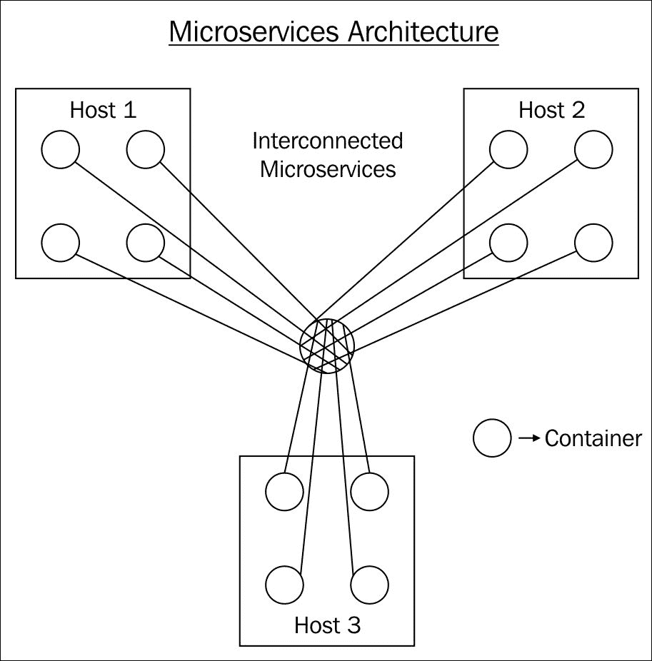

分布式应用程序开发的组成部分

以下是分布式应用程序开发的主要组成部分。这假设分布式应用程序的各个服务是作为容器创建的：

+   应用程序或微服务。

+   云基础设施——公共（AWS、GCE 和 Digital Ocean）或私有。

+   基础操作系统——CoreOS、Atomic、Rancher OS 等。

+   分布式数据存储和服务发现——`etcd`、`consul` 和 `Zookeeper`。

+   负载均衡器——NGINX 和 HAProxy。

+   容器运行时——Docker、Rkt 和 LXC。

+   容器编排——Fleet、Kubernetes、Mesos 和 Docker Swarm。

+   存储——本地或分布式存储。一些例子包括用于集群存储的 GlusterFS 和 Ceph，以及用于云存储的 AWS EBS。Flocker 即将推出的存储驱动插件承诺可以跨不同的存储机制工作。

+   网络——使用基于云的网络，如 AWS VPC、CoreOS Flannel 或 Docker 网络。

+   杂项——容器监控（cadvisor、Sysdig 和 Newrelic）和日志记录（Spout 和 Logentries）。

+   更新策略，如滚动升级，用于更新微服务。

优势与劣势

以下是分布式应用程序开发的一些优势：

+   每个微服务的应用程序开发人员可以独立工作。如有必要，不同的微服务甚至可以使用各自的编程语言。

+   应用程序组件的复用性较高。不同的不相关项目可以使用相同的微服务。

+   每个独立的服务可以进行横向扩展。每个微服务的 CPU 和内存使用可以适当调整。

+   基础设施可以像管理牲畜一样处理，而不是像宠物一样，且无需区分每个单独的基础设施组件。

+   应用程序可以部署在内部服务器或公共、私有或混合云中。

以下是微服务方法的一些问题：

+   管理的微服务数量可能会非常庞大，这使得应用程序的管理变得复杂。

+   调试可能变得非常困难。

+   维护完整性和一致性较为困难，因此服务必须设计为能够处理故障。

+   工具不断变化，因此需要保持与当前技术的更新。

一个极简的容器优化操作系统

这是一个新型操作系统类别，专为开发分布式应用程序而设计，近年来变得越来越流行。传统的基于 Linux 的操作系统对于容器部署来说过于庞大，且未能原生提供容器所需的服务。以下是一些容器优化操作系统的常见特点：

+   操作系统需要极简，并且启动速度快。

+   应该有自动化的更新策略。

+   应用程序开发应该使用容器进行。

+   应该内建冗余和集群功能

以下表格展示了四种常见容器优化操作系统的特性比较。其他操作系统，如 VMWare Photon 和 Mesos DCOS，未被包括在内。

| 特性 | CoreOS | Rancher OS | Atomic | Ubuntu snappy |
| --- | --- | --- | --- | --- |
| 公司 | CoreOS | Rancher Labs | Red Hat | Canonical |
| 容器 | Docker 和 Rkt | Docker | Docker | Snappy 包和 Docker |
| 成熟度 | 2013 年首次发布，比较成熟 | 2015 年初首次发布，较新 | 2015 年初首次发布，较新 | 2015 年初首次发布，较新 |
| 服务管理 | Systemd 和 Fleet | System docker 管理系统服务，用户 docker 管理用户容器 | Systemd | Systemd 和 Upstart |
| 工具 | Etcd、fleet 和 flannel | Rancher 提供服务发现、负载均衡、DNS、存储和网络的工具 | Flannel 和其他 RedHat 工具 | Ubuntu 工具 |
| 编排 | Kubernetes 和 Tectonic | Rancher 自有编排和 Kubernetes | Kubernetes、Atomic 应用和 Nulecule 也使用 | Kubernetes 和其他编排工具 |
| 更新 | 自动，使用 A 和 B 分区 | 自动 | 自动，使用 rpm-os-tree | 自动 |
| 注册表 | Docker hub 和 Quay | Docker hub | Docker hub | Docker hub |
| 调试 | 工具箱 | Rancher 自有工具和外部工具 | RedHat 工具 | Ubuntu 调试工具 |
| 安全性 | SELinux 可以启用 | 有计划添加 SELinux 和 AppArmor 支持 | SELinux 默认启用，额外的安全性 | 可以使用 AppArmor 安全配置文件 |

容器

容器在操作系统级别进行虚拟化，而虚拟机在硬件级别进行虚拟化。容器在单个主机上共享相同的内核。由于容器是轻量级的，单个主机上可以运行数百个容器。在基于微服务的设计中，采取的方式是将一个应用拆分为多个小的独立组件，并将每个组件作为容器运行。LXC、Docker 和 Rkt 是容器运行时实现的示例。

技术

以下是容器中使用的两个关键 Linux 内核技术：

+   命名空间：它们对进程、网络、文件系统、用户等进行虚拟化。

+   cgroups：它们限制每组进程的 CPU、内存和 I/O 使用。

优势

以下是容器的一些主要优势：

+   每个容器都与其他容器隔离。没有共享包管理、共享库等问题。

+   与虚拟机相比，容器的占用空间更小，加载和运行速度更快。

+   它们提供了高效的计算资源使用。

+   它们可以在开发、测试和生产环境中无缝工作。这使得容器非常适合 DevOps。

Docker 架构概述

Docker 是一种容器运行时实现。尽管容器技术已经存在了相当长时间，但 Docker 通过使其更易于使用，彻底改变了容器技术。以下图片展示了 Docker 的主要组件（Docker 引擎、Docker CLI、Docker REST 和 Docker Hub）及其相互之间的交互：

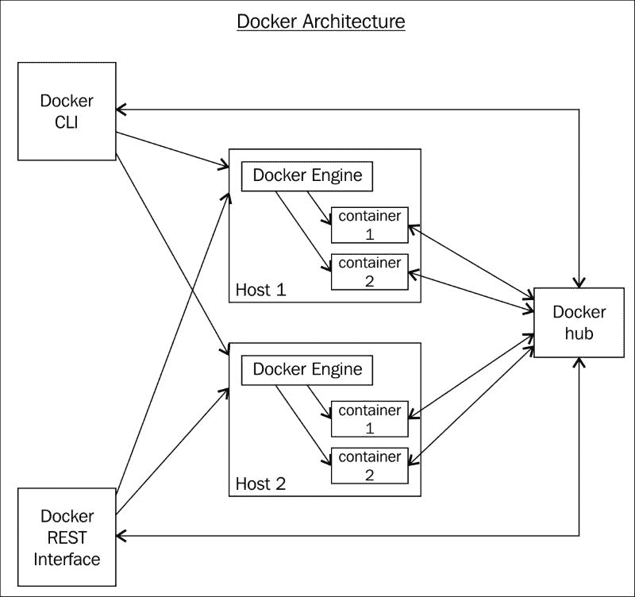

以下是 Docker 架构的一些细节：

+   Docker 守护进程在每个安装并启动 Docker 的主机上运行。

+   Docker 通过 libcontainer 库使用 Linux 内核容器功能，如命名空间和 cgroups。

+   Docker 客户端可以在主机机器或外部运行，并通过 REST 接口与 Docker 守护进程通信。Docker 客户端还提供 CLI 接口。

+   Docker Hub 是 Docker 镜像的仓库。私有镜像和公共镜像都可以托管在 Docker Hub 仓库中。

+   Dockerfile 用于创建容器镜像。以下是一个示例 Dockerfile，用于创建一个启动 Apache Web 服务并暴露 `80` 端口的容器：

    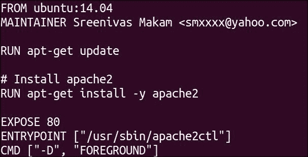

+   截至版本 1.9，Docker 平台包括诸如 Swarm、Compose、Kitematic 和 Machine 等编排工具，以及本地网络和存储解决方案。Docker 遵循“包含电池的可插拔”方式进行编排、存储和网络管理，其中本地 Docker 解决方案可以与厂商插件进行替换。例如，Weave 可以作为外部网络插件，Flocker 可以作为外部存储插件，Kubernetes 可以作为外部编排插件。这些外部插件可以替代本地 Docker 解决方案。

Docker 的优势

以下是 Docker 的一些显著优势：

+   Docker 革新了容器打包和围绕容器的工具，帮助了应用开发者和基础设施管理员。

+   部署和升级单个容器更加容易。

+   它更适合微服务架构。

+   它在所有 Linux 发行版上都能很好地运行，只要内核版本大于或等于 3.10。

+   联合文件系统使得下载和保持不同版本的容器镜像更加快速。

+   容器管理工具，如 Dockerfile、Docker 引擎 CLI、Machine、Compose 和 Swarm，使得容器管理更加简单。

+   Docker 提供了通过公共和私有注册表服务共享容器镜像的简单方法。

CoreOS

CoreOS 属于极简主义容器优化操作系统类别。CoreOS 是这一类别中的第一个操作系统，最近许多新操作系统也出现在同一类别中。CoreOS 的使命是提高互联网的安全性和可靠性。CoreOS 在这个领域是先驱，首次 alpha 版本发布于 2013 年 7 月。在过去两年中，网络、分布式存储、容器运行时、身份验证和安全性等领域发生了很多发展。CoreOS 被 PaaS 提供商（如 Dokku 和 Deis）、Web 应用开发公司，以及许多开发分布式应用的企业和服务提供商使用。

属性

以下是一些 CoreOS 的关键属性：

+   内核非常小，启动速度非常快。

+   基础操作系统及所有服务都开源。服务也可以在非 CoreOS 系统中独立使用。

+   操作系统不提供包管理。库和包是使用容器开发的应用程序的一部分。

+   它支持安全的大型服务器集群，可用于分布式应用开发。

+   它基于 Google Chrome OS 的原则。

+   容器运行时、SSH 和内核是主要组成部分。

+   每个进程都由 systemd 管理。

+   Etcd、fleet 和 flannel 都是运行在内核之上的控制单元。

+   它同时支持 Docker 和 Rkt 容器运行时。

+   自动更新通过 A 和 B 分区提供。

+   Quay 注册表服务可以用来存储公共和私有的容器镜像。

+   CoreOS 发布渠道（稳定版、测试版和 alpha 版）用于控制发布周期。

+   商业产品包括 Coreupdate 服务（商业管理和企业版 CoreOS 的一部分）、Quay 企业版和 Tectonic（CoreOS + Kubernetes）。

+   它目前运行在 x86 处理器上。

优势

以下是 CoreOS 的一些显著优势：

+   内核自动更新功能可以保护内核免受安全漏洞的影响。

+   CoreOS 的内存占用非常小。

+   CoreOS 机器的管理是在集群级别进行的，而不是在单个机器级别。

+   它提供基于服务级别（使用 systemd）和节点级别（使用 fleet）的冗余。

+   Quay 为您提供了私有和公共容器仓库。该仓库可用于 Docker 和 Rkt 容器。

+   Fleet 用于基本的服务编排，Kubernetes 用于应用服务编排。

+   它得到 AWS、GCE、Azure 和 DigitalOcean 等主要云服务提供商的支持。

+   大多数 CoreOS 组件是开源的，客户可以选择适合其特定应用程序所需的工具组合。

支持的平台

以下是官方和社区支持的 CoreOS 平台。这不是完整列表。

注意

若要查看 CoreOS 支持的平台的完整列表，请参考此链接（[`coreos.com/os/docs/latest/`](https://coreos.com/os/docs/latest/)）。

以下是官方支持的平台：

+   云平台如 AWS、GCE、Microsoft Azure、DigitalOcean 和 OpenStack

+   PXE 无盘启动

+   Vagrant

以下是社区支持的平台：

+   CloudStack

+   VMware

CoreOS 组件

以下是 CoreOS 核心组件和 CoreOS 生态系统。如果包括自动化、管理和监控工具，生态系统可能会变得非常庞大，这些内容未在此列出。

+   核心组件：内核、systemd、etcd、fleet、flannel 和 rkt

+   CoreOS 生态系统：Docker 和 Kubernetes

下图展示了 CoreOS 架构中的不同层次：

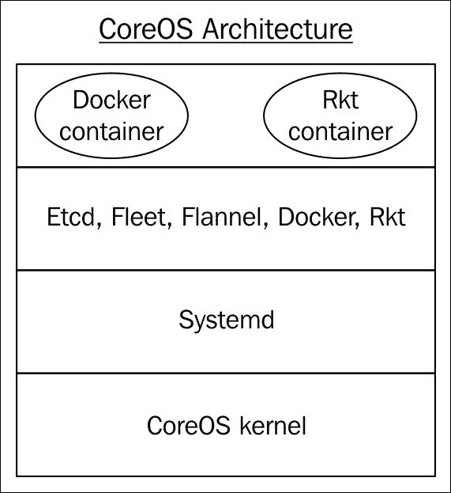

内核

CoreOS 在其发行版中使用最新的 Linux 内核。以下截图显示了在 CoreOS 稳定版 766.3.0 中运行的 Linux 内核版本：

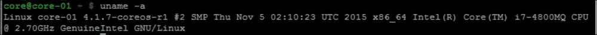

Systemd

Systemd 是 CoreOS 使用的初始化系统，用于启动、停止和管理进程。SysVinit 是最古老的初始化系统之一。以下是 Unix 世界中常用的一些 init 系统：

+   Systemd：CoreOS 和 RedHat

+   Upstart：Ubuntu

+   Supervisord：Python 世界

以下是一些 init 系统执行的常见功能：

+   它是第一个启动的进程

+   它控制所有用户进程的顺序和执行

+   它负责在进程死掉或挂起时重新启动它们

+   它负责进程所有权和资源管理

以下是 systemd 的一些具体细节：

+   systemd 中的每个进程都运行在一个 cgroup 中，包括派生的进程。如果 systemd 服务被终止，所有与该服务相关的进程，包括派生的进程，都会被终止。这也为你提供了控制资源使用的良好方法。如果我们在 systemd 中运行容器，我们可以控制资源使用，即使容器包含多个进程。此外，如果我们在 systemd 中指定了`restart`选项，systemd 会自动重启死掉的容器。

+   Systemd 单元是在单台机器上运行和控制的。

+   这些是一些 systemd 单元类型——服务、套接字、设备和挂载。

+   `Service`类型是最常见的类型，用于定义带有依赖项的服务。`Socket`类型用于将服务暴露给外部世界。例如，`docker.service`通过`docker.socket`将外部连接暴露给 Docker 引擎。套接字还可以用来将日志导出到外部机器。

+   `systemctl`命令行工具可以用来控制 Systemd 单元。

Systemd 单元

以下是 CoreOS 系统中的一些重要 systemd 单元。

Etcd2.service

以下是`etcd2.service`单元文件的示例：

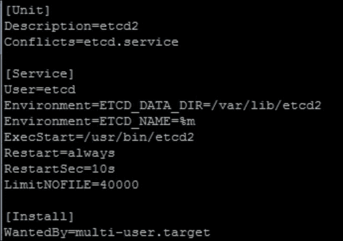

以下是一些关于 etcd2 服务单元文件的细节：

+   所有单元都有`[Unit]`和`[Install]`部分。还有一个类型特定的部分，例如服务单元的`[Service]`。

+   `Conflicts`选项表示`etcd`或`etcd2`可以运行，但不能同时运行。

+   `Environment`选项指定`etcd2`将使用的环境变量。`%m`单元说明符允许根据服务运行的位置自动获取机器 ID。

+   `ExecStart`选项指定要运行的可执行文件。

+   `Restart`选项指定服务是否可以重启。`Restartsec`选项指定服务重启的时间间隔。

+   `LimitNoFILE`指定文件数限制。

+   `Install`部分中的`WantedBy`选项指定此服务所属的组。分组机制允许 systemd 同时启动一组进程。

Fleet.service

以下是`fleet.service`单元文件的示例：

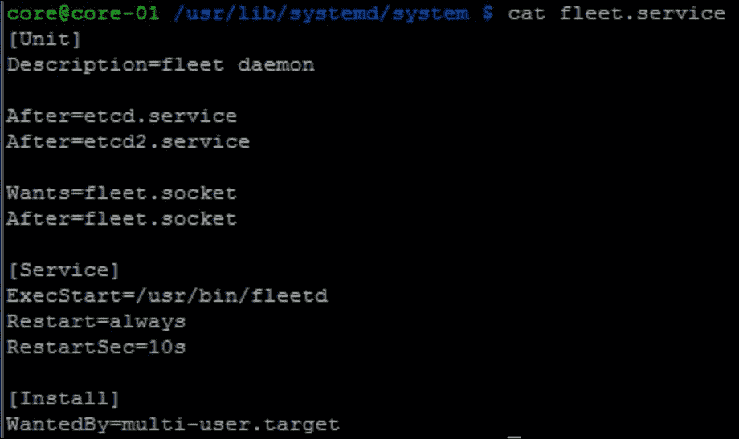

在前面的单元文件中，我们可以看到`fleet.service`有两个依赖项。`etcd.Service`和`etcd2.service`被指定为依赖项，因为 Fleet 依赖它们来在不同节点的 Fleet 代理之间进行通信。`fleet.socket`套接字单元也被指定为依赖项，因为它被外部客户端用来与 Fleet 通信。

Docker.service

Docker 服务由以下组件组成：

+   `Docker.service`：此项启动 Docker 守护进程。

+   `Docker.socket`：此项允许 CoreOS 节点与 Docker 守护进程进行通信。

+   `Docker-tcp.socket`：此项允许与 Docker 守护进程进行通信，外部主机使用端口`2375`作为监听端口。

以下是启动 Docker 守护进程的`docker.service`单元文件：

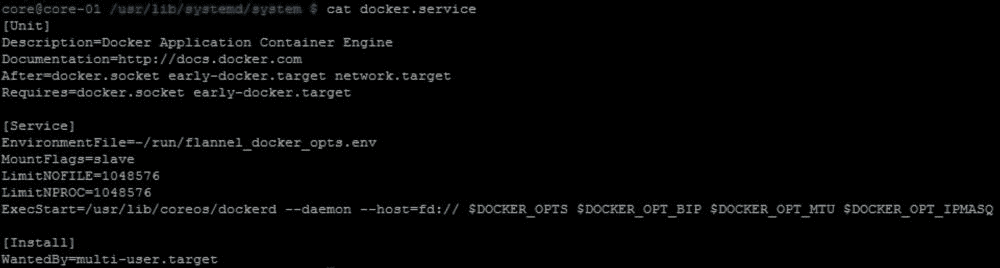

以下 `docker.socket` 单元文件启动本地套接字流：

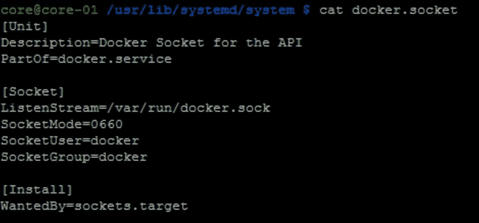

提示

下载示例代码

你可以从 [`www.packtpub.com`](http://www.packtpub.com) 下载示例代码文件，适用于你购买的所有 Packt Publishing 图书。如果你购买了这本书...

以下 `docker-tcp.socket` 单元文件设置了一个用于远程客户端通信的监听套接字：

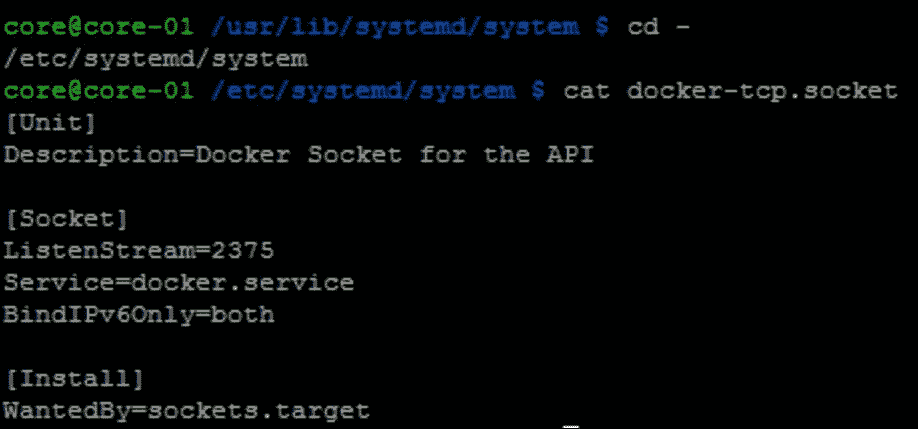

`docker ps` 命令使用 `docker.socket`，而 `docker -H tcp://127.0.0.1:2375 ps` 使用 `docker-tcp.socket` 单元与本地系统中运行的 Docker 守护进程进行通信。

启动简单 systemd 服务的过程

让我们启动一个简单的 `hello1.service` 单元，该单元运行一个 Docker busybox 容器，如下图所示：

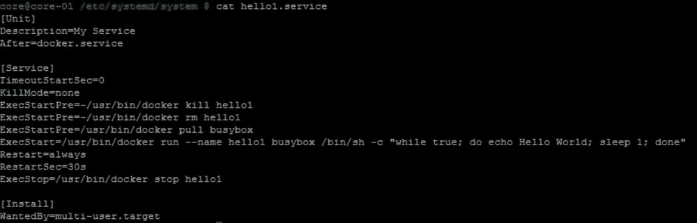

以下是启动 `hello1.service` 的步骤：

1.  将 `hello1.service` 复制为 sudo 到 `/etc/systemd/system`。

1.  启用服务：

    `sudo systemctl enable /etc/systemd/system/hello1.service`

1.  启动 `hello1.service`：

    `sudo systemctl start hello1.service`

这将创建以下链接：

`core@core-01 /etc/systemd/system/multi-user.target.wants $ ls -la``lrwxrwxrwx 1 root root   34 Aug 12 13:25 hello1.service -> /etc/systemd/system/hello1.service`

现在，我们可以查看 `hello1.service` 的状态：

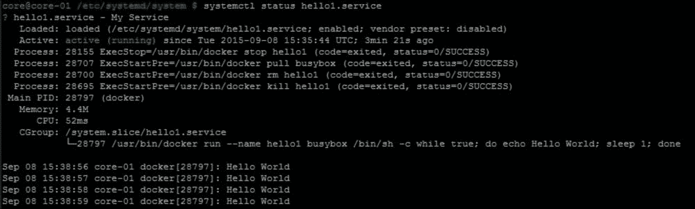

在前面的输出中，我们可以看到服务处于活动状态。最后，我们还可以看到 `stdout`，其中记录了回显输出。

让我们看看正在运行的 Docker 容器：

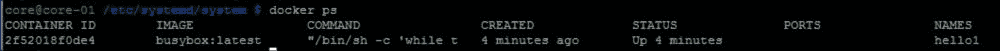

注意

在使用 systemd 启动 Docker 容器时，需要避免使用 `-d` 选项，因为它会阻止容器进程被 systemd 监控。更多详情请参考 [`coreos.com/os/docs/latest/getting-started-with-docker.html`](https://coreos.com/os/docs/latest/getting-started-with-docker.html)。

演示 systemd 高可用性（HA）

在创建的 `hello1.service` 中，我们指定了两个选项：

`Restart=always RestartSec=30s`

这意味着如果服务由于某种原因退出，服务将在 30 秒后重启。

让我们停止 Docker `hello1` 容器：

服务在 30 秒后自动重启，如下图所示：

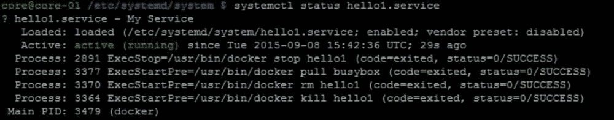

以下截图显示了 `hello1` 容器再次运行。从容器状态输出中，我们可以看到容器仅运行了一分钟：

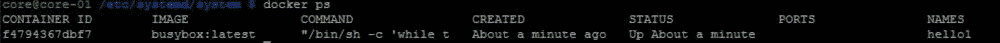

我们还可以从与该服务相关的 systemd 日志中确认服务已重启。在以下输出中，我们可以看到服务退出并在 30 秒后重启：

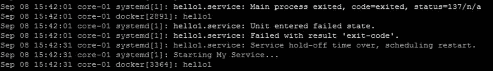

Etcd

Etcd 是由 CoreOS 集群中所有机器使用的分布式键值存储，用于读写和交换数据。Etcd 使用 Raft 共识算法（[`raft.github.io/`](https://raft.github.io/)）来维护高可用性集群。Etcd 用于跨 CoreOS 机器共享配置和监控数据，并进行服务发现。所有其他 CoreOS 服务（如 Fleet 和 Flannel）都使用 etcd 作为分布式数据库。Etcd 也可以作为独立于 CoreOS 外部的服务使用。事实上，许多复杂的分布式应用项目，如 Kubernetes 和 Cloudfoundry，都使用 etcd 作为它们的分布式键值存储。`etcdctl` 实用程序是 etcd 的 CLI 前端。

以下是 etcd 的两个示例用例。

+   服务发现：服务发现可用于在容器之间传递服务连接详细信息。让我们以 WordPress 应用为例，其中包含 WordPress 应用容器和 MySQL 数据库容器。如果某台机器有一个数据库容器，并希望通信其服务 IP 地址和端口号，它可以使用 etcd 写入相关键和数据；另一台主机上的 WordPress 容器可以使用键值来写入相应的数据库。

+   配置共享：Fleet 主节点使用 etcd 与 Fleet 代理通信，以决定集群中的哪个节点将执行 Fleet 服务单元。

Etcd 发现

集群成员使用静态方法或动态方法自行发现。在静态方法中，我们需要在集群的每个节点中静态地列出所有邻居的 IP 地址。在动态方法中，我们使用发现令牌方法，从中央 etcd 服务器获取分布式令牌，并在集群的所有成员中使用此令牌，以便成员可以互相发现。

获取分布式令牌如下：

`curl https://discovery.etcd.io/new?size=<size>`

下面是获取集群大小为三的发现令牌的示例：

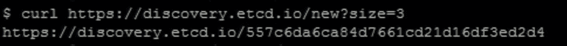

发现令牌功能由 CoreOS 托管，并作为 etcd 集群实现。

集群大小

最好将 etcd 集群大小设置为奇数，因为这样可以提供更好的容错性。以下表格显示了常见集群大小（最多五个）的大多数计数和容错性。集群大小为二时，我们无法确定大多数。

| 集群大小 | 大多数 | 容错性 |
| --- | --- | --- |
| 1 | 1 | 0 |
| 3 | 2 | 1 |
| 4 | 3 | 1 |
| 5 | 3 | 2 |

大多数计数告诉我们需要多少节点才能使集群正常工作，而容错性告诉我们可以故障多少节点仍然保持集群运行。

Etcd 集群详细信息

以下截图显示了一个 3 节点 CoreOS 集群中的 Etcd 成员列表：

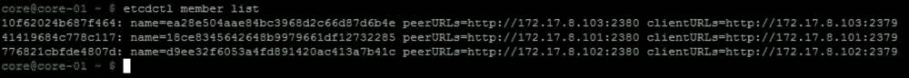

我们可以看到有三个成员作为 etcd 集群的一部分，具有它们的机器 ID、机器名称、IP 地址以及用于 etcd 服务器间和客户端间通信的端口号。

以下输出展示了 etcd 集群的健康状况：

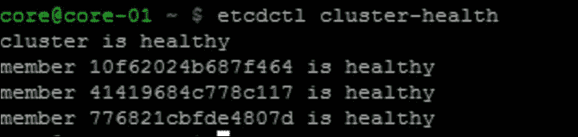

在这里，我们可以看到 etcd 集群的所有三个成员都是健康的。

以下输出展示了带有集群领导者的 etcd 统计信息：

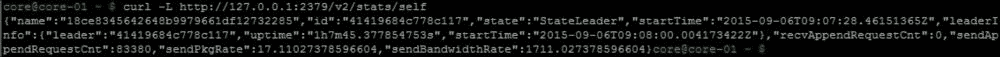

我们可以看到，成员 ID 与领导者 ID 匹配，`41419684c778c117`。

以下输出展示了带有集群成员的 etcd 统计信息：

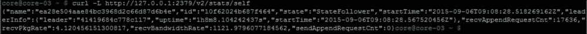

使用 etcd 进行简单的设置和获取操作

在下面的示例中，我们将`/message1`键设置为`Book1`值，然后稍后检索`/message1`键的值：

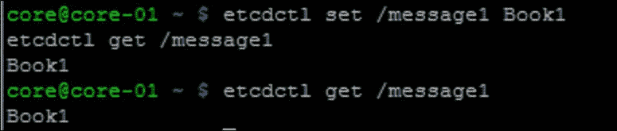

Fleet

Fleet 是一个集群管理器/调度器，用于控制集群级别的服务创建。就像 systemd 是节点的初始化系统一样，Fleet 是集群的初始化系统。Fleet 使用 etcd 进行节点间通信。

Fleet 架构

以下图像展示了 Fleet 架构的组件：

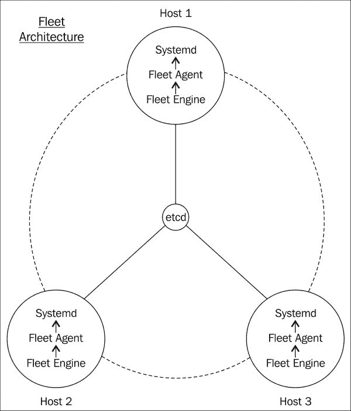

+   Fleet 采用主从模型，其中 Fleet 引擎扮演主角色，Fleet 代理扮演从角色。Fleet 引擎负责调度 Fleet 单元，而 Fleet 代理负责执行单元并将状态报告回 Fleet 引擎。

+   在 CoreOS 集群中，使用 etcd 选举出一个主引擎。

+   当用户启动 Fleet 服务时，每个代理都会竞标该服务。Fleet 使用一种非常简单的`least-loaded`调度算法，将单元调度到合适的节点。Fleet 单元还包含元数据，这些元数据有助于控制单元如何基于节点属性以及在特定节点上运行的其他服务来调度。

+   Fleet 代理处理单元并将其交给 systemd 执行。

+   如果某个节点出现故障，将选举出一个新的 Fleet 引擎，并将该节点中的调度单元重新调度到新的节点。Systemd 提供了节点级别的高可用性（HA）；Fleet 提供了集群级别的高可用性。

考虑到 CoreOS 和 Google 在 Kubernetes 项目中密切合作，一个常见的问题是，如果 Kubernetes 负责容器编排，那么 Fleet 的角色是什么？Fleet 通常用于使用 systemd 编排关键系统服务，而 Kubernetes 用于应用程序容器的编排。Kubernetes 由多个服务组成，如 kubelet 服务器、API 服务器、调度器和复制控制器，它们都作为 Fleet 单元运行。对于较小的部署，Fleet 也可以用于应用程序编排。

一个 Fleet 调度示例

以下是一个包含一些元数据的三节点 CoreOS 集群：

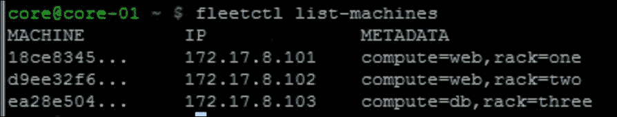

一个全局单元示例

一个全局单元在集群中的所有节点上执行相同的服务单元。

以下是一个示例`helloglobal.service`：

`[Unit] Description=My Service After=docker.service [Service] TimeoutStartSec=0 ExecStartPre=-/usr/bin/docker kill hello ExecStartPre=-/usr/bin/docker rm hello ExecStartPre=/usr/bin/docker pull busybox ExecStart=/usr/bin/docker run --name hello busybox /bin/sh -c "while true; do echo Hello World; sleep 1; done" ExecStop=/usr/bin/docker stop hello [X-Fleet] Global=true`

让我们按如下方式执行单元：

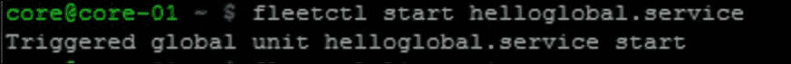

我们可以看到相同的服务在所有三台节点上启动：

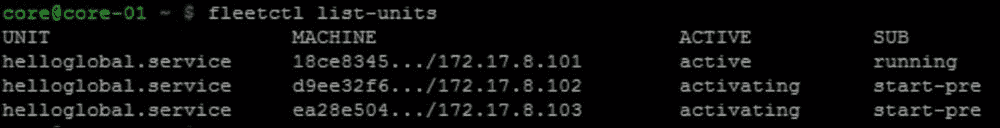

基于元数据的调度

假设我们有一个三节点 CoreOS 集群，具有以下元数据：

+   Node1（compute=web，rack=rack1）

+   Node2（compute=web，rack=rack2）

+   Node3（compute=db，rack=rack3）

我们使用了`compute`元数据来标识机器类型为`web`或`db`。我们使用了`rack`元数据来标识机架编号。节点的 Fleet 元数据可以在`cloud-config`的 Fleet 部分中指定。

让我们启动一个 Web 服务和一个数据库服务，每个服务都有相应的元数据，看看它们会被调度到哪里。

这是 Web 服务：

`[Unit] Description=Apache web server service After=etcd.service After=docker.service [Service] TimeoutStartSec=0 KillMode=none EnvironmentFile=/etc/environment ExecStartPre=-/usr/bin/docker kill nginx ExecStartPre=-/usr/bin/docker rm nginx ExecStartPre=/usr/bin/docker pull nginx ExecStart=/usr/bin/docker run --name nginx -p ${COREOS_PUBLIC_IPV4}:8080:80 nginx ExecStop=/usr/bin/docker stop nginx [X-Fleet] MachineMetadata=compute=web`

这是数据库服务：

`[Unit] Description=Redis DB service After=etcd.service After=docker.service [Service] TimeoutStartSec=0 KillMode=none EnvironmentFile=/etc/environment ExecStartPre=-/usr/bin/docker kill redis ExecStartPre=-/usr/bin/docker rm redis ExecStartPre=/usr/bin/docker pull redis ExecStart=/usr/bin/docker run --name redis redis ExecStop=/usr/bin/docker stop redis [X-Fleet] MachineMetadata=compute=db`

让我们使用 Fleet 启动服务：

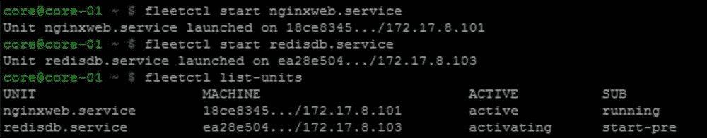

如我们所见，`nginxweb.service`在`Node1`上启动，`nginxdb.service`在`Node3`上启动。这是因为`Node1`和`Node2`是`web`类型，而`Node3`是`db`类型。

Fleet 高可用

当任何一个节点出现问题并且没有响应时，Fleet 会自动处理将服务单元调度到下一个合适的机器上。

从前面的例子来看，让我们重启`Node1`，它有`nginxweb.service`。该服务被调度到`Node2`而不是`Node3`，因为 Node2 有`web`元数据：

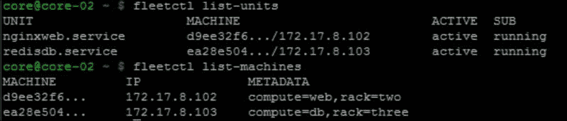

在前面的输出中，我们可以看到`nginxweb.service`被重新调度到`Node2`，而`Node1`在 Fleet 集群中不可见。

Flannel

Flannel 使用覆盖网络使不同主机上的容器能够相互通信。Flannel 不是基础 CoreOS 镜像的一部分，这是为了保持 CoreOS 镜像的最小化。当 Flannel 启动时，Flannel 容器镜像会从容器镜像仓库中获取。通常，Docker 守护进程在 Flannel 服务之后启动，以便容器能够获取 Flannel 分配的 IP 地址。这就出现了一个先有鸡还是先有蛋的问题，因为 Docker 是必要的，以便下载 Flannel 镜像。CoreOS 团队通过运行一个主 Docker 服务来解决这个问题，这个服务的唯一目的是下载 Flannel 容器。

以下图像展示了每个节点中的 Flannel 代理如何使用 etcd 进行通信：

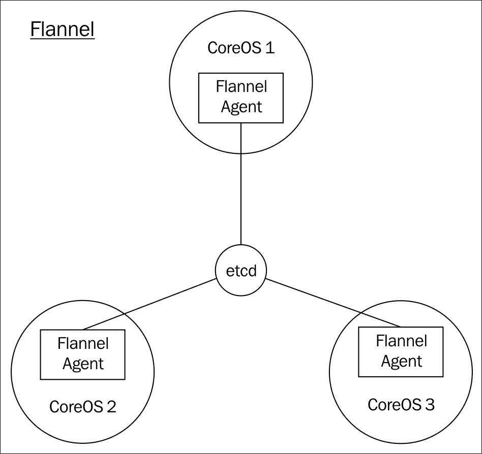

以下是一些 Flannel 的内部实现：

+   Flannel 在没有中央服务器的情况下运行，使用 etcd 进行节点之间的通信。

+   在启动 Flannel 时，我们需要提供一个配置文件，该文件包含集群要使用的 IP 子网以及后端协议方法（例如 UDP 和 VXLAN）。以下是一个指定子网范围和后端协议为 UDP 的示例配置：

    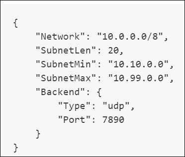

+   集群中的每个节点都会请求为该主机上创建的容器分配一个 IP 地址范围，并将该 IP 范围注册到 etcd。

+   由于集群中的每个节点都知道为其他节点分配的 IP 地址范围，因此它知道如何访问集群中任何节点上创建的容器。

+   当容器被创建时，容器会获得分配给该节点的 IP 地址范围内的一个 IP 地址。

+   当容器需要跨主机通信时，Flannel 会根据选择的后端封装协议进行封装。Flannel 在目标节点中解封装数据包并将其交给容器。

+   通过不使用基于端口的映射来进行容器间通信，Flannel 简化了容器之间的通信。

以下图像展示了使用 Flannel 进行容器到容器通信的数据路径：

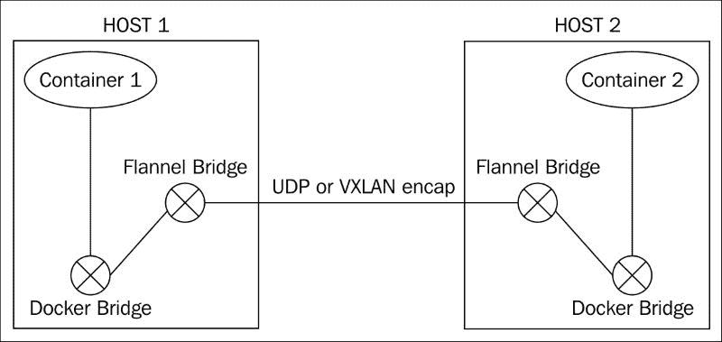

一个 Flannel 服务单元

以下是一个 flannel 服务单元的示例，我们将 flannel 网络的 IP 范围设置为`10.1.0.0/16`：

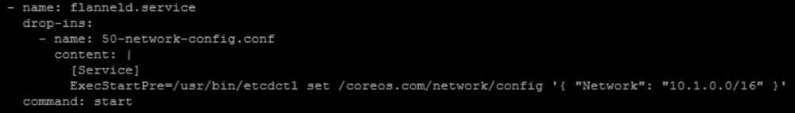

在一个三节点 etcd 集群中，以下是一个示例输出，显示每个节点选定的容器 IP 地址范围。每个节点请求一个 24 位掩码的 IP 范围。`10.1.19.0/24`由节点 A 选择，`10.1.3.0/24`由节点 B 选择，`10.1.62.0/24`由节点 C 选择：

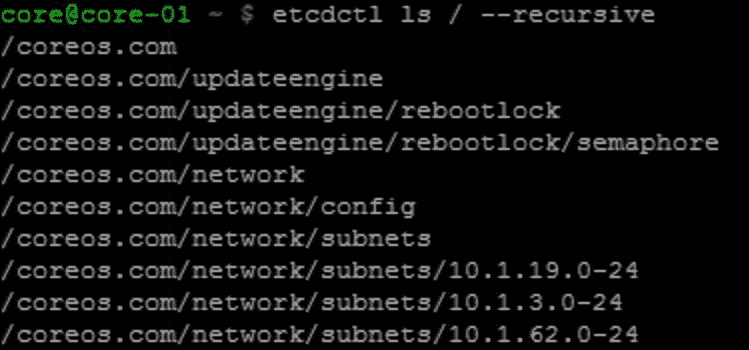

Rkt

Rkt 是 CoreOS 开发的容器运行时。Rkt 没有守护进程，由 systemd 进行管理。Rkt 使用应用程序容器镜像（ACI）格式，遵循 APPC 规范（[`github.com/appc/spec`](https://github.com/appc/spec)）。Rkt 的执行分为三个阶段。采取这种方法是为了在需要时能够用不同的实现替换某些阶段。以下是 Rkt 执行的三个阶段的详细信息：

阶段 0：

这是容器执行的第一阶段。该阶段进行镜像发现、检索，并为第 1 和第 2 阶段设置文件系统。

第 1 阶段：

该阶段设置容器的执行环境，如容器命名空间、使用第 0 阶段设置的文件系统中的 cgroups。

第 2 阶段：

该阶段使用第 1 阶段设置的执行环境和第 0 阶段设置的文件系统来执行容器。

从 0.10.0 版本开始，Rkt 仍在积极开发中，尚未准备好用于生产环境。

CoreOS 集群架构

CoreOS 集群中的节点用于运行关键的 CoreOS 服务，如 etcd、fleet、Docker、systemd、flannel 和 journald，以及应用容器。为了避免关键服务和应用容器之间的资源争用，重要的是避免在同一主机上同时运行关键服务和应用容器。可以通过使用 Fleet 元数据来分离核心机器和工作机器，从而实现这种调度。以下是两种集群方法。

开发集群

以下图像展示了一个包含三台 CoreOS 节点的开发集群：

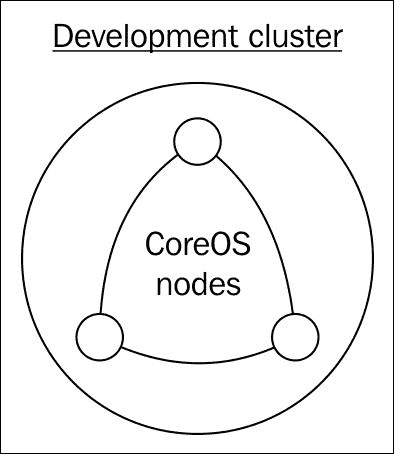

为了试用 CoreOS 和 etcd，我们可以从一个单节点集群开始。使用这种方法，不需要动态发现集群成员。一旦它工作正常，我们可以将集群规模扩展到三台或五台，以实现冗余。可以使用静态或动态发现方法来发现 CoreOS 成员。由于 CoreOS 的关键服务和应用容器运行在同一个集群中，这种方法可能会出现资源争用问题。

生产集群

以下图像展示了一个生产集群，包含三节点主集群和五节点工作集群：

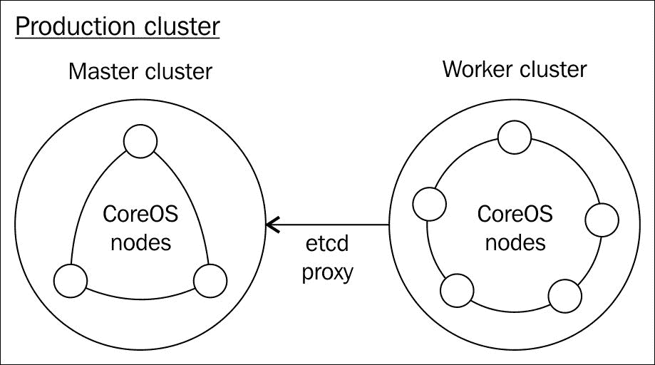

我们可以拥有一个三节点或五节点的主集群来运行关键的 CoreOS 服务，然后有一个动态的工作集群来运行应用容器。主集群将运行 etcd、fleet 和其他关键服务。在工作节点中，etcd 将被设置为代理到主节点，以便工作节点可以通过主节点进行 etcd 通信。在工作节点中，fleet 也将设置为使用主节点中的 etcd。

Docker 与 Rkt

由于这是一个有争议的话题，我会尽量保持中立。

历史

CoreOS 团队启动了 Rkt 项目，原因如下：

+   由于 Docker 运行时没有完全遵循容器清单规范，容器互操作性问题需要解决

+   在 systemd 下运行 Docker 遇到了一些问题，因为 Docker 作为守护进程运行。

+   容器镜像发现和镜像签名需要改进

+   需要改进容器的安全模型

APPC 与 OCI

APPC ([`github.com/appc/spec`](https://github.com/appc/spec)) 和 OCI ([`github.com/opencontainers/specs`](https://github.com/opencontainers/specs)) 定义了容器标准。

APPC 规范主要由 CoreOS 和少数其他社区成员推动。APPC 规范定义了以下内容：

+   图像格式：打包和签名

+   运行时：如何执行容器

+   命名和共享：自动发现

Rkt、Kurma、Jetpack 等实现了 APPC。

OCI ([`www.opencontainers.org/`](https://www.opencontainers.org/)) 是一个自 2015 年 4 月启动的开放容器倡议项目，其成员包括 Docker 和 CoreOS 等各大公司。Runc 是 OCI 的一个实现。以下图片展示了 APPC、OCI、Docker 和 Rkt 的关系：

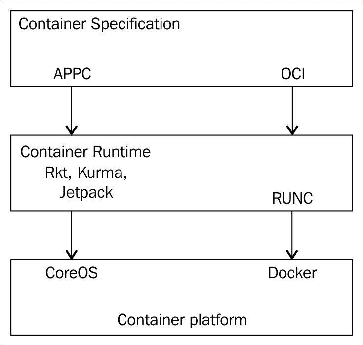

当前状态

根据最新的发展，社区普遍一致认为应当有一个称为开放容器规范的通用容器规范。任何人都可以基于此规范开发容器运行时。这将允许容器镜像具备互操作性。Docker、Rkt 和 Odin 都是容器运行时的示例。

CoreOS 最初提出的 APPC 容器规范涵盖了容器管理的四个不同元素——打包、签名、命名（与他人共享容器）和运行时。根据最新的 CoreOS 博客更新（[`coreos.com/blog/making-sense-of-standards.html`](https://coreos.com/blog/making-sense-of-standards.html)），APPC 和 OCI 仅在运行时上交汇，而 APPC 将继续专注于图像格式、签名和分发。Runc 是 OCI 的一个实现，Docker 使用了 Runc。

Docker 和 Rkt 之间的区别

以下是 Docker 和 Rkt 容器运行时之间的一些区别：

+   Docker 使用 LibContainer API 访问 Linux 内核容器功能，而 Rkt 使用 Systemd-nspawn API 访问 Linux 内核容器功能。以下图片说明了这一点：

    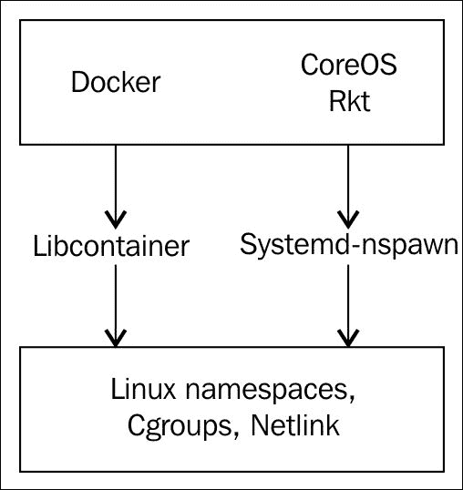

+   Docker 需要一个守护程序来管理容器镜像、远程 API 和容器进程。Rkt 是无守护程序的，容器资源由 systemd 管理。这使得 Rkt 更好地集成到像 systemd 和 upstart 这样的初始化系统中。

+   Docker 拥有一套完整的平台来管理容器，如 Machine、Compose 和 Swarm。CoreOS 则会使用一些自己的工具，如 Flannel 用于网络，同时结合像 Kubernetes 这样的工具进行编排。

+   相比于 Rkt，Docker 已经相当成熟并且可以用于生产。截至 Rkt 0.10.0 版本发布时，Rkt 还未准备好用于生产。

+   对于容器镜像注册表，Docker 使用 Docker Hub，Rkt 使用 Quay。Quay 也有 Docker 镜像。

CoreOS 计划同时支持 Docker 和 Rkt，用户可以选择使用相应的容器运行时来运行他们的应用程序。

使用 Docker 和 CoreOS 进行分布式应用开发的工作流程

下面是使用 Docker 和 CoreOS 开发微服务的典型工作流程：

+   选择需要容器化的应用程序。这可以是绿色领域（greenfield）应用程序，也可以是遗留应用程序。对于遗留应用程序，可能需要进行逆向工程，以拆分单体应用并容器化各个组件。

+   为每个微服务创建一个 Dockerfile。Dockerfile 定义了如何从基础镜像创建容器镜像。Dockerfile 本身可以进行版本控制。

+   将应用程序的无状态部分与有状态部分分离。对于有状态应用程序，需要决定存储策略。

+   微服务之间需要互相通信，其中一些服务应能够对外访问。假设服务之间的基本网络连接可用，服务可以通过静态方式通过定义服务名称与 IP 地址及端口号的映射来进行通信，或者通过使用服务发现机制，在该机制中，服务可以动态发现并互相通信。

+   Docker 容器镜像需要存储在私有或公有仓库中，以便开发、QA 和生产团队可以共享。

+   应用程序可以部署在私有云或公有云中。必须根据业务需求选择合适的基础设施。

+   选择 CoreOS 集群的大小和架构。最好使基础设施具有动态可扩展性。

+   为基本服务（如 etcd、fleet 和 flannel）编写 CoreOS 单元文件。

+   确定存储策略——本地、分布式或云存储。

+   对于较小应用程序的编排，可以使用 fleet。对于复杂的应用程序，将需要 Kubernetes 这类编排解决方案。

+   对于生产集群，还需要制定合适的监控、日志记录和升级策略。

总结

本章我们介绍了 CoreOS、容器和 Docker 的基础知识，以及它们如何帮助分布式应用程序的开发和部署。这些技术仍在积极开发中，将彻底改变并创造一种新的软件开发和分发模式。我们将在接下来的章节中详细探讨每个主题。在下一章中，我们将介绍如何在 Vagrant 和公有云中设置 CoreOS 开发环境。

参考文献

+   APPC 规范: [`github.com/appc/spec/blob/master/SPEC.md`](https://github.com/appc/spec/blob/master/SPEC.md)

+   OCI 规范: [`github.com/opencontainers/specs`](https://github.com/opencontainers/specs)

+   CoreOS 文档: [`coreos.com/docs/`](https://coreos.com/docs/)

+   Docker 文档: [`docs.docker.com/`](https://docs.docker.com/)

进一步阅读和教程

+   有关极简操作系统的博客: [`blog.docker.com/2015/02/the-new-minimalist-operating-systems/`](https://blog.docker.com/2015/02/the-new-minimalist-operating-systems/) 和 [`blog.codeship.com/container-os-comparison/`](https://blog.codeship.com/container-os-comparison/)

+   容器基础：[`www.slideshare.net/jpetazzo/anatomy-of-a-container-namespaces-cgroups-some-filesystem-magic-linuxcon`](http://www.slideshare.net/jpetazzo/anatomy-of-a-container-namespaces-cgroups-some-filesystem-magic-linuxcon)

+   Docker 入门：[`www.youtube.com/watch?v=Q5POuMHxW-0`](https://www.youtube.com/watch?v=Q5POuMHxW-0)

+   Mesos 概述：[`www.youtube.com/watch?v=gVGZHzRjvo0`](https://www.youtube.com/watch?v=gVGZHzRjvo0)

+   CoreOS 演示：[`www.slideshare.net/RichardLister/core-os`](http://www.slideshare.net/RichardLister/core-os)

+   DigitalOcean CoreOS 教程：[`www.digitalocean.com/community/tags/coreos?type=tutorials`](https://www.digitalocean.com/community/tags/coreos?type=tutorials)

+   微服务的特点：[`martinfowler.com/articles/microservices.html`](http://martinfowler.com/articles/microservices.html)

+   Docker 守护进程问题：[`www.ibuildthecloud.com/blog/2014/12/03/is-docker-fundamentally-flawed/`](http://www.ibuildthecloud.com/blog/2014/12/03/is-docker-fundamentally-flawed/) 和 [`github.com/ibuildthecloud/systemd-docker`](https://github.com/ibuildthecloud/systemd-docker)
