# 第三章

第二章：设置 CoreOS 实验室

CoreOS 可以部署在裸机、虚拟机或云服务提供商如 Amazon AWS 或 Google GCE 上。在本章中，我们将介绍如何在 Vagrant、Amazon AWS、Google GCE 和裸机上设置 CoreOS 开发环境。这个开发环境将在接下来的所有章节中使用。

本章将涵盖以下主题：

+   CoreOS 的 Cloud-config

+   CoreOS 与 Vagrant

+   CoreOS 与 Amazon AWS

+   CoreOS 与 Google GCE

+   CoreOS 在裸机上的安装。

+   CoreOS 集群的基本调试

这里介绍了不同的 CoreOS 部署选项，原因如下：

+   使用 Vagrant 和 Virtualbox 对于没有云账户的用户来说很有用。

+   对于某些用户来说，使用本地机器可能不可行，因为虚拟机占用了大量资源，这时使用基于云的虚拟机是最佳选择。由于 AWS 和 GCE 是最流行的云提供商，因此我选择了这两者。

+   对于传统的内部数据中心，裸机安装是首选。

+   在本书的示例中，我使用了三种方法中的一种（Vagrant、AWS 和 GCE），根据某种方法的简便性、与其中一种方法的更好集成，或者由于某种方法存在问题。

Cloud-config

Cloud-config 是一种声明式配置文件格式，许多 Linux 发行版使用它来描述初始服务器配置。cloud-init 程序负责在服务器初始化期间解析`cloud-config`并适当地配置服务器。`cloud-config`文件为 CoreOS 节点提供了默认配置。

CoreOS 的 cloud-config 文件格式

`coreos-cloudinit`程序负责在启动时使用`cloud-config`文件进行 CoreOS 节点的默认配置。`cloud-config`文件使用 YAML 格式描述配置（[`www.yaml.org/`](http://www.yaml.org/)）。CoreOS cloud-config 遵循`cloud-config`规范，并具有一些 CoreOS 特定的选项。链接，[`coreos.com/os/docs/latest/cloud-config.html`](https://coreos.com/os/docs/latest/cloud-config.html)，涵盖了 CoreOS `cloud-config`的详细信息。

cloud-config 的主要部分

以下是 CoreOS `cloud-config` YAML 文件中的主要部分：

+   CoreOS：

    +   Etcd2：etcd2 的配置参数

    +   Fleet：Fleet 的配置参数

    +   Flannel：Flannel 的配置参数

    +   Locksmith：Locksmith 的配置参数

    +   更新：自动更新的配置参数

    +   单元：需要启动的 Systemd 单元

+   `ssh_authorized_keys`：Core 用户的公钥

+   `hostname`：CoreOS 系统的主机名

+   `users`：附加的用户帐户和组详细信息

+   `write_files`：使用指定的用户数据创建文件

+   `manage_etc_hosts`：指定`/etc/hosts`的内容

CoreOS cloud-config 的示例

以下是一个单节点 CoreOS 集群的`cloud-config`文件示例：

`#cloud-config coreos:   etcd2:     # 静态集群     name: etcdserver     initial-cluster-token: etcd-cluster-1     initial-cluster: etcdserver=http://$private_ipv4:2380     initial-cluster-state: new     advertise-client-urls: http://$public_ipv4:2379     initial-advertise-peer-urls: http://$private_ipv4:2380     # 监听官方端口和传统端口     # 如果您的应用程序不依赖于传统端口，则可以省略这些端口     listen-client-urls: http://0.0.0.0:2379,http://0.0.0.0:4001     listen-peer-urls: http://$private_ipv4:2380,http://$private_ipv4:7001   fleet:     public-ip: $public_ipv4     metadata: "role=services"   flannel:     interface: $public_ipv4   update:       reboot-strategy: "etcd-lock"   units:     # 要使用 etcd2，注释掉上述服务并取消注释这些     # 注意：这需要包含 etcd2 的版本     - name: etcd2.service       command: start     - name: fleet.service       command: start     - name: flanneld.service       drop-ins:         - name: 50-network-config.conf           content: |             [Service]             ExecStartPre=/usr/bin/etcdctl set /coreos.com/network/config '{ "Network": "10.1.0.0/16" }'       command: start     - name: docker-tcp.socket       command: start       enable: true       content: |         [Unit]         Description=用于 API 的 Docker Socket         [Socket]         ListenStream=2375         Service=docker.service         BindIPv6Only=both         [Install]         WantedBy=sockets.target  write_files:   - path: "/etc/motd"     permissions: "0644"     owner: "root"     content: |       --- 我的 CoreOS 集群 ---

以下是关于前面`cloud-config`的一些说明：

+   `etcd2`部分指定了`etcd2`服务的配置参数。在这个例子中，我们指定了启动`etcd`所需的参数，并在 CoreOS 节点上进行配置。`public_ipv4`和`private_ipv4`环境变量将被替换为 CoreOS 节点的 IP 地址。由于只有一个节点，我们使用静态集群定义方式，而不是使用发现令牌。根据指定的参数，`20-cloudinit.conf` Drop-In 单元将在`/run/systemd/system/etcd2.service.d`目录下创建，包含以下环境变量：

    `[Service] Environment="ETCD_ADVERTISE_CLIENT_URLS=http://172.17.8.101:2379" Environment="ETCD_INITIAL_ADVERTISE_PEER_URLS=http://172.17.8.101:2380" Environment="ETCD_INITIAL_CLUSTER=etcdserver=http://172.17.8.101:2380" Environment="ETCD_INITIAL_CLUSTER_STATE=new" Environment="ETCD_INITIAL_CLUSTER_TOKEN=etcd-cluster-1" Environment="ETCD_LISTEN_CLIENT_URLS=http://0.0.0.0:2379,http://0.0.0.0:4001" Environment="ETCD_LISTEN_PEER_URLS=http://172.17.8.101:2380,http://172.17.8.101:7001" Environment="ETCD_NAME=etcdserver"`

+   `fleet` 部分指定 `fleet` 服务的配置参数，包括节点的任何元数据。`20-cloudinit.conf` Drop-In 单元将被创建在 `/run/systemd/system/fleet.service.d`，并包含以下环境变量：

    `[Service] Environment="FLEET_METADATA=role=services" Environment="FLEET_PUBLIC_IP=172.17.8.101"`

+   更新部分指定了 CoreOS 节点的更新策略。它将在节点中更新为 `/etc/coreos/update.conf`：

    `GROUP=alpha REBOOT_STRATEGY=etcd-lock`

+   `units` 部分启动 `etcd2`、`fleet` 和 `flannel`。对于 `flannel`，我们有一个 Drop-In 单元来更新用于创建容器的子网，该容器将与 Flannel 网络服务一起使用。`50-network-config.conf` Drop-In 单元将被创建在 `/etc/systemd/system/flanneld.service.d`：

    `[Service] ExecStartPre=/usr/bin/etcdctl set /coreos.com/network/config '{ "Network": "10.1.0.0/16" }'`

+   单元部分中的 `docker-tcp.socket` 是一个新的 `systemd` 单元，我们指定了允许通过端口 `2375` 暴露 docker 守护进程的服务内容。该单元将被创建在 `/etc/systemd/system`。

+   `write_files` 部分可用于创建任何静态文件。例如，当用户登录时显示问候文本，我们可以使用 `/etc/motd` 来实现。问候消息将如下所示：

    `Last login: Tue Sep 15 14:15:04 2015 from 10.0.2.2 --- My CoreOS Cluster --- core@core01 ~ $`

Cloud-config 验证器

Cloud-config 使用 YAML 语法。YAML 是一种人类可读的数据序列化格式，并使用缩进和空格进行对齐。最好在使用 `cloud-config` YAML 配置文件之前进行验证。验证 CoreOS `cloud-config` 有两种方式。

一个托管的验证器

使用 CoreOS 提供的链接 ([`coreos.com/validate/`](https://coreos.com/validate/)) 来验证 `cloud-config`。

下面是一个有效和无效的 `cloud-config` 示例，以及使用验证器的结果。

有效的 cloud-config

如下截图所示，验证器表示以下 `cloud-config` 是有效的：

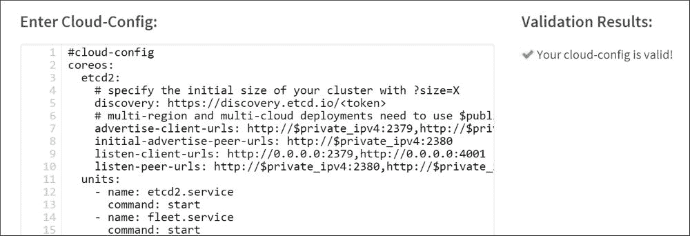

无效的 cloud-config

这里，我们可以看到验证器已指定第 14 行缺少 `-`。YAML 使用空格进行分隔，所以我们需要确保空格的数量完全正确：

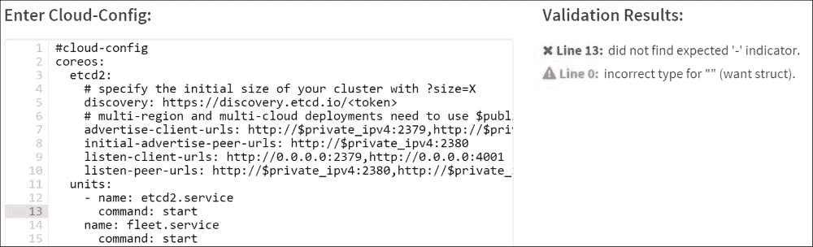

cloudinit 验证器

我们可以使用 CoreOS 中可用的 `coreos-cloudinit --validate` 选项来验证 cloud-config。让我们看一下下面的示例 `cloud-config`：

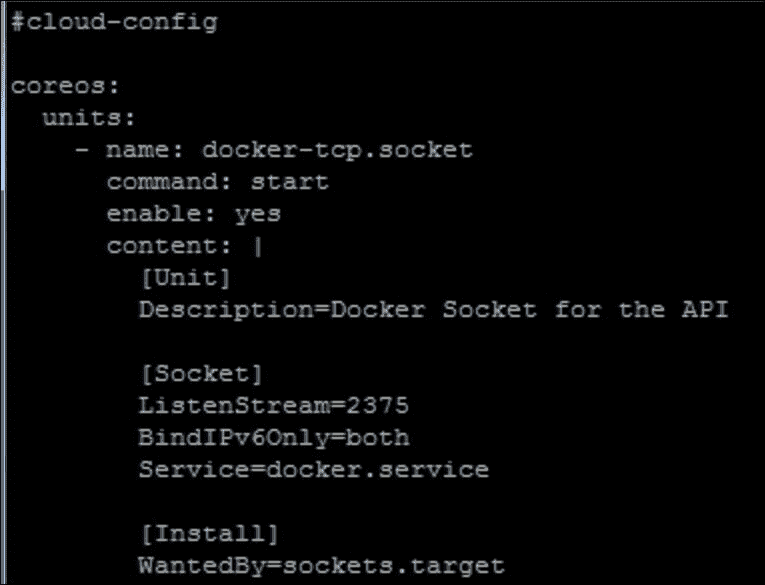

当我们验证时，我们没有得到错误，正如以下截图所示：

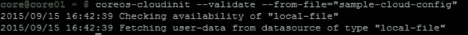

现在，让我们尝试使用带有错误的相同 `cloud-config`。这里，在内容行中缺少了 `|`：

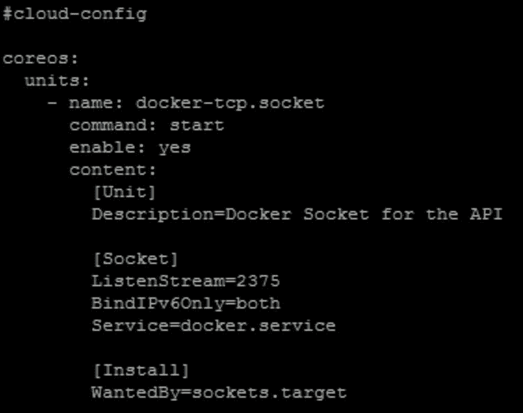

当我们验证时，我们看到以下错误：

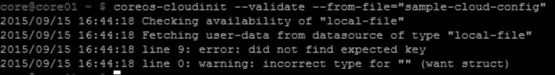

执行 cloud-config

有两个 `cloud-config` 文件在 CoreOS 启动过程中作为一部分运行：

+   系统 cloud-config

+   用户 cloud-config

系统的 `cloud-config` 由提供商（如 Vagrant 或 AWS）提供，并作为 CoreOS 提供商镜像的一部分嵌入其中。不同的提供商（如 Vagrant、AWS 和 GCE）在 `/usr/share/oem/cloud-config.yaml` 中有各自的 `cloud-config`。该 `cloud-config` 负责设置提供商特定的配置项，如网络、SSH 密钥、挂载选项等。`coreos-cloudinit` 程序首先执行系统 `cloud-config`，然后执行用户 `cloud-config`。

根据提供商的不同，可以使用 config-drive 或内部用户数据服务提供用户的 `cloud-config`。Config-drive 是通过挂载一个只读分区，提供包含 `cloud-config` 的数据到主机机器上的通用方式。Rackspace 使用 config-drive 获取用户的 `cloud-config`，而 AWS 则使用其内部的用户数据服务来获取用户数据，不依赖 config-drive。在 Vagrant 环境中，Vagrantfile 负责将 `cloud-config` 复制到 CoreOS 虚拟机中。

使用 Vagrant 搭建 CoreOS 集群

Vagrant 可以在 Windows 或 Linux 上安装。以下是我用于 Vagrant CoreOS 的开发环境：

+   Windows 7：我使用 mysysgit ([`git-for-windows.github.io/`](https://git-for-windows.github.io/)) 为 Windows 获取类 Linux 的命令行。

+   Vagrant 1.7.2: [`www.vagrantup.com/downloads.html`](https://www.vagrantup.com/downloads.html)

+   Virtualbox 4.3.28: [`www.virtualbox.org/wiki/Downloads`](https://www.virtualbox.org/wiki/Downloads)

在本书中的一些示例中，我使用 Vagrant 在 Windows 笔记本上的 Virtualbox 上运行 Linux 虚拟机中的 CoreOS。

启动 Vagrant 环境的步骤

1.  查看 coreos-vagrant 的代码库：

    `git clone https://github.com/coreos/coreos-vagrant.git`

1.  复制 `user-data` 和 `config.rb` 的示例文件到 coreos-vagrant 目录中：

    `cd coreos-vagrant``mv user-data.sample user-data``mv config.rb.sample config.rb`

1.  根据需要编辑 `Vagrantfile`、`user-data` 和 `config.rb`。

1.  启动 CoreOS 集群：

    `Vagrant up`

1.  SSH 到单独的节点：

    `Vagrant ssh core-<id>`

需要修改的重要文件

以下是需要修改的重要文件以及常见的修改项。

Vagrantfile

Vagrant 根据 `Vagrantfile` 中定义的配置来设置虚拟机环境。以下是在 CoreOS 环境中一些相关的功能：

+   使用的 CoreOS 软件版本通过 `update_channel` 来指定。版本可以指定为 `stable`（稳定版）、`beta`（测试版）和 `alpha`（开发版）。关于 CoreOS 软件版本的更多细节，请参阅 第三章，CoreOS 自动更新。

+   虚拟机的 CPU 和内存以及需要暴露的端口。

+   SSH 密钥管理。

用户数据

`user-data` 文件实际上是 `cloud-config` 文件，它指定了发现令牌、环境变量和默认启动的单元列表。Vagrant 会将 `cloud-config` 文件复制到虚拟机内的 `/var/lib/coreos-vagrant/vagrantfile-user-data` 位置。`coreos-cloudinit` 会在每次启动时读取 `vagrantfile-user-data`，并利用它来创建机器的用户数据文件。

Config.rb

`config.rb` 文件指定了 CoreOS 节点的数量。该文件还提供了一个选项，可以自动生成发现令牌。这里的一些选项与 `Vagrantfile` 中的设置重叠，比如镜像版本。

Vagrant – 一个包含动态发现功能的三节点集群

在这里，我们将创建一个三节点的 CoreOS 集群，每个节点上运行 `etcd2` 和 `fleet`，并且节点之间将动态发现彼此。

生成发现令牌

当我们启动一个多节点的 CoreOS 集群时，需要有一个引导机制来发现集群成员。为此，我们生成一个令牌，并将集群中初始节点的数量作为参数传入。每个节点启动时都需要使用此发现令牌。Etcd 会使用发现令牌将所有具有相同令牌的节点作为初始集群的一部分。CoreOS 运行该服务，从其中央服务器提供发现令牌。

有两种生成发现令牌的方法：

从浏览器访问：`https://discovery.etcd.io/new?size=3`

使用 curl: `curl https://discovery.etcd.io/new?size=3`

以下是一个 curl 示例，包含一个生成的发现令牌。该令牌需要复制到 `user-data`：

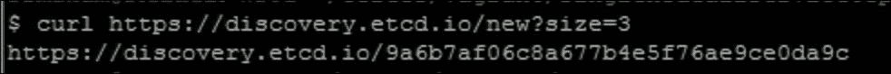

集群创建步骤

以下是包含我们在上一节中生成的更新发现令牌的 `cloud-config` 用户数据，以及必要的环境变量和服务单元。所有三个节点将使用此 `cloud-config`：

`#cloud-config coreos:   etcd2:     #为每个唯一集群从 https://discovery.etcd.io/new 生成一个新的令牌     discovery: https://discovery.etcd.io/9a6b7af06c8a677b4e5f76ae9ce0da9c     # 多区域和多云部署需要使用 $public_ipv4     advertise-client-urls: http://$public_ipv4:2379     initial-advertise-peer-urls: http://$private_ipv4:2380     # 在官方端口和传统端口上监听     # 如果你的应用程序不依赖于传统端口，可以省略它们     listen-client-urls: http://0.0.0.0:2379,http://0.0.0.0:4001     listen-peer-urls: http://$private_ipv4:2380,http://$private_ipv4:7001   fleet:     public-ip: $public_ipv4   flannel:     interface: $public_ipv4   units:     # 注意：这需要一个包含 etcd2 的版本     - name: etcd2.service       command: start     - name: fleet.service       command: start`

我们需要在 `config.rb` 文件中将 `num_instances` 更新为 `3`，然后执行 `vagrant up`。

为了验证基本集群操作，我们可以检查以下输出，应该能够看到集群成员。

以下是`etcdctl`成员输出，显示了三个集群成员：

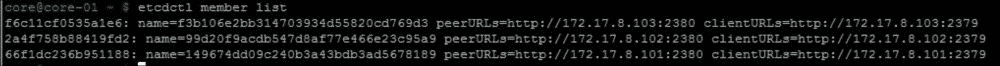

以下是 fleet 成员输出，显示了三个集群成员：

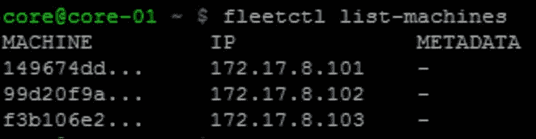

Vagrant – 一个具有静态发现的三节点集群

在这里，我们将创建一个三节点 CoreOS 集群，并使用静态方式指定其集群邻居。在动态发现方法中，我们需要使用发现令牌来发现集群成员。静态发现可以用于集群成员无法访问令牌服务器，并且集群成员的 IP 地址已知的场景。

执行以下步骤：

1.  首先，我们需要通过分别对每个节点执行`git clone`来创建三个独立的 CoreOS Vagrant 实例。

1.  必须为每个节点更新`config.rb`文件，并将`num_instances`设置为 1。

1.  应该更新每个节点的 Vagrantfile，以便将 IP 地址静态分配为`172.17.8.101`（`core-01`）、`172.17.8.102`（`core-02`）和`172.17.8.103`（`core-03`）。IP 地址应根据您的环境进行更新。

第一个节点的`cloud-config`用户数据如下：

`#cloud-config coreos:   etcd2:     name: core-01     initial-advertise-peer-urls: http://172.17.8.101:2380     listen-peer-urls: http://172.17.8.101:2380     listen-client-urls: http://172.17.8.101:2379,http://127.0.0.1:2379     advertise-client-urls: http://172.17.8.101:2379     initial-cluster-token: etcd-cluster-1     initial-cluster: core-01=http://172.17.8.101:2380,core-02=http://172.17.8.102:2380,core-03=http://172.17.8.103:2380     initial-cluster-state: new   fleet:     public-ip: $public_ipv4   flannel:     interface: $public_ipv4   units:     - name: etcd2.service       command: start     - name: fleet.service       command: start`

第二个节点的`cloud-config`用户数据如下：

`#cloud-config coreos:   etcd2:     name: core-02     initial-advertise-peer-urls: http://172.17.8.102:2380     listen-peer-urls: http://172.17.8.102:2380     listen-client-urls: http://172.17.8.102:2379,http://127.0.0.1:2379     advertise-client-urls: http://172.17.8.102:2379     initial-cluster-token: etcd-cluster-1     initial-cluster: core-01=http://172.17.8.101:2380,core-02=http://172.17.8.102:2380,core-03=http://172.17.8.103:2380     initial-cluster-state: new   fleet:     public-ip: $public_ipv4   flannel:     interface: $public_ipv4   units:     - name: etcd2.service       command: start     - name: fleet.service       command: start`

第三个节点的`cloud-config`用户数据如下：

`#cloud-config coreos:   etcd2:     name: core-03     initial-advertise-peer-urls: http://172.17.8.103:2380     listen-peer-urls: http://172.17.8.103:2380     listen-client-urls: http://172.17.8.103:2379,http://127.0.0.1:2379     advertise-client-urls: http://172.17.8.103:2379     initial-cluster-token: etcd-cluster-1     initial-cluster: core-01=http://172.17.8.101:2380,core-02=http://172.17.8.102:2380,core-03=http://172.17.8.103:2380     initial-cluster-state: new   fleet:     public-ip: $public_ipv4   flannel:     interface: $public_ipv4   units:     - name: etcd2.service       command: start     - name: fleet.service       command: start`

我们需要分别为每个节点执行`vagrant up`命令。我们应该在`etcdctl member list`和`fleetctl list-machines`的输出中看到集群成员列表的更新。

Vagrant – 一个包含三个主节点和三个工作节点的生产集群

在第一章，CoreOS 概述中，我们介绍了 CoreOS 集群架构。生产集群有一组节点（称为主节点）用于运行关键服务，另一组节点（称为工作节点）用于运行应用服务。在本示例中，我们创建了三个主节点来运行`etcd`和其他关键服务，以及另外三个工作节点。工作节点中的 etcd 将代理到主节点。工作节点将用于用户创建的服务，而主节点将用于系统服务。这避免了资源争用。以下是创建过程所需的步骤：

+   创建一个包含三节点主集群和三节点工作集群的 Vagrant 集群。

+   更新 Vagrantfile，确保主节点和工作节点之间的 IP 地址范围不冲突。

+   使用动态发现令牌的方法为三节点集群创建令牌，并更新主节点和工作节点的`cloud-config`用户数据，确保令牌相同。我们已经将令牌大小指定为`3`，因为工作节点不运行`etcd`。

以下是主节点集群的用户数据：

`#cloud-config coreos:   etcd2:     discovery: https://discovery.etcd.io/d49bac8527395e2a7346e694124c8222     advertise-client-urls: http://$public_ipv4:2379     initial-advertise-peer-urls: http://$private_ipv4:2380     # 在官方端口和遗留端口上监听     listen-client-urls: http://0.0.0.0:2379,http://0.0.0.0:4001     listen-peer-urls: http://$private_ipv4:2380,http://$private_ipv4:7001   fleet:      metadata: "role=master"      public-ip: $public_ipv4   units:     - name: etcd2.service       command: start     - name: fleet.service       command: start`

以下是工作节点集群的用户数据。主节点和工作节点的发现令牌需要相同：

`#cloud-config coreos:   etcd2:     discovery: https://discovery.etcd.io/d49bac8527395e2a7346e694124c8222     advertise-client-urls: http://$public_ipv4:2379     initial-advertise-peer-urls: http://$private_ipv4:2380     # 在官方端口和传统端口上监听     listen-client-urls: http://0.0.0.0:2379,http://0.0.0.0:4001     listen-peer-urls: http://$private_ipv4:2380,http://$private_ipv4:7001   fleet:      metadata: "role=worker"      public-ip: $public_ipv4   units:     - name: etcd2.service       command: start     - name: fleet.service       command: start`

主节点和工作节点用户数据之间的唯一区别是在 fleet 中使用的元数据。在这个示例中，我们为主节点集群使用 `role` 设置为 `master`，为工作节点集群使用 `role` 设置为 `worker`。

我们来看看 `etcdctl` 成员列表和 fleet 机器列表。以下输出在主节点和工作节点集群中是相同的。

`etcdctl` 成员的输出如下：

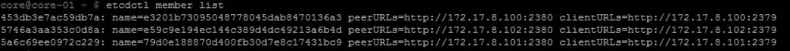

fleet 成员的输出如下：

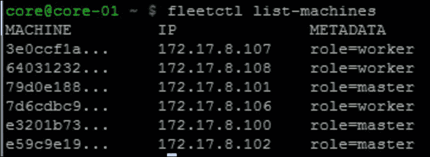

以下是 `journalctl –u etcd2.service` 在工作节点上的输出，显示工作节点代理到主节点的情况：

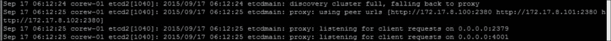

使用 AWS 的 CoreOS 集群

亚马逊 AWS 为您提供公共云服务。CoreOS 可以在 AWS 提供的虚拟机（VM）上运行。以下是此设置的一些前提条件：

+   您需要一个 AWS 账户。AWS 提供一年免费的试用账户。

+   创建并下载密钥对。密钥对用于通过 SSH 连接到节点。

+   可以通过 AWS 控制台（GUI 界面）或 AWS CLI 访问 AWS 接口。AWS CLI（[`aws.amazon.com/cli/`](http://aws.amazon.com/cli/)）可以在 Windows 或 Linux 系统上安装。

以下是使用 AWS 创建 CoreOS 集群的两种方法。

AWS – 使用 Cloudformation 创建三节点集群

Cloudformation 是 AWS 的一个编排工具，用于管理包括计算、存储和网络在内的一组 AWS 资源。以下链接，[`s3.amazonaws.com/coreos.com/dist/aws/coreos-stable-hvm.template`](https://s3.amazonaws.com/coreos.com/dist/aws/coreos-stable-hvm.template)，提供了 CoreOS 集群的模板文件。以下是模板中的一些关键部分：

+   基于区域的 AMI 镜像 ID

+   EC2 实例类型

+   安全组配置

+   CoreOS 集群的大小，包括自动扩展的最小和最大大小

+   要使用的初始 cloud-config

对于以下示例，我修改了模板，使用 `t2.micro` 代替 `m3.medium` 作为实例大小。以下 CLI 可用于使用 `Cloudformation` 创建一个三节点的 CoreOS 集群。下面命令中的 discovery token 需要使用为您的情况生成的令牌来更新：

`aws cloudformation create-stack \     --stack-name coreos-test \     --template-body file://mycoreos-stable-hvm.template \     --capabilities CAPABILITY_IAM \     --tags Key=Name,Value=CoreOS \     --parameters \      ParameterKey=DiscoveryURL,ParameterValue="https://discovery.etcd.io/925755234ab82c1ef7bcfbbacdd8c088" \         ParameterKey=KeyPair,ParameterValue="keyname"`

以下是使用 `aws cloudformation list-stacks` 成功创建堆栈后的输出：

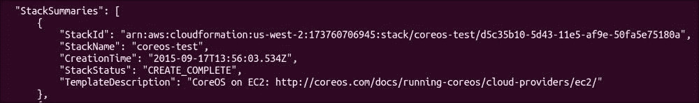

在前面的步骤完成后，我们可以看到成员已经成功地被 `etcd` 和 `fleet` 发现。

AWS – 使用 AWS CLI 创建一个三节点集群

以下是使用 AWS CLI 在 AWS 中创建 CoreOS 集群的一些前提条件：

1.  从发现令牌服务创建一个三节点集群的令牌。

1.  设置一个安全组，暴露 `ssh`、`icmp`、`2379` 和 `2380` 端口。`2379` 和 `2380` 用于 `etcd2` 客户端与服务器以及服务器间的通信。

1.  使用此链接（[`coreos.com/os/docs/latest/booting-on-ec2.html`](https://coreos.com/os/docs/latest/booting-on-ec2.html)）根据你的 AWS 区域和更新频道来确定 AMI 镜像 ID。不同 AWS 区域的最新镜像 ID 会自动更新在此链接中。

以下 CLI 命令将创建一个三节点集群：

`aws ec2 run-instances --image-id ami-85ada4b5 --count 3 --instance-type t2.micro --key-name "yourkey" --security-groups "coreos-test" --user-data file://cloud-config.yaml`

这里的 `ami-85ada4b5` 镜像 ID 来自稳定更新频道。`coreos-test` 安全组暴露了需要外部访问的必要端口。

以下是我使用的 `cloud-config`：

`#cloud-config coreos:   etcd2:     # 指定 集群的初始大小，通过 ?size=X     discovery: https://discovery.etcd.io/47460367c9b15edffeb49de30cab9354     advertise-client-urls: http://$private_ipv4:2379,http://$private_ipv4:4001     initial-advertise-peer-urls: http://$private_ipv4:2380     listen-client-urls: http://0.0.0.0:2379,http://0.0.0.0:4001     listen-peer-urls: http://$private_ipv4:2380,http://$private_ipv4:7001   units:     - name: etcd2.service       command: start     - name: fleet.service       command: start`

以下输出显示了包含三节点的集群中的 `etcd` 成员列表和 `fleet` 成员列表：

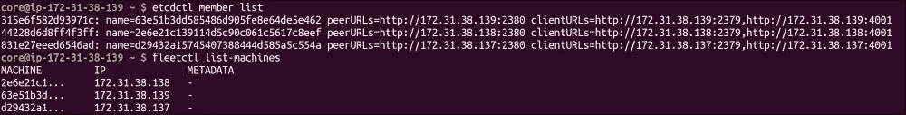

相同的示例可以通过 AWS 控制台进行尝试，在这里我们可以从 GUI 中指定选项。

GCE 上的 CoreOS 集群

谷歌的 GCE 是另一家公共云服务提供商，类似于亚马逊 AWS。CoreOS 可以运行在 GCE 提供的虚拟机上。以下是此设置的一些前提条件：

+   你需要一个 GCE 账户。GCE 提供 60 天的免费试用账户。

+   可以通过 gcloud SDK 或 GCE GUI 控制台访问 GCE 资源。SDK 可以从 [`cloud.google.com/sdk/`](https://cloud.google.com/sdk/) 下载。

+   需要在 GCE 中创建一个基础项目，所有资源都将托管在该项目下。

+   需要创建一个安全令牌，用于 SSH 访问。

GCE – 使用 GCE CLI 创建一个三节点集群

以下是在 GCE 中创建 CoreOS 集群的一些前提条件：

+   为一个三节点集群从发现令牌服务创建一个令牌。

+   设置一个安全组，暴露端口 `ssh`、`icmp`、`2379` 和 `2380`。`2379` 和 `2380` 用于 `etcd2` 客户端到服务器以及服务器之间的通信。

+   链接 [`coreos.com/os/docs/latest/booting-on-google-compute-engine.html`](https://coreos.com/os/docs/latest/booting-on-google-compute-engine.html) 会自动更新，包含来自稳定、测试和 alpha 通道的最新 GCE CoreOS 版本。我们需要选择所需的镜像。

以下 CLI 可用于从稳定版本创建三节点 CoreOS GCE 集群：

`gcloud compute instances create core1 core2 core3 --image https://www.googleapis.com/compute/v1/projects/coreos-cloud/global/images/coreos-stable-717-3-0-v20150710 --zone us-central1-a --machine-type n1-standard-1 --metadata-from-file user-data=cloud-config.yaml`

以下是使用的 `cloud-config.yaml` 文件：

`#cloud-config coreos:   etcd2:     # 指定 集群的初始大小，使用 ?size=X     discovery: https://discovery.etcd.io/46ad006905f767331a36bb2a4dbde3f5     advertise-client-urls: http://$private_ipv4:2379,http://$private_ipv4:4001     initial-advertise-peer-urls: http://$private_ipv4:2380     listen-client-urls: http://0.0.0.0:2379,http://0.0.0.0:4001     listen-peer-urls: http://$private_ipv4:2380,http://$private_ipv4:7001   units:     - name: etcd2.service       command: start     - name: fleet.service       command: start`

我们可以使用 `gcloud compute ssh <nodeid>` 通过 SSH 登录到任意节点。

以下输出显示集群已成功创建，`etcd` 和 `fleet` 中的成员都已显示：

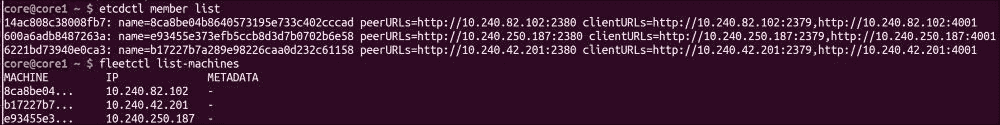

CoreOS 集群也可以通过 GCE 控制台 GUI 界面创建。

在裸机上安装 CoreOS

在裸机上安装 CoreOS 有两种方法：

+   CoreOS ISO 镜像

+   PXE 或 IPXE 启动

以下步骤介绍了使用 ISO 镜像在裸机上安装 CoreOS 的方法。

我通过将 CoreOS ISO 镜像安装到 Virtualbox CD 驱动器上进行了安装。如果我们将 ISO 镜像烧录到 CD 上然后在裸机上安装，过程应该是相同的。

以下是步骤总结：

1.  从 [`coreos.com/os/docs/latest/booting-with-iso.html`](https://coreos.com/os/docs/latest/booting-with-iso.html) 下载所需的稳定、测试和 alpha 版本的 ISO 镜像。

1.  在 Virtualbox 中启动一个新的 Linux 机器，配置所需的 CPU、内存和网络设置，并将 ISO 镜像挂载到 IDE 驱动器上。

1.  创建一个 SSH 密钥，使用 `ssh-keygen` 登录到 CoreOS 节点。

1.  启动 Linux 机器后，使用 CoreOS 脚本将 CoreOS 安装到硬盘上，并提供必要的 `cloud-config`。这里使用的 `cloud-config` 与前面章节使用的类似，SSH 密钥需要手动更新。

1.  从 Virtualbox 中移除 CD 驱动器并重新启动，这样就会从硬盘加载 CoreOS 镜像。

我使用的是稳定版本的 ISO 镜像 766.4.0。

以下截图展示了 Virtualbox 中初始存储挂载状态，ISO 镜像位于 IDE 驱动器上：

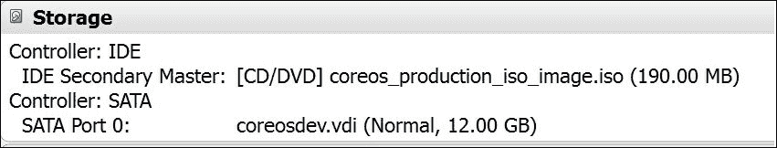

获取 `cloud-config` 的最简单方法是使用 `wget`。当我们从 CD 启动时，由于没有窗口管理器，无法进行复制粘贴。最简单的方式是将 `cloud-config` 放置在一个托管位置，并使用 `wget` 从该位置获取到节点上。SSH 密钥需要适当更新。

`wget https://github.com/smakam/coreos/raw/master/single-node-cloudconfig.yml`

将 CoreOS 安装到硬盘可以通过 CoreOS 提供的脚本完成：

`sudo coreos-install -d /dev/sda -C stable -c ~/cloud-config.yaml`

安装成功后，我们可以关机并移除 IDE 驱动器，这样系统就会从硬盘启动。以下截图展示了在 Virtualbox 中使用硬盘启动的存储选择：

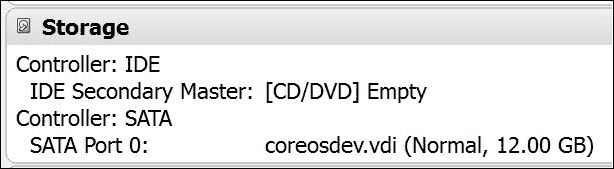

节点启动后，我们可以通过 SSH 连接到节点，因为我们已经设置好了 SSH 密钥。以下输出显示了裸机上的 CoreOS 版本：

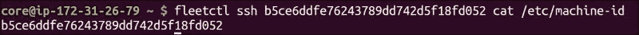

基本调试

以下是一些基本的调试工具和方法，用于调试 CoreOS 集群中的问题。

journalctl

Systemd-Journal 负责记录所有内核和 systemd 服务的日志。所有服务的日志文件都会存储在 `/var/log/journal` 中的集中位置。日志以二进制格式存储，这使得它易于转换成不同的格式。

这里有一些常见的例子，展示了如何使用 Journalctl：

+   `Journalctl`：这是列出所有来源的合并日志。

+   `Journalctl –u etcd2.service`：这是列出 `etcd2.service` 的日志。

+   `Journalctl –u etcd2.service –f`：这是以类似 `tail –f` 格式列出 `etcd2.service` 的日志。

+   `Journalctl –u etcd2.service –n 100`：这是列出最后 100 行日志。

+   `Journalctl –u etcd2.service –no-pager`：这是列出无分页的日志，适用于搜索。

+   `Journalctl –p err –n 100`：这是通过筛选日志列出所有 100 个错误。

+   `journalctl -u etcd2.service --since today`：这是列出今天的 `etcd2.service` 日志。

+   `journalctl -u etcd2.service -o json-pretty`：这是以 JSON 格式列出 `etcd2.service` 的日志。

systemctl

`systemctl` 工具可用于基本的系统 d 单元监控和故障排除。

以下示例显示了 `systemdunit docker.service` 的状态：

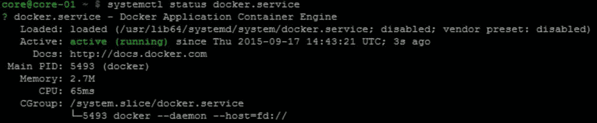

如果某个服务出现问题，我们可以停止并重新启动该服务。

以下命令将重新启动 docker.service：

`sudo systemctl restart docker.service`

当服务文件或环境变量发生更改时，我们需要执行以下命令来重新加载配置，以便更改生效，再重新启动服务：

`sudo systemctl daemon-reload`

以下命令有助于查看哪些单元已失败：

`Systemctl --failed`

Cloud-config

之前，我们已经看过如何预验证 `cloud-config` YAML 文件。如果出现运行时错误，可以使用 `journalctl -b _EXE=/usr/bin/coreos-cloudinit` 来检查。

如果在初始节点设置后对 `cloud-config` 用户数据进行了更改，可以执行以下步骤来激活新的配置：

+   执行 `vagrant reload --provision` 以获取新的配置。

+   新的 `cloud-config` 用户数据将保存在 `/var/lib/coreos-vagrant`，文件名为 `vagrantfile-user-data`。执行 `sudo coreos-cloudinit --from-file vagrantfile-user-data` 来更新新的配置。

从一个 CoreOS 节点登录到另一个 CoreOS 节点

有时，从集群中的某个 CoreOS 节点 SSH 登录到其他节点很有用。以下一组命令可用于转发 SSH 代理，我们可以使用它从其他节点进行 SSH 登录。有关 SSH 代理转发的更多信息，请参见 [`rabexc.org/posts/using-ssh-agent`](http://rabexc.org/posts/using-ssh-agent)。

`` eval `ssh-agent` ```ssh-add <key>（密钥是私钥）``ssh -i <key> core@<ip> -A（密钥是私钥）`

在此之后，我们可以通过 SSH 连接到机器 ID 或特定的 Fleet 单元，如下图所示：


注意

注意：SSH 代理转发不安全，应仅用于调试。

重要文件和目录

了解这些文件和目录有助于调试问题：

+   systemd 单元文件位置 - `/usr/lib64/systemd/system`。

+   网络单元文件 `- /usr/lib64/systemd/network`。

+   用户编写的单元文件和附加项用于更改默认参数 `- /etc/systemd/system`。特定配置更改的附加项可以在特定服务目录下使用配置文件进行。例如，要修改 fleet 配置，可以创建 `fleet.service.d` 目录，并将配置文件放入该目录。

+   用户编写的网络单元文件 `- /etc/systemd/network`。

+   运行时环境变量和各个组件的附加配置，如 `etcd` 和 `fleet`， `- /run/systemd/system/`。

+   包含 `cloud-config` 用户数据的 vagrantfile 用户数据文件，使用 Vagrant `- /var/lib/coreos-vagrant`。

+   `systemd-journald` 会记录日志 `- /var/log/journal`。

+   与 Vagrant、AWS 和 `GCE` 等提供商相关的 `cloud-config.yaml` `- /usr/share/oem`。（CoreOS 首先执行此 `cloud-config`，然后执行用户提供的 `cloud-config`。）

+   发布渠道和更新策略 `- /etc/coreos/update.conf`。

+   公共和私有 IP 地址（`COREOS_PUBLIC_IPV4` 和 `COREOS_PRIVATE_IPV4`） `- /etc/environment`。

+   特定 CoreOS 节点的机器 ID 为`- /etc/machine-id`。

+   flannel 网络配置`- /run/flannel/`。

常见错误及可能的解决方案

+   对于云提供商上的 CoreOS，需要在虚拟机上打开 2379 和 2380 端口。2379 用于 etcd 客户端与服务器之间的通信，2380 用于 etcd 服务器之间的通信。

+   每次为每个集群生成一个发现令牌，且不可共享。当共享过期的发现令牌时，成员将无法加入 etcd 集群。

+   同时运行多个 CoreOS 集群与 Vagrant 可能会导致问题，因为 IP 范围重叠。应特别注意，以避免在集群间共享常见参数（如 IP 地址）。

+   云配置 YAML 文件需要正确缩进。最好使用云配置验证器来检查问题。

+   使用发现令牌时，CoreOS 节点需要具备互联网访问权限以连接到令牌服务。

+   在创建发现令牌时，需要根据成员数量选择大小，并且所有成员需要是引导的一部分。如果没有所有成员，集群将无法形成。以后可以添加或删除成员。

总结

在本章中，我们介绍了 CoreOS 云配置的基础知识，并展示了如何使用 Vagrant、Amazon AWS、Google GCE 和裸金属设置 CoreOS 开发环境。我们还介绍了一些常见问题的基本调试步骤。正如本章所描述的，安装 CoreOS 在本地数据中心或云环境中是很容易的。建议在进入生产环境之前，在开发集群中进行部署尝试。下一章我们将介绍 CoreOS 自动更新的工作原理。

参考文献

+   Vagrant 安装：[`coreos.com/os/docs/latest/booting-on-vagrant.html`](https://coreos.com/os/docs/latest/booting-on-vagrant.html)

+   AWS 安装：[`coreos.com/os/docs/latest/booting-on-ec2.html`](https://coreos.com/os/docs/latest/booting-on-ec2.html)

+   GCE 安装：[`coreos.com/os/docs/latest/booting-on-google-compute-engine.html`](https://coreos.com/os/docs/latest/booting-on-google-compute-engine.html)

+   裸金属安装：[`coreos.com/os/docs/latest/installing-to-disk.html`](https://coreos.com/os/docs/latest/installing-to-disk.html)

+   CoreOS CloudInit：[`github.com/coreos/coreos-cloudinit`](https://github.com/coreos/coreos-cloudinit)

进一步阅读和教程

+   云配置格式介绍：[`www.digitalocean.com/community/tutorials/an-introduction-to-cloud-config-scripting`](https://www.digitalocean.com/community/tutorials/an-introduction-to-cloud-config-scripting)

+   CoreOS 与 AWS CloudFormation：[`blog.michaelhamrah.com/2015/03/managing-coreos-clusters-on-aws-with-cloudformation/`](http://blog.michaelhamrah.com/2015/03/managing-coreos-clusters-on-aws-with-cloudformation/)

+   CoreOS 裸机安装：[`stevieholdway.tumblr.com/post/90167512059/coreos-bare-metal-iso-install-tutorial`](http://stevieholdway.tumblr.com/post/90167512059/coreos-bare-metal-iso-install-tutorial) 和 [`linuxconfig.org/how-to-perform-a-bare-metal-installation-of-coreos-linux`](http://linuxconfig.org/how-to-perform-a-bare-metal-installation-of-coreos-linux)

+   使用 journalctl 查看 systemd 日志：[`www.digitalocean.com/community/tutorials/how-to-use-journalctl-to-view-and-manipulate-systemd-logs`](https://www.digitalocean.com/community/tutorials/how-to-use-journalctl-to-view-and-manipulate-systemd-logs)
