# 第四章

第三章 CoreOS 自动更新

CoreOS 的使命之一是确保操作系统尽可能安全。实现这一目标的一种方法是保持操作系统更新到最新的补丁。CoreOS 自动更新方案为您提供了一个安全、可靠、强大的机制来推送更新。CoreOS 还提供了足够的控制，让用户根据自己的环境控制更新。

本章将涵盖以下主题：

+   CoreOS 发布周期

+   CoreOS 中使用的分区方案

+   CoreOS 自动更新基础设施

+   CoreOS 更新的配置

+   CoreOS 的 CoreUpdate 商业服务

本章中的所有示例将使用在 AWS 环境中的 CoreOS。文中还提到了一个关于 Vagrant CoreOS 更新的部分，讨论了 Vagrant 特定的 CoreOS 更新。

CoreOS 发布周期

Alpha、Beta 和 Stable 是 CoreOS 中的发布渠道。CoreOS 的发布按以下顺序通过每个渠道进行：Alpha -> Beta -> Stable。Alpha 渠道是开发渠道。Alpha 渠道中的 Alpha 发布在达到定义的质量标准后会晋升到 Beta 渠道，成为 Beta 发布。Beta 渠道中的 Beta 发布在达到生产质量后会晋升到 Stable 渠道，成为 Stable 发布。所有发布最初都是 Alpha，但晋升到 Beta 和 Stable 是基于测试结果进行的。

CoreOS 发布页面反映了最新的 Alpha、Beta 和 Stable 发布（[`coreos.com/releases/`](https://coreos.com/releases/)）。以下是截至 2015 年 8 月 19 日的最新发布：

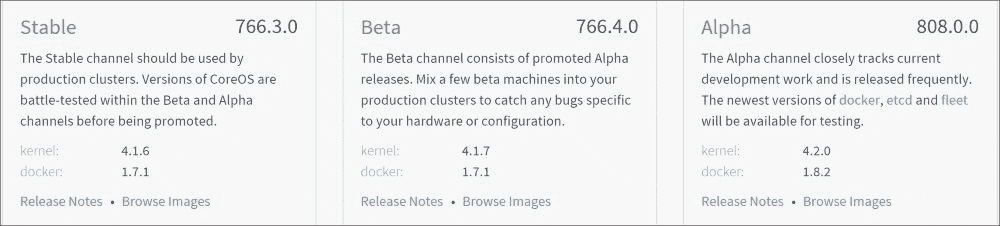

主版本号（例如 766 在 766.3.0 中）是从 2013 年 7 月 13 日开始计算的天数，这一天是 CoreOS 的纪元。

由于 CoreOS 由多个系统组件组成，例如 etcd、fleet、flannel、Docker 和 RKT，每个发布将根据各个组件的稳定性有一个特定版本的系统组件。例如，以下是截至 CoreOS 版本 808.0.0 时，关键系统组件的版本：

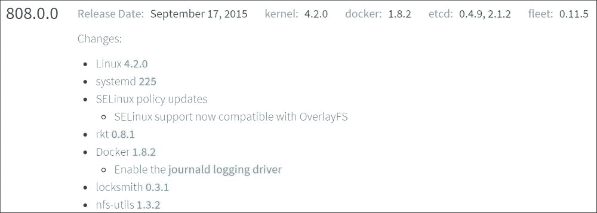

以下命令可用于检查节点中的 CoreOS 版本。此节点运行的是 `723.3.0` 版本，当时是一个稳定版本：

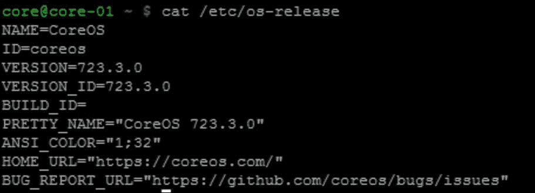

以下命令可用于检查 CoreOS Linux 内核版本：

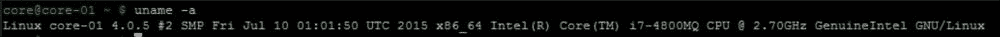

以下是 CoreOS 版本 723.3.0 中关键系统组件的版本：

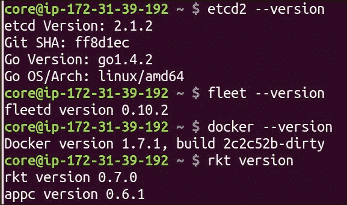

CoreOS 中的分区表

分区表展示了操作系统维护的磁盘分区。以下图像展示了在使用 `sudo cgpt show /dev/xvda` 命令时，CoreOS 集群节点中的一个分区表：

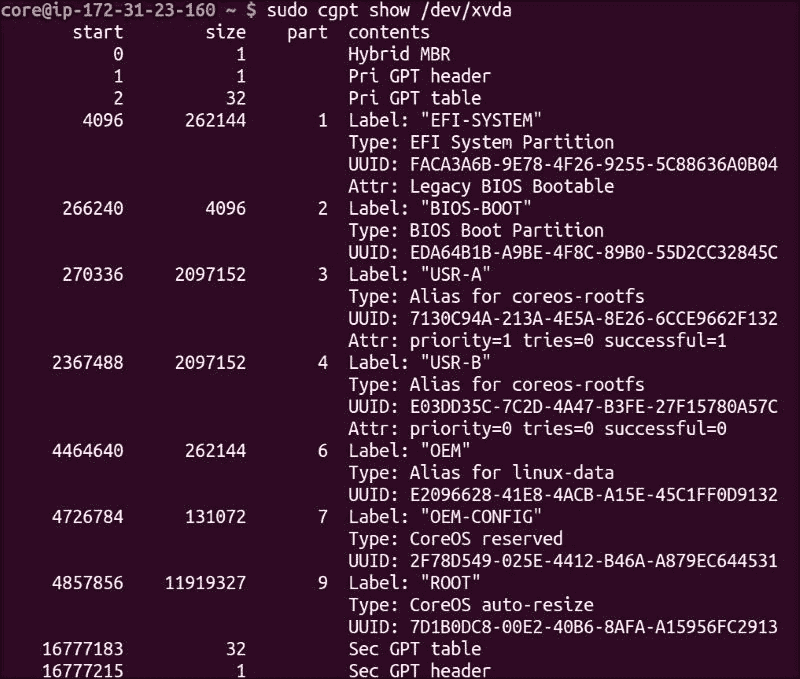

以下截图展示了同一节点中的 `df –k` 输出：

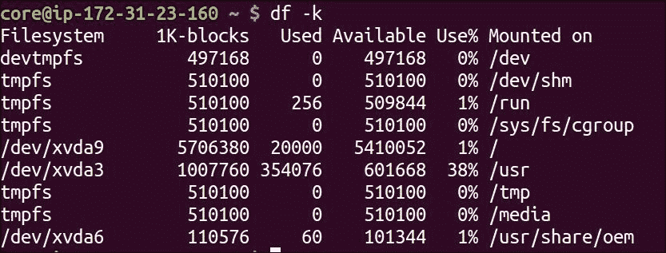

以下是关于前两个输出的一些说明：

+   总共有九个分区。关键分区是 `USR-A`、`USR-B`、`OEM` 和 `ROOT`。

+   系统文件位于`USR`分区，用户文件位于`ROOT`分区，提供商相关的文件位于`OEM`分区。

+   `USR`分区挂载为只读，`ROOT`分区挂载为读写。

+   `ROOT`分区挂载为`/`，`USR-A`或`USR-B`分区挂载为`/usr`，`OEM`分区挂载为`/usr/share/oem`。

+   有两个`/usr`分区，`USR-A`和`USR-B`。默认情况下，系统启动时使用`USR-A`分区。当 CoreOS 更新完成后，根分区会被下载到`USR-B`，并通过持久性标志如`priority`、`tries`和`successful`，CoreOS 启动加载程序会在启动时选择合适的 USR 分区。在前面的例子中，`USR-A`分区的优先级设置为`1`，`USR-B`分区的优先级设置为`0`，因此 CoreOS 启动加载程序选择了`USR-A`。

我手动更新了操作系统，以下输出显示活动分区为`USR-B`，且`USR-B`的优先级较高。CoreOS 系统的手动更新可以使用以下“更新示例”部分指定的命令进行。现在，`/usr`目录指向`/dev/xvda4`，即`USR-B`，而之前指向的是`/dev/xvda3`，即`USR-A`：

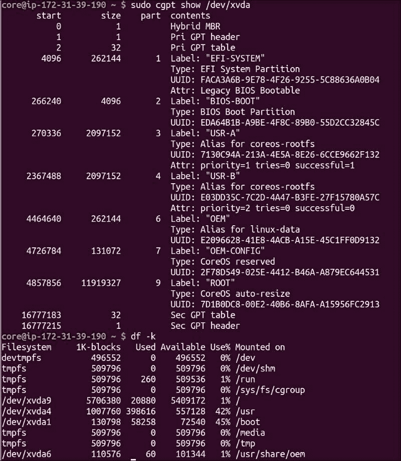

CoreOS 自动更新

CoreOS 依赖于自动更新机制保持操作系统的最新状态。以下是 CoreOS 更新的几个方面：

+   CoreOS 更新机制基于谷歌开源的 Omaha 协议（[`code.google.com/p/omaha/`](https://code.google.com/p/omaha/)），该协议用于 Chrome 浏览器。

+   可以使用 CoreOS 公共服务器或私有服务器作为镜像仓库。

+   使用双分区方案进行更新，在更新时，次要分区会被更新，而主分区保持不变。重启时，主分区与次要分区之间会进行二进制交换。这保持了更新机制的稳定性。如果新镜像出现问题，CoreOS 会自动回滚到另一个分区中正常工作的镜像。

+   镜像在每次更新时都会进行签名和验证。

以下截图显示了自动更新的步骤：

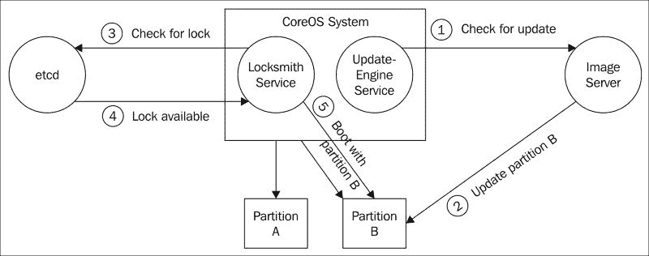

更新和重启服务

CoreOS 中有两个控制更新和重启的关键服务，它们是`update-engine.service`和`locksmithd.service`。

`Update-engine.service`

`Update-engine.service`负责定期检查指定的适当发布渠道中的更新。默认的更新检查会在重启后的 10 分钟或每小时一次的间隔内进行。

以下输出显示了`update-engine.service`的状态：

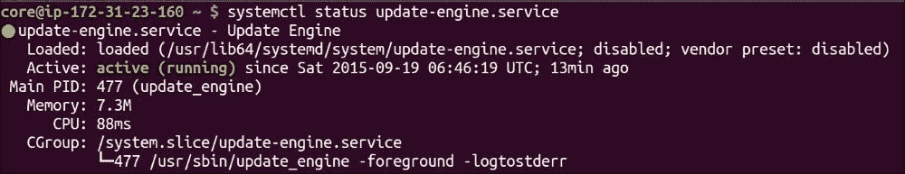

发布渠道在`/etc/coreos/update.conf`中指定。在以下节点中，选择的发布渠道为稳定版。发布渠道是通过`cloud-config`派生的：

`Update-engine.service`负责更新适当的分区，`USR-A`或`USR-B`。当前使用的分区不会被更改。

以下命令可以执行以触发手动更新：

`update_engine_client -check_for_update`

调试 update-engine.service

可以使用`journalctl –u update-engine.service`查看更新服务的日志。从日志中，我们可以识别奥马哈协议的请求和响应，并可以使用响应中的错误代码进行调试。

Locksmithd.service

`Locksmithd.service`负责使用选定的重启策略重启 CoreOS 节点。`Locksmithd.service`作为守护进程运行。

以下输出显示了`locksmithd.service`的状态：

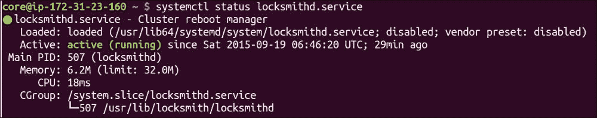

Locksmith 策略

以下是 CoreOS 节点在新镜像更新后重启的四种可配置策略。

etcd-lock 方案

在此方案中，首先从`etcd`获取锁，然后执行重启。在多节点集群中，这种方式效果非常好，因为它防止所有节点同时重启，并保持集群的完整性。我们可以使用锁定计数机制控制可以同时重启的节点数。锁定`最大`计数指定可以同时获取锁的节点数。在三节点集群中，我们需要将锁定`最大`计数限制为`1`，但在五节点集群中，我们可以将锁定`最大`计数保持为`2`，这样最多允许两个节点同时获取锁并重启。

以下示例展示了在我们执行锁定和解锁操作时，锁定计数的变化情况：

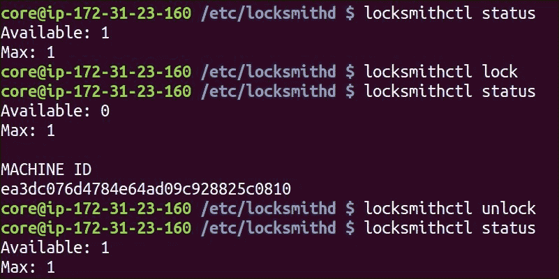

重启

在此方案中，节点会立即重启，而无需从集群中获取锁。这在管理员手动控制升级的场景中非常有用。

尽力而为

在此方案中，首先检查`etcd`是否正在运行。如果`etcd`正在运行，则获取`etcd`锁并执行重启。否则，立即执行重启。这是前面提到的 etcd-lock 方案的变体。

关闭

这将导致 locksmithd 退出并不做任何操作。除非管理员希望精确控制升级，否则不应选择此选项。

组

Locksmith 组是在 locksmithd 版本 0.3.1 中引入的。通过组，我们可以将一组 CoreOS 节点进行分组，锁定将适用于该组。例如，假设我们有一个五节点集群，其中两个节点正在运行负载均衡器。如果我们将锁定最大计数设置为`2`，那么两个运行负载均衡器的节点可能会同时重启，在此期间我们可能会失去该服务。为避免此问题，我们可以为默认组和`lb`组设置不同的锁定`最大`计数。

在以下截图示例中，我们为默认组设置了 `2` 的锁定计数，并为 `lb` 组设置了 `1` 的锁定计数。组可以在启动 `locksmithd service` 时定义。要将 CoreOS 节点放入 locksmith 组，我们需要通过 `--group` 选项启动 locksmithd，或设置 `LOCKSMITHD_GROUP` 环境变量并重启 locksmithd 服务：

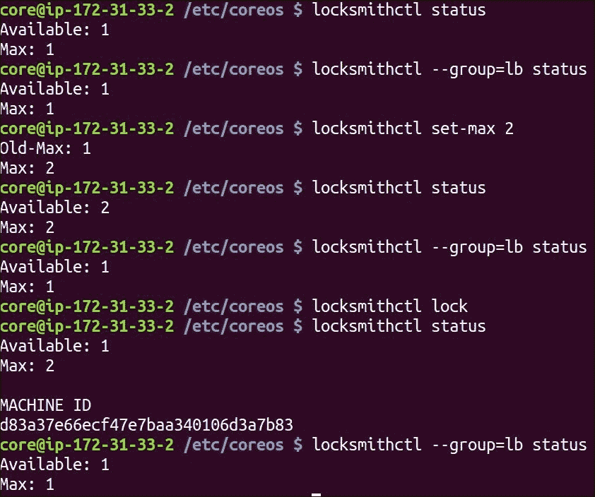

Locksmithctl

Locksmithctl 是一个用于控制 locksmith 的前端 CLI。通过这个工具，我们可以查看 locksmith 服务的状态、锁定和解锁组、设置 `lock max` 数量等。

调试 locksmithd.service

可以通过 `journalctl –u locksmithd.service` 检查此服务的日志。

设置更新选项

CoreOS 更新选项可以通过 `cloud-config` 或手动更改配置文件来设置。使用 `cloud-config` 时，更新选项作为节点配置的一部分在重启后进行配置。手动方法需要启动适当的更新服务才能使更改生效。手动方法主要用于调试。

使用 cloud-config

以下是一个示例 `cloud-config`，其中发布渠道组设置为 `stable`，而 locksmith 重启策略设置为 `etcd-lock`。（默认使用的服务器是 [`public.update.core-os.net/`](https://public.update.core-os.net/)，因此此处未指定。）

`#cloud-config coreos:   etcd2:     # 指定 集群的初始大小 ?size=X     discovery: https://discovery.etcd.io/eb32a1397bd087f84e65ab802b6aa2f7     advertise-client-urls: http://$private_ipv4:2379,http://$private_ipv4:4001     initial-advertise-peer-urls: http://$private_ipv4:2380     listen-client-urls: http://0.0.0.0:2379,http://0.0.0.0:4001     listen-peer-urls: http://$private_ipv4:2380,http://$private_ipv4:7001   update:     reboot-strategy: "etcd-lock"     group: "stable"   units:     - name: etcd2.service       command: start     - name: fleet.service       command: start`

在使用前述 `cloud-config` 启动集群后，我们可以检查 `/etc/coreos/update.conf` 是否已经更新了正确的参数：

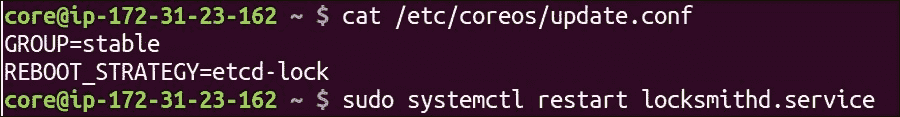

手动配置

默认的重启策略是 `best-effort`。在以下节点中，未指定重启策略，因此使用的是 best-effort：

让我们将重启策略更改为 `reboot`，并在 `/etc/coreos/update.conf` 中进行修改。然后需要重启 `locksmithd.service`：

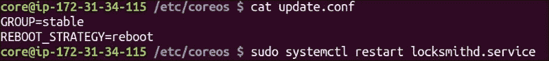

如下日志所示，重启策略正在生效：

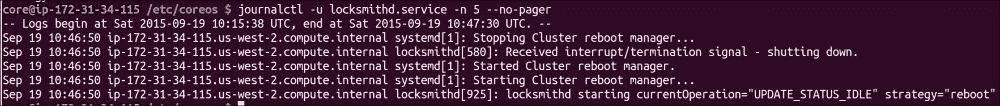

更新示例

我们可以在同一发布渠道内进行更新，也可以跨发布渠道进行更新。如果我们在同一发布渠道内进行更新，则节点会更新到该发布渠道的最新版本。如果我们跨发布渠道进行更新，则节点会更新到新发布渠道的最新版本。

在同一发布渠道内更新

让我们看看初始版本和重启策略。节点正在运行稳定版本 723.3.0，如下图所示：

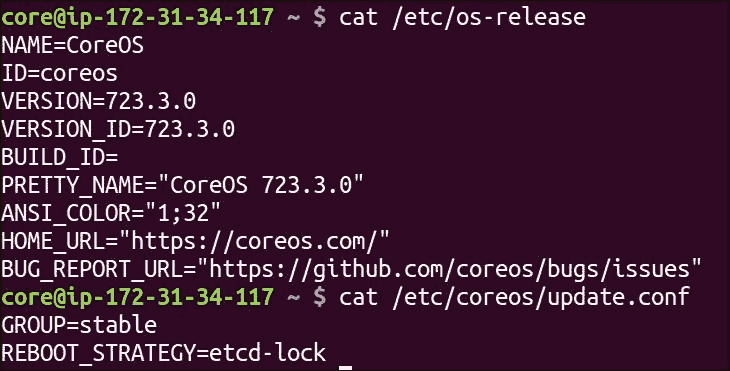

查看 CoreOS 发布页面，最新的 STABLE 版本是 766.3.0。如果我们在 STABLE 渠道上进行更新，节点应该会更新到 766.3.0。

让我们通过以下命令手动触发更新：

`update_engine_client -check_for_update`

如果我们没有手动触发更新，`update-engine`仍会根据其定期检查自动进行更新。

以下来自`update-engine.service`的日志显示了 Omaha 向 CoreOS 公共映像服务器的请求：

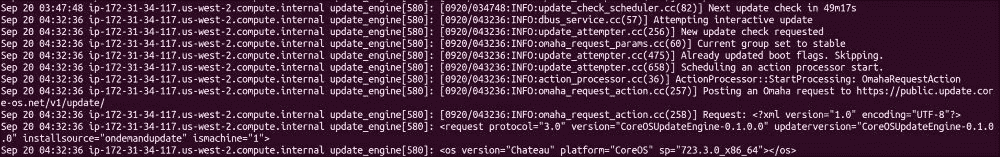

以下来自 update-engine 的日志显示了来自 CoreOS 公共服务器的 Omaha 响应，提供了版本为 766.3.0 的映像：

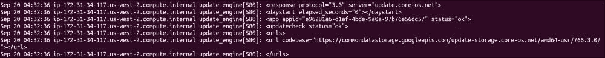

更新成功后，以下信息将出现在节点的`locksmithd.service`中，表明该节点将使用新映像进行更新。新映像将被更新到非活动的 USR 分区：

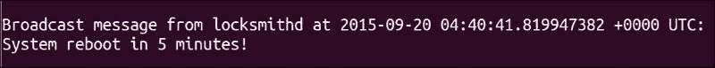

以下是重启后的节点版本。我们可以看到版本已成功升级到 766.3.0：

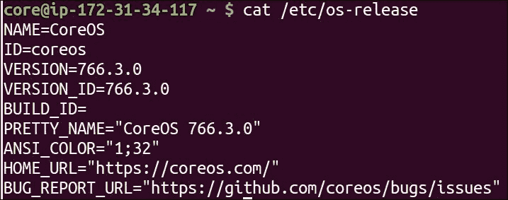

从一个发布渠道更新到另一个发布渠道

我们可以通过更新`/etc/coreos/update.conf`来切换发布渠道。以下是步骤：

+   将发布渠道组从`stable`更新到`alpha`，如以下截图所示：

    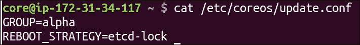

+   重启`update-engine.service`：

    `sudo systemctl restart update-engine`

+   `update-engine`服务将在 10 分钟后检查更新。我们可以通过以下命令强制更新：

    `update_engine_client -check_for_update`

以下日志显示正在获取版本 808.0.0 的映像：

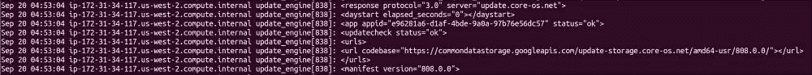

以下是节点重启后的版本。我们可以看到映像已升级到最新的 alpha 发布`808.0.0`：

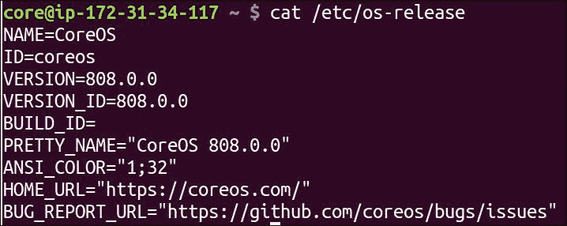

CoreUpdate

CoreUpdate 是 CoreOS 提供的一项商业服务，用于管理 CoreOS 集群的客户更新。以下是 CoreUpdate 服务提供的一些功能：

+   GUI 仪表盘为您提供了所有更新的摘要和详细视图。

+   客户定制的映像服务器将根据每个客户的需求提供。

+   可以创建服务器组，以便进行分组更新，并且可以对每个组进行速率限制。

+   提供 HTTP API，以便 CoreUpdate 可以与客户现有的 DevOps 系统集成。

+   映像可以托管在公共服务器或客户的本地服务器上。从安全角度来看，这非常有用，这样客户就不必担心开放防火墙。

+   `Updateservicectl`作为前端 CLI 提供。

Vagrant CoreOS 更新

如果 Vagrant 盒子已经下载，只有当该盒子更新时，新的 CoreOS 版本才会被更新。

即使我们在 Vagrantfile 中将版本从稳定版更改为 alpha 再到 beta，新的 CoreOS 版本在执行 `vagrant reload --provision` 时并未更新。只有在执行 `vagrant destroy` 并重新启动后，新的版本才会加载。我们可以通过 `update-engine` 直接在 CoreOS 节点上触发更新，并且不受 VBOX 版本的影响。

当 Vagrant CoreOS 未更新时，我们会收到以下消息：

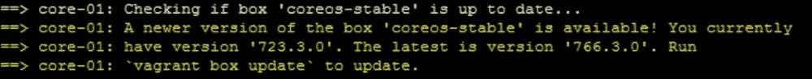

要更新 Vagrant box 版本，我们可以执行 `vagrant box update`，如下图所示：

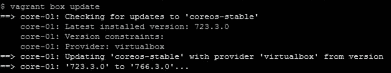

`vagrant reload` 命令或 `vagrant reload --provision` 命令无法帮助更新 CoreOS 版本。我们需要销毁并重新创建集群以获取最新版本。

总结

在本章中，我们涵盖了 CoreOS 更新的不同方面，包括 CoreOS 发布周期、控制 CoreOS 更新的服务，以及客户控制其集群更新策略的选项。CoreOS 更新机制简单、独特且强大，能够解决云计算中最大的安全问题。在下一章中，我们将详细介绍关键的 CoreOS 服务——`systemd`、`etcd` 和 `fleet`。

参考资料

+   CoreOS 发布: [`coreos.com/releases/`](https://coreos.com/releases/)

+   CoreOS 更新理念: [`coreos.com/using-coreos/updates/`](https://coreos.com/using-coreos/updates/)

+   CoreUpdate 服务: [`coreos.com/products/coreupdate/`](https://coreos.com/products/coreupdate/)

+   Locksmith GitHub 页面: [`github.com/coreos/locksmith`](https://github.com/coreos/locksmith)

+   更新策略: [`coreos.com/os/docs/latest/update-strategies.html`](https://coreos.com/os/docs/latest/update-strategies.html)

进一步阅读和教程

+   CoreOS 更新的结构: [`www.youtube.com/watch?v=JeICd9XyXfY`](https://www.youtube.com/watch?v=JeICd9XyXfY)

+   Omaha 更新协议: [`github.com/google/omaha`](https://github.com/google/omaha) 和 [`coreos.com/docs/coreupdate/custom-apps/coreupdate-protocol/`](https://coreos.com/docs/coreupdate/custom-apps/coreupdate-protocol/)
