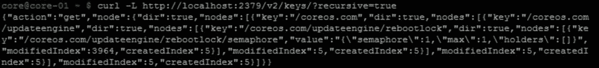
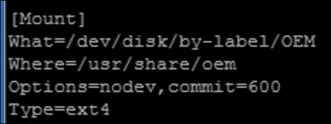
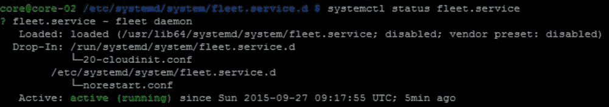
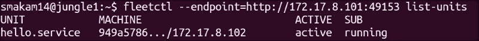

# 第五章

第四章 CoreOS 主要服务 – Etcd、Systemd 和 Fleet

本章将介绍 CoreOS 关键服务——Etcd、Systemd 和 Fleet 的内部工作。对于每个服务，我们将涵盖安装、配置以及它们的应用。CoreOS 默认包括 Etcd、Systemd 和 Fleet。这些服务也可以作为独立组件安装在任何 Linux 系统上。本章将涵盖以下主题：

+   Etcd——安装、访问方法、配置选项、使用案例、调优、集群管理、安全性、认证和调试

+   Systemd——单元类型、说明符、模板和特殊单元

+   Fleet——安装、访问方法、模板、调度、高可用性和调试

+   使用 Etcd 和 Fleet 的服务发现选项

Etcd

Etcd 是一个分布式键值存储，CoreOS 集群中的所有机器都使用它来读写和交换数据。第一章中提供了 Etcd 的概述。本节将介绍 Etcd 的内部工作。

版本

Etcd 正在持续开发中，频繁发布版本以添加新功能并修复漏洞。以下是最近版本更新的主要内容：

+   版本 2.0 是第一个稳定版本，于 2015 年 1 月发布。版本 2.0 之前的版本作为 etcd 提供，而版本 2.0 之后的版本在 CoreOS 节点中作为 etcd2 提供。

+   版本 2.0 增加了 IANA 分配的端口 `2379` 用于客户端与服务器的通信，`2380` 用于服务器与服务器的通信。之前，端口 `4001` 用于客户端与服务器的通信，端口 `7001` 用于服务器与服务器的通信。

+   版本 2.1 引入了认证和度量收集功能，这些功能处于实验模式中。

+   截至 2015 年 9 月，最新版本为 2.2.0。

+   一个实验性的 v3 API（一些示例包括多键读取、范围读取和二进制键）现在作为预览版可用，预计将在 2015 年 10 月底的 2.3.0 版本中正式发布。

本章中的所有示例均基于 etcd 版本 2.1.0 及以上版本。

安装

CoreOS 自带 etcd。etcd 和 etcd2 版本都包含在基础 CoreOS 镜像中。以下是 CoreOS alpha 镜像 779.0.0 中提供的 etcd 版本：


独立安装

Etcd 也可以安装在任何 Linux 机器上。以下是尝试在 Ubuntu 14.04 上安装 etcd 版本 2.2 的安装命令：

`curl -L https://github.com/coreos/etcd/releases/download/v2.2.0/etcd-v2.2.0-linux-amd64.tar.gz -o etcd-v2.2.0-linux-amd64.tar.gz``tar xzvf etcd-v2.2.0-linux-amd64.tar.gz`

以下示例展示了如何在独立模式下尝试使用 etcd。启动服务器时运行以下命令：

`etcd -name etcdtest`

现在，检查是否可以通过一些基本命令连接到 etcd 服务器：

`etcdctl cluster-health`

以下截图显示了前述命令的输出：


以下是使用 curl 接口进行简单的 set 和 get 操作的示例：

`curl –L –X PUT http://127.0.0.1:2379/v2/keys/message -d value="hello"``curl –L http://127.0.0.1:2379/v2/keys/message`

以下截图是前述命令的输出：


访问 etcd

可以通过 etcdctl CLI 或 REST API 访问 Etcd。这适用于独立的 etcd 以及 CoreOS 中的 etcd。下图展示了访问 etcd 的不同方式：


REST

可以通过 REST API 访问和修改 etcd 数据库。使用这种方式可以本地或远程访问 etcd 数据库。

以下示例展示了使用`curl`方法访问 CoreOS 节点以获取所有键：

`curl –L http://localhost:2379/v2/keys/?recursive=true`

以下截图是前述命令的输出：



以下示例展示了使用`curl`方法访问远程 CoreOS 节点以获取所有键：

`curl –L http://172.17.8.101:2379/v2/keys/?recursive=true`

以下截图是前述命令的输出：


Etcdctl

Etcdctl 是 REST 接口之上的 CLI 封装。Etcdctl 可以用于本地或远程访问。

以下示例展示了使用 etcdctl 方法访问 CoreOS 节点以获取所有键：

`etcdctl ls / --recursive`

以下截图是前述命令的输出：


以下示例展示了使用 etcdctl 方法访问远程 CoreOS 节点以获取所有键：

`etcdctl --peers=http://172.17.8.101:2379 ls / --recursive`

以下截图是前述命令的输出：


Etcd 配置

Etcd 配置参数可以用来修改 etcd 成员属性或集群范围属性。Etcd 选项可以通过命令行或使用环境变量进行设置。命令行设置会覆盖环境变量。以下是一些广泛的分类及其关键配置参数/环境变量：

+   成员：名称、数据目录和心跳间隔

+   集群：发现令牌和初始集群节点

+   代理：代理开/关和代理间隔

+   安全：证书和密钥

+   日志：启用/禁用日志记录和日志级别

+   实验性

以下是一个 etcd 调用示例，其中使用了一些前述配置参数：

`etcd -name infra0 -data-dir infra0  --cacert=~/.etcd-ca/ca.crt -cert-file=/home/smakam14/infra0.crt -key-file=/home/smakam14/infra0.key.insecure  -advertise-client-urls=https://192.168.56.104:2379 -listen-client-urls=https://192.168.56.104:2379`

Etcd 环境变量也可以在`cloud-config`中指定。以下是一个`cloud-config`示例，用于指定 etcd 环境变量：

`etcd2:     #为每个唯一集群生成一个新令牌，来自 https://discovery.etcd.io/new     discovery: https://discovery.etcd.io/d93c8c02eedadddd3cf14828f9bec01c     # 多区域和多云部署需要使用$public_ipv4     advertise-client-urls: http://$public_ipv4:2379     initial-advertise-peer-urls: http://$private_ipv4:2380     # 同时监听官方端口和遗留端口     listen-client-urls: http://0.0.0.0:2379,http://0.0.0.0:4001     listen-peer-urls: http://$private_ipv4:2380,http://$private_ipv4:7001`

从 cloud-config 中获取的 etcd2 环境变量存储在以下目录：`/run/systemd/system/etcd2.service.d`。

如果环境变量发生更改，etcd2 服务需要重新启动。

可以在[`coreos.com/etcd/docs/latest/configuration.html`](https://coreos.com/etcd/docs/latest/configuration.html)找到完整的 etcd 配置参数和环境变量列表。

Etcd 操作

以下是一些可以使用 etcd 执行的主要操作示例：

+   键值对的设置、获取和删除操作

+   设置带有超时的键，其中该键会自动过期

+   根据原子条件检查设置一个键

+   隐藏键

+   监视并等待键的变化

+   创建有序的键

使用这些操作，etcd 可以用于各种分布式应用场景。以下是一个 TTL 使用场景的示例，其中我们检查 Apache 服务的存活性，并更新如 IP 地址和端口号等服务详情到 etcd，其他应用可以使用这些信息来判断服务是否正在运行。如果 Apache 服务停止，在这种情况下，etcd 中的键值对将在 30 秒后被删除：

`## 测试服务是否可访问，然后注册有用的信息，如 IP 地址，端口 ExecStart=/bin/bash -c '\   while true; do \     curl -f ${COREOS_PUBLIC_IPV4}:%i; \     if [ $? -eq 0 ]; then \       etcdctl set /services/apachet/${COREOS_PUBLIC_IPV4} \'{"host": "%H", "ipv4_addr": ${COREOS_PUBLIC_IPV4}, "port": %i}\' --ttl 30; \     fi; \     sleep 20; \   done'`

我们可以找到关于 etcd 节点的统计信息，以及与键相关的操作。

以下输出显示了 etcd 节点的统计信息：

`curl http://127.0.0.1:2379/v2/stats/self | jq .`

以下截图是前述命令的输出：


以下输出显示了 etcd 键的统计信息：

`curl http://127.0.0.1:2379/v2/stats/store | jq .`

以下截图是前述命令的输出：


Etcd 调优

以下是一些可以调整的 etcd 参数，以根据操作环境实现最佳集群性能：

+   集群大小：较大的集群可以提供更好的冗余。大集群的缺点是更新可能需要较长时间。在第一章，CoreOS 概述中，我们看到了不同集群大小下的容错极限。

+   心跳间隔：这是主节点向其跟随节点发送心跳消息的时间间隔。默认的心跳间隔为 100 毫秒。选择心跳间隔时需要根据节点之间 ping 的平均往返时间来决定。如果节点地理分布较广，往返时间会更长。建议的心跳间隔是平均往返时间的 0.5-1.5 倍。如果选择较小的心跳间隔，数据包的开销会更高；如果选择较大的心跳间隔，则需要更长的时间才能检测到领导者故障。心跳间隔可以通过 `heartbeat-interval` 参数在 etcd 命令行中设置，或者通过 `ETCD_HEARTBEAT_INTERVAL` 环境变量设置。

+   选举超时：当跟随节点在选举超时值内未能接收到心跳消息时，它们会成为领导者节点。默认的选举超时为 1,000 毫秒。建议的选举超时值是心跳间隔的 10 倍。将选举超时设置得过低可能会导致错误的领导者选举。选举超时可以通过 `election-timeout` 参数在 etcd 命令行中设置，或者通过 `ETCD_ELECTION_TIMEOUT` 环境变量设置。

Etcd 代理

当工作节点需要使用主节点或主集群提供 etcd 服务时，会使用 etcd 代理。在这种情况下，所有来自工作节点的 etcd 请求都将被代理到主节点，主节点再回复工作节点。

假设我们有一个正在运行的三节点主集群，配置如下：


以下示例展示了作为工作节点并充当代理的第四个节点的 `cloud-config` 配置。在此，主集群成员是静态指定的：

`#cloud-config coreos:   etcd2:     proxy: on     listen-client-urls: http://localhost:2379     initial-cluster: etcdserver=http://172.17.8.101:2380, http://172.17.8.102:2380, http://172.17.8.103:2380   fleet:     etcd_servers: "http://localhost:2379"     public-ip: $public_ipv4   units:     - name: etcd2.service       command: start     - name: fleet.service       command: start`

在前面的 Etcd 配置部分中，我们启用了代理并指向了 `etcd_server` 集群。第四个节点需要使用上述 `cloud-config` 配置启动。

以下示例展示了作为代理并使用发现令牌的第四个节点的 `cloud-config` 配置。我们需要使用与三节点集群相同的发现令牌：

`#cloud-config coreos:   etcd2:     proxy: on     # 使用与主节点相同的发现令牌，这些节点将代理到主节点     discovery: <your token>     # 监听官方端口和旧版端口     listen-client-urls: http://0.0.0.0:2379,http://0.0.0.0:4001   fleet:     etcd_servers: "http://localhost:2379"     public-ip: $public_ipv4   units:     - name: etcd2.service       command: start     - name: fleet.service       command: start`

以下是新节点上的 etcd 成员输出。如我们所见，etcd 集群由三个节点组成，且新节点正在代理主 etcd 集群：


以下是新节点上的 Fleet 机器输出。如我们所见，共有四个节点，包括第四个工作节点和三节点的 etcd 集群：


向集群中添加和移除节点

有时我们需要从一个正在运行的 etcd 集群中添加或移除节点。本节将演示如何在运行中的 etcd 集群中添加和移除节点。

假设我们有一个三节点的工作集群，并且想要向集群中添加第四个节点。可以在任一三节点中的一台上执行以下命令，添加第四个节点的详细信息：


以下`cloud-config`可以用来启动新的第四节点：

`#cloud-config coreos:   etcd2:     name: core-04     initial_cluster: "core-01=http://172.17.8.101:2380,core-02=http://172.17.8.102:2380,core-03=http://172.17.8.103:2380,core-04=http://172.17.8.104:2380"     initial_cluster_state: existing     advertise-client-urls: http://$public_ipv4:2379     initial-advertise-peer-urls: http://$private_ipv4:2380     # listen on both the official ports and the legacy ports     # legacy ports can be omitted if your application doesn't depend on them     listen-client-urls: http://0.0.0.0:2379,http://0.0.0.0:4001     listen-peer-urls: http://$private_ipv4:2380,http://$private_ipv4:7001   fleet:     public-ip: $public_ipv4   units:     # Note: this requires a release that contains etcd2     - name: etcd2.service       command: start     - name: fleet.service       command: start`

从以下输出可以看出，新的节点已经成功添加：


可以使用以下命令移除之前添加的第四个节点：


现在我们来检查成员列表和集群健康状况。我们可以看到，三个节点是集群的一部分，第四个节点已被移除：


节点迁移与备份

节点迁移是处理节点和集群故障以及将集群复制到不同位置时所必需的。

为了备份 etcd 数据库，我们可以执行以下操作：

`Sudo etcdctl backup --data-dir=/var/lib/etcd2 --backup-dir=/tmp/etcd2`

这种方法允许我们在另一个集群中重新使用备份的 etcd 数据。在这种方法中，备份目录中的`nodeid`和`clusterid`被覆盖，以防止无意中将新节点添加到旧集群。

为了保留节点 ID 和集群 ID，我们必须手动复制，且复制品可以用来重启服务。

以下是移动 etcd2 数据目录的步骤：

1.  停止服务：

    

1.  将`/var/lib/etcd2`的 etcd 数据目录复制到`/tmp/etcd2_backup`：

    

1.  使用新的数据目录`/tmp/etcd2_backup`手动启动 etcd2：

    

处理迁移有两种方法：

+   添加一个新成员并移除旧成员。我们可以使用`etcdctl member add`和`etcdctl member remove`。

+   复制 etcd 数据库，将其移动到新节点并更新。

第一种方法中新成员有不同的身份。第二种方法则可以让新节点保持相同的旧身份。在第一种方法中，不需要停止 etcd 服务，而在第二种方法中，在进行备份之前需要停止 etcd 服务。

Etcd 安全性

需要一个安全的 etcd 来确保客户端与服务器之间的通信以及服务器之间的通信是安全的。下图展示了提供 etcd 安全性所涉及的不同组件。证书颁发机构用于提供和验证 etcd 客户端到服务器以及服务器到服务器的通信证书：


证书颁发机构 – etcd-ca

证书颁发机构是一个可信的来源，用于向可信服务器颁发证书。除了使用标准的证书颁发机构（CA）外，etcd 还允许使用自定义 CA。Etcd-ca ([`github.com/coreos/etcd-ca`](https://github.com/coreos/etcd-ca)) 是一个 GO 应用程序，可以作为测试目的使用的 CA。最近，etcd 已迁移至 CFSSL ([`github.com/cloudflare/cfssl`](https://github.com/cloudflare/cfssl)) 作为官方证书工具。

安装 etcd-ca

我在运行 Ubuntu 14.04 的 Linux 虚拟机上使用以下步骤安装了 etcd-ca：

`git clone https://github.com/coreos/etcd-ca``cd etcd-ca``./build`

注意

注意：在安装 etcd-ca 之前，需要先安装 GO 应用程序。

设置 etcd-ca 需要以下三个步骤：

1.  使用 etcd-ca 创建 CA。

1.  创建服务器密钥。

1.  创建客户端密钥。

以下命令`etcd-ca init`用于创建一个 CA。这是一个一次性的过程。以下截图展示了创建 CA 时的输出：


以下命令可以用于创建服务器证书：

`etcd-ca new-cert -ip 172.17.8.101 core-01``etcd-ca sign core-01``etcd-ca chain core-01``etcd-ca export --insecure core-01 | tar xvf –`

在上述命令中，`172.17.8.101`是 CoreOS 节点的 IP，`core-01`是节点名称。这些步骤将创建`core-01.crt`和`core-01.key.insecure`。

以下命令可以用于创建客户端证书：

`etcd-ca new-cert -ip 192.168.56.104 client``etcd-ca sign client``etcd-ca chain client``etcd-ca export --insecure client | tar xvf -`

在上述命令中，`192.168.56.104`是客户端节点的 IP。这些步骤将创建`client.crt`和`client.key.insecure`。

使用服务器证书实现 etcd 安全的客户端与服务器通信

客户端使用服务器证书来确保服务器的身份。以下命令使用在前一部分生成的服务器证书和密钥启动 etcd 服务器：

`etcd2 -name core-01 --cert-file=/home/core/core-01.crt --key-file=/home/core/core-01.key  --advertise-client-urls=https://172.17.8.101:2379 --listen-client-urls=https://172.17.8.101:2379`

以下是一个示例，展示如何使用安全机制设置密钥并检索它：

`curl --cacert /home/smakam14/.etcd-ca/ca.crt https://172.17.8.101:2379/v2/keys/foo -XPUT -d value=bar -v``curl --cacert /home/smakam14/.etcd-ca/ca.crt https://172.17.8.101:2379/v2/keys/foo`

以下示例使用 `etcdctl` 进行密钥检索：

`etcdctl --ca-file /home/smakam14/.etcd-ca/ca.crt --peers https://172.17.8.101:2379 get /foo`

Etcd 使用服务器证书和客户端证书进行安全的客户端到服务器通信

在前面的示例中，只有服务器有证书。在这个示例中，我们将生成一个客户端证书，以便服务器验证客户端的身份。以下命令使用服务器证书和密钥启动 etcd 服务器，并启用客户端身份验证。服务器证书和密钥与前一部分生成的相同：

`etcd2 -name core-01 --data-dir=core-01 -client-cert-auth -trusted-ca-file=/home/core/ca.crt -cert-file=/home/core/key.crt  -key-file=/home/core/key.key -advertise-client-urls https://172.17.8.101:2379 -listen-client-urls https://172.17.8.101:2379`

以下是一个示例，展示如何使用安全的客户端和服务器机制设置密钥并检索它。客户端证书和密钥与前一部分生成的相同：

`curl --cacert /home/smakam14/.etcd-ca/ca.crt --cert /home/smakam14/client.crt --key /home/smakam14/client.key.insecure -L https://172.17.8.101:2379/v2/keys/foo -XPUT -d value=bar -v``curl --cacert /home/smakam14/.etcd-ca/ca.crt --cert /home/smakam14/client.crt --key /home/smakam14/client.key.insecure https://172.17.8.101:2379/v2/keys/foo`

以下示例使用 `etcdctl` 进行密钥检索：

`etcdctl --ca-file /home/smakam14/.etcd-ca/ca.crt --cert-file /home/smakam14/client.crt --key-file /home/smakam14/client.key.insecure --peers https://172.17.8.101:2379 get /foo`

一个安全的 `cloud-config`

以下是一个示例的 `cloud-config`，它设置了 etcd 的安全环境变量以及所需的证书和密钥：

`cloud-config write_files:   - path: /run/systemd/system/etcd2.service.d/30-configuration.conf    permissions: 0644    content: |      [Service]      Environment=ETCD_NAME=core-01      Environment=ETCD_VERBOSE=1      # Encryption      Environment=ETCD_CLIENT_CERT_AUTH=1      Environment=ETCD_TRUSTED_CA_FILE=/home/core/ca.crt      Environment=ETCD_CERT_FILE=/home/core/server.crt      Environment=ETCD_KEY_FILE=/home/core/server.key       - path: /home/core/ca.crt    permissions: 0644    content: |      -----BEGIN CERTIFICATE-----       -----END CERTIFICATE-----      - path: /home/core/server.crt    permissions: 0644    content: |      -----BEGIN CERTIFICATE-----      -----END CERTIFICATE-----   - path: /home/core/server.key    permissions: 0644    content: |      -----BEGIN RSA PRIVATE KEY-----      -----END RSA PRIVATE KEY-----  coreos:  etcd2:     # Static cluster     initial-cluster-token: etcd-cluster-1     initial-cluster: core-01=http://$private_ipv4:2380     initial-cluster-state: new     advertise-client-urls: http://$public_ipv4:2379     initial-advertise-peer-urls: http://$private_ipv4:2380     # listen on both the official ports and the legacy ports     # legacy ports 可以省略，如果您的应用不依赖于它们     listen-client-urls: http://$public_ipv4:2379     listen-peer-urls: http://$private_ipv4:2380,http://$private_ipv4:7001  units:    - name: etcd2.service      command: start`

认证

在引入认证功能之前，etcd 数据库的访问没有任何限制。认证功能作为实验性功能在 etcd 2.1.0 中引入，并允许基于用户名和密码访问特定的密钥集。

认证涉及两个实体：

+   用户：用户可以通过用户名和密码创建。在启用认证功能之前，必须先创建一个 root 用户。root 用户拥有更多的权限，可以添加用户和角色并分配角色权限。

+   角色：角色用于限制对特定密钥或包含多个密钥的目录的访问。角色分配给用户，密钥的操作可以根据用户名进行。

要开始使用认证，我们需要先创建一个 root 用户，然后启用认证功能。

首先创建一个 root 用户，如下图所示：


按照以下方式启用认证：


以下示例演示了 etcd 认证。

让我们创建一个示例密钥集、用户和角色：

1.  创建 `/dir1/key1` 和 `/dir2/key2` 密钥。

1.  创建一个仅能访问 `/dir1/*` 的 `role_dir1` 角色。

1.  创建一个仅能访问 `/dir2/*` 的 `role_dir2` 角色。

1.  创建 `user1` 并授予 `role_dir1` 角色。

1.  创建 `user2` 并授予 `role_dir2` 角色。

此时，`user1` 只能访问 `/dir1/*`，`user2` 只能访问 `/dir2/*`。

以下是步骤的详细说明：

创建`/dir1/key1`和`/dir2/key2`密钥：


创建一个仅能访问`/dir1/*`的`role_dir1`角色：


创建一个仅能访问`/dir2/*`的`role_dir2`角色：


创建`user1`并授予`role_dir1`角色：


创建`user2`并授予`role_dir2`角色：


现在，我们可以验证`user1`仅能访问`/dir1/key1`。如以下截图所示，`user1`无法访问`/dir2/key1`：


类似地，`user2`仅能访问`/dir2/key1`：


Etcd 调试

可以使用以下命令检查 Etcd 的日志文件：

`Journalctl –u etcd2.service`

默认日志级别设置为`INFO`。要进行更详细的日志记录，我们可以在环境文件中设置`ETCD_DEBUG=1`，或者使用`-debug`命令行选项。

有时，检查与 etcdctl CLI 命令关联的 curl 命令是很有用的。可以使用`--debug`选项实现这一点。以下是一个示例：


Systemd

第一章《CoreOS 概述》中提供了 Systemd 的概述。Systemd 是 CoreOS 使用的初始化系统，默认始终开启。在本节中，我们将深入了解一些 Systemd 的内部机制。

单元类型

单元描述了特定的任务及其依赖项和执行顺序。一些单元默认在 CoreOS 系统中启动。CoreOS 用户也可以启动自己的单元。系统启动的单元位于`/usr/lib64/systemd/system`，用户启动的单元位于`/etc/systemd/system`。

以下是一些常见的单元类型：

+   服务单元：用于启动特定的守护进程或进程。例如`sshd.service`和`docker.service`。`sshd.service`单元启动 SSH 服务，`docker.service`启动 docker 守护进程。

+   套接字单元：用于本地 IPC 或网络通信。例如`systemd-journald.socket`和`docker.socket`。每个套接字都有一个对应的服务来管理该套接字。例如，`docker.service`管理`docker.socket`。在`docker.service`中，`docker.socket`作为依赖项被提到。`Docker.socket`提供与 docker 引擎的远程连接。

+   目标单元：主要用于将相关单元分组，以便它们可以一起启动。所有用户创建的服务都位于`multi-user.target`中。

+   挂载单元：用于将磁盘挂载到文件系统。例如`tmp.mount`和`usr-share-oem.mount`。以下是`usr-share-oem.mount`的相关部分，用于挂载`/usr/share/oem`：

    

+   定时器单元：这些单元会根据指定的时间间隔定期启动。例如`update-engine-stub.timer`和`logrotate.timer`。以下是`update-engine-stub.timer`的相关部分，其中每`41 分钟`调用一次`update-engine-stub.service`来检查 CoreOS 更新：

    

单元说明符

在编写 systemd 单元时，访问系统环境变量（如主机名、用户名、IP 地址等）非常有用，这样可以避免硬编码，并在不同系统间使用相同的 systemd 单元。为此，systemd 为您提供了单元说明符，这些是访问系统环境的快捷方式。

以下是一些常见的单元说明符：

+   `%H`：主机名

+   `%m`：机器 ID

+   `%u`：用户名

单元说明符的完整列表可以在[`www.freedesktop.org/software/systemd/man/systemd.unit.html#Specifiers`](http://www.freedesktop.org/software/systemd/man/systemd.unit.html#Specifiers)找到。

以下服务示例演示了单元说明符的使用。在此示例中，我们在 ExecStartPre 中设置与不同说明符相关的键值对，并将其存储在 etcd 中。在 ExecStartPost 中，我们获取该键值对，并在最后进行清理：

`[Unit] Description=My Service  [Service] KillMode=none ExecStartPre=/usr/bin/etcdctl set hostname %H ; /usr/bin/etcdctl set machinename %m ; /usr/bin/etcdctl set bootid %b ; /usr/bin/etcdctl set unitname %n ; /usr/bin/etcdctl set username %u ExecStart=/bin/echo hello, set done, will echo and remove ExecStartPost=/usr/bin/etcdctl get hostname ; /usr/bin/etcdctl get machinename ; /usr/bin/etcdctl get bootid ; /usr/bin/etcdctl get unitname ; /usr/bin/etcdctl get username ; ExecStartPost=/usr/bin/etcdctl rm hostname ; /usr/bin/etcdctl rm machinename ; /usr/bin/etcdctl rm bootid ; /usr/bin/etcdctl rm unitname ; /usr/bin/etcdctl rm username ;  [Install] WantedBy=multi-user.target`

要执行此服务，必须使用 sudo 执行以下所有操作：

1.  在`/etc/systemd/system`中创建`unitspec.service`文件，并使用前述内容。

1.  使用`systemctl enable unitspec.service`启用服务。

1.  使用`systemctl start unitspec.service`启动服务。

1.  如果在此之后修改服务，需要在启动服务之前执行命令`systemctl daemon-reload`。

以下是与服务相关的`journalctl`日志，我们可以看到键被设置和获取，以及相应的单元说明符值：

`journalctl –u unitspec.service`


单元模板

Systemd 单元可以作为模板创建，并且可以使用相同的模板单元基于模板的调用实例化多个单元。

模板创建为`unitname@.service`。模板的调用可以使用`unitname@instanceid.service`进行。在单元文件中，可以使用`%p`访问`unit name`，并使用`%i`访问`instanceid`。

以下是一个示例模板文件，`unitspec@.service`：

`[Unit] Description=My Service [Service] ExecStartPre=/usr/bin/etcdctl set instance%i %i ; /usr/bin/etcdctl set prefix %p ExecStart=/bin/echo Demonstrate systemd template [Install] WantedBy=multi-user.target`

要执行此服务，必须使用 sudo 执行以下所有操作：

1.  在`/etc/systemd/system`中创建`unitspec@.service`文件。

1.  使用`systemctl enable unitspec@.service`启用服务。

1.  使用`systemctl start unitspec@1.service`和`systemctl start unitspec@2.service`启动多个服务。

如果我们查看 etcd 内容，我们可以看到，实例值会根据单元名称中提供的`%i`参数进行更新，并创建`instance1`和`instance2`键：


以下示例提供了一个更实际的实例化单元示例。它使用了一个模板 nginx 服务，`nginx@.service`，其中 web 服务的端口号是动态传递的：

`[Unit] Description=Apache web server service After=etcd.service After=docker.service [Service] TimeoutStartSec=0 Restart=always EnvironmentFile=/etc/environment ExecStartPre=-/usr/bin/docker kill nginx%i ExecStartPre=-/usr/bin/docker rm nginx%i ExecStartPre=/usr/bin/docker pull nginx ExecStart=/usr/bin/docker run --name nginx%i -p ${COREOS_PUBLIC_IPV4}:%i:80 nginx ExecStop=/usr/bin/docker stop nginx%i [Install] WantedBy=multi-user.target`

上述代码中使用了两个服务选项：

+   `TimeoutStartSec`：此选项指定启动服务所需的时间。如果服务在此时间内未启动，它将被终止。`none`参数禁用此选项，适用于下载大容器时。

+   `Restart`：此选项控制服务的重启性。在这里我们指定了`always`，以便在服务发生故障时重启该服务。

让我们使用以下命令创建该服务的两个实例：

`Sudo systemctl enable nginx@.service``Sudo systemctl start nginx@8080.service``Sudo systemctl start nginx@8081.service`

这将创建两个带有 nginx 服务的 docker 容器，第一个容器暴露端口`8080`，第二个容器暴露端口`8081`。

让我们查看`docker ps`：


让我们查看两个单元的状态。如以下截图所示，这些单元处于活动（运行）状态：


插入单元

插入单元用于在运行时更改系统单元的属性。创建插入单元有四种方法。

默认的 cloud-config 插入单元

在`cloud-config`用户数据中指定的参数将自动配置为插入单元。例如，我们来看一下`etcd2.service cloud-config`：


让我们查看`etcd2.service`的状态：


正如我们在上面的输出中看到的，默认的插入单元是`20-cloudinit.conf`。

`20-cloudinit.conf` 将包含在 `etcd2 cloud-config` 中指定的作为环境变量的参数，如下图所示：


Cloud-config 自定义 drop-in 单元

我们可以将 drop-in 单元作为 `cloud-config` 的一部分进行指定。以下是 `fleet.service` drop-in 单元的示例，我们将默认的 `Restart` 参数从 `Always` 改为 `No`：


当我们使用这个`cloud-config`时，`norestart.conf` drop-in 文件会自动创建，可以从 `fleet.service` 状态中看到这一点：


这个配置更改将使 `fleet.service` 无法重启。

运行时 drop-in 单元 – 特定参数

我们可以使用 drop-in 配置文件更改服务的特定属性。以下是 `fleet.service` 的服务部分，显示了默认参数：


这表示如果服务因某些错误死掉，需要在 10 秒内启动该服务。让我们通过杀死 Fleet 服务来检查重启是否有效。

我们可以通过如下方式杀死服务：

`Sudo kill -9 <fleet pid>`

以下是日志，显示了 Fleet 服务在 10 秒内重启，这是由于服务配置中指定的 `Restartsec`：


为了证明运行时的 drop-in 配置更改，让我们创建一个配置文件，在其中禁用 Fleet 服务的重启。

在`/etc/systemd.system/system/fleet.service.d`下创建 `norestart.conf`：


现在，让我们重新加载 systemd 配置：

`Sudo systemd daemon-reload`

让我们检查一下现在 `fleet.service` 的状态：



我们可以看到，除了 `20-cloudinit.conf`，我们还拥有一个 `norestart.conf` drop-in 单元。

现在，如果我们杀死 Fleet 服务，它不会被重启，因为重启选项已通过 `restart.conf` drop-in 单元禁用。`Fleet.service` 会保持失败状态，如下图所示：


运行时 drop-in 单元 – 完整服务

通过这种方式，我们可以用自己的服务替换完整的系统服务。让我们通过在 `/etc/systemd/system` 中创建这个 `fleet.service` 文件来更改重启选项：

`[Unit] Description=fleet daemon  After=etcd.service After=etcd2.service  Wants=fleet.socket After=fleet.socket  [Service] ExecStart=/usr/bin/fleetd Restart=no  [Install] WantedBy=multi-user.target`

我们可以通过以下方式启动 `fleet.service`：

`Sudo systemctl start fleet.service`

让我们查看 `fleet.service` 的状态：


从前面的输出中，我们可以看到 `fleet.service` 是从 `/etc/systemd/system` 加载的。

如果我们将这个选项（一个带有完整服务更改的掉入单元）与之前的选项（一个带有特定参数更改的掉入单元）进行比较，前一个选项提供了更改特定参数的灵活性，而不会触及原始设置。这使得在新版本的服务允许额外选项时，更容易处理升级。

网络单元

`systemd-networkd` 服务用于管理网络。系统配置的网络位于 `/usr/lib64/systemd/network`，用户配置的网络位于 `/etcd/systemd/network`。以下是一个示例的 Vagrant 配置的 systemd-network 文件，用于配置 `eth1` 的 IP 地址：


与 `eth1` 相关的 `ifconfig` 输出显示了 Vagrant 配置的 IP 地址，如以下截图所示：


作为示例，假设我们尝试更改 `eth1` 的 IP 地址。步骤如下：

1.  停止 `systemd-networkd.service`。

1.  刷新 IP 地址。

1.  设置一个新的 IP 地址。

我们将创建一个服务文件来刷新 `eth1` 的 IP 地址，并创建另一个网络文件来为 `eth1` 指定新的 IP 地址。

创建一个服务文件以刷新 `eth1` 的 IP 地址，如下所示。我们需要将其放置在 `/etc/systemd/system/down-eth1.service` 中。

`[Unit] Description=eth1 flush  [Service] Type=oneshot ExecStart=/usr/bin/ip link set eth1 down ExecStart=/usr/bin/ip addr flush dev eth1  [Install] WantedBy=multi-user.target`

以下是指定 `eth1` 新地址的网络文件。我们需要将其放置在 `/etc/systemd/network/40-eth1.network` 中：

`[Match] Name=eth1  [Network] Address=172.17.8.110/24 Gateway=172.17.8.1`

更改 IP 地址的步骤如下：

1.  通过 `sudo systemctl stop systemd-networkd.service` 停止 systemd-networkd 服务。

1.  通过 `sudo systemctl start down-eth1.service` 来刷新 `eth1` 的 IP 地址。

1.  通过 `sudo systemctl start systemd-networkd.service` 启动 `systemd-networkd.service`。

如果我们现在查看 ifconfig 输出，应该能看到新的 IP 地址 `172.17.8.110`：


Fleet

Fleet 是一个集群管理器/调度器，控制 CoreOS 集群级别的服务创建。我们可以将 Fleet 看作是集群的 Systemd。有关 Fleet 的概述，请参考 第一章，CoreOS 概述。Fleet 主要用于关键系统服务的编排，而其他编排解决方案如 Kubernetes 主要用于应用服务编排。Fleet 当前不再活跃开发，处于维护模式。

安装

Fleet 在 CoreOS 中默认安装并启动。以下是 CoreOS 稳定版 766.3.0 发布中的 Fleet 版本：


Fleet 也可以安装在独立的 Linux 机器上。Fleet 的发布版本可以在 [`github.com/coreos/fleet/releases`](https://github.com/coreos/fleet/releases) 找到。

访问 Fleet

以下是访问 Fleet 的不同方式。

本地 fleetctl

`fleetctl` 命令在每个 CoreOS 节点中都存在，可以用于控制 Fleet 服务。

远程 fleetctl

`fleetctl` 命令可以通过指定端点参数来访问非本地的 CoreOS 节点。以下是示例：

`Fleetctl --endpoint=http://172.17.8.101:2379 list-machines`


远程 fleetctl 与 SSH 隧道

之前的示例没有使用任何认证。为了确保 fleetctl 访问的安全性，我们可以使用 SSH 认证方案。在这种模式下，必须将 CoreOS 节点的私钥添加到本地 SSH 认证代理。对于 Vagrant CoreOS 集群，私钥存储在 `~/.vagrant.d/insecure_private_key` 中。对于 AWS CoreOS 集群，私钥可以在初始密钥创建时下载。

要将私钥添加到认证代理：

`` eval `ssh-agent -s` ```ssh-add <private key>`


现在，我们可以使用 fleetctl 通过安全的 SSH 访问 CoreOS 集群：

`Fleetctl --tunnel=http://172.17.8.101 list-unit-files`


远程 HTTP

默认情况下，远程 HTTP Fleet API 访问被禁用。

要启用远程访问，创建 `.socket` 文件以暴露 Fleet API 端口。以下是示例 Fleet 配置文件，用于暴露端口 `49153` 供外部 API 访问：


在创建远程 API 配置文件后，必须重启 systemd、`fleet.socket` 和 `fleet.service`，以使其生效：

`Sudo systemctl daemon-reload` `Sudo systemctl restart fleet.socket` `Sudo systemctl restart fleet.service`

现在，我们可以访问远程 API。以下是使用 `fleetctl` 和 `curl` 的示例：

`Fleetctl --endpoint=http://172.17.8.101:49153 list-units`



以下输出展示了使用 Fleet HTTP API 的单元列表。以下 curl 输出已被截断，显示部分输出：

`Curl –s http://172.17.8.101:49153/fleet/v1/units | jq .`


使用 etcd 安全性

我们还可以使用安全的 etcd 方法来访问 Fleet。设置安全的 etcd 内容在 Etcd 安全部分中有说明。以下示例显示了带有服务器证书的 `fleetctl` 命令：

`fleetctl --debug --ca-file ca.crt --endpoint=https://172.17.8.101:2379 list-machines`

模板、调度和高可用性

Fleet 支持类似 systemd 的单元规范符和模板。单元规范符为服务文件提供快捷方式，而模板提供可重用的服务文件。前面关于 systemd 的部分详细介绍了单元规范符和模板。第一章，CoreOS 概述介绍了 Fleet 调度和高可用性的基础知识。

可以在 `cloud-config` 的 Fleet 部分指定节点的 Fleet 元数据。以下示例将 `role` 设置为 `web` 的 Fleet 节点元数据。元数据可用于 Fleet 服务文件中控制调度：

`metadata: "role=services"`

Fleet 使用非常简单的调度算法，X-fleet 选项用于在调度服务时指定约束条件。以下是可用的 X-fleet 选项：

+   `MachineMetaData`：服务根据匹配的元数据进行调度。

+   `MachineId`：服务根据指定的`MachineId`进行调度。

+   `MachineOf`：服务根据在同一节点上运行的其他服务进行调度。这可以用于将紧密耦合的服务调度到同一节点。

+   `Conflict`：此选项可用于避免将冲突的服务调度到同一节点。

+   `Global`：相同的服务会在集群的所有节点上进行调度。

以下示例使用单元标识符和模板，展示了 Fleet 调度和高可用性的实现。以下是该应用的一些细节：

+   一个应用由 WordPress 容器和 MySQL 容器组成

+   WordPress 容器使用来自 MySQL 容器的数据库，并通过 Docker 容器链接进行连接

+   容器之间的链接是通过`--link`选项完成的，并且只有当两个容器在同一主机上时才能工作

+   Fleet 的模板功能将用于通过单一的 WordPress 和 MySQL 模板启动多个服务，Fleet 的 X-fleet 约束功能将用于在同一主机上启动相关的容器

+   当集群中的一个节点宕机时，Fleet 的 HA 机制会负责重新调度失败的单元，我们将在这个例子中看到它的工作原理

MySQL 模板服务如下：

`[Unit] Description=app-mysql  [Service] Restart=always RestartSec=5 ExecStartPre=-/usr/bin/docker kill mysql%i ExecStartPre=-/usr/bin/docker rm mysql%i ExecStartPre=/usr/bin/docker pull mysql ExecStart=/usr/bin/docker run --name mysql%i -e MYSQL_ROOT_PASSWORD=mysql mysql ExecStop=/usr/bin/docker stop mysql%i`

WordPress 模板服务如下：

`[Unit] Description=wordpress  [Service] Restart=always RestartSec=15 ExecStartPre=-/usr/bin/docker kill wordpress%i ExecStartPre=-/usr/bin/docker rm wordpress%i ExecStartPre=/usr/bin/docker pull wordpress ExecStart=/usr/bin/docker run --name wordpress%i --link mysql%i:mysql wordpress ExecStop=/usr/bin/docker stop wordpress%i  [X-Fleet] MachineOf=mysql@%i.service`

以下是关于服务的一些说明：

+   我们使用了`%i`作为实例标识符

+   WordPress 具有 X-fleet 约束，用于在同一节点调度对应的 MySQL 容器

第一步是提交服务：


下一步是加载每个服务实例：


让我们检查一下所有服务是否正在运行。从以下截图可以看到，我们有三个 WordPress 应用实例和相关的 MySQL 数据库：


为了演示高可用性（HA），我们将关闭 CoreOS 的`node2`，可以通过关闭该节点来实现。

如我们所见，当前集群中只有两个节点：


从以下新的服务输出中，我们可以看到，原先运行在`node2`上的服务已经迁移到了`node3`，因为`node2`不可用：


调试

可以使用`fleetctl status`检查 Fleet 服务的状态。以下是一个示例：


使用`fleetctl journal`可以检查 Fleet 服务的日志。以下是一个示例：


为了进行调试并获取与`fleetctl`命令对应的 REST API，我们可以使用`--debug`选项，如下所示：


服务发现

微服务是动态的，服务需要动态发现其他服务以查找 IP 地址、端口号以及有关服务的元数据。服务发现有多种方案，在本节中，我们将介绍几种使用 etcd 和 Fleet 进行服务发现的方案。在本书的后续章节中，我们将介绍更高级的服务发现选项。

简单的基于 etcd 的服务发现

下图展示了最简单的服务发现机制，其中一个服务将与服务相关的详细信息更新到 etcd，其他服务可以从 etcd 中访问这些信息：


以下是一个示例 Apache 服务，`apacheupdateetcd@.service`，它会在服务启动时更新 etcd 中的主机名和端口号：

`[Unit] Description=My Advanced Service After=etcd2.service After=docker.service  [Service] TimeoutStartSec=0 ExecStartPre=-/usr/bin/docker kill apache%i ExecStartPre=-/usr/bin/docker rm apache%i ExecStartPre=/usr/bin/docker pull coreos/apache ExecStart=/usr/bin/docker run --name apache%i -p %i:80 coreos/apache /usr/sbin/apache2ctl -D FOREGROUND ExecStartPost=/usr/bin/etcdctl set /domains/example.com/%H:%i running ExecStop=/usr/bin/docker stop apache%i ExecStopPost=/usr/bin/etcdctl rm /domains/example.com/%H:%i  [X-Fleet] # Don't schedule on the same machine as other Apache instances X-Conflicts=apache*@*.service`

让我们启动服务并创建两个实例：


现在，我们可以验证 etcd 是否已更新了两个服务的详细信息：


Sidekick 服务发现

在之前的方案中，无法知道服务启动后是否还在运行。下图展示了一个稍微高级一点的服务发现方案，其中一个 sidekick 服务会将服务的详细信息更新到 etcd 中：


Sidekick 容器的目的是监控主服务，并且只有当主服务处于活动状态时，才会更新 etcd。重要的是，Sidekick 容器需要与其监控的主服务运行在同一节点上。

以下是一个使用 Apache 服务的 Sidekick 示例以及为 Apache 服务配置的 sidekick。

以下是`Apache.service`单元文件：

`[Unit] 描述=Apache Web 服务器服务，在端口 %i 上  # 需求 需要=etcd2.service 需要=docker.service 需要=apachet-discovery@%i.service  # 依赖关系排序 在 etcd2.service 之后 在 docker.service 之后 在 apachet-discovery@%i.service 之前  [Service] # 让进程启动稍微延迟（用于首次运行的 Docker 容器） TimeoutStartSec=0  # 将 killmode 从"control-group"更改为"none"，以使 Docker 正确移除 KillMode=none  # 获取 CoreOS 环境变量 环境文件=/etc/environment  # 启动前和启动 ## 带有"=-"的指令允许失败而不产生后果 ExecStartPre=-/usr/bin/docker kill apachet.%i ExecStartPre=-/usr/bin/docker rm apachet.%i ExecStartPre=/usr/bin/docker pull coreos/apache ExecStart=/usr/bin/docker run --name apachet.%i -p ${COREOS_PUBLIC_IPV4}:%i:80 coreos/apache /usr/sbin/apache2ctl -D FOREGROUND  # 停止 ExecStop=/usr/bin/docker stop apachet.%i`

以下是 Apache 侧 kick 服务单元文件：

`[Unit] 描述=Apache Sidekick  # 需求 需要=etcd2.service 需要=apachet@%i.service  # 依赖关系排序和绑定 在 etcd2.service 之后 在 apachet@%i.service 之后 绑定到 apachet@%i.service  [Service]  # 获取 CoreOS 环境变量 环境文件=/etc/environment  # 启动 ## 测试服务是否可访问，然后注册有用的信息 ExecStart=/bin/bash -c '\   while true; do \     curl -f ${COREOS_PUBLIC_IPV4}:%i; \     if [ $? -eq 0 ]; then \       etcdctl set /services/apachet/${COREOS_PUBLIC_IPV4} \'{"host": "%H", "ipv4_addr": ${COREOS_PUBLIC_IPV4}, "port": %i}\' --ttl 30; \     else \       etcdctl rm /services/apachet/${COREOS_PUBLIC_IPV4}; \     fi; \     sleep 20; \   done'  # 停止 ExecStop=/usr/bin/etcdctl rm /services/apachet/${COREOS_PUBLIC_IPV4}  [X-Fleet] # 在与相关的 Apache 服务相同的机器上调度 X-ConditionMachineOf=apachet@%i.service`

上述 Sidekick 容器服务定期 ping 主服务并更新 etcd 输出。如果主服务无法访问，相关服务的详细信息将从 etcd 中删除。

让我们启动两个服务实例：


让我们查看 etcd 输出。从以下截图中可以看到，etcd 反映了 Apache 运行的两个节点：


让我们查看 node1 中的 docker 输出：


为了演示侧 kick 服务，让我们停止 docker 容器并检查侧 kick 服务是否更新 etcd，以删除相应的服务：


让我们检查一下单元的状态。从下面可以看到，`apachet@2.service` 已经失败，相关的侧 kick 服务 `apachet-discovery@2.service` 处于非活动状态。


从以下输出可以看到，`apachet@2.service` 的详细信息已经从 etcd 中删除：


ELB 服务发现

这是 Sidekick 发现的一个变体，在这种变体中，Sidekick 更新 IP 地址到负载均衡器，负载均衡器将 Web 查询重定向到活动节点。在本例中，我们将使用 AWS 弹性负载均衡器和 Quay 仓库中提供的 CoreOS elb-presence 容器。elb-presence 容器负责检查 nginx 容器的健康状态，并更新 AWS ELB 以使用容器的 IP 地址。

下图展示了这种方法的高级架构：


第一步是在 AWS 中创建 ELB，如下截图所示。这里我们使用 AWS CLI 创建了 ELB，名为 `testlb`：


我们需要在 Sidekick 服务中使用之前截图创建的 `testlb`。

以下是 `nginx.service` 单元文件：

`[Unit] Description=nginx  [Service] ExecStartPre=-/usr/bin/docker kill nginx-%i ExecStartPre=-/usr/bin/docker rm nginx-%i ExecStart=/usr/bin/docker run --rm --name nginx-%i -p 80:80 nginx ExecStop=/usr/bin/docker stop nginx-%i  [X-Fleet] Conflicts=nginx@*.service`

以下是更新 AWS ELB 基于 `nginx.service` 健康状态的 nginx Sidekick 服务：

`[Unit] Description=nginx presence service BindsTo=nginx@%i.service  [Service] ExecStartPre=-/usr/bin/docker kill nginx-presence-%i ExecStartPre=-/usr/bin/docker rm nginx-presence-%i ExecStart=/usr/bin/docker run --rm --name nginx-presence-%i -e AWS_ACCESS_KEY=<key> -e AWS_SECRET_KEY=<secretkey> -e AWS_REGION=us-west-2 -e ELB_NAME=testlb quay.io/coreos/elb-presence ExecStop=/usr/bin/docker stop nginx-presence-%i  [X-Fleet] MachineOf=nginx@%i.service`

创建两个服务实例后，以下是 Fleet 的状态：


正如我们在下面的截图中看到的，AWS ELB 已经注册了这两个实例，并且将在这两个实例之间进行负载均衡：


在这一点上，如果停止 nginx 服务的任何实例，Sidekick 服务将负责从 ELB 中删除此实例。

摘要

在本章中，我们详细介绍了 Etcd、Systemd 和 Fleet 的内部结构，并通过充分的实际示例让您能够熟悉配置和使用这些服务。通过开源关键服务的开发，CoreOS 鼓励在 CoreOS 之外使用这些服务。我们还介绍了使用 Etcd、Systemd 和 Fleet 的基本服务发现选项。在下一章中，我们将介绍容器网络和 Flannel。

参考文献

+   Etcd 文档：[`coreos.com/etcd/docs/latest/`](https://coreos.com/etcd/docs/latest/)

+   Fleet 文档：[`coreos.com/fleet/docs/latest/`](https://coreos.com/fleet/docs/latest/)

+   Systemd 文档：[`www.freedesktop.org/wiki/Software/systemd/`](http://www.freedesktop.org/wiki/Software/systemd/)

+   Fleet 服务发现：[`coreos.com/fleet/docs/latest/examples/service-discovery.html`](https://coreos.com/fleet/docs/latest/examples/service-discovery.html)

+   Etcd-ca：[`github.com/coreos/etcd-ca`](https://github.com/coreos/etcd-ca)

+   Etcd 安全性：[`github.com/coreos/etcd/blob/master/Documentation/security.md`](https://github.com/coreos/etcd/blob/master/Documentation/security.md)

进一步阅读和教程

+   Etcd 安全性和身份验证：[`thepracticalsysadmin.com/etcd-2-1-1-encryption-and-authentication/`](http://thepracticalsysadmin.com/etcd-2-1-1-encryption-and-authentication/)

+   Etcd 管理：[`github.com/coreos/etcd/blob/master/Documentation/admin_guide.md`](https://github.com/coreos/etcd/blob/master/Documentation/admin_guide.md)

+   为什么选择 Systemd：[`blog.jorgenschaefer.de/2014/07/why-systemd.html`](http://blog.jorgenschaefer.de/2014/07/why-systemd.html)

+   比较初始化系统：[`centos-vn.blogspot.in/2014/06/daemon-showdown-upstart-vs-runit-vs.html`](http://centos-vn.blogspot.in/2014/06/daemon-showdown-upstart-vs-runit-vs.html)

+   Systemd 创始人的讲座：[`www.youtube.com/watch?v=VIPonFvPlAs`](https://www.youtube.com/watch?v=VIPonFvPlAs)

+   服务发现概述：[`www.gomicro.services/articles/service-discovery-overview`](http://www.gomicro.services/articles/service-discovery-overview) 和 [`progrium.com/blog/2014/07/29/understanding-modern-service-discovery-with-docker/`](http://progrium.com/blog/2014/07/29/understanding-modern-service-discovery-with-docker/)

+   使用 CoreOS 和 Consul 实现高可用 Docker 服务：[`blog.xebia.com/2015/03/24/a-high-available-docker-container-platform-using-coreos-and-consul/`](http://blog.xebia.com/2015/03/24/a-high-available-docker-container-platform-using-coreos-and-consul/) 和 [`blog.xebia.com/2015/04/23/how-to-deploy-high-available-persistent-docker-services-using-coreos-and-consul/`](http://blog.xebia.com/2015/04/23/how-to-deploy-high-available-persistent-docker-services-using-coreos-and-consul/)
