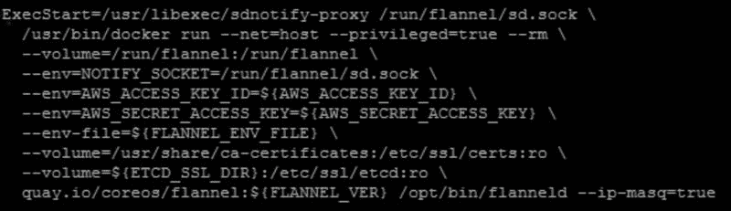
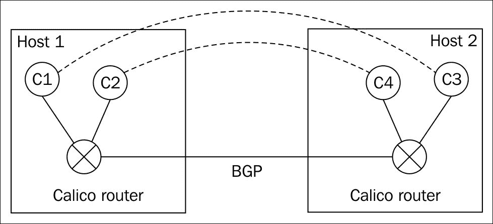
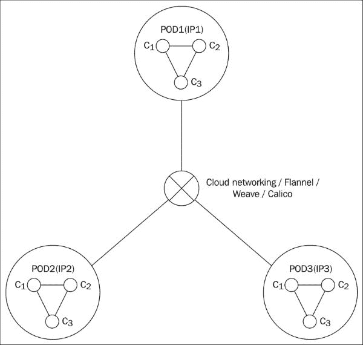

# 第六章

第五章 CoreOS 网络和 Flannel 内部结构

微服务增加了对大量容器以及容器跨主机互联的需求。为了实现这一目标，必须有一个健壮的容器网络方案。本章将介绍容器网络的基础知识，重点讨论 CoreOS 如何通过 Flannel 实现容器网络。还将涵盖 Docker 网络和其他相关的容器网络技术。本章将包括以下主题：

+   容器网络基础

+   Flannel 内部结构

+   使用 Vagrant、AWS 和 GCE 搭建的 CoreOS Flannel 集群

+   Docker 网络和实验性 Docker 网络

+   使用 Weave 和 Calico 进行 Docker 网络连接

+   Kubernetes 网络

容器网络基础

以下是我们需要容器网络的原因：

+   容器需要与外部世界进行通信。

+   容器应该可以从外部世界访问，以便外部世界可以使用容器提供的服务。

+   容器需要与主机进行通信。例如，可以共享卷。

+   同一主机和不同主机之间应具有容器互联。例如，一个主机中的 WordPress 容器与另一个主机中的 MySQL 容器进行通信。

目前有多种解决方案可以实现容器之间的互联。这些解决方案相对较新，且正在积极开发中。在 Docker 1.8 版本之前，Docker 并没有提供原生的跨主机容器互联方案。Docker 1.9 版本引入了一种基于 Libnetwork 的方案，用于实现跨主机容器互联以及服务发现。CoreOS 在 CoreOS 集群中使用 Flannel 进行容器网络连接。还有一些项目，如 Weave 和 Calico，正在开发容器网络解决方案，计划成为任何容器运行时（如 Docker 或 Rkt）的网络容器插件。

Flannel

Flannel 是一个开源项目，提供 CoreOS 集群的容器网络解决方案。Flannel 也可以用于非 CoreOS 集群。Kubernetes 使用 Flannel 设置 Kubernetes pod 之间的网络连接。Flannel 为每个运行容器的主机分配一个独立的子网，并从该主机的子网中为容器分配一个独立的 IP 地址。在每个主机之间建立一个覆盖网络，使得不同主机上的容器可以互相通信。在第一章 CoreOS 概述中，我们提供了 Flannel 控制路径和数据路径的概述。本节将深入探讨 Flannel 的内部结构。

手动安装

Flannel 可以通过手动安装或使用 `systemd` 单元 `flanneld.service` 来安装。以下命令将在 CoreOS 节点上使用容器构建 Flannel 二进制文件。执行完以下命令后，Flannel 的 flanneld 二进制文件将在 `/home/core/flannel/bin` 中可用：

`git clone https://github.com/coreos/flannel.git``docker run -v /home/core/flannel:/opt/flannel -i -t google/golang /bin/bash -c "cd /opt/flannel && ./build"`

以下是我们在 CoreOS 节点中构建 flannel 后获得的 Flannel 版本：

使用 flanneld.service 进行安装

Flannel 在 CoreOS 中默认没有安装。这样做是为了保持 CoreOS 镜像的最小化。Docker 需要 flannel 来配置网络，而 flannel 需要 Docker 来下载 flannel 容器。为了避免这种“先有鸡还是先有蛋”的问题，CoreOS 中默认启动了`early-docker.service`，其主要目的是下载并启动 flannel 容器。一个常规的`docker.service`则启动 Docker 守护进程并使用 flannel 网络。

下图展示了`flanneld.service`中的序列，其中早期的 Docker 守护进程启动了 flannel 容器，进而启动了`docker.service`，并使用 flannel 创建的子网：

以下是`flanneld.service`的相关部分，它从 Quay 仓库下载 flannel 容器：

以下输出显示了早期 docker 运行的容器。Early-docker 只管理 Flannel：

以下是`flanneld.service`的相关部分，它更新了 Docker 选项以使用 flannel 创建的子网：

以下是`flannel_docker_opts.env`的内容——在我的案例中——flannel 启动后的内容。地址`10.1.60.1/24`是这个 CoreOS 节点为其容器选择的：

Docker 将作为`docker.service`的一部分启动，如下图所示，并使用上述环境文件：

控制路径

Flannel 中没有中央控制器，它使用 etcd 进行节点间的通信。CoreOS 集群中的每个节点都运行一个 flannel 代理，它们通过 etcd 进行相互通信。

作为启动 Flannel 服务的一部分，我们指定了可以由网络中各个节点使用的 Flannel 子网。这个子网注册在 etcd 中，确保集群中的每个 CoreOS 节点都能看到它。网络中的每个节点选择一个特定的子网范围，并通过 etcd 原子地进行注册。

以下是`cloud-config`的相关部分，它启动了`flanneld.service`并指定了 Flannel 的配置。在这里，我们指定了用于 flannel 的子网为`10.1.0.0/16`，并将封装类型指定为`vxlan`：

上述配置将在节点中创建以下 etcd 键。它显示了`10.1.0.0/16`已分配给 flannel，供 CoreOS 集群使用，并且封装类型为`vxlan`：

一旦每个节点获取了子网，该节点中启动的容器将从分配给该节点的 IP 地址池中获取 IP 地址。以下是每个节点的 etcd 子网分配情况。如我们所见，所有子网都位于之前与 etcd 配置的`10.1.0.0/16`范围内，且使用了 24 位掩码。每个主机的子网长度也可以作为 Flannel 配置选项进行控制：

我们来看一下在此节点中创建的 Flannel 接口的`ifconfig`。该 IP 地址属于`10.1.0.0/16`地址范围：

数据路径

Flannel 使用 Linux 桥接来封装使用 Flannel 配置中指定的覆盖协议的数据包。这使得同一主机内的容器之间以及跨主机的容器之间能够实现连通性。

以下是当前 Flannel 支持的主要后端，并在 JSON 配置文件中指定。JSON 配置文件可以在`cloud-config`的 Flannel 部分中指定：

+   UDP：在 UDP 封装中，来自容器的数据包会被封装到 UDP 中，默认端口号为`8285`。如果需要，我们可以更改端口号。

+   VXLAN：从封装开销的角度来看，VXLAN 相对于 UDP 更高效。默认情况下，端口`8472`用于 VXLAN 封装。如果我们希望使用 IANA 分配的 VXLAN 端口，则需要将端口字段指定为`4789`。

+   AWS-VPC：适用于在 AWS VPC 云中使用 Flannel 的情况。与使用覆盖网络封装数据包不同，这种方法通过使用 VPC 路由表来跨容器进行通信。AWS 限制每个 VPC 路由表条目的数量为 50，因此在较大的集群中可能会出现问题。

以下是指定 Flannel 配置中 AWS 类型的示例：

+   GCE：适用于在 GCE 云中使用 Flannel 的情况。与使用覆盖网络封装数据包不同，这种方法通过使用 GCE 路由表来跨容器进行通信。GCE 限制每个 VPC 路由表条目的数量为`100`，因此在较大的集群中可能会出现问题。

以下是指定 Flannel 配置中 GCE 类型的示例：

我们在两台不同主机中创建容器，并使用 VXLAN 封装，检查连通性是否正常。以下示例使用启用了 Flannel 服务的 Vagrant CoreOS 集群。

Host1 中的配置：

我们来启动一个`busybox`容器：

我们来检查分配给容器的 IP 地址。该 IP 地址来自 Flannel 代理为此 CoreOS 节点分配的 IP 池。`10.1.19.0/24`分配给了`host1`，这个容器获得了`10.1.19.2`地址：

Host2 中的配置：

我们来启动一个`busybox`容器：

让我们检查一下分配给该容器的 IP 地址。这个 IP 地址来自 Flannel 代理为此 CoreOS 节点分配的 IP 池。`10.1.1.0/24`被分配给了`host2`，而这个容器获得了`10.1.1.2`的地址：

以下输出显示容器 1 和容器 2 之间的 ping 操作成功。这个 ping 包通过两个 CoreOS 节点传输，并使用 VXLAN 进行封装：

Flannel 作为 CNI 插件

如第一章《CoreOS 概述》所述，APPC 定义了一个容器规范，任何容器运行时都可以使用该规范。对于容器网络，APPC 定义了容器网络接口（CNI）规范。通过 CNI，容器网络功能可以作为插件实现。CNI 期望插件支持带有一组参数的 API，具体实现则交由插件完成。插件实现的 API 包括将容器添加到网络中和从网络中移除容器，且有一个定义好的参数列表。

这允许不同供应商实现网络插件，并且可以在不同的容器运行时之间重用插件。下图显示了 RKT 容器运行时、CNI 层和像 Flannel 这样的插件之间的关系。IPAM 插件用于为容器分配 IP 地址，这个功能被嵌套在初始网络插件中：

使用 Flannel 和 Docker 设置一个三节点 Vagrant CoreOS 集群

以下示例设置了一个三节点的 Vagrant CoreOS 集群，默认启用了`etcd`、`fleet`和`flannel`服务。在这个示例中，使用`vxlan`进行封装。以下是用于此配置的`cloud-config`：

`#cloud-config coreos:   etcd2:     discovery: <update this>     advertise-client-urls: http://$public_ipv4:2379     initial-advertise-peer-urls: http://$private_ipv4:2380     listen-client-urls: http://0.0.0.0:2379,http://0.0.0.0:4001     listen-peer-urls: http://$private_ipv4:2380,http://$private_ipv4:7001   fleet:     public-ip: $public_ipv4   flannel:     interface: $public_ipv4   units:     - name: etcd2.service       command: start     - name: fleet.service       command: start     - name: flanneld.service       drop-ins:         - name: 50-network-config.conf           content: |             [Service]             ExecStartPre=/usr/bin/etcdctl set /coreos.com/network/config '{ "Network": "10.1.0.0/16", "Backend": {"Type": "vxlan"}}'       command: start`

以下是此操作的步骤：

1.  克隆 CoreOS Vagrant 仓库。

1.  在`config.rb`中将实例数量更改为三个。

1.  在`cloud-config`用户数据中更新发现令牌。

1.  执行`vagrant up`来启动集群。

有关步骤的更多详细信息，请参考第二章，设置 CoreOS 实验室。我们可以通过在两个主机中启动`busybox`容器并检查容器间 ping 是否正常来测试容器的连接性。

使用 Flannel 和 RKT 设置三节点 CoreOS 集群

在这里，我们将使用 Flannel CNI 网络插件设置一个包含 RKT 容器的三节点 CoreOS 集群，以设置网络。这将允许跨主机的 RKT 容器彼此通信。

以下是使用的`cloud-config`：

`#cloud-config coreos:   etcd2:     discovery: <update token>     advertise-client-urls: http://$public_ipv4:2379     initial-advertise-peer-urls: http://$private_ipv4:2380     listen-client-urls: http://0.0.0.0:2379,http://0.0.0.0:4001     listen-peer-urls: http://$private_ipv4:2380,http://$private_ipv4:7001   fleet:     public-ip: $public_ipv4   flannel:     interface: $public_ipv4   units:     - name: etcd2.service       command: start     - name: fleet.service       command: start     - name: flanneld.service       drop-ins:         - name: 50-network-config.conf           content: |             [Service]             ExecStartPre=/usr/bin/etcdctl set /coreos.com/network/config '{ "network": "10.1.0.0/16" }'       command: start # Rkt 配置 write_files:   - path: "/etc/rkt/net.d/10-containernet.conf"     permissions: "0644"     owner: "root"     content: |       {         "name": "containernet",         "type": "flannel"       }`

`/etc/rkt/net.d/10-containernet.conf`文件将 CNI 插件类型设置为 Flannel，RKT 容器使用此插件。

以下是具体步骤：

1.  克隆 CoreOS Vagrant 仓库。

1.  在`config.rb`中将实例数更改为三。

1.  更新`cloud-config`用户数据中的发现令牌。

1.  执行`vagrant up`以启动集群。

让我们在`node1`中启动一个`busybox`容器：

`busybox node1`中的`ifconfig`输出如下：

在`node2`中启动一个`busybox`容器：

`busybox node2`中的`ifconfig`输出如下：

以下截图显示了跨容器的成功 ping 输出：

注意

注意：不应在 RKT 容器中启动`Docker.service`，因为 Docker 桥接使用的地址与 Flannel 分配给 Docker 容器通信的地址相同。目前正在积极研究支持在 Flannel 上同时运行 Docker 和 RKT 容器。有关此主题的讨论，可以参考[`groups.google.com/forum/#!topic/coreos-user/Kl7ejtcRxbc`](https://groups.google.com/forum/#!topic/coreos-user/Kl7ejtcRxbc)。

使用 Flannel 的 AWS 集群

Flannel 可以用来在 AWS 云中的 CoreOS 节点之间提供容器网络连接。在以下两个示例中，我们将使用 Flannel 创建一个三节点 CoreOS 集群，分别使用 VXLAN 和 AWS VPC 网络。此示例基于[`coreos.com/blog/introducing-flannel-0.5.0-with-aws-and-gce/`](https://coreos.com/blog/introducing-flannel-0.5.0-with-aws-and-gce/)中描述的过程。

使用 VXLAN 网络的 AWS 集群

以下是实现此目标的前提条件：

1.  从发现令牌服务为三节点集群创建一个令牌。

1.  设置一个安全组，暴露`ssh`、`icmp`、`2379`、`2380`和`8472`端口。`8472`用于 VXLAN 封装。

1.  根据您的 AWS 区域，使用此链接（[`coreos.com/os/docs/latest/booting-on-ec2.html`](https://coreos.com/os/docs/latest/booting-on-ec2.html)）来确定 AMI 镜像 ID，并根据您的 AWS 区域和更新频道更新该链接。在以下示例中，我们将使用 ami-150c1425，它是最新的 815 alpha 镜像。

创建`cloud-config-flannel-vxlan.yaml`，其内容与前一节中为 Vagrant CoreOS 集群与 Flannel 和 Docker 所使用的内容相同。

使用以下 AWS CLI 启动三节点集群：

`aws ec2 run-instances --image-id ami-85ada4b5 --count 3 --instance-type t2.micro --key-name "yourkey" --security-groups "coreos" --user-data`

我们可以使用两个`busybox`容器在两个 CoreOS 节点上测试容器之间的连接性，如前面部分所述。

使用 AWS-VPC 的 AWS 集群

AWS VPC 为您提供了为在 AWS 中创建的实例创建自定义网络的选项。通过 AWS VPC，我们可以创建子网和路由表，并为实例配置自定义 IP 地址。

Flannel 支持`aws-vpc`封装类型。在使用此选项时，Flannel 会更新 VPC 路由表，通过为每个 VPC 创建一个基于分配给各个节点的容器 IP 地址的自定义路由表，在实例之间进行路由。从数据路径角度来看，不使用像 UDP 或 VXLAN 这样的封装方式。相反，AWS VPC 会根据 Flannel 配置的路由表，负责将数据包路由到适当的实例。

以下是创建集群的步骤：

1.  为三节点集群创建一个发现令牌。

1.  设置一个安全组，暴露`ssh`、`icmp`、`2379`和`2380`端口。

1.  使用此链接来确定 AMI 镜像 ID（[`coreos.com/os/docs/latest/booting-on-ec2.html`](https://coreos.com/os/docs/latest/booting-on-ec2.html)）。在以下示例中，我们将使用`ami-150c1425`，它是最新的 815 alpha 镜像。

1.  使用 VPC 向导创建一个 VPC，带有一个公共子网。以下图表显示了通过 AWS 控制台创建的 VPC：

    

1.  从 AWS 控制台创建一个 IAM 策略`demo-policy`。此策略允许实例修改路由表：

    `{     "Version": "2012-10-17",     "Statement": [     {             "Effect": "Allow",             "Action": [                 "ec2:CreateRoute",                 "ec2:DeleteRoute",                 "ec2:ReplaceRoute"             ],             "Resource": [                 "*"             ]     },     {             "Effect": "Allow",             "Action": [                 "ec2:DescribeRouteTables",                 "ec2:DescribeInstances"             ],             "Resource": "*"     }     ] }`

1.  创建一个 IAM 角色 `demo-role`，并将前面代码中创建的 `demo-policy` 与该角色关联。

1.  创建 `cloud-config-flannel-aws.yaml` 文件，内容如下。我们将使用类型 `aws-vpc`，如下面的代码所示：

    `Cloud-config-flannel-aws.yaml: #cloud-config coreos:   etcd2:     discovery: <your token>     advertise-client-urls: http://$private_ipv4:2379,http://$private_ipv4:4001     initial-advertise-peer-urls: http://$private_ipv4:2380     listen-client-urls: http://0.0.0.0:2379,http://0.0.0.0:4001     listen-peer-urls: http://$private_ipv4:2380   units:     - name: etcd2.service       command: start     - name: fleet.service       command: start     - name: flanneld.service       drop-ins:         - name: 50-network-config.conf           content: |             [Service]             ExecStartPre=/usr/bin/etcdctl set /coreos.com/network/config '{ "Network": "10.1.0.0/16" , "Backend": {"Type": "aws-vpc"}}'       command: start`

创建一个三节点的 CoreOS 集群，并且配置一个安全组、IAM 角色、`vpcid/subnetid`、`安全组` 和 `cloud-config` 文件，如下所示：

`aws ec2 run-instances --image-id ami-150c1425 --subnet subnet-a58fc5c0 --associate-public-ip-address --iam-instance-profile Name=demo-role --count 3 --security-group-ids sg-f22cb296 --instance-type t2.micro --key-name "smakam-oregon" --user-data file://cloud-config-flannel-aws.yaml`

注意

注意：为了允许来自容器的流量（因为容器的 IP 地址由 Flannel 分配，而不是 AWS 分配），需要禁用源和目标检查。为此，您需要进入 AWS 控制台中的每个实例，选择网络 | 更改源/目标检查 | 禁用。

查看其中一个 CoreOS 节点上的 `etcdctl` 输出，我们可以看到分配给三节点集群中每个节点的子网。

Flannel 会自动更新 VPC 路由表，根据子网所在的实例 ID 路由前述子网。如果检查 VPC 路由表，可以看到以下路由，它们与 Flannel 创建的网络相匹配：

此时，我们可以使用前面章节中指定的两个 CoreOS 节点中的两个 `busybox` 容器来测试容器间的连接性。

使用 Flannel 的 GCE 集群

Flannel 可用于在 GCE 云中的 CoreOS 节点之间提供容器网络。在以下两个示例中，我们将使用 Flannel 和 VXLAN，以及 Flannel 和 GCE 网络创建一个三节点 CoreOS 集群。这些示例基于 [`coreos.com/blog/introducing-flannel-0.5.0-with-aws-and-gce/`](https://coreos.com/blog/introducing-flannel-0.5.0-with-aws-and-gce/) 中描述的过程。

使用 VXLAN 网络的 GCE 集群

以下是此操作的前提条件：

1.  从发现令牌服务创建三节点集群的令牌。

1.  设置一个安全组，暴露 `ssh`、`icmp`、`2379`、`2380` 和 `8472` 端口。`8472` 用于 VXLAN 封装。

1.  使用以下链接来确定 AMI 镜像 ID ([`coreos.com/os/docs/latest/booting-on-google-compute-engine.html`](https://coreos.com/os/docs/latest/booting-on-google-compute-engine.html))。我们将在以下示例中使用 alpha 镜像 815。

创建 `cloud-config-flannel-vxlan.yaml` 文件，内容与前一部分中指定的 Vagrant CoreOS 集群的 Flannel 和 Docker 配置相同。

以下命令可用于在 GCE 中设置一个包含 Flannel 和 VXLAN 封装的三节点 CoreOS 集群：

`gcloud compute instances create core1 core2 core3 --image https://www.googleapis.com/compute/v1/projects/coreos-cloud/global/images/coreos-alpha-815-0-0-v20150924 --zone us-central1-a --machine-type n1-standard-1 --tags coreos --metadata-from-file user-data=cloud-config-flannel-vxlan.yaml`

可以通过在不同主机的容器之间进行 ping 测试来验证 Flannel 的控制和数据路径是否正常工作。

使用 GCE 网络的 GCE 集群

类似于 AWS VPC，Google 云也有其云网络服务，提供创建自定义子网、路由和 IP 地址的能力。

以下是使用 Flannel 和 GCE 网络创建三节点 CoreOS 集群的步骤：

1.  从发现令牌服务创建三节点集群的令牌。

1.  创建一个自定义网络 `customnet`，并设置防火墙规则，允许 TCP 端口 `2379` 和 `2380`。以下是我创建的自定义网络，子网为 `10.10.0.0/16`：

    

1.  创建 `cloud-config-flannel-gce.yaml` 文件，内容如下。将 Flannel 类型设置为 `gce`：

    `#cloud-config coreos:   etcd2:     discovery: <yourtoken>     advertise-client-urls: http://$private_ipv4:2379,http://$private_ipv4:4001     initial-advertise-peer-urls: http://$private_ipv4:2380     listen-client-urls: http://0.0.0.0:2379,http://0.0.0.0:4001     listen-peer-urls: http://$private_ipv4:2380   units:     - name: etcd2.service       command: start     - name: fleet.service       command: start     - name: flanneld.service       drop-ins:         - name: 50-network-config.conf           content: |             [Service]             ExecStartPre=/usr/bin/etcdctl set /coreos.com/network/config '{ "Network": "10.1.0.0/16" , "Backend": {"Type": "gce"}}'       command: start`

1.  创建三个 CoreOS 实例，使用 `customnet` 网络，启用 IP 转发，并为实例分配修改路由表的权限：

    `gcloud compute instances create core1 core2 core3 --image https://www.googleapis.com/compute/v1/projects/coreos-cloud/global/images/coreos-alpha-815-0-0-v20150924 --zone us-central1-a --machine-type n1-standard-1 --network customnet --can-ip-forward --scopes compute-rw --metadata-from-file user-data=cloud-config-flannel-gce.yaml`

以下是每个节点为容器创建的 Flannel 网络：

让我们来看看 GCE 中的路由表。如以下输出所示，Flannel 已经更新了 GCE 的容器网络路由表：

到此为止，我们应该已经能够跨节点连接容器。

实验性多租户网络

默认情况下，Flannel 创建一个单一的网络，所有节点都可以在该网络上相互通信。当有多个租户使用相同的网络时，这会带来安全风险。一种实现多租户网络的方式是使用多个 Flannel 实例来管理每个租户。这可能会变得难以配置。从版本 0.5.3 开始，Flannel 在实验模式下引入了多网络功能，在这种模式下，单个 Flannel 守护进程可以管理具有隔离性的多个网络。当集群中有多个租户时，使用多网络模式有助于隔离每个租户的流量。

以下是执行此操作的步骤：

1.  为多个租户创建子网配置。可以通过在 `etcd` 中预留一个子网池来实现。以下示例设置了三个网络：`blue`、`green` 和 `red`，每个网络都有不同的子网：

    `etcdctl set /coreos.com/network/blue/config  '{ "Network": "10.1.0.0/16", "Backend": { "Type": "vxlan", "VNI": 1 } }'``etcdctl set /coreos.com/network/green/config '{ "Network": "10.2.0.0/16", "Backend": { "Type": "vxlan", "VNI": 2 } }'``etcdctl set /coreos.com/network/red/config   '{ "Network": "10.3.0.0/16", "Backend": { "Type": "vxlan", "VNI": 3 } }'`

1.  启动 Flannel 代理并指定该 Flannel 代理需要加入的网络。这样可以为每个节点每个网络预留 IP 池。在这个例子中，我们已经启动了 flannel 代理，并使其成为所有三个网络（`blue`、`green` 和 `red`）的一部分：

    `sudo flanneld --networks=blue,green,red &`

Flannel 为这三个网络选择了三个子网范围，如下图所示。`10.1.87.0/24`分配给`blue`网络，`10.2.4.0/24`分配给`green`网络，`10.3.93.0/24`分配给`red`网络：

在`/run/flannel`下可以看到多个网络，如下所示：

现在，我们可以启动带有适当租户网络的 Docker 或 Rkt 容器。此时，`flanneld.service`与多网络的自动集成尚未完成；这需要手动完成。

以下链接是关于此话题的相关 Google 讨论：

[`groups.google.com/forum/#!topic/coreos-user/EIF-yGNWkL4`](https://groups.google.com/forum/#!topic/coreos-user/EIF-yGNWkL4)

实验性客户端-服务器网络

在默认的 Flannel 模式下，每个节点都有一个 flannel 代理，并且后端数据保存在`etcd`中。这样 Flannel 保持无状态。在这种模式下，每个 Flannel 节点都需要运行`etcd`。Flannel 客户端-服务器模式在以下场景中非常有用：

+   只有主节点运行`etcd`，工作节点无需运行`etcd`。从性能和安全的角度来看，这一点非常有用。

+   当使用其他后端（如 AWS）与 flannel 一起时，必须存储 AWS 密钥，并且在使用客户端-服务器模型时，密钥只需要在主节点中存在；从安全角度来看，这一点非常重要。

Flannel 客户端-服务器功能目前在 Flannel 版本 0.5.3 中处于实验模式。

下图描述了 Flannel 客户端-服务器网络中的不同组件之间的互联：

如果需要，我们可以使用安全的（HTTPS）通信方式，既可以从 flanneld 服务器到 etcd，也可以在 flanneld 客户端和服务器之间进行通信。

设置客户端-服务器 Flannel 网络

让我们从一个没有在任何节点上运行 Flannel 的三节点 CoreOS 集群开始。在`node1`上启动`flanneld`服务器和客户端，在`node2`和`node3`上启动客户端。

按照以下截图启动 flannel 服务器：

按照以下截图启动 flannel 客户端：

必须指定`eth1`作为参数接口，因为`eth0`用作 NAT 接口，并且在所有节点中都相同，而`eth1`在各节点之间是唯一的：

在`node2`和`node3`中启动客户端后，让我们查看`node1`中`etcd`的输出，显示了三个 CoreOS 节点获取的三个子网：

要手动启动`docker.service`，我们首先需要创建`flannel_docker_opts.env`，如下所示：

`/usr/bin/docker run --net=host --rm -v /run:/run \``  quay.io/coreos/flannel:0.5.3  \``  /opt/bin/mk-docker-opts.sh -d /run/flannel_docker_opts.env –i`

以下是创建的`flannel_docker_opts.env`文件：

现在，我们可以启动`docker.service`，它使用`flannel_docker_opts.env`中的环境变量。

启动`docker.service`：

`sudo systemctl start docker.service`

如我们所见，docker 桥接获取了分配给此节点的 IP 地址范围：

此功能目前处于实验阶段。未来计划添加服务器故障转移功能。

Docker 网络

以下是用于在单个主机上互联容器的 Docker 网络模型：

每个容器都位于其自己的网络命名空间中，并通过主机上的 Linux 桥接与其他容器通信。有关 Docker 网络选项的更多详细信息，可以参见 [`docs.docker.com/engine/userguide/networking/dockernetworks/`](https://docs.docker.com/engine/userguide/networking/dockernetworks/)。以下是 Docker 1.9 版本提供的网络选项：

+   `--net=bridge`：这是 Docker 提供的默认选项，容器通过 veth 对接到 Linux `docker` 桥接。

+   `--net=host`：在此选项中，不会为容器创建新的网络命名空间，容器与主机共享相同的网络命名空间。

+   `--net= (容器名称或 ID)`：在此选项中，新容器与在`net`选项中指定的容器共享相同的网络命名空间。（例如：`sudo docker run -ti –name=ubuntu2 –net=container:ubuntu1 ubuntu:14.04 /bin/bash`。这里，`ubuntu2`容器与`ubuntu1`容器共享相同的网络命名空间。）

+   `--net=none`：在此选项中，容器不会分配新的网络命名空间。此时仅会创建回环接口。此选项适用于我们希望为容器创建自定义网络选项或不需要连接的场景。

+   `--net=overlay`：此选项在 Docker 1.9 版本中添加，用于支持覆盖网络，使得跨主机的容器能够相互通信。

Docker 实验性网络

从 Docker 1.8 版本开始，Docker 没有本地解决方案来连接跨主机的容器。通过 Docker 实验性版本，我们可以使用 Docker 本地解决方案以及外部网络插件来连接跨主机的容器。

以下图示说明此情况：

以下是关于 Docker libnetwork 解决方案的一些说明：

+   以前，Docker 运行时与网络模块集成，没有办法将它们分离。Libnetwork 是新的网络库，提供网络功能，并与 Core Docker 分离。Docker 1.7 版本已经包含了 libnetwork，并且从终端用户的角度来看是向后兼容的。

+   驱动程序实现了 libnetwork 提供的 API。Docker 正在倾向于为网络、存储和编排等主要功能采用插件方法，Docker 提供的原生解决方案可以被其他供应商的技术替代，只要它们实现了通用库提供的 API。在这种情况下，Bridge 和 Overlay 是 Docker 的原生网络驱动程序，而远程驱动程序可以由第三方实现。现在已经有很多远程驱动程序可用，如 Weave 和 Calico。

Docker 实验性网络有以下概念：

+   Docker 容器通过端点或服务连接到网络。

+   多个端点共享同一网络。换句话说，只有位于同一网络中的端点才能相互通信。

+   在创建网络时，可以指定网络驱动程序。这可以是 Docker 提供的驱动程序，如 Overlay，或者是外部驱动程序，如 Weave 和 Calico。

+   Libnetwork 提供服务发现，容器可以发现同一网络中的其他端点。未来有计划将服务发现做成插件。服务之间可以通过服务名称而非 IP 地址进行通信。目前，Consul 用于服务发现；这可能以后会有所变化。

+   使用共享存储，如`etcd`或`consul`，来确定属于同一集群的节点。

一个多网络用例

随着最新的 Docker 网络增强，容器可以是多个网络的一部分，只有在同一网络中的容器才能相互通信。为了说明这些概念，我们来看以下示例：

1.  在后端网络`be`中设置两个 nginx 容器和一个 HAProxy 容器。

1.  同样将 HAProxy 容器添加到前端网络`fe`中。

1.  使用位于前端网络`fe`中的 busybox 容器连接到 HAProxy 容器。由于 busybox 容器位于`fe`网络中，而 nginx 容器位于`be`网络中，因此它们无法直接相互通信。

1.  HAProxy 容器将在两个 nginx 后端容器之间进行 Web 连接的负载均衡。

以下是命令详情：

创建`fe`和`be`网络：

`docker network create be` `docker network create fe`

在`be`网络中创建两个 nginx 容器：

`docker run --name nginx1 --net be -v ~/haproxy/nginx1.html:/usr/share/nginx/html/index.html -d nginx` `docker run --name nginx2 --net be -v ~/haproxy/nginx2.html:/usr/share/nginx/html/index.html -d nginx`

在`be`网络中创建`haproxy`：

`docker run -d --name haproxy --net be -v ~/haproxy/haproxy.cfg:/usr/local/etc/haproxy/haproxy.cfg haproxy`

将 `haproxy` 附加到 `fe` 网络：

`docker network connect fe haproxy`

在 `fe` 网络中创建一个 busybox 容器，访问 `haproxy` 网页：

`docker run -it --rm --net fe busybox wget -qO- haproxy/index.html`

如果我们多次尝试运行 busybox 容器，它将在 `nginx1` 和 `nginx2` 网页服务器输出之间切换。

Docker 覆盖驱动程序

以下示例展示了如何使用 Docker 的实验性覆盖驱动程序实现多主机容器连接。我在以下示例中使用的是 Ubuntu 虚拟机，而不是 CoreOS，因为实验性的 Docker 覆盖驱动程序需要一个新的内核版本，而该版本在 CoreOS 中尚未提供。

以下图示展示了此示例中正在尝试的用例：

以下是步骤的总结：

+   创建两台安装了实验性 Docker 的主机。

+   在两台主机上安装 Consul，其中一台主机充当 consul 服务器。Consul 用于存储用于容器间通信的共享数据。

+   在两个主机上启动 Docker，并使用 Consul 作为密钥存储机制。

+   在两个主机上创建具有不同端点的容器，这些容器共享相同的网络。

第一步是创建两台安装了实验性 Docker 的主机。

以下一组命令使用 docker-machine 创建两台 Docker 主机。我们使用了带有自定义 ISO 镜像的 docker-machine 来安装实验性的 Docker：

`docker-machine create -d virtualbox --virtualbox-boot2docker-url=http://sirile.github.io/files/boot2docker-1.9.iso dev1``docker-machine create -d virtualbox --virtualbox-boot2docker-url=http://sirile.github.io/files/boot2docker-1.9.iso dev2`

在两个节点上安装 Consul。以下命令展示了如何下载并安装 Consul：

`curl -OL https://dl.bintray.com/mitchellh/consul/0.5.2_linux_amd64.zip``unzip 0.5.2_linux_amd64.zip``sudo mv consul /usr/local/bin/`

在 `node1` 上启动 consul 服务器并启动使用 consul 密钥存储的 Docker 守护进程：

以下一组命令在 `node1` 上启动 consul 服务器并使用 consul 代理启动 Docker 守护进程：

`Docker-machine ssh dev1``consul agent -server -bootstrap -data-dir /tmp/consul -bind=192.168.99.100 &``sudo docker -d --kv-store=consul:localhost:8500 --label=com.docker.network.driver.overlay.bind_interface=eth1`

在 `node2` 上启动 consul 代理和使用 consul 密钥存储的 Docker 守护进程：

以下一组命令启动在 `node2` 上运行的 consul 代理和 Docker 守护进程：

`Docker-machine ssh dev2``consul agent -data-dir /tmp/consul -bind 192.168.99.101 &``consul join 192.168.99.100 &``sudo docker -d --kv-store=consul:localhost:8500 --label=com.docker.network.driver.overlay.bind_interface=eth1 --label=com.docker.network.driver.overlay.neighbor_ip=192.168.99.100`

在 `node1` 上启动带有 `svc1` 服务、`dev` 网络和 `overlay` 驱动程序的容器：

`docker run -i -t --publish-service=svc1.dev.overlay busybox`

在`node2`上使用`svc2`服务、`dev`网络和`overlay`驱动启动容器：

`docker run -i -t --publish-service=svc2.dev.overlay busybox`

如我们所见，我们能够成功从`node1`ping 到`svc1`和`svc2`：

注意

注意：overlay 驱动需要 Linux 内核版本为 3.16 或更高。

外部网络 Calico 插件

在这个示例中，我们将演示如何使用 Calico 作为 Docker libnetwork 的插件进行容器网络设置。最初，支持该功能的是实验性网络，后来在 Docker 1.9 版本中发布。有关 Calico 网络方法的更多细节，请参阅以下 Calico 网络部分。本示例基于[`github.com/projectcalico/calico-containers/blob/master/docs/calico-with-docker/docker-network-plugin/README.md`](https://github.com/projectcalico/calico-containers/blob/master/docs/calico-with-docker/docker-network-plugin/README.md)。要为 Calico 设置 CoreOS Vagrant 集群，我们可以参考[`github.com/projectcalico/calico-containers/blob/master/docs/calico-with-docker/VagrantCoreOS.md`](https://github.com/projectcalico/calico-containers/blob/master/docs/calico-with-docker/VagrantCoreOS.md)中的过程。

在设置 Vagrant CoreOS 集群后，我们可以看到 CoreOS 集群的两个节点。我们应该确保`etcd`成功运行，如下所示：

以下是使 Calico 与 Docker 作为网络插件工作的步骤：

在两个节点上使用 libnetwork 选项启动 Calico：

`sudo calicoctl node --libnetwork`

我们应该在两个节点上看到以下 Docker 容器：

使用 Calico 驱动创建`net1`网络：

`docker network create --driver=calico --subnet=192.168.0.0/24 net1`

这会被复制到集群中的所有节点。以下是`node2`中的网络列表：

+   在`node1`上使用`net1`网络创建容器 1：

    `docker run --net net1 --name workload-A -tid busybox`

+   在`node2`上使用`net1`网络创建容器 2：

    `docker run --net net1 --name workload-B -tid busybox`

现在，我们可以按以下方式 ping 这两个容器：

Docker 1.9 更新

Docker 1.9 版本在 2015 年 10 月底发布，标志着实验性网络进入生产环境。在本章中，使用 Docker 1.8 实验性网络版本进行的 Docker 网络示例可能需要进行小幅修改。

随着 Docker 1.9 的发布，多主机网络已集成到 Docker Swarm 和 Compose 中。这使我们能够通过单个命令编排跨多个主机的多容器应用程序，且多主机容器网络将自动处理。

其他容器网络技术

Weave 和 Calico 是开源项目，它们为 Docker 开发容器网络技术。Kubernetes 是一个容器编排开源项目，具有特定的容器网络需求和实现。还有其他项目，如面向容器网络的 Cisco Contiv（[`github.com/contiv/netplugin`](https://github.com/contiv/netplugin)）。像 Weave、Calico 和 Contiv 这样的容器技术，未来计划与 Rkt 容器运行时集成。

Weave 网络

Weaveworks 开发了一种提供容器网络的解决方案。以下是他们解决方案的一些细节：

+   Weave 在主机上创建 Weave 桥接和 Weave 路由器。

+   Weave 路由器通过主机与其他 Weave 路由器之间建立 TCP 和 UDP 连接。TCP 连接用于发现和协议相关的交换，UDP 用于数据封装。必要时可以进行加密。

+   Weave 桥接配置为嗅探需要跨主机发送并重定向到 Weave 路由器的包。对于本地交换，不使用 Weave 路由器。

+   Weave 的 Weavenet 产品为你提供容器连接。它们还提供 Weavescope，提供容器可视化，和 Weaverun，提供服务发现和负载均衡。

+   Weave 也可以作为 Docker 插件，与 Docker 1.9 版本集成。

下图展示了来自 Weave 的解决方案：

在 CoreOS 上运行 Weave 时，我使用了来自[`github.com/lukebond/coreos-vagrant-weave`](https://github.com/lukebond/coreos-vagrant-weave)的 cloud-config。在以下示例中，我们将在两个 CoreOS 节点中创建容器，并使用 Weave 进行互相通信。在此示例中，我们没有使用 Docker Weave 插件，而是通过环境变量来实现 Docker 和 Weave 之间的通信。

以下是创建 Weave 集群的步骤：

1.  克隆仓库（`git clone https://github.com/lukebond/coreos-vagrant-weave.git`）。

1.  将`config.rb`中的实例数量更改为`3`。

1.  获取一个新的发现令牌，节点数量为 3，并将其更新到用户数据中。

1.  执行`vagrant up`来启动集群。

`cloud-config`文件负责在每个节点上下载 Weave 代理并启动它们。

服务文件的以下部分下载 Weave 容器：

服务文件的以下部分启动 Weave 容器：

在每个节点上，我们可以看到启动的 Weave 容器：

在启动应用程序容器之前，我们需要设置环境变量，以便 Weave 可以拦截 Docker 命令并创建自己的网络。作为`Weave.service`启动的一部分，环境变量已经设置好。以下命令显示了节点中的设置：

如下所示，配置 Weave 环境：

让我们在两个 CoreOS 节点中启动 busybox 容器：

让我们看看在 CoreOS 节点 1 的 busybox 容器中创建的 Weave 接口：

让我们看看在 CoreOS 节点 2 的 busybox 容器中创建的 Weave 接口：

现在，我们可以在两个容器之间成功地进行 ping 操作。作为 Docker 1.9 的一部分，Weave 作为 Docker 网络插件可用，这使得配置变得更加简便。

Calico 网络

Calico 为 Docker 提供类似于 Weave 的容器网络解决方案。以下是 Calico 实现的一些细节：

+   Calico 直接在 L3 层提供容器网络，而不使用覆盖技术。

+   Calico 使用 BGP 进行路由分发。

+   Calico 有两个组件：BIRD，用于路由分发；FELIX，它是每个节点中的一个代理，负责发现和路由。

+   Calico 也作为 Docker 网络插件与 Docker 1.9 版本集成可用。

下图展示了 Calico 的数据路径：

在 CoreOS 上设置 Calico。

我按照 [`github.com/projectcalico/calico-containers/blob/master/docs/calico-with-docker/VagrantCoreOS.md`](https://github.com/projectcalico/calico-containers/blob/master/docs/calico-with-docker/VagrantCoreOS.md) 上的步骤设置了一个两节点的 CoreOS 集群。

第一步是检出该仓库：

`git clone https://github.com/projectcalico/calico-docker.git`

Calico 为 Docker 网络提供了三种方法：

+   Powerstrip：Calico 使用 HTTP 代理来监听 Docker 调用并设置网络。

+   默认网络配置：Docker 容器默认没有网络设置。使用 Calico 后，网络端点会被添加，并配置网络。

+   Libnetwork：从 Docker 1.9 版本起，Calico 与 Docker libnetwork 集成。这将是长期解决方案。

在以下示例中，我们使用默认网络方法通过 Calico 设置容器之间的连接。

以下是使用 Calico 设置默认网络选项的步骤：

1.  在所有节点上启动 calicoctl。

1.  使用 `--no-net` 选项启动容器。

1.  为每个容器附加 Calico 网络，并指定 IP 地址。

1.  创建一个策略配置文件。配置文件设置了允许容器互相通信的策略。

1.  为容器附加配置文件。

以下命令在 `node1` 和 `node2` 上设置容器，并建立允许容器相互通信的策略。

在 `node1` 上执行以下命令：

`docker run --net=none --name workload-A -tid busybox``sudo calicoctl container add workload-A 192.168.0.1``calicoctl profile add PROF_A_B``calicoctl container workload-A profile append PROF_A_B`

这将启动 Docker 容器，附加 Calico 端点，并应用配置文件以允许容器之间的连接。

在 `node2` 上执行以下命令：

`docker run --net=none --name workload-B -tid busybox``sudo calicoctl container add workload-B 192.168.0.2``calicoctl container workload-B profile append PROF_A_B`

这将启动 Docker 容器，附加 Calico 终端节点，并应用与前面命令中相同的配置文件，以允许容器之间的连接。

现在，我们可以测试容器间的连接性：

Kubernetes 网络

Kubernetes 是一个容器编排服务。Kubernetes 是一个由 Google 主导的开源项目。我们将在下一章讨论容器编排中的 Kubernetes。在本章中，我们将介绍一些 Kubernetes 网络的基础知识。

以下是 Kubernetes 如何进行容器网络连接的一些细节：

+   Kubernetes 有一个概念叫做 Pods，它是多个紧密相关的容器的集合。例如，一个服务及其日志服务可以是一个单独的 Pod。另一个 Pod 的例子可以是一个服务和一个检查主服务健康状况的辅助服务。一个 Pod 及其相关的容器始终会被调度到同一台机器上。

+   每个 Pod 都有一个 IP 地址。Pod 内的所有容器共享相同的 IP 地址。

+   Pod 内的容器共享相同的网络命名空间。为了让 Pod 内的容器能够通信，它们可以使用常规的基于进程的通信方式。

+   Pods 可以通过基于云网络的 VPC 方法或容器网络解决方案（如 Flannel、Weave 或 Calico）相互通信。

+   由于 Pods 是短暂存在的，Kubernetes 有一个叫做服务（service）的单元。每个服务都有一个关联的虚拟 IP 地址和代理代理，这些代理运行在节点的负载均衡器上，并将流量引导到正确的 Pod。

以下是 Pods 和容器之间如何关联以及它们如何进行通信的示意图：

摘要

在本章中，我们介绍了不同的容器网络技术，重点是 CoreOS 中的容器网络。许多公司都在尝试解决这个容器网络问题。CNI 和 Flannel 已成为 CoreOS 的默认选项，而 Libnetwork 已成为 Docker 的默认选项。拥有标准化和可插拔的网络架构对行业有好处，因为它能实现互操作性。容器网络仍处于早期阶段，技术成熟还需要一些时间。在下一章中，我们将讨论 CoreOS 存储管理。

参考资料

+   Flannel 文档: [`coreos.com/flannel/docs/latest/`](https://coreos.com/flannel/docs/latest/)

+   Flannel GitHub 页面: [`github.com/coreos/flannel`](https://github.com/coreos/flannel)

+   CNI 规范: [`github.com/appc/cni/blob/master/SPEC.md`](https://github.com/appc/cni/blob/master/SPEC.md)

+   Flannel 与 AWS 和 GCE: [`coreos.com/blog/introducing-flannel-0.5.0-with-aws-and-gce/`](https://coreos.com/blog/introducing-flannel-0.5.0-with-aws-and-gce/)

+   Weaveworks: [`github.com/weaveworks/weave`](https://github.com/weaveworks/weave)

+   Libnetwork: [`github.com/docker/libnetwork`](https://github.com/docker/libnetwork)

+   Docker 实验版: [`github.com/docker/docker/tree/master/experimental`](https://github.com/docker/docker/tree/master/experimental)

+   Calico: [`github.com/projectcalico/calico-docker`](https://github.com/projectcalico/calico-docker)

+   Kubernetes: [`kubernetes.io/`](http://kubernetes.io/)

进一步阅读和教程

+   Flannel CoreOS Fest 演示: [`www.youtube.com/watch?v=_HYeSaGtEYw`](https://www.youtube.com/watch?v=_HYeSaGtEYw)

+   Calico 和 Weave 演示: [`giantswarm.io/events/2015-04-20-docker-coreos/`](https://giantswarm.io/events/2015-04-20-docker-coreos/)

+   Contiv 网络插件: [`github.com/contiv/netplugin`](https://github.com/contiv/netplugin)

+   Kubernetes 网络: [`github.com/kubernetes/kubernetes/blob/release-1.1/docs/admin/networking.md`](https://github.com/kubernetes/kubernetes/blob/release-1.1/docs/admin/networking.md)
