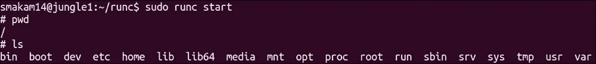
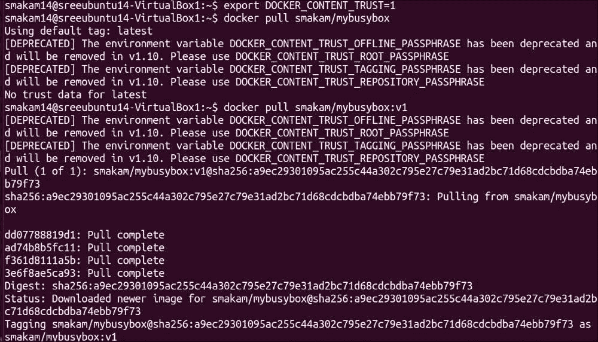
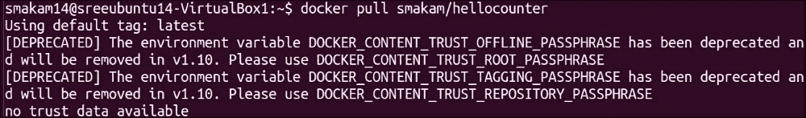

# 第八章

第七章：容器与 CoreOS 的集成 —— Docker 和 Rkt

容器彻底改变了应用程序开发和部署，是目前计算机行业的最大趋势。我们在本书的几乎所有章节中都提到了容器。在这一章中，我们将专注于容器标准、高级 Docker 话题、Rkt 容器运行时的基础以及这些主题如何与 CoreOS 集成。由于 Docker 已经相当成熟，我们在本章中只涉及了高级 Docker 话题。由于 Rkt 容器运行时仍在发展中，我们在本章中介绍了 Rkt 的基础内容。尽管 Docker 最初作为容器运行时起步，但它已经发展成一个容器平台，提供围绕容器的编排、网络、存储和安全解决方案。

本章将涵盖以下主题：

+   容器标准——应用容器（appc）规范、开放容器倡议（OCI）、Libnetwork、容器网络接口（CNI）和云原生计算基金会（CNCF）

+   Docker 守护进程配置、Docker 注册表、Docker 镜像签名和基础 Docker 调试

+   Rkt 基础知识以及如何与镜像签名、systemd 和 Flannel 一起使用 Rkt

容器标准

标准是任何技术的重要组成部分。标准和规范允许来自不同供应商的产品和技术互相兼容。由于容器领域在过去 1-2 年的发展非常快速，标准和规范的关注度相对较少。近年来，行业一直在为容器运行时、容器网络和容器编排制定标准。在大多数情况下，规范发布时会附带运行时实现，这有助于更快地采用标准。以下是本节中涵盖的标准类别：

+   容器镜像与运行时：APPC 和 OCI

+   容器网络：Libnetwork 和 CNI

+   容器编排：CNCF

应用容器规范

APPC 规范为你提供了一个标准，用于描述容器镜像格式、容器镜像发现、容器编组或 Pods，以及容器执行环境。实现 APPC 规范的不同容器运行时将能够互操作。APPC 规范主要由 CoreOS 和其他一些社区成员推动。Rkt、Kurma 和 Jetpack 是实现 APPC 的容器运行时的例子。以下是 APPC 中一些重要的组件。

容器镜像格式

这描述了容器镜像的布局、包含镜像详细信息的清单文件以及镜像签名。

应用容器镜像（ACI）是按照 APPC 规范创建的容器镜像。例如，`nginx.aci` 镜像是 nginx 容器的 ACI。为了理解容器镜像格式，让我们看看 nginx.aci APPC 镜像中包含的内容。以下命令将 `nginx.aci` 镜像的内容提取到 `nginx` 目录：（我们从稍后章节中将介绍的 `docker2aci` 工具获得了 `nginx.aci` 镜像。）

`tar -xvf nginx.aci -C nginx`

以下一组截图展示了 `nginx.aci` 镜像的基础布局和 rootfs 布局：

以下是 `nginx.aci` 清单中的一些重要部分。第一张截图显示了容器的名称和版本。第二张截图描述了暴露的端口、挂载点、环境变量等：

从上述截图中，我们可以看到 nginx ACI 镜像暴露了 `80` 和 `443` 端口，并且它有挂载点 `/var/cache/nginx`。容器镜像的签名使用 GPG 完成（[`www.gnupg.org/`](https://www.gnupg.org/)）。GPG 是一种公钥加密实现，可用于消息加密以及使用公钥和私钥对进行镜像签名。

容器镜像发现

容器镜像发现描述了如何根据镜像名称查找容器镜像的位置。容器镜像使用 URL 格式。容器镜像发现描述了如何根据镜像名称查找容器镜像的位置。以下是使用的镜像格式：

`https://{name}-{version}-{os}-{arch}.{ext}`

简单发现

在这里，提到了完整的 URL 来检索 ACI 镜像。示例如下：

[`github.com/coreos/etcd/releases/download/v2.0.0/etcd-v2.0.0-linux-amd64.aci`](https://github.com/coreos/etcd/releases/download/v2.0.0/etcd-v2.0.0-linux-amd64.aci)

Meta 发现

在这里，图像 URL 和公钥是通过使用嵌入在 HTTP 位置中的 meta 标签自动发现的。以下示例展示了如何从 meta 标签中检索 meta 标签和 ACI 图像，用于 CoreOS etcd 容器镜像。

第一步是检索 meta 标签。`https://coreos.com/etcd` 位置包含 `ac-discovery` meta 标签，该标签包含镜像位置，还有 `ac-discovery-pubkeys` meta 标签，其中包含公钥。

链接 [`coreos.com/etcd/`](https://coreos.com/etcd/) 包含以下可以作为 HTTP 请求检索的 meta 标签：

`<meta name="ac-discovery" content="coreos.com/etcd https://github.com/coreos/etcd/releases/download/{version}/etcd-{version}-{os}-{arch}.{ext}"> <meta name="ac-discovery-pubkeys" content="coreos.com/etcd https://coreos.com/dist/pubkeys/aci-pubkeys.gpg">`

使用上述 meta 标签内容，可以从以下位置检索容器镜像：

`https://github.com/coreos/etcd/releases/download/{version}/etcd-{version}-{os}-{arch}.{ext}`

可以从以下位置获取公钥：

`https://coreos.com/dist/pubkeys/aci-pubkeys.gpg`

应用容器执行器

应用容器执行器负责以下操作，以设置容器的运行时环境：

+   UUID 设置：这是包含多个容器的 Pod 的唯一 ID。UUID 会在元数据服务中注册，允许其他容器找到彼此。

+   文件系统设置：在其自己的命名空间中创建文件系统。

+   卷设置：这些是要挂载到容器的文件。

+   网络设置：指定容器与主机及其他容器的网络连接。

+   隔离器：用于控制容器的 CPU 和内存限制。

应用容器 Pod

Pods 的概念来自 Kubernetes，其中相关的容器被打包在一个 Pod 中。Pod 中的容器共享进程 PID、网络和 IPC 命名空间。除了单独的容器之外，还可以为 Pod 创建清单，以描述 Pod 的属性。

应用容器元数据服务

应用容器元数据服务是一个外部运行的服务，容器 Pod 可以注册关于 Pod 和应用的信息。Pod 可以使用此元数据服务查找其他 Pod 的信息，Pod 中的容器也可以通过此服务查找其他容器的信息。

APPC 工具

APPC 为您提供了创建、验证和转换 ACI 镜像的工具。

Actool

使用 Actool 进行 ACI 验证：

以下输出显示生成的 ACI 镜像`busybox-latest.aci`是一个有效的 APPC 镜像：

使用 Actool 进行 ACI 发现：

以下输出显示了 ACI 镜像的发现 URL 和公钥：

使用 Actool 检查清单：

以下输出显示了如何查看 ACI 镜像的清单：

Acbuild

Acbuild 工具用于构建 ACI 镜像。其概念类似于使用 Dockerfile 构建 Docker 容器镜像的方法，但 Acbuild 通过更好的与 Linux 工具（如 makefile、环境变量等）集成，提供了更大的灵活性来构建容器镜像。

以下是从 GO 可执行文件`hello`构建容器镜像的示例。在运行以下命令之前，我们需要静态链接当前目录中的`hello`可执行文件：

`acbuild begin``acbuild set-name example.com/hello``acbuild copy hello /bin/hello``acbuild set-exec /bin/hello``acbuild port add www tcp 5000``acbuild label add version 0.0.1``acbuild annotation add authors "Sreenivas Makam<sxxxm@yahoo.com>"``acbuild write hello-0.0.1-linux-amd64.aci``acbuild end`

如果我们运行前面的命令，它将创建一个 APPC 镜像`hello-0.0.1-linux-amd64.aci`，我们可以使用 Rkt 容器运行时运行该镜像。

以下是另一个示例，它类似于 Dockerfile 方法来构建 ACI 镜像。在这个示例中，我们以基础的 Ubuntu 镜像为基础，安装 Apache，并在容器中启动 Apache，以创建`ubuntu-nginx.aci`镜像：

`acbuild begin``acbuild dependency add quay.io/fermayo/ubuntu``acbuild run -- apt-get update``acbuild run -- apt-get -y install nginx``acbuild set-exec -- /usr/sbin/nginx –g "daemon=off;"``acbuild set-name example.com/ubuntu-nginx``acbuild write ubuntu-nginx.aci``acbuild end`

要运行 acbuild，系统中需要有 systemd-nspawn。CoreOS 节点默认包含此功能。以下是通过前面脚本创建的 APPC 镜像：

让我们使用 Rkt 启动容器：

以下是正在运行的容器状态：

Docker2aci

Docker2aci 工具用于将 Docker 容器转换为 ACI 格式。以下是一个示例，将 docker `busybox`容器转换为`busybox.aci`镜像：

开放容器倡议

OCI 是开放容器倡议（Open Container Initiative）开源项目，由 Docker 于 2015 年 4 月启动，并且有来自所有主要公司的成员，包括 Docker 和 CoreOS。OCI 定义了以下内容：

+   容器镜像格式：这描述了文件系统包，以及`config.json`，它描述了容器的主机无关属性，以及`runtime.json`，它描述了容器的主机相关属性。

+   运行时：这描述了如何使用命名空间和 cgroups 启动和停止容器。

Docker 的目标是遵循 OCI 规范来实现其容器运行时。

Runc

Runc 是 OCI 规范的实现。Docker 引擎使用 runc 在 Docker 中实现容器运行时。可以按照[`github.com/opencontainers/runc`](https://github.com/opencontainers/runc)中的过程安装 runc。

以下过程可用于使用`runc`启动 Ubuntu 容器：

`Docker pull Ubuntu``docker export $(docker create ubuntu) > ubuntu.tar``mkdir rootfs``tar -C rootfs -xf ubuntu.tar``runc spec`

第一步拉取 Ubuntu Docker 容器。第二步将 Ubuntu 容器导出为文件系统。第三步和第四步将 Ubuntu 文件系统内容放入`rootfs`目录。最后一步生成`config.json`和`runtime.json`。

以下输出展示了使用`runc`启动的 Ubuntu 容器：

OCI 与 APPC 的关系

CoreOS 和一些其他社区成员创建了 APPC 规范，以标准化容器镜像格式，使容器在不同的实现之间互操作。

CoreOS 提出的原始 APPC 容器规范涵盖了容器管理的四个不同元素：打包、签名、命名（与他人共享容器）和运行时。Docker 也感受到互操作性的需求，并与包括 CoreOS 在内的其他社区成员共同创建了 OCI。当前，OCI 主要专注于打包和运行时，尽管未来可能会有所变化。尽管具体细节略有不同，APPC 和 OCI 的目标是相同的。这两个标准可能会在未来某个时刻合并为一个标准。

OCI 和 APPC 最新更新

根据 CoreOS 最新的博客更新（[`coreos.com/blog/making-sense-of-standards.html`](https://coreos.com/blog/making-sense-of-standards.html)），APPC 和 OCI 仅在运行时相交，APPC 将继续关注镜像格式、签名和分发。

Libnetwork

Libnetwork 在第五章中简要介绍过，内容涉及 CoreOS 网络和 Flannel 内部结构。Libnetwork 是由 Docker 和其他一些社区成员发起的开源项目，目标如下：

+   将网络作为库与容器运行时分离。

+   提供同一主机以及跨主机的容器连接。

+   网络实现将作为由驱动程序实现的插件进行。提供插件机制以便轻松添加新的第三方驱动程序。

+   使用本地 IPAM 驱动程序和插件控制容器的 IP 地址分配。

Docker 使用 Libnetwork 提供容器网络。

Libnetwork 中有三个主要组件：

+   沙箱：所有网络功能都封装在沙箱中。可以使用网络命名空间或类似功能来实现。

+   端点：将沙箱附加到网络。

+   网络：同一网络中的多个端点可以相互通信。

以下图显示了沙箱、端点和网络，以及两个容器如何通过这些结构相互通信：

Libnetwork 支持本地驱动程序，如 null、bridge 和 overlay。bridge 驱动程序可用于单一主机中的容器连接，overlay 驱动程序可用于跨主机的容器连接。也支持远程驱动程序，如 Weave 和 Calico。

CNI

CNI 在第五章中简要介绍过，内容涉及 CoreOS 网络和 Flannel 内部结构。

CNI 是由 CoreOS 和其他一些社区成员开发的开源容器网络接口项目，为容器提供作为可插拔和可扩展机制的网络功能。CoreOS 的容器运行时 Rkt 使用 CNI 来建立容器网络。Libnetwork 和 CNI 的目标几乎相同。

以下是关于 CNI 的一些说明：

+   CNI 接口调用 CNI 插件的 API 来设置容器网络。

+   CNI 插件负责为容器创建网络接口。

+   CNI 插件调用 IPAM 插件来为容器设置 IP 地址。

+   CNI 插件需要实现一个 API，用于容器网络的创建和删除。

+   插件类型和参数被指定为一个 JSON 文件，容器运行时读取并设置该文件。

+   可用的 CNI 插件包括桥接、macvlan、ipvlan 和 ptp。可用的 IPAM 插件包括 host-local 和 DHCP。CNI 插件和 IPAM 插件可以任意组合使用。

+   也支持外部 CNI 插件，如 Flannel 和 Weave。外部插件重用桥接插件来设置最终的网络。

+   以下是一个示例 JSON 配置，包含桥接 CNI 插件和主机本地 IPAM 插件，以及 IP 分配范围：

    `{     "name": "mynet",     "type": "bridge",     "bridge": "mynet0",     "isGateway": true,     "ipMasq": true,     "ipam": {         "type": "host-local",         "subnet": "10.10.0.0/16"     } }`

+   以下是一个示例 JSON 配置，使用了 Flannel CNI 类型：

    `{         "name": "containernet",         "type": "flannel" }`

下图展示了 Rkt、CNI、CNI 插件和 IPAM 插件之间的关系：

Libnetwork 与 CNI 之间的关系

Libnetwork 和 CNI 的目标相似。Docker 使用 Libnetwork，而 CoreOS 使用 Rkt 并使用 CNI。Libnetwork 的覆盖驱动程序与 CNI 的 Flannel 驱动程序执行类似的操作。像 Weave 和 Calico 这样的外部插件的目标是与 Libnetwork 和 CNI 一起工作。

云原生计算基金会

CNCF 的目标是简化使用容器构建云原生应用的过程。CNCF 将使用容器周围的最佳开源技术，为基于微服务的分布式应用创建参考架构。CNCF 的初始目标是容器编排，集成工作重点放在 Kubernetes 与 Mesos 上。CNCF 将为微服务开发创建参考架构，帮助企业基于参考架构进行构建，而不是自行集成组件。根据最新的 CoreOS 博客（[`coreos.com/blog/making-sense-of-standards.html`](https://coreos.com/blog/making-sense-of-standards.html)），CoreOS 将把 etcd、flannel 和 appc 捐赠给 CNCF。

Docker

尽管容器技术已经存在很长时间，Docker 通过使容器的创建和传输变得非常用户友好，彻底革新了容器技术。除了提供容器运行时，Docker 还为容器提供网络、存储和编排解决方案。对于这些解决方案中的大多数，Docker 提供了一个可插拔的模型，提供 Docker 原生解决方案，并且可以与任何第三方解决方案交换。这为客户提供了灵活性，允许他们使用自己已经熟悉的技术。

在第一章，CoreOS 概述中，我们讲解了 Docker 架构。由于 Docker 技术已经相当成熟，本章将只讲解高级 Docker 概念。

Docker 守护进程和外部连接

Docker 作为守护进程运行，默认情况下监听 Unix 套接字`unix:///var/run/docker.sock`。Docker 启动选项在`/etc/default/docker`中指定。

为了允许外部 Docker 客户端与 Docker 守护进程通信，需要在 Ubuntu 节点中执行以下步骤：

1.  添加具有本地地址和端口号的 TCP 服务器：

    `DOCKER_OPTS="-D -H unix:///var/run/docker.sock -H tcp://192.168.56.101:2376"`

1.  重启 Docker 守护进程：

    `Sudo service docker restart`

1.  现在，我们可以看到 Docker 守护进程正在通过 IP 地址`192.168.56.101`和 TCP 端口号`2376`暴露外部连接：

    

我们可以按照以下方式从外部 Docker 客户端连接：

`docker -H tcp://192.168.56.101:2376 ps`

以下图片显示了 Apache 容器正在运行：

Dockerfile

Dockerfile 用于通过 Dockerfile 中的指定指令创建 Docker 容器镜像。通常，Dockerfile 以基础容器镜像开始，安装必要的应用程序，然后启动与容器相关的进程。

关于 Dockerfile 的最佳实践，您可以参考以下链接：

[`docs.docker.com/engine/articles/dockerfile_best-practices/`](https://docs.docker.com/engine/articles/dockerfile_best-practices/)

以下是一个示例 Dockerfile，用于从 Ubuntu 基础镜像创建一个 Apache 容器。此 Dockerfile 安装 Apache 包并将`80`端口暴露给外部世界：

`FROM ubuntu:14.04 MAINTAINER Sreenivas Makam <sxxxm@yahoo.com> # 更新 RUN apt-get update # 安装 apache2 RUN apt-get install -y apache2 # 暴露必要端口 EXPOSE 80 # 启动应用程序 ENTRYPOINT ["/usr/sbin/apache2ctl"] CMD ["-D", "FOREGROUND"]`

要创建 Docker 镜像，在包含上述 Dockerfile 的目录中执行以下命令。以下示例中，`smakam/apache1`是容器镜像的名称。容器镜像名称的默认约定是`用户名/镜像名称:标签`。

`docker build -t smakam/apache1 .`

以下截图展示了创建的 Apache 容器镜像：

Docker 镜像仓库

Docker 镜像仓库用于从公共服务器位置保存和恢复 Docker 容器镜像。Docker 为存储容器镜像提供了三种可能的解决方案：

+   Docker Hub：这是由 Docker 公司提供的 Docker 镜像仓库服务，网址为[`hub.docker.com/`](https://hub.docker.com/)。这是一个由 Docker 免费提供的服务。

+   Docker 注册表：这是一个开源项目（[`github.com/docker/distribution`](https://github.com/docker/distribution)），允许客户在自己的本地环境中托管 Docker 注册表。最新的 Docker 注册表是版本 2.0。Docker 注册表 2.0 克服了 Docker 注册表 1.x 的一些不足，提供了更好的安全性和性能。

+   Docker Trusted Registry：这是 Docker 的商业实现（[`www.docker.com/docker-trusted-registry`](https://www.docker.com/docker-trusted-registry)），增加了角色基于的用户身份验证、与 LDAP 等外部目录服务的集成、基于 GUI 的管理管理、技术支持等功能。Docker 注册表和 Docker Trusted Registry 都支持与 AWS、Azure 和 Swift 等外部存储驱动程序集成，以存储 Docker 镜像。

以下图展示了三种 Docker 镜像仓库类型：

Docker 镜像格式如下：

`[REGISTRYHOST/][USERNAME/]NAME[:TAG]`

+   `REGISTRYHOST`：注册表服务器地址

+   `USERNAME`：创建镜像的用户名

+   `NAME`：容器镜像的名称

+   `TAG`：容器镜像的版本

+   除了 `NAME` 外，其他参数是可选的

例如，下面的命令将从 Docker Hub 拉取一个标准的 Ubuntu 容器镜像；`registry-1.docker.io/library` 是注册表主机，镜像名为 `Ubuntu`，标签为 `latest`：

`docker pull registry-1.docker.io/library/Ubuntu:latest`

类似于 Docker 注册表，CoreOS 也有 Quay 注册表（[`quay.io/`](https://quay.io/)），用于存储 Docker 和 Rkt 镜像，它们提供了公共版和企业版。

创建你自己的 Docker 注册表

创建本地注册表以在特定公司或团队内部共享镜像是非常有用的。从安全角度来看，这一点尤其重要，因为这样就无需访问互联网即可访问注册表。Docker 注册表为你提供了身份验证、后端存储驱动程序（例如，S3、Azure 和 Swift）、日志记录等功能。

要启动本地注册表，使用以下命令：

`docker run -d -p 5000:5000 --restart=always --name registry registry:2`

以下截图展示了作为容器运行的注册表。注册表服务通过本地 `5000` 端口暴露：

注册表配置可以通过环境变量的方式在启动注册表容器时指定，或者使用包含配置的 YAML 文件并将该 YAML 文件挂载到容器中的 `/etc/config/registry/config.yaml`。

以下命令组从 Docker Hub 拉取一个 busybox 容器，推送 busybox 容器到本地注册表，然后从本地注册表拉取它：

`docker pull busybox``docker tag busybox localhost:5000/mybusybox``docker push localhost:5000/mybusybox``docker pull localhost:5000/mybusybox`

以下截图显示了已从本地注册表拉取的`mybusybox`容器：

以下截图显示了从本地注册表实例化`mybusybox`容器的过程：

持续集成

当我们将 Docker 镜像推送到 Docker Hub 时，Dockerfile 不会被推送。为了将 Dockerfile 推送并用于自动化容器构建，我们需要将其与一个仓库管理工具（如 GitHub 或 Bitbucket）关联。具体步骤如下：

1.  在 GitHub 或 Bitbucket 中创建一个账户。

1.  从 Docker Hub，我们可以链接到 GitHub 或 Bitbucket。

1.  将 Dockerfile 推送到 GitHub。

1.  从 Docker Hub，当我们创建一个仓库时，选择自动构建，并选择 GitHub 中 Dockerfile 所在的位置。这将自动构建镜像。此外，当 Dockerfile 在 GitHub 上有变更并提交时，自动构建会被触发。

以下图表展示了使用 Dockerfile 的 CI 流程，从暂存到生产：

以下截图显示了在 GitHub 中创建 Dockerfile 后，Docker Hub 中的自动化构建创建过程。在以下示例中，Dockerfile 位于[`github.com/smakam/docker.git`](https://github.com/smakam/docker.git)的 Apache 目录下：

当有任何更改时，自动构建容器镜像。以下截图显示了`smakam/apacheauto`的成功容器镜像构建日志：

以下截图显示了成功拉取`smakam/apacheauto`容器镜像：

Docker 内容信任

Docker 内容信任为您提供了一种机制，用于签署和发布 Docker 镜像，以确保拉取镜像的客户端能够确认该镜像来自受信任的来源，并且没有被中间人攻击篡改。以下是 Docker 内容信任的一些特性：

+   Docker 内容信任是 Notary 开源项目的实现（[`github.com/docker/notary`](https://github.com/docker/notary)）。Notary 开源项目基于 The Update Framework（TUF）项目（[`theupdateframework.github.io/`](https://theupdateframework.github.io/)）。TUF 提供了一种机制来保障软件更新的安全性。

+   与 GPG 签名密钥的方法相比，TUF 具有一些独特的区分点。TUF 负责密钥的新鲜度，以确保客户端始终知道他们获得的是最新的内容。使用 TUF 的密钥轮换机制，可以更好地处理密钥泄露问题，客户端无需了解此过程。TUF 还为您提供了签署集合而不是单独软件的能力。

+   Notary 有四个密钥——Timestamp 密钥用于保持镜像的新鲜度，Snapshot 密钥用于签署镜像集合，Target 密钥用于定期签署镜像，Offline 密钥用于密钥轮换。

+   Docker 内容信任已随 Docker 版本 1.8 发布。默认选项为禁用信任，可以通过`DOCKER_CONTENT_TRUST`环境变量启用。在某个时刻，默认选项将变为保持启用信任。

以下图显示了 TUF、Notary 和 Docker 内容信任之间的关系：

以下是启用 Docker 内容信任的工作流程：

+   Docker 注册表需要支持 Docker 内容信任。Docker Hub 支持内容信任。Docker 受信任注册表和私有注册表尚不支持内容信任；此功能将在不久的将来添加。

+   可以使用常规的 Docker 命令进行推送和拉取，并且特别注意不更改 Docker 命令。对于高级密钥管理，可以使用 Notary CLI。

+   当发布者第一次使用`docker push`推送镜像时，需要输入根密钥和标记密钥的密码短语。其他所有密钥会自动生成。这些密钥需要安全存储。

+   对于任何进一步的镜像发布，只需要标记密钥。

+   客户端可以选择拉取签名或未签名的镜像。启用 Docker 信任时，如果尝试拉取未签名的镜像，客户端会收到错误提示。

推送安全镜像

首先，我们通过`DOCKER_CONTENT_TRUST`环境变量启用 Docker 内容信任。以下是启用 Docker 内容信任并首次发布镜像时的输出。这里，我们正在推送签名的`smakam/mybusybox:v1`容器：

拉取安全镜像

以下是我们从 Docker Hub 拉取相同安全镜像`smakam/mybusybox:v1`时的输出：

在没有安全性的情况下拉取相同的镜像

以下是我们尝试在没有 Docker 内容信任的情况下拉取相同镜像`smakam/mybusybox:v1`时的输出。在这种情况下，不会进行镜像验证：

以下是如果我们启用信任并尝试拉取未签名的 Docker 镜像时会得到的错误消息。由于`smakam/hellocounter`没有签名，并且我们已启用`DOCKER_CONTENT_TRUST`，因此会出现错误：

最近，Docker 启用了使用硬件密钥的内容信任（[`blog.docker.com/2015/11/docker-content-trust-yubikey/`](https://blog.docker.com/2015/11/docker-content-trust-yubikey/)）。目前处于实验模式。

容器调试

以下是一些基本的容器调试方法。

日志

以下命令将显示容器日志。这是一个有用的调试工具。在第十章《CoreOS 与容器 - 故障排除与调试》中，您将学习如何从中央位置汇总和分析容器日志。

`docker logs <containername or id>`

登录到容器内

`docker exec`命令可以用于登录到容器。以下是一个示例：

可以从容器 shell 中执行常见的 Linux 命令。

容器属性

以下命令将显示容器属性，如挂载点、资源限制等：

`docker inspect <containername or id>`

容器进程

以下命令将显示容器中按 CPU 使用率排序的进程：

`docker top <containername or id>`

以下是`redis`容器的示例输出：

容器的 CPU 和内存使用情况

以下命令将显示容器的资源使用情况：

`docker stats <containername or id>`

以下是 Apache 容器的示例输出：

Rkt

Rkt 是 CoreOS 基于 APPC 规范的容器运行时。以下是与 Docker 相比 Rkt 的一些区别：

+   Rkt 是无守护进程的。容器在 Docker 守护进程重启时消失的问题在 Rkt 中不存在。

+   Rkt 与 systemd 集成良好，因此容器的资源限制可以轻松设置。

Rkt 执行有三个阶段：

+   `Stage0`：此阶段进行镜像发现和检索，并为阶段 1 和 2 设置文件系统。

+   `Stage1`：此阶段使用由`stage0`设置的文件系统来设置容器执行环境。Rkt 在此阶段使用 systemd-nspawn 来设置 cgroups、网络等。目标是使`stage1`可以被其他实现替换。

+   `Stage2`：这是实际执行容器 Pod 和应用程序本身，使用由`stage1`设置的执行环境和由`stage0`设置的文件系统。

以下示例展示了各个阶段。让我们使用 Rkt 启动 `hello` ACI 镜像：

`sudo rkt --insecure-skip-verify run hello-0.0.1-linux-amd64.aci`

以下展示了由`stage0`设置的`stage1`文件系统：

这里的清单展示了设置容器环境的 Rkt `stage1` ACI：

以下展示了`stage2`文件系统：

这里的清单展示了 hello Rkt 容器镜像：

以下展示了 hello 应用程序的文件系统：

Rkt 应用程序在 CoreOS 基础镜像中可用。也可以按照 [`github.com/coreos/rkt`](https://github.com/coreos/rkt) 中的步骤在任何 Linux 系统上安装 Rkt。以下是在 Ubuntu 14.04 系统中运行的 Rkt 版本：

以下是 CoreOS alpha 镜像 815.0.0 中使用的 Rkt 和 APPC 版本：

基本命令

以下是一些基本命令，用于操作 Rkt 容器。

获取镜像

以下命令从仓库中以 ACI 格式获取容器镜像：

`sudo rkt --insecure-skip-verify fetch docker://busybox`

列出镜像

以下命令列出 Rkt 容器镜像：

`sudo rkt image list`

运行镜像

以下命令运行 Rkt 容器镜像：

`sudo rkt run --insecure-skip-verify --interactive docker://busybox`

默认情况下，签名验证是启用的；我们使用 `skip-verify` 选项禁用签名验证：

列出 pods

以下命令列出正在运行的 pods：

`sudo rkt list pods`

垃圾回收

以下截图展示了两个已退出的 Pod：

已退出的容器将定期进行垃圾回收。要强制进行垃圾回收，我们可以执行以下命令：

`rkt gc --grace-period=0`

现在，我们可以看到没有活动的 Pod：

删除镜像

以下命令删除本地的容器镜像：

`sudo rkt image rm sha512-cf74c26d8d35555066dce70bd94f513b90cbef6e7e9c01ea0c971f4f6d689848`

以下截图展示了如何使用 UUID 删除 busybox 镜像：

导出镜像

以下命令将 Docker 镜像转换为 ACI 格式：

`sudo rkt image export nginx nginx.aci`

含有卷挂载和端口转发的 nginx 容器

以下命令启动 nginx 容器，将容器端口 `80` 转发到主机端口 `8080` 并设置主机卷。卷目录和端口名称如清单文件中所指定：

`sudo rkt run --insecure-skip-verify --private-net --port=80-tcp:8080 --volume volume-var-cache-nginx,kind=host,source=/home/core docker://nginx`

以下截图展示了通过 nginx 容器和主机端口 `8080` 成功访问网页：

Pod 状态

以下命令列出特定 Pod 的状态，使用 UUID：

`sudo rkt status 2b165196`

Rkt 镜像签名

容器镜像签名允许我们验证镜像是否来自受信任的来源，并且没有被篡改。我使用了 [`github.com/coreos/rkt/blob/master/Documentation/signing-and-verification-guide.md`](https://github.com/coreos/rkt/blob/master/Documentation/signing-and-verification-guide.md) 中的过程来签名 ACI 镜像，并使用 Rkt 运行签名镜像。

以下是一个示例 `nginx.service` systemd 单元文件：

1.  生成密钥：

    `gpg --batch --gen-key gpg-batch`

    注意

    如果你看到这个错误信息，`Not enough random bytes available. Please do some other work to give the OS a chance to collect more entropy!`，可以通过以下的 rngd 工具来解决，该工具可以并行运行：

    `apt-get install rng-tools``sudo rngd -r /dev/urandom`

1.  信任密钥：

    `gpg --no-default-keyring --secret-keyring ./rkt.sec --keyring ./rkt.pub --edit-key 1FEEF0ED trust`

1.  导出公钥：

    `gpg --no-default-keyring --armor \``--secret-keyring ./rkt.sec --keyring ./rkt.pub \``--export <email> > pubkeys.gpg`

1.  使用公钥签名镜像：

    `gpg --no-default-keyring --armor \``--secret-keyring ./rkt.sec --keyring ./rkt.pub \``--output hello-0.0.1-linux-amd64.aci.asc \``--detach-sig hello-0.0.1-linux-amd64.aci`

1.  使用 ACI 镜像、公共密钥和签名托管 web 服务器。以下是我 web 服务器位置中的内容：

    

1.  以下是 `index.html` 的内容：

    `<head> <meta name="ac-discovery" content="example.com/hello http://example.com/hello-0.0.1-linux-amd64.aci"> <meta name="ac-discovery-pubkeys" content="example.com/hello http://example.com/pubkeys.gpg"> </head>`

1.  信任 web 服务器位置和密钥：

    `sudo rkt trust --prefix=example.com/hello http://example.com/pubkeys.gpg --insecure-allow-http`

1.  修改 `/etc/hosts` 将 `example.com` 指向 localhost。

1.  启动一个简单的 web 服务器：

    `sudo python -m SimpleHTTPServer 80`

现在，我们可以运行带有签名验证的 Rkt 镜像：

`sudo rkt run --debug http://example.com/hello-0.0.1-linux-amd64.aci`

以下截图展示了签名正在被验证。签名位置和公钥由托管的 web 服务器 `example.com` 提供：

Rkt 与 systemd

Systemd 为你提供了对进程管理的强大控制。Rkt pods 可以由 systemd 管理。通过 systemd，我们可以控制进程执行顺序、重启能力、资源限制等。

以下是一个 `nginx.service` systemd 单元文件的示例：

`[Unit] Description=nginx  [Service] # 资源限制 CPUShares=512 MemoryLimit=1G # 预取镜像 ExecStartPre=/usr/bin/rkt fetch --insecure-skip-verify docker://nginx ExecStart=/usr/bin/rkt run --insecure-skip-verify --private-net --port=80-tcp:8080 --volume volume-var-cache-nginx,kind=host,source=/home/core docker://nginx KillMode=mixed Restart=always`

在之前的服务文件中，我们启动了 nginx 容器，并使用 systemd 构造限制了该 `nginx.service` 的 CPU 和内存使用。

要启动服务，必须将 `nginx.service` 放置在 `/etc/systemd/system` 目录中。可以通过以下命令启动服务：

`Sudo systemctl start nginx.service`

以下截图展示了 `nginx.service` 的状态：

为了展示与 systemd 集成的强大功能，让我们终止 Rkt nginx 进程并演示重启功能：

因为在 `nginx.service` 中启用了 `restart`，所以 systemd 会重新启动 nginx 容器。

从以下 `journalctl` 日志中，我们可以看到服务已被重新启动：

在以下截图中，我们可以看到 Rkt nginx 进程正在以不同的 PID 运行：

Rkt 与 Flannel

Rkt 使用 CNI 接口与 Flannel 插件进行通信，跨主机建立容器网络。

以下示例使用 Rkt 和 Flannel 配置一个三节点的 CoreOS 集群，用于容器网络。以下是必要的 `cloud-config`：

`#cloud-config  coreos:   etcd2:     #为每个唯一集群从 https://discovery.etcd.io/new 生成一个新的令牌     discovery: <your token>     # 多区域和多云部署需要使用$public_ipv4     advertise-client-urls: http://$public_ipv4:2379     initial-advertise-peer-urls: http://$private_ipv4:2380     # 监听官方端口和传统端口     # 如果您的应用程序不依赖于传统端口，可以省略     listen-client-urls: http://0.0.0.0:2379,http://0.0.0.0:4001     listen-peer-urls: http://$private_ipv4:2380,http://$private_ipv4:7001   fleet:     public-ip: $public_ipv4   flannel:     interface: $public_ipv4   units:     - name: etcd2.service       command: start     - name: fleet.service       command: start     - name: flanneld.service       drop-ins:         - name: 50-network-config.conf           content: |             [Service]             ExecStartPre=/usr/bin/etcdctl set /coreos.com/network/config '{ "network": "10.1.0.0/16" }'       command: start     - name: docker-tcp.socket       command: start       enable: true       content: |         [Unit]         Description=Docker Socket for the API          [Socket]         ListenStream=2375         Service=docker.service         BindIPv6Only=both          [Install]         WantedBy=sockets.target write_files:   - path: "/etc/rkt/net.d/10-containernet.conf"     permissions: "0644"     owner: "root"     content: |       {         "name": "containernet",         "type": "flannel"       }`

`/etc/rkt/net.d/10-containernet.conf`文件将 CNI 插件类型设置为 Flannel。

Flannel 为每个主机分配了一个独立的子网，使用的是在 flannel 配置中指定的 IP 范围`10.1.0.0/16`。

以下输出显示了在`node1`和`node2`中分配的子网：

让我们在每个节点上创建 Rkt 容器，并检查容器间的连接性：

以下输出显示了`core-01`上的 busybox 容器获得了 IP 地址`10.1.74.4`，该 IP 地址位于为`core-01`分配的`10.1.74.1/24`范围内：

以下输出显示了`core-03`上的 busybox 容器获得了 IP 地址`10.1.3.2`，该 IP 地址位于为`core-03`分配的`10.1.3.1/24`范围内：

以下输出显示了从`core-01`上的容器 1 成功 ping 通`core-03`上的容器 2：

总结

在本章中，我们介绍了不同的容器标准，包括容器运行时、网络和编排。从行业角度来看，拥有这些标准对于互操作性非常重要。我们详细讨论了 Docker 和 Rkt 这两种容器运行时系统。对于 Docker，我们关注了高级概念，而对于 Rkt，我们介绍了基础知识，因为 Rkt 仍处于早期阶段。尽管 CoreOS 正在积极开发 Rkt，但 CoreOS 承诺在其操作系统中支持 Docker。接下来，Docker 和 Rkt 如何在 CoreOS 中一起运行以及客户如何采纳这两种容器运行时技术将是非常有趣的。在下一章中，我们将介绍容器编排。

参考资料

+   Notary GitHub: [`github.com/docker/notary`](https://github.com/docker/notary)

+   Docker 注册表: [`github.com/docker/distribution`](https://github.com/docker/distribution)

+   Docker 内容信任文档: [`docs.docker.com/security/trust/content_trust/`](https://docs.docker.com/security/trust/content_trust/)

+   Docker 内容信任博客: [`blog.docker.com/2015/08/content-trust-docker-1-8/`](https://blog.docker.com/2015/08/content-trust-docker-1-8/)

+   Update 框架: [`theupdateframework.com/`](http://theupdateframework.com/)

+   云原生计算基金会: [`cncf.io`](https://cncf.io)

+   开放容器倡议: [`github.com/opencontainers`](https://github.com/opencontainers)

+   APPC 规范: [`github.com/appc`](https://github.com/appc)

+   Libnetwork: [`github.com/docker/libnetwork`](https://github.com/docker/libnetwork)

+   Docker2aci: [`github.com/appc/docker2aci`](https://github.com/appc/docker2aci)

+   CoreOS Rkt 文档: [`coreos.com/rkt/docs/latest/`](https://coreos.com/rkt/docs/latest/)

+   Acbuild: [`github.com/appc/acbuild`](https://github.com/appc/acbuild)

进一步阅读和教程

+   CNI 演示文稿: [`www.youtube.com/watch?v=_-9kItVUUCw`](https://www.youtube.com/watch?v=_-9kItVUUCw)

+   Docker 注册表演示文稿: [`www.youtube.com/watch?v=RnO9JnEO8tY`](https://www.youtube.com/watch?v=RnO9JnEO8tY) 和 [`www.youtube.com/watch?v=cVsUhoJFPvQ`](https://www.youtube.com/watch?v=cVsUhoJFPvQ)

+   Docker Notary 演示文稿: [`www.youtube.com/watch?v=JvjdfQC8jxM`](https://www.youtube.com/watch?v=JvjdfQC8jxM)

+   容器标准演示文稿: [`containersummit.io/events/sf-2015/videos/container-ecosystem-standards-needs-and-progress`](http://containersummit.io/events/sf-2015/videos/container-ecosystem-standards-needs-and-progress)

+   Rkt 和 APPC 演示文稿: [`www.youtube.com/watch?v=C8Qpdrpm16Y`](https://www.youtube.com/watch?v=C8Qpdrpm16Y)
