# 第十章

第九章 OpenStack 与容器和 CoreOS 的集成

OpenStack 是一个开源云操作系统，用于管理公共云和私有云。它是一项相当成熟的技术，得到了大多数供应商的支持，并被广泛应用于各种生产部署中。在 OpenStack 环境中运行 CoreOS 将为 OpenStack 用户提供一个基于容器的微型操作系统，以便部署他们的分布式应用。容器编排与 OpenStack 的集成为 OpenStack 用户提供了一个统一的管理解决方案，用于管理虚拟机和容器。目前，OpenStack 中有多个项目正在进行，以将容器管理和容器网络与 OpenStack 集成。

本章将涉及以下内容：

+   OpenStack 概述

+   在 OpenStack 中运行 CoreOS

+   在 OpenStack 中运行容器的选项——Nova Docker 驱动、Heat Docker 插件和 Magnum

+   使用 OpenStack Kuryr 和 Neutron 进行容器网络连接

OpenStack 概述

就像桌面或服务器操作系统管理与之相关的资源一样，云操作系统管理与云相关的资源。主要的云资源包括计算、存储和网络。计算包括服务器和与服务器相关的虚拟化管理程序，这些允许虚拟机的创建。存储包括本地存储、存储区域网络（SAN）和对象存储。

网络包括 VLAN、火墙、负载均衡器和路由器。云操作系统还负责其他基础设施相关的项目，如镜像管理、身份验证、安全、计费等。云操作系统还提供一些自动化特性，如弹性、自助式配置模型等。目前，市场上最流行的开源云操作系统是 OpenStack。OpenStack 得到了极大的支持，并且拥有强大的行业背书。

以下是一些关键的 OpenStack 服务：

+   Nova: 计算

+   Swift: 对象存储

+   Cinder: 块存储

+   Neutron: 网络

+   Glance: 镜像管理

+   Keystone: 身份验证

+   Heat: 编排

+   Ceilometer: 计量

+   Horizon: Web 界面

OpenStack 可以从 [`wiki.openstack.org/wiki/Get_OpenStack`](https://wiki.openstack.org/wiki/Get_OpenStack) 下载。由于涉及多个组件，安装 OpenStack 是相当复杂的。类似于 Linux 供应商提供的 Linux 发行版，多个供应商也提供 OpenStack 发行版。尝试 OpenStack 的最佳方式是使用 Devstack ([`devstack.org/`](http://devstack.org/))。Devstack 提供了一种脚本化的安装方式，可以在笔记本或虚拟机上安装。Devstack 可用于创建单节点集群或多节点集群。

CoreOS 在 OpenStack 上

CoreOS 可以作为虚拟机在 OpenStack 上运行。CoreOS 的 OpenStack 镜像适用于 alpha、beta 和稳定版本。

在这里，我描述了在 Devstack 环境中运行的 OpenStack 上安装 CoreOS 的过程。该过程基于 CoreOS OpenStack 文档（[`coreos.com/os/docs/latest/booting-on-openstack.html`](https://coreos.com/os/docs/latest/booting-on-openstack.html)）。

以下是步骤的总结：

1.  在 Devstack 中获取运行的 OpenStack Kilo。在我的例子中，我在 Ubuntu 14.04 虚拟机中安装了 Devstack。

1.  设置身份验证的密钥和 SSH 访问的安全组。

1.  为虚拟机设置外部网络访问和 DNS。这是必要的，因为 CoreOS 节点需要通过令牌服务相互发现。

1.  下载适当的 CoreOS 镜像并使用 Glance 服务上传到 OpenStack。

1.  获取发现令牌并在用户数据配置文件中更新它。

1.  使用自定义用户数据启动 CoreOS 实例，指定需要启动的服务以及要启动的实例数量。

获取 Devstack 中运行的 OpenStack Kilo

以下博客详细介绍了该过程：

[`sreeninet.wordpress.com/2015/02/21/openstack-juno-install-using-devstack/`](https://sreeninet.wordpress.com/2015/02/21/openstack-juno-install-using-devstack/)

这是我使用的`local.conf`文件：

`[[local|localrc]] DEST=/opt/stack  # 日志 LOGFILE=$DEST/logs/stack.sh.log VERBOSE=True SCREEN_LOGDIR=$DEST/logs/screen OFFLINE=True  # 主机 #EDITME HOST_IP=<EDITME>  # 网络 FIXED_RANGE=10.0.0.0/24 disable_service n-net enable_service q-svc enable_service q-agt enable_service q-dhcp enable_service q-meta enable_service q-l3 #ml2 Q_PLUGIN=ml2 Q_AGENT=openvswitch # vxlan Q_ML2_TENANT_NETWORK_TYPE=vxlan  # 凭证 ADMIN_PASSWORD=openstack MYSQL_PASSWORD=openstack RABBIT_PASSWORD=openstack SERVICE_PASSWORD=openstack SERVICE_TOKEN=tokentoken  # 调度器 enable_service n-sch SCHEDULER=nova.scheduler.chance.ChanceScheduler  # vnc enable_service n-novnc enable_service n-cauth`

设置密钥和安全组

以下是我用来创建密钥对并暴露虚拟机 SSH 和 ICMP 端口的命令：

`nova keypair-add heattest > ~/Downloads/heattest.pem``nova secgroup-add-rule default icmp -1 -1 0.0.0.0/0``nova secgroup-add-rule default tcp 1 65535 0.0.0.0/0`

设置外部网络访问

第一条命令设置虚拟机外部访问的 NAT 规则，第二条命令设置 DNS 服务器：

`sudo iptables -t nat -A POSTROUTING -o eth0 -j MASQUERADE``neutron subnet-update  <subnet> --dns-nameservers list=true <dns address>`

（使用`nova subnet-list`查找`<subnet>`，并从运行的主机获取`<dns address>`）。

下载 CoreOS 镜像并上传到 Glance

以下命令用于下载最新的 alpha 镜像并上传到 OpenStack glance：

`wget http://alpha.release.core-os.net/amd64-usr/current/coreos_production_openstack_image.img.bz2``bunzip2 coreos_production_openstack_image.img.bz2``glance image-create --name CoreOS \``  --container-format bare \``  --disk-format qcow2 \``  --file coreos_production_openstack_image.img \``  --is-public True`

以下是 `glance image-list` 输出，我们可以看到 CoreOS 镜像已上传至 Glance：

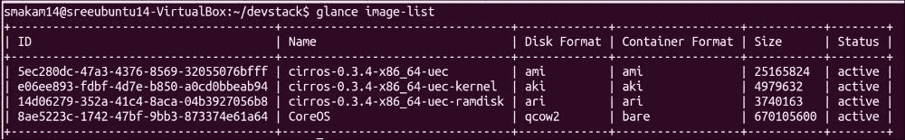

更新用于 CoreOS 的用户数据

我在使用默认用户数据启动 CoreOS 时遇到了一些问题，因为 CoreOS 在确定系统 IP 时遇到问题。我提出了一个案例（[`groups.google.com/forum/#!topic/coreos-user/STmEU6FGRB4`](https://groups.google.com/forum/#!topic/coreos-user/STmEU6FGRB4)），CoreOS 团队提供了一个示例用户数据，其中通过用户数据内的脚本来确定 IP 地址。

以下是我使用的用户数据：

`#cloud-config  write_files:   - path: /tmp/ip.sh    permissions: 0755    content: |      #!/bin/sh      get_ipv4() {          IFACE="${1}"           local ip          while [ -z "${ip}" ]; do              ip=$(ip -4 -o addr show dev "${IFACE}" scope global | gawk '{split ($4, out, "/"); print out[1]}')              sleep .1          done           echo "${ip}"      }      echo "IPV4_PUBLIC=$(get_ipv4 eth0)" > /run/metadata      echo "IPV4_PRIVATE=$(get_ipv4 eth0)" >> /run/metadata  coreos:   units:     - name: populate-ips.service       command: start       runtime: true       content: |         [Service]         Type=oneshot         ExecStart=/tmp/ip.sh     - name: etcd2.service       command: start       runtime: true       drop-ins:         - name: custom.conf           content: |             [Unit]             Requires=populate-ips.service             After=populate-ips.service              [Service]             EnvironmentFile=/run/metadata             ExecStart=             ExecStart=/usr/bin/etcd2 --initial-advertise-peer-urls=http://${IPV4_PRIVATE}:2380 --listen-peer-urls=http://${IPV4_PRIVATE}:2380 --listen-client-urls=http://0.0.0.0:2379 --advertise-client-urls=http://${IPV4_PUBLIC}:2379 --discovery=https://discovery.etcd.io/0cbf57ced1c56ac028af8ce7e32264ba     - name: fleet.service       command: start`

上述用户数据执行了以下操作：

+   `populate-ips.service` 单元文件用于更新 IP 地址。它手动读取 IP 并将其更新到 `/run/metadata`。

+   更新发现令牌，以便节点可以相互发现。

+   Etcd2 服务通过在 `/run/metadata` 中设置的 IP 地址启动。

+   Fleet 服务使用 fleet 单元文件启动。

以下命令用于使用上述用户数据启动两个 CoreOS 实例：

`nova boot \``--user-data ./user-data1.yaml \``--image 8ae5223c-1742-47bf-9bb3-873374e61a64 \``--key-name heattest \``--flavor m1.coreos \``--num-instances 2 \``--security-groups default coreos`

注意

注意：对于 CoreOS 实例，我使用了一个自定义规格 `m1.coreos`，配置为 1 vcpu、2 GB 内存和 10 GB 硬盘。如果这些资源要求没有满足，实例创建将失败。

让我们看看虚拟机的列表。我们可以在以下图片中看到两个 CoreOS 实例：

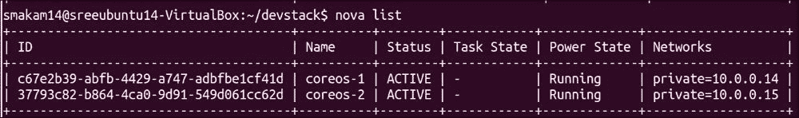

以下命令显示了在 OpenStack 中运行的 CoreOS 版本：

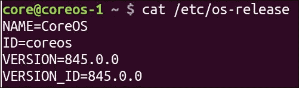

以下命令显示 etcd 成员列表：

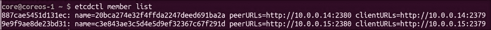

以下命令显示了显示两个 CoreOS 节点的舰队机器：

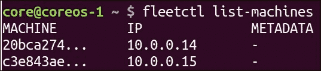

OpenStack 和容器

尽管 OpenStack 已经支持虚拟机（VM）和裸金属（baremetal）一段时间，但容器对 OpenStack 来说还是相对较新的概念。OpenStack 最初的重点是将虚拟机编排扩展到容器管理。Nova Docker 驱动程序和 Heat Docker 插件就是这种方法的例子。但由于这种方式缺少了一些容器功能，它并没有得到广泛采用。OpenStack Magnum 项目解决了一些局限性，并将容器作为一种类虚拟机的第一类公民来管理。

Nova Docker 驱动程序

Nova 通常用于管理虚拟机。在这种方法中，Nova 驱动程序被扩展以启动 Docker 容器。

以下图表描述了架构：

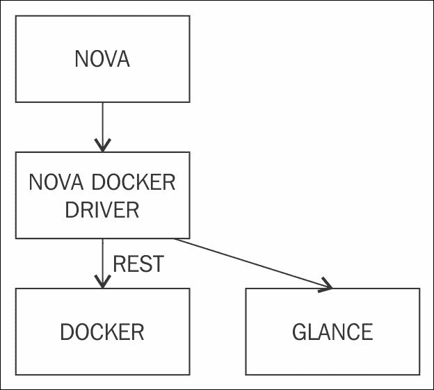

以下是关于架构的一些说明：

+   Nova 已配置为使用 Nova Docker 驱动程序来管理容器。

+   Nova Docker 驱动程序通过 REST API 与 Docker 守护进程进行通信。

+   Docker 镜像被导入到 Glance 中，Nova Docker 驱动程序使用这些镜像来启动容器。

Nova Docker 驱动程序并不包含在主流的 OpenStack 安装中，必须单独安装。

安装 Nova 驱动程序

在以下示例中，我们将介绍 Nova Docker 驱动程序的安装和使用方法来创建容器。

以下是步骤摘要：

1.  你需要有一个 Ubuntu 14.04 虚拟机。

1.  安装 Docker。

1.  安装 Nova Docker 插件。

1.  执行 Devstack 堆叠。

1.  安装 nova-docker rootwrap 过滤器。

1.  创建 Docker 镜像并导出到 Glance。

1.  从 Nova 启动 Docker 容器。

安装 Docker

以下是在我系统中 Docker 安装后运行的 Docker 版本：

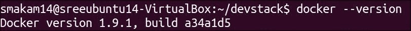

安装 Nova Docker 插件

使用以下命令安装插件：

`git clone -b stable/kilo https://github.com/stackforge/nova-docker.git``cd nova-docker``sudo pip install .`

以下是安装后的 Docker 驱动程序版本：

Devstack 安装

我使用了稳定的 Kilo 版本，并配有以下 `local.conf`。这将配置 Nova 使用 Docker 驱动程序：

`[[local|localrc]] # HOST HOST_IP=<EDITME> ADMIN_PASSWORD=openstack DATABASE_PASSWORD=$ADMIN_PASSWORD RABBIT_PASSWORD=$ADMIN_PASSWORD SERVICE_PASSWORD=$ADMIN_PASSWORD SERVICE_TOKEN=super-secret-admin-token VIRT_DRIVER=novadocker.virt.docker.DockerDriver  # Logging VERBOSE=True DEST=$HOME/stack SCREEN_LOGDIR=$DEST/logs/screen SERVICE_DIR=$DEST/status DATA_DIR=$DEST/data LOGFILE=$DEST/logs/stack.sh.log LOGDIR=$DEST/logs OFFLINE=false  # Networking FIXED_RANGE=10.0.0.0/24  # This enables Neutron disable_service n-net enable_service q-svc enable_service q-agt enable_service q-dhcp enable_service q-l3 enable_service q-meta  # Introduce glance to docker images [[post-config|$GLANCE_API_CONF]] [DEFAULT] container_formats=ami,ari,aki,bare,ovf,ova,docker  # Configure nova to use the nova-docker driver [[post-config|$NOVA_CONF]] [DEFAULT] compute_driver=novadocker.virt.docker.DockerDriver`

要安装 nova-docker rootwrap 过滤器，请运行以下命令：

`sudo cp nova-docker/etc/nova/rootwrap.d/docker.filters \``  /etc/nova/rootwrap.d/`

要将 Docker 镜像上传到 Glance，请运行以下命令：

`docker save nginx | glance image-create --is-public=True --container-format=docker --disk-format=raw --name nginx`

让我们查看 Glance 镜像列表；我们可以看到 nginx 容器镜像：

现在，让我们创建 nginx 容器：

`nova boot --flavor m1.small --image nginx nginxtest`

让我们来看看 Nova 实例：

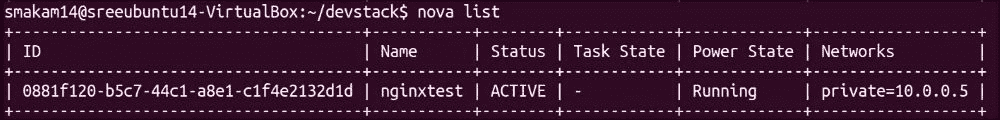

我们还可以使用 Docker 原生命令查看正在运行的容器：

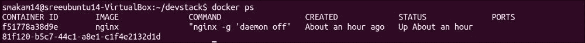

Heat Docker 插件

以下是 Nova Docker 驱动当前无法完成的某些操作：

+   传递环境变量

+   容器链接

+   指定卷

+   编排和调度容器

这些缺失的功能对于容器来说非常重要且独特。Heat Docker 插件部分解决了这些问题，除了编排部分。

以下图示展示了 Heat Docker 编排架构：

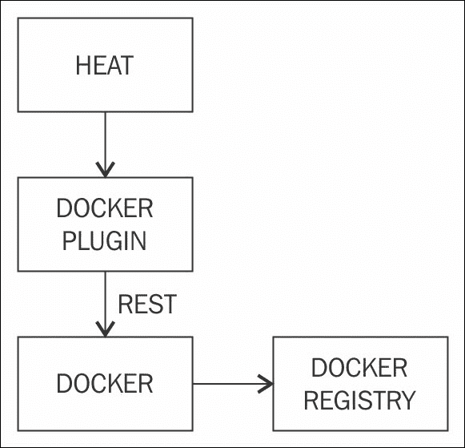

以下是一些关于架构的说明：

+   Heat 使用 Heat Docker 插件与 Docker 进行通信。Docker 插件通过 REST API 与 Docker 引擎进行交互。

+   Heat 与 Docker 注册表之间没有直接交互。

+   使用 Heat 编排脚本，我们可以使用 Docker 引擎的所有功能。此方法的缺点是没有将 Docker 与其他 OpenStack 模块直接集成。

安装 Heat 插件

我使用了[`sreeninet.wordpress.com/2015/06/14/openstack-and-docker-part-2/`](https://sreeninet.wordpress.com/2015/06/14/openstack-and-docker-part-2/)和[`github.com/MarouenMechtri/Docker-containers-deployment-with-OpenStack-Heat`](https://github.com/MarouenMechtri/Docker-containers-deployment-with-OpenStack-Heat)中的步骤，将 OpenStack Heat 与 OpenStack Icehouse 中的 Docker 插件进行了集成。

使用 Heat 插件，我们可以在本地主机或由 OpenStack 创建的虚拟机上启动 Docker 容器。

我使用的是安装了 Icehouse 的 Ubuntu 14.04 虚拟机，通过 Devstack 进行配置。我按照前述链接中的程序安装了 Heat Docker 插件。

以下命令输出显示 Heat 插件在本地主机中安装成功：

`$ heat resource-type-list | grep Docker``| DockerInc::Docker::Container     `

以下是一个 Heat 模板文件，用于在本地主机中启动 nginx 容器：

`heat_template_version: 2013-05-23 description: >   Heat 模板，用于将 Docker 容器部署到现有主机 resources:   nginx-01:     type: DockerInc::Docker::Container     properties:       image: nginx       docker_endpoint: 'tcp://192.168.56.102:2376'`

我们已将端点指定为本地主机的 IP 地址和 Docker 引擎端口号。

以下命令用于使用前述 Heat 模板创建容器：

`heat stack-create -f ~/heat/docker_temp.yml nginxheat1`

以下输出显示 Heat 堆栈安装已完成：

`$ heat stack-list``+--------------------------------------+---------------+-----------------+----------------------+``| id                                   | stack_name    | stack_status    | creation_time        |``+--------------------------------------+---------------+-----------------+----------------------+``| d878d8c1-ce17-4f29-9203-febd37bd8b7d  | nginxheat1    | CREATE_COMPLETE | 2015-06-14T13:27:54Z  |``+--------------------------------------+---------------+-----------------+----------------------`

以下输出显示容器在本地主机中的成功运行：

`$ docker -H :2376 ps``CONTAINER ID        IMAGE               COMMAND                CREATED             STATUS              PORTS               NAMES``624ff5de9240        nginx:latest        "nginx -g 'daemon of   2 minutes ago       Up 2 minutes        80/tcp, 443/tcp     trusting_pasteur   `

我们可以通过将端点 IP 地址从本地主机更改为虚拟机的 IP 地址，使用 Heat 插件方法在 OpenStack 虚拟机上运行容器。

Magnum

在 Nova 驱动程序和 Heat 编排的情况下，容器在 OpenStack 中并不是一等公民，且这些方法并不容易管理容器的特性。Magnum 是 OpenStack 中正在开发的通用容器管理解决方案，用于管理 Docker 及其他容器技术。Magnum 目前支持 Kubernetes、Docker Swarm 和 Mesos 进行编排。未来将添加其他编排解决方案。Magnum 目前支持 Docker 容器。该架构允许其未来支持其他容器运行时，如 Rkt。Magnum 仍处于早期阶段，并在 OpenStack Liberty 版本中作为测试功能提供。

Magnum 架构

下图展示了 Magnum 中的不同层次：

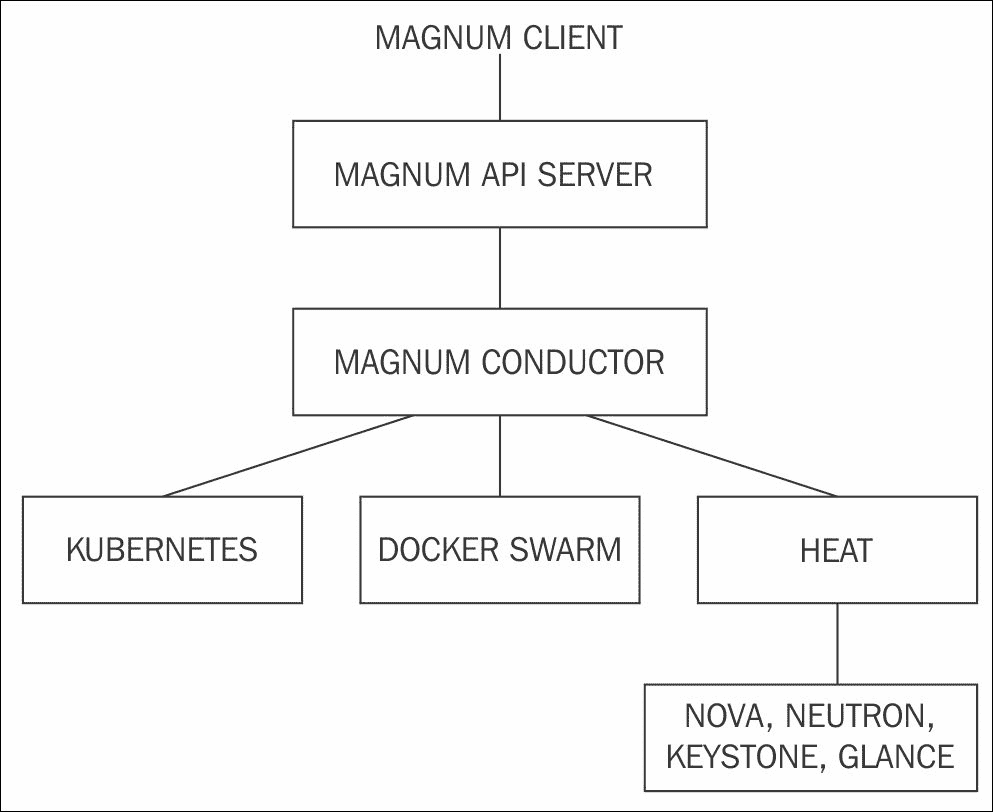

以下是关于 Magnum 架构的一些说明：

+   Magnum 客户端与 Magnum API 服务器进行通信，后者再与 Magnum conductor 通信。Magnum conductor 负责与 Kubernetes、Docker Swarm 和 Heat 进行交互。

+   Heat 负责与其他 OpenStack 模块（如 Nova、Neutron、Keystone 和 Glance）进行交互。

+   Nova 用于在 Bay 中创建节点，这些节点可以运行不同的微型操作系统，如 CoreOS 和 Atomic。

OpenStack Magnum 使用以下构件：

+   Bay 模型：这是一个集群定义，描述集群的属性，例如节点规格、节点操作系统以及使用的编排引擎。以下是一个示例 Bay 模型模板，使用 `m1.small` 作为节点规格，fedora atomic 作为节点的基础操作系统，并使用 Kubernetes 作为编排引擎：

    `magnum baymodel-create --name k8sbaymodel \``           --image-id fedora-21-atomic-5 \``           --keypair-id testkey \``           --external-network-id public \``           --dns-nameserver 8.8.8.8 \``           --flavor-id m1.small \``           --docker-volume-size 5 \``           --network-driver flannel \``           --coe kubernetes`

+   Bay：Bays 是基于 Bay 模型实例化的，包含 Bay 中所需数量的节点。

+   节点、Pod 和容器：节点是单独的虚拟机实例。Pod 是一组共享共同属性并一起调度的容器。容器在 Pod 内运行。

以下图示显示了 Bay 模型、Bay、节点、Pod 和容器之间的关系：

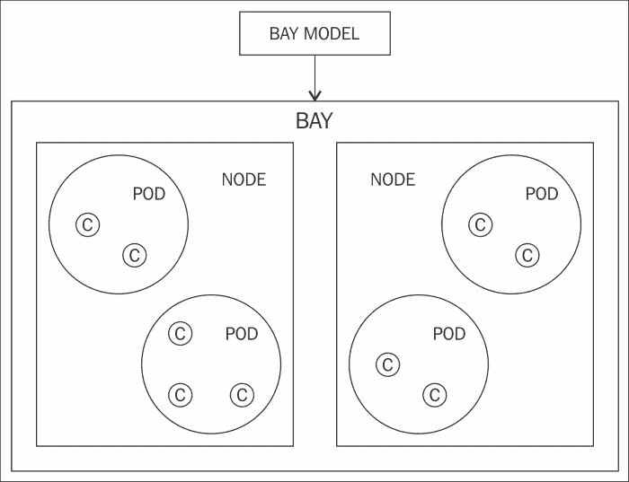

以下是使用 OpenStack Magnum 与本地编排解决方案（如 Kubernetes）相比的优势：

+   对于已经使用 OpenStack 的客户，Magnum 提供了一个集成的解决方案。

+   OpenStack 在所有层级提供多租户功能。这一功能也可以扩展到容器。

+   OpenStack Magnum 允许与其他 OpenStack 模块（如 Neutron、Keystone、Glance、Swift 和 Cinder）进行交互。其中一些集成计划在未来实现。

+   虚拟机和容器有不同的用途，它们很可能会共存。OpenStack 与 Magnum 项目提供了一个涵盖虚拟机和容器的编排解决方案，这使得它非常具有吸引力。

安装 Magnum

Magnum 可以通过以下过程进行安装：[`github.com/openstack/magnum/blob/master/doc/source/dev/quickstart.rst`](https://github.com/openstack/magnum/blob/master/doc/source/dev/quickstart.rst)。以下是步骤的总结：

1.  使用 Devstack 创建 OpenStack 开发环境，并启用 Magnum 服务。

1.  默认情况下，Fedora Atomic 镜像会在 Devstack 安装过程中下载到 Glance。如果需要 CoreOS 镜像，我们需要手动将其下载到 Glance。

1.  创建一个 Bay 模型。Bay 模型类似于一个模板，具有一组特定的参数，可以用来创建多个 Bay。在 Bay 模型中，我们可以指定 Bay 类型（当前支持的 Bay 类型有 Kubernetes 和 Swarm）、基础镜像类型（当前支持的基础镜像有 Fedora Atomic 和 CoreOS）、网络模型（Flannel）、实例大小等。

1.  使用 Bay 模型作为模板创建 Bay。在创建 Bay 时，我们可以指定需要创建的节点数。节点是安装基础镜像的虚拟机。

1.  使用 Kubernetes 或 Swarm 部署容器，并将其部署在创建的 Bay 上。Kubernetes 或 Swarm 会负责将容器调度到 Bay 中的不同节点。

    注意

    注意：建议避免在虚拟机中运行 Magnum。每个 Fedora 实例至少需要 1 或 2 GB 的内存和 8 GB 的硬盘空间，因此需要一台性能较强的机器。

使用 OpenStack Kuryr 进行容器网络配置

在本节中，我们将介绍如何使用 OpenStack Kuryr 项目通过 OpenStack Neutron 实现容器网络配置。

OpenStack Neutron

OpenStack Neutron 为 OpenStack 集群提供网络功能。以下是 OpenStack Neutron 的一些属性：

+   Neutron 通过 API 服务提供网络功能，后端或插件负责实现具体功能。

+   Neutron 可用于裸金属网络以及虚拟机网络。

+   Neutron 的基本构件包括 Neutron 网络、端口、子网和路由器。

+   常见的 Neutron 后端包括 OVS、OVN 和 Linux 桥接。

+   Neutron 还提供了高级网络服务，如负载均衡服务、防火墙服务、路由服务和 VPN 服务。

容器与网络

我们在前面的章节中已详细介绍了容器网络配置的内容。常用的一些技术包括 Flannel、Docker Libnetwork、Weave 和 Calico。这些技术大多数使用 Overlay 网络来提供容器网络。

OpenStack Kuryr

OpenStack Kuryr 的目标是通过 Neutron 提供容器网络。考虑到 Neutron 是一个成熟的技术，Kuryr 旨在利用 Neutron 的努力，使 OpenStack 用户能够轻松采用容器技术。Kuryr 本身不是一种网络技术；它的目标是充当容器网络与虚拟机网络之间的桥梁，并增强 Neutron 以提供缺失的容器网络功能。

以下图示展示了 Docker 如何与 Neutron 配合使用，以及 Kuryr 的作用：

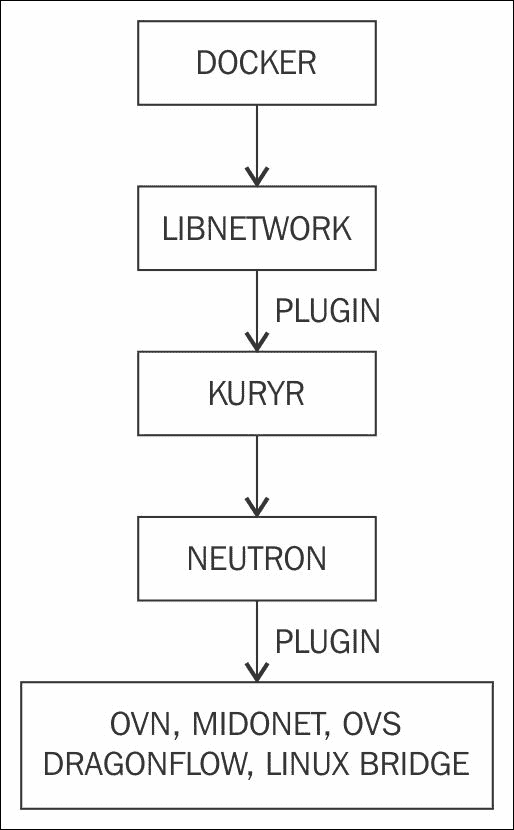

以下是一些关于 Kuryr 架构的说明：

+   Kuryr 作为 Docker libnetwork 插件实现。容器网络调用通过 Kuryr 映射到相应的 Neutron API 调用。

+   Neutron 使用 OVN、Midonet 和 Dragonflow 作为后端来实现 Neutron 调用。

以下是 OpenStack Kuryr 的一些优点：

+   它为虚拟机和容器提供统一的网络解决方案。

+   通过 Magnum 和 Kuryr，容器和虚拟机可以共享同一个编排系统。

+   考虑到 Neutron 技术已经成熟，容器可以利用所有 Neutron 功能。

+   在默认的容器网络配置下，当容器部署在虚拟机上时，会出现双重封装问题。容器网络执行第一层封装，虚拟机网络执行下一层封装。这可能会导致性能开销。使用 Kuryr，可以避免双重封装问题，因为容器和虚拟机共享同一网络。

+   Kuryr 可以与其他 OpenStack 组件良好集成，提供内置多租户支持的完整容器解决方案。

以下表格显示了 Neutron 和 Libnetwork 抽象之间的映射：

| Neutron | Libnetwork |
| --- | --- |
| Neutron 网络 | 网络 |
| 端口 | 端点 |
| 子网 | IP 管理 |
| 插件 API (插入/拔出) | 插件 API (加入/离开) |

以下图表展示了 Kuryr 如何为容器、虚拟机和裸金属提供共同的网络解决方案：

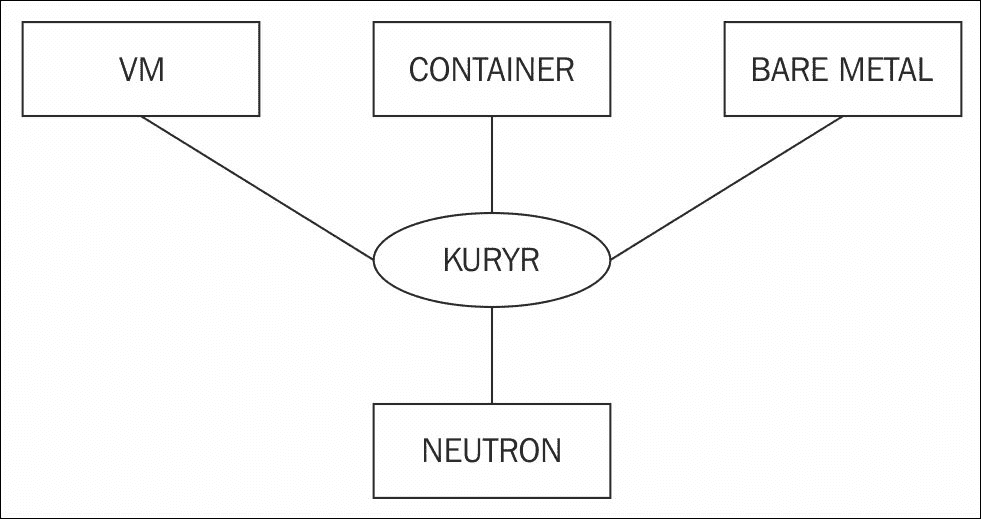

以下图像展示了 Kuryr 在 Magnum 和容器编排项目中的作用：

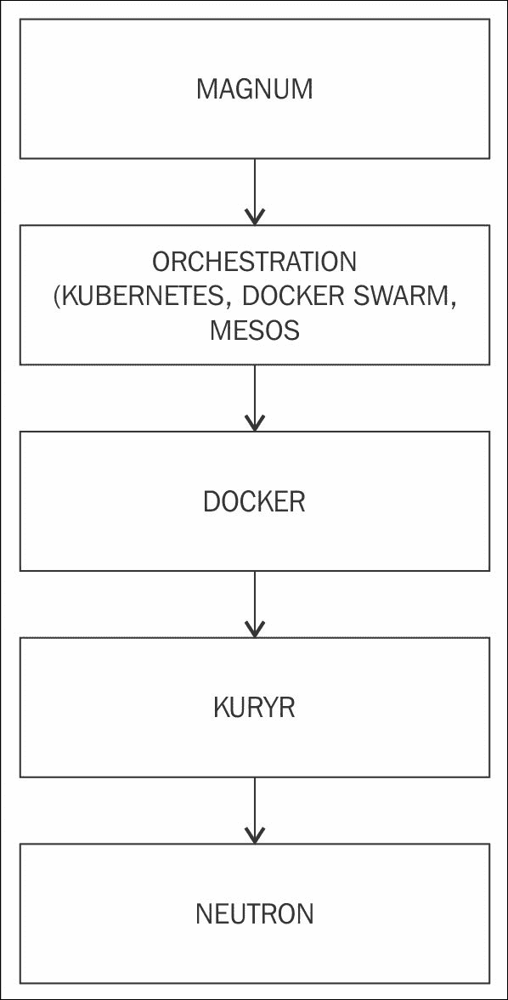

Kuryr 的当前状态和发展路线

Kuryr 项目相当新，Mitaka 版本将是首个支持 Kuryr 的 OpenStack 版本。以下是与 Kuryr 相关的正在进行和未来的工作项目：

+   向 Neutron 添加缺失的容器功能，例如端口转发、资源标记和服务发现。

+   通过整合虚拟机和容器网络，解决嵌套容器问题。

+   更好地与 OpenStack Magnum 和 Kolla 项目集成。

+   当前集成主要集中在 Docker。也有与 Kubernetes 网络模型的集成计划。

总结

本章中，我们讨论了容器和 CoreOS 如何与 OpenStack 集成。由于 CoreOS 只允许以容器的形式运行应用程序，因此如果 OpenStack 支持容器编排，OpenStack 与 CoreOS 的集成将更加有用。尽管 Nova 驱动程序和 Heat 插件已经在 OpenStack 中添加了对容器的支持，但 Magnum 项目似乎是正确的解决方案，将容器视为 OpenStack 中的第一类公民。我们还讨论了如何通过 Kuryr 项目，利用 OpenStack Neutron 提供容器网络。OpenStack 容器集成相对较新，仍有很多工作正在进行，以完成这一集成。使用单一的编排软件来管理虚拟机和容器，可以实现更紧密的集成，并简化管理和调试能力。在下一章中，我们将介绍 CoreOS 的故障排除和调试。

参考文献

+   Magnum: [`wiki.openstack.org/wiki/Magnum`](https://wiki.openstack.org/wiki/Magnum)

+   Magnum 开发者快速入门: [`github.com/openstack/magnum/blob/master/doc/source/dev/dev-quickstart.rst`](https://github.com/openstack/magnum/blob/master/doc/source/dev/dev-quickstart.rst)

+   CoreOS 在 OpenStack 上: [`coreos.com/os/docs/latest/booting-on-openstack.html`](https://coreos.com/os/docs/latest/booting-on-openstack.html)

+   OpenStack Docker 驱动程序: [`wiki.openstack.org/wiki/Docker`](https://wiki.openstack.org/wiki/Docker)

+   在 OpenStack 上安装 Nova-docker: [`blog.oddbit.com/2015/02/11/installing-novadocker-with-devstack/`](http://blog.oddbit.com/2015/02/11/installing-novadocker-with-devstack/)

+   OpenStack 和 Docker 驱动程序: [`sreeninet.wordpress.com/2015/06/14/openstack-and-docker-part-1/`](https://sreeninet.wordpress.com/2015/06/14/openstack-and-docker-part-1/)

+   OpenStack 和 Docker 与 Heat 和 Magnum: [`sreeninet.wordpress.com/2015/06/14/openstack-and-docker-part-2/`](https://sreeninet.wordpress.com/2015/06/14/openstack-and-docker-part-2/)

+   OpenStack Heat 插件用于 Docker: [`github.com/MarouenMechtri/Docker-containers-deployment-with-OpenStack-Heat`](https://github.com/MarouenMechtri/Docker-containers-deployment-with-OpenStack-Heat)

+   OpenStack Kuryr: [`github.com/openstack/kuryr`](https://github.com/openstack/kuryr)

+   OpenStack Kuryr 背景: [`galsagie.github.io/sdn/openstack/docker/kuryr/neutron/2015/08/24/kuryr-part1/`](https://galsagie.github.io/sdn/openstack/docker/kuryr/neutron/2015/08/24/kuryr-part1/)

进一步阅读和教程

+   私有云梦之堆栈 - OpenStack + CoreOS + Kubernetes: [`www.openstack.org/summit/vancouver-2015/summit-videos/presentation/private-cloud-dream-stack-openstack-coreos-kubernetes`](https://www.openstack.org/summit/vancouver-2015/summit-videos/presentation/private-cloud-dream-stack-openstack-coreos-kubernetes)

+   Magnum OpenStack 演示: [`www.youtube.com/watch?v=BM6nFH7G8Vc`](https://www.youtube.com/watch?v=BM6nFH7G8Vc) 和 [`www.youtube.com/watch?v=_ZbebTIaS7M`](https://www.youtube.com/watch?v=_ZbebTIaS7M)

+   Kuryr OpenStack 演示: [`www.openstack.org/summit/tokyo-2015/videos/presentation/connecting-the-dots-with-neutron-unifying-network-virtualization-between-containers-and-vms`](https://www.openstack.org/summit/tokyo-2015/videos/presentation/connecting-the-dots-with-neutron-unifying-network-virtualization-between-containers-and-vms) 和 [`www.youtube.com/watch?v=crVi30bgOt0`](https://www.youtube.com/watch?v=crVi30bgOt0)
