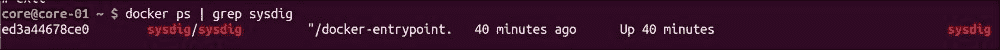
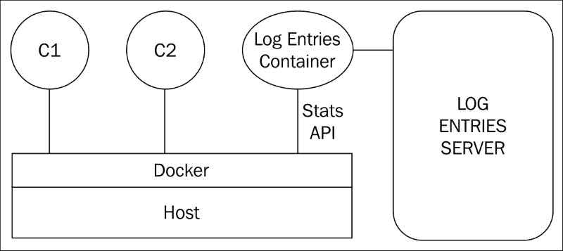

# 第十一章

第十章：CoreOS 与容器 - 故障排除与调试

CoreOS 和容器在故障排除方面带来了一些特殊挑战，但也有解决这个问题的方法。CoreOS 作为一个优化容器的操作系统，不支持包管理器，这就阻止了某些 Linux 调试工具的安装。这个问题可以通过使用 CoreOS 提供的名为 Toolbox 的工具，在容器中运行 Linux 工具来解决。容器在自己的命名空间中运行，而常规的 Linux 工具无法提供足够的信息来调试容器。这个问题可以通过诸如`cadvisor`和`sysdig`等工具来解决。日志记录是另一个重要的调试系统级问题的工具，一些供应商如 LogEntries 正在尝试为容器解决这个问题。

在本章中，我们将讨论以下主题：

+   使用 CoreOS Toolbox 和其他 CoreOS 实用工具来调试 CoreOS 系统

+   使用 `sysdig` 和 `cadvisor` 监控容器

+   Docker 远程 API 支持

+   Docker 日志驱动程序

+   使用 LogEntries 进行中央容器日志监控

CoreOS Toolbox

由于 CoreOS 不支持包管理器，因此很难安装自定义调试工具来解决问题，例如 tcpdump、strace 等。CoreOS 提供了一个 Toolbox 脚本，它可以启动一个具有系统级权限的 Ubuntu 或 Fedora 容器，在其上我们可以运行 Linux 系统工具，如 tcpdump 来监控和调试 CoreOS 主机。

要启动 Toolbox，请从 CoreOS shell 运行 `/usr/bin/toolbox`。

以下是 CoreOS 主机系统中的进程输出，显示 Toolbox 已以系统级权限启动：

Toolbox 默认使用 Fedora 镜像。以下输出显示了 Toolbox 容器内的 Fedora：

默认的 Fedora 镜像中没有 tcpdump。我通过 `yum` 安装了 `tcpdump` 并在 Toolbox 容器内部监控了 `eth0` 接口。这展示了 Toolbox 如何使用的一个示例。

要更改 CoreOS Toolbox 使用的默认 Linux 镜像，可以在 `~/.toolboxrc` 中指定自定义镜像。

以下是一个 `.toolboxrc` 的示例，在该示例中，我们要求 Toolbox 使用 Ubuntu 镜像：

`TOOLBOX_DOCKER_IMAGE=ubuntu TOOLBOX_DOCKER_TAG=14.04`

如果我们在上述更改后启动 Toolbox，Toolbox 将启动一个具有系统级权限的 Ubuntu 镜像。以下是作为启动 Toolbox 一部分运行的 Ubuntu 镜像：

我们可以在 `cloud-config` 中指定镜像选择，以便 `.toolboxrc` 在容器启动时自动写入。以下是一个示例 `cloud-config` 部分，在该部分中我们指定了以 Ubuntu 作为默认 Toolbox 容器镜像的 `.toolboxrc`：

`-write_files:   - path: /home/core/.toolboxrc     owner: core     content: |       TOOLBOX_DOCKER_IMAGE=ubuntu       TOOLBOX_DOCKER_TAG=14.04`

其他 CoreOS 调试工具

我们在第二章《设置 CoreOS 实验环境》的基础调试部分中介绍了 CoreOS 的基本调试。以下是一些可以使用的工具：

+   `journalctl`工具可以用来检查所有 systemd 服务的日志。

+   `systemctl`工具可以用来检查所有服务的状态。

+   `cloud-config`验证工具可以用来在与 CoreOS 一起使用之前验证`cloud-config`。

+   像 Etcd、Fleet、Flannel 和 Locksmith 这样的工具，具有自身的调试功能，可以在必要时启用。

容器监控

由于容器在自己的命名空间中运行，传统的 Linux 监控工具（如宿主系统中的 top、ps、tcpdump 和 lsof）无法帮助监控容器内或容器之间的活动。这使得容器的故障排查变得复杂。在讨论容器监控工具之前，让我们先看看需要监控的主要项目：

+   容器及其内部运行的进程的 CPU 使用情况

+   容器及其内部运行的进程的内存使用情况

+   网络访问，包括所有的入站和出站连接

+   容器执行的文件 I/O

以下是一些监控容器的方法：

+   在容器中安装监控软件：这种做法违背了容器模型，容器运行的是单个微服务，而且不可扩展。

+   在宿主机上安装监控软件，容器运行的机器：这种方法使得在像 CoreOS 这样的集群操作系统上安装专用软件变得困难，因为它们只允许以容器方式运行应用程序，并不允许在基础操作系统上安装软件。

+   以容器形式安装带有系统级权限的监控软件：这是最推荐的做法。

Docker 提供了`docker stats`命令，可提供每个容器的基本 CPU、内存和 I/O 使用情况。我们在第七章《与 CoreOS 的容器集成——Docker 和 Rkt》中介绍了`docker stats`。Docker 命令提供的数据非常基础。市面上有很多开源和商业的容器监控工具，如 cadvisor、sysdig、Data dog、newrelic、Prometheus 和 Scout，它们提供了容器的更多可视化信息。在本章中，我们将介绍 cadvisor 和 sysdig。

Sysdig

Sysdig 是一个开源项目，提供 Linux 系统级的可视化，并原生支持容器。Sysdig 不仅可以用于宿主机监控，也可以用于容器监控。

以下图示展示了 Sysdig 架构：

以下是一些关于 Sysdig 架构的笔记：

+   Sysdig 可以监控宿主系统、虚拟机和容器。

+   Sysdig 可以监控不同的容器运行时环境，如 Docker、Rkt 和 LXC。

+   Sysdig 文档将 sysdig 称为`strace + tcpdump + htop + iftop + lsof + 神奇的酱`。

+   Sysdig 探针是一个内核模块，需要安装在主机系统中才能进行监控。Sysdig 简化了此模块的安装，适用于常规 Linux 系统以及基于容器的操作系统，如 CoreOS 和 Rancher。

+   由于 sysdig 直接监控所有内核系统调用，sysdig 提供比其他监控工具更详细的监控数据。

+   Sysdig 容器可以在主机系统上运行，监控主机进程以及在主机系统中运行的容器。

+   Sysdig 可以监控 CPU、内存、网络 IO 和文件 IO。Sysdig 提供各种选项来微调监控查询，以提供相关数据。

+   Sysdig 的开源版本包括 sysdig CLI 和 csysdig，后者具有基于 ncurses 的界面。Csysdig 类似于 htop，提供交互式的文本界面。

+   Sysdig Cloud 是 Sysdig 的商业版，将来自多个主机和容器的数据聚合到云端的一个位置，并可作为 SaaS 应用程序访问。Sysdig Cloud 可以通过云端访问，或安装在本地。

Sysdig 可以作为容器启动。以下命令展示了如何启动 sysdig 容器：

`docker run -i -t --name sysdig --privileged -v /var/run/docker.sock:/host/var/run/docker.sock -v /dev:/host/dev -v /proc:/host/proc:ro sysdig/sysdig`

有关 Sysdig 安装的更多详情，请参阅[`www.sysdig.org/install/`](http://www.sysdig.org/install/)。以下命令展示了在 CoreOS 系统中运行的 sysdig 容器：

Sysdig 示例

以下输出展示了在 CoreOS 系统中运行的一些容器列表，我们将在这些容器中尝试一些简单的 sysdig 命令：

以下命令显示了消耗 CPU 资源的前几个进程。输出列出了主机机器以及容器中的 PID。`topprocs_cpu`工具是一个 chisel。在 sysdig 术语中，每个 chisel 都是一个包含预定义任务的脚本：

`sysdig -pc -c topprocs_cpu`

以下截图为前述命令的输出：

以下命令列出了使用网络 IO 的前几个容器：

`sysdig -pc -c topcontainers_net`

以下截图为前述命令的输出：

以下命令列出了使用文件 IO 的前几个容器：

`sysdig -c topcontainers_file`

以下截图为前述命令的输出：

Sysdig spy 命令对于监控所有外部与主机或容器的交互非常有用。以下输出展示了我们在 nginx 容器中执行`exec`命令并在容器中执行`ps`命令时的结果：

`sysdig -pc -c spy_users`

以下截图为前述命令的输出：

前述输出展示了`docker exec`和`ps`命令的执行结果。

Csysdig

Csysdig 是 Sysdig 的文本用户界面。Csysdig 实现为一个可定制的 Curses 用户界面。所有可以通过 sysdig 完成的操作，也可以通过 csysdig 完成。csysdig 用户界面可以定制，以显示不同的视图，并且输出可以根据不同的用户输入进行过滤。

可以使用以下命令启动 Csysdig：

`Cssysdig –pc  (pc 选项提供容器详情)`

以下输出显示了 csysdig 中可能的不同视图：

以下输出列出了主机中运行的容器。这可以在容器视图中查看：

一旦我们选择了一个特定的容器，以下输出显示了在该容器中运行的进程：

Sysdig 云

Sysdig 云是 Sysdig 提供的商业解决方案，其中来自主机机器的 sysdig 数据被发送到中央服务器，来自不同主机的容器和主机监控数据在此汇总。Sysdig 云可以在 Sysdig 的服务器上运行，也可以作为本地解决方案运行。

Sysdig 云提供 15 天的试用期。我试用了 Sysdig 云试用版，并在 AWS 上运行的 CoreOS 集群中安装了 Sysdig。

以下是安装 Sysdig 云及其使用方法的步骤：

1.  在 Sysdig 云上注册并创建一个在线账户。作为注册的一部分，Sysdig 会提供一个访问密钥。

1.  Sysdig 提供的访问密钥需要在主机机器上使用。Sysdig 会使用该访问密钥将属于同一账户的主机关联起来。

1.  当在主机上启动 sysdig 时，sysdig 代理将与云中的 Sysdig 服务器通信，并导出监控数据。

1.  Sysdig 云也可以与 AWS 集成。如果我们提供 AWS 访问密钥，Sysdig 还可以自动拉取 AWS 虚拟机监控数据。

以下是启动 sysdig-agent 服务的 CoreOS 服务单元文件，该服务与 Sysdig 云进行通信。访问密钥需要适当填写。由于在 X-Fleet 中设置了 `Global` 选项，该单元将在 CoreOS 集群中的所有节点上启动 sysdig 云代理：

`[Unit] Description=Sysdig 云代理 After=docker.service Requires=docker.service  [Service] TimeoutStartSec=0 ExecStartPre=-/usr/bin/docker kill sysdig-agent ExecStartPre=-/usr/bin/docker rm sysdig-agent ExecStartPre=/usr/bin/docker pull sysdig/agent ExecStart=/usr/bin/docker run --name sysdig-agent --privileged --net host --pid host -e ACCESS_KEY=<access key> -e TAGS=[role:web,location:bangalore] -v /var/run/docker.sock:/host/var/run/docker.sock -v /dev:/host/dev -v /proc:/host/proc:ro -v /boot:/host/boot:ro sysdig/agent ExecStop=/usr/bin/docker stop sysdig-agent  [X-Fleet] Global=true`

以下是我的三节点 CoreOS 集群：

以下命令可用于在 CoreOS 机器上启动 sysdig 代理：

`fleetctl start docker-sysdig.service`

以下输出显示了在其中一个 CoreOS 节点中运行的 sysdig-agent 容器：

以下是 Sysdig 云中显示的注册主机及其运行的容器的输出。在这里，我们可以看到三台主机和每台主机上运行的容器，以及它们的 CPU、内存、网络 I/O 和文件 I/O：

以下输出显示了摘要视图：

以下输出显示了单个容器的仪表板输出及其相关进程。我们选择了 sysdig 容器进行以下输出：

Kubernetes 集成

Sysdig 最近增加了一项与 Kubernetes 集成的功能，Sysdig 可以识别 Kubernetes 的逻辑结构，如主节点、从节点、Pod、复制控制器、标签等。Sysdig 通过查询 Kubernetes API 服务器来获得这些信息。通过结合从容器和 Kubernetes API 服务器收集的数据，Sysdig 和 Sysdig 云可以在 Kubernetes 级别上对信息进行分组。例如，我们可以根据 Kubernetes pod 或复制控制器查看 CPU 和内存使用情况。Sysdig 计划未来与其他编排引擎（如 Mesos 和 Swarm）进行集成。Sysdig 还计划与其他容器运行时（如 Rkt）进行集成。

Cadvisor

Cadvisor 是 Google 推出的一款开源工具，用于监控容器及其运行的主机系统。Google 为其自己的容器系统开发了 cadvisor，之后将其支持扩展到 Docker 容器。

以下是一些关于 cadvisor 的说明：

+   它监控主机系统和容器的 CPU、内存、网络和文件 I/O。

+   它可以与 Docker 和其他容器运行时一起使用。

+   它可以作为容器在主机系统中启动，且不需要对主机系统进行任何特殊更改。

+   cadvisor 容器启动了一个简单的 Web 服务器，我们可以通过它访问仪表板并使用简单的 GUI。

+   它提供了用于编程访问的 REST API。

+   Cadvisor 仅存储短期历史记录。要维持历史记录，需要将 cadvisor 与 InfluxDB（[`influxdata.com/`](https://influxdata.com/)）和 Prometheus（[`prometheus.io/`](https://prometheus.io/)）等后端一起使用。

以下命令可用于启动 Docker cadvisor 容器：

`docker run \`  --volume=/:/rootfs:ro \`  --volume=/var/run:/var/run:rw \`  --volume=/sys:/sys:ro \`  --volume=/var/lib/docker/:/var/lib/docker:ro \`  --publish=8080:8080 \`  --detach=true \`  --name=cadvisor \`  google/cadvisor:latest`

以下输出显示了在 CoreOS 系统中运行的 cadvisor 容器：

以下截图显示了容器的进程和 CPU 使用情况的 GUI 快照：

以下输出显示了 cadvisor 支持的 REST API 子类型：

以下是 cadvisor 提供的 REST API 示例，包括它们提供的详细信息。这个链接，[`github.com/google/cadvisor/blob/master/docs/api.md`](https://github.com/google/cadvisor/blob/master/docs/api.md)，提供了所有支持的 REST API 详情。以下所有命令的输出格式为 JSON。

以下命令提供主机详细信息：

`curl -X GET http://172.17.8.102:8080/api/v1.3/machine | jq .`

以下命令提供容器性能详细信息：

`curl -X GET http://172.17.8.102:8080/api/v1.3/containers/ | jq .`

以下命令提供 Docker 容器 nginx 性能详细信息：

`curl -X GET http://172.17.8.102:8080/api/v1.3/docker/nginx | jq .`

Cadvisor 提供的信息比 sysdig 少，因为 cadvisor 主要依赖 Docker 提供的统计信息。此外，cadvisor 提供的统计历史有限，因此需要将 cadvisor 与其他工具（如 Influxdb）集成，以保持更长的历史记录。

Docker 远程 API

Docker 远程 API 可以用于通过 REST API 访问 Docker 引擎。这可以用于程序化访问 Docker。

以下部分 CoreOS `cloud-config` 可用于启用 Docker 远程 API 并监听 TCP 端口 `2375`：

`    - name: docker-tcp.socket       command: start       enable: true       content: |         [Unit]         Description=Docker Socket for the API         [Socket]         ListenStream=2375         Service=docker.service         BindIPv6Only=both         [Install]         WantedBy=sockets.target`

以下是一些访问 Docker 远程 API 的示例：

列出正在运行的容器：

`docker -H tcp://172.17.8.102:2375 ps`

以下截图是前述命令的输出：

列出容器镜像：

以下命令可用于以 JSON 格式列出容器镜像：

`curl -X GET http://172.17.8.101:2375/images/json | jq .`

以下截图是前述命令的输出：

列出 Docker 引擎详细信息：

以下命令相当于 `docker info`：

`curl -X GET http://172.17.8.101:2375/info | jq .`

列出特定容器统计信息：

`curl -X GET http://172.17.8.101:2375/containers/26b225ec6a8e/stats | jq .`

列出 Docker 版本：

`curl -X GET http://172.17.8.102:2375/version | jq .`

列出 Docker 事件：

`curl -X GET http://172.17.8.102:2375/events`

以下命令删除特定的 `busybox` 容器：

`curl -X DELETE http://172.17.8.102:2375/images/busybox`

以下截图是前述命令的输出：

列出发送到 stdout 的特定容器日志：

容器 ID 作为参数指定用于以下命令：

`curl -X GET http://172.17.8.101:2375/containers/5ab9abb4787e/logs?stdout=1`

如果我们需要安全访问 Docker 远程 API，可以使用 TLS，Docker 守护进程支持此功能。

容器日志

当容器将输出发送到 stdout 或 stderr 时，必须记录这些日志。这对于监控错误和事件，以及维护容器应用程序的历史记录非常有用。使用容器时，日志记录存在一些特殊挑战：

+   通常，容器运行的是微服务，我们不希望日志记录过程在容器内部运行，因为这违背了容器模型。

+   对于微服务来说，一个应用程序可以拆分成多个容器，运行在不同的主机上。为了得出有意义的结论，必须从多个容器中收集日志。这就要求我们必须有一个中央日志服务器，而不是在容器运行的主机上进行容器监控。

我们在上一节中介绍了容器监控。当将容器日志与容器监控数据关联时，我们可以更好地理解系统，并轻松地缩小系统范围内的任何问题。

我发现以下两种方法在集中式容器日志记录中被广泛使用：

+   ELK 堆栈（Elastic 搜索、Logstash 和 Kibana）：Elastic 搜索作为中央日志存储库，Logstash 作为代理导出容器数据，Kibana 作为日志记录的 GUI 前端。我在本章中没有介绍 ELK 堆栈。参考部分中的链接提供了有关为容器日志记录设置 ELK 堆栈的详细信息。

+   LogEntries：LogEntries 将容器代理、前端和中央日志服务器结合为一个集成解决方案。

还有一些其他工具，如 AWS Cloudwatch（[`aws.amazon.com/cloudwatch/`](https://aws.amazon.com/cloudwatch/)）、Loggly（[`www.loggly.com`](https://www.loggly.com)）、Elastic（[`www.elastic.io/`](http://www.elastic.io/)）和 Sematext Logsene（[`sematext.com/logsene/`](https://sematext.com/logsene/)），它们提供容器日志记录功能。在使用 AWS Cloudwatch 进行容器监控时，我们可以根据 AWS 环境获得自定义钩子，并且它与其他云监控选项集成良好。

Docker 日志驱动程序

截至 Docker 1.7，Docker 支持以下日志驱动程序：

+   `None`：不进行日志记录。

+   `Json-file`：日志以 JSON 格式的文件存储。这是默认的日志记录选项。

+   `Syslog`：日志被发送到 syslog 服务器。

+   `Journald`：日志被发送到 journald 守护进程。Journald 与 systemd 集成。

+   `Gelf`：它将日志消息写入 GELF 端点，如 Graylog 或 Logstash。

+   `Fluentd`：它将日志消息写入 Fluentd。

+   `Awslogs`：这是 Amazon Cloudwatch 的日志记录驱动程序。

JSON-file 驱动程序

以下命令启动一个使用 json-file 日志驱动程序的 Docker 容器，最多保留 100 个文件，每个文件的大小不超过 1 MB：

`docker run --name busyboxjsonlogger --log-driver=json-file --log-opt max-size=1m --log-opt max-file=100 -d busybox /bin/sh -c "while true; do echo hello world ; sleep 5 ; done"`

在前述的 `busyboxjsonlogger` 容器中，我们持续发送 `hello world` 输出到标准输出。以下输出显示了 `busyboxjsonlogger` 的 `docker logs` 输出，其中我们可以看到 `hello world` 输出：

下面的命令可以执行以找出 json 日志文件的位置：

使用上述路径，我们可以直接转储 json 日志，提供额外的信息，如时间戳、流类型等：

Syslog 驱动程序

Syslog 驱动程序对将多个容器的消息汇总到运行 syslog 守护程序的单个服务器非常有用。

下面的命令可以用来启动 syslog 服务器作为容器。此命令将 syslog 服务器暴露给主机机器上的端口 `5514`：

`docker run -d -v /tmp:/var/log/syslog -p 5514:514/udp --name rsyslog voxxit/rsyslog`

下面的命令可以用来启动一个带有 syslog 驱动程序选项的容器，将日志发送到前面指定的 syslog 服务器：

`docker run --log-driver=syslog --log-opt syslog-address=udp://127.0.0.1:5514 --log-opt syslog-facility=daemon --log-opt tag="mylog" --name busyboxsysloglogger -d busybox /bin/sh -c "while true; do echo hello world ; sleep 5 ; done"`

下面的输出显示了来自 syslog 服务器的 syslog：

`docker exec rsyslog tail –f /var/log/messages`

以下截图是前面命令的输出：

journald 驱动程序

journald 日志驱动程序将容器日志发送到 systemd 日志。可以使用 `journalctl` 命令检索日志条目。这在使用 journald 作为所有其他日志记录的 CoreOS 环境中运行良好。

下面的命令启动带有 journal 驱动程序的容器：

`docker run --name busyboxjournallogger --log-driver=journald -d busybox /bin/sh -c "while true; do echo hello world ; sleep 5 ; done"`

下面的命令显示以 `CONTAINER_NAME` 作为过滤器的 journalctl 日志：

`journalctl CONTAINER_NAME=busyboxjournallogger`

以下截图是前面命令的输出：

下面的命令显示以 JSON 格式显示的 journalctl 日志：

`journalctl -o json CONTAINER_NAME=busyboxjournallogger --no-pager`

以下截图是前面命令的输出：

日志条目

LogEntries 可用于收集运行容器的主机系统的日志，将其导出到中央日志服务器，并从中央服务器分析日志。以下图表描述了 LogEntries 容器架构的组件：

下面是 LogEntries 容器架构的一些注释：

+   LogEntries 容器在主机系统中运行。它使用 Docker API 收集容器统计信息、日志和事件，并将它们传输到中央服务器。

+   基于令牌的系统可以用于聚合来自多个主机的容器日志。对于属于同一域的容器数据集，我们可以从 LogEntries 创建一个令牌，并在该域的每个主机中使用此令牌。每个主机中的 LogEntries 代理会使用该令牌与 LogEntries 服务器进行通信。LogEntries 会根据令牌聚合日志集。

+   随着 LogEntries 收集容器统计信息，它还会显示一些容器监控数据，除了日志之外。

+   LogEntries 提供使用社区包的扩展功能。社区包提供了一种轻松共享搜索查询、标签、警报和小工具的方式。社区包遵循 JSON 结构，可以通过 LogEntries UI 轻松导入到 LogEntries 账户中。

+   LogEntries 提供免费和付费订阅。付费订阅提供额外的存储和企业级功能。

导出 CoreOS 日志

CoreOS 使用 journalctl 存储所有服务的日志。可以使用以下容器 ([`github.com/kelseyhightower/journal-2-logentries`](https://github.com/kelseyhightower/journal-2-logentries)) 通过 SSL 将日志条目发送到 LogEntries 服务器。

以下是从 CoreOS 节点导出 journalctl 日志所需的步骤：

1.  从 logentries 创建一个令牌。

1.  在启动 `journal-2-logentries` 容器时，可以在服务文件中或 `cloud-config` 内部作为选项使用令牌。另一种选择是更新 etcd 中的令牌，CoreOS 集群中的所有节点都可以使用该令牌。

1.  在 etcd 中更新令牌（例如，`etcdctl set /logentries.com/token <token>`）。

以下服务文件可以用于在集群的所有 CoreOS 节点上启动 `journal-2-logentries` 容器：

`[Unit] Description=将 Systemd 日志转发到 logentries.com  [Service] TimeoutStartSec=0 ExecStartPre=-/usr/bin/docker kill journal-2-logentries ExecStartPre=-/usr/bin/docker rm journal-2-logentries ExecStartPre=/usr/bin/docker pull quay.io/kelseyhightower/journal-2-logentries ExecStart=/usr/bin/bash -c \ "/usr/bin/docker run --name journal-2-logentries \ -v /run/journald.sock:/run/journald.sock \ -e LOGENTRIES_TOKEN=$(etcdctl get /logentries.com/token) \ quay.io/kelseyhightower/journal-2-logentries"  [X-Fleet] Global=true`

由于 logentries 容器使用 `journald.sock`，因此需要使用以下单元在 `cloud-config` 中导出该套接字：

`    - name: systemd-journal-gatewayd.socket       command: start       enable: yes       content: |          [Unit]          Description=Journal 网关服务套接字          [Socket]          ListenStream=/var/run/journald.sock          Service=systemd-journal-gatewayd.service          [Install]          WantedBy=sockets.target`

以下输出显示了在集群的所有 CoreOS 节点上运行的 `journal-2-logentries` 服务：

以下输出显示了在其中一个节点上运行的 `journal-2-logentries` 容器：

以下截图显示了 LogEntries 服务器前端的日志，包含来自 CoreOS 节点的日志条目：

容器日志

LogEntries 可用于导出容器日志、事件和统计信息。容器事件可以是容器启动、创建、停止和终止事件。容器日志是标准输出（stdout）和标准错误（stderr）日志。容器统计信息包括 CPU、内存、文件和网络 IO 相关的详细信息。

以下是从 CoreOS 节点导出容器统计信息和日志所需的步骤：

1.  从 Logentries 创建一个令牌。

1.  在服务文件中使用令牌，或者在启动 docker-logentries 容器时作为选项使用。另一种选择是将令牌更新到 etcd，CoreOS 集群中的所有节点都可以使用该令牌。

1.  更新 etcd 中的令牌（例如，`etcdctl set /logentries.com/token <token>`）。

1.  要查看 Docker 容器统计信息，需要使用 Docker 社区包。该包是一个 JSON 文件，可以从 [`community.logentries.com/packs/`](https://community.logentries.com/packs/) 下载。以下说明 ([`logentries.com/doc/community-packs/`](https://logentries.com/doc/community-packs/)) 可用于将 Docker 社区包导入 Logentries。

以下命令可用于启动 `docker-logentries` 容器：

`docker run -v /var/run/docker.sock:/var/run/docker.sock logentries/docker-logentries -t <token>`

以下服务文件可用于在所有 CoreOS 节点上启动 `docker-logentries` 容器：

`[Unit] Description=将容器日志/统计信息转发到 logentries.com  [Service] TimeoutStartSec=0 ExecStartPre=-/usr/bin/docker kill docker-logentries ExecStartPre=-/usr/bin/docker rm docker-logentries ExecStartPre=/usr/bin/docker pull logentries/docker-logentries ExecStart=/usr/bin/bash -c \ "/usr/bin/docker run --name docker-logentries \ -v /var/run/docker.sock:/var/run/docker.sock \ -e LOGENTRIES_TOKEN=$(etcdctl get /logentries.com/token) \ logentries/docker-logentries"  [X-Fleet] Global=true`

以下输出显示了 `docker-logentries` 服务在所有 CoreOS 节点上运行的情况：

以下输出显示了 `docker-logentries` 容器在其中一个节点上运行的情况：

我创建了多个容器，并停止并删除了一些容器，以生成不同的容器事件和日志。

以下输出显示了从 Docker 社区包接收到的仪表盘输出。仪表盘展示了容器事件的汇总以及容器监控数据：

以下输出显示了日志集视图，此外还展示了每个容器创建事件所创建的具体容器。在以下图片中，我们可以看到 Redis、WordPress 和 MySQL 容器的创建事件：

为了展示 LogEntries 的日志功能，我启动了以下容器，它会定期将 `hello world` 发送到标准输出（stdout）：

`docker run -d busybox /bin/sh -c "while true; do echo hello world; sleep 5; done"`

以下输出显示了通过 `busybox` 容器名称过滤的日志，我们可以看到标准输出：

总结

在本章中，我们介绍了监控和调试 CoreOS 系统以及 Docker 容器的方法。监控工具需要将容器和主机系统作为一个整体来处理，而不是将其视为两个独立的实体，并能够提供容器视图和系统视图，同时关联这些数据。随着容器在多个主机上以数百或数千个实例部署，监控解决方案需要具备高度可扩展性。目前在调试和排除 CoreOS 系统及 Docker 容器故障方面有很多发展，许多公司都在努力解决这个问题。像 Sysdig 和 Logentries 这样的公司提供了很好的监控和日志解决方案。在下一章中，我们将讨论 CoreOS、Docker 容器和微服务的生产环境考虑事项。

参考文献

+   CoreOS 工具箱: [`github.com/coreos/toolbox`](https://github.com/coreos/toolbox) 和 [`thepracticalsysadmin.com/change-coreos-default-toolbox/`](http://thepracticalsysadmin.com/change-coreos-default-toolbox/)

+   Cadvisor: [`github.com/google/cadvisor`](https://github.com/google/cadvisor)

+   比较容器监控选项: [`rancher.com/comparing-monitoring-options-for-docker-deployments/`](http://rancher.com/comparing-monitoring-options-for-docker-deployments/)

+   Sysdig: [`sysdig.com/coreos-sysdig-part-1-digging-into-coreos-environments/`](https://sysdig.com/coreos-sysdig-part-1-digging-into-coreos-environments/), [`sysdig.com/sysdig-coreos-part-2-troubleshooting-flannel-networking-confd/`](https://sysdig.com/sysdig-coreos-part-2-troubleshooting-flannel-networking-confd/), [`www.sysdig.org/`](http://www.sysdig.org/)，和 [`github.com/draios/sysdig`](https://github.com/draios/sysdig)

+   Sysdig 和 Kubernetes 集成: [`sysdig.com/monitoring-kubernetes-with-sysdig-cloud/`](https://sysdig.com/monitoring-kubernetes-with-sysdig-cloud/) 和 [`sysdig.com/digging-into-kubernetes-with-sysdig/`](https://sysdig.com/digging-into-kubernetes-with-sysdig/)

+   自定义 Docker 远程 API: [`coreos.com/os/docs/latest/customizing-docker.html`](https://coreos.com/os/docs/latest/customizing-docker.html)

+   Docker 日志驱动程序: [`docs.docker.com/engine/reference/logging/overview/`](http://docs.docker.com/engine/reference/logging/overview/)

+   LogEntries: [`logentries.com`](https://logentries.com)

+   使用 ELK 进行 Docker 日志记录: [`technologyconversations.com/2015/05/18/centralized-system-and-docker-logging-with-elk-stack/`](http://technologyconversations.com/2015/05/18/centralized-system-and-docker-logging-with-elk-stack/) 和 [`evanhazlett.com/2014/11/Logging-with-ELK-and-Docker/`](http://evanhazlett.com/2014/11/Logging-with-ELK-and-Docker/)

+   使用 JSON 和 Syslog 记录 Docker 日志: [`medium.com/@yoanis_gil/logging-with-docker-part-1-b23ef1443aac#.ehjyv77n7`](https://medium.com/@yoanis_gil/logging-with-docker-part-1-b23ef1443aac#.ehjyv77n7)

进一步阅读与教程

+   从 CoreOS 集群集中日志: [`blog.logentries.com/2015/03/how-to-centralize-logs-from-coreos-clusters/`](https://blog.logentries.com/2015/03/how-to-centralize-logs-from-coreos-clusters/)

+   Docker 1.7 版本的日志增强: [`blog.logentries.com/2015/06/the-state-of-logging-on-docker-whats-new-with-1-7/`](https://blog.logentries.com/2015/06/the-state-of-logging-on-docker-whats-new-with-1-7/)

+   Docker 日志记录网络研讨会: [`vimeo.com/123341629`](https://vimeo.com/123341629)

+   容器监控的黑魔法: [`www.youtube.com/watch?v=exna5ntTCpY`](https://www.youtube.com/watch?v=exna5ntTCpY)

+   Sysdig 与 Logentries 网络研讨会: [`www.youtube.com/watch?v=wNxteOCv5eE`](https://www.youtube.com/watch?v=wNxteOCv5eE)

+   Docker 统计 API: [`blog.logentries.com/2015/02/what-is-the-docker-stats-api/`](https://blog.logentries.com/2015/02/what-is-the-docker-stats-api/) 和 [`blog.scoutapp.com/articles/2015/06/22/monitoring-docker-containers-from-scratch`](http://blog.scoutapp.com/articles/2015/06/22/monitoring-docker-containers-from-scratch)

+   Sysdig 容器可视化: [`sysdig.com/let-light-sysdig-adds-container-visibility/`](https://sysdig.com/let-light-sysdig-adds-container-visibility/)

+   Docker 远程 API: [`blog.flux7.com/blogs/docker/docker-tutorial-series-part-8-docker-remote-api`](http://blog.flux7.com/blogs/docker/docker-tutorial-series-part-8-docker-remote-api) 和 [`blog.flux7.com/blogs/docker/docker-tutorial-series-part-9-10-docker-remote-api-commands-for-images`](http://blog.flux7.com/blogs/docker/docker-tutorial-series-part-9-10-docker-remote-api-commands-for-images)

+   保护 Docker 守护进程: [`docs.docker.com/engine/articles/https/`](https://docs.docker.com/engine/articles/https/)
