# 第十二章

第十一章。CoreOS 和容器 - 生产考虑因素

在开发环境和生产环境中运行应用程序和容器之间存在很大差异。生产环境面临一系列特殊挑战，主要涉及可伸缩性、高可用性、安全性和自动化。CoreOS 和 Docker 已解决了将应用程序从开发转移到生产中的重要挑战。本章将介绍微服务基础设施的生产考虑因素，包括部署、自动化和安全性。

本章将涵盖以下主题：

+   CoreOS 集群设计考虑因素

+   分布式基础设施设计考虑因素 - 服务发现、部署模式、PaaS 和有状态与无状态容器

+   安全考虑

+   部署与自动化 - CI/CD 方法及使用 Ansible 进行自动化

+   CoreOS 和 Docker 路线图

+   微服务基础设施 - 平台选择和解决方案提供者

CoreOS 集群设计考虑因素

集群规模和更新策略是 CoreOS 集群的重要设计考虑因素。

更新策略

CoreOS 的自动更新功能可保持集群节点安全和最新。CoreOS 提供多种更新机制以控制更新，用户可以根据自己的需求选择方法。我们在《第三章》（index_split_075.html#filepos216260），CoreOS 自动更新中详细介绍了更新策略的细节。一些客户更喜欢仅在维护窗口中进行更新，CoreOS 允许用户进行控制。

集群考虑因素

在选择 CoreOS 集群时需要考虑以下因素。我们在早期章节中已经涵盖了这些个别主题。

+   集群规模：更大的集群规模提供更好的冗余性，但更新需要稍长时间。

+   集群架构：我们需要根据集群用于开发还是生产选择架构。对于生产集群，首选方案是拥有一个小型主节点集群来运行关键服务，如 Etcd 和 Fleet，并且让工作节点指向主节点集群。工作节点仅用于运行应用容器。

+   Etcd 心跳和超时调整：这些参数值需要根据集群是本地还是地理分布式进行调整。

+   节点备份与恢复：节点可能出现故障。需要定期备份。

+   在集群中添加和移除节点：CoreOS 提供机制，可以动态添加和移除 Etcd 集群中的节点而不会丢失数据。这可以有机地扩展集群规模。

分布式基础架构设计考虑因素

在本节中，我们将涵盖一些未在早期章节中涉及的杂项基础设施设计考虑因素。

服务发现

微服务是动态的，服务发现指的是微服务如何动态地找到彼此。服务发现有三个组件：

+   它会在服务启动时自动发现服务，并通过 DNS 使用服务名称访问服务

+   它维护一个共享的服务数据库及其访问详情，可以从多个主机访问。

+   它通过负载均衡器访问服务，并自动处理服务故障

使用容器编排系统（如 Kubernetes）时，服务发现会自动处理。对于没有编排系统的小型部署，我们可以通过使用独立工具手动进行。

我们在第四章中涵盖了服务发现部分，使用了 Sidekick 服务和 Etcd 来介绍 CoreOS 核心服务—Etcd、Systemd、Fleet。此方法未提供 DNS 查找。以下方法是另一种通过集成 DNS 来实现服务发现的方式。

使用 Registrator 和 Consul 进行服务发现

Consul（[`consul.io/`](https://consul.io/)）和 Gliderlabs 注册器（[`github.com/gliderlabs/docker-consul/tree/consul-0.4`](https://github.com/gliderlabs/docker-consul/tree/consul-0.4)）结合使用提供自动服务发现和服务数据库。

下图展示了该模型：

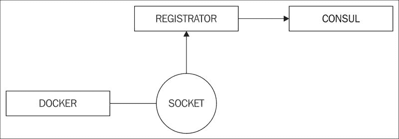

以下几点展示了它是如何工作的：

+   Consul 提供服务发现、共享键值存储、基于 DNS 的服务查找以及服务健康监控

+   Gliderlabs 注册器监视 Docker 套接字，监听服务创建，并将注册信息通知 Consul

+   由于 DNS 与 Consul 集成，服务可以通过服务名称访问

以下是在 Ubuntu Linux 机器上尝试此方法所需的步骤：

设置 Docker 守护进程使用 Docker 桥接 IP 作为其中一个 DNS 查找服务器。

将这一行添加到`/etc/default/docker`中：

`DOCKER_OPTS="--dns 172.18.0.1 --dns 8.8.8.8 --dns-search service.consul"`

重启 Docker 守护进程：

`Sudo service docker restart`

启动 Consul 服务器：

`docker run -d -p 8400:8400 -p 8500:8500 -p 172.18.0.1:53:8600/udp -h node1 gliderlabs/consul-server -server --bootstrap`

上述命令将端口`8400`暴露用于 rpc，`8500`用于 UI，`8600`用于 DNS。我们将 DNS 映射到 Docker 桥接 IP 地址（`172.18.0.1`），这样就可以直接从容器内部访问服务名称。在上一步中，我们将 Docker 桥接 IP 设置为 DNS 查找服务器之一。

启动 Gliderlabs 注册器：

`docker run -d \`` --name=registrator \`` --net=host \`` --volume=/var/run/docker.sock:/tmp/docker.sock \`` gliderlabs/registrator:latest \`` consul://localhost:8500`

在上述命令中，我们还指定了 Consul 的位置，以便注册器能够将服务注册到 Consul。

现在，让我们启动一些容器：

`docker run -d -P --name=nginx nginx``docker run --name mysql -e MYSQL_ROOT_PASSWORD=mysql -d mysql``docker run --name wordpress --link mysql:mysql -d -P wordpress``docker run --name wordpress1 --link mysql:mysql -d -P wordpress`

以下输出显示运行中的容器：

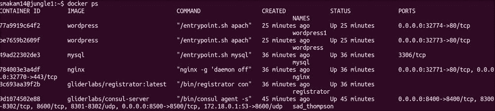

我们可以查看 Consul UI 来检查服务是否已注册。以下输出中可以看到 Consul、NGINX 和 WordPress 容器以及它们的 IP 地址和端口号：

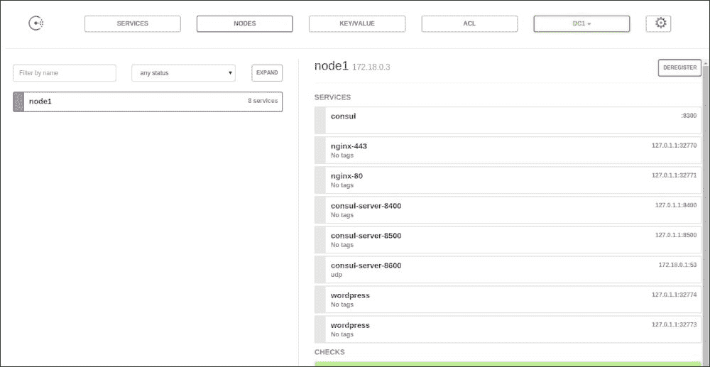

我们可以通过跨容器访问服务，检查通过 DNS 名称查找服务是否正常工作。以下输出显示 NGINX 容器能够通过服务名称 `wordpress` 访问 WordPress 容器：

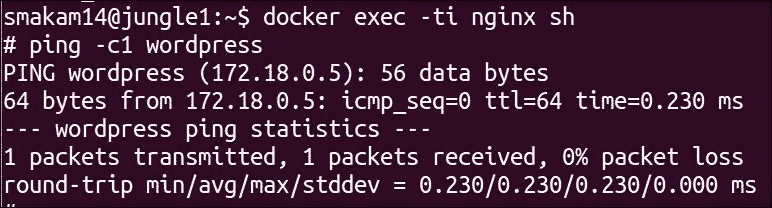

动态负载均衡

作为服务发现的一部分，负载均衡器应该能够自动找到活动的服务，并在活动实例之间进行负载均衡。例如，当启动了三个 Web 服务实例时，如果其中一个实例宕机，负载均衡器应该能够自动将该不活动实例从负载均衡列表中移除。

我发现以下两种方法对于实现这一目标非常有用。

使用 confd 和 nginx 进行负载均衡

在 [`www.digitalocean.com/community/tutorials/how-to-use-confd-and-etcd-to-dynamically-reconfigure-services-in-coreos`](https://www.digitalocean.com/community/tutorials/how-to-use-confd-and-etcd-to-dynamically-reconfigure-services-in-coreos) 这一方法中，以下是步骤列表：

1.  Sidekick 服务将服务详情注册到 `etcd`。

1.  Confd 监听 etctd 变更并更新 `nginx.conf`。

1.  Nginx 负载均衡器根据 `nginx.conf` 中的条目进行负载均衡。

以下图示说明了使用 ETCD、HA DISCOVER 和 HAProxy 进行负载均衡：

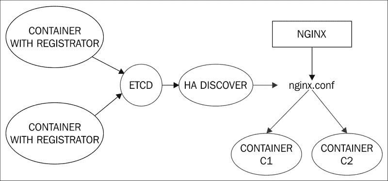

使用 HAdiscover 和 HAproxy 进行负载均衡

在 [`adetante.github.io/articles/service-discovery-haproxy/`](http://adetante.github.io/articles/service-discovery-haproxy/) 这一方法中，以下是步骤列表：

+   Registrator 将服务详情注册到 `etcd`。

+   HAdiscover 监听 etctd 变更并更新 `haproxy.conf`。

+   HAproxy 基于 HAproxy 配置执行负载均衡。

以下图示说明了使用 ETCD、HA DISCOVER 和 NGINX 进行负载均衡：

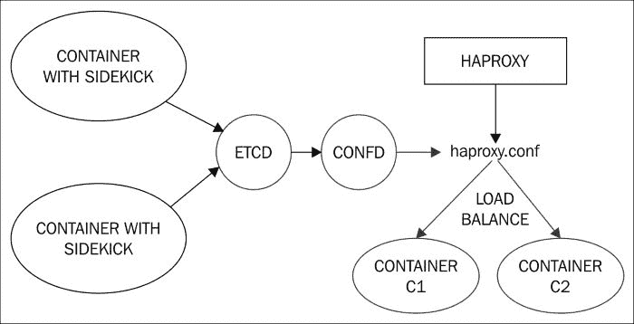

部署模式

我们在第一章中讨论了微服务的优势。设计基于微服务的应用程序类似于面向对象编程，其中容器镜像可以比作类，容器可以比作对象。面向对象编程中有许多设计模式，指定如何将一个单体应用程序拆分为类，以及类如何与其他类协作。一些面向对象设计原则同样适用于微服务。

在第八章，容器编排中，我们讲解了 Kubernetes Pods 以及如何将紧密相关的容器分组到同一个 Pod 中。设计模式如侧车、代理和适配器模式被广泛用于创建 Pods。尽管这些设计模式是在 Kubernetes Pod 的上下文中提到的，但也可以在非 Kubernetes 系统中使用。

这个链接（[`blog.kubernetes.io/2015/06/the-distributed-system-toolkit-patterns.html`](http://blog.kubernetes.io/2015/06/the-distributed-system-toolkit-patterns.html)）讲述了常见的 Kubernetes 组合模式。

以下是一些常见 Kubernetes 组合模式的更多细节。

侧车模式

在侧车模式中，两个依赖的容器完成一个单一的任务。

在下图中，健康检查容器监控 Web 容器并将结果更新到共享存储中，例如 ETCD，负载均衡器可以使用这些数据：

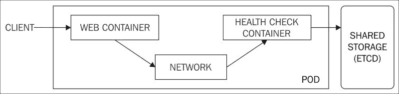

在下图中，Git 同步容器从 Git 服务器更新数据卷，Web 容器使用该数据卷来更新网页：

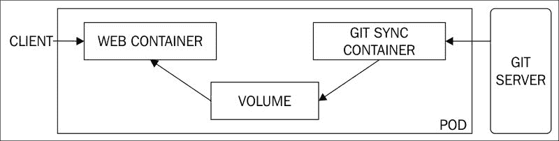

在下图中，Web 容器更新日志卷，日志容器读取该卷来更新中央日志服务器：

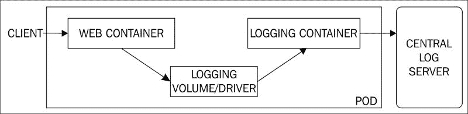

大使模式

大使模式用于当客户端容器需要访问不同类型的服务，而修改每个服务的客户端容器不高效时。代理容器将负责访问不同类型的服务，客户端容器只需要与代理容器通信。例如，redis 代理负责处理单个 redis 主节点场景，或有一个 redis 主节点和多个 redis 从节点的场景，而 redis 客户端则不需要了解 redis 服务的类型。

下图展示了 redis 客户端通过 redis 代理访问 redis 服务：

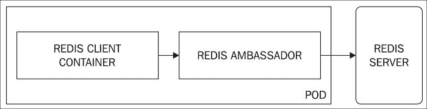

适配器模式

适配器模式是大使模式的反向。适配器模式的一个例子是服务容器暴露一个独立于服务中应用的公共接口。例如，一个监控或日志应用希望有一个公共接口来收集输入，而不考虑应用的类型。适配器容器负责将数据转换为监控或日志应用所期望的标准格式。

以下示例展示了一个监控/日志应用访问两个不同容器应用，每个应用都有自己的适配器：

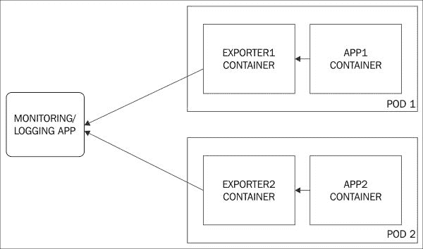

滚动更新与金丝雀模式

这是当应用程序作为容器在多个服务器后面的负载均衡器后运行时使用的升级方式。在这种方法中，应用程序的升级会先在少数服务器上进行，然后根据客户的初步反馈，升级可以继续进行或撤回。

Kubernetes 支持使用金丝雀模式的滚动升级。在下面的示例中，我们将演示在 AWS 上的 CoreOS 集群上运行的 Kubernetes 如何使用金丝雀模式。在这里，我们将`hello1-controller`（其包含三个`hello:v1`容器副本）升级为`hello2-controller`，后者也包含三个`hello:v2`容器副本。

对于本示例，我们需要一个包含三个节点的 Kubernetes CoreOS 集群。安装说明可以在第八章《容器编排》中找到。

以下是一个包含一个主节点和两个工作节点的三节点集群：

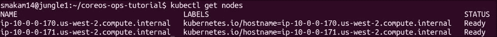

以下是具有`hello1`容器镜像和三个副本的复制控制器`hello1-controller.json`：

`apiVersion: v1 kind: ReplicationController metadata:   name: hello1   labels:     name: hello spec:   replicas: 3   selector:     name: hello     version: v1   template:     metadata:       labels:         name: hello         version: v1     spec:       containers:       - name: hello         image: quay.io/kelseyhightower/hello:1.0.0         ports:       - containerPort: 80`

以下是使用`hello1`复制控制器的`hello-s.json`服务：

`apiVersion: v1 kind: Service metadata:   name: hello   labels:     name: hello spec:   # 如果你的集群支持，请取消注释以下内容以自动创建   # 一个外部负载均衡 IP 给 hello 服务。   type: NodePort   ports:     # 该服务应提供的端口     - port: 80   selector:     name: hello`

让我们启动复制控制器和服务：

`kubectl create -f hello1-controller.json  kubectl create -f hello-s.json`

让我们来查看正在运行的服务和 Pod：

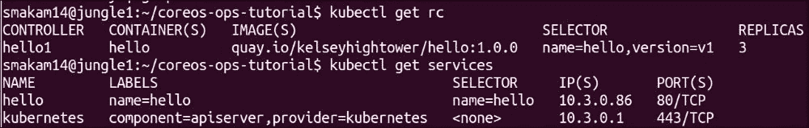

我们来创建一个新的复制控制器，并执行金丝雀模式的滚动升级。以下是新的复制`controller`，`hello2-controller.json`，使用`hello:2.0.0`容器镜像：

`apiVersion: v1 kind: ReplicationController metadata:   name: hello2   labels:     name: hello spec:   replicas: 3   selector:     name: hello     version: v2   template:     metadata:       labels:         name: hello         version: v2     spec:       containers:       - name: hello         image: quay.io/kelseyhightower/hello:2.0.0         ports:       - containerPort: 80`

以下命令执行滚动升级到`hello2`：

`kubectl rolling-update hello1 --update-period=10s -f hello2-controller.json`

`update-period`参数指定每个 Pod 升级之间的时间间隔。

以下输出显示了每个 pod 如何从 `hello1` 升级到 `hello2`。最终，`hello1` 复制控制器被删除：

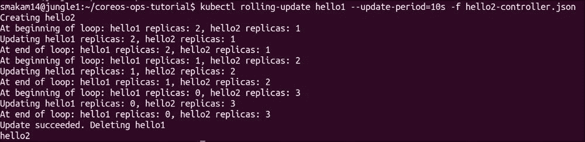

现在让我们来看一下正在运行的复制控制器。正如我们在以下输出中看到的，`hello2` RC 正在运行，而 `hello1` RC 已被删除：

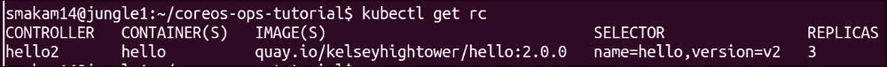

Kubernetes 还支持回滚选项。如果在滚动升级过程中检测到问题，可以停止滚动升级，并使用 `--rollback` 选项进行回滚。

容器与 PaaS

传统上，服务架构有三种类型：

+   IaaS（基础设施即服务）

+   PaaS（平台即服务）

+   SaaS（软件即服务）

随着 Docker 的出现，PaaS 层变得有些难以定义。PaaS 服务商从一开始就将容器作为其基础技术。事实上，Docker 来源于 Dotcloud 公司，该公司曾提供 PaaS 服务。

以下图示描述了新型 PaaS 模式以及它们如何与传统 PaaS 模式和 IaaS 相结合：

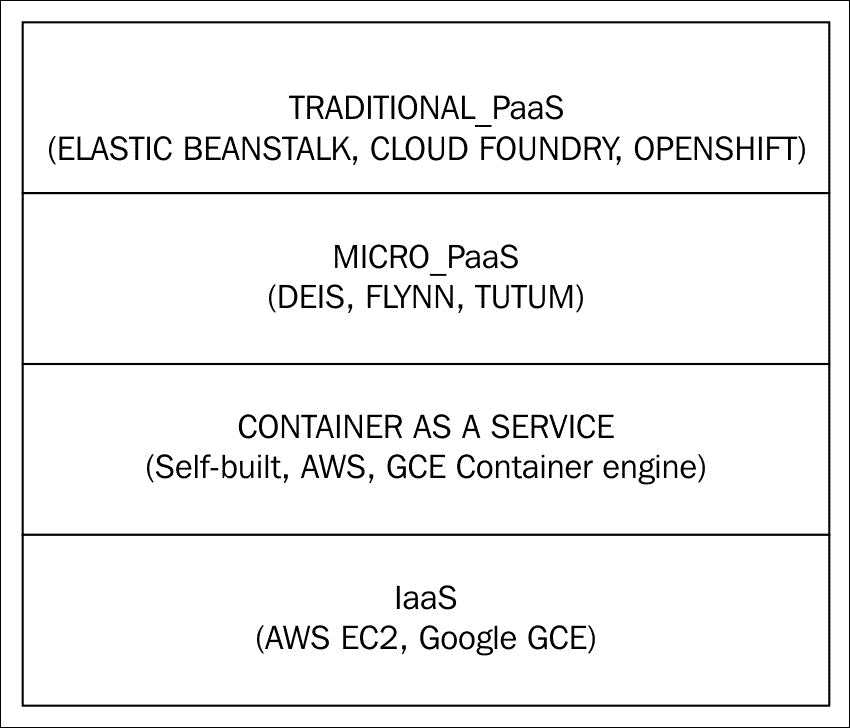

以下是关于前述图示的一些注释，以及新型 PaaS 模式如何发展：

+   PaaS 通常用于简化应用程序部署，它允许应用程序开发人员仅专注于开发应用程序，而 PaaS 提供所需的基础设施服务，如高可用性、可扩展性和网络连接。PaaS 通常用于 Web 应用程序。

+   PaaS 通常以内部分部署为容器，尽管 PaaS 用户不需要了解这一点。

+   尽管 PaaS 加速了应用程序的部署，但 PaaS 失去了灵活性。

+   传统 PaaS 系统的示例包括 AWS Elastic Beanstalk、Google GAE、Openshift 和 Cloudfoundry。

+   有一种新型的微型 PaaS，每个服务都以 Docker 容器的形式运行，这比传统的 PaaS 提供了更多的灵活性。示例有 Deis、Flynn 和 Tutum。Tutum 最近被 Docker 收购。

+   使用 Docker 容器、如 Kubernetes 这样的容器编排系统和 CoreOS 等容器操作系统，客户可以更轻松地自行构建 PaaS 系统，从而获得最大的灵活性。亚马逊和谷歌都推出了容器服务，用户可以在其中运行自己的容器。用户也可以选择在自己的基础设施上构建容器服务。

有状态与无状态容器

无状态容器通常是 Web 应用程序，如 NGINX、Node.js 等。这些容器遵循 12-factor 应用开发方法论（[`12factor.net/`](http://12factor.net/)）。这些容器可以进行水平扩展。有状态容器用于存储数据，如数据库在主机中的数据卷。常见的有状态容器包括 Redis、MySQL 和 MongoDB。在 第六章，《CoreOS 存储管理》中，我们讨论了容器数据持久化的选项。当有状态容器被迁移时，必须迁移与容器相关的数据。以下是迁移有状态容器的几种选项：

+   使用类似 Flocker 的工具，当容器在主机之间迁移时，它负责处理数据卷和数据的迁移

+   使用集群文件系统或 NFS，以便在多个主机之间共享相同的数据卷

如果实现有状态容器较为困难，另一种存储选择是将数据库与应用容器分离，并在专门的系统上运行。

安全性

以下是一些确保 CoreOS 集群安全的方法。

确保外部守护进程的安全

服务如 Etcd、Fleet 和 Docker 可以在外部访问。我们可以使用 TLS 以及客户端和服务器证书来保障客户端和服务器端的安全。在之前的章节中，我们讨论过一些关于单个服务的细节。如果我们使用 Kubernetes 这样的容器编排工具，需要确保 Kubernetes API 服务器采用 TLS 机制。

SELinux

SELinux 是 Linux 内核的一项特性，它允许在内核出现漏洞并导致黑客逃逸容器命名空间时，仍然能够隔离容器。CoreOS 808.0 版本开始支持 SELinux 集成。CoreOS 默认禁用 SELinux，但可以通过 [`coreos.com/os/docs/latest/selinux.html`](https://coreos.com/os/docs/latest/selinux.html) 中的过程启用它。存在一些限制，例如无法与 btrfs 文件系统以及共享数据卷的容器一起使用 SELinux。

容器镜像签名

Docker 支持使用 Docker 内容信任进行容器签名。Rkt 支持使用 GPG 进行镜像签名。通过这些方法，我们可以验证在 CoreOS 上运行的容器来自可靠的来源，并且容器镜像在传输过程中未被篡改。容器镜像签名的详细内容请参见 第七章，《与 CoreOS 的容器集成 – Docker 和 Rkt》。

部署与自动化

容器使得打包和运输软件变得简单，并且能够保证同一个容器在开发环境和生产环境中都能正常运行。将容器与良好的部署和自动化技术结合，将有助于更快速地部署软件。

持续集成与持续交付

传统的软件发布方法存在以下问题：

+   软件发布周期间隔较长，导致新特性需要更长的时间才能到达客户。

+   从开发阶段到生产阶段的大部分过程都是手动的。

+   考虑到不同的部署场景，保证软件在所有环境和配置中都能正常运行是非常困难的。

容器已尝试缓解这些问题。通过使用微服务和容器方法，确保应用程序在开发和生产阶段的行为类似。对于基于容器的环境，过程自动化和适当的测试仍然是必要的。

持续集成（CI）指的是开发者完成单元测试和代码提交后，自动生成可执行文件或容器镜像的过程。

持续交付（CD）指的是将开发者构建的镜像，设置预发布环境以测试镜像，并成功地部署到生产环境的过程。

以下图示展示了 CI/CD 的步骤：

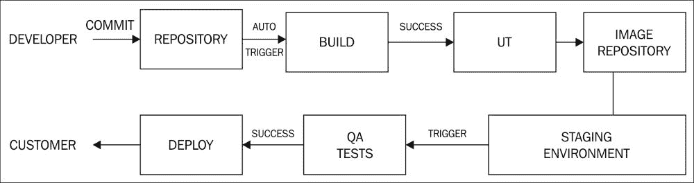

以下是上述图的一些注释：

+   上述图中的第一行捕捉了 CI 的步骤，第二行则是 CD 的步骤。

+   CI 流程从开发人员在完成基本单元测试后提交代码开始。通常，GitHub 或 Bitbucket 被用作镜像仓库。

+   镜像仓库和构建系统之间提供了钩子，可以在提交后自动触发构建。构建系统可以是像 Jenkins 这样的工具，它与不同的代码仓库集成。对于容器镜像，`Dockerfile` 和 `docker build` 将用于构建容器镜像。

+   如果需要，在将镜像提交到镜像仓库之前，可以触发自动单元测试套件。

+   构建本身需要在容器内进行，以消除对主机系统的依赖。

+   镜像仓库可以是 Docker hub 或 Docker trusted registry 等容器镜像仓库。CoreOS 支持用于容器镜像的 Quay 仓库。

+   一旦镜像推送到仓库，CD 过程就会自动触发。

+   需要根据需要在预发布环境中设置不同的容器、存储和其他非容器软件。

+   QA 测试是在预发布环境中进行的。预发布环境必须尽可能接近生产环境。

+   一旦 QA 测试成功，镜像就会部署到生产环境，如 AWS 或 GCE。如果是 PaaS 应用程序，则可以部署到 Cloudfoundry 等平台。

+   有些公司提供集成的 CI/CD 解决方案，如 Codeship、CircleCI、Shippable 等。Docker 已发布一款名为 Universal Control Plane（UCP）的企业产品，专门针对 CD 部分。Jenkins 有 Docker 插件，用于在容器中构建镜像，并提供与 Docker hub 的集成。

+   有不同的部署模式来进行升级。我们在早期章节中介绍了 Canary 部署模式。

Ansible 与 CoreOS 和 Docker 的集成

Ansible 是一个配置管理和自动化工具。Ansible 是一个非常流行的 DevOps 工具，与 Puppet 或 Chef 类似。Ansible 有一个独特的特性，即无需在设备端安装代理程序，这使其非常受欢迎。正在积极进行的工作是将 Ansible 与 CoreOS 和 Docker 集成。以下是一些集成可能性：

+   使用 Ansible 管理 CoreOS 系统。由于 CoreOS 不预装 Python 且不能直接安装软件包，因此需要一些变通方法来使 Ansible 能够管理 CoreOS 系统。

+   Ansible 有一个 Docker 模块，简化了容器管理，如启动和停止容器以及控制容器属性。

+   使用 Ansible 可以自动化 Docker 安装。除了自动化 Docker 安装外，Ansible 还可以管理其他主机基础设施，如日志记录、存储和网络。

+   Ansible 可以用来构建 Docker 镜像，而不是使用 Dockerfile。有一个`docker_image`模块（[`docs.ansible.com/ansible/docker_image_module.html`](http://docs.ansible.com/ansible/docker_image_module.html)），但建议不要使用它，因为其幂等性可能导致在某些情况下 Docker 镜像无法构建，这是一个问题。

使用 Ansible 管理 CoreOS

我按照[`coreos.com/blog/managing-coreos-with-ansible/`](https://coreos.com/blog/managing-coreos-with-ansible/)的步骤来使用 Ansible 管理 CoreOS。由于 CoreOS 中没有包管理器，因此不能直接安装 Python。在[`github.com/defunctzombie/ansible-coreos-bootstrap`](https://github.com/defunctzombie/ansible-coreos-bootstrap)中使用的方法是安装 PyPy，在用户目录中为 CoreOS 安装了一个简化的 Python 解释器，并让 Ansible 使用它。以下示例准备了 CoreOS 节点以由 Ansible 管理，并使用 Ansible 在节点中启动 Etcd 和 Fleet 服务。

以下是步骤：

1.  在主机上安装 Ansible。在我的情况下，我在 Ubuntu 14.04 机器上运行的是 Ansible 1.9 版本。

1.  创建 CoreOS 集群。

1.  运行 CoreOS 引导角色，在 CoreOS 中安装 Python 解释器并更新系统 PATH 以使用它。Ansible 角色为特定任务创建 playbooks 的抽象。

1.  运行 Ansible playbook 以启动 CoreOS 服务。Playbook 是一个 Ansible 任务列表。

设置 CoreOS 集群：

以下命令设置 CoreOS 集群。在本例中，创建了一个单节点集群：

`git clone https://github.com/defunctzombie/coreos-ansible-example.git``cd coreos-ansible-example``vagrant up`

设置无密码 SSH 访问：

使用以下命令设置无密码 SSH 访问。Ansible 需要无密码 SSH 访问。

`./bin/generate_ssh_config`

运行 CoreOS 引导角色：

以下命令使用 Ansible 角色 `defunctzombie.coreos-bootstrap` 设置一个包含 Python 的 CoreOS 节点：

`ansible-galaxy install defunctzombie.coreos-bootstrap -p ./roles``ansible-playbook -i inventory/vagrant bootstrap.yml`

我创建了以下 playbook 来启动 CoreOS 服务、Etcd2 和 Fleet：

`//Coreos_services.yml: - name: CoreOS services   hosts: web   tasks:     - name: Start etcd2       service: name=etcd2.service state=started       sudo: true       sudo_user: root      - name: Start fleet       service: name=fleet.service state=started       sudo: true       sudo_user: root`

在前面的 playbook 中，我们使用了 Ansible `service` 模块。Ansible 模块是执行特定任务的函数。Ansible 自带多个默认模块，用户可以扩展或编写自己的模块。

以下是我第一次启动 playbook 时的输出。清单文件包含了单个 CoreOS 节点的详细信息：

`ansible-playbook –i inventory/vagrant  coreos-services.yml`

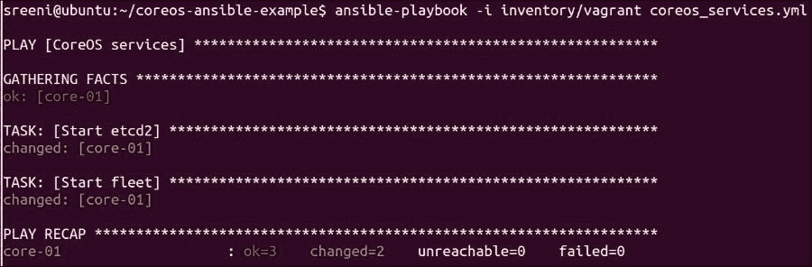

.

以下是我再次运行相同 playbook 时的输出：

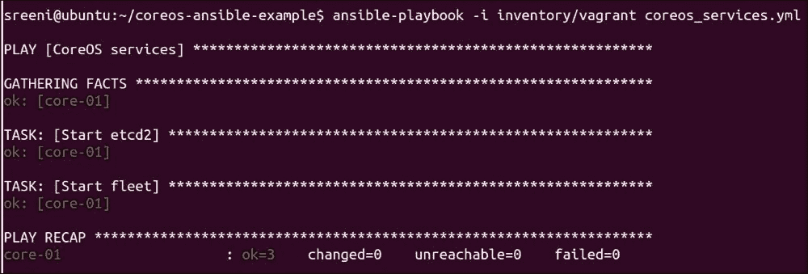

如我们所见，服务没有被重启，因为它们已经启动，并且 `changed` 变量未被设置。

以下输出展示了在 CoreOS 节点上运行的 Etcd2 和 Fleet 服务：

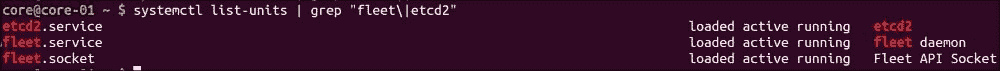

使用 Ansible 管理 Docker 容器

Ansible 为您提供了一个 Docker 模块（[`docs.ansible.com/ansible/docker_module.html`](http://docs.ansible.com/ansible/docker_module.html)），用于管理 Docker 容器。Docker 模块可以管理容器的生命周期，包括容器的启动和停止。由于 Ansible 模块是幂等的，我们可以在必要时仅拉取 Docker 镜像，并且仅在基础镜像发生变化时才重启容器。

以下是一个在我们之前运行 CoreOS 服务 playbook 的同一 CoreOS 节点上执行的 playbook。此 playbook 将在远程主机上安装 Docker 模块，并启动 NGINX 容器和包含 WordPress 和 MySQL 容器的 WordPress 服务：

`//Coreos_containers.yml: - name: CoreOS Container   hosts: web   tasks:     - name: Install docker-py       pip: name=docker-py version=1.1.0      - name: pull container       raw: docker pull nginx      - name: launch nginx container       docker:         image: "nginx"         name: "example-nginx"         ports: "8080:80"         net: bridge         state: reloaded      - name: launch mysql container       docker:         image: mysql         name: mysql         pull: always         net: bridge         state: reloaded         env:             MYSQL_ROOT_PASSWORD: mysql      - name: launch wordpress container       docker:         image: wordpress         name: wordpress         pull: always         ports: 8000:80         net: bridge         state: reloaded         links:         - "mysql:mysql"`

以下是第一次启动 playbook 时的输出：

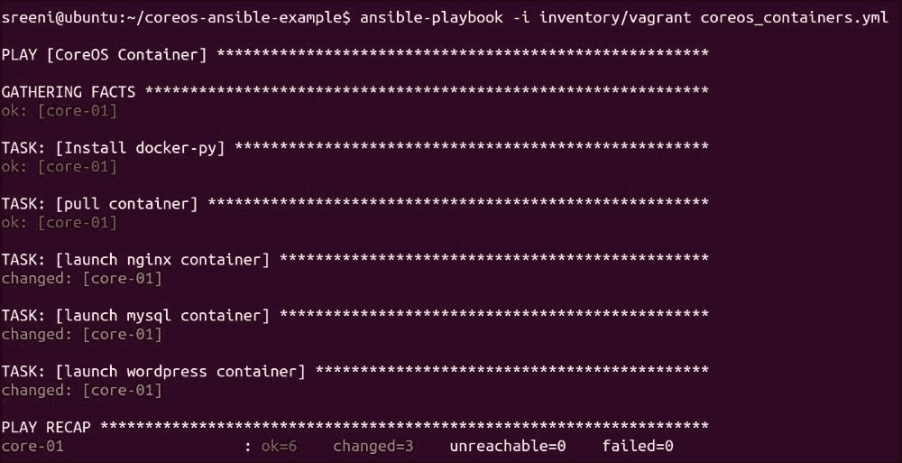

以下截图显示了相同的 playbook 再次运行时的输出。正如我们所见，`changed` 标志未设置，因为所有容器都在运行，并且没有必要进行配置更改：

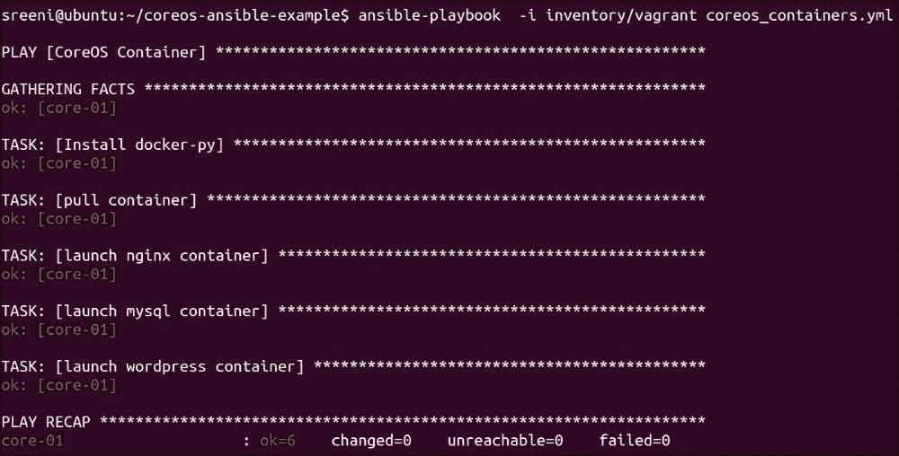

以下输出显示 CoreOS 节点中正在运行的容器：

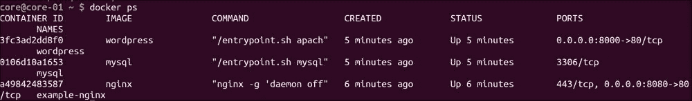

注意

注意：Ansible Docker 模块中的 `reloaded` 标志应仅在基础镜像或配置标志发生变化时重启容器。我遇到了一个 bug，容器总是被重启。这里的链接 ([`github.com/ansible/ansible-modules-core/issues/1251`](https://github.com/ansible/ansible-modules-core/issues/1251)) 说明了这个 bug。它的解决方法是指定 `net` 参数，正如我在前面的 playbook 中所做的那样。

`reloaded` 和 `pull` 标志从 Ansible 1.9 版本开始可用。

Ansible 作为容器

提供了预安装了 Ansible 的公共容器镜像。这个链接，[`hub.docker.com/r/ansible/ubuntu14.04-ansible/`](https://hub.docker.com/r/ansible/ubuntu14.04-ansible/)，是一个预安装了 Ansible 的容器镜像示例。以下输出显示了正在运行的容器中的 Ansible 版本：

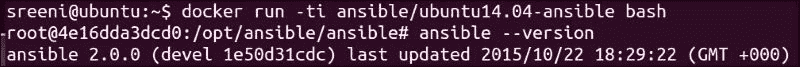

使用 Ansible 安装 Docker

Ansible 有一个角色（Roles）的概念，提供了一个良好的抽象来共享执行单一任务的 playbook 列表。Ansible 角色可以用于在 Linux 主机上安装 Docker。Ansible 角色保存在一个名为 Ansible Galaxy 的中央仓库中，可以供用户共享。Ansible Galaxy 类似于 Docker Hub，用于分享 Ansible 角色。

以下是需要执行的步骤：

1.  从 Ansible Galaxy 本地安装 Ansible 角色。

1.  创建一个包含此角色的 playbook 并运行它。

我使用这个 Galaxy 角色 ([`github.com/jamesdbloom/ansible-install-docker`](https://github.com/jamesdbloom/ansible-install-docker)) 在我的 Ubuntu 节点上安装 Docker。Galaxy 中还有一些其他角色也能完成相同的任务。

使用以下命令安装角色：

`ansible-galaxy install jamesdbloom.install-docker -p ./roles`

创建一个包含角色的 `install_docker1.yml` playbook：

`- name: install docker  hosts: ubuntu  gather_facts: True  sudo: true  roles:   - jamesdbloom.install-docker`

按如下方式运行 playbook：

`ansible-playbook -i inventory/vagrant install_docker1.yml`

以下是我的 inventory 文件：

`## inventory 文件用于 vagrant 虚拟机``ubuntu-01 ansible_ssh_host=172.13.8.101``[ubuntu]``ubuntu-01``[ubuntu:vars]``ansible_ssh_user=vagrant`

以下输出显示了 playbook 的输出：

`Ansible-playbook –i inventory/vagrant install_docker1.yml`

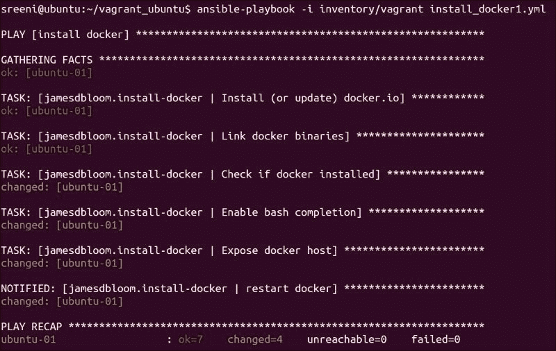

以下输出显示了使用前面的 playbook 在我的 Ubuntu 主机上安装的 Docker：

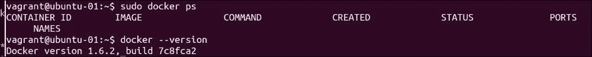

注意

注意：我遇到了重启 Docker 服务的问题。我通过 [`github.com/ansible/ansible-modules-core/issues/1170`](https://github.com/ansible/ansible-modules-core/issues/1170) 中的过程解决了此问题，其中需要删除 init 文件。我在 Ansible 1.9.1 版本中遇到此问题，但在后来的 Ansible 版本中已经修复。

CoreOS 路线图

Ignition

Ignition ([`github.com/coreos/ignition`](https://github.com/coreos/ignition)) 项目正在开发中，用于设置初始的 CoreOS 文件系统，并解决了 `coreos-cloudinit` 一些问题。`coreos-cloudinit` 程序用于设置初始的 CoreOS 系统配置。以下是 `coreos-cloudinit` 一些已知的问题：

+   动态环境变量的传递比较困难。这使得在 Openstack 环境和其他难以确定 IP 地址的环境中运行 CoreOS 变得困难。这个链接， [`groups.google.com/forum/#!topic/coreos-user/STmEU6FGRB4`](https://groups.google.com/forum/#!topic/coreos-user/STmEU6FGRB4)，描述了由于 IP 地址未被设置，`cloud-config` 服务在 Openstack 中无法正常工作的问题。

+   `cloud-config` 服务是串行处理的，我们不能指定依赖关系。

Ignition 在系统首次启动时运行一次，并写入必要的文件，如服务文件和配置数据。在第一次启动时，Ignition 从启动加载程序指定的特定位置读取配置。

Systemd 作为运行中的提供程序元数据服务文件的一部分，将创建 `coreos-metadata.target`，该文件将包含服务文件可以使用的必要环境变量。服务文件将指定此目标文件作为依赖关系，systemd 将处理这个依赖关系。

以下是一个示例 `etcd2.service` 文件，其中指定了 `coreos-metadata.service` 作为依赖关系。`/run/metadata/coreos` 环境文件将包含 `COREOS_IPV4_PUBLIC`，该变量将由 `coreos-metadata.service` 生成：

`[Unit] Requires=coreos-metadata.service After=coreos-metadata.service  [Service] EnvironmentFile=/run/metadata/coreos ExecStart= ExecStart=/usr/bin/etcd2  \     --advertise-client-urls=http://${COREOS_IPV4_PUBLIC}:2379  \     --initial-advertise-peer-urls=http://${COREOS_IPV4_LOCAL}:2380  \     --listen-client-urls=http://0.0.0.0:2379  \     --listen-peer-urls=http://${COREOS_IPV4_LOCAL}:2380  \     --initial-cluster=${ETCD_NAME}=http://${COREOS_IPV4_LOCAL}:2380`

Ignition 将与 cloudinit 向后兼容。Ignition 还没有正式发布。

DEX

DEX 是一个由 CoreOS 启动的开源项目，用于身份管理，包括认证和授权。以下是 DEX 的一些特性：

+   DEX 使用 OpenID Connect (OIDC) ([`openid.net/connect/`](http://openid.net/connect/)) 标准，构建在 OAuth 2.0 之上。OAuth 2.0 被 Google 用于登录他们的服务，如 Gmail。

+   DEX 使用连接器模块支持多个身份提供者。目前，DEX 支持使用本地服务器的本地连接器和像 Google 这样的 OIDC 连接器。

+   有计划增加授权、用户管理以及多个其他连接器，如 LDAP 和 GitHub。

+   DEX 在 Tectonic 项目中用作身份提供者。

DEX 仍处于初期阶段，正在积极开发中。

Clair

Clair 是一个由 CoreOS 启动的开源项目，用于检测容器漏洞。以下是 Clair 的一些特点：

+   Clair 扫描存储在 Quay 容器仓库中的容器镜像，检测其中的漏洞。

+   每个容器层包含该层中安装的包的信息，这些信息由相应的 Linux 包管理器提供。

+   Clair 通过查询与包管理器相关的文件，分析每个容器层，并将其与特定 Linux 发行版中的漏洞数据库进行比较，以检查该容器层是否存在漏洞。

+   Clair 会为每个容器层创建一个索引导向图，这加速了对共享层的多个容器镜像的分析。

+   Clair 当前支持 CentOS、Ubuntu 和 Debian Linux 发行版。

Clair 仍处于初期阶段，正在积极开发中。

Docker 路线图

Docker 已从提供容器运行时转变为容器平台。Docker 提供了围绕容器的开源解决方案和商业产品。

下图展示了截至 2015 年 11 月，围绕核心 Docker、安全性、编排、注册表和部署的不同 Docker 产品：

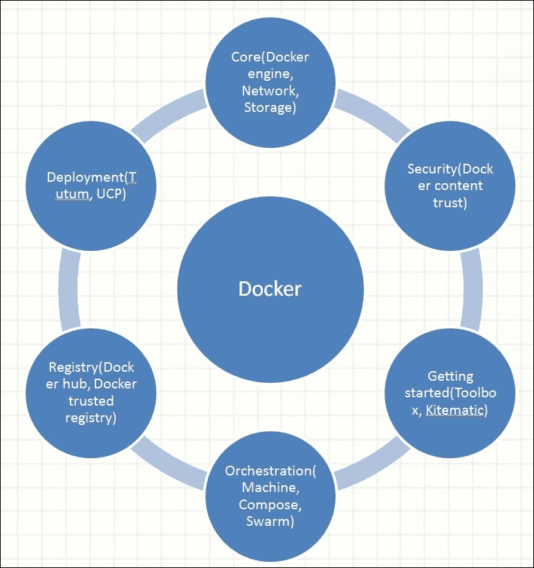

以下是 Docker 最近宣布的一些新项目。

Tutum

Tutum 使得构建、部署和管理容器化应用程序变得更加简单，并作为 SaaS 应用提供。一个应用程序可以是单容器应用或多容器应用。Tutum 与 Docker Hub 配合得很好。

UCP

UCP 是 Docker 提供的商业解决方案，用于提供本地容器部署解决方案。UCP 与 Docker 信任的注册表以及企业服务（如 LDAP 和基于角色的访问控制 RBAC）集成。UCP 还与 Docker 的所有其他服务（如网络、Compose 和 Swarm）集成。目前 UCP 正处于测试阶段。

Nautilus

该项目针对容器漏洞检测，类似于 CoreOS 的 Clair 项目。Nautilus 仍处于初期阶段。

微服务基础设施

在本节中，我们将概述微服务基础设施组件，并举例说明一些解决方案提供商。

平台选择

以下是一些微服务开发和部署过程中，客户需要做出的设计决策/平台选择。以下示例只是一个样本集，并未涵盖所有提供商。

IaaS vs PaaS：这个选择适用于本地数据中心以及云服务提供商。在前面的章节中，我们已经比较了容器和 PaaS 模型。在这里，权衡是灵活性与上市时间。

本地数据中心与云服务提供商：这主要是成本与时间的权衡。

基础操作系统：这里的选择是选择容器优化的操作系统，如 CoreOS、Rancher 或 Atomic，或传统的操作系统，如 Ubuntu 或 Fedora。对于纯微服务架构来说，容器优化的操作系统绝对值得追求。

VM 编排：VM 和容器有不同的用例，并将继续共存。在某些情况下，VM 将独立使用，或者容器将运行在 VM 之上。有一些开源解决方案，如 Openstack，以及来自 VMWare 的商业解决方案，用于 VM 编排。

容器运行时：这里的选择有 Docker、Rkt 或 LXC。

网络：容器编排系统（如 Kubernetes）通常集成了网络功能。由于网络支持是作为插件提供的，如果需要，可以用不同的实现进行替换。一些网络插件的例子包括 Weave、Calico 和 Contiv。

存储：我们需要评估专用存储与有状态容器之间的选择。有状态容器的选择包括 GlusterFS、Ceph 或 Flocker。

容器编排：这里的选择包括 Kubernetes、Docker Swarm、Mesos 等。

服务发现和 DNS：可以手动构建，使用前面部分提到的构建模块，或者选择诸如 Kubernetes 这样的容器编排系统，它已经集成了这一功能。

CI 和 CD：可以手动构建，或者使用来自 Codeship、CircleCI 或 Shippable 的打包解决方案。

监控和日志系统：例如 Sysdig 或 Logentries。我们在第十章，CoreOS 和容器 - 故障排除和调试中详细介绍了监控和日志。

解决方案提供商

正如我们在本书中所看到的，有许多硬件和软件组件构成了创建和部署微服务的基础设施。我们可以把每个组件看作是乐高积木，有许多方法将这些乐高积木组合在一起。客户有以下三种选择：

+   自行集成所有基础设施组件

+   选择集成这些组件并给出倾向性架构的解决方案提供商

+   在前两个选项之间选择混合解决方案，我们可以选择参考架构，并根据特定需求替换几个组件

以下是一些商业和开源集成解决方案。此列表不全面，其中一些解决方案并未集成所有组件：

+   来自 CoreOS 的 Tectonic Enterprise。

+   Google 容器服务

+   AWS 容器服务

+   Cisco 的 Mantl 项目

+   Openstack Magnum

总结

本章我们介绍了部署基于微服务的分布式基础设施的一些生产考量，包括 CoreOS、Docker 及其相关生态系统。谷歌、亚马逊和 Facebook 等云公司已经使用微服务和基于容器的技术相当长时间，并且他们根据自己的经验总结了最佳实践和坑点。

迄今为止的问题在于方法的重复以及缺乏共同的标准/方法。近年来的趋势是，这些公司以及许多初创公司（如 CoreOS 和 Docker）愿意开发技术并以开放的方式合作，帮助整个行业。开放源代码软件开发是这一趋势的重要推动力，许多大公司现在愿意以开放的方式开发软件。显然，围绕开源技术的商业解决方案将继续蓬勃发展，因为行业仍然需要通过盈利来生存。

容器技术和微服务是当前软件行业中最大的趋势。客户有很多选择，包括开源和商业解决方案。此时，需要将不同的技术/产品结合起来，创建一个完整的微服务基础设施解决方案。随着这些技术的成熟，具有可插拔架构的集成开源解决方案将在长期中占据优势。

参考文献

+   Registrator: [`gliderlabs.com/registrator/latest/user/quickstart/`](http://gliderlabs.com/registrator/latest/user/quickstart/)

+   Ansible 参考资料: [`docs.ansible.com/`](https://docs.ansible.com/)

+   使用 Ansible 管理 CoreOS: [`coreos.com/blog/managing-coreos-with-ansible/`](https://coreos.com/blog/managing-coreos-with-ansible/) 和 [`github.com/defunctzombie/ansible-coreos-bootstrap`](https://github.com/defunctzombie/ansible-coreos-bootstrap)

+   Ansible Docker 模块: [`docs.ansible.com/ansible/docker_module.html`](http://docs.ansible.com/ansible/docker_module.html)

+   CoreOS 和 Docker: [`developer.rackspace.com/blog/ansible-and-docker/`](https://developer.rackspace.com/blog/ansible-and-docker/) 和 [`opensolitude.com/2015/05/26/building-docker-images-with-ansible.html`](http://opensolitude.com/2015/05/26/building-docker-images-with-ansible.html)

+   使用 Docker 的 CI 流水线: [`www.docker.com/sites/default/files/UseCase/RA_CI%20with%20Docker_08.25.2015.pdf`](https://www.docker.com/sites/default/files/UseCase/RA_CI%20with%20Docker_08.25.2015.pdf)

+   容器与 PaaS: [`cloudtweaks.com/2014/12/paas-vs-docker-heated-debate/`](http://cloudtweaks.com/2014/12/paas-vs-docker-heated-debate/) 和 [`thenewstack.io/docker-is-driving-a-new-breed-of-paas/`](http://thenewstack.io/docker-is-driving-a-new-breed-of-paas/)

+   使用 SELinux 和 CoreOS 进行容器安全管理: [`coreos.com/blog/container-security-selinux-coreos/`](https://coreos.com/blog/container-security-selinux-coreos/)

+   CoreOS Ignition: [`github.com/coreos/ignition`](https://github.com/coreos/ignition) 和 [`coreos.com/ignition/docs/latest/examples.html`](https://coreos.com/ignition/docs/latest/examples.html)

+   CoreOS DEX: [`github.com/coreos/dex`](https://github.com/coreos/dex), [`coreos.com/blog/announcing-dex/`](https://coreos.com/blog/announcing-dex/)，以及 [`www.youtube.com/watch?v=QZgkJQiI_gE`](https://www.youtube.com/watch?v=QZgkJQiI_gE)

+   Clair 用于容器漏洞分析: [`coreos.com/blog/vulnerability-analysis-for-containers/`](https://coreos.com/blog/vulnerability-analysis-for-containers/) 和 [`github.com/coreos/clair`](https://github.com/coreos/clair)

+   Docker Tutum 和 UCP: [`blog.docker.com/2015/11/dockercon-eu-2015-docker-universal-control-plane/`](https://blog.docker.com/2015/11/dockercon-eu-2015-docker-universal-control-plane/), [`www.docker.com/tutum`](https://www.docker.com/tutum)，以及 [`www.docker.com/universal-control-plane`](https://www.docker.com/universal-control-plane)

+   Mantl 项目: [`github.com/CiscoCloud/microservices-infrastructure`](https://github.com/CiscoCloud/microservices-infrastructure) 和 [`mantl.io/`](http://mantl.io/)

深入阅读和教程

+   服务发现: [`progrium.com/blog/2014/07/29/understanding-modern-service-discovery-with-docker/`](http://progrium.com/blog/2014/07/29/understanding-modern-service-discovery-with-docker/)

+   使用 Docker 在 Rancher 上的 Ansible: [`rancher.com/using-ansible-with-docker-to-deploy-a-wordpress-service-on-rancher/`](http://rancher.com/using-ansible-with-docker-to-deploy-a-wordpress-service-on-rancher/)

+   有状态容器: [`techcrunch.com/2015/11/21/i-want-to-run-stateful-containers-too/`](http://techcrunch.com/2015/11/21/i-want-to-run-stateful-containers-too/)

+   Codeship、Shippable 和 CircleCI: [`scotch.io/tutorials/speed-up-your-deployment-workflow-with-codeship-and-parallelci`](https://scotch.io/tutorials/speed-up-your-deployment-workflow-with-codeship-and-parallelci), [`circleci.com/docs/docker`](https://circleci.com/docs/docker), [`blog.codeship.com/continuous-integration-and-delivery-with-docker/`](https://blog.codeship.com/continuous-integration-and-delivery-with-docker/)，以及 [`docs.shippable.com/`](http://docs.shippable.com/)

+   比较 CI/CD 解决方案: [`www.quora.com/What-is-the-difference-between-Bamboo-CircleCI-CIsimple-Ship-io-Codeship-Jenkins-Hudson-Semaphoreapp-Shippable-Solano-CI-TravisCI-and-Wercker`](https://www.quora.com/What-is-the-difference-between-Bamboo-CircleCI-CIsimple-Ship-io-Codeship-Jenkins-Hudson-Semaphoreapp-Shippable-Solano-CI-TravisCI-and-Wercker)

+   容器和 PaaS: [`labs.ctl.io/flynn-vs-deis-the-tale-of-two-docker-micro-paas-technologies/`](https://labs.ctl.io/flynn-vs-deis-the-tale-of-two-docker-micro-paas-technologies/) 和 [`www.youtube.com/watch?v=YydhEEgOoDg`](https://www.youtube.com/watch?v=YydhEEgOoDg)

+   Ignition 演示：[`www.youtube.com/watch?v=ly3uwn0HzBI`](https://www.youtube.com/watch?v=ly3uwn0HzBI)

+   Jenkins Docker 插件：[`wiki.jenkins-ci.org/display/JENKINS/Docker+Plugin`](https://wiki.jenkins-ci.org/display/JENKINS/Docker+Plugin)

+   使用 Docker 和 Jenkins 的持续交付：[`www.docker.com/sites/default/files/UseCase/RA_CI%20with%20Docker_08.25.2015.pdf`](https://www.docker.com/sites/default/files/UseCase/RA_CI%20with%20Docker_08.25.2015.pdf) 和 [`pages.cloudbees.com/rs/083-PKZ-512/images/Docker-Jenkins-Continuous-Delivery.pdf`](https://pages.cloudbees.com/rs/083-PKZ-512/images/Docker-Jenkins-Continuous-Delivery.pdf)
