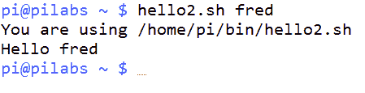
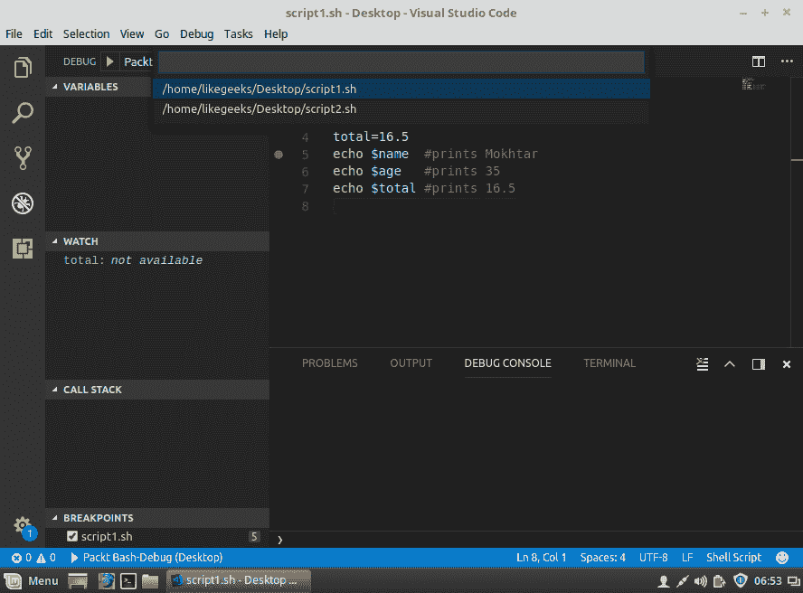

# 第一章：使用 Bash 脚本的目的与原因

欢迎来到 bash 脚本的介绍与原因。在本章中，你将了解 Linux 中的各种 shell 类型，以及为什么我们选择了 bash。你将学习什么是 bash，如何编写你的第一个 bash 脚本，并且如何运行它。同时，你将看到如何配置 Linux 编辑器，如 vim 和 nano，以便编写代码。

就像任何其他脚本语言一样，变量是编码的基本单元。你将学习如何声明变量，如整数、字符串和数组。此外，你将学习如何导出这些变量，并扩展它们在运行进程之外的作用范围。

最后，你将学会如何使用 Visual Studio Code 进行可视化调试你的代码。

本章将涵盖以下主题：

+   Linux shell 的类型

+   什么是 bash 脚本？

+   bash 命令层次结构

+   准备文本编辑器以进行脚本编写

+   创建和执行脚本

+   声明变量

+   变量作用域

+   命令替换

+   调试你的脚本

# 技术要求

你需要一台正在运行的 Linux 计算机。使用哪个发行版都无所谓，因为如今所有的 Linux 发行版都预装了 bash shell。

下载并安装 Visual Studio Code，这是 Microsoft 提供的免费软件。你可以在此下载：[`code.visualstudio.com/`](https://code.visualstudio.com/)。

你可以使用 VS Code 作为编辑器，而不是 vim 和 nano；这取决于你。

我们更倾向于使用 VS Code，因为它具有许多功能，如代码自动补全、调试等。

安装`bashdb`，这是 bash 调试插件所需的包。如果你使用的是基于 Red Hat 的发行版，可以按照以下方式安装：

```
$ sudo yum install bashdb  
```

如果你使用的是基于 Debian 的发行版，可以按以下方式安装：

```
$ sudo apt-get install bashdb 
```

从 [`marketplace.visualstudio.com/items?itemName=rogalmic.bash-debug`](https://marketplace.visualstudio.com/items?itemName=rogalmic.bash-debug) 安装 VS Code 的插件，名为 bash debug。这个插件将用于调试 bash 脚本。

本章的源代码可以在此下载：

[`github.com/PacktPublishing/Mastering-Linux-Shell-Scripting-Second-Edition/tree/master/Chapter01`](https://github.com/PacktPublishing/Mastering-Linux-Shell-Scripting-Second-Edition/tree/master/Chapter01)

# Linux shell 的类型

正如你所知道的，Linux 由一些主要部分组成，比如内核、shell 和 GUI 界面（如 Gnome、KDE 等）。

Shell 将你的命令翻译并发送到系统。大多数 Linux 发行版都预装了多种 shell。

每个 shell 都有自己的特点，其中一些在今天的开发者中非常受欢迎。以下是一些受欢迎的 shell 类型：

+   **Sh shell**：这就是所谓的 Bourne shell，最初由 Stephen Bourne 在 70 年代的 AT&T 实验室开发。这个 shell 提供了许多功能。

+   **Bash shell**：也叫做 Bourne Again Shell，这是非常流行的，并且与 sh 脚本兼容，因此你可以在不修改的情况下运行 sh 脚本。我们将在本书中使用这个 shell。

+   **Ksh shell**：也叫做 Korn shell，它与 sh 和 bash 兼容。Ksh 在 Bourne shell 的基础上提供了一些增强功能。

+   **Csh 和 tcsh**：Linux 是使用 C 语言构建的，这推动了伯克利大学的开发人员开发了一种 C 风格的 shell，其语法与 C 语言类似。Tcsh 对 csh 进行了少量增强。

现在我们知道了 shell 的类型，并且知道我们将使用 bash，那么什么是 bash 脚本呢？

# 什么是 bash 脚本？

bash 脚本的基本思路是执行多个命令，以自动化特定的任务。

正如你所知道的，你可以通过使用分号（`;`）分隔多个命令，从 shell 中运行多个命令：

```
ls ; pwd 
```

前一行是一个迷你 bash 脚本。

第一个命令运行后，紧接着是第二个命令的结果。

你在 bash 脚本中输入的每一个关键字实际上都是一个 Linux 二进制程序（程序），即使是`if`语句，或`else`或`while`循环。所有这些都是 Linux 可执行文件。

你可以说，shell 是将这些命令连接在一起的“胶水”。

# bash 命令层级

当你在 bash shell 中工作，并且坐在命令提示符前，急切地等待输入命令时，你很可能会觉得这只是输入命令并按下*Enter*键的简单问题。你应该知道这并非如此，因为事情从来都不会像我们想象的那么简单。

# 命令类型

例如，如果我们输入并执行`ls`列出文件，合理的想法是我们正在运行该命令。这是可能的，但我们经常会运行一个别名。别名存在于内存中，是对命令或带选项命令的快捷方式；这些别名在我们检查文件之前就会被使用。bash 的内建`type`命令可以在这里帮助我们。`type`命令会显示在命令行中输入的单词对应的命令类型。命令类型如下所示：

+   别名

+   函数

+   Shell 内建命令

+   关键字

+   文件

这个列表也代表了它们被搜索的顺序。正如我们所看到的，直到最后才会搜索可执行文件`ls`。

以下命令展示了`type`的简单用法：

```
$ type ls
ls is aliased to 'ls --color=auto'  
```

我们可以进一步扩展，显示给定命令的所有匹配项：

```
$ type -a ls
ls is aliased to 'ls --color=auto'
ls is /bin/ls 
```

如果我们只需要输出结果，可以使用`-t`选项。当我们需要从脚本内部测试命令类型并且只需要返回类型时，这个选项非常有用。它排除了任何多余的信息，从而使我们更容易阅读。考虑以下命令和输出：

```
$ type -t ls
alias  
```

输出清晰简洁，正是计算机或脚本所需要的。

内建的`type`命令也可以用来识别 shell 关键字，如`if`和`case`。以下命令展示了`type`在多个参数和类型中的使用：

```
$ type ls quote pwd do id  
```

命令的输出在以下屏幕截图中显示：


你也可以看到，当我们在使用`type`时遇到函数，函数定义会被打印出来。

# 命令路径

Linux 只有在提供了程序的完整路径或相对路径时，才会在`PATH`环境变量中查找可执行文件。一般情况下，当前目录不会被搜索，除非它被包含在`PATH`中。我们可以通过将当前目录添加到`PATH`变量中，从而使当前目录包含在`PATH`内。这在以下命令示例中有所展示：

```
$ export PATH=$PATH:.
```

这将当前目录添加到`PATH`变量的值中；`PATH`中的每个项目用冒号分隔。现在你的`PATH`已经更新，包含了当前工作目录，每次你更改目录时，脚本都可以轻松执行。一般来说，将脚本组织到一个有结构的目录层级中可能是个不错的主意。考虑在你的主目录下创建一个名为`bin`的子目录，并将脚本放入其中。将`$HOME/bin`添加到`PATH`变量中将使你能够通过名称而不需要文件路径找到这些脚本。

以下命令行列表将只会在目录不存在时创建该目录：

```
$ test -d $HOME/bin || mkdir $HOME/bin  
```

虽然前面的命令行列表严格来说不是必需的，但它展示了 bash 脚本编程不仅仅限于实际的脚本文件，我们可以直接在命令行中使用条件语句和其他语法。从我们的角度来看，无论你是否有`bin`目录，前面的命令都会生效。使用`$HOME`变量确保命令在不考虑当前文件系统上下文的情况下也能正常工作。

在本书中，我们会将脚本添加到`$HOME/bin`目录，这样它们就可以在任何工作目录下执行。

# 为脚本编程准备文本编辑器

在本书中，我们将使用 Linux Mint，并且包括脚本的创建和编辑。当然，你可以选择任何你希望的脚本编辑方式，可能会更喜欢使用图形化编辑器，所以我们会在 gedit 中展示一些设置。我们将在本章中稍作偏离，进入 Red Hat 系统，以展示 gedit 的屏幕截图。

此外，我们还将使用 Visual Studio Code 作为现代 GUI 编辑器来编辑和调试我们的脚本。

为了让命令行编辑器更加易用，我们可以启用选项，并通过隐藏的配置文件保持这些选项。Gedit 和其他 GUI 编辑器及其菜单也会提供类似的功能。

# 配置 vim

编辑命令行通常是必须的，它是开发者日常工作的一部分。在编辑器中设置一些常用选项，使得工作更加高效，为我们提供了所需的可靠性和一致性，这有点像脚本编程本身。我们将会在 vi 或 vim 编辑器文件`$HOME/.vimrc`中设置一些有用的选项。

我们设置的选项详细信息如下：

+   `set showmode`：确保我们看到何时处于插入模式

+   `set nohlsearch`：不突出显示我们搜索过的单词

+   `set autoindent`：我们经常缩进代码；这使我们可以在每次换行时返回到上一个缩进级别，而不是从新的一行开始。

+   `set tabstop=4`：将制表符设置为四个空格

+   `set expandtab`：将制表符转换为空格，这在文件移到其他系统时很有用

+   `syntax on`：注意，这不使用 `set` 命令，而是用于启用语法高亮

当这些选项设置好后，`$HOME/.vimrc` 文件应类似于以下内容：

```
set showmode 
set nohlsearch 
set autoindent 
set tabstop=4 
set expandtab 
syntax on 
```

# 配置 nano

nano 文本编辑器越来越重要，它是许多系统的默认编辑器。就个人而言，我不喜欢它的导航功能，或者说缺乏导航功能。它可以像 vim 一样进行自定义。这一次，我们将编辑 `$HOME/.nanorc` 文件。你编辑后的文件应类似于以下内容：

```
set autoindent 
set tabsize 4 
include /usr/share/nano/sh.nanorc 
```

最后一行启用 shell 脚本的语法高亮。

# 配置 gedit

图形编辑器，例如 gedit，可以通过首选项菜单进行配置，并且操作非常简单。

启用将制表符间距设置为 4 个空格并将制表符转换为空格，可以通过首选项 | 编辑器标签完成，具体如以下截图所示：


你可以从你在 [`www.packtpub.com`](http://www.packtpub.com) 的账户中下载示例代码文件，适用于你购买的所有 Packt Publishing 图书。如果你是在其他地方购买此书，你可以访问 [`www.packtpub.com/support`](http://www.packtpub.com/support) 并注册，将文件直接通过电子邮件发送给你。

另一个非常有用的功能可以在首选项 | 插件标签中找到。在这里，我们可以启用 Snippets 插件，用于插入代码示例。以下截图展示了这一功能：


在本书的剩余部分，我们将使用命令行和 vim 进行操作；你可以随意使用最适合你的编辑器。我们现在已经为创建良好的脚本奠定了基础，尽管在 bash 脚本中空格、制表符和空白字符并不重要，但布局清晰且间距一致的文件更易于阅读。稍后我们将学习 Python 时，你会意识到在一些编程语言中，空白字符对语言有意义，因此最好从一开始就养成良好的习惯。

# 创建和执行脚本

配置好编辑器后，我们现在可以迅速开始创建和执行脚本。如果你是带着一定经验来阅读这本书的，我们会提醒你我们将从基础开始，但也会涉及位置参数的内容；你可以按自己的节奏继续阅读。

# 你好，世界！

如你所知，几乎每个脚本都从 `Hello World` 开始，我们也不会让你失望。我们将首先创建一个新的脚本，`$HOME/bin/hello1.sh`。该文件的内容应如下所示：


我们希望你没有为此感到太困难；毕竟只有三行。我们鼓励你在阅读时运行这些示例，真正通过动手实践帮助你掌握信息。

+   `#!/bin/bash`：通常这是脚本的第一行，称为 shebang。Shebang 以注释开始，但系统仍然会使用这一行。shell 脚本中的注释以 `#` 符号开始。Shebang 告诉系统的解释器执行这个脚本。我们使用 bash 来编写 shell 脚本，必要时也可以使用 PHP 或 Perl 来编写其他脚本。如果我们没有添加这一行，命令将在当前 shell 中运行；如果我们启动另一个 shell，可能会导致问题。

+   `echo "Hello World"`：`echo` 命令将在内置的 shell 中执行，并用于写入标准输出 `STDOUT`；默认情况下输出到屏幕。要打印的信息被双引号括起来，稍后会详细讨论引号。

+   `exit 0`：`exit` 命令是内置的 shell 命令，用于退出或离开脚本。`exit` 代码作为整数参数传递。任何不为 `0` 的值都表示脚本执行时出现了某种错误。

# 执行脚本

即便脚本保存在我们的 `PATH` 环境变量中，它仍然无法作为独立脚本执行。我们需要为文件分配并执行相应的权限。对于一个简单的测试，我们可以直接用 bash 运行文件。以下命令演示了如何执行：

```
$ bash $HOME/bin/hello1.sh  
```

我们应该能看到 `Hello World` 文本显示在屏幕上。这并不是一个长期的解决方案，因为我们需要将脚本放在 `$HOME/bin` 目录中，特别是为了方便在任何位置运行脚本而无需输入完整路径。我们需要为该文件添加执行权限，代码如下所示：

```
$ chmod +x $HOME/bin/hello1.sh 
```

现在我们应该能够简单地运行脚本，如下图所示：


# 检查退出状态

这个脚本很简单，但我们仍然需要了解如何利用脚本和其他应用程序的退出码。我们之前生成的命令行列表，在创建 `$HOME/bin` 目录时，就是一个很好的例子，说明了如何使用退出码：

```
$ command1 || command 2 
```

在前面的示例中，只有在 `command1` 以某种方式失败时，才会执行 `command2`。具体来说，如果 `command1` 退出状态码不是 `0`，则会执行 `command2`。

同样，在以下示例中，只有在 `command1` 成功并返回 `0` 的退出码时，才会执行 `command2`：

```
$ command1 && command2  
```

要显式地读取脚本的退出代码，我们可以查看`$?`变量，如下例所示：

```
$ hello1.sh
$ echo $?
```

预期输出是`0`，因为这是我们在文件的最后一行添加的内容，几乎没有其他情况能导致无法到达该行。

# 确保名称唯一

我们现在可以创建并执行一个简单的脚本，但需要稍微考虑一下名称。在这种情况下，`hello1.sh`就足够好，而且不太可能与系统中的其他内容冲突。我们应该避免使用可能与现有别名、函数、关键字和构建命令发生冲突的名称，也要避免使用已经在系统中使用的程序名称。

给文件添加`sh`后缀并不能保证名称是唯一的，但在 Linux 中，我们不使用文件扩展名，后缀是文件名的一部分。这有助于为脚本提供唯一的身份标识。此外，编辑器还使用后缀帮助你识别文件并进行语法高亮。如果你记得，我们特意将语法高亮文件`sh.nanorc`添加到 nano 文本编辑器中。这些文件都与后缀和随之而来的语言相关。

回到本章中的命令层级，我们可以使用`type`来确定文件`hello.sh`的位置和类型：

```
$ type hello1.sh  #To determine the type and path
$ type -a hello1.sh  #To print all commands found if the name is NOT unique
$ type -t hello1.sh ~To print the simple type of the command  
```

这些命令和输出可以在以下截图中看到：


# Hello Dolly!

脚本中可能需要的不仅仅是一个简单的固定消息。静态消息内容确实有其用途，但通过在脚本中加入一些灵活性，我们可以使这个脚本变得更加有用。

在本章中，我们将查看可以提供给脚本的位置参数或参数，在下一章中，我们将学习如何使脚本具有交互性，并在运行时提示用户输入。

# 使用参数运行脚本

我们可以使用参数运行脚本；毕竟，这是一个自由的世界，Linux 鼓励你根据自己的需要使用代码。然而，如果脚本没有使用这些参数，那么它们会被默默地忽略。以下命令展示了脚本在使用一个参数时的运行：

```
$ hello1.sh fred  
```

脚本仍然可以运行，并且不会产生错误。输出也不会改变，依然会打印`Hello World`：

| **参数标识符** | **描述** |
| --- | --- |
| `$0` | 脚本本身的名称，通常用于使用说明中。 |
| `$1` | 一个位置参数，是传递给脚本的第一个参数。 |
| `${10}` | 当需要两个或更多数字来表示参数位置时使用。大括号用来将变量名与其他内容区分开来。期望为单一值数字。 |
| `$#` | 参数计数，当我们需要设置正确脚本执行所需的参数数量时，这个参数特别有用。 |
| `$*` | 指代所有参数。 |

为了让脚本利用该参数，我们可以稍微修改其内容。首先，复制脚本，添加执行权限，然后编辑新的`hello2.sh`：

```
$ cp $HOME/bin/hello1.sh $HOME/bin/hello2.sh
$ chmod +x $HOME/bin/hello2.sh  
```

我们需要编辑`hello2.sh`文件，以利用命令行传递的参数。以下截图展示了命令行参数的最简单使用方式，现在我们可以有一个自定义消息：


现在运行脚本；我们可以提供如下所示的参数：

```
$ hello2.sh fred
```

输出现在应该显示`Hello fred`。如果我们不提供任何参数，则变量将为空，并且只会打印`Hello`。你可以参考以下截图查看执行参数和输出：


如果我们调整脚本使用`$*`，所有参数都会打印。我们会看到`Hello`，然后是所有提供的参数列表。编辑脚本并将`echo`行替换如下：

```
echo "Hello $*"
```

这将使用以下参数执行脚本：

```
$ hello2.sh fred wilma betty barney
```

这将导致如下截图中的输出：


如果我们想打印`Hello <name>`，并且每个名字都在单独的行上，我们需要稍等一下，直到讲解循环结构。`for`循环是实现这一目标的好方法。

# 正确使用引号的重要性

到目前为止，我们已经使用了简单的双引号机制，将我们想用`echo`的字符串包裹起来。

在第一个脚本中，使用单引号或双引号并不重要。`echo "Hello World"`与`echo 'Hello World'`是完全一样的。

但在第二个脚本中情况并非如此，因此理解 bash 中可用的引用机制非常重要。

如我们所见，使用双引号`echo "Hello $1"`会输出`Hello fred`或任何提供的值。而如果我们在`echo 'Hello $1'`中使用单引号，则屏幕上打印的输出将是`Hello $1`；也就是说，我们看到的是变量名，而不是它的值。

引号的作用是保护特殊字符，例如两个单词之间的空格；这两种引号都保护了空格，防止它被误解。空格通常被 shell 视为默认字段，且由 shell 分隔。换句话说，所有字符都被 shell 读取为字面量，没有特殊含义。这会导致`$`符号打印其字面格式，而不是允许 bash 扩展其值。由于被单引号保护，bash shell 无法扩展变量的值。

这就是双引号帮助我们的地方。双引号会保护所有字符，除了`$`，从而允许 bash 扩展存储的值。

如果我们需要在引号字符串中使用字面量的`$`符号，并且需要展开变量，可以使用双引号，但要用反斜杠（`\`）转义所需的`$`符号。例如，`echo "$USER earns \$4"`如果当前用户是 Fred，将会打印`Fred earns $4`。

在命令行中尝试以下示例，使用所有引号机制。根据需要自由调整你的小时费率：

```
$ echo "$USER earns $4"
$ echo '$USER earns $4'
$ echo "$USER earns \$4"  
```

输出如下面的截图所示：


# 打印脚本名称

`$0`变量表示脚本名称，这通常用于用法说明中。由于我们尚未讨论条件语句，我们将显示脚本名称，而不是显示的名称。

编辑你的脚本，使其读起来像以下完整的`$HOME/bin/hello2.sh`代码块：

```
#!/bin/bash 
echo "You are using $0" 
echo "Hello $*" 
exit 0 
```

命令的输出如下面的截图所示：



如果我们不想打印路径，只希望显示脚本的名称，可以使用`basename`命令，它从路径中提取文件名。调整脚本，使第二行现在如下所示：

```
echo "You are using $(basename $0)"  
```

`$(....)`语法用于评估内部命令的输出。我们首先运行`basename $0`，并将结果传递给一个无名变量，由`$`表示。

新的输出将如下面的截图所示：


使用反引号也可以实现相同的结果；虽然这种方式较难阅读，但我们提到它是因为你可能需要理解并修改由其他人编写的脚本。`$(....)`语法的替代方式如下面的示例所示：

```
echo "You are using 'basename $0'"  
```

请注意，使用的字符是反引号，而*不是*单引号。在英国和美国的键盘上，它们位于左上角，紧挨数字 1 键。

# 声明变量

就像在任何编程语言中一样，你可以在 bash 脚本中声明变量。那么，这些变量是什么，使用它们有什么好处呢？

好吧，变量就像是一个占位符，用来存储一些值，以便稍后在代码中使用。

你可以在脚本中声明两种类型的变量：

+   用户定义的变量

+   环境变量

# 用户定义的变量

要声明一个变量，只需输入你想要的名称，并通过等号（`=`）设置其值。

查看这个示例：

```
#!/bin/bash 
name="Mokhtar" 
age=35 
total=16.5 
echo $name  #prints Mokhtar 
echo $age   #prints 35 
echo $total #prints 16.5 
```

如你所见，要打印变量的值，你应该在变量前面加上美元符号（`$`）。

注意，变量名和等号之间，或者等号和值之间**没有空格**。

如果你忘记了，在变量名和等号之间输入了空格，shell 会把这个变量当作命令来处理，而由于没有这样的命令，它会显示错误。

以下所有示例都是错误的声明：

```
# Don't declare variables like this: 
name = "Mokhtar" 
age =35 
total= 16.5 
```

另一种有用的用户定义变量类型是数组。一个数组可以存储多个值。所以，如果你有数十个值想要使用，应该使用数组，而不是将脚本填满多个变量。

要声明一个数组，只需将其元素放在括号中，像这样：

```
#!/bin/bash 
myarr=(one two three four five) 
```

要访问特定的数组元素，你可以像这样指定其索引：

```
#!/bin/bash 
myarr=(one two three four five) 
echo ${myarr[1]} #prints two which is the second element 
```

索引是从零开始的。

要打印数组元素，你可以使用星号，像这样：

```
#!/bin/bash 
myarr=(one two three four five) 
echo ${myarr[*]} 
```

要从数组中删除特定元素，你可以使用`unset`命令：

```
#!/bin/bash 
myarr=(one two three four five) 
unset myarr[1] #This will remove the second element 
unset myarr    #This will remove all elements 
```

# 环境变量

到目前为止，我们使用了未定义的变量，例如`$BASH_VERSION`、`$HOME`、`$PATH`和`$USER`。你可能会想，既然我们没有声明这些变量，它们是从哪里来的？

这些变量是由 shell 为你定义的，用于你的使用，它们被称为环境变量。

环境变量有很多。如果你想列出它们，可以使用`printenv`命令。

此外，你还可以通过将其指定给`printenv`命令来打印特定的环境变量：

```
$ printenv HOME
```

我们可以在 bash 脚本中使用这些变量。

请注意，所有环境变量都使用大写字母书写，所以你可以将自己的变量声明为小写字母，以便轻松区分它们与环境变量。虽然这不是强制性的，但建议这么做。

# 变量作用域

一旦你声明了变量，它将可以在整个 bash 脚本中使用，毫无问题。

假设这种情况：你将代码分成两个文件，并且你将从其中一个文件执行另一个文件，像这样：

```
# The first script 
#!/bin/bash 
name="Mokhtar" 
./script2.sh # This will run the second script 
```

第二个脚本是这样的：

```
# The script2.sh script 
#!/bin/bash 
echo $name 
```

假设你想在第二个脚本中使用`name`变量。如果你尝试打印它，什么也不会显示；这是因为变量的作用域仅限于创建它的进程。

要使用`name`变量，你可以使用`export`命令将其导出。

所以，我们的代码将是这样的：

```
# The first script 
#!/bin/bash 
name="Mokhtar" 
export name # The variable will be accessible to other processes 
./script2.sh 
```

现在，如果你运行第一个脚本，它将打印来自第一个脚本文件的名称。

请记住，第二个进程或`script2.sh`仅复制变量，并不会触及原始变量。

为了证明这一点，尝试从第二个脚本中更改该变量，并尝试从第一个脚本中访问该变量的值：

```
# The first script 
#!/bin/bash 
name="Mokhtar" 
export name 
./script2.sh 
echo $name 
```

第二个脚本将是这样的：

```
# The first script 
#!/bin/bash 
name="Another name" 
echo $name 
```

如果你运行第一个脚本，它将打印来自第二个脚本的修改后的`name`，然后它将打印第一个脚本中的原始`name`。因此，原始变量保持不变。

# 命令替换

到目前为止，我们已经看到如何声明变量。这些变量可以存储整数、字符串、数组或浮动值，正如我们所看到的，但这还不是全部。

命令替换意味着将命令执行的输出存储在一个变量中。

如你所知，`pwd`命令打印当前工作目录。所以，我们将看看如何将其值存储在一个变量中。

有两种方法可以执行命令替换：

+   使用反引号字符（`'`）

+   使用美元符号格式，如：`$()`

使用第一种方法，我们只需将命令放在两个反引号之间：

```
#!/bin/bash 
cur_dir='pwd'
echo $cur_dir 
```

第二种方法写法如下：

```
#!/bin/bash 
cur_dir=$(pwd) 
echo $cur_dir 
```

来自命令的输出可以进一步处理，并根据该输出采取相应的行动。

# 调试你的脚本

由于到目前为止我们看到的脚本非常简单，几乎没有什么会出错或需要调试的地方。随着脚本的增长，包含了带有条件语句的决策路径时，我们可能需要使用一定程度的调试来更好地分析脚本的执行过程。

Bash 提供了两个选项：`-v` 和 `-x`。

如果我们想查看脚本的详细输出和逐行评估脚本的详细信息，可以使用 `-v` 选项。这可以在 shebang 中使用，但通常直接用 bash 运行脚本更为方便：

```
$ bash -v $HOME/bin/hello2.sh fred  
```

这在这个例子中尤其有用，因为我们可以看到每个嵌入的 `basename` 命令元素是如何被处理的。第一步是移除引号，然后是括号。看看以下输出：


`-x` 选项用于显示命令在执行时的过程，它更常用。它有助于了解脚本选择了哪个决策分支。接下来的例子展示了这一点：

```
$ bash -x $HOME/bin/hello2.sh fred 
```

我们再次看到 `basename` 首先被求值，但我们看不到运行该命令时涉及的更详细的步骤。接下来的截图捕捉了命令和输出：


之前的方法可能对初学者或那些有编程背景、习惯通过视觉调试代码的人来说较为困难。

调试 Shell 脚本的另一种现代方式是使用 Visual Studio Code。

有一个叫做 **bash debug** 的插件，可以让你像调试其他编程语言一样，视觉化地调试 Bash 脚本。

你可以逐步进入、逐步跳过、添加观察点，以及做你知道的所有常规调试操作。

安装插件后，从文件菜单打开你的 `shell-scripts` 文件夹。然后你可以通过按 *Ctrl* + *Shift* + *P* 并输入以下内容来配置调试过程：

```
Debug:open launch.json
```

这将打开一个空文件；在其中输入以下配置：

```
{ 
    "version": "0.2.0", 
    "configurations": [ 

        { 
            "name": "Packt Bash-Debug", 
            "type": "bashdb", 
            "request": "launch", 
            "scriptPath": "${command:SelectScriptName}", 
            "commandLineArguments": "", 
            "linux": { 
                "bashPath": "bash" 
            }, 
            "osx": { 
                "bashPath": "bash" 
            } 
        } 
    ] 
} 
```

这将创建一个名为 `Packt Bash-Debug` 的调试配置：


现在插入一个断点并按 *F5*，或从调试菜单开始调试；它会显示你所有 `.sh` 文件的列表：



选择你要调试的部分，并在任意一行设置断点进行测试，如下图所示：


你可以在逐步调试代码行时添加观察点来查看变量的值：


请注意，你的脚本 **必须** 以 Bash shebang 开头，`#!/bin/bash`。

现在你可以享受可视化调试方法的乐趣了。祝你编码愉快！

# 总结

本章到此结束，你无疑已经觉得这对你有帮助。特别是对于那些刚刚开始学习 bash 脚本的人，本章将为你建立一个坚实的基础，帮助你更好地积累知识。

我们首先确保 bash 是安全的，不会受到嵌入函数引发的 shell-shock 影响。确保 bash 安全后，我们考虑了执行层次结构，在命令执行之前，会先检查别名、函数等；了解这一点有助于我们规划一个良好的命名结构，并找到脚本的位置。

然后我们继续介绍了不同类型的 Linux shell，并且了解了什么是 bash 脚本。

很快，我们开始编写简单的静态内容脚本，但也看到使用参数如何轻松增加灵活性。我们可以通过`$?`变量读取脚本的退出码，还可以使用`||`和`&&`创建命令行列表，这取决于前一个命令是否成功或失败。

然后我们学习了如何声明变量以及如何使用环境变量。我们确定了变量的作用域，并了解了如何将它们导出到其他进程中。

我们还学习了如何将命令的输出存储到变量中，这个过程叫做命令替换。

最后，我们通过使用 bash 选项和 VS Code 调试脚本来结束本章。对于简单的脚本来说，这其实不是必须的，但当脚本复杂度增加时，这会变得非常有用。

在下一章中，我们将创建交互式脚本，在脚本执行期间读取用户的输入。

# 问题

1.  以下代码有什么问题？我们该如何修复它？

```
#!/bin/bash 
var1 ="Welcome to bash scripting ..." 
echo $var1 
```

1.  以下代码的结果是什么？

```
#!/bin/bash 
arr1=(Saturday Sunday Monday Tuesday Wednesday) 
echo ${arr1[3]} 
```

1.  以下代码有什么问题？我们该如何修复它？

```
#!/bin/bash 
files = 'ls -la' 
echo $files 
```

1.  以下代码中的 b 和 c 变量的值是什么？

```
#!/bin/bash 
a=15 
b=20 
c=a 
b=c 
```

# 进一步阅读

请参阅以下内容，进一步阅读与本章相关的内容：

+   [`tldp.org/HOWTO/Bash-Prog-Intro-HOWTO-5.html`](http://tldp.org/HOWTO/Bash-Prog-Intro-HOWTO-5.html)

+   [`tldp.org/LDP/abs/html/varassignment.html`](http://tldp.org/LDP/abs/html/varassignment.html)

+   [`tldp.org/LDP/abs/html/declareref.html`](http://tldp.org/LDP/abs/html/declareref.html)
